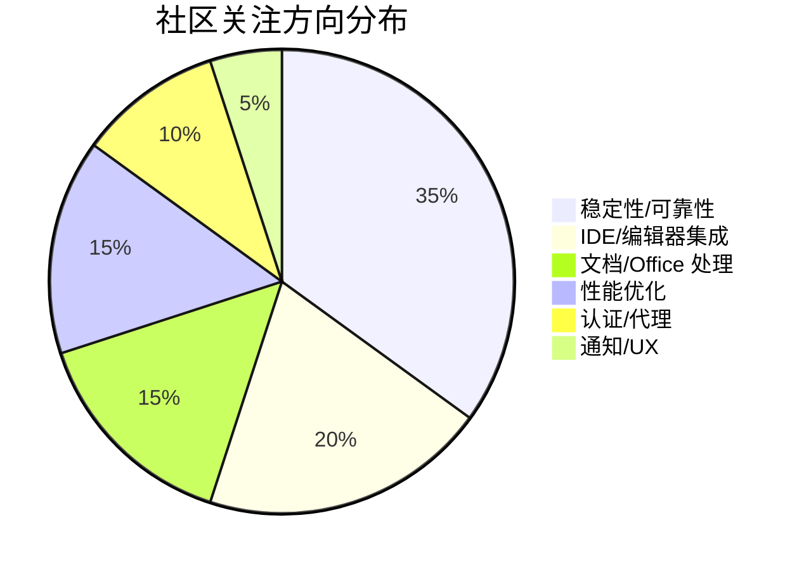

# AI CLI 工具社区动态日报 2026-03-06

> 生成时间: 2026-03-06 00:13 UTC | 覆盖工具: 7 个

- [Claude Code](https://github.com/anthropics/claude-code)
- [OpenAI Codex](https://github.com/openai/codex)
- [Gemini CLI](https://github.com/google-gemini/gemini-cli)
- [GitHub Copilot CLI](https://github.com/github/copilot-cli)
- [Kimi Code CLI](https://github.com/MoonshotAI/kimi-cli)
- [OpenCode](https://github.com/anomalyco/opencode)
- [Qwen Code](https://github.com/QwenLM/qwen-code)
- [Claude Code Skills](https://github.com/anthropics/skills)

---

## 横向对比

# AI CLI 工具生态横向对比分析报告 | 2026-03-06

---

## 1. 生态全景

当前 AI CLI 工具市场呈现**"一超多强"格局**：Claude Code 凭借 Anthropic 的模型优势占据开发者心智高地，但 Windows 平台体验短板明显；OpenAI Codex 以 Rust 重构和插件系统快速追赶；Google Gemini CLI 押注 Remote Agents 基础设施寻求差异化；中国厂商（Kimi、Qwen）在本土化体验和价格敏感市场加速渗透，而 OpenCode 以"模型中立+Zen 免费额度"策略切入，但商业模式透明度受质疑。整体技术栈向**Rust/高性能运行时**迁移，**Windows 平台平等化**成为全行业共识性技术债。

---

## 2. 各工具活跃度对比

| 工具 | Issues (今日活跃) | PRs (今日活跃) | 版本发布 | 核心动态 |
|:---|:---:|:---:|:---|:---|
| **Claude Code** | 10+ 热点 | 3 | v2.1.69 | `/claude-api` skill 上线；32K Token 超限问题成最大痛点 |
| **OpenAI Codex** | 10+ 热点 | 10+ | v0.111.0 / v0.110.0 | Fast 模式默认化；插件系统稳定版发布；计费争议 Issue 关闭 |
| **Gemini CLI** | 10+ 热点 | 10+ | v0.34.0-nightly / v0.33.0-preview.2/3 | Tracker CRUD + 可视化；Remote Agents Sprint 1 推进；安全漏洞修复 |
| **GitHub Copilot CLI** | 10+ 热点 | 2 (有效) | v0.0.422 / v0.0.422-1 | 个人级 hooks 配置；Windows 终端闪烁 bug 持续 |
| **Kimi Code CLI** | 11 | 7 | — | API 400 错误三连发；Plans 系统 Phase 4 里程碑 PR |
| **OpenCode** | 10+ | 10+ | v1.2.18 | Zen 免费额度争议发酵；Ghostty 终端方案落地 |
| **Qwen Code** | 30 | 22 | v0.12.0-nightly | 空格键输入失效等 P0 问题密集修复；v0.12.0 质量冲刺 |

> **活跃度排序**：Qwen Code > OpenCode ≈ Gemini CLI ≈ OpenAI Codex > Kimi Code CLI > Claude Code > Copilot CLI

---

## 3. 共同关注的功能方向

| 功能方向 | 涉及工具 | 具体诉求 |
|:---|:---|:---|
| **Windows 平台一等公民** | **全部 7 款工具** | Claude Code: 安装重定向、Token 超限高频复现；Codex: WSL 集成、权限沙箱；Gemini: 原生沙箱缺失；Copilot: 终端闪烁、PowerShell 5.1 阻断；Kimi: 启动性能；OpenCode: Defender 误报；Qwen: 空格键失效、CRLF 解析 |
| **上下文/内存管理** | Claude Code, Gemini CLI, Kimi Code CLI, Qwen Code | 长会话 Token 超限（Claude #24055）、压缩状态丢失（Gemini #21345）、内存泄漏（Qwen #2128）、UI History 无上限累积 |
| **IDE 深度集成** | Claude Code, OpenAI Codex, Copilot CLI, Kimi Code CLI, Qwen Code | diff/approval 工作流外迁（Codex #2998）、VS Code 扩展稳定性（Copilot #12661）、Zed IDE 支持（Kimi #1284）、JetBrains/VS Code 优化（Qwen） |
| **会话生命周期管理** | Claude Code, Gemini CLI, OpenCode, Qwen Code | 跨设备会话恢复（Claude #30869）、归档会话查看（OpenCode #6680/#12888）、ephemeral 执行（Qwen #4489） |
| **计费透明度** | OpenAI Codex, OpenCode | 额度计算黑箱（Codex #13186/#13568）、Zen 免费额度终止无通知（OpenCode #15714） |

---

## 4. 差异化定位分析

| 工具 | 核心功能侧重 | 目标用户画像 | 技术路线特征 |
|:---|:---|:---|:---|
| **Claude Code** | Agent 自主执行、Plan 模式、上下文感知 | 追求"自动驾驶"体验的专业开发者 | Node.js/Bun 运行时；深度绑定 Claude 模型；TUI 重交互 |
| **OpenAI Codex** | 企业级稳定性、插件生态、多智能体流程 | 企业团队、需要可扩展架构的组织 | **Rust 全量重构**；Fast/Standard 双模式；OTEL 可观测性优先 |
| **Gemini CLI** | Remote Agents、Tracker 可视化、Google 生态整合 | 云原生开发者、需要后台任务能力的场景 | Node.js；Remote Agents 基础设施先行；与 Google Cloud 深度集成 |
| **Copilot CLI** | GitHub 工作流原生集成、企业合规、SDK 可嵌入 | GitHub 重度用户、企业安全合规场景 | Rust + Electron；GitHub 认证体系；从独立工具向 **Agent 基础设施**演进 |
| **Kimi Code CLI** | Plans 项目管理、OpenAI 兼容层、中文场景优化 | 中国开发者、多模型混合部署需求 | Python；Plans 系统向 **项目管理平台**演进；AgentHooks 安全门禁 |
| **OpenCode** | 模型中立、Zen 免费额度、桌面端体验 | 价格敏感用户、多模型尝鲜者 | Rust + TUI；Ghostty 终端方案；**商业模式待验证** |
| **Qwen Code** | 百炼/coding-plan 中文优化、本土化 LSP | 中国开发者、阿里云生态用户 | Rust； Kitty CSI-u 等终端协议深度适配；国际化 Insight 报告 |

---

## 5. 社区热度与成熟度

### 社区热度矩阵

```
高活跃度 │  Qwen Code (30 Issues/22 PRs) ── 快速迭代期
         │  OpenCode (商业模式争议驱动讨论)
         │  Gemini CLI (Remote Agents 战略投入)
         │  OpenAI Codex (Rust 重构 + 插件系统)
         │
中活跃度 │  Kimi Code CLI (Plans 系统里程碑)
         │  Claude Code (Issue 反馈为主，PR 贡献少)
         │
低活跃度 │  Copilot CLI (微软内部开发为主，社区 PR 极少)
         └──────────────────────────────────────────────
           早期        成长期        成熟期
                    产品阶段 →
```

### 成熟度评估

| 工具 | 成熟度 | 关键指标 |
|:---|:---|:---|
| **Claude Code** | ⭐⭐⭐⭐☆ 成熟期 | 功能完整度高，但 Windows 技术债拖累；社区贡献以 Issue 为主，外部 PR 极少 |
| **OpenAI Codex** | ⭐⭐⭐⭐☆ 快速成熟 | Rust 重构完成度 80%+，插件系统进入稳定版；企业级特性（OTEL、网络白名单）领先 |
| **Copilot CLI** | ⭐⭐⭐⭐☆ 成熟期 | 功能稳定，但创新放缓；社区参与度低，依赖微软内部迭代 |
| **Gemini CLI** | ⭐⭐⭐☆☆ 成长期 | Remote Agents 基础设施投入大，但基础体验（启动性能、Windows 支持）仍需补课 |
| **Kimi Code CLI** | ⭐⭐⭐☆☆ 成长期 | Plans 系统差异化明显，但 API 稳定性（400 错误）和认证可靠性存疑 |
| **OpenCode** | ⭐⭐⭐☆☆ 成长期 | TUI 体验精致，但 Zen 商业模式透明度危机；模型适配层健壮性不足 |
| **Qwen Code** | ⭐⭐☆☆☆ 早期 | v0.12.0 质量冲刺阶段，P0 问题密集；本土化深度有优势，但稳定性差距明显 |

---

## 6. 值得关注的趋势信号

| 趋势信号 | 数据支撑 | 开发者参考价值 |
|:---|:---|:---|
| **Rust 成为 AI CLI 新默认** | Codex 全量重构、Copilot CLI、OpenCode、Qwen Code 均采用 Rust；Claude Code 因 Bun 崩溃被诟病 | 新入局者技术选型：Rust 在性能、跨平台一致性、安全性的综合优势确立；Node.js/Python 适合快速验证但需承担长期技术债 |
| **"工具内构建工具"成产品方向** | Claude `/claude-api` skill、Codex 插件系统、Kimi AgentHooks | 开发者应关注工具的**可扩展性架构**，评估其是否支持自定义技能、MCP 集成、hooks 机制 |
| **Windows 平台平等化是确定性机会** | 全部 7 款工具均有高频 Windows Issue；Qwen 30 Issues 中 40%+ 涉 Windows | Windows 开发者体验是**差异化竞争高地**；企业采购决策中 Windows 兼容性权重上升 |
| **Remote Agents / 后台任务能力分化** | Gemini CLI 3 个 Epic 级 Sprint 押注 Remote Agents；Claude Code Cowork 受限 | 需要**异步执行、长时运行、跨会话持久化**的场景，Gemini 可能形成先发优势 |
| **计费模式透明度成为信任基础设施** | Codex #13186 101 评论、OpenCode Zen 争议 | 免费额度策略需**可预测、可审计**；开发者应优先选择提供用量明细、降级策略清晰的工具 |
| **会话管理从"功能"进化为"平台"** | Kimi Plans Phase 4 含完整 Web UI、Claude 跨设备同步需求 | 长期项目协作、团队知识沉淀场景，评估工具的**会话可移植性、归档检索、计划版本管理**能力 |

---

> **决策建议**：追求稳定生产环境优先评估 **Claude Code**（macOS/Linux）或 **OpenAI Codex**（企业合规）；Windows 重度用户关注 **Qwen Code** 的修复进展或 **OpenCode** 的 TUI 体验；需要后台任务/Remote Agents 能力提前布局 **Gemini CLI**；成本敏感且接受国产模型可考虑 **Kimi Code CLI** 的 Plans 系统，但需监控 API 稳定性。

---

## 各工具详细报告

<details>
<summary><strong>Claude Code</strong> — <a href="https://github.com/anthropics/claude-code">anthropics/claude-code</a></summary>

## Claude Code Skills 社区热点

> 数据来源: [anthropics/skills](https://github.com/anthropics/skills)

# Claude Code Skills 社区热点报告（2026-03-06）

---

## 1. 热门 Skills 排行

| 排名 | Skill | 功能概述 | 状态 | 链接 |
|:---|:---|:---|:---|:---|
| 1 | **document-typography** | AI 生成文档的排版质量控制：防止孤行、寡行、编号错位等常见排版问题 | 🟡 Open | [#514](https://github.com/anthropics/skills/pull/514) |
| 2 | **skill-quality-analyzer / skill-security-analyzer** | 元技能：对 Skills 本身进行质量与安全审计（结构、文档、漏洞扫描） | 🟡 Open | [#83](https://github.com/anthropics/skills/pull/83) |
| 3 | **frontend-design** (改进版) | 前端设计技能优化：提升指令清晰度与可操作性，确保单轮对话可执行 | 🟡 Open | [#210](https://github.com/anthropics/skills/pull/210) |
| 4 | **SAP-RPT-1-OSS predictor** | 对接 SAP 开源表格基础模型，实现企业数据预测分析 | 🟡 Open | [#181](https://github.com/anthropics/skills/pull/181) |
| 5 | **codebase-inventory-audit** | 代码库全面审计：识别孤儿代码、未使用文件、文档缺口、基础设施膨胀 | 🟡 Open | [#147](https://github.com/anthropics/skills/pull/147) |
| 6 | **shodh-memory** | AI Agent 持久化记忆系统，跨对话维护上下文 | 🟡 Open | [#154](https://github.com/anthropics/skills/pull/154) |
| 7 | **AURELION skill suite** | 四件套认知框架：结构化思维模板、顾问模式、Agent 编排、记忆管理 | 🟡 Open | [#444](https://github.com/anthropics/skills/pull/444) |
| 8 | **Google Workspace 集成套件** | 6 个 Agent Skills：邮件分类、起草、日历查询、任务管理等 | 🟡 Open | [#299](https://github.com/anthropics/skills/pull/299) |

---

## 2. 社区需求趋势

| 方向 | 代表 Issue/PR | 核心诉求 |
|:---|:---|:---|
| **Agent 治理与安全** | [#412](https://github.com/anthropics/skills/issues/412) | 企业级 AI Agent 系统的策略执行、威胁检测、信任评分、审计追踪 |
| **MCP 协议集成** | [#16](https://github.com/anthropics/skills/issues/16), [#369](https://github.com/anthropics/skills/issues/369) | 将 Skills 暴露为 MCP 服务器，实现跨工具标准化调用 |
| **Skills 包管理器** | [#185](https://github.com/anthropics/skills/issues/185) | 类似 npm 的依赖管理、版本控制、分发机制 |
| **AWS Bedrock 兼容** | [#29](https://github.com/anthropics/skills/issues/29) | 企业私有化部署需求，突破 Claude 官方平台限制 |
| **技能质量元工具** | [#202](https://github.com/anthropics/skills/issues/202) | 官方 `skill-creator` 需重构为高效执行模式，而非教学文档 |
| **企业 ERP/CRM 集成** | [#181](https://github.com/anthropics/skills/pull/181) | SAP、Salesforce 等业务系统深度对接 |

---

## 3. 高潜力待合并 Skills

| Skill | 关键价值 | 阻塞因素 | 链接 |
|:---|:---|:---|:---|
| **document-typography** | 解决所有 AI 生成文档的排版通病，普适性极高 | 刚提交（3月4日），需官方评审 | [#514](https://github.com/anthropics/skills/pull/514) |
| **skill-quality-analyzer** | 首个"评价技能"的元技能，填补生态空白 | 长期悬置（2025-11），可能需架构调整 | [#83](https://github.com/anthropics/skills/pull/83) |
| **frontend-design** | Anthropic 官方博客背书的设计改进 | 迭代中，需确认与现有 skill 的合并策略 | [#210](https://github.com/anthropics/skills/pull/210) |
| **feature-dev 工作流修复** | 修复 TodoWrite 覆盖导致的阶段跳过 Bug | 技术修复类 PR，合并优先级高 | [#363](https://github.com/anthropics/skills/pull/363) |
| **CONTRIBUTING.md** | 社区健康度从 25% 提升的关键基础设施 | 文档类，通常快速合并 | [#509](https://github.com/anthropics/skills/pull/509) |

---

## 4. Skills 生态洞察

> **核心诉求：从"个人效率工具"向"企业级 Agent 基础设施"跃迁**——社区正密集涌现记忆持久化、治理审计、ERP 集成、MCP 标准化等方向，标志着 Skills 生态从单点功能扩展进入系统化、可运营的企业 AI 架构阶段。

---

*报告基于 github.com/anthropics/skills 公开数据，截止 2026-03-06*

---

# Claude Code 社区动态日报 | 2026-03-06

---

## 1. 今日速览

Anthropic 今日发布 **v2.1.69**，带来重磅功能 `/claude-api` skill，可直接在 Claude Code 中构建基于 Claude API 的应用程序。社区持续聚焦 **Windows 平台稳定性** 与 **上下文管理** 两大痛点，输出 Token 超限问题（#24055）讨论热度破百，成为当前最紧迫的技术挑战。

---

## 2. 版本发布

### [v2.1.69](https://github.com/anthropics/claude-code/releases/tag/v2.1.69)

| 更新项 | 说明 |
|--------|------|
| **`/claude-api` skill** | 新增核心能力：直接在 Claude Code 中使用 Claude API 和 Anthropic SDK 构建应用程序，降低 API 开发门槛 |
| **Bash 模式优化** | 空 Bash 提示符（`!`）下按 `Ctrl+U` 可退出 Bash 模式，与 `escape` 和 `backspace` 行为一致 |
| **TUI 交互增强** | 数字小键盘支持 Claude 面试问题的选项选择 |

---

## 3. 社区热点 Issues

| # | Issue | 重要性 | 社区反应 |
|---|-------|--------|---------|
| [#24055](https://github.com/anthropics/claude-code/issues/24055) | **API Error: 输出 Token 超限 32K** | 🔴 **关键瓶颈** | 101 评论，72 👍。Windows 平台高频复现，直接影响长任务完成能力，开发者呼吁紧急修复或提供流式输出替代方案 |
| [#28892](https://github.com/anthropics/claude-code/issues/28892) | **Windows 安装被重定向至 Microsoft Store** | 🔴 安装阻断 | 57 评论，19 👍。新用户获取路径受阻，影响 Windows 市场渗透 |
| [#23377](https://github.com/anthropics/claude-code/issues/23377) | **GitHub Issue Prompt 过长导致崩溃** | 🟡 内存管理 | 23 评论，17 👍。大上下文场景下的内存优化需求明确 |
| [#10168](https://github.com/anthropics/claude-code/issues/10168) | **用户输入事件钩子（UserInputRequired）** | 🟡 扩展性需求 | 21 评论，34 👍。自动化工作流集成的高票功能请求，长期悬而未决 |
| [#29583](https://github.com/anthropics/claude-code/issues/29583) | **Cowork 无法访问 Windows 非主目录** | 🟡 企业场景受限 | 18 评论。多驱动器/企业环境部署障碍 |
| [#25979](https://github.com/anthropics/claude-code/issues/25979) | **Vertex API 流连接挂起无超时** | 🟡 可靠性缺陷 | 10 评论。生产环境稳定性隐患，需网络层容错机制 |
| [#9340](https://github.com/anthropics/claude-code/issues/9340) | **添加 `--quiet` 静默模式** | 🟢 体验优化 | 10 评论，15 👍。减少工具调用输出的视觉噪音， advisory agent 场景刚需 |
| [#29298](https://github.com/anthropics/claude-code/issues/29298) | **Bash 工具在管道中清空环境变量** | 🟢 隐蔽 Bug | 6 评论，4 👍。影响复杂 shell 脚本的正确执行 |
| [#30848](https://github.com/anthropics/claude-code/issues/30848) | **v2.1.68 启动时打开 3 个空白 VS Code 窗口** | 🟢 回归问题 | 6 评论，5 👍。IDE 集成质量下降，3月4日更新引入 |
| [#11239](https://github.com/anthropics/claude-code/issues/11239) | **Plan agent 错误使用主分支路径而非 worktree** | 🟢 Git 工作流缺陷 | 6 评论，7 👍。影响 git worktree 用户的计划模式体验 |

---

## 4. 重要 PR 进展

| # | PR | 状态 | 功能/修复内容 |
|---|-----|------|--------------|
| [#31204](https://github.com/anthropics/claude-code/pull/31204) | **AI Learning Roadmap 交互式画布应用** | 🆕 Open | 基于 React + Vite 的完整学习路径可视化工具，支持节点-边图系统与 localStorage 持久化 |
| [#31141](https://github.com/anthropics/claude-code/pull/31141) | **改进 test-hook.sh 的错误处理与输出** | 🆕 Open | 提升钩子测试脚本的可调试性 |
| [#16132](https://github.com/anthropics/claude-code/pull/16132) | **修复 dev container 中的 `/install-github-app`** | 🔄 更新 | 解决 `gh` CLI 认证状态在容器内丢失的问题，添加官方 GitHub CLI 仓库源 |

> 注：当日活跃 PR 仅 3 条，社区贡献以 Issue 反馈为主

---

## 5. 功能需求趋势

基于 50 条近期 Issue 分析，社区关注焦点呈现四大方向：

| 趋势方向 | 代表 Issue | 需求强度 |
|---------|-----------|---------|
| **🪟 Windows 平台深耕** | #24055, #28892, #29583, #30196, #31283 | ⭐⭐⭐⭐⭐ 最高优先级 |
| **📏 上下文/内存管理** | #24055, #23377, #30397, #29957 | ⭐⭐⭐⭐⭐ 核心痛点 |
| **🔧 IDE 集成质量** | #30848, #31282, #10168 | ⭐⭐⭐⭐ 体验关键 |
| **🏢 企业/Cowork 场景** | #29583, #30112, #30861, #31215 | ⭐⭐⭐⭐ 增长市场 |

**新兴信号**：`/claude-api` skill 的发布验证了 **"工具内构建工具"** 的产品方向，社区对 #31279（PostToolUse hook）等扩展机制的需求表明开发者希望更深度的定制化能力。

---

## 6. 开发者关注点

### 🔥 高频痛点

| 问题 | 影响范围 | 开发者诉求 |
|------|---------|-----------|
| **32K 输出 Token 硬限制** | 长代码生成、文档编写、复杂分析 | 提升至 64K/128K，或支持自动分块流式输出 |
| **Windows 二等公民体验** | 安装、路径、TUI 冻结、Bun 崩溃 | 与 macOS/Linux 功能对等，企业环境适配 |
| **上下文压缩的"最后 5%"** | 长会话突然中断 | 更智能的预压缩策略，保留关键决策点 |

### 💡 创新需求

- **#31279 [PostToolUse hook]**：大输出自动摘要，避免上下文爆炸
- **#30869 [会话解归档]**：桌面端与 CLI 会话互通
- **#31245 [Plan 模式多计划支持]**：迭代规划时的版本管理

### 📊 数据洞察

- **Windows 相关 Issue 占比**：~35%（显著高于用户基数比例）
- **"has repro" 标签 Issue**：社区协作质量高，但修复周期仍是悬念
- **无效/重复 Issue 比例**：约 15%，提示需改进问题引导文档

---

> 📌 **日报来源**：github.com/anthropics/claude-code | 数据截止：2026-03-06

</details>

<details>
<summary><strong>OpenAI Codex</strong> — <a href="https://github.com/openai/codex">openai/codex</a></summary>

# OpenAI Codex 社区动态日报 | 2026-03-06

## 今日速览

今日 Codex 迎来 **v0.111.0** 正式发布，Fast 模式成为默认配置，同时插件系统（v0.110.0）进入稳定版本。社区持续聚焦**用量计费异常**与**Windows 平台稳定性**两大核心痛点，多个高频 Issue 在 24 小时内获得官方关闭或更新。

---

## 版本发布

### [rust-v0.111.0](https://github.com/openai/codex/releases/tag/rust-v0.111.0) | 2026-03-05
| 特性 | 说明 |
|:---|:---|
| **Fast 模式默认启用** | TUI 头部实时显示 Fast/Standard 模式状态，无需手动切换 |
| **js_repl 增强** | 支持动态导入本地 `.js` / `.mjs` 文件，便于复用工作区脚本 |

### [rust-v0.110.0](https://github.com/openai/codex/releases/tag/rust-v0.110.0) | 2026-03-05
| 特性 | 说明 |
|:---|:---|
| **插件系统上线** | 可从配置或本地市场加载 skills、MCP entries、app connectors；支持通过 app server 安装端点启用插件 |
| **TUI 多智能体流程** | 扩展审批提示与 `/agent` 命令支持 |

---

## 社区热点 Issues（Top 10）

| # | Issue | 状态 | 评论 | 核心看点 |
|:---|:---|:---|:---|:---|
| [#13186](https://github.com/openai/codex/issues/13186) | Plus 用户用量计量异常：小任务消耗 5h+ 周额度 | **CLOSED** | 101 | 社区最高关注计费公平性，官方已介入关闭 |
| [#10410](https://github.com/openai/codex/issues/10410) | macOS Intel (x86_64) 桌面端支持请求 | OPEN | 98 | 121 👍 高票功能请求，企业遗留设备兼容痛点 |
| [#12764](https://github.com/openai/codex/issues/12764) | CLI 401 Unauthorized 认证失败 | OPEN | 38 | 影响 Azure/企业用户，认证链路稳定性待修复 |
| [#2998](https://github.com/openai/codex/issues/2998) | IDE 集成 diff/approval 流程 | OPEN | 36 | 104 👍 长期热门需求，终端外的工作流整合 |
| [#13568](https://github.com/openai/codex/issues/13568) | 用量下降过快：2X 额度被降级至 1X | OPEN | 29 | 新 Issue，用户反馈计费策略突变 |
| [#3355](https://github.com/openai/codex/issues/3355) | MacBook 睡眠后请求失败 | OPEN | 23 | 长会话稳定性经典问题，休眠恢复机制缺陷 |
| [#9115](https://github.com/openai/codex/issues/9115) | Zellij 终端复用器不兼容 | OPEN | 17 | 22 👍 高级终端用户工作流阻断 |
| [#11984](https://github.com/openai/codex/issues/11984) | 长会话 UI 卡顿严重 | OPEN | 15 | Electron 性能瓶颈，Pro 用户生产力受损 |
| [#12661](https://github.com/openai/codex/issues/12661) | Markdown file:// 链接误用浏览器打开 | OPEN | 14 | 18 👍 Windows VS Code 扩展体验断裂 |
| [#5778](https://github.com/openai/codex/issues/5778) | Azure 双中断后 400 错误："reasoning item without required following item" | OPEN | 13 | Azure OpenAI 企业场景可靠性问题 |

---

## 重要 PR 进展（Top 10）

| # | PR | 作者 | 核心内容 |
|:---|:---|:---|:---|
| [#13644](https://github.com/openai/codex/pull/13644) | fix: preserve zsh-fork escalation fds in unified-exec PTYs | @bolinfest | 修复 zsh-fork 在统一执行 PTY 中的文件描述符传递，解决交互式 shell 会话不稳定问题 |
| [#13432](https://github.com/openai/codex/pull/13432) | refactor: route zsh-fork through unified exec | @bolinfest | 将 zsh-fork 路由至统一执行层，保持跨长会话的审批行为一致性 |
| [#13645](https://github.com/openai/codex/pull/13645) | Add timestamped SQLite /feedback logs | @charley-oai | 无 schema 迁移前提下为反馈日志添加时间戳，保留现有字节限制行为 |
| [#12752](https://github.com/openai/codex/pull/12752) | fix: merge managed and user network allowlists | @viyatb-oai | 托管域名白名单与用户配置合并，而非替换，增强企业策略灵活性 |
| [#13626](https://github.com/openai/codex/pull/13626) | feat(otel): safe tracing | @owenlin0 | 分离 OTEL logs/traces/metrics 导出配置，避免单一配置点故障 |
| [#13611](https://github.com/openai/codex/pull/13611) | [telemetry] item level metadata | @rhan-oai | 引入用户消息项元数据（plan mode、escalation status、sandbox policy 等），支持更精细的遥测分析 |
| [#13643](https://github.com/openai/codex/pull/13643) | Promote image_detail_original to experimental | @fjord-oai | 将 `image_detail_original` 提升至实验性功能，工具生成图像以原始分辨率发送 |
| [#13499](https://github.com/openai/codex/pull/13499) | core/protocol: add structured macOS additional permissions | @celia-oai | 强类型 macOS 扩展权限，合并至沙箱执行与 Seatbelt 配置文件 |
| [#13640](https://github.com/openai/codex/pull/13640) | app-server: Add streaming and tty/pty capabilities to `command/exec` | @euroelessar | 为命令执行添加流式 stdin/stdout/stderr、PTY 支持及环境变量覆盖 |
| [#13636](https://github.com/openai/codex/pull/13636) | feat(tui): migrate cli surfaces to in-process app-server | @fcoury | TUI CLI 表面迁移至进程内 app-server 架构，减少 IPC 开销 |

---

## 功能需求趋势

| 方向 | 热度 | 典型表现 |
|:---|:---|:---|
| **计费透明度与公平性** | 🔥🔥🔥 | #13186 #13568 #13609 集中爆发，用户质疑额度计算与降级策略 |
| **Windows 平台一等公民** | 🔥🔥🔥 | 6+ 个活跃 Issue 涉及 WSL 集成、权限沙箱、路径处理、扩展稳定性 |
| **IDE 深度集成** | 🔥🔥 | #2998 #12661 #13277 要求 diff/approval 工作流入驻 VS Code，而非仅终端 |
| **企业/ Azure 部署** | 🔥🔥 | #12764 #5778 #9936 #13232 认证、流中断、非 ASCII 头处理等问题 |
| **长会话稳定性** | 🔥🔥 | #3355 #11984 睡眠恢复、内存泄漏、UI 卡顿影响生产力场景 |
| **终端/ shell 生态兼容** | 🔥 | #9115 #13644 Zellij、tmux 等复用器支持，zsh-fork 可靠性 |

---

## 开发者关注点

### 🔴 高频痛点
1. **用量计费黑箱** — 小任务异常消耗大额度的报告反复出现，用户难以预测成本（#13186 #13568）
2. **Windows 体验落差** — 相比 macOS/Linux，Windows 桌面端和 VS Code 扩展存在权限、路径、流式更新等多类缺陷
3. **认证链路脆弱** — 401/流中断错误在企业网络/Azure 场景下频发，缺乏优雅重试

### 🟡 能力缺口
4. **会话管理** — 缺乏树形对话分支（#12450）、跨设备会话恢复、长会话性能优化
5. **可观测性** — OTEL 配置分散，调试工具链待完善（#13626 开始 addressing）

### 🟢 积极信号
- 插件系统 v0.110.0 标志着**生态扩展**正式起步
- Fast 模式默认化显示**性能优化**进入产品化阶段
- 多个核心 PR 聚焦**企业级稳定性**（网络白名单合并、macOS 权限结构化、流式命令执行）

</details>

<details>
<summary><strong>Gemini CLI</strong> — <a href="https://github.com/google-gemini/gemini-cli">google-gemini/gemini-cli</a></summary>

# Gemini CLI 社区动态日报 | 2026-03-06

## 今日速览

今日 Gemini CLI 密集发布 v0.33.0-preview.2/3 及 v0.34.0-nightly 三个版本，重点修复安全漏洞并新增 Tracker CRUD 工具与可视化功能。社区持续聚焦 **Remote Agents 基础设施**、**启动性能优化** 和 **Windows 平台支持** 三大方向，Issues 活跃度显著提升。

---

## 版本发布

### v0.34.0-nightly.20260305.348103298
| 属性 | 内容 |
|:---|:---|
| **核心更新** | 新增 Tracker CRUD 工具与可视化功能；强化原型污染安全检测 |
| **安全修复** | @jacob314 添加针对 proto pollution 的额外安全检查 [#20396](https://github.com/google-gemini/gemini-cli/pull/20396) |
| **功能亮点** | @anj-s 实现 Tracker 服务的完整 CRUD 操作及可视化能力 [#19489](https://github.com/google-gemini/gemini-cli/pull/19489) |
| **回滚** | 回退 "fix(ui): persist expansion in AskU" 相关变更 |

### v0.33.0-preview.3 / v0.33.0-preview.2
| 版本 | 说明 |
|:---|:---|
| **v0.33.0-preview.3** | 自动 cherry-pick 补丁修复，解决合并冲突 [#21336](https://github.com/google-gemini/gemini-cli/pull/21336) |
| **v0.33.0-preview.2** | 补丁版本迭代，修复 v0.33.0-preview.1 问题 [#21300](https://github.com/google-gemini/gemini-cli/pull/21300) |

---

## 社区热点 Issues

| # | 标题 | 状态 | 评论 | 核心关注点 |
|:---|:---|:---|:---:|:---|
| [#20716](https://github.com/google-gemini/gemini-cli/issues/20716) | Plan 审批对话框内容截断（仅显示15行） | 🔴 Open | 8 | **UX 阻塞**：长计划无法完整预览，影响审批决策 |
| [#20142](https://github.com/google-gemini/gemini-cli/issues/20142) | AskUser 开放问题不支持 Ctrl+R 搜索历史 | 🔴 Open | 8 | **效率痛点**：重复输入相似问题，用户强烈需要历史检索 |
| [#20780](https://github.com/google-gemini/gemini-cli/issues/20780) | Windows 沙箱平台检测缺失 | 🔴 Open | 3 | **跨平台缺口**：Windows 用户被迫依赖 Docker，原生支持待完善 |
| [#20302](https://github.com/google-gemini/gemini-cli/issues/20302) | [Epic] Remote Agents Sprint 1 - 基础架构 | 🔴 Open | 3 | **战略方向**：远程 Agent 核心基础设施与流式支持 |
| [#20181](https://github.com/google-gemini/gemini-cli/issues/20181) | AskUser 支持外部编辑器回答开放问题 | 🔴 Open | 3 | **编辑体验**：长文本输入场景（如 Conductor track 描述）急需编辑器支持 |
| [#20134](https://github.com/google-gemini/gemini-cli/issues/20134) | 斜杠子命令过度自动补全 | 🔴 Open | 3 | **交互干扰**：`/stats` 回车自动变成 `/stats session`，违背用户意图 |
| [#19514](https://github.com/google-gemini/gemini-cli/issues/19514) | Plan 模式下 AskUser 输出原始标签 | 🔴 Open | 3 | **渲染缺陷**：`<question>` 标签未解析，破坏用户体验 |
| [#18953](https://github.com/google-gemini/gemini-cli/issues/18953) | 复杂 shell 命令执行极慢（100x 延迟） | 🔴 Open | 3 | **性能瓶颈**：进度动画等 UX 魔法导致严重拖慢 |
| [#20886](https://github.com/google-gemini/gemini-cli/issues/20886) | 优化 Subagents UX | 🔴 Open | 2 | **设计迭代**：工具调用历史展开器、匹配新设计稿 |
| [#20550](https://github.com/google-gemini/gemini-cli/issues/20550) | JS 堆内存耗尽 | 🔴 Open | 2 | **稳定性风险**：长会话 GC 压力导致崩溃 |

---

## 重要 PR 进展

| # | 标题 | 作者 | 状态 | 技术价值 |
|:---|:---|:---|:---|:---|
| [#21346](https://github.com/google-gemini/gemini-cli/pull/21346) | 动态生成所有按键绑定提示 | @scidomino | 🟡 Open | **跨平台一致性**：macOS/Win/Linux 按键映射统一，UI 提示实时生成 |
| [#21345](https://github.com/google-gemini/gemini-cli/pull/21345) | 修复 `/compress` 摘要在会话恢复时持久化 | @Abhijit-2592 | 🟡 Open | **数据一致性**：解决压缩状态丢失导致的上下文溢出 |
| [#21344](https://github.com/google-gemini/gemini-cli/pull/21344) | 统一 KeychainService 并迁移令牌存储 | @ehedlund | 🟡 Open | **安全架构**：集中化 OS 级密钥管理，提升可维护性 |
| [#21339](https://github.com/google-gemini/gemini-cli/pull/21339) | 终端图像渲染 MediaVisualizer | @lucumango | 🟡 Open | **富媒体支持**：无原生图像协议终端的图像回退方案 |
| [#21296](https://github.com/google-gemini/gemini-cli/pull/21296) | 处理 `processTurn` 中的 `AbortError` | @MumuTW | 🟡 Open | **健壮性**：用户取消操作优雅降级，避免生成器抛异常 |
| [#21290](https://github.com/google-gemini/gemini-cli/pull/21290) | 阻止 Escape 在 shell 模式下取消请求 | @MumuTW | 🟡 Open | **模式感知**：区分 shell 模式与普通流的取消行为 |
| [#21037](https://github.com/google-gemini/gemini-cli/pull/21037) | 支持无高度限制的计划审批对话框 | @Adib234 | 🟡 Open | **关联 #20716**：根治 15 行截断问题，长计划完整可见 |
| [#21341](https://github.com/google-gemini/gemini-cli/pull/21341) | 新增 Google Ads Agent 技能与安全审计器 | @itallstartedwithaidea | 🟡 Open | **生态扩展**：社区贡献的垂直领域 Agent（广告投放+安全）|
| [#21179](https://github.com/google-gemini/gemini-cli/pull/21179) | 配置 Windows PowerShell UTF-8 输出 | @lucumango | 🟡 Open | **Windows 兼容**：修复编码问题，确保 Node.js 正确解析 |
| [#21334](https://github.com/google-gemini/gemini-cli/pull/21334) | 会话文件中持久化压缩状态 | @amircodota | 🟡 Open | **性能修复**：恢复会话时识别压缩历史，防止上下文膨胀 |

---

## 功能需求趋势

基于 50 个活跃 Issues 的聚类分析：

```
┌─────────────────────────────────────────────────────────┐
│  🔷 Remote Agents 基础设施          ████████████  24%   │
│     └─ 远程 Agent 认证、流式传输、背景任务、Subagents     │
│                                                         │
│  🔷 核心交互体验优化                ██████████░░  20%   │
│     └─ AskUser 增强、Plan 模式、历史搜索、编辑器集成      │
│                                                         │
│  🔷 性能与稳定性                    ████████░░░░  16%   │
│     └─ 启动优化、内存管理、流处理速度、API 重试          │
│                                                         │
│  🔷 跨平台支持（Windows 优先）       ██████░░░░░░  12%   │
│     └─ 沙箱原生支持、PowerShell、编码、终端适配          │
│                                                         │
│  🔷 可观测性与调试                  █████░░░░░░░  10%   │
│     └─ 错误日志、解析失败告警、Telemetry                 │
│                                                         │
│  🔷 其他（主题、设置重构、MCP 等）    ████░░░░░░░░  18%   │
└─────────────────────────────────────────────────────────┘
```

**关键洞察**：Remote Agents 成为绝对优先级，3 个 Epic 级任务（#20302/#20303/#20304）覆盖 Sprint 1-3；Windows 支持从"边缘需求"上升为核心缺口，与启动性能优化共同构成本月技术债清理重点。

---

## 开发者关注点

| 痛点类别 | 具体表现 | 代表 Issue | 紧迫度 |
|:---|:---|:---|:---:|
| **Plan 模式体验断裂** | 内容截断、原始标签暴露、审批流程僵硬 | #20716, #19514 | 🔴 P0 |
| **会话状态管理缺陷** | 压缩丢失、恢复后上下文膨胀、内存泄漏 | #21345, #21334, #20550 | 🔴 P0 |
| **键盘交互冲突** | Escape 取消误触发、Ctrl+R 缺失、自动补全过度 | #21290, #20142, #20134 | 🟡 P1 |
| **Windows 二等公民** | 无原生沙箱、编码问题、终端适配差 | #20780, #21179, #21170 | 🟡 P1 |
| **启动延迟敏感** | 冗余 auth 刷新、扩展加载慢 | #21310, #21309, #21259 | 🟡 P1 |
| **长命令执行惩罚** | shell 魔法导致 100x  slowdown、循环检测误报 | #18953, #19519 | 🟢 P2 |

**社区情绪**：开发者对 Gemini CLI 的 Agent 能力高度期待，但基础体验（稳定性、性能、跨平台）的瑕疵正在消耗耐心。今日密集的补丁发布显示团队响应迅速，但 Epic 级功能的交付质量仍需观察。

</details>

<details>
<summary><strong>GitHub Copilot CLI</strong> — <a href="https://github.com/github/copilot-cli">github/copilot-cli</a></summary>

# GitHub Copilot CLI 社区动态日报 | 2026-03-06

---

## 1. 今日速览

今日 Copilot CLI 发布 **v0.0.422/422-1** 双版本，重点强化个人级 hooks 配置与 SDK 协议支持。社区热议 **Windows 终端闪烁 bug**（#1202，30 评论）和 **IME 输入问题**（#1698，48 👍 刚关闭），同时 **CJK 输入法、PowerShell 5.1 兼容性、Nix/direnv 环境死锁** 等底层体验问题持续发酵。

---

## 2. 版本发布

### v0.0.422 / v0.0.422-1（2026-03-05）

| 版本 | 核心更新 |
|:---|:---|
| **v0.0.422** | • 认证/授权错误消息新增 **Request ID** 显示，便于故障排查<br>• 支持从 `~/.copilot/hooks` 加载**个人级 hooks**（原仅支持仓库级 `.github/hooks`）<br>• Timeline UI 优化：问题框显式展示，自动模式提示"Making best guess on autopilot" |
| **v0.0.422-1** | 新增 `copy_on_select` 配置：alt-screen 模式下自动复制选中内容<br>新增 `exitPlanMode.request` 协议方法，支持 **SDK 计划审批流程**<br>后台任务自动通知机制 |

> 🔗 [Release 页面](https://github.com/github/copilot-cli/releases)

---

## 3. 社区热点 Issues（Top 10）

| # | 状态 | 标题 | 热度 | 关键价值 |
|:---|:---|:---|:---|:---|
| [#1202](https://github.com/github/copilot-cli/issues/1202) | 🔴 OPEN | Windows Terminal 选择"拒绝并反馈"选项时屏幕闪烁 | 30 评论 / 31 👍 | **严重影响 Windows 用户体验**的渲染 bug，PowerShell 7.5.4 环境复现，终端缓冲区被异常填充 |
| [#618](https://github.com/github/copilot-cli/issues/618) | 🟢 CLOSED | 支持 `.github/prompts` 目录自定义 slash 命令 | 23 评论 / 89 👍 | **高票功能落地**，与 VS Code Copilot 扩展对齐，Claude Code 式自定义命令成为标配 |
| [#1698](https://github.com/github/copilot-cli/issues/1698) | 🟢 CLOSED | CJK（日语）IME 候选窗口错位/不可见/分离 | 3 评论 / 48 👍 | **国际化关键修复**，东亚用户输入体验痛点，今日刚关闭 |
| [#1161](https://github.com/github/copilot-cli/issues/1161) | 🔴 OPEN | Claude 4.5 模型下"invalid session id"错误 | 19 评论 / 13 👍 | **模型兼容性危机**，导致用户流失至竞品 OpenCode.ai |
| [#500](https://github.com/github/copilot-cli/issues/500) | 🔴 OPEN | Ghostty 终端中 Enter 键失效（Fedora） | 15 评论 | **终端兼容性黑洞**，新兴终端 Ghostty 支持不足 |
| [#1680](https://github.com/github/copilot-cli/issues/1680) | 🔴 OPEN | `pwsh.exe` 硬编码 6 处——仅 PowerShell 5.1 的 Win11 完全无法使用 | 3 评论 / 4 👍 | **企业环境阻断性 bug**，#411 复发且恶化，任何 shell 命令无法执行 |
| [#1838](https://github.com/github/copilot-cli/issues/1838) | 🔴 OPEN | Nix/direnv 环境下子进程 I/O 死锁导致 CLI 挂起 | 3 评论 / 1 👍 | **DevOps 场景关键缺陷**，v0.0.421 引入，nix 社区开发者受阻 |
| [#1829](https://github.com/github/copilot-cli/issues/1829) | 🔴 OPEN | git 变更过多时 CLI 挂起（node_modules 未忽略触发） | 3 评论 | **性能/鲁棒性问题**，MCP 工具调用选择器失去响应 |
| [#1048](https://github.com/github/copilot-cli/issues/1048) | 🔴 OPEN | CLI 参数支持 `--reasoning-effort` | 7 评论 / 24 👍 | **模型推理控制需求**，仅交互模式支持不够，脚本化场景需要 |
| [#1481](https://github.com/github/copilot-cli/issues/1481) | 🔴 OPEN | SHIFT+ENTER 应换行而非执行（与标准聊天应用相反） | 7 评论 / 8 👍 | **交互习惯冲突**， muscle memory 成本，今日 v0.0.422-1 仍有用户报告失效（#1854） |

---

## 4. 重要 PR 进展

> 注：今日实际有效 PR 仅 2 条，以下为近期关键 PR 补充分析

| # | 状态 | 标题 | 价值评估 |
|:---|:---|:---|:---|
| [#1850](https://github.com/github/copilot-cli/pull/1850) | 🔴 OPEN | Create blank.yml | 疑似测试/空提交，无实质功能 |
| [#570](https://github.com/github/copilot-cli/pull/570) | 🟢 CLOSED | [WIP] 添加 macOS 安装说明 | Copilot 自身生成的文档 PR，已关闭 |

**近期值得关注的功能 PR（基于 Issue 反推）**：

| 功能方向 | 关联 Issue | 进展状态 |
|:---|:---|:---|
| 个人级 hooks 配置 | #1157 | ✅ **v0.0.422 已发布** |
| SDK 计划审批协议 | — | ✅ **v0.0.422-1 已发布** |
| alt-screen 自动复制 | — | ✅ **v0.0.422-1 已发布** |
| JSON 格式化输出 | #52 | 🔄 高票需求（24 👍），待实现 |
| LSP 集成 | #491 | 🟢 已关闭，可能内部评估中 |
| 企业 MCP 策略支持 | #599 | 🔴 开放，企业安全合规刚需 |

---

## 5. 功能需求趋势

基于 50 条活跃 Issue 聚类分析：

```
┌─────────────────────────────────────────────────────────┐
│  终端兼容性 & 渲染 (28%)  │  ████████████████████        │
│  • Windows Terminal 闪烁、Ghostty Enter 失效、Tmux 滚动   │
│  • IME/CJK 输入、主题对比度、alt-screen 跳转异常           │
├─────────────────────────────────────────────────────────┤
│  认证 & 企业集成 (22%)    │  ███████████████             │
│  • 组织级 Token 权限、Azure DevOps 支持、企业 MCP 策略     │
├─────────────────────────────────────────────────────────┤
│  模型 & 推理控制 (18%)    │  ████████████                │
│  • Claude 4.5 兼容、reasoning-effort 参数、多模型切换      │
├─────────────────────────────────────────────────────────┤
│  交互体验优化 (16%)       │  ██████████                  │
│  • SHIFT+ENTER 换行、剪贴板图片粘贴、/copy 命令、状态栏    │
├─────────────────────────────────────────────────────────┤
│  可扩展性 & 自动化 (12%)  │  ████████                    │
│  • JSON 输出、LSP 集成、全局 hooks、空输入 schema 容错     │
│  • WSL 图片粘贴、自定义 slash 命令（已解决）               │
└─────────────────────────────────────────────────────────┘
```

**新兴趋势**：SDK 协议扩展（`exitPlanMode.request`）暗示 **Copilot CLI 正从独立工具向可嵌入的 Agent 基础设施演进**。

---

## 6. 开发者关注点

### 🔴 阻断性痛点（P0）
| 问题 | 影响人群 | 临时规避 |
|:---|:---|:---|
| Windows PowerShell 5.1 完全无法执行命令 | 企业锁机环境用户 | 强制安装 PowerShell 7+ |
| Nix/direnv 子进程死锁 | NixOS/声明式环境开发者 | 在纯目录外启动 CLI |
| Claude 4.5 session 失效 | 早期模型尝鲜者 | 回退 GPT-4o 或转竞品 |

### 🟡 高频摩擦（P1）
- **输入习惯冲突**：SHIFT+ENTER 执行 vs 换行的肌肉记忆战争
- **终端碎片化**：Ghostty、WezTerm、Windows Terminal 差异化 bug
- **git 状态敏感**：未忽略的大目录（node_modules）导致假死

### 🟢 期待功能（P2）
- **结构化输出**（#52）：CI/CD 管道集成刚需
- **跨平台剪贴板图片**（#1217）：WSL 用户 42 👍 高票
- **推理成本控制**（#1048）：脚本化场景需要 `--reasoning-effort`

---

*日报生成时间：2026-03-06*  
*数据来源：github.com/github/copilot-cli*

</details>

<details>
<summary><strong>Kimi Code CLI</strong> — <a href="https://github.com/MoonshotAI/kimi-cli">MoonshotAI/kimi-cli</a></summary>

# Kimi Code CLI 社区动态日报 | 2026-03-06

## 今日速览

今日社区活跃度较高，共更新 **11 个 Issues** 和 **7 个 PR**。核心痛点集中在 **API 400 错误**（3 个重复报告）和 **认证失效问题**，同时社区积极贡献 **终端通知**、**Plans 系统完善** 和 **OpenAI 兼容层修复** 等功能改进。

---

## 社区热点 Issues

| # | 标题 | 状态 | 核心问题 | 社区反应 |
|---|------|------|---------|---------|
| [#1344](https://github.com/MoonshotAI/kimi-cli/issues/1344) | API Error: 400 Invalid request Error | 🔴 OPEN | `kimi-for-coding` 模型返回 400 错误，影响 macOS 用户 | **12 条评论**，今日最高热度，疑似服务端变更导致 |
| [#778](https://github.com/MoonshotAI/kimi-cli/issues/778) | API Error: 400（重复） | 🔴 OPEN | 相同 400 错误，Windows/PowerShell 环境，Claude 模型 | 长期未解决，今日有新活动，可能与 #1344 同源 |
| [#1346](https://github.com/MoonshotAI/kimi-cli/issues/1346) | API Error: 400（第三例） | 🔴 OPEN | 用户误报为 "claude code"，实际使用 Kimi Code | **5 条评论**，模型混淆提示文档需改进 |
| [#1234](https://github.com/MoonshotAI/kimi-cli/issues/1234) | 环境变量代理在 `kimi login` 时失效 | 🔴 OPEN | `aiohttp` 默认设置绕过系统代理，Linux 用户受影响 | **9 条评论**，企业内网用户痛点，有临时方案讨论 |
| [#1285](https://github.com/MoonshotAI/kimi-cli/issues/1285) | LLM provider Connection error | 🔴 OPEN | Linux 下 `kimi-for-coding` 连接失败 | **7 条评论**，网络层稳定性问题 |
| [#1350](https://github.com/MoonshotAI/kimi-cli/issues/1350) | 频繁出现 Authorization failed | 🔴 OPEN | v1.17.0 登录状态异常丢失 | 新报告，Debian 12 环境，认证系统可靠性受质疑 |
| [#1349](https://github.com/MoonshotAI/kimi-cli/issues/1349) | Shell prompt 不再显示 cwd/git 分支 | 🔴 OPEN | 交互体验降级，上下文确认困难 | 新报告，UX 回归问题 |
| [#1343](https://github.com/MoonshotAI/kimi-cli/issues/1343) | `uv tool install` 在 Windows 启动极慢 | 🔴 OPEN | `encodings.aliases` 641ms + `loguru` 815ms 耗时 | 含详细 `importtime` 分析，Python 启动优化需求 |
| [#1284](https://github.com/MoonshotAI/kimi-cli/issues/1284) | Zed IDE ACP panel 在 Windows 无法启动 | 🔴 OPEN | IDE 集成兼容性问题 | 编辑器生态扩展受阻 |
| [#1353](https://github.com/MoonshotAI/kimi-cli/issues/1353) | 新增 docx skill 读写 Word 文档 | 🟢 OPEN | 官方文档已用此示例，但实际未实现 | 功能补全请求，依赖仅标准库 |

---

## 重要 PR 进展

| # | 标题 | 状态 | 功能/修复内容 | 影响范围 |
|---|------|------|------------|---------|
| [#1131](https://github.com/MoonshotAI/kimi-cli/pull/1131) | AgentHooks support for dogfooding | 🟢 OPEN | 新增 hooks 发现/解析/执行/管理模块；内置危险命令拦截、强制测试检查 | 安全与质量门禁，内部 dogfooding 基础设施 |
| [#1352](https://github.com/MoonshotAI/kimi-cli/pull/1352) | 修复 OpenAILegacy 空 tools 列表处理 | 🟢 OPEN | 兼容 DashScope/阿里云等拒绝空 tools 的 API | **OpenAI 兼容层稳定性**，第三方模型支持 |
| [#1351](https://github.com/MoonshotAI/kimi-cli/pull/1351) | 同上（已关闭） | 🔴 CLOSED | 重复提交，已合并至 #1352 | — |
| [#1348](https://github.com/MoonshotAI/kimi-cli/pull/1348) | Plans 系统 Phase 4：完善、韧性、Web UI | 🟢 OPEN | 241+ 测试（>80% 覆盖率）、错误恢复、性能优化、完整 Web UI 集成 | **核心功能里程碑**，项目管理能力大幅提升 |
| [#1345](https://github.com/MoonshotAI/kimi-cli/pull/1345) | OSC 9 终端任务完成通知 | 🟢 OPEN | 支持 iTerm2、Windows Terminal、WezTerm、cmux 等原生桌面通知 | 响应 #1342，长任务用户体验 |
| [#1347](https://github.com/MoonshotAI/kimi-cli/pull/1347) | ACP 跳过非 Kimi 提供者的认证检查 | 🟢 OPEN | 非 `"kimi"` 提供者不再强制 OAuth，支持多模型混合部署 | **MCP/ACP 生态开放性** |
| [#841](https://github.com/MoonshotAI/kimi-cli/pull/841) | 升级 rich 14.2.0 → 14.3.2 | 🟢 OPEN | `cell_len` 边缘情况修复 | 终端渲染稳定性 |

---

## 功能需求趋势



| 方向 | 具体表现 |
|-----|---------|
| **🚨 稳定性优先** | API 400 错误三连发、认证失效、连接错误占 Issues 40%+，服务端/客户端通信可靠性成首要关切 |
| **🖥️ IDE 深度集成** | Zed IDE 支持、VS Code 生态扩展，编辑器即入口趋势明显 |
| **📄 文档处理能力** | docx skill 请求直接引用官方文档示例，Office 场景刚需 |
| **⚡ 性能敏感** | Windows 启动耗时分析精细到模块级别，uv/Python 分发优化需求 |
| **🔌 开放生态** | OpenAI 兼容层修复、多提供者认证解耦，去中心化模型配置 |

---

## 开发者关注点

### 🔴 高频痛点

| 问题 | 影响 | 临时方案/讨论 |
|-----|------|------------|
| **API 400 Invalid request** | 阻断性，多平台复现 | 社区猜测与 `kimi-for-coding` 模型更新相关，待官方回应 |
| **认证状态频繁失效** | 中断工作流 | 需重新 `kimi login`，无持久化 token 机制说明 |
| **代理/企业网络** | 内网用户无法登录 | 需手动配置 `aiohttp` 代理参数，非标准环境变量支持 |

### 🟡 体验优化诉求

- **Shell prompt 可配置性**：cwd/git 分支显示回归，或提供 `--prompt-style` 选项
- **终端通知原生支持**：长任务后台运行时的桌面提醒（OSC 9/777 已有 PR）
- **Windows 性能**：Python 编码别名加载优化，考虑 `PYTHONUTF8=1` 或预编译方案

### 🟢 生态建设信号

- **AgentHooks 基础设施**：安全与质量门禁的插件化架构，预示第三方扩展能力开放
- **Plans 系统成熟**：从 CLI 工具向完整项目管理平台演进，Web UI 补齐最后一块拼图

---

> 📌 **跟进建议**：API 400 错误需优先确认是否为服务端变更，建议官方在 Issue 中置顶说明；Windows 启动性能问题可考虑提供 PyInstaller 独立分发版规避 Python 导入开销。

</details>

<details>
<summary><strong>OpenCode</strong> — <a href="https://github.com/anomalyco/opencode">anomalyco/opencode</a></summary>

# OpenCode 社区动态日报 | 2026-03-06

---

## 今日速览

今日 OpenCode 发布 v1.2.18 版本，重点修复 TUI 交互问题并引入 Ghostty 终端方案；社区围绕 **Zen 免费额度争议**、**Windows 终端兼容性** 及 **多模型工具调用故障** 展开激烈讨论，同时贡献者 @ariane-emory 持续输出高质量 PR 优化 TUI 体验。

---

## 版本发布

### [v1.2.18](https://github.com/anomalyco/opencode/releases/tag/v1.2.18) | 2026-03-05

| 模块 | 更新内容 |
|:---|:---|
| **Core** | 优雅处理 SIGHUP 信号，进程退出更稳定 |
| **TUI** | InlineTool/Task 组件新增 `onClick` 处理器；`auth login` 支持非交互式参数（@dbpolito）；隔离 Dax 与 UI 的交互 |
| **Desktop** | 基于 Ghostty 分叉实现 Web 终端方案 |

---

## 社区热点 Issues

| # | 标题 | 状态 | 评论 | 核心看点 |
|:---|:---|:---|:---:|:---|
| [#6918](https://github.com/anomalyco/opencode/issues/6918) | qwen3-coder 调用 edit 工具失败 | 🔴 OPEN | 34 | **高热度模型兼容问题**：Qwen3-Coder 反复因 `oldString` 参数类型错误导致编辑工具失效，影响主流免费模型体验 |
| [#13900](https://github.com/anomalyco/opencode/issues/13900) | GLM-5 via NVIDIA NIM 输出畸形 MCP JSON | 🔴 OPEN | 13 | 工具调用 JSON 截断/格式错误，导致重试循环，NIM 生态稳定性受质疑 |
| [#15585](https://github.com/anomalyco/opencode/issues/15585) | 免费模型提示"额度超限" | 🔴 OPEN | 13 | **Zen 服务争议**：用户质疑免费模型存在隐性限制，与官方宣传冲突 |
| [#15714](https://github.com/anomalyco/opencode/issues/15714) | Big Pickle 免费额度终止无通知 | 🔴 OPEN | 11 | 社区对 Zen 商业模式透明度不满，用户称"未提前告知" |
| [#6912](https://github.com/anomalyco/opencode/issues/6912) | Windows Ctrl+C 后鼠标追踪逃逸序列污染终端 | 🟢 CLOSED | 11 | **已修复**：Windows 终端状态清理问题，获 19 👍 高关注 |
| [#7669](https://github.com/anomalyco/opencode/issues/7669) | Windows Defender 报毒 Trojan | 🔴 OPEN | 11 | 安全误报持续影响 Windows 用户信任 |
| [#653](https://github.com/anomalyco/opencode/issues/653) | macOS 支持 Cmd+ 快捷键 | 🔴 OPEN | 10 | 长期存在的平台体验缺口，37 👍 显示强烈需求 |
| [#10567](https://github.com/anomalyco/opencode/issues/10567) | 路径含"opencode"被错误替换为"Claude" | 🔴 OPEN | 9 | 字符串替换逻辑越界，仅影响 Anthropic 模型时触发 |
| [#6680](https://github.com/anomalyco/opencode/issues/6680) | 桌面端查看归档会话功能 | 🔴 OPEN | 12 | 会话管理体验缺失，与 [#12888](https://github.com/anomalyco/opencode/issues/12888) 中文用户反馈呼应 |
| [#16214](https://github.com/anomalyco/opencode/issues/16214) | gpt-5.3-codex 流式 server_error 降级会话 | 🔴 OPEN | 6 | OpenAI 最新模型稳定性问题，重试机制反而恶化体验 |

---

## 重要 PR 进展

| # | 标题 | 作者 | 类型 | 核心贡献 |
|:---|:---|:---|:---|:---|
| [#16146](https://github.com/anomalyco/opencode/pull/16146) | 修复首条用户消息 overlay 问题 | @Eric-Guo | 🐛 Bugfix | 修复 #15863 引入的 UI 回归问题 |
| [#13854](https://github.com/anomalyco/opencode/pull/13854) | 停止对已完成的流式消息渲染 markdown | @mocksoul | 🐛 Bugfix | 解决表格最后一行被截断问题，基于 `message.time.completed` 判断流式状态 |
| [#16221](https://github.com/anomalyco/opencode/pull/16221) | 修复 review/filetree 空状态 UX | @iamdavidhill | ♻️ Refactor | 移除品牌占位，优化"Session cleared"等空状态提示 |
| [#16069](https://github.com/anomalyco/opencode/pull/16069) | Windows 默认优先 PowerShell | @Hona | ✨ Feature | `SHELL` 未设置时优先 `pwsh` → `powershell` → Git Bash → `cmd` |
| [#15863](https://github.com/anomalyco/opencode/pull/15863) | 动画与 UI 重构：时间线/Composer 优化 | @kitlangton | ✨ Feature | 会话时间线分阶段渲染、滚动锚定、工具调用视觉优化 |
| [#16243](https://github.com/anomalyco/opencode/pull/16243) | 为 WSL 渲染器时钟跳跃打补丁 | @ermalos | 🔧 Patch | OpenTUI 0.1.86 打包桥接修复，解决 monotonic 调度问题 |
| [#10713](https://github.com/anomalyco/opencode/pull/10713) | diff_style 迁移至 kv.json 并添加菜单切换 | @ariane-emory | ✨ Feature | 配置持久化改进，支持 System 菜单实时切换 diff 样式 |
| [#5134](https://github.com/anomalyco/opencode/pull/5134) | 用户主题文件支持 JSONC | @ariane-emory | ✨ Feature | 与 `opencode.json` 保持一致，支持注释和尾随逗号 |
| [#14251](https://github.com/anomalyco/opencode/pull/14251) | /status 对话框显示 Session ID | @ariane-emory | ✨ Feature | 解决 #14239，便于调试和会话管理 |
| [#16239](https://github.com/anomalyco/opencode/pull/16239) | 命令与 Agent 库界面 | @xman2000 | ✨ Feature | Markdown 驱动的可复用命令/Agent 工作流，统一 Desktop 与 TUI 体验 |

> **贡献者 spotlight**：@ariane-emory 今日 10+ PR 活跃，持续优化 TUI 配置体系与交互细节。

---

## 功能需求趋势

基于 50 条 Issues 分析，社区关注焦点呈以下分布：

```
┌─────────────────────────────────────────┐
│  🔴 商业模式透明度  ████████████  18%   │  ← Zen 免费额度争议
│  🟡 Windows 兼容性  ██████████   15%   │  ← 终端/Defender/字符问题
│  🟢 模型生态支持    █████████    14%   │  ← Qwen/GLM/GPT-5.3/NIM
│  🔵 会话管理增强    ████████     12%   │  ← 归档查看/ ephemeral 会话
│  🟣 配置灵活性      ██████       10%   │  ← 主题/KV/环境变量
│  ⚫ IDE/桌面体验    ██████       10%   │  ← 快捷键/复制/终端集成
│  ⚪ 工具调用稳定性  █████         9%   │  ← MCP/edit 工具 JSON 问题
│  🟤 性能与资源      ████          7%   │  ← ShellCheck 内存/快照清理
│  ... 其他           ████          5%   │
└─────────────────────────────────────────┘
```

**新兴趋势**："Autopilot-like 模式"（[#16231](https://github.com/anomalyco/opencode/issues/16231)）—— 类似 Copilot CLI 的自主循环执行能力进入讨论。

---

## 开发者关注点

| 痛点类别 | 具体表现 | 代表 Issue |
|:---|:---|:---|
| **Zen 服务信任危机** | 免费额度终止无预告、错误提示模糊、官方回应缺失 | #15585, #15714, #16191 |
| **Windows 二等公民体验** | Defender 误报、终端状态污染、字符乱码、快捷键缺失 | #7669, #6912, #8715, #653 |
| **多模型适配脆弱性** | 工具调用 Schema 校验严格、流式 JSON 解析容错不足 | #6918, #13900, #16214 |
| **配置发现一致性** | 主题/config 路径、CLAUDE_CONFIG_DIR 等环境变量支持碎片化 | #6551, #3432, #16199 |
| **会话生命周期管理** | 归档后找回困难、ephemeral 执行需求、快照膨胀 | #6680, #4489, #12856 |

---

*日报生成时间：2026-03-06 | 数据来源：anomalyco/opencode*

</details>

<details>
<summary><strong>Qwen Code</strong> — <a href="https://github.com/QwenLM/qwen-code">QwenLM/qwen-code</a></summary>

# Qwen Code 社区动态日报 | 2026-03-06

## 今日速览

今日 Qwen Code 发布 v0.12.0-nightly 版本，重点修复 Windows 平台 CLI 兼容性问题。社区活跃度极高，24 小时内新增 30 个 Issue 和 22 个 PR，核心痛点集中在**空格键输入失效**、**内存泄漏**和**流式响应重复输出**等稳定性问题，开发团队正密集推进 v0.12.0 版本的质量修复。

---

## 版本发布

### v0.12.0-nightly.20260305.991ae9fe

| 类型 | 内容 |
|:---|:---|
| **修复** | Windows 平台 Markdown 命令 frontmatter 解析失败（CRLF/BOM 问题）[#2078](https://github.com/QwenLM/qwen-code/pull/2078) |
| **新增** | 代码高亮支持 `tabWidth` 配置，自动将 Tab 转换为空格 [#2077](https://github.com/QwenLM/qwen-code/pull/2077) |

> 该版本为夜间构建，主要面向早期测试者。Windows 用户建议升级以解决 frontmatter 解析异常。

---

## 社区热点 Issues

| 优先级 | Issue | 核心问题 | 社区反应 |
|:---|:---|:---|:---|
| 🔴 **P0** | [#2101](https://github.com/QwenLM/qwen-code/issues/2101) [#2100](https://github.com/QwenLM/qwen-code/issues/2100) [#2123](https://github.com/QwenLM/qwen-code/issues/2123) | **空格键输入完全失效**（Win32/VS Code/终端多平台） | 3 个重复报告，影响基础交互，已有 PR [#2130](https://github.com/QwenLM/qwen-code/pull/2130) 修复 Kitty CSI-u 序列解析 |
| 🔴 **P0** | [#2128](https://github.com/QwenLM/qwen-code/issues/2128) | **长会话内存无限增长**：UI History 数组无上限累积 | 性能关键问题，长期运行会导致 OOM |
| 🟡 **P1** | [#2121](https://github.com/QwenLM/qwen-code/issues/2121) | **工具调用结果重复显示** | 流式处理状态泄漏，PR [#2125](https://github.com/QwenLM/qwen-code/pull/2125) 已提交修复 |
| 🟡 **P1** | [#2105](https://github.com/QwenLM/qwen-code/issues/2105) | 切换模型后错误消息未清除 | UX 问题，PR [#2110](https://github.com/QwenLM/qwen-code/pull/2110) 已修复 |
| 🟡 **P1** | [#2040](https://github.com/QwenLM/qwen-code/issues/2040) | 项目级 Insight 需求（当前仅机器级） | 13 条评论，企业用户高频需求 |
| 🟡 **P1** | [#2074](https://github.com/QwenLM/qwen-code/issues/2074) | 生成结果前的"俏皮话"被认为不专业 | 本土化体验争议，需平衡个性与专业 |
| 🟢 **P2** | [#2129](https://github.com/QwenLM/qwen-code/issues/2129) | `run_shell_command` UTF-8 编码问题（特殊字符乱码） | 中文/图形字符显示异常 |
| 🟢 **P2** | [#2106](https://github.com/QwenLM/qwen-code/issues/2106) | LSP 功能大部分不可用（仅 workspaceSymbol/diagnostics 工作） | 代码智能能力受限 |
| 🟢 **P2** | [#2084](https://github.com/QwenLM/qwen-code/issues/2084) | 数字+中文路径解析失败（CLI 自动插入空格） | 中文开发者路径兼容性问题 |
| 🟢 **P2** | [#2049](https://github.com/QwenLM/qwen-code/issues/2049) | `OLLAMA_API_KEY` 未导出时覆盖 `security.auth.selectedType` | 配置状态意外变更 |

---

## 重要 PR 进展

| 状态 | PR | 功能/修复 | 技术要点 |
|:---|:---|:---|:---|
| 🆕 **NEW** | [#2130](https://github.com/QwenLM/qwen-code/pull/2130) | 修复 Kitty CSI-u 序列空格键输入 | 解析可打印字符的 CSI-u 键码，支持可选文本码点字段 |
| 🆕 **NEW** | [#2127](https://github.com/QwenLM/qwen-code/pull/2127) | 可配置运行时输出目录 | `advanced.runtimeOutputDir` / `QWEN_RUNTIME_DIR`，解耦 `~/.qwen` 硬编码路径 |
| 🆕 **NEW** | [#2126](https://github.com/QwenLM/qwen-code/pull/2126) | 独立重试预算应对流式异常 | 分离 `InvalidStreamError` 与内容验证的重试计数器，避免误耗配额 |
| 🆕 **NEW** | [#2125](https://github.com/QwenLM/qwen-code/pull/2125) | 修复流式尾部块导致的重复函数调用 | `handleChunkMerging` 状态泄漏修复，针对 bailian/glm-5 等提供商 |
| 🆕 **NEW** | [#2120](https://github.com/QwenLM/qwen-code/pull/2120) | 重构消息组件，修复前导图标显示 | 解决 Windows PowerShell Unicode 渲染问题 |
| 🆕 **NEW** | [#2108](https://github.com/QwenLM/qwen-code/pull/2108) | 默认启用 PTY Shell | 改善终端输出处理，增强 Windows 兼容性 |
| 🆕 **NEW** | [#2110](https://github.com/QwenLM/qwen-code/pull/2110) | 新查询时清除静态错误消息 | 修复 `pendingRetryErrorItemRef` 未清理问题 |
| 🔀 **MERGED** | [#2078](https://github.com/QwenLM/qwen-code/pull/2078) | Windows CRLF/BOM frontmatter 解析 | 已合入 nightly，见版本发布 |
| 🔀 **MERGED** | [#2117](https://github.com/QwenLM/qwen-code/pull/2117) | GitHub 工作流自定义命令 | `code review` / `commit` / `issue` / `pr` 四组 QC 命令 |
| 🔀 **MERGED** | [#2115](https://github.com/QwenLM/qwen-code/pull/2115) | Insight 报告国际化 | 6 语言支持（中英日德法西），关闭 #2022 |

---

## 功能需求趋势

基于 30 个 Issues 的聚类分析：

```
┌─────────────────────────────────────────────────────────┐
│  1. 稳定性与可靠性 (35%)                                │
│     • 输入响应（空格键失效）                             │
│     • 内存管理（长会话泄漏）                             │
│     • 流式处理（重复输出、编码问题）                     │
├─────────────────────────────────────────────────────────┤
│  2. 企业/专业场景 (25%)                                 │
│     • 项目级 Insight（#2040，13 评论）                   │
│     • 可配置运行时目录（#2119，容器化/CI 需求）          │
│     • 结构化错误日志输出（#2014，监控集成）              │
├─────────────────────────────────────────────────────────┤
│  3. IDE 生态集成 (20%)                                  │
│     • JetBrains 审批模式选择器（#1945 已关闭）           │
│     • VS Code Thinking 消息持久化（#2112/#2113）         │
│     • DeepChat 等第三方客户端配置（#2102）               │
├─────────────────────────────────────────────────────────┤
│  4. 本土化体验 (15%)                                    │
│     • 中文路径/文件名解析（#2084）                       │
│     • 专业语气 vs 个性化表达（#2074）                    │
│     • 百炼/coding-plan 中文场景优化（#1937）             │
├─────────────────────────────────────────────────────────┤
│  5. 开发者工具链 (5%)                                   │
│     • LSP 功能补全（#2106）                              │
│     • 子 Agent 参数传递（#2124）                         │
└─────────────────────────────────────────────────────────┘
```

---

## 开发者关注点

| 痛点类别 | 具体表现 | 建议跟进 |
|:---|:---|:---|
| **输入层稳定性** | Windows/终端/IDE 多平台空格键失效，CSI-u 序列解析不一致 | 优先合并 [#2130](https://github.com/QwenLM/qwen-code/pull/2130)，建立终端兼容性测试矩阵 |
| **资源管理** | 长会话内存泄漏、Token 消耗异常（百万级 edit 失败） | 引入内存上限配置、Edit 操作熔断机制 |
| **配置可移植性** | `~/.qwen` 硬编码路径阻碍容器化/多项目隔离 | [#2127](https://github.com/QwenLM/qwen-code/pull/2127) 方向正确，需扩展至全量运行时数据 |
| **模型生态兼容** | OpenAI 兼容层异常处理不足（空响应、尾部块、SystemError） | 增强 provider 适配层健壮性，独立错误分类 |
| **企业安全合规** | 人工监督介入失效（#2091）、认证配置被覆盖（#2049） | 强化指令遵循的确定性，配置变更需显式确认 |

---

> 📊 数据来源：[QwenLM/qwen-code](https://github.com/QwenLM/qwen-code) | 统计周期：2026-03-05 00:00 - 24:00 UTC+8

</details>

---
*本日报由 [agents-radar](https://github.com/duanyytop/agents-radar) 自动生成。*