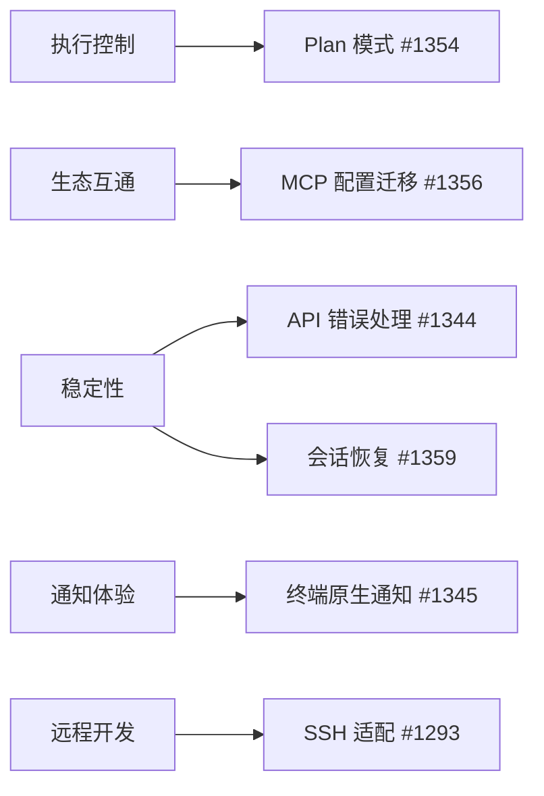
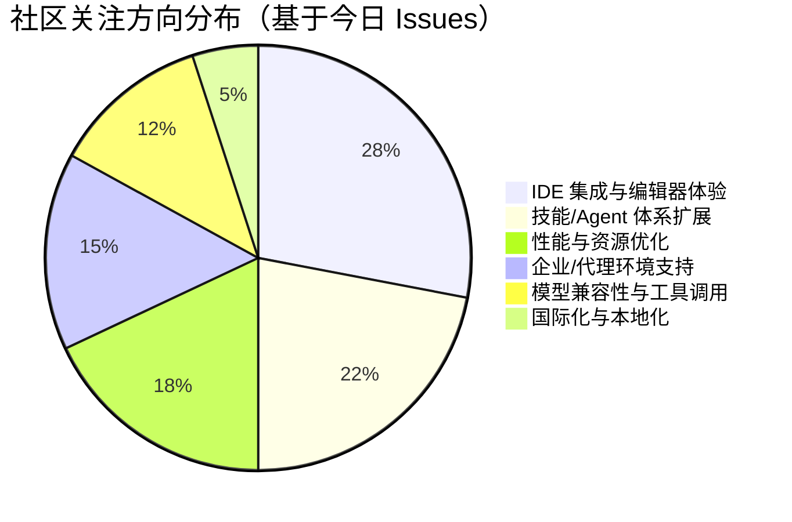

# AI CLI 工具社区动态日报 2026-03-07

> 生成时间: 2026-03-07 00:07 UTC | 覆盖工具: 7 个

- [Claude Code](https://github.com/anthropics/claude-code)
- [OpenAI Codex](https://github.com/openai/codex)
- [Gemini CLI](https://github.com/google-gemini/gemini-cli)
- [GitHub Copilot CLI](https://github.com/github/copilot-cli)
- [Kimi Code CLI](https://github.com/MoonshotAI/kimi-cli)
- [OpenCode](https://github.com/anomalyco/opencode)
- [Qwen Code](https://github.com/QwenLM/qwen-code)
- [Claude Code Skills](https://github.com/anthropics/skills)

---

## 横向对比

# AI CLI 工具生态横向对比分析报告 | 2026-03-07

---

## 1. 生态全景

当前 AI CLI 工具生态呈现**"头部三强领跑、垂直场景工具追赶"**格局：Claude Code 凭借 MCP 生态先发优势持续扩大影响力，OpenAI Codex 以 Rust 引擎重构追求性能极致，GitHub Copilot CLI 借 1.0 GA 正式加入战局。与此同时，Gemini CLI、Kimi CLI、OpenCode、Qwen Code 等工具在 IDE 集成、企业部署、模型适配等细分方向差异化突围。社区共识正从"功能竞赛"转向**生态标准化**（AGENTS.md）与**生产级可靠性**（内存、计费、权限）的深层较量。

---

## 2. 各工具活跃度对比

| 工具 | 今日 Issues 更新 | 今日 PR 更新 | Release 动态 | 关键特征 |
|:---|:---:|:---:|:---|:---|
| **Claude Code** | 10+ 热点 Issue | 10+ PR | v2.1.70 紧急修复 | 社区规模最大，AGENTS.md 标准化议题 229 评论/3000+👍 |
| **OpenAI Codex** | 10 条精选 | 10 条精选 | 7 个 Rust alpha 版本（v0.112.0-alpha.1~7） | 高频迭代期，计费异常成最高热度话题（116 评论） |
| **Gemini CLI** | 10 条热点 | 10 条 PR | v0.34.0-nightly / v0.33.0-preview.4 | UI/UX 精细化冲刺，远程 Agent 基础设施投入 |
| **GitHub Copilot CLI** | 49 条更新 | 0 条 | v1.0.2 GA / v0.0.423 安全加固 | 1.0 里程碑，长期功能请求集中关闭 |
| **Kimi CLI** | 7 条 | 3 条 | 无 | 中等活跃度，聚焦 API 稳定性与 MCP 互通 |
| **OpenCode** | 10 条热点 | 10 条 PR | v1.2.19 / v1.2.20 双版本 | 内存泄漏修复关键期，Bun 剥离加速 |
| **Qwen Code** | 10 条 | 10 条 PR | v0.12.0-preview.0 | @echoVic 单日 10+ PR，技能目录扩展活跃 |

---

## 3. 共同关注的功能方向

| 功能方向 | 涉及工具 | 具体诉求 | 紧迫度 |
|:---|:---|:---|:---:|
| **MCP 生态互通** | Claude Code、Kimi CLI、GitHub Copilot CLI | 配置迁移（Kimi #1356）、OAuth 支持（Copilot #33）、内存/权限优化（Claude #20412, #13898） | ⭐⭐⭐⭐⭐ |
| **Windows/WSL 兼容性** | OpenAI Codex、GitHub Copilot CLI、Qwen Code | 认证故障（Codex #12764）、立即退出（Copilot #1164）、CRLF/BOM 解析（Qwen 今日修复） | ⭐⭐⭐⭐⭐ |
| **执行可控性（Plan 模式）** | Kimi CLI、Claude Code、Gemini CLI | "先规划后执行"工作流（Kimi #1354）、Plan 审批对话框截断（Gemini #20716） | ⭐⭐⭐⭐☆ |
| **内存与性能优化** | OpenCode、Claude Code、Gemini CLI、Qwen Code | 后台会话 70GB 泄漏（OpenCode #5363）、JS Heap 耗尽（Gemini #20550）、长会话内存增长（Qwen #2128） | ⭐⭐⭐⭐⭐ |
| **计费透明度** | OpenAI Codex、GitHub Copilot CLI | 用量骤降异常（Codex #13568）、Premium 额度消耗提示（Copilot #1477） | ⭐⭐⭐⭐⭐ |
| **IDE 深度集成** | Qwen Code、OpenCode、GitHub Copilot CLI | VSCode 辅助侧边栏（Qwen #1954）、JetBrains 插件（OpenCode #3941）、快捷键冲突（Copilot #1871） | ⭐⭐⭐⭐☆ |

---

## 4. 差异化定位分析

| 工具 | 核心侧重 | 目标用户 | 技术路线特征 |
|:---|:---|:---|:---|
| **Claude Code** | **MCP 生态 + 多代理工作流** | 企业开发者、Agent 架构师 | TypeScript 全栈，CLAUDE.md 项目配置，子代理体系成熟 |
| **OpenAI Codex** | **性能极致 + 沙箱安全** | 性能敏感型开发者、安全合规团队 | Rust 核心引擎重构，bubblewrap/Seatbelt 深度沙箱集成 |
| **Gemini CLI** | **远程 Agent + 可视化体验** | 分布式团队、Google Cloud 用户 | 里程碑驱动提示词，流式 UI 精细化，node-pty 深度定制 |
| **GitHub Copilot CLI** | **GitHub 生态无缝整合** | GitHub 重度用户、企业现有 Copilot 订阅者 | 与 VS Code 扩展共享 Prompt 库（`.github/prompts`），Azure 身份体系 |
| **Kimi CLI** | **开放兼容 + 主动执行控制** | 多工具迁移用户、长任务场景开发者 | 强调与 Claude/Cursor 配置互通，Plan 模式差异化 |
| **OpenCode** | **多模型策略 + 富交互 UI** | 模型尝鲜者、可视化偏好用户 | Bun→Node 迁移中，实验性 MCP Apps（富 iframe UI），动画系统重构 |
| **Qwen Code** | **本土化 + IDE 插件矩阵** | 中文开发者、JetBrains 生态用户 | 技能目录多元化（`.agents/skills`），VSCode/JetBrains 双端并重 |

---

## 5. 社区热度与成熟度

### 🔥 高热度成熟工具
| 工具 | 指标 | 状态 |
|:---|:---|:---|
| **Claude Code** | 单议题 229 评论/3000+👍，MCP 生态事实标准 | **生态领导者**，但面临 AGENTS.md 标准化压力 |
| **OpenAI Codex** | 计费问题 116 评论，7 个 alpha 版本/24h | **高速迭代期**，Rust 引擎稳定性待验证 |

### 🚀 快速追赶期
| 工具 | 信号 | 关键动作 |
|:---|:---|:---|
| **GitHub Copilot CLI** | 1.0 GA + 49 Issue 更新/日 | 借品牌势能收割，但 Windows 兼容性倒退 |
| **Gemini CLI** | 远程 Agent Sprint 1-3 并行 | Google 内部工作流整合，企业级部署押注 |
| **Qwen Code** | @echoVic 单日 10+ PR | 技能生态标准化冲刺，对标 Claude Code |

### ⚠️ 稳定性攻坚期
| 工具 | 核心风险 | 关键修复 |
|:---|:---|:---|
| **OpenCode** | 内存泄漏（60GB+ fsmonitor）、Bun 剥离阵痛 | v1.2.20 关键修复，但架构债务仍存 |
| **Kimi CLI** | API 400/401 错误、Plan 模式缺失 | 功能补全中，生态互通待验证 |

---

## 6. 值得关注的趋势信号

### 🎯 对技术决策者的参考

| 趋势信号 | 来源证据 | 行动建议 |
|:---|:---|:---|
| **AGENTS.md 成为事实标准** | Claude Code #6235（229 评论）、Codex/Cursor/已采用 | 新项目优先采用 AGENTS.md，避免 CLAUDE.md 锁定 |
| **MCP 从"功能"转向"治理"** | Claude #20412（静默注入 OOM）、#31618（OAuth 骚扰） | 建立 MCP 服务器的资源配额与准入审查机制 |
| **Rust 引擎成为性能竞争门槛** | Codex 7 个 alpha/24h，OpenCode Bun 剥离 | 评估工具时关注运行时性能与资源隔离实现 |
| **"安静默认"设计理念兴起** | Gemini #21484（里程碑驱动提示词）、Qwen #2181（minimal 模式） | 优先选择可配置输出冗长度的工具，降低认知负荷 |
| **远程/分布式 Agent 基础设施** | Gemini #20302（Sprint 1-3）、Claude 子代理 Issue 集群 | 评估团队是否需要跨机器/跨云的 Agent 编排能力 |

### 🔮 6-12 个月预判

1. **标准化战争**：AGENTS.md vs CLAUDE.md 的博弈将决定项目配置格式的市场格局
2. **Windows 体验分水岭**：能否解决 WSL/原生 Windows 的兼容性，将直接影响开发者市场份额
3. **计费模式创新**：按 token 计费向"任务完成度"或"Agent 工作单元"计费的演进压力
4. **企业级功能收敛**：mTLS、IAM 角色、审计日志将成为 B 端采购的硬性门槛

---

*报告基于 2026-03-07 各工具社区公开数据生成，建议结合具体场景 POC 验证后决策*

---

## 各工具详细报告

<details>
<summary><strong>Claude Code</strong> — <a href="https://github.com/anthropics/claude-code">anthropics/claude-code</a></summary>

## Claude Code Skills 社区热点

> 数据来源: [anthropics/skills](https://github.com/anthropics/skills)

# Claude Code Skills 社区热点报告（2026-03-07）

---

## 1. 热门 Skills 排行（按社区关注度）

| 排名 | Skill | 功能概述 | 状态 | 链接 |
|:---|:---|:---|:---|:---|
| 1 | **document-typography** | AI 生成文档的排版质量控制，解决孤行、寡行、编号错位等常见排版问题 | 🔵 Open | [#514](https://github.com/anthropics/skills/pull/514) |
| 2 | **skill-quality-analyzer / skill-security-analyzer** | 元技能：自动评估其他 Skill 的质量（结构、文档、安全性等五维度） | 🔵 Open | [#83](https://github.com/anthropics/skills/pull/83) |
| 3 | **frontend-design**（改进版） | 提升前端设计 Skill 的可执行性，确保每条指令都能在单次对话中完成 | 🔵 Open | [#210](https://github.com/anthropics/skills/pull/210) |
| 4 | **codebase-inventory-audit** | 代码库清理与文档审计，识别孤儿代码、未使用文件、文档缺口等 | 🔵 Open | [#147](https://github.com/anthropics/skills/pull/147) |
| 5 | **SAP-RPT-1-OSS predictor** | 集成 SAP 开源表格基础模型，用于 SAP 业务数据的预测分析 | 🔵 Open | [#181](https://github.com/anthropics/skills/pull/181) |
| 6 | **shodh-memory** | AI Agent 的持久化记忆系统，跨对话维护上下文 | 🔵 Open | [#154](https://github.com/anthropics/skills/pull/154) |
| 7 | **AURELION skill suite** | 四件套：结构化思维模板、专业顾问模式、Agent 编排、记忆管理 | 🔵 Open | [#444](https://github.com/anthropics/skills/pull/444) |
| 8 | **Google Workspace 集成套件** | 6 个 Agent Skill：邮件分类、草稿撰写、日历管理、任务处理等 | 🔵 Open | [#299](https://github.com/anthropics/skills/pull/299) |

---

## 2. 社区需求趋势（从 Issues 提炼）

| 方向 | 代表 Issue | 核心诉求 |
|:---|:---|:---|
| **Agent 治理与安全** | [#412](https://github.com/anthropics/skills/issues/412) | 企业级 AI Agent 系统的策略执行、威胁检测、信任评分、审计追踪 |
| **Skills ↔ MCP 互通** | [#16](https://github.com/anthropics/skills/issues/16), [#369](https://github.com/anthropics/skills/issues/369) | 将 Skills 暴露为 MCP 工具，或让 Skills 支持 MCP App 新规范 |
| **Skill 包管理器** | [#185](https://github.com/anthropics/skills/issues/185) | 社区自发项目 [skills-mcp](https://github.com/leezhuuuuu/skills-mcp)，实现跨平台 Skill 分发 |
| **AWS Bedrock 兼容** | [#29](https://github.com/anthropics/skills/issues/29) | 企业用户希望 Skills 能在 Bedrock 环境运行 |
| **Skill 质量标准化** | [#202](https://github.com/anthropics/skills/issues/202) | `skill-creator` 需从"开发文档"转向"可执行指令"，提升 token 效率 |

---

## 3. 高潜力待合并 Skills（近期可能落地）

| Skill | 亮点 | 创建时间 | 链接 |
|:---|:---|:---|:---|
| **document-typography** | 直击 AI 生成文档的普遍痛点，作者有完整排版工程背景 | 2026-03-04 | [#514](https://github.com/anthropics/skills/pull/514) |
| **flutter-theme-factory** | 12 套预制主题 + 完整 ColorScheme + 暗黑模式，Flutter 生态缺口 | 2026-02-10 | [#368](https://github.com/anthropics/skills/pull/368) |
| **masonry-generate-image-and-videos** | 集成 Imagen 3.0 / Veo 3.1，补全 Claude 的多模态生成能力 | 2026-02-04 | [#335](https://github.com/anthropics/skills/pull/335) |
| **CONTRIBUTING.md** | 社区健康度从 25% 提升的关键基础设施 | 2026-03-03 | [#509](https://github.com/anthropics/skills/pull/509) |
| **feature-dev**（Bugfix 版） | 修复 TodoWrite 覆盖导致的阶段跳过问题，工作流稳定性关键修复 | 2026-02-09 | [#363](https://github.com/anthropics/skills/pull/363) |

---

## 4. Skills 生态洞察

> **核心诉求：从"功能脚本"进化为"可组合、可治理、可持久化的 Agent 基础设施"** —— 社区正推动 Skills 跨越单点工具阶段，向企业级 Agent 系统的标准化模块演进，关键矛盾集中在 **MCP 互通协议、跨会话记忆机制、以及 Skill 质量评估体系** 三大支柱。

---

*数据截止：2026-03-07 | 来源：github.com/anthropics/skills*

---

# Claude Code 社区动态日报 | 2026-03-07

## 今日速览

Anthropic 发布 v2.1.70 紧急修复第三方网关和 Bedrock 兼容性问题；社区持续推动 **AGENTS.md 标准化**（229 评论，3000+ 👍）成为最受关注议题；MCP 生态相关 Issue 激增，涉及内存占用、子代理工具访问、OAuth 反复提示等痛点。

---

## 版本发布

### v2.1.70（2026-03-06）

| 修复项 | 说明 |
|--------|------|
| 第三方网关 400 错误 | 修复 `ANTHROPIC_BASE_URL` 使用第三方代理时工具搜索误报问题，自动检测代理端点并禁用 `tool_reference` 块 |
| Bedrock `effort` 参数错误 | 修复自定义 Bedrock 推理配置时"模型不支持 effort 参数"的 API 400 错误 |

🔗 https://github.com/anthropics/claude-code/releases/tag/v2.1.70

---

## 社区热点 Issues

| # | 议题 | 状态 | 热度 | 核心看点 |
|---|------|------|------|---------|
| [#6235](https://github.com/anthropics/claude-code/issues/6235) | **AGENTS.md 标准化支持** | 🔥 OPEN | 229 💬 / 3055 👍 | **生态级议题**。Codex、Amp、Cursor 等已采用 [agents.md](https://agents.md/) 标准，CLAUDE.md 被视为 Claude 专属方案。社区强烈呼吁支持跨工具协作的统一配置格式 |
| [#20412](https://github.com/anthropics/claude-code/issues/20412) | Claude.ai MCP 服务器静默注入导致 OOM | 🔥 OPEN | 23 💬 / 62 👍 | **生产环境风险**。Web 端 MCP 配置自动同步到 CLI 无提示，资源受限系统直接内存溢出。需紧急增加 opt-in 机制 |
| [#13354](https://github.com/anthropics/claude-code/issues/13354) | 会话限制到达后支持继续对话 | OPEN | 17 💬 / 30 👍 | 长任务场景刚需。当前强制中断体验差，社区期望类似"压缩后继续"的自动化方案 |
| [#31027](https://github.com/anthropics/claude-code/issues/31027) | Agent 工具缺少 model 参数 | 🆕 OPEN | 7 💬 / 19 👍 | 团队代理无法指定模型（Opus/Sonnet/Haiku），影响成本与性能调优 |
| [#13898](https://github.com/anthropics/claude-code/issues/13898) | 自定义子代理无法访问项目级 MCP | OPEN | 12 💬 / 8 👍 | `.claude/agents/` 子代理对 `.mcp.json` 配置的工具产生幻觉而非真实调用，严重阻碍多代理工作流 |
| [#16550](https://github.com/anthropics/claude-code/issues/16550) | 允许 Claude 写入项目文件 | OPEN | 9 💬 / 15 👍 | 当前 CLAUDE.md 等文件需手动维护，社区希望 AI 能自更新项目配置 |
| [#31646](https://github.com/anthropics/claude-code/issues/31646) | MCP stdio 服务器正常退出被标记为 failed | 🆕 OPEN | 3 💬 | v2.1.70 新问题：SIGINT 后干净退出的服务器仍被计数为失败，影响会话总结准确性 |
| [#31618](https://github.com/anthropics/claude-code/issues/31618) | 已断开云 MCP 仍反复触发 OAuth | 🆕 OPEN | 2 💬 | Atlassian 等连接器断开后，每次启动仍弹浏览器授权，回归问题 |
| [#30435](https://github.com/anthropics/claude-code/issues/30435) | 支持关闭 Bash 安全启发式提示 | OPEN | 6 💬 / 4 👍 | 自动化工作流中 `rm -rf` 等命令的确认弹窗阻碍 CI/CD 场景 |
| [#18115](https://github.com/anthropics/claude-code/issues/18115) | 跨文件系统插件安装失败（EXDEV） | OPEN | 5 💬 / 13 👍 | `~/.claude` 与 `/tmp` 不同挂载点时 `rename` 系统调用失败，影响容器化部署 |

---

## 重要 PR 进展

| # | 贡献者 | 状态 | 功能/修复 |
|---|--------|------|-----------|
| [#31633](https://github.com/anthropics/claude-code/pull/31633) | @OZmasterAI | 🆕 OPEN | **safe-edit-guard 插件**：阻止未读文件的 Edit/Write 操作，解决"盲改"导致的回归问题 |
| [#31529](https://github.com/anthropics/claude-code/pull/31529) | @HarshalJain-cs | 🆕 OPEN | 新增 `/remote-control-diagnose` 命令，帮助用户排查"Remote Control 不可用"错误（关联 #29449 等多起 Issue） |
| [#31501](https://github.com/anthropics/claude-code/pull/31501) | @Lubrsy706 | 🆕 OPEN | 修复 `/feature-dev` 工作流跳过 Phase 6-7 的问题，根因是 `TodoWrite` 覆盖导致阶段级任务丢失 |
| [#31484](https://github.com/anthropics/claude-code/pull/31484) | @carrotRakko | 🆕 OPEN | 确定性移除 stale/autoclose 标签，替代原有的 Claude 非确定性处理 |
| [#31291](https://github.com/anthropics/claude-code/pull/31291) | @markpikemarkpike | 🆕 OPEN | **Konami Code 彩蛋插件**：输入 `⬆️⬆️⬇️⬇️⬅️➡️⬅️➡️🅱️🅰️` 触发 Clawd 舞蹈动画（Unicode 半块真彩色渲染） |
| [#28714](https://github.com/anthropics/claude-code/pull/28714) | @karljtaylor | 🔄 更新 | 自动化 Issue 分类 + 周报摘要，使用 Haiku 4.5（~$0.001/问题）和 Sonnet 4.6（~$0.05/周） |
| [#31600](https://github.com/anthropics/claude-code/pull/31600) | @ZigZagT | 🆕 OPEN | 修复 ` ```! ` 代码块语法被误执行为 Bash 命令的问题 |
| [#31544](https://github.com/anthropics/claude-code/pull/31544) | @jasi381 | 🆕 OPEN | 批量更新 25+ 过期文档 URL 至 canonical 域名 |
| [#31543](https://github.com/anthropics/claude-code/pull/31543) | @jasi381 | 🆕 OPEN | 文档澄清：管道命令需分别配置权限（`a \| b` 中 `a` 和 `b` 各需 `allow` 条目） |
| [#31356](https://github.com/anthropics/claude-code/pull/31356) | @haosenwang1018 | 🆕 OPEN | 为 security-guidance 插件补充完整 README |

---

## 功能需求趋势

基于 50 条活跃 Issue 分析，社区关注焦点呈现代际演变：

```
┌─────────────────────────────────────────────────────────┐
│  🔥 生态标准化  │  AGENTS.md 跨工具兼容（压倒性优先级）    │
├─────────────────────────────────────────────────────────┤
│  ⚡ 性能与资源  │  MCP 内存优化、会话压缩、长任务续跑       │
├─────────────────────────────────────────────────────────┤
│  🔧 代理工作流  │  子代理工具访问、模型选择、延迟加载        │
├─────────────────────────────────────────────────────────┤
│  🔒 权限控制    │  Bash 静默模式、细粒度白名单、hook 区分    │
├─────────────────────────────────────────────────────────┤
│  🖥️ IDE 集成   │  VSCode 订阅显示、远程控制诊断、终端标题    │
├─────────────────────────────────────────────────────────┤
│  ☁️ 多云支持    │  Bedrock 特性适配、第三方网关兼容          │
└─────────────────────────────────────────────────────────┘
```

---

## 开发者关注点

| 痛点类别 | 具体表现 | 代表 Issue |
|---------|---------|-----------|
| **MCP 生态债务** | 内存泄漏、重复配置、OAuth 骚扰、退出状态误判 | #20412, #31646, #31618 |
| **代理能力边界** | 子代理无法调用项目 MCP、无法指定模型、幻觉问题 | #13898, #31027, #25200 |
| **自动化阻碍** | Bash 确认弹窗、权限配置繁琐、管道命令拆分 | #30435, #6527, #31543 |
| **跨平台瑕疵** | Docker 绑定挂载失效（inode 变更）、跨文件系统安装失败 | #25438, #18115 |
| **配置碎片化** | CLAUDE.md vs AGENTS.md、Web/CLI 配置不同步 | #6235, #16550 |

---

*日报基于 github.com/anthropics/claude-code 2026-03-06 至 2026-03-07 数据生成*

</details>

<details>
<summary><strong>OpenAI Codex</strong> — <a href="https://github.com/openai/codex">openai/codex</a></summary>

# OpenAI Codex 社区动态日报 | 2026-03-07

---

## 1. 今日速览

OpenAI 今日密集发布 **7 个 Rust 版本**（v0.112.0-alpha.1 至 alpha.7），显示 codex-rs 核心引擎进入快速迭代期。社区层面，**用量计费异常**成为最高热度话题（116 评论），同时 **Windows/WSL 兼容性**问题持续发酵，多个新 Issue 报告环境变量传递、字符编码和性能问题。

---

## 2. 版本发布

### codex-rs v0.112.0-alpha 系列（7 个预发布版本）

| 版本 | 发布时间 |
|:---|:---|
| rust-v0.112.0-alpha.1 → alpha.7 | 过去 24 小时内连续发布 |

**关键观察**：连续 7 个 alpha 版本表明 Rust 核心引擎正在进行高频迭代测试，可能涉及重大架构调整或稳定性修复。建议生产环境用户保持关注，等待正式版发布。

---

## 3. 社区热点 Issues（精选 10 条）

| # | Issue | 类型 | 热度 | 核心问题与社区反应 |
|:---|:---|:---|:---|:---|
| [#13568](https://github.com/openai/codex/issues/13568) | Usage dropping too quickly | 🐛 Bug | ⭐ 116 评论 / 35 👍 | **计费系统异常**：用户报告用量从 2X 限额骤降至 1X 并开始扣费，OpenAI 已介入调查。社区情绪焦虑，多名用户表示"不敢继续使用"。 |
| [#10410](https://github.com/openai/codex/issues/10410) | macOS Intel (x86_64) support | ✨ Enhancement | ⭐ 99 评论 / 124 👍 | **硬件兼容性缺口**：Intel Mac 用户长期呼吁官方支持，124 个赞显示需求强烈。目前仅 Apple Silicon 原生支持。 |
| [#2847](https://github.com/openai/codex/issues/2847) | Exclude sensitive files mechanism | ✨ Enhancement | ⭐ 59 评论 / 238 👍 | **安全刚需**：社区最高赞需求之一，要求类似 `.gitignore` 的敏感文件排除机制，防止 `.env`、密钥等被意外读取。 |
| [#12764](https://github.com/openai/codex/issues/12764) | 401 Unauthorized on Windows | 🐛 Bug | ⭐ 48 评论 / 1 👍 | **Windows 认证故障**：CLI 在 Windows 环境频繁返回 401，影响基础可用性，但社区关注度被计费问题掩盖。 |
| [#3962](https://github.com/openai/codex/issues/3962) | Completion sound notification | ✨ Enhancement | ⭐ 31 评论 / 103 👍 | **体验优化**：长任务后台运行时的音频提醒，103 赞显示开发者对工作流效率的重视。 |
| [#13733](https://github.com/openai/codex/issues/13733) | Background polling wastes tokens | 🐛 Bug | ⭐ 4 评论 / 3 👍 | **隐性成本陷阱**：后台进程状态检查每次触发完整 API 往返，导致 token 消耗与历史长度×轮询次数成正比，Pro 用户也感到压力。 |
| [#13773](https://github.com/openai/codex/issues/13773) | gpt-5.4 patch actions unreliable | 🐛 Bug | ⭐ 3 评论 / 2 👍 | **模型版本回归**：gpt-5.4 的编辑/补丁功能稳定性不如 gpt-5.3-codex，引发对新模型生产就绪性的质疑。 |
| [#13717](https://github.com/openai/codex/issues/13717) | Runaway rg processes + high CPU/RAM | 🐛 Bug | ⭐ 5 评论 | **资源泄漏**：VS Code 扩展更新后出现 `rg`（ripgrep）进程失控，Linux 用户报告系统卡顿。 |
| [#13148](https://github.com/openai/codex/issues/13148) | Windows EOL broken | 🐛 Bug | ⭐ 5 评论 / 5 👍 | **跨平台一致性**：Codex 持续将 Windows CRLF 替换为 Unix LF，导致 PowerShell 脚本执行失败，Windows 开发者体验受损。 |
| [#13566](https://github.com/openai/codex/issues/13566) | WSL non-interactive shell missing NVM | 🐛 Bug | ⭐ 4 评论 / 1 👍 | **WSL 环境隔离**：Windows App 的 WSL 模式使用非交互式 shell，无法加载 `.bashrc` 中的 NVM，导致 Node/pnpm 不可用。 |

---

## 4. 重要 PR 进展（精选 10 条）

| # | PR | 作者 | 状态 | 核心内容 |
|:---|:---|:---|:---|:---|
| [#13593](https://github.com/openai/codex/pull/13593) | Stabilize flaky tests | @aibrahim-oai | 🟡 Open | **测试稳定性**：修复 Windows/app-server  flaky 测试，引入确定性等待和序列化重载测试，为 Rust 版本快速迭代奠定基础。 |
| [#13276](https://github.com/openai/codex/pull/13276) | Hooks engine MVP | @eternal-openai | 🟡 Open | **扩展机制**：实验性 Hooks 引擎，支持 `SessionStart` 和 `Stop` 事件，同步执行阻塞式钩子，为第三方集成铺路。 |
| [#13439](https://github.com/openai/codex/pull/13439) | Split sandbox policies through runtime | @bolinfest | 🟡 Open | **沙箱架构升级**：将 `FileSystemSandboxPolicy` 与 `NetworkSandboxPolicy` 分离并贯通运行时，解决策略投影信息丢失问题。 |
| [#13640](https://github.com/openai/codex/pull/13640) | Streaming TTY/PTY for command/exec | @euroelessar | 🟡 Open | **执行能力增强**：为 `command/exec` 添加流式 stdin/stdout/stderr、PTY 支持、环境变量覆盖和进程终止能力，接近完整终端体验。 |
| [#13675](https://github.com/openai/codex/pull/13675) | Full web search tool config | @rm-openai | 🟡 Open | **搜索精细化**：扩展网页搜索配置，支持 filters、location 等 Responses API 完整参数，从简单的 on/off 升级。 |
| [#13451](https://github.com/openai/codex/pull/13451) | Preserve denied paths when widening | @bolinfest | 🟡 Open | **安全加固**：权限放宽时保留显式拒绝路径，防止 `SandboxPolicy` 投影抹除敏感目录的阻断设置。 |
| [#13453](https://github.com/openai/codex/pull/13453) | Honor split filesystem policies in bwrap | @bolinfest | 🟡 Open | **Linux 沙箱落地**：bubblewrap 挂载构建器识别分离式文件系统策略，确保只读根目录下的不可读子目录被正确隔离。 |
| [#13448](https://github.com/openai/codex/pull/13448) | Seatbelt: honor split filesystem policies | @bolinfest | 🟡 Open | **macOS 沙箱对齐**：Seatbelt 策略生成器使用分离式策略，修复显式不可读路径被忽略的问题。 |
| [#13808](https://github.com/openai/codex/pull/13808) | Rename OtelManager to SessionTelemetry | @owenlin0 | 🟡 Open | **代码可维护性**：纯重构，更准确反映"会话级遥测"而非"全局 OTEL 管理"的语义。 |
| [#13255](https://github.com/openai/codex/pull/13255) | TUI render file links from relative targets | @pash-openai | 🟡 Open | **终端体验修复**：恢复终端可点击的文件路径，解决之前"美观标签"破坏 command-click 导航的问题。 |

---

## 5. 功能需求趋势

基于 50 条活跃 Issue 分析，社区关注焦点呈现 **四大方向**：

| 趋势方向 | 代表 Issue | 紧迫度 | 说明 |
|:---|:---|:---|:---|
| **🔐 安全与隐私控制** | #2847, #13778, #11915 | ⭐⭐⭐⭐⭐ | 敏感文件排除、.env 保护、只读模式——企业级采用的硬性门槛 |
| **💰 计费透明度** | #13568, #13567, #13733 | ⭐⭐⭐⭐⭐ | 用量计算异常、隐性 token 消耗，直接影响用户信任 |
| **🪟 Windows/WSL 生态** | #10410, #12764, #13566, #13148, #13553 | ⭐⭐⭐⭐☆ | 从认证、编码、环境变量到性能，Windows 开发者体验明显落后于 macOS/Linux |
| **🔔 工作流效率** | #3962, #11701 | ⭐⭐⭐☆☆ | 通知提醒、子代理配置——成熟用户的体验优化需求 |

---

## 6. 开发者关注点

### 🔴 高频痛点

| 痛点 | 具体表现 | 影响范围 |
|:---|:---|:---|
| **计费不可预测** | 限额骤降、后台轮询烧 token、周重置逻辑异常 | 所有付费用户 |
| **Windows 二等公民** | WSL 环境变量丢失、EOL 处理错误、非 ASCII 用户名崩溃、字符编码乱码 | Windows 开发者 |
| **沙箱与工具冲突** | `tsx` IPC 管道权限、NVM/Node 路径缺失、`rg` 进程泄漏 | 特定工具链用户 |

### 🟡 期待改进

- **模型选择灵活性**：子代理独立配置模型和推理强度（#11701 已关闭但需求仍在）
- **跨平台桌面应用**：Linux 桌面版（#11023）、Intel Mac 支持（#10410）
- **实时协作稳定性**：多代理协作时的信号同步（#9607 已关闭）

### 💡 技术观察

> **沙箱架构重构**是近期代码层面的核心主线。bolinfest 主导的 6+ 个 PR 正在将 `SandboxPolicy` 从单一结构拆分为 `FileSystemSandboxPolicy` + `NetworkSandboxPolicy`，这将为更精细的权限控制（如 #2847 的敏感文件排除）提供基础设施。建议关注 #13434 系列的合并进展。

---

*日报基于 GitHub 公开数据生成，仅供参考。关键问题建议直接参与 Issue 讨论或联系 OpenAI 支持。*

</details>

<details>
<summary><strong>Gemini CLI</strong> — <a href="https://github.com/google-gemini/gemini-cli">google-gemini/gemini-cli</a></summary>

# Gemini CLI 社区动态日报 | 2026-03-07

## 今日速览

今日社区聚焦于 **UI/UX 精细化打磨** 与 **远程 Agent 基础设施** 两大主线。v0.34.0-nightly 版本修复了非交互模式下的工具排除策略和渲染 padding 问题；同时，多个高优先级 Issue 密集涌现，涉及 Shell 高度计算、交互式进度可视化、以及"里程碑驱动"的提示词策略优化，显示团队正为 1.0 正式版做最后的体验冲刺。

---

## 版本发布

### v0.34.0-nightly.20260306.a8f507352
| 属性 | 内容 |
|:---|:---|
| 类型 | Nightly 预览版 |
| 核心变更 | ① 修复非交互模式下工具排除逻辑延迟至策略引擎执行的问题 ② 移除渲染内容的双重 padding |

### v0.33.0-preview.4
| 属性 | 内容 |
|:---|:---|
| 类型 | Preview 补丁版 |
| 核心变更 | 自动 cherry-pick 修复至 preview.3 分支，创建 preview.4 |

---

## 社区热点 Issues

| # | 标题 | 作者 | 评论 | 关键价值 |
|:---|:---|:---|:---:|:---|
| [#20716](https://github.com/google-gemini/gemini-cli/issues/20716) | Plan 审批对话框截断问题 | @Jefftree | 8 | **核心 UX 缺陷**：20 行 Plan 仅显示 15 行，严重影响用户理解完整执行计划，需紧急修复 |
| [#19468](https://github.com/google-gemini/gemini-cli/issues/19468) | 滚动位置持续跳回顶部 | @Piinks | 3 | **稳定性问题**：无需新消息触发，每几秒自动跳转，长期困扰用户的工作流中断 |
| [#21491](https://github.com/google-gemini/gemini-cli/issues/21491) | SDK 可注入 Logger 接口重构 | @manas-raj999 | 3 | **架构债务**：`console.error` 硬编码阻碍 SDK 消费者拦截日志，企业集成刚需 |
| [#20302](https://github.com/google-gemini/gemini-cli/issues/20302) | [Epic] 远程 Agent Sprint 1 - 基础架构 | @adamfweidman | 3 | **战略级功能**：远程 Agent 核心基础设施与流式支持，Google 内部工作流整合关键 |
| [#21461](https://github.com/google-gemini/gemini-cli/issues/21461) | Shell 命令不支持别名 | @jacob314 | 2 | **Shell 兼容性**：`.bash_profile` 别名在 `!` 命令中失效，影响开发者既有习惯 |
| [#20886](https://github.com/google-gemini/gemini-cli/issues/20886) | 子 Agent UX 精细化 | @gundermanc | 2 | **产品打磨**：工具调用历史展开器、Thinking 清理，匹配最新设计稿 |
| [#20550](https://github.com/google-gemini/gemini-cli/issues/20550) | JS Heap 内存耗尽 | @jordanlhenderson | 2 | **性能危机**：长时间运行场景下 GC 压力过大，需内存优化 |
| [#21432](https://github.com/google-gemini/gemini-cli/issues/21432) | Agent"自我意识"增强 | @LyalinDotCom | 1 | **元能力**：让 Agent 准确理解自身 CLI 标志、热键、自执行方式，降低用户学习成本 |
| [#21494](https://github.com/google-gemini/gemini-cli/issues/21494) | 交互式 Shell 高度计算错误 | @jacob314 | 0 | **阻塞级 Bug**：Vim 等工具因高度不匹配导致内容渲染偏移，完全不可用 |
| [#21484](https://github.com/google-gemini/gemini-cli/issues/21484) | 交互式进度可视化与任务步进 | @TravisHaa | 0 | **体验创新**：将黑盒式执行转为可展开/步进的层级可视化，解决"过度滚动"问题 |

---

## 重要 PR 进展

| # | 标题 | 作者 | 状态 | 核心贡献 |
|:---|:---|:---|:---:|:---|
| [#21495](https://github.com/google-gemini/gemini-cli/pull/21495) | 优化选择列表与设置项焦点高亮 | @clocky | 🟡 Open | 2 字符边距 + 边界突围逻辑，解决焦点高亮重叠对话框边框问题 |
| [#21492](https://github.com/google-gemini/gemini-cli/pull/21492) | 修复 Shell 高度正确上报 | @jacob314 | 🟡 Open | **关键修复**：从 UI 组件自身上报真实高度，解决 node-pty 高度虚高导致的 Vim 不可用 |
| [#21485](https://github.com/google-gemini/gemini-cli/pull/21485) | 禁止欠指定类型语法 | @gundermanc | 🟡 Open | ESLint 规则禁止 `typeof obj['prop'] == 'string'`，强化类型安全 |
| [#21478](https://github.com/google-gemini/gemini-cli/pull/21478) | Cherry-pick 至 preview.4 | @gemini-cli-robot | 🔴 Conflicts | 自动补丁流程遇合并冲突，需人工介入 |
| [#21470](https://github.com/google-gemini/gemini-cli/pull/21470) | 连续会话支持 | @joshualitt | 🟡 Open | 实现 #21469 需求的持续会话能力 |
| [#21458](https://github.com/google-gemini/gemini-cli/pull/21458) | 设置对象显示为 JSON | @Zheyuan-Lin | 🟡 Open | 修复 `[object Object]` 显示问题，提升调试体验 |
| [#21488](https://github.com/google-gemini/gemini-cli/pull/21488) | 废弃包警告集成测试 | @RealOrangeKun | 🟡 Open | 确保 stderr 无 `DeprecationWarning`， CI 质量门禁 |
| [#21487](https://github.com/google-gemini/gemini-cli/pull/21487) | 非存在路径的符号链接解析 | @Adib234 | 🟡 Open | `fs.realpathSync` 对不存在路径失败时的降级处理 |
| [#21206](https://github.com/google-gemini/gemini-cli/pull/21206) | BaseSettingsDialog React 模式优化 | @psinha40898 | 🟡 Open | 移除不良 React 模式，为替代缓冲区版本做准备 |
| [#21481](https://github.com/google-gemini/gemini-cli/pull/21481) | 窗口标题长度可配置 | @daehyeok | 🟡 Open | `ui.terminalTitleMaxLen` + `ui.padWindowTitle` 选项，个性化终端体验 |

---

## 功能需求趋势

基于 50 条活跃 Issue 分析，社区关注呈现三大聚集方向：

| 方向 | 热度 | 典型 Issue | 说明 |
|:---|:---:|:---|:---|
| **Agent 执行可视化** | 🔥🔥🔥 | #21484, #21454~#21452, #21449~#21450 | "里程碑驱动"提示词 + 可折叠任务组 UI，解决输出冗长与"过度滚动" |
| **远程/分布式 Agent** | 🔥🔥🔥 | #20302, #20303, #20304 | Sprint 1-3 覆盖基础架构、高级认证、后台操作，企业级部署刚需 |
| **Shell/终端体验** | 🔥🔥🔥 | #21494, #21461, #21423, #20514 | 高度计算、别名支持、输入框滚动条、环境变量透传，硬核开发者体验 |
| **内存与性能** | 🔥🔥 | #20550, #19468 | 长会话 Heap 耗尽、滚动跳动，稳定性瓶颈 |
| **非交互模式净化** | 🔥🔥 | #21433 | Headless 调用严格干净，1.0 版本脚本/管道兼容性承诺 |

---

## 开发者关注点

### 🔴 阻塞性痛点
1. **Vim/终端编辑器不可用**（#21494, #21492）— Shell 高度计算错误导致核心工作流中断
2. **Plan 审批信息截断**（#20716）— 用户无法看到完整执行计划，信任受损
3. **内存泄漏**（#20550）— 长时间会话必现 JS Heap 耗尽

### 🟡 高频摩擦点
- **别名与 Shell 环境隔离**（#21461, #20514）— 开发者期望 CLI 继承而非重置其 Shell 环境
- **输出冗长难以扫描**（#21484 系列）— 工具调用平铺展示，缺乏层级与折叠
- **滚动体验不稳定**（#19468, #20217）— 跳动与闪烁问题持续存在

### 🟢 积极信号
- **"安静默认"设计理念**获认同：#21450 的"里程碑驱动"提示词策略，减少日常工具调用的叙述填充
- **可扩展性投资**：可注入 Logger（#21491）、连续会话（#21470）显示企业集成优先级提升

---

> 📊 数据来源：[google-gemini/gemini-cli](https://github.com/google-gemini/gemini-cli) | 统计周期：2026-03-06 至 2026-03-07

</details>

<details>
<summary><strong>GitHub Copilot CLI</strong> — <a href="https://github.com/github/copilot-cli">github/copilot-cli</a></summary>

# GitHub Copilot CLI 社区动态日报 | 2026-03-07

## 今日速览

GitHub Copilot CLI 正式迎来 **1.0 GA 里程碑**，团队发布 v1.0.2 版本庆祝正式可用。社区活跃度极高，过去24小时内 49 个 Issue 被更新，其中多项长期功能请求（自定义 Slash 命令、OAuth MCP 支持）终于关闭，同时暴露出 Windows 兼容性、模型持久化、IME 输入等新兴痛点。

---

## 版本发布

### v1.0.2 —— 正式版里程碑
> 发布时间：2026-03-06 | [Release 页面](https://github.com/github/copilot-cli/releases/tag/v1.0.2)

**核心更新：**
- `exit` 裸命令直接退出 CLI（告别 `/exit` 记忆负担）
- 询问表单支持 Enter 键提交，枚举字段允许自定义响应
- `command` 字段支持 `cro` 缩写

### v0.0.423 —— 安全加固版
> 发布时间：2026-03-06

**核心更新：**
- 危险 shell 命令（含扩展/替换）触发用户确认提示，防范恶意利用
- EMU/GHE Cloud 用户 `/share gist` 被明确拦截并提示
- 枚举/布尔字段需按 Enter 确认，减少误操作

---

## 社区热点 Issues（10项）

| # | 状态 | 标题 | 关键价值 | 社区反应 |
|---|:---|:---|:---|:---|
| [#618](https://github.com/github/copilot-cli/issues/618) | ✅ CLOSED | 支持 `.github/prompts` 自定义 Slash 命令 | **史诗级功能落地**——与 VS Code 扩展对齐，开发者可复用团队级 Prompt 库 | 26 评论，90 👍，长期呼声最高 |
| [#33](https://github.com/github/copilot-cli/issues/33) | ✅ CLOSED | OAuth HTTP MCP 服务器支持 | 解锁 Figma、Atlassian 等主流 SaaS 的远程 MCP 能力 | 25 评论，103 👍，企业场景刚需 |
| [#1698](https://github.com/github/copilot-cli/issues/1698) | ✅ CLOSED | CJK/日语 IME 候选窗口错位/不可见 | 亚太地区开发者体验关键修复 | 5 评论，50 👍，国际化里程碑 |
| [#1081](https://github.com/github/copilot-cli/issues/1081) | 🔴 OPEN | `AggregateError: Failed to list models` | 企业版用户登录后完全不可用，阻断性 Bug | 21 评论，8 👍，紧急待修复 |
| [#1161](https://github.com/github/copilot-cli/issues/1161) | ✅ CLOSED | `invalid session id` 导致任务失败 | 长期存在的会话稳定性问题，用户已流失至竞品 | 19 评论，13 👍 |
| [#1481](https://github.com/github/copilot-cli/issues/1481) | 🔴 OPEN | Shift+Enter 误执行而非换行 | 与通用聊天交互范式冲突，高频误操作 | 9 评论，8 👍 |
| [#1164](https://github.com/github/copilot-cli/issues/1164) | 🔴 OPEN | Windows 11 新版本立即退出无输出 | 平台兼容性倒退，0.0.368+ 版本不可用 | 8 评论，1 👍，Windows 用户受阻 |
| [#307](https://github.com/github/copilot-cli/issues/307) | 🔴 OPEN | 权限系统综合改进提案 | 聚合 16+ 相关 Issue，涉及路径检测、文档缺失等架构问题 | 6 评论，4 👍，需官方回应 |
| [#686](https://github.com/github/copilot-cli/issues/686) | 🔴 OPEN | 任务卡住两小时无反馈 | 自治代理缺乏干预机制，可靠性存疑 | 5 评论，8 👍 |
| [#1477](https://github.com/github/copilot-cli/issues/1477) | 🔴 OPEN | 模型完成后仍"继续自主运行"消耗 Premium 额度 | 计费策略感知问题，用户成本焦虑 | 5 评论，6 👍 |

---

## 重要 PR 进展

> **今日无新增 PR 更新**（过去24小时 0 条）

---

## 功能需求趋势

基于 49 条活跃 Issue 分析，社区聚焦五大方向：

| 趋势方向 | 代表 Issue | 紧迫度 |
|:---|:---|:---:|
| **IDE 深度集成** | [#1871](https://github.com/github/copilot-cli/issues/1871) VS Code 内嵌 CLI 的快捷键冲突 | 🔥🔥🔥 |
| **模型管理** | [#1869](https://github.com/github/copilot-cli/issues/1869) 模型选择不持久、[#1824](https://github.com/github/copilot-cli/issues/1824) 默认模型自定义 | 🔥🔥🔥 |
| **MCP 生态扩展** | [#33](https://github.com/github/copilot-cli/issues/33) OAuth 支持已关闭，[#1232](https://github.com/github/copilot-cli/issues/1232) 环境变量注入待实现 | 🔥🔥 |
| **企业级治理** | [#307](https://github.com/github/copilot-cli/issues/307) 权限系统、[#1081](https://github.com/github/copilot-cli/issues/1081) 企业版可用性 | 🔥🔥🔥 |
| **会话与上下文** | [#1697](https://github.com/github/copilot-cli/issues/1697) 会话 Fork、[#1857](https://github.com/github/copilot-cli/issues/1857) 消息队列取消 | 🔥🔥 |

---

## 开发者关注点

### 🔴 高频痛点

1. **Windows 平台稳定性危机** — [#1164](https://github.com/github/copilot-cli/issues/1164) 显示 0.0.368+ 版本完全不可用，用户被迫回退至 0.0.331，严重阻碍 Windows 开发者采纳

2. **交互范式冲突** — Shift+Enter 与 Ctrl+Enter 的换行/提交逻辑 ([#1481](https://github.com/github/copilot-cli/issues/1481), [#1871](https://github.com/github/copilot-cli/issues/1871)) 反复出现，说明 TUI 设计未遵循行业惯例

3. **模型状态管理缺陷** — 选择 `gpt-5-mini` 后重启丢失 ([#1869](https://github.com/github/copilot-cli/issues/1869))，与 CLI 作为长期会话工具的定位矛盾

4. **企业版可用性黑洞** — `Failed to list models` 错误 ([#1081](https://github.com/github/copilot-cli/issues/1081)) 导致付费用户完全无法使用，影响收入转化

### 🟡 体验优化诉求

- **IME 国际化**：日语输入修复 ([#1698](https://github.com/github/copilot-cli/issues/1698)) 关闭后，中文/韩语社区期待类似关注
- **成本透明化**：Premium 额度消耗提示 ([#1477](https://github.com/github/copilot-cli/issues/1477)) 需更精细的干预控制
- **MCP 安全**：环境变量注入 ([#1232](https://github.com/github/copilot-cli/issues/1232)) 避免 secrets 硬编码

---

*日报基于 github.com/github/copilot-cli 公开数据生成*

</details>

<details>
<summary><strong>Kimi Code CLI</strong> — <a href="https://github.com/MoonshotAI/kimi-cli">MoonshotAI/kimi-cli</a></summary>

# Kimi Code CLI 社区动态日报 | 2026-03-07

## 今日速览

今日社区活跃度较高，共 7 个 Issue 和 3 个 PR 有更新。核心关注点集中在 **API 稳定性问题**（400/401 错误）、**Plan 模式功能需求** 以及 **MCP 生态互通性** 三大方向。开发者对 Kimi CLI 的主动执行行为控制提出明确改进诉求。

---

## 社区热点 Issues

| # | 状态 | 标题 | 核心看点 |
|---|:---:|---|---|
| [#1344](https://github.com/MoonshotAI/kimi-cli/issues/1344) | 🔴 OPEN | API Error: 400 Invalid request Error | **高优先级**：v1.14.0 版本出现高频 400 错误，19 条评论集中反馈，影响面待评估 |
| [#1074](https://github.com/MoonshotAI/kimi-cli/issues/1074) | 🟢 CLOSED | 401 Unauthorized 获取模型失败 | 经典鉴权问题已关闭，20 评论形成完整排查路径，可作为同类问题参考 |
| [#640](https://github.com/MoonshotAI/kimi-cli/issues/640) | 🔴 OPEN | 循环读取文件陷入死循环 | 长期未决（1.19 创建），自定义 Anthropic 端点场景下的上下文管理缺陷 |
| [#1354](https://github.com/MoonshotAI/kimi-cli/issues/1354) | 🔴 OPEN | 需求 Plan 模式控制执行流程 | **功能热点**：2 个 👍，开发者尝试用 Skill  workaround 失败，反映对"先规划后执行"工作流的强需求 |
| [#1356](https://github.com/MoonshotAI/kimi-cli/issues/1356) | 🔴 OPEN | MCP Skill 配置从其他 CLI 无缝迁移 | **生态议题**：Claude CLI/Cursor/Windsurf/Continue 等工具的 MCP 配置互通，降低迁移成本 |
| [#1355](https://github.com/MoonshotAI/kimi-cli/issues/1355) | 🔴 OPEN | ACP 会话初始化失败 `list.index(x): x not in list` | v1.17.0 + IDEA AI Assistant 场景，内部索引错误需排查 |
| [#1293](https://github.com/MoonshotAI/kimi-cli/issues/1293) | 🔴 OPEN | SSH 远程服务器无法通信 | 无图形界面 + 不可修改 DNS 场景下的网络适配问题，企业用户痛点 |

---

## 重要 PR 进展

| # | 状态 | 标题 | 技术价值 |
|---|:---:|---|---|
| [#1359](https://github.com/MoonshotAI/kimi-cli/pull/1359) | 🟡 OPEN | WebSocket 重连时保留 slash commands + 初始化重试逻辑 | 提升弱网环境下的会话稳定性，用户体验关键修复 |
| [#1358](https://github.com/MoonshotAI/kimi-cli/pull/1358) | 🟡 OPEN | 避免隐式关闭 reasoning 能力 | 精细控制 OpenAI Responses API 的 reasoning_effort 参数，防止能力误降级 |
| [#1345](https://github.com/MoonshotAI/kimi-cli/pull/1345) | 🟡 OPEN | 新增 OSC 9 终端任务完成通知 | 跨平台桌面通知（iTerm2/Windows Terminal/WezTerm 等），异步工作流体验提升 |

---

## 功能需求趋势



**Top 3 方向**：
1. **执行可控性** — 开发者强烈需要"规划-确认-执行"的分阶段交互模式
2. **MCP 生态开放** — 与 Claude/Cursor 等工具的 Skill 配置互通成为迁移决策关键
3. **企业场景适配** — SSH/无图形界面/受限网络环境下的稳定运行

---

## 开发者关注点

| 痛点类别 | 具体表现 | 关联 Issue |
|---------|---------|-----------|
| **API 可靠性** | 400/401 错误缺乏详细诊断信息 | #1344, #1074 |
| **过度自主执行** | Kimi 在规划讨论完成前擅自行动 | #1354 |
| **配置孤岛** | 无法复用其他 AI 工具的 MCP 投入 | #1356 |
| **上下文循环** | 特定文件被反复读取导致死循环 | #640 |
| **IDE 集成缺陷** | JetBrains 插件 ACP 会话初始化失败 | #1355 |

> 💡 **建议关注**：#1354 的 Plan 模式需求与 #1356 的 MCP 迁移需求代表了社区从"尝鲜"向"生产级工具链"转变的核心诉求，建议产品侧优先响应。

</details>

<details>
<summary><strong>OpenCode</strong> — <a href="https://github.com/anomalyco/opencode">anomalyco/opencode</a></summary>

# OpenCode 社区动态日报 | 2026-03-07

## 今日速览

OpenCode 团队连续发布 v1.2.19 和 v1.2.20 双版本，重点修复了 fsmonitor 守护进程内存泄漏（60GB+）问题，并加速剥离 Bun 运行时依赖以提升兼容性。社区持续聚焦内存/性能问题、IDE 集成体验，以及 GPT-5.4 等新模型的支持适配。

---

## 版本发布

### v1.2.20 / v1.2.19（2026-03-06）

| 版本 | 核心变更 |
|:---|:---|
| **v1.2.20** | • **关键修复**：停止泄漏 fsmonitor 守护进程（解决测试后 60GB+ 提交内存问题）<br>• 将 `Bun.which` 替换为 npm `which` 以提升跨平台兼容性<br>• TUI 恢复 Bun stdin 读取用于提示输入 |
| **v1.2.19** | • 新增 GPT-5.4 至 Codex 允许模型列表<br>• **Bun 剥离加速**：`Bun.stderr`/`Bun.color` → Node.js 等价物；`Bun.connect` → `net.createConnection`<br>• 哈希算法迁移：SHA1 替代不支持的 xxHash3-XXH64 |

> 🔗 [v1.2.20 Release](https://github.com/anomalyco/opencode/releases/tag/v1.2.20) | [v1.2.19 Release](https://github.com/anomalyco/opencode/releases/tag/v1.2.19)

---

## 社区热点 Issues（Top 10）

| # | 标题 | 状态 | 热度 | 关键看点 |
|:---|:---|:---|:---|:---|
| [#4283](https://github.com/anomalyco/opencode/issues/4283) | TUI 剪贴板复制失效 | 🔴 OPEN | 63💬 46👍 | **历史遗留顽疾**，用户无法复制响应文本，影响基础交互体验，长期未获根本解决 |
| [#5363](https://github.com/anomalyco/opencode/issues/5363) | 后台会话吞噬 70GB 内存 | 🔴 OPEN | 37💬 16👍 | **性能危机代表案例**，tmux 后台闲置会话异常内存膨胀，与今日 fsmonitor 修复直接相关 |
| [#8089](https://github.com/anomalyco/opencode/issues/8089) | 自动压缩启用仍触发 context_length_exceeded | 🔴 OPEN | 27💬 9👍 | 文档与行为不符，Agent 工作流中上下文超限问题持续困扰用户 |
| [#1764](https://github.com/anomalyco/opencode/issues/1764) | 输入框支持 Vim 快捷键 | 🔴 OPEN | 25💬 109👍 | **最高赞功能请求**，对标 Claude Code，开发者效率工具的核心诉求 |
| [#14982](https://github.com/anomalyco/opencode/issues/14982) | 异常请求 iCloud/Photos 权限 | 🔴 OPEN | 20💬 7👍 | **隐私安全敏感**，用户项目均在 ~/Code 却触发系统权限请求，引发信任疑虑 |
| [#16331](https://github.com/anomalyco/opencode/issues/16331) | 权限配置被忽略 | 🔴 OPEN | 13💬 | 新 Issue，opencode.json 中 `permission` 规则未生效，安全策略失效 |
| [#16333](https://github.com/anomalyco/opencode/issues/16333) | GPT 5.4 过早触发压缩 | 🔴 OPEN | 7💬 3👍 | **新模型适配问题**，1M 上下文能力未被充分利用，压缩逻辑仍按 5.2 标准执行 |
| [#16321](https://github.com/anomalyco/opencode/issues/16321) | Windows 启动报木马 | 🔴 OPEN | 8💬 1👍 | **安全误报**，Microsoft Defender 标记 v1.2.19，需官方澄清 |
| [#8417](https://github.com/anomalyco/opencode/issues/8417) | Gemini + GitHub Copilot Bad Request | 🔴 OPEN | 17💬 5👍 | 模型与认证组合兼容性问题，企业用户受阻 |
| [#9290](https://github.com/anomalyco/opencode/issues/9290) | 快照系统吞噬 318GB 存储 | 🟢 CLOSED | 9💬 3👍 | **已解决**，根因：整个 home 目录被追踪为 git worktree + 孤儿 pack 文件无 GC |

---

## 重要 PR 进展（Top 10）

| # | 标题 | 作者 | 状态 | 技术价值 |
|:---|:---|:---|:---|:---|
| [#16413](https://github.com/anomalyco/opencode/pull/16413) | 更新浏览器标签页 favicon 为 Vibe V logo | @ldparker | 🟢 CLOSED | 品牌视觉统一，App 端体验细节打磨 |
| [#16412](https://github.com/anomalyco/opencode/pull/16412) | TUI 会话空状态对齐 | @iamdavidhill | 🔵 OPEN | 无历史会话项目的空状态 UX 一致性修复 |
| [#16409](https://github.com/anomalyco/opencode/pull/16409) | 生态文档：新增 Home Assistant 与终端进度插件 | @pedropombeiro | 🔵 OPEN | 社区生态扩展，IoT 与 CLI 可视化场景 |
| [#16408](https://github.com/anomalyco/opencode/pull/16408) | 修复粘性手风琴滚动问题 | @neriousy | 🔵 OPEN | 长内容折叠面板的滚动定位修复 |
| [#13854](https://github.com/anomalyco/opencode/pull/13854) | 停止在消息完成后流式渲染 Markdown | @mocksoul | 🔵 OPEN | 修复表格最后一行被截断的渲染 bug |
| [#16393](https://github.com/anomalyco/opencode/pull/16393) | 启动时防护无效迁移条目 | @SergioChan | 🟢 CLOSED | 数据库迁移健壮性提升，防止 #16381 类启动失败 |
| [#14969](https://github.com/anomalyco/opencode/pull/14969) | Bedrock IAM 凭证连接流与环境变量认证 | @tristan-stahnke-GPS | 🔵 OPEN | 企业 AWS 场景：替换通用 API key 表单，支持 IAM 角色 |
| [#15926](https://github.com/anomalyco/opencode/pull/15926) | 实验性 MCP Apps 支持（富 iframe UI） | @tristan-stahnke-GPS | 🔵 OPEN | **重大架构**：MCP 服务器可渲染沙箱化交互界面， behind feature flag |
| [#16402](https://github.com/anomalyco/opencode/pull/16402) | 稳定本地化路由 | @akronb | 🔵 OPEN | 一次性修复 5 个国际化路由相关 Issue |
| [#15863](https://github.com/anomalyco/opencode/pull/15863) | 动画系统重构 II：时间轴与编辑器岛 | @kitlangton | 🔵 OPEN | 核心 UI 架构：会话时间轴分段渲染、滚动锚定、队列状态优化 |

---

## 功能需求趋势

基于 50 条活跃 Issue 分析，社区关注焦点呈以下分布：

| 方向 | 代表 Issue | 热度特征 |
|:---|:---|:---|
| **🐛 内存与性能优化** | #5363, #9290, #13041, #13796, #16269 | **最高优先级**，生产环境内存泄漏、LSP/MCP 重复实例化、ShellCheck 无界增长 |
| **⌨️ 开发者效率工具** | #1764 (Vim), #3941 (JetBrains 终端), #15613 (ACP 流式输出) | IDE 集成体验差距是迁移阻力 |
| **🔒 安全与隐私** | #14982 (权限请求), #16331 (权限配置失效), #16321 (误报木马) | 企业采用的关键信任门槛 |
| **🤖 新模型适配** | #16333 (GPT-5.4 压缩), #12789 (模型不支持), #8417 (Gemini) | 多模型策略的兼容性矩阵复杂 |
| **🌐 企业部署** | #14696 (mTLS), #14969 (Bedrock IAM), #13999 (Azure OpenAI) | B 端功能：证书认证、云服务商深度集成 |
| **📋 核心功能完善** | #4283 (剪贴板), #8089 (上下文压缩), #6907 (子代理会话) | 基础体验打磨，影响日常可用性 |

---

## 开发者关注点

### 🔥 高频痛点

1. **"内存黑洞" 综合征**  
   多个 Issue 揭示 OpenCode 在长期运行、后台会话、多并发场景下的内存管理缺陷。v1.2.20 的 fsmonitor 修复是重要一步，但 LSP/MCP 每会话重复启动（#13041）、bash-language-server 的 `--external-sources` 硬编码（#16269）等架构问题仍需系统性解决。

2. **Bun 运行时依赖的阵痛**  
   团队正加速剥离 Bun 专属 API（v1.2.19-20 连续替换），但 TUI 仍需 `Bun.stdin`，兼容性迁移处于中间态，可能引入回归（如 #16321 Windows 安全误报）。

3. **权限模型的信任危机**  
   配置失效（#16331）与异常系统权限请求（#14982）叠加，企业用户对沙箱边界产生疑虑。

### 💡 未满足期待

- **Vim 模式**：#1764 以 109👍 居功能请求之首，Claude Code 已支持，OpenCode 尚未回应
- **真正的多模态上下文**：GPT-5.4 的 1M 上下文能力被压缩逻辑浪费（#16333）
- **子代理可观测性**：#6907 反映复杂工作流中子会话导航与状态管理的混乱

---

*日报基于 github.com/anomalyco/opencode 公开数据生成*

</details>

<details>
<summary><strong>Qwen Code</strong> — <a href="https://github.com/QwenLM/qwen-code">QwenLM/qwen-code</a></summary>

# Qwen Code 社区动态日报 | 2026-03-07

## 今日速览

今日 Qwen Code 发布 v0.12.0-preview.0 版本，重点修复 Windows 平台 CRLF/BOM 解析问题并增强代码高亮功能。社区贡献者 @echoVic 单日提交 10+ PR，聚焦启动警告优化、技能目录扩展（`.agents/skills`）及 VSCode 会话恢复改进，成为今日最活跃贡献者。

---

## 版本发布

### v0.12.0-preview.0 / v0.12.0-nightly.20260306.ff264038

| 类型 | 内容 | 贡献者 |
|:---|:---|:---|
| 🐛 Bug 修复 | 修复 Windows 平台 Markdown 命令 frontmatter 解析时 CRLF/BOM 处理问题 | [@zy6p](https://github.com/zy6p) |
| ✨ 新功能 | 代码高亮器新增 `tabWidth` 支持，自动将 Tab 替换为空格 | [@lgzzzz](https://github.com/lgzzzz) |

> 下载地址：https://github.com/QwenLM/qwen-code/releases/tag/v0.12.0-preview.0

---

## 社区热点 Issues

| # | 状态 | 标题 | 关键度 | 社区动态 |
|:---|:---|:---|:---|:---|
| [#2040](https://github.com/QwenLM/qwen-code/issues/2040) | 🔵 OPEN | **项目级 Insight 支持** | ⭐⭐⭐⭐⭐ | 13 评论，核心痛点：当前 Insight 仅支持机器级，多项目管理困难，企业用户强烈需求 |
| [#535](https://github.com/QwenLM/qwen-code/issues/535) | 🔵 OPEN | **Qwen3 30B 工具调用失败** | ⭐⭐⭐⭐⭐ | 10 评论，P1 优先级，`edit`/`write` 工具参数类型校验失败，影响大模型实际使用 |
| [#2086](https://github.com/QwenLM/qwen-code/issues/2086) | 🔵 OPEN | **支持 `.agents` 目录存放 skills** | ⭐⭐⭐⭐⭐ | 5 评论，对标 Claude Code 技能体系，降低用户使用门槛 |
| [#2155](https://github.com/QwenLM/qwen-code/issues/2155) | 🔵 OPEN | **`.agents/skills` 复数形式支持** | ⭐⭐⭐⭐☆ | 1 评论，与 #2086 联动，补充复数命名规范，今日已有 PR 跟进 |
| [#2128](https://github.com/QwenLM/qwen-code/issues/2128) | 🔵 OPEN | **长会话内存无限增长** | ⭐⭐⭐⭐☆ | UI History 数组无界累积，数十小时会话可达数 GB 内存，与 #2036 同类问题 |
| [#756](https://github.com/QwenLM/qwen-code/issues/756) | 🔵 OPEN | **忽略 `no_proxy` 环境变量** | ⭐⭐⭐⭐☆ | 6 评论，企业内网代理场景阻塞问题，影响内部 LLM 服务调用 |
| [#2131](https://github.com/QwenLM/qwen-code/issues/2131) | 🔴 CLOSED | **VSCode 空格/数字键失效** | ⭐⭐⭐⭐☆ | 4 评论，已快速修复，反映终端输入处理稳定性问题 |
| [#2074](https://github.com/QwenLM/qwen-code/issues/2074) | 🔴 CLOSED | **去除生成中的"俏皮话"** | ⭐⭐⭐☆☆ | 4 评论，用户反馈加载提示语不够专业，已有 PR #2181 添加 `minimal` 模式 |
| [#2100](https://github.com/QwenLM/qwen-code/issues/2100) | 🔴 CLOSED | **空格键导致终端无响应** | ⭐⭐⭐⭐☆ | 3 评论，与 #2131 同类问题，终端输入处理 bug 批量修复 |
| [#1669](https://github.com/QwenLM/qwen-code/issues/1669) | 🔵 OPEN | **IDEA ACP 文件修改逻辑错误** | ⭐⭐⭐☆☆ | 2 评论，JetBrains 插件显示问题，多次修改被误标为新增而非变更 |

---

## 重要 PR 进展

| # | 作者 | 标题 | 核心内容 |
|:---|:---|:---|:---|
| [#2174](https://github.com/QwenLM/qwen-code/pull/2174) | @echoVic | **从 `.agents/skills` 发现项目技能** | 实现 #2155，扩展技能目录扫描路径，与 `.qwen/skills` 共存 |
| [#2170](https://github.com/QwenLM/qwen-code/pull/2170) | @echoVic | **从 JSONL 会话恢复 thinking 消息** | 修复 #2112，会话持久化保留推理过程，提升可审计性 |
| [#2181](https://github.com/QwenLM/qwen-code/pull/2181) | @echoVic | **添加极简加载提示语设置** | 响应 #2074，新增 `ui.loadingPhraseSet: minimal` 配置 |
| [#2176](https://github.com/QwenLM/qwen-code/pull/2176) | @echoVic | **启动警告显示 home 路径** | 增强诊断信息，配合 #2136 根目录/主目录警告优化 |
| [#2175](https://github.com/QwenLM/qwen-code/pull/2175) | @echoVic | **去重相同启动警告** | 减少重复文件系统错误提示，提升启动体验 |
| [#2162](https://github.com/QwenLM/qwen-code/pull/2162) | @echoVic | **认证失败时保留选中类型** | 修复 #2049，避免重置用户显式选择的认证方式 |
| [#2171](https://github.com/QwenLM/qwen-code/pull/2171) | @echoVic | **从工具标题派生搜索标签** | 修复 #1367，ACP 工具调用显示更精确的标签（Grep/Glob/WebSearch） |
| [#2063](https://github.com/QwenLM/qwen-code/pull/2063) | @Mingholy | **[v0.12.0] ACP 迁移至官方 SDK** | 架构升级，移除自定义实现，采用 `@agentclientprotocol/sdk` |
| [#1954](https://github.com/QwenLM/qwen-code/pull/1954) | @buaoyezz | **VSCode 辅助侧边栏支持** | 允许将聊天界面置于次要侧边栏，优化工作区布局 |
| [#2183](https://github.com/QwenLM/qwen-code/pull/2183) | @DennisYu07 | **修复 Hooks 在线集成测试** | 重构测试命令定义，提升跨平台兼容性和可维护性 |

> 📊 今日统计：@echoVic 贡献 10 个 PR，覆盖 UX 优化、功能扩展、Bug 修复全维度

---

## 功能需求趋势



**Top 3 趋势解读：**

| 排名 | 方向 | 典型需求 | 进展状态 |
|:---|:---|:---|:---|
| 1 | **IDE 深度集成** | VSCode 辅助侧边栏、JetBrains 插件稳定、终端输入响应 | 🟡 活跃开发中 |
| 2 | **技能生态标准化** | `.agents/skills` 目录支持、Claude Code 兼容性 | 🟢 今日 PR 已覆盖 |
| 3 | **长会话性能** | 内存泄漏修复、会话恢复效率、模型切换优化 | 🟡 问题已识别，方案待验证 |

---

## 开发者关注点

### 🔴 高频痛点

| 问题 | 影响面 | 社区声音 |
|:---|:---|:---|
| **终端输入异常** | VSCode/远程开发场景 | 空格键失效问题 3 日内 3 个重复 Issue（#2100/#2123/#2131），反映终端层稳定性需加强 |
| **编码兼容性** | 中文/遗留代码库 | GBK 文件处理乱码（#2069）、UTF-8 工具输出乱码（#2129），非 UTF-8 场景覆盖不足 |
| **企业网络环境** | 内网/代理部署 | `no_proxy` 支持缺失（#756）、证书问题（#1926），B 端采用阻碍 |

### 🟡 体验优化诉求

- **专业度可控**：加载提示语风格争议（#2074 → #2181），需提供 `minimal`/`friendly` 多档配置
- **会话可审计**：thinking/推理过程持久化（#2112 → #2170），长任务可追溯性提升

### 🟢 生态扩展期待

- **技能目录多元化**：从单一 `.qwen/skills` 向 `.agents/skills` 扩展，对标竞品降低迁移成本
- **MCP 服务器管理**：启用/禁用状态可视化（#1965/#1971 已部分解决）

---

*本日报基于 GitHub 公开数据生成，数据来源：github.com/QwenLM/qwen-code*

</details>

---
*本日报由 [agents-radar](https://github.com/duanyytop/agents-radar) 自动生成。*