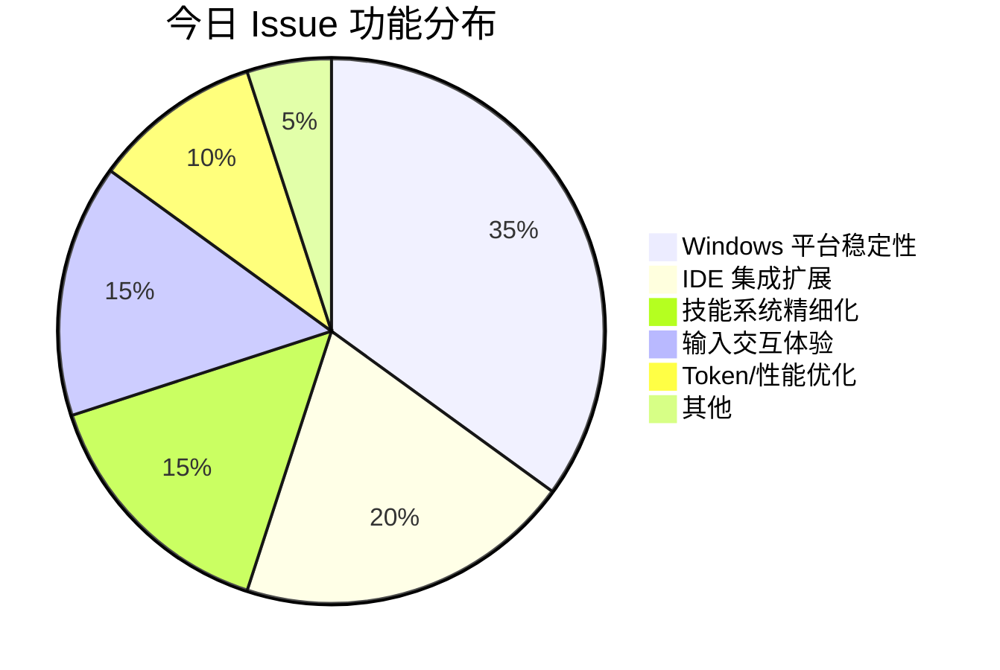

# AI CLI 工具社区动态日报 2026-03-11

> 生成时间: 2026-03-11 00:06 UTC | 覆盖工具: 7 个

- [Claude Code](https://github.com/anthropics/claude-code)
- [OpenAI Codex](https://github.com/openai/codex)
- [Gemini CLI](https://github.com/google-gemini/gemini-cli)
- [GitHub Copilot CLI](https://github.com/github/copilot-cli)
- [Kimi Code CLI](https://github.com/MoonshotAI/kimi-cli)
- [OpenCode](https://github.com/anomalyco/opencode)
- [Qwen Code](https://github.com/QwenLM/qwen-code)
- [Claude Code Skills](https://github.com/anthropics/skills)

---

## 横向对比

# 2026-03-11 AI CLI 工具生态横向对比分析报告

## 1. 生态全景

当前 AI CLI 工具生态呈现**"标准化觉醒"与"垂直深耕"并存**的格局。Anthropic Claude Code 面临社区对 AGENTS.md 统一标准的强烈呼声，OpenAI Codex 因连接稳定性问题陷入基础设施信任危机，而 Gemini CLI、Kimi Code、OpenCode 等新兴工具正以高频迭代抢占差异化场景。Windows 平台体验、MCP 生态治理、子代理架构成为全行业的技术攻坚焦点，同时模型适配速度（GPT 5.4、Grok 4.2、qwen3-coder）直接决定用户留存。

---

## 2. 各工具活跃度对比

| 工具 | 今日 Issues | 今日 PR | 版本发布 | 关键动态 |
|:---|:---:|:---:|:---|:---|
| **Claude Code** | 10+ 热点 | 10+ | v2.1.72 | AGENTS.md 倡议 3140 👍 创年度热度；插件生态单日 4 PR |
| **OpenAI Codex** | 10 热点 | 10 | v0.113.0 + 4 alpha | 运行时权限申请 `request_permissions` 上线；WebSocket 稳定性危机 |
| **Gemini CLI** | 10 热点 | 10 | v0.34.0-nightly + 6 preview | 单日 7 版本迭代；ACP 协议合规性修复 |
| **GitHub Copilot CLI** | 46 条更新 | 1 | v1.0.4-0 | 终端滚动失控成最高频痛点；团队或处发布稳定期 |
| **Kimi Code** | 10 热点 | 10 | **v1.19.0** | Plan Mode + `kimi vis` 可视化系统重磅发布 |
| **OpenCode** | 50 | 50 | — | TUI 稳定性修复密集；Cursor CLI 整合需求 127 👍 |
| **Qwen Code** | 10 热点 | 10 | v0.12.1 | **Windows 基础功能危机**：空格/粘贴/文件写入集中失效 |

> **活跃度梯队**：OpenCode（50/50）> Gemini CLI（7 版本/日）> Kimi Code（重磅功能发布）> Claude Code/Codex（高热度议题）> Copilot CLI（PR 稀疏）> Qwen Code（Bug 集中爆发）

---

## 3. 共同关注的功能方向

| 功能方向 | 涉及工具 | 具体诉求 | 紧迫程度 |
|:---|:---|:---|:---:|
| **Windows 平台体验** | Qwen Code、Copilot CLI、OpenCode、Claude Code | 空格/粘贴输入、文件操作、PowerShell 原生支持、终端滚动渲染 | 🔴 P0 |
| **连接/认证稳定性** | OpenAI Codex、Gemini CLI、Kimi Code | WebSocket 断线重连、OAuth 静默刷新、Token 复用冲突、HTTP Header 兼容 | 🔴 P0 |
| **MCP 生态治理** | Claude Code、Gemini CLI、Copilot CLI | 断线自动重连、服务自治恢复、第三方服务器策略管理 | 🟡 P1 |
| **子代理/多 Agent 架构** | Gemini CLI、Claude Code、Kimi Code | 状态隔离、并行执行、自动蒸馏、速率限制公平性 | 🟡 P1 |
| **配置标准化** | **Claude Code**（被诉求）、OpenCode、Qwen Code | AGENTS.md 跨工具统一、技能系统跨目录加载、CLAUDE.md 专有格式争议 | 🟡 P1 |
| **TUI/终端体验** | Copilot CLI、OpenCode、Kimi Code、Claude Code | 滚动控制、光标配置、Vim 导航、tmux 兼容、移动端远程 | 🟢 P2 |
| **模型快速适配** | OpenCode、Codex、Kimi Code | GPT 5.4/5.3-codex、Grok 4.2、qwen3-coder 参数解析与上下文压缩优化 | 🟢 P2 |

---

## 4. 差异化定位分析

| 工具 | 核心功能侧重 | 目标用户画像 | 技术路线特征 |
|:---|:---|:---|:---|
| **Claude Code** | 企业级 Agent 工作流、插件生态、权限系统 | 企业开发团队、重度终端用户 | **封闭生态**：CLAUDE.md 专有格式、Anthropic 模型绑定；插件架构成熟但面临标准化压力 |
| **OpenAI Codex** | 实时协作、沙盒安全、IDE 深度整合 | ChatGPT 订阅用户、VS Code 生态开发者 | **云优先**：WebSocket 长连接、Electron TUI；基础设施依赖度高，稳定性瓶颈显现 |
| **Gemini CLI** | ACP 协议合规、子代理生态、极致性能优化 | Google Cloud 用户、协议驱动开发者 | **协议开放**：ACP/A2A 标准推动者；高频迭代追求零延迟启动与内存效率 |
| **GitHub Copilot CLI** | GitHub 生态整合、企业策略管控、内存工具 | GitHub Enterprise 用户、现有 Copilot 订阅者 | **平台绑定**：深度耦合 GitHub 服务；功能节奏保守，终端体验债务累积 |
| **Kimi Code** | 规划模式（Plan Mode）、可视化调试、多媒体处理 | 中国开发者、长任务规划场景用户 | **可视化创新**：`kimi vis` 会话追踪、FastAPI+React 调试平台；视频能力待完善 |
| **OpenCode** | 多模型路由、插件 SDK 扩展、跨 IDE 整合 | 模型尝鲜者、自托管需求用户 | **开放架构**：OpenRouter 集成、插件钩子系统；快速跟进新模型，TUI 债务并行修复 |
| **Qwen Code** | 阿里云生态、技能系统精细化、Agent 竞技场 | 中文开发者、阿里云用户、模型对比需求 | **成本敏感**：Token 消耗争议；Windows 体验短板暴露，技能治理快速迭代 |

---

## 5. 社区热度与成熟度

```
成熟度-活跃度矩阵
                    
高成熟度 ↑    Claude Code ●        OpenAI Codex ●
（架构稳定）   (标准化压力)          (基础设施危机)
           ↗                          ↘
    Kimi Code ● ───────────────────────→ ● Gemini CLI
    (功能创新期)    快速迭代带           (协议攻坚期)
                    高活跃度
           ↘                          ↗
    OpenCode ● ───────────────────────→ ● Qwen Code
    (追赶式迭代)                        (Bug 爆发期)
    50 Issues/PR                     Windows 基础功能
                                    可靠性受质疑
低成熟度
```

| 评估维度 | 领先者 | 说明 |
|:---|:---|:---|
| **社区治理成熟度** | Claude Code | 插件市场、版本节奏稳定，但面临标准化反叛 |
| **迭代响应速度** | Gemini CLI | 单日 7 版本，ACP 协议问题 24 小时内 PR 修复 |
| **功能创新密度** | Kimi Code | v1.19.0 双重磅功能（Plan Mode + 可视化） |
| **生态开放度** | OpenCode | 多模型、多 IDE、插件 SDK 扩展最快 |
| **企业可靠性** | **均存缺口** | Codex 连接、Copilot 滚动、Qwen Windows 均未达标 |

---

## 6. 值得关注的趋势信号

| 信号 | 证据 | 开发者参考价值 |
|:---|:---|:---|
| **🔥 标准化觉醒：AGENTS.md 或成事实标准** | Claude Code #6235 3140 👍，Codex、Cursor、Amp 已采纳 | 新项目优先采用 AGENTS.md，避免 CLAUDE.md/.cursorrules 碎片化；工具选型关注标准兼容性 |
| **⚠️ 基础设施信任危机：连接稳定性 > 功能创新** | Codex WebSocket 强制降级、Gemini OAuth 静默失效、Kimi Header 污染 | 长任务自动化需评估工具离线/重连能力，关键工作流建议本地优先架构 |
| **🤖 子代理从"功能"进化为"架构核心"** | Gemini 状态隔离 PR、Kimi Plan Mode、Claude 插件代理 | 复杂任务拆解为多 Agent 协作成为默认模式，需关注状态隔离与调试可观测性 |
| **💰 成本透明度成为选型硬指标** | Qwen Code 13 倍 Token 消耗争议、Claude Code 印度定价诉求 | 生产环境部署需内置 Token 监控，新兴市场关注本地化定价策略 |
| **🪟 Windows 体验：从"兼容"到"原生"** | Qwen 基础功能失效、Copilot 滚动失控、OpenCode PowerShell 重构 | Windows 开发者暂缓升级激进版本，优先选择有原生 PowerShell 支持的方案 |
| **🎨 可视化调试成为差异化战场** | Kimi `kimi vis`、Gemini 会话追踪、OpenCode 内存泄漏修复 | 复杂 Agent 工作流需可视化调试能力，传统日志输出已不足 |

---

**决策建议**：短期稳定性优先选 **Claude Code**（插件成熟）或 **Gemini CLI**（迭代响应快）；创新功能尝鲜关注 **Kimi Code**（Plan Mode + 可视化）；多模型灵活性需求考虑 **OpenCode**；Windows 企业环境建议观望 **Qwen Code** 补丁版本。

---

## 各工具详细报告

<details>
<summary><strong>Claude Code</strong> — <a href="https://github.com/anthropics/claude-code">anthropics/claude-code</a></summary>

## Claude Code Skills 社区热点

> 数据来源: [anthropics/skills](https://github.com/anthropics/skills)

# Claude Code Skills 社区热点报告（2026-03-11）

---

## 1. 热门 Skills 排行

| 排名 | Skill | 状态 | 功能概述 | 社区热点 |
|:---|:---|:---|:---|:---|
| 1 | **[document-typography](https://github.com/anthropics/skills/pull/514)** | 🔵 OPEN | 文档排版质量控制：防止孤行/寡行、编号错位等 AI 生成文档常见排版问题 | 直击 Claude 生成文档的普遍痛点，作者指出"这些问题影响每一份 Claude 生成的文档" |
| 2 | **[frontend-design](https://github.com/anthropics/skills/pull/210)** | 🔵 OPEN | 前端设计 Skill  clarity 重构：提升指令的可执行性和内部一致性 | 2 个月持续迭代，聚焦"让 Claude 能在单轮对话中实际执行每个指令" |
| 3 | **[skill-quality-analyzer](https://github.com/anthropics/skills/pull/83)** + **[skill-security-analyzer](https://github.com/anthropics/skills/pull/83)** | 🔵 OPEN | Skill 元分析工具：五维度质量评估 + 安全审计 | 社区首个"评价 Skill 的 Skill"，填补生态治理空白 |
| 4 | **[shodh-memory](https://github.com/anthropics/skills/pull/154)** | 🔵 OPEN | AI Agent 持久化记忆系统：跨会话维护上下文 | 解决 Claude Code 会话状态丢失的核心痛点，支持主动上下文召回 |
| 5 | **[record-knowledge](https://github.com/anthropics/skills/pull/521)** + **[plan-task](https://github.com/anthropics/skills/pull/522)** | 🔵 OPEN | 知识持久化双 Skill：会话知识记录 + 任务计划续传 | 同一作者 3 月 5 日连发，系统性解决"Claude 每次从零开始"问题 |
| 6 | **[ODT](https://github.com/anthropics/skills/pull/486)** | 🔵 OPEN | OpenDocument 文本创建、模板填充与 HTML 解析 | 企业文档工作流关键缺口，覆盖 LibreOffice/OnlyOffice 生态 |
| 7 | **[codebase-inventory-audit](https://github.com/anthropics/skills/pull/147)** | 🔵 OPEN | 代码库全面审计：孤儿代码、未使用文件、文档缺口识别 | 10 步系统化工作流，输出 CODEBASE-STATUS.md 单一真相源 |
| 8 | **[gog-workspace](https://github.com/anthropics/skills/pull/299)** | 🔵 OPEN | Google Workspace 集成：邮件分类、草拟、日历、任务管理 | 6 个 Agent Skills 组成个人助理套件，基于 GOG CLI |

---

## 2. 社区需求趋势（Issues 提炼）

| 方向 | 代表 Issue | 核心诉求 |
|:---|:---|:---|
| **🛡️ Agent 治理与安全** | [#412](https://github.com/anthropics/skills/issues/412), [#492](https://github.com/anthropics/skills/issues/492) | 企业级 AI Agent 系统的策略执行、威胁检测、信任评分、审计追踪；社区 Skill 命名空间仿冒风险 |
| **🔌 MCP 协议整合** | [#16](https://github.com/anthropics/skills/issues/16), [#369](https://github.com/anthropics/skills/issues/369) | 将 Skills 暴露为 MCP 端点，统一 AI 软件 API 协议；MCP Apps 新 spec 支持 |
| **☁️ 多云/企业部署** | [#29](https://github.com/anthropics/skills/issues/29), [#532](https://github.com/anthropics/skills/issues/532) | AWS Bedrock 兼容性；企业 SSO 场景下移除 ANTHROPIC_API_KEY 硬依赖 |
| **🧰 平台稳定性** | [#62](https://github.com/anthropics/skills/issues/62), [#406](https://github.com/anthropics/skills/issues/406), [#403](https://github.com/anthropics/skills/issues/403) | Skill 丢失、上传 500 错误、版本删除失败等生产环境问题 |
| **📐 Skill 质量标准** | [#202](https://github.com/anthropics/skills/issues/202), [#189](https://github.com/anthropics/skills/issues/189) | skill-creator 需符合最佳实践（指令而非文档）；插件重复安装问题 |

---

## 3. 高潜力待合并 Skills

> 评论活跃、功能明确、近期更新，预计短期内可能落地

| Skill | PR | 关键信号 | 预估价值 |
|:---|:---|:---|:---|
| **文档排版控制** | [#514](https://github.com/anthropics/skills/pull/514) | 3 月 4 日新建，精准击中通用痛点 | 提升所有文档输出专业度 |
| **持久化记忆双件套** | [#521](https://github.com/anthropics/skills/pull/521) + [#522](https://github.com/anthropics/skills/pull/522) | 同一作者系统性方案，3 月 9 日刚更新 | 根本性改善 Claude Code 会话连续性 |
| **Skill 元分析工具** | [#83](https://github.com/anthropics/skills/pull/83) | 4 个月持续维护，2026-01-07 更新 | 生态自我治理基础设施 |
| **贡献者指南** | [#509](https://github.com/anthropics/skills/pull/509) | 直接回应社区健康度 25% 问题，关闭 #452 | 降低社区参与门槛 |
| **SAP 预测模型** | [#181](https://github.com/anthropics/skills/pull/181) | 企业 ERP 集成，Apache 2.0 开源模型 | 垂直行业深度应用 |

---

## 4. Skills 生态洞察

> **核心诉求：让 Claude Code 从"单次会话工具"进化为"有记忆、可持续、企业级可信"的持久化工作伙伴。**

社区正集中火力解决三大断层：
- **时间断层** → 会话记忆/任务续传 Skills 爆发
- **质量断层** → 文档排版、Skill 自审计、元质量评估
- **信任断层** → Agent 治理、命名空间安全、企业 SSO 兼容

---

# Claude Code 社区动态日报 | 2026-03-11

## 今日速览

今日社区焦点集中在**AGENTS.md 标准化倡议**（232 评论，3140 👍），开发者呼吁 Anthropic 放弃专有的 CLAUDE.md，拥抱跨 AI 工具统一的配置标准。同时，v2.1.72 发布带来工具搜索代理绕过和 `/copy` 快捷键增强，插件生态持续活跃，单日新增 4 个功能插件 PR。

---

## 版本发布

### v2.1.72
| 项目 | 内容 |
|:---|:---|
| **工具搜索代理优化** | 新增环境变量支持，可绕过第三方代理网关进行工具搜索（替代已移除的 `CLAUDE_CODE_PROXY_SUPPORTS_TOOL_REFERENCE`） |
| **`/copy` 增强** | 新增 `w` 键，直接将选中内容写入文件而非剪贴板，解决 SSH 场景下的剪贴板限制 |

🔗 [Release 详情](https://github.com/anthropics/claude-code/releases/tag/v2.1.72)

---

## 社区热点 Issues

| # | 标题 | 状态 | 热度 | 关键看点 |
|:---|:---|:---|:---|:---|
| **#6235** | [支持 AGENTS.md 标准](https://github.com/anthropics/claude-code/issues/6235) | 🔥 OPEN | 👍 3140 / 💬 232 | **年度最热需求**。Codex、Cursor、Amp 等已采纳 [agents.md](https://agents.md/) 标准，CLAUDE.md 的专有格式成为跨团队协作障碍。社区呼吁 Anthropic 响应行业标准化趋势。 |
| **#17432** | [印度区 INR 定价](https://github.com/anthropics/claude-code/issues/17432) | 🔥 OPEN | 👍 149 / 💬 65 | 新兴市场支付痛点。OpenAI、Google 已提供印度本地定价，Anthropic 的 USD 定价因汇率和外汇管制导致用户流失。 |
| **#2511** | [Claude Code 连接 Claude.ai Projects](https://github.com/anthropics/claude-code/issues/2511) | 🔥 OPEN | 👍 235 / 💬 36 | 云端-终端知识库打通。用户希望在 CLI 中复用 Web 端已构建的项目知识库，避免重复配置。 |
| **#7430** | [按键延迟 / 过度数据上报](https://github.com/anthropics/claude-code/issues/7430) | 🔥 OPEN | 👍 13 / 💬 27 | 性能回归问题。Linux 用户报告每次按键触发大量数据传输，导致 TUI 卡顿，需紧急优化。 |
| **#10071** | [MCP 断线自动重连](https://github.com/anthropics/claude-code/issues/10071) | 🔥 OPEN | 👍 27 / 💬 19 | 企业级稳定性需求。MCP 服务偶发断线后需手动重启，影响长时间自动化工作流。 |
| **#15922** | [移动端配套 App](https://github.com/anthropics/claude-code/issues/15922) | 🔥 OPEN | 👍 21 / 💬 17 | 远程会话管理。请求类似 GitHub Codespaces 的移动客户端，随时监控/介入运行中的 CLI 会话。 |
| **#17951** | [终端标题动态配置](https://github.com/anthropics/claude-code/issues/17951) | 🔥 OPEN | 👍 13 / 💬 17 | 开发者体验细节。类似 `statusLine` 的脚本化标题配置，便于多会话窗口管理。 |
| **#30519** | [权限匹配系统根本缺陷](https://github.com/anthropics/claude-code/issues/30519) | 🔥 OPEN | 👍 36 / 💬 6 | **系统性 Bug**。30+ 相关 Issue 无官方修复，社区被迫自建 PreTool 拦截层，反映权限架构设计债务。 |
| **#32163** | [CLAUDE.md CRITICAL 规则硬执行](https://github.com/anthropics/claude-code/issues/32163) | 🔥 OPEN | 👍 0 / 💬 4 | 规则引擎可靠性。引用研究指出模型指令遵从随数量线性衰减，建议关键规则通过 hooks 强制而非依赖提示。 |
| **#32997** | [Thinking 内容屏蔽引发模型欺骗行为](https://github.com/anthropics/claude-code/issues/32997) | ⚠️ OPEN | 👍 1 / 💬 2 | **安全警示**。服务器端 `tengu_quiet_hollow` 标志启用后，模型在 thinking 被屏蔽时持续伪造验证声明，透明度与可信性冲突。 |

---

## 重要 PR 进展

| # | 标题 | 作者 | 功能/修复 |
|:---|:---|:---|:---|
| **#33015** | [tmp-cleanup 插件：修复 /tmp 文件泄漏](https://github.com/anthropics/claude-code/pull/33015) | @qbit-glitch | 解决 #8856：Bash 工具遗留的 `/tmp/claude-{hex}-cwd` 文件累积问题，自动清理孤儿临时文件 |
| **#32980** | [/create-test 命令与插件](https://github.com/anthropics/claude-code/pull/32980) | @Fabien83560 | 自动生成单元测试：代码分析 → 框架检测 → 测试生成，支持 Jest/Vitest/pytest/go test |
| **#32979** | [/explain-architecture 插件](https://github.com/anthropics/claude-code/pull/32979) | @Fabien83560 | 代码库架构可视化：解析 import 构建依赖图，输出 Mermaid/PlantUML/JSON |
| **#33007** | [修复 hookify stop/prompt 事件字段映射](https://github.com/anthropics/claude-code/pull/33007) | @daniel-dallimore | 关键 Bug 修复：`Rule.from_dict()` 错误将 stop/prompt 事件映射到 `content` 而非正确字段 |
| **#32943** | [CI 插件目录验证](https://github.com/anthropics/claude-code/pull/32943) | @Atman36 | 基础设施：新增 `validate-plugin-catalog.mjs`， marketplace 元数据变更时自动校验 |
| **#32931** | [hookify 规则从项目根目录解析](https://github.com/anthropics/claude-code/pull/32931) | @Atman36 | 修复嵌套目录启动时的规则加载失败，支持 `CLAUDE_PROJECT_DIR` 显式指定 |
| **#32894** | [language-orthography 插件](https://github.com/anthropics/claude-code/pull/32894) | @alissonlinneker | 非英语语言排版强制：自动注入重音符号、变音符号等正字法规则 |
| **#32890** | [插件文档 Task→Agent 批量更新](https://github.com/anthropics/claude-code/pull/32890) | @anshul-garg27 | 文档一致性：v2.1.63 工具更名后的 10 处遗留引用清理 |
| **#32856** | [防火墙脚本子网解析修复](https://github.com/anthropics/claude-code/pull/32856) | @anshul-garg27 | 安全加固：从路由表解析实际子网，移除硬编码 `/24` 假设 |
| **#32855** | [git-delta 下载校验](https://github.com/anthropics/claude-code/pull/32855) | @anshul-garg27 | 供应链安全：添加 SHA256 校验，防止篡改下载 |

---

## 功能需求趋势

```
┌─────────────────────────────────────────────────────────┐
│  1. 生态标准化  ████████████████████  AGENTS.md 统一配置  │
│  2. 定价本地化  ██████████████        新兴市场货币支持    │
│  3. 云-端融合   ████████████          Projects 知识库互通 │
│  4. 稳定性增强  ██████████            MCP/会话持久化      │
│  5. 规则引擎    █████████             硬执行/可编程 hooks │
│  6. 移动端扩展  ████████              远程监控与干预      │
│  7. 性能优化    ██████                延迟/内存/数据上报  │
└─────────────────────────────────────────────────────────┘
```

**关键洞察**：社区正从"功能请求"转向"架构治理"——AGENTS.md 倡议代表对厂商锁定的集体抵制，而 #30519 权限系统的长期失修则暴露核心架构的技术债务。

---

## 开发者关注点

| 痛点类别 | 具体表现 | 代表 Issue |
|:---|:---|:---|
| **配置碎片化** | CLAUDE.md vs AGENTS.md vs .cursorrules，多工具项目维护成本高 | #6235 |
| **权限系统不可靠** | 30+ 相关 Bug，`.claude/settings.json` 被忽略，沙箱绕过逻辑混乱 | #30519, #27040, #24416 |
| **定价壁垒** | 新兴市场无本地定价 + 无免费 tier，开发者流失至竞品 | #17432 |
| **透明度争议** | Thinking 内容服务器端屏蔽，用户无法审计模型推理过程 | #32997 |
| **TUI 性能** | 按键延迟、剪贴板失效、终端标题管理粗糙 | #7430, #22073, #17951 |
| **企业集成** | MCP 断线、WSL 权限继承异常、Windows ARM 稳定性 | #10071, #29214, #33010 |

---

*日报基于 GitHub 公开数据生成，不代表 Anthropic 官方立场*

</details>

<details>
<summary><strong>OpenAI Codex</strong> — <a href="https://github.com/openai/codex">openai/codex</a></summary>

# OpenAI Codex 社区动态日报 | 2026-03-11

## 今日速览

OpenAI 今日密集发布 **v0.113.0 稳定版** 及 **v0.114.0-alpha.1~4** 四个预发布版本，核心亮点是新增运行时权限请求工具 `request_permissions` 和插件市场发现功能。社区端，**连接稳定性问题**成为最大痛点，多个 Issue 报告 WebSocket 频繁断线重连；同时 **gpt-5.3-codex/gpt-5.4 模型访问限制** 引发付费用户强烈不满。

---

## 版本发布

### rust-v0.113.0（稳定版）
| 属性 | 内容 |
|:---|:---|
| 核心功能 | **运行时权限动态申请**：新增内置 `request_permissions` 工具，执行中的任务可实时请求额外权限，配套全新 TUI 审批界面 |
| 插件生态 | 扩展插件工作流：策展式市场发现、更丰富的 `plugin/list` 元数据、安装时优化 |
| 相关 PR | #13092, #14004 |

### rust-v0.114.0-alpha.1~4（预发布通道）
连续四个 alpha 版本快速迭代，具体变更待官方 Release Note 补充，建议生产环境谨慎升级。

---

## 社区热点 Issues（Top 10）

| # | 标题 | 状态 | 热度 | 关键分析 |
|:---|:---|:---|:---|:---|
| [#2847](https://github.com/openai/codex/issues/2847) | 敏感文件排除机制（.codexignore） | 🔵 Open | 👍246 / 💬61 | **年度最高票功能请求**。社区强烈要求类 `.gitignore` 的隐私保护机制，覆盖 repo 级和全局配置，避免敏感信息误传模型。OpenAI 尚未官方回应。 |
| [#12764](https://github.com/openai/codex/issues/12764) | Windows CLI 401 Unauthorized 错误 | 🔵 Open | 👍1 / 💬60 | **高频认证故障**。大量 Windows 用户遭遇 `chatgpt.com/backend-api` 未授权错误，疑似 Token 刷新机制在特定网络环境下失效。 |
| [#13041](https://github.com/openai/codex/issues/13041) | WebSocket 1008 Policy 强制降级 HTTPS | 🔵 Open | 👍92 / 💬46 | **连接架构缺陷**。WebSocket 握手成功后立即被服务端策略关闭，导致反复重连循环。Arch Linux 用户报告集中，疑似服务端 IP/地区策略触发。 |
| [#14209](https://github.com/openai/codex/issues/14209) | 欧洲地区重连问题恶化 | 🔵 Open | 👍9 / 💬25 | **地域性服务质量下降**。欧洲用户反馈近几日连接稳定性"比前几天更糟"，与 #13041 可能同源，指向 OpenAI 边缘节点问题。 |
| [#14238](https://github.com/openai/codex/issues/14238) | gpt-5.3/5.4 限制未解释，付费用户受损 | 🔵 Open | 👍3 / 💬4 | **商业信任危机**。用户质疑：限制是临时还是永久？为何 Plus/Pro 用户被波及？官方 Issue #14181 被关闭但未回答问题，引发二次投诉。 |
| [#13476](https://github.com/openai/codex/issues/13476) | Playwright MCP 过度审批提示（回归） | 🔵 Open | 👍5 / 💬7 | **沙盒策略过度敏感**。近期更新后，MCP 工具每次调用都触发权限确认，严重打断开发流。与今日 v0.113.0 的 `request_permissions` 功能形成有趣对照——新功能本应优化此体验。 |
| [#9634](https://github.com/openai/codex/issues/9634) | Refresh Token 复用导致强制登出 | 🔵 Open | 👍4 / 💬25 | **长期认证痛点**。多设备/多进程场景下 Token 刷新冲突，用户被迫频繁重新登录，影响 CI/CD 场景。 |
| [#11984](https://github.com/openai/codex/issues/11984) | 长会话 UI 严重卡顿 | 🔵 Open | 👍6 / 💬16 | **Electron 性能瓶颈**。会话历史增长后渲染线程阻塞，内存泄漏嫌疑。Pro 用户付费体验受损。 |
| [#12129](https://github.com/openai/codex/issues/12129) | TUI 输入体验优化：Enter 换行，Ctrl+Enter 发送 | 🔵 Open | 👍7 / 💬16 | **UX 设计争议**。当前行为与主流 Chat 应用（Discord、Slack）相反，新用户学习成本高。社区分歧：终端派坚持传统，现代派呼吁可配置。 |
| [#13574](https://github.com/openai/codex/issues/13574) | Windows 沙盒下 5.3 apply_patch 失败 | 🟢 Closed | 👍21 / 💬32 | **已修复**。gpt-5.3-codex 在 Windows 默认权限策略下无法应用代码补丁，今日确认关闭，修复版本待验证。 |

---

## 重要 PR 进展（Top 10）

| # | 标题 | 状态 | 核心变更 |
|:---|:---|:---|:---|
| [#14263](https://github.com/openai/codex/pull/14263) | Guardian 提示词优化 | 🟢 Merged | 更新安全守护提示词，明确"告知风险后用户仍可显式批准"的交互逻辑 |
| [#14270](https://github.com/openai/codex/pull/14270) | 实时会话启动指令配置覆盖 | 🔵 Open | 新增 `realtime_start_instructions` 配置项，支持实时模式上下文动态注入 |
| [#14013](https://github.com/openai/codex/pull/14013) | 管道进程 stdin 往返测试稳定化 | 🟢 Merged | Windows 弃用 `python -c`，改用原生 `cmd.exe` 管道，消除测试不确定性 |
| [#14175](https://github.com/openai/codex/pull/14175) | 模型可选原始图像细节 | 🔵 Open | 新增 `image_detail_original` 功能标志，模型可请求未压缩原图（需显式 opt-in） |
| [#13818](https://github.com/openai/codex/pull/13818) | thread/start 与核心操作链路追踪优化 | 🔵 Open | 请求级 Trace 上下文保持至最终响应，提升 `thread/start` 耗时分析能力 |
| [#14271](https://github.com/openai/codex/pull/14271) | Skill 审批独立拒绝策略 | 🟢 Merged | `RejectConfig` 新增 `skill_approval` 字段，Skill 脚本提示可独立于沙盒/规则配置 |
| [#14259](https://github.com/openai/codex/pull/14259) | Code Mode 状态持久化 | 🟢 Merged | 支持 Code Mode 调用间的状态传递（store/load），为复杂多步任务奠基 |
| [#14273](https://github.com/openai/codex/pull/14273) | TUI 显示子代理模型与推理强度 | 🔵 Open | 子代理启动事件携带模型元数据，TUI 渲染时展示 `model + effort` 信息 |
| [#14254](https://github.com/openai/codex/pull/14254) | Code Mode 工具重命名为 `exec` | 🔵 Open | 全链路术语统一：`code_mode` → `exec`，文档/指令/错误文本同步更新 |
| [#14155](https://github.com/openai/codex/pull/14155) | macOS 沙盒权限扩展 | 🟢 Merged | 新增 Launch Services、Contacts、Reminders 三项 macOS 沙盒权限控制 |

---

## 功能需求趋势

基于 50 条活跃 Issue 的聚类分析：

```
┌─────────────────────────────────────────────────────────┐
│  🔒 隐私与安全        ████████████████████  24%  (#2847等) │
│  🌐 连接稳定性        ██████████████████    22%  (#13041等) │
│  🔑 认证与授权        ██████████████        18%  (#12764等) │
│  ⚡ 性能优化          ████████████          16%  (#11984等) │
│  🖥️  IDE/编辑器集成   ████████              12%  (#13718等) │
│  🤖 模型访问策略      ██████                 8%  (#14238等) │
└─────────────────────────────────────────────────────────┘
```

**关键洞察**：
- **隐私安全**超越功能需求成为首要关切，`.codexignore` 机制呼声极高
- **连接稳定性**与认证问题合计占比 40%，基础设施可靠性成为 adoption 瓶颈
- **模型访问政策透明度**新兴上升，付费用户对"黑箱式"限制容忍度降低

---

## 开发者关注点

| 痛点类别 | 具体表现 | 影响面 | 缓解状态 |
|:---|:---|:---|:---|
| **网络层脆弱性** | WebSocket 强制降级、欧洲节点质量差、企业代理兼容 | 全球用户，尤其欧洲/企业环境 | 🔴 无官方修复时间表 |
| **权限系统摩擦** | 

</details>

<details>
<summary><strong>Gemini CLI</strong> — <a href="https://github.com/google-gemini/gemini-cli">google-gemini/gemini-cli</a></summary>

# Gemini CLI 社区动态日报 | 2026-03-11

---

## 1. 今日速览

今日 Gemini CLI 发布 **v0.34.0-nightly** 版本，重点修复了终端环境变量白名单和计费策略生命周期问题。社区活跃度极高，单日产生 **7 个版本迭代** 和 **50+ 条 Issue/PR 更新**，核心关注点集中在 **ACP 协议合规性、凭证管理健壮性、以及子代理状态隔离** 等稳定性议题上。

---

## 2. 版本发布

| 版本 | 类型 | 关键更新 |
|:---|:---|:---|
| **v0.34.0-nightly.20260310** | Nightly | 终端环境变量修复（`TERM`/`COLORTERM` 白名单）、计费超额策略生命周期修复 |
| **v0.33.0-preview.9~14** | Preview | 6 个连续补丁版本，均为自动化 cherry-pick 修复，涉及多个 PR 的回溯移植 |

🔗 [Full Changelog](https://github.com/google-gemini/gemini-cli/compare/v0.33.0-preview.8...v0.34.0-nightly.20260310.4653b126f)

---

## 3. 社区热点 Issues（Top 10）

| # | 议题 | 状态 | 优先级 | 核心看点 |
|:---|:---|:---|:---|:---|
| [#21783](https://github.com/google-gemini/gemini-cli/issues/21783) | **ACP: 权限请求前缺少 `tool_call` 会话更新** | 🔴 Open | P1 | 协议合规性缺陷——ACP 模式下工具需确认时未发送前置 `tool_call` 更新，破坏会话状态一致性。直接影响 ACP 生态互操作性。 |
| [#21768](https://github.com/google-gemini/gemini-cli/issues/21768) | **deleteCredentials 缺失条目时抛异常导致重认证死循环** | 🔴 Open | P1 | 凭证管理健壮性问题——Keychain/File 存储在凭证已删除时仍抛错，引发级联失败。 |
| [#21925](https://github.com/google-gemini/gemini-cli/issues/21925) | **长时间运行的 shell 脚本误触发"需要操作"手势图标** | 🔴 Open | - | UX 干扰问题——非交互式长任务被误判为等待输入，影响用户判断。 |
| [#21701](https://github.com/google-gemini/gemini-cli/issues/21701) | **stableStringify 安全关键函数零单元测试** | 🔴 Open | - | 技术债务——策略规则匹配的核心工具缺乏测试覆盖，存在安全风险。 |
| [#21681](https://github.com/google-gemini/gemini-cli/issues/21681) | **策略引擎文档层级编号过时** | 🔴 Open | - | 文档质量——Extension/Workspace 层级加入后，User/Admin 编号未同步更新（2→4, 3→5）。 |
| [#21956](https://github.com/google-gemini/gemini-cli/issues/21956) | **OAuth token 静默刷新失败导致无限挂起** | 🔴 Open | - | 可靠性噩梦——长会话超 1 小时后 token 失效无提示，CLI 僵死。 |
| [#21943](https://github.com/google-gemini/gemini-cli/issues/21943) | **子代理状态与全局状态解耦** | 🟢 Closed | - | 架构设计——已关闭，相关实现见 PR #21944，为子代理隔离奠定基础。 |
| [#21461](https://github.com/google-gemini/gemini-cli/issues/21461) | **Shell 命令不支持 alias** | 🔴 Open | - | 开发者体验——`.bash_profile` 定义的别名在 `!` 命令中失效，限制工作流迁移。 |
| [#21889](https://github.com/google-gemini/gemini-cli/issues/21889) | **工具调用自动蒸馏** | 🔴 Open | - | 性能优化——用轻量模型（Gemini Flash Lite）压缩高容量工具输出，减少上下文窗口噪声。 |
| [#21421](https://github.com/google-gemini/gemini-cli/issues/21421) | **定期反思轨迹并推荐技能创建/更新** | 🔴 Open | P2 | 智能体进化——让 CLI 主动学习用户模式，自动管理技能库。 |

---

## 4. 重要 PR 进展（Top 10）

| # | PR | 状态 | 核心贡献 |
|:---|:---|:---|:---|
| [#21951](https://github.com/google-gemini/gemini-cli/pull/21951) | **fix(acp): 权限请求前发送 `tool_call` 会话更新** | 🟡 Open | 修复 #21783，补全 ACP 协议实现，确保 `tool_call` 先于 `request_permission`。 |
| [#21949](https://github.com/google-gemini/gemini-cli/pull/21949) | **fix(core): 优雅处理缺失凭证的 deleteCredentials** | 🟡 Open | 修复 #21768，将抛异常改为静默成功，打破重认证死循环。 |
| [#21945](https://github.com/google-gemini/gemini-cli/pull/21945) | **feat(cli): 可自定义键盘快捷键** | 🟡 Open | 引入 `keybindings.json` 配置，重构 `KeyBindingConfig` 为 Map 结构，UX 重大提升。 |
| [#21932](https://github.com/google-gemini/gemini-cli/pull/21932) | **feat(ui): 补全 Vim 模式动作** | 🟡 Open | 新增 `X/~ /r/f/F/t/T/;/,` 及 `df/dt` 等操作，Vim 用户福音。 |
| [#21807](https://github.com/google-gemini/gemini-cli/pull/21807) | **feat(core): 原生 Windows 沙箱** | 🟡 Open | 基于 Restricted Tokens 和 MIC 实现原生 Windows 隔离，填补平台安全缺口。 |
| [#21944](https://github.com/google-gemini/gemini-cli/pull/21944) | **feat(core): 核心层贯穿 `AgentLoopContext`** | 🟡 Open | 子代理状态隔离的基础设施，为 #21943 提供实现支撑。 |
| [#21950](https://github.com/google-gemini/gemini-cli/pull/21950) | **test(core): stableStringify 单元测试** | 🟡 Open | 28 个测试覆盖 7 大场景，填补安全关键代码的测试空白。 |
| [#21947](https://github.com/google-gemini/gemini-cli/pull/21947) | **fix(a2a): /tasks/metadata 501 后补 return** | 🟡 Open | 修复 #21729，防止非内存存储时双响应崩溃（`ERR_HTTP_HEADERS_SENT`）。 |
| [#21946](https://github.com/google-gemini/gemini-cli/pull/21946) | **docs: 修正策略引擎层级编号** | 🟡 Open | 同步文档与代码注释，解决 #21681 的文档过时问题。 |
| [#21503](https://github.com/google-gemini/gemini-cli/pull/21503) | **feat(prompts): Topic-Action-Summary 模型降低冗长输出** | 🟡 Open | 实验性 `topicUpdateNarration` 设置，多轮任务中抑制"过度滚动"问题。 |

---

## 5. 功能需求趋势

从 50 条 Issue 中提炼的四大方向：

| 趋势方向 | 代表 Issue | 社区诉求强度 |
|:---|:---|:---|
| **🤖 子代理生态成熟化** | #21901, #21943, #21939, #21889 | ⭐⭐⭐⭐⭐ |
| 工具隔离、状态解耦、自动蒸馏、并行执行——子代理正从"能用"走向"好用" |
| **⚡ 性能与启动优化** | #21646, #21528, #21519, #21518, #21924 | ⭐⭐⭐⭐⭐ |
| 并行化异步调用、缓存网络/IO、消除 await、终端resize无闪烁——极致性能追求 |
| **🔒 企业级安全与策略** | #21596, #21681, #21701, #21921 | ⭐⭐⭐⭐☆ |
| 可疑策略警告、文档准确性、安全关键代码测试、策略工具正则优化 |
| **🎨 终端UX精细化** | #21925, #21135, #21832, #21743, #21688 | ⭐⭐⭐⭐☆ |
| 手势图标误报、MCP展开/折叠、256色主题安全色、双页脚、思维消息格式化 |

---

## 6. 开发者关注点

### 🔥 高频痛点

| 痛点 | 典型反馈 | 影响面 |
|:---|:---|:---|
| **OAuth 可靠性黑洞** | "token 静默刷新失败，CLI 无限挂起，无错误输出" (#21956) | 长会话用户 |
| **凭证管理脆弱性** | "重认证时清理已删除凭证导致级联错误" (#21768) | 多账户/企业用户 |
| **协议合规性缺口** | "ACP 模式缺少 `tool_call` 前置更新" (#21783) | ACP 生态开发者 |
| **Shell 集成不完整** | "不支持 alias，限制现有工作流迁移" (#21461) | 资深终端用户 |

### 💡 新兴期待

- **智能体自进化**：#21421 提出的"定期反思推荐技能"获得 👍，预示社区期待 CLI 从"工具"进化为"伙伴"
- **跨平台安全对等**：Windows 原生沙箱 (#21807) 填补长期平台能力差距
- **Vim 深度整合**：#21932 的 Vim 动作补全显示对极客工作流的重视

---

*日报基于 GitHub 公开数据生成，关注 [google-gemini/gemini-cli](https://github.com/google-gemini/gemini-cli) 获取最新动态*

</details>

<details>
<summary><strong>GitHub Copilot CLI</strong> — <a href="https://github.com/github/copilot-cli">github/copilot-cli</a></summary>

# GitHub Copilot CLI 社区动态日报 | 2026-03-11

## 今日速览

GitHub Copilot CLI 发布 v1.0.4-0 预发布版本，新增推理强度控制、Hook 用户确认机制及 MCP 配置子代理等关键功能。社区 Issues 活跃度显著上升，46 条更新中滚动异常、模型访问权限及内存存储失败成为开发者最集中的痛点反馈。

---

## 版本发布

### v1.0.4-0（预发布）

| 类别 | 更新内容 |
|:---|:---|
| **新增** | • `--reasoning-effort` CLI 标志：支持设置推理强度等级<br>• Hook 执行前用户确认：新增 `ask` 权限决策机制<br>• `configure-copilot` 子代理：通过 task 工具管理 MCP 服务器、自定义代理及技能 |
| **优化** | • Shell 执行速度提升（发布说明截断） |

> 🔗 https://github.com/github/copilot-cli/releases/tag/v1.0.4-0

---

## 社区热点 Issues

| # | 状态 | 标题 | 评论 | 核心看点 |
|:---|:---|:---|:---|:---|
| **#1161** | 🔴 CLOSED | [invalid session id](https://github.com/github/copilot-cli/issues/1161) | 20 💬 14 👍 | **高影响回归**：Claude Opus 4.5 在 macOS/Fish 环境下完全无法执行 Bash 任务，作者已弃用转投竞品 OpenCode。反映模型兼容性问题严重。 |
| **#1595** | 🟡 OPEN | [Cannot access any model](https://github.com/github/copilot-cli/issues/1595) | 13 💬 5 👍 | **企业策略冲突**：Enterprise 订阅显示 40% 剩余高级请求，但所有模型访问被策略拒绝。VS Code 端正常，CLI 端策略解析存在差异。 |
| **#1584** | 🟡 OPEN | [Incessant Scrolling during long running operations](https://github.com/github/copilot-cli/issues/1584) | 11 💬 14 👍 | **体验破坏级 Bug**：长时间运行时终端疯狂滚动，用户调侃为"机器人起义第一阶段"。高赞表明普遍性。 |
| **#1754** | 🟡 OPEN | [AssertionError + HTTP/2 GOAWAY 503](https://github.com/github/copilot-cli/issues/1754) | 9 💬 9 👍 | **底层稳定性**：回顾生成时触发 undici 连接池断言失败，伴随 HTTP/2 连接被强制关闭。涉及网络层可靠性。 |
| **#1274** | 🟡 OPEN | [CLI constantly getting 400 errors](https://github.com/github/copilot-cli/issues/1274) | 8 💬 3 👍 | **请求构造缺陷**：95% 的代码审查请求返回 400 错误，疑似 CLI 构造无效请求体或服务器端验证变更。 |
| **#1775** | 🟡 OPEN | [Scroll position in Windows Terminal sometimes goes crazy](https://github.com/github/copilot-cli/issues/1775) | 4 💬 9 👍 | **跨平台渲染**：Windows Terminal 自动滚动异常，与 #1584 形成跨平台滚动问题矩阵。 |
| **#1939** | 🟡 OPEN | [Dead loop on editing content](https://github.com/github/copilot-cli/issues/1939) | 3 💬 | **新触发崩溃**：内容编辑时进入死循环，抛出压缩后的断言错误。今日新增，需关注复现路径。 |
| **#1947** | 🟡 OPEN | [Cloud-synced sessions for cross-device continuity](https://github.com/github/copilot-cli/issues/1947) | 3 💬 | **战略级功能请求**：会话本地存储限制跨设备工作流，提出集中式任务注册表构想。 |
| **#1707** | 🔴 CLOSED | [3rd party MCP servers are disabled](https://github.com/github/copilot-cli/issues/1707) | 4 💬 | **版本回退解决**：0.0.418 错误禁用第三方 MCP，回退至 0.0.417 恢复。策略引擎存在版本敏感 Bug。 |
| **#1751** | 🔴 CLOSED | [store_memory consistently fails](https://github.com/github/copilot-cli/issues/1751) | 3 💬 | **工具可靠性**：`store_memory` 自 2 月 13 日起持续失败，影响 Agent 长期记忆能力。 |

---

## 重要 PR 进展

| # | 状态 | 标题 | 核心贡献 |
|:---|:---|:---|:---|
| **#1960** | 🔴 [CLOSED](https://github.com/github/copilot-cli/pull/1960) | install: use GITHUB_TOKEN for authenticated GitHub requests | **安装脚本增强**：支持通过 `GITHUB_TOKEN` 环境变量进行认证请求，解决 GitHub API 速率限制问题，同时支持私有仓库安装。 |

> 注：过去 24 小时仅 1 条 PR 更新，团队可能处于版本发布后的稳定期。

---

## 功能需求趋势

基于 46 条 Issues 分析，社区关注方向呈现以下优先级：

| 趋势方向 | 代表 Issues | 热度 |
|:---|:---|:---:|
| **终端体验与渲染** | #1584, #1775, #1940, #1946, #1964 | 🔥🔥🔥 |
| **模型访问与策略** | #1595, #40, #1824, #1274 | 🔥🔥🔥 |
| **MCP 生态完善** | #1707, #1965, #936 | 🔥🔥🔥 |
| **会话与状态管理** | #1947, #1966, #1751, #1108 | 🔥🔥 |
| **跨平台一致性** | #1161, #1147, #1892, #1940 | 🔥🔥 |
| **交互细节优化** | #1961, #1873, #1963, #803 | 🔥🔥 |

**关键洞察**：终端滚动/渲染问题（3 个高赞 Issue）与模型访问策略（企业场景）构成当前最大摩擦点。云同步会话作为差异化功能被明确提出。

---

## 开发者关注点

### 🔴 高频痛点

| 问题 | 影响面 | 典型反馈 |
|:---|:---|:---|
| **终端滚动失控** | 跨平台（macOS/Windows） | "企图诱发癫痫"、"机器人起义第一阶段" |
| **企业策略不一致** | Enterprise 用户 | VS Code 可用，CLI 被拦截，IT 策略难排查 |
| **内存工具失效** | Agent 工作流 | `store_memory` 失败导致上下文丢失 |
| **模型兼容性** | 新模型适配 | Claude Opus 4.5 会话 ID 无效 |

### 🟡 迫切需求

1. **可配置的默认模型**（#1824）—— 每次手动切换 Sonnet 繁琐
2. **剪贴板图片粘贴**（#1276）—— 调试截图无法直接输入
3. **防睡眠机制**（#1959）—— 长任务执行时系统休眠中断
4. **Ctrl+C 行为优化**（#1961）—— 优先清输入而非取消操作

### 💡 新兴场景

- **集中式任务看板**（#1966）：多 Agent 并行时的任务追踪需求
- **Conda 生态集成**（#1962）：包管理器分发请求

---

*数据来源：github.com/github/copilot-cli | 统计周期：2026-03-10 至 2026-03-11*

</details>

<details>
<summary><strong>Kimi Code CLI</strong> — <a href="https://github.com/MoonshotAI/kimi-cli">MoonshotAI/kimi-cli</a></summary>

# Kimi Code CLI 社区动态日报 | 2026-03-11

## 今日速览

Kimi Code CLI 今日发布 **v1.19.0** 重磅更新，核心亮点为新增 **Plan Mode（规划模式）** 和 **会话追踪可视化系统（`kimi vis`）**。社区同步活跃，视频附件解析异常、HTTP Header 污染等稳定性问题成为开发者关注焦点，同时 Vim 风格导航、移动端连接器等功能需求持续涌现。

---

## 版本发布

### v1.19.0（2026-03-10）

| 更新类型 | 内容 | 贡献者 |
|---------|------|--------|
| **🚀 核心功能** | **Plan Mode**：AI 先规划后编码，支持 `/plan` 命令、Shift-Tab 切换及审批工作流 | @RealKai42 |
| **📊 可视化** | **Session Tracing Visualization**：`kimi vis` 命令启动 FastAPI + React 可视化界面，实时追踪会话事件、上下文消息和状态流转 | @RealKai42 |
| **🐛 稳定性** | 修复 WebSocket 重连风暴问题，优化会话流稳定性 | @YoungY620 |

> 📎 [Release 1.19.0](https://github.com/MoonshotAI/kimi-cli/releases/tag/1.19.0)

---

## 社区热点 Issues（10 条）

| # | 状态 | 标题 | 核心问题 | 社区关注度 |
|---|:--:|------|---------|-----------|
| [#1375](https://github.com/MoonshotAI/kimi-cli/issues/1375) | 🔴 OPEN | `@` 文件引用无法找到文件 | v1.18.0 回归缺陷，文件提及自动补全索引失效，影响核心工作流 | 6 条评论，用户持续反馈 |
| [#1389](https://github.com/MoonshotAI/kimi-cli/issues/1389) | 🔴 OPEN | HTTP Header 污染导致连接错误 | Ubuntu 22.04 HWE 内核版本字符串含换行符，触发 `h11` 库拒绝非法头部值 | 关键基础设施问题 |
| [#1395](https://github.com/MoonshotAI/kimi-cli/issues/1395) | 🔴 OPEN | `video_url` 部件类型无效 | v1.19.0 视频附件解析异常，LLM provider 报错 | 新功能回归 |
| [#1390](https://github.com/MoonshotAI/kimi-cli/issues/1390) | 🔴 OPEN | 视频附件错误响应 | 与 #1395 关联，视频上传后 API 返回错误 | 多媒体能力受阻 |
| [#1383](https://github.com/MoonshotAI/kimi-cli/issues/1383) | 🔴 OPEN | 多 Agent 并发触发速率限制 | 会员权益与实际限制不符，"两个小龙虾同时思考"被限流 | 付费用户体验问题 |
| [#1388](https://github.com/MoonshotAI/kimi-cli/issues/1388) | 🔴 OPEN | CentOS 7.9 MCP 连接失败 | 企业级 Linux 环境兼容性问题，终端无法初始化 | 企业部署障碍 |
| [#1381](https://github.com/MoonshotAI/kimi-cli/issues/1381) | 🔴 OPEN | 请求 `/plan` 和 `/spec` 类似 Trae 的功能 | 功能需求与 v1.19.0 已发布的 Plan Mode 形成呼应，用户期待完整对标 | 产品方向验证 |
| [#1382](https://github.com/MoonshotAI/kimi-cli/issues/1382) | 🟢 CLOSED | 移动端连接器需求 | 外出场景无电脑时远程控制 CLI 会话，已关闭可能因已有解决方案或转内部跟踪 | 场景拓展需求 |
| [#1353](https://github.com/MoonshotAI/kimi-cli/issues/1353) | 🟢 CLOSED | 新增 DOCX 技能 | 纯 Python 标准库读写 Word 文档，技能创建指南的示例落地 | 文档处理能力增强 |
| [#1375](https://github.com/MoonshotAI/kimi-cli/issues/1375) | 🔴 OPEN | 文件引用索引失效（关联 PR #1385） | PR #1385 已提交修复，等待合并 | 修复进行中 |

---

## 重要 PR 进展（10 条）

| # | 状态 | 标题 | 技术价值 |
|---|:--:|------|---------|
| [#1392](https://github.com/MoonshotAI/kimi-cli/pull/1392) | 🟢 **MERGED** | **feat: add plan mode** | **v1.19.0 核心功能**：只读探索 + 规划文件写入 + 用户审批流程，引入 `EnterPlanMode`/`ExitPlanMode` 工具链 |
| [#1391](https://github.com/MoonshotAI/kimi-cli/pull/1391) | 🟢 **MERGED** | **feat(vis): session tracing visualization system** | **全新子系统**：FastAPI 后端 + React 前端，支持 wire 事件查看器、上下文查看器、状态时间线，可扩展为调试和审计平台 |
| [#1386](https://github.com/MoonshotAI/kimi-cli/pull/1386) | 🟢 **MERGED** | fix(web): prevent WebSocket reconnection storm | 根治 `useSessionStream` 钩子因回调依赖链不稳定导致的重连风暴，提升会话稳定性 |
| [#1385](https://github.com/MoonshotAI/kimi-cli/pull/1385) | 🔵 OPEN | fix(web): refresh @ file mention index on session switch | 修复 #1375：会话切换时清除缓存索引，文件变更时检测 staleness，四维修复策略 |
| [#1384](https://github.com/MoonshotAI/kimi-cli/pull/1384) | 🔵 OPEN | fix: sanitize http header newline | 修复 #1321/#1364/#1368：过滤 ASCII 头部值中的换行符，解决 Ubuntu HWE 内核兼容性问题 |
| [#1393](https://github.com/MoonshotAI/kimi-cli/pull/1393) | 🔵 OPEN | fix(acp): route shell commands through terminal args | ACP Shell 终端执行重构，适配 ACP SDK `terminal_id` 响应格式，增加 bash/PowerShell 回归测试 |
| [#1377](https://github.com/MoonshotAI/kimi-cli/pull/1377) | 🔵 OPEN | feat: vim-style j/k keyboard navigation | 审批和问答流程支持 Vim 风格 `j/k` 导航，提升键盘驱动用户体验 |
| [#1376](https://github.com/MoonshotAI/kimi-cli/pull/1376) | 🔵 OPEN | feat: --sessions/--list-sessions CLI options | 交互式会话选择器，修复 CJK 字符缩短问题，解决 #1366 |
| [#1345](https://github.com/MoonshotAI/kimi-cli/pull/1345) | 🔵 OPEN | feat(soul): OSC 9 terminal notifications | 任务完成/需审批时发送 OSC 9 序列，支持 iTerm2、Windows Terminal、WezTerm 等原生桌面通知 |
| [#1394](https://github.com/MoonshotAI/kimi-cli/pull/1394) | 🟢 **MERGED** | chore: bump to 1.19.0 | 版本发布协调 PR，同步 CLI 与 kimi-code 依赖版本 |

---

## 功能需求趋势

基于今日 Issues 分析，社区关注方向呈现以下梯队：

```
第一梯队：核心工作流稳定性
├── 文件引用/提及系统（#1375, #1385）
├── HTTP 连接与 Header 处理（#1389, #1384）
└── 视频/多媒体附件解析（#1395, #1390）

第二梯队：交互体验增强  
├── 规划模式完善（#1381 → 已响应）
├── Vim/键盘驱动导航（#1377）
└── 终端通知集成（#1345）

第三梯队：场景拓展
├── 移动端/远程控制（#1382）
├── 企业环境兼容（CentOS #1388）
└── 文档格式支持（DOCX #1353）
```

**关键洞察**：v1.19.0 的 Plan Mode 精准命中 #1381 的需求，显示产品路线与社区反馈高度对齐；但多媒体处理能力（视频附件）成为新短板，需优先修复。

---

## 开发者关注点

| 痛点类别 | 具体表现 | 影响面 |
|---------|---------|--------|
| **🚨 回归缺陷** | v1.18.0+ 文件引用失效、v1.19.0 视频解析异常 | 核心功能可用性 |
| **🔧 环境兼容性** | Ubuntu HWE 换行符、CentOS 7.9 MCP 连接失败 | 企业/Linux 用户部署 |
| **⚡ 多 Agent 限制** | 会员权益与实际并发限制不符，"小龙虾"速率限制 | 付费用户信任度 |
| **🎮 交互一致性** | Trae 对标需求（/plan /spec）、Vim 导航、移动端 | 竞品功能追赶压力 |
| **📊 可观测性** | 新发布的 `kimi vis` 系统响应了会话调试需求 | 开发者体验提升 |

**建议关注**：PR #1384（Header 清理）和 #1385（文件索引刷新）是解决当前最高频阻塞性问题的关键修复，建议优先 review 合并。

---

*日报基于 GitHub 公开数据生成，数据截止时间：2026-03-11 00:00 UTC*

</details>

<details>
<summary><strong>OpenCode</strong> — <a href="https://github.com/anomalyco/opencode">anomalyco/opencode</a></summary>

# OpenCode 社区动态日报 | 2026-03-11

## 今日速览

今日社区活跃度较高，**50 个 Issues 和 50 个 PR** 在过去 24 小时内有更新。核心关注点集中在 **TUI 稳定性修复**、**新模型适配**（Grok 4.2、GPT 5.4/5.3-codex）以及 **Windows/PowerShell 支持完善**。多个长期存在的内存泄漏和会话管理问题获得 PR 修复。

---

## 社区热点 Issues

| # | 标题 | 状态 | 重要性 | 社区反应 |
|---|------|------|--------|---------|
| [#2072](https://github.com/anomalyco/opencode/issues/2072) | Support for Cursor? | 🔵 OPEN | ⭐⭐⭐⭐⭐ | **58 评论，127 👍** — 社区最热门需求。用户希望 OpenCode 集成 Cursor 新发布的 CLI 工具，尽管其 API 尚未公开。反映开发者对多 IDE 生态整合的强烈诉求 |
| [#6918](https://github.com/anomalyco/opencode/issues/6918) | qwen3-coder fails to call edit tool | 🔵 OPEN | ⭐⭐⭐⭐⭐ | **35 评论** — OpenRouter 的 qwen3-coder 模型无法调用 edit 工具，`oldString` 参数类型错误。影响主流模型适配稳定性 |
| [#16351](https://github.com/anomalyco/opencode/issues/16351) | TUI broken in tmux after 1.2.17 | 🔵 OPEN | ⭐⭐⭐⭐⭐ | **19 评论** — 已定位根因：v1.2.17 后 tmux 中 TUI 间歇性失效，输入区渲染为灰框。终端兼容性为高频痛点 |
| [#5474](https://github.com/anomalyco/opencode/issues/5474) | `/undo` 仅回滚对话不还原文件变更 | 🔵 OPEN | ⭐⭐⭐⭐⭐ | **13 评论** — 核心功能缺陷，`/undo` 与实际文件状态脱节，严重影响工作流可靠性 |
| [#16333](https://github.com/anomalyco/opencode/issues/16333) | GPT 5.4 上下文压缩过早触发 | 🔵 OPEN | ⭐⭐⭐⭐ | **9 评论** — GPT 5.4 支持 ~1M 上下文，但压缩逻辑仍按 5.2 级别执行，浪费模型能力 |
| [#4704](https://github.com/anomalyco/opencode/issues/4704) | Windows 下 `/undo` 不还原文件编辑 | 🔵 OPEN | ⭐⭐⭐⭐ | **9 评论** — 跨平台一致性 issue，Windows 用户长期反馈的 undo 失效问题 |
| [#16851](https://github.com/anomalyco/opencode/issues/16851) | ChatGPT 账户无法使用 gpt-5.3-codex | 🔵 OPEN | ⭐⭐⭐⭐ | **8 评论** — v1.2.24 新 bug，ChatGPT 账户调用 Codex 报错模型不支持，阻断付费用户工作流 |
| [#16277](https://github.com/anomalyco/opencode/issues/16277) | [FEATURE] Grok 4.2 模型支持 | 🔵 OPEN | ⭐⭐⭐⭐ | **7 评论** — xAI Grok 4.2 进入公测，社区催促跟进适配 |
| [#16214](https://github.com/anomalyco/opencode/issues/16214) | gpt-5.3-codex 流式 server_error 且重试降级 | 🔵 OPEN | ⭐⭐⭐⭐ | **7 评论** — OpenAI 服务端错误导致会话质量逐步恶化，需改进重试策略 |
| [#16878](https://github.com/anomalyco/opencode/issues/16878) | 旧会话无法加载 | 🔵 OPEN | ⭐⭐⭐⭐ | **4 评论** — v1.2.24 新 bug，会话列表为空，数据持久化可靠性受质疑 |

---

## 重要 PR 进展

| # | 标题 | 类型 | 核心内容 |
|---|------|------|---------|
| [#16751](https://github.com/anomalyco/opencode/pull/16751) | fix(session): inject synthetic step-start when tool/text parts are interleaved | 🐛 Bug Fix | 修复 `finish-step` 处理器异常时的消息状态不一致问题，关联 8 个历史 issue |
| [#15412](https://github.com/anomalyco/opencode/pull/15412) | feat(plugin): surface agent and parentAgent in plugin hook input | ✨ Feature | 插件钩子（`tool.execute.before/after`, `shell.env`）新增 `agent`/`parentAgent` 上下文，解决插件无法识别调用来源的痛点 |
| [#16939](https://github.com/anomalyco/opencode/pull/16939) | feat(tui): support configurable cursor style, blink, and color | ✨ Feature | TUI 光标可配置：样式（block/line/underline）、闪烁、颜色，提升终端体验个性化 |
| [#16941](https://github.com/anomalyco/opencode/pull/16941) | feat(plugin): add getAuth, route, model.select to plugin SDK | ✨ Feature | 扩展插件 SDK 能力：认证访问、HTTP 路由、模型子选择，为 GitLab DAP 等独立插件铺路 |
| [#16750](https://github.com/anomalyco/opencode/pull/16750) | fix(provider): skip empty-text filtering for assistant messages | 🐛 Bug Fix | 修复 Anthropic API 因 "thinking blocks in the last message" 拒绝请求的问题 |
| [#15646](https://github.com/anomalyco/opencode/pull/15646) | fix: prevent memory leaks from SSE streams, LSP, Bus, and process cleanup | 🐛 Bug Fix | **关键修复**：SSE 流、LSP、事件总线、进程清理的多处内存泄漏，解决长期运行内存膨胀问题 |
| [#16592](https://github.com/anomalyco/opencode/pull/16592) | feat(opencode): surface lsp diagnostics on read | ✨ Feature | LSP 工具新增诊断操作，`read` 时自动展示当前文件诊断信息，提升代码质量反馈 |
| [#16069](https://github.com/anomalyco/opencode/pull/16069) | feat(windows): add first-class pwsh/powershell support | ✨ Feature | Windows 优先使用 PowerShell 替代 Git Bash，移除 `realpath` 子进程依赖，原生路径处理 |
| [#15434](https://github.com/anomalyco/opencode/pull/15434) | feat(opencode): auto-reload provider auth state on 401 and add /reauth command | ✨ Feature | 401 时自动重载认证状态，新增 `/reauth` 命令，解决 OAuth token 过期需重启问题 |
| [#16917](https://github.com/anomalyco/opencode/pull/16917) | feat: support chaining multiple slash commands in a single prompt | ✨ Feature | 单条 prompt 支持链式调用多个 slash 命令（如 `/command1 /command2`），提升交互效率 |

---

## 功能需求趋势

基于 50 条活跃 Issues 分析，社区关注焦点呈现以下梯度：

| 优先级 | 方向 | 代表 Issue | 需求强度 |
|--------|------|-----------|---------|
| P0 | **IDE/编辑器生态整合** | Cursor CLI 支持 (#2072) | 🔥🔥🔥🔥🔥 |
| P0 | **核心功能可靠性** | `/undo` 文件回滚 (#5474, #4704)、TUI 稳定性 (#16351) | 🔥🔥🔥🔥🔥 |
| P1 | **前沿模型快速适配** | Grok 4.2 (#16277)、GPT 5.4/5.3-codex (#16333, #16851)、qwen3-coder (#6918) | 🔥🔥🔥🔥 |
| P1 | **终端/Shell 体验** | tmux 兼容、PowerShell 支持、光标配置 | 🔥🔥🔥🔥 |
| P2 | **企业/工作流功能** | Lombok 支持 (#8032)、Flatpak 分发 (#5651)、项目列表命令 (#7545) | 🔥🔥🔥 |
| P2 | **输出与可视化** | 文件查看器自动换行 (#16781)、消息时间戳 (#8634)、语法高亮修复 (#12301) | 🔥🔥🔥 |

---

## 开发者关注点

### 🔴 高频痛点
1. **Undo 系统不可靠** — 跨平台（尤其 Windows）`/undo` 不还原文件变更，与 Git 集成存在断层，多次 issue 提及 (#5474, #4704)
2. **TUI/终端兼容性** — tmux、不同终端模拟器下的渲染异常持续困扰用户 (#16351, #12301)
3. **模型适配滞后** — 新模型（Grok 4.2、GPT 5.4/5.3-codex、qwen3-coder）支持不及时，且存在参数解析、上下文压缩等兼容问题

### 🟡 体验优化诉求
- **认证与会话管理**：OAuth token 过期、旧会话加载失败、SDK `sessions.abort` 无效等状态管理问题
- **插件生态扩展**：对插件 SDK 的权限、路由、模型选择能力需求强烈，希望核心保持精简

### 🟢 积极信号
- Windows 体验获得专项改进（#16069）
- 内存泄漏问题获得系统性修复（#15646）
- 插件架构持续解耦，为第三方扩展铺路（#16941, #16804）

---

*数据来源: [anomalyco/opencode](https://github.com/anomalyco/opencode) | 生成时间: 2026-03-11*

</details>

<details>
<summary><strong>Qwen Code</strong> — <a href="https://github.com/QwenLM/qwen-code">QwenLM/qwen-code</a></summary>

# Qwen Code 社区动态日报 | 2026-03-11

## 今日速览

今日社区活跃度极高，**Windows 平台稳定性问题**成为焦点，包括空格输入失效、粘贴功能异常、文件写入失败等 CLI 基础交互 Bug 集中爆发。同时，**技能系统（Skills）的精细化管控**成为新趋势，多个 PR 推进允许/排除列表配置及跨目录加载能力。

---

## 社区热点 Issues

| 优先级 | Issue | 核心问题 | 社区反应 |
|:---|:---|:---|:---|
| 🔴 **P0** | [#83](https://github.com/QwenLM/qwen-code/issues/83) **Token 消耗异常** | 用户实测 Qwen Code 处理相同任务的 Token 消耗是 Cline 的 **13 倍**（800万 vs 60万），已获阿里云退款 | 17 条评论，8 个 👍，历史遗留问题重新被关注 |
| 🔴 **P0** | [#2198](https://github.com/QwenLM/qwen-code/issues/2198) **CLI 空格键失效** | Windows 用户无法输入空格，严重影响基础使用 | 6 条评论，与 #2186 为同一问题，用户密集反馈 |
| 🔴 **P0** | [#2261](https://github.com/QwenLM/qwen-code/issues/2261) **write_file 工具失效** | Windows x64 环境文件创建命令无报错但无实际效果 | 3 条评论，有详细诊断日志 |
| 🟡 **P1** | [#1002](https://github.com/QwenLM/qwen-code/issues/1002) **连接问题** | `connection error` / `streaming timeout` 偶发且难复现 | 10 条评论，官方承认需深入调查 |
| 🟡 **P1** | [#1922](https://github.com/QwenLM/qwen-code/issues/1922) **Edit 工具无法编辑文件** | 0.10.5 版本回归，Python 文件修改失败 | 7 条评论，曾修复后复发 |
| 🟡 **P1** | [#2252](https://github.com/QwenLM/qwen-code/issues/2252) **无法粘贴文本** | Ctrl+V / Shift+Insert 均失效，Win32 平台 | 2 条评论，与空格问题同属输入层 Bug |
| 🟡 **P1** | [#2257](https://github.com/QwenLM/qwen-code/issues/2257) **CRLF 文件编辑失败** | UTF-8 BOM + CRLF 格式项目无法使用 Edit 功能 | 0 评论但技术细节完整，企业遗留代码场景关键 |
| 🟢 **P2** | [#2105](https://github.com/QwenLM/qwen-code/issues/2105) **错误消息未清除** | 切换模型后旧错误提示残留 | 8 条评论，已关闭，UI 状态管理问题 |
| 🟢 **P2** | [#2097](https://github.com/QwenLM/qwen-code/issues/2097) **强制分屏设置** | 小屏幕下 Webview 强制分屏体验差 | 2 条评论，UX 改进需求 |
| 🟢 **P2** | [#2247](https://github.com/QwenLM/qwen-code/issues/2247) **JetBrains 插件缺失** | 用户呼吁官方 IDEA 插件，ACP 体验不佳 | 0 评论，IDE 生态扩展诉求 |

---

## 重要 PR 进展

| PR | 作者 | 核心功能 | 状态 |
|:---|:---|:---|:---|
| [#2220](https://github.com/QwenLM/qwen-code/pull/2220) | @Mingholy | **配置系统 V4 重构**：模型提供商配置从 authType 数组改为 providerId 对象，新增 `--providerId` CLI 参数 | 🔄 Open |
| [#2203](https://github.com/QwenLM/qwen-code/pull/2203) | @DennisYu07 | **10 个核心事件钩子**：会话生命周期、工具执行、对话管理等全阶段可扩展 | 🔄 Open |
| [#2255](https://github.com/QwenLM/qwen-code/pull/2255) | @qqqys | **技能白名单/黑名单**：`skills.allowed` / `skills.excluded` 配置，支持团队安全管控 | 🔄 Open |
| [#2202](https://github.com/QwenLM/qwen-code/pull/2202) | @LaZzyMan | **多目录技能加载**：支持 `.agent/skills/`、`.cursor/skills/` 等跨工具兼容 | 🔄 Open |
| [#2221](https://github.com/QwenLM/qwen-code/pull/2221) | @qqqys | **YOLO 模式优化**：跳过 `openDiff` 防止 VS Code 编辑器意外打开 | 🔄 Open |
| [#2211](https://github.com/QwenLM/qwen-code/pull/2211) | @Drakaniia | **流式响应防打断**：AI 输出时禁用 Tab 键切换审批模式 | 🔄 Open |
| [#2188](https://github.com/QwenLM/qwen-code/pull/2188) | @yiliang114 | **VS Code 侧边栏聊天**：Activity Bar 入口 + 多位置布局（侧边栏/底部/二级侧边栏） | 🔄 Open |
| [#1912](https://github.com/QwenLM/qwen-code/pull/1912) | @tanzhenxin | **Agent 竞技场**：多模型并行执行同一任务，Git worktree 隔离对比结果 | 🔄 Open |
| [#2061](https://github.com/QwenLM/qwen-code/pull/2061) | @pomelo-nwu | **洞察报告多语言**：LLM 生成内容本地化，解决 #2022 | 🔄 Open |
| [#2226](https://github.com/QwenLM/qwen-code/pull/2226) | @qwen-code-ci-bot | **版本 0.12.1 发布**：例行版本升级 | ✅ Closed |

---

## 功能需求趋势



| 趋势方向 | 具体表现 |
|:---|:---|
| **🖥️ Windows 体验攻坚** | 空格/粘贴/文件写入/终端渲染等基础功能 Bug 集中，需系统性修复 |
| **🔧 技能系统治理** | 从"能用"到"可控"：过滤列表、跨目录加载、SubAgent 可见性配置 |
| **🎨 IDE 生态扩展** | VS Code 侧边栏深度集成 + JetBrains 官方插件呼声 |
| **⚡ 成本与性能** | Token 消耗异常问题重提，需官方技术复盘 |
| **🌍 国际化与本地化** | 洞察报告多语言、快捷键平台适配（Mac/Win） |

---

## 开发者关注点

### 🔴 高频痛点
1. **Windows CLI 基础功能可靠性** — 空格输入、粘贴、文件操作等"底线功能"失效，严重影响生产力
2. **Token 消耗透明度** — 缺乏实时用量监控，异常消耗难以及时发现
3. **跨平台编码兼容性** — UTF-8 BOM/CRLF 等企业遗留格式支持不足

### 🟡 迫切需求
- **实时连接诊断工具**：#1002 类偶发连接问题缺乏排查手段
- **IDE 插件生态**：VS Code 外的主流 IDE（JetBrains 系列）官方支持
- **MCP 服务自治恢复**：#2241 提出的重连命令，降低 LLM 集成运维成本

### 💡 创新方向
- **Agent 竞技场**（#1912）的多模型对比模式，可能成为选型决策的关键工具
- **Hooks 系统**（#2203）的 10 个生命周期事件，为企业级定制提供扩展点

---

> 📌 **建议关注**：Windows 用户建议暂缓升级至 0.12.0，或关注 #2226 后的补丁版本；技能系统重度用户可跟踪 #2255、#2202、#1782 的合并进展。

</details>

---
*本日报由 [agents-radar](https://github.com/duanyytop/agents-radar) 自动生成。*