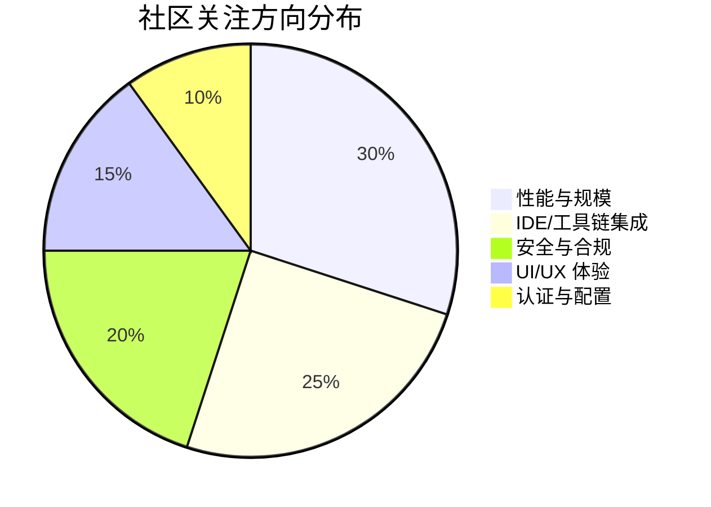

# AI CLI 工具社区动态日报 2026-03-28

> 生成时间: 2026-03-28 00:09 UTC | 覆盖工具: 7 个

- [Claude Code](https://github.com/anthropics/claude-code)
- [OpenAI Codex](https://github.com/openai/codex)
- [Gemini CLI](https://github.com/google-gemini/gemini-cli)
- [GitHub Copilot CLI](https://github.com/github/copilot-cli)
- [Kimi Code CLI](https://github.com/MoonshotAI/kimi-cli)
- [OpenCode](https://github.com/anomalyco/opencode)
- [Qwen Code](https://github.com/QwenLM/qwen-code)
- [Claude Code Skills](https://github.com/anthropics/skills)

---

## 横向对比

# AI CLI 工具生态横向对比分析报告 | 2026-03-28

---

## 1. 生态全景

当前 AI CLI 工具生态呈现**"功能趋同、体验分化"**的竞争格局：Claude Code 与 OpenAI Codex 围绕企业级安全与成本透明展开激烈博弈，Gemini CLI 押注 SDD（Spec-Driven Development）智能体架构构建差异化壁垒，而 Kimi、OpenCode 等新兴玩家通过垂直场景优化（大仓库性能、插件安全钩子）快速追赶。社区共同聚焦于**权限控制精细化**、**MCP 生态成熟化**、**Windows 体验平权化**三大战场，同时**Token 计费透明度**已成为所有付费产品的信任危机导火索。

---

## 2. 各工具活跃度对比

| 工具 | 今日新增 Issues | 活跃 PR | 版本发布 | 社区热度指标 |
|:---|:---:|:---:|:---|:---|
| **Claude Code** | 10+ | 8 | v2.1.86 | Plan Mode 回归问题引发 9 条关联 Issue，Max 配额争议 79 评论 |
| **OpenAI Codex** | 5+ | 10+ | rust-v0.118.0-alpha.2/3 | Token 燃烧问题 307 评论创纪录，v0.117.0 回归密集爆发 |
| **Gemini CLI** | 10 | 10 | v0.36.0-preview.5 | SDD 架构迭代活跃，UI 稳定性修复占比 40% |
| **GitHub Copilot CLI** | 10 | 0 | v1.0.13-1/0 | 企业策略问题发酵，alt-screen 可用性危机 6 👍 快速积累 |
| **Kimi Code CLI** | 8 | 20 | **v1.27.0** | 24h 内 20 PR 更新，发布节奏领先 |
| **OpenCode** | 10+ | 10+ | 无 | 安全架构 PR 集群推进（#19470-#19472），权限钩子修复落地 |
| **Qwen Code** | — | — | — | 数据缺失 |

> **关键发现**：Kimi 以 20 PR/24h 展现最高迭代速度；Copilot CLI 今日零 PR 更新，功能迭代完全依赖官方 Release 渠道。

---

## 3. 共同关注的功能方向

| 功能方向 | 涉及工具 | 具体诉求与数据 |
|:---|:---|:---|
| **Plan Mode 安全边界** | Claude Code, Gemini CLI | Claude #39713/#38255（模型擅自执行写操作）、Gemini #23858（状态机与执行层边界模糊）——核心安全承诺失效 |
| **Token/成本透明化** | Claude Code, OpenAI Codex, Copilot CLI | Codex #14593（307 评论，102 👍）、Claude #38335（Max 配额异常消耗）、Copilot #2336（代理模式速率限制不明）——付费用户信任危机 |
| **Windows 体验平权** | 全部 6 款工具 | Claude #24964（跨平台路径限制）、Codex #13574/#16056（沙箱/CI 优化）、Gemini #17437（快捷键失效）、Kimi #1588（大仓库优化）、OpenCode #2999（Ctrl+C 退出）——系统性技术债 |
| **MCP 生态成熟化** | Codex, Copilot CLI, Kimi | Codex #16028（MCP 失效回归）、Copilot #2236（组织注册表消失）、Kimi #1604（Figma MCP 预注册）——从配置到运行时全链路 |
| **权限精细化控制** | Claude Code, OpenCode, Copilot CLI | Claude #16561（复合命令解析，118 👍）、OpenCode #5076（49 👍 最高赞）、Copilot #1973（工具白名单）——安全与效率平衡 |
| **会话/上下文管理** | Claude Code, Codex, Gemini | Claude #39148（会话保留插件）、Codex #16049/#16033（会话丢失/压缩失效）、Gemini #23724（DAG 任务追踪）——长会话可靠性 |

---

## 4. 差异化定位分析

| 工具 | 核心功能侧重 | 目标用户画像 | 技术路线特征 |
|:---|:---|:---|:---|
| **Claude Code** | 企业级安全控制、Cowork 协作生态、插件扩展性 | 企业开发团队、需要严格审计合规的组织 | 代理架构 + 会话追踪 + 社区插件生态（tmp-cleanup、preserve-session 等） |
| **OpenAI Codex** | 实时协作模式、Rust 核心性能、MCP 原生支持 | 追求低延迟的实时协作开发者、Rust 生态用户 | Rust 重写 + WebSocket 实时连接 + 看门狗运行时（#13678） |
| **Gemini CLI** | SDD 智能体工作流、DAG 任务追踪、内存路由 | 需要结构化 AI 开发流程的技术团队 | Spec-Driven Development 架构 + ACP 协议标准化 + 多代理协调 |
| **GitHub Copilot CLI** | IDE 深度集成、企业策略治理、对话时间轴 | 已有 Copilot 订阅的 GitHub 生态用户 | 与 VS Code/Copilot 平台深度耦合 + 企业策略层控制 |
| **Kimi Code CLI** | 大仓库性能优化、Shell 模式增强、安全预审 | 中国开发者、大型代码库维护者 | 自研 K2.5 模型 + `git ls-files` 优化 + Shell 命令安全分析 |
| **OpenCode** | 插件安全钩子、跨平台 TUI、自托管灵活性 | 追求极致定制化的独立开发者、安全敏感用户 | Tauri 跨平台 + 插件系统（permission.ask 钩子）+ 多提供商支持 |

> **战略分化**：Claude/Codex 争夺**企业级安全与协作**，Gemini 押注**智能体工作流标准化**，Kimi/OpenCode 以**垂直场景+开放生态**差异化切入。

---

## 5. 社区热度与成熟度

### 社区活跃度梯队

| 梯队 | 工具 | 判断依据 |
|:---|:---|:---|
| **🔥 超活跃** | OpenCode, Kimi Code CLI | OpenCode 24h 10+ PR 安全架构集群推进；Kimi 20 PR + 版本发布，迭代密度最高 |
| **🟡 高活跃** | Claude Code, OpenAI Codex, Gemini CLI | 日均 10+ Issue/PR，版本发布规律，但回归问题频发 |
| **🟢 稳态维护** | GitHub Copilot CLI | 功能迭代依赖官方 Release，社区 PR 贡献极低（今日为 0） |
| **⚫ 数据缺失** | Qwen Code | 摘要生成失败，生态透明度不足 |

### 成熟度信号

| 工具 | 成熟度标志 | 风险信号 |
|:---|:---|:---|
| Claude Code | 插件生态自发形成（3 个实用插件进入评审） | Plan Mode 核心安全机制回归，Max 计费争议 |
| OpenAI Codex | Rust 核心稳定迭代，MCP 生态原生支持 | v0.117.0 密集回归（会话/MCP/压缩），Token 燃烧信任危机 |
| Gemini CLI | SDD 架构前瞻性，ACP 协议标准化 | 预览版迭代频繁，生产就绪度待验证 |
| Copilot CLI | 企业级发布节奏，IDE 集成深度 | 社区贡献封闭，alt-screen 可用性灾难 |
| Kimi | 发布节奏快，大仓库优化务实 | ACP 认证可靠性、AGENTS.md 约束机制待强化 |
| OpenCode | 插件系统开放，安全架构响应快 | 企业集成（Entra/Copilot Enterprise）阻塞问题 |

---

## 6. 值得关注的趋势信号

### 信号一：安全架构从"功能"升级为"信任基建"
- **数据**：Claude Plan Mode 失效（#39713）、OpenCode 权限钩子修复（#19470）、Codex 沙箱加固（#15981）同期爆发
- **含义**：AI CLI 的安全承诺（只读模式、审批流程）正成为用户信任的核心锚点，任何回归都将引发连锁反应
- **开发者行动**：优先验证目标工具的**权限边界 enforcement 机制**，而非仅看功能清单

### 信号二：MCP 从"生态亮点"变为"稳定性负债"
- **数据**：Codex #16028（MCP 失效）、Copilot #2236（注册表消失）、#172（超时失效）同期涌现
- **含义**：MCP 作为跨工具标准，其**运行时可靠性**已成为生产采用的瓶颈，配置灵活性已非首要诉求
- **开发者行动**：评估 MCP 集成时，重点测试**长会话稳定性**与**错误恢复机制**，而非工具数量

### 信号三：Token 计费透明度成为付费产品"阿喀琉斯之踵"
- **数据**：Codex #14593（307 评论）、Claude #38335（官方标记 invalid 引发争议）、Copilot #2336（代理模式限制不明）
- **含义**：AI CLI 的**不可预测成本**正在侵蚀企业采购决策，"用多少付多少"的云计算信任模型尚未建立
- **开发者行动**：要求供应商提供**实时 Token 计数 API** 与**预算硬限制**功能，避免账单失控

### 信号四：Windows 开发者体验成为"差异化洼地"
- **数据**：6 款工具全部存在 Windows 专项 Issue，但仅 Codex（#16056）、Gemini（#24057）有专项工程投入
- **含义**：Windows 生态的系统性忽视为**专注该平台的工具**创造了差异化窗口
- **开发者行动**：Windows 为主力的团队应优先评估**有专项 Windows 工程投入**的工具（Codex、Gemini）

### 信号五：智能体工作流从"概念验证"进入"生产就绪"竞赛
- **数据**：Gemini SDD 任务追踪器（#23724）、Claude 代理会话追踪（v2.1.86）、Codex 看门狗运行时（#13678）
- **含义**：**多步骤、长周期、可中断恢复**的 AI 任务执行能力，将成为下一代 CLI 的核心竞争力
- **开发者行动**：关注工具的**任务状态持久化**与**人机协作断点恢复**能力，评估复杂工作流适配性

---

*报告基于 2026-03-28 各工具 GitHub 公开数据生成 | 分析框架：功能-体验-生态三维评估*

---

## 各工具详细报告

<strong>Claude Code</strong> — <a href="https://github.com/anthropics/claude-code">anthropics/claude-code</a>

## Claude Code Skills 社区热点

> 数据来源: [anthropics/skills](https://github.com/anthropics/skills)

# Claude Code Skills 社区热点报告（2026-03-28）

---

## 1. 热门 Skills 排行（按社区关注度）

| 排名 | Skill | 功能概述 | 状态 | 链接 |
|:---|:---|:---|:---|:---|
| 1 | **document-typography** | AI 生成文档的排版质量控制，解决孤字换行、寡段标题、编号错位等常见问题 | 🟡 Open | [PR #514](https://github.com/anthropics/skills/pull/514) |
| 2 | **frontend-design** | 前端设计 Skill  clarity 重构，提升单轮对话内的可执行性和内部一致性 | 🟡 Open | [PR #210](https://github.com/anthropics/skills/pull/210) |
| 3 | **skill-quality-analyzer / skill-security-analyzer** | 元技能：自动化评估 Skill 质量（5 维度评分）与安全漏洞扫描 | 🟡 Open | [PR #83](https://github.com/anthropics/skills/pull/83) |
| 4 | **ODT** | OpenDocument 文本创建、模板填充及 ODT→HTML 解析，覆盖 LibreOffice/Google Docs 生态 | 🟡 Open | [PR #486](https://github.com/anthropics/skills/pull/486) |
| 5 | **masonry-generate-image-and-videos** | 集成 Masonry CLI，支持 Imagen 3.0/Veo 3.1 图文视频生成与任务管理 | 🟡 Open | [PR #335](https://github.com/anthropics/skills/pull/335) |
| 6 | **shodh-memory / session-memory** | 跨会话持久化记忆系统，解决上下文压缩导致的技术事实丢失 | 🟡 Open | [PR #154](https://github.com/anthropics/skills/pull/154) · [PR #629](https://github.com/anthropics/skills/pull/629) |
| 7 | **SAP-RPT-1-OSS predictor** | SAP 开源表格基础模型的预测分析集成，面向企业 ERP 数据场景 | 🟡 Open | [PR #181](https://github.com/anthropics/skills/pull/181) |
| 8 | **management-consulting** | 结构化问题解决、战略框架应用、商业案例开发与高管沟通 | 🟡 Open | [PR #384](https://github.com/anthropics/skills/pull/384) |

---

## 2. 社区需求趋势（从 Issues 提炼）

| 方向 | 代表 Issue | 核心诉求 |
|:---|:---|:---|
| **Skill 治理与质量** | [#202](https://github.com/anthropics/skills/issues/202), [#556](https://github.com/anthropics/skills/issues/556) | `skill-creator` 需从"开发者文档"重构为"操作指令"；评估工具 `run_eval.py` 触发率为 0 的系统性 Bug |
| **企业级部署** | [#228](https://github.com/anthropics/skills/issues/228), [#532](https://github.com/anthropics/skills/issues/532) | 组织级 Skill 共享、SSO/企业认证兼容（移除硬编码 `ANTHROPIC_API_KEY` 依赖） |
| **安全与信任边界** | [#492](https://github.com/anthropics/skills/issues/492) | 社区 Skill 滥用 `anthropic/` 命名空间导致钓鱼风险，需官方治理 |
| **MCP 协议互通** | [#16](https://github.com/anthropics/skills/issues/16) | 将 Skills 暴露为 MCP 工具，实现跨 AI 软件的标准化 API 调用 |
| **基础设施稳定性** | [#62](https://github.com/anthropics/skills/issues/62), [#406](https://github.com/anthropics/skills/issues/406), [#389](https://github.com/anthropics/skills/issues/389) | Skill 丢失、上传 500 错误、API 配置变更导致的突发故障 |
| **Bedrock/多云支持** | [#29](https://github.com/anthropics/skills/issues/29) | AWS Bedrock 等非 Anthropic 官方渠道的 Skill 使用方案 |

---

## 3. 高潜力待合并 Skills（评论活跃 + 近期更新）

| Skill | 关键进展 | 预计价值 | 链接 |
|:---|:---|:---|:---|
| **document-typography** | 3 月 13 日更新，直接解决 Claude 生成文档的普适性痛点 | 提升所有文档输出质量，用户无需手动排版 | [PR #514](https://github.com/anthropics/skills/pull/514) |
| **ODT** | 3 月 26 日持续迭代，覆盖 ISO 标准文档生态 | 填补 LibreOffice/企业办公场景空白 | [PR #486](https://github.com/anthropics/skills/pull/486) |
| **session-memory** | 3 月 17 日更新，零依赖设计，针对性解决上下文压缩 Bug | 长会话开发场景的刚需修复 | [PR #629](https://github.com/anthropics/skills/pull/629) |
| **skill-quality-analyzer** | 元技能标杆，5 维度量化评估体系 | 为 Skill 生态建立质量基线 | [PR #83](https://github.com/anthropics/skills/pull/83) |
| **CONTRIBUTING.md** | 社区健康度从 25% 提升的关键基础设施 | 降低贡献门槛，加速生态扩张 | [PR #509](https://github.com/anthropics/skills/pull/509) |

---

## 4. Skills 生态洞察

> **核心诉求：从"功能扩展"转向"可信生产"** — 社区正从追求 Skill 数量爆发，转向要求企业级稳定性（SSO/组织共享）、质量可验证（自动化评估）、安全可审计（命名空间治理）与基础设施韧性（API 稳定性、上下文持久化）。

---

*数据截止：2026-03-28 | 来源：github.com/anthropics/skills*

---

# Claude Code 社区动态日报 | 2026-03-28

## 今日速览

今日社区焦点集中在 **Plan Mode 功能失效** 的回归问题上，多个用户报告模型在计划模式下仍擅自执行文件编辑。同时，v2.1.86 版本发布带来代理会话追踪和 VCS 工具兼容性改进，社区贡献的插件生态持续活跃，tmp-cleanup 和 preserve-session 等实用插件进入评审阶段。

---

## 版本发布

### v2.1.86
- **代理会话追踪**：新增 `X-Claude-Code-Session-Id` 请求头，便于代理按会话聚合请求
- **VCS 工具兼容性**：将 `.jj`（Jujutsu）和 `.sl`（Sapling）目录加入排除列表，优化 Grep 和文件自动补全体验
- **稳定性修复**：修复 `--resume` 功能异常

---

## 社区热点 Issues

| # | 标题 | 状态 | 评论/👍 | 关键看点 |
|---|------|------|---------|----------|
| [#24964](https://github.com/anthropics/claude-code/issues/24964) | Cowork 文件夹选择器限制：禁止主目录外路径及符号链接 | 🔴 Open | 110 / 150 | **跨平台痛点**。Windows/macOS 双平台用户受阻，影响 monorepo 和工作区切换场景，社区呼声极高 |
| [#38335](https://github.com/anthropics/claude-code/issues/38335) | Claude Max 会话限制异常消耗（3月23日起） | 🔴 Open | 79 / 80 | **计费敏感问题**。大量 Max 用户报告 CLI 端会话配额消耗速度异常，标记为 `invalid` 引发争议 |
| [#28240](https://github.com/anthropics/claude-code/issues/28240) | 复合 Bash 命令权限提示误判 | 🔴 Open | 30 / 98 | **回归问题**。`cd && command` 结构触发权限提示位置错误，影响 Windows 用户工作流 |
| [#39713](https://github.com/anthropics/claude-code/issues/39713) | Plan Mode 限制被绕过——模型擅自执行写操作 | 🔴 Open | 4 / 1 | **严重回归**。v2.1.83/84 引入，与 #38255 形成关联报告，核心安全机制失效 |
| [#38255](https://github.com/anthropics/claude-code/issues/38255) | Plan Mode 下模型仍直接编辑源文件 | 🔴 Open | 5 / 5 | **同上**。Opus 4.6 用户遭遇，系统提醒多次无效，计划模式形同虚设 |
| [#7490](https://github.com/anthropics/claude-code/issues/7490) | 允许配置 Bash 工具使用的 Shell | 🔴 Open | 33 / 89 | **长期需求**。macOS 用户希望继承默认 Shell 环境，影响脚本兼容性 |
| [#30457](https://github.com/anthropics/claude-code/issues/30457) | Google Drive 连接器显示已连接但工具未暴露 | 🔴 Open | 32 / 18 | **Cowork 集成故障**。企业用户数据流中断，影响与 Google Workspace 的协作场景 |
| [#16561](https://github.com/anthropics/claude-code/issues/16561) | 解析复合 Bash 命令并逐组件匹配权限 | 🔴 Open | 17 / 118 | **高赞功能请求**。`&&` `\|` `;` 等操作符导致过度权限提示，需精细化控制 |
| [#4464](https://github.com/anthropics/claude-code/issues/4464) | "System reminder" 内容注入消耗过量上下文 Token | 🔴 Open | 26 / 9 | **成本敏感**。大文件修改时自动注入内容，显著缩短会话并增加费用 |
| [#38055](https://github.com/anthropics/claude-code/issues/38055) | Cowork 小版本更新永久删除聊天记录和定时任务 | 🔴 Open | 7 / 1 | **数据丢失风险**。Windows 平台用户遭遇，升级流程存在严重缺陷 |

---

## 重要 PR 进展

| # | 标题 | 状态 | 核心贡献 |
|---|------|------|----------|
| [#32755](https://github.com/anthropics/claude-code/pull/32755) | 新增 edit-verifier 插件：编辑后自动验证 | 🟡 Open | 解决 Edit 工具静默失败问题，通过 PostToolUse 钩子验证文本匹配 |
| [#39977](https://github.com/anthropics/claude-code/pull/39977) | tmp-cleanup 插件：/tmp 磁盘泄漏缓解 | 🟡 Open | 自动清理任务 `.output` 文件（单文件可达 46GB+），三阶段清理策略 |
| [#39148](https://github.com/anthropics/claude-code/pull/39148) | preserve-session 插件：路径无关的会话历史 | 🟡 Open | 项目重命名/移动后保留会话历史，UUID 全局注册表映射 |
| [#39043](https://github.com/anthropics/claude-code/pull/39043) | 移除 Frontend Design Skill 的 "retro-futuristic" 推荐 | 🟡 Open | 社区反馈驱动的文档修正，提升设计建议实用性 |
| [#39872](https://github.com/anthropics/claude-code/pull/39872) | Node.js 版本升级 20 → 24 | 🟡 Open | 为即将到来的 LTS 变更做准备，基础设施现代化 |
| [#39855](https://github.com/anthropics/claude-code/pull/39855) | gh.sh 使用 Bash 参数扩展替代 `tr` | 🟡 Open | 性能优化：避免子进程，提升特殊字符处理安全性 |
| [#37648](https://github.com/anthropics/claude-code/pull/37648) | 更新 skill-development SKILL.md 完整 frontmatter 参考 | 🟡 Open | 补充 11 个字段的完整文档，降低 Skill 开发门槛 |
| [#39916](https://github.com/anthropics/claude-code/pull/39916) | tmp-cleanup 插件（首版） | 🔴 Closed | 被 #39977 取代，迭代优化后重新提交 |
| [#39132](https://github.com/anthropics/claude-code/pull/39132) | terminal-restore 插件：kitty 键盘协议清理 | 🔴 Closed | 解决 #38761，退出时恢复终端状态，避免 Ctrl-C/Ctrl-D 失效 |

---

## 功能需求趋势

基于 50 条活跃 Issue 分析，社区关注焦点呈现以下分布：

| 方向 | 热度 | 典型诉求 |
|------|------|----------|
| **权限与安全控制** | 🔥🔥🔥🔥🔥 | 复合命令解析、Plan Mode 强制执行、拒绝工具时提供理由 |
| **Cowork 生态完善** | 🔥🔥🔥🔥🔥 | 文件夹选择器灵活性、跨设备同步、连接器稳定性 |
| **成本控制与效率** | 🔥🔥🔥🔥 | Token 消耗优化、会话缓存策略、Max 配额透明化 |
| **Shell/终端体验** | 🔥🔥🔥🔥 | 可配置 Shell、终端恢复、多后端支持（Ghostty 等） |
| **IDE 与工具链集成** | 🔥🔥🔥 | VS Code 扩展稳定性、浏览器扩展连接、WSL 兼容性 |
| **可扩展性（插件 API）** | 🔥🔥🔥 | 用户输入钩子、会话事件监听、自定义后端 |

---

## 开发者关注点

### 🔴 紧急痛点
1. **Plan Mode 失效** — 多个独立报告确认 v2.1.83+ 存在回归，模型在计划模式下擅自修改文件，核心安全承诺受损
2. **Max 配额异常** — 3月23日后 CLI 会话消耗速度异常，官方标记 `invalid` 但缺乏透明解释，信任危机
3. **Cowork 数据持久性** — 版本更新导致聊天记录丢失，企业用户担忧

### 🟡 高频摩擦
- **Windows 二等公民体验**：权限提示、路径处理、终端兼容性持续落后 macOS
- **WSL 稳定性**：会话 6 小时后出现上下文漂移、自主破坏性操作（#32963）
- **插件/连接器配置复杂性**：Google Drive、Discord 等集成故障排查困难

### 🟢 积极信号
- 社区插件生态快速响应实际问题（磁盘清理、会话保留、编辑验证）
- 官方对 VCS 工具（Jujutsu/Sapling）的兼容性改进显示倾听意愿
- 代理架构的会话追踪能力增强，为复杂工作流奠定基础

---

*日报基于 GitHub 公开数据生成，仅供参考。完整 Issue 列表请访问 [anthropics/claude-code](https://github.com/anthropics/claude-code)*

<strong>OpenAI Codex</strong> — <a href="https://github.com/openai/codex">openai/codex</a>

# OpenAI Codex 社区动态日报 | 2026-03-28

---

## 1. 今日速览

今日社区聚焦于 **v0.117.0 回归问题** 的密集修复，包括会话恢复失败、MCP 功能异常等关键 Bug；同时 Rust 侧连续发布两个 alpha 版本，Windows 沙箱权限和性能优化成为工程重点。开发者对 Token 消耗过快的抱怨持续升温，单 Issue 评论数已突破 300 条。

---

## 2. 版本发布

| 版本 | 说明 |
|:---|:---|
| **rust-v0.118.0-alpha.3** | Rust 核心库第三个 alpha 迭代 |
| **rust-v0.118.0-alpha.2** | 紧接 alpha.2 的快速迭代，推测包含紧急修复 |

> 注：官方未提供详细 Release Note，建议关注后续 PR 合并内容推断变更范围。

---

## 3. 社区热点 Issues 🔥

| # | 标题 | 状态 | 评论 | 关键要点 |
|:---|:---|:---|:---:|:---|
| [#14593](https://github.com/openai/codex/issues/14593) | **Token 消耗过快** | 🔴 OPEN | **307** | 社区最痛点，Business 订阅用户报告异常高速扣费，102 👍 印证广泛影响，需官方紧急回应 |
| [#13041](https://github.com/openai/codex/issues/13041) | WebSocket 升级后 1008 策略关闭 | 🔴 OPEN | 54 | 连接层稳定性问题，导致 HTTPS 回退循环，影响实时交互体验 |
| [#13574](https://github.com/openai/codex/issues/13574) | Windows 沙箱 apply_patch 失败 | 🟢 CLOSED | 35 | **已修复** — 5.3 版本 Windows 默认权限下补丁应用失败，关闭表明有解决方案落地 |
| [#3962](https://github.com/openai/codex/issues/3962) | 任务完成提示音 | 🔴 OPEN | 34 | 长尾需求，124 👍 显示开发者对后台任务感知能力的强烈需求 |
| [#1618](https://github.com/openai/codex/issues/1618) | TUI 主题色自定义 | 🟢 CLOSED | 28 | **已关闭** — 终端用户体验改进，104 👍 的高关注功能 |
| [#2628](https://github.com/openai/codex/issues/2628) | 项目级 MCP 配置 | 🟢 CLOSED | 27 | **已关闭** — 140 👍，MCP 生态关键能力，支持按项目隔离服务器配置 |
| [#16049](https://github.com/openai/codex/issues/16049) | v0.117.0 会话 ID 丢失 | 🔴 OPEN | 5 | **今日新发** — 升级后无法恢复命名会话，已有 PR #16050 针对性修复 |
| [#16033](https://github.com/openai/codex/issues/16033) | 自动压缩永不触发 | 🔴 OPEN | 5 | **今日新发** — 上下文管理核心功能回归，影响长会话稳定性 |
| [#16028](https://github.com/openai/codex/issues/16028) | MCP 在 0.116/0.117 部分失效 | 🔴 OPEN | 5 | **今日新发** — MCP 工具发现异常，工具调用失败，生态集成受阻 |
| [#13476](https://github.com/openai/codex/issues/13476) | Playwright MCP 过度授权提示 | 🔴 OPEN | 15 | 安全与体验平衡问题，27 👍，沙箱策略收紧后的副作用 |

---

## 4. 重要 PR 进展 🛠️

| # | 标题 | 作者 | 核心内容 |
|:---|:---|:---|:---|
| [#15929](https://github.com/openai/codex/pull/15929) | 非工作区文件写入支持 | celia-oai | 解除对工作区根目录的严格写入限制，支持 `:tmpdir`、`/tmp` 等路径，提升灵活性的同时保持只读回退安全 |
| [#16026](https://github.com/openai/codex/pull/16026) | 协作模式状态栏刷新修复 | fcoury | 重构 TUI 状态刷新逻辑，确保协作模式/模型切换时 UI 同步，解决状态显示滞后问题 |
| [#16056](https://github.com/openai/codex/pull/16056) | Windows PowerShell 安全测试加速 | bolinfest | 优化 `is_safe_command_windows()` 调用，消除重复 PowerShell 进程启动，显著缩短 Windows CI 时间 |
| [#16055](https://github.com/openai/codex/pull/16055) | 强制子 Agent 继承父模型设置 | friel-openai | `fork_context=true` 时忽略子 Agent 的模型/推理强度覆盖，保障上下文复用经济性 |
| [#15690](https://github.com/openai/codex/pull/15690) | 线程事件遥测 | rhan-oai | 重构 analytics 架构为 reducer/publish 模式，新增 thread/start、fork、resume 事件埋点 |
| [#16050](https://github.com/openai/codex/pull/16050) | 修复按名称恢复会话回归 | etraut-openai | **直接解决 #16049** — 修正 `search_term` 预过滤导致命名会话查找失败的逻辑 |
| [#15952](https://github.com/openai/codex/pull/15952) | 启用 Windows Bazel 工作流 | bolinfest | CI 基础设施关键进展，恢复 Windows 平台的可靠 Bazel 构建路径 |
| [#13678](https://github.com/openai/codex/pull/13678) | 看门狗运行时支持 | friel-openai | 新增 Agent 线程看门狗生命周期管理，支持后台服务监控、父压缩钩子，为 [#2062](https://github.com/openai/codex/issues/2062) 长期构建/服务运行需求奠基 |
| [#15981](https://github.com/openai/codex/pull/15981) | 符号链接可写根修复 | viyatb-oai | 处理符号链接路径的权限归一化，修复 bwrap 绑定和 carveout 重映射中的逃逸掩蔽问题 |
| [#15917](https://github.com/openai/codex/pull/15917) | `codex exec` 支持 stdin 管道 | jliccini | 实现 `echo "input" \| codex exec -p "prompt"` 工作流，补齐与 Claude Code 的功能差距 |

---

## 5. 功能需求趋势 📊

基于 50 条活跃 Issue 的聚类分析：

| 趋势方向 | 代表 Issue | 热度信号 |
|:---|:---|:---:|
| **成本透明度与控制** | #14593 (Token 燃烧)、#3962 (完成通知) | 🔥🔥🔥 最高优先级，付费用户强烈不满 |
| **Windows 生态完善** | #13574、#14675、#13638、#16056 | 🔥🔥🔥 工程投入显著，沙箱/路径/性能全覆盖 |
| **MCP 生态成熟** | #2628 (项目级)、#13476 (授权流)、#16028 (回归) | 🔥🔥🔥 从配置灵活性到运行时稳定性 |
| **会话/上下文管理** | #16049、#16033、#6500 (交互式会话)、#11912 (自定义压缩) | 🔥🔥 长会话可靠性成为新焦点 |
| **TUI/CLI 体验** | #1618 (主题)、#6500 (会话管理)、#16037 (机器可读状态) | 🔥🔥 专业用户工具链集成需求 |
| **IDE 深度集成** | #3550 (工作区作用域)、#7727 (任务删除)、#15330 (Diff 性能) | 🔥🔥 VS Code 扩展体验精细化 |

---

## 6. 开发者关注点 ⚠️

### 高频痛点
1. **计费不透明** — #14593 的 307 条评论揭示核心信任危机，用户无法预测和控制 Token 消耗
2. **v0.117.0 升级风险** — 今日集中爆发会话丢失、MCP 失效、自动压缩失效等回归，建议谨慎升级
3. **Windows 二等公民体验** — 沙箱权限、路径处理、性能测试持续有专项修复，但仍落后 Unix 生态

### 未满足期待
- **后台任务感知** — #3962 的 124 👍  vs 长期未实现，开发者需要异步工作流支持
- **企业级治理** — Team/Enterprise 订阅的权限边界、审计日志、成本管控工具缺失
- **开放可扩展性** — #11912 自定义压缩钩子、#2062 后台服务监控等高级用户定制需求

---

*日报基于 GitHub 公开数据生成，不代表 OpenAI 官方立场*

<strong>Gemini CLI</strong> — <a href="https://github.com/google-gemini/gemini-cli">google-gemini/gemini-cli</a>

# Gemini CLI 社区动态日报 | 2026-03-28

## 今日速览

今日社区聚焦 UI 稳定性修复与智能体架构升级。核心团队密集推进 **SDD（Spec-Driven Development）工作流** 的 DAG 任务追踪系统，同时紧急修复了状态栏闪烁、请求取消后卡死等高频用户痛点。Windows 沙箱安全加固与内存管理路由功能也进入落地阶段。

---

## 版本发布

### v0.36.0-preview.5
- **类型**：预览版迭代
- **变更**：增量更新，详细变更见 [Full Changelog](https://github.com/google-gemini/gemini-cli/compare/v0.36.0-preview.4...v0.36.0-preview.5)

---

## 社区热点 Issues（10 项）

| # | Issue | 核心问题 | 社区热度 | 重要性 |
|---|-------|---------|---------|--------|
| [#21096](https://github.com/google-gemini/gemini-cli/issues/21096) | 请求取消后界面卡死 | 取消请求后 "This is taking a bit longer..." 提示不消失，影响 Termux/Android 用户 | 🔥 82 评论，35 👍 | **P1 优先级**，已有 PR 修复中 |
| [#17437](https://github.com/google-gemini/gemini-cli/issues/17437) | Ctrl+S 查看 diff 失效 | Windows 用户无法使用快捷键预览变更，破坏核心交互流程 | 7 评论 | 回归缺陷，影响审批体验 |
| [#20498](https://github.com/google-gemini/gemini-cli/issues/20498) | 付费订阅无 Gemini 3 访问权限 | 订阅权益与模型可用性不匹配，引发付费用户质疑 | 7 评论 | 商业信任问题 |
| [#22745](https://github.com/google-gemini/gemini-cli/issues/22745) | AST 感知文件读取评估 | 探索通过语法树精准定位代码范围，减少 token 浪费 | 4 评论 | 架构级优化，关联 #22746 |
| [#23858](https://github.com/google-gemini/gemini-cli/issues/23858) | Plan 模式下模型擅自修改文件 | 规划模式状态机与执行层边界模糊，导致未授权编辑 | 3 评论 | 安全/可靠性缺陷 |
| [#22855](https://github.com/google-gemini/gemini-cli/issues/22855) | `/plan` 支持直接传参 | 需多步交互启动规划，请求单命令触发 | 2 评论，2 👍 | 效率优化 |
| [#22822](https://github.com/google-gemini/gemini-cli/issues/22822) | `/spec setup` 迁移路径设计 | `conductor` 目录向 SDD 迁移需兼容现有用户 | 2 评论 | 迁移体验 |
| [#23724](https://github.com/google-gemini/gemini-cli/issues/23724) | 持久化项目级任务追踪器 | 任务状态从临时目录移至 `.gemini/tracker/`，支持 Git 协作 | 1 评论 | SDD 核心基础设施 |
| [#23582](https://github.com/google-gemini/gemini-cli/issues/23582) | 子代理感知审批模式 | 子代理需同步主代理的 Plan/Auto-Edit 模式状态 | 1 评论，1 👍 | 多代理一致性 |
| [#22819](https://github.com/google-gemini/gemini-cli/issues/22819) | 内存路由：全局 vs 项目级 | `save_memory` 需区分用户级偏好与项目级规范存储位置 | 1 评论，1 👍 | 个性化与协作平衡 |

---

## 重要 PR 进展（10 项）

| # | PR | 功能/修复 | 状态 | 技术要点 |
|---|-----|----------|------|---------|
| [#20974](https://github.com/google-gemini/gemini-cli/pull/20974) | Compact Tool Output 实现 | 工具输出紧凑渲染模式 | 🟡 Open | 减少视觉噪音，提升信息密度；依赖 #23286 布局基础 |
| [#24065](https://github.com/google-gemini/gemini-cli/pull/24065) | 修复 StatusRow 闪烁与重渲染循环 | 解决 Tip 与状态消息布局竞争导致的 UI 故障 | 🟡 Open | ResizeObserver 反馈循环修复 |
| [#24040](https://github.com/google-gemini/gemini-cli/pull/24040) | 子命令自动补全修复 | `/checkpoint` 等命令智能提示逻辑优化 | 🟡 Open | `useSlashCompletion` 条件判断增强 |
| [#24057](https://github.com/google-gemini/gemini-cli/pull/24057) | Windows 沙箱强制完整性控制 | 安全加固：受限令牌 + 作业对象网络限速 | 🟡 Open | Mandatory Integrity Control 实现 |
| [#24070](https://github.com/google-gemini/gemini-cli/pull/24070) | `save_memory` 支持 `target` 参数 | 项目级 GEMINI.md 路由能力 | 🟡 Open | 关联 #22819，实现内存分层存储 |
| [#21960](https://github.com/google-gemini/gemini-cli/pull/21960) | 修复取消请求后状态卡死 | #21096 的根因修复：取消后阻止延迟重试事件更新 UI | 🟡 Open | 竞态条件处理 |
| [#23961](https://github.com/google-gemini/gemini-cli/pull/23961) | ACP 结构化终端生命周期 | Agent-Computer Protocol 终端元数据标准化 | 🟡 Open | `exitCode`/`signal` 强制包含，`_meta.terminal_info` 协议 |
| [#24067](https://github.com/google-gemini/gemini-cli/pull/24067) | 修复 429 错误无限重试循环 | v0.35.2 回归缺陷：速率限制导致 UI 挂起 | 🟡 Open | 指数退避与最大重试限制 |
| [#22139](https://github.com/google-gemini/gemini-cli/pull/22139) | 修复 SessionEnd 钩子重复触发 | 非交互模式下钩子注册去重 | ✅ Closed | 清理重复注册逻辑 |
| [#23821](https://github.com/google-gemini/gemini-cli/pull/23821) | 修复 grep_search ACP 操作中止错误 | 大仓库搜索超时处理优化 | ✅ Closed | `searchTimeout` 配置尊重与错误报告改进 |

---

## 功能需求趋势

基于 50 条活跃 Issue 分析，社区关注聚焦四大方向：

| 趋势 | 占比 | 典型需求 |
|-----|------|---------|
| **SDD/Agent 工作流** | ~35% | DAG 任务追踪、Spec 驱动开发、子代理协调、持久化状态 |
| **UI/UX 稳定性** | ~25% | 取消操作可靠性、状态栏渲染、自动补全、快捷键一致性 |
| **企业/安全能力** | ~20% | Windows 沙箱加固、审批模式、团队默认配置、订阅权益透明 |
| **模型与性能优化** | ~15% | Gemini 3.x 支持、AST 感知代码读取、压缩质量、内部模型升级 |
| **开发者体验** | ~5% | 内存路由、扩展警告去重、调试输出分离 |

> **关键洞察**：SDD（Spec-Driven Development）正从概念验证转向生产就绪，任务追踪器（Tracker）的 DAG 执行引擎是近期架构投入的核心。

---

## 开发者关注点

### 🔴 高频痛点
1. **请求生命周期管理** — 取消、重试、超时状态机存在多处竞态（#21096、#24067），影响用户信任
2. **跨平台一致性** — Windows 快捷键（#17437）、符号链接测试（#19901）、沙箱行为差异持续困扰用户
3. **订阅权益感知** — 付费用户对新模型访问时序不满（#20498），需更清晰的版本发布策略

### 🟡 架构期待
- **内存分层**：全局偏好 vs 项目规范的路由能力（#22819 / #24070）即将落地
- **AST 工具链**：代码精准定位能力（#22745-#22746）可能显著降低 token 消耗
- **子代理治理**：审批模式同步（#23582）、行为评估（#23897）是多代理可靠性的关键

### 🟢 生态信号
- 社区贡献活跃：`help wanted` 标签 Issue 占比 30%，但核心 SDD 功能仍由内部团队主导（🔒 maintainer only）
- 测试基建强化：集成测试覆盖废弃包警告（#21488）、Eval 自动化（#23169）进入建设期

---

*日报生成时间：2026-03-28 | 数据来源：google-gemini/gemini-cli*

<strong>GitHub Copilot CLI</strong> — <a href="https://github.com/github/copilot-cli">github/copilot-cli</a>

# GitHub Copilot CLI 社区动态日报 | 2026-03-28

## 今日速览

今日 Copilot CLI 发布 **v1.0.13-1** 和 **v1.0.13-0** 双版本，重点强化 MCP 生态（支持 LLM 采样请求、改进注册表可靠性）并推出对话历史时间轴功能。社区方面，企业策略导致的模型/MCP 访问权限问题持续发酵，alt-screen 模式的可用性争议成为新焦点。

---

## 版本发布

### v1.0.13-1 / v1.0.13-0（2026-03-27）

| 版本 | 核心更新 |
|:---|:---|
| **v1.0.13-1** | • **对话历史时间轴**：`/rewind` 和双击 `Esc` 可打开时间轴选择器，支持回滚到任意历史节点（非仅上一快照） • **性能优化**：MCP 注册表查询增加自动重试和超时机制；V8 编译缓存缩短启动时间 |
| **v1.0.13-0** | • **MCP LLM 采样**：MCP 服务器可通过新审批提示请求 LLM 推理能力 • **策略合规**：被允许列表阻止的 MCP 服务器从 `/mcp show` 中隐藏 • **BYOM 修复**：推理强度设置现可正确应用于自定义模型提供商 |

🔗 [Releases 页面](https://github.com/github/copilot-cli/releases)

---

## 社区热点 Issues

| # | 标题 | 状态 | 评论 | 关键要点 |
|:---|:---|:---|:---:|:---|
| [#1595](https://github.com/github/copilot-cli/issues/1595) | Cannot access any model | 🟡 triage | 16 | **企业订阅策略冲突**：用户有有效 Enterprise Copilot 订阅且显示剩余 40% 高级请求，但 `/models` 返回"access denied by Copilot policy"。反映企业策略与 CLI 权限模型的深层不匹配问题。 |
| [#2236](https://github.com/github/copilot-cli/issues/2236) | MCP servers from org registry disappear | 🟡 triage | 6 | **组织 MCP 注册表失效**：v1.0.11 出现组织配置的 MCP 服务器消失，伴随错误的"被组织策略禁用"警告。28 👍 显示影响面广，可能与企业策略缓存/同步机制有关。 |
| [#2101](https://github.com/github/copilot-cli/issues/2101) | Request failed due to transient API error | 🟡 triage | 10 | **速率限制体验差**：瞬态 API 错误重试后仍触发 1 分钟速率限制，提示信息指向服务条款而非具体限制规则，开发者难以排查。 |
| [#1274](https://github.com/github/copilot-cli/issues/1274) | CLI constantly getting 400 errors | 🟡 triage | 10 | **代码审查场景崩溃**：95% 的 diff 文件代码审查请求返回 400 错误，疑似请求体构造或服务端验证问题，影响核心工作流。 |
| [#2334](https://github.com/github/copilot-cli/issues/2334) | Please bring back no-alt-screen | 🟡 triage | 1 | **alt-screen 可用性危机**：6 👍 快速积累，列举无滚动条、无法搜索历史、无法边查看历史边审阅文件等关键缺陷，呼吁恢复旧模式。 |
| [#172](https://github.com/github/copilot-cli/issues/172) | Copilot CLI Does Not Respect MCP Timeouts | 🟡 triage | 8 | **MCP 超时配置失效**：`mcp-config.json` 的 timeout 字段被忽略，长运行 MCP 服务器必然超时，阻碍复杂分析类工具集成。 |
| [#1973](https://github.com/github/copilot-cli/issues/1973) | Tool whitelist for Interactive Mode | 🟡 triage | 4 | **权限粒度不足**：只读操作（grep/cat/find）需逐次审批，而 `/allow-all` 又放行危险操作，7 👍 反映安全与效率的平衡需求。 |
| [#1095](https://github.com/github/copilot-cli/issues/1095) | Support for BYOK to add models | 🟡 triage | 4 | **自定义模型接入**：请求通过 API Key 接入 Grok 4.1 等第三方模型，利用其 1M token 上下文窗口，8 👍 显示大上下文需求强烈。 |
| [#1128](https://github.com/github/copilot-cli/issues/1128) | Add awaitingUserInput hook type | 🟡 triage | 2 | **扩展点缺失**：`userPromptSubmitted` 后无"等待输入"钩子，阻碍自动化工作流集成，17 👍 为今日最高，插件生态需求明确。 |
| [#2336](https://github.com/github/copilot-cli/issues/2336) | Strange rate limit message | 🟡 triage | 5 | **后台代理速率限制**：简单任务启动后台代理后半分钟即触发限制，提示策略可能对代理模式有特殊限制但未明确说明。 |

---

## 重要 PR 进展

**今日无活跃 Pull Requests**

> 过去 24 小时内无 PR 更新，功能迭代主要通过官方 Release 渠道推进。

---

## 功能需求趋势

基于 50 条活跃 Issue 的聚类分析：

| 趋势方向 | 热度 | 代表 Issue | 核心诉求 |
|:---|:---:|:---|:---|
| **企业策略与权限治理** | 🔥🔥🔥 | #1595, #2236, #1976, #1973 | 企业订阅策略与 CLI 权限模型存在断层，需更透明的策略诊断工具和细粒度权限控制 |
| **终端交互体验** | 🔥🔥🔥 | #2334, #1799, #2216, #1999 | alt-screen 模式引入严重可用性退化，国际化键盘支持不足 |
| **MCP 生态成熟度** | 🔥🔥🔥 | #172, #39, #2338, #1044 | 超时配置、VS Code 配置同步、权限文件识别等基础设施待完善 |
| **模型接入灵活性** | 🔥🔥 | #1095, #2045, #705 | BYOK 支持、Claude 模型对齐、GitHub Enterprise 兼容 |
| **性能与稳定性** | 🔥🔥 | #2101, #2336, #1274, #1874 | 速率限制策略透明化、长会话渲染稳定性、错误恢复机制 |
| **开发者工作流集成** | 🔥 | #1128, #2212, #1311 | 持久化配置、生命周期钩子、可定制状态栏 |

---

## 开发者关注点

### 🔴 高频痛点

1. **alt-screen 强制迁移的可用性灾难**
   - 核心矛盾：新渲染模式牺牲基础终端功能（滚动、搜索、历史查看）
   - 紧急度：#2334 和 #1799 显示社区呼吁提供回退开关

2. **企业策略的"幽灵阻断"**
   - 现象：订阅有效、配额充足，但策略层随机阻断模型/MCP 访问
   - 痛点：错误信息模糊（"access denied by Copilot policy"），无诊断工具

3. **MCP 生产环境就绪度**
   - 超时配置失效、组织注册表同步失败、权限文件识别不完整
   - 与官方 v1.0.13 强化 MCP 的路线图形成"平台激进 vs 基建滞后"的张力

### 🟡 潜在需求

| 需求 | 背景 | 相关 Issue |
|:---|:---|:---|
| 工具调用白名单 | 安全与效率的平衡 | #1973 |
| 输入等待状态钩子 | 自动化/CI 集成 | #1128 |
| 持久化默认 Agent | 定制化工作流 | #2212 |
| 剪贴板图片直接粘贴 | 视觉编程场景 | #2328 |

---

*本日报基于 github.com/github/copilot-cli 公开数据生成*

<strong>Kimi Code CLI</strong> — <a href="https://github.com/MoonshotAI/kimi-cli">MoonshotAI/kimi-cli</a>

# Kimi Code CLI 社区动态日报 | 2026-03-28

---

## 今日速览

Kimi Code CLI 正式发布 **v1.27.0**，带来增量式 Markdown 流式渲染、计划任务可视化等体验升级。社区活跃度高涨，24 小时内 20 个 PR 更新，8 个 Issue 新增，核心围绕**大仓库性能优化**、**Shell 模式增强**与**安全合规**三大方向。

---

## 版本发布

### v1.27.0（2026-03-28）

| 更新项 | 说明 |
|--------|------|
| **增量式 Markdown 流式渲染** | 优化终端流式输出体验，减少闪烁，提升长文本可读性 |
| **PlanDisplay 线类型与内联渲染** | 新增计划任务可视化组件，支持结构化展示 AI 执行计划 |
| **Web 工作区文件面板** | 聊天界面右侧新增文件浏览器，支持目录导航与文件下载 |
| **Shell 模式增强** | `/feedback` 命令、差异对比重设计、语法高亮主题 |
| **安全审批工作流** | 新增 shell 命令安全分析，识别危险模式 |

📎 [Release 详情](https://github.com/MoonshotAI/kimi-cli/releases/tag/v1.27.0)

---

## 社区热点 Issues（8 条）

| # | 状态 | 标题 | 重要性 | 社区反应 |
|---|:--:|------|--------|---------|
| [#1610](https://github.com/MoonshotAI/kimi-cli/issues/1610) | 🔴 OPEN | `@` 路径补全遭遇 1000 文件限制 | **高** | 大型项目用户核心痛点，直接影响代码库导航体验 |
| [#1607](https://github.com/MoonshotAI/kimi-cli/issues/1607) | 🔴 OPEN | v1.26 `write` 工具频繁卡死 | **高** | 升级回归问题，影响核心编辑功能稳定性 |
| [#1602](https://github.com/MoonshotAI/kimi-cli/issues/1602) | 🔴 OPEN | Web 访问白屏失败 | **中高** | 影响 Web 端可用性，已有控制台错误日志 |
| [#1355](https://github.com/MoonshotAI/kimi-cli/issues/1355) | 🔴 OPEN | ACP 会话初始化失败 `list.index(x): x not in list` | **中** | 长期未解的 IDEA 插件兼容问题，4 条评论持续跟进 |
| [#1604](https://github.com/MoonshotAI/kimi-cli/issues/1604) | 🔴 OPEN | 请求支持 Figma MCP | **中** | 设计工作流集成需求，需预注册认证支持 |
| [#1596](https://github.com/MoonshotAI/kimi-cli/issues/1596) | 🔴 OPEN | AGENTS.md 指令遵从能力弱 | **中** | 项目级约束机制失效，影响自定义 Agent 行为 |
| [#1599](https://github.com/MoonshotAI/kimi-cli/issues/1599) | 🔴 OPEN | API 429 限流错误 | **低** | 服务端配额问题，信息待补充 |
| [#1366](https://github.com/MoonshotAI/kimi-cli/issues/1366) | ✅ CLOSED | 增加历史会话选择参数 | - | 已实现 `--sessions` 参数（后回滚，见 PR #1608） |

---

## 重要 PR 进展（10 条）

| # | 状态 | 标题 | 核心内容 |
|---|:--:|------|---------|
| [#1614](https://github.com/MoonshotAI/kimi-cli/pull/1614) | 🔵 OPEN | Shell 命令安全分析 | 新增 15+ 危险模式检测，审批前提示风险（解决 #1539） |
| [#1588](https://github.com/MoonshotAI/kimi-cli/pull/1588) | 🔵 OPEN | 大仓库 `@` 补全优化 | 改用 `git ls-files` 替代 `os.walk()`，解决 65k+ 文件仓库遍历问题 |
| [#1587](https://github.com/MoonshotAI/kimi-cli/pull/1587) | 🔵 OPEN | Shell 模式输出注入上下文 | Ctrl+X 执行结果自动进入对话上下文，`cd` 持久化支持 `~` `-` `CDPATH` |
| [#1512](https://github.com/MoonshotAI/kimi-cli/pull/1512) | 🔵 OPEN | ACP 认证系统重构 | 终端登录 + OAuth Device Flow 双模式，解决 #1355 类认证问题 |
| [#1606](https://github.com/MoonshotAI/kimi-cli/pull/1606) | 🔵 OPEN | `--skills-dir` 多路径追加（回滚） | 技能目录参数语义争议：追加 vs 覆盖 |
| [#1605](https://github.com/MoonshotAI/kimi-cli/pull/1605) | 🔵 OPEN | 恢复 `--skills-dir` 覆盖行为 | 明确回归 v1.25.0 覆盖语义，保留多路径能力 |
| [#1600](https://github.com/MoonshotAI/kimi-cli/pull/1600) | 🔵 OPEN | 用户输入高亮优化 | 亮蓝色（#007AFF）+ 全宽分隔线，提升对话可读性 |
| [#1597](https://github.com/MoonshotAI/kimi-cli/pull/1597) | 🔵 OPEN | Python 3.13 兼容性修复 | `trafilatura` 导入保护，防止 `charset-normalizer` 二进制不兼容导致级联失败 |
| [#1611](https://github.com/MoonshotAI/kimi-cli/pull/1611) | ✅ CLOSED | `Glob` 工具支持 `~` 展开 | 补齐文件工具路径扩展一致性 |
| [#1609](https://github.com/MoonshotAI/kimi-cli/pull/1609) | ✅ CLOSED | `Glob` 工具访问技能目录 | 解决技能脚本自引用时的"目录越界"错误 |

---

## 功能需求趋势

| 方向 | 具体表现 |
|------|---------|
| **大仓库性能** | `@` 补全 1000 文件限制、`git ls-files` 优化、遍历算法改进 |
| **IDE 深度集成** | IDEA 插件 ACP 会话问题、Figma MCP 设计工作流 |
| **安全可信** | Shell 命令预审、AGENTS.md 约束强化、危险操作可视化 |
| **交互体验** | 增量渲染、差异对比、输入高亮、Web 文件面板 |
| **配置灵活性** | 技能目录语义、历史会话管理、多路径支持 |

---

## 开发者关注点

### 🔥 高频痛点
1. **规模瓶颈** — 大型代码库（65k+ 文件）的文件发现与补全性能
2. **稳定性回归** — v1.26 升级后 `write` 工具卡死、Web 白屏
3. **认证可靠性** — ACP 会话初始化失败、OAuth 流程完善

### 📌 待决策议题
- `--skills-dir` 参数语义：**追加模式**（灵活）vs **覆盖模式**（可预测）的社区分歧
- 历史会话 CLI 参数：#1376 实现后被回滚（#1608），需重新设计

### 💡 新兴需求
- **MCP 生态扩展**：Figma 等第三方工具预注册认证支持
- **项目级 AI 约束**：AGENTS.md 类似 Cursor Rules 的指令优先级机制

---

*日报基于 GitHub 公开数据生成，关注 [MoonshotAI/kimi-cli](https://github.com/MoonshotAI/kimi-cli) 获取最新动态*

<strong>OpenCode</strong> — <a href="https://github.com/anomalyco/opencode">anomalyco/opencode</a>

# OpenCode 社区动态日报 | 2026-03-28

---

## 1. 今日速览

今日社区活跃度极高，**安全与权限控制**成为核心议题：社区长期呼吁的 `permission.ask` 插件钩子终于有 PR 修复（#19470、#19453），同时 Bash 命令沙箱化方案进入审查阶段（#19472）。TUI 体验优化持续发力，Windows 代码签名、终端背景同步、移动端触摸适配等 PR 密集推进。

---

## 2. 版本发布

**无新版本发布**（过去24小时）

---

## 3. 社区热点 Issues

| Issue | 状态 | 重要性分析 |
|:---|:---|:---|
| [#906](https://github.com/anomalyco/opencode/issues/906) 粘贴图片支持 | 🔥 OPEN | **31评论**的高票功能请求，与已关闭的 #1429 形成呼应，反映用户对 Excalidraw 等工具工作流的强需求 |
| [#2999](https://github.com/anomalyco/opencode/issues/2999) Windows Ctrl+C 退出问题 | 🔥 OPEN | **28评论**，Windows 终端用户体验痛点，与 #7957、#6189 形成问题集群，PR #19468 已针对性修复 |
| [#7957](https://github.com/anomalyco/opencode/issues/7957) Ctrl+C 不应直接退出 | 🔥 OPEN | **20👍 高赞**，直指 TUI 快捷键设计缺陷，与 #2999 互为补充 |
| [#5076](https://github.com/anomalyco/opencode/issues/5076) 更安全的默认权限 | 🔥 OPEN | **49👍 最高赞**，安全架构层面的核心争议，与 #2632 共同推动权限模型重构 |
| [#11157](https://github.com/anomalyco/opencode/issues/11157) GitHub Copilot Enterprise 压缩失败 | ⚠️ OPEN | 企业级用户阻塞性问题，涉及 Claude 模型与 Copilot API 的兼容性 |
| [#12308](https://github.com/anomalyco/opencode/issues/12308) Entra MCP 认证失败 | ⚠️ OPEN | Azure 企业生态集成障碍，影响 Microsoft 生态用户采用 |
| [#15212](https://github.com/anomalyco/opencode/issues/15212) VS Code 终端无法选择文本 | ⚠️ OPEN | 开发者高频场景（IDE 内置终端）的体验断裂，PR #19468 关联修复 |
| [#18088](https://github.com/anomalyco/opencode/issues/18088) CJK 文本弹窗时隐藏 | ⚠️ OPEN | 国际化体验缺陷，影响东亚用户群体 |
| [#6168](https://github.com/anomalyco/opencode/issues/6168) Linux AppImage 启动失败 | ✅ CLOSED | Wayland/X11 兼容性问题，已解决但反映 Linux 桌面分发挑战 |
| [#2632](https://github.com/anomalyco/opencode/issues/2632) 默认权限过于宽松 | ✅ CLOSED | 安全议题里程碑，推动后续 #5076 等深度讨论 |

---

## 4. 重要 PR 进展

| PR | 作者 | 核心内容 |
|:---|:---|:---|
| [#19472](https://github.com/anomalyco/opencode/pull/19472) Bash 命令沙箱化 | e-n-0 | **安全架构升级**：为 Bash 命令执行引入沙箱机制，回应 #5076 长期诉求 |
| [#19470](https://github.com/anomalyco/opencode/pull/19470) + [#19453](https://github.com/anomalyco/opencode/pull/19453) 权限询问钩子修复 | jacobprall, nickdavies | **插件系统补完**：恢复 `permission.ask` 钩子，使插件能拦截权限请求 |
| [#15201](https://github.com/anomalyco/opencode/pull/15201) Windows 代码签名 | Hona | **分发安全**：Azure Trusted Signing + Tauri 签名，解决 Windows 安全警告 |
| [#19468](https://github.com/anomalyco/opencode/pull/19468) 终端鼠标序列解析修复 | agutmanstein-scale | **TUI 稳定性**：修复 VS Code 等 Web 终端的鼠标事件碎片化问题 |
| [#18767](https://github.com/anomalyco/opencode/pull/18767) 移动端触摸优化 | noahbentusi | **跨平台扩展**：针对手机/平板的触摸交互适配 |
| [#19458](https://github.com/anomalyco/opencode/pull/19458) 文件系统抽象重构 | kitlangton | **架构优化**：统一使用 AppFileSystem 替代原始 Filesystem，提升可测试性 |
| [#19465](https://github.com/anomalyco/opencode/pull/19465) 本地配置覆盖文件 | pvi-github | **配置管理**：支持 `opencode.local.jsonc` 实现团队/个人配置分离 |
| [#19386](https://github.com/anomalyco/opencode/pull/19386) 终端背景同步 | mynameistito | **视觉体验**：OSC 11 序列同步终端背景色，修复像素 gutter 问题 |
| [#19350](https://github.com/anomalyco/opencode/pull/19350) Copilot 预览模型支持 | ben-vargas | **模型生态**：GitHub App Token 流修复 `claude-opus-4.6-fast` 等预览模型 |
| [#18306](https://github.com/anomalyco/opencode/pull/18306) Open WebUI 提供商 | SamirMoustafa | **自托管生态**：新增 Open WebUI 作为 LLM 提供商选项 |

---

## 5. 功能需求趋势

基于 50 条活跃 Issue 分析，社区关注焦点呈现四大方向：

| 趋势方向 | 代表 Issue | 热度 |
|:---|:---|:---:|
| **安全与权限治理** | #5076, #2632, #16126, #13827 | 🔥🔥🔥 |
| **TUI/终端体验优化** | #2999, #7957, #15212, #906 | 🔥🔥🔥 |
| **企业/云端集成** | #11157, #12308, #16861 | 🔥🔥 |
| **国际化与本地化** | #18088, #9610 | 🔥🔥 |
| **配置与扩展性** | #9062, #13672 | 🔥 |

> 安全议题从"功能请求"升级为"架构重构"，反映 OpenCode 从个人工具向团队/企业级产品演进的压力。

---

## 6. 开发者关注点

**高频痛点矩阵：**

| 痛点 | 具体表现 | 社区诉求 |
|:---|:---|:---|
| **Windows 二等公民体验** | Ctrl+C 退出、权限绕过、Scoop 更新延迟 (#18255) | 与 macOS/Linux 体验对齐 |
| **权限模型"既松又紧"** | 默认过度授权，但细粒度控制困难 (#13827) | 明确的安全边界 + 灵活的插件钩子 |
| **IDE 集成摩擦** | VS Code 终端鼠标捕获、文本选择失效 | 无缝嵌入开发者现有工作流 |
| **企业身份认证** | Entra/Azure AD/MCP 集成阻塞 | 原生支持企业 SSO 体系 |
| **模型上下文窗口感知** | 静态限制 vs 动态 API 返回 (#16861) | 实时获取模型能力上限 |

**今日积极信号：** 权限钩子修复（#19470）和 Bash 沙箱（#19472）标志着安全架构从"讨论期"进入"实施期"，有望缓解长期信任危机。

---

*数据来源：github.com/anomalyco/opencode | 生成时间：2026-03-28*

<strong>Qwen Code</strong> — <a href="https://github.com/QwenLM/qwen-code">QwenLM/qwen-code</a>

⚠️ 摘要生成失败。

---
*本日报由 [agents-radar](https://github.com/duanyytop/agents-radar) 自动生成。*