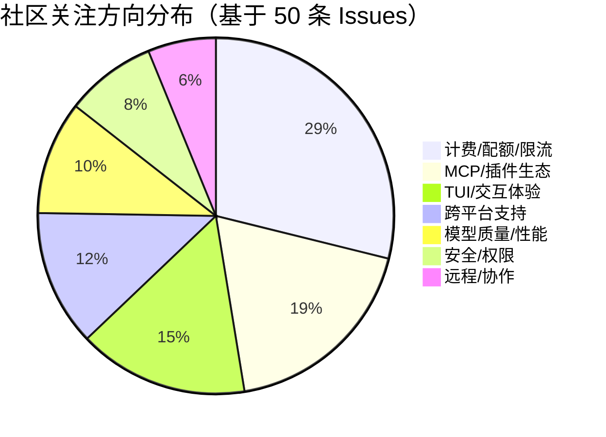

# AI CLI 工具社区动态日报 2026-03-30

> 生成时间: 2026-03-30 00:57 UTC | 覆盖工具: 7 个

- [Claude Code](https://github.com/anthropics/claude-code)
- [OpenAI Codex](https://github.com/openai/codex)
- [Gemini CLI](https://github.com/google-gemini/gemini-cli)
- [GitHub Copilot CLI](https://github.com/github/copilot-cli)
- [Kimi Code CLI](https://github.com/MoonshotAI/kimi-cli)
- [OpenCode](https://github.com/anomalyco/opencode)
- [Qwen Code](https://github.com/QwenLM/qwen-code)
- [Claude Code Skills](https://github.com/anthropics/skills)

---

## 横向对比

# AI CLI 工具生态横向对比分析报告 | 2026-03-30

---

## 1. 生态全景

当前 AI CLI 工具生态呈现"**三强鼎立、多极追赶**"格局：Claude Code 凭借 MCP 插件生态和权限系统领先企业级市场，OpenAI Codex 以子代理架构和 IDE 深度集成占据开发者心智，Gemini CLI 则押注 SDD（Spec-Driven Development）工作流和实时语音交互寻求差异化。与此同时，GitHub Copilot CLI、Kimi Code、OpenCode 等第二梯队工具在稳定性债务和功能追赶中艰难突围，社区普遍面临**成本控制、跨平台兼容性、多代理协作**三大共性挑战。

---

## 2. 各工具活跃度对比

| 工具 | 今日 Issues | 今日 PR | 版本发布 | 社区热度特征 |
|:---|:---|:---|:---|:---|
| **Claude Code** | 10+ 热点（#29579 117评论，#38335 105评论） | 10 个活跃 PR | v2.1.87（紧急修复） | 🔥🔥🔥🔥🔥 极高，计费危机引发大规模声讨 |
| **OpenAI Codex** | 10+ 热点（#14593 319评论） | 10 个活跃 PR | 无 | 🔥🔥🔥🔥🔥 极高，Token 消耗问题企业级焦虑 |
| **Gemini CLI** | 10 个活跃 Issue | 10 个 PR（含 #24174 语音模式） | 无 | 🔥🔥🔥🔥 高，SDD 架构演进受关注 |
| **GitHub Copilot CLI** | 8 个新增 Issue | 2 个已合并 PR | 无 | 🔥🔥🔥 中等，稳定性债务集中爆发 |
| **Kimi Code CLI** | 6 个 Issue | 4 个 PR | 无 | 🔥🔥 平稳，对标竞品特征明显 |
| **OpenCode** | 10+ 热点 Issue | 10 个 PR | v1.3.4-v1.3.6（三连发） | 🔥🔥🔥🔥 高，密集迭代伴随回归风险 |
| **Qwen Code** | — | — | — | ⚠️ 数据缺失 |

---

## 3. 共同关注的功能方向

| 功能方向 | 涉及工具 | 具体诉求 |
|:---|:---|:---|
| **成本控制与透明度** | Claude Code、OpenAI Codex、OpenCode | Claude Code Max 订阅"幽灵限流"（#29579）；Codex Token 消耗过快（#14593 319评论）；OpenCode 修复 token 重复计数 |
| **多代理/子代理系统** | OpenAI Codex、Kimi Code、Gemini CLI、OpenCode | Codex Watchdog 机制 5 个 PR 密集迭代；Kimi #1633 提出 Agent Swarm 架构需求；Gemini SDD Phase 3 任务追踪器；OpenCode 子代理 MCP 权限受限（#16491） |
| **MCP 标准化与企业集成** | Claude Code、OpenCode、Gemini CLI | Claude Desktop MCP 连接失败（#5826）；OpenCode MCP OAuth 落地（#988）；Gemini 子代理审批模式感知（#23582） |
| **会话可移植性与持久化** | Claude Code、Gemini CLI、OpenCode | Claude 3 个相关 PR（#39148/#40586 等）；Gemini #23724 项目级追踪器；OpenCode 会话级工作目录（#9365） |
| **TUI/交互体验打磨** | 全部工具 | Claude Shift+Enter 回归（#40677）；Codex VS Code 终端输入异常（#16189）；OpenCode 热键切换模式（#12633）；Kimi 隐藏 thinking（#1632） |
| **跨平台兼容性** | GitHub Copilot CLI、Gemini CLI、Claude Code | Copilot Windows 崩溃（#2387）、WSL2 ARM64 故障（#2379）；Gemini #24081 Windows/Linux 沙箱修复；Claude FreeBSD 支持缺口（#30640） |

---

## 4. 差异化定位分析

| 工具 | 核心功能侧重 | 目标用户画像 | 技术路线特征 |
|:---|:---|:---|:---|
| **Claude Code** | MCP 插件生态、权限系统、企业协作 | 企业团队、插件开发者 | **开放生态优先**：Hookify 规则、AGENTS.md 回退、社区插件爆发（24小时6个 PR） |
| **OpenAI Codex** | 子代理并行执行、IDE 深度集成、Watchdog 生命周期管理 | 专业开发者、AI 原生工作流探索者 | **系统架构驱动**：Watchdog 定时器、有序模型回退、Telemetry 事件体系 |
| **Gemini CLI** | SDD 工作流、实时语音、AST 感知代码理解 | 项目级协作者、语音交互偏好者 | **结构化方法学**：DAG 任务图、Spec-Driven Development、tilth/glyph 技术预研 |
| **GitHub Copilot CLI** | GitHub 生态集成、Headless 模式、多代理集群 | GitHub 重度用户、CI/CD 场景 | **平台绑定策略**：与 GitHub 服务深度耦合，但跨平台测试覆盖不足 |
| **Kimi Code CLI** | 可视化调试、Shell 上下文连续性 | 中国开发者、IDE 生态迁移者 | **追赶式创新**：明确对标 Codex/Claude Code，Tracing Visualizer 差异化 |
| **OpenCode** | 架构现代化（Effect）、本地模型支持、TUI 灵活性 | 开源偏好者、自托管需求者 | **技术激进派**：Effect 架构全面重构、Prompt Slot 创新、快速迭代伴随稳定性风险 |

---

## 5. 社区热度与成熟度

### 活跃度分层

| 层级 | 工具 | 关键指标 |
|:---|:---|:---|
| **第一梯队（极高活跃）** | Claude Code、OpenAI Codex | 单 Issue 评论数 100+，社区声量可影响产品决策 |
| **第二梯队（高活跃）** | Gemini CLI、OpenCode | 架构级议题讨论深入，PR 迭代节奏快 |
| **第三梯队（中等活跃）** | GitHub Copilot CLI、Kimi Code | 稳定性问题主导议题，功能需求对标竞品 |

### 成熟度评估

| 工具 | 成熟度 | 关键判断依据 |
|:---|:---|:---|
| Claude Code | 🟡 **成熟但承压** | 插件生态丰富，但计费系统信任危机、权限系统 30+ Issue 无回应暴露治理缺口 |
| OpenAI Codex | 🟡 **架构领先，体验粗糙** | Watchdog 子代理机制设计精巧，但 Token 成本黑盒、TUI 终端兼容性债务显著 |
| Gemini CLI | 🟢 **稳健演进** | SDD 工作流有方法论深度，实时语音提交显示创新勇气，企业安全合规逐步补齐 |
| GitHub Copilot CLI | 🔴 **稳定性危机** | 单日 8 个崩溃/兼容性 Issue，Windows/WSL2/Headless 三大场景同时告急 |
| Kimi Code CLI | 🟢 **稳步追赶** | 社区规模小但议题聚焦，可视化调试和 Shell 上下文有差异化空间 |
| OpenCode | 🟡 **激进迭代，风险并存** | 三连发版本修复关键问题，但 v1.3.4/1.3.5 引入回归缺陷，架构现代化长期有益 |

---

## 6. 值得关注的趋势信号

### 信号一：AI CLI 进入"成本敏感时代"
> **数据支撑**：Codex #14593（319评论）、Claude Code #29579/#38335（合计 222评论）均围绕不可预测的成本爆发

**开发者启示**：企业采购评估需将"Token 消耗可观测性"作为核心指标，优先选择提供实时配额显示、子代理费用预警的工具。

### 信号二：MCP 成为事实标准，但碎片化风险显现
> **数据支撑**：Claude Code 24小时6个 MCP 插件 PR；OpenCode #988 MCP OAuth 高票落地；Gemini #23582 子代理审批模式冲突

**开发者启示**：MCP 服务器生态快速繁荣，但企业部署需关注 OAuth 2.1/SSE 连接稳定性、服务器启用/禁用开关等治理能力的成熟度差异。

### 信号三：从"对话式"向"项目级智能协作"演进
> **数据支撑**：Gemini SDD 工作流（#23320/#23724）、Claude Code 会话可移植性（3个相关 PR）、OpenCode 会话级工作目录（#9365）

**开发者启示**：短期工具选择关注交互体验，中长期需评估"项目状态持久化""跨会话上下文""DAG 任务执行"等结构化工作流能力。

### 信号四：多代理架构从"并行执行"走向"生命周期精细化"
> **数据支撑**：Codex 5 个 Watchdog 相关 PR（定时器重置、自关闭工具、倒计时渲染）；Kimi #1633 提出 Agent Swarm 替代 subagent

**开发者启示**：子代理的"启动-监控-终止"全生命周期管理成为竞争焦点，Watchdog 机制的可观测性（倒计时渲染）和成本可控性（有序模型回退）是关键差异化点。

### 信号五：AST 感知与代码智能成为下一代战场
> **数据支撑**：Gemini #22745 AST 感知文件读取 EPIC、#22746 tilth/glyph 技术预研

**开发者启示**：文本搜索-based 的代码理解正在触及效率天花板，AST 感知工具可能重构代码库交互范式，关注 Gemini 在此方向的验证结果。

---

**报告结论**：当前 AI CLI 工具选择呈现"**短期看体验，中期看生态，长期看架构**"的决策逻辑。企业用户建议优先评估 Claude Code（生态）或 Gemini CLI（方法论），追求前沿架构可选 OpenCode，但需承担迭代风险；OpenAI Codex 适合愿意探索子代理并行能力的早期采用者，但需建立严格的成本监控机制。

---

## 各工具详细报告

<details>
<summary><strong>Claude Code</strong> — <a href="https://github.com/anthropics/claude-code">anthropics/claude-code</a></summary>

## Claude Code Skills 社区热点

> 数据来源: [anthropics/skills](https://github.com/anthropics/skills)

# Claude Code Skills 社区热点报告（截至 2026-03-30）

---

## 1. 热门 Skills 排行（按社区关注度）

| 排名 | Skill | 功能概述 | 状态 | 链接 |
|:---|:---|:---|:---|:---|
| 1 | **document-typography** | AI 生成文档的排版质量控制，解决孤行/寡行、编号错位等常见排版问题 | 🟡 Open | [PR #514](https://github.com/anthropics/skills/pull/514) |
| 2 | **skill-quality-analyzer / skill-security-analyzer** | 元技能：自动评估其他 Skill 的质量（结构、文档、安全性等五维度） | 🟡 Open | [PR #83](https://github.com/anthropics/skills/pull/83) |
| 3 | **frontend-design** | 前端设计技能优化，提升指令清晰度与可执行性 | 🟡 Open | [PR #210](https://github.com/anthropics/skills/pull/210) |
| 4 | **ODT skill** | OpenDocument 文本创建、模板填充及 ODT→HTML 解析（ISO 标准格式） | 🟡 Open | [PR #486](https://github.com/anthropics/skills/pull/486) |
| 5 | **shodh-memory** | AI Agent 持久化记忆系统，跨会话维护上下文 | 🟡 Open | [PR #154](https://github.com/anthropics/skills/pull/154) |
| 6 | **roadmap-pilot** | 增量式代码库清理自动驾驶，防止大重构任务上下文溢出 | 🟡 Open | [PR #536](https://github.com/anthropics/skills/pull/536) |
| 7 | **plan-task** | 多步骤计划持久化，任务进度以 Markdown 保存至 `.claude/tasks/` | 🟡 Open | [PR #522](https://github.com/anthropics/skills/pull/522) |
| 8 | **x402** | BSV 微支付认证，自然语言调用 AI 服务并支付 | 🟡 Open | [PR #374](https://github.com/anthropics/skills/pull/374) |

**讨论热点**：文档排版质量 (#514) 和 Skill 自身质量评估 (#83) 反映社区对 AI 输出专业度的精细化追求；持久化记忆 (#154) 和任务计划 (#522) 则直击 Claude Code 会话无状态的痛点。

---

## 2. 社区需求趋势（从 Issues 提炼）

| 方向 | 代表 Issue | 核心诉求 |
|:---|:---|:---|
| **企业级治理与安全** | [#412](https://github.com/anthropics/skills/issues/412) Agent Governance、[#492](https://github.com/anthropics/skills/issues/492) 信任边界滥用 | 需要 AI Agent 系统的策略执行、威胁检测、审计追踪 |
| **Skill 可信度与验证** | [#556](https://github.com/anthropics/skills/issues/556) 评估工具 0% 触发率、[#202](https://github.com/anthropics/skills/issues/202) skill-creator 最佳实践 | 现有 Skill 创建和评估工具不可靠，需官方标准化 |
| **跨平台/基础设施兼容** | [#29](https://github.com/anthropics/skills/issues/29) AWS Bedrock 支持、[#16](https://github.com/anthropics/skills/issues/16) 暴露为 MCP | 要求 Skills 脱离 Claude Code 原生环境，接入更广泛生态 |
| **组织级协作** | [#228](https://github.com/anthropics/skills/issues/228) 企业内 Skill 共享 | 替代 Slack 传文件的手动方式，需要共享 Skill 库 |
| **稳定性与运维** | [#62](https://github.com/anthropics/skills/issues/62) Skill 丢失、[#406](https://github.com/anthropics/skills/issues/406) 500 错误 | 核心基础设施可靠性问题频发 |

---

## 3. 高潜力待合并 Skills（评论活跃 + 近期更新）

| Skill | 潜力评估 | 关键进展 | 链接 |
|:---|:---|:---|:---|
| **document-typography** | ⭐⭐⭐⭐⭐ | 3 月密集更新，解决通用痛点，作者响应积极 | [PR #514](https://github.com/anthropics/skills/pull/514) |
| **roadmap-pilot** | ⭐⭐⭐⭐⭐ | 3 月 26 日最新更新，切中大重构场景刚需 | [PR #536](https://github.com/anthropics/skills/pull/536) |
| **plan-task** | ⭐⭐⭐⭐☆ | 3 月 9 日更新，会话状态持久化是社区高频诉求 | [PR #522](https://github.com/anthropics/skills/pull/522) |
| **ODT skill** | ⭐⭐⭐⭐☆ | 3 月 26 日更新，企业文档工作流关键缺口 | [PR #486](https://github.com/anthropics/skills/pull/486) |
| **ServiceNow** | ⭐⭐⭐⭐☆ | 3 月 28 日更新，覆盖 ITSM/ITOM/SecOps 全平台 | [PR #568](https://github.com/anthropics/skills/pull/568) |
| **CONTRIBUTING.md / PR template** | ⭐⭐⭐⭐☆ | 社区健康度建设，3 月 19 日更新，配套落地 | [PR #509](https://github.com/anthropics/skills/pull/509)、[PR #512](https://github.com/anthropics/skills/pull/512) |

---

## 4. Skills 生态洞察

> **核心诉求**：社区正从"功能探索期"进入"生产就绪期"——不再满足于新奇 Skill，而是要求**可靠性（不丢数据、不 500 错误）、可验证性（Skill 真的能被触发）、可协作性（团队共享、企业治理）**的三重保障。

**关键信号**：元技能（评估其他 Skill 的质量）和基础设施技能（持久化记忆、任务计划、排版控制）的密集出现，表明社区正在构建 Claude Code 的"第二层协议"。

---

# Claude Code 社区动态日报 | 2026-03-30

---

## 1. 今日速览

**API 限流与配额问题持续发酵**，Max 订阅用户大规模报告"未达上限却被限流"的异常现象，相关 Issue 累计评论超 220 条。同时，**插件生态爆发式增长**，24 小时内新增 6 个插件 PR，涵盖钱包支付、测试生成、会话管理等场景。v2.1.87 紧急修复了 Cowork Dispatch 消息投递故障。

---

## 2. 版本发布

### v2.1.87（2026-03-29）
| 更新内容 | 影响 |
|---------|------|
| 修复 Cowork Dispatch 消息未送达问题 | 解决协作场景下消息丢失的关键故障 |

> 🔗 https://github.com/anthropics/claude-code/releases/tag/v2.1.87

---

## 3. 社区热点 Issues

| # | Issue | 重要性 | 社区反应 |
|---|-------|--------|---------|
| [#29579](https://github.com/anthropics/claude-code/issues/29579) | **Max 订阅用户遭遇 API 限流**（实际仅用 16% 配额） | 🔴 **Critical** | 117 评论 / 71 👍，Windows + VS Code 用户集中报告，疑似账户级限流策略 Bug |
| [#38335](https://github.com/anthropics/claude-code/issues/38335) | **Max 计划会话限制异常消耗**（3 月 23 日起） | 🔴 **Critical** | 105 评论 / 97 👍，CLI 用户为主，5 小时窗口极速耗尽 |
| [#5826](https://github.com/anthropics/claude-code/issues/5826) | **Claude Desktop 无法连接自定义 MCP**（OAuth 2.1/SSE 均失败） | 🟡 High | 59 评论 / 60 👍，企业部署阻塞问题，Claude Code CLI 正常但 Desktop 异常 |
| [#40178](https://github.com/anthropics/claude-code/issues/40178) | **Dispatch 消息已读但无响应**（已关闭） | 🟡 High | 38 评论 / 26 👍，v2.1.87 疑似修复，用户验证中 |
| [#30640](https://github.com/anthropics/claude-code/issues/30640) | **FreeBSD 原生安装器失效** | 🟡 High | 34 评论 / 58 👍，被 bot 误关后重新打开，跨平台支持缺口 |
| [#34255](https://github.com/anthropics/claude-code/issues/34255) | **Remote Control 自动重连失效** | 🟡 High | 20 评论 / 48 👍，macOS/iOS 连接静默断开无恢复 |
| [#30519](https://github.com/anthropics/claude-code/issues/30519) | **权限匹配系统根本性损坏** | 🟡 High | 15 评论 / 58 👍，30+ 相关 Issue 无官方回应，社区自建 PreTool 变通方案 |
| [#38838](https://github.com/anthropics/claude-code/issues/38838) | **API 请求 Token 消耗异常激增** | 🟡 High | 17 评论，5x100% 计划用户 2 天内耗尽配额，疑似模型层问题 |
| [#40677](https://github.com/anthropics/claude-code/issues/40677) | **Shift+Enter 换行回归故障**（2.1.85-2.1.87） | 🟢 Medium | 4 评论，TUI 交互退化，影响多行输入体验 |
| [#31480](https://github.com/anthropics/claude-code/issues/31480) | **Opus 4.6 质量退化疑似模型降级** | 🟢 Medium | 10 评论 / 26 👍，生产自动化流水线输出质量骤降 |

---

## 4. 重要 PR 进展

| # | PR | 类型 | 功能/修复内容 |
|---|-----|------|-------------|
| [#39043](https://github.com/anthropics/claude-code/pull/39043) | 移除 Frontend Design Skill 的 "retro-futuristic" 推荐 | 🛠️ Fix | 消除过时设计建议，由 Theo 提交（"Trust me on this one"） |
| [#36433](https://github.com/anthropics/claude-code/pull/36433) | Agent Wallet 插件：AI 代理支付能力 | ✨ Feature | 非托管钱包集成，支持 API 付费、x402 协议，基于 agent-wallet-sdk v5.1.1 |
| [#40572](https://github.com/anthropics/claude-code/pull/40572) | 全局 Hookify 规则支持 | ✨ Feature | `~/.claude/` 目录全局规则 + 项目级 `.claude/` 规则并存 |
| [#35864](https://github.com/anthropics/claude-code/pull/35864) | Worktree Guardian 插件：孤儿工作区检测 | ✨ Feature | SessionStart 扫描未提交更改、`/worktree-audit` 手动审计，防数据丢失 |
| [#26230](https://github.com/anthropics/claude-code/pull/26230) | 路径验证钩子：阻止相对路径工具调用 | 🔒 Security | 强化沙箱安全，阻断代理工具的相对路径访问 |
| [#39148](https://github.com/anthropics/claude-code/pull/39148) | Preserve Session 插件：路径无关会话历史 | ✨ Feature | UUID 标识项目，支持重命名/移动后保留会话，`/preserve-session:fix` 修复路径 |
| [#40594](https://github.com/anthropics/claude-code/pull/40594) | Test Writer 插件：自动化测试生成 | ✨ Feature | 5 阶段工作流：检测框架→分析覆盖率→规划→编写→修复至通过 |
| [#40208](https://github.com/anthropics/claude-code/pull/40208) | 修复插件钩子脚本执行权限丢失 | 🛠️ Fix | 安装后自动 `chmod +x`，解决 SessionStart:resume 钩子错误 |
| [#29835](https://github.com/anthropics/claude-code/pull/29835) | Agents-MD 插件：AGENTS.md 回退支持 | ✨ Feature | 无 CLAUDE.md 时自动加载 AGENTS.md，解决最高票功能请求 |
| [#40586](https://github.com/anthropics/claude-code/pull/40586) | Session Manager 插件：当前目录会话列表 | ✨ Feature | `/sessions` 命令列出现有会话及恢复指令 |

---

## 5. 功能需求趋势



| 趋势方向 | 具体表现 |
|---------|---------|
| **计费透明度** | Max 计划用户强烈诉求：实时配额显示、限流原因说明、多会话消耗明细 |
| **MCP 标准化** | 企业级 OAuth 2.1/SSE 连接、服务器启用/禁用开关、配置持久化 |
| **会话可移植性** | 跨设备同步、路径变更保留、会话导出/导入（3 个相关 PR） |
| **沙箱安全强化** | 路径验证、敏感文件守卫、权限匹配系统重构（社区倒逼官方） |
| **AGENTS.md 生态** | 作为 CLAUDE.md 的开放替代方案，已出现自动回退插件 |

---

## 6. 开发者关注点

### 🔥 高频痛点（按紧急度排序）

| 痛点 | 影响范围 | 社区应对 |
|-----|---------|---------|
| **"幽灵限流"** — 配额显示 16% 却触发 rate limit | Max 订阅用户 | 集中轰炸 Issue #29579/#38335，尚无官方回应 |
| **会话消耗加速** — 5 小时窗口几分钟耗尽 | CLI 重度用户 | 降级到旧版本、减少并发会话 |
| **MCP Desktop 连接断裂** — 企业部署受阻 | 企业/团队用户 | 被迫使用 Claude Code CLI 替代 |
| **权限系统失控** — 30+ Issue 无修复 | 全量用户 | 自建 PreToolUse 变通方案（#30519） |
| **模型质量波动** — Opus 4.6 疑似降级 | 生产自动化用户 | 锁定版本、增加输出校验 |

### 💡 新兴需求

- **AI 代理经济层**：支付、钱包、x402 协议集成（PR #36433）
- **测试驱动开发**：自动化测试生成成为插件热门方向（PR #40594）
- **工作区治理**：孤儿工作区检测、临时文件清理（PR #35864/#33015）

---

> 📌 **订阅本日报**：关注 [anthropics/claude-code](https://github.com/anthropics/claude-code) 获取实时更新

</details>

<details>
<summary><strong>OpenAI Codex</strong> — <a href="https://github.com/openai/codex">openai/codex</a></summary>

# OpenAI Codex 社区动态日报 | 2026-03-30

---

## 1. 今日速览

今日社区活跃度极高，**Token 消耗过快**（#14593）成为最热议题，319 条评论显示企业用户对成本控制的强烈关切。同时，团队密集推进 **Watchdog 子代理机制** 的完善，5 个相关 PR 涉及定时器重置、自关闭工具、倒计时渲染等核心功能，标志着子代理生命周期管理进入精细化阶段。

---

## 2. 版本发布

**无新版本发布**

---

## 3. 社区热点 Issues

| # | Issue | 重要性 | 社区反应 |
|---|-------|--------|---------|
| [#14593](https://github.com/openai/codex/issues/14593) | **Token 消耗过快** — Business 订阅用户反馈 IDE 扩展版本 26.311.21342 存在异常烧 Token 问题 | 🔴 **最高优先级** | 319 评论、105 👍，企业用户大规模反馈，涉及成本失控风险 |
| [#10410](https://github.com/openai/codex/issues/10410) | **macOS Intel (x86_64) 桌面端支持** — 请求为 Intel Mac 提供原生支持或 Universal 构建 | 🟡 **长期需求** | 149 评论、215 👍，存量 Intel 用户群体庞大，官方尚未回应 |
| [#9224](https://github.com/openai/codex/issues/9224) | **Codex 远程控制** — 通过手机 ChatGPT App 远程控制桌面 CLI | 🟢 **创新场景** | 33 评论、224 👍，高赞低讨论，代表移动+桌面协同的新工作流需求 |
| [#11981](https://github.com/openai/codex/issues/11981) | **单代理 100% CPU 占用** — Mac 上仅运行一个代理即出现 CPU 满载 | 🔴 **性能严重问题** | 23 评论，用户反馈与系统资源管理直接相关 |
| [#16189](https://github.com/openai/codex/issues/16189) | **VS Code 终端输入异常** — CapsLock/Shift 失效、按键重复问题 | 🟡 **体验阻断** | 9 评论，TUI 输入层与 VS Code 终端集成存在兼容性缺陷 |
| [#15162](https://github.com/openai/codex/issues/15162) | **弹窗行为回归** — "Open in Popup Window" 改为替换而非多开 | 🟡 **UX 倒退** | 11 评论，用户工作流被破坏，属近期更新引入的 regression |
| [#15648](https://github.com/openai/codex/issues/15648) | **GPT-5.3-Codex-Spark 模型不支持 ChatGPT 账户** — 模型权限与订阅层级不匹配 | 🔴 **权限策略混乱** | 8 评论，Pro 订阅用户仍无法使用特定模型，暴露产品策略模糊 |
| [#14805](https://github.com/openai/codex/issues/14805) | **模型输出重复** — GPT-5.4-high 同一响应输出两次 | 🟡 **输出质量** | 8 评论、3 👍，影响代码审查效率 |
| [#16185](https://github.com/openai/codex/issues/16185) | **编码后 CPU 温度飙升** — 任务完成后异常发热 | 🟡 **硬件影响** | 4 评论，可能与后台进程未正确释放有关 |
| [#13743](https://github.com/openai/codex/issues/13743) | **Windows 挪威语字符乱码** — æåø 等字符显示为 mojibake | 🟢 **国际化缺陷** | 4 评论，非英语用户群体体验受损 |

---

## 4. 重要 PR 进展

| # | PR | 功能/修复内容 | 状态 |
|---|-----|-------------|------|
| [#16207](https://github.com/openai/codex/pull/16207) | **移除 agent roles 中的 spawn_mode** | 清理遗留配置，保留 watchdog 行为驱动，简化子代理启动逻辑 | 🟢 Open |
| [#16197](https://github.com/openai/codex/pull/16197) | **有序子代理模型回退** | 子代理启动支持多模型候选队列，配额耗尽时自动降级，可选 reasoning effort 配置 | 🟢 Open |
| [#16199](https://github.com/openai/codex/pull/16199) | **Watchdog 定时器用户输入重置** | 默认间隔改为 10s，用户输入时重置空闲计时，防止活跃会话被误杀 | 🟢 Open |
| [#16200](https://github.com/openai/codex/pull/16200) | **延迟 Watchdog 自关闭工具** | 新增 deferred self-close 工具，支持 watchdog 分支在满足条件前保持存活 | 🟢 Open |
| [#16198](https://github.com/openai/codex/pull/16198) | **Watchdog 倒计时 TUI 渲染** | 子代理面板实时显示 watchdog 剩余时间，提升可观测性 | 🟢 Open |
| [#16196](https://github.com/openai/codex/pull/16196) | **Watchdog 关闭守卫修复** | 防止 watchdog 分支在守卫条件达成前自动关闭，修复非预期终止问题 | 🟢 Open |
| [#16201](https://github.com/openai/codex/pull/16201) | **修复 /status 速率限制缓存陈旧** | 主动刷新账户速率限制，解决活跃会话中 weekly limit 显示冻结问题 | 🟢 Open |
| [#16202](https://github.com/openai/codex/pull/16202) | **修复粘贴触发的底部面板状态不一致** | 解决粘贴操作后 modal 流与 composer 状态冲突导致的 TUI 渲染异常 | 🟢 Open |
| [#15690](https://github.com/openai/codex/pull/15690) | **Telemetry 线程事件重构** | 采用 reducer/publish 架构，新增 thread/start、fork、resume 事件，为子代理可观测性奠基 | 🟢 Open |
| [#16191](https://github.com/openai/codex/pull/16191) | **非精选插件缓存刷新** | 基于 plugin.json 版本信息刷新缓存，从 plugin/list 根触发更新 | 🟢 Open |

---

## 5. 功能需求趋势

基于 50 条活跃 Issue 分析，社区关注焦点呈以下分布：

| 方向 | 热度 | 典型诉求 |
|------|------|---------|
| **成本控制与透明度** | 🔥🔥🔥🔥🔥 | Token 消耗监控、子代理费用预警、速率限制实时显示 |
| **子代理/多代理系统** | 🔥🔥🔥🔥🔥 | 生命周期管理、成本可控的并行执行、远程控制 |
| **跨平台与遗留硬件** | 🔥🔥🔥🔥 | Intel Mac 支持、Windows 字符编码、Flatpak 沙箱兼容 |
| **IDE 集成深度** | 🔥🔥🔥🔥 | VS Code 终端兼容性、会话跨设备同步、弹窗行为 |
| **模型能力与权限** | 🔥🔥🔥 | 新模型接入策略、模型降级机制、订阅层级权限清晰化 |
| **TUI 体验打磨** | 🔥🔥🔥 | 终端尺寸自适应、输入稳定性、状态可视化 |

---

## 6. 开发者关注点

### 🔴 高频痛点
1. **不可预测的成本爆炸** — #14593 的 319 条评论反映企业用户对 Token 消耗缺乏透明度和控制手段的焦虑，子代理的"黑盒"计费模式加剧此问题
2. **平台兼容性债务** — Intel Mac、Windows 字符编码、Flatpak 沙箱等问题显示跨平台支持仍存缺口，影响非 Apple Silicon 用户群体

### 🟡 体验摩擦
3. **TUI 与 IDE 终端的边界问题** — VS Code 内置终端的输入异常（#16189）、tmux 下的 Enter 键失效（#12645）表明终端模拟器兼容性测试覆盖不足
4. **Watchdog 机制的感知缺失** — 社区对子代理自动终止逻辑缺乏预期，新 PR 的倒计时渲染（#16198）正是对此的回应

### 🟢 战略需求
5. **远程/移动工作流** — #9224 的高赞显示开发者期待打破桌面边界，与 ChatGPT App 形成协同
6. **SDK 生态扩展** — #5320 的 Python SDK 提案（49 👍）反映社区希望将 Codex 能力嵌入自有工具链的需求

---

*日报基于 GitHub 公开数据生成，不代表 OpenAI 官方立场*

</details>

<details>
<summary><strong>Gemini CLI</strong> — <a href="https://github.com/google-gemini/gemini-cli">google-gemini/gemini-cli</a></summary>

# Gemini CLI 社区动态日报 | 2026-03-30

## 今日速览

今日社区聚焦于**实时语音交互**与**智能任务追踪系统**两大方向。核心亮点是社区贡献者提交了完整的实时语音模式实现（支持云端与本地 Whisper 双后端），同时 Google 团队正密集推进 SDD（Spec-Driven Development）工作流与持久化任务追踪器的深度整合，标志着 CLI 从"对话式"向"项目级智能协作"演进。

---

## 版本发布

**无新版本发布**（过去24小时）

---

## 社区热点 Issues

| # | 标题 | 重要性 | 社区动态 |
|---|------|--------|---------|
| [#22745](https://github.com/google-gemini/gemini-cli/issues/22745) | AST 感知文件读取与代码库映射评估 | 🔥 **架构级探索** | 核心 EPIC 追踪 AST 感知工具的价值，目标减少 token 浪费、精准定位方法边界。关联 [#22746](https://github.com/google-gemini/gemini-cli/issues/22746) 已启动 tilth/glyph 技术预研，可能重构 `codebase_investigator` |
| [#23858](https://github.com/google-gemini/gemini-cli/issues/23858) | Plan 模式下模型擅自修改文件 | 🐛 **关键 Bug** | 用户报告 Plan 模式状态显示异常，模型在声称"未编辑"时实际修改了文件。已标记 `needs-info`，需更多复现日志 |
| [#22855](https://github.com/google-gemini/gemini-cli/issues/22855) | `/plan` 支持直接传参启动 | ⭐ 高频需求 | 当前 `/plan` 需进入独立输入框，用户希望 `/plan <prompt>` 一键启动。获 2 👍，企业场景刚需 |
| [#23724](https://github.com/google-gemini/gemini-cli/issues/23724) | 持久化项目级任务追踪器存储 | 🏗️ **SDD 核心基建** | 将任务状态从临时目录迁移至 `.gemini/tracker/`，支持 Git 协作与跨会话持久化，是 SDD 工作流落地的关键依赖 |
| [#23320](https://github.com/google-gemini/gemini-cli/issues/23320) | SDD Phase 3: 任务集成 | 🔄 **工作流重构** | 用原生 `TrackerService` 替代 `plan.md` 复选框，将线性计划转为 DAG 任务图。被多个后续 Issue 阻塞/依赖 |
| [#23582](https://github.com/google-gemini/gemini-cli/issues/23582) | 子代理感知活跃审批模式 | 🔒 安全合规 | 子代理当前不理解 Plan/Auto-Edit 模式约束，导致策略引擎拦截与代理指令冲突。企业级部署必解 |
| [#22819](https://github.com/google-gemini/gemini-cli/issues/22819) | 记忆路由：全局 vs 项目级 | 🧠 个性化基础 | 定义记忆存储分层策略：`~/.gemini/` 存用户偏好，`.gemini/` 存代码库特定知识。获 1 👍 |
| [#22809](https://github.com/google-gemini/gemini-cli/issues/22809) | 调优主代理提示词以主动写入记忆 | ✨ 体验优化 | 当前代理缺乏"何时记"的指导，需补充用户偏好、反复纠正行为等触发条件 |
| [#23803](https://github.com/google-gemini/gemini-cli/issues/23803) | 避免在对话中暴露原始 Tracker UUID | 🎨 UX 打磨 | 测试反馈 UUID（如 `005f0b`）显得"机械感"，需隐藏底层实现同时保持工具调用映射 |
| [#23804](https://github.com/google-gemini/gemini-cli/issues/23804) | `/spec:implement` 重构为 DAG 执行 | 🚧 **阻塞中** | 依赖 #22655 的 DAG 基础设施，目标是动态发现下一个可执行任务，移除手动步骤计数 |

---

## 重要 PR 进展

| # | 标题 | 状态 | 核心内容 |
|---|------|------|---------|
| [#24174](https://github.com/google-gemini/gemini-cli/pull/24174) | 实时语音模式（云端 + 本地后端） | 🆕 **今日提交** | 完整实现 Voice Mode：Gemini Live API 云端转录 + `whisper.cpp` 本地优先方案。终端直接语音输入，Fixes #24175 |
| [#24081](https://github.com/google-gemini/gemini-cli/pull/24081) | 修复 Windows/Linux 沙箱与构建 | 🔧 跨平台修复 | 解决 `WindowsSandboxManager.ts` 嵌套语法错误、`GeminiSandbox.cs` 重复代码、Linux WSL 类型不匹配等阻塞性问题 |
| [#24170](https://github.com/google-gemini/gemini-cli/pull/24170) | 修复命令注入漏洞 | 🛡️ **安全修复** | `run_shell_command` 中 `$()`、反引号、`<()` 等 shell 替换语法被意外执行。新增 `detectCommandSubstitution()` 强制转义 |
| [#24171](https://github.com/google-gemini/gemini-cli/pull/24171) | 处理 clipboardy 加载失败 | 🐛 健壮性 | macOS 上 `sysctl` 不在 PATH 时导致启动崩溃（Node.js v25 + Intel Mac）。动态导入 + 优雅降级 |
| [#24123](https://github.com/google-gemini/gemini-cli/pull/24123) | 无变更编辑不触发 replan | ⚡ 性能优化 | Plan 模式外编编辑器无修改时，通过文件哈希比对避免不必要的重新规划循环 |
| [#24167](https://github.com/google-gemini/gemini-cli/pull/24167) | 终端集成性能与内存调查助手 | 🔍 可观测性 | 4 阶段堆/CPU 调查流水线技能：堆快照分析 → 火焰图生成 → 内存泄漏检测 → 优化建议。Closes #23365 |
| [#24157](https://github.com/google-gemini/gemini-cli/pull/24157) | 统一上下文管理与工具蒸馏 | 🧠 长对话优化 | 多层级上下文窗口管理：历史压缩 + 工具输出蒸馏 + 智能截断，解决多轮工作流稳定性 |
| [#20974](https://github.com/google-gemini/gemini-cli/pull/20974) | 紧凑工具输出模式 | 📊 输出优化 | 高信号渲染模式，减少 token 消耗，提升关键信息密度（Part 2/2，基于 #23286） |
| [#23942](https://github.com/google-gemini/gemini-cli/pull/23942) | 修复 GCP 项目 ID 解析 | 🔧 企业修复 | `useCliAuth` 启用时 `TraceExporter` 错误解析 OAuth 客户端项目 ID，导致追踪目标错位 |
| [#24089](https://github.com/google-gemini/gemini-cli/pull/24089) | 消除 ToolOutputMaskingService 冗余序列化 | ⚡ 性能优化 | 每轮对话重复 `JSON.stringify`，通过缓存策略降低 CPU 开销 |

---

## 功能需求趋势

基于 50 条活跃 Issue 分析，社区关注焦点呈现四大方向：

| 趋势 | 热度 | 代表 Issue | 说明 |
|------|------|-----------|------|
| **SDD/任务追踪系统** | 🔥🔥🔥 | #23724, #23320, #23804, #23802, #23803 | 从 Markdown 计划转向 DAG 任务图，`.gemini/tracker/` 成为新中心，涉及持久化、UUID 隐藏、动态执行 |
| **上下文/记忆管理** | 🔥🔥🔥 | #22819, #22809, #24157 | 全局-项目分层记忆、主动记忆写入、长对话蒸馏与压缩 |
| **代码智能与 AST** | 🔥🔥 | #22745, #22746 | AST 感知读取替代文本搜索，精准定位方法边界，减少 token 浪费 |
| **企业级安全与合规** | 🔥🔥 | #23582, #22855, #23925 | 审批模式感知、团队默认配置、追踪器团队协作、命令注入防护 |

---

## 开发者关注点

### 🔴 高频痛点
1. **Plan 模式可靠性** - #23858 揭示的状态不同步问题，反映"规划-执行"边界模糊是核心体验风险
2. **跨平台稳定性** - Windows/Linux 构建/沙箱问题持续出现，#24081 为近期集中修复
3. **临时文件污染** - #23571 模型在随机位置生成 tmp 脚本，清理成本高

### 🟡 能力期待
- **语音交互** - #24174 的提交验证社区对"免手操作"的强烈需求
- **IDE 级代码理解** - AST 感知工具 (#22745) 被视作缩小与 Cursor/Windsurf 差距的关键
- **可观测性** - #24167 的内存/性能调查技能填补开发者调试工具空白

### 🟢 生态信号
- **Evals 文化兴起** - #24132, #23166, #23169 显示团队正建立行为评估体系，从"能跑"转向"可验证"
- **模型版本追赶** - #23823 内部工具升级至 3.1 flash lite，反映 Gemini 模型迭代与 CLI 集成的节奏同步

---

> 📌 **数据来源**: [google-gemini/gemini-cli](https://github.com/google-gemini/gemini-cli) | 统计周期: 2026-03-30 (过去24小时更新)

</details>

<details>
<summary><strong>GitHub Copilot CLI</strong> — <a href="https://github.com/github/copilot-cli">github/copilot-cli</a></summary>

# GitHub Copilot CLI 社区动态日报 | 2026-03-30

## 今日速览

过去24小时内社区活跃度显著上升，**新增8个Issue**聚焦稳定性与平台兼容性，包括Windows崩溃、WSL2 ARM64故障及macOS终端兼容性问题。安装脚本贡献者 `marcelsafin` 同日提交并合并两项改进，提升了跨Shell支持可靠性。

---

## 社区热点 Issues

| 优先级 | Issue | 核心问题 | 社区影响 |
|:---|:---|:---|:---|
| 🔴 **P0-崩溃** | [#2387](https://github.com/github/copilot-cli/issues/2387) Windows ACCESS_VIOLATION 崩溃 | 间歇性内存访问冲突（0xC0000005），运行4-100分钟后随机崩溃，无优雅关闭 | 严重影响Windows生产环境稳定性，需紧急调查 |
| 🔴 **P0-崩溃** | [#2379](https://github.com/github/copilot-cli/issues/2379) WSL2 ARM64 频繁崩溃 | `setRawMode EIO` 错误导致stdin断开，8天内21次崩溃 | ARM64开发者工作流受阻，与#2378不同需单独跟踪 |
| 🟡 **P1-功能缺陷** | [#2390](https://github.com/github/copilot-cli/issues/2390) 插件安装路径解析失败 | `copilot plugin install <owner>/<repo>` 未正确识别 `.github/plugin/plugin.json` 子目录结构 | 阻碍GitHub原生插件生态扩展 |
| 🟡 **P1-功能缺陷** | [#2389](https://github.com/github/copilot-cli/issues/2389) Headless模式文件描述符泄漏 | kqueue FD累积导致bash工具失效，影响多代理/集群工作流 | 服务器端长期运行可靠性问题 |
| 🟡 **P1-输出问题** | [#2388](https://github.com/github/copilot-cli/issues/2388) Shell命令输出截断 | `!aspire run` 等命令输出不完整，Dashboard URL随机丢失 | 开发者无法获取关键部署信息 |
| 🟡 **P1-体验缺陷** | [#2385](https://github.com/github/copilot-cli/issues/2385) 速率限制提示格式错误 | `<duration>` 占位符未解析，用户不知需等待多久 | 国际化/模板渲染层bug |
| 🟡 **P1-模型访问** | [#2386](https://github.com/github/copilot-cli/issues/2386) 模型列表不完整 | `/models` 仅显示GPT-4.1，其他模型返回CAPIError 400 | 疑似服务端配置或客户端缓存问题 |
| 🟢 **P2-终端兼容** | [#2384](https://github.com/github/copilot-cli/issues/2384) macOS Terminal.app 鼠标选择失效 | alt-screen与Terminal.app冲突，`--no-alt-screen` 选项在1.0.12被移除 | 回归问题，影响默认终端用户体验 |
| 🟢 **P2-数据完整性** | [#2012](https://github.com/github/copilot-cli/issues/2012) 会话文件Unicode污染 | U+2028/U+2029字符导致`/resume` JSON解析失败 | 会话持久化编码处理缺陷 |
| 🟢 **P2-跨平台兼容** | [#2133](https://github.com/github/copilot-cli/issues/2133) 自定义agent model字段数组语法不兼容 | VS Code Copilot Chat支持的数组语法在CLI被拒绝 | 生态系统一致性缺口 |

---

## 重要 PR 进展

| 状态 | PR | 贡献者 | 改进内容 |
|:---|:---|:---|:---|
| ✅ **已合并** | [#2381](https://github.com/github/copilot-cli/pull/2381) | @marcelsafin | **Fish Shell支持**：修复安装脚本将POSIX `export`语法错误写入`~/.profile`的问题，新增Fish数组语法`set -gx PATH`处理 |
| ✅ **已合并** | [#2380](https://github.com/github/copilot-cli/pull/2380) | @marcelsafin | **安装脚本健壮性**：使用`EXIT` trap统一清理临时目录，修复`curl`/`wget`失败、`tar`解压失败等路径的泄漏问题 |
| 🔄 **开发中** | [#2316](https://github.com/github/copilot-cli/pull/2316) | @tijuks | DevContainer配置更新，新增GitHub CLI特性支持 |
| ❌ **已关闭** | [#678](https://github.com/github/copilot-cli/pull/678) | @Dalek2023 | 初始DevContainer配置（历史PR清理） |

> **贡献者聚焦**：`marcelsafin` 单日双PR合并，专注安装体验边缘场景，体现社区对跨Shell兼容性的持续关注。

---

## 功能需求趋势

基于全部15个活跃Issue的聚类分析：

```
稳定性与可靠性 ████████████████████ 40%  (崩溃/泄漏/数据损坏)
终端/平台兼容性 ██████████████ 27%  (WSL/Windows/macOS/Shell)
模型与AI能力  ████████ 17%  (模型选择/Agent协议/Subagent上下文)
开发者体验    ██████ 12%  (输出格式/自动分享/Agent信息展示)
插件生态      ██  4%  (安装机制)
```

**关键趋势**：
- **稳定性债务显性化**：崩溃类Issue占比突增，Windows/WSL2/Headless三大场景同时出现严重缺陷
- **跨平台一致性压力**：VS Code与CLI的Agent配置语法分歧（#2133）、终端模拟器兼容层（#2384）反映生态碎片化
- **企业级场景就绪度**：Headless模式FD泄漏（#2389）阻碍CI/CD集成，会话恢复可靠性（#2012/#2227）影响长任务工作流

---

## 开发者关注点

### 🔥 高频痛点

| 痛点 | 代表Issue | 开发者诉求 |
|:---|:---|:---|
| **"随机崩溃摧毁工作流"** | #2387, #2379, #2389 | 需要崩溃转储机制与自动会话恢复，而非手动`/share` |
| **"输出不可信"** | #2388, #1274 | Shell命令执行需保证完整性，关键信息（URL/错误码）不可截断 |
| **"平台二等公民"** | #2379, #2384, #2381 | ARM64/WSL2/Fish等边缘平台需同等测试覆盖 |
| **"模型黑箱"** | #2386, #2383, #2133 | 模型路由透明化，Subagent需自知运行模型以验证实验 |

### 💡 待回应需求

- **自动会话持久化**（#2227）：退出时自动`/share`，减少认知负担
- **Agent元数据展示**（#2382）：选择Agent时显示title/description，避免误选
- **技能列表可读性**（#1445）：分页+色彩+截断，解决"文字墙"问题

---

*数据来源：github.com/github/copilot-cli | 统计周期：2026-03-29 UTC*

</details>

<details>
<summary><strong>Kimi Code CLI</strong> — <a href="https://github.com/MoonshotAI/kimi-cli">MoonshotAI/kimi-cli</a></summary>

# Kimi Code CLI 社区动态日报 | 2026-03-30

## 今日速览

今日社区活跃度平稳，无新版本发布。开发者集中反馈 IDE 集成体验（JetBrains ACP 报错、VS Code 功能对标）和 Agent 协作模式演进需求，同时可视化调试能力迎来重要 PR 更新。

---

## 社区热点 Issues

| # | 状态 | 标题 | 核心看点 |
|---|------|------|----------|
| [#1634](https://github.com/MoonshotAI/kimi-cli/issues/1634) | 🔵 OPEN | 对标 Codex 的 VS Code 便捷功能 | 用户明确引用 OpenAI Codex 的交互设计，反映 IDE 插件体验差距焦虑，需关注竞品功能差异化 |
| [#1633](https://github.com/MoonshotAI/kimi-cli/issues/1633) | 🔵 OPEN | Agent Swarm / Teammates 模式（非 subagent） | **架构级需求**：指出当前 subagent 无法跨 Agent 交互的本质缺陷，指向多 Agent 协作的产品战略方向 |
| [#1632](https://github.com/MoonshotAI/kimi-cli/issues/1632) | 🔵 OPEN | 隐藏 thinking 内容选项 | 体验优化：思考模型输出冗长影响阅读，需平衡推理质量与界面简洁 |
| [#1631](https://github.com/MoonshotAI/kimi-cli/issues/1631) | 🔵 OPEN | 精细化自动授权规则（对标 Claude Code） | **安全痛点**：YOLO 模式全有或全无，企业用户需要文件类型、操作风险等级等细粒度控制 |
| [#1629](https://github.com/MoonshotAI/kimi-cli/issues/1629) | 🔵 OPEN | JetBrains IDE 官方 AI Assistant ACP 报错 | **生态阻塞**：JetBrains 官方集成渠道出现基础错误，影响企业 IDE 生态扩展 |
| [#1627](https://github.com/MoonshotAI/kimi-cli/issues/1627) | 🔴 CLOSED | Linux 环境输入解析失败 | CachyOS 发行版兼容性问题，已快速关闭，显示 Linux 边缘场景仍需关注 |

---

## 重要 PR 进展

| # | 状态 | 标题 | 技术价值 |
|---|------|------|----------|
| [#1630](https://github.com/MoonshotAI/kimi-cli/pull/1630) | 🔵 OPEN | 增强 Tracing Visualizer：网络访问、`/vis` 命令、丰富事件展示 | **调试体验升级**：补齐 Agent 执行链路可视化能力，支持 LAN 自动发现，对复杂 Agent 调试至关重要 |
| [#1587](https://github.com/MoonshotAI/kimi-cli/pull/1587) | 🔵 OPEN | Shell 模式输出注入上下文 + 持久化 cd | **上下文连续性**：解决 Shell 执行与 Agent 对话割裂问题，`CDPATH` 等高级 shell 特性支持提升专业开发者体验 |
| [#1628](https://github.com/MoonshotAI/kimi-cli/pull/1628) | 🔴 CLOSED | 重构：`extra_skills_dirs` → `skills_dirs` | 命名准确性修复，消除"追加 vs 覆盖"的语义误导 |
| [#1626](https://github.com/MoonshotAI/kimi-cli/pull/1626) | 🔴 CLOSED | 更新 `--skills-dir` 帮助文本 | 文档同步：明确多目录支持与覆盖行为，减少用户配置困惑 |

---

## 功能需求趋势

```
[高优先级] IDE 生态深度集成
    ├── VS Code：对标 Codex 交互细节 (#1634)
    └── JetBrains：官方 ACP 通道稳定性 (#1629)

[架构演进] 多 Agent 协作模式  
    └── Agent Swarm / Teammates 替代 subagent (#1633)

[体验优化] 思考模型输出控制
    └── 可折叠/隐藏 thinking 内容 (#1632)

[安全合规] 精细化权限管控
    └── 分级自动授权规则 (#1631)
```

---

## 开发者关注点

| 痛点类别 | 具体表现 | 涉及 Issue |
|---------|---------|-----------|
| **竞品体验落差** | 明确引用 Codex、Claude Code 作为功能基准 | #1634, #1631 |
| **企业级安全** | YOLO 模式过于粗暴，需审计友好型控制 | #1631 |
| **多 Agent 生产就绪** | subagent 架构无法满足复杂协作场景 | #1633 |
| **IDE 生态完整性** | JetBrains 官方集成渠道质量不稳定 | #1629 |
| **调试可观测性** | Agent 执行链路需要更好的可视化工具 | #1630 |

---

> 📌 **分析师备注**：今日社区声音呈现明显的"对标成熟竞品"特征，Claude Code 的权限设计、Codex 的交互细节、OpenAI 的 Agent 架构均被作为参照。建议维护团队关注 #1633（Agent Swarm）和 #1631（细粒度授权）的长期路线图回应。

</details>

<details>
<summary><strong>OpenCode</strong> — <a href="https://github.com/anomalyco/opencode">anomalyco/opencode</a></summary>

# OpenCode 社区动态日报 | 2026-03-30

## 今日速览

OpenCode 今日密集发布 v1.3.4-v1.3.6 三个版本，重点修复 Anthropic/Bedrock 的 token 重复计数问题，并新增 prompt slot 和 effect 架构重构。社区热议 GPT-5.4 fast 模式支持、1M token 上下文限制突破，以及 TUI 变体选择器的"thinking"模式显示异常。

---

## 版本发布

### v1.3.6（最新）
- **TUI**: 修复变体对话框搜索过滤功能（[#19917](https://github.com/anomalyco/opencode/pull/19917)）
- **Core**: 修复 Anthropic 和 Amazon Bedrock 的 token 使用量重复计数问题，解决会话指标虚高（[#19758](https://github.com/anomalyco/opencode/pull/19758)）

### v1.3.5
- 修复插件钩子异步操作处理
- 优化 GPT prompt，减少文件引用干扰

### v1.3.4
- **新增**: Prompt slot 功能
- **架构**: 会话处理器重构为 effect-based 架构
- **依赖**: 升级 OpenTUI 至 0.1.91，更新 opencode-gitlab-auth 至 2.0.1

---

## 社区热点 Issues

| # | 标题 | 状态 | 热度 | 关键看点 |
|---|------|------|------|---------|
| [#988](https://github.com/anomalyco/opencode/issues/988) | MCP 远程 OAuth 支持 | ✅ CLOSED | 36💬 79👍 | **高票功能落地**。简化 MCP 服务器安装流程，无需手动配置密钥，仅需 URL 即可触发 OAuth 2.1 授权流 |
| [#12338](https://github.com/anomalyco/opencode/issues/12338) | Opus 4.6 的 1M token 限制未生效 | 🔥 OPEN | 30💬 25👍 | 用户开启"1M token 支持"后仍触发 200k 限制，核心模型能力未完全释放 |
| [#2656](https://github.com/anomalyco/opencode/issues/2656) | 热键切换"接受/批准"模式 | 🔥 OPEN | 12💬 17👍 | **迁移阻碍**。用户因无法像 Cursor 那样动态切换自动接受模式而暂缓迁移 |
| [#16499](https://github.com/anomalyco/opencode/issues/16499) | 添加 GPT-5.4 fast 模式 (/fast) | 🔥 OPEN | 8💬 53👍 | **高票需求**。GPT-5.4 已发布 fast 模式，社区强烈要求 TUI 暴露该控制选项 |
| [#17982](https://github.com/anomalyco/opencode/issues/17982) | Claude Opus 4.6 的 prefill 错误 | 🔥 OPEN | 7💬 2👍 | 模型返回 `finish=stop` 后仍会进入 step=1，导致 prefill 错误，影响长对话稳定性 |
| [#19687](https://github.com/anomalyco/opencode/issues/19687) | TUI 无限自动上下文压缩 | 🔥 OPEN | 4💬 | 单句输入触发上下文爆炸和无限压缩循环，严重影响可用性 |
| [#19696](https://github.com/anomalyco/opencode/issues/19696) | 变体选择器仅显示"thinking" | 🔥 OPEN | 2💬 8👍 | **v1.3.4/1.3.5 回归缺陷**。升级后无法取消 thinking 模式，影响推理控制 |
| [#19952](https://github.com/anomalyco/opencode/issues/19952) | TypeScript LSP 资源耗尽 | 🔥 OPEN | 2💬 | **严重性能问题**。LSP 打开 19 万+文件描述符，索引整个 node_modules 导致系统冻结 |
| [#19920](https://github.com/anomalyco/opencode/issues/19920) | Web 端重复认证提示 | 🔥 OPEN | 3💬 | 已认证服务器上的 Web 使用终端时反复弹出认证，阻断工作流 |
| [#16491](https://github.com/anomalyco/opencode/issues/16491) | Task 子代理无法执行 MCP 工具 | 🔥 OPEN | 4💬 | 子代理能看到 MCP 工具但无执行权限，多代理协作能力受限 |

---

## 重要 PR 进展

| # | 标题 | 状态 | 核心内容 |
|---|------|------|---------|
| [#12633](https://github.com/anomalyco/opencode/pull/12633) | TUI 自动接受编辑权限模式 | 🆕 OPEN | **关键体验优化**。`Shift+Tab` 切换 autoedit 模式，自动接受编辑请求同时保留其他权限提示，直接回应 [#2656](https://github.com/anomalyco/opencode/issues/2656) 需求 |
| [#19934](https://github.com/anomalyco/opencode/pull/19934) | GitHub 自动提取 Issue prompt | ✅ MERGED | 分配/打开 Issue 时自动提取标题、正文、标签作为 prompt，支持"分配给 bot → 自动处理"工作流 |
| [#19954](https://github.com/anomalyco/opencode/pull/19954) | TUI 会话列表根过滤修复 | ✅ MERGED | 修复 `/sessions` 仅显示 30 天会话的问题，改用 `roots: true` 过滤，解决 [#16733](https://github.com/anomalyco/opencode/issues/16733) |
| [#19963](https://github.com/anomalyco/opencode/pull/19963) | 桌面端项目 favicon 渲染 | 🆕 OPEN | 侧边栏显示项目 favicon 替代首字母，提升视觉识别（[#19962](https://github.com/anomalyco/opencode/issues/19962)） |
| [#16069](https://github.com/anomalyco/opencode/pull/16069) | Windows PowerShell 一等支持 | 🆕 OPEN | 优先使用 PowerShell 替代 Git Bash，完整支持 cmdlet、环境变量语法和权限扫描 |
| [#19959](https://github.com/anomalyco/opencode/pull/19959) | 本地服务器自动模型发现 | 🆕 OPEN | 新增 `local` provider，自动发现 OpenAI 兼容 `/v1/models` 端点的模型（[#6231](https://github.com/anomalyco/opencode/issues/6231)） |
| [#19953](https://github.com/anomalyco/opencode/pull/19953) | TypeScript LSP 配置修复 | 🆕 OPEN | 指定本地 `tsserver` 路径，修复 [#19952](https://github.com/anomalyco/opencode/issues/19952) 的资源耗尽问题 |
| [#19483](https://github.com/anomalyco/opencode/pull/19483) | SessionPrompt Effect 重构 | 🆕 OPEN | 迁移至 Effect 服务模式，Fiber 替换 AbortController，支持结构化并发和优雅取消 |
| [#19961](https://github.com/anomalyco/opencode/pull/19961) | 插件钩子执行顺序修复 | 🆕 OPEN | `system.transform` 先于 `messages.transform` 触发，修复插件链逻辑（[#19960](https://github.com/anomalyco/opencode/issues/19960)） |
| [#9365](https://github.com/anomalyco/opencode/pull/9365) | 会话级工作目录支持 | 🆕 OPEN | `Session.directory.get()/set()` 支持 Git worktrees、多仓库等场景 |

---

## 功能需求趋势

基于今日 50 条 Issues 分析，社区关注焦点集中在：

| 方向 | 热度 | 典型诉求 |
|------|------|---------|
| **模型能力释放** | 🔥🔥🔥 | GPT-5.4 fast 模式、1M token 上下文、Claude Opus 4.6 完整支持 |
| **TUI/交互体验** | 🔥🔥🔥 | 热键切换模式、变体选择器修复、自动上下文压缩可控 |
| **性能与资源** | 🔥🔥🔥 | LSP 内存泄漏、Windows 磁盘占用 110GB、无限压缩循环 |
| **认证与集成** | 🔥🔥 | MCP OAuth、GitLab Duo 审批集成、Web 端认证状态保持 |
| **多代理协作** | 🔥🔥 | 子代理 MCP 权限、持久化会话记忆、跨会话上下文 |
| **移动端优化** | 🔥 | 触摸优化、语音集成、APN 中继 |

---

## 开发者关注点

### 🔴 阻塞性痛点
1. **v1.3.4/1.3.5 回归问题**：变体选择器仅显示"thinking"（[#19696](https://github.com/anomalyco/opencode/issues/19696)）、TUI 无限压缩（[#19687](https://github.com/anomalyco/opencode/issues/19687)），升级需谨慎
2. **资源失控**：Windows 用户反馈"只说 hello 就占 110GB"（[#19679](https://github.com/anomalyco/opencode/issues/19679)），TypeScript LSP 文件描述符泄漏（[#19952](https://github.com/anomalyco/opencode/issues/19952)）
3. **认证体验断裂**：Web 端与 CLI 认证状态不同步，反复弹窗（[#19920](https://github.com/anomalyco/opencode/issues/19920)）

### 🟡 高频需求
- **模式切换灵活性**：从 Cursor 迁移的用户强烈需要 `Shift+Tab` 式动态切换（[#2656](https://github.com/anomalyco/opencode/issues/2656)），[#12633](https://github.com/anomalyco/opencode/pull/12633) 正在解决
- **上下文管理可控性**：取消自动压缩、自定义压缩策略、持久化记忆（[#19435](https://github.com/anomalyco/opencode/issues/19435), [#16077](https://github.com/anomalyco/opencode/issues/16077)）
- **Windows 体验平等化**：PowerShell 原生支持（[#16069](https://github.com/anomalyco/opencode/pull/16069)）、路径空格处理（[#19152](https://github.com/anomalyco/opencode/issues/19152)）

### 🟢 积极信号
- **架构现代化**：Effect 架构全面落地（[#19483](https://github.com/anomalyco/opencode/pull/19483)），为可测试性和可维护性奠基
- **生态开放性**：MCP OAuth 支持（[#988](https://github.com/anomalyco/opencode/issues/988)）、本地模型自动发现（[#19959](https://github.com/anomalyco/opencode/pull/19959)）降低接入门槛

</details>

<details>
<summary><strong>Qwen Code</strong> — <a href="https://github.com/QwenLM/qwen-code">QwenLM/qwen-code</a></summary>

⚠️ 摘要生成失败。

</details>

---
*本日报由 [agents-radar](https://github.com/duanyytop/agents-radar) 自动生成。*