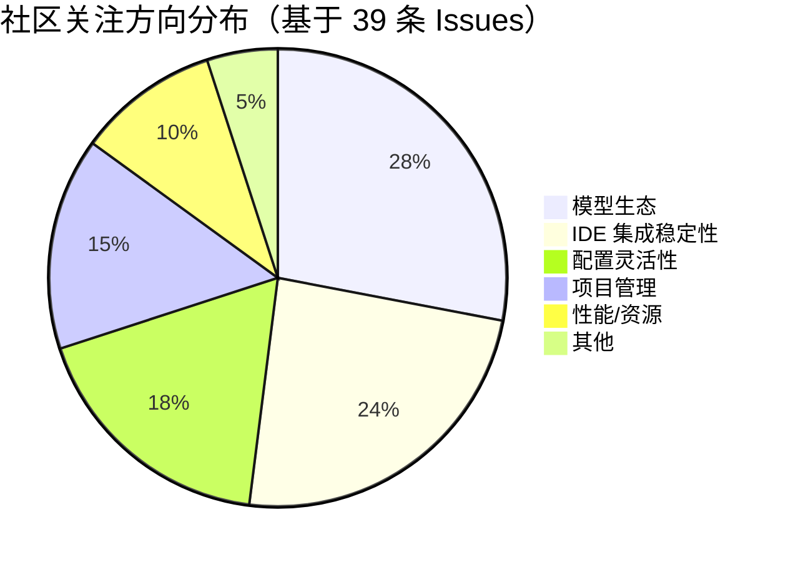

# AI CLI 工具社区动态日报 2026-04-02

> 生成时间: 2026-04-02 00:10 UTC | 覆盖工具: 8 个

- [Claude Code](https://github.com/anthropics/claude-code)
- [OpenAI Codex](https://github.com/openai/codex)
- [Gemini CLI](https://github.com/google-gemini/gemini-cli)
- [GitHub Copilot CLI](https://github.com/github/copilot-cli)
- [Kimi Code CLI](https://github.com/MoonshotAI/kimi-cli)
- [OpenCode](https://github.com/anomalyco/opencode)
- [Pi](https://github.com/badlogic/pi-mono)
- [Qwen Code](https://github.com/QwenLM/qwen-code)
- [Claude Code Skills](https://github.com/anthropics/skills)

---

## 横向对比

# AI CLI 工具生态横向对比分析报告 | 2026-04-02

---

## 1. 生态全景

当前 AI CLI 工具生态呈现**"一超多强、分化加剧"**格局：Claude Code 凭借先发优势占据心智高地，但用量异常危机（单日 2000+ 评论）严重侵蚀信任；OpenAI Codex 以 Rust 架构重构加速追赶，MCP 模块化预示生态开放；Google Gemini CLI 背靠模型优势但 Agent 稳定性存疑；国产阵营（Kimi、Qwen）快速迭代追赶，技术栈争议与 IDE 集成成为差异化焦点。整体从"功能竞赛"转向**可靠性、透明度、企业级治理**的深水区竞争。

---

## 2. 各工具活跃度对比

| 工具 | Issues (今日) | PRs (今日) | Release | 关键动态 |
|:---|:---:|:---:|:---|:---|
| **Claude Code** | 50+ (6个P0用量危机) | 8+ | v2.1.90 | 用量异常危机持续，开源呼声高涨，社区提交反编译 PR |
| **OpenAI Codex** | 50+ | 10+ | rust-v0.119.0-alpha.2 | MCP 模块提取，Token 消耗异常 (#14593, 369评论) |
| **Gemini CLI** | 14 | 18 | v0.37.0-preview.0 | 密集修复 Windows 沙箱、ContextCompressionService 上线 |
| **GitHub Copilot CLI** | 50+ | 0 | v1.0.16-0 | 模型权限不一致 (#1703) 成焦点，社区贡献渠道待观察 |
| **Kimi Code CLI** | 14 | 18 | v1.29.0 | TypeScript 重构提案 (#1707) 引发路线争议 |
| **OpenCode** | 25+ | 10+ | v1.3.13 | Effect 架构大规模重构，Opus 4.6 兼容性问题突出 |
| **Pi** | 10 | 10 | - | 核心团队当日修复当日合并，响应速度极快 |
| **Qwen Code** | 10+ | 10+ | v0.14.0-preview.4 | 双轨版本策略，Qwen 3.6 支持滞后引尴尬 |

> **注**：Issues/PRs 统计基于日报中明确提及的数量，部分工具存在"密集发布但社区贡献低"（Copilot CLI）或"小而快"（Pi）的特征差异。

---

## 3. 共同关注的功能方向

| 功能方向 | 涉及工具 | 具体诉求 |
|:---|:---|:---|
| **计费/用量透明度** | Claude Code, OpenAI Codex, Gemini CLI | 实时 token 计数、消耗来源追踪、异常预警；Claude Code 用量危机 (#16157, 1422评论)、Codex #14593 (369评论) |
| **IDE 深度集成** | OpenCode, GitHub Copilot CLI, Kimi, Qwen Code | VS Code/JetBrains 原生 diff、审批流程、LSP 集成；OpenCode #8003 (41👍)、Copilot #2998 |
| **Prompt Cache 可靠性** | Claude Code, Gemini CLI | 缓存命中率可视化、失效诊断、手动管理；Claude #40652 (计费哈希破坏 cache)、Gemini 长上下文优化 |
| **Windows 平台体验** | Claude Code, Gemini CLI, Kimi, Qwen Code, Pi | 路径解析、换行符一致性、沙箱稳定性；Kimi #1702 (PowerShell 崩溃)、Gemini #24365 (ENOENT) |
| **上下文/记忆管理** | Claude Code, OpenCode, Kimi | 滑动窗口替代压缩、增量式记忆、会话持久化；OpenCode #4659 (滑动窗口提案)、Kimi #1691 |
| **MCP/插件生态** | OpenAI Codex, Gemini CLI, Kimi | 动态加载、热重载、标准化接口；Codex #15919 (MCP crate 提取)、Kimi #1708 |

---

## 4. 差异化定位分析

| 工具 | 功能侧重 | 目标用户 | 技术路线 |
|:---|:---|:---|:---|
| **Claude Code** | Agent 自主执行、终端原生体验 | 全栈开发者、AI 原生工作流早期采用者 | Node.js + 闭源，prompt cache 深度优化 |
| **OpenAI Codex** | 企业级安全、多 Agent 协作、Rust 性能 | 企业工程团队、安全敏感场景 | Rust 全栈重构，MCP 模块化架构 |
| **Gemini CLI** | 长上下文、Google 生态整合、评估驱动 | Google Cloud 用户、研究型开发者 | TypeScript，强调 Agent 评估基础设施 |
| **GitHub Copilot CLI** | GitHub 生态无缝集成、组织级治理 | 现有 Copilot 订阅企业、GitHub 重度用户 | 闭源，与 VS Code 扩展协同 |
| **Kimi Code CLI** | 中文优化、Web+终端双模、快速迭代 | 中国开发者、多模态需求场景 | Python (争议中) → 社区推动 TS 重构 |
| **OpenCode** | 开源可扩展、Effect 函数式架构、多模型 | 技术极客、自托管需求企业 | TypeScript + Effect，强调类型安全 |
| **Pi** | 极致轻量、快速响应、开发者体验 | 个人开发者、终端优先用户 | 未明确，核心团队驱动 |
| **Qwen Code** | 阿里云生态、国产模型优先、企业功能 | 中国企业、Qwen 模型用户 | 双轨版本，快速跟进模型更新 |

**关键分化信号**：
- **架构哲学**：Rust (Codex) vs TypeScript (Gemini/OpenCode/Kimi 争议) vs Python (Kimi 现状)
- **开放程度**：全闭源 (Claude/Copilot) → 源码可重建 (Claude 社区反编译) → 开源可扩展 (OpenCode) → 社区驱动 (Pi)
- **模型绑定**：强绑定 (Qwen/Gemini) → 多模型中立 (OpenCode/Pi) → 策略性开放 (Claude/Copilot)

---

## 5. 社区热度与成熟度

### 社区活跃度矩阵

```
高活跃度 │  Claude Code ●        OpenCode ●
(议题多, │  (危机驱动)           (重构活跃)
评论激)  │
         │  OpenAI Codex ●       Kimi ●
         │  (Token争议)          (重构争议)
         │
         │  Gemini CLI ●         Qwen Code ●
         │  (修复密集)           (版本频繁)
         │
低活跃度 │  GitHub Copilot CLI ●  Pi ●
(官方主导)│  (PR为零)             (小而快)
         └────────────────────────────────
           低成熟度              高成熟度
           (快速迭代)            (相对稳定)
```

### 阶段判断

| 阶段 | 工具 | 特征 |
|:---|:---|:---|
| **危机震荡期** | Claude Code | 用量异常侵蚀信任，开源压力倒逼，社区提交反编译 PR 施压 |
| **架构重构期** | OpenAI Codex, OpenCode, Kimi | 大规模技术栈迁移（Rust/Effect/TS），短期不稳定换长期竞争力 |
| **快速追赶期** | Gemini CLI, Qwen Code, Kimi | 密集功能发布，修复平台适配债务，缩小与头部差距 |
| **生态固化期** | GitHub Copilot CLI | 发布频繁但社区贡献为零，依赖 GitHub 渠道优势 |
| **精专打磨期** | Pi | 小团队高频修复，聚焦核心体验，扩展性待观察 |

---

## 6. 值得关注的趋势信号

| 趋势 | 信号来源 | 开发者参考价值 |
|:---|:---|:---|
| **"用量透明度"成为信任基础设施** | Claude Code 危机 (2000+ 评论)、Codex #14593 (369评论) | 选型时优先考察：①实时 token 计数 API ②用量异常熔断机制 ③详细账单分解能力 |
| **MCP 协议成为事实标准** | Codex #15919 (MCP crate 提取)、Gemini #1708、Kimi #1708 | 投资 MCP 兼容的插件/工具链，避免被单一 CLI 锁定；关注 `codex-mcp` 等模块化实现 |
| **终端 vs IDE 体验融合** | Copilot #2998、OpenCode #8003、Gemini `/reload` | "终端优先"与"IDE 原生"边界模糊，评估团队工作流偏好选择深度集成方案 |
| **架构语言之争白热化** | Kimi #1707 (Python→TS 重构提案)、Codex Rust 全栈 | 技术选型需权衡：Rust (性能/安全) vs TS (生态/迭代速度) vs Python (AI 库兼容) |
| **开源作为竞争策略** | Claude 社区反编译 PR、OpenCode Effect 架构、Pi 快速响应 | 闭源工具的信任成本上升，开源/可审计成为企业采购加分项 |
| **模型绑定 vs 中立性张力** | Qwen 3.6 滞后尴尬 (#2759)、Gemini 工具数量限制 (#24246) | 评估供应商锁定风险，优先选择多模型支持的 CLI 或保留切换能力 |
| **Windows 开发者体验债务** | 全平台 Windows 专项修复 | 中国/企业场景 Windows 占比高，选型需验证：①路径处理 ②沙箱稳定性 ③终端兼容性 |

---

*报告基于 2026-04-02 各工具社区动态生成，数据截至当日公开信息。*

---

## 各工具详细报告

<details>
<summary><strong>Claude Code</strong> — <a href="https://github.com/anthropics/claude-code">anthropics/claude-code</a></summary>

## Claude Code Skills 社区热点

> 数据来源: [anthropics/skills](https://github.com/anthropics/skills)

# Claude Code Skills 社区热点报告（2026-04-02）

---

## 1. 热门 Skills 排行（按社区关注度）

| 排名 | Skill | 功能概述 | 状态 | 链接 |
|:---|:---|:---|:---|:---|
| 1 | **document-typography** | AI 生成文档的排版质量控制，解决孤行/寡行、编号错位等常见问题 | 🟡 Open | [PR #514](https://github.com/anthropics/skills/pull/514) |
| 2 | **frontend-design** | 前端设计技能优化，提升指令清晰度和可执行性 | 🟡 Open | [PR #210](https://github.com/anthropics/skills/pull/210) |
| 3 | **skill-quality-analyzer / skill-security-analyzer** | 元技能：自动评估其他 Skill 的质量与安全性 | 🟡 Open | [PR #83](https://github.com/anthropics/skills/pull/83) |
| 4 | **ODT** | OpenDocument 文本创建、模板填充及 ODT→HTML 解析 | 🟡 Open | [PR #486](https://github.com/anthropics/skills/pull/486) |
| 5 | **SAP-RPT-1-OSS predictor** | 集成 SAP 开源表格基础模型进行业务数据预测分析 | 🟡 Open | [PR #181](https://github.com/anthropics/skills/pull/181) |
| 6 | **codebase-inventory-audit** | 代码库清理与文档审计，识别孤儿代码、未使用文件 | 🟡 Open | [PR #147](https://github.com/anthropics/skills/pull/147) |
| 7 | **shodh-memory** | AI Agent 持久化记忆系统，跨会话保持上下文 | 🟡 Open | [PR #154](https://github.com/anthropics/skills/pull/154) |
| 8 | **testing-patterns** | 全栈测试模式指南：单元测试、React 组件测试、集成测试 | 🟡 Open | [PR #723](https://github.com/anthropics/skills/pull/723) |

**讨论热点**：文档排版（#514）和前端设计（#210）反映社区对"AI 输出质量精细化控制"的强烈需求；元技能（#83）则体现生态自我完善趋势。

---

## 2. 社区需求趋势（从 Issues 提炼）

| 方向 | 代表 Issue | 核心诉求 |
|:---|:---|:---|
| **企业级治理与共享** | [#228](https://github.com/anthropics/skills/issues/228), [#492](https://github.com/anthropics/skills/issues/492) | 组织内 Skill 共享、命名空间信任边界、SSO 兼容 |
| **Skill 创建工具链** | [#202](https://github.com/anthropics/skills/issues/202), [#556](https://github.com/anthropics/skills/issues/556) | skill-creator 符合最佳实践、评估工具可靠性 |
| **基础设施稳定性** | [#62](https://github.com/anthropics/skills/issues/62), [#406](https://github.com/anthropics/skills/issues/406), [#389](https://github.com/anthropics/skills/issues/389) | Skill 持久化存储、API 稳定性、企业部署支持 |
| **MCP 协议集成** | [#16](https://github.com/anthropics/skills/issues/16) | 将 Skills 暴露为标准 MCP 工具，实现跨平台互操作 |
| **多云/多模型支持** | [#29](https://github.com/anthropics/skills/issues/29) | AWS Bedrock 等第三方平台兼容 |

---

## 3. 高潜力待合并 Skills

| Skill | 亮点 | 阻塞因素 | 链接 |
|:---|:---|:---|:---|
| **quality-playbook** | 复活传统质量工程实践，AI 驱动低成本运行 | 需评审 | [PR #659](https://github.com/anthropics/skills/pull/659) |
| **plan-task** | 会话持久化任务计划，解决 Claude Code"从零开始"痛点 | 较新待审 | [PR #522](https://github.com/anthropics/skills/pull/522) |
| **Buildr** | Telegram 桥接，手机远程控制编码会话 | 需安全评审 | [PR #419](https://github.com/anthropics/skills/pull/419) |
| **masonry-generate-image-and-videos** | Imagen 3.0 / Veo 3.1 音视频生成 | 待维护者反馈 | [PR #335](https://github.com/anthropics/skills/pull/335) |
| **ux-product-engineer 等 11 技能合集** | 设计→部署全链路覆盖 | DRAFT 状态 | [PR #740](https://github.com/anthropics/skills/pull/740) |

---

## 4. Skills 生态洞察

> **核心诉求**：社区正从"功能探索期"进入"生产就绪期"——企业用户要求 Skill 具备**组织共享能力、SSO 兼容性、可审计的质量标准**，同时开发者迫切需要**可靠的创建工具链和评估基础设施**，而非仅依赖手动测试。

---

*数据来源：github.com/anthropics/skills | 统计截止：2026-04-02*

---

# Claude Code 社区动态日报 | 2026-04-02

---

## 1. 今日速览

**付费用户用量异常消耗危机持续发酵**，Max 订阅用户报告 1-2 小时内耗尽 5 小时额度，相关 Issue 单日新增评论超 2000 条。v2.1.89 版本引入的终端渲染优化（`CLAUDE_CODE_NO_FLICKER`）反而导致消息消失的新 Bug。社区开源呼声高涨，多个"开源 Claude Code"的 PR 被提交。

---

## 2. 版本发布

### v2.1.90（最新）
| 特性 | 说明 |
|:---|:---|
| `/powerup` 交互式教程 | 带动画演示的 Claude Code 功能教学系统 |
| `CLAUDE_CODE_PLUGIN_KEEP_MARKETPLACE_ON_FAILURE` | 离线环境支持：`git pull` 失败时保留插件市场缓存 |
| `.husky` 目录保护 | 将 Husky 钩子目录加入受保护文件列表 |

### v2.1.89（昨日）
| 特性 | 说明 |
|:---|:---|
| `"defer"` 权限决策 | Headless 会话可在工具调用处暂停，通过 `-p --resume` 恢复后重新评估钩子 |
| `CLAUDE_CODE_NO_FLICKER=1` | 虚拟化技术实现无闪烁 alt-screen 渲染（**已引发回归问题**） |

🔗 [Releases 页面](https://github.com/anthropics/claude-code/releases)

---

## 3. 社区热点 Issues

### 🔥 用量异常危机（P0 级别）

| # | Issue | 评论 | 核心问题 | 社区反应 |
|:---|:---|:---:|:---|:---|
| [#16157](https://github.com/anthropics/claude-code/issues/16157) | Max 订阅瞬间触发用量限制 | 1422 | 历史最久、评论最多的母 Issue，跨平台复现 | 645 👍，用户组织集体维权 |
| [#38335](https://github.com/anthropics/claude-code/issues/38335) | 3月23日起 CLI 会话限制异常消耗 | 313 | 明确时间锚点（3/23），疑似后端变更 | 257 👍，大量数据点佐证 |
| [#41930](https://github.com/anthropics/claude-code/issues/41930) | 全付费层级用量异常：多根因识别 | 6 | **关键分析**：指出 prompt cache 失效、token 计算错误、计费哈希突变等根因 | 10 👍，被引用为技术参考 |
| [#42052](https://github.com/anthropics/claude-code/issues/42052) | Max 20x 计划 2 小时耗尽 100% | 12 | 无 Agent 工具、轻量工作负载下异常 | 用户对比历史账单，差异显著 |
| [#41788](https://github.com/anthropics/claude-code/issues/41788) | v2.1.89 后 70 分钟耗尽额度 | 11 | **版本相关性**：2.1.89 更新后首次出现 | 详细版本迁移记录 |
| [#41506](https://github.com/anthropics/claude-code/issues/41506) | 用量突增 3-5 倍（3/28-29 起） | 8 | Linux 平台，明确时间窗口 | 9 👍，多用户确认时间线 |

### 🐛 渲染回归问题

| # | Issue | 评论 | 核心问题 |
|:---|:---|:---:|:---|
| [#41814](https://github.com/anthropics/claude-code/issues/41814) | v2.1.89 后终端消息消失 | 22 | `CLAUDE_CODE_NO_FLICKER` 虚拟化导致历史消息被清除 |
| [#42244](https://github.com/anthropics/claude-code/issues/42244) | 2.1.89 终端内容消失（IntelliJ） | 8 | 跨终端复现，标记为 `regression` |

### 🔧 技术根因分析

| # | Issue | 评论 | 核心发现 |
|:---|:---|:---:|:---|
| [#40652](https://github.com/anthropics/claude-code/issues/40652) | CLI 通过 `cch=` 计费哈希替换破坏 prompt cache | 6 | **关键技术分析**：历史工具结果被突变，导致 cache 永久失效，每轮多消耗 30-50K tokens |
| [#38239](https://github.com/anthropics/claude-code/issues/38239) | Windows 平台 token 计算与配额管理严重错误 | 47 | 平台特定问题，token 计数与实际不符 |

---

## 4. 重要 PR 进展

### 🚨 开源相关（社区高度关注的实验性 PR）

| # | PR | 状态 | 内容 | 意义 |
|:---|:---|:---:|:---|:---|
| [#41447](https://github.com/anthropics/claude-code/pull/41447) | 开源 Claude Code ✨ | Open | 关闭多个历史开源请求 Issue | 象征性社区压力表达 |
| [#41518](https://github.com/anthropics/claude-code/pull/41518) | 完整开源：从 source map 提取 1906 个 TS 文件 | Open | 从 57MB `cli.js.map` 反编译源码，配置 Bun 构建 | **技术突破**：实际可运行的源码重建 |
| [#41568](https://github.com/anthropics/claude-code/pull/41568) | Rust 完整重写：16 crate 工作区架构 | Open | 高性能 Rust 实现，含完整 QueryEngine、TUI、流式传输 | 社区替代实现探索 |
| [#41611](https://github.com/anthropics/claude-code/pull/41611) | 添加缺失的源码 | Open | 补充上游缺失源文件 | 持续的开源压力 |

### 🔌 插件生态

| # | PR | 状态 | 功能 |
|:---|:---|:---:|:---|
| [#41661](https://github.com/anthropics/claude-code/pull/41661) | 14 个革命性插件：安全、性能、架构、全栈自动化 | Open | 安全审计、性能分析、架构可视化、全栈自动化等插件集 |
| [#42245](https://github.com/anthropics/claude-code/pull/42245) | EvalView 插件：AI Agent 回归测试 | Open | 结构化 diff 工具调用、参数、输出与基线对比 |
| [#39148](https://github.com/anthropics/claude-code/pull/39148) | preserve-session 插件：路径无关的会话历史 | Open | 项目重命名/移动后保留会话历史 |
| [#42162](https://github.com/anthropics/claude-code/pull/42162) | fix(hookify): 使用相对导入修复插件缓存安装 | Open | 解决插件系统路径问题 |

### 🛠️ 修复与文档

| # | PR | 状态 | 内容 |
|:---|:---|:---:|:---|
| [#42265](https://github.com/anthropics/claude-code/pull/42265) | 修复废弃的安装指令和失效链接 | Open | 替换 `npm install` 为原生安装命令，更新 5 个文档链接 |
| [#42079](https://github.com/anthropics/claude-code/pull/42079) | 修复 README 拼写错误 | Open | `are` → `as` |
| [#42086](https://github.com/anthropics/claude-code/pull/42086) | 为 security-guidance 插件添加 README | Open | 补全唯一缺失文档的插件 |

---

## 5. 功能需求趋势

基于 50 个活跃 Issue 的聚类分析：

```
┌─────────────────────────────────────────────────────────┐
│  计费透明度 & 用量控制    ████████████████████████████  35%  │
│  ── 实时 token 计数器、用量预警、详细账单分解              │
├─────────────────────────────────────────────────────────┤
│  开源 & 自托管能力        ██████████████████████        25%  │
│  ── 源码开放、本地模型支持、企业私有化部署                 │
├─────────────────────────────────────────────────────────┤
│  IDE 集成深度优化         ████████████████              18%  │
│  ── VS Code/JetBrains 原生体验、调试器集成                │
├─────────────────────────────────────────────────────────┤
│  Prompt Cache 可靠性      ████████████                  14%  │
│  ── 缓存命中率可视化、手动缓存管理、失效诊断               │
├─────────────────────────────────────────────────────────┤
│  多模态 & 长上下文        ████████                       8%  │
│  ── 图像理解、1M+ 上下文优化、RAG 集成                    │
└─────────────────────────────────────────────────────────┘
```

---

## 6. 开发者关注点

### 痛点矩阵

| 优先级 | 问题 | 影响范围 | 临时缓解方案 |
|:---|:---|:---|:---|
| **P0** | 用量异常消耗 | 全付费用户 | 降级到 Sonnet 4.5、禁用 Agent 工具、缩短会话 |
| **P0** | v2.1.89 消息消失 | 全平台 TUI 用户 | 设置 `CLAUDE_CODE_NO_FLICKER=0` 回退 |
| **P1** | Prompt cache 神秘失效 | 长会话用户 | 定期 `/compact`、监控 `cache_read_input_tokens` |
| **P1** | 计费不透明 | 企业采购决策者 | 自建用量追踪脚本 |
| **P2** | Windows 平台二等公民 | Win 开发者 | WSL2 或等待 [#32227](https://github.com/anthropics/claude-code/issues/32227) 修复 |

### 高频技术诉求

1. **可观测性**：要求暴露 `cache_read_input_tokens` / `cache_write_input_tokens` 的实时 API
2. **用量保险丝**：单会话 token 上限、自动降级策略
3. **版本锁定**：禁止自动更新，避免生产环境被强制升级引入回归
4. **离线优先**：完整插件市场镜像、本地模型推理支持

---

*日报基于 GitHub 公开数据生成，不代表 Anthropic 官方立场。*

</details>

<details>
<summary><strong>OpenAI Codex</strong> — <a href="https://github.com/openai/codex">openai/codex</a></summary>

# OpenAI Codex 社区动态日报 | 2026-04-02

---

## 今日速览

今日社区焦点集中在**Token 消耗异常**（Issue #14593 评论数达 369）和**macOS Intel 支持**（Issue #10410 获 226 赞）两大议题。开发团队持续推进代码架构重构，MCP 模块提取和工具链解耦成为近期 PR 主线，同时 TUI 语音转录功能的移除引发用户讨论。

---

## 版本发布

| 版本 | 类型 | 说明 |
|:---|:---|:---|
| [rust-v0.119.0-alpha.2](https://github.com/openai/codex/releases/tag/rust-v0.119.0-alpha.2) | Alpha 预发布 | Rust 客户端的迭代更新，具体变更详情待官方补充 |

---

## 社区热点 Issues

| # | 状态 | 标题 | 热度 | 核心看点 |
|:---|:---|:---|:---|:---|
| [#14593](https://github.com/openai/codex/issues/14593) | 🔴 OPEN | Token 消耗过快问题 | 💬 369 / 👍 144 | **社区最高优先级议题**。Business 订阅用户报告 Token 异常消耗，疑似存在后台重复请求或计费逻辑缺陷，影响成本控制 |
| [#10410](https://github.com/openai/codex/issues/10410) | 🔴 OPEN | macOS Intel (x86_64) 桌面应用支持 | 💬 154 / 👍 226 | **呼声最高的平台需求**。Intel Mac 用户无法使用原生应用，被迫依赖 CLI 或 Rosetta，体验割裂 |
| [#8745](https://github.com/openai/codex/issues/8745) | 🔴 OPEN | LSP 自动检测与安装集成 | 💬 44 / 👍 222 | 开发者希望 Codex CLI 内置语言服务器支持，提升代码智能和诊断能力 |
| [#2998](https://github.com/openai/codex/issues/2998) | 🔴 OPEN | IDE 集成 diff/审批流程 | 💬 41 / 👍 126 | 用户希望将 CLI 的红绿 diff 体验带入 VS Code 等 IDE，减少上下文切换 |
| [#3962](https://github.com/openai/codex/issues/3962) | 🔴 OPEN | 任务完成提示音 | 💬 35 / 👍 128 | 后台运行场景下的体验优化需求，反映"异步工作流"使用模式增长 |
| [#9224](https://github.com/openai/codex/issues/9224) | 🔴 OPEN | 手机远程控制桌面 Codex | 💬 34 / 👍 237 | **高赞创意功能**。通过 ChatGPT App 远程操控桌面 CLI，契合移动+桌面协同趋势 |
| [#3000](https://github.com/openai/codex/issues/3000) | 🔴 OPEN | 语音输入/麦克风支持 | 💬 26 / 👍 99 | 与 #418 相关但聚焦 IDE 扩展，"vibe coding" 场景的核心交互诉求 |
| [#15764](https://github.com/openai/codex/issues/15764) | 🔴 OPEN | VS Code 扩展代码补丁性能回归 | 💬 13 / 👍 21 | 新版本导致 Code Helper 进程 CPU 占用超 100%，已定位到特定版本引入 |
| [#16404](https://github.com/openai/codex/issues/16404) | 🔴 OPEN | TUI 语音转录功能被移除 | 💬 4 / 👍 5 | **今日新增议题**。0.118.0 移除该功能后，终端优先工作流用户寻求替代方案或官方说明 |
| [#13018](https://github.com/openai/codex/issues/13018) | 🔴 OPEN | 允许彻底删除对话线程 | 💬 5 / 👍 38 | 隐私和整理需求，当前仅支持归档需手动清理文件系统 |

---

## 重要 PR 进展

| # | 状态 | 标题 | 技术要点 |
|:---|:---|:---|:---|
| [#15919](https://github.com/openai/codex/pull/15919) | 🟡 OPEN | 提取 MCP 至独立 crate `codex-mcp` | 架构解耦：将 MCP 运行时/服务器代码从 `codex-core` 分离，新增 `McpManager` API，为 MCP 生态扩展铺路 |
| [#16055](https://github.com/openai/codex/pull/16055) | 🟡 OPEN | 强制 fork 代理继承父模型设置 | 修复 `fork_context=true` 时子代理覆盖模型配置的问题，优化上下文复用的经济性 |
| [#13637](https://github.com/openai/codex/pull/13637) | 🟡 OPEN | 保留 replay 中的 fork 引用 | 解决 fork 线程历史重复存储问题，支持嵌套 fork 的正确重放和截断行为 |
| [#16181](https://github.com/openai/codex/pull/16181) | 🟡 OPEN | 添加延迟 watchdog 命名空间工具 | 重构协作工具架构，将 watchdog 专用工具与通用代理工具分离，配置更灵活 |
| [#16462](https://github.com/openai/codex/pull/16462) | 🟡 OPEN | 修复 Guardian 事件顺序问题 | 解决 CommandExecution 项目的事件乱序，确保前端能正确渲染自动审查状态 |
| [#16482](https://github.com/openai/codex/pull/16482) | 🟡 OPEN | 移除 client_common 工具重导出 | 依赖透明化：清理 `codex-tools` 提取后的残留重导出层，明确 crate 边界 |
| [#15914](https://github.com/openai/codex/pull/15914) | 🟡 OPEN | 运行时状态迁移至 PermissionProfile | 权限系统重构：用 `PermissionProfile` 替代 lossy 的 `SandboxPolicy` 枚举，支持精细化文件系统和网络控制 |
| [#16460](https://github.com/openai/codex/pull/16460) | 🟡 OPEN | 修复 Windows Bazel Rust 测试覆盖率 | 跨平台构建：修复 MSVC 工具链路径，使 Windows 执行平台测试正常工作 |
| [#16450](https://github.com/openai/codex/pull/16450) | 🟡 OPEN | Bazel Clippy 工作流覆盖 rust_test 目标 | 代码质量：补全 Bazel PR 检查中遗漏的 `#[cfg(test)]` 代码警告检测 |
| [#16396](https://github.com/openai/codex/pull/16396) | 🔴 CLOSED | 添加实时 WebRTC 外部音频桥 | 实时通信：通过 libwebrtc 桥接 PCM 输入，支持协议 v1/v2 的 native 音频源（已合并） |

---

## 功能需求趋势

基于 50 条活跃 Issue 分析，社区关注呈现**四大方向**：

| 方向 | 代表 Issue | 需求强度 |
|:---|:---|:---:|
| **IDE 深度集成** | #2998 (diff 审批)、#3000 (语音输入)、#2932 (diff 查看器) | ⭐⭐⭐⭐⭐ |
| **平台覆盖扩展** | #10410 (Intel Mac)、#15057 (Linux sandbox) | ⭐⭐⭐⭐⭐ |
| **成本与性能优化** | #14593 (Token 消耗)、#15764 (CPU 回归)、#14666 (内存泄漏) | ⭐⭐⭐⭐⭐ |
| **工作流增强** | #9224 (远程控制)、#2788 (历史检查点)、#3962 (通知音效) | ⭐⭐⭐⭐☆ |

**新兴趋势**：TUI 语音功能移除（#16404）反映出产品策略向桌面 App 集中，终端优先用户群体出现分化。

---

## 开发者关注点

### 🔥 高频痛点

1. **计费透明度不足**  
   Issue #14593 的 369 条评论揭示核心矛盾：企业用户无法追踪 Token 消耗来源，缺乏细粒度使用分析工具。

2. **平台支持碎片化**  
   Intel Mac 和特定 Linux 发行版（Ubuntu AppArmor 限制 #15057）的用户被排除在官方支持外，社区补丁维护成本高。

3. **审批流程摩擦**  
   多 Issue 反馈 CLI 的终端审批与 IDE 工作流割裂，开发者希望统一的"代码审查式"交互体验。

### 📊 架构演进信号

- **模块化加速**：`codex-mcp`、`codex-tools` 等 crate 独立，预示第三方扩展生态即将开放
- **遥测体系完善**：PR #15591/#15915/#15804 构建完整的 thread/subagent/turn 事件链路，为性能优化提供数据基础
- **Guardian 安全层成熟**：事件顺序和类型强化的修复（#16462/#16448）表明自动审查机制进入生产就绪阶段

---

*数据来源：github.com/openai/codex | 统计周期：2026-04-01 至 2026-04-02*

</details>

<details>
<summary><strong>Gemini CLI</strong> — <a href="https://github.com/google-gemini/gemini-cli">google-gemini/gemini-cli</a></summary>

# Gemini CLI 社区动态日报 | 2026-04-02

## 今日速览

Google 团队今日密集推进 **v0.37.0-preview.0** 预发布版本，重点优化 Agent 评估基础设施与配置回滚策略；社区同步涌现多项核心功能 PR，包括 **ContextCompressionService 上线**、**Windows 沙箱可靠性修复** 及 **全局 `/reload` 命令**，显示项目正加速向生产级稳定性迈进。

---

## 版本发布

### v0.37.0-preview.0（预发布）
| 属性 | 内容 |
|:---|:---|
| 发布日期 | 2026-04-01 |
| 核心变更 | 评估 Agent 集中化至 `test-utils` 实现复用；回滚"默认禁用 Agent"配置变更；修复 Plan 模块遥测问题 |

**关键解读**：此版本标志着团队对 Agent 架构的"先破后立"——先回滚有争议的默认配置，再通过测试基础设施重构为后续稳定迭代铺路。

🔗 [Release 详情](https://github.com/google-gemini/gemini-cli/releases/tag/v0.37.0-preview.0)

---

## 社区热点 Issues（精选 10 项）

| # | Issue | 核心议题 | 社区反应 | 优先级 |
|:---|:---|:---|:---|:---|
| **#22745** | [AST-aware 文件读取评估](https://github.com/google-gemini/gemini-cli/issues/22745) | 探索用 AST 精准定位代码边界，减少 Token 浪费与误读 | 🔒 维护者内部 EPIC，4 条深度技术讨论 | P0 架构级 |
| **#24434** | [历史输出多余空行](https://github.com/google-gemini/gemini-cli/issues/24434) | UI 边距逻辑导致工具输出间隙，影响终端阅读体验 | 新提交 P1 问题，2 条评论确认复现 | P1 |
| **#22863** | [不安全对象克隆模式](https://github.com/google-gemini/gemini-cli/issues/22863) | Agent 频繁生成部分实现的 Proxy 克隆，存在运行时风险 | 技术债务类议题，关联 PR #24457 已提交修复 | 维护者跟踪 |
| **#22267** | [Browser Agent 忽略 settings.json](https://github.com/google-gemini/gemini-cli/issues/22267) | 全局/项目级配置覆盖失效，maxTurns 等设置被无视 | 长期存在，2 条评论确认影响工作流 | P2 |
| **#22323** | [子 Agent MAX_TURNS 中断误报成功](https://github.com/google-gemini/gemini-cli/issues/22323) | `codebase_investigator` 达轮次上限仍返回 GOAL 状态，隐藏真实中断 | 2 条评论 + 2 👍，影响调试可信度 | P1 |
| **#23582** | [子 Agent 审批模式感知缺失](https://github.com/google-gemini/gemini-cli/issues/23582) | Plan/Auto-Edit 模式约束无法传递至子 Agent，导致策略冲突 | 1 评论 + 1 👍，企业场景关键需求 | 维护者跟踪 |
| **#22819** | [记忆路由：全局 vs 项目](https://github.com/google-gemini/gemini-cli/issues/22819) | 需区分用户级偏好（`~/.gemini/`）与项目级知识（`.gemini/`） | 1 评论 + 1 👍，个性化体验核心设计 | 维护者跟踪 |
| **#24246** | [>128 工具触发 400 错误](https://github.com/google-gemini/gemini-cli/issues/24246) | 工具数量超限未做智能筛选，直接报错中断 | 新暴露的规模化瓶颈，无评论 | 待评估 |
| **#24365** | [GeminiSandbox.exe ENOENT 致命错误](https://github.com/google-gemini/gemini-cli/issues/24365) | Windows 用户遭遇沙箱可执行文件缺失，完全无法工作 | 用户反馈，0 评论但影响严重 | 待分类 |
| **#24470** | [长对话滚动闪烁/跳动](https://github.com/google-gemini/gemini-cli/issues/24470) | 滚动历史记录时屏幕闪烁、滚动条位置异常 | 新提交 UI 缺陷，附录屏证据 | 待分类 |

---

## 重要 PR 进展（精选 10 项）

| # | PR | 功能/修复 | 状态 | 技术亮点 |
|:---|:---|:---|:---|:---|
| **#24483** | [ContextCompressionService 上线](https://github.com/google-gemini/gemini-cli/pull/24483) | 上下文压缩服务正式合入 | 🟡 Open | 上游社区贡献（@thetomzohar），为 #24482 长文本优化铺路 |
| **#24460** | [沙箱可用性增强](https://github.com/google-gemini/gemini-cli/pull/24460) | 主动权限申请 + 拒绝检测优化 | 🔴 Closed | 解决用户被沙箱阻塞无反馈的痛点 |
| **#24480** | [Windows 沙箱可靠性修复](https://github.com/google-gemini/gemini-cli/pull/24480) | `CREATE_BREAKAWAY_FROM_JOB` 标志 + 集成测试修复 | 🟡 Open | 解决 Windows CI 长期静默跳过问题 |
| **#24478** | [全局 `/reload` 命令](https://github.com/google-gemini/gemini-cli/pull/24478) | 一键刷新 skills/agents/MCP/memory/settings | 🟡 Open | 替代分散的 reload 子命令，提升交互效率 |
| **#24477** | [并行任务追踪器强制更新](https://github.com/google-gemini/gemini-cli/pull/24477) | 系统提示强制 batch `tracker_update_task` 调用 | 🟡 Open | 防止多步骤流程中追踪状态失步 |
| **#24457** | [不安全克隆行为评估与修复](https://github.com/google-gemini/gemini-cli/pull/24457) | 新增行为评估 + 修复 #22863 | 🟡 Open | 行为驱动开发（BDD）实践，附评估运行链接 |
| **#24476** | [Windows CI 测试执行修复](https://github.com/google-gemini/gemini-cli/pull/24476) | 修复 PowerShell 参数传递导致测试被跳过 | 🟡 Open | 暴露并修复 5 个 Windows 特有测试失败 |
| **#24475** | [隐藏模型导向的错误信息](https://github.com/google-gemini/gemini-cli/pull/24475) | 非零退出码视为正常输出而非工具失败 | 🟡 Open | 减少用户误认 Agent 崩溃的干扰 |
| **#24449** | [工具输出垂直间距修复](https://github.com/google-gemini/gemini-cli/pull/24449) | 重构 `ToolGroupMessage` 边界处理 | 🟡 Open | 直接响应 #24434，紧凑模式无意外间隙 |
| **#24274** | [后台记忆服务技能提取](https://github.com/google-gemini/gemini-cli/pull/24274) | 启动时扫描历史会话，自动生成 SKILL.md | 🟡 Open | `experimentalMemoryManager` 标志，"Confucius" 子 Agent 实现 |

---

## 功能需求趋势

基于 50 条活跃 Issue 分析，社区关注聚焦五大方向：

| 趋势方向 | 代表 Issue | 热度指标 |
|:---|:---|:---|
| **🧠 Agent 智能边界** | AST-aware 读取、不安全克隆修复、工具数量限制 | 4+ 维护者 EPIC，架构级投入 |
| **⚡ 上下文与记忆管理** | 全局/项目记忆路由、后台技能提取、上下文压缩 | 3 项关联 PR 同步推进 |
| **🖥️ 终端交互体验** | 滚动性能、空行间隙、SSH 文本乱码 | 用户反馈密集，UI 类 P1 激增 |
| **🔒 沙箱与权限** | Windows 沙箱 ENOENT、权限主动申请、Cloud Shell 配置 | 跨平台稳定性关键路径 |
| **📊 可观测与调试** | 追踪器同步、MAX_TURNS 误报、行为评估体系 | 企业/团队场景刚需 |

---

## 开发者关注点

### 🔴 高频痛点
1. **Windows 平台二等公民体验**  
   - 沙箱可执行文件缺失（#24365）、CI 测试长期被跳过（#24476）、SSH 后文本乱码（#24202）形成系统性问题
   - *信号*：今日 3 个 Windows 专项 PR 集中提交，显示团队已优先级响应

2. **Agent "黑箱"行为难调试**  
   - 子 Agent 状态误报（#22323）、配置覆盖失效（#22267）、审批模式感知缺失（#23582）削弱可控性

3. **工具规模化瓶颈**  
   - 128+ 工具直接 400 错误（#24246）、临时脚本散落（#23571）暴露架构扩展性限制

### 🟡 期待功能
- **语音输入零配置方案**（PR #18499 待合入）：Gemini 原生 + Whisper 可选后端
- **一键状态刷新**（PR #24478）：终结分散的 reload 命令记忆负担
- **智能上下文压缩**（PR #24483）：长对话场景的性能救星

---

*日报生成时间：2026-04-02 | 数据来源：google-gemini/gemini-cli*

</details>

<details>
<summary><strong>GitHub Copilot CLI</strong> — <a href="https://github.com/github/copilot-cli">github/copilot-cli</a></summary>

# GitHub Copilot CLI 社区动态日报 | 2026-04-02

---

## 1. 今日速览

GitHub Copilot CLI 今日密集发布 **v1.0.15 至 v1.0.16-0** 四个版本，重点修复 MCP 服务器加载稳定性问题，并正式下线 GPT-5.1 Codex 系列模型支持。社区热议焦点集中在**模型权限不一致**（CLI 与 VS Code 可用模型差异）和**交互体验优化**两大主题，单日 Issues 更新量达 50 条。

---

## 2. 版本发布

### v1.0.16-0（最新）
| 类型 | 内容 |
|:---|:---|
| **修复** | MCP 服务器在登录、用户切换及 `/mcp reload` 后正确加载；BYOK Anthropic 提供商现尊重配置的 `maxOutputTokens` 限制 |
| **移除** | 废弃 `marketplaces` 仓库设置（改用 `extraKnownMarketplaces`）|

### v1.0.15 系列
| 版本 | 关键更新 |
|:---|:---|
| v1.0.15 | 下线 gpt-5.1-codex 全系列模型；交互模式新增吉祥物眨眼动画；用户切换器按字母序排列；新增 `mcp.config.*` RPC 接口 |
| v1.0.15-2 | 优化用户列表字母排序 |
| v1.0.15-1 | 新增设备码流（RFC 8628）支持无头/CI 环境的 MCP OAuth；新增 `/mcp auth` 重认证命令 |

🔗 [Releases 页面](https://github.com/github/copilot-cli/releases)

---

## 3. 社区热点 Issues

| # | Issue | 状态 | 评论 | 核心看点 |
|:---|:---|:---|:---:|:---|
| [#618](https://github.com/github/copilot-cli/issues/618) | 支持 `.github/prompts` 目录自定义斜杠命令 | ✅ CLOSED | 28 | **高赞功能（93👍）** 终于落地，实现与 VS Code 扩展的自定义命令对齐，开发者可复用现有 prompt 工作流 |
| [#1481](https://github.com/github/copilot-cli/issues/1481) | `Shift+Enter` 应换行而非执行 | ✅ CLOSED | 20 | 修复与主流聊天应用不一致的快捷键逻辑，降低 muscle memory 冲突 |
| [#223](https://github.com/github/copilot-cli/issues/223) | 组织级 Token 应显示"Copilot Requests"权限 | 🟡 OPEN | 17 | **企业安全刚需**（60👍），解决企业禁止个人 PAT 的合规痛点 |
| [#1703](https://github.com/github/copilot-cli/issues/1703) | CLI 模型列表与 VS Code 不一致（如 Gemini 3.1 Pro） | 🟡 OPEN | 16 | **高频投诉**，同一账户/组织下 CLI 缺失企业已启用的模型，暴露 entitlement 同步缺陷 |
| [#2101](https://github.com/github/copilot-cli/issues/2101) | 瞬态 API 错误导致级联重试和速率限制 | 🟡 OPEN | 15 | 稳定性痛点，开发者遭遇频繁"请 1 分钟后重试"中断工作流 |
| [#1973](https://github.com/github/copilot-cli/issues/1973) | 交互模式工具白名单 | 🟡 OPEN | 5 | **安全精细控制**需求，只读操作（grep/cat）无需每次确认，但避免 `/allow-all` 的破坏性风险 |
| [#2334](https://github.com/github/copilot-cli/issues/2334) | 恢复 `--no-alt-screen` 支持 | 🟡 OPEN | 3 | **13👍 强烈诉求**，alt-screen 导致无滚动条、无法搜索历史、无法复制，严重损害可访问性 |
| [#1217](https://github.com/github/copilot-cli/issues/1217) | WSL 支持 Windows 剪贴板图片粘贴 | 🟡 OPEN | 2 | **46👍 高需求**，跨平台工作流断裂，截图/图像输入受阻 |
| [#2421](https://github.com/github/copilot-cli/issues/2421) | HTTP/2 GOAWAY 竞态条件导致静默高级请求浪费 | 🟡 OPEN | 2 | 技术深度问题，合并追踪 #1743/#1754/#2050/#2101/#2189，涉及 undici 连接池状态机缺陷 |
| [#2431](https://github.com/github/copilot-cli/issues/2431) | 代理注入凭证因格式校验失败被拒绝 | ✅ CLOSED | 2 | 修复企业代理场景下合法 Token 被客户端前置校验拦截的阻塞问题 |

---

## 4. 重要 PR 进展

**今日无新增 Pull Request 更新。**

> 注：过去 24 小时内 PR 活动为零，功能迭代主要通过官方直接推送 release 完成，社区贡献渠道待观察。

---

## 5. 功能需求趋势

基于 50 条 Issues 分析，社区关注呈 **三大聚类**：

| 趋势方向 | 代表 Issue | 热度指标 |
|:---|:---|:---:|
| **模型生态对等** | #1703, #2434, #2449, #2393 | 🔥🔥🔥 |
| 核心矛盾：CLI 作为"一等公民"与 VS Code/web 的模型可用性差距，涉及 Gemini/Claude 的企业 entitlement 同步、新模型上线延迟 |
| **交互体验现代化** | #1481, #2334, #1211, #2216, #1504 | 🔥🔥🔥 |
| 快捷键一致性、终端 alt-screen 可访问性、自定义主题、会话标题管理、WSL 剪贴板集成——开发者期望 CLI 达到 GUI 级体验 |
| **企业级安全与治理** | #223, #1973, #2338, #2458 | 🔥🔥 |
| 组织 Token 权限、工具调用白名单、.claude/settings.json 权限继承、Hook 数据审计追踪——从个人工具向团队基础设施演进 |

---

## 6. 开发者关注点

### 🔴 阻塞性痛点
- **模型权限"薛定谔"状态**：同一账户不同客户端体验割裂，企业用户尤为困扰（#1703, #2449）
- **稳定性黑洞**：HTTP/2 连接池竞态、瞬态错误重试策略激进，导致"高级请求"被静默消耗（#2421, #2101）

### 🟡 体验摩擦
- **终端渲染倒退**：alt-screen 强制启用引发可访问性危机，社区呼吁恢复用户选择权（#2334）
- **跨平台断裂**：WSL 剪贴板、CRLF/LF 行尾处理（#1148）等 Windows 开发者体验欠账

### 🟢 积极信号
- 自定义斜杠命令（#618）闭环显示产品向 VS Code 生态对齐
- MCP 配置 RPC 接口（v1.0.15-1）为自动化/CI 场景铺路

---

*日报生成时间：2026-04-02 | 数据来源：github.com/github/copilot-cli*

</details>

<details>
<summary><strong>Kimi Code CLI</strong> — <a href="https://github.com/MoonshotAI/kimi-cli">MoonshotAI/kimi-cli</a></summary>

# Kimi Code CLI 社区动态日报 | 2026-04-02

## 今日速览

Kimi Code CLI 今日发布 **v1.29.0**，带来 `/title` 手动重命名会话、分层 AGENTS.md 加载等 16 项更新，同时修复了 Windows 换行符、SOCKS 代理等长期痛点。社区活跃度显著上升，单日新增 14 个 Issues 和 18 个 PR，其中 **TypeScript 重构提案** 引发广泛技术讨论。

---

## 版本发布

### v1.29.0（2026-04-01）

| 类别 | 更新内容 |
|:---|:---|
| **核心功能** | 新增 `/title`（`/rename`）命令，支持手动设置会话标题；分层加载 AGENTS.md，从 Git 根目录到工作目录逐级继承 |
| **体验优化** | 粘贴文本折叠阈值可通过环境变量 `KIMI_CLI_PASTE_CHAR_THRESHOLD` / `KIMI_CLI_PASTE_LINE_THRESHOLD` 自定义 |
| **Bug 修复** | 修复 Windows 下 `writetext` 自动将 LF 转为 CRLF、Web 端缓存导致白屏、终端真彩色兼容性问题 |
| **代理支持** | 自动将 `socks://` 规范化为 `socks5://`，兼容 V2RayN/Clash 等工具 |

[Release 详情](https://github.com/MoonshotAI/kimi-cli/releases/tag/1.29.0)

---

## 社区热点 Issues（10 个）

| # | 状态 | 标题 | 重要性分析 | 社区反应 |
|:---|:---|:---|:---|:---|
| [#1707](https://github.com/MoonshotAI/kimi-cli/pull/1707) | 🔥 **OPEN** | **重构提案：Python → Bun + TypeScript + React Ink** | 社区成员提出激进技术重构，认为 Python 是"彻底的失败"，主张转向现代 JS 运行时。涉及架构方向抉择，Moonshot 团队尚未回应。 | 高关注度，可能引发长期技术路线讨论 |
| [#1682](https://github.com/MoonshotAI/kimi-cli/issues/1682) | OPEN | 命令输入 UX 问题：需敲两次回车 | 与 Claude Code 行为不一致，直接影响每日高频操作效率。用户明确对比竞品，体验差距显著。 | 2 条讨论，待官方评估 |
| [#1681](https://github.com/MoonshotAI/kimi-cli/issues/1681) | OPEN | UI 渲染异常：字符间距、斜杠显示、内部标签泄露 | 多个视觉层 Bug 聚合，影响专业用户对产品精致度的信任。 | 2 条讨论，含详细复现 |
| [#1708](https://github.com/MoonshotAI/kimi-cli/issues/1708) | OPEN | 动态加载/卸载 MCP Servers 和 Skills | 当前需重启 CLI 生效，打断开发流。请求对标 Cursor 的即时配置能力。 | 新提交，无评论 |
| [#1705](https://github.com/MoonshotAI/kimi-cli/issues/1705) [#1704](https://github.com/MoonshotAI/kimi-cli/issues/1704) | OPEN | Skill 发现机制增强（重复提交） | 插件安装后无法自动发现，配置门槛高。反映生态扩展的架构瓶颈。 | 同日重复提交，说明需求迫切 |
| [#1702](https://github.com/MoonshotAI/kimi-cli/issues/1702) | OPEN | Windows Shell 工具崩溃：`powershell.exe` 未找到 | `uv tool install` 场景下的路径解析问题，阻断 Windows 用户基础功能。 | 已有 PR #1703 修复 |
| [#1695](https://github.com/MoonshotAI/kimi-cli/issues/1695) | OPEN | Openclaw 定时任务 3 天无法触发 | 生产环境稳定性问题，涉及 Kimi 服务端过载，非客户端 Bug 但影响付费用户。 | 含完整错误日志 |
| [#1691](https://github.com/MoonshotAI/kimi-cli/issues/1691) | OPEN | 增量式会话记忆：零成本上下文压缩 | 创新性功能提案，针对 `/compact` 昂贵且易失败的痛点，提出流式摘要架构。 | 新提交，技术深度高 |
| [#1596](https://github.com/MoonshotAI/kimi-cli/issues/1596) | ✅ CLOSED | AGENTS.md 指令遵从能力弱 | 安全/约束场景的核心需求，已随 v1.29.0 的分层加载改进部分解决。 | 1 赞，已关闭 |
| [#1615](https://github.com/MoonshotAI/kimi-cli/issues/1615) | ✅ CLOSED | GLM5.1 模型反馈接收失败 | 第三方模型兼容性 Bug，反映多模型支持的测试覆盖不足。 | 3 条讨论，已修复 |

---

## 重要 PR 进展（10 个）

| # | 状态 | 标题 | 技术要点 |
|:---|:---|:---|:---|
| [#1707](https://github.com/MoonshotAI/kimi-cli/pull/1707) | OPEN | **重构：Python → Bun + TypeScript + React Ink** | 完整重写，移除 Web UI，专注终端原生体验。保留目录结构便于 diff 审查。⚠️ 破坏性变更 |
| [#1709](https://github.com/MoonshotAI/kimi-cli/pull/1709) | OPEN | fix(diff): 对齐 tab 展开后的高亮偏移 | 处理制表符宽度差异导致的 diff 高亮错位，提升代码审查准确性 |
| [#1703](https://github.com/MoonshotAI/kimi-cli/pull/1703) | OPEN | fix: Windows 上解析完整 PowerShell 路径 | 解决 `uv tool install` 场景下的 `WinError 2`，使用 `where.exe` 动态定位 |
| [#1701](https://github.com/MoonshotAI/kimi-cli/pull/1701) | OPEN | feat(web): 侧边栏会话状态指示器 | 新增 🟢 运行中 / ⚪ 空闲 / 🔴 错误 三色脉冲圆点，提升多会话管理效率 |
| [#1700](https://github.com/MoonshotAI/kimi-cli/pull/1700) | ✅ CLOSED | feat(agents): 分层 AGENTS.md 加载 | 从 Git 根目录到工作目录逐级加载，`.kimi/AGENTS.md` 优先级高于同级 `AGENTS.md` |
| [#1699](https://github.com/MoonshotAI/kimi-cli/pull/1699) | ✅ CLOSED | fix(session): 所有退出路径清理空会话 | 修复异常退出、会话切换时的孤儿目录残留问题 |
| [#1698](https://github.com/MoonshotAI/kimi-cli/pull/1698) | ✅ CLOSED | feat(paste): 环境变量控制粘贴折叠阈值 | 解决 XShell 等 SSH 终端的 CJK 输入中断问题，可配置化适配多样环境 |
| [#1697](https://github.com/MoonshotAI/kimi-cli/pull/1697) | ✅ CLOSED | fix(shell): 尊重终端颜色能力 | 移除硬编码 `truecolor`，避免 Xshell 等终端的 ANSI 序列误解析 |
| [#1696](https://github.com/MoonshotAI/kimi-cli/pull/1696) | ✅ CLOSED | fix(web): 添加 Cache-Control 防止升级后 404 | 解决内容哈希资源过期导致的白屏，强制浏览器获取最新 `index.html` |
| [#1693](https://github.com/MoonshotAI/kimi-cli/pull/1693) | ✅ CLOSED | fix(kaos): 阻止 Windows 下 LF→CRLF 转换 | `aiofiles.open()` 添加 `newline=""`，保持文件原始换行符，对标 Claude Code 行为 |

---

## 功能需求趋势

```
┌─────────────────────────────────────────────────────────┐
│  🔧 架构扩展性          ████████████████████  高频      │
│     · 动态 MCP/Skill 加载 (#1708)                        │
│     · Skill 发现机制 (#1705)                             │
│     · 技术栈重构争议 (#1707)                             │
├─────────────────────────────────────────────────────────┤
│  🎨 交互体验优化        ██████████████████    高频      │
│     · 命令补全 UX (#1682)                                │
│     · UI 渲染精度 (#1681)                                │
│     · 会话管理可视化 (#1701)                             │
├─────────────────────────────────────────────────────────┤
│  🧠 上下文与记忆        ████████████████      中高频    │
│     · 增量式记忆压缩 (#1691)                             │
│     · AGENTS.md 约束强化 (#1596)                         │
├─────────────────────────────────────────────────────────┤
│  🪟 Windows 生态适配    ██████████████        中频      │
│     · Shell 路径解析 (#1702)                             │
│     · 换行符一致性 (#1687 → #1693)                       │
├─────────────────────────────────────────────────────────┤
│  🌐 网络与代理          ██████████            中频      │
│     · SOCKS 协议支持 (#1674 → #1694)                     │
└─────────────────────────────────────────────────────────┘
```

---

## 开发者关注点

| 痛点类别 | 具体表现 | 代表 Issue |
|:---|:---|:---|
| **跨平台一致性** | Windows 用户持续遭遇路径、换行符、Shell 调用等基础功能断裂，修复呈"打地鼠"态势 | #1702, #1687, #1697 |
| **配置即时生效** | MCP/Skill/代理等配置修改后必须重启 CLI，与现代 IDE 的"热更新"体验差距明显 | #1708, #1705 |
| **竞品对标压力** | 用户频繁以 Claude Code 为基准比较 UX 细节（回车行为、换行符处理），期望快速跟进 | #1682, #1687 |
| **架构债务争议** | Python 技术栈被社区质疑为"彻底的失败"，重构提案虽激进但反映性能/生态焦虑 | #1707 |
| **服务端稳定性** | 生产环境出现 3 天级服务中断（Openclaw 定时任务），付费用户信任受损 | #1695 |

---

> 📊 数据来源：[MoonshotAI/kimi-cli](https://github.com/MoonshotAI/kimi-cli) | 统计周期：2026-04-01 00:00 - 24:00 UTC+8

</details>

<details>
<summary><strong>OpenCode</strong> — <a href="https://github.com/anomalyco/opencode">anomalyco/opencode</a></summary>

# OpenCode 社区动态日报 | 2026-04-02

## 今日速览

今日 OpenCode 社区活跃度极高，**kitlangton** 主导了大规模架构重构，将多个核心模块迁移至 Effect 服务模式。同时，**跨会话补丁污染**和**模型显示名称不一致**等关键 bug 获得修复。社区对 Opus 4.6 预填充消息支持、免费模型配额限制等议题讨论激烈。

---

## 版本发布

### v1.3.13（2026-04-01）
- **更新内容**：升级 `opentui` 依赖版本
- [查看 Release](https://github.com/anomalyco/opencode/releases/tag/v1.3.13)

---

## 社区热点 Issues

| # | 议题 | 状态 | 核心问题 | 社区反应 |
|---|------|------|---------|---------|
| [#13768](https://github.com/anomalyco/opencode/issues/13768) | Opus 4.6 不支持助手消息预填充 | 🔴 Open | 与 GitHub Copilot 配合使用时频繁中断，报错 "model does not support assistant message prefill" | **50 评论，18 👍**，为今日最热议题，严重影响 Claude Opus 4.6 用户体验 |
| [#4659](https://github.com/anomalyco/opencode/issues/4659) | 长会话滑动窗口上下文管理 | 🔴 Open | 现有上下文压缩机制会"截断+重述"，提议改为滑动窗口保留 inception 部分 | **25 评论，18 👍**，架构级改进提案，rickross 提出核心洞察 |
| [#15585](https://github.com/anomalyco/opencode/issues/15585) | 免费模型显示"用量超限" | 🔴 Open | 3 个免费模型同时报错，用户质疑免费额度真实性 | **16 评论**，与 #15714 关联，Zen 服务透明度受质疑 |
| [#15714](https://github.com/anomalyco/opencode/issues/15714) | Big Pickle 免费额度通知缺失 | 🔴 Open | 未提前通知即限制免费使用，10h+ 冷却时间 | **16 评论**，用户不满沟通方式 |
| [#17376](https://github.com/anomalyco/opencode/issues/17376) | Web 终端无限认证循环 | 🔴 Open | v1.2.25 配置用户名密码后，终端界面反复弹出登录框 | **12 评论，7 👍**，Web 版核心体验阻断 |
| [#8003](https://github.com/anomalyco/opencode/issues/8003) | VS Code 集成审查代码变更 | 🔴 Open | TUI 中预览大文件 diff 体验差，请求 VS Code 原生集成 | **11 评论，41 👍**，高赞功能需求，IDE 集成呼声强烈 |
| [#7006](https://github.com/anomalyco/opencode/issues/7006) | `permission.ask` 钩子未触发 | 🔴 Open | 新权限系统插件钩子定义但未实际触发，Redux 作者反馈 | **8 评论，8 👍**，插件 API 可靠性问题 |
| [#19952](https://github.com/anomalyco/opencode/issues/19952) | TypeScript LSP 资源耗尽 | 🔴 Open | 打开 19万+ 文件描述符，SSH 会话被杀，系统冻结 | **3 评论**，严重性能事故，`node_modules` 排除配置失效 |
| [#17047](https://github.com/anomalyco/opencode/issues/17047) | `Tool.define()` 内存泄漏 | 🔴 Open | 无界闭包累积导致 `RangeError: Maximum call stack size exceeded` | **2 评论，18 👍**，长期运行服务模式的致命 bug |
| [#20531](https://github.com/anomalyco/opencode/issues/20531) | Qwen 3.6 重复工具调用 | 🔴 Open | OpenRouter 免费模型返回重复 tool calls，每条命令执行两次 | **1 评论**，新上报的模型兼容性问题 |

---

## 重要 PR 进展

| # | PR | 作者 | 类型 | 核心改进 |
|---|-----|------|------|---------|
| [#20560](https://github.com/anomalyco/opencode/pull/20560) | 防止跨会话补丁污染 | rachavz | 🐛 Bug Fix | 修复多会话并发时共享 git index 导致的补丁错误应用问题，关闭 #20552 |
| [#20547](https://github.com/anomalyco/opencode/pull/20547) | CI 单元测试报告发布 | kitlangton | 🧪 CI | 拆分单元测试为 per-package OS shards，添加 JUnit 输出和 GitHub checks 汇总 |
| [#20539](https://github.com/anomalyco/opencode/pull/20539) | 消息页脚显示模型 display name | kitlangton | 🐛 Bug Fix | 解决 TUI 消息页脚显示原始 model ID 而非友好名称的问题，统一 transcript 导出格式 |
| [#20542](https://github.com/anomalyco/opencode/pull/20542) | Instruction 模块 Effect 服务化 | kitlangton | ♻️ Refactor | 迁移至 Effect Service 模式，添加 `InstanceState` 管理 claims map，为后续 `AppFileSystem` 替换做准备 |
| [#20558](https://github.com/anomalyco/opencode/pull/20558) | 控制台 token 过期前刷新 | kitlangton | 🐛 Bug Fix | 5 分钟预刷新窗口替代硬过期，保持单飞行刷新避免并发风暴 |
| [#20551](https://github.com/anomalyco/opencode/pull/20551) | 大幅加速 revert 功能 | natewill | ♻️ Refactor | 批量处理相邻同 hash 快照回退，减少 git 子进程调用，关闭 #20550 |
| [#20541](https://github.com/anomalyco/opencode/pull/20541) | Revert 直接 yield SessionSummary 服务 | kitlangton | ♻️ Refactor | 消除 `Effect.promise` 包装，直接使用 `yield* summary.computeDiff()` |
| [#20563](https://github.com/anomalyco/opencode/pull/20563) | 修正 ProviderContext 类型匹配运行时 | TheEdgeOfRage | 🐛 Bug Fix | 关闭 #20562，`chat.params` 和 `chat.headers` 钩子接收扁平 Provider 对象 |
| [#19955](https://github.com/anomalyco/opencode/pull/19955) | GitLab DWS 工具审批集成 | vglafirov | ✨ Feature | 将 GitLab Duo Workflow Service 工具调用审批接入现有权限系统 |
| [#20496](https://github.com/anomalyco/opencode/pull/20496) | Bash 工具 Effect ChildProcess 重构 | kitlangton | ♻️ Refactor | 替换原生 `node:child_process.spawn`，使用 Effect 的 `ChildProcess.make()` 和流式输出 |

---

## 功能需求趋势

基于 50 条活跃 Issue 分析，社区关注焦点集中在：

| 方向 | 代表议题 | 热度 |
|------|---------|------|
| **IDE 深度集成** | #8003 (VS Code diff), #9387 (session export markdown) | 🔥🔥🔥 |
| **上下文/会话管理** | #4659 (滑动窗口), #14561 (全局 session list), #20532 (桌面版持久化历史) | 🔥🔥🔥 |
| **模型生态支持** | #13768 (Opus 4.6), #19965 (GLM-5.1), #20531 (Qwen 3.6), #18390 (非 AVX CPU) | 🔥🔥🔥 |
| **定价与配额透明度** | #15585, #15714 (免费额度), #15338 (Mini Max 缓存命中率) | 🔥🔥 |
| **TUI 体验优化** | #18969 (footer 状态栏), #20535 (Blender 式工作区标签), #7943 (Windows 缩放崩溃) | 🔥🔥 |
| **架构运行时迁移** | #13819 (Deno 替代 Bun), #18064 (Bun 命令注入问题) | 🔥 |

---

## 开发者关注点

### 🔴 高频痛点

1. **模型兼容性碎片化**
   - Opus 4.6 预填充、Qwen 3.6 重复调用、GLM-5.1 缺失——多模型支持的质量参差不齐
   - 建议：建立模型兼容性测试矩阵，版本发布前自动化验证

2. **Zen 服务信任危机**
   - "免费"模型的突然限流、缓存命中率低下、通知缺失引发用户不满
   - 开发者需要清晰的配额策略和实时监控

3. **Windows 平台稳定性**
   - 终端缩放崩溃 (#7943)、路径规范化不匹配 (#20354)、PowerShell 工具混淆 (#20527)
   - 跨平台一致性仍是技术债

4. **Effect 架构迁移阵痛**
   - 大规模重构带来类型不匹配、测试失效 (#20567)，但长期看是正确方向

### 🟡 架构级建议

- **插件 API 成熟度**：`permission.ask` 等钩子实际未触发，文档与实现脱节
- **资源管控**：LSP 索引失控、文件描述符泄漏需要硬性上限保护
- **会话可观测性**：导出、持久化、全局管理——开发者需要掌控自己的对话数据

---

*日报基于 anomalyco/opencode 公开数据生成*

</details>

<details>
<summary><strong>Pi</strong> — <a href="https://github.com/badlogic/pi-mono">badlogic/pi-mono</a></summary>

# Pi 社区动态日报 | 2026-04-02

## 今日速览

今日 Pi 社区活跃度极高，核心团队集中修复了 TUI 视口渲染、内存泄漏、OAuth 认证等关键问题。OpenAI Responses API 的 `previous_response_id` 支持正式上线，推理模型 token 复用能力得到完善。

---

## 社区热点 Issues

| # | 标题 | 状态 | 重要性 |
|---|------|------|--------|
| [#2759](https://github.com/badlogic/pi-mono/issues/2759) | 终端加宽时非捕获覆盖层导致视口滚动损坏 | ✅ CLOSED | **TUI 核心修复**：影响多窗口开发体验，dotBeeps 快速定位根因并修复 |
| [#2752](https://github.com/badlogic/pi-mono/issues/2752) | `SessionManager.fileEntries` 内存无限增长致 1GB+ 堆占用 | ✅ CLOSED | **性能关键**：长会话内存泄漏问题，已合并修复 |
| [#2751](https://github.com/badlogic/pi-mono/issues/2751) | Anthropic OAuth 令牌需改用 X-Api-Key 头 | ✅ CLOSED | **认证兼容性**：Anthropic API 策略变更，影响所有 OAuth 用户 |
| [#2745](https://github.com/badlogic/pi-mono/issues/2745) | OpenAI Responses API 流式工具调用参数丢失 | ✅ CLOSED | **API 完整性**：阻断工具链正常使用，已修复 |
| [#2744](https://github.com/badlogic/pi-mono/issues/2744) | CRLF 换行文件编辑工具失效 | ✅ CLOSED | **跨平台**：Windows 开发者高频痛点 |
| [#2742](https://github.com/badlogic/pi-mono/issues/2742) | Find/Grep 工具未启用但出现在默认提示词 | ✅ CLOSED | **UX 一致性**：用户困惑来源，配置透明度问题 |
| [#1349](https://github.com/badlogic/pi-mono/issues/1349) | 将 Kiro 提升为一等提供商 | ✅ CLOSED | **生态扩展**：Kiro 用户长期诉求，标志社区模型支持成熟 |
| [#2737](https://github.com/badlogic/pi-mono/issues/2737) | RPC 作为一等公民 | ✅ CLOSED | **架构演进**：Server 模式设计讨论，影响 IDE 集成方向 |
| [#2755](https://github.com/badlogic/pi-mono/issues/2755) | 添加 Homebrew 安装支持 | ✅ CLOSED | **分发渠道**：Mac 用户安装体验优化 |
| [#2753](https://github.com/badlogic/pi-mono/issues/2753) | `/reload` 热重载不可靠 | 🔴 OPEN | **唯一未关闭**：插件开发阻塞问题，待核心团队响应 |

---

## 重要 PR 进展

| # | 标题 | 核心变更 |
|---|------|---------|
| [#2758](https://github.com/badlogic/pi-mono/pull/2758) | 修复终端加宽时覆盖层填充膨胀滚动历史 | 单行关键修复：`workingHeight` 计算逻辑修正 |
| [#2749](https://github.com/badlogic/pi-mono/pull/2749) | 限制内存中 `fileEntries` 数组防止堆无限增长 | 引入 LRU 淘汰策略，长会话稳定性大幅提升 |
| [#2747](https://github.com/badlogic/pi-mono/pull/2747) | OpenAI 推理模型传递 `previous_response_id` | 支持 reasoning token 复用，降低 API 成本 |
| [#2474](https://github.com/badlogic/pi-mono/pull/2474) | RPC 暴露 `contextUsage` 统计 | VS Code 等扩展可准确显示上下文窗口占用 |
| [#1723](https://github.com/badlogic/pi-mono/pull/1723) | WSL 剪贴板图片支持 | PowerShell 回退方案，解决 Win+Shift+S 截图粘贴 |
| [#542](https://github.com/badlogic/pi-mono/pull/542) | 扩展可用 `ctx.shutdown()` | 资源清理生命周期完善 |
| [#1312](https://github.com/badlogic/pi-mono/pull/1312) | 自动压缩后恢复队列跟进消息 | 解决消息队列卡住问题 |
| [#604](https://github.com/badlogic/pi-mono/pull/604) | `Alt+Up` 快捷键恢复队列消息 | 交互效率提升 |
| [#503](https://github.com/badlogic/pi-mono/pull/503) | 保留草稿编辑器文本 | 多轮对话体验优化 |
| [#476](https://github.com/badlogic/pi-mono/pull/476) | 压缩期间队列提交 | 非阻塞输入架构改进 |

---

## 功能需求趋势

基于今日 25 个 Issues 分析，社区关注焦点：

| 方向 | 热度 | 代表 Issue |
|------|------|-----------|
| **IDE/编辑器集成** | 🔥🔥🔥 | #2737 RPC 一等公民、#2757 自定义 `@` 补全、#2761 提示模板参数提示 |
| **认证与提供商生态** | 🔥🔥🔥 | #1349 Kiro 内置、#2751 Anthropic OAuth、#2741 OpenAI OAuth 作用域 |
| **性能与稳定性** | 🔥🔥🔥 | #2752 内存泄漏、#2759 渲染损坏、#2734 413 错误处理 |
| **跨平台体验** | 🔥🔥 | #2744 CRLF、#1723 WSL 剪贴板、#2376 tmux 粘贴 |
| **分发与安装** | 🔥 | #2755 Homebrew |

---

## 开发者关注点

### 🔴 高频痛点
1. **热重载可靠性** - #2753 是唯一未关闭 Issue，插件开发者反馈 `/reload` 行为不一致
2. **Windows 开发体验** - CRLF 处理、WSL 集成仍有边缘情况
3. **长会话稳定性** - 内存泄漏虽已修复，但反映出缺乏自动化测试覆盖

### 🟡 架构诉求
- **Server 模式明确化**：#2737 讨论显示社区对 headless/RPC 部署有强烈需求
- **扩展 API 开放度**：自定义补全、工具定义类型安全（#2746 `defineTool()`）呼声高

### 🟢 积极信号
- 核心团队响应速度极快（当日创建当日合并）
- 社区贡献者活跃度上升（#2756 新开发者自我介绍）
- 企业场景适配加速（OAuth、Azure、网关模式相关修复密集）

---

*数据来源：github.com/badlogic/pi-mono | 统计周期：2026-04-01*

</details>

<details>
<summary><strong>Qwen Code</strong> — <a href="https://github.com/QwenLM/qwen-code">QwenLM/qwen-code</a></summary>

# Qwen Code 社区动态日报 | 2026-04-02

## 今日速览

Qwen Code 团队密集发布 **v0.14.0 预览版**（preview.3/preview.4），同步推进 **0.13.2 稳定版**维护，重点修复扩展安装路径替换和代理 URL 规范化问题。社区热议 **Qwen 3.6 模型接入进度**，同时 **Claw Code 泄露事件**引发对代码借鉴的讨论，IDE 集成稳定性（ACP 连接、进程残留）仍是开发者最关注的痛点。

---

## 版本发布

### v0.14.0-preview.4 / preview.3 | [Release 页面](https://github.com/QwenLM/qwen-code/releases)
| 版本 | 关键更新 |
|:---|:---|
| **v0.14.0-preview.4** | 修复扩展安装时 `.qwen` 路径替换问题（[#2769](https://github.com/QwenLM/qwen-code/pull/2769)）；规范化代理 URL 支持无协议前缀地址（[#2745](https://github.com/QwenLM/qwen-code/pull/2745)） |
| **v0.14.0-preview.3** | 累积更新，完整变更见 [Compare](https://github.com/QwenLM/qwen-code/compare/v0.13.2...v0.14.0-preview.3) |
| **v0.13.2-preview.0 / nightly** | 同步移植路径替换修复，保障稳定版用户 |

> 版本策略：团队采用 **双轨并行**（0.13.x 维护 + 0.14.0 功能迭代），preview 频道测试新功能，nightly 提供最新构建。

---

## 社区热点 Issues（10 个）

| # | 状态 | 标题 | 核心看点 |
|:---|:---|:---|:---|
| [#2040](https://github.com/QwenLM/qwen-code/issues/2040) | 🔵 OPEN | **项目级 Insight 支持** | 24 条评论的高票需求，用户希望 Insight 从"机器级"下沉到"项目级"，多项目管理场景刚需 |
| [#2721](https://github.com/QwenLM/qwen-code/issues/2721) | 🔵 OPEN | **接手 iflow CLI 项目** | 6 评论引发讨论，用户认为 iflow CLI 体验优于 Qwen Code，停服后希望官方接管 |
| [#2803](https://github.com/QwenLM/qwen-code/issues/2803) | 🔴 CLOSED | **借鉴 Claw Code 代码** | 4 评论，关联某 AI 公司工具泄露事件，社区关注是否整合其 Python/Rust 实现 |
| [#2759](https://github.com/QwenLM/qwen-code/issues/2759) | 🔵 OPEN | **Qwen 3.6 模型未上线** | 用户吐槽"自家模型竞品先上"，OpenCode 已支持而 Qwen Code 缺失，尴尬 |
| [#2780](https://github.com/QwenLM/qwen-code/issues/2780) | 🔵 OPEN | **路径识别异常（含空格）** | 微信开发者工具路径 `D:\Tencent\微信web开发者工具` 被错误解析，Windows 用户高频踩坑 |
| [#2736](https://github.com/QwenLM/qwen-code/issues/2736) | 🔴 CLOSED | **CLI 配置文件损坏导致崩溃** | `TypeError: Invalid URL` 启动失败，需提供配置重置指南 |
| [#2790](https://github.com/QwenLM/qwen-code/issues/2790) | 🔴 CLOSED | **MODALITY_PATTERNS 用户可配置** | 硬编码模型模态映射限制灵活性，用户希望 `settings.json` 自定义 |
| [#2783](https://github.com/QwenLM/qwen-code/issues/2783) | 🔵 OPEN | **工具调用缺少参数** | `WriteFile`、`shell` 等工具频繁缺失 `content`、`command` 等必填字段，影响稳定性 |
| [#2775](https://github.com/QwenLM/qwen-code/issues/2775) | 🔴 CLOSED | **Web UI 无法终止长任务** | 会话卡死无响应，`Ctrl+C` 失效，生产环境致命问题 |
| [#2806](https://github.com/QwenLM/qwen-code/issues/2806) | 🔵 OPEN | **再次呼吁 Qwen 3.6 支持** | 与 #2759 呼应，模型版本跟进速度成社区焦点 |

---

## 重要 PR 进展（10 个）

| # | 状态 | 标题 | 技术价值 |
|:---|:---|:---|:---|
| [#2525](https://github.com/QwenLM/qwen-code/pull/2525) | 🔵 OPEN | **任务完成后智能跟进建议** | 对标 Claude Code NES 功能，上下文感知推荐"提交代码""运行测试"等下一步操作 |
| [#2808](https://github.com/QwenLM/qwen-code/pull/2808) | 🔴 CLOSED | **SDK 完整 CLI 能力对齐** | `@qwen-code/sdk` 支持 hooks、LSP、tasks、truncation 等高级功能，生态扩展关键 |
| [#2802](https://github.com/QwenLM/qwen-code/pull/2802) | 🔵 OPEN | **新标签页继承模型选择** | 修复 VS Code 扩展中新建聊天窗格回退默认模型的体验问题 |
| [#2732](https://github.com/QwenLM/qwen-code/pull/2732) | 🔵 OPEN | **数学公式渲染 + Markdown 校验** | LaTeX/分数/分形支持 + 代码块防断裂校验，技术文档场景刚需 |
| [#2805](https://github.com/QwenLM/qwen-code/pull/2805) | 🔵 OPEN | **`/insight` 多语言报告** | HTML 报告国际化，响应 #2022 长期需求 |
| [#2804](https://github.com/QwenLM/qwen-code/pull/2804) | 🔵 OPEN | **ACP 连接可靠性增强** | 进程崩溃自动重连 + 启动重试，解决 IDE 伴侣频繁断线 |
| [#2490](https://github.com/QwenLM/qwen-code/pull/2490) | 🔵 OPEN | **Coding Plan 认证体系** | 阿里云 Coding Plan 集成 + WebUI 多语言引导，企业级功能 |
| [#2628](https://github.com/QwenLM/qwen-code/pull/2628) | 🔴 CLOSED | **Channels 消息平台插件系统** | Telegram/微信/钉钉内置支持，可扩展插件架构，异步协作场景 |
| [#2731](https://github.com/QwenLM/qwen-code/pull/2731) | 🔴 CLOSED | **会话级 Cron 定时任务** | `loop_start`/`loop_stop` 工具，会话内周期性检查 CI/部署状态 |
| [#2698](https://github.com/QwenLM/qwen-code/pull/2698) | 🔴 CLOSED | **子智能体跨提供商模型选择** | 子 agent 可独立指定模型/提供商，不再强制继承父会话配置 |

---

## 功能需求趋势



| 优先级 | 方向 | 代表 Issue |
|:---|:---|:---|
| **P0** | **新模型快速跟进** | #2759 #2806（Qwen 3.6）、#2803（竞品代码借鉴） |
| **P0** | **IDE 进程/连接稳定性** | #2775 #2665 #2433 #2634（ACP 断线、孤儿进程） |
| **P1** | **配置系统开放化** | #2790（MODALITY_PATTERNS）、#1783（子 agent 模型自定义） |
| **P1** | **项目级功能下沉** | #2040（项目级 Insight）、#2721（iflow 替代方案） |
| **P2** | **开发者体验细节** | #2780（Windows 路径）、#2772（账户信息展示） |

---

## 开发者关注点

### 🔴 高频痛点
| 问题 | 影响面 | 典型反馈 |
|:---|:---|:---|
| **ACP 连接不可靠** | VS Code/JetBrains 用户 | "Failed to connect to Qwen agent: SIGTERM" |
| **进程残留泄漏** | 长会话开发者 | 关闭标签页后 ACP 进程不退出，需手动 `kill` |
| **模型版本滞后** | 全平台用户 | OpenCode 已支持 Qwen 3.6，官方客户端缺失 |
| **工具调用参数缺失** | 自动化场景 | `WriteFile` 漏传 `content`，`shell` 漏传 `command` |

### 🟡 体验建议
- **配置管理**：`~/.qwen/` 目录结构复杂，用户难以手动清理/迁移（#2736）
- **Windows 适配**：路径含中文/空格解析错误、Git Bash 兼容性问题（#2780 #2774）
- **配额透明度**：免费计划额度查询入口不明显（#2800）

### 💡 社区创新提案
- **轻量模型分流**：`smallFastModel` 配置用于低优先级任务，降本增效（#2791）
- **MCP 生态完善**：自动重连机制已合并（#2428），但权限申请流程仍需优化（#2782）

---

> 📌 **订阅更新**：关注 [QwenLM/qwen-code](https://github.com/QwenLM/qwen-code) | 日报生成时间：2026-04-02

</details>

---
*本日报由 [agents-radar](https://github.com/duanyytop/agents-radar) 自动生成。*