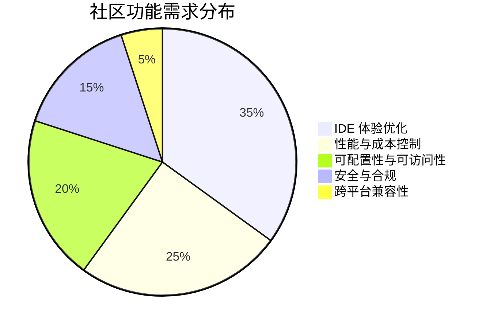

# AI CLI 工具社区动态日报 2026-04-05

> 生成时间: 2026-04-05 00:11 UTC | 覆盖工具: 8 个

- [Claude Code](https://github.com/anthropics/claude-code)
- [OpenAI Codex](https://github.com/openai/codex)
- [Gemini CLI](https://github.com/google-gemini/gemini-cli)
- [GitHub Copilot CLI](https://github.com/github/copilot-cli)
- [Kimi Code CLI](https://github.com/MoonshotAI/kimi-cli)
- [OpenCode](https://github.com/anomalyco/opencode)
- [Pi](https://github.com/badlogic/pi-mono)
- [Qwen Code](https://github.com/QwenLM/qwen-code)
- [Claude Code Skills](https://github.com/anthropics/skills)

---

## 横向对比

# AI CLI 工具生态横向对比分析报告 | 2026-04-05

---

## 1. 生态全景

当前 AI CLI 工具生态呈现**"头部三强鼎立、垂直工具突围"**格局：Claude Code 凭借企业级功能与稳定性占据高端市场，OpenAI Codex 以实时语音架构升级和 Rust 核心重构技术领先，Gemini CLI 依托 Google 基础设施深耕上下文管理；同时 OpenCode、Kimi、Qwen Code 等新兴工具通过激进功能创新（如侧边提问、Agent Team 并行）争夺开发者心智，Pi 则以扩展 API 开放策略探索差异化路径。整体趋势从"基础代码生成"向**生产级可靠性、多模态交互、可观测性**深度演进，计费透明度与权限系统稳定性成为共性痛点。

---

## 2. 各工具活跃度对比

| 工具 | Issues（今日活跃/提及） | PRs（今日活跃） | 版本发布 | 关键动态 |
|:---|:---|:---|:---|:---|
| **Claude Code** | 10+ 热点 Issue（#16157 计费争议 1436 评论） | 6 个开放 PR（#41447 开源诉求持续） | v2.1.92 | 强制远程配置刷新、Bedrock 向导；权限系统 Bug 集中爆发 |
| **OpenAI Codex** | 10+ 热点 Issue（#14593 Token 异常 431 评论） | 10+（含 4 层 WebRTC 语音栈、5 层遥测栈） | rust-v0.119.0-alpha.9~11 | v0.118.0 质量回归紧急修复；实时语音架构重大升级 |
| **Gemini CLI** | 10+ 热点 Issue（#22631 API 限流 P0） | 10+（#24643 上下文 IR 管道重构为核心） | 无 | 内部架构重构密集；API 稳定性危机 |
| **GitHub Copilot CLI** | 15 活跃 Issue（#2513 多设备登录回归为新增） | **0**（代码冻结期） | **v1.0.18** | Critic Agent 实验性发布；PR 活跃度骤降 |
| **Kimi Code CLI** | 7 个 Issue | 7 个 PR | 无 | `/btw` 侧边提问创新；诊断日志增强；Python→TS 重构争议 |
| **OpenCode** | 10+ 热点 Issue（#531 代理支持 38 评论） | 10+（Effect 架构重构为核心） | **v1.3.14 + v1.3.15** | 密集补丁修复 Windows 插件问题；Kimi k2.5 适配故障 |
| **Pi** | 10 个 Issue（24h 内 24 个） | 10 个 PR | 无 | Gemma 4 支持冲刺；扩展 API 重大增强（footer/侧边栏） |
| **Qwen Code** | 12 个 Issue | **28 个 PR**（单日最高） | 无 | 性能优化密集（自适应 Token、智能并行）；VS Code 插件 UI 缺陷集中 |

> **活跃度排序**：Qwen Code（28 PR）> OpenAI Codex / Gemini CLI / OpenCode / Pi（~10 PR）> Kimi（7）> Claude Code（6）> Copilot CLI（0）

---

## 3. 共同关注的功能方向

| 功能方向 | 涉及工具 | 具体诉求 |
|:---|:---|:---|
| **计费/Token 透明度** | Claude Code、OpenAI Codex、Gemini CLI、OpenCode | Max 额度异常消耗（#16157）、Token 燃烧加速（#14593）、实时用量仪表盘缺失；OpenCode OpenRouter 双倍计费疑云（#20937） |
| **权限系统可靠性** | Claude Code、Gemini CLI、Qwen Code | `bypassPermissions` 失效（#42975/#37181）、自动确认弹窗阻塞 CI/CD；子代理审批模式冲突（#23582） |
| **上下文/记忆管理** | Claude Code、Gemini CLI、Kimi、OpenAI Codex | 自动历史保存（Gemini #3882 对比 Claude 300+ 记录）、长期记忆机制（Codex #8368）、远程会话续接（Kimi #1282）、上下文压缩可控（Copilot #2333） |
| **性能可观测性** | Kimi、OpenCode、Qwen Code、Pi | TPS/token-per-second 实时显示（Kimi #1760/PR#1759、OpenCode #5374）、内存追踪（OpenCode #20695）、自适应 Token 分配（Qwen #2898） |
| **跨平台/企业适配** | 全部工具 | Windows/WSL 二等公民体验（Claude #42975、Codex #13762/#16088、OpenCode #5635、Gemini #24202）、HTTP_PROXY 支持（OpenCode #531）、SSH 环境兼容 |
| **多模态能力** | Pi、Qwen Code、Copilot CLI | 视频/音频附件（Pi #2809 已关闭待实现）、剪贴板图片粘贴（Qwen #2885/#2605、Copilot #1276） |

---

## 4. 差异化定位分析

| 工具 | 核心功能侧重 | 目标用户 | 技术路线特征 |
|:---|:---|:---|:---|
| **Claude Code** | 企业合规、权限管控、多身份工作流 | 企业开发者、安全敏感团队 | 闭源商业产品；远程策略强制（fail-closed）；Bedrock/Azure 多云适配 |
| **OpenAI Codex** | 实时语音、Rust 核心性能、分析遥测 | 前沿技术采纳者、语音交互场景 | Rust 重写核心；WebRTC 实时架构；与 ChatGPT 生态深度整合 |
| **Gemini CLI** | 长上下文管理、工具输出优化、AST 感知 | Google Cloud 用户、大代码库维护者 | 内部 IR 管道重构；🔒 maintainer-only 架构 issue 占比高；渐进式开放 |
| **GitHub Copilot CLI** | IDE 原生集成、Critic Agent 审查 | VS Code 重度用户、GitHub 生态绑定者 | 微软生态封闭整合；版本发布节奏保守（v1.0.18 后 PR 冻结） |
| **Kimi Code CLI** | 交互创新（侧边提问）、诊断可观测性 | 中文开发者、追求效率工具的用户 | 激进 UX 实验（`/btw`）；Python 技术债务争议（#1707 TS 重构提案） |
| **OpenCode** | 开源可扩展、多模型适配、Effect 架构 | 开源贡献者、模型供应商中立需求 | Effect-TS 函数式架构；快速迭代（单日双版本）；插件生态早期 |
| **Pi** | 扩展 API 开放、多供应商兼容 | 插件开发者、模型灵活切换需求者 | 扩展系统激进开放（footer/侧边栏动态注销）；供应商碎片化适配负担重 |
| **Qwen Code** | 性能极致优化、Agent Team 并行、国产模型 | 中文开发者、成本敏感团队、本地模型用户 | 自适应 Token 分配、智能工具并行等工程创新密集；VS Code 插件体验债务 |

---

## 5. 社区热度与成熟度

### 社区热度（综合 Issue/PR/评论量）

| 层级 | 工具 | 特征 |
|:---|:---|:---|
| **🔥 超活跃** | Claude Code、OpenAI Codex | 单 Issue 评论破千（#16157 1436、#14593 431），计费争议引发广泛讨论 |
| **🌡️ 高活跃** | Qwen Code、OpenCode、Pi、Gemini CLI | 单日 10-28 PR，功能迭代密集；Qwen 性能优化、OpenCode 架构重构、Pi 扩展 API 各有技术焦点 |
| **📊 中等活跃** | Kimi Code CLI | 稳定迭代，交互创新突出但社区规模较小 |
| **❄️ 低活跃/冻结** | GitHub Copilot CLI | v1.0.18 发布后 PR 归零，可能进入发布周期调整期 |

### 成熟度评估

| 工具 | 成熟度 | 关键指标 |
|:---|:---|:---|
| Claude Code | ⭐⭐⭐⭐⭐ | 企业功能完整，但权限系统 Bug 暴露稳定性风险 |
| OpenAI Codex | ⭐⭐⭐⭐☆ | 技术架构领先，v0.118.0 回归显示测试覆盖缺口 |
| GitHub Copilot CLI | ⭐⭐⭐⭐☆ | IDE 集成成熟，但多设备登录等基础功能回归 |
| Gemini CLI | ⭐⭐⭐☆☆ | 内部重构期，API 限流 P0 问题影响可用性 |
| OpenCode | ⭐⭐⭐☆☆ | 快速迭代中，Windows 兼容性与插件稳定性待巩固 |
| Pi | ⭐⭐⭐☆☆ | 扩展 API 创新激进，会话状态脆弱性需关注 |
| Qwen Code | ⭐⭐⭐☆☆ | 性能优化突出，VS Code 插件体验债务明显 |
| Kimi | ⭐⭐☆☆☆ | 功能创新活跃，核心架构技术债务争议中 |

---

## 6. 值得关注的趋势信号

| 趋势 | 信号来源 | 开发者参考价值 |
|:---|:---|:---|
| **实时语音成为下一代交互标配** | OpenAI Codex 4 层 WebRTC PR 栈、Kimi 语音输入插件 (#18499) | 语音驱动的 Agent 交互将快速普及，需关注音频处理、回声消除等工程实现 |
| **Token 效率工程化成为核心竞争力** | Qwen 自适应分配/智能并行、Gemini 工具输出压缩、Rust Token Killer 集成提议 (#2880) | 长上下文成本压力下，Token 压缩、并行执行、动态预算分配将成为标配能力 |
| **可观测性从"锦上添花"变为"生产必需"** | Kimi 诊断日志导出、TPS 显示；OpenCode 内存追踪；Codex 5 层遥测栈 | Agent 黑盒问题倒逼透明度需求，实时性能指标、子 Agent 交互记录可视化是建设重点 |
| **权限系统从"功能"升级为"信任基础设施"** | Claude Code 权限配置失效集中爆发、Gemini 子代理审批冲突 | 自动化工作流依赖稳定的权限绕过能力，需评估工具的 CI/CD 就绪度 |
| **扩展/插件生态决定工具天花板** | Pi footer/侧边栏 API、OpenCode Effect 工具架构、Claude Code MCP 扩展 | 封闭工具面临生态瓶颈，开放扩展 API 是差异化关键，但需平衡稳定性承诺 |
| **跨平台一致性仍是未解难题** | Windows/WSL 问题在 6/8 工具中出现，SSH/容器场景适配不足 | 企业部署需重点评估目标平台的测试覆盖度，Alpine/容器化场景风险尤高 |
| **计费透明度危机催生自托管需求** | Claude/OpenAI/Gemini 均现额度争议，OpenCode/Kimi 本地模型支持受关注 | 成本敏感场景需评估开源/本地模型方案，Token 消耗实时监控成为选型硬指标 |

---

*报告基于 2026-04-05 社区公开数据生成，建议结合具体场景进行工具选型验证。*

---

## 各工具详细报告

<details>
<summary><strong>Claude Code</strong> — <a href="https://github.com/anthropics/claude-code">anthropics/claude-code</a></summary>

## Claude Code Skills 社区热点

> 数据来源: [anthropics/skills](https://github.com/anthropics/skills)

# Claude Code Skills 社区热点报告（2026-04-05）

---

## 1. 热门 Skills 排行

| 排名 | Skill | 功能概述 | 社区热点 | 状态 |
|:---|:---|:---|:---|:---|
| 1 | **[document-typography](https://github.com/anthropics/skills/pull/514)** | AI 生成文档的排版质量控制，修复孤行、寡行、编号错位等排版问题 | 触及 Claude 文档生成的普遍痛点，作者指出"影响每一份 Claude 生成的文档" | 🟡 Open |
| 2 | **[frontend-design](https://github.com/anthropics/skills/pull/210)** | 前端设计 Skill 的清晰度与可执行性改进 | 聚焦 Skill 设计的最佳实践——指令是否能在单轮对话中被 Claude 实际执行 | 🟡 Open |
| 3 | **[skill-quality-analyzer](https://github.com/anthropics/skills/pull/83)** + skill-security-analyzer | 元 Skill：自动评估其他 Skill 的质量与安全（五维度评分体系） | 社区首次出现"Skill 的 Skill"，反映生态自我治理需求 | 🟡 Open |
| 4 | **[ODT skill](https://github.com/anthropics/skills/pull/486)** | OpenDocument 格式（ODT）的创建、模板填充与 HTML 解析 | 填补 LibreOffice/开源办公生态的格式支持空白，ISO 标准对接 | 🟡 Open |
| 5 | **[SAP-RPT-1-OSS](https://github.com/anthropics/skills/pull/181)** | 集成 SAP 开源表格基础模型进行业务数据预测分析 | 企业 ERP + AI 的垂直场景，Apache 2.0 合规 | 🟡 Open |
| 6 | **[codebase-inventory-audit](https://github.com/anthropics/skills/pull/147)** | 代码库清理与文档审计，识别孤儿代码、未使用文件、文档缺口 | 10 步工作流输出 CODEBASE-STATUS.md，技术债治理场景 | 🟡 Open |
| 7 | **[shodh-memory](https://github.com/anthropics/skills/pull/154)** | AI Agent 的持久化记忆系统，跨会话维持上下文 | 解决 Claude 无状态的核心限制，`proactive_context` 调用机制设计 | 🟡 Open |
| 8 | **[testing-patterns](https://github.com/anthropics/skills/pull/723)** | 全栈测试方法论：测试哲学、单元测试、React 组件测试、E2E | Testing Trophy 模型落地，明确"测什么/不测什么"的决策框架 | 🟡 Open |

---

## 2. 社区需求趋势

从 Issues 高频关键词提炼四大方向：

| 趋势方向 | 代表 Issue | 核心诉求 |
|:---|:---|:---|
| **企业级治理与合规** | [#492](https://github.com/anthropics/skills/issues/492) 信任边界滥用、[#412](https://github.com/anthropics/skills/issues/412) Agent 治理模式 | 组织内 Skill 的安全审计、策略执行、信任评分与审计追踪 |
| **Skill 即基础设施** | [#16](https://github.com/anthropics/skills/issues/16) MCP 暴露、[#228](https://github.com/anthropics/skills/issues/228) 组织级共享 | 将 Skills 标准化为可编排的 API 组件，支持跨团队/跨工具复用 |
| **云与企业集成** | [#29](https://github.com/anthropics/skills/issues/29) AWS Bedrock 支持、[#532](https://github.com/anthropics/skills/issues/532) SSO/企业认证 | 脱离 Anthropic 官方渠道，适配企业现有的云基础设施与身份体系 |
| **Skill 质量与评估** | [#556](https://github.com/anthropics/skills/issues/556) 零触发率问题、[#202](https://github.com/anthropics/skills/issues/202) skill-creator 最佳实践 | 从"能跑"到"可靠触发"，建立 Skill 效果的量化验证机制 |

---

## 3. 高潜力待合并 Skills

以下 PR 评论活跃、功能完整度高，预计近期可能落地：

| Skill | 亮点 | 关键进展 |
|:---|:---|:---|
| **[document-typography](https://github.com/anthropics/skills/pull/514)** | 通用文档质量基础设施，非特定格式 | 作者持续更新，问题定义清晰（orphan/widow/numbering） |
| **[testing-patterns](https://github.com/anthropics/skills/pull/723)** | 填补测试方法论空白，覆盖全栈 | 2026-03-22 新建，结构完整（哲学→单元→React→E2E） |
| **[sensory](https://github.com/anthropics/skills/pull/806)** | 原生 macOS 自动化（AppleScript），替代截图方案 | 双层权限设计（Tier 1/2），解决 Computer Use 的稳定性痛点 |
| **[quality-playbook](https://github.com/anthropics/skills/pull/659)** | 复兴传统质量工程，AI 降低执行成本 | 与代码驱动测试工具差异化定位（需求→测试） |
| **[CONTRIBUTING.md](https://github.com/anthropics/skills/pull/509)** | 社区健康度基础设施 | 直接回应 #452，GitHub 社区健康分 25%→提升的关键路径 |

---

## 4. Skills 生态洞察

> **社区核心诉求：从"个人效率工具"演进为"可治理、可验证、可集成的企业基础设施"** —— 开发者不再满足于单个 Skill 的功能实现，而是要求建立 Skill 的质量标准（#83 元 Skill）、安全边界（#492 信任问题）、组织级分发机制（#228）及跨平台兼容性（#29 Bedrock, #16 MCP）。

---

---

# Claude Code 社区动态日报 | 2026-04-05

---

## 今日速览

今日社区焦点集中在**订阅计费异常**与**权限系统失效**两大痛点：Max 用户持续报告额度消耗过快问题，单条 Issue 评论数已破 1400；同时 `bypassPermissions` 配置失效的 Bug 在 Windows 和 macOS 平台均被复现。v2.1.92 版本新增远程配置强制刷新策略与 Bedrock 交互式向导。

---

## 版本发布

### v2.1.92
| 项目 | 内容 |
|:---|:---|
| **核心更新** | 新增 `forceRemoteSettingsRefresh` 策略设置：CLI 启动时强制同步远程托管配置，获取失败则直接退出（fail-closed 模式） |
| **体验改进** | 登录界面新增 **Bedrock 交互式配置向导**，简化第三方提供商接入流程 |
| **适用场景** | 企业级部署需强制合规策略、AWS Bedrock 用户快速上手 |

---

## 社区热点 Issues

| # | 标题 | 状态 | 热度 | 关键看点 |
|:---|:---|:---|:---|:---|
| [#16157](https://github.com/anthropics/claude-code/issues/16157) | Max 订阅瞬间触达使用限制 | 🔴 OPEN | 👍666 / 💬1436 | **计费系统重大争议**：用户称未高强度使用即耗尽额度，评论数创近期峰值，Anthropic 需紧急回应 |
| [#34229](https://github.com/anthropics/claude-code/issues/34229) | 手机号验证 Bug | 🔴 OPEN | 👍728 / 💬650 | 账户安全入口阻塞，影响新用户注册与现有账户恢复 |
| [#38335](https://github.com/anthropics/claude-code/issues/38335) | Max 计划会话额度异常消耗（CLI） | 🔴 OPEN | 👍338 / 💬413 | 3月23日后集中爆发，与 [#16157](https://github.com/anthropics/claude-code/issues/16157) 形成关联投诉集群 |
| [#16082](https://github.com/anthropics/claude-code/issues/16082) | 菜单栏独占模式（隐藏 Dock 图标） | 🔴 OPEN | 👍71 / 💬22 | macOS 重度用户效率需求，涉及原生桌面体验设计 |
| [#36460](https://github.com/anthropics/claude-code/issues/36460) | 个人 Max 计划 Channels 功能被忽略 | 🔴 OPEN | 👍25 / 💬19 | `--channels` 标志与订阅类型校验逻辑缺陷，功能降级未明确提示 |
| [#36151](https://github.com/anthropics/claude-code/issues/36151) | 移动应用多账户切换 | 🔴 OPEN | 👍69 / 💬18 | 企业/个人双身份用户痛点，当前强制共享邮箱方案体验割裂 |
| [#42975](https://github.com/anthropics/claude-code/issues/42975) | `bypassPermissions` 模式仍弹确认窗 | 🔴 OPEN | 👍3 / 💬6 | **高优先级 Bug**：Windows 桌面版权限系统失效，CI/CD 场景阻塞 |
| [#37181](https://github.com/anthropics/claude-code/issues/37181) | Edit 工具权限绕过失效 | 🔴 OPEN | 👍2 / 💬5 | macOS 同类问题，权限状态中途切换为 `acceptEdits`，稳定性缺陷 |
| [#42796](https://github.com/anthropics/claude-code/issues/42796) | 2月更新后复杂工程任务可用性下降 | 🔴 OPEN | 👍9 / 💬8 | 模型行为退化反馈，涉及长上下文理解与代码生成质量 |
| [#43675](https://github.com/anthropics/claude-code/issues/43675) | `~/.claude/` 目录未文档化 | 🔴 OPEN | 👍1 / 💬3 | 社区已产出深度安全分析，官方文档缺口待补 |

---

## 重要 PR 进展

| # | 标题 | 状态 | 核心贡献 |
|:---|:---|:---|:---|
| [#41837](https://github.com/anthropics/claude-code/pull/41837) | 新增 arsenal-reliability 插件 | 🔴 CLOSED | 6项生产级可靠性模式：熔断（kavacha）、重试、降级等，面向 LLM Agent 工程化 |
| [#41611](https://github.com/anthropics/claude-code/pull/41611) | 补充缺失源码 | 🔴 OPEN | 社区持续呼吁开源，PR 内容待维护者评审 |
| [#43598](https://github.com/anthropics/claude-code/pull/43598) | 添加上游 Issue 同步工作流 | 🔴 OPEN | 自动化 fetch 与规范化上游 issue，改善社区协作基础设施 |
| [#43563](https://github.com/anthropics/claude-code/pull/43563) | Windows 路径标准化修复 | 🔴 OPEN | 安全钩子中反斜杠转义问题，修复 `.github/workflows/` 路径检测失效 |
| [#43559](https://github.com/anthropics/claude-code/pull/43559) | 插件安装文档更新 | 🔴 OPEN | 替换废弃 npm 指引，修正 settings README 笔误 |
| [#42604](https://github.com/anthropics/claude-code/pull/42604) | 移除前端技能中的"复古未来主义"推荐 | 🔴 OPEN | 设计系统去主观化，减少风格偏见 |
| [#41447](https://github.com/anthropics/claude-code/pull/41447) | 开源 Claude Code | 🔴 OPEN | 关联 5 个历史 issue，社区标志性诉求 |

---

## 功能需求趋势

基于 50 条活跃 Issue 分析，社区关注聚焦四大方向：

| 趋势 | 代表 Issue | 需求强度 |
|:---|:---|:---:|
| **计费透明度与额度管控** | #16157, #38335, #43694, #41001 | ⭐⭐⭐⭐⭐ |
| **权限系统可靠性** | #42975, #37181, #37312 | ⭐⭐⭐⭐⭐ |
| **企业/多身份工作流** | #36151, #36460, #37299 | ⭐⭐⭐⭐☆ |
| **桌面端体验精细化** | #16082, #42212, #42698, #43691 | ⭐⭐⭐⭐☆ |
| **MCP 生态扩展** | #12858, #43693, #30484 | ⭐⭐⭐☆☆ |

> **新兴信号**：Companion（Knurl）角色系统引发两极反馈——部分用户要求关闭/自定义选项（#42212, #42698, #43691），显示个性化控制需求上升。

---

## 开发者关注点

### 🔴 阻塞性痛点
1. **权限配置失效**：`bypassPermissions` + `--dangerously-skip-permissions` 组合在桌面端不可靠，自动化工作流频繁中断
2. **Windows 平台二等公民**：Cowork 签名验证、路径处理、权限系统均有平台特异性 Bug
3. **额度焦虑**：缺乏实时用量仪表盘，异常消耗后无追溯机制

### 🟡 高频改进诉求
| 领域 | 具体需求 | 出现频次 |
|:---|:---|:---:|
| 会话管理 | `--continue` / `--resume` 上下文恢复可靠性 | 3+ |
| 文档完备性 | `~/.claude/` 结构、MCP 配置变量扩展 | 2+ |
| 模型选择 | Opus 4.6 行为反馈、Sonnet 扩展版成本控制 | 2+ |
| 集成深度 | Claude.ai 历史记录 MCP 访问、GitHub Actions 状态同步 | 2+ |

### 💡 社区自发贡献
- 安全分析：[深度解析 `~/.claude/` 目录结构](https://ramonactruta.substack.com/p/inside-claude-structure-is-not-security)（#43675）
- 可靠性工程：arsenal-reliability 插件提案（#41837）

---

*日报基于 GitHub 公开数据生成，不代表 Anthropic 官方立场*

</details>

<details>
<summary><strong>OpenAI Codex</strong> — <a href="https://github.com/openai/codex">openai/codex</a></summary>

# OpenAI Codex 社区动态日报 | 2026-04-05

## 今日速览

今日社区焦点集中在 **v0.118.0 沙盒回归问题** 与 **实时语音通话架构升级**。多个用户报告 0.118.0 版本出现沙盒写入权限、上下文压缩异常等回归缺陷；同时 OpenAI 团队推进了 4 层 PR 栈，将实时语音传输从 WebSocket 迁移至 WebRTC，为 ChatGPT 实时通话功能铺路。

---

## 版本发布

| 版本 | 说明 |
|:---|:---|
| `rust-v0.119.0-alpha.9~11` | Rust 核心库连续发布 3 个 alpha 版本，版本号快速迭代，推测为修复 0.118.0 相关回归问题 |

> 注：官方未提供详细 Release Notes，建议关注 [#16402](https://github.com/openai/codex/issues/16402)、[#16790](https://github.com/openai/codex/issues/16790) 等回归 Issue 的修复进展。

---

## 社区热点 Issues

### 🔥 高优先级缺陷

| Issue | 状态 | 核心问题 | 社区反应 |
|:---|:---|:---|:---|
| [#14593](https://github.com/openai/codex/issues/14593) | 🔴 OPEN | **Token 消耗异常加速** — Business 订阅用户报告 token 燃烧速度远超预期 | 431 评论，166 👍，为社区最活跃议题；用户质疑计费透明度 |
| [#16812](https://github.com/openai/codex/issues/16812) | 🔴 OPEN | **v0.118 上下文压缩回归** — 压缩频率翻倍导致 token 用量爆炸 | 5 评论，新上报；与 #14593 可能相关，需关注关联性 |
| [#16402](https://github.com/openai/codex/issues/16402) | 🔴 OPEN | **0.118.0 Linux 沙盒写入回归** — sandbox 文件创建失败 | 7 评论，影响 Linux 核心工作流 |
| [#16790](https://github.com/openai/codex/issues/16790) | 🟢 CLOSED | **0.118.0 bwrap 权限拒绝** — 沙盒初始化失败 | 4 评论，当日快速关闭，修复已合并 |
| [#16231](https://github.com/openai/codex/issues/16231) | 🔴 OPEN | **macOS 高 CPU 占用回归** — 26.325.31654 版本后 M5 Pro 发热严重 | 8 评论，17 👍，影响 IDE 扩展体验 |

### 🖥️ IDE/桌面端问题

| Issue | 状态 | 核心问题 | 社区反应 |
|:---|:---|:---|:---|
| [#15764](https://github.com/openai/codex/issues/15764) | 🔴 OPEN | **VS Code 代码补丁应用时 Renderer 进程 CPU 100%+** — 26.313.41514 后版本受影响 | 17 评论，24 👍，性能问题持续发酵 |
| [#11981](https://github.com/openai/codex/issues/11981) | 🔴 OPEN | **Codex App 单代理 100% CPU** — Mac OS 资源占用异常 | 30 评论，长期未解 |
| [#13762](https://github.com/openai/codex/issues/13762) | 🔴 OPEN | **WSL 模式错误使用 Windows CODEX_HOME** — 工作树创建到 `/mnt/c` 而非 WSL 文件系统 | 9 评论，WSL 用户痛点 |
| [#16088](https://github.com/openai/codex/issues/16088) | 🔴 OPEN | **WSL 无 .codex 项目残留空文件** — 26.325.31654 回归 | 6 评论，23 👍，WSL 体验持续受损 |

### ✨ 功能需求

| Issue | 状态 | 核心诉求 | 社区反应 |
|:---|:---|:---|:---|
| [#2880](https://github.com/openai/codex/issues/2880) | 🔴 OPEN | **TUI 消息导出为 Markdown** — 便于外部文档/ Issue 复用 | 16 评论，42 👍，文档工作流刚需 |
| [#8368](https://github.com/openai/codex/issues/8368) | 🔴 OPEN | **长期记忆机制** — 减少重复纠正 niche 场景 | 9 评论，13 👍，Agent 体验核心诉求 |

---

## 重要 PR 进展

### 🎯 实时语音架构升级（4 层 PR 栈）

| PR | 位置 | 核心变更 | 影响 |
|:---|:---|:---|:---|
| [#16805](https://github.com/openai/codex/pull/16805) | 1/4 | **WebSocket → WebRTC 迁移** — 替换实时传输层 | 降低延迟，提升通话稳定性 |
| [#16806](https://github.com/openai/codex/pull/16806) | 2/4 | **TUI 实时音频接入共享回声消除** | 解决双端通话回声问题 |
| [#16807](https://github.com/openai/codex/pull/16807) | 3/4 | **移除本地实时播放中断逻辑** | 简化音频状态机 |
| [#16769](https://github.com/openai/codex/pull/16769) | 4/4 | **ChatGPT 实时通话认证与请求格式支持** | 与 ChatGPT 实时 API 对齐 |

> 该 PR 栈由 `aibrahim-oai` 主导，标志着 Codex 实时语音能力向生产级通话场景演进。

### 📊 分析遥测增强

| PR | 核心变更 |
|:---|:---|
| [#16638](https://github.com/openai/codex/pull/16638) | 协议原生回合时间戳 |
| [#16640](https://github.com/openai/codex/pull/16640) | 功能管道与事件发射 |
| [#16641](https://github.com/openai/codex/pull/16641) | Token 使用元数据 |
| [#16659](https://github.com/openai/codex/pull/16659) | 队列提交元数据 |
| [#16706](https://github.com/openai/codex/pull/16706) | 引导（Steering）元数据 |

> `rhan-oai` 主导的 5 层遥测 PR 栈，为精细化用量分析与模型优化提供数据基础。

### 🔧 体验修复

| PR | 核心变更 | 关联 Issue |
|:---|:---|:---|
| [#16803](https://github.com/openai/codex/pull/16803) | 修复推理摘要与孤儿流 delta 处理 | [#16801](https://github.com/openai/codex/issues/16801) |
| [#16810](https://github.com/openai/codex/pull/16810) | 解码裸本地文件链接的百分号转义 | [#16622](https://github.com/openai/codex/issues/16622) |
| [#16813](https://github.com/openai/codex/pull/16813) | Skill 文档读取标注 Skill 名称 | [#16303](https://github.com/openai/codex/issues/16303) |
| [#16795](https://github.com/openai/codex/pull/16795) | 修复 `codex exec --ephemeral` 回合回填回归 | [#16781](https://github.com/openai/codex/issues/16781) |
| [#16804](https://github.com/openai/codex/pull/16804) | 外部 MCP 服务器配置迁移 | — |

---

## 功能需求趋势

基于 50 条活跃 Issue 分析，社区关注方向如下：

| 排名 | 方向 | 代表 Issue | 热度指标 |
|:---|:---|:---|:---|
| 1 | **性能优化** | CPU/内存占用、token 效率 | #14593, #15764, #11981, #16231 |
| 2 | **WSL/Windows 体验** | 路径处理、沙盒兼容、文件系统 | #13762, #16088, #13618, #16794 |
| 3 | **沙盒安全与灵活性** | 写入权限、.gitignore 处理、配置继承 | #16402, #15505, #13025, #15282 |
| 4 | **TUI/CLI 体验** | Markdown 渲染、消息导出、终端适配 | #2880, #8259, #5259, #5538 |
| 5 | **Agent 记忆与上下文** | 长期记忆、跨会话状态、上下文压缩 | #8368, #16799, #16812 |
| 6 | **实时语音/多模态** | 语音输入、实时通话、音频处理 | #14630, #16769 栈 |

---

## 开发者关注点

### ⚠️ 当前痛点

1. **v0.118.0 质量回归**
   - 沙盒权限、上下文压缩、CPU 占用等多维度问题集中爆发
   - 建议生产环境用户暂缓升级，或锁定至 0.117.x

2. **Token 计费透明度**
   - #14593 反映用户对用量突增的焦虑，缺乏实时用量可视化工具

3. **WSL 二等公民体验**
   - 路径解析、文件系统隔离、沙盒行为与原生 Linux/macOS 存在显著差异

### 📣 高频需求

| 需求 | 场景 | 当前状态 |
|:---|:---|:---|
| 消息导出 Markdown | 技术文档、Bug 报告复用 | #2880 待实现（42 👍） |
| 长期记忆机制 | 减少重复上下文、个性化偏好 | #8368 待实现（13 👍） |
| 终端尺寸自适应重渲染 | 远程会话、窗口调整 | #5259 待实现（22 👍） |
| 语音转录输入 | 移动场景、无障碍需求 | #14630 待实现（7 👍） |

---

*日报基于 GitHub 公开数据生成，仅供参考。关键问题建议直接参与 Issue 讨论或联系 OpenAI 支持。*

</details>

<details>
<summary><strong>Gemini CLI</strong> — <a href="https://github.com/google-gemini/gemini-cli">google-gemini/gemini-cli</a></summary>

# Gemini CLI 社区动态日报 | 2026-04-05

## 今日速览

今日社区无新版本发布，但开发活跃度极高。核心团队正聚焦**工具输出优化**（Compact Tool Output）和**上下文管理重构**两大方向，同时社区对**API 限流问题**和**SSH 兼容性**的反馈持续升温。多个长期悬而未决的 Issue 迎来新进展。

---

## 社区热点 Issues

| 优先级 | Issue | 核心看点 |
|:---|:---|:---|
| 🔥 **P0** | [#22631](https://github.com/google-gemini/gemini-cli/issues/22631) **API 限流导致持续 24h+ 不可用** | 用户报告 `Too Many Requests` 错误持续超 24 小时，回退版本无效。13 条评论显示影响面扩大，需官方紧急响应。 |
| 🔥 **P0** | [#24200](https://github.com/google-gemini/gemini-cli/issues/24200) **简单查询卡死 3 天** | `1+1` 级别问题无响应，附截图证实现象。已关闭但反映稳定性隐患。 |
| 📌 **P1** | [#3882](https://github.com/google-gemini/gemini-cli/issues/3882) **自动保存对话历史（已关闭）** | 社区高票需求（52 👍, 36 评论），用户对比 Claude Code 的 300+ 历史记录管理习惯。虽关闭但代表核心体验差距。 |
| 📌 **P1** | [#22745](https://github.com/google-gemini/gemini-cli/issues/22745) **AST 感知代码读取与搜索** | 内部 EPIC，探索通过 AST 精确读取方法边界、减少 token 浪费。可能根本性提升大代码库处理效率。 |
| 📌 **P1** | [#22863](https://github.com/google-gemini/gemini-cli/issues/22863) **不安全的对象克隆模式** | 团队自查发现模型频繁生成部分实现的危险克隆代码，需系统性修复。 |
| 📌 **P1** | [#24202](https://github.com/google-gemini/gemini-cli/issues/24202) **SSH 会话文本乱码** | Windows → gLinux SSH 场景下 UI 完全不可用，企业用户痛点。 |
| 📌 **P1** | [#22819](https://github.com/google-gemini/gemini-cli/issues/22819) **记忆路由：全局 vs 项目级** | 设计用户偏好（`~/.gemini/`）与代码库特定记忆（`.gemini/`）的分层存储机制。 |
| 📌 **P2** | [#23582](https://github.com/google-gemini/gemini-cli/issues/23582) **子代理感知审批模式** | Plan/Auto-Edit 模式下子代理指令与实际策略冲突，需统一认知。 |
| 📌 **P2** | [#23571](https://github.com/google-gemini/gemini-cli/issues/23571) **临时脚本散落各目录** | 限制 shell 执行后模型到处写编辑脚本，提交前清理成本高。 |
| 📌 **P2** | [#24695](https://github.com/google-gemini/gemini-cli/issues/24695) **Plan 模式无效参数错误** | 新反馈：Pro 订阅用户在 Plan 模式下触发 `Request contains an invalid argument`，需排查。 |

---

## 重要 PR 进展

| PR | 作者 | 功能/修复亮点 |
|:---|:---|:---|
| [#24643](https://github.com/google-gemini/gemini-cli/pull/24643) | joshualitt | **V0 情景上下文管理器**：重构字符串操作为不可变 IR 管道，引入 4 种降级处理器（历史压缩、工具掩码、Blob 降级、语义压缩），解决长会话上下文爆炸问题 |
| [#24694](https://github.com/google-gemini/gemini-cli/pull/24694) | swamig | **PTY 资源泄漏修复**：强制退出时终止 `node-pty` 子进程，解决 macOS/Linux 终端槽位被僵尸进程占满问题 |
| [#24653](https://github.com/google-gemini/gemini-cli/pull/24653) | ilkerozgedik | **Windows bunx 执行修复**：GNU `env -S` shebang 在 Windows 不兼容，移除 `-S` 标志 |
| [#24685](https://github.com/google-gemini/gemini-cli/pull/24685) | knQzx | **二进制检测误报修复**：U+FFFD 替换字符导致 Rust 等源文件被误判为二进制，改用 UTF-8 多字节序列验证 |
| [#24661](https://github.com/google-gemini/gemini-cli/pull/24661) | rwmyers | **扩展批量选择命令**：`extensions select` 支持一键启用/禁用多扩展，解决频繁切换 20+ 扩展的配置负担 |
| [#24688](https://github.com/google-gemini/gemini-cli/pull/24688) | gsquared94 | **浏览器代理遥测**：4 类 Clearcut 指标（连接、导航、操作、关闭）接入统一日志编排 |
| [#23957](https://github.com/google-gemini/gemini-cli/pull/23957) | mbleigh | **BeforeModel 钩子增强**：`additionalContext` 字段实现，多钩子上下文聚合，迁移 `BeforeAgent` 至新基础设施 |
| [#24277](https://github.com/google-gemini/gemini-cli/pull/24277) | Famous077 | **Dockerfile 自包含构建**：多阶段构建消除对本地预构建产物的依赖，`git clone` 即可构建 |
| [#18499](https://github.com/google-gemini/gemini-cli/pull/18499) | fayerman-source | **语音输入插件架构**：Gemini 零安装默认 + Whisper 本地可选，解决依赖痛点 |
| [#21090](https://github.com/google-gemini/gemini-cli/pull/21090) | alberti42 | **编辑器支持扩展**：新增 Sublime Text、Emacs Client，优化错误提示与配置文档 |

---

## 功能需求趋势

| 方向 | 热度 | 典型 Issue/PR |
|:---|:---|:---|
| **上下文与记忆管理** | 🔥🔥🔥 | #3882 自动历史、#22819 记忆路由、#24643 情景上下文管理器、#22809 主动记忆写入 |
| **工具输出优化（Compact Output）** | 🔥🔥🔥 | #24644 编辑工具失败输出清理、#24634 搜索工具输出截断、#24507 紧凑输出增强跟踪 |
| **稳定性与资源管理** | 🔥🔥🔥 | #22631 API 限流、#24200 卡死、#24694 PTY 泄漏、#20820 同步崩溃 |
| **企业/SSH 环境适配** | 🔥🔥 | #24202 SSH 乱码、#24546 SSH 检测辅助、#23925 团队默认启用跟踪器 |
| **Agent 行为智能化** | 🔥🔥 | #22745 AST 感知、#22863 安全克隆、#23582 子代理模式感知、#22672 阻止破坏性操作 |
| **开发者体验（DX）** | 🔥 | #3882 历史管理、#24661 扩展批量操作、#20027 /undo 命令、#21090 编辑器支持 |

---

## 开发者关注点

### 🔴 高频痛点

| 问题 | 反馈密度 | 核心诉求 |
|:---|:---|:---|
| **API 稳定性与限流** | 极高 | #22631 显示付费用户仍遭遇长时间不可用，需透明化配额策略与降级机制 |
| **对话历史管理** | 高 | 对比 Claude Code 的自动保存，Gemini CLI 历史易丢失，#3882 虽关闭但需求未满足 |
| **Windows/跨平台兼容性** | 高 | SSH 乱码 (#24202)、bunx 执行失败 (#24653)、路径大小写敏感 (#20776) 等持续出现 |
| **长会话性能衰减** | 中-高 | 上下文膨胀导致响应变慢，#24643 的 IR 管道重构是重要方向 |

### 🟡 新兴需求

- **零配置语音输入** (#18499)：开发者希望脱离键盘的交互方式
- **Plan 模式可靠性** (#24695, #24214)：新功能上线后边缘 case 暴露
- **可观测性增强**：团队场景下 (#23925) 对协作状态跟踪的需求

### 💡 技术债务信号

- 内部标记 `🔒 maintainer only` 的 Issue 占比高，显示大量架构级重构在进行中
- `help wanted` 标签 PR 活跃，社区贡献机会明确（编辑器支持、命令标准化、类型安全等）

---

*日报基于 GitHub 公开数据生成，链接可点击追踪最新进展。*

</details>

<details>
<summary><strong>GitHub Copilot CLI</strong> — <a href="https://github.com/github/copilot-cli">github/copilot-cli</a></summary>

# GitHub Copilot CLI 社区动态日报 | 2026-04-05

---

## 1. 今日速览

今日社区活跃度显著，**v1.0.18 正式发布**，引入 Critic Agent 自动审查机制与改进的会话恢复功能。同时 Issues 区涌现大量新反馈，**多设备登录互斥问题**和**会话恢复失效**成为用户集中投诉的新痛点，Alpine Linux 上的段错误问题持续发酵。

---

## 2. 版本发布

### v1.0.18（2026-04-04）

| 功能 | 说明 |
|:---|:---|
| **Critic Agent（实验性）** | 针对 Claude 模型新增自动审查代理，使用互补模型在计划和复杂实现阶段提前捕获错误 |
| **会话恢复优化** | 首次使用时，会话恢复选择器正确按分支和仓库分组 |
| **preToolUse hook 权限** | 工具使用前置钩子权限控制（更新日志截断，完整内容待确认） |

🔗 [Release 页面](https://github.com/github/copilot-cli/releases/tag/v1.0.18)

---

## 3. 社区热点 Issues

> 按优先级与社区影响排序，共 15 条活跃 Issue 中精选 10 条

| # | 标题 | 状态 | 关键信息 |
|:---|:---|:---|:---|
| **#107** | [Tool calls cause Segmentation Fault on Alpine Linux](https://github.com/github/copilot-cli/issues/107) | 🔴 Open<br>`bug, priority: medium, effort: large` | **长期悬而未决的基础设施问题**。Docker Alpine 容器内任何工具调用均触发段错误，影响 CI/CD 场景。12 条评论，4 👍，需人工介入但进度缓慢 |
| **#2513** | [Multi-device simultaneous sessions broken since v1.0.15/1.0.16](https://github.com/github/copilot-cli/issues/2513) | 🟡 Open<br>`triage` | **今日新增，严重回归**。设备 B 登录自动登出设备 A，打破用户多设备工作流。社区反应强烈，疑似近期版本引入的认证策略变更 |
| **#2510** | [copilot --resume doesn't find new sessions anymore](https://github.com/github/copilot-cli/issues/2510) | 🟡 Open<br>`triage` | **今日新增，与 v1.0.18 修复声明矛盾**。用户报告 1.0.17 版本新会话无法被恢复，需验证 1.0.18 实际效果 |
| **#1477** | ["Continuing autonomously (3 premium requests)" after model completion](https://github.com/github/copilot-cli/issues/1477) | 🟡 Open<br>`triage` | **计费体验争议**。模型已完成回复后仍触发"自动继续"消耗高级请求配额，9 👍 反映用户对计费透明度的担忧 |
| **#1614** | [Session hangs ~8 minutes after compaction when prompt cache misses](https://github.com/github/copilot-cli/issues/1614) | 🟡 Open<br>`triage` | **性能与 UX 双重问题**。自动压缩后上下文缓存失效导致 8 分钟无反馈挂起，与 #2333 的"关闭自动压缩"需求形成呼应 |
| **#2333** | [Toggle off for auto compaction!!!!](https://github.com/github/copilot-cli/issues/2333) | 🟡 Open<br>`triage` | **用户自主权诉求**。强制 95% 阈值自动压缩无法关闭，用户要求手动管理上下文窗口 |
| **#1082** | [Copilot CLI hangs on sudo commands -- does not prompt for password](https://github.com/github/copilot-cli/issues/1082) | 🟡 Open<br>`triage` | **交互阻塞问题**。sudo 命令无密码提示导致无限挂起，7 👍，影响系统管理类工作流 |
| **#1276** | [Support pasting images from the system clipboard](https://github.com/github/copilot-cli/issues/1276) | 🟡 Open<br>`triage` | **多模态能力缺口**。截图/日志图片无法直接粘贴，6 👍，反映视觉调试场景的需求 |
| **#232** | [Add System Prompt parameter for Copilot-CLI](https://github.com/github/copilot-cli/issues/232) | 🟡 Open<br>`triage` | **可定制性需求**。要求全局系统提示词参数，7 👍，避免重复创建仓库级指令文件 |
| **#2511** | [Missing dependency check for `wl-copy` on Ubuntu/Wayland](https://github.com/github/copilot-cli/issues/2511) | 🟡 Open<br>`triage` | **今日新增，Linux 桌面兼容性**。Wayland 会话缺少 wl-clipboard 依赖导致复制失败，反映 Linux 支持精细化不足 |

**未入选但值得注意**：#2514（通用错误信息无诊断价值）、#2515（版本回滚需求）、#1191（技能列表 UI 滚动 bug）、#716（认证 DNS 解析失败）

---

## 4. 重要 PR 进展

> **过去 24 小时内无 PR 更新**，以下为近期值得关注的潜在 PR 方向（基于 Issue 关联推测）

| 状态 | 说明 |
|:---|:---|
| ⚠️ 无活跃 PR | 今日数据集中 Pull Requests 数量为 0，可能原因：<br>• 团队处于版本发布后的代码冻结期<br>• 外部贡献者 PR 审核队列清空<br>• 数据同步延迟 |

**建议关注**：v1.0.18 中提及的 Critic Agent 和 preToolUse hook 相关实现代码，预计将在未来 48 小时内同步至主分支。

---

## 5. 功能需求趋势

基于 15 条活跃 Issue 的聚类分析：

```
┌─────────────────────────────────────────────────────────┐
│  🔧 稳定性与可靠性      ████████████████████  26.7%    │
│     (段错误、挂起、崩溃、多设备登录)                      │
├─────────────────────────────────────────────────────────┤
│  ⚙️  用户控制与透明度   ████████████████      20.0%    │
│     (自动压缩开关、计费可见性、系统提示词)                │
├─────────────────────────────────────────────────────────┤
│  🐧 Linux/容器支持      ██████████████        20.0%    │
│     (Alpine、Wayland、sudo 交互)                        │
├─────────────────────────────────────────────────────────┤
│  🖼️  多模态能力         ████████              13.3%    │
│     (剪贴板图片粘贴)                                    │
├─────────────────────────────────────────────────────────┤
│  🔄 会话管理            ████████              13.3%    │
│     (恢复、跨设备同步、压缩策略)                          │
├─────────────────────────────────────────────────────────┤
│  🔐 认证与部署          ██████                 6.7%    │
│     (DNS 解析、企业代理)                                │
└─────────────────────────────────────────────────────────┘
```

**新兴趋势**：v1.0.18 的 Critic Agent 方向与社区对"可解释 AI"的隐性需求一致，但当前 Issue 反馈更聚焦于基础稳定性而非高级功能。

---

## 6. 开发者关注点

### 🔴 高频痛点

| 问题 | 影响场景 | 社区情绪 |
|:---|:---|:---|
| **Alpine Linux 段错误** | Docker/容器化 CI、轻量级服务器 | 😤 挫败感高，长期未修复 |
| **多设备登录互斥** | 桌面-笔记本-服务器多端切换 | 😠 近期回归，工作流断裂 |
| **自动压缩不可控** | 长会话、复杂代码库 | 😤 强制策略引发抵触 |
| **无反馈挂起** | 任何网络/API 异常场景 | 😐 缺乏诊断工具 |

### 🟡 能力缺口

- **视觉调试**：截图/日志图片无法直接输入（#1276）
- **系统级定制**：全局系统提示词缺失（#232）
- **版本回滚**：无 LTS 或历史版本通道（#2515）

### 💡 潜在机会

基于 v1.0.18 的 Critic Agent 实验，社区可能期待：
- 本地/离线审查模式
- 可配置的审查规则集
- 与现有 linter/类型检查器的集成钩子

---

*日报生成时间：2026-04-05 | 数据来源：github.com/github/copilot-cli*

</details>

<details>
<summary><strong>Kimi Code CLI</strong> — <a href="https://github.com/MoonshotAI/kimi-cli">MoonshotAI/kimi-cli</a></summary>

# Kimi Code CLI 社区动态日报 | 2026-04-05

---

## 1. 今日速览

今日社区活跃度较高，共 7 个 Issue 和 7 个 PR 有更新。核心看点：**诊断日志增强**与**TPS 实时显示**功能进入 PR 阶段，同时社区对**远程会话同步**和**子 Agent 可观测性**的需求持续升温。值得关注的是，一份将代码库从 Python 重构为 Bun + TypeScript 的激进 PR 引发技术路线讨论。

---

## 2. 版本发布

**无新版本发布**（最新版本仍为 v1.30.0）

---

## 3. 社区热点 Issues

| # | 标题 | 类型 | 关键看点 |
|---|------|------|---------|
| [#1282](https://github.com/MoonshotAI/kimi-cli/issues/1282) | Remote Control - 跨设备续接本地会话 | Enhancement | **长期热门需求**，允许从手机/浏览器续接桌面会话，解决开发者移动办公痛点。创建于 2 月底，持续获得关注，反映云同步架构的缺失。 |
| [#1755](https://github.com/MoonshotAI/kimi-cli/issues/1755) | 显示完整 subagent 交互记录 | Enhancement | **可观测性痛点**，用户无法查看主 Agent 给子 Agent 的 prompt 及思考过程，只能推测。快捷键切换显示方案受认可。 |
| [#1754](https://github.com/MoonshotAI/kimi-cli/issues/1754) | 字符乱码问题 | Bug | **国际化质量隐患**，macOS 平台出现显示异常，影响中文用户体验，需快速响应。 |
| [#1760](https://github.com/MoonshotAI/kimi-cli/issues/1760) | 新增 TPS 显示配置与 /tps 命令 | Enhancement | **性能可视化需求**，用户希望实时感知 token 生成速度，已有配套 PR #1759 实现。 |
| [#1757](https://github.com/MoonshotAI/kimi-cli/issues/1757) | Ctrl+V 粘贴截图时崩溃 | Bug | **稳定性问题**，剪贴板含非文本数据（如截图）时触发 TypeError，已有配套 PR #1758 修复。 |
| [#1327](https://github.com/MoonshotAI/kimi-cli/issues/1327) | 默认步骤数过低 | Enhancement | **配置合理性争议**，默认 100 步限制在上下文仅使用 34.5% 时即触发中断，用户认为阈值设置保守。 |
| [#1729](https://github.com/MoonshotAI/kimi-cli/issues/1729) | 自定义会话命名/重命名 | Enhancement | **会话管理体验**，自动提取的标题难以识别，手动命名可提升 `/sessions` 列表可用性。状态已关闭，或已实现。 |

---

## 4. 重要 PR 进展

| # | 标题 | 作者 | 核心内容 |
|---|------|------|---------|
| [#1743](https://github.com/MoonshotAI/kimi-cli/pull/1743) | `/btw` 侧边提问命令 | RealKai42 | **交互模式创新**：不中断主 Agent 对话，轻量级并行提问。含统一输入路由、双层渲染、历史归一化，解决"临时查资料打断思路"场景。 |
| [#1756](https://github.com/MoonshotAI/kimi-cli/pull/1756) | 诊断日志增强与导出 | RealKai42 | **可维护性基建**：25+ 关键错误路径新增日志，`kimi export` 自动打包日志。大幅降低远程调试成本，与社区反馈的"难复现 bug"痛点直接相关。 |
| [#1759](https://github.com/MoonshotAI/kimi-cli/pull/1759) | TPS 实时显示 | leonidlouis | **性能透明度**：状态栏显示 token/秒，支持 `show_tps_meter` 配置与 `/tps` 命令切换。对应 Issue #1760。 |
| [#1758](https://github.com/MoonshotAI/kimi-cli/pull/1758) | 修复 Ctrl+V 非文本崩溃 | exqqstar | **稳定性修复**：双层防御——过滤非文本 MIME 类型 + 异常捕获。对应 Issue #1757。 |
| [#1749](https://github.com/MoonshotAI/kimi-cli/pull/1749) | 过滤不支持内容类型 + reasoning_key | 17Mojo | **兼容性修复**：解决 OpenAI 兼容 API 因 VideoURLPart/AudioURLPart 报错；新增 `reasoning_key` 提取推理内容。修复 #796、#1155。 |
| [#1709](https://github.com/MoonshotAI/kimi-cli/pull/1709) | diff 高亮偏移对齐 | ahyangyi | **显示精度**：tab 展开后的文本与行内高亮位置对齐修正，影响代码审查体验。 |
| [#1707](https://github.com/MoonshotAI/kimi-cli/pull/1707) | Python → Bun + TS + React Ink 重构 | Yuandiaodiaodiao | **技术路线激进提案**：166 文件/32k 行 TS 重写，211 commits。声称"Python 是彻底失败"，引发架构讨论价值，但合并可行性存疑。 |

---

## 5. 功能需求趋势

基于近期 Issues 聚类，社区关注方向如下：

| 方向 | 热度 | 代表需求 |
|------|------|---------|
| **可观测性 & 调试** | 🔥🔥🔥 | subagent 交互记录可视化、TPS 显示、诊断日志导出 |
| **跨端 & 云同步** | 🔥🔥🔥 | 远程会话续接、多设备工作流连续性 |
| **交互体验优化** | 🔥🔥 | `/btw` 侧边提问、自定义会话命名、步骤数配置合理化 |
| **稳定性 & 兼容性** | 🔥🔥 | 剪贴板异常处理、字符编码、OpenAI 兼容 API 适配 |
| **性能感知** | 🔥 | 实时 TPS、流式生成速度反馈 |

> 趋势洞察：用户已从"基础功能可用"转向**生产级工具体验**，对透明度（可见内部机制）、可控性（灵活配置）、可靠性（边缘 case 处理）要求显著提升。

---

## 6. 开发者关注点

| 痛点类别 | 具体表现 | 关联 Issue/PR |
|---------|---------|-------------|
| **Agent 黑盒问题** | 子 Agent 执行过程不可见，调试困难 | #1755 |
| **会话流动性差** | 桌面会话无法迁移至移动场景 | #1282 |
| **配置保守 vs 激进** | 默认 100 步限制与上下文利用率不匹配 | #1327 |
| **剪贴板鲁棒性** | 截图等非文本粘贴导致崩溃 | #1757 → #1758 |
| **国际化质量** | 中文显示乱码 | #1754 |
| **技术债务争议** | Python 运行时性能与生态限制讨论 | #1707 |

---

*日报基于 GitHub 公开数据生成，仅供参考。*

</details>

<details>
<summary><strong>OpenCode</strong> — <a href="https://github.com/anomalyco/opencode">anomalyco/opencode</a></summary>

# OpenCode 社区动态日报 | 2026-04-05

## 今日速览

OpenCode 今日密集发布 v1.3.14 和 v1.3.15 两个补丁版本，重点修复 Windows 平台插件加载失败和 npm 安装兼容性问题。社区围绕 **Kimi k2.5 工具调用故障**、**代理服务器支持** 和 **内存性能优化** 展开激烈讨论，同时开发者正积极重构工具系统架构以提升可维护性。

---

## 版本发布

### v1.3.15（最新）
- **核心修复**：解决 Arborist 编译二进制文件的 `node-gyp` 路径导致的 npm 安装失败问题
- **社区贡献**：@Yuxin-Dong 移除冗余的 Kimi skill 配置段（[#20393](https://github.com/anomalyco/opencode/pull/20393)）

### v1.3.14
- **Git 功能恢复**：重新支持基于 git 的审查模式（未提交变更和分支 diff）
- **状态修复**：修复回退链逻辑，恢复早期消息时同步还原正确的快照状态（@natewill）
- **企业特性**：新增 macOS MDM 托管偏好设置，支持企业强制配置（@lennyvaknine43）
- **稳定性**：修复会话卡死问题

> ⚠️ **已知问题**：v1.3.14 在 Windows 上导致 `oh-my-openagent` 等插件无法加载，v1.3.15 已紧急修复。

---

## 社区热点 Issues

| 优先级 | Issue | 核心看点 |
|:---|:---|:---|
| 🔥 | **[#531](https://github.com/anomalyco/opencode/issues/531) HTTP_PROXY & HTTPS_PROXY 支持** | 38 评论，24 👍。防火墙后用户的核心诉求，涉及数百万企业/地区用户，跨平台配置方案讨论热烈 |
| 🔥 | **[#4406](https://github.com/anomalyco/opencode/issues/4406) read 工具必须在 edit 前执行的设计质疑** | 32 评论。开发者质疑强制 read 的必要性，涉及 token 优化与工具设计哲学 |
| 🔥 | **[#20650](https://github.com/anomalyco/opencode/issues/20650) Kimi k2.5 工具调用故障** | 28 评论，2 👍。JSON 解析失败导致工具调用异常，影响国产大模型用户体验 |
| ⭐ | **[#16499](https://github.com/anomalyco/opencode/issues/16499) GPT-5.4 fast 模式支持 (/fast)** | 15 评论，62 👍。高赞功能请求，TUI 模型控制层需跟进 OpenAI 新特性 |
| ⭐ | **[#5374](https://github.com/anomalyco/opencode/issues/5374) 显示 tokens/second 性能指标** | 14 评论，43 👍。与 #6096 形成互补，社区强烈呼吁实时性能可视化 |
| ⭐ | **[#20695](https://github.com/anomalyco/opencode/issues/20695) 内存问题集中追踪** | 12 评论，17 👍。官方发起的内存优化专项，呼吁开发者提供 heap snapshot |
| ⭐ | **[#17307](https://github.com/anomalyco/opencode/issues/17307) 1.2.25 超时策略对本地大模型过于激进** | 12 评论，9 👍。100k 上下文场景下 2 分钟超时不足，需可配置化 |
| ⭐ | **[#21032](https://github.com/anomalyco/opencode/issues/21032) oh-my-openagent 在 1.3.14 失效** | 11 评论，5 👍。插件注册流程异常，已推动 v1.3.15 紧急修复 |
| ⭐ | **[#5122](https://github.com/anomalyco/opencode/issues/5122) 流式响应中自然断点注入上下文** | 8 评论，9 👍。对标 Claude Code 的交互体验优化，减少取消-重发操作 |
| ⭐ | **[#5635](https://github.com/anomalyco/opencode/issues/5635) WSL 后端支持（Windows Desktop）** | 8 评论，33 👍。Windows 开发者生态关键需求，Tauri 侧载二进制限制讨论 |

---

## 重要 PR 进展

| 状态 | PR | 技术价值 |
|:---|:---|:---|
| 🆕 [OPEN](https://github.com/anomalyco/opencode/pull/21056) | **#21056 修复非 latest 通道重复 DB 迁移** | 解决 NixOS 等渠道包每次启动触发迁移的问题，合并 #21057 #16885 |
| 🆕 [OPEN](https://github.com/anomalyco/opencode/pull/21017) | **#21017 重构 task 工具为 Effect 架构** | kitlangton 主导的函数式重构，工具系统向 `Tool.defineEffect` 迁移 |
| 🆕 [OPEN](https://github.com/anomalyco/opencode/pull/21052) | **#21052 工具系统初始化去 agent 上下文化** | 简化工具初始化，消除跨 agent 行为不一致，提升可预测性 |
| ✅ [CLOSED](https://github.com/anomalyco/opencode/pull/21047) | **#21047 修复 reasoning tokens 重复计算** | 解决 OpenRouter 等场景下 token 消耗统计翻倍问题 |
| ✅ [CLOSED](https://github.com/anomalyco/opencode/pull/21016) | **#21016 read 工具 Effect 化重构** | 配套 #21017，完成 read 工具架构升级与测试套件现代化 |
| ✅ [CLOSED](https://github.com/anomalyco/opencode/pull/21054) | **#21054 智能组织切换提示** | 仅当存在多个组织时显示切换入口，减少 UI 干扰 |
| 🆕 [OPEN](https://github.com/anomalyco/opencode/pull/21046) | **#21046 上下文压缩保留 agent 身份** | 解决 #21045，压缩后 summarizer 仍能识别专用 agent 角色 |
| 🆕 [OPEN](https://github.com/anomalyco/opencode/pull/18767) | **#18767 移动端触摸优化** | 保留桌面体验的同时优化 App 触摸交互 |
| 🆕 [OPEN](https://github.com/anomalyco/opencode/pull/14468) | **#14468 LiteLLM 原生 provider 支持** | 自动发现代理模型，告别手动配置 |
| 🆕 [OPEN](https://github.com/anomalyco/opencode/pull/13860) | **#13860 GitHub Enterprise Server 支持** | 读取 `GITHUB_SERVER_URL` 环境变量，突破 github.com 硬编码限制 |

---

## 功能需求趋势

基于 50 条活跃 Issue 分析，社区关注焦点呈 **三层结构**：

```
┌─────────────────────────────────────────┐
│  第一层：基础设施与兼容性（ urgent ）      │
│  • 代理/防火墙穿透（HTTP_PROXY）          │
│  • Windows/WSL 生态完善                  │
│  • 国产模型适配（Kimi、DeepSeek 等）      │
├─────────────────────────────────────────┤
│  第二层：性能可观测与优化（ high ）        │
│  • 实时 token/s 显示                    │
│  • 内存占用追踪与优化                    │
│  • 大上下文超时策略可调                  │
├─────────────────────────────────────────┤
│  第三层：交互体验深化（ medium ）          │
│  • 流式响应中断与注入                    │
│  • Agent 身份持久化                      │
│  • 会话生命周期钩子（session.start）      │
└─────────────────────────────────────────┘
```

**新兴信号**：Deno 2.x 运行时支持（[#13819](https://github.com/anomalyco/opencode/issues/13819)）开始获得关注，可能挑战 Bun 的独占地位。

---

## 开发者关注点

### 🔴 高频痛点
| 问题 | 典型反馈 | 关联 Issue |
|:---|:---|:---|
| **网络环境适配** | "数百万防火墙后用户无法使用" | #531 |
| **Windows 二等公民** | 插件加载、路径处理、WSL 隔离持续出问题 | #21032, #21041, #5635 |
| **Token 计费不透明** | OpenRouter 双倍扣费疑云 | #20937 |
| **本地模型体验差** | 超时过短、内存泄漏、无进度反馈 | #17307, #20695 |

### 🟡 架构升级观察
- **Effect 范式迁移**：kitlangton 主导的函数式重构正在工具层全面推进，测试策略同步革新
- **配置系统企业化**：MDM 支持、通道化 DB、组织级管控成为新焦点

### 🟢 生态建设
- **插件系统脆弱性**：`oh-my-openagent` 事件暴露版本兼容性测试缺口
- **社区贡献门槛**："good first issue" 标签使用率偏低，#4406 类设计讨论吸引深度参与

---

*日报基于 github.com/anomalyco/opencode 公开数据生成*

</details>

<details>
<summary><strong>Pi</strong> — <a href="https://github.com/badlogic/pi-mono">badlogic/pi-mono</a></summary>

# Pi 社区动态日报 | 2026-04-05

## 今日速览

今日 Pi 社区活跃度极高，**Gemma 4 模型支持**成为焦点，多个 PR 围绕其 thinking 能力展开。同时，**扩展系统 API 大幅增强**，新增 footer 面板、侧边栏、动态注销等能力，标志着 Pi 向插件生态迈出关键一步。

---

## 社区热点 Issues

| # | 标题 | 状态 | 重要性 | 链接 |
|---|------|------|--------|------|
| 2812 | **Gemma 4 thinking support for Google provider** | 🔵 OPEN | Gemma 4 使用 `thinkingLevel` 而非 `thinkingBudget`，当前实现会导致 400 错误。这是新模型支持的关键阻塞项。 | [链接](https://github.com/badlogic/pi-mono/issues/2812) |
| 2814 | **System prompt date injected in UTC causes 'yesterday/tomorrow' hallucinations** | 🔵 OPEN | 时区硬编码为 UTC 导致模型日期幻觉，影响 changelog 生成等场景。是对 #2131 修复的回归追踪。 | [链接](https://github.com/badlogic/pi-mono/issues/2814) |
| 2815 | **Antigravity 模型不再受支持** | 🔵 OPEN | 用户反馈 Antigravity 全系列模型返回升级提示，需确认是供应商变更还是 Pi 端配置问题。 | [链接](https://github.com/badlogic/pi-mono/issues/2815) |
| 2803 | **Edit tool fails for local models** | ✅ CLOSED | 本地模型编辑工具完全失效的阻塞性 bug，影响离线/私有化部署用户。已快速修复。 | [链接](https://github.com/badlogic/pi-mono/issues/2803) |
| 2702 | **OpenAI/Azure Responses replay emits invalid reasoning history** | ✅ CLOSED | 多轮工具调用+推理场景下的 400 错误，根因在于历史消息回放逻辑，影响 Azure/OpenAI 企业用户。 | [链接](https://github.com/badlogic/pi-mono/issues/2702) |
| 2796 | **Branching onto tool_use entry creates unrecoverable 400** | ✅ CLOSED | 会话树导航与未解决工具调用冲突导致会话永久损坏，是交互模式下的严重可靠性问题。 | [链接](https://github.com/badlogic/pi-mono/issues/2796) |
| 2809 | **Support video/audio attachments** | ✅ CLOSED | Gemini 3 已支持视频输入，Pi 仅支持图片。多模态能力缺口，被多次提及。 | [链接](https://github.com/badlogic/pi-mono/issues/2809) |
| 2791 | **fs.watch error crashes all sessions simultaneously** | ✅ CLOSED | 主题监视器未处理 error 事件导致全局崩溃，是资源泄漏类的稳定性隐患。 | [链接](https://github.com/badlogic/pi-mono/issues/2791) |
| 2810 | **Copilot 413 payload errors not treated as overflow** | ✅ CLOSED | 图片读取导致的 payload 过大错误未被识别为上下文溢出，会话永久卡死。 | [链接](https://github.com/badlogic/pi-mono/issues/2810) |
| 2808 | **Add line numbers to read tool output** | ✅ CLOSED | 对标 Claude Code 的 `cat -n` 格式，提升代码引用精确性，UX 改进类高票需求。 | [链接](https://github.com/badlogic/pi-mono/issues/2808) |

---

## 重要 PR 进展

| # | 标题 | 类型 | 说明 | 链接 |
|---|------|------|------|------|
| 2811 | **feat(ai): add Gemma 4 thinking support** | 新模型 | 核心实现：区分 `thinkingLevel` 与 `thinkingBudget`，支持 `MINIMAL`/`HIGH` 两档，附带 Google AI Studio 模型添加文档。 | [链接](https://github.com/badlogic/pi-mono/pull/2811) |
| 2823 | **feat(ai): add Gemma 4 26B/31B models** | 新模型 | 补充 Gemma 4 系列模型配置与属性定义，与 #2811 配套。 | [链接](https://github.com/badlogic/pi-mono/pull/2823) |
| 2820 | **feat(coding-agent): footer segments and side panels for extensions** | 扩展 API | **重大扩展能力**：插件可注册 footer 状态片段、创建持久右侧边栏，为复杂 IDE 级插件奠定基础。 | [链接](https://github.com/badlogic/pi-mono/pull/2820) |
| 2819 | **feat(coding-agent): allow ctx.reload from all extension contexts** | 扩展 API | 将 `reload()` 从命令上下文推广到全部扩展上下文，提升插件生命周期管理能力。 | [链接](https://github.com/badlogic/pi-mono/pull/2819) |
| 2818 | **feat(coding-agent): unregister tools and commands** | 扩展 API | 补全动态注销能力，使插件运行时状态可逆，避免重复注册冲突。 | [链接](https://github.com/badlogic/pi-mono/pull/2818) |
| 2825 | **fix(ai): opencode-cli compatible headers for zen** | 供应商兼容 | 动态生成 opencode 官方 CLI 特征头，规避 Zen/Go 后端的匿名限速策略。 | [链接](https://github.com/badlogic/pi-mono/pull/2825) |
| 2821 | **fix(google-vertex): proxy baseUrl and Authorization header** | 企业部署 | 支持通过代理/gateway 访问 Vertex，使用自定义 Authorization 而非标准 ADC 流程。 | [链接](https://github.com/badlogic/pi-mono/pull/2821) |
| 2724 | **fix(coding-agent): preserve diff alignment highlighting** | UX 修复 | 修复行内 diff 高亮在首空格处错误触发反色的视觉 bug。 | [链接](https://github.com/badlogic/pi-mono/pull/2724) |
| 2817 | **fix: quote variables in doom build script** | 代码质量 | shellcheck SC2086 修复，示例扩展的构建脚本健壮性提升。 | [链接](https://github.com/badlogic/pi-mono/pull/2817) |
| 2802 | **Preserve cache_write_tokens in openai-completions streaming** | 性能观测 | 修复流式响应中 prompt 缓存写入令牌数被置零的问题，影响 OpenRouter/Gemini 缓存命中率验证。 | [链接](https://github.com/badlogic/pi-mono/pull/2802) |

---

## 功能需求趋势

基于 24 小时内 24 个 Issues 分析，社区关注呈现三大方向：

| 方向 | 热度 | 典型表现 |
|------|------|---------|
| **新模型快速适配** | 🔥🔥🔥 | Gemma 4 thinking 参数格式、Antigravity 兼容性、视频/音频多模态 |
| **扩展/插件生态** | 🔥🔥🔥 | footer/侧边栏 API、工具/命令动态注销、reload 能力泛化 |
| **企业级可靠性** | 🔥🔥 | 代理支持、认证灵活性、上下文溢出优雅处理、会话恢复机制 |

次要趋势：IDE 集成细节（Zed 快捷键、行号显示）、时区/本地化准确性、CLI 输出可观测性（`pi -p` 实时反馈）。

---

## 开发者关注点

**高频痛点：**

1. **模型供应商碎片化** — 不同供应商（OpenAI/Azure/Google/Vertex/opencode）的参数命名、认证方式、错误码处理差异巨大，维护成本高。PR #2825、#2821、#2811 均体现此类适配负担。

2. **会话状态脆弱性** — 工具调用中断、分支导航、payload 溢出等边缘场景易导致会话不可恢复（#2796、#2810）。开发者期望更强的容错和手动修复机制。

3. **扩展能力边界模糊** — 社区积极测试扩展 API 极限（footer、侧边栏、动态注销），但文档和稳定性承诺尚不明确，存在"实验性功能被依赖"的风险。

**未满足需求：**
- 视频/音频附件支持已关闭但未实现，仅作记录（#2809）
- 用户技能优先级覆盖包技能（#2781）已关闭，实际方案待观察
- 系统提示时区本地化（#2814）仍开放，影响生产环境准确性

</details>

<details>
<summary><strong>Qwen Code</strong> — <a href="https://github.com/QwenLM/qwen-code">QwenLM/qwen-code</a></summary>

# Qwen Code 社区动态日报 | 2026-04-05

## 今日速览

今日社区活跃度极高，**28 个 PR 涌入核心代码库**，聚焦性能优化（自适应 Token 分配、智能工具并行）与用户体验改进（队列编辑、路径补全）。同时 **12 个 Issues** 暴露出 VS Code 插件 UI 缺陷与 Git 协作争议，社区对"思考深度控制"和"Token 压缩"的需求显著上升。

---

## 社区热点 Issues

| # | 标题 | 状态 | 核心看点 |
|---|------|------|---------|
| [#2876](https://github.com/QwenLM/qwen-code/issues/2876) | 希望增加思考深度选项 | 🟡 Open | **高频需求**：用户对比 Codex 后发现同模型在插件端思考深度明显弱于网页端，呼吁提供显式控制选项 |
| [#2899](https://github.com/QwenLM/qwen-code/issues/2899) | 自动添加 Co-authored-by 引发贡献者归属争议 | 🟡 Open | **合规风险**：Qwen Code 未经用户同意在 Git 提交中添加官方邮箱作为共同作者，导致 GitHub 贡献统计失真 |
| [#2885](https://github.com/QwenLM/qwen-code/issues/2885) | Linux/Wayland 剪贴板图片粘贴在 0.14.0 失效 | 🟡 Open | **回归 Bug**：0.13.x 正常功能在 0.14.0 被破坏，影响 Linux 开发者核心工作流 |
| [#2873](https://github.com/QwenLM/qwen-code/issues/2873) | VS Code 插件会话标签宽度无限延伸 | 🟡 Open | **UI 阻塞**：中文用户反馈标签栏被单一会话占满，严重干扰多文件切换 |
| [#2883](https://github.com/QwenLM/qwen-code/issues/2883) | VS Code 插件聊天滚动条拖拽失效 | 🟡 Open | **交互缺陷**：鼠标无法拖拽底部滚动条，与输入框区域冲突 |
| [#2880](https://github.com/QwenLM/qwen-code/issues/2880) | 集成 Rust Token Killer 降低 Token 消耗 | 🟡 Open | **性能优化**：社区主动提议集成第三方 Token 压缩工具，以提升长上下文场景效率 |
| [#2877](https://github.com/QwenLM/qwen-code/issues/2877) | TUI 思考状态颜色不可配置 | 🟡 Open | **可访问性**：深蓝+黑底对比度不足，用户尝试让 AI 自改配置失败 |
| [#2605](https://github.com/QwenLM/qwen-code/issues/2605) | Windows 命令行支持剪贴板图片粘贴 | 🟡 Open | **跨平台缺口**：与 #2885 形成 Linux/Windows 双平台粘贴能力缺失 |
| [#2887](https://github.com/QwenLM/qwen-code/issues/2887) | 感谢信：代码质量与开发体验获认可 | 🟡 Open | **正向反馈**：涵盖全栈开发场景，验证 Qwen Code 在复杂工程中的实用性 |
| [#1514](https://github.com/QwenLM/qwen-code/issues/1514) | LSP 支持计划（已关闭） | 🔴 Closed | **战略澄清**：官方确认 LSP 路线，与 OpenCode、Claude Code 对标 |

---

## 重要 PR 进展

| # | 标题 | 作者 | 技术价值 |
|---|------|------|---------|
| [#2897](https://github.com/QwenLM/qwen-code/pull/2897) | 思考块跨轮保留 + 空闲清理 | wenshao | **架构优化**：解决多步工具链中推理连贯性丢失问题，10-60K Token 级上下文管理 |
| [#2898](https://github.com/QwenLM/qwen-code/pull/2898) | 自适应输出 Token 扩容（8K→64K） | wenshao | **成本优化**：默认 8K 降低 75% GPU 槽位预留，截断时自动 escalate 至 64K |
| [#2886](https://github.com/QwenLM/qwen-code/pull/2886) | Agent Team 并行子代理协调（实验性） | tanzhenxin | **多代理架构**：主代理可并行分派子任务，对标 OpenAI Swarm/CrewAI |
| [#2879](https://github.com/QwenLM/qwen-code/pull/2879) | 终端输入路径自动补全 | wenshao | **体验提升**：`/`/`./`/`~/` 触发文件下拉，对标 Claude Code 的 directoryCompletion |
| [#2871](https://github.com/QwenLM/qwen-code/pull/2871) | 队列消息上键编辑 | wenshao | **交互优化**：工具执行中误发消息可通过 ↑ 键召回编辑，减少无效轮次 |
| [#2864](https://github.com/QwenLM/qwen-code/pull/2864) | 智能工具并行（只读检测 + Kind 批处理） | wenshao | **执行优化**：Read/Grep/Bash 等只读工具并行执行，消除串行等待 |
| [#2854](https://github.com/QwenLM/qwen-code/pull/2854) | 中轮队列排空（DDAR） | wenshao | **响应延迟**：工具执行期间用户消息即时可见，无需等待整轮完成 |
| [#2889](https://github.com/QwenLM/qwen-code/pull/2889) | 危险操作系统提示增强 | wenshao | **安全加固**：分层指导 `rm -rf`/`DROP TABLE` 等操作，超越单一远程推送规则 |
| [#2850](https://github.com/QwenLM/qwen-code/pull/2850) | 修复环境变量前缀命令权限匹配 | yiliang114 | **Bug 修复**：`PYTHONPATH=... python3` 不再触发重复权限提示 |
| [#2888](https://github.com/QwenLM/qwen-code/pull/2888) | 移除 WebFetchTool 重复代理设置 | pic4xiu | **代码清理**：全局代理已在 Config 构造时配置，消除重复初始化 |

---

## 功能需求趋势



| 趋势方向 | 具体表现 | 优先级信号 |
|---------|---------|-----------|
| **IDE 深度集成** | VS Code 插件 UI 缺陷集中爆发（标签、滚动、颜色），思考深度控制呼声高 | 🔴 紧急 |
| **Token 效率** | Rust Token Killer 集成提议、自适应输出限制 PR，反映长上下文成本焦虑 | 🟡 高优 |
| **Agent 能力扩展** | Agent Team 实验性功能、LSP 战略确认，向多代理/工具链深度演进 | 🟡 高优 |
| **可配置性** | TUI 颜色、思考深度、Git 提交行为均需用户显式控制 | 🟢 持续 |
| **跨平台一致性** | Linux/Wayland 与 Windows 剪贴板能力缺口对称出现 | 🟢 持续 |

---

## 开发者关注点

### 🔴 阻塞性痛点
1. **VS Code 插件稳定性**：标签栏溢出、滚动条冲突、剪贴板失效构成"死亡三连"，直接影响日常编码流
2. **Git 协作合规**：强制 Co-authored-by 触碰开源社区敏感神经，需紧急提供关闭开关

### 🟡 效率瓶颈
3. **思考深度不可控**：同模型不同端表现不一致，开发者无法根据任务复杂度调节推理投入
4. **Token 消耗黑盒**：缺乏实时 Token 计数与压缩工具集成，长项目成本不可预测

### 🟢 体验债务
5. **TUI 可访问性**：颜色对比度、快捷键可发现性（`?` 恢复 PR 已提交）仍需系统化改进
6. **队列交互**：#2871 的编辑能力缓解了"发错指令只能等"的焦虑，但队列可视化仍缺失

---

> 📊 数据来源：[QwenLM/qwen-code](https://github.com/QwenLM/qwen-code) | 统计周期：2026-04-04 至 2026-04-05

</details>

---
*本日报由 [agents-radar](https://github.com/duanyytop/agents-radar) 自动生成。*