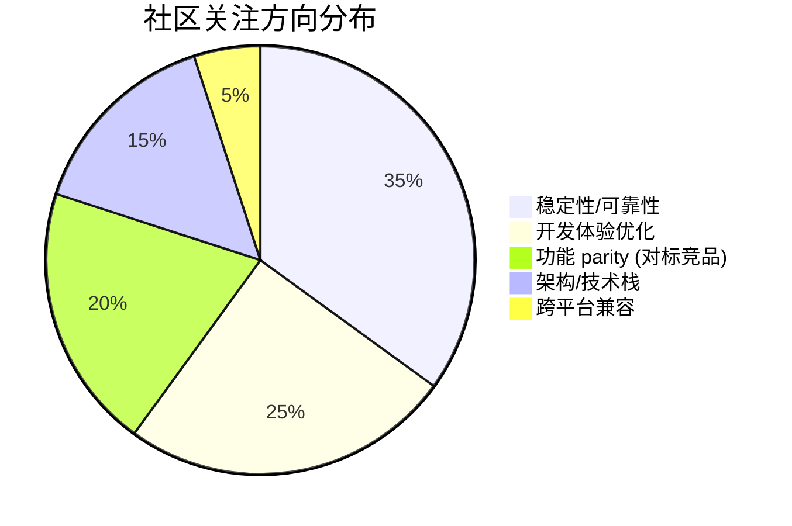

# AI CLI 工具社区动态日报 2026-04-06

> 生成时间: 2026-04-06 00:11 UTC | 覆盖工具: 8 个

- [Claude Code](https://github.com/anthropics/claude-code)
- [OpenAI Codex](https://github.com/openai/codex)
- [Gemini CLI](https://github.com/google-gemini/gemini-cli)
- [GitHub Copilot CLI](https://github.com/github/copilot-cli)
- [Kimi Code CLI](https://github.com/MoonshotAI/kimi-cli)
- [OpenCode](https://github.com/anomalyco/opencode)
- [Pi](https://github.com/badlogic/pi-mono)
- [Qwen Code](https://github.com/QwenLM/qwen-code)
- [Claude Code Skills](https://github.com/anthropics/skills)

---

## 横向对比

# AI CLI 工具生态横向对比分析报告 | 2026-04-06

---

## 1. 生态全景

当前 AI CLI 工具生态呈现**"头部三极+新兴追赶"**格局：Claude Code 凭借成熟度和付费用户基础占据企业心智，但计费透明度危机正在侵蚀信任；OpenAI Codex 以激进的技术迭代（WebRTC 实时音视频、深度分析埋点）试图差异化突围，却同样陷入 Token 消耗黑洞的争议；Google Gemini CLI 依托内部工程资源推进架构级创新（AST 感知、内存路由、LSP 集成），但稳定性问题制约口碑。二线工具（Kimi、OpenCode、Pi、Qwen）则通过快速功能对标、开源策略或垂直场景深耕争夺剩余市场，技术栈重构（Python→TypeScript）成为普遍选择。

---

## 2. 各工具活跃度对比

| 工具 | 今日 Issues | 今日 PRs | 版本发布 | 核心动态 |
|:---|:---:|:---:|:---:|:---|
| **Claude Code** | 50+ | 5 | ❌ 无 | 计费危机 #38335（427评论）主导讨论，开源呼声高涨 |
| **OpenAI Codex** | 50+ | 15+ | ❌ 无 | 实时音视频 4-PR 技术栈、分析埋点 6-PR 集群推进 |
| **Gemini CLI** | 50 | 50 | ❌ 无 | 工具输出优化、AST 感知、内存路由等架构级功能密集迭代 |
| **GitHub Copilot CLI** | 14 | 3（全关闭） | ❌ 无 | Windows 稳定性危机 #1164 持续 2 个月未解 |
| **Kimi Code CLI** | 8（新爆发） | 6 | ❌ 无 | v1.30.0 稳定性危机，Python→TS 重构提案引发架构讨论 |
| **OpenCode** | 50+ | 10+ | v1.3.15 | 计费异常 #8030（210+评论）+ 版本回归问题双重危机 |
| **Pi** | 25 | 13 | **v0.65.2** | 23/25 Issue 当日关闭，92% 解决率，新模型适配活跃 |
| **Qwen Code** | 34 | 10+ | ❌ 无 | wenshao 单日 7 PR，终端体验与权限策略成焦点 |

> **活跃度排序**：Gemini CLI ≈ Claude Code ≈ OpenAI Codex > OpenCode > Qwen Code > Pi > Kimi > Copilot CLI

---

## 3. 共同关注的功能方向

| 功能方向 | 涉及工具 | 具体诉求与状态 |
|:---|:---|:---|
| **计费透明度与成本控制** | Claude Code #38335, OpenAI Codex #14593, OpenCode #8030 | 会话/Token 计量异常、实时用量仪表盘、异常告警机制。三家均出现"消耗黑洞"信任危机，用户强烈要求可审计的计费明细 |
| **实时音视频/低延迟交互** | OpenAI Codex #16805-16807, Gemini CLI（隐式竞争） | WebRTC 替代 WebSocket、服务端 VAD、回声消除。Codex 领先推进，预示语音优先交互趋势 |
| **上下文管理与记忆持久化** | Claude Code #40524, Gemini CLI #22819, Kimi #1747, Qwen Code #2770 | 跨会话记忆、项目级配置、智能压缩、上下文窗口优化。Claude Code 的三级 Rules 系统成为对标标杆 |
| **IDE/编辑器深度集成** | Claude Code #30154, OpenAI Codex #16849, Gemini CLI #23464, Qwen Code #1370 | LSP 原生支持、VS Code 稳定性、多窗口/工作区隔离。从"终端工具"向"IDE 级体验"演进 |
| **MCP/工具生态标准化** | OpenAI Codex #16028, Gemini CLI #24246, GitHub Copilot CLI #2528 | 工具数量限制（128）、仓库级配置、连接稳定性。MCP 成为 Agent 能力扩展的事实标准 |
| **企业网络/代理支持** | OpenCode #531, Kimi #1766, Qwen Code #2909 | HTTP_PROXY 支持、SSH 环境适配、防火墙穿透。B 端落地的硬性门槛 |

---

## 4. 差异化定位分析

| 工具 | 功能侧重 | 目标用户 | 技术路线 |
|:---|:---|:---|:---|
| **Claude Code** | 企业级代码生成、Cowork 协作模式、深度 IDE 集成 | 付费企业开发者、复杂工程团队 | 闭源黑箱、Anthropic 模型独占、Statsig 特性开关 |
| **OpenAI Codex** | 实时交互（语音/视频）、深度分析可观测、ChatGPT 生态互通 | 追求前沿体验的早期采纳者、OpenAI 生态用户 | 激进功能迭代、WebRTC 自研、密集埋点驱动优化 |
| **Gemini CLI** | 架构级代码理解（AST/LSP）、内存路由、工具输出优化 | 追求工程严谨性的 Google 生态开发者 | 内部工程资源驱动、组件级评估体系、渐进式创新 |
| **GitHub Copilot CLI** | 与 GitHub/Codespaces 生态无缝集成、企业合规 | 已有 Copilot 订阅的 GitHub 重度用户 | 微软企业级工程、配置即代码（`.github/` 规范） |
| **Kimi Code CLI** | 快速功能对标、Web-CLI 双端对齐、国产化适配 | 中文开发者、Moonshot API 用户 | Python→TypeScript 重构中、社区驱动功能补齐 |
| **OpenCode** | 多模型中立、开放协议（ACP/MCP）、可自托管 | 模型agnostic 开发者、隐私敏感企业 | 开源开放、供应商解耦、社区贡献活跃 |
| **Pi** | 极致响应速度、本地多模型编排、扩展生态 | 追求效率的资深开发者、本地部署爱好者 | 高迭代速度、双模型分离降本、Morph 专用 API 替代 LLM |
| **Qwen Code** | 中文场景优化、阿里云生态、快速 CLI 体验迭代 | 中国开发者、阿里云用户 | 阿里云资源支撑、高频小步快跑、终端渲染技术债务明显 |

---

## 5. 社区热度与成熟度

### 🔥 高活跃 + 高成熟
| 工具 | 指标 | 评估 |
|:---|:---|:---|
| **Claude Code** | 427评论 Issue、付费用户基数大 | 成熟但信任危机，社区从"功能请求"转向"问责维权" |
| **OpenAI Codex** | 15+ PR/日、技术栈重构密集 | 高工程投入，但稳定性回归模式暴露测试缺口 |

### 🚀 高活跃 + 快速迭代
| 工具 | 指标 | 评估 |
|:---|:---|:---|
| **Gemini CLI** | 50 PR/日、架构级功能密集 | 内部工程资源充沛，正从"可用"向"卓越"跃迁 |
| **Pi** | 92% Issue 关闭率、当日补丁版本 | 维护者响应极快，社区协作模型健康 |
| **Qwen Code** | 单日 7 PR、功能追赶激进 | 阿里云投入明确，但终端技术债务需系统性解决 |

### ⚠️ 活跃但风险
| 工具 | 指标 | 评估 |
|:---|:---|:---|
| **Kimi** | v1.30.0 危机、技术栈重构争议 | 转型期阵痛，Python→TS 重构若成功将质变 |
| **OpenCode** | 210+评论计费危机、版本回归 | 开源优势 vs 质量保证张力，需强化发布流程 |
| **Copilot CLI** | #1164 2个月未解、PR 全关闭 | 微软资源投入与社区响应脱节，Windows 生态受损 |

---

## 6. 值得关注的趋势信号

| 信号 | 证据 | 开发者参考价值 |
|:---|:---|:---|
| **计费透明成为信任基础设施** | 三家头部工具同时爆发计量争议 | 选型时需优先评估用量可观测性，预留成本熔断机制 |
| **实时音视频重构交互范式** | Codex WebRTC 4-PR 技术栈、服务端 VAD | 语音优先的 AI 编程助手可能在 12-18 个月内成为标配 |
| **LSP/AST 成为代码理解分水岭** | Gemini #22745 AST 感知、#23464 独立 LSP | 纯文本 RAG 方案将被语义级代码理解淘汰，工具选型关注此能力 |
| **技术栈向 TypeScript 收敛** | Kimi #1707 重构、行业普遍趋势 | Node/Bun 生态的 AI 工具开发效率优势扩大，Python CLI 新工具需审慎 |
| **MCP 成为 Agent 扩展标准** | 全工具 MCP 相关 Issue/PR 激增 | 自建工具优先实现 MCP 协议，确保跨工具兼容性 |
| **"紧凑输出"体验军备竞赛** | Gemini 工具输出优化系列、Qwen Ctrl+O 模式 | 长上下文场景下，信息密度控制成为 UX 关键差异化点 |
| **开源作为信任修复手段** | Claude Code #41447/41518 反编译尝试、OpenCode 生态 | 闭源工具需建立更强的可审计机制，开源替代方案窗口期打开 |

---

*报告基于 2026-04-06 各工具 GitHub 公开数据生成，建议结合具体团队技术栈与合规要求做最终选型决策。*

---

## 各工具详细报告

<details>
<summary><strong>Claude Code</strong> — <a href="https://github.com/anthropics/claude-code">anthropics/claude-code</a></summary>

## Claude Code Skills 社区热点

> 数据来源: [anthropics/skills](https://github.com/anthropics/skills)

# Claude Code Skills 社区热点报告（2026-04-06）

---

## 1. 热门 Skills 排行

| 排名 | Skill | 功能 | 状态 | 链接 |
|:---|:---|:---|:---|:---|
| 1 | **document-typography** | AI 生成文档的排版质量控制，解决孤行、寡行、编号错位等常见问题 | 🟡 Open | [PR #514](https://github.com/anthropics/skills/pull/514) |
| 2 | **frontend-design** | 前端设计 Skill 的清晰度与可执行性改进，确保单轮对话内可完成指令 | 🟡 Open | [PR #210](https://github.com/anthropics/skills/pull/210) |
| 3 | **skill-quality-analyzer / skill-security-analyzer** | 元 Skills：自动评估其他 Skill 的质量（结构、文档、安全性等五维度） | 🟡 Open | [PR #83](https://github.com/anthropics/skills/pull/83) |
| 4 | **ODT** | OpenDocument 文本创建、模板填充及 ODT→HTML 解析，覆盖 LibreOffice/Google Docs 生态 | 🟡 Open | [PR #486](https://github.com/anthropics/skills/pull/486) |
| 5 | **codebase-inventory-audit** | 代码库清理审计，识别孤儿代码、未使用文件、文档缺口等 10 步工作流 | 🟡 Open | [PR #147](https://github.com/anthropics/skills/pull/147) |
| 6 | **SAP-RPT-1-OSS** | 集成 SAP 开源表格基础模型，用于 SAP 业务数据的预测分析 | 🟡 Open | [PR #181](https://github.com/anthropics/skills/pull/181) |
| 7 | **shodh-memory** | AI Agent 持久化记忆系统，跨对话维护上下文 | 🟡 Open | [PR #154](https://github.com/anthropics/skills/pull/154) |
| 8 | **testing-patterns** | 全栈测试模式 Skill，覆盖测试哲学、单元测试、React 组件测试等 | 🟡 Open | [PR #723](https://github.com/anthropics/skills/pull/723) |

---

## 2. 社区需求趋势（基于 Issues 分析）

| 方向 | 代表 Issue | 核心诉求 |
|:---|:---|:---|
| **Skill 治理与信任边界** | [#492](https://github.com/anthropics/skills/issues/492) | 社区 Skill 滥用 `anthropic/` 命名空间，需官方认证机制防钓鱼 |
| **企业级部署与 SSO** | [#532](https://github.com/anthropics/skills/issues/532), [#228](https://github.com/anthropics/skills/issues/228) | 企业用户无法使用 API Key，需组织级 Skill 共享库 |
| **Agent 安全与治理** | [#412](https://github.com/anthropics/skills/issues/412) | 缺乏 AI Agent 系统的策略执行、威胁检测、审计追踪 Skill |
| **MCP 协议集成** | [#16](https://github.com/anthropics/skills/issues/16) | 将 Skills 暴露为 MCP 工具，标准化 AI 软件 API |
| **Bedrock 兼容性** | [#29](https://github.com/anthropics/skills/issues/29) | AWS Bedrock 用户使用 Skills 的明确路径 |
| **Skill 生命周期管理** | [#62](https://github.com/anthropics/skills/issues/62), [#406](https://github.com/anthropics/skills/issues/406), [#403](https://github.com/anthropics/skills/issues/403) | 上传/删除/版本管理的稳定性与错误处理 |

---

## 3. 高潜力待合并 Skills

| Skill | 亮点 |  blocker/进展 | 链接 |
|:---|:---|:---|:---|
| **document-typography** | 解决所有 AI 生成文档的通用痛点，作者持续更新（3-13 更新） | 待官方 review | [PR #514](https://github.com/anthropics/skills/pull/514) |
| **ODT** | 填补 LibreOffice/开源办公生态空白，ISO 标准格式支持 | 技术 review 中 | [PR #486](https://github.com/anthropics/skills/pull/486) |
| **testing-patterns** | 测试领域覆盖最完整的 Skill，近期提交（3-22） | 新提交，待排队 | [PR #723](https://github.com/anthropics/skills/pull/723) |
| **sensory** | macOS 原生自动化（AppleScript），替代截图方案，分层权限设计 | 社区创新性强 | [PR #806](https://github.com/anthropics/skills/pull/806) |
| **quality-playbook** | 复兴传统质量工程，AI 降低执行成本，区别于代码生成测试工具 | 3-29 更新，活跃中 | [PR #659](https://github.com/anthropics/skills/pull/659) |

---

## 4. Skills 生态洞察

> **社区核心诉求：从"个人效率工具"演进为"企业级可信基础设施"** —— 用户迫切需要的是 Skill 的**组织级治理**（命名空间认证、SSO 兼容、共享机制）、**Agent 安全框架**（审计、策略、持久化记忆），以及**开放协议集成**（MCP），而非更多单点功能 Skill。

---

---

# Claude Code 社区动态日报 | 2026-04-06

## 今日速览

今日社区焦点集中在 **计费与使用限制异常** 问题上，Claude Max 计划用户报告会话配额异常快速耗尽（Issue #38335 已获 427 条评论）。同时，开源呼声持续高涨，多个 PR 尝试通过反编译或呼吁官方开源来推动 Claude Code 的透明化。

---

## 社区热点 Issues

| 优先级 | Issue | 核心问题 | 社区反应 |
|:---|:---|:---|:---|
| 🔴 **P0** | [#38335](https://github.com/anthropics/claude-code/issues/38335) Claude Max 计划会话限制异常快速耗尽 | 3月23日起，CLI 用户报告 5 小时会话配额在远未满额时即被判定耗尽，影响付费用户体验 | **427 评论，341 👍**，大量付费用户投诉，Anthropic 尚未官方回应 |
| 🔴 **P0** | [#6457](https://github.com/anthropics/claude-code/issues/6457) 5小时限制在1.5小时内触发 | 长期存在的计费计量 Bug，用户实际使用时间与系统记录严重不符 | 118 评论，30 👍，跨版本复现 |
| 🟡 **P1** | [#40524](https://github.com/anthropics/claude-code/issues/40524) 对话历史在后续轮次失效 | 回归 Bug：对话上下文在后续交互中被意外清除，导致模型"失忆" | 104 评论，156 👍，**已关闭** |
| 🟡 **P1** | [#30154](https://github.com/anthropics/claude-code/issues/30154) 桌面端多窗口支持 | 当前单窗口设计限制多任务并行，用户强烈需求多实例独立窗口 | 27 评论，70 👍，长期功能请求 |
| 🟡 **P1** | [#34845](https://github.com/anthropics/claude-code/issues/34845) 终端随机滚动至顶部 | TUI 体验缺陷：空闲时自动跳至 scrollback 顶部，打断阅读流 | 15 评论，39 👍 |
| 🟡 **P1** | [#38055](https://github.com/anthropics/claude-code/issues/38055) Cowork 小版本更新永久删除聊天记录 | **数据丢失**风险：Windows 平台自动更新导致任务历史不可恢复 | 17 评论，1 👍，严重但关注度低 |
| 🟢 **P2** | [#39530](https://github.com/anthropics/claude-code/issues/39530) ralph-loop 插件 Stop hook 跨会话阻塞 | 插件隔离机制缺陷：单个会话的 hook 错误影响并行会话 | 6 评论，2 👍 |
| 🟢 **P2** | [#43609](https://github.com/anthropics/claude-code/issues/43609) v2.1.92 remote-control 功能回归 | 2.1.92 版本出现"未为您的账户启用"错误，2.1.90/91 正常 | 2 评论，疑似客户端配置变更 |
| 🟢 **P2** | [#44003](https://github.com/anthropics/claude-code/issues/44003) bypassPermissions 模式静默降级 | Statsig 特性开关导致权限模式中途变更，影响自动化工作流 | 1 评论，新报告 |
| 🟢 **P2** | [#42863](https://github.com/anthropics/claude-code/issues/42863) CLAUDE.md 规则执行不可靠 | 核心功能缺陷：项目级指令文件被模型忽略，影响定制化行为 | 2 评论，1 👍，与 #44004 重复 |

---

## 重要 PR 进展

| PR | 作者 | 状态 | 核心内容 |
|:---|:---|:---|:---|
| [#41447](https://github.com/anthropics/claude-code/pull/41447) | gameroman | 🟡 Open | **"开源 Claude Code"** — 象征性 PR，引用 5 个历史 issue 表达社区开源诉求 |
| [#41518](https://github.com/anthropics/claude-code/pull/41518) | BH3GEI | 🟡 Open | **从 source map 提取 1906 个 TS 文件** 尝试重建可构建的开源版本，已实现 `--version` / `--help` 运行 |
| [#39148](https://github.com/anthropics/claude-code/pull/39148) | wonbywondev | 🟡 Open | **preserve-session 插件**：通过 UUID 映射解决项目重命名/移动后的会话历史丢失问题 |
| [#43824](https://github.com/anthropics/claude-code/pull/43824) | orbisai0security | 🟡 Open | 修复 GitHub Actions 工作流中的 **shell 注入漏洞**（HIGH severity） |
| [#43751](https://github.com/anthropics/claude-code/pull/43751) | mohamdawad135-oss | 🟡 Open | 内容未明确（摘要为"all"），疑似测试或占位 PR |

> 注：今日无官方维护者合并的 PR，社区驱动为主。

---

## 功能需求趋势

基于 50 条活跃 Issue 分析，社区关注方向呈现以下聚类：

| 方向 | 热度 | 代表 Issue |
|:---|:---|:---|
| **计费透明度与配额管理** | 🔥🔥🔥🔥🔥 | #38335, #6457, #43998 — 付费用户对计量准确性极度敏感 |
| **开源与可审计性** | 🔥🔥🔥🔥 | #41447, #41518 — 反编译尝试反映对黑箱客户端的不信任 |
| **Cowork 可靠性** | 🔥🔥🔥🔥 | #38055, #36902, #43986, #44007 — Windows 平台数据持久化与 VM 稳定性 |
| **TUI/终端体验优化** | 🔥🔥🔥 | #34845, #36415, #44002 — 滚动行为、会话视觉区分 |
| **IDE 生态集成** | 🔥🔥 | #43999 (VS Code 快捷键), #30154 (多窗口) |
| **权限与上下文控制** | 🔥🔥 | #44003 (权限降级), #42863 (CLAUDE.md 执行), #44005 (规划上下文丢失) |

---

## 开发者关注点

### 🔴 高频痛点

1. **计费系统不可信**
   - 会话时长计量与实际使用严重偏离，付费用户缺乏调试手段
   - 需求：实时用量仪表盘、详细 API 调用日志、配额申诉渠道

2. **Cowork 数据持久化脆弱**
   - 更新即丢数据、CRLF 解析失败、VM 服务启动失败
   - 需求：原子化备份机制、跨版本迁移工具、服务健康自检

3. **上下文管理不稳定**
   - CLAUDE.md 规则执行漂移、对话历史意外失效、规划模式上下文丢失
   - 需求：规则执行的确定性保证、上下文完整性校验

### 🟡 体验优化诉求

| 场景 | 当前限制 | 期望方案 |
|:---|:---|:---|
| 多项目管理 | 单窗口会话切换 | 原生多窗口/多工作区隔离 |
| 会话识别 | 默认名称难以区分 | 自动命名（基于目录/任务）+ CLI 颜色参数 |
| 认证流程 | 24 小时闲置即失效 | 可配置 TTL 或刷新令牌机制 |

### 🟢 生态建设

- **插件市场**：批量安装能力（#43927）、官方插件质量审核
- **MCP 生态**：浏览器扩展连接稳定性（#33880）、跨平台兼容性

---

*日报基于 GitHub 公开数据生成，不代表 Anthropic 官方立场。*

</details>

<details>
<summary><strong>OpenAI Codex</strong> — <a href="https://github.com/openai/codex">openai/codex</a></summary>

# OpenAI Codex 社区动态日报 | 2026-04-06

## 今日速览

今日社区最突出的议题是**Token 消耗异常问题**持续发酵，Issue #14593 已积累 434 条评论，成为 Codex 历史上讨论最热烈的 Issue 之一。同时，团队正密集推进**实时音视频架构重构**，4 个关联 PR 构成完整技术栈升级，计划将 WebSocket 迁移至 WebRTC 并引入共享回声消除。此外，**分析能力增强**成为工程重点，6 个关联 PR 构建完整的会话元数据追踪体系。

---

## 版本发布

**无新版本发布**（过去 24 小时）

---

## 社区热点 Issues

| 优先级 | Issue | 核心问题 | 社区反应 | 链接 |
|:---|:---|:---|:---|:---|
| 🔴 **P0** | #14593 Token 消耗过快 | Business 订阅用户报告 Token 以异常速度耗尽，疑似计费或模型调用逻辑缺陷 | **434 评论/168 👍**，持续 3 周未获官方回应，用户自发收集复现数据 | [链接](https://github.com/openai/codex/issues/14593) |
| 🟡 **P1** | #16866 macOS 内核崩溃 | v0.118.0 导致 Apple Silicon 设备出现 `os_refcnt` 溢出恐慌，一天内两次崩溃 | 新上报，严重性极高，涉及系统级稳定性 | [链接](https://github.com/openai/codex/issues/16866) |
| 🟡 **P1** | #16862 孤儿进程 CPU 占用 | 终端非正常退出时遗留 arm64 进程持续 80-100% CPU | 新上报，影响开发工作流退出体验 | [链接](https://github.com/openai/codex/issues/16862) |
| 🟡 **P1** | #16849 VS Code 扩展 CPU 100%+ | `open-in-targets` 错误循环导致 Code Helper Renderer 持续高负载 | 6 评论，有用户定位到具体错误 handler | [链接](https://github.com/openai/codex/issues/16849) |
| 🟡 **P1** | #16231 扩展高 CPU 回归 | v26.325.31654 更新后 macOS 温度异常，M5 Pro 设备受影响 | 20 👍，明确版本回归，与 #3022 形成长期性能问题模式 | [链接](https://github.com/openai/codex/issues/16231) |
| 🟢 **P2** | #16868 `/resume` 不显示线程名 | 功能与 #10315 需求冲突，命名功能已支持但 TUI 未展示 | 7 评论，UI 细节完善类问题 | [链接](https://github.com/openai/codex/issues/16868) |
| 🟢 **P2** | #16801 推理摘要流事件崩溃 | gpt-5.4 部分响应流事件可导致 CLI 崩溃 | 6 评论，涉及 TUI 渲染稳定性 | [链接](https://github.com/openai/codex/issues/16801) |
| 🟢 **P2** | #16028 MCP 回归问题 | 0.114.0→0.118.0 升级后 MCP 功能部分失效 | 7 评论，企业用户受影响 | [链接](https://github.com/openai/codex/issues/16028) |
| 🟢 **P2** | #15497 Hook 状态消息无法抑制 | `suppressOutput` 配置实际无效果，干扰 TUI 体验 | 15 👍，开发者工作流优化需求 | [链接](https://github.com/openai/codex/issues/15497) |
| 🟢 **P2** | #16817 Mac 桌面应用线程丢失 | 重启后现有线程无法加载，数据持久化问题 | 4 评论，Pro 订阅用户反馈 | [链接](https://github.com/openai/codex/issues/16817) |

---

## 重要 PR 进展

### 🔊 实时音视频架构重构（4-PR 技术栈）

| PR | 功能 | 技术要点 | 链接 |
|:---|:---|:---|:---|
| #16805 | WebRTC 替换 WebSocket | 将实时传输层从 WebSocket 迁移至 WebRTC，降低延迟、提升抗弱网能力 | [链接](https://github.com/openai/codex/pull/16805) |
| #16806 | 共享回声消除 | TUI 实时音频路由通过统一回声消除模块，解决双讲问题 | [链接](https://github.com/openai/codex/pull/16806) |
| #16807 | 移除本地播放中断 | 简化音频状态机，依赖服务端 VAD 进行流畅打断 | [链接](https://github.com/openai/codex/pull/16807) |
| #16769 | ChatGPT 实时认证适配 | 支持 ChatGPT 实时通话的认证流程与请求格式 | [链接](https://github.com/openai/codex/pull/16769) |

### 📊 分析能力增强（6-PR 技术栈）

| PR | 功能 | 技术要点 | 链接 |
|:---|:---|:---|:---|
| #16870 | 线程元数据反规范化 | 将线程级元数据冗余至 Turn 事件，便于分析查询 | [链接](https://github.com/openai/codex/pull/16870) |
| #16706 | 转向元数据 | 支持 turn-level steering 事件追踪与 steer_count 统计 | [链接](https://github.com/openai/codex/pull/16706) |
| #16659 | 队列提交元数据 | 追踪请求排队状态，识别调度瓶颈 | [链接](https://github.com/openai/codex/pull/16659) |
| #16641 | Token 使用元数据 | 细粒度 Token 消耗指标采集，或为 #14593 诊断提供数据基础 | [链接](https://github.com/openai/codex/pull/16641) |
| #16638 | 原生协议时间戳 | Turn 形状扩展 `created_at`/`completed_at`/`duration_ms` | [链接](https://github.com/openai/codex/pull/16638) |
| #16640 | 功能管道与发射 | Turn 配置数据的自定义事实发射与摄取管道 | [链接](https://github.com/openai/codex/pull/16640) |

### 🛠️ 体验修复与优化

| PR | 功能 | 技术要点 | 链接 |
|:---|:---|:---|:---|
| #16833 | Fast 模式切换修复 | 解决 `/fast off` 后 service-tier 未正确清除的回归 | [链接](https://github.com/openai/codex/pull/16833) |
| #16831 | `/mcp` 性能优化 | 避免完整库存重建，解决 TUI 等待慢速探针的问题 | [链接](https://github.com/openai/codex/pull/16831) |
| #16829 | CJK 词导航修复 | Unicode 词边界分段，解决中日韩文本 Option+方向键跳跃问题 | [链接](https://github.com/openai/codex/pull/16829) |
| #16827 | 设备码认证路由 | TUI 设备码登录走 App Server，支持远程会话认证 | [链接](https://github.com/openai/codex/pull/16827) |

---

## 功能需求趋势

基于 50 条活跃 Issue 分析，社区关注方向呈现以下聚类：

| 方向 | 热度 | 典型 Issue | 趋势解读 |
|:---|:---|:---|:---|
| **成本控制与透明度** | ⭐⭐⭐⭐⭐ | #14593, #16867, #13245 | Token 消耗异常成为信任危机，用户强烈要求可观测的计费明细与使用审计 |
| **性能与资源效率** | ⭐⭐⭐⭐⭐ | #3022, #16231, #15330, #16849, #16862 | CPU/内存/温度问题跨平台普遍存在，扩展与 CLI 均有回归，需系统性优化 |
| **IDE 集成深化** | ⭐⭐⭐⭐☆ | #3609, #8361, #12153 | GitHub Copilot 订阅互通、VS Code 稳定性、商业账户集成是企业采纳关键 |
| **TUI/终端体验** | ⭐⭐⭐⭐☆ | #16868, #15497, #16829, #16584 | 国际化输入、会话管理、输出控制等细节体验持续打磨 |
| **MCP/工具生态** | ⭐⭐⭐☆☆ | #16028, #16831 | MCP 作为代理能力扩展协议，稳定性与性能成为落地瓶颈 |
| **会话与数据管理** | ⭐⭐⭐☆☆ | #16817, #12878, #10315 | 线程持久化、计划文件位置、命名与恢复的功能闭环待完善 |

---

## 开发者关注点

### 🔥 紧急痛点
1. **Token 消耗黑洞** — #14593 的 434 条评论反映用户对成本失控的焦虑，缺乏实时用量仪表盘与异常告警机制
2. **性能回归模式** — 多次更新引入 CPU/温度问题（#3022→#16231→#16849），测试覆盖与 Canary 发布机制受质疑
3. **系统级稳定性** — 内核恐慌（#16866）与孤儿进程（#16862）触及开发者对工具安全性的底线要求

### 📌 高频需求
| 需求 | 代表 Issue | 当前状态 |
|:---|:---|:---|
| 实时用量监控与告警 | #14593 | ❌ 无官方回应 |
| GitHub Copilot 订阅互通 | #3609, #8361 | ❌ 开放中，企业场景受阻 |
| 可配置的 Plan/Skill 存储路径 | #12878, #16479 | 🔄 部分相关 PR 进行中 |
| TUI 输出精细控制 | #15497 | 🔄 Hook 系统待完善 |
| Windows 体验平等化 | #15323, #13743, #12153 | ⚠️ 字符编码、按钮交互等问题集中 |

### 💡 技术观察
- **分析优先战略**：6 个 analytics PR 表明团队正构建数据驱动的优化基础，Token 使用元数据（#16641）或为诊断 #14593 提供关键支撑
- **实时交互升级**：WebRTC 迁移（#16805-16769）预示 Codex 向更低延迟、更自然交互演进，可能为后续语音优先模式铺路
- **平台差异收敛**：今日 3 个 Windows 修复 PR（#16825, #16823 等）显示 CI 稳定性与跨平台一致性仍是工程重点

</details>

<details>
<summary><strong>Gemini CLI</strong> — <a href="https://github.com/google-gemini/gemini-cli">google-gemini/gemini-cli</a></summary>

# Gemini CLI 社区动态日报 | 2026-04-06

---

## 今日速览

今日社区活跃度较高，共 50 个 Issue 和 50 个 PR 有更新。核心焦点集中在**工具输出优化**（Compact Tool Output）、**Agent 智能性提升**（AST 感知、内存路由、安全行为）以及**开发者体验改进**（SSH 检测、会话恢复、快速模式）。值得注意的是，团队正在推进多项基础设施升级，包括内部模型迁移至 Gemini 3.1 Flash Lite 和组件级评估体系完善。

---

## 社区热点 Issues

| # | 标题 | 状态 | 重要性 | 社区反应 |
|---|------|------|--------|---------|
| [#22745](https://github.com/google-gemini/gemini-cli/issues/22745) | AST 感知文件读取与代码库映射评估 | 🔴 Open | ⭐⭐⭐⭐⭐ | **架构级探索**：团队正在评估引入 AST（抽象语法树）感知工具，以精确定位方法边界、减少误读和 Token 浪费。这是 Agent 代码理解能力的潜在跃升，4 条评论显示内部高度重视。 |
| [#22863](https://github.com/google-gemini/gemini-cli/issues/22863) | Agent 频繁使用不安全的对象克隆模式 | 🔴 Open | ⭐⭐⭐⭐⭐ | **代码质量隐患**：维护者指出模型生成的代码存在部分实现目标类型的不安全克隆，可能导致运行时错误。这反映了 LLM 生成代码的可靠性问题，需系统性解决。 |
| [#24644](https://github.com/google-gemini/gemini-cli/issues/24644) | Edit 工具失败时紧凑输出泄露无用内容 | 🔴 Open | ⭐⭐⭐⭐⭐ | **P1 优先级**：工具输出优化系列的最新问题，失败时的脏数据会污染对话历史，影响用户体验。 |
| [#24634](https://github.com/google-gemini/gemini-cli/issues/24634) | 搜索文本工具输出量过大未截断 | 🔴 Open | ⭐⭐⭐⭐⭐ | **P1 优先级**：Search 工具默认不截断输出，导致大量内容淹没界面，与紧凑输出目标相悖。 |
| [#22819](https://github.com/google-gemini/gemini-cli/issues/22819) | 实现内存路由：全局 vs 项目级 | 🔴 Open | ⭐⭐⭐⭐☆ | **个性化基础设施**：定义用户偏好（全局 `~/.gemini/`）与项目特定记忆（`.gemini/`）的存储策略，2 个 👍 显示社区期待。 |
| [#23582](https://github.com/google-gemini/gemini-cli/issues/23582) | 子代理对活跃审批模式的感知 | 🔴 Open | ⭐⭐⭐⭐☆ | **多 Agent 协调关键**：子代理目前不了解 Plan Mode/Auto-Edit Mode 等审批模式，导致指令与实际约束冲突，影响复杂任务执行。 |
| [#24202](https://github.com/google-gemini/gemini-cli/issues/24202) | SSH 会话中文字显示混乱 | 🔴 Open | ⭐⭐⭐⭐☆ | **跨平台体验痛点**：Windows 通过 SSH 连接 gLinux 后启动 CLI 出现乱码，已关联 [#24546](https://github.com/google-gemini/gemini-cli/issues/24546) 的 SSH 检测辅助功能。 |
| [#22672](https://github.com/google-gemini/gemini-cli/issues/22672) | Agent 应阻止/劝阻破坏性操作 | 🔴 Open | ⭐⭐⭐⭐☆ | **安全增强**：针对 `git reset --force` 等危险命令和数据库操作的安全防护，1 个 👍 反映开发者对生产安全的需求。 |
| [#24246](https://github.com/google-gemini/gemini-cli/issues/24246) | >128 个工具时触发 400 错误 | 🔴 Open | ⭐⭐⭐⭐☆ | **规模瓶颈**：工具数量超过 128 时 API 报错，需智能限制启用工具范围，影响大型项目使用。 |
| [#15381](https://github.com/google-gemini/gemini-cli/issues/15381) | macOS 无法直接粘贴剪贴板图片 | 🟢 Closed | ⭐⭐⭐☆☆ | **回归修复**：用户报告此前支持的剪贴板图片粘贴功能失效，7 条评论显示问题受关注，已关闭但标记为 Stale。 |

---

## 重要 PR 进展

| # | 标题 | 状态 | 核心内容 |
|---|------|------|---------|
| [#24723](https://github.com/google-gemini/gemini-cli/pull/24723) | 引导模型优先使用 replace 而非 write_file | 🔵 Open | **智能编辑优化**：通过改进工具描述，减少模型对全文件重写的依赖，降低 Token 消耗和意外覆盖风险。 |
| [#24722](https://github.com/google-gemini/gemini-cli/pull/24722) | LLM 建议的策略范围用于工具审批 | 🔵 Open | **安全 UX 升级**：用户批准工具时，后台调用 Gemini Flash Lite 生成有意义的权限范围（如 `["git diff", "git log"]`），替代启发式根命令，提升审批精确度。 |
| [#24643](https://github.com/google-gemini/gemini-cli/pull/24643) | V0 情景上下文管理器 | 🔵 Open | **架构重构**：将字符串式上下文操作重写为不可变 IR 管道，实现四种非破坏性降级处理器（历史压缩、工具掩码、Blob 降级、语义压缩），解决上下文窗口管理难题。 |
| [#24720](https://github.com/google-gemini/gemini-cli/pull/24720) | 首条提示匹配历史时提示恢复会话 | 🔵 Open | **体验优化**：检测到用户重复输入相似首条提示时，主动询问是否恢复之前会话，减少上下文丢失。 |
| [#24717](https://github.com/google-gemini/gemini-cli/pull/24717) | --fast 模式实现快速单轮执行 | 🔵 Open | **性能优化**：跳过预检请求、禁用会话保存、最小化系统提示，专为单次快速查询设计，解决 #16335。 |
| [#24369](https://github.com/google-gemini/gemini-cli/pull/24369) | /web 命令与浏览器 GUI | 🔵 Open | **P1 新界面**：Material You 风格的 Web 仪表盘，SSE 流式聊天、模型选择器、文件浏览器，扩展 CLI 使用场景。 |
| [#24170](https://github.com/google-gemini/gemini-cli/pull/24170) | 修复命令注入漏洞 | 🔵 Open | **安全修复**：检测并阻止 `$(...)`、反引号、`<(...)` 等 Shell 替换语法在参数中的执行，防止注入攻击。 |
| [#23464](https://github.com/google-gemini/gemini-cli/pull/23464) | 独立 LSP 集成 | 🔵 Open | **IDE 级能力**：无需 IDE 即可获得编译器诊断、语义查询（悬停、跳转定义、查找引用、符号摘要），提升代码理解精度。 |
| [#24653](https://github.com/google-gemini/gemini-cli/pull/24653) | 修复 Windows bunx 执行错误 | 🔵 Open | **跨平台修复**：解决 `#!/usr/bin/env -S` shebang 在 Windows 不兼容导致的 `-S not found` 错误。 |
| [#24711](https://github.com/google-gemini/gemini-cli/pull/24711) | list-sessions 支持 JSON 输出 | 🔵 Open | **自动化友好**：`--output-format json` 支持，便于脚本集成和第三方工具消费会话数据。 |

---

## 功能需求趋势

基于 50 个活跃 Issue 分析，社区关注焦点呈现四大方向：

| 趋势方向 | 代表 Issue | 核心诉求 |
|---------|-----------|---------|
| **🎯 智能输出与上下文管理** | #24644, #24634, #24507, #24643, #23556 | 紧凑工具输出、上下文压缩优化、避免信息过载，同时防止过度压缩导致质量下降 |
| **🧠 Agent 架构升级** | #22745, #22863, #22819, #23582, #22672 | AST 感知代码理解、安全克隆模式、全局/项目记忆分层、子代理协调、破坏性操作防护 |
| **⚡ 性能与开发者效率** | #24717, #24202, #24546, #24470, #24438 | 快速模式、SSH 环境适配、滚动优化、会话恢复、启动速度 |
| **🔒 安全与企业级** | #24170, #24722, #24214, #23925 | 命令注入防护、精细化权限策略、Plan Mode 完善、团队默认配置 |

---

## 开发者关注点

### 🔴 高频痛点
1. **工具输出失控**：Search/Edit 等工具输出量过大、失败时污染历史，紧凑输出体验仍需打磨（#24634, #24644）
2. **SSH/远程环境支持不足**：Windows→gLinux SSH 乱码、tmux 兼容性问题（#24202, #22067）
3. **Agent 行为不可预测**：不安全代码生成、破坏性操作风险、工具选择非最优（#22863, #22672, #24723）

### 🟡 迫切需求
4. **上下文与记忆管理**：跨会话记忆持久化、项目级配置、智能压缩（#22819, #22809, #24643）
5. **IDE 级代码理解**：LSP 集成、AST 感知导航、精确符号定位（#23464, #22745）
6. **自动化与集成**：JSON 输出、程序化调用、CI/CD 友好（#24711, #23414, #24493）

### 🟢 基础设施期待
7. **模型与评估体系升级**：内部工具迁移 3.1 Flash Lite、组件级行为评估、Steering Eval 稳定性（#23823, #24353, #23313）

</details>

<details>
<summary><strong>GitHub Copilot CLI</strong> — <a href="https://github.com/github/copilot-cli">github/copilot-cli</a></summary>

# GitHub Copilot CLI 社区动态日报 | 2026-04-06

---

## 1. 今日速览

今日社区活跃度显著，**14 个 Issues 更新**，全部为过去 24 小时内新增或活跃讨论，无新版本发布。核心焦点集中在 **Windows 平台稳定性**（#1164 持续发酵）、**MCP 服务器配置管理**（#2528 提出仓库级配置需求），以及 **LSP 企业级支持**（超时配置、C# 文档等）。值得注意的是，3 个 PR 均为当日关闭状态，疑似清理无效提交。

---

## 2. 版本发布

**无新版本发布** — 最新版本仍为 v1.0.18（2026-04-05 社区反馈中提及）。

---

## 3. 社区热点 Issues

| 优先级 | Issue | 核心问题 | 社区反应 | 链接 |
|:---|:---|:---|:---|:---|
| 🔴 **P0** | **#1164** Windows 11 启动即退出 | 0.0.368+ 版本在 Windows 上完全无法运行，零输出零错误码，严重阻断 Windows 开发者工作流 | 10 条评论，3 👍，持续 2 个月未解决，用户被迫回退至 0.0.1xx 版本 | [链接](https://github.com/github/copilot-cli/issues/1164) |
| 🔴 **P0** | **#2525** 子进程无 stdout 输出 | `Start-Process` 启动时零字节输出，阻断 PowerShell 自动化/CI 集成场景 | 新提交，企业自动化场景关键障碍 | [链接](https://github.com/github/copilot-cli/issues/2525) |
| 🟡 **P1** | **#2528** 仓库级 MCP 配置 | 请求支持 `.github/mcp.json` 实现项目级 MCP 服务器管理，对标现有 `copilot-instructions.md` 和 `lsp.json` 设计模式 | 新功能请求，MCP 生态标准化关键一步 | [链接](https://github.com/github/copilot-cli/issues/2528) |
| 🟡 **P1** | **#2520** LSP 初始化超时配置 | 大型 .NET 仓库（6000+ 文件）OmniSharp 超时，硬编码 60s 限制过短 | 企业级代码库支持刚需，需可配置超时 | [链接](https://github.com/github/copilot-cli/issues/2520) |
| 🟡 **P1** | **#2526** 会话分叉/克隆 | 长会话中并行任务分支需求，避免上下文污染或历史丢失 | 复杂工作流场景，Agent 模式深度使用者的痛点 | [链接](https://github.com/github/copilot-cli/issues/2526) |
| 🟡 **P1** | **#2524** `--continue` 切换模型崩溃 | 修改模型配置后下次启动 exit code 1，配置持久化失败 | 多模型用户日常摩擦点 | [链接](https://github.com/github/copilot-cli/issues/2524) |
| 🟢 **P2** | **#2529** 禁用底部对齐输入 | UI 动画干扰：斜杠命令触发时输入区跳动 | 可访问性与视觉稳定性反馈 | [链接](https://github.com/github/copilot-cli/issues/2529) |
| 🟢 **P2** | **#2521** 泰语渲染不完整 | CJK 类多字节字符支持缺陷，跨终端复现 | 国际化/本地化质量缺口 | [链接](https://github.com/github/copilot-cli/issues/2521) |
| 🟢 **P2** | **#2519** `/user` 命令项目级持久化 | 多许可证用户需按仓库切换 GitHub 账户 | 企业/开源贡献者身份管理场景 | [链接](https://github.com/github/copilot-cli/issues/2519) |
| 🟢 **P2** | **#2518** 本地 Agent + 远程 Shell | SSH 远程开发环境支持，本地 UI + 远程执行 | 远程/容器化开发工作流扩展 | [链接](https://github.com/github/copilot-cli/issues/2518) |

> **#2021** 已关闭：VS Code Terminal Shift+Enter 多行支持问题经确认配置相关，非 CLI 本身缺陷。

---

## 4. 重要 PR 进展

| PR | 状态 | 说明 | 链接 |
|:---|:---|:---|:---|
| **#2316** | ❌ CLOSED | DevContainer feature 配置更新（`github-cli`），疑似清理无效 PR | [链接](https://github.com/github/copilot-cli/pull/2316) |
| **#2523** | ❌ CLOSED | **安全相关**：包含 `${b@P}` 参数扩展的潜在命令注入测试代码，当日关闭 | [链接](https://github.com/github/copilot-cli/pull/2523) |
| **#2522** | ❌ CLOSED | i686 架构支持，无描述内容，当日关闭 | [链接](https://github.com/github/copilot-cli/pull/2522) |

> **PR 观察**：今日无有效合并，3 个关闭 PR 均为无效提交或安全测试，反映社区贡献质量管控需求。

---

## 5. 功能需求趋势

基于 14 个活跃 Issues 的聚类分析：

```
┌─────────────────────────────────────────────────────────┐
│  🔧 企业级工程支持（35%）                                │
│     ├── LSP 超时配置 (#2520)                             │
│     ├── C# LSP 文档 (#2204)                              │
│     └── 大型仓库性能优化                                 │
│                                                          │
│  🏗️  配置管理标准化（25%）                               │
│     ├── 仓库级 MCP 配置 (#2528) ← 对标现有 .github/ 规范  │
│     ├── /add-dir 持久化 (#2284)                          │
│     └── /user 项目级设置 (#2519)                         │
│                                                          │
│  🖥️  Windows 平台稳定性（20%）                            │
│     ├── 启动即退出 (#1164)                               │
│     └── 子进程 I/O 异常 (#2525)                          │
│                                                          │
│  🤖 Agent 工作流增强（15%）                               │
│     ├── 会话分叉/克隆 (#2526)                            │
│     ├── 子 Agent 聚焦 (#2517)                            │
│     └── 本地+远程混合模式 (#2518)                        │
│                                                          │
│  🌍 国际化与可访问性（5%）                                │
│     └── 泰语渲染 (#2521)、UI 稳定性 (#2529)              │
└─────────────────────────────────────────────────────────┘
```

**关键趋势**：社区正从"基础功能可用"向"企业级工程化"演进，**配置即代码**（MCP/指令/LSP 统一纳入 `.github/`）成为明确诉求。

---

## 6. 开发者关注点

### 🔥 高频痛点

| 类别 | 具体问题 | 影响范围 |
|:---|:---|:---|
| **Windows 可靠性危机** | #1164 长达 2 个月未解，新版本完全不可用；#2525 自动化场景阻断 | Windows 企业用户、CI/CD 集成 |
| **配置碎片化** | MCP、LSP、指令分散存储，无统一的项目级配置机制 | 团队协作、仓库模板化 |
| **超时硬编码** | LSP 60s 限制无法覆盖大型代码库初始化 | .NET/企业级 Java 项目 |

### 💡 新兴需求模式

- **"会话即工作区"**：#2526 的分叉需求反映用户将 Copilot CLI 作为长期任务容器使用，而非单次查询工具
- **多身份管理**：#2519 揭示 GitHub 多账户用户（个人+企业+开源）的身份切换摩擦
- **远程开发原生支持**：#2518 与 GitHub Codespaces 生态形成互补诉求

### 📊 数据洞察

- **Issue 创建密度**：4 月 5 日单日新增 8 个 Issues，创近期高峰
- **零评论占比**：50% 的新 Issue 尚无社区互动，需维护者介入
- **跨平台差距**：Windows 相关 Issue 平均解决周期显著长于 macOS/Linux

---

*日报基于 github.com/github/copilot-cli 公开数据生成*

</details>

<details>
<summary><strong>Kimi Code CLI</strong> — <a href="https://github.com/MoonshotAI/kimi-cli">MoonshotAI/kimi-cli</a></summary>

# Kimi Code CLI 社区动态日报 | 2026-04-06

## 今日速览

过去24小时社区活跃度极高，**8个新Issue集中爆发**，其中v1.30.0版本出现多项稳定性问题（JSON序列化错误、任务超时失效、终端点击中断等）。同时**6个PR推进中**，涵盖YOLO模式Web端支持、Python→TypeScript重构等重大功能，社区正经历技术栈转型与功能完善的关键期。

---

## 版本发布

**无新版本发布**

> 当前最新版本仍为 v1.30.0（2026-04-05发布），但该版本已暴露多项稳定性问题，建议关注后续补丁。

---

## 社区热点 Issues

| # | 标题 | 类型 | 重要性 | 社区反应 |
|---|------|------|--------|---------|
| [#1762](https://github.com/MoonshotAI/kimi-cli/issues/1762) | ToolResult返回后触发JSON序列化错误 | 🐛 Bug | **🔴 严重** | v1.30.0核心Bug，直接影响工具调用链，2条评论追踪中 |
| [#1761](https://github.com/MoonshotAI/kimi-cli/issues/1761) | 任务超时参数失效导致持续超时 | 🐛 Bug | **🔴 严重** | 生产环境阻塞问题，0评论待官方响应 |
| [#1766](https://github.com/MoonshotAI/kimi-cli/issues/1766) | MCP连接失败导致Web UI Worker崩溃 | 🐛 Bug | **🔴 严重** | 架构级稳定性问题，需优雅降级机制 |
| [#1765](https://github.com/MoonshotAI/kimi-cli/issues/1765) | 鼠标点击终端误触发任务中断 | 🐛 Bug | **🟡 高** | UX严重缺陷，1条评论确认复现 |
| [#1763](https://github.com/MoonshotAI/kimi-cli/issues/1763) | 文档创建指令执行中断 | 🐛 Bug | **🟡 高** | Windows平台特定问题，待详细信息 |
| [#1747](https://github.com/MoonshotAI/kimi-cli/issues/1747) | 三级Rules系统功能请求 | ✨ Enhancement | **🟡 高** | 对标Claude Code，2条评论讨论架构设计 |
| [#1623](https://github.com/MoonshotAI/kimi-cli/issues/1623) | Kimi Web频繁刷新影响体验 | 🐛 Bug | **🟡 中** | 持续8天未解决，3条评论+1👍 |
| [#1617](https://github.com/MoonshotAI/kimi-cli/issues/1617) | Windows Terminal无法Ctrl-V粘贴图片 | 🐛 Bug | **🟡 中** | 跨平台兼容性问题，2条评论 |

---

## 重要 PR 进展

| # | 标题 | 作者 | 功能/修复内容 | 状态 |
|---|------|------|-------------|------|
| [#1767](https://github.com/MoonshotAI/kimi-cli/pull/1767) | Web界面支持YOLO模式 | lucaspdude | 为Web UI添加自动审批(YOLO)模式开关，含前后端完整实现 | 🆕 新提交 |
| [#1707](https://github.com/MoonshotAI/kimi-cli/pull/1707) | Python→Bun+TS+React Ink重构 | Yuandiaodiaodiao | **全量重构**：166个TS文件/3.2万行代码，211功能测试，目标替代Python技术栈 | 🔥 重大变更 |
| [#1743](https://github.com/MoonshotAI/kimi-cli/pull/1743) | 新增`/btw`侧边提问命令 | RealKai42 | 允许不中断主对话的轻量级提问，双层渲染架构 | 更新中 |
| [#1764](https://github.com/MoonshotAI/kimi-cli/pull/1764) | 修复空tool_call参数序列化 | Haroldhhhh | 修复`arguments`为None/""时的JSON序列化异常，直接对应#1762 | 🆕 新提交 |
| [#1738](https://github.com/MoonshotAI/kimi-cli/pull/1738) | WriteFile工具格式校验 | MaxwellGengYF | 写入后校验JSON/XML/Markdown格式，性能开销可忽略 | 更新中 |
| [#1756](https://github.com/MoonshotAI/kimi-cli/pull/1756) | 诊断日志与导出增强 | RealKai42 | 25+关键错误路径添加日志，`kimi export`自动打包日志 | 更新中 |

---

## 功能需求趋势



| 趋势方向 | 具体表现 | 代表Issue/PR |
|---------|---------|------------|
| **稳定性优先** | v1.30.0集中爆发4个核心Bug，JSON序列化、超时机制、信号处理成重灾区 | #1761, #1762, #1765, #1766 |
| **Rules系统标准化** | 社区明确要求对标Claude Code的三级配置体系（Global/User/Project） | #1747 |
| **Web-CLI功能对齐** | YOLO模式、MCP支持等CLI功能向Web端迁移 | #1767, #1766 |
| **技术栈现代化** | Python→TypeScript重构提案引发架构层面讨论 | #1707 |
| **诊断能力增强** | 日志系统完善成为Debug基础设施重点 | #1756 |

---

## 开发者关注点

### 🔴 高频痛点

| 问题 | 影响范围 | 紧急度 |
|-----|---------|--------|
| **v1.30.0稳定性危机** | 工具调用、任务超时、终端交互多环节失效 | P0 |
| **MCP生态成熟度** | 连接失败即崩溃，缺乏降级机制 | P1 |
| **Windows体验差距** | 粘贴图片、终端兼容性持续存在问题 | P1 |

### 🟡 架构级讨论

- **#1707 技术栈重构**：社区出现"Python是彻底失败"的激进观点，提出Bun+TS+React Ink全量重写方案（166文件/3.2万行），引发关于维护成本与性能收益的深层讨论
- **配置系统分层需求**：开发者明确需要Claude Code式的Rules分层管理，当前单文件配置难以满足多项目场景

### 💡 产品建议

> 开发者通过#1743`/btw`命令、#1747三级Rules等提案，显示对**非侵入式交互**和**精细化配置管理**的强烈需求，产品需从"功能堆砌"转向"开发者工作流深度适配"。

---

*数据来源：github.com/MoonshotAI/kimi-cli | 统计周期：2026-04-05 至 2026-04-06*

</details>

<details>
<summary><strong>OpenCode</strong> — <a href="https://github.com/anomalyco/opencode">anomalyco/opencode</a></summary>

# OpenCode 社区动态日报 | 2026-04-06

## 今日速览

今日社区聚焦于 **GitHub Copilot 计费异常** 的高热讨论（210+ 评论），用户反馈代理请求被错误计为高级请求导致配额快速消耗；同时 **v1.3.15 版本出现多项回归问题**，包括 `e.diffs.map is not a function` 崩溃和 Gemma 4 模型命名错误，开发团队正紧急修复。

---

## 社区热点 Issues

| 优先级 | Issue | 说明 | 社区反应 |
|:---|:---|:---|:---|
| 🔥 **P0** | [#8030](https://github.com/anomalyco/opencode/issues/8030) Copilot 认证将过多请求标记为"user"导致高级配额快速消耗 | **计费严重缺陷**：代理发起的请求未正确设置 `X-Initiator: agent` 头，60 次代理请求消耗半月配额；影响所有 Copilot 用户 | 210 评论，75 👍，用户愤怒反馈"half my monthly quota gone" |
| 🔥 **P0** | [#21100](https://github.com/anomalyco/opencode/issues/21100) `e.diffs.map is not a function` 崩溃 | **v1.3.15 回归 bug**：会话页面白屏崩溃，阻塞核心工作流 | 5 评论，已有 PR #21127 修复 |
| 🔥 **P0** | [#21067](https://github.com/anomalyco/opencode/issues/21067) Gemma-4-31b 模型名称错误 | **配置错误**：应使用 `gemma-4-31b-it` 而非 `gemma-4-31b`，导致 API 调用失败 | 5 评论，用户语气激烈"that's the damn correct name" |
| ⚠️ **P1** | [#8598](https://github.com/anomalyco/opencode/issues/8598) Copilot 模型不支持（已关闭） | v1.1.21 中 5.2-Codex/Raptor 等模型提示"功能未启用"，与 VSCode Copilot 行为不一致 | 45 评论，11 👍，已修复关闭 |
| ⚠️ **P1** | [#20650](https://github.com/anomalyco/opencode/issues/20650) Kimi k2.5 工具调用失败 | 模型输出 JSON 解析错误，"Unterminated string"，工具调用不稳定 | 31 评论，影响国产模型生态 |
| ⚠️ **P1** | [#21098](https://github.com/anomalyco/opencode/issues/21098) 代理环境下 npm 插件安装失败 | `fetch() proxy.url must be a non-empty string`，企业/防火墙用户受阻 | 6 评论，与 #531 代理问题相关 |
| ⚠️ **P1** | [#20995](https://github.com/anomalyco/opencode/issues/20995) Gemma 4 流式工具调用识别失败 | Ollama 兼容 API 返回 `tool_calls` 但 OpenCode 未识别，本地部署场景 | 4 评论，12 👍 |
| 📌 **P2** | [#531](https://github.com/anomalyco/opencode/issues/531) HTTP_PROXY/HTTPS_PROXY 支持 | 企业/地区防火墙用户的长期需求，数百万潜在用户受影响 | 39 评论，24 👍，2025-06 创建持续活跃 |
| 📌 **P2** | [#12661](https://github.com/anomalyco/opencode/issues/12661) Agent Teams 功能需求 | 对标 Claude Code 的多代理协作功能，社区高期待 | 26 评论，104 👍，最高赞需求之一 |
| 📌 **P2** | [#20695](https://github.com/anomalyco/opencode/issues/20695) 内存问题集中讨论 | 官方发起的内存泄漏追踪帖，呼吁用户提供 heap snapshot | 15 评论，17 👍，性能优化关键 |

---

## 重要 PR 进展

| 状态 | PR | 功能/修复内容 | 影响范围 |
|:---|:---|:---|:---|
| 🆕 **新提交** | [#21135](https://github.com/anomalyco/opencode/pull/21135) | 使用 `npm-package-arg` 解析包规范，清理 Win32 缓存路径 | 修复 #21126、#21099 插件安装问题 |
| 🆕 **新提交** | [#21137](https://github.com/anomalyco/opencode/pull/21137) | 升级 opentui 至 0.1.97 | TUI 底层依赖更新 |
| 🆕 **新提交** | [#21136](https://github.com/anomalyco/opencode/pull/21136) | TUI 粘贴文本 UX 优化：显示 `[Pasted 1 ~N lines]` 摘要 | 提升粘贴大段代码的可读性 |
| 🆕 **新提交** | [#21133](https://github.com/anomalyco/opencode/pull/21133) | TUI 页脚和侧边栏显示 Token Per Second (TPS) | 响应 #21132，性能可视化 |
| 🆕 **新提交** | [#21131](https://github.com/anomalyco/opencode/pull/21131) | 会话创建接受目录参数覆盖 | 修复 #12918，多目录工作流支持 |
| 🆕 **新提交** | [#21134](https://github.com/anomalyco/opencode/pull/21134) | ACP 实现标准 `configOptions` | 修复 #14098，CodeCompanion 等客户端兼容 |
| 🆕 **新提交** | [#21129](https://github.com/anomalyco/opencode/pull/21129) | 会话列表显示模型信息 | 解决多模型用户区分会话痛点 |
| 🆕 **新提交** | [#21127](https://github.com/anomalyco/opencode/pull/21127) | 从畸形会话 diffs 中恢复 | **修复 #21100 崩溃问题** |
| 🔧 **持续** | [#21052](https://github.com/anomalyco/opencode/pull/21052) | 工具系统重构：移除初始化时的 agent 上下文依赖 | 核心架构简化，行为一致性 |
| 🔧 **持续** | [#19545](https://github.com/anomalyco/opencode/pull/19545) | `opencode serve` 远程控制 + 中继服务 | 服务器/CI 场景部署能力 |

---

## 功能需求趋势

基于今日 50 条活跃 Issue 分析，社区关注焦点集中在：

| 方向 | 热度 | 代表 Issue | 说明 |
|:---|:---|:---|:---|
| **计费与成本控制** | 🔥🔥🔥 | #8030, #21132 | Copilot 计费异常、TPS 显示需求，用户强烈关注成本透明 |
| **企业网络/部署** | 🔥🔥🔥 | #531, #21098, #19545 | 代理支持、私有部署、远程控制，B端场景刚需 |
| **模型生态扩展** | 🔥🔥 | #20650, #21067, #20995, #10434 | Kimi、Gemma、Maple AI 等国内外模型适配 |
| **IDE/编辑器集成** | 🔥🔥 | #4240, #906, #11409 | Zed 原生审查、图片粘贴、Jupyter 支持 |
| **多代理协作** | 🔥 | #12661, #5408, #4096 | Agent Teams、延迟队列、子代理上下文控制 |
| **稳定性与性能** | 🔥🔥 | #20695, #20465, #14862 | 内存泄漏、MCP 回归、Big Pickle 可靠性 |

---

## 开发者关注点

### 🔴 紧急痛点
1. **v1.3.15 质量回归**：`e.diffs.map` 崩溃、Gemma 命名错误、MCP 空白响应 —— 发布流程需加强回归测试
2. **Copilot 计费信任危机**：#8030 的 210+ 评论显示用户对计费准确性极度敏感，需官方快速响应

### 🟡 高频需求
3. **代理/防火墙穿透**：#531 持续 9 个月活跃，企业用户 onboarding  blocker
4. **国产模型适配**：Kimi、DeepSeek 等工具调用稳定性待提升
5. **视觉/多模态工作流**：图片粘贴 (#906)、AVIF 支持 (#17772) 需求增长

### 🟢 生态建设
6. **开放协议兼容**：ACP 标准支持 (#21134)、MCP 生态整合
7. **可观测性**：TPS 显示 (#21133)、内存诊断工具 (#20695) 反映性能调优需求

---

> 📊 数据来源：[anomalyco/opencode](https://github.com/anomalyco/opencode) | 统计周期：2026-04-05 至 2026-04-06

</details>

<details>
<summary><strong>Pi</strong> — <a href="https://github.com/badlogic/pi-mono">badlogic/pi-mono</a></summary>

# Pi 社区动态日报 | 2026-04-06

## 今日速览

Pi 今日发布 v0.65.2 补丁版本，重点修复 bash 输出截断导致的数据丢失问题。社区活跃度极高，24 小时内关闭 23 个 Issue，新模型支持（Gemma 4、GLM-5.1、Fireworks AI）和开发者体验优化成为主旋律。

---

## 版本发布

### v0.65.2 & v0.65.1
- **关键修复**：bash 工具按行数截断输出时，临时文件未写入导致数据丢失（[#2852](https://github.com/badlogic/pi-mono/issues/2852)）
- **稳定性改进**：RpcClient 现在正确将子进程 stderr 转发至父进程

---

## 社区热点 Issues

| # | 标题 | 状态 | 重要性 | 链接 |
|---|------|------|--------|------|
| **#2856** | Anthropic 工具定义缺少 cache_control 优化 | ✅ CLOSED | 性能关键：Anthropic API 支持在最后一个工具上设置缓存控制，此前未实现导致缓存命中率低下 | [链接](https://github.com/badlogic/pi-mono/issues/2856) |
| **#2844** | 双模型支持：分离推理与工具调用模型 | ✅ CLOSED | 架构级需求：允许同时运行大推理模型+小编码模型，降低本地部署成本 | [链接](https://github.com/badlogic/pi-mono/issues/2844) |
| **#2854** | Z.AI 端点修复及 GLM-5.1 模型支持 | ✅ CLOSED | 国产模型支持：修复 data.zai 与 API 端点不匹配问题，新增智谱 GLM-5.1 | [链接](https://github.com/badlogic/pi-mono/issues/2854) |
| **#2853** | 支持在目录重命名/删除后恢复会话 | ✅ CLOSED | 用户体验：AI 重命名文件夹后会话无法恢复，需手动重建空目录 workaround | [链接](https://github.com/badlogic/pi-mono/issues/2853) |
| **#2850** | `/exit` 命令文档存在但未实现 | ✅ CLOSED | 细节打磨：README 列出 `/exit` 实际仅 `/quit` 可用，文档与实现不一致 | [链接](https://github.com/badlogic/pi-mono/issues/2850) |
| **#2847** | createAgentSession 未传递 getApiKey 导致自定义 Provider 失败 | ✅ CLOSED | 回归问题：d93cbf8c 移除 setApiKey 后，自定义 Provider 的 API Key 配置失效 | [链接](https://github.com/badlogic/pi-mono/issues/2847) |
| **#2858** | 新增 Fireworks AI Provider | ✅ CLOSED | 生态扩展：社区贡献 Fireworks AI 支持，默认 Kimi K2.5 Turbo（262K 上下文） | [链接](https://github.com/badlogic/pi-mono/issues/2858) |
| **#2815** | Antigravity 模型不再支持 | 🔴 OPEN | 供应商变更：Antigravity 模型返回"版本不再支持"，需官方升级适配 | [链接](https://github.com/badlogic/pi-mono/issues/2815) |
| **#2835** | `--tools` 应过滤扩展工具而非仅内置工具 | 🔴 OPEN | API 设计：当前 `--tools` 参数对扩展工具无效，需统一工具过滤机制 | [链接](https://github.com/badlogic/pi-mono/issues/2835) |
| **#2838** | 2.5 Flash Light 最小思考预算问题 | 🔴 OPEN | 模型适配：Flash Light 模型的最小 thinking budget 配置异常，边缘场景 | [链接](https://github.com/badlogic/pi-mono/issues/2838) |

---

## 重要 PR 进展

| # | 标题 | 状态 | 功能/修复内容 | 链接 |
|---|------|------|-------------|------|
| **#2857** | Fireworks Provider | ✅ MERGED | 新增 Fireworks AI 支持，Kimi K2.5 Turbo 为默认模型，262K 上下文+推理支持 | [链接](https://github.com/badlogic/pi-mono/pull/2857) |
| **#2855** | 修复 Z.AI 处理逻辑 | ✅ MERGED | 切换 generate-models.ts 数据源至 coding 专用数据集，修复 GLM-5.1 缺失及定价错误 | [链接](https://github.com/badlogic/pi-mono/pull/2855) |
| **#2828** | Gemma 4 思考支持 via thinkingLevel | 🔄 OPEN | Gemma 4 系列（31B/26B）使用 `thinkingLevel` 而非 `thinkingBudget`，修复思考功能 | [链接](https://github.com/badlogic/pi-mono/pull/2828) |
| **#2823** | 新增 Gemma 4 26B/31B 模型 | ✅ MERGED | 补充 Gemma 4 系列模型元数据及属性配置 | [链接](https://github.com/badlogic/pi-mono/pull/2823) |
| **#2848** | 修复管道输入时 JSON 模式丢失 | ✅ MERGED | `--mode json` + `-p` + stdin 时 JSON 模式被忽略的问题 | [链接](https://github.com/badlogic/pi-mono/pull/2848) |
| **#2826** | 系统提示日期使用本地时区 | 🔄 OPEN | `toISOString()` 强制 UTC 导致非 UTC 时区用户日期幻觉，影响 changelog 生成 | [链接](https://github.com/badlogic/pi-mono/pull/2826) |
| **#2845** | 支持 git/npm 扩展路径解析 | ✅ MERGED | 修复 `pi -e git:xxx` 被误识别为本地路径的回归 | [链接](https://github.com/badlogic/pi-mono/pull/2845) |
| **#2859** | 修复隐藏消息更新可见消息状态 | 🔄 OPEN | 扩展发送 `display:false` 消息更新时，TUI 中卡片状态不刷新（#2843 修复） | [链接](https://github.com/badlogic/pi-mono/pull/2859) |
| **#2836** | Morph 压缩扩展 | ✅ MERGED | 新增示例扩展，使用 Morph 专用 compaction API 替代 LLM 摘要，更快更便宜 | [链接](https://github.com/badlogic/pi-mono/pull/2836) |
| **#2841** | 刷新生成模型并恢复 web-ui 检查 | ✅ MERGED | 同步模型元数据，修复 web-ui 类型检查失败导致 `npm run check` 失败 | [链接](https://github.com/badlogic/pi-mono/pull/2841) |

---

## 功能需求趋势

基于 25 个 Issues 分析，社区关注焦点集中在：

| 趋势方向 | 具体表现 | 代表 Issue |
|---------|---------|-----------|
| **新模型快速适配** | Gemma 4、GLM-5.1、Fireworks AI、Kimi K2.5 等新增支持 | #2854, #2858, #2828, #2823 |
| **缓存与性能优化** | Anthropic cache_control、Morph 专用压缩、双模型分离 | #2856, #2836, #2844 |
| **开发者体验细节** | 时区准确性、命令一致性、会话恢复、工具过滤 | #2826, #2850, #2853, #2835 |
| **扩展 API 完善** | 工具/命令注销、隐藏消息处理、自定义 Provider Key 传递 | #2846, #2843, #2847 |
| **跨平台稳定性** | Windows 粘贴、Python 3.14+ Smart Console、VS Code 终端 | #2839, #2849 |

---

## 开发者关注点

### 🔴 高频痛点
1. **API 兼容性断裂**  
   - Antigravity 模型突然失效（#2815）、自定义 Provider Key 配置回归（#2847）显示供应商适配层需更健壮

2. **时区/日期幻觉**  
   - 3 个独立 PR（#2826, #2833, #2832）试图修复 UTC 强制问题，说明这是广泛影响的体验问题

3. **工具系统边界模糊**  
   - `--tools` 对扩展工具无效（#2835）、工具注册后无法注销（#2846）反映工具生命周期管理待完善

### 🟡 新兴需求
- **本地多模型编排**：双模型分离（#2844）代表用户对成本-性能权衡的精细化控制需求
- **专用 API 替代通用 LLM**：Morph 压缩（#2836）展示社区探索非 LLM 基础设施优化上下文成本

### 💡 社区协作亮点
- 24 小时 Issue 关闭率 **92%**（23/25），PR 合并率 **77%**（10/13）
- 多个"possibly-openclaw-clanker"标签 PR 显示外部贡献者活跃参与生态扩展

</details>

<details>
<summary><strong>Qwen Code</strong> — <a href="https://github.com/QwenLM/qwen-code">QwenLM/qwen-code</a></summary>

# Qwen Code 社区动态日报 | 2026-04-06

## 今日速览

今日社区活跃度极高，**wenshao** 单日提交 7 个功能 PR，聚焦 CLI 体验增强（`/plan`、`/thinkback`、可定制状态栏等）。同时，权限请求过于频繁、终端渲染闪烁等稳定性问题成为用户反馈焦点，Windows 平台 PowerShell 默认终端配置需求集中爆发。

---

## 社区热点 Issues

| # | 标题 | 状态 | 核心看点 |
|---|------|------|---------|
| [#2721](https://github.com/QwenLM/qwen-code/issues/2721) | 能否把 iflow cli 项目接过呀? | 🔵 Open | **社区呼声最高的竞品借鉴请求**。用户认为 iflow cli 体验优于 Qwen Code，项目即将停服，建议官方接手。12 条评论显示社区对交互体验的高度关注。 |
| [#2906](https://github.com/QwenLM/qwen-code/issues/2906) | 权限问题 | 🔵 Open | **高频权限请求严重影响体验**。用户反馈每次对话需授权 7-10 次，对比 Codex/Claude Code 差距明显，急需优化权限策略。 |
| [#2844](https://github.com/QwenLM/qwen-code/issues/2844) | Qwen 3.6-plus for Global/Intl coding plan | ✅ Closed | 模型版本滞后问题已修复。v0.14.0 后 Coding Plan 仍显示 3.5-plus，社区快速响应并关闭。 |
| [#2523](https://github.com/QwenLM/qwen-code/issues/2523) | Feature Request: Integrate Follow-up Suggestions | 🔵 Open | **对标 Claude Code 的核心功能缺口**。用户希望任务完成后自动推荐下一步操作，提升多轮对话流畅度。 |
| [#2887](https://github.com/QwenLM/qwen-code/issues/2887) | 感谢信：Qwen Code 代码质量显著提升 | 🔵 Open | **典型用户成功案例**。覆盖 Prisma/Vue 3/Docker 全栈开发，验证工具在复杂工程中的实用性，可作为产品宣传素材。 |
| [#2924](https://github.com/QwenLM/qwen-code/issues/2924) | 屏幕闪烁问题 (Ctrl+E/Ctrl+F 展开时) | 🔵 Open | **新上报的渲染稳定性问题**。Agent 运行时展开详情触发闪烁，与 #1778 的 Ink 渲染问题属同一技术域。 |
| [#2899](https://github.com/QwenLM/qwen-code/issues/2899) | 自动添加 Co-authored-by 到 Git 提交 | 🔵 Open | **隐私/合规争议**。未经用户同意添加 `qwen-coder@alibabacloud.com` 为共同作者，GitHub 贡献图谱显示异常，需紧急处理。 |
| [#2918](https://github.com/QwenLM/qwen-code/issues/2918) | 经常故意罢工 | 🔵 Open | **模型行为异常**。截图显示模型拒绝执行任务，疑似安全过滤或提示词工程问题，影响生产力工具可靠性认知。 |
| [#2909](https://github.com/QwenLM/qwen-code/issues/2909) / [#2907](https://github.com/QwenLM/qwen-code/issues/2907) | Windows 默认 PowerShell 配置需求 | 🔵 Open | **Windows 用户体验痛点集中爆发**。用户无法设置 PowerShell 7 为默认终端，系统提示词要求被忽略，需配置项支持。 |
| [#2903](https://github.com/QwenLM/qwen-code/issues/2903) | JetBrains 终端闪屏问题 | 🔵 Open | **IDE 集成稳定性**。JetBrains 系列 IDE 终端渲染异常，跨平台终端适配仍是长期挑战。 |

---

## 重要 PR 进展

| # | 标题 | 作者 | 核心功能 |
|---|------|------|---------|
| [#2923](https://github.com/QwenLM/qwen-code/pull/2923) | feat(ui): add customizable status line | wenshao | 可定制状态栏，支持自定义 shell 命令显示在 UI 底部 |
| [#2914](https://github.com/QwenLM/qwen-code/pull/2914) | fix(cli): improve markdown table rendering | wenshao | 修复终端表格渲染：CJK 宽度计算、ANSI 颜色、对齐标记、自动换行 |
| [#2921](https://github.com/QwenLM/qwen-code/pull/2921) | feat(cli): implement /plan command | wenshao | 新增 `/plan` 快捷命令，一键进入/退出 Plan 模式（原需 `Shift+Tab` 或 `/approval-mode plan`）|
| [#2770](https://github.com/QwenLM/qwen-code/pull/2770) | feat: verbose/compact mode switcher (Ctrl+O) | chiga0 | **DDAR 重点功能**。Ctrl+O 切换紧凑/详细模式，隐藏工具输出和思维链，保持终端整洁 |
| [#2916](https://github.com/QwenLM/qwen-code/pull/2916) | feat(cli/sdk): expose /context usage data in SDK | wenshao | SDK 模式支持 `/context` 查询上下文窗口用量，对标 Claude Code 的 API 能力 |
| [#2917](https://github.com/QwenLM/qwen-code/pull/2917) | feat(cli): add /thinkback command | wenshao | **创新功能**。LLM 自动生成会话时间线，回顾关键决策、变更和修复，Claude Code 暂无此功能 |
| [#2915](https://github.com/QwenLM/qwen-code/pull/2915) | feat(cli): enhance /clear with --history and --all | wenshao | `/clear` 增强：支持 `--history`（仅清历史）、`--all`（全清），比 Claude Code 更精细 |
| [#2911](https://github.com/QwenLM/qwen-code/pull/2911) | feat(core): add ConfigTool | wenshao | **Agent 自主配置能力**。Agent 可通过 `config GET/SET` 程序化读写配置，实现多阶段任务中自动模型切换 |
| [#2897](https://github.com/QwenLM/qwen-code/pull/2897) | feat(core): thinking block cross-turn retention | wenshao | 智能保留思维链：活跃会话保留 thinking blocks，空闲后自动清理，优化上下文窗口使用 |
| [#2904](https://github.com/QwenLM/qwen-code/pull/2904) | feat: add contextual tips system | wenshao | 上下文感知提示：上下文超 80%/95% 时主动建议 `/compress`，启动提示改为 LRU 调度避免重复 |

---

## 功能需求趋势

基于 34 条活跃 Issue 分析，社区关注焦点呈现以下分布：

| 方向 | 热度 | 代表 Issue |
|------|------|-----------|
| **终端/渲染稳定性** | 🔥🔥🔥🔥🔥 | #2924 #2903 #2912 #1778 闪烁、闪屏、重复输出 |
| **权限与授权体验** | 🔥🔥🔥🔥🔥 | #2906 频繁索要权限，#2899 强制 Co-authored-by |
| **Windows 平台适配** | 🔥🔥🔥🔥🔥 | #2909 #2907 #2913 PowerShell 默认、WSL 粘贴、终端宽度 |
| **IDE 集成深化** | 🔥🔥🔥🔥 | #1370 VSCode 设置缺失，#2548 /skills 命令，#2874 会话管理 |
| **模型与供应商** | 🔥🔥🔥 | #2844 3.6-plus 支持，#2785 OpenRouter 切换失败 |
| **工作流自动化** | 🔥🔥🔥 | #2523 Follow-up 建议，#2922 任务完成通知，#2721 iflow 借鉴 |
| **Agent 能力增强** | 🔥🔥 | #2918 罢工问题，#2919 YOLO 模式 grep 限制 |

---

## 开发者关注点

### 🔴 高频痛点

1. **权限策略过于保守**
   - 现象：#2906 用户每轮对话需授权 7-10 次，远超竞品
   - 建议：引入信任模式分级、会话级授权缓存、YOLO 模式扩展

2. **终端渲染技术债务**
   - 现象：Ink 库导致的闪烁问题跨平台存在（#1778 #2924 #2903）
   - 影响：专业开发者对工具稳定性信心下降

3. **Windows 生态适配滞后**
   - 现象：PowerShell 7 配置、WSL 集成、CMD 默认终端等问题集中
   - 背景：Windows 开发者占比高，但测试覆盖不足

### 🟡 能力缺口

4. **竞品功能对标**
   - Claude Code 的 Follow-up 建议、Codex 的低干扰授权流
   - #2721 用户直接建议接手 iflow cli，反映交互体验差距

5. **隐私与合规**
   - #2899 自动添加 Co-authored-by 引发贡献图谱污染担忧
   - 需明确数据使用边界，提供关闭选项

### 🟢 积极信号

- **wenshao 的高产迭代**：单日 7 PR 覆盖 CLI 核心体验，响应速度快
- **社区成功案例**：#2887 全栈开发验证工具成熟度，可转化为最佳实践文档

</details>

---
*本日报由 [agents-radar](https://github.com/duanyytop/agents-radar) 自动生成。*