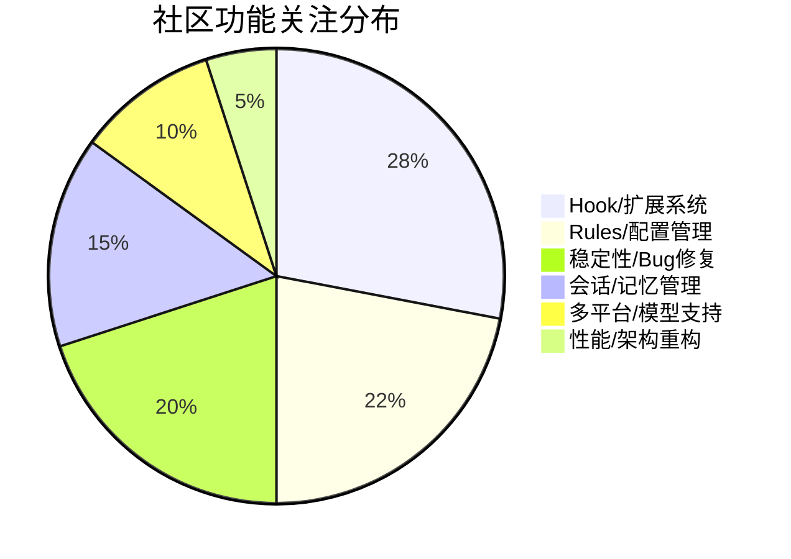

# AI CLI 工具社区动态日报 2026-04-08

> 生成时间: 2026-04-08 00:13 UTC | 覆盖工具: 8 个

- [Claude Code](https://github.com/anthropics/claude-code)
- [OpenAI Codex](https://github.com/openai/codex)
- [Gemini CLI](https://github.com/google-gemini/gemini-cli)
- [GitHub Copilot CLI](https://github.com/github/copilot-cli)
- [Kimi Code CLI](https://github.com/MoonshotAI/kimi-cli)
- [OpenCode](https://github.com/anomalyco/opencode)
- [Pi](https://github.com/badlogic/pi-mono)
- [Qwen Code](https://github.com/QwenLM/qwen-code)
- [Claude Code Skills](https://github.com/anthropics/skills)

---

## 横向对比

# AI CLI 工具生态横向对比分析报告 | 2026-04-08

---

## 1. 生态全景

当前 AI CLI 工具生态呈现**"三超多强"格局**：Claude Code、OpenAI Codex、GitHub Copilot CLI 凭借大厂背书占据主流心智，但社区对**计费透明度、开源/自托管、终端原生体验**的诉求高度一致。Google Gemini CLI 和 Kimi CLI 正从"功能追赶"转向"质量基建"，而 OpenCode、Pi、Qwen Code 等新兴工具通过**多模型聚合、Claude 兼容生态、垂直场景优化**寻找差异化空间。整体技术栈加速向 **Rust/TypeScript** 迁移，MCP（Model Context Protocol）成为跨工具扩展标准，但实现成熟度参差不齐。

---

## 2. 各工具活跃度对比

| 工具 | 今日 Issues | 今日 PRs | 版本发布 | 核心动态 |
|:---|:---:|:---:|:---|:---|
| **Claude Code** | 8 条活跃（#38335 456评论） | 9 条开放 | v2.1.94 | Bedrock Mantle 支持、默认推理强度上调；Max 配额争议持续发酵 |
| **OpenAI Codex** | 10 条精选（#14593 464评论） | 10 条开放 | 5 个 alpha 版本（.13-.17） | 密集 Rust 迭代；TUI 启动延迟优化、MCP 服务器驱动引导进入评审 |
| **Gemini CLI** | 10 条精选 | 10 条开放 | v0.37.0-preview.2 | 6 项性能回归测试计划；Scheduler 内存泄漏修复 |
| **Copilot CLI** | 10 条精选（30+ 关闭） | 2 条开放 | v1.0.19→v1.0.21 | `copilot mcp` 命令正式发布；终端渲染稳定性大幅提升 |
| **Kimi CLI** | 11 条精选 | 10 条开放 | 无 | Hook 系统成焦点；Python→TypeScript 重构提案引发路线之争 |
| **OpenCode** | 10 条精选（50 更新） | 10 条开放 | 无 | 阿里云 Qwen 3.6 速率限制热议；语音模式、Kiro 支持开发中 |
| **Pi** | 10 条精选（41 更新） | 11 条开放 | 无 | Antigravity 兼容性紧急修复；GitHub Copilot 动态模型发现落地 |
| **Qwen Code** | 10 条精选 | 10 条开放 | v0.14.1→v0.14.2 | VS Code 白屏紧急修复；@chinesepowered 单日 6 PR |

> **活跃度指标**：Issues/PR 更新量 + 社区评论密度 + 版本发布频率

---

## 3. 共同关注的功能方向

| 功能方向 | 涉及工具 | 具体诉求 |
|:---|:---|:---|
| **计费透明度与成本控制** | Claude Code、OpenAI Codex、Kimi CLI、Qwen Code | Claude Max 配额异常消耗（#38335 456评论）；Codex Token 燃烧过快（#14593 464评论）；Qwen "百万 token 改一点代码" |
| **MCP 生态完善** | Claude Code、OpenAI Codex、Copilot CLI、Gemini CLI、Kimi CLI | 工具结果不可见（Claude #41361）；服务器驱动引导（Codex #17043）；`copilot mcp` 原生命令；MCP 资源订阅（OpenCode #20672） |
| **终端/TUI 体验优化** | 全部 8 个工具 | 启动延迟（Codex #17039）、鼠标捕获冲突（OpenCode #7926）、spinner 稳定性（Copilot）、SSH 渲染异常（Gemini #24202） |
| **会话与上下文管理** | Claude Code、OpenAI Codex、Gemini CLI、Kimi CLI、Qwen Code | 持久化/恢复（Gemini #22819）、跨会话状态隔离（Codex #16799）、三级 Rules 系统（Kimi #1747 对标 Claude） |
| **多模型/提供商支持** | OpenCode、Pi、Kimi CLI、Claude Code | 阿里云速率限制（OpenCode #21164）、OpenRouter 完整路由（Pi #2904）、Bedrock Mantle（Claude/Kimi） |
| **安全与权限精细化** | Claude Code、OpenAI Codex、Kimi CLI、Qwen Code | Secrets 防泄露（Claude #44868）、持久权限管理（Copilot #2505）、权限审批 Hook（Kimi #1751）、权限疲劳（Qwen #2946） |

---

## 4. 差异化定位分析

| 工具 | 功能侧重 | 目标用户 | 技术路线 |
|:---|:---|:---|:---|
| **Claude Code** | 深度工程工作流、Cowork 协作、企业合规 | 企业团队、专业开发者 | 闭源 Node.js，强 AWS/Azure/GCP 云集成 |
| **OpenAI Codex** | 极致编码速度、Rust 性能、实时协作 | 追求效率的极客、AI 原生开发者 | Rust 重写中，GPT-5.4 系列深度优化 |
| **Gemini CLI** | 性能工程化、内存安全、Google 生态 | 性能敏感型用户、Google Cloud 用户 | TypeScript/Bun，强调回归测试体系 |
| **Copilot CLI** | GitHub 原生集成、MCP 管理、企业可观测性 | GitHub 生态重度用户、企业开发者 | TypeScript，OTel 内置，VS Code 协同 |
| **Kimi CLI** | Hook 扩展系统、Claude 兼容、灵活配置 | 需要深度定制的开发者、迁移用户 | Python（争议中），Plugin/Hook 架构 |
| **OpenCode** | 多模型聚合、开源替代、语音/多模态 | Claude Code 迁移者、多模型策略用户 | TypeScript，Claude 生态兼容优先 |
| **Pi** | 扩展生态、多运行时、声明式配置 | 构建上层 Agent 框架的开发者 | Node.js/Deno 双运行时，CREAM 提案 |
| **Qwen Code** | 阿里云原生、中文优化、IDE 深度集成 | 国内开发者、阿里云用户 | TypeScript，VS Code/JetBrains 双插件 |

**关键分化点**：
- **封闭 vs 开放**：Claude/Codex 闭源但生态成熟；Kimi/OpenCode/Pi 探索开源/扩展路径
- **单一 vs 聚合**：Codex 绑定 OpenAI；OpenCode/Pi 主打"模型无关"
- **终端优先 vs IDE 优先**：Claude/Codex/Gemini 强化 TUI；Qwen 押注 IDE 插件体验

---

## 5. 社区热度与成熟度

### 🔥 高热度·高成熟度
| 工具 | 证据 | 阶段判断 |
|:---|:---|:---|
| **Claude Code** | #38335 456评论、#41447 开源呼声 PR 持续存活 | 成熟期，社区信任危机与商业封闭张力并存 |
| **OpenAI Codex** | 5 个 alpha/日、464 评论 Token 议题 | 快速迭代期，Rust 重构释放技术野心 |

### 🔥 高热度·快速上升
| 工具 | 证据 | 阶段判断 |
|:---|:---|:---|
| **Kimi CLI** | Hook 系统新功能即现 Bug、TS 重构路线之争 | 功能爆发期，架构债务与社区期待碰撞 |
| **OpenCode** | 50 Issues/PRs/日、Claude 兼容生态文档化 | 生态扩张期，差异化定位清晰 |
| **Qwen Code** | 紧急版本迭代、单日 6 PR 贡献者涌现 | 稳定性攻坚期，社区贡献活跃 |

### 🌱 质量基建期
| 工具 | 证据 | 阶段判断 |
|:---|:---|:---|
| **Gemini CLI** | 6 项性能回归测试计划、内存泄漏系统性修复 | 从功能交付转向工程质量 |
| **Copilot CLI** | 30+ Issues/日关闭、OTel/MCP 企业特性 | 微软工程化优势，响应速度突出 |
| **Pi** | CREAM 提案、动态模型发现、多运行时适配 | 架构探索期，面向开发者工具链定位 |

---

## 6. 值得关注的趋势信号

| 信号 | 来源 | 对开发者的参考价值 |
|:---|:---|:---|
| **MCP 成为事实标准，但实现碎片化** | Copilot `copilot mcp` 命令、Codex #17043、OpenCode #20672 | 构建跨工具扩展时，优先验证目标工具的 MCP 版本兼容性；关注 `resources/subscribe` 等高级特性支持度 |
| **"Claude 兼容性"成为迁移护城河** | OpenCode #12472、Kimi #1747、Pi 外部 Skill 加载 | 评估替代工具时，检查 `CLAUDE.md`、hooks、skills 完整支持度；社区生态迁移成本被低估 |
| **性能工程从"优化"转向"可测量"** | Gemini 6 项回归测试、Codex Rust 重写、Qwen 自适应 token 扩容 | 大模型 CLI 进入毫秒级优化阶段，关注工具的启动延迟、内存占用、上下文压缩策略的透明文档 |
| **计费焦虑驱动"本地/自托管"诉求** | Claude 开源呼声 #41447、Pi 本地模型支持 #2531、Qwen 成本投诉 | 生产环境部署前，验证工具的速率限制处理、自动退避、成本预估能力；预留本地模型降级路径 |
| **"Nix-like"声明式工作流兴起** | Pi #2908 CREAM 提案 | 团队规模化使用时，关注工具是否支持版本可控、可复现的工作空间配置，降低"模型漂移"风险 |
| **终端原生体验 vs 现代 TUI 的张力** | 全平台鼠标捕获、复制粘贴、多路复用器兼容议题 | 重度终端用户优先选择支持 `--no-mouse`、tmux/screen 检测、SSH 感知的工具 |

---

*报告基于 2026-04-08 各工具 GitHub 公开数据生成 | 适合技术选型、团队工具链规划、开源贡献策略参考*

---

## 各工具详细报告

<details>
<summary><strong>Claude Code</strong> — <a href="https://github.com/anthropics/claude-code">anthropics/claude-code</a></summary>

## Claude Code Skills 社区热点

> 数据来源: [anthropics/skills](https://github.com/anthropics/skills)

# Claude Code Skills 社区热点报告（2026-04-08）

---

## 1. 热门 Skills 排行

| 排名 | Skill | 功能概述 | 社区热点 | 状态 |
|:---|:---|:---|:---|:---|
| 1 | **[document-typography](https://github.com/anthropics/skills/pull/514)** | AI 生成文档的排版质量控制，解决孤行、寡行、编号错位等常见排版问题 | 被视为"每个 Claude 文档都需要的底层修复"，讨论聚焦于是否应作为内置功能而非独立 Skill | 🟡 Open |
| 2 | **[frontend-design](https://github.com/anthropics/skills/pull/210)** | 前端设计 Skill 的清晰度和可操作性改进 | 社区关注如何让设计指令在单轮对话中可执行，避免模糊指导 | 🟡 Open |
| 3 | **[skill-quality-analyzer](https://github.com/anthropics/skills/pull/83)** + [skill-security-analyzer](https://github.com/anthropics/skills/pull/83) | Skill 质量评估（结构、文档、示例、资源、可维护性）与安全审计的元 Skill | 元 Skill 概念受关注，讨论如何标准化 Skill 质量门槛 | 🟡 Open |
| 4 | **[ODT](https://github.com/anthropics/skills/pull/486)** | OpenDocument 文本创建、模板填充及 ODT→HTML 解析 | 填补 LibreOffice/OpenOffice 生态空白，企业文档工作流需求强烈 | 🟡 Open |
| 5 | **[testing-patterns](https://github.com/anthropics/skills/pull/723)** | 全栈测试模式：测试哲学、单元测试、React 组件测试、集成/E2E 测试 | 测试策略分层（Testing Trophy）的实践指导价值 | 🟡 Open |
| 6 | **[sensory](https://github.com/anthropics/skills/pull/806)** | 原生 macOS 自动化（AppleScript/osascript），替代截图式计算机操作 | 两阶段权限设计引发讨论：无权限基础功能 vs 辅助功能权限的完整控制 | 🟡 Open |
| 7 | **[ServiceNow](https://github.com/anthropics/skills/pull/568)** | 企业级 ServiceNow 平台助手，覆盖 ITSM/ITOM/ITAM/SecOps/SPM 等全模块 | 广度 vs 深度的权衡：单一 Skill 覆盖全平台是否过于臃肿 | 🟡 Open |
| 8 | **[shodh-memory](https://github.com/anthropics/skills/pull/154)** | AI 代理的持久化记忆系统，跨对话维护上下文 | 记忆触发时机与隐私边界的架构设计讨论 | 🟡 Open |

---

## 2. 社区需求趋势

| 方向 | 代表 Issue/PR | 核心诉求 |
|:---|:---|:---|
| **Skill 治理与信任机制** | [#492](https://github.com/anthropics/skills/issues/492) 安全边界滥用、[#412](https://github.com/anthropics/skills/issues/412) Agent 治理模式 | 社区 Skill 与官方 Skill 的命名空间隔离，防止信任边界混淆 |
| **企业级工作流集成** | [#228](https://github.com/anthropics/skills/issues/228) 组织级 Skill 共享、[#532](https://github.com/anthropics/skills/issues/532) SSO/企业认证支持 | 从个人工具向团队协作基础设施演进 |
| **Skill 质量与评估标准化** | [#202](https://github.com/anthropics/skills/issues/202) skill-creator 最佳实践、[#83](https://github.com/anthropics/skills/pull/83) 质量分析器 | 建立 Skill 的自动化评估体系和准入门槛 |
| **MCP 协议互通** | [#16](https://github.com/anthropics/skills/issues/16) Skills 作为 MCP | 将 Skill 能力暴露为标准 MCP 工具，实现跨平台复用 |
| **Bedrock/多云部署** | [#29](https://github.com/anthropics/skills/issues/29) | 脱离 Claude Code 原生环境，在 AWS 等企业基础设施中运行 |

---

## 3. 高潜力待合并 Skills

| Skill | 关键价值 | 合并障碍 | 预估落地 |
|:---|:---|:---|:---|
| **[document-typography](https://github.com/anthropics/skills/pull/514)** | 解决 AI 文档生成的普适性痛点 | 需评估是否应内置到 Claude 核心而非作为 Skill | 1-2 个月 |
| **[testing-patterns](https://github.com/anthropics/skills/pull/723)** | 测试领域知识系统化，填补技能空白 | 需与现有代码相关 Skill 协调范围边界 | 2-4 周 |
| **[sensory](https://github.com/anthropics/skills/pull/806)** | macOS 原生自动化的性能与可靠性优势 | 权限模型的安全审查 | 1-2 个月 |
| **[CONTRIBUTING.md](https://github.com/anthropics/skills/pull/509)** | 社区健康度从 25% 提升的关键基础设施 | 流程文档的标准化审阅 | 已就绪，待合并 |

**活跃修复类 PR**（技术债务清理）：
- [#541](https://github.com/anthropics/skills/pull/541) DOCX 书签 ID 冲突修复
- [#539](https://github.com/anthropics/skills/pull/539) / [#361](https://github.com/anthropics/skills/pull/361) YAML 特殊字符解析防护
- [#538](https://github.com/anthropics/skills/pull/538) PDF Skill 大小写敏感路径修复

---

## 4. Skills 生态洞察

> **核心诉求：从"个人效率工具"向"企业级可信任基础设施"演进** — 社区正推动 Skills 在组织共享、安全治理、质量标准化和多云部署四个维度上成熟，同时保持对排版、测试、自动化等垂直场景的深度打磨。

---

---

# Claude Code 社区动态日报 | 2026-04-08

---

## 1. 今日速览

Anthropic 今日发布 **v2.1.94**，重点扩展了 Amazon Bedrock 支持并上调默认推理强度；社区持续热议 **Claude Max 计划会话配额异常消耗** 问题（456 评论），同时 **开源 Claude Code** 的呼声在多个 PR 中持续发酵。

---

## 2. 版本发布

### v2.1.94（2026-04-08）
| 更新项 | 说明 |
|--------|------|
| **Amazon Bedrock + Mantle** | 新增 `CLAUDE_CODE_USE_MANTLE=1` 环境变量支持，通过 Mantle 层优化 Bedrock 调用 |
| **默认推理强度上调** | API Key、Bedrock/Vertex/Foundry、Team 及 Enterprise 用户默认 effort 从 medium 提升至 high（可通过 `/effort` 调整） |
| **Slack 集成优化** | 新增紧凑版 `Slacked #channel` 消息头，含 Claude 图标标识 |

🔗 [Release 详情](https://github.com/anthropics/claude-code/releases/tag/v2.1.94)

---

## 3. 社区热点 Issues

| # | 状态 | 标题 | 关键信息 | 社区反应 |
|---|------|------|---------|---------|
| [#38335](https://github.com/anthropics/claude-code/issues/38335) | 🔴 OPEN | **Claude Max 计划会话配额异常快速耗尽** | 3 月 23 日起 CLI 用户会话计数异常增长，疑似计费逻辑 Bug | **456 评论 / 356 👍**，Max 用户集体投诉，Anthropic 尚未官方回应 |
| [#24964](https://github.com/anthropics/claude-code/issues/24964) | 🟢 CLOSED | **Cowork 文件夹选择器限制过严** | 禁止选择 home 目录外文件夹、符号链接和 junction | **144 评论 / 186 👍**，企业用户工作流受阻，已修复 |
| [#42796](https://github.com/anthropics/claude-code/issues/42796) | 🟢 CLOSED | **2 月更新后模型复杂工程能力下降** | 代码重构质量滑坡、过度简化、忽略边界条件 | **116 评论 / 757 👍**，高赞技术反馈，模型团队已介入 |
| [#44910](https://github.com/anthropics/claude-code/issues/44910) | 🔴 OPEN | **AWS_BEARER_TOKEN_BEDROCK 认证在 2.1.92+ 失效** | 2.1.91→2.1.92 回归，企业 SSO 用户无法登录 | **9 评论 / 15 👍**，regression 标签，影响生产环境 |
| [#2805](https://github.com/anthropics/claude-code/issues/2805) | 🔴 OPEN | **Linux 系统持续生成 Windows 换行符** | 无视 CLAUDE.md 指令，导致脚本执行失败 | **31 评论 / 30 👍**，跨平台开发痛点，长期未解 |
| [#29214](https://github.com/anthropics/claude-code/issues/29214) | 🔴 OPEN | **Remote Control 权限提示绕过失效** | `--dangerously-skip-permissions` 后移动端仍弹窗 | **22 评论 / 54 👍**，远程工作流体验断裂 |
| [#41361](https://github.com/anthropics/claude-code/issues/41361) | 🔴 OPEN | **MCP 工具结果 2.1.88 后不可见** | `outputSchema` safeParse 守卫返回 null | **8 评论 / 6 👍**，MCP 生态关键 regression |
| [#36411](https://github.com/anthropics/claude-code/issues/36411) | 🔴 OPEN | **Telegram MCP 插件入站通知丢失** | 仅出站工作，inbound 消息未送达会话 | **12 评论 / 10 👍**，双向集成未完成 |
| [#43675](https://github.com/anthropics/claude-code/issues/43675) | 🟢 CLOSED | **~/.claude/ 目录未文档化** | 社区深度解析会话存储结构，呼吁官方文档 | **4 评论 / 5 👍**，安全审计需求推动 |
| [#44868](https://github.com/anthropics/claude-code/issues/44868) | 🔴 OPEN | **.env/.dev.vars 密钥通过工具泄露** | 无视 CLAUDE.md 禁令，grep/Read 工具暴露 secrets | **3 评论**，安全合规红线问题 |

---

## 4. 重要 PR 进展

| # | 状态 | 标题 | 核心内容 | 评估 |
|---|------|------|---------|------|
| [#44874](https://github.com/anthropics/claude-code/pull/44874) | 🟡 OPEN | **wmux-orchestrator 插件** | 多 Agent 任务编排，依赖感知并行执行 + 跨 Agent 一致性审查 | 企业级复杂任务分解方案 |
| [#44742](https://github.com/anthropics/claude-code/pull/44742) | 🟡 OPEN | **会话持久化诊断工具** | 修复 VS Code 扩展对话历史丢失（#12908 及 12+ 重复 issue） | 数据丢失 critical bug |
| [#41447](https://github.com/anthropics/claude-code/pull/41447) | 🟡 OPEN | **开源 Claude Code** | 社区呼声最高的 meta PR，关闭 #59 #456 #2846 等 | 象征意义大于实际，Anthropic 未回应 |
| [#41518](https://github.com/anthropics/claude-code/pull/41518) | 🟡 OPEN | **完整开源方案** | 从 source map 提取 1906 个 TS 文件，Bun 构建成功运行 | 技术可行性验证，法律风险存疑 |
| [#41611](https://github.com/anthropics/claude-code/pull/41611) | 🟡 OPEN | **补充缺失源码** | 同上，简化版 source map 提取 | 社区自建开源分支尝试 |
| [#44681](https://github.com/anthropics/claude-code/pull/44681) | 🟡 OPEN | **移除过时 exec 安全指引** | 清理文档中失效的安全建议 | 文档维护 |
| [#44676](https://github.com/anthropics/claude-code/pull/44676) | 🟡 OPEN | **plugin-dev 缺失清单补全** | 对齐 marketplace 元数据 | 插件生态完整性 |
| [#41938](https://github.com/anthropics/claude-code/pull/41938) | 🟡 OPEN | **DevContainer Linux/macOS 启动脚本** | 补齐仅 Windows PowerShell 的缺口 | 跨平台开发体验 |
| [#39148](https://github.com/anthropics/claude-code/pull/39148) | 🟡 OPEN | **preserve-session 插件** | 项目重命名/移动后保留会话历史，UUID 路径解耦 | 会话管理痛点方案 |
| [#1](https://github.com/anthropics/claude-code/pull/1) | 🟢 CLOSED | **创建 SECURITY.md** | 基础安全政策文档 | 合规基础 |

---

## 5. 功能需求趋势

基于 50 条活跃 Issue 分析，社区关注焦点：

| 方向 | 热度 | 典型诉求 |
|------|------|---------|
| **计费透明度** | 🔥🔥🔥🔥🔥 | Max 计划配额算法黑箱、促销积分异常扣除、API 与订阅额度混淆 |
| **开源/自托管** | 🔥🔥🔥🔥🔥 | 3 个活跃 PR 推动 source map 提取，长期 vendor lock-in 担忧 |
| **Cowork 稳定性** | 🔥🔥🔥🔥 | Windows 跨设备重命名崩溃、Hyper-V VM 休眠恢复、文件夹权限限制 |
| **MCP 生态完善** | 🔥🔥🔥🔥 | 工具结果不可见、Telegram 双向集成、插件开发文档缺失 |
| **远程控制体验** | 🔥🔥🔥 | iOS 推送通知、权限同步、移动端工作流 |
| **安全合规** | 🔥🔥🔥 | Secrets 防泄露、.claude/ 目录审计、沙箱权限细化 |
| **国际化/本地化** | 🔥🔥 | 越南语/葡萄牙语变音符号丢失、Unicode 输入问题 |

---

## 6. 开发者关注点

### 🔴 高频痛点
1. **会话配额信任危机** — #38335 成为史上最高评论 Issue，企业用户要求审计日志
2. **平台一致性鸿沟** — Windows 用户持续遭遇 Cowork/换行符/路径问题，二等公民感知
3. **MCP 工具链成熟度** — schema 验证、错误处理、调试可见性不足

### 🟡 新兴需求
- **Buddy 个性化** — 3 个相关 Issue/PR 关闭，社区已接受有限定制（颜色/名称）
- **DevContainer 完整支持** — 从 Windows-only 向跨平台补齐
- **source map 逆向工程** — 社区自发探索开源路径，反映官方沟通真空

### 💡 战略观察
> Anthropic 正通过 **Mantle 层** 强化云厂商合作（AWS Bedrock），同时 **上调默认推理强度** 可能加剧 Max 用户的配额焦虑。开源呼声与商业封闭的张力持续累积，#41447 等 PR 的存活状态是观察窗口。

---

*日报基于 GitHub 公开数据生成，不代表 Anthropic 官方立场。*

</details>

<details>
<summary><strong>OpenAI Codex</strong> — <a href="https://github.com/openai/codex">openai/codex</a></summary>

# OpenAI Codex 社区动态日报 | 2026-04-08

---

## 1. 今日速览

今日 Codex 社区活跃度极高，**5 个 Rust 版本连续发布**（v0.119.0-alpha.13 至 alpha.17），显示团队正在密集迭代 CLI 核心。社区最关注的 **Token 消耗过快问题**（#14593）持续发酵，464 条评论创近期纪录；同时 **TUI 启动延迟优化**（#17039）和 **MCP 服务器驱动式引导**（#17043）等关键 PR 进入评审阶段，预示着用户体验将迎来显著改善。

---

## 2. 版本发布

### Rust CLI 连续迭代：v0.119.0-alpha.13 ~ alpha.17
| 版本 | 发布时间 |
|:---|:---|
| rust-v0.119.0-alpha.17 | 过去24小时 |
| rust-v0.119.0-alpha.16 | 过去24小时 |
| rust-v0.119.0-alpha.15 | 过去24小时 |
| rust-v0.119.0-alpha.14 | 过去24小时 |
| rust-v0.119.0-alpha.13 | 过去24小时 |

> 注：发布说明较为简略，建议关注后续完整 Changelog。高频 alpha 发布通常意味着关键 Bug 修复或内部架构调整。

---

## 3. 社区热点 Issues（精选10项）

| # | 标题 | 状态 | 评论 | 👍 | 核心看点 |
|:---|:---|:---|:---:|:---:|:---|
| [#14593](https://github.com/openai/codex/issues/14593) | Burning tokens very fast | 🔴 OPEN | **464** | 172 | **社区最火议题**：Business 订阅用户反馈 Token 消耗异常迅速，疑似存在计费或模型调用效率问题。464 条评论显示大量用户共鸣，需官方紧急回应。 |
| [#10410](https://github.com/openai/codex/issues/10410) | Codex Desktop App: macOS Intel (x86_64) support | 🔴 OPEN | 165 | **243** | **高票功能请求**：Intel Mac 用户群体庞大，243 个 👍 为全站最高。Apple Silicon 独占策略引发遗留设备用户强烈不满。 |
| [#12764](https://github.com/openai/codex/issues/12764) | The codex cli giving: 401 unauthorized | 🔴 OPEN | 93 | 4 | **认证故障频发**：CLI 用户遭遇未授权错误，影响 CI/CD 和自动化场景。虽 👍 不多，但评论活跃显示阻断性问题。 |
| [#9224](https://github.com/openai/codex/issues/9224) | Codex Remote Control | 🔴 OPEN | 37 | **246** | **创新使用场景**：用户希望用手机 ChatGPT App 远程控制桌面 Codex CLI，246 👍 证明移动-桌面协同需求强烈。 |
| [#16231](https://github.com/openai/codex/issues/16231) | High CPU usage on macOS after updating Codex | 🔴 OPEN | 18 | 29 | **性能回归**：最新 VS Code 扩展（26.325.31654）导致 M5 Pro Mac 高负载发热，影响开发体验。 |
| [#13993](https://github.com/openai/codex/issues/13993) | Support standalone Windows installer | 🔴 OPEN | 17 | 56 | **企业部署障碍**：Microsoft Store 限制导致企业/离线环境无法安装，需传统 `.exe` 安装包。 |
| [#16904](https://github.com/openai/codex/issues/16904) | TUI return can leave stale busy spinner | 🔴 OPEN | 11 | 0 | **TUI 状态机 Bug**：子代理完成后 UI 状态未清理，Linux/tmux 用户受影响，反映终端交互稳定性问题。 |
| [#16553](https://github.com/openai/codex/issues/16553) | Codex becomes unresponsive on startup if `~/.ssh/config` is large | 🔴 OPEN | 5 | 1 | **边缘场景性能**：大型 SSH 配置解析阻塞启动，DevOps/运维用户典型痛点。 |
| [#17041](https://github.com/openai/codex/issues/17041) | Live codex cli session cannot continue on auth refresh | 🔴 OPEN | 4 | 0 | **企业认证断裂**：API 登录方式下 Token 刷新导致会话中断，严重影响长时间任务。 |
| [#16799](https://github.com/openai/codex/issues/16799) | Cross-project, cross-session state leak | 🟢 CLOSED | 4 | 0 | **安全修复**：已关闭！项目间指令状态泄漏被修复，涉及安全边界隔离。 |

---

## 4. 重要 PR 进展（精选10项）

| # | 标题 | 状态 | 核心功能/修复 |
|:---|:---|:---|:---|
| [#17039](https://github.com/openai/codex/pull/17039) | fix(tui): reduce startup and new-session latency | 🔵 OPEN | **TUI 启动加速**：异步获取账户/速率限制信息，消除启动阻塞；修复 `/status` 卡片的 stale 提示残留问题。 |
| [#17043](https://github.com/openai/codex/pull/17043) | [mcp] Support server-driven elicitations | 🔵 OPEN | **MCP 增强**：支持自定义 MCP 服务器的主动引导（elicitation），新增 RMCP 服务包装器保留 `_meta` 元数据。 |
| [#17057](https://github.com/openai/codex/pull/17057) | Attach WebRTC realtime starts to sideband websocket | 🔵 OPEN | **实时通信优化**：WebRTC 通话通过独立 WebSocket 建立，降低延迟并提升连接稳定性。 |
| [#17036](https://github.com/openai/codex/pull/17036) | feat: allow limited git writes in workspace sandbox | 🔵 OPEN | **沙盒权限精细化**：工作区写沙盒新增 `allow_limited_git_writes`，允许 Git 元数据更新但禁止修改配置/钩子。 |
| [#16949](https://github.com/openai/codex/pull/16949) | Use model metadata for Fast Mode status | 🔵 OPEN | **模型速度分层**：模型元数据新增速度层级字段，TUI 据此动态显示 Fast Mode 状态，解耦硬编码模型名。 |
| [#16736](https://github.com/openai/codex/pull/16736) | Move unified-exec sandbox launch to exec-server | 🔵 OPEN | **架构重构**：统一执行沙盒启动逻辑迁移至 exec-server，为远程执行奠定基础。 |
| [#17030](https://github.com/openai/codex/pull/17030) | codex: add exec-server managed-network follow-up | 🔵 OPEN | **远程网络管理**：exec-server 托管网络能力的后续 PR，明确支持/不支持的回调路径。 |
| [#16276](https://github.com/openai/codex/pull/16276) | [codex] add memory extensions | 🔵 OPEN | **记忆扩展**：新增记忆扩展机制（详情待 PR 描述补充），可能涉及跨会话上下文保持。 |
| [#17052](https://github.com/openai/codex/pull/17052) | Add regression tests for JsonSchema | 🔵 OPEN | **测试加固**：为 `JsonSchema` 工具输入解析添加 4 组回归测试，覆盖布尔模式强制、对象形状推断等边界。 |
| [#16937](https://github.com/openai/codex/pull/16937) | Surface remote startup exec approvals | 🔵 OPEN | **远程执行审批**：exec-server 远程启动审批流程打通，复用核心审批机制，新增冒烟测试覆盖。 |

---

## 5. 功能需求趋势

基于 50 条活跃 Issue 分析，社区关注焦点呈现四大方向：

| 趋势方向 | 代表 Issue | 热度指标 |
|:---|:---|:---:|
| **💰 计费透明度与成本控制** | #14593 (Token 消耗过快) | 464 评论，172 👍 |
| **🏢 企业/组织部署支持** | #13993 (Windows 独立安装包)、#10410 (Intel Mac) | 299 👍 合计 |
| **📱 跨设备协同与远程控制** | #9224 (手机远程控制桌面 CLI) | 246 👍 |
| **🔒 安全沙盒与权限精细化** | #17036 (Git 写权限控制)、#16799 (状态泄漏修复) | 持续迭代中 |
| **⚡ 性能与资源优化** | #16231 (CPU 过高)、#16857 (GPU 占用)、#17039 (启动延迟) | 多平台覆盖 |

> **新兴信号**：MCP（Model Context Protocol）生态整合需求上升，#17043 和 #11264 显示社区对 MCP 服务器自定义能力的期待。

---

## 6. 开发者关注点

### 🔴 高频痛点

| 痛点 | 典型场景 | 相关 Issue |
|:---|:---|:---|
| **Token/成本不可控** | 企业用户担心自动化脚本导致账单激增 | #14593, #8367 |
| **认证会话不稳定** | CI/CD、长时间任务中 Token 刷新失败 | #12764, #17041 |
| **平台支持碎片化** | Intel Mac、Windows 企业环境被排除 | #10410, #13993 |
| **TUI/终端状态异常** | 子代理、恢复会话后 UI 假死或信息残留 | #16904, #16421 |

### 🟡 能力期待

- **可编程钩子系统**：#16484、#16301 呼吁官方支持机器可读的事件表面（event surface），实现与 Claude Code 类似的自动审批流
- **会话导出与可观测性**：#2880（Markdown 导出）、#5781（日志可读化）反映文档化、审计需求
- **模型行为可控性**：#16548（子代理模型选择被覆盖）、#13867（模型输出格式污染）显示对 GPT-5.4 系列精细控制的需求

---

*日报生成时间：2026-04-08 | 数据来源：github.com/openai/codex*

</details>

<details>
<summary><strong>Gemini CLI</strong> — <a href="https://github.com/google-gemini/gemini-cli">google-gemini/gemini-cli</a></summary>

# Gemini CLI 社区动态日报 | 2026-04-08

---

## 1. 今日速览

今日 Gemini CLI 社区聚焦**性能优化与稳定性修复**：团队密集发布 6 项性能回归测试计划，同时修复了 Scheduler 内存泄漏、OAuth URL 截断等关键问题。v0.37.0-preview.2 补丁版本发布，解决了 shebang 兼容性问题。

---

## 2. 版本发布

### v0.37.0-preview.2
| 属性 | 内容 |
|:---|:---|
| 发布日期 | 2026-04-07 |
| 类型 | 补丁版本 |
| 核心修复 | 移除 shebang 中的 `-S` 参数，修复 Windows 与 BSD 系统执行失败问题 |

🔗 [Release 详情](https://github.com/google-gemini/gemini-cli/releases/tag/v0.37.0-preview.2)

> 背景：Node.js shebang `#!/usr/bin/env -S node --no-warnings` 中的 `-S` 标志在部分 Unix 系统上不被支持，导致 CLI 无法直接执行。

---

## 3. 社区热点 Issues（精选 10 项）

| # | Issue | 状态 | 关键度 | 核心看点 |
|:---|:---|:---|:---|:---|
| [#24863](https://github.com/google-gemini/gemini-cli/issues/24863) | Scheduler 内存泄漏：McpProgress 监听器未释放 | 🔴 CLOSED | **P0** | 社区成员 Anjaligarhwal 深入代码审查发现，每次调用 `scheduleAgentTools()` 创建的 Scheduler 实例会向全局 `coreEvents` 注册永久监听器，导致监听器累积。已提交修复 PR。 |
| [#22745](https://github.com/google-gemini/gemini-cli/issues/22745) | AST 感知文件读取评估 | 🟡 OPEN | **EPIC** | 核心维护者 gundermanc 主导的长期调研，探索通过 AST（抽象语法树）精准定位方法边界，减少 token 浪费和误读。关联 #22746，可能重塑代码库分析能力。 |
| [#23582](https://github.com/google-gemini/gemini-cli/issues/23582) | 子代理感知当前审批模式 | 🟡 OPEN | **架构** | 子代理缺乏对 Plan Mode/Auto-Edit Mode 的感知，导致策略引擎拦截与代理自身指令冲突。需统一指令与策略层。 |
| [#22819](https://github.com/google-gemini/gemini-cli/issues/22819) | 记忆路由：全局 vs 项目级 | 🟡 OPEN | **UX** | 定义记忆存储边界：用户偏好（`~/.gemini/`）与代码库特定知识（`.gemini/`）分离。直接影响个性化体验。 |
| [#24869](https://github.com/google-gemini/gemini-cli/issues/24869) | 内存回归测试 | 🟡 OPEN | **质量基建** | jacob314 提出针对大对话、恢复场景的记忆占用测试，防止原生对象引用泄漏。 |
| [#24864](https://github.com/google-gemini/gemini-cli/issues/24864) | 性能回归测试体系 | 🟡 OPEN | **质量基建** | 要求 mock 模型运行完整 CLI，跨平台测试，避免性能退化。 |
| [#24768](https://github.com/google-gemini/gemini-cli/issues/24868) | 非英语语言性能 | 🟡 OPEN | **国际化** | 验证亚洲语言对话场景性能不低于英语，暴露潜在编码/渲染瓶颈。 |
| [#24535](https://github.com/google-gemini/gemini-cli/issues/24535) | 会话恢复失败："Invalid session identifier" | 🔴 CLOSED | **稳定性** | 9 条评论的高互动 Issue，涉及 `--resume` 与 API Key 验证的竞态条件。 |
| [#24202](https://github.com/google-gemini/gemini-cli/issues/24202) | SSH 会话文本乱码 | 🟡 OPEN | **兼容性** | Windows SSH 到 gLinux 后 CLI 渲染异常，需检测 SSH 环境（关联 #24546）。 |
| [#23571](https://github.com/google-gemini/gemini-cli/issues/23571) | 模型随机生成临时脚本 | 🟡 OPEN | **工作流** | 限制 shell 执行后，模型分散创建编辑脚本，增加清理负担。需引导模型集中管理临时文件。 |

---

## 4. 重要 PR 进展（精选 10 项）

| # | PR | 状态 | 作者 | 功能/修复摘要 |
|:---|:---|:---|:---|:---|
| [#24870](https://github.com/google-gemini/gemini-cli/pull/24870) | 修复 Scheduler McpProgress 监听器泄漏 | 🟡 OPEN | Anjaligarhwal | 补全 #21006 修复，覆盖之前遗漏的泄漏点，确保 `dispose()` 可靠调用 |
| [#24862](https://github.com/google-gemini/gemini-cli/pull/24862) | 限制高容量组件内存增长 | 🟡 OPEN | spencer426 | 为 `AnsiOutput`、`SubagentProgressDisplay` 等设置最大保留行数，防止无界内存增长 |
| [#24861](https://github.com/google-gemini/gemini-cli/pull/24861) | Ctrl+G 替代 Ctrl+X 打开外部编辑器 | 🟡 OPEN | jacob314 | 顺应行业惯例（VS Code 等），原 Ctrl+X 保留提示迁移，IDE 调试命令移至 F4 |
| [#24859](https://github.com/google-gemini/gemini-cli/pull/24859) | 增加 EPT 大小标志并提升默认值 | 🟡 OPEN | devr0306 | 解决大上下文场景下的 token 限制问题 |
| [#24858](https://github.com/google-gemini/gemini-cli/pull/24858) | 修复工具执行时内容消失 | 🟡 OPEN | gundermanc | 修复 `topicUpdateNarration` 过度抑制导致诗歌/对话内容在工具执行后消失的 bug |
| [#24853](https://github.com/google-gemini/gemini-cli/pull/24853) | 保留终端 OAuth URL 完整性 | 🟡 OPEN | Aaxhirrr | **P1 优先级**：长 OAuth URL 在窄终端被截断，改为专用渲染路径确保登录流程可靠 |
| [#24763](https://github.com/google-gemini/gemini-cli/pull/24763) | 强化沙箱清理机制 | 🟡 OPEN | ehedlund | 用 `try...finally` 包裹所有进程执行路径，防止 sidecar 进程和临时文件泄漏 |
| [#24752](https://github.com/google-gemini/gemini-cli/pull/24752) | 解耦 ContextManager 与 Sidecar 架构 | 🟡 OPEN | joshualitt | 核心架构重构，解决 #24751 系列问题，提升模块可测试性 |
| [#24677](https://github.com/google-gemini/gemini-cli/pull/24677) | 优化紧凑模式工具输出格式 | 🟡 OPEN | jwhelangoog | 搜索/读取工具输出改为单行，提升信息密度，统一列表工具措辞 |
| [#20406](https://github.com/google-gemini/gemini-cli/pull/20406) | 大工具输出内存管理优化 | 🟡 OPEN | jacob314 | 超大 shell 输出直接落盘而非全量驻留内存，防止 V8 OOM |

---

## 5. 功能需求趋势

基于 50 条活跃 Issue 分析，社区关注焦点呈现四大方向：

| 趋势方向 | 热度 | 代表 Issue | 核心诉求 |
|:---|:---|:---|:---|
| **性能工程化** | 🔥🔥🔥🔥🔥 | #24864-#24869 系列 | 建立完整的性能回归测试体系，覆盖内存、滚动、长对话、多语言场景 |
| **内存安全** | 🔥🔥🔥🔥🔥 | #24863, #21006, #24862 | 消除 Scheduler、事件监听器、UI 组件的泄漏隐患 |
| **终端体验精细化** | 🔥🔥🔥🔥 | #24768, #24470, #24438, #24202 | 滚动流畅性、SSH 兼容、渲染边界处理 |
| **智能体架构演进** | 🔥🔥🔥🔥 | #22745, #23582, #22819, #24752 | AST 感知、记忆分层、子代理协调、Context 解耦 |

> 新兴信号：jacob314 单日创建 6 项性能测试 Issue，表明团队正从"功能交付"转向"质量基建"阶段。

---

## 6. 开发者关注点

### 🔴 高频痛点

| 问题 | 场景 | 社区声音 |
|:---|:---|:---|
| **SSH 环境检测缺失** | Windows → gLinux 远程开发 | "文本乱码导致完全无法使用" (#24202) |
| **OAuth 流程脆弱** | 窄终端登录 | URL 截断导致认证失败 (#24853) |
| **临时文件管理混乱** | 受限 shell 执行模式 | "清理工作区以提交干净代码时开销巨大" (#

</details>

<details>
<summary><strong>GitHub Copilot CLI</strong> — <a href="https://github.com/github/copilot-cli">github/copilot-cli</a></summary>

# GitHub Copilot CLI 社区动态日报 | 2026-04-08

---

## 1. 今日速览

GitHub Copilot CLI 今日密集发布 **v1.0.19 → v1.0.21** 三个版本，核心亮点是正式引入 **`copilot mcp` 命令** 管理 MCP 服务器，并大幅改进终端渲染稳定性（修复 spinner 卡顿、闪烁等问题）。社区 Issues 处理效率极高，过去24小时内 **30+ 条 Issue 被关闭**，但认证流程回归问题（#2494）仍需关注。

---

## 2. 版本发布

### v1.0.21（2026-04-07）
| 特性 | 说明 |
|:---|:---|
| **`copilot mcp` 命令** | 新增专用命令管理 MCP 服务器，标志 MCP 生态正式 CLI 化 |
| **Spinner 稳定性修复** | 长时异步 shell 命令执行时，spinner 不再"假死" |
| **企业登录优化** | GitHub Enterprise URL 输入支持键盘回车提交 |
| **UI 修复** | 斜杠命令选择器不再闪烁/跳动 |

### v1.0.20 / v1.0.20-1（2026-04-07）
| 特性 | 说明 |
|:---|:---|
| **OpenTelemetry 可观测性** | 新增 `copilot help monitoring` 主题，内置 OTel 配置指南与示例 |
| **后台任务感知** | Spinner 持续显示直至后台 agent 和 shell 命令完成，期间用户输入始终可用 |
| **Azure OpenAI 默认路由** | BYOK 场景默认使用 GA 版本无版本号 v1 路由 |

> 🔗 [Releases 页面](https://github.com/github/copilot-cli/releases)

---

## 3. 社区热点 Issues（精选10条）

| # | 状态 | 标题 | 重要性分析 | 社区反应 |
|:---|:---|:---|:---|:---|
| [#2494](https://github.com/github/copilot-cli/issues/2494) | 🔴 OPEN | Keychain 提示自动输入'y/N'（v1.0.16 回归） | **认证流程严重回归**：系统钥匙串不可用时，CLI 自动替用户输入而非等待确认，导致认证中断。影响企业/无 GUI 环境用户。 | 8 评论，0 👍，需紧急修复 |
| [#1748](https://github.com/github/copilot-cli/issues/1748) | ✅ CLOSED | 支持 MCP Sampling | MCP 核心能力补齐：Copilot Chat 已支持，CLI 此前缺失，现随 `copilot mcp` 命令同步落地。 | 3 评论，3 👍，功能闭环 |
| [#2446](https://github.com/github/copilot-cli/issues/2446) | ✅ CLOSED | `/resume` 不显示近期会话 | **会话管理关键修复**：`workspace.yaml` 缺失 git 上下文字段导致新会话不可见，根因已定位至 `initializeWorkspace()`。 | 3 评论，2 👍，影响工作流连续性 |
| [#2344](https://github.com/github/copilot-cli/issues/2344) | ✅ CLOSED | 终端原生复制功能被破坏 | **终端兼容性**：v1.0.15 引入的鼠标报告功能拦截了"选中即复制"行为，影响大量 Linux/终端用户习惯。 | 3 评论，7 👍，高投票关闭 |
| [#2499](https://github.com/github/copilot-cli/issues/2499) | ✅ CLOSED | `/copy` 命令失效+长回复截断 | 双重复合问题：复制功能损坏+渲染引擎对长内容处理缺陷，已随渲染层重构修复。 | 3 评论，0 👍 |
| [#2471](https://github.com/github/copilot-cli/issues/2471) | ✅ CLOSED | OTel 遥测支持（对标 Claude Code） | **企业可观测性**：明确对标 Claude Code 的 `CLAUDE_CODE_ENABLE_TELEMETRY`，v1.0.20 已部分落地。 | 2 评论，0 👍，企业用户关注 |
| [#2564](https://github.com/github/copilot-cli/issues/2564) | ✅ CLOSED | `model:` 参数是否实际控制模型选择 | **配置语义澄清**：`.agent.md` frontmatter 和 `task()` 的 `model` 参数实际行为与文档不符，需明确预期。 | 2 评论，0 👍 |
| [#1444](https://github.com/github/copilot-cli/issues/1444) | 🔴 OPEN | 空参数 bash 调用导致无限循环 | **稳定性风险**：模型对无效 bash 命令的容错机制缺失，可触发 5000+ 次重复调用直至进程被杀。 | 2 评论，0 👍，待修复 |
| [#2008](https://github.com/github/copilot-cli/issues/2008) | ✅ CLOSED | 请求：CAPIError 400 前自动压缩 | **长会话体验**：190+ 消息时上下文超限，建议前置自动 compact 而非报错后丢失工作。 | 2 评论，3 👍，架构层面优化 |
| [#2557](https://github.com/github/copilot-cli/issues/2557) | ✅ CLOSED | 双 Esc 取消操作无限挂起（v1.0.19） | **交互阻塞**：macOS 上取消信号处理异常，"Cancelling"状态永不结束，v1.0.20+ 已修复。 | 1 评论，0 👍，快速响应 |

---

## 4. 重要 PR 进展

| # | 状态 | 标题 | 功能/修复内容 |
|:---|:---|:---|:---|
| [#2565](https://github.com/github/copilot-cli/pull/2565) | 🟡 OPEN | 安装脚本防止 PATH 重复条目 | **安装体验**：重复运行安装器时，因 `command -v copilot` 需 shell 重启才能检测，导致 PATH 配置行重复追加。修复检测逻辑避免污染 shell profile。 |
| [#2556](https://github.com/github/copilot-cli/pull/2556) | 🟡 OPEN | Developer skill | **技能系统扩展**："Level up skills"——具体实现待披露，推测为开发者工作流技能模板或 agent 能力升级。 |

> 注：今日仅 2 条 PR 更新，团队重心在 Issue 清理与版本发布。

---

## 5. 功能需求趋势

基于 50 条活跃 Issue 提炼，社区关注方向呈 **四大集群**：

| 趋势方向 | 代表 Issue | 热度信号 |
|:---|:---|:---|
| **🔌 MCP 生态深化** | #1748（Sampling）、`copilot mcp` 命令发布 | 官方主推，从"支持"走向"原生管理" |
| **🔐 企业/认证体验** | #2494（Keychain 回归）、#2404（插件安装凭据）、#2437（SSO/EMU） | 企业部署 blocker 集中爆发 |
| **🖥️ 终端原生兼容性** | #2344/#2472（复制选中）、#2384（alt-screen 移除）、#2406（BOM 字符） | 终端用户习惯 vs 新渲染引擎的摩擦 |
| **📊 可观测性与控制** | #2471（OTel）、#2505（持久权限）、#2008（自动压缩） | 生产环境治理需求上升 |

**新兴信号**：本地模型支持（#2531 Ollama/LM Studio）被提出，但官方暂无回应，社区自托管诉求初现。

---

## 6. 开发者关注点

### 🔴 高频痛点（需官方响应）

| 痛点 | 典型反馈 | 影响面 |
|:---|:---|:---|
| **认证流程脆弱性** | "升级后自动输入 y/N，无法干预"（#2494） | 企业 CI/无头环境阻塞 |
| **终端习惯冲突** | "选中即复制被鼠标报告破坏"（#2344） | Linux/资深终端用户 |
| **取消操作不可靠** | "Cancelling 永远挂起"（#2557，已修）、"双 Esc 无效" | 交互安全感缺失 |

### 🟡 能力缺口（功能请求）

| 需求 | 场景 | 优先级暗示 |
|:---|:---|:---|
| **持久权限管理** | 避免 `/allow-all` 过度授权，按目录/应用粒度持久化（#2505） | 安全合规刚需 |
| **本地模型后端** | Ollama/llama.cpp 接入，降低延迟与成本（#2531） | 隐私敏感/离线场景 |
| **富命令发现** | 新手友好：描述、分类、搜索 `/fleet` `/delegate` 等隐藏功能（#2489） | 用户增长策略 |

### 🟢 已验证的积极反馈

- **OTel 集成**：企业用户明确认可 v1.0.20 的监控能力（#2471 关闭）
- **MCP 管理**：`copilot mcp` 命令发布回应了 #1748 等长期诉求

---

*日报生成时间：2026-04-08 | 数据来源：github.com/github/copilot-cli*

</details>

<details>
<summary><strong>Kimi Code CLI</strong> — <a href="https://github.com/MoonshotAI/kimi-cli">MoonshotAI/kimi-cli</a></summary>

# Kimi Code CLI 社区动态日报 | 2026-04-08

## 今日速览

今日社区活跃度极高，**Hook 系统**成为焦点——既有生命周期 Hook 的功能请求，也有 `UserPromptSubmit` 事件传空值的紧急 Bug 修复。同时，**TypeScript 重构提案**引发广泛讨论，社区对 Python 版本的性能瓶颈表达强烈关切。文件引用（@mention）和 MCP 连接稳定性问题持续发酵。

---

## 版本发布

**无新版本发布**

---

## 社区热点 Issues

| # | 标题 | 状态 | 重要性 | 社区反应 |
|---|------|------|--------|----------|
| [#1344](https://github.com/MoonshotAI/kimi-cli/issues/1344) | API Error 400: Invalid request Error | 🔴 OPEN | **高** | 21 条评论，跨版本（1.14.0-2.1.23）复现，疑似服务端兼容性问题 |
| [#778](https://github.com/MoonshotAI/kimi-cli/issues/778) | API Error 400（同类型） | 🔴 OPEN | **高** | 与 #1344 同源，Win11/PowerShell 环境集中爆发，需官方定位 |
| [#1779](https://github.com/MoonshotAI/kimi-cli/issues/1779) | UserPromptSubmit hook 发送空 prompt 字段 | 🔴 OPEN | **高** | 新上报 Hook 功能缺陷，影响外部工具集成（如 vibe-islands） |
| [#1375](https://github.com/MoonshotAI/kimi-cli/issues/1375) | @ 文件引用无法找到文件 | ✅ CLOSED | 中 | 1.18.0 回归问题，已通过 [#1588](https://github.com/MoonshotAI/kimi-cli/pull/1588) 修复，采用 `git ls-files` 优化大仓库遍历 |
| [#1774](https://github.com/MoonshotAI/kimi-cli/issues/1774) | @mention 文件路径错误（~ 目录） | 🔴 OPEN | 中 | macOS 特定路径展开问题，与 #1375 修复后仍存边缘 case |
| [#1785](https://github.com/MoonshotAI/kimi-cli/issues/1785) | Streamable HTTP MCP 连接报错：字段重复 | 🔴 OPEN | 中 | MCP 协议解析错误，结构化内容处理需加固 |
| [#1775](https://github.com/MoonshotAI/kimi-cli/issues/1775) | LLM provider 连接错误 | 🔴 OPEN | 中 | Win11 环境网络层问题，需更多诊断信息 |
| [#1773](https://github.com/MoonshotAI/kimi-cli/issues/1773) | 400 错误：function name is invalid | ✅ CLOSED | 中 | 1.30.0 函数调用命名问题，快速修复 |
| [#1747](https://github.com/MoonshotAI/kimi-cli/issues/1747) | 三级 Rules 系统（对标 Claude Code） | 🔴 OPEN | **高** | 功能对标请求，全局/用户/项目三层规则管理，社区强烈期待 |
| [#1783](https://github.com/MoonshotAI/kimi-cli/issues/1783) | 添加 /delete 命令删除 Session | 🔴 OPEN | 低 | 会话管理体验优化，手动删目录体验差 |
| [#1782](https://github.com/MoonshotAI/kimi-cli/issues/1782) | 记忆持久化/工作现场恢复 | 🔴 OPEN | **高** | 长对话上下文管理痛点，用户需要"检查点"机制 |

---

## 重要 PR 进展

| # | 标题 | 状态 | 核心内容 |
|---|------|------|----------|
| [#1707](https://github.com/MoonshotAI/kimi-cli/pull/1707) | 重构：Python → Bun + TypeScript + React Ink | 🔵 OPEN | **争议性提案**：32k 行 TS 完整重写，声称解决 Python 性能瓶颈，社区分歧大 |
| [#1784](https://github.com/MoonshotAI/kimi-cli/pull/1784) | 添加 AWS Bedrock Mantle 平台支持 | 🔵 OPEN | 扩展 `/login` 流程，支持 OpenAI 兼容的 AWS 托管模型 |
| [#1781](https://github.com/MoonshotAI/kimi-cli/pull/1781) | 修复 UserPromptSubmit hook 空 prompt 问题 | 🔵 OPEN | 紧急修复 #1779，`list[ContentPart]` 类型未正确处理 |
| [#1780](https://github.com/MoonshotAI/kimi-cli/pull/1780) | 优雅处理 MCP 连接失败 | 🔵 OPEN | 修复 #1766，防止 MCP 异常崩溃 worker 进程 |
| [#1715](https://github.com/MoonshotAI/kimi-cli/pull/1715) | Claude 兼容本地插件支持 | 🔵 OPEN | 通过 `--plugin-dir` 加载 Claude 插件，生态互操作突破 |
| [#1777](https://github.com/MoonshotAI/kimi-cli/pull/1777) | 三级 Rules 系统实现 | 🔵 OPEN | 对应 #1747 功能请求，Claude Code 对标实现 |
| [#1751](https://github.com/MoonshotAI/kimi-cli/pull/1751) | PermissionRequest Hook 外部审批 | 🔵 OPEN | 工具调用前暂停等待外部系统批准，企业场景关键能力 |
| [#1622](https://github.com/MoonshotAI/kimi-cli/pull/1622) | CWD 被删除时优雅退出 | 🔵 OPEN | 外部存储断开等边缘场景，防无限错误级联 |
| [#1588](https://github.com/MoonshotAI/kimi-cli/pull/1588) | 大仓库 @mention 改用 git ls-files | ✅ CLOSED | 解决 65k+ 文件仓库遍历性能问题，已合并 |
| [#1743](https://github.com/MoonshotAI/kimi-cli/pull/1743) | /btw 边问边答命令 | ✅ CLOSED | 不中断主对话的轻量查询，双层级渲染交互创新 |

---

## 功能需求趋势



**Top 3 趋势：**

1. **Hook 生态扩展** — 生命周期 Hook、权限审批 Hook、外部监控集成（vibe-islands 等），社区希望将 Kimi CLI 嵌入更复杂的工作流
2. **Rules 系统标准化** — 明确对标 Claude Code 的三级规则，项目级 `.kimi/rules` 需求迫切
3. **会话可管理性** — 删除、归档、检查点、跨设备恢复，长周期开发场景的基础设施

---

## 开发者关注点

| 痛点类别 | 具体表现 | 影响程度 |
|---------|---------|---------|
| **API 稳定性** | 400 Invalid request 跨版本蔓延 | 🔴 阻塞使用 |
| **Hook 可靠性** | 新功能（1.30.0 Hook 系统）即现空值 Bug | 🟡 信任损耗 |
| **大仓库性能** | 文件遍历、@mention 响应慢 | 🟡 体验降级 |
| **MCP 健壮性** | 连接失败、字段解析错误频发 | 🟡 生态扩展受阻 |
| **架构争议** | #1707 TS 重构提案引发"重写 vs 迭代"路线之争 | 🟢 长期方向 |

**高频需求关键词：** `checkpoint` `session management` `Claude parity` `plugin ecosystem` `enterprise approval`

---

*日报基于 GitHub 公开数据生成，不代表 MoonshotAI 官方立场*

</details>

<details>
<summary><strong>OpenCode</strong> — <a href="https://github.com/anomalyco/opencode">anomalyco/opencode</a></summary>

# OpenCode 社区动态日报 | 2026-04-08

---

## 1. 今日速览

今日社区活跃度极高，**50 个 Issues 和 50 个 PR 在过去 24 小时内更新**。核心焦点集中在**阿里云 Qwen 3.6 模型的速率限制问题**（引发 29 条评论热议），以及**上下文管理、Claude Code 兼容性、TUI 体验优化**等长期需求。多个重要功能 PR 持续推进，包括语音模式、MCP 资源订阅和 Kiro 提供商支持。

---

## 2. 版本发布

**今日无新版本发布**

---

## 3. 社区热点 Issues

| 优先级 | Issue | 核心看点 |
|:---|:---|:---|
| 🔥 | **[#21164](https://github.com/anomalyco/opencode/issues/21164) Qwen 3.6 plus (free) 速率限制错误** | **今日最热话题**。阿里云 DashScope 的"请求速率增长过快"错误导致任务中断，用户急需可配置的请求速率限制或自动退避机制。29 评论、9 👍，已有关闭的衍生 Issue #21140 提出自动重试方案。 |
| ⭐ | **[#8140](https://github.com/anomalyco/opencode/issues/8140) 可配置上下文限制与自动压缩阈值** | **长期高赞需求**（35 👍）。当前自动压缩仅在上下文接近满时触发，用户希望提前触发以优化成本。1 月提出，昨日仍有更新，显示需求持续性。 |
| ⭐ | **[#12472](https://github.com/anomalyco/opencode/issues/12472) 原生 Claude Code hooks 兼容性** | OpenCode 已支持 `CLAUDE.md` 和 skills，但缺少 `PreToolUse`/`PostToolUse`/`Stop` hooks 系统，阻碍高级用户从 Claude Code 迁移。13 👍，社区期待完整兼容。 |
| ⚠️ | **[#16851](https://github.com/anomalyco/opencode/issues/16851) ChatGPT 账户无法使用 Codex** | `gpt-5.3-codex` 模型在 ChatGPT 账户下报错"不支持"，影响 Windows 用户。虽已关闭，但反映模型提供商策略变更带来的兼容性风险。 |
| ⚠️ | **[#17505](https://github.com/anomalyco/opencode/issues/17505) ACP session/update 通知时序问题** | 集成商反馈 `session/update` 在 `end_turn` 之后到达，导致 Fabriqa 等客户端显示不完整内容。影响 ACP 协议可靠性，需核心团队关注。 |
| ⭐ | **[#7926](https://github.com/anomalyco/opencode/issues/7926) TUI 鼠标捕获禁用选项** | **终端多路复用器用户痛点**。Zellij/tmux 用户无法正常使用鼠标选择和复制，15 👍 的高赞需求，昨日更新显示仍在推进。 |
| ⚠️ | **[#21034](https://github.com/anomalyco/opencode/issues/21034) Gemma-4-26b/31b 工具循环故障** | 即使 LM Studio 和 llama.cpp 已发布修复，Gemma 4 系列在 OpenCode 中仍出现工具调用失败。需排查 OpenCode 端的工具调用实现。 |
| 🔧 | **[#6506](https://github.com/anomalyco/opencode/issues/6506) 恢复 List Tool 以减少 grep/find 滥用** | 模型（尤其 glm-4.7）频繁使用 bash 工具搜索文件，用户尝试修改工具描述无效。反映工具设计对模型行为的引导不足。 |
| ⭐ | **[#21391](https://github.com/anomalyco/opencode/issues/21391) 桌面端 UX 体验糟糕** | **情绪化但真实的反馈**。用户激烈批评会话切换和新会话创建的交互设计，要求改为标签页模式。0 👍 但值得产品团队关注。 |
| 🔧 | **[#21372](https://github.com/anomalyco/opencode/issues/21372) 会话文件变更摘要未隔离** | 多会话并发时，文件变更摘要跨会话泄漏，显示所有会话的修改。数据隔离 bug，影响多任务工作流。 |

---

## 4. 重要 PR 进展

| 状态 | PR | 功能/修复内容 |
|:---|:---|:---|
| 🆕 | **[#21399](https://github.com/anomalyco/opencode/pull/21399) Context usage tool + New Session tool** | 新增上下文使用检查和新会话启动工具，支持自定义会话轮转策略，替代自动压缩。社区自定义工作流的重要补充。 |
| 🆕 | **[#21377](https://github.com/anomalyco/opencode/pull/21377) 添加 opencode-claude-commands 到生态文档** | 文档更新，推广社区插件 `.claude` 目录命令和 skills 支持，强化 Claude Code 兼容性生态。 |
| 🔄 | **[#20677](https://github.com/anomalyco/opencode/pull/20677) 语音模式：STT/TTS/连续模式/VAD/打断** | **重大功能**。完整的语音交互支持，包括麦克风按钮、录音、转录后端和语音合成。修复 #18226，开发中。 |
| 🔄 | **[#20676](https://github.com/anomalyco/opencode/pull/20676) Web 性能优化与配置驱动 UI 模式** | 新增 `webMode` 和 `webUrl` 配置，支持代理/直接前端交付，CDN 优化。修复 #4786。 |
| 🔄 | **[#20672](https://github.com/anomalyco/opencode/pull/20672) MCP 资源订阅支持** | 新增 MCP 资源订阅和模板支持，通过 SDK 客户端暴露订阅资源。修复 #12092，MCP 生态关键能力。 |
| 🔄 | **[#20491](https://github.com/anomalyco/opencode/pull/20491) 添加 Kiro (AWS CodeWhisperer) 提供商** | 新增 AWS Kiro 支持，采用 AWS Event Stream 二进制协议而非 SSE/JSON。修复 #9165，企业用户关注。 |
| 🔄 | **[#20309](https://github.com/anomalyco/opencode/pull/20309) 实验性下一步提示建议** | 助手响应后生成临时用户风格下一步建议，右箭头接受。不污染消息历史，支持拒绝。创新交互实验。 |
| 🔄 | **[#20939](https://github.com/anomalyco/opencode/pull/20939) 修复 skills.paths 插件配置读取** | 插件通过 `config()` hook 注册 skill 目录时，配置未被正确读取。修复插件系统集成问题。 |
| ✅ | **[#21244](https://github.com/anomalyco/opencode/pull/21244) 快照：统一补丁存储重构** | 将快照和文件元数据存储为统一补丁格式，减少存储冗余。VCS diff 保留独立 schema 供审查使用。 |
| ✅ | **[#21052](https://github.com/anomalyco/opencode/pull/21052) 工具系统重构：移除 Agent 上下文依赖** | 简化工具初始化，移除 `Tool.init()` 的 `agent` 参数，使工具行为更可预测。核心架构改进。 |

---

## 5. 功能需求趋势

基于今日 50 个 Issues 分析，社区关注方向按热度排序：

| 趋势方向 | 代表 Issues | 说明 |
|:---|:---|:---|
| **模型提供商稳定性** | #21164, #21140, #21034, #21354, #21214 | 阿里云速率限制、Gemma 4 兼容性、vLLM 支持、Ollama 本地模型集成——多提供商适配是核心痛点 |
| **上下文与成本优化** | #8140, #21399, #11995 | 可配置上下文限制、提前压缩、工具描述 token 优化——大模型成本敏感用户的刚需 |
| **Claude Code 生态兼容** | #12472, #21377 | hooks 系统、skills、命令完整兼容——迁移用户的核心诉求 |
| **TUI/终端体验** | #7926, #7755, #21315, #21397 | 鼠标捕获、tab 补全、粘贴内容显示、透明度——终端重度用户的精细体验需求 |
| **多智能体协调** | #19215, #20368 | DB 支持的并行子智能体、消息传递、内存共享——高级用户探索的方向 |
| **桌面/Web UX** | #21391, #21364, #19029 | 会话管理、代理选择器、标题栏控制——产品化体验争议较大 |

---

## 6. 开发者关注点

### 高频痛点

| 类别 | 具体问题 | 影响 |
|:---|:---|:---|
| **提供商速率限制** | 阿里云 DashScope 无自动退避，任务直接失败 | 生产环境可靠性风险 |
| **工具系统行为不可控** | 模型滥用 bash/grep，修改工具描述无效 | 效率低下、安全风险 |
| **会话/上下文管理** | 多会话数据泄漏、上下文压缩时机不可控 | 多任务工作流受阻 |
| **TUI 与终端生态冲突** | 鼠标捕获、复制粘贴、多路复用器兼容性 | 终端用户日常摩擦 |
| **协议时序问题** | ACP `session/update` 到达顺序错误 | 第三方集成困难 |

### 开发者建议优先级

1. **短期**：为阿里云等提供商添加自动退避重试机制（#21140 已有关闭方案，需评估是否足够）
2. **中期**：开放上下文限制和压缩阈值的配置接口（#8140 高赞长期需求）
3. **长期**：完善 Claude Code hooks 兼容性，降低迁移门槛（#12472）

---

*日报基于 GitHub 公开数据生成，链接指向 `anomalyco/opencode` 仓库。*

</details>

<details>
<summary><strong>Pi</strong> — <a href="https://github.com/badlogic/pi-mono">badlogic/pi-mono</a></summary>

# Pi 社区动态日报 | 2026-04-08

## 今日速览

今日 Pi 社区活跃度极高，共处理 41 个 Issues 和 11 个 PR，核心聚焦于 **Antigravity 模型兼容性紧急修复**、**多模型提供商生态扩展**（GitHub Copilot 动态发现、OpenRouter 完整路由支持）以及 **TUI/终端体验优化**。开发者对结构化输出、持久化配置和团队级可复现工作流的需求显著增长。

---

## 社区热点 Issues

| # | 标题 | 状态 | 关键价值 | 链接 |
|---|------|------|---------|------|
| **2815** | Antigravity 版本不再受支持 | 🔴 OPEN | **阻断性 Bug**：Google Gemini CLI 的 Antigravity 功能因 User-Agent 版本过旧被服务端拒绝，影响所有使用该模型的用户。社区已有 PR #2901 尝试修复。 | [Issue](https://github.com/badlogic/pi-mono/issues/2815) |
| **2923** | 新增 DocumentContent 类型支持原生 PDF/文件输入 | ✅ CLOSED | **多模态里程碑**：统一 Anthropic、OpenAI、Google 三家主流 API 的文档输入格式，为 Pi 原生处理 PDF 奠定基础。 | [Issue](https://github.com/badlogic/pi-mono/issues/2923) |
| **2909** | Find/Grep 工具默认禁用但与提示词引用矛盾 | ✅ CLOSED | **UX 不一致**：默认提示词推荐 find/grep，但工具默认关闭且无持久化启用机制，造成新手困惑。 | [Issue](https://github.com/badlogic/pi-mono/issues/2909) |
| **2925** | Bedrock 自适应思考与提示缓存不支持应用推理配置文件 | ✅ CLOSED | **企业级 AWS 场景**：应用推理配置文件 ARN 不包含模型名称，导致功能检测失效，影响生产环境 EC2/IAM 部署。 | [Issue](https://github.com/badlogic/pi-mono/issues/2925) |
| **2927** | 同名 API 格式的自定义 Provider 互相覆盖 | ✅ CLOSED | **扩展性缺陷**：多个扩展注册相同 API 格式（如 openai-completions）时，后加载者覆盖前者，阻碍生态繁荣。 | [Issue](https://github.com/badlogic/pi-mono/issues/2927) |
| **2920** | GitHub Copilot 模型列表应动态获取而非静态硬编码 | ✅ CLOSED | **模型发现现代化**：当前构建时硬编码导致新模型（如 goldeneye、claude-opus-4.6-1m）无法即时可用。 | [Issue](https://github.com/badlogic/pi-mono/issues/2920) |
| **2924** | 新增 window_focus/window_blur 扩展事件 | ✅ CLOSED | **交互增强**：允许扩展感知终端焦点状态，适用于后台任务暂停/恢复等场景。 | [Issue](https://github.com/badlogic/pi-mono/issues/2924) |
| **2919** | pinet-start 应在 Agent 重载后保持连接 | ✅ CLOSED | **持久化体验**：每次 `/reload` 后需手动重连 pinet，打断开发流，需会话级状态保持。 | [Issue](https://github.com/badlogic/pi-mono/issues/2919) |
| **2908** | CREAM：面向新用户的引导式工作流与团队级可复现配置 | ✅ CLOSED | **规模化治理提案**：类似 Nix 的声明式工作空间，解决团队协作中的"代码混沌"（模型不一致、扩展版本漂移）。 | [Issue](https://github.com/badlogic/pi-mono/issues/2908) |
| **2911** | 重叠 Compaction 导致 AbortController 竞态错误 | ✅ CLOSED | **稳定性修复**：并发压缩任务时 `signal` 未定义错误，虽显示成功但实际失败，有 PR #2910 修复。 | [Issue](https://github.com/badlogic/pi-mono/issues/2911) |

---

## 重要 PR 进展

| # | 标题 | 状态 | 技术要点 | 链接 |
|---|------|------|---------|------|
| **2901** | 升级 Antigravity User-Agent 版本 | 🟡 OPEN | 紧急修复 #2815，更新 `google-gemini-cli` provider 的 UA 标识以恢复服务兼容性。 | [PR](https://github.com/badlogic/pi-mono/pull/2901) |
| **2904** | OpenRouter 路由配置补全全部字段 | 🟡 OPEN | 类型安全增强：将 `provider` 对象透传至 OpenRouter API，补全 `quantization`、`sort` 等运行时有效但缺失 TS 定义的字段。 | [PR](https://github.com/badlogic/pi-mono/pull/2904) |
| **2903** | Google Provider 支持 Gemma 4 思考级别 | 🟡 OPEN | 模型适配：处理 Gemma 4 的 `MINIMAL`/`HIGH` 思考级别映射，解决 #2812 中 `low` 级别路由策略待定问题。 | [PR](https://github.com/badlogic/pi-mono/pull/2903) |
| **2910** | 修复重叠 Compaction 的 AbortController 竞态 | ✅ CLOSED | 并发安全：为手动/自动压缩分别绑定独立 AbortController，避免共享状态污染，含回归测试。 | [PR](https://github.com/badlogic/pi-mono/pull/2910) |
| **2915** | 修正 Sandbox 扩展配置路径文档 | ✅ CLOSED | 文档勘误：全局配置实际路径为 `~/.pi/agent/extensions/sandbox.json` 而非 `~/.pi/agent/sandbox.json`。 | [PR](https://github.com/badlogic/pi-mono/pull/2915) |
| **2913** | 外部 Skill 加载容错 malformed frontmatter | ✅ CLOSED | 健壮性提升：从 `~/.claude/skills` 等外部目录加载时，YAML 解析失败不再导致整个 Skill 被丢弃。 | [PR](https://github.com/badlogic/pi-mono/pull/2913) |
| **2890** | 动态发现 GitHub Copilot 模型 | ✅ CLOSED | 运行时模型发现：登录时通过 `/models` 单请求获取用户实际可用模型，替代构建时硬编码列表。 | [PR](https://github.com/badlogic/pi-mono/pull/2890) |
| **2889** | 工具 Schema 兼容 Cloud Code Assist | ✅ CLOSED | 供应商适配：将 `anyOf`/`const` 转换为 OpenAPI 3.0.3 兼容格式，解决 Google Cloud Code Assist (Antigravity) 的 Schema 验证失败。 | [PR](https://github.com/badlogic/pi-mono/pull/2889) |
| **2895** | Anthropic 流式解析改用 messages.create | ✅ CLOSED | 稳定性修复：`messages.stream()` 的 `partialParse` 在畸形 JSON 时抛出未捕获异常，改为 `create` + 手动流处理。 | [PR](https://github.com/badlogic/pi-mono/pull/2895) |
| **2135** | Anthropic 上下文长度提升至 1M | ✅ CLOSED | 模型能力跟进：Claude 3.7 Sonnet 等模型上下文窗口已扩展，同步更新配置。 | [PR](https://github.com/badlogic/pi-mono/pull/2135) |

---

## 功能需求趋势

基于今日 41 个 Issues 分析，社区关注焦点呈现三大方向：

| 趋势领域 | 代表性需求 | 热度 |
|---------|-----------|------|
| **🤖 多模型生态治理** | 动态模型发现（Copilot #2920）、自定义 Provider 隔离（#2927）、模型能力查询 API（#2922）、OpenRouter 完整路由（#2904） | 🔥🔥🔥 |
| **🏢 企业/团队级部署** | CREAM 可复现工作流（#2908）、Bedrock IAM/IMDS 认证（#2880, #2925）、设置持久化（#2919）、插件分组配置（#2918） | 🔥🔥🔥 |
| **🖥️ TUI/终端体验打磨** | 窗口焦点事件（#2924）、Find/Grep 工具默认启用（#2909）、Backspace 修复（#2733）、宽字符边界处理（#2872） | 🔥🔥 |
| **📄 多模态输入** | 原生 PDF/文档支持（#2923） | 🔥🔥 |
| **⚡ 稳定性与性能** | Compaction 竞态修复（#2910, #2911）、Tool JSON 解析容错（#2882）、大规模仓库自动补全优化（#2784） | 🔥🔥 |

---

## 开发者关注点

### 🔴 高频痛点

| 问题 | 影响面 | 社区诉求 |
|-----|--------|---------|
| **Antigravity 服务兼容性** | 所有 Google Gemini CLI 用户 | 紧急修复 UA 版本（PR #2901 待合并） |
| **配置持久化断层** | 重度 TUI 用户 | `/reload` 后 pinet、工具启用状态丢失 |
| **扩展生态冲突** | 多扩展开发者 | 同名 API Provider 隔离机制缺失 |
| **企业 AWS 场景适配** | EC2/IMDS 部署用户 | Bedrock 认证链、推理配置文件支持不完善 |

### 💡 新兴需求模式

- **"Nix-like" 声明式配置**：#2908 提出的 CREAM 方案引发共鸣，反映团队规模化使用 Pi 时对**可复现、可版本控制、可审计**工作流的强烈需求
- **SDK 级可编程性**：多个 Issue（#2912 自定义 Session ID、#2922 模型能力查询）显示开发者正基于 Pi 构建上层 Agent 框架，需要更底层的 API 暴露
- **跨运行时兼容性**：Deno 支持（#2885）、Cloud Code Assist 适配（#2889）表明 Pi 正从 Node.js 专属工具向**多运行时基础设施**演进

</details>

<details>
<summary><strong>Qwen Code</strong> — <a href="https://github.com/QwenLM/qwen-code">QwenLM/qwen-code</a></summary>

# Qwen Code 社区动态日报 | 2026-04-08

## 今日速览

今日社区活跃度极高，Qwen Code 紧急发布 **v0.14.1** 修复 VS Code 扩展白屏问题，同时社区围绕**权限管理过于频繁**、**上下文性能优化**和**IDE 集成稳定性**三大痛点展开密集讨论。开发者 @chinesepowered 单日贡献 6 个高质量修复 PR，成为今日最活跃贡献者。

---

## 版本发布

### v0.14.1 / v0.14.1-preview.0
🔗 [Release 页面](https://github.com/QwenLM/qwen-code/releases)

| 更新类型 | 内容 |
|---------|------|
| 🐛 Bug 修复 | 修复 hooks 中 abort listener 内存泄漏（#2841） |
| 🐛 Bug 修复 | 修复 CLI 中 AI 响应未提交就添加 hook 系统消息的问题（#2848） |

> ⚠️ 该版本发布后引发 **VS Code 扩展白屏问题**（#2956），已通过 PR #2959 修复并发布 v0.14.2。

---

## 社区热点 Issues（精选 10 条）

| # | 标题 | 状态 | 评论 | 关键看点 |
|---|------|------|------|---------|
| [#1922](https://github.com/QwenLM/qwen-code/issues/1922) | Edit 工具无法编辑文件（回归 Bug） | 🔴 CLOSED | 11 | **高频回归问题**：v0.10.5 修复后又复现，反映版本稳定性管控需加强 |
| [#2605](https://github.com/QwenLM/qwen-code/issues/2605) | Windows CMD 支持剪贴板图片粘贴 | 🟢 OPEN | 10 | **跨平台体验缺口**：Windows 用户迫切需要的多模态输入能力 |
| [#2956](https://github.com/QwenLM/qwen-code/issues/2956) | VS Code 0.14.1 白屏 | 🔴 CLOSED | 8 | **紧急生产事故**：升级后 Qwen 面板完全不可用，影响面大 |
| [#93](https://github.com/QwenLM/qwen-code/issues/93) | AI 无故删除代码（严重幻觉） | 🔴 CLOSED | 6 | **信任危机**：用户对比 Cursor/Claude，质疑扣费与底层模型 |
| [#1937](https://github.com/QwenLM/qwen-code/issues/1937) | 百炼 Coding Plan 疯狂 edit 失败 | 🔴 CLOSED | 3 | **成本痛点**：小问题消耗数百万 token，工具调用效率低下 |
| [#2339](https://github.com/QwenLM/qwen-code/issues/2339) | Telegram Bot 模式 | 🟢 OPEN | 3 | **远程协作场景**：用户希望像使用 Telegram Bot 一样远程调用 |
| [#2951](https://github.com/QwenLM/qwen-code/issues/2951) | 支持全局 `.qwen` 目录自定义 | 🟢 OPEN | 2 | **云原生适配**：外挂磁盘场景下固定路径导致配置丢失 |
| [#2947](https://github.com/QwenLM/qwen-code/issues/2947) | 多模态模型无法直接读取 PDF | 🟢 OPEN | 1 | **文档处理瓶颈**：read_file 不支持 PDF，需额外安装 skills |
| [#2946](https://github.com/QwenLM/qwen-code/issues/2946) | 调研时频繁询问权限 | 🟢 OPEN | 1 | **工作流打断**：权限请求过于频繁，无法自主完成复杂任务 |
| [#2786](https://github.com/QwenLM/qwen-code/issues/2786) | 思维链处理时无法紧急插入提示 | 🟢 OPEN | 1 | **交互体验**：用户无法及时纠正 AI 的错误方向 |

---

## 重要 PR 进展（精选 10 条）

| # | 标题 | 作者 | 核心能力 |
|---|------|------|---------|
| [#2932](https://github.com/QwenLM/qwen-code/pull/2932) | 增强 `/review`：确定性分析、自动修复与安全加固 | @wenshao | 对标 Copilot Code Review / Claude `/ultrareview`，4-Agent 并行架构升级 |
| [#2921](https://github.com/QwenLM/qwen-code/pull/2921) | 实现 `/plan` 计划模式命令 | @wenshao | 磁盘持久化计划文件 + 结构化系统提示 + 增强审批选项 |
| [#2949](https://github.com/QwenLM/qwen-code/pull/2949) | Skills 支持模型覆盖（frontmatter） | @tanzhenxin | Skill 可指定 `model: qwen-coder-plus`，灵活切换模型 |
| [#2923](https://github.com/QwenLM/qwen-code/pull/2923) | 可自定义状态栏 `/statusline` | @wenshao | 用户可配置 shell 命令显示上下文感知信息 |
| [#2959](https://github.com/QwenLM/qwen-code/pull/2959) | 修复 VS Code 0.14.1 白屏 | @yiliang114 | **紧急修复**：esbuild external 配置未覆盖深层子路径导入 |
| [#2971](https://github.com/QwenLM/qwen-code/pull/2971) | 修复 VS Code 自动补全误触发 | @chinesepowered | `cursorPosition=0` 被错误覆盖为 `text.length` |
| [#2970](https://github.com/QwenLM/qwen-code/pull/2970) | 微信图片 MIME 检测修复 | @chinesepowered | PNG 魔数签名仅检查 3 字节 → 完整 4 字节 |
| [#2969](https://github.com/QwenLM/qwen-code/pull/2969) | 统一文本缓冲区 offset-to-position 逻辑 | @chinesepowered | 修复行边界列越界问题 |
| [#2968](https://github.com/QwenLM/qwen-code/pull/2968) | LRU 缓存 falsy 值重排序修复 | @chinesepowered | `0/''/false/null` 缓存值不再跳过 MRU 更新 |
| [#2898](https://github.com/QwenLM/qwen-code/pull/2898) | 自适应输出 token 扩容（8K→64K） | @wenshao | 默认 8K 节省 GPU，截断时自动重试 64K，提升并发 4 倍 |

> 👏 **今日之星**：@chinesepowered 单日 6 个高质量修复 PR，覆盖 VS Code 集成、微信适配、核心缓存等关键模块。

---

## 功能需求趋势

基于 50 条活跃 Issue 分析，社区关注焦点呈 **三大梯队**：

```
第一梯队（高频痛点）
├── 🛡️ 权限管理优化 —— 减少重复授权，支持批量/持久化授权
├── ⚡ 上下文性能 —— 文件树位置优化、压缩策略、缓存机制
└── 🖥️ IDE 稳定性 —— VS Code/JetBrains 白屏、闪屏、滚动问题

第二梯队（体验增强）
├── 📎 多模态输入 —— 剪贴板图片、PDF 直接读取、文件拖拽
├── 🤖 远程/异步模式 —— Telegram Bot、Webhook 通知
└── ⚙️ 配置灵活性 —— 全局配置目录自定义、模型提供商持久化

第三梯队（工作流深度）
├── 📝 会话管理 —— 自动保存、历史回顾、计划模式
└── 🔍 代码审查 —— 对标 Claude/Copilot 的 /review 能力
```

---

## 开发者关注点

| 痛点类别 | 典型反馈 | 出现频次 |
|---------|---------|---------|
| **权限疲劳** | "每次对话要七八次权限，Codex/Claude 没这么频繁" | 🔥🔥🔥🔥🔥 |
| **Token 成本焦虑** | "改一点代码花几百万 token""免费额度几个问题就耗尽" | 🔥🔥🔥🔥🔥 |
| **幻觉与代码安全** | "AI 说看不到文件就胡乱删除代码""2k 行优化完剩 40 行" | 🔥🔥🔥🔥 |
| **IDE 集成质量** | "白屏""闪屏""无限滚动""无法拖拽滚动条" | 🔥🔥🔥🔥 |
| **跨平台一致性** | "Windows CMD 不支持图片粘贴""PowerShell 默认终端设置" | 🔥🔥🔥 |
| **上下文可控性** | "文件树放开头破坏缓存""希望像 Claude 不放文件树" | 🔥🔥🔥 |

> 💡 **建议方向**：短期优先解决权限批量化与 IDE 稳定性，中期优化上下文成本结构，长期建立与 Claude Code 的差异化竞争力（如更深入的阿里云生态集成）。

---

*日报生成时间：2026-04-08 | 数据来源：github.com/QwenLM/qwen-code*

</details>

---
*本日报由 [agents-radar](https://github.com/duanyytop/agents-radar) 自动生成。*