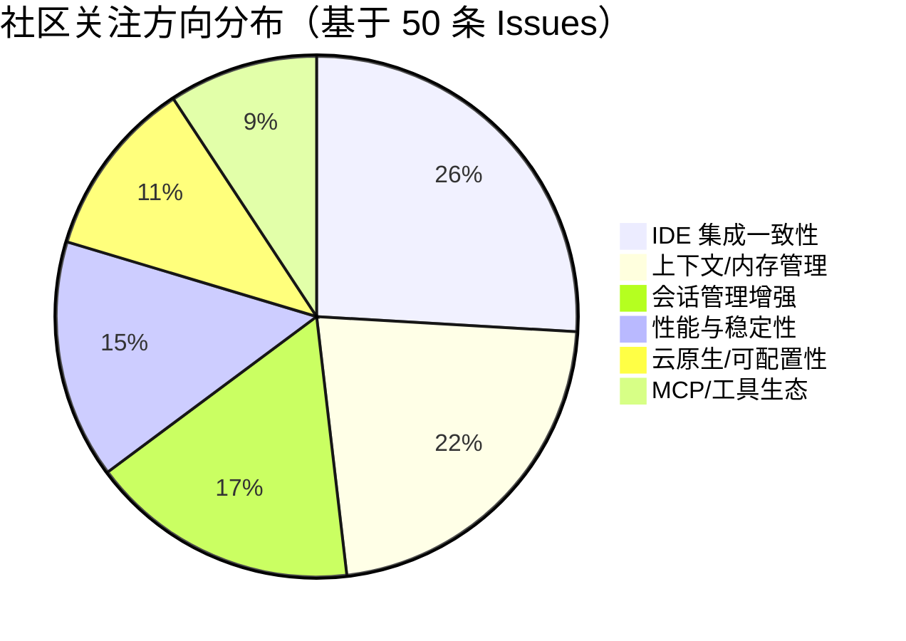

# AI CLI 工具社区动态日报 2026-04-09

> 生成时间: 2026-04-09 00:10 UTC | 覆盖工具: 8 个

- [Claude Code](https://github.com/anthropics/claude-code)
- [OpenAI Codex](https://github.com/openai/codex)
- [Gemini CLI](https://github.com/google-gemini/gemini-cli)
- [GitHub Copilot CLI](https://github.com/github/copilot-cli)
- [Kimi Code CLI](https://github.com/MoonshotAI/kimi-cli)
- [OpenCode](https://github.com/anomalyco/opencode)
- [Pi](https://github.com/badlogic/pi-mono)
- [Qwen Code](https://github.com/QwenLM/qwen-code)
- [Claude Code Skills](https://github.com/anthropics/skills)

---

## 横向对比

# 2026-04-09 AI CLI 工具生态横向对比分析报告

## 1. 生态全景

当前 AI CLI 工具已进入**功能深度打磨与生态壁垒构建**的第二阶段。Claude Code 凭借成熟度和企业渗透保持领先，但计费信任危机正在削弱优势；OpenAI Codex 以密集迭代追赶，Windows 平台债务成为最大短板；Google Gemini CLI 和国产工具（Kimi、Qwen）加速功能对标，TypeScript 重写、多层规则系统等激进提案涌现。行业整体呈现**"核心体验趋同、差异化在细节"**态势——会话管理、上下文压缩、MCP 生态成为共同战场，而语音交互、沙箱安全、IDE 集成深度开始分化竞争格局。

---

## 2. 各工具活跃度对比

| 工具 | 今日 Issues | 今日 PRs | 版本发布 | 关键动态 |
|:---|:---:|:---:|:---|:---|
| **Claude Code** | 10+ 热点 | 10+ | v2.1.97 | Focus View 模式、状态栏自动刷新；Max 套餐计费危机（478 评论） |
| **OpenAI Codex** | 10+ 热点 | 10+ | 6 个 Alpha 版本 | rust-v0.119.0-alpha.19~24 密集迭代；Token 消耗过快（491 评论） |
| **Gemini CLI** | 10+ 热点 | 10+ | v0.37.0 → v0.39.0-nightly | 3 版本连发，Hook 系统 UI 可视化；Windows 终端兼容性攻坚 |
| **GitHub Copilot CLI** | 10+ 热点 | 3 | v1.0.22-0 | 子代理深度限制；MCP 企业注册表 404 危机 |
| **Kimi Code CLI** | 9 热点 | 10+ | - | n-WN 单日 6 PR 打磨 Shell 交互；TypeScript 重写提案引发讨论 |
| **OpenCode** | 10+ 热点 | 10+ | v1.4.0 | SDK Breaking Changes（Diff 元数据精简）；语音模式、MCP 资源订阅开发中 |
| **Pi** | 37 Issues | 8 | v0.66.0/v0.66.1 | Anthropic 认证优化 + Earendil 彩蛋；模型注册表 UX 改进 |
| **Qwen Code** | 10+ 热点 | 10+ | v0.14.2 | VS Code 白屏紧急修复；v0.15.0 功能集（/branch、/statusline）推进 |

> **活跃度分层**：Claude Code/Codex/Gemini 为第一梯队（成熟高活跃）；Kimi/Qwen/OpenCode/Pi 为第二梯队（快速迭代期）；Copilot CLI 相对内敛（内部驱动为主）。

---

## 3. 共同关注的功能方向

| 功能方向 | 涉及工具 | 具体诉求与证据 |
|:---|:---|:---|
| **计费透明度与用量控制** | Claude Code、OpenAI Codex | Claude Max 套餐"会话异常耗尽"（#38335，478 评论）；Codex "Token 燃烧过快"（#14593，491 评论）。核心诉求：实时仪表盘、用量预警、可预测成本 |
| **Windows 平台体验补齐** | OpenAI Codex、Gemini CLI、OpenCode、Kimi | Codex "Store 限制企业部署"（#13993）；Gemini "箭头键失效"（#20675）；OpenCode "并行 shell 命令崩溃"（#21550）；Kimi "Ghostty TTY 冻结"（#1807）。Windows 开发者仍为"二等公民" |
| **会话管理与上下文压缩** | Claude Code、Qwen Code、Gemini CLI、OpenCode | Qwen P0 级"多层上下文压缩"（#3017）+ "Fork Subagent"（#3016）；Claude Code 社区插件 #26328（会话管理器）；Gemini "内存路由：全局 vs 项目级"（#22819）。长会话稳定性成为架构级挑战 |
| **MCP/工具生态治理** | GitHub Copilot CLI、OpenCode、Qwen Code、Claude Code | Copilot "MCP 注册表 404 拦截所有服务器"（#2498）；OpenCode "MCP 资源订阅"（#20672）；Qwen "VS Code MCP 不工作"（#3033）；Claude Code "MCP 环境变量传递"（#11927）。工具发现、授权、配置碎片化 |
| **TUI 体验与可观测性** | Claude Code、Gemini CLI、Kimi、Pi | Claude "始终显示思考过程"（#8477，195 👍）；Gemini "Hook 系统 UI 可视化"（v0.39.0）；Kimi "斜杠补全单次 Enter"（#1793）；Pi "终端滚动异常"（#2940）。信息密度与状态透明是共同战场 |

---

## 4. 差异化定位分析

| 工具 | 核心侧重 | 目标用户画像 | 技术路线特征 |
|:---|:---|:---|:---|
| **Claude Code** | 企业级代码助手、深度工程任务 | 专业开发者、ML/系统工程师（如 #42796 作者 stellaraccident 为 MLIR 核心贡献者） | 闭源但高度成熟；TUI 信息密度优化（Focus View）；与 Anthropic 模型深度绑定 |
| **OpenAI Codex** | 全栈开发工作流、Realtime API | 全栈开发者、需要语音/实时协作的场景 | Rust CLI 重写中；密集 Alpha 迭代；沙箱安全策略偏保守 |
| **Gemini CLI** | Agent 架构先进性、Google 生态整合 | Google Cloud 用户、探索 Agent 记忆/子代理的先锋开发者 | 激进的功能实验（AST 感知、内存路由、子 Agent 模式感知）；Hook 系统可扩展 |
| **GitHub Copilot CLI** | GitHub 工作流原生集成、企业合规 | GitHub Enterprise 用户、需要审计合规的企业 | 与 GitHub 平台深度耦合；MCP 策略管控严格；迭代节奏偏保守 |
| **Kimi Code CLI** | 国产替代、Claude Code 体验对标 | 中文开发者、寻求本土化 AI 助手 | Python 当前主栈，TypeScript 重写提案（#1707）；快速交互打磨（n-WN 单日 6 PR） |
| **OpenCode** | 开源可审计、语音/多模态创新 | 安全敏感用户、私有化部署需求、探索语音交互 | 开源 Dart/TypeScript 混合；语音模式（#20677）、MCP 资源订阅领先 |
| **Pi** | 多模型聚合、轻量灵活 | 模型尝鲜者、需要快速切换 OpenRouter/Vercel 等聚合端点 | 模型注册表动态发现（#2957）；/clone /fork 等会话管理精细化 |
| **Qwen Code** | IDE 集成优先、上下文工程 | VS Code 重度用户、需要代码补全级集成的开发者 | 双轨发布（CLI + VS Code 插件）；P0 级上下文压缩架构投入 |

---

## 5. 社区热度与成熟度

```
成熟度 ╲ 活跃度    低 ◄─────────────────► 高
    ▲
    │
  高 │    Copilot CLI          Claude Code
    │    (内敛稳定)            (计费危机但成熟)
    │
    │         OpenCode ─────►  Gemini CLI
    │    (功能激进)            (密集迭代)
    │
    │    Pi ◄──────────────►  Codex
    │    (多模型轻量)          (追赶期高活跃)
    │
  低 │         Kimi ─────────► Qwen
    │    (架构分歧期)          (IDE 债务期)
    │
    └────────────────────────────────────────►
```

| 象限 | 工具 | 特征 |
|:---|:---|:---|
| **高成熟 + 高活跃** | Claude Code | 社区规模最大，但计费信任危机可能逆转优势 |
| **高成熟 + 低活跃** | Copilot CLI | 企业级稳定，但功能创新滞后于社区期望 |
| **低成熟 + 高活跃** | Gemini CLI、Kimi、Qwen、OpenCode | 快速功能对标，架构债务与平台适配问题并行 |
| **低成熟 + 低活跃** | - | 当前无，Pi 介于轻量与活跃之间 |

**快速迭代信号**：Gemini（3 版本/日）、Kimi（TypeScript 重写提案）、Qwen（P0 架构级优化）、OpenCode（语音/MCP 创新）处于功能扩张期；Codex（6 Alpha/日）处于技术栈迁移期。

---

## 6. 值得关注的趋势信号

| 趋势 | 证据 | 开发者参考价值 |
|:---|:---|:---|
| **计费模式信任危机** | Claude Max + Codex Business 双双爆发用量异常（累计 969 评论） | **评估成本可控性**：企业选型需优先验证用量监控与预警机制，避免"黑盒计费"风险 |
| **上下文压缩成为架构分水岭** | Qwen P0 级"多层压缩"、Gemini "AST 感知读取"、Claude Code 社区"内存路由"讨论 | **长会话场景必备**：复杂工程任务需考察工具的上下文管理策略，而非仅看窗口大小 |
| **MCP 生态从"连接"走向"治理"** | Copilot 策略拦截、Claude Code 环境变量传递、OpenCode 资源订阅 | **工具集成复杂度上升**：评估 MCP 服务器的发现、授权、配置管理体验，而非仅看数量 |
| **Windows 开发者体验债务显性化** | 8 个工具中 5 个有 Windows 专项问题，累计 Issues 超 50 | **跨平台团队谨慎选型**：Windows 为主力的团队需优先验证终端兼容性，而非假设"主流支持" |
| **语音/多模态从噱头走向工作流** | OpenCode 语音模式完整实现（STT/TTS/VAD/打断）、Codex Realtime API 迭代 | **下一代交互入口**：探索性团队可提前布局语音驱动的工作流，但需评估稳定性 |
| **开源 vs 闭源的张力加剧** | Claude Code 3 个开源 PR（#41447/#41518/#41611）、Kimi TypeScript 重写提案 | **可审计性成为企业刚需**：金融/政务等敏感场景优先评估开源或可源码审计方案 |

---

*报告基于 2026-04-09 各工具 GitHub 公开数据生成 | 适合技术决策者评估选型、开发者跟踪生态演进*

---

## 各工具详细报告

<details>
<summary><strong>Claude Code</strong> — <a href="https://github.com/anthropics/claude-code">anthropics/claude-code</a></summary>

## Claude Code Skills 社区热点

> 数据来源: [anthropics/skills](https://github.com/anthropics/skills)

# Claude Code Skills 社区热点报告（2026-04-09）

---

## 1. 热门 Skills 排行（按社区关注度）

| 排名 | Skill | 状态 | 功能概述 | 社区讨论热点 |
|:---|:---|:---|:---|:---|
| 1 | **[document-typography](https://github.com/anthropics/skills/pull/514)** | 🟡 Open | AI 生成文档的排版质量控制（防止孤行、寡行、编号错位） | 解决 Claude 生成文档的普遍痛点；作者强调"用户很少主动要求好排版，但问题无处不在" |
| 2 | **[skill-quality-analyzer](https://github.com/anthropics/skills/pull/83) + [skill-security-analyzer](https://github.com/anthropics/skills/pull/83)** | 🟡 Open | Skill 质量与安全双维度分析工具 | 元技能（meta-skill）方向，填补官方 Skill 审核工具空白 |
| 3 | **[frontend-design](https://github.com/anthropics/skills/pull/210)** | 🟡 Open | 前端设计 Skill 的清晰度与可执行性改进 | 聚焦"每条指令都能在单轮对话中执行"，对抗 Skill 过度冗长问题 |
| 4 | **[ODT](https://github.com/anthropics/skills/pull/486)** | 🟡 Open | OpenDocument 文本创建、模板填充及 ODT→HTML 解析 | 填补 LibreOffice/开源办公生态空白；ISO 标准格式支持 |
| 5 | **[SAP-RPT-1-OSS](https://github.com/anthropics/skills/pull/181)** | 🟡 Open | SAP 开源表格基础模型的预测分析 Skill | 企业 ERP 场景；SAP TechEd 2025 新模型快速跟进 |
| 6 | **[codebase-inventory-audit](https://github.com/anthropics/skills/pull/147)** | 🟡 Open | 代码库清理与文档审计（孤儿代码、未使用文件、基础设施膨胀） | 10 步系统化工作流，输出 CODEBASE-STATUS.md 作为单一真相源 |
| 7 | **[shodh-memory](https://github.com/anthropics/skills/pull/154)** | 🟡 Open | AI Agent 跨会话持久记忆系统 | 解决 Claude Code 上下文丢失核心痛点；`proactive_context` 调用机制 |
| 8 | **[testing-patterns](https://github.com/anthropics/skills/pull/723)** | 🟡 Open | 全栈测试模式（Testing Trophy、AAA、React Testing Library、E2E） | 覆盖"测什么/不测什么"决策框架，超越基础测试教程 |

---

## 2. 社区需求趋势（Issues 提炼）

| 方向 | 代表 Issue | 核心诉求 |
|:---|:---|:---|
| **企业级治理与安全** | [#412](https://github.com/anthropics/skills/issues/412) [Agent Governance](https://github.com/anthropics/skills/issues/412), [#492](https://github.com/anthropics/skills/issues/492) [信任边界滥用](https://github.com/anthropics/skills/issues/492) | 策略执行、威胁检测、审计追踪；社区 Skill 冒充官方的安全风险 |
| **组织级 Skill 共享** | [#228](https://github.com/anthropics/skills/issues/228) [org-wide sharing](https://github.com/anthropics/skills/issues/228) | 告别 Slack 传文件+手动上传，需要内置共享库或直链 |
| **MCP 协议互通** | [#16](https://github.com/anthropics/skills/issues/16) [Expose Skills as MCPs](https://github.com/anthropics/skills/issues/16) | 将 Skill 能力标准化为 MCP 工具，实现跨 AI 系统复用 |
| **AWS Bedrock 支持** | [#29](https://github.com/anthropics/skills/issues/29) [Usage with bedrock](https://github.com/anthropics/skills/issues/29) | 企业私有化部署场景的技能加载方案 |
| **Skill 可靠性工程** | [#556](https://github.com/anthropics/skills/issues/556) [0% trigger rate](https://github.com/anthropics/skills/issues/556), [#202](https://github.com/anthropics/skills/issues/202) [skill-creator 最佳实践](https://github.com/anthropics/skills/issues/202) | 技能触发率优化、创建工具 token 效率、YAML 验证健壮性 |

---

## 3. 高潜力待合并 Skills（评论活跃 + 近期更新）

| Skill | PR 链接 | 为何可能近期落地 |
|:---|:---|:---|
| **document-typography** | [#514](https://github.com/anthropics/skills/pull/514) | 解决通用文档质量问题，无外部依赖，3 月持续更新 |
| **testing-patterns** | [#723](https://github.com/anthropics/skills/pull/723) | 3 月底新建，测试是高频需求，结构完整覆盖全栈 |
| **record-knowledge** | [#521](https://github.com/anthropics/skills/pull/521) | 直接回应上下文丢失痛点，机制简单（Markdown 标签存储） |
| **sensory (macOS AppleScript)** | [#806](https://github.com/anthropics/skills/pull/806) | 替代截图自动化的新路径，4 月初更新，分层权限设计成熟 |
| **x402 BSV 微支付** | [#374](https://github.com/anthropics/skills/pull/374) | 自然语言调用 AI 服务+支付，4 月仍在迭代，有实际用例演示 |
| **skill-creator 系列修复** | [#539](https://github.com/anthropics/skills/pull/539), [#541](https://github.com/anthropics/skills/pull/541), [#538](https://github.com/anthropics/skills/pull/538) | 同一作者 Lubrsy706 集中修复 YAML 验证、大小写敏感、ID 冲突等基础问题，4 月 7 日密集更新 |

---

## 4. Skills 生态洞察

> **核心诉求：从"功能演示"转向"生产就绪"** —— 社区正推动 Skills 从创意原型（算法艺术、游戏生成）向企业级可靠性（排版控制、测试体系、安全治理、跨会话记忆、组织共享）演进，同时要求官方工具链（skill-creator）本身遵循最佳实践。

---

---

# Claude Code 社区动态日报 | 2026-04-09

## 今日速览

今日社区最值得关注的是 **v2.1.97 版本发布**，带来了 Focus View 模式、状态栏自动刷新等 TUI 改进。与此同时，**Claude Max 套餐异常消耗问题** 持续发酵（478 评论），成为社区讨论最激烈的议题；另有多起关于模型性能退化的反馈被标记为已解决。

---

## 版本发布

### v2.1.97 | [Release](https://github.com/anthropics/claude-code/releases/tag/v2.1.97)
- **Focus View 模式** (`Ctrl+O`)：在 `NO_FLICKER` 模式下显示提示词、单行工具摘要（含编辑 diff 统计）及最终响应
- **状态栏自动刷新**：新增 `refreshInterval` 设置，支持每 N 秒重新运行状态栏命令
- **Git 工作区信息**：状态栏新增 `workspace.git_worktree` 变量

### v2.1.96 | [Release](https://github.com/anthropics/claude-code/releases/tag/v2.1.96)
- 修复 **Bedrock 403 授权头缺失错误**（v2.1.94 回归问题），影响使用 `AWS_BEARER_TOKEN_BEDROCK` 或 `CLAUDE_CODE_SKIP_BEDROCK_AUTH` 的用户

---

## 社区热点 Issues

| # | 议题 | 状态 | 评论 | 重要性 |
|---|------|------|------|--------|
| [#38335](https://github.com/anthropics/claude-code/issues/38335) | **Claude Max 套餐会话限制异常快速耗尽**（3月23日起） | 🔴 Open | 478 | **计费危机级议题**。大量付费用户报告 CLI 使用导致会话数异常消耗，369 👍 反映影响面极广，Anthropic 尚未给出官方回应 |
| [#42796](https://github.com/anthropics/claude-code/issues/42796) | 2月更新后模型无法处理复杂工程任务 | 🟢 Closed | 176 | 948 👍 的超高关注度议题，今日被关闭。作者 stellaraccident 为 MLIR 核心贡献者，代表专业开发者对模型能力退化的强烈反馈 |
| [#11405](https://github.com/anthropics/claude-code/issues/11405) | Homebrew 更新提示与实际版本不一致 | 🟢 Closed | 60 | 长期存在的打包/发布流程问题，今日终获解决，影响 macOS 用户日常更新体验 |
| [#8477](https://github.com/anthropics/claude-code/issues/8477) | 请求添加"始终显示思考过程"选项 | 🔴 Open | 54 | 195 👍 的高需求功能，v2.0 后思考过程被隐藏，开发者强烈要求透明度 |
| [#41930](https://github.com/anthropics/claude-code/issues/41930) | 3月23日起全付费层级异常用量消耗——多根因识别 | 🔴 Open | 49 | 与 #38335 并行的系统性计费问题分析，作者尝试从技术角度定位根因，呼吁官方沟通 |
| [#1486](https://github.com/anthropics/claude-code/issues/1486) | 代码编辑审查时视图间歇性跳回顶部 | 🟢 Closed | 32 | 跨平台（Windows/Linux）TUI 体验问题，今日关闭，影响代码审查工作流 |
| [#12443](https://github.com/anthropics/claude-code/issues/12443) | 移除 Read 工具响应中的恶意软件警告 | 🔴 Open | 16 | 安全工具误报影响开发效率，涉及安全与用户体验的平衡 |
| [#13195](https://github.com/anthropics/claude-code/issues/13195) | `.git/**` 权限无法让 git 写入 `.git/config` | 🟢 Closed | 15 | 沙箱安全策略与 Git 工作流的冲突，今日修复 |
| [#11927](https://github.com/anthropics/claude-code/issues/11927) | `.claude/settings.json` 的 `env` 变量未传递给 MCP 插件 | 🔴 Open | 13 | MCP 生态配置问题，影响插件开发者集成体验 |
| [#41034](https://github.com/anthropics/claude-code/issues/41034) | Cowork 模式所有网站被阻止（Chrome 版） | 🔴 Open | 11 | 浏览器集成功能退化，影响远程协作场景 |

---

## 重要 PR 进展

| # | PR | 状态 | 内容 |
|---|-----|------|------|
| [#45150](https://github.com/anthropics/claude-code/pull/45150) | 扩展 CLAUDE_CODE_ACCESSIBILITY 文档 | 🟡 Open | 新增屏幕阅读器使用指南，说明无障碍模式下终端光标同步行为 |
| [#40322](https://github.com/anthropics/claude-code/pull/40322) | 增强 DevContainer 防火墙混合静态/动态 IP 管理 | 🟡 Open | 解决容器防火墙 DNS 重复 IP 问题（关联 #35197），改进环境变量处理 |
| [#41447](https://github.com/anthropics/claude-code/pull/41447) | **开源 Claude Code** | 🟡 Open | 社区呼声最高的议题之一，试图推动完整开源 |
| [#45156](https://github.com/anthropics/claude-code/pull/45156) | 修复韩文文档意外删除线格式 | 🟡 Open | 本地化文档质量修复 |
| [#45151](https://github.com/anthropics/claude-code/pull/45151) | 添加 FORCE_HYPERLINK 环境变量文档 | 🟡 Open | 文档改进，覆盖 tmux/screen 等终端场景的超链接强制启用 |
| [#41611](https://github.com/anthropics/claude-code/pull/41611) | 补充缺失的源代码 | 🟡 Open | 另一项开源相关 PR，尝试补全分发中缺失的源码 |
| [#41518](https://github.com/anthropics/claude-code/pull/41518) | **完整开源 Claude Code** | 🟡 Open | 从 source map 提取 1906 个 TypeScript 文件，成功构建运行，技术可行性验证 |
| [#26328](https://github.com/anthropics/claude-code/pull/26328) | 添加会话管理器插件 | 🟢 Closed | 提供 `/session-manager:delete/cleanup/list` 命令，解决会话生命周期管理痛点 |
| [#45355](https://github.com/anthropics/claude-code/pull/45355) | 创建 SECURITY_ANALYSIS.md | 🟢 Closed | 安全分析文档（已关闭，可能内容不符规范） |
| [#45157](https://github.com/anthropics/claude-code/pull/45157) | 添加视觉能力 | 🟢 Closed | 简短 PR，可能为实验性或被拒绝 |

---

## 功能需求趋势

基于 50 条活跃 Issue 分析，社区当前最关注的方向：

| 排名 | 方向 | 代表议题 | 趋势说明 |
|:---:|------|---------|---------|
| 1 | **计费透明度与用量控制** | #38335, #41930, #44726 | 3月23日后集中爆发的用量异常问题，成为信任危机核心 |
| 2 | **模型性能与能力** | #42796, #35297, #45499 | 专业开发者对模型退化高度敏感，需要可预测的质量基准 |
| 3 | **TUI/交互体验优化** | #8477, #30660, #1486, #31595 | 实时思考流显示、异步钩子静默模式、视图稳定性 |
| 4 | **开源与可审计性** | #41447, #41518, #41611 | 3个活跃 PR 推动源码开放，反映对黑盒工具的不信任 |
| 5 | **MCP/插件生态** | #11927, #12443 | 环境变量传递、安全警告等集成细节待完善 |
| 6 | **Cowork/远程协作** | #41034, #40281, #44486 | 浏览器集成、VM 服务稳定性、消息同步问题 |

---

## 开发者关注点

### 🔴 高频痛点

1. **计费系统不可预测**
   - Max 套餐用户报告 CLI 使用"吞噬"会话额度，缺乏实时用量仪表盘
   - 需求：按工具调用/Token 计费的透明化，或用量预警机制

2. **模型行为退化无预警**
   - #42796 的关闭不代表问题解决，开发者需要**版本化模型选择**能力
   - 需求：锁定特定模型版本，或获得变更日志提前通知

3. **TUI 状态可见性不足**
   - 扩展思考过程隐藏、多 Agent 运行时上下文丢失（#45493）
   - 需求：更细粒度的进度反馈和调试信息

### 🟡 生态建设需求

- **会话管理**：#26328 类功能应进入核心，而非依赖插件
- **无障碍支持**：#45150 反映的屏幕阅读器需求需持续投入
- **跨平台一致性**：Windows 版 Cowork、DevContainer 防火墙等问题显示平台适配债务

### 🟢 积极信号

- v2.1.97 的 Focus View 显示团队关注**信息密度优化**
- 快速修复 Bedrock 回归（v2.1.96）表明**关键路径稳定性**受重视

---

*日报基于 GitHub 公开数据生成，不代表 Anthropic 官方立场。*

</details>

<details>
<summary><strong>OpenAI Codex</strong> — <a href="https://github.com/openai/codex">openai/codex</a></summary>

# OpenAI Codex 社区动态日报 | 2026-04-09

---

## 1. 今日速览

今日 Codex 社区活跃度极高，**Rust CLI 连续发布 6 个 Alpha 版本**（v0.119.0-alpha.19 至 alpha.24），显示开发节奏密集。社区最热议题仍是**Token 消耗过快问题**（#14593，491 条评论），同时 **Windows 平台稳定性**和**沙箱安全策略**成为开发者反馈的两大痛点。

---

## 2. 版本发布

| 版本 | 类型 | 说明 |
|:---|:---|:---|
| `rust-v0.119.0-alpha.19` ~ `alpha.24` | Alpha 预发布 | 6 个连续迭代版本，具体变更未在 Release Note 中详述，建议关注 [Commits 对比](https://github.com/openai/codex/compare/rust-v0.119.0-alpha.19...rust-v0.119.0-alpha.24) |

> ⚠️ 均为 Alpha 版本，建议生产环境谨慎升级。

---

## 3. 社区热点 Issues（Top 10）

| # | 标题 | 状态 | 评论 | 核心问题 | 社区反应 |
|:---|:---|:---|:---|:---|:---|
| [#14593](https://github.com/openai/codex/issues/14593) | Burning tokens very fast | 🔴 OPEN | 491 | Business 订阅用户报告 Token 消耗异常加速，疑似计费或循环调用 Bug | 🔥 **最高热度**，187 👍，用户要求透明化计费机制 |
| [#10410](https://github.com/openai/codex/issues/10410) | macOS Intel (x86_64) support | 🔴 OPEN | 170 | 桌面版仅支持 Apple Silicon，Intel Mac 用户被排除 | 248 👍，企业用户升级受阻，呼声强烈 |
| [#10450](https://github.com/openai/codex/issues/10450) | Remote Development in Codex Desktop App | 🔴 OPEN | 105 | 桌面版缺乏 VS Code Remote-SSH 等远程开发能力 | 508 👍，**最高点赞**，云开发/服务器场景刚需 |
| [#8648](https://github.com/openai/codex/issues/8648) | Codex replies to earlier messages instead of latest one | 🔴 OPEN | 38 | 多轮对话中模型"失忆"，回复历史消息而非最新输入 | 24 👍，严重影响长会话体验 |
| [#13476](https://github.com/openai/codex/issues/13476) | Excessive approval prompts for Playwright MCP | 🔴 OPEN | 24 | MCP 工具调用后频繁弹出授权确认，打断工作流 | 35 👍，自动化测试场景痛点 |
| [#13993](https://github.com/openai/codex/issues/13993) | Support standalone Windows installer | 🔴 OPEN | 19 | 仅 Microsoft Store 分发，企业环境/离线场景无法部署 | 58 👍，IT 管理员强烈需求 |
| [#15277](https://github.com/openai/codex/issues/15277) | `apply_patch` fails on Windows after first write | 🔴 OPEN | 14 | 沙箱目录首次写入后，后续 patch 应用失败 | 0 👍，但影响 Windows 核心功能 |
| [#16849](https://github.com/openai/codex/issues/16849) | VSCode extension: open-in-targets error loop causes high CPU | 🔴 OPEN | 12 | 扩展 WebView 轮询机制缺陷导致 100%+ CPU 占用 | 5 👍，性能紧急问题 |
| [#13542](https://github.com/openai/codex/issues/13542) | Windows: bundled rg resolves but fails with Access Denied | 🔴 OPEN | 13 | 内置 ripgrep 在 PowerShell 中权限被拒绝 | 16 👍，Windows 集成问题 |
| [#16402](https://github.com/openai/codex/issues/16402) | 0.118.0 sandbox write regression on Linux | 🔴 OPEN | 8 | 最新版本 Linux 沙箱写入功能回退 | 8 👍，升级阻断问题 |

---

## 4. 重要 PR 进展（Top 10）

| # | 标题 | 作者 | 核心内容 | 影响范围 |
|:---|:---|:---|:---|:---|
| [#17171](https://github.com/openai/codex/pull/17171) | Route Fed API-key logins to Gov API | jackz-oai | FedRAMP 合规组织自动路由至政府版 API | 政府/企业合规用户 |
| [#17170](https://github.com/openai/codex/pull/17170) | Render statusline context as a meter | etraut-openai | 状态栏上下文显示改为进度条样式，避免与配额混淆 | TUI 用户体验 |
| [#17168](https://github.com/openai/codex/pull/17168) | Clarify sandbox block messages | viyatb-oai | 网络代理阻断提示去品牌化，明确沙箱策略原因 | 安全/错误提示 |
| [#17165](https://github.com/openai/codex/pull/17165) | Move default realtime prompt into core | aibrahim-oai | 核心层接管实时会话默认提示词模板 | Realtime API 稳定性 |
| [#17164](https://github.com/openai/codex/pull/17164) | ~~Auto-approve MCP server elicitations in Full Access mode~~ | leoshimo-oai | ❌ **已关闭** - 全权限模式下 MCP 请求自动批准 | - |
| [#17087](https://github.com/openai/codex/pull/17087) | Add marketplace command | xli-oai | 新增 `codex marketplace add` 命令，支持本地/GitHub/Git 插件源 | 插件生态系统 |
| [#16944](https://github.com/openai/codex/pull/16944) | Expand tool search to custom MCPs | mzeng-openai | 工具搜索扩展至自定义 MCP 服务器，统一命名生命周期 | MCP 工具发现 |
| [#16736](https://github.com/openai/codex/pull/16736) | Move unified-exec sandbox launch to exec-server | starr-openai | 统一执行沙箱启动逻辑迁移至 exec-server 服务 | 架构重构/远程执行 |
| [#16276](https://github.com/openai/codex/pull/16276) | Add memory extensions | kliu128 | 为 Codex 添加记忆扩展能力（外部贡献） | 长期会话/状态保持 |
| [#10109](https://github.com/openai/codex/pull/10109) | Allow sendto(NULL, 0) for asyncio self-pipe wakeups | etraut-openai | 修复无网络沙箱下 asyncio SQLite 挂起问题 | Linux 沙箱稳定性 |

---

## 5. 功能需求趋势

基于 50 条活跃 Issue 分析，社区关注方向呈现四大主题：

| 趋势 | 代表 Issue | 需求强度 |
|:---|:---|:---|
| **🖥️ 桌面端跨平台支持** | #10410 (Intel Mac)、#13993 (Windows 独立安装包)、#10450 (远程开发) | ⭐⭐⭐⭐⭐ |
| **💰 成本与计费透明** | #14593 (Token 消耗过快) | ⭐⭐⭐⭐⭐ |
| **🔒 沙箱与安全策略优化** | #13476 (授权提示过多)、#16402 (Linux 沙箱回归)、#15277 (Windows 沙箱写入) | ⭐⭐⭐⭐☆ |
| **🤖 对话稳定性与上下文** | #8648 (回复历史消息)、#15497 (Hook 状态消息抑制) | ⭐⭐⭐⭐☆ |

**新兴趋势**：MCP（Model Context Protocol）生态集成需求上升，工具发现与授权体验成为新焦点。

---

## 6. 开发者关注点

### 🔴 高频痛点

| 问题 | 典型反馈 | 影响场景 |
|:---|:---|:---|
| **Windows 二等公民体验** | "Store 限制企业部署""rg 权限被拒绝""patch 写入失败" | 企业 Windows 环境 |
| **沙箱策略过于保守** | "每步操作都要批准""Full Access 仍弹窗" | 自动化/CI 场景 |
| **对话状态管理缺陷** | "回复错消息""CPU 100% 死循环" | 长会话开发 |
| **版本升级回归** | "0.118.0 沙箱坏了" | 稳定性信任 |

### 🟡 能力缺口

- **远程开发**：SSH/容器开发场景完全依赖 VS Code 扩展，桌面版空白
- **记忆持久化**：跨会话项目上下文丢失（#16276 尝试解决）
- **离线/私有部署**：无法脱离 OpenAI 官方服务运行

### 💡 社区期待

> *"Give us a standalone Windows installer, not Store-only."* — #13993  
> *"Remote SSH support is the only thing keeping me on VS Code."* — #10450

---

*日报基于 GitHub 公开数据生成，不代表 OpenAI 官方立场。*

</details>

<details>
<summary><strong>Gemini CLI</strong> — <a href="https://github.com/google-gemini/gemini-cli">google-gemini/gemini-cli</a></summary>

# Gemini CLI 社区动态日报 | 2026-04-09

## 今日速览

今日 Gemini CLI 迎来密集更新，**3个版本连发**（v0.37.0 → v0.38.0-preview.0 → v0.39.0-nightly），核心聚焦于 UI 体验修复与 Hook 系统增强。社区 Issues 活跃度高涨，Windows 终端兼容性问题持续成为用户痛点，同时 Agent 架构的内存路由、AST 感知等高级功能进入深度设计阶段。

---

## 版本发布

### v0.39.0-nightly.20260408.a39461718 🔥
| 特性 | 说明 |
|:---|:---|
| **Hook 系统 UI 可视化** | `feat(hooks)`: Hook 系统消息现在可在 UI 中直接显示（@mbleigh） |
| **模型覆盖端到端修复** | `fix(core)`: `BeforeModel` Hook 的模型覆盖配置现已完整透传 |
| **审批按钮优化** | UI 层面的审批交互改进（@alisa-alisa） |

### v0.38.0-preview.0
| 特性 | 说明 |
|:---|:---|
| **技能热重载修复** | `/skills reload` 后斜杠命令列表自动刷新（@NTaylorMullen） |
| **任务完成工具修复** | `complete_task` 工具稳定性增强 |

### v0.37.0
| 特性 | 说明 |
|:---|:---|
| **测试架构重构** | 评估测试的 Agent 集中至 `test-utils` 复用（@Samee24） |
| **默认配置回滚** | 恢复 Agent 默认启用状态（此前误设为默认关闭） |

---

## 社区热点 Issues

| # | Issue | 状态 | 核心看点 |
|:---|:---|:---|:---|
| [#20675](https://github.com/google-gemini/gemini-cli/issues/20675) | Windows 10 交互式 shell 箭头键失效 | 🟡 Open | **17 评论高热度**——`pnpm create vite` 等外部交互命令中按方向键会导致选项消失，PTTY 层与 Windows 终端的兼容性问题持续困扰用户 |
| [#20498](https://github.com/google-gemini/gemini-cli/issues/20498) | 付费订阅无法访问 Gemini 3 | 🟡 Open | **商业模式质疑**——用户困惑订阅权益与模型可用性的映射关系，需官方澄清付费层级策略 |
| [#21445](https://github.com/google-gemini/gemini-cli/issues/21445) | Windows Ctrl+Backspace 无法删词 | 🟢 Closed | 今日刚关闭——社区贡献者 @dogukanozen 修复了 Windows 终端 `^H` 控制字符的解析问题 |
| [#22745](https://github.com/google-gemini/gemini-cli/issues/22745) | AST 感知文件读写评估 | 🔒 Internal | **架构级探索**——研究通过 AST 精确读取方法边界、减少 Token 浪费的可行性，关联代码库映射能力 |
| [#24936](https://github.com/google-gemini/gemini-cli/issues/24936) | Edit/WriteFile 工具不显示目标文件路径 | 🟢 Closed | **P0 紧急修复**——UI 回归导致用户无法确认修改目标，已快速修复 |
| [#24916](https://github.com/google-gemini/gemini-cli/issues/24916) | 同文件权限重复询问 | 🟡 Open | 权限记忆失效——"允许所有未来会话"选项间歇性不生效，安全策略状态管理存在 Bug |
| [#22819](https://github.com/google-gemini/gemini-cli/issues/22819) | 内存路由：全局 vs 项目级 | 🔒 Internal | **Agent 记忆架构**——定义用户级偏好（`~/.gemini/`）与代码库特定记忆（`.gemini/`）的分层存储策略 |
| [#23582](https://github.com/google-gemini/gemini-cli/issues/23582) | 子 Agent 感知审批模式 | 🔒 Internal | 模式一致性——子 Agent 需同步主 Agent 的 Plan/Auto-Edit 模式，避免策略冲突 |
| [#22672](https://github.com/google-gemini/gemini-cli/issues/22672) | 阻止破坏性操作 | 🔒 Internal | 安全增强——针对 `git reset --force` 等危险命令的主动拦截机制设计 |
| [#24917](https://github.com/google-gemini/gemini-cli/issues/24917) | React error #185 崩溃 | 🟡 Open | Ink 渲染层问题——用户频繁遭遇 React 无限更新循环错误，需紧急排查 |

---

## 重要 PR 进展

| # | PR | 作者 | 核心贡献 |
|:---|:---|:---|:---|
| [#22619](https://github.com/google-gemini/gemini-cli/pull/22619) | 清除 thought 状态防止 UI 幽灵残留 | @euxaristia | 修复响应完成后思考状态未清理导致的界面残留问题 |
| [#24752](https://github.com/google-gemini/gemini-cli/pull/24752) | 解耦 ContextManager 与 Sidecar 架构 | @joshualitt | **架构重构**——为 #24751 系列改进奠定基础，提升 Agent 上下文管理模块化程度 |
| [#24990](https://github.com/google-gemini/gemini-cli/pull/24990) | 修复输入提示裁剪 Bug + Ink 6.6.9 升级 | @jacob314 | 全宽输入行渲染问题修复，同步升级底层 TUI 库 |
| [#24985](https://github.com/google-gemini/gemini-cli/pull/24985) | Linux 沙盒路径解析集中化 | @ehedlund | 消除 `LinuxSandboxManager` 与 `buildBwrapArgs` 的冗余路径处理，统一使用 `resolveSandboxPaths` |
| [#24984](https://github.com/google-gemini/gemini-cli/pull/24984) | macOS Seatbelt 沙盒路径集中化 | @ehedlund | 配套 PR，统一 macOS 沙盒路径解析逻辑 |
| [#23505](https://github.com/google-gemini/gemini-cli/pull/23505) | Windows 交互式 shell 箭头键修复 | @KumarADITHYA123 | **长期痛点突破**——解决 PSReadLine 干扰 + 原生控制台模式切换，根治 #20675 |
| [#24667](https://github.com/google-gemini/gemini-cli/pull/24667) | 轻量级父进程优化启动速度 | @sehoon38 | **性能提升 1.1 秒**——消除双启动瓶颈，Google 登录用户启动时间从 3.3s 降至 2.2s |
| [#24974](https://github.com/google-gemini/gemini-cli/pull/24974) | 恢复编辑/写入工具的文件路径显示 | @jwhelangoog | 快速修复 #24936 的 P0 回归，确保用户确认修改目标 |
| [#24972](https://github.com/google-gemini/gemini-cli/pull/24972) | 动态会话 ID 注入修复恢复 Bug | @scidomino | `/stats session` 显示错误 ID 的问题，移除模块级静态状态 |
| [#24968](https://github.com/google-gemini/gemini-cli/pull/24968) | OAuth 流程内存泄漏修复 | @spencer426 | 清理 5 分钟超时计时器，消除成功认证后的悬挂 Promise |

---

## 功能需求趋势

基于今日 50 个活跃 Issues 分析，社区关注焦点呈现三大方向：

| 趋势方向 | 热度 | 典型诉求 |
|:---|:---|:---|
| **Windows 终端兼容性** | 🔥🔥🔥 | 箭头键、Ctrl+Backspace、SSH 会话文字乱码、PowerShell 集成——Windows 开发者体验仍是最大短板 |
| **Agent 记忆与上下文架构** | 🔥🔥🔥 | 全局/项目级记忆分层、子 Agent 模式感知、主动记忆写入策略——长期会话智能的关键基础设施 |
| **沙盒与安全策略** | 🔥🔥 | macOS Seatbelt 绝对路径支持、Linux bwrap 路径统一、破坏性操作拦截——企业级安全需求上升 |
| **UI/UX 精细化** | 🔥🔥 | 并行工具调用布局、滚动动量优化、外部编辑器退出刷新——TUI 体验打磨进入深水区 |
| **模型能力与订阅策略** | 🔥 | Gemini 3 模型访问权限与付费层级的透明化诉求 |

---

## 开发者关注点

### 🔴 高频痛点
1. **Windows 二等公民体验**——从输入控制到 SSH 远程会话，Windows 开发者持续报告基础交互失效，虽有 PR 修复但覆盖面仍不足
2. **权限状态漂移**——"允许所有未来会话"的间歇性失效导致重复打断工作流，安全策略的持久化机制需加固
3. **React/Ink 渲染稳定性**——error #185 等 TUI 层崩溃错误影响用户信任，底层库升级与边界 case 处理需加强

### 🟡 架构期待
- **AST 感知工具链**——开发者期待代码库智能导航从文本搜索升级为语义理解，减少 Token 浪费与误读
- **Agent 协作协议**——多 Agent 场景下的上下文隔离与模式同步机制，是复杂工作流自动化的前提

### 🟢 积极信号
- 社区贡献者活跃度提升（@dogukanozen 的首个 PR 被合并，@KumarADITHYA123 攻坚 Windows 顽疾）
- 性能优化进入数据驱动阶段（启动时间基准测试、CPU/内存性能测试框架建立）
- 沙盒安全架构持续统一（Linux/macOS 路径解析集中化，降低维护复杂度）

---

*日报基于 google-gemini/gemini-cli 公开数据生成 | 数据截止时间: 2026-04-09*

</details>

<details>
<summary><strong>GitHub Copilot CLI</strong> — <a href="https://github.com/github/copilot-cli">github/copilot-cli</a></summary>

# GitHub Copilot CLI 社区动态日报 | 2026-04-09

---

## 1. 今日速览

今日社区焦点集中在 **MCP 服务器策略管控** 与 **企业级部署问题**，多个高热度 Issue 涉及 GitHub Enterprise 环境下 MCP 注册表 404 错误导致服务器被误拦截。同时，v1.0.22-0 发布引入子代理深度限制与会话冲突警告，直指多代理场景下的稳定性隐患。

---

## 2. 版本发布

### v1.0.22-0（预发布）

| 类型 | 内容 |
|:---|:---|
| **新增** | 子代理深度与并发限制，防止代理无限递归生成 |
| | 恢复会话时若已被其他 CLI/应用占用，发出警告 |
| **修复** | 修复 V8 引擎 grapheme 分段 bug 导致的崩溃（影响特定系统） |
| | 修复 `sessionStart` 与 `sessionEn` 相关问题（摘要截断） |

> 🔗 https://github.com/github/copilot-cli/releases/tag/v1.0.22-0

---

## 3. 社区热点 Issues

| # | 状态 | 标题 | 评论 | 核心要点 |
|:---|:---|:---|:---:|:---|
| **#2498** | ✅ CLOSED | [Enterprise] 所有 MCP 服务器被策略拦截，GHE 返回 404 | 17 | **企业级阻塞问题**：GHE 实例不支持 `/copilot/mcp_registry` 导致所有非默认 MCP 服务器被误拦。已修复，但暴露 GHE 与 Copilot CLI 的兼容性鸿沟。 |
| **#1157** | ✅ CLOSED | 全局 Hooks 配置（UserPromptSubmit/Stop/Notification） | 12 | **高赞功能（25👍）**：社区强烈要求对标 Claude Code/Cursor 的全局钩子，避免每个仓库重复配置。 |
| **#1897** | 🟡 OPEN | "You are not authorized" 授权错误 | 11 | **高频故障**：Copilot Pro 用户遭遇企业策略误报，CLI 与 Web 端授权状态不同步，持续一周未解。 |
| **#2236** | 🟡 OPEN | 组织注册表 MCP 服务器消失，误报"被组织禁用" | 9 | **67👍 高关注**：v1.0.11 引入的回归问题，组织级 MCP 配置稳定性受质疑。 |
| **#1976** | ✅ CLOSED | 无法使用 MCP 服务器及任何模型 | 9 | 复合故障：MCP 策略拦截 + 模型访问拒绝，反映权限系统的级联失效。 |
| **#1108** | ✅ CLOSED | 子代理尝试调用 `store_memory` 失败 | 8 | 子代理工具权限边界问题，与今日发布的"子代理深度限制"形成呼应。 |
| **#2541** | 🟡 OPEN | 禁用 Banner 眼球动画选项 | 8 | 可访问性与个性化需求，虽小但反映 UI 细节关注度。 |
| **#2479** | 🟡 OPEN | 个人用户 MCP 注册表策略获取失败（404） | 8 | **12👍**：个人版 Copilot Pro 用户遭遇与企业版类似的注册表问题，范围比 #2498 更广。 |
| **#2434** | 🟡 OPEN | 恢复 Gemini Pro 支持 | 6 | **7👍**：v1.0.14 移除 `gemini-3-pro-preview`，用户流失风险——模型多样性是选择 CLI 而非竞品的关键。 |
| **#2551** | 🟡 OPEN | Claude Opus/Sonnet 4.5 报错 503/GOAWAY | 5 | 新模型连接稳定性问题，HTTP/2 连接被终止，影响生产使用。 |

> 链接格式：`github/copilot-cli/issues/{编号}`

---

## 4. 重要 PR 进展

| # | 状态 | 标题 | 功能/修复内容 |
|:---|:---|:---|:---|
| **#2556** | 🟡 OPEN | Developer skill | 技能系统升级，"Level up skills"——可能涉及技能等级或进阶机制 |
| **#2587** | 🟡 OPEN | 引入 GitHub Agentic Workflows 自动 Issue 分类 | 使用 `gh-aw` 自动打 `area:` 标签和 `triage` 标签，降低维护者负担 |
| **#2565** | 🟡 OPEN | 安装脚本防止 PATH 重复条目 | 修复重复运行安装器导致 shell profile 污染的问题 |

> 注：今日仅 3 个活跃 PR，社区贡献活跃度偏低，核心开发以内部迭代为主。

---

## 5. 功能需求趋势

基于 50 个活跃 Issue 分析，社区关注呈 **三大聚类**：

| 趋势方向 | 代表 Issue | 紧迫度 |
|:---|:---|:---:|
| **🔴 MCP 生态治理** | #2498, #2236, #2479, #2528 | 极高 |
| 企业/个人用户的 MCP 注册表策略、组织级配置、仓库级配置（`.github/mcp.json`）需求爆发 | | |
| **🟡 模型支持与稳定性** | #2434, #2551, #2597, #2166 | 高 |
| Gemini 恢复、Claude 4.5 系列连接问题、模型可用性不一致 | | |
| **🟢 开发者体验与可扩展性** | #1157, #1128, #1665, #2541 | 中高 |
| 全局 Hooks、输入等待钩子、项目级插件、UI 个性化 | | |

---

## 6. 开发者关注点

### 🔥 痛点总结

| 类别 | 具体问题 | 影响面 |
|:---|:---|:---|
| **企业部署阻塞** | GHE 环境 MCP 注册表 404 → 服务器全被拦截 | 企业用户无法使用第三方 MCP |
| **授权状态混乱** | Pro 用户被误标"无企业权限"、CLI/Web 状态不同步 | 个人付费用户流失风险 |
| **模型可用性不可预测** | 模型突然下线（Gemini）、新模型连接失败（Claude 4.5） | 破坏生产工作流稳定性 |
| **配置管理碎片化** | Hooks、MCP、插件均需用户级配置，无法随仓库共享 | 团队协作成本上升 |

### 💡 高频需求

- **仓库级配置**：`.github/mcp.json`、`.github/copilot-hooks.json`（#2528, #1665）
- **可观测性**：会话状态、代理调用链、工具权限的透明化（#1108, #2598）
- **稳定性承诺**：模型支持的生命周期公告、降级机制

---

*日报基于 github.com/github/copilot-cli 公开数据生成*

</details>

<details>
<summary><strong>Kimi Code CLI</strong> — <a href="https://github.com/MoonshotAI/kimi-cli">MoonshotAI/kimi-cli</a></summary>

# Kimi Code CLI 社区动态日报 | 2026-04-09

## 今日速览

今日社区活跃度极高，**n-WN** 成为最活跃贡献者，单日提交 6 个 PR 修复 Shell 交互体验问题。核心团队（RealKai42）聚焦流式响应稳定性，连续推送 4 个 PR 解决长思考模型超时、连接中断恢复等关键问题。同时，TypeScript 重写提案引发社区热议。

---

## 社区热点 Issues

| # | 标题 | 状态 | 关键度 | 分析 |
|---|------|------|--------|------|
| [#1747](https://github.com/MoonshotAI/kimi-cli/issues/1747) | 三级 Rules 系统：对标 Claude Code 的开发规范分层管理 | 🔵 OPEN | ⭐⭐⭐⭐⭐ | **战略级功能需求**。用户呼吁引入 Global/User/Project 三层规则体系，直接对标 Claude Code 的核心竞争力。3 条评论显示社区强烈期待，可能决定 Kimi 能否进入企业级工作流。 |
| [#1807](https://github.com/MoonshotAI/kimi-cli/issues/1807) | Ghostty 终端 TTY 输入冻结：raw mode 未正确恢复 | 🔵 OPEN | ⭐⭐⭐⭐⭐ | **终端兼容性 blocker**。Ghostty 作为新兴终端 emulator 用户增长迅速，此问题直接影响 macOS 开发者基础体验，需紧急修复。 |
| [#1786](https://github.com/MoonshotAI/kimi-cli/issues/1786) | 800 行文件写入时 UI 滞后数分钟 | 🔵 OPEN | ⭐⭐⭐⭐⭐ | **性能回归**。v1.30 引入的严重性能问题，文件已落盘但 UI 刷新延迟"数分钟至数十分钟"，直接影响核心编辑体验。 |
| [#1791](https://github.com/MoonshotAI/kimi-cli/issues/1791) | 第三方供应商图片上传含多余参数 | 🔵 OPEN | ⭐⭐⭐⭐ | **生态兼容性**。自定义 API 端点（如 kimi-k2p5）场景下的参数污染问题，阻碍第三方模型接入。 |
| [#1794](https://github.com/MoonshotAI/kimi-cli/issues/1794) | `/sessions` 单会话时显示无意义选择器 | 🔵 OPEN | ⭐⭐⭐⭐ | UX 细节打磨。已有关联 PR #1792 关闭，但 #1799 仍在处理空会话边界情况。 |
| [#1621](https://github.com/MoonshotAI/kimi-cli/issues/1621) | CWD 被移除时底部工具栏无限抛异常 | 🟢 CLOSED | ⭐⭐⭐⭐ | 外置硬盘拔出等场景下的健壮性问题，PR #1622 已合并，新增优雅退出和崩溃报告机制。 |
| [#1806](https://github.com/MoonshotAI/kimi-cli/issues/1806) | MCP 工具名以数字开头导致 API 失败 | 🟢 CLOSED | ⭐⭐⭐⭐ | 21st.dev Magic MCP 等服务器兼容性问题，PR #1805 已合并实现自动 sanitization。 |
| [#1795](https://github.com/MoonshotAI/kimi-cli/issues/1795) | 斜杠命令补全需额外按 Enter 执行 | 🟢 CLOSED | ⭐⭐⭐⭐ | 高频交互痛点，PR #1793 已修复，单次 Enter 即可完成补全+执行。 |
| [#1796](https://github.com/MoonshotAI/kimi-cli/issues/1796) | `/sessions` 需支持目录作用域切换 | 🟢 CLOSED | ⭐⭐⭐⭐ | 多项目管理刚需，PR #1797 已合并，Ctrl+A 切换"当前目录/全部目录"。 |

---

## 重要 PR 进展

| # | 标题 | 作者 | 状态 | 技术价值 |
|---|------|------|------|----------|
| [#1707](https://github.com/MoonshotAI/kimi-cli/pull/1707) | **完整重写：Python → Bun + TypeScript + React Ink** | Yuandiaodiaodiao | 🔵 OPEN | **架构级提案**。166 个 TS/TSX 文件，~32k 行代码，211 功能测试。声称解决 Python 的"彻底失败"，但社区需评估迁移成本与长期维护。 |
| [#1801](https://github.com/MoonshotAI/kimi-cli/pull/1801) | 将纯思考内容响应视为不完整错误 | RealKai42 | 🔵 OPEN | 修复流中断或 token 预算耗尽时模型仅返回 ThinkPart 导致的静默失败，提升长思考模型可靠性。 |
| [#1802](https://github.com/MoonshotAI/kimi-cli/pull/1802) | 后台任务运行时保持 Agent 循环存活 | RealKai42 | 🔵 OPEN | 关键并发修复：防止 LLM 文本响应提前终止后台任务，新增等待机制与周期性状态更新。 |
| [#1803](https://github.com/MoonshotAI/kimi-cli/pull/1803) | 流中断时恢复部分结果 + LLM 读取超时延长至 30 分钟 | RealKai42 | 🟢 CLOSED | 生产级稳定性提升：600s→1800s 超时适配长思考模型，连接中断后保留已完整接收的 tool calls。 |
| [#1800](https://github.com/MoonshotAI/kimi-cli/pull/1800) | 将基础 openai.APIError 归类为可重试错误 | RealKai42 | 🔵 OPEN | 修复传输层故障未被识别为连接问题的漏洞，确保流中断时触发重试恢复而非直接报错。 |
| [#1797](https://github.com/MoonshotAI/kimi-cli/pull/1797) | `/sessions` 选择器添加 Ctrl+A 目录作用域切换 | n-WN | 🟢 CLOSED | 对标 Claude Code `/resume` 的交互体验，支持当前目录/全部目录快速切换。 |
| [#1793](https://github.com/MoonshotAI/kimi-cli/pull/1793) | 斜杠补全单次 Enter 接受并提交 | n-WN | 🟢 CLOSED | 根治 `apply_completion()` 触发 `start_completion()` 导致的循环补全问题，交互流畅度大幅提升。 |
| [#1715](https://github.com/MoonshotAI/kimi-cli/pull/1715) | 添加 Claude 兼容的本地插件支持 | GTC2080 | 🔵 OPEN | 生态扩展关键：通过 `--plugin-dir` 自动发现本地 Claude Plugins，降低迁移成本。 |
| [#1789](https://github.com/MoonshotAI/kimi-cli/pull/1789) | Web 端渲染 Mermaid 图表 | luzhongqiu | 🔵 OPEN | 提升 Web UI 可视化能力，流程图等可直接内联渲染。 |
| [#1790](https://github.com/MoonshotAI/kimi-cli/pull/1790) | Windows Shell 工具优先使用 pwsh | scwf | 🔵 OPEN | Windows 开发者体验优化：优先 PowerShell 7，支持 PATH 检测和默认安装路径回退。 |

---

## 功能需求趋势

基于今日 Issues 分析，社区关注焦点呈现三大方向：

| 趋势 | 证据 | 优先级 |
|------|------|--------|
| **开发规范体系化** | #1747 三级 Rules 系统直接对标 Claude Code，是企业采用的核心门槛 | 🔥 战略级 |
| **长思考模型适配** | #1801/#1803/#1800 连续修复流式响应、超时、中断恢复，K2.5 等推理模型成为默认场景 | 🔥 高 |
| **跨平台终端兼容** | #1807 Ghostty、#1790 Windows pwsh、#1545 SIGTSTP 信号处理，终端矩阵快速扩张 | ⚡ 中高 |
| **性能基线保障** | #1786 大文件 UI 滞后暴露渲染层瓶颈，需建立性能回归测试 | ⚡ 中高 |

---

## 开发者关注点

### 🔴 高频痛点
1. **流式稳定性**：长思考模型（K2.5）场景下超时、中断、纯思考响应等问题集中爆发，RealKai42 单日 4 PR 紧急应对
2. **Shell 交互细节**：n-WN 的 6 个 PR 覆盖补全、会话选择、目录切换、信号处理等，显示交互打磨进入深水区

### 🟡 架构分歧
- **#1707 TypeScript 重写提案**：激进的技术栈迁移引发社区讨论，需权衡启动性能、生态成熟度、团队维护成本

### 🟢 生态建设
- MCP 工具名 sanitization、Claude 插件兼容、第三方 API 适配等，显示开放生态优先级提升

</details>

<details>
<summary><strong>OpenCode</strong> — <a href="https://github.com/anomalyco/opencode">anomalyco/opencode</a></summary>

# OpenCode 社区动态日报 | 2026-04-09

---

## 1. 今日速览

OpenCode 今日发布 **v1.4.0** 版本，带来 SDK 重大变更（Diff 元数据格式调整）。社区持续聚焦 **内存优化** 与 **Windows 平台稳定性**，同时 **语音模式**、**MCP 资源订阅** 等重磅功能正在密集开发中。

---

## 2. 版本发布

### v1.4.0 — SDK Breaking Changes
🔗 [Release 链接](https://github.com/anomalyco/opencode/releases/tag/v1.4.0)

| 变更项 | 说明 |
|--------|------|
| **Diff 元数据精简** | `edit` 和 `patch` 工具的元数据中，`to`/`from` 字段不再包含完整文件内容，仅保留 diff 信息 |
| **性能优化** | 解决此前因传输完整文件内容导致的性能问题 |

> ⚠️ 使用 SDK 的开发者需注意：依赖完整文件内容的集成需调整实现方式。

---

## 3. 社区热点 Issues

| # | 标题 | 状态 | 评论 | 核心关注点 |
|---|------|------|------|-----------|
| [#3743](https://github.com/anomalyco/opencode/issues/3743) | 特定模型循环调用问题 (KIMI K2, MiniMax, GLM 4.6) | 🔴 OPEN | 24 | **模型兼容性**：多个国产/第三方模型出现工具调用死循环，`/compact` 可临时缓解 |
| [#20695](https://github.com/anomalyco/opencode/issues/20695) | 内存问题集中讨论帖 | 🔴 OPEN | 22 | **性能攻坚**：官方呼吁社区提供 heap snapshot，拒绝"让 LLM 猜解决方案" |
| [#5474](https://github.com/anomalyco/opencode/issues/5474) | `/undo` 仅回滚对话不还原文件 | 🔴 OPEN | 18 | **数据一致性**：AI 修改的文件与对话状态脱节，用户信任受损 |
| [#4704](https://github.com/anomalyco/opencode/issues/4704) | Windows 下 `/undo` 和 `/timeline` 不还原文件编辑 | 🔴 OPEN | 15 | **Windows 稳定性**：与 #5474 类似但平台特定，Git 项目同样受影响 |
| [#3844](https://github.com/anomalyco/opencode/issues/3844) | Plan 模式支持交互式提问（如 Claude Code） | 🔴 OPEN | 10 | **交互体验**：👍 **123** 高赞需求，对标 Claude Code 的 plan 模式交互 |
| [#20995](https://github.com/anomalyco/opencode/issues/20995) | Gemma 4 via Ollama 流式 tool_calls 识别失败 | 🔴 OPEN | 9 | **模型支持**：本地模型生态关键问题，影响 Ollama 用户 |
| [#9808](https://github.com/anomalyco/opencode/issues/9808) | Bash 工具支持 sudo 和密码输入 | 🔴 OPEN | 3 | **工具能力**：👍 **19** 赞，运维场景刚需，stdin 当前被忽略 |
| [#21557](https://github.com/anomalyco/opencode/issues/21557) | Windows MCP 子进程切换目录后未清理 | 🔴 OPEN | 3 | **资源泄漏**：多工作区场景下 MCP 进程堆积 |
| [#21578](https://github.com/anomalyco/opencode/issues/21578) | v1.4.0 自动接受权限按钮移至全局设置 | 🔴 OPEN | 3 | **UX 退化**：会话级快捷控制被移除，用户操作流程变长 |
| [#21550](https://github.com/anomalyco/opencode/issues/21550) | Windows 并行/重载 shell 命令崩溃后端 | 🔴 OPEN | 2 | **稳定性**：`dart analyze`/`flutter analyze` 等命令导致服务无响应 |

---

## 4. 重要 PR 进展

| # | 标题 | 作者 | 类型 | 核心内容 |
|---|------|------|------|---------|
| [#21589](https://github.com/anomalyco/opencode/pull/21589) | 规范化工具 schema 中缺失的 array items | mharris717 | 🔧 Bug Fix | 修复 MCP 工具（如 `docker_create_container`）因 `items` 缺失导致的 OpenAI 兼容验证失败 |
| [#21490](https://github.com/anomalyco/opencode/pull/21490) | PTY WebSocket 连接修复（Bun→Node 迁移后） | OpeOginni | 🔧 Bug Fix | 解决终端输入无响应问题，关闭 #21480 #21469 #21440 #21541 |
| [#21538](https://github.com/anomalyco/opencode/pull/21538) | macOS Bash 命令沙箱化（实验性） | e-n-0 | ✨ Feature | 基于 `sandbox-exec` 的 opt-in 命令隔离，提升安全性 |
| [#20677](https://github.com/anomalyco/opencode/pull/20677) | **语音模式完整实现** | sjawhar | ✨ Feature | STT/TTS/VAD/打断检测/连续对话，含 Web Speech API 和 ElevenLabs 后端 |
| [#20672](https://github.com/anomalyco/opencode/pull/20672) | **MCP 资源订阅支持** | sjawhar | ✨ Feature | 资源模板订阅、SDK 客户端暴露，解决 #12092 |
| [#20491](https://github.com/anomalyco/opencode/pull/20491) | 新增 Kiro (AWS CodeWhisperer) 提供商 | NachoFLizaur | ✨ Feature | 支持 AWS Event Stream 二进制协议，企业级代码补全集成 |
| [#13321](https://github.com/anomalyco/opencode/pull/13321) | 子代理完成状态可靠传播 | ASidorenkoCode | 🔧 Bug Fix | 修复父会话无限挂起，解决 #9003 #10802 #11865 #6792 |
| [#21572](https://github.com/anomalyco/opencode/pull/21572) | 消息按创建时间排序（替代 ID 排序） | sjawhar | 🔧 Bug Fix | 修复消息乱序问题，关闭 #15657 #17012 #21569 |
| [#20676](https://github.com/anomalyco/opencode/pull/20676) | Web 性能优化与配置驱动 UI 模式 | sjawhar | ✨ Feature | `webMode`/`webUrl` 配置、CDN 支持、代理/直连切换 |
| [#20675](https://github.com/anomalyco/opencode/pull/20675) | Serve 模式加固：权限/安全/会话恢复 | sjawhar | 🔧 Bug Fix | 下一代权限系统、Bash 超时/信号处理、会话自动恢复 |

---

## 5. 功能需求趋势

基于 50 条活跃 Issue 分析，社区关注焦点呈以下分布：

```
┌─────────────────────────────────────────┐
│  🔧 稳定性与性能 (35%)                  │
│     → 内存泄漏、Windows 崩溃、资源清理   │
├─────────────────────────────────────────┤
│  🪟 Windows 平台体验 (20%)              │
│     → 终端输入、文件回滚、MCP 进程管理   │
├─────────────────────────────────────────┤
│  🤖 模型生态扩展 (18%)                  │
│     → Gemma 4、Kiro、国产模型兼容性      │
├─────────────────────────────────────────┤
│  🎙️ 交互模式创新 (15%)                  │
│     → 语音模式、Plan 模式提问、Agent 切换 │
├─────────────────────────────────────────┤
│  🔐 安全与权限 (12%)                    │
│     → 沙箱化、sudo 支持、默认权限收紧    │
└─────────────────────────────────────────┘
```

**新兴趋势**：语音交互 (#20677) 和 MCP 生态 (#20672) 成为差异化竞争点，对标 Cursor/Claude Code 的意图明显。

---

## 6. 开发者关注点

| 痛点类别 | 具体表现 | 影响范围 |
|---------|---------|---------|
| **Undo 不可靠** | `/undo` 不还原文件、Windows 下完全失效 | 所有平台，Windows 尤甚 |
| **内存焦虑** | 长会话内存膨胀、无官方诊断工具 | 重度用户 |
| **Windows 二等公民** | 终端输入、进程管理、路径处理多处异常 | Windows 开发者 |
| **权限控制粒度** | v1.4.0 移除会话级快捷控制、默认全开引担忧 | 安全敏感用户 |
| **本地模型支持** | Ollama 兼容性问题、工具调用识别失败 | 私有化部署用户 |
| **子代理黑盒** | 状态不可见、完成不通知、无法交互引导 | 复杂工作流用户 |

> 💡 **社区建议**：官方 Issue #20695 的"拒绝 LLM 建议解决方案"立场获认同，期待更透明的性能数据收集机制。

---

*日报基于 github.com/anomalyco/opencode 公开数据生成*

</details>

<details>
<summary><strong>Pi</strong> — <a href="https://github.com/badlogic/pi-mono">badlogic/pi-mono</a></summary>

# Pi 社区动态日报 | 2026-04-09

## 今日速览

Pi 今日密集发布 **v0.66.0/v0.66.1** 双版本，重点优化 Anthropic 订阅认证体验并上线"Earendil"彩蛋功能；社区同步爆发 **37 个 Issues** 和 **8 个 PR**，核心围绕模型注册表 UX 改进、终端渲染性能修复及多提供商认证稳定性。

---

## 版本发布

### [v0.66.1](https://github.com/badlogic/pi-mono/releases/tag/v0.66.1) | 2026-04-08
- **调整**：Earendil 公告从自动启动改为隐藏命令 `/dementedelves` 触发

### [v0.66.0](https://github.com/badlogic/pi-mono/releases/tag/v0.66.0) | 2026-04-08
| 类别 | 内容 |
|:---|:---|
| 🎉 新功能 | Earendil 启动公告（含内联图片渲染 + 博客链接，限 4/8-4/9） |
| ⚠️ 体验优化 | Anthropic 订阅认证交互式警告：明确提示第三方使用将消耗额外额度 |

---

## 社区热点 Issues

| # | 状态 | 标题 | 关键价值 | 社区反应 |
|:---|:---|:---|:---|:---|
| [#2815](https://github.com/badlogic/pi-mono/issues/2815) | 🔴 OPEN | Antigravity 模型弃用警告 | **破坏性变更**：旧版 Antigravity 模型全面停止支持，影响存量用户迁移 | 9 评论，用户紧急寻求升级路径 |
| [#2943](https://github.com/badlogic/pi-mono/issues/2943) | ✅ CLOSED | Claude "extra usage" 耗尽错误 | **高频痛点**：Max 套餐用户遭遇额度计算异常，暴露订阅状态同步问题 | 6 评论/5 👍，快速修复获认可 |
| [#2960](https://github.com/badlogic/pi-mono/issues/2960) | ✅ CLOSED | 二进制版本缺失公告图片 | **发布质量**：v0.66.0 彩蛋功能在二进制分发中失效 | 2 评论，已随 v0.66.1 修复 |
| [#2967](https://github.com/badlogic/pi-mono/issues/2967) | ✅ CLOSED | WSL 订阅登录端口冲突 | **跨平台障碍**：WSL 环境浏览器交互登录失败，需回退到链接方案 | 1 评论，与 oh my pi 等工具同类问题 |
| [#2880](https://github.com/badlogic/pi-mono/issues/2880) | ✅ CLOSED | Bedrock IMDS 认证失败 | **云原生场景**：EC2 实例角色认证被 `hasConfiguredAuth()` 忽略 | 3 评论，AWS 无密钥部署受阻 |
| [#2940](https://github.com/badlogic/pi-mono/issues/2940) | ✅ CLOSED | 终端滚动/跳转异常 | **核心体验**：与 Claude Code 类似的 TUI 渲染问题，长会话中视图乱跳 | 3 评论，影响可用性 |
| [#2865](https://github.com/badlogic/pi-mono/issues/2865) | ✅ CLOSED | Gemma4 工具调用 schema 缺失 | **模型兼容性**：vLLM 部署的 Gemma 4 遗漏 `path` 必填字段 | 2 评论，工具调用生态碎片化 |
| [#2966](https://github.com/badlogic/pi-mono/issues/2966) | ✅ CLOSED | openai-responses 模块解析错误 | **回归缺陷**：v0.66.0 升级破坏 GitHub Copilot 模型加载 | 1 评论，阻断 Copilot 用户升级 |
| [#2651](https://github.com/badlogic/pi-mono/issues/2651) | 🔴 OPEN | 长会话栈溢出崩溃 | **稳定性**：`Container.render()` 递归深度超限，大量工具调用时崩溃 | 1 评论，PR #2932 已提交修复 |
| [#2868](https://github.com/badlogic/pi-mono/issues/2868) | 🔴 OPEN | 环境变量自标识需求 | **生态集成**：子进程需感知 Pi 环境以调整行为（如 git hooks） | 1 评论，开发者工具链协同诉求 |

---

## 重要 PR 进展

| # | 状态 | 标题 | 技术价值 |
|:---|:---|:---|:---|
| [#2964](https://github.com/badlogic/pi-mono/pull/2964) | ✅ MERGED | SSH 扩展加载远程上下文文件 | 远程 `AGENTS.md`/`CLAUDE.md` 同步加载，解决 SSH 会话"失忆"问题 |
| [#2963](https://github.com/badlogic/pi-mono/pull/2963) | ✅ MERGED | `/clone` 命令复制当前会话 | 区别于 `/fork` 的父节点分叉，`/clone` 完整保留叶子节点对话历史 |
| [#2961](https://github.com/badlogic/pi-mono/pull/2961) | ✅ MERGED | 二进制打包包含公告图片资源 | 修复 #2960，确保 v0.66.1 彩蛋图片在独立分发中正常显示 |
| [#2959](https://github.com/badlogic/pi-mono/pull/2959) | ✅ MERGED | `models.json` UX 双重优化 | ① 已认证 provider 免重复填 `apiKey`；② 自定义模型在 `registerProvider()` 后保留 |
| [#2958](https://github.com/badlogic/pi-mono/pull/2958) | ✅ MERGED | 模型解析优先基础版本 | 修复 `model:free` 意外覆盖 `model` 的排序问题，避免静默降级到废弃变体 |
| [#2957](https://github.com/badlogic/pi-mono/pull/2957) | ✅ MERGED | 实时重生成模型清单 | 从 OpenRouter/Vercel AI Gateway/models.dev 拉取最新模型，新增 `qwen/qwen3.6-plus` 等 |
| [#2951](https://github.com/badlogic/pi-mono/pull/2951) | ✅ MERGED | 阿里云 Qwen 速率错误重试 | 扩展 `_isRetryableError()` 匹配 "rate increased too quickly" 模式 |
| [#2932](https://github.com/badlogic/pi-mono/pull/2932) | ✅ MERGED | `Container.render()` 栈溢出修复 | `lines.push(...child.render())` 改为 `concat`，解除大输出场景的调用栈限制 |

---

## 功能需求趋势

基于今日 37 个 Issues 分析，社区关注焦点呈 **"三横三纵"** 分布：

```
横向能力层          纵向场景层
├── 认证体系  ████████████  ├── 云原生部署 (AWS/GCP/Azure)
├── 模型生态  ██████████    ├── 远程/SSH 开发
└── 开发者体验 ████████      └── IDE/编辑器集成
```

| 趋势方向 | 具体表现 | 代表 Issue |
|:---|:---|:---|
| **多源认证统一** | Anthropic Console、Bedrock IMDS、WSL 浏览器登录等边缘场景补全 | #2948, #2880, #2967 |
| **模型注册表治理** | 动态模型发现、自定义模型持久化、变体优先级、schema 兼容性 | #2953-#2956, #2865 |
| **终端体验打磨** | 滚动稳定性、自动补全连续性、长会话性能、@file 交互 | #2940, #2938, #2651, #2944 |
| **远程开发闭环** | SSH 上下文同步、远程技能加载、容器环境感知 | #2964, #2965, #2868 |
| **工具链深度集成** | gitignored skills、环境自标识、Nix 生态 | #2947, #2868 |

---

## 开发者关注点

### 🔴 高频痛点
| 问题 | 影响面 | 进展 |
|:---|:---|:---|
| **Anthropic 额度计算不透明** | 订阅用户频繁遭遇 "extra usage" 误判 | v0.66.0 新增交互式警告，#2943 已关闭 |
| **模型选择静默错误** | `:free`/`:beta` 变体意外覆盖主模型 | #2958 已合并，排序逻辑修复 |
| **长会话稳定性** | 大量工具输出导致栈溢出/渲染崩溃 | #2932 已合并，#2651 待验证 |

### 🟡 生态诉求
- **技能系统开放性**：gitignored skills 支持（#2947）反映 Nix/Flake 用户的基础设施即代码需求
- **环境可观测性**：`PI_CODING_AGENT` 环境变量（#2868）指向 CI/CD 与本地开发的行为一致性需求
- **多模态输入**：`@file` 空格文件名支持（#2944）暴露笔记工具（Obsidian）用户的真实工作流摩擦

### 🟢 积极信号
- **iRonin** 单日贡献 5 个高质量 PR，主导模型解析与重试机制改进
- 社区对 `/clone` vs `/fork` 的语义区分达成共识，会话管理精细化

---

> 📌 **订阅提示**：Earendil 彩蛋仅限 4/8-4/9，已升级为 `/dementedelves` 隐藏命令。

</details>

<details>
<summary><strong>Qwen Code</strong> — <a href="https://github.com/QwenLM/qwen-code">QwenLM/qwen-code</a></summary>

# Qwen Code 社区动态日报 | 2026-04-09

---

## 今日速览

今日社区发布 **v0.14.2 稳定版**，紧急修复 VS Code 插件白屏问题；同时 **v0.15.0 功能集** 密集推进，包括 `/branch` 会话分支、`/statusline` 自定义状态栏、LSP 诊断缓存等核心能力。社区对 **iflow CLI 功能迁移** 的讨论热度攀升，上下文管理与 IDE 集成仍是开发者最关注的痛点。

---

## 版本发布

### v0.14.2（稳定版）
| 属性 | 内容 |
|:---|:---|
| 发布时间 | 2026-04-08 |
| 核心修复 | VS Code 0.14.1 webview 白屏问题（[#2959](https://github.com/QwenLM/qwen-code/pull/2959)） |
| 关键修复 | 信号终止时保留 null 退出码，避免错误折叠为 0 |

> ⚠️ 发布流程曾两次失败（[#3023](https://github.com/QwenLM/qwen-code/issues/3023)、[#3024](https://github.com/QwenLM/qwen-code/issues/3024)），已修复。

### 夜间构建
- **v0.14.1-nightly.20260408.4d4af4ac5**：包含上述白屏修复
- **v0.14.0-preview.6**：预览通道同步更新

---

## 社区热点 Issues（Top 10）

| # | 标题 | 状态 | 评论 | 关键度 | 社区动态 |
|:---|:---|:---|:---:|:---|:---|
| [#61](https://github.com/QwenLM/qwen-code/issues/61) | Qwen Code FAQ | 🟢 CLOSED | 30 | ⭐⭐⭐ | **文档基础设施里程碑**：FAQ 正式归档，涵盖 API Key 申请、快速启动等高频问题，获 4 👍 |
| [#2721](https://github.com/QwenLM/qwen-code/issues/2721) | 能否把 iflow cli 项目接过呀? | 🔴 OPEN | 13 | ⭐⭐⭐⭐ | **功能对标诉求**：用户认为 iflow CLI 体验优于 Qwen Code，呼吁接手停服项目，引发替代方案讨论 |
| [#66](https://github.com/QwenLM/qwen-code/issues/66) | 一直在重复读取同一个文件 | 🟢 CLOSED | 10 | ⭐⭐⭐ | **工具调用优化**：千行文件触发循环读取，暴露上下文窗口管理缺陷 |
| [#2395](https://github.com/QwenLM/qwen-code/issues/2395) | input lag when typing - 5+ second delay | 🔴 OPEN | 7 | ⭐⭐⭐⭐ | **P1 性能危机**：VS Code 插件输入延迟超 5 秒，Windows 用户报告，影响核心体验 |
| [#2973](https://github.com/QwenLM/qwen-code/issues/2973) | 对 system prompt 的遵循很差 | 🔴 OPEN | 4 | ⭐⭐⭐⭐ | **模型对齐问题**：用户截图显示系统提示被忽略，指向提示工程或模型行为缺陷 |
| [#3025](https://github.com/QwenLM/qwen-code/issues/3025) | iflow cli的好功能接过来 | 🔴 OPEN | 2 | ⭐⭐⭐⭐ | **具体功能迁移**：明确诉求 `/chat` 会话管理命令，批评自动保存会话"名字不好辨认" |
| [#2951](https://github.com/QwenLM/qwen-code/issues/2951) | 支持全局的 .qwen 目录配置 | 🔴 OPEN | 2 | ⭐⭐⭐ | **云原生适配**：开发机外挂磁盘场景下，需环境变量自定义配置路径 |
| [#3033](https://github.com/QwenLM/qwen-code/issues/3033) | VS code extension doesn't work with MCP | 🔴 OPEN | 0 | ⭐⭐⭐⭐ | **MCP 生态断裂**：Unity MCP 在 CLI 工作但 VS Code 插件失效，IDE 集成一致性受质疑 |
| [#3017](https://github.com/QwenLM/qwen-code/issues/3017) | [P0] Multi-layer Context Compression | 🔴 OPEN | 0 | ⭐⭐⭐⭐⭐ | **架构级优化**：当前 70% 压缩导致编辑文件上下文丢失，需多层压缩策略 |
| [#3016](https://github.com/QwenLM/qwen-code/issues/3016) | [P0] Fork Subagent | 🔴 OPEN | 0 | ⭐⭐⭐⭐⭐ | **子代理隔离**：子代理启动时上下文已超限，需 fork 机制独立管理（[#2936](https://github.com/QwenLM/qwen-code/pull/2936) 进行中）|

---

## 重要 PR 进展（Top 10）

| # | 标题 | 作者 | 状态 | 功能价值 |
|:---|:---|:---|:---|:---|
| [#3034](https://github.com/QwenLM/qwen-code/pull/3034) | LSP diagnostics caching and document refresh fallback | vadimLuzyanin | 🔴 OPEN | **诊断可靠性**：缓存 `textDocument/publishDiagnostics` 通知，解决 TypeScript 等服务器空返回问题 |
| [#2932](https://github.com/QwenLM/qwen-code/pull/2932) | enhance /review with deterministic analysis, autofix, and security hardening | wenshao | 🔴 OPEN | **代码审查升级**：对标 Copilot Code Review / Claude `/ultrareview`，4-Agent 并行架构增强 |
| [#3031](https://github.com/QwenLM/qwen-code/pull/3031) | fall back to CLI confirmation when IDE diff open fails | yiliang114 | 🔴 OPEN | **容错设计**：IDE 对比视图失败时回退 CLI 确认，保障 #2728 重构的健壮性 |
| [#3022](https://github.com/QwenLM/qwen-code/pull/3022) | add /branch command for session forking | qqqys | 🔴 OPEN | **会话管理**：任意节点分叉对话，独立分支命名防冲突（`"Task (Branch 2)"`） |
| [#3006](https://github.com/QwenLM/qwen-code/pull/3006) | add microcompaction for idle context cleanup | tanzhenxin | 🔴 OPEN | **上下文瘦身**：空闲 60 分钟后清理工具结果，用哨兵字符串替换大输出 |
| [#2923](https://github.com/QwenLM/qwen-code/pull/2923) | add customizable status line with /statusline command | wenshao | 🔴 OPEN | **可扩展 UI**：自定义 shell 命令输出到状态栏，支持上下文感知信息展示 |
| [#2916](https://github.com/QwenLM/qwen-code/pull/2916) | expose /context usage data in non-interactive mode and SDK API | wenshao | 🔴 OPEN | **SDK 能力补全**：非交互模式启用 `/context`，程序化查询上下文窗口利用率 |
| [#2949](https://github.com/QwenLM/qwen-code/pull/2949) | add model override support via skill frontmatter | tanzhenxin | 🔴 OPEN | **技能级模型路由**：YAML frontmatter 指定 `model: qwen-coder-plus`，同一会话多模型切换 |
| [#3013](https://github.com/QwenLM/qwen-code/pull/3013) | add SlicingMaxSizedBox to prevent terminal flickering | chiga0 | 🔴 OPEN | **渲染性能**：大输出（5000+ 行）导致终端闪烁，切片渲染解决 TUI 卡顿 |
| [#3008](https://github.com/QwenLM/qwen-code/pull/3008) | add "Yes, restore previous mode" option when exiting plan mode | zhangxy-zju | 🔴 OPEN | **模式连续性**：退出 plan 模式时恢复 YOLO/auto-edit 等原模式，解决状态丢失痛点 |

---

## 功能需求趋势



### 核心趋势解读

| 方向 | 具体表现 | 优先级信号 |
|:---|:---|:---|
| **IDE 集成一致性** | VS Code 白屏、MCP 失效、输入延迟、GUI 交互问题密集爆发 | 🔴 阻断性 |
| **上下文/内存管理** | P0 级多层压缩、Fork Subagent、microcompaction 三管齐下 | 🔴 架构级 |
| **会话管理增强** | `/branch` 分叉、`/chat` 命令、删除会话功能，对标 iflow CLI | 🟡 体验型 |
| **云原生适配** | 可配置 `.qwen` 路径、容器化场景支持 | 🟡 扩展型 |

---

## 开发者关注点

### 🔴 高频痛点

| 问题 | 典型反馈 | 关联 Issue |
|:---|:---|:---|
| **VS Code 插件质量** | "白屏""5 秒输入延迟""MCP 不工作" | [#2959](https://github.com/QwenLM/qwen-code/pull/2959)、[#2395](https://github.com/QwenLM/qwen-code/issues/2395)、[#3033](https://github.com/QwenLM/qwen-code/issues/3033) |
| **上下文窗口黑洞** | "重复读取文件""子代理启动即超限" | [#66](https://github.com/QwenLM/qwen-code/issues/66)、[#3016](https://github.com/QwenLM/qwen-code/issues/3016) |
| **系统提示失效** | "对 system prompt 的遵循很差" | [#2973](https://github.com/QwenLM/qwen-code/issues/2973) |

### 🟡 功能对标诉求

> **"iflow CLI 比 qwen code 做得好"** —— 社区明确呼吁迁移：
> - `/chat` 会话管理（保存、浏览、调用、删除）
> - 在线 skills 教程回退机制
> - 自动 skills 目录关联修复

### 🟢 积极信号

- **诊断工具化**：`/doctor` 命令提案（[#3018](https://github.com/QwenLM/qwen-code/issues/3018)）主动解决环境排查痛点
- **架构前瞻性**：P0 级 Fork Subagent + 多层压缩双管齐下，应对长会话场景

---

*日报基于 github.com/QwenLM/qwen-code 公开数据生成*

</details>

---
*本日报由 [agents-radar](https://github.com/duanyytop/agents-radar) 自动生成。*