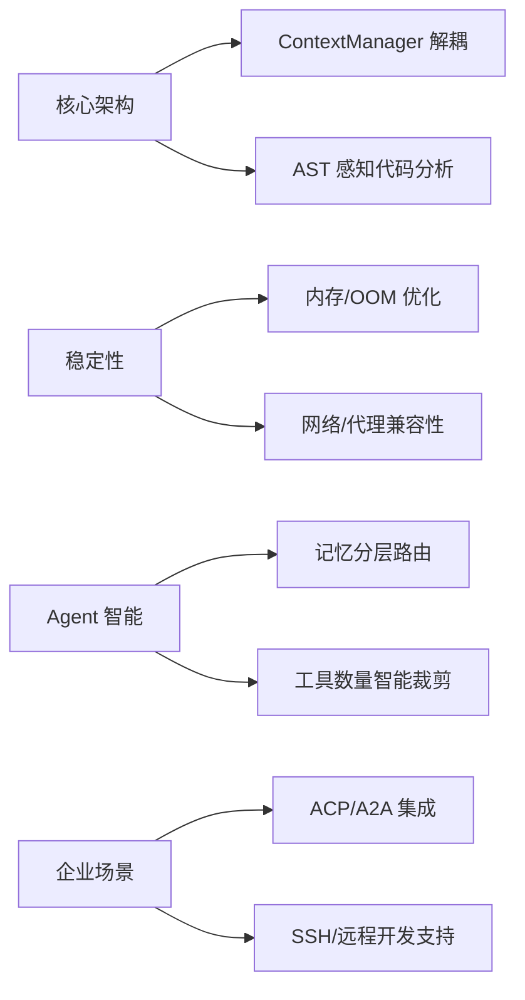

# AI CLI 工具社区动态日报 2026-04-11

> 生成时间: 2026-04-11 01:50 UTC | 覆盖工具: 8 个

- [Claude Code](https://github.com/anthropics/claude-code)
- [OpenAI Codex](https://github.com/openai/codex)
- [Gemini CLI](https://github.com/google-gemini/gemini-cli)
- [GitHub Copilot CLI](https://github.com/github/copilot-cli)
- [Kimi Code CLI](https://github.com/MoonshotAI/kimi-cli)
- [OpenCode](https://github.com/anomalyco/opencode)
- [Pi](https://github.com/badlogic/pi-mono)
- [Qwen Code](https://github.com/QwenLM/qwen-code)
- [Claude Code Skills](https://github.com/anthropics/skills)

---

## 横向对比

# AI CLI 工具生态横向对比分析报告 | 2026-04-11

---

## 1. 生态全景

当前 AI CLI 工具生态呈现**"一超多强、垂直分化"**格局：Claude Code 凭借先发优势占据企业级市场心智，但 Token 消耗与模型能力回退问题引发信任危机；OpenAI Codex 以语音实时交互和 Agent 身份系统构建差异化壁垒；中国厂商（Kimi、Qwen）快速追赶，在 Session 管理和 TUI 体验上形成局部优势；GitHub Copilot CLI 依托生态位卡位但创新节奏放缓；OpenCode、Pi 等新兴工具以架构现代化（Effect/Rust）和开发者体验为切入点寻求突破。整体而言，**成本控制、企业合规、跨端一致性**成为全行业共同攻坚的三大命题。

---

## 2. 各工具活跃度对比

| 工具 | Issues（24h 活跃） | PRs（24h 活跃） | 版本发布 | 关键动态 |
|:---|:---:|:---:|:---|:---|
| **Claude Code** | 50+ | 10+ | v2.1.101 | `/team-onboarding` 新命令；Token 消耗问题集群爆发 |
| **OpenAI Codex** | 50+ | 10+ | v0.119.0 | 语音 v2 默认化；4 个 Agent 身份系统 PR 堆叠 |
| **Gemini CLI** | 未明确 | 10+ | v0.39.0-nightly | ContextManager 架构重构；代理/TUN 环境 TLS 修复 |
| **GitHub Copilot CLI** | 50 | 0 | v1.0.24 | 企业权限管控（#223）与 MCP 兼容性危机（#2498） |
| **Kimi CLI** | 10 | 10 | v1.31.0 | YOLO 模式进 Web UI；Mermaid 图表渲染 |
| **OpenCode** | 10+ | 10+ | 无 | Effect 架构重构（销毁 3 个 facade）；Gemma 4 适配滞后 |
| **Pi** | 20 | 6 | 无 | 流式超时监控；会话生命周期管理 Breaking 修复 |
| **Qwen Code** | 20+ | 15+ | v0.14.3 | `/chat` 命名会话管理；AI 贡献归因追踪 |

> **注**：Issues/PRs 数为基于日报描述的估算值，部分工具未提供精确 24h 统计。

---

## 3. 共同关注的功能方向

| 功能方向 | 涉及工具 | 具体诉求 | 紧迫程度 |
|:---|:---|:---|:---:|
| **成本控制与用量透明** | Claude Code、OpenAI Codex、GitHub Copilot CLI | Token/请求消耗异常激增、计费黑盒、配额硬限制 | 🔴 P0 |
| **Session 生命周期管理** | Kimi CLI、Qwen Code、Pi、Claude Code | 命名保存、快速恢复、跨项目切换、压缩后状态一致性 | 🔴 P0 |
| **TUI 性能与稳定性** | Qwen Code、Gemini CLI、Claude Code、OpenCode | 长上下文滚动异常、闪烁、启动延迟、终端兼容性 | 🟡 P1 |
| **企业级权限与合规** | GitHub Copilot CLI、OpenAI Codex、Claude Code | Org Token 权限可见性、TLS 代理、沙盒策略、审计追踪 | 🟡 P1 |
| **MCP 生态兼容** | GitHub Copilot CLI、OpenAI Codex、Claude Code | 服务器注册、HTML 参数过滤、$ref 解析、热重载 | 🟡 P1 |
| **跨端体验一致性** | Kimi CLI、Qwen Code、OpenAI Codex | Web/CLI/IDE 功能对齐、YOLO 模式、快捷键行为统一 | 🟢 P2 |

---

## 4. 差异化定位分析

| 工具 | 核心功能侧重 | 目标用户画像 | 技术路线特征 |
|:---|:---|:---|:---|
| **Claude Code** | 复杂工程任务、团队协作 (`/team-onboarding`)、企业代理配置 | 中大型企业开发团队、需要深度代码库理解的工程师 | 闭源商业产品，模型能力依赖 Claude 系列，架构黑盒 |
| **OpenAI Codex** | 实时语音交互、Agent 身份系统、远程执行环境 | 追求前沿交互体验的早期采用者、需要跨设备协作的开发者 | Rust 重构中，强调安全沙盒与可信代理架构，OpenAI 生态绑定 |
| **Gemini CLI** | 子 Agent 编排、AST 感知代码分析、Google 生态集成 | Google Cloud 用户、需要大规模代码库分析的场景 | 架构解耦（ContextManager/Sidecar），强调可扩展性 |
| **GitHub Copilot CLI** | IDE 无缝集成、GitHub 原生工作流、组织级治理 | 已订阅 Copilot 的 GitHub 重度用户、企业合规优先场景 | 依托 VS Code 生态，MCP 作为扩展机制，创新节奏保守 |
| **Kimi CLI** | 中文开发者体验、Web UI 与 CLI 双端、成本敏感优化 | 中国开发者、需要本地化支持的长文本处理场景 | 快速迭代，注重交互细节（Mermaid、YOLO Web 化） |
| **OpenCode** | 本地模型优先（Ollama）、Effect 架构、类型安全 | 隐私敏感用户、函数式编程爱好者、本地 AI 倡导者 | TypeScript/Effect 纯函数式架构，强调可组合性与可测试性 |
| **Pi** | 多模型统一接口、扩展生态、会话精细化管理 | 需要灵活切换多厂商模型的专业开发者、工具链集成者 | 轻量级抽象层，快速适配各厂商 API 变更，Bun 运行时优化 |
| **Qwen Code** | 阿里云生态、AI 原生交互创新、国际化起步 | 中国开发者、需要与通义千问模型深度集成的场景 | 积极借鉴竞品（iflow `/chat`），强调社区驱动功能迭代 |

---

## 5. 社区热度与成熟度

### 高活跃度 + 高成熟度（第一梯队）
| 工具 | 证据 | 成熟度标志 |
|:---|:---|:---|
| **Claude Code** | #42796 年度最热 Issue（262 评论/1213 👍）、企业功能持续交付 | 商业化成熟，但模型能力回退引发信任波动 |
| **OpenAI Codex** | #14593 Token 问题 500+ 评论、Agent 身份系统 4 PR 堆叠 | 基础设施级架构升级中，企业级能力构建期 |

### 高活跃度 + 快速迭代（第二梯队）
| 工具 | 证据 | 发展阶段 |
|:---|:---|:---|
| **Qwen Code** | 单日 15+ PRs、`/chat` 功能快速响应社区 #3025 | 功能追赶期，社区驱动特征明显 |
| **Pi** | 24h 内 20 Issues + 6 PRs 全闭环、基础设施密集修复 | 工程化硬ening 期，稳定性优先 |
| **Gemini CLI** | ContextManager 重构系列 PR、AST 感知 EPIC | 架构现代化期，技术债务清理 |

### 中等活跃度 + 差异化探索（第三梯队）
| 工具 | 证据 | 发展特征 |
|:---|:---|:---|
| **Kimi CLI** | 版本节奏稳定、Web/CLI 双端体验打磨 | 产品化 polish 期，寻求体验差异化 |
| **OpenCode** | Effect 重构透明度高、Gemma 4 适配滞后 | 架构信仰驱动，功能完备性待提升 |

### 低活跃度 + 生态位卡位（第四梯队）
| 工具 | 证据 | 风险提示 |
|:---|:---|:---|
| **GitHub Copilot CLI** | 24h 0 PR 更新、Issue 响应依赖核心团队 | 创新动力不足，MCP 兼容性危机待解 |

---

## 6. 值得关注的趋势信号

| 趋势信号 | 来源证据 | 对开发者的参考价值 |
|:---|:---|:---|
| **Agent 身份系统成为企业级标配** | OpenAI Codex 4 PR 堆叠（#17385-17388）、Pi 的会话生命周期管理 | 多 Agent 协作场景的权限审计、任务追溯将成为合规刚需，早期采用者可关注实现方案 |
| **Token 成本危机催生"用量意识"设计** | Claude Code #38239/#42272、Copilot CLI #2591（80-100 次/会话）、Qwen 空闲压缩机制 | 评估工具时需关注：① 请求粒度计量透明度 ② 上下文压缩策略 ③ 预算硬限制能力 |
| **MCP 从"功能扩展"变为"兼容性战场"** | Copilot CLI GHE 404（#2498）、Claude Code Firecrawl 连接失败（#46472） | MCP 服务器的企业网络适配、Schema 兼容性将成为集成关键成本，建议优先选择官方认证工具 |
| **TUI 性能成为差异化壁垒** | Qwen #2950（疯狂滚动）、Gemini #24470（闪烁）、Claude #36582（自动滚动顶部） | 长会话、大代码库场景下，终端渲染性能直接影响可用性，Rust/原生方案（Codex）或成优势 |
| **"命名空间"式 Session 管理成为共识** | Qwen `/chat`、Kimi #1814、Pi #3021 | 从"对话历史"到"项目工作区"的认知升级，提示开发者重新设计 AI 辅助的工作流组织方式 |
| **AI 贡献归因开启合规新维度** | Qwen #3115（AI 代码贡献追踪） | 开源项目和企业需提前规划 AI 生成内容的披露策略、许可证兼容性审计流程 |

---

*报告基于 2026-04-11 各工具社区动态生成，数据截取自公开 GitHub 仓库*

---

## 各工具详细报告

<details>
<summary><strong>Claude Code</strong> — <a href="https://github.com/anthropics/claude-code">anthropics/claude-code</a></summary>

## Claude Code Skills 社区热点

> 数据来源: [anthropics/skills](https://github.com/anthropics/skills)

 # Claude Code Skills 社区热点报告（截至 2026-04-11）

## 1. 热门 Skills 排行（按社区关注度）

| 排名 | Skill | 功能概述 | 状态 | 关键讨论点 |
|:---|:---|:---|:---|:---|
| 1 | **[document-typography](https://github.com/anthropics/skills/pull/514)** | AI 生成文档的排版质量控制（孤行控制、段落 widow、编号对齐） | 🟡 Open | 直接影响所有 Claude 文档输出质量，解决长期被忽视的排版痛点 |
| 2 | **[skill-quality-analyzer](https://github.com/anthropics/skills/pull/83)** + **[skill-security-analyzer](https://github.com/anthropics/skills/pull/83)** | Skill 质量五维评估（结构/文档/测试/安全/性能）与安全审计 | 🟡 Open | 元技能（meta-skill）范式，填补 Skill 自身质量治理空白 |
| 3 | **[ODT 处理](https://github.com/anthropics/skills/pull/486)** | OpenDocument 文本创建、模板填充与 ODT→HTML 解析 | 🟡 Open | 企业文档工作流关键缺口，ISO 标准格式支持 |
| 4 | **[SAP-RPT-1-OSS](https://github.com/anthropics/skills/pull/181)** | SAP 开源表格基础模型的预测分析集成 | 🟡 Open | 首个企业级 ERP/BI 技能，连接 Claude 与 SAP 数据生态 |
| 5 | **[shodh-memory](https://github.com/anthropics/skills/pull/154)** | AI Agent 跨会话持久化记忆系统 | 🟡 Open | 解决 Claude Code 状态丢失的核心痛点，上下文连续性 |
| 6 | **[testing-patterns](https://github.com/anthropics/skills/pull/723)** | 全栈测试模式（单元测试、React 组件测试、E2E、性能） | 🟡 Open | 测试奖杯模型落地，开发工作流刚需 |
| 7 | **[x402 BSV](https://github.com/anthropics/skills/pull/374)** | BSV 区块链微支付认证与 AI 服务付费 | 🟡 Open | 加密支付原生集成，探索 AI 服务货币化协议 |
| 8 | **[frontend-design](https://github.com/anthropics/skills/pull/210)** | 前端设计技能 clarity 与可执行性重构 | 🟡 Open | 存量技能治理范例，从"文档"转向"可执行指令" |

---

## 2. 社区需求趋势（Issues 提炼）

| 趋势方向 | 代表 Issue | 核心诉求 |
|:---|:---|:---|
| **🔐 安全与治理** | [#492](https://github.com/anthropics/skills/issues/492) 信任边界滥用、[#412](https://github.com/anthropics/skills/issues/412) Agent 治理模式 | 社区技能冒充官方命名空间的安全风险；企业级 Agent 系统的策略执行、威胁检测、审计追踪 |
| **🏢 企业集成与部署** | [#29](https://github.com/anthropics/skills/issues/29) AWS Bedrock 支持、[#228](https://github.com/anthropics/skills/issues/228) 组织级 Skill 共享 | 脱离 Claude 原生生态的第三方部署；团队/企业内部的 Skill 分发机制（非手动 Slack 传文件） |
| **🛠️ 开发者体验与工具链** | [#202](https://github.com/anthropics/skills/issues/202) skill-creator 最佳实践化、[#556](https://github.com/anthropics/skills/issues/556) 评估工具失效 | Skill 创建工具从"教学文档"转向"高效执行"；自动化评估与触发机制可靠性 |
| **📦 生态标准化** | [#16](https://github.com/anthropics/skills/issues/16) Skills 作为 MCP 暴露、[#189](https://github.com/anthropics/skills/issues/189) 插件重复安装 | Skill 与 MCP 协议互通；命名空间与依赖管理规范化 |
| **🐛 平台稳定性** | [#62](https://github.com/anthropics/skills/issues/62) Skill 丢失、[#406](https://github.com/anthropics/skills/issues/406) 上传 500 错误、[#403](https://github.com/anthropics/skills/issues/403) 删除失败 | 生产环境数据持久性与 API 可靠性 |

---

## 3. 高潜力待合并 Skills（评论活跃 + 近期更新）

| Skill | PR 链接 | 亮点 | 风险/阻碍 |
|:---|:---|:---|:---|
| **record-knowledge** | [#521](https://github.com/anthropics/skills/pull/521) | 解决 Claude "昨天发现今天遗忘"的上下文丢失，`.claude/knowledge/entries/` 持久化存储 | 需与官方记忆功能路线协调 |
| **codebase-inventory-audit** | [#147](https://github.com/anthropics/skills/pull/147) | 10 步系统化代码库清理工作流，技术债务治理 | 通用性 vs. 特定技术栈的平衡 |
| **masonry-generate-image-and-videos** | [#335](https://github.com/anthropics/skills/pull/335) | Imagen 3.0 + Veo 3.1 多媒体生成，Masonry CLI 集成 | 外部 API 依赖与成本管控 |
| **sensory** | [#806](https://github.com/anthropics/skills/pull/806) | AppleScript 原生 macOS 自动化，替代截图-based 交互 | 权限层级（Tier 2 Accessibility）用户体验 |
| **docx tracked change 修复** | [#541](https://github.com/anthropics/skills/pull/541) | 修复书签与修订 ID 冲突导致的文档损坏 | 技术债务修复，合并阻力小 |

---

## 4. Skills 生态洞察

> **核心矛盾：社区从"功能扩展"转向"信任与治理"** —— 早期 PR 聚焦单一工具能力（PDF、ODT、测试），近期高热度议题集中在安全边界（#492）、企业合规（#412）、平台可靠性（#62, #406）与生态标准化（MCP 互通 #16）。Skill 创建者从个人开发者向企业团队迁移，催生对组织级共享、SSO 兼容、审计追踪的硬性需求，而 skill-creator 工具链的成熟度滞后于社区规模扩张。

---

*数据来源：anthropics/skills GitHub 仓库，PR/Issue 采样时间 2026-04-11*

---

 # Claude Code 社区动态日报 | 2026-04-11

## 1. 今日速览

Anthropic 今日发布 **v2.1.101**，新增 `/team-onboarding` 命令可基于本地使用习惯生成团队新人指南，并默认启用系统 CA 证书存储以解决企业 TLS 代理问题。社区高热度 Issue #42796 关于"2月更新后复杂工程任务不可用"的激烈讨论今日正式关闭，累计 262 条评论、1213 个 👍，反映模型能力回退问题仍是社区最大痛点。同时，Token 消耗异常（#38239、#37917、#42272）成为今日新增 Issues 的集中爆发点。

---

## 2. 版本发布

### [v2.1.101](https://github.com/anthropics/claude-code/releases/tag/v2.1.101) | 2026-04-11

| 更新项 | 说明 |
|--------|------|
| `/team-onboarding` | 新命令，根据本地 Claude Code 使用记录自动生成团队成员上手指南 |
| 企业 TLS 代理优化 | 默认信任系统 CA 证书存储，无需额外配置；可通过 `CLAUDE_CODE_CERT_STORE=bundled` 回退到仅捆绑证书 |
| `/ultrapl...` | 更新内容被截断，具体功能待完整发布说明 |

**上一版本** [v2.1.100](https://github.com/anthropics/claude-code/releases/tag/v2.1.100) 未提供详细变更日志。

---

## 3. 社区热点 Issues

| # | 标题 | 状态 | 关键数据 | 核心看点 |
|---|------|------|---------|---------|
| [#42796](https://github.com/anthropics/claude-code/issues/42796) | 2月更新后复杂工程任务不可用 | **已关闭** | 🔥 262 评论 / 1213 👍 | **年度最热 Issue 之一**。用户反馈模型在复杂工程任务中表现断崖式下跌，官方最终关闭但未明确解决方案，社区质疑声强烈 |
| [#38239](https://github.com/anthropics/claude-code/issues/38239) | Token 消耗速度极快，配额管理存在严重问题 | 开放 | 63 评论 / 56 👍 | **成本危机信号**。多名用户报告 Token 计算异常，可能涉及计费漏洞 |
| [#36582](https://github.com/anthropics/claude-code/issues/36582) | 长对话时终端自动滚动到顶部 | 开放 | 38 评论 / 122 👍 | TUX 体验硬伤，影响长时间编码工作流 |
| [#10181](https://github.com/anthropics/claude-code/issues/10181) | Linux 上 Bash 工具自动触发运行极慢 | 开放 | 36 评论 / 34 👍 | 性能回归问题，v2.0.22 引入，长期未修复 |
| [#32870](https://github.com/anthropics/claude-code/issues/32870) | Windows 目录列出时通过 Wof.sys 触发蓝屏 | 开放 | 24 评论 | **系统级稳定性风险**，BSOD 根因待排查 |
| [#37917](https://github.com/anthropics/claude-code/issues/37917) | 用量激增问题 | 开放 | 23 评论 / 45 👍 | 与 #38239 形成 Token 消耗问题集群 |
| [#31537](https://github.com/anthropics/claude-code/issues/31537) | 充值后余额显示不足 | 开放 | 18 评论 / 8 👍 | 计费系统信任危机 |
| [#36485](https://github.com/anthropics/claude-code/issues/36485) | Mac 桌面应用消息发送无响应、白屏 | 开放 | 17 评论 / 9 👍 | 桌面端稳定性问题 |
| [#42272](https://github.com/anthropics/claude-code/issues/42272) | v2.1.88 后 Token 消耗过高——2个问题消耗 66% 额度 | 开放 | 15 评论 / 9 👍 | **版本特定回归**，Max 5x + Opus 4.6 组合下异常 |
| [#2054](https://github.com/anthropics/claude-code/issues/2054) | Enter 键换行而非发送消息 | 开放 | 14 评论 / 64 👍 | CJK 用户高频需求，输入体验优化 |

---

## 4. 重要 PR 进展

| # | 标题 | 状态 | 核心贡献 | 技术价值 |
|---|------|------|---------|---------|
| [#28714](https://github.com/anthropics/claude-code/pull/28714) | 基于 Claude API 的自动化 Issue 分类与周报摘要 | 开放 | Haiku 4.5 单 Issue 分类 (~$0.001)、Sonnet 4.6 周报生成 (~$0.05/周) | **社区治理基础设施**，低成本自动化运维方案 |
| [#41447](https://github.com/anthropics/claude-code/pull/41447) | 开源 Claude Code ✨ | 开放 | 关闭 #59、#456、#2846、#22002、#41434 | **标志性社区诉求**，开源呼声的长期追踪 |
| [#46351](https://github.com/anthropics/claude-code/pull/46351) | macOS/Linux 启用 PowerShell 工具支持 | 开放 | 解除 Windows-only 限制，`CLAUDE_CODE_USE_POWERSHELL_TOOL=1` 启用 | 跨平台一致性，PowerShell 7.5+ 用户福音 |
| [#32980](https://github.com/anthropics/claude-code/pull/32980) | 新增 `/create-test` 命令与插件 | **已合并** | 自动从源码分析生成单元测试文件 | 测试驱动开发工作流增强 |
| [#32979](https://github.com/anthropics/claude-code/pull/32979) | 新增 `/explain-architecture` 插件 | **已合并** | 解析导入语句构建模块依赖图，输出 Mermaid/PlantUML/JSON | 代码可视化与架构文档自动化 |
| [#45621](https://github.com/anthropics/claude-code/pull/45621) | 新增 `notify-on-complete` 插件 | 开放 | Stop hook 机制，Claude 响应完成时通知用户 | 异步工作流体验优化 |
| [#39148](https://github.com/anthropics/claude-code/pull/39148) | `preserve-session` 插件：路径无关的会话历史 | 开放 | 项目重命名/移动/复制时保留会话历史，UUID 标识项目 | 会话管理鲁棒性提升 |
| [#29461](https://github.com/anthropics/claude-code/pull/29461) | 限制重复候选至规范开放 Issues | 开放 | 约束重复检测机器人建议，减少噪声和循环引用 | 社区 Issue 质量治理 |
| [#20448](https://github.com/anthropics/claude-code/pull/20448) | 新增 `web4-governance` 插件（R6 工作流） | 开放 | T3 信任张量、实体见证、R6 审计追踪的 AI 治理框架 | 前沿概念验证，"Web4" 去中心化治理实验 |
| [#38105](https://github.com/anthropics/claude-code/pull/38105) | 新增 WhatsApp 通道插件 | 开放 | Claude Code 与 WhatsApp 集成（已迁移至独立仓库） | 多通道交互扩展，注意 DMCA 下架后独立维护 |

---

## 5. 功能需求趋势

基于今日 50 条 Issues 分析，社区关注焦点呈现 **三大集群**：

```
┌─────────────────────────────────────────────────────────┐
│  🔴 成本与配额管理（紧急）                                │
│     • Token 消耗异常激增（#38239、#37917、#42272、#45515） │
│     • 计费透明度与余额显示问题（#31537）                   │
│     → 需求：细粒度用量监控、异常消耗告警、配额硬限制        │
├─────────────────────────────────────────────────────────┤
│  🟡 稳定性与性能（持续）                                  │
│     • 长会话 TUI 滚动问题（#36582）                       │
│     • Linux 工具执行慢（#10181）                          │
│     • Windows BSOD（#32870）、桌面端白屏（#36485）         │
│     • 性能退化 10-20x（#46489）                           │
│     → 需求：性能回归测试、跨平台一致性保障、会话状态持久化   │
├─────────────────────────────────────────────────────────┤
│  🟢 交互体验增强（增长）                                  │
│     • Enter 键行为定制（#2054，CJK 用户强需求）            │
│     • /buddy 功能永久化（#45612，愚人节功能留存呼声）       │
│     • 持久化工作台面（#46484）                            │
│     • 项目级记忆（#41918）                                │
│     → 需求：可定制快捷键、工作区布局保存、上下文记忆增强     │
└─────────────────────────────────────────────────────────┘
```

**新兴信号**：MCP（Model Context Protocol）集成问题开始显现（#46472 Firecrawl 连接失败、#46491 Chrome 端分类拦截），生态扩展中的兼容性挑战值得关注。

---

## 6. 开发者关注点

### 痛点矩阵

| 优先级 | 问题域 | 典型反馈 | 影响范围 |
|--------|--------|---------|---------|
| P0 | **成本控制失控** | "2 个简单问题消耗 66% 会话预算"（#42272）、"同一机器不同账号差 22K Token"（#45515） | 全平台付费用户 |
| P1 | **模型能力感知回退** | "复杂工程任务不可用"（#42796 关闭后仍存疑） | 高阶开发者 |
| P1 | **Windows 体验落差** | BSOD、编码乱码（#46486）、文件锁竞争（#46482）、Cowork VM 超时（#46487） | Windows 专业用户 |
| P2 | **企业/团队适配** | TLS 代理已缓解（v2.1.101），但团队级功能（今日 `/team-onboarding`）需求持续增长 | 企业部署 |
| P2 | **可扩展性** | 插件生态活跃（本周报 10+ PR），但 MCP 连接稳定性待验证 | 早期采用者 |

### 今日情绪指标

- 😤 **焦虑**：Token 消耗问题集群爆发，用户质疑计费公平性
- 😐 **观望**：#42796 关闭方式引发"问题是否真解决"的讨论
- 🎉 **期待**：`/team-onboarding` 和 `/buddy` 永久化反映团队协作功能受青睐
- 🔧 **参与**：插件 PR 活跃，社区贡献者积极扩展功能边界

---

*日报基于 GitHub 公开数据生成，不代表 Anthropic 官方立场。*  
*订阅更新：关注 [anthropics/claude-code](https://github.com/anthropics/claude-code)*

</details>

<details>
<summary><strong>OpenAI Codex</strong> — <a href="https://github.com/openai/codex">openai/codex</a></summary>

# OpenAI Codex 社区动态日报 | 2026-04-11

---

## 1. 今日速览

今日 Codex 发布 **v0.119.0 正式版**，带来实时语音会话 v2 WebRTC 路径默认化、MCP Apps 支持等重大更新。社区持续聚焦**令牌消耗异常**（#14593 已超 500 评论）和**沙盒权限问题**，同时开发团队密集推进**Agent 身份系统**（4 个堆叠 PR）和**远程执行环境**等底层架构升级。

---

## 2. 版本发布

### v0.119.0（正式版）
| 属性 | 内容 |
|:---|:---|
| 发布时间 | 2026-04-11 |
| 下载 | [GitHub Release](https://github.com/openai/codex/releases/tag/rust-v0.119.0) |

**核心更新：**
- **实时语音 v2 默认化**：WebRTC 传输路径成为默认，支持可配置传输、语音选择、原生 TUI 媒体支持
- **MCP Apps 支持**：自定义 MCP 服务器集成能力
- **应用服务器覆盖**：新流程的完整服务端支持

### 预发布版本
- `v0.120.0-alpha.3` - 下一轮迭代预览
- `v0.119.0-alpha.32/33` - 稳定版前置测试

---

## 3. 社区热点 Issues（Top 10）

| # | 标题 | 状态 | 评论/👍 | 关键看点 |
|:---|:---|:---|:---|:---|
| [#14593](https://github.com/openai/codex/issues/14593) | **令牌消耗速度异常** | 🔴 Open | 510 / 194 | **社区最痛点**：Business 订阅用户报告 token 消耗过快，OpenAI 官方尚未给出根因说明，持续发酵中 |
| [#10410](https://github.com/openai/codex/issues/10410) | macOS Intel (x86_64) 支持请求 | 🔴 Open | 174 / 262 | **高票功能请求**：Intel Mac 用户群体庞大，Universal Build 呼声强烈 |
| [#12764](https://github.com/openai/codex/issues/12764) | CLI 401 未授权错误 | 🔴 Open | 94 / 4 | **阻塞性问题**：OAuth 与 API Key 冲突导致认证失败，影响企业用户 |
| [#2847](https://github.com/openai/codex/issues/2847) | 敏感文件排除机制 | 🔴 Open | 67 / 309 | **安全刚需**：`.codexignore` 全局+仓库级配置，防止敏感信息泄露 |
| [#13041](https://github.com/openai/codex/issues/13041) | WebSocket 1008 策略关闭 | 🔴 Open | 57 / 114 | **连接稳定性**：强制降级 HTTPS 影响实时体验，需服务端配合 |
| [#11325](https://github.com/openai/codex/issues/11325) | App 端手动 /compact 命令 | 🔴 Open | 47 / 133 | **功能对齐**：CLI 已有功能，App 端缺失导致上下文管理不便 |
| [#14936](https://github.com/openai/codex/issues/14936) | bwrap 沙盒频繁弹窗 | 🔴 Open | 40 / 17 | **回归问题**：v0.115.0 后权限记忆失效，严重影响 Linux 工作流 |
| [#9224](https://github.com/openai/codex/issues/9224) | Codex 远程控制 | 🔴 Open | 39 / 260 | **创新场景**：手机 ChatGPT App 控制桌面 Codex，跨设备协作 |
| [#14919](https://github.com/openai/codex/issues/14919) | bwrap RTM_NEWADDR 权限失败 | 🟢 Closed | 30 / 42 | **已修复**：v0.115.0 沙盒回归，社区验证解决方案 |
| [#16335](https://github.com/openai/codex/issues/16335) | TUI 性能回归 (116→117) | 🔴 Open | 11 / 7 | **性能关注**：Windows 终端响应变慢，需 profiling |

---

## 4. 重要 PR 进展（Top 10）

| # | 标题 | 作者 | 核心内容 |
|:---|:---|:---|:---|
| [#17405](https://github.com/openai/codex/pull/17405) | 重新应用用量提示 + 账户刷新去重 | richardopenai | **事故修复**：解决 4/10 账户检查事件导致的 `account/read` 循环，防止服务过载 |
| [#17402](https://github.com/openai/codex/pull/17402) | 重构 name/namespace 为统一类型 | sayan-oai | **架构清理**：消除 ToolRegistry 双参数传递，为 MCP 工具标准化铺路 |
| [#17404](https://github.com/openai/codex/pull/17404) | MCP 工具统一命名空间注册 | sayan-oai | **MCP 修复**：解决延迟加载 vs 直接可用工具的双路径访问问题 |
| [#17370](https://github.com/openai/codex/pull/17370) | 解除 macOS 沙盒私有 DNS 阻塞 | viyatb-oai | **网络修复**：修复企业/私有 DNS 解析失败，优化本地绑定规则 |
| [#17216](https://github.com/openai/codex/pull/17216) | 从 exec-server 策略构建远程执行环境 | jif-oai | **远程执行**：统一本地/远程环境变量策略，支持 exec-server 自定义 envPolicy |
| [#17381](https://github.com/openai/codex/pull/17381) | Guardian 审查超时协议类型 | won-openai | **安全增强**：审查流程新增 `TimedOut` 状态，防止无限等待 |
| [#17403](https://github.com/openai/codex/pull/17403) | 修复远程控制认证错误重试 | euroelessar | **可靠性**：非唯一传输时认证失败可恢复，支持运行时 auth 热更新 |
| [#14718](https://github.com/openai/codex/pull/14718) | trust-gate 项目钩子与执行策略 | viyatb-oai | **安全加固**：统一 `.codex` 层信任机制，支持 hooks.json/execpolicy 无 config.toml 场景 |
| [#17385-17388](https://github.com/openai/codex/pull/17385) | Agent 身份系统（4 PR 堆叠） | adrian-openai | **重大架构**：功能开关 `use_agent_identity` → 身份注册 → 任务注册 → 下游授权断言 |
| [#17087](https://github.com/openai/codex/pull/17087) | 新增 marketplace 命令 | xli-oai | **生态扩展**：`codex marketplace add` 支持本地目录/GitHub/git URL 插件安装 |

---

## 5. 功能需求趋势

基于 50 个活跃 Issue 分析，社区关注焦点呈 **"三横三纵"** 分布：

| 维度 | 热点方向 | 代表 Issue |
|:---|:---|:---|
| **横向：平台覆盖** | macOS Intel / Windows 完善 / Linux 沙盒 | #10410, #10090, #14936 |
| **横向：接入方式** | IDE 扩展 ↔ CLI ↔ App 功能对齐 | #11325, #7727, #2880 |
| **横向：交互模式** | 语音/远程/移动端控制 | #9224, #13541 |
| **纵向：成本控制** | 令牌消耗透明化 + 用量预警 | #14593, #17345, #16889 |
| **纵向：安全合规** | 敏感文件隔离 + 沙盒精细化 | #2847, #14718, #14919 |
| **纵向：企业集成** | MCP 生态 + 私有部署 + 身份治理 | #17404, #17385-17388 |

**新兴信号**：Agent 身份系统（4 个堆叠 PR）预示 Codex 正从"工具调用"向"可信代理"架构演进，企业级权限管理将成为下一阶段重点。

---

## 6. 开发者关注点

### 🔴 阻塞性痛点
| 问题 | 影响面 | 社区诉求 |
|:---|:---|:---|
| **Token 消耗黑洞** | 全平台付费用户 | 实时用量明细 + 异常告警机制 |
| **OAuth/API Key 冲突** | 企业/多账户用户 | 清晰的认证优先级文档 + 冲突检测 |
| **沙盒权限疲劳** | Linux 重度用户 | "不再询问"状态持久化 + 批量授权 |

### 🟡 高频体验诉求
- **上下文管理**：App 端 `/compact`、会话分叉/回溯 API（#4972）
- **输出可移植**：Markdown 导出、消息复制（#2880）
- **终端可控**：自定义 shell（Windows MinGW Bash，#13165）、后台终端查看（#13858）

### 🟢 生态期待
- **MCP 市场**：官方 marketplace + 社区插件发现机制
- **远程开发**：SSH/WSL 深度优化、手机-桌面协同（#9224）

---

*日报基于 GitHub 公开数据生成，关注 [openai/codex](https://github.com/openai/codex) 获取最新动态。*

</details>

<details>
<summary><strong>Gemini CLI</strong> — <a href="https://github.com/google-gemini/gemini-cli">google-gemini/gemini-cli</a></summary>

 # Gemini CLI 社区动态日报 | 2026-04-11

## 今日速览

今日社区聚焦**架构重构**与**稳定性修复**：核心团队推进 ContextManager 解耦架构简化，同时紧急修复代理/TUN 环境下的 TLS 连接中断问题。用户体验层面，权限重复请求、SSH 会话检测等痛点持续获得关注。

---

## 版本发布

### v0.39.0-nightly.20260410.96cc8a0da

| 更新项 | 说明 |
|--------|------|
| **Linux 沙箱路径解析重构** | 采用集中式路径解析，提升跨平台一致性 |
| **快捷键增强** | 新增 `Ctrl+Shift+G` 支持 |
| **子代理工具重构** | 向统一接口演进，为后续扩展铺路 |

> 🔗 https://github.com/google-gemini/gemini-cli/releases/tag/v0.39.0-nightly.20260410.96cc8a0da

---

## 社区热点 Issues（精选 10 项）

| # | 标题 | 状态 | 核心看点 |
|---|------|------|---------|
| **#22745** | [AST 感知文件读取评估](https://github.com/google-gemini/gemini-cli/issues/22745) | 🔓 Open | **架构级 EPIC**：探索通过 AST 精确读取方法边界，减少 token 浪费和误读。关联 #22746 工具选型（tilth/glyph），将根本性改进代码库分析能力 |
| **#24916** | [权限重复请求问题](https://github.com/google-gemini/gemini-cli/issues/24916) | 🔓 Open | **高频痛点**：用户反馈"始终允许"选项失效，同一文件权限反复弹出。影响自动化工作流体验，需关注安全策略与状态持久化的平衡 |
| **#25054** | [exit_plan_mode hook 回归缺陷](https://github.com/google-gemini/gemini-cli/issues/25054) | 🔓 P1 | **破坏性变更**：PR #22737 将 `plan_path` 改为 `plan_filename` 导致官方文档示例失效，影响计划文件自动归档场景 |
| **#24202** | [SSH 会话文本乱码](https://github.com/google-gemini/gemini-cli/issues/24202) | 🔓 Open | **远程开发阻塞**：Windows→gLinux SSH 场景下界面完全不可用，关联 #24546 SSH 检测辅助工具需求 |
| **#22323** | [子代理 MAX_TURNS 中断误报成功](https://github.com/google-gemini/gemini-cli/issues/22323) | 🔓 P1 | **隐蔽缺陷**：`codebase_investigator` 达到轮次上限却返回 `GOAL` 成功状态，导致分析结果被错误采纳 |
| **#23582** | [子代理感知审批模式](https://github.com/google-gemini/gemini-cli/issues/23582) | 🔓 Open | **协调机制缺陷**：子代理指令与主代理审批模式（Plan/Auto-Edit）冲突，策略引擎拦截后缺乏上下文感知 |
| **#22819** | [记忆路由：全局 vs 项目](https://github.com/google-gemini/gemini-cli/issues/22819) | 🔓 Open | **个性化基础设施**：定义用户偏好（`~/.gemini/`）与代码库特定记忆（`.gemini/`）的分层存储策略 |
| **#25042** | [计划模式内容显示缺失](https://github.com/google-gemini/gemini-cli/issues/25042) | 🔓 Open | **UX 缺陷**：代理请求非正式确认时未展示计划全文，用户无法有效审阅 |
| **#24246** | [>128 工具触发 400 错误](https://github.com/google-gemini/gemini-cli/issues/24246) | 🔓 Open | **规模瓶颈**：工具数量超限导致 API 报错，需智能工具范围裁剪策略 |
| **#24470** | [长对话滚动异常](https://github.com/google-gemini/gemini-cli/issues/24470) | 🔓 Open | **性能体验**：滚动时屏幕闪烁、滚动条跳动，首次到达顶部后才稳定 |

---

## 重要 PR 进展（精选 10 项）

| # | 标题 | 状态 | 技术价值 |
|---|------|------|---------|
| **#25158** | [修复代理/TUN 环境 TLS 断开](https://github.com/google-gemini/gemini-cli/pull/25158) | 🔓 Open | **关键修复**：解决 Clash 等 TUN 接口下的 `ECONNRESET` 错误，企业网络环境刚需 |
| **#25157** | [ContextManager 架构简化](https://github.com/google-gemini/gemini-cli/pull/25157) | ❌ Closed | **架构迭代**：基于 #24752 审查反馈，扁平化架构，以 `SnapshotCache` 替代通用 inbox |
| **#24752** | [解耦 ContextManager 与 Sidecar 架构](https://github.com/google-gemini/gemini-cli/pull/24752) | 🔓 Open | **核心重构**：解决 #24751 技术债务，为 agent 扩展性奠定基础 |
| **#25136** | [遥测数据截断与解耦](https://github.com/google-gemini/gemini-cli/pull/25136) | 🔓 Open | **稳定性提升**：有界结构化截断防 OOM，新增 `telemetry.traces` 配置分离详细追踪 |
| **#25148** | [技能补丁与 /memory inbox 集成](https://github.com/google-gemini/gemini-cli/pull/25148) | 🔓 Open | **功能扩展**：提取代理可更新全局/工作区技能，改用纯 JS `diff` 库替代 git 依赖 |
| **#25134** | [工具控制显示协议](https://github.com/google-gemini/gemini-cli/pull/25134) | 🔓 Open | **UI 架构升级**：AgentProtocol 支持结构化视觉元数据，消除前端 ad-hoc 逻辑 |
| **#24664** | [ACP 主机输入请求支持](https://github.com/google-gemini/gemini-cli/pull/24664) | 🔓 Open | **企业集成**：A2A 客户端可自主响应 `ask_user` 和 `exit_plan_mode`，需显式 opt-in |
| **#20406** | [大工具输出内存优化](https://github.com/google-gemini/gemini-cli/pull/20406) | 🔓 Open | **性能攻坚**：超大 shell 输出直接落盘，避免 V8 OOM，延续 #18049 工作 |
| **#25155** | [文档迁移至 MDX](https://github.com/google-gemini/gemini-cli/pull/25155) | 🔓 Open | **开发者体验**：安装/认证文档支持标签页动态组件，多平台指引更清晰 |
| **#25154** | [A2A 服务器 HTTP 认证加固](https://github.com/google-gemini/gemini-cli/pull/25154) | 🔓 Open | **安全强化**：从环境变量加载 bearer token，启动时自动生成随机令牌替代硬编码 |

---

## 功能需求趋势



| 趋势方向 | 代表 Issues/PRs | 热度 |
|---------|----------------|------|
| **Agent 架构现代化** | #24752, #25157, #25134, #22745 | 🔥🔥🔥 |
| **远程/企业环境适配** | #25158, #24202, #24546, #24664 | 🔥🔥🔥 |
| **内存与性能优化** | #20406, #25136, #24470 | 🔥🔥 |
| **记忆与个性化** | #22819, #22809, #25148 | 🔥🔥 |
| **计划模式完善** | #25054, #25042, #23582 | 🔥🔥 |

---

## 开发者关注点

### 🔴 高频痛点
| 问题 | 影响场景 | 追踪 |
|-----|---------|------|
| **权限状态失效** | CI/CD、自动化脚本 | #24916 |
| **SSH 远程不可用** | 云开发环境 | #24202, #24546 |
| **计划模式 hook 断裂** | 工作流集成 | #25054 |

### 🟡 能力期待
- **更智能的工具管理**：>128 工具报错 (#24246)、临时脚本散落 (#23571) 反映规模化使用瓶颈
- **透明的 Agent 决策**：子代理中断误报 (#22323)、审批模式冲突 (#23582) 需更好的可观测性
- **模型升级跟进**：内部工具迁移至 3.1 flash lite (#23823) 显示对最新模型能力的追逐

### 🟢 生态建设
- 文档工程化（MDX 迁移 #25155）
- 行为评估体系完善 (#24353, #23897)
- 遥测与调试工具增强 (#25136, #25089)

---

> 📊 数据来源：google-gemini/gemini-cli | 统计周期：2026-04-10 至 2026-04-11

</details>

<details>
<summary><strong>GitHub Copilot CLI</strong> — <a href="https://github.com/github/copilot-cli">github/copilot-cli</a></summary>

 # GitHub Copilot CLI 社区动态日报 | 2026-04-11

---

## 1. 今日速览

Copilot CLI 今日发布 **v1.0.24** 正式版，重点修复了 preToolUse hooks 的参数传递问题和终端状态恢复缺陷。社区 Issues 活跃度极高，过去24小时内 **50 个 Issue 有更新**，核心矛盾集中在**企业级权限管控**（org token 的 Copilot Requests 权限不可见）、**MCP 服务器兼容性**（GHE 404 阻断、HTML 参数被过滤、$ref 模式解析失败）以及**模型路由与计费**（单次会话消耗 80-100 次 premium 请求）三大领域。

---

## 2. 版本发布

### v1.0.24 (2026-04-10)
| 类型 | 内容 |
|:---|:---|
| **功能增强** | preToolUse hooks 现支持 `modifiedArgs`/`updatedInput` 及 `additionalContext` 字段；自定义 Agent 模型字段兼容 VS Code 显示名称与厂商后缀（如 "Claude Sonnet 4.5"、"GPT-5.4 (copilot)"） |
| **体验优化** | 退出界面重新设计，新增 Copilot 吉祥物与更清晰的用量摘要布局 |
| **Bug 修复** | 终端状态（alt screen、光标、raw mode）正确恢复；首次运行时的 `--remote` 标志在 GitHub 仓库场景下被正确识别 |

### v1.0.24-0 (预发布, 2026-04-10)
- 新增 `--mode`、`--autopilot`、`--plan` 标志，支持直接以特定 Agent 模式启动 CLI
- 修复内存后端不可用时 Agent 首回合挂起、Bazel/Buck 构建目标标签被误判为文件路径的问题

---

## 3. 社区热点 Issues

| 优先级 | Issue | 核心矛盾 | 社区反应 |
|:---|:---|:---|:---|
| 🔴 **P0** | [#223](https://github.com/github/copilot-cli/issues/223) Org 级 Token 无法显示 "Copilot Requests" 权限 | **企业合规 blocker**：组织禁止个人 PAT 用于自动化，但 UI 层面隐藏了该权限选项，导致企业 CI/CD 无法授权 | 19 评论 / 62 👍，企业用户强烈呼吁 |
| 🔴 **P0** | [#2498](https://github.com/github/copilot-cli/issues/2498) GHE 返回 404 时所有 MCP 服务器被策略阻断 | **GHE 兼容性危机**：`/copilot/mcp_registry` 端点缺失导致企业环境 MCP 全灭，已关闭但需关注后续修复验证 | 18 评论，企业部署受阻 |
| 🟡 **P1** | [#1274](https://github.com/github/copilot-cli/issues/1274) 代码审查场景 95% 触发 400 错误 | **稳定性危机**：diff 文件审查高频失败，疑似服务端验证或请求构造缺陷，严重影响核心工作流 | 16 评论 / 6 👍，开发者生产力受损 |
| 🟡 **P1** | [#2591](https://github.com/github/copilot-cli/issues/2591) 单次会话消耗 80-100 次 premium 请求 | **计费灾难**：工具调用/思考步骤每次回复都计为新请求，成本失控，Pro 用户亦不堪重负 | 13 评论 / 6 👍，经济影响显著 |
| 🟡 **P1** | [#2099](https://github.com/github/copilot-cli/issues/2099) "Claude Sonnet 4.5" 模型不可用回退 | **模型生态碎片化**：VS Code 与 CLI 模型名称解析不一致，已关闭但反映跨产品配置同步难题 | 13 评论，配置体验割裂 |
| 🟡 **P1** | [#1973](https://github.com/github/copilot-cli/issues/1973) 交互模式工具白名单需求 | **安全与效率平衡**：只读操作（grep/cat/git）每次需手动批准，但 `--allow-all` 又放行危险操作，缺乏中间态 | 6 评论 / 10 👍，安全架构设计诉求 |
| 🟡 **P1** | [#2484](https://github.com/github/copilot-cli/issues/2484) 可配置免审批命令集 | 与 #1973 同源，强调会话级持久化配置，避免重复授权疲劳 | 5 评论 |
| 🟢 **P2** | [#1824](https://github.com/github/copilot-cli/issues/1824) 默认模型选择配置 | **个性化缺失**：每次启动强制 Claude Sonnet，无法记忆偏好，已关闭但用户仍寻求方案 | 5 评论 / 3 👍 |
| 🟢 **P2** | [#1291](https://github.com/github/copilot-cli/issues/1291) 仓库级 MCP 配置支持 | **项目可移植性**：MCP 仅能全局配置 `~/.copilot/`，团队共享配置困难，VS Code 已支持 per-folder | 5 评论 / 16 👍，团队协作痛点 |
| 🟢 **P2** | [#853](https://github.com/github/copilot-cli/issues/853) Ctrl+L 应清屏而非清空对话 | ** muscle memory 冲突**：Linux 用户习惯 Ctrl+L 清屏，但 CLI 误删对话历史，已关闭需验证修复 | 5 评论 |

---

## 4. 重要 PR 进展

> **今日无新增 PR 更新**（过去24小时内 0 条）。社区贡献节奏放缓，核心工程团队聚焦 Issue 修复与版本发布。

---

## 5. 功能需求趋势

基于 50 个活跃 Issue 的聚类分析，社区关注焦点呈现四大方向：

| 趋势方向 | 代表 Issue | 需求强度 | 技术挑战 |
|:---|:---|:---|:---|
| **🔐 企业级治理与权限** | #223, #2498, #2484, #1973 | ⭐⭐⭐⭐⭐ | 多租户权限模型、GHE 版本兼容性、策略引擎设计 |
| **🧩 MCP 生态成熟化** | #2498, #2636, #1876, #2634, #1938, #1996 | ⭐⭐⭐⭐⭐ | HTML 转义安全、JSON Schema $ref 解析、延迟加载、热重载 |
| **💰 计费透明与成本控制** | #2591, #1568, #2619 | ⭐⭐⭐⭐☆ | 请求粒度计量、会话级预算上限、试用边界清晰化 |
| **🎯 模型路由与智能调度** | #2099, #1824, #1354, #1555 | ⭐⭐⭐⭐☆ | 跨产品模型名称统一、per-agent 模型选择、视觉模型稳定性 |

**新兴信号**：PDF 原生解析（#443, 27 👍）、技能子文件夹组织（#1632）、剪贴板图片粘贴（#1452）等生产力增强需求开始积聚。

---

## 6. 开发者关注点

### 高频痛点
1. **"审批疲劳" vs "安全失控" 的两难**：交互模式的安全粒度过粗（#1973, #2484），开发者呼吁只读操作白名单
2. **MCP "最后一公里" 断裂**：企业 GHE 404（#2498）、HTML 参数过滤（#2636）、Schema $ref 解析失败（#1876）导致自定义工具链无法落地
3. **计费黑盒焦虑**：单次任务 80-100 次请求消耗（#2591）、负值剩余额度（#1568）、试用意外扣费（#2619）引发信任危机

### 架构级诉求
- **配置分层**：全局 `~/.copilot/` → 仓库级 `.copilot/` → 项目级 `.mcp.json` 的继承体系（#1291, #1938）
- **生命周期钩子**：`preAgentStop` 用于结果验证（#2253）、模型路由可配置（#1354）
- **跨产品一致性**：VS Code 与 CLI 的 Agent 配置、模型名称、MCP 行为对齐（#738, #2099）

---

*数据来源：[github/copilot-cli](https://github.com/github/copilot-cli) | 生成时间：2026-04-11*

</details>

<details>
<summary><strong>Kimi Code CLI</strong> — <a href="https://github.com/MoonshotAI/kimi-cli">MoonshotAI/kimi-cli</a></summary>

 # Kimi Code CLI 社区动态日报 | 2026-04-11

## 1. 今日速览

今日社区活跃度较高，**v1.31.0 正式发布**，重点修复了 Rich 终端样式泄漏问题并增强文件读取工具。Issues 侧聚焦 **API 错误处理** 与 **Session 管理体验**，开发者对多实例协作、长文件性能瓶颈反馈集中。PR 层面，**YOLO 模式进 Web UI**、**Mermaid 图表渲染** 等体验优化进入 review 阶段，同时多项稳定性修复（token 刷新、目录列表截断、更新提示门控）已合并。

---

## 2. 版本发布

### [v1.31.0](https://github.com/MoonshotAI/kimi-cli/releases/tag/1.31.0) | 2026-04-10

| 类型 | 内容 |
|:---|:---|
| **Fix** | 阻止 Rich 默认 Markdown 样式泄漏背景色到终端 |
| **Feat** | `ReadFile` 工具新增 `totalLines` 字段与 `tail` 模式，提升大文件浏览效率 |

> 影响：终端视觉一致性改善，长日志/配置文件读取更灵活。

---

## 3. 社区热点 Issues（10 条）

| # | 标题 | 状态 | 核心痛点 | 社区反应 |
|:---|:---|:---|:---|:---|
| [#778](https://github.com/MoonshotAI/kimi-cli/issues/778) | API Error 400: invalid_request_error | 🔴 OPEN | Windows + PowerShell 环境下高频触发，阻断工作流 | 11 条讨论，用户反复确认复现条件，疑似平台兼容性问题 |
| [#1814](https://github.com/MoonshotAI/kimi-cli/issues/1814) | 查询与快速恢复 Session 的方法 | 🔴 OPEN | 多项目切换时遗忘 Session 路径，需反复 `cd` + `/sessions` | 中文用户强需求，建议 CLI 级参数 `--list-sessions` |
| [#1327](https://github.com/MoonshotAI/kimi-cli/issues/1327) | 默认单轮步数上限过低 | 🔴 OPEN | `Max steps reached: 100` 与 34.5% 上下文占用矛盾，配置门槛高 | 长期反馈，用户认为保守默认值损害复杂任务体验 |
| [#1786](https://github.com/MoonshotAI/kimi-cli/issues/1786) | 大文件写入时 UI 滞后数分钟 | 🔴 OPEN | ~800 行文件实际已落盘，UI 仍显示写入中，严重影响反馈感知 | 性能类关键 bug，需排查渲染/事件循环瓶颈 |
| [#1833](https://github.com/MoonshotAI/kimi-cli/issues/1833) | 请求 `/loop` 命令功能 | 🔴 OPEN | 对标 Claude Code 的定时循环执行能力，自动化场景刚需 | 新功能请求，引用竞品文档说明需求合理性 |
| [#1830](https://github.com/MoonshotAI/kimi-cli/issues/1830) | VSCode 扩展无法先输 `/` 再选 Skill | 🔴 OPEN | 交互顺序限制，必须先输入内容才能唤起 Skill 选择器 | 体验细节，反映 IDE 集成 polish 度不足 |
| [#1794](https://github.com/MoonshotAI/kimi-cli/issues/1794) | `/sessions` 单 Session 时无意义选择器 | 🟢 CLOSED | 仅当前 Session 时仍弹出单选项，UX 冗余 | 已修复，体现对边缘场景体验的关注 |
| [#1809](https://github.com/MoonshotAI/kimi-cli/issues/1809) | 空上下文提示 token limit | 🟢 CLOSED | 未提供有效上下文时错误提示 token 超限，误导性强 | 已修复，改善错误信息准确性 |
| [#1824](https://github.com/MoonshotAI/kimi-cli/issues/1824) | VS Code 与 Local Web 授权失败 | 🟢 CLOSED | 多平台登录状态同步问题，影响跨端使用 | 快速关闭，显示认证体系迭代中的阵痛 |

---

## 4. 重要 PR 进展（10 条）

| # | 标题 | 状态 | 技术价值 |
|:---|:---|:---|:---|
| [#1767](https://github.com/MoonshotAI/kimi-cli/pull/1767) | Web UI 支持 YOLO 模式 | 🔵 OPEN | 将自动审批操作能力扩展到 Web 端，统一多平台体验 |
| [#1832](https://github.com/MoonshotAI/kimi-cli/pull/1832) | 修复 `UserPromptSubmit` hook 丢失 prompt | 🔵 OPEN | 第三方 hook 无法捕获用户输入的根因修复，生态扩展关键 |
| [#1709](https://github.com/MoonshotAI/kimi-cli/pull/1709) | diff 高亮偏移与 tab 展开对齐 | 🔵 OPEN | 代码审查准确性提升，影响核心编辑体验 |
| [#884](https://github.com/MoonshotAI/kimi-cli/pull/884) | 升级 ruff 0.14.14 → 0.15.0 | 🔵 OPEN | 代码质量工具链维护，依赖安全与规范同步 |
| [#1790](https://github.com/MoonshotAI/kimi-cli/pull/1790) | Windows 优先使用 pwsh 而非 powershell.exe | 🔵 OPEN | 现代 PowerShell 路径解析优化，终端兼容性提升 |
| [#1789](https://github.com/MoonshotAI/kimi-cli/pull/1789) | Web 端渲染 Mermaid 图表 | 🔵 OPEN | 聊天消息中流程图/时序图可视化，增强技术沟通表达 |
| [#1825](https://github.com/MoonshotAI/kimi-cli/pull/1825) | 流式输出期间允许 shell 级 slash 命令 | 🔵 OPEN | 解决长任务时无法执行 `/task` 等命令的阻塞问题 |
| [#1831](https://github.com/MoonshotAI/kimi-cli/pull/1831) | PyInstaller 包含懒加载 CLI 子命令 | 🟢 CLOSED | 打包完整性修复，防止子命令在独立构建中丢失 |
| [#1827](https://github.com/MoonshotAI/kimi-cli/pull/1827) | 目录列表限制 500 条目防 token 溢出 | 🟢 CLOSED | `node_modules` 等大目录场景下系统提示词保护，直接回应 #1809 |
| [#1826](https://github.com/MoonshotAI/kimi-cli/pull/1826) | 启动时阻塞式更新提示门控 | 🟢 CLOSED | 版本更新可感知化，减少用户滞留旧版本的隐性成本 |

---

## 5. 功能需求趋势

从今日 Issues 提炼三大方向：

| 趋势 | 代表 Issue | 需求强度 |
|:---|:---|:---:|
| **Session 生命周期管理** | #1814 查询/快速恢复、#1833 `/loop` 命令 | ⭐⭐⭐⭐⭐ |
| **大文件/长任务性能** | #1786 UI 滞后、#1327 步数上限 | ⭐⭐⭐⭐⭐ |
| **IDE 与 Web 体验对齐** | #1767 YOLO Web 化、#1789 Mermaid 渲染、#1830 VSCode 交互优化 | ⭐⭐⭐⭐☆ |
| **认证与多实例稳定性** | #778 API 错误、#1824 授权失败（已修复） | ⭐⭐⭐⭐☆ |

> 洞察：开发者从"能用"转向"好用"，对**跨端一致性**、**长时间运行任务的可控性**、**Session 状态的可视化管理**需求迫切。

---

## 6. 开发者关注点

| 痛点类别 | 具体表现 | 出现频次 |
|:---|:---|:---:|
| **Windows 平台兼容性** | PowerShell 版本差异、API 400 错误、路径解析 | 高 |
| **Token/认证机制透明度** | 15 分钟过期、多实例竞争刷新、错误提示模糊 | 高 |
| **长任务可观测性** | 流式输出阻塞交互、文件写入状态不同步、步数限制突兀 | 中高 |
| **配置发现成本** | Session 路径遗忘、默认值保守但修改入口深 | 中 |
| **IDE 集成 polish** | VSCode 扩展交互顺序限制、Web 与桌面端功能 gaps | 中 |

---

*日报生成时间：2026-04-11 | 数据来源：MoonshotAI/kimi-cli GitHub*

</details>

<details>
<summary><strong>OpenCode</strong> — <a href="https://github.com/anomalyco/opencode">anomalyco/opencode</a></summary>

 # OpenCode 社区动态日报 | 2026-04-11

## 今日速览

今日社区活跃度较高，核心团队持续推进 **Effect 架构重构**，集中销毁多个 facade（Storage、Todo）并统一工具定义为 `Tool.defineEffect`。用户侧反馈显示 **Gemma 4 模型支持** 和 **跨平台复制粘贴** 仍是高频痛点，Windows 安全误报问题已关闭。

---

## 社区热点 Issues

| # | 标题 | 状态 | 核心问题 | 社区反应 |
|---|------|------|---------|---------|
| [#13984](https://github.com/anomalyco/opencode/issues/13984) | CLI 复制粘贴失效 | 🔴 OPEN | 剪贴板显示"已复制"但 Ctrl+V 无内容，跨平台剪贴板集成缺陷 | 21 评论，8 👍，用户持续跟进 |
| [#6209](https://github.com/anomalyco/opencode/issues/6209) | iTerm 滚动异常 | 🔴 OPEN | TUI 中滚轮仅滚动输入框而非历史输出，终端兼容性问题 | 20 评论，17 👍，长期未解决 |
| [#21100](https://github.com/anomalyco/opencode/issues/21100) | Web 端 `e.diffs.map` 报错 | 🔴 OPEN | v1.3.15 版本 diff 渲染崩溃，影响代码审查功能 | 15 评论，3 👍，新回归问题 |
| [#4754](https://github.com/anomalyco/opencode/issues/4754) | Linux 双剪贴板行为混乱 | 🔴 OPEN | 未区分 primary/clipboard 缓冲区，与标准 Linux 习惯冲突 | 14 评论，10 👍，资深用户反馈 |
| [#20995](https://github.com/anomalyco/opencode/issues/20995) | Gemma 4 工具调用识别失败 | 🔴 OPEN | Ollama 流式响应中 `tool_calls` 未被解析，Agent 能力受限 | 10 评论，27 👍，**高热度** |
| [#11176](https://github.com/anomalyco/opencode/issues/11176) | 官方 VS Code 扩展请求 | 🔴 OPEN | 用户希望原生 IDE 集成而非独立应用 | 12 评论，37 👍，**最高赞需求** |
| [#5635](https://github.com/anomalyco/opencode/issues/5635) | WSL 后端支持 | 🔴 OPEN | Desktop 版无法调用 WSL 环境，Windows 开发者阻塞 | 9 评论，33 👍，企业场景关键 |
| [#7655](https://github.com/anomalyco/opencode/issues/7655) | Windows 误报木马 | 🟢 CLOSED | NPM 安装后被 Defender 标记为 `wacatac.h!ml` | 10 评论，4 👍，今日关闭 |
| [#21746](https://github.com/anomalyco/opencode/issues/21746) | Gemma 4 26B 不触发推理 | 🟢 CLOSED | 模型未进入思考模式，Agent 任务质量下降 | 8 评论，快速关闭 |
| [#14167](https://github.com/anomalyco/opencode/issues/14167) | Ubuntu 启动白屏延迟 | 🔴 OPEN | 1.1x 版本起恶化，DEBUG 日志无输出，难以诊断 | 8 评论，5 👍，性能回归 |

---

## 重要 PR 进展

| # | 标题 | 作者 | 关键变更 |
|---|------|------|---------|
| [#21961](https://github.com/anomalyco/opencode/pull/21961) | Tool 定义全面 Effect 化 | kitlangton | `Tool.Def.execute` 返回类型从 `Promise` 改为 `Effect`，统一 18 个工具边界，删除旧 `Tool.define` |
| [#21956](https://github.com/anomalyco/opencode/pull/21956) | 销毁 Storage facade | kitlangton | 首波 facade 清理，`Session.diff` 直接 yield 服务，删除 `makeRuntime` |
| [#21962](https://github.com/anomalyco/opencode/pull/21962) | 销毁 Todo facade | kitlangton | 验证非 Effectful 调用方 → `AppRuntime` 迁移模式 |
| [#21963](https://github.com/anomalyco/opencode/pull/21963) | 禁用默认 Effect 控制台日志 | kitlangton | 替换为应用日志，OTLP 配置时仅保留 OTLP 输出 |
| [#21907](https://github.com/anomalyco/opencode/pull/21907) | 免费模型自动解析 | caretak3r | `--model free` 随机选择零成本模型，`--variant any` 增强 |
| [#21882](https://github.com/anomalyco/opencode/pull/21882) | Electron 嵌入实例上下文修复 | Brendonovich | `containsPath` 传递 `Instance` 上下文，修复嵌入式构建错误 |
| [#21951](https://github.com/anomalyco/opencode/pull/21951) | Azure GPT-5 reasoningSummary 保护 | Mayhem50 | 修复 Azure 端点 `textVerbosity` 未守卫导致的参数错误 |
| [#21955](https://github.com/anomalyco/opencode/pull/21955) | ProviderTransform 家族拆分 | Mayhem50 | 单体 `transform.ts` 重构为 `transform/` 模块，按模型家族组织 |
| [#21799](https://github.com/anomalyco/opencode/pull/21799) | AI SDK 遥测桥接 | kitlangton | `BasicTracerProvider` 全局注册，AI SDK `experimental_telemetry` 与 Effect OTLP 共存 |
| [#15038](https://github.com/anomalyco/opencode/pull/15038) | OpenAI WebSocket 传输 | nick-potts | Responses API 流式传输 + 增量跟进处理，实验性功能 |

---

## 功能需求趋势

基于 50 条活跃 Issue 分析，社区关注焦点集中于：

| 方向 | 代表 Issue | 热度指标 |
|------|-----------|---------|
| **IDE 原生集成** | #11176 (VS Code 扩展) | 37 👍，企业用户刚需 |
| **Windows/WSL 生态** | #5635 (WSL 后端), #7655 (安全误报), #20251 | 多平台 parity 差距 |
| **新模型支持** | #20995, #21746 (Gemma 4), #20908 | Google 新模型适配滞后 |
| **TUI 体验打磨** | #13984, #6209, #4754, #14167 | 剪贴板、滚动、启动性能 |
| **多 Agent 编排** | #17994 (隔离工作区团队) | 高级用户架构需求 |
| **权限系统细化** | #20307, #21793 | 文档不清 + 模式匹配失效 |

---

## 开发者关注点

### 🔴 阻塞性痛点
- **跨平台剪贴板**: Linux/Mac/Windows 三端行为不一致，终端模拟器兼容性问题集中爆发
- **Gemma 4 适配**: Google 新模型工具调用格式变更，社区已有 27 👍 等待修复
- **Windows 桌面端稳定性**: 启动失败、安全误报、WSL 隔离环境支持形成组合障碍

### 🟡 架构债务反馈
- **权限配置易用性**: `permission.skill` 模式规则文档不足，实际行为与预期不符（#20307, #21793）
- **MCP 工具输出可见性**: 工具执行结果仅 LLM 可见，用户侧 UI 渲染缺失（#15825）

### 🟢 积极信号
- **Effect 重构透明度**: kitlangton 主导的 facade 清理系列 PR 节奏清晰，社区可追踪架构演进
- **免费模型策略**: #21907 显示团队关注成本敏感用户，降低试用门槛

</details>

<details>
<summary><strong>Pi</strong> — <a href="https://github.com/badlogic/pi-mono">badlogic/pi-mono</a></summary>

 # Pi 社区动态日报 | 2026-04-11

## 1. 今日速览

今日 Pi 社区活跃度极高，**20 个 Issues 和 6 个 PR 在 24 小时内完成闭环**，核心聚焦稳定性修复与开发者体验优化。流式超时监控、会话生命周期管理、OpenAI 缓存优化等基础设施改进成为主线，同时社区对 Reasoning 能力的 UX 设计提出重要反馈。

---

## 2. 版本发布

**无新版本发布**

---

## 3. 社区热点 Issues

| # | Issue | 重要性 | 社区反应 |
|---|-------|--------|---------|
| [#3021](https://github.com/badlogic/pi-mono/issues/3021) | `pi.*` 调用在 `ctx.newSession()` 后仍指向已销毁会话 | 🔴 **严重** - 导致静默数据丢失和不可见副作用，扩展开发者的核心痛点 | 快速关闭，标记为 Breaking 级别 |
| [#3020](https://github.com/badlogic/pi-mono/issues/3020) | 流式 Provider 空闲超时监控 | 🟡 **高** - 解决 Gemini 等 Provider 385+ 秒无响应挂死问题 | 当日即有关闭 PR，基础设施关键改进 |
| [#3017](https://github.com/badlogic/pi-mono/issues/3017) | Codex 订阅错误回合后 "No tool call found" 崩溃 | 🟡 **高** - 影响 OpenAI Codex 付费用户的工具调用稳定性 | 快速修复，工具链可靠性提升 |
| [#3016](https://github.com/badlogic/pi-mono/issues/3016) | **Reasoning 能力 UX 误导性设计**（唯一 Open） | 🟡 **高** - 指出 Pi 将不同模型的 Reasoning 控制抽象为统一开关的设计缺陷 | 零评论，待核心团队回应，产品方向议题 |
| [#3015](https://github.com/badlogic/pi-mono/issues/3015) | Print 模式 FD 泄漏 | 🟡 **中** - 脚本集成场景的文件描述符泄漏 | 快速修复，CI/自动化场景受益 |
| [#3012](https://github.com/badlogic/pi-mono/issues/3012) | Claude Max 订阅 OAuth 失效 | 🟡 **中** - Anthropic 政策变更导致第三方应用配额计算方式变化 | 快速适配，第三方生态兼容性 |
| [#3011](https://github.com/badlogic/pi-mono/issues/3011) | `-p` 非交互模式不退出 | 🟡 **中** - 破坏自动化工作流的基础功能 | 快速修复，CLI 可靠性 |
| [#3004](https://github.com/badlogic/pi-mono/issues/3004) | 终端宽度超限崩溃 | 🟡 **中** - TUI 渲染边界条件缺陷 | 快速修复，稳定性改进 |
| [#2999](https://github.com/badlogic/pi-mono/issues/2999) | 自定义 SYSTEM.md 无法使用模板变量 | 🟡 **中** - 高级用户自定义系统提示的能力受限 | 快速修复，扩展性提升 |
| [#2990](https://github.com/badlogic/pi-mono/issues/2990) | 多次 `--append-system-prompt` 应追加而非覆盖 | 🟢 **中** - CLI 参数行为的直觉性改进 | 快速修复，用户体验优化 |

---

## 4. 重要 PR 进展

| # | PR | 状态 | 核心内容 |
|---|-----|------|---------|
| [#3018](https://github.com/badlogic/pi-mono/pull/3018) | [codex] 改进 OpenAI 提示缓存亲和性 | 🟢 **Open** | 对齐 Codex 缓存策略，引入 UUIDv7 会话 ID，新增缓存亲和性回归测试 —— **性能优化关键 PR** |
| [#3019](https://github.com/badlogic/pi-mono/pull/3019) | 全 Provider 流式空闲超时监控 | ✅ **Closed** | `withStreamIdleTimeout()` 工具函数，可配置超时中断挂死连接 —— **基础设施硬ening** |
| [#3014](https://github.com/badlogic/pi-mono/pull/3014) | 修复 `agent_end` 期间扩展 followUp 消息丢失 | ✅ **Closed** | 解决扩展消息队列在 Agent 循环退出后的竞态条件 —— **扩展生态稳定性** |
| [#3002](https://github.com/badlogic/pi-mono/pull/3002) | 修复 bun 编译二进制中虚拟路径注入问题 | 🟢 **Open** | 阻止 `/$bunfs/root/pi` 等虚拟路径进入子 Agent 提示 —— **Bun 运行时兼容性** |
| [#3008](https://github.com/badlogic/pi-mono/pull/3008) / [#3006](https://github.com/badlogic/pi-mono/pull/3006) | GLM 品牌名拼写修正 | ✅ **Closed** | `GML` → `GLM` 文档修正 —— 社区贡献典型 |

---

## 5. 功能需求趋势

基于今日 Issues 聚类分析，社区关注焦点呈四极分布：

| 方向 | 代表 Issue | 趋势解读 |
|------|-----------|---------|
| **稳定性 & 可靠性** | #3020, #3015, #3001, #3004, #3011 | 生产环境就绪度成为核心诉求，超时处理、资源泄漏、进程生命周期管理密集修复 |
| **多模型生态适配** | #3012, #3013, #3003, #2854, #3022 | Claude 政策变更、Azure OpenAI、Z.AI、Gemma 等 Provider 持续跟进，模型碎片化挑战 |
| **开发者体验 & 扩展性** | #3021, #2999, #2990, #3009, #3005 | 扩展 API 的会话管理、自定义系统提示、CLI 行为一致性、更新通知可控性 |
| **Reasoning & 产品化** | #3016 | **新兴议题** —— 社区开始关注 AI 能力的透明呈现与用户体验设计，超越纯技术实现 |

---

## 6. 开发者关注点

### 🔥 高频痛点
1. **会话生命周期管理** — #3021 揭示的 `ctx.newSession()` 后 `pi.*` 调用目标漂移问题，反映扩展开发者在复杂 Agent 编排中的调试困难
2. **自动化/CI 集成** — #3011 (`-p` 不退出)、#3015 (FD 泄漏)、#3000 (重复安装) 共同指向非交互场景的边缘情况处理不足

### 🎯 能力诉求
- **更细粒度的控制**：#2990 的多系统提示追加、#2999 的模板变量暴露、#3005 的通知开关 —— 用户希望"默认智能，但可深度定制"
- **Provider 健康度可观测**：#3020 的超时监控是开始，社区需要更全面的 Provider 性能指标和降级策略

### ⚠️ 待响应议题
- **#3016 Reasoning UX 设计** 作为今日唯一未关闭 Issue，涉及产品核心抽象，需核心团队明确设计哲学

---

*日报基于 github.com/badlogic/pi-mono 2026-04-10 至 2026-04-11 数据生成*

</details>

<details>
<summary><strong>Qwen Code</strong> — <a href="https://github.com/QwenLM/qwen-code">QwenLM/qwen-code</a></summary>

# Qwen Code 社区动态日报 | 2026-04-11

## 今日速览

Qwen Code 今日发布 **v0.14.3** 稳定版，重点修复 UI 状态管理和工具调用竞态问题。社区活跃度高涨，单日新增 20+ Issues 和 15+ PRs，**会话管理**、**TUI 性能优化**和**IDE 集成**成为开发者最关注的三大方向。

---

## 版本发布

### v0.14.3 正式发布
| 版本 | 类型 | 核心更新 |
|:---|:---|:---|
| [v0.14.3](https://github.com/QwenLM/qwen-code/releases/tag/v0.14.3) | 稳定版 | 修复 InputPrompt 死状态、工具调用 UI 泄漏、Enter 缓冲区竞态 |
| [v0.14.3-nightly.20260411](https://github.com/QwenLM/qwen-code/releases/tag/v0.14.3-nightly.20260411.55bcec70d) | 夜间版 | 同步稳定版修复 |

**关键修复**（贡献者：@chinesepowered, @wenshao）：
- 移除 `InputPrompt` 中的无效 `dirs` 状态和未使用 hook 参数
- 防止工具调用 UI 泄漏和 Enter 键接受缓冲区的竞态条件

---

## 社区热点 Issues

| # | 标题 | 状态 | 评论 | 核心看点 |
|:---|:---|:---|:---:|:---|
| [#3025](https://github.com/QwenLM/qwen-code/issues/3025) | 引入 iflow CLI 的 `/chat` 会话管理功能 | 🔵 OPEN | 4 | **高需求功能**：用户呼吁借鉴 iflow 的命名会话保存/浏览/恢复能力，自动生成的会话名难以辨认 |
| [#241](https://github.com/QwenLM/qwen-code/issues/241) | Shift+Enter 无法换行而是直接发送消息 | 🔵 OPEN | 4 | **长期痛点**：与 Claude Code 等工具行为不一致，编码场景下的基础交互问题 |
| [#3019](https://github.com/QwenLM/qwen-code/issues/3019) | Subagent 技能触发不稳定 | 🔵 OPEN | 4 | **可靠性问题**：定义中明确要求调用技能，实际执行时经常无法触发或偏离技能要求 |
| [#2950](https://github.com/QwenLM/qwen-code/issues/2950) | 长上下文会话导致屏幕疯狂滚动 | 🔵 OPEN | 3 | **体验灾难**：上下文过长时 TUI 自动滚动失效，视觉上下跳屏严重影响使用 |
| [#2928](https://github.com/QwenLM/qwen-code/issues/2928) | 并行子 Agent 触发 TUI 频繁闪烁 | 🔵 OPEN | 3 | **渲染性能**：多 Agent 并行时的界面闪烁问题，暴露 TUI 并发渲染缺陷 |
| [#3073](https://github.com/QwenLM/qwen-code/issues/3073) | `run_shell_command` 被权限规则间歇性拒绝 | 🔵 OPEN | 2 | **权限系统 Bug**：标准非破坏性命令被不可预测地拦截，阻断正常开发流程 |
| [#2748](https://github.com/QwenLM/qwen-code/issues/2748) | TUI 性能与 UX 综合优化 | 🔵 OPEN | 2 | **系统性问题**：启动慢（3-5秒）、屏幕闪烁、冗余输出，已被标记为需要重点投入 |
| [#2922](https://github.com/QwenLM/qwen-code/issues/2922) | 任务完成/审批请求的通知钩子 | 🔵 OPEN | 2 | **生产力增强**：长任务后台运行时的声音/回调通知需求，避免频繁切换窗口检查 |
| [#3059](https://github.com/QwenLM/qwen-code/issues/3059) | 基于上下文的提示词自动增强 | 🔵 OPEN | 2 | **AI 原生功能**：智能理解当前上下文，自动优化用户输入的提示词质量 |
| [#3102](https://github.com/QwenLM/qwen-code/issues/3102) | CLI 显示当前文件夹和分支名 | 🔵 OPEN | 0 | **多项目管理刚需**：多窗口场景下无法区分项目上下文，易导致版本混淆 |

---

## 重要 PR 进展

| # | 标题 | 作者 | 状态 | 功能亮点 |
|:---|:---|:---|:---|:---|
| [#3105](https://github.com/QwenLM/qwen-code/pull/3105) | 新增 `/chat` 命名会话管理命令 | @lnxsun | 🟡 OPEN | **回应 #3025**：`save/list/resume/delete` 四种子命令，彻底解决会话管理痛点 |
| [#3109](https://github.com/QwenLM/qwen-code/pull/3109) | 修复压缩后会话恢复的上下文计数错误 | @tanzhenxin | 🟡 OPEN | **数据准确性**：解决 `/compress` 后恢复会话时状态行显示陈旧 token 数的问题 |
| [#3115](https://github.com/QwenLM/qwen-code/pull/3115) | AI 代码贡献归因追踪 | @wenshao | 🟡 OPEN | **合规创新**：按文件追踪 AI 贡献比例，支持开源披露和企业审计场景 |
| [#3006](https://github.com/QwenLM/qwen-code/pull/3006) | 空闲上下文微压缩机制 | @tanzhenxin | 🟡 OPEN | **性能优化**：60分钟空闲后自动清理旧工具结果，降低上下文膨胀 |
| [#3103](https://github.com/QwenLM/qwen-code/pull/3103) | 全终端 Shift+Enter 换行支持 | @doudouOUC | 🟡 OPEN | **终结 #241**：三机制兼容方案解决终端差异问题 |
| [#3101](https://github.com/QwenLM/qwen-code/pull/3101) | CLI 底部显示当前目录和分支 | @hyzx86 | 🟡 OPEN | **直接回应 #3102**：智能截断路径，空间不足时优先显示文件夹名 |
| [#3013](https://github.com/QwenLM/qwen-code/pull/3013) | 大输出防闪烁：SlicingMaxSizedBox | @chiga0 | 🟡 OPEN | **渲染优化**：解决 `npm install` 等 500+ 行输出导致的终端跳屏问题 |
| [#3079](https://github.com/QwenLM/qwen-code/pull/3079) | `/batch` 批量并行操作技能 | @doudouOUC | 🟡 OPEN | **效率工具**：Glob 自动发现、分块并行处理、Dry-run 预览模式 |
| [#3120](https://github.com/QwenLM/qwen-code/pull/3120) | Fast Model 设置改用模型选择器 | @wenshao | 🟡 OPEN | **UX 改进**：告别手动输入模型 ID，统一使用 `/model --fast` 的浏览界面 |
| [#3126](https://github.com/QwenLM/qwen-code/pull/3126) | 法语本地化 (fr-FR) 支持 | @sibylassana95 | 🟡 OPEN | **国际化**：完整 UI 翻译覆盖，拓展欧洲开发者市场 |

---

## 功能需求趋势

基于 44 条活跃 Issue 分析，社区关注呈现 **四大集中方向**：

```
📊 需求热度分布
├── 🖥️ TUI/CLI 体验优化 (35%)  ← 最紧迫
│   └── 闪烁、滚动、性能、多窗口管理
├── 🔧 IDE 集成深化 (25%)
│   └── VS Code Companion 完善、ACP 协议对齐、Hook 支持
├── 🤖 Agent 系统可靠性 (20%)
│   └── Subagent 技能触发、权限记忆、并行执行
└── 🌐 连接性与扩展 (20%)
    └── 代理支持、多通道、国际化、语音输入
```

**新兴趋势**：
- **AI 原生交互**：提示词增强 (#3059)、语音输入 (#3110) 等超越传统 CLI 的体验创新
- **企业级合规**：AI 贡献追踪 (#3115) 反映开源治理和审计需求上升

---

## 开发者关注点

### 🔴 高频痛点（影响日常使用）

| 痛点 | 代表 Issue | 开发者原声 |
|:---|:---|:---|
| **TUI 闪烁/滚动失控** | #2950, #2928, #3118 | "上下文一长就疯狂跳屏，完全没法用" |
| **权限系统不可靠** | #2723, #3073 | "选了 Always Allow 还是每次都弹窗" |
| **会话管理混乱** | #3025 | "自动保存的名字根本认不出是哪个项目" |
| **WSL/Windows 兼容** | #3097, #3122 | "WSL 里无法上滑看历史，Telegram 代理不生效" |

### 🟡 能力缺口（限制应用场景）

| 需求 | 代表 Issue | 典型场景 |
|:---|:---|:---|
| **后台任务通知** | #2922, #3106 | 长构建/测试时切换窗口，完成时无感知 |
| **网络/代理健壮性** | #2787, #3039, #3122 | 企业内网、证书问题、地区限制 |
| **Web 搜索性能** | #3114 | "同样网页 Codex 几秒，Qwen 要三分钟" |

### 🟢 生态建设

- **国际化**：法语 PR (#3126) 开启多语言支持，预计更多locale跟进
- **社区贡献规范**：AI 归因功能 (#3115) 可能树立行业标杆

---

*日报基于 GitHub 公开数据生成，关注 [QwenLM/qwen-code](https://github.com/QwenLM/qwen-code) 获取最新动态*

</details>

---
*本日报由 [agents-radar](https://github.com/duanyytop/agents-radar) 自动生成。*