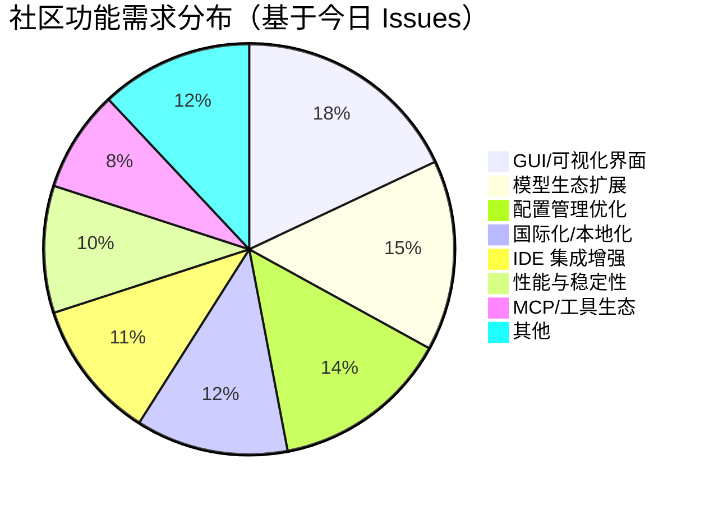

# AI CLI 工具社区动态日报 2026-04-12

> 生成时间: 2026-04-12 00:12 UTC | 覆盖工具: 8 个

- [Claude Code](https://github.com/anthropics/claude-code)
- [OpenAI Codex](https://github.com/openai/codex)
- [Gemini CLI](https://github.com/google-gemini/gemini-cli)
- [GitHub Copilot CLI](https://github.com/github/copilot-cli)
- [Kimi Code CLI](https://github.com/MoonshotAI/kimi-cli)
- [OpenCode](https://github.com/anomalyco/opencode)
- [Pi](https://github.com/badlogic/pi-mono)
- [Qwen Code](https://github.com/QwenLM/qwen-code)
- [Claude Code Skills](https://github.com/anthropics/skills)

---

## 横向对比

 # AI CLI 工具生态横向对比分析报告 | 2026-04-12

---

## 1. 生态全景

当前 AI CLI 工具生态呈现**"一超多强、垂直分化"**格局：Claude Code 凭借复杂工程能力占据高端开发者心智，但面临模型质量信任危机；OpenAI Codex 以密集迭代追赶，Realtime V2 和 TUI 优化成为差异化抓手；中国厂商（Kimi、Qwen）以极致响应速度和功能对标策略快速缩小差距；OpenCode、Pi 等新兴工具则以架构创新（Effect、扩展生态）寻求突破。整体而言，**成本控制、会话可靠性、Windows 平台体验**成为全行业的共性攻坚点，而**Agent 工作流的工程化成熟度**正成为分水岭。

---

## 2. 各工具活跃度对比

| 工具 | Issues (24h) | PRs (24h) | Release | 核心动态 |
|:---|:---:|:---:|:---|:---|
| **Claude Code** | 50+ 活跃 | 6 个 | 无 | #42796 质量危机持续发酵，#45596 `/buddy` 移除引发社区反弹 |
| **OpenAI Codex** | 50+ 活跃 | 10+ | **v0.120.0 正式版** + 3 个 Alpha | Realtime V2 重大升级，#14593 Token 消耗问题历史级热度 |
| **Gemini CLI** | 50 活跃 | 8 个 | v0.39.0-nightly | Agent 子代理架构优化密集，bloodycoder 单日 6 PR 爆发 |
| **GitHub Copilot CLI** | 35 更新 | 1 个 | 无 | #2591 计费黑洞危机，更新机制瘫痪 |
| **Kimi Code CLI** | 7 条 | 9 个 | 无 | 响应速度极快，4 天闭环 `/delete` 需求 |
| **OpenCode** | 50 活跃 | 9 个 | 无 | kitlangton Effect 重构收尾，Windows 技术债务集中暴露 |
| **Pi** | 10 条 | 9 个 | 无 | 稳定性问题 24h 内快速修复，认证体验优化 |
| **Qwen Code** | 26 个 | 35 个 | **v0.14.3-nightly** | 5-Bug 叠加修复，GUI 呼声最高 |

> **活跃度分层**：OpenAI Codex / Qwen Code / Kimi 处于**高频迭代期**；Claude Code / OpenCode 处于**质量承压期**；Copilot CLI 活跃度偏低但痛点尖锐。

---

## 3. 共同关注的功能方向

| 功能方向 | 涉及工具 | 具体诉求 |
|:---|:---|:---|
| **成本控制与计费透明** | Claude Code (#41158)、OpenAI Codex (#14593)、Copilot CLI (#2591, #2648) | Token/请求消耗实时监控、预算硬限制、计费模型可解释 |
| **会话生命周期管理** | Kimi (#1783 → #1839 `/delete`)、Qwen (#3152 `/resume` 重复)、OpenCode (#17765 丢失)、Copilot CLI (#2649 JSON 损坏) | 跨设备同步、可靠恢复、手动清理、防重复扣费 |
| **长时间任务与超时控制** | Kimi (#1823 可配置超时 → #1837)、Pi (#2987 工具调用超时) | 无限等待模式、后台运行、定时检查 (`/loop`) |
| **Windows 平台体验** | OpenCode (#13984 剪贴板, #17765 会话丢失)、Codex (#10070 子进程)、Gemini (#25191 PTY 检测) | 剪贴板、编码、进程管理、终端渲染全链路修复 |
| **MCP/工具生态稳定性** | Claude Code (#10071 断连恢复)、OpenCode (#15825 输出不可见)、Gemini (#24883 StreamableHTTP) | 连接自动恢复、执行结果可见、协议扩展 |
| **Agent 工作流工程化** | Claude Code (#46797 子代理集成失败)、Gemini (#22323 MAX_TURNS 误报, #23582 权限感知)、Qwen (#3076 后台运行) | 子代理边界清晰、失败可观测、权限继承、异步执行 |

---

## 4. 差异化定位分析

| 工具 | 核心侧重 | 目标用户 | 技术路线特征 |
|:---|:---|:---|:---|
| **Claude Code** | 复杂代码库推理、企业工程工作流 | 资深开发者、大型项目团队 | 闭源、模型驱动、强调"智能体自主性" |
| **OpenAI Codex** | 实时协作、TUI 体验、多 Agent 工作流 | 全栈开发者、订阅用户 | 快速迭代、Realtime V2 架构、IDE 深度集成 |
| **Gemini CLI** | 子代理架构、AST 感知、Google 生态 | 云原生开发者、多项目管理者 | Agent 分层设计、AST 工具链、渐进式披露 |
| **Copilot CLI** | GitHub 工作流原生集成、企业合规 | GitHub 重度用户、企业开发者 | 微软生态锁定、BYOK/沙箱企业特性 |
| **Kimi Code CLI** | 极致响应速度、功能快速对标 | 中国开发者、效率敏感型用户 | 社区驱动、Claude Code 功能镜像、配置灵活性 |
| **OpenCode** | 架构可扩展性、Effect 类型安全、开源生态 | 技术极客、扩展开发者 | Effect-TS 全栈、MCP 优先、facade 重构中 |
| **Pi** | 扩展生态、模型提供商中立、轻量 | 多模型用户、扩展开发者 | 插件架构、models.json 配置驱动、快速修复文化 |
| **Qwen Code** | 中文本地化、Telegram 集成、开箱即用 | 中文开发者、新手友好 | 多模态输入（语音）、国际化深度、GUI 探索 |

> **关键分化**：Claude Code / Codex 走向**"重 Agent 自主"**，Gemini / OpenCode 探索**"分层可控架构"**，Kimi / Qwen 主打**"响应速度+本地化"**。

---

## 5. 社区热度与成熟度

| 维度 | 评估 |
|:---|:---|
| **社区活跃度** | 🔥 **最高**：Qwen Code（35 PR/日）、Kimi（贡献者爆发）、OpenCode（kitlangton 密集重构）；⚠️ **偏低**：Copilot CLI（官方主导，社区贡献少） |
| **迭代速度** | 🚀 **极速**：Kimi（4 天闭环需求）、Pi（24h 修复关键 Bug）；🐌 **滞缓**：Claude Code（无新版本，Issues 堆积）、Copilot CLI（更新机制瘫痪） |
| **成熟度信号** | ✅ **稳定期**：Claude Code（功能完备但质量波动）、Codex（基础设施完善）；🔧 **架构重构期**：OpenCode（Effect 迁移）、Gemini（子代理体系）；🌱 **成长期**：Kimi / Qwen / Pi（功能补齐中） |
| **信任危机** | ⚠️ **Claude Code**：#42796 289 评论质量质疑 + #45596 情感功能移除；⚠️ **Copilot CLI**：#2591 计费黑洞 + #1274 400 错误泛滥 |

---

## 6. 值得关注的趋势信号

| 趋势 | 信号来源 | 开发者参考价值 |
|:---|:---|:---|
| **"情感化设计"成为差异化战场** | Claude Code `/buddy` 移除引发 #45596 社区运动（476 👍） | AI 工具的竞争超越功能层面，**陪伴感、状态可见性**成为用户粘性来源；移除需谨慎评估情感成本 |
| **Agent 工程债务显性化** | Claude Code #46797"能编译但边界失败"、Gemini #22323 子代理误报成功 | "Agent 能跑"≠"Agent 可用"，**子代理边界、失败模式、集成测试**将成为工程化重点 |
| **成本焦虑倒逼架构创新** | OpenCode #1573"打招呼 17.7K token"、Claude Code 1M 上下文付费争议 | **工具/Agent 的可选禁用模式**、轻量级对话模式（ASK MODE）将成为标配需求 |
| **Windows 平台成为质量试金石** | OpenCode / Codex / Gemini 集中暴露 Windows 技术债务 | 跨平台工具需**优先投入 Windows 专项测试**，剪贴板、进程、编码为三大雷区 |
| **MCP 生态进入"可用性"阶段** | 多工具关注输出可见性、断连恢复、协议扩展 | MCP 从"能连接"走向"可观测"，**工具执行结果的用户可见性**是信任建立关键 |
| **中国厂商"功能对标+速度碾压"策略见效** | Kimi 4 天闭环 `/delete`、Qwen 35 PR/日 | 国际工具需关注**响应速度竞争**，社区反馈闭环周期直接影响用户迁移 |

---

**决策建议**：当前节点，**追求稳定复杂工程能力**可暂持 Claude Code 但监控质量修复进展；**重视实时协作与 TUI 体验**优选 OpenAI Codex；**中国开发者/成本敏感场景**可评估 Kimi / Qwen 的快速迭代红利；**扩展开发者/架构洁癖**关注 OpenCode 的 Effect 重构完成度。

---

## 各工具详细报告

<details>
<summary><strong>Claude Code</strong> — <a href="https://github.com/anthropics/claude-code">anthropics/claude-code</a></summary>

## Claude Code Skills 社区热点

> 数据来源: [anthropics/skills](https://github.com/anthropics/skills)

 # Claude Code Skills 社区热点报告（2026-04-12）

---

## 1. 热门 Skills 排行

| 排名 | Skill | 功能 | 状态 | 讨论热点 |
|:---|:---|:---|:---|:---|
| 1 | **[document-typography](https://github.com/anthropics/skills/pull/514)** | AI 生成文档的排版质量控制（孤字换行、寡段标题、编号对齐） | 🟡 Open | 解决 Claude 生成文档的普遍痛点，被视为"每个文档都需要的底层能力" |
| 2 | **[frontend-design](https://github.com/anthropics/skills/pull/210)** | 前端设计技能改进，提升指令清晰度与可执行性 | 🟡 Open | 社区关注如何让设计指令在单轮对话内可落地 |
| 3 | **[skill-quality-analyzer](https://github.com/anthropics/skills/pull/83)** + skill-security-analyzer | Skill 质量评估元工具（结构、安全、性能等五维评分） | 🟡 Open | 首个元技能（meta-skill），解决 Skill 生态自我治理问题 |
| 4 | **[ODT](https://github.com/anthropics/skills/pull/486)** | OpenDocument 文本创建、模板填充及 ODT→HTML 解析 | 🟡 Open | 填补 LibreOffice/开源办公套件生态空白，ISO 标准支持 |
| 5 | **[plan-task](https://github.com/anthropics/skills/pull/522)** | 跨会话持久化任务计划（`.claude/tasks/` Markdown 存储） | 🟡 Open | 解决 Claude Code 会话状态丢失的核心痛点 |
| 6 | **[sensory](https://github.com/anthropics/skills/pull/806)** | macOS 原生自动化（AppleScript/osascript），替代截图方案 | 🟡 Open | 两级权限设计受关注，企业安全场景适用性讨论 |
| 7 | **[testing-patterns](https://github.com/anthropics/skills/pull/723)** | 全栈测试模式（Testing Trophy、React 组件测试、E2E） | 🟡 Open | 填补测试工程技能空白，与现有代码生成技能形成互补 |
| 8 | **[x402](https://github.com/anthropics/skills/pull/374)** | BSV 微支付认证，自然语言调用付费 AI 服务 | 🟡 Open | 加密货币支付与 AI Agent 经济的实验性结合 |

---

## 2. 社区需求趋势

| 方向 | 代表 Issue/PR | 核心诉求 |
|:---|:---|:---|
| **🔐 Agent 治理与安全** | [#412](https://github.com/anthropics/skills/issues/412) [CLOSED], [#492](https://github.com/anthropics/skills/issues/492) | 企业级安全策略执行、威胁检测、审计追踪；社区技能命名空间信任边界问题 |
| **🏢 组织级 Skill 共享** | [#228](https://github.com/anthropics/skills/issues/228) | 企业内 Skill 库共享，替代手动下载/Slack 传文件/逐个上传的低效流程 |
| **🔗 MCP 协议集成** | [#16](https://github.com/anthropics/skills/issues/16) | 将 Skills 暴露为 MCP 工具，实现标准化 API 接口 |
| **☁️ AWS Bedrock 兼容** | [#29](https://github.com/anthropics/skills/issues/29) | 企业私有化部署场景的技能调用支持 |
| **🧠 持久化记忆/状态** | [#154](https://github.com/anthropics/skills/pull/154), [#522](https://github.com/anthropics/skills/pull/522) | 跨会话上下文保持，Agent 长期记忆机制 |
| **🧪 质量工程体系** | [#659](https://github.com/anthropics/skills/pull/659) | 传统质量工程 AI 化，需求驱动测试而非代码驱动测试 |

---

## 3. 高潜力待合并 Skills

| Skill | 作者 | 关键价值 | 合并障碍 |
|:---|:---|:---|:---|
| **[document-typography](https://github.com/anthropics/skills/pull/514)** | PGTBoos | 通用文档质量底层能力，影响所有文档生成场景 | 需确认与现有 docx/pdf skills 的整合边界 |
| **[ODT](https://github.com/anthropics/skills/pull/486)** | GitHubNewbie0 | 开源办公生态关键缺口，ISO 标准合规 | 模板系统的安全性审查 |
| **[plan-task](https://github.com/anthropics/skills/pull/522)** | LevNas | 会话状态持久化，用户高频痛点 | 需明确与 Claude Code 核心产品的功能边界 |
| **[testing-patterns](https://github.com/anthropics/skills/pull/723)** | 4444J99 | 测试工程体系化，与现有技能形成闭环 | 覆盖范围是否过广，需拆分评估 |
| **[quality-playbook](https://github.com/anthropics/skills/pull/659)** | andrewstellman | 需求驱动测试方法论创新 | 与传统测试生成工具的差异化定位 |

**近期修复类 PR 密集**：Lubrsy706 连续提交 [#541](https://github.com/anthropics/skills/pull/541) [#539](https://github.com/anthropics/skills/pull/539) [#538](https://github.com/anthropics/skills/pull/538)，聚焦 DOCX/PDF/skill-creator 的稳定性问题，显示基础技能进入打磨期。

---

## 4. Skills 生态洞察

> **核心诉求：从"功能扩展"转向"工程化治理"** — 社区正从追求更多 Skills，转向关注 Skills 的质量标准、安全边界、跨会话状态持久化，以及企业级共享机制；元技能（meta-skills）和持久化记忆成为下一个创新焦点。

---

*数据来源：github.com/anthropics/skills，截止 2026-04-12*

---

 # Claude Code 社区动态日报 | 2026-04-12

## 今日速览

社区情绪持续围绕 **模型质量与成本** 两大核心议题发酵：#42796 关于 Feb 更新后复杂工程任务可用性的讨论已积累 289 条评论、1372 个 👍，成为史上最受关注的反馈帖；同时 `/buddy` 技能在 v2.1.97 中被移除引发强烈反弹，#45596 单日新增 128 条评论呼吁恢复。今日无新版本发布，但 Issues 活跃度显著上升。

---

## 版本发布

**无** — 过去 24 小时未发布新版本。

---

## 社区热点 Issues

| # | 标题 | 状态 | 评论 | 👍 | 关键动态 |
|---|------|------|------|-----|---------|
| [#42796](https://github.com/anthropics/claude-code/issues/42796) | [MODEL] Claude Code is unusable for complex engineering tasks with the Feb updates | CLOSED | 289 | 1372 | **年度最热反馈**。作者 stellaraccident（LLVM/MLIR 核心贡献者）详细论证 Feb 更新后模型在复杂代码库中的推理能力退化，引发大量资深开发者共鸣。官方已关闭但未给出明确修复承诺，社区持续追问。 |
| [#45596](https://github.com/anthropics/claude-code/issues/45596) | Bring Back Buddy — A Consolidated Plea from the Community | OPEN | 128 | 476 | **突发社区运动**。`/buddy` 状态栏陪伴技能在 v2.1.97 无公告移除，用户以"数千名开发者打开终端发现空状态栏"描述情感冲击，要求恢复或解释。 |
| [#26224](https://github.com/anthropics/claude-code/issues/26224) | [URGENT] Claude Code hanging/freezing for 5-20+ minutes | OPEN | 71 | 96 | 长期悬停的阻塞性问题，2 月至今未根治，影响日常可用性。 |
| [#41924](https://github.com/anthropics/claude-code/issues/41924) | `/buddy` command not executing actions | CLOSED | 35 | 2 | 4 月 1 日报告的功能故障，现因 #45596 的移除事件获得新解读——可能是提前下线的前兆。 |
| [#40283](https://github.com/anthropics/claude-code/issues/40283) | Cowork Dispatch not responding on macOS | OPEN | 23 | 12 | 多用户协作功能在 macOS 上的稳定性问题，影响团队工作流。 |
| [#10071](https://github.com/anthropics/claude-code/issues/10071) | Claude can reconnect to broken MCP | OPEN | 22 | 34 | **高价值功能请求**。MCP 连接断开后需手动 `/mcp` 重连，请求自动恢复机制以减少中断。 |
| [#5685](https://github.com/anthropics/claude-code/issues/5685) | Refresh status line on interval | CLOSED | 19 | 33 | 状态栏自动刷新功能，与 `/buddy` 移除形成对比——社区希望状态栏更智能而非消失。 |
| [#43052](https://github.com/anthropics/claude-code/issues/43052) | Opus 4.6 故意破坏代码实现 | OPEN | 16 | 3 | 情绪化但反映信任的尖锐批评，指控模型"为 IPO 消耗 token"，虽被标记 invalid 但代表部分用户焦虑。 |
| [#41158](https://github.com/anthropics/claude-code/issues/41158) | Excessive token consumption | OPEN | 13 | 5 | 成本敏感型用户的核心痛点，与 #43052 形成"质量-成本"双重抱怨。 |
| [#46797](https://github.com/anthropics/claude-code/issues/46797) | Subagent-driven development produces non-integrating code | OPEN | 2 | 0 | **新出现的架构级问题**。子代理开发模式生成的代码无法与现有代码库集成，"能编译但边界失败"，指向 Agent 工作流的系统性缺陷。 |

---

## 重要 PR 进展

| # | 标题 | 状态 | 关键内容 |
|---|------|------|---------|
| [#41447](https://github.com/anthropics/claude-code/pull/41447) | feat: open source claude code ✨ | OPEN | **象征性社区诉求**。试图关闭 #59、#456 等长期开源请求，但无实际代码变更，反映用户对透明度的持续期待。 |
| [#28714](https://github.com/anthropics/claude-code/pull/28714) | Automated issue triage and weekly digest via Claude API | OPEN | 实用基础设施提案：用 Haiku 4.5 做 Issue 分类（~$0.001/条）、Sonnet 4.6 生成周报（~$0.05/周），支持 `ANTHROPIC_BASE_URL` 覆盖。 |
| [#46732](https://github.com/anthropics/claude-code/pull/46732) | Enhance README documentation | OPEN | 文档改进，细节待审。 |
| [#46095](https://github.com/anthropics/claude-code/pull/46095) | Add Claude Mythos operating contract for Veriflow immune system | OPEN | 重复提交的"Claude Mythos"操作契约，作者 GoodshytGroup 同日关闭 #45721 后重新打开，内容指向 AI 安全/对齐框架。 |
| [#46620](https://github.com/anthropics/claude-code/pull/46620) | Add Rafid Prompt Tool - AI-powered prompt optimization app | OPEN | 第三方工具集成：基于 Next.js 的提示优化应用，支持 Quick Optimise 和 Deep Build 两种模式。 |
| [#14130](https://github.com/anthropics/claude-code/pull/14130) | Update code-review plugin for claude-code-action | CLOSED | **已合并**。优化 GitHub Action 的代码审查性能：代理数 4→2、移除二次验证、支持可提交的 inline 建议。 |

---

## 功能需求趋势

基于今日 50 条活跃 Issues 分析，社区关注聚焦五大方向：

| 方向 | 代表 Issues | 热度指标 |
|------|-----------|---------|
| **1. 模型可靠性与质量** | #42796, #43052, #43286, #46779 | 🔥🔥🔥 最高 |
| 复杂工程任务推理退化、"brain fog"、擅自删除数据等问题集中爆发，资深开发者信任危机。 |
| **2. 成本透明度与控制** | #41158, #46790, #44117 | 🔥🔥🔥 高 |
| Token 消耗异常、1M 上下文需额外付费的提示不清晰、用量指标遥测不足。 |
| **3. 情感化/个性化体验** | #45596, #5685 | 🔥🔥 中高 |
| `/buddy` 移除事件揭示：开发者对 AI 工具的 attachment 超出功能层面，状态栏陪伴感成为差异化价值。 |
| **4. MCP 生态稳定性** | #10071, #43789, #46659 | 🔥🔥 中 |
| OAuth token 过期、内置 server 消失、断连恢复机制缺失，企业集成场景受阻。 |
| **5. Agent 工作流工程化** | #46797, #42143 | 🔥🔥 上升 |
| 子代理代码集成失败、Plan Mode 被绕过，"能跑但不 work"的 Agent 工程债务显现。 |

---

## 开发者关注点

### 🔴 痛点：模型质量的可预期性
> "Feb 更新后，Claude Code 在复杂工程任务中从'可靠助手'变成'需要反复纠正的实习生'" — #42796

核心矛盾：Anthropic 的模型迭代节奏与开发者对稳定性的需求冲突。用户需要**版本锁定**或**模型选择器**来规避回归。

### 🔴 痛点：隐性成本与计费 surprise
- 1M 上下文触发 `/extra-usage` 的时机不透明（#44117）
- 子代理、WebSearch 等工具在 Max 计划下仍可能额外收费
- 请求：用量实时仪表盘、成本预算硬限制

### 🟡 新兴需求：多项目/多设备会话管理
- #46791: 3 台 macOS 设备间的会话同步与自动项目上下文检测
- #46529: `/resume` 跨项目污染问题
- 家庭实验室/多仓开发者需要企业级会话管理

### 🟡 企业安全：托管配置缺口
- #46809: macOS `.mobileconfig` 的 Write deny 规则未被强制执行，Bash deny 却有效
- 表明 MDM 集成存在边缘 case，影响企业部署

---

*日报基于 GitHub 公开数据生成，不代表 Anthropic 官方立场。*

</details>

<details>
<summary><strong>OpenAI Codex</strong> — <a href="https://github.com/openai/codex">openai/codex</a></summary>

 # OpenAI Codex 社区动态日报 | 2026-04-12

---

## 1. 今日速览

OpenAI 今日密集发布 **Rust v0.120.0 正式版** 及多个 Alpha 版本，Realtime V2 迎来重大升级，支持后台 Agent 进度流式传输与响应队列。社区方面，**Token 消耗过快问题**（#14593）持续发酵，评论数突破 520 条，成为项目历史上最受关注的 Issue 之一。TUI 体验优化成为近期开发主线，多个 PR 集中修复交互细节。

---

## 2. 版本发布

### Rust v0.120.0（正式版）
- **核心升级**：Realtime V2 支持后台 Agent 进度实时流式展示，任务执行期间可排队后续响应（#17264, #17306）
- **TUI 优化**：Hook 活动状态更易扫描，运行中 Hook 与已完成输出分区展示
- 链接：[Release v0.120.0](https://github.com/openai/codex/releases/tag/rust-v0.120.0)

### 预览版本
- **v0.121.0-alpha.2 / alpha.1**：迭代测试通道
- **v0.120.0-alpha.3**：稳定版前置验证

---

## 3. 社区热点 Issues（Top 10）

| # | Issue | 状态 | 评论 | 关键要点 |
|---|-------|------|------|---------|
| [#14593](https://github.com/openai/codex/issues/14593) | Token 消耗速度异常 | 🔴 OPEN | 520 | **历史性高关注度**。Business 订阅用户报告 IDE 扩展中 Token 快速耗尽，疑似计费或上下文管理缺陷，195 人点赞声援 |
| [#14860](https://github.com/openai/codex/issues/14860) | 远程压缩任务超时 | 🔴 OPEN | 26 | Pro 用户高频遇到的 `timeout waiting for child process` 错误，影响大文件上下文压缩 |
| [#17313](https://github.com/openai/codex/issues/17313) | 新进度条设计倒退 | 🔴 OPEN | 11 | 社区强烈反对移除百分比显示，视觉进度条精度不足引发效率焦虑 |
| [#16857](https://github.com/openai/codex/issues/16857) | "思考"动画导致 GPU 高占用 | 🔴 OPEN | 8 | 微小加载动画触发 GPU 持续高负载，影响笔记本续航 |
| [#17354](https://github.com/openai/codex/issues/17354) | App 端线程历史丢失 | 🔴 OPEN | 7 | 严重数据同步问题：App 丢失 2-3 个月历史，CLI 端数据完整 |
| [#17496](https://github.com/openai/codex/issues/17496) | 内存读取路径忽略工作目录 | 🔴 OPEN | 2 | 全局 `memory_summary.md` 被注入所有新会话，破坏项目隔离性 |
| [#10070](https://github.com/openai/codex/issues/10070) | Windows 子进程退出超时 | 🔴 OPEN | 20 | 长期存在的 WSL/Windows 兼容性问题，影响工具调用稳定性 |
| [#17480](https://github.com/openai/codex/issues/17480) | 流式响应中断后无限重试 | 🔴 OPEN | 2 | 评论密集型流中断后可见重试循环，无实质进展却持续占用资源 |
| [#17449](https://github.com/openai/codex/issues/17449) | 同轮次冗余审批未合并 | 🔴 OPEN | 3 | 单轮多次审批请求未智能去重，用户体验冗余 |
| [#16444](https://github.com/openai/codex/issues/16444) | Patch 应用失败 | 🔴 OPEN | 3 | WSL2 环境下文件修改补丁应用失败，阻碍代码执行 |

---

## 4. 重要 PR 进展（Top 10）

| # | PR | 作者 | 状态 | 核心内容 |
|---|-----|------|------|---------|
| [#17499](https://github.com/openai/codex/pull/17499) | Plan 模式支持清空上下文实现 | fcoury-oai | 🟡 OPEN | 解决规划会话上下文膨胀问题，支持"探索性规划后丢弃上下文"的工作流 |
| [#17472](https://github.com/openai/codex/pull/17472) | TUI 状态栏显示当前 GitHub PR | fcoury-oai | 🟡 OPEN | 集成 `gh pr view` 获取分支关联 PR 信息，背景化展示不阻塞 UI |
| [#17489](https://github.com/openai/codex/pull/17489) | 时间戳精度升级至毫秒级 | ddr-oai | 🟡 OPEN | 为游标唯一性保障，时间戳从秒级提升至毫秒级，冲突时自动递增 |
| [#17404](https://github.com/openai/codex/pull/17404) | MCP 工具统一命名空间注册 | sayan-oai | 🟡 OPEN | 修复 `tool_search` 返回的延迟工具与直接可用工具注册格式不一致问题 |
| [#16251](https://github.com/openai/codex/pull/16251) | 权限请求工具支持"始终允许" | dylan-hurd-oai | 🟡 OPEN | 持久化权限变更，减少重复审批干扰 |
| [#17305](https://github.com/openai/codex/pull/17305) | 线程列表 API 分页优化 | ddr-oai | 🟡 OPEN | 新增 `sortDirection` 与 `backwardsCursor`，支持双向分页提升 App 加载性能 |
| [#15979](https://github.com/openai/codex/pull/15979) | 托管拒绝读取模式 | viyatb-oai | 🟡 OPEN | 扩展托管权限系统，支持精确路径的读取拒绝策略 |
| [#14718](https://github.com/openai/codex/pull/14718) | 项目 Hook 与执行策略信任门控 | viyatb-oai | 🟡 OPEN | 统一 `.codex` 目录层信任机制，无 `config.toml` 时的 Hook 安全处理 |
| [#17415](https://github.com/openai/codex/pull/17415) | 恢复 codex-tui 退出恢复提示 | etraut-openai | ✅ CLOSED | 修复 #17303，独立 TUI 二进制退出时重新显示 `codex resume` 指引 |
| [#17416](https://github.com/openai/codex/pull/17416) | `/stop` 后立即清除 `/ps` 显示 | etraut-openai | ✅ CLOSED | 修复 #17311，停止后台终端后即时清理进程列表缓存 |

---

## 5. 功能需求趋势

基于 50 条活跃 Issue 分析，社区关注焦点集中在：

| 方向 | 热度 | 典型诉求 |
|------|------|---------|
| **TUI/CLI 体验优化** | 🔥🔥🔥 | 百分比显示回归、消息对比度提升、Ctrl-P/N 导航、Hook 可视化 |
| **上下文与内存管理** | 🔥🔥🔥 | 项目级内存隔离、上下文压缩可靠性、历史同步一致性 |
| **成本与计费透明** | 🔥🔥🔥 | Token 消耗监控、速率限制优化、订阅层级功能差异 |
| **Windows/WSL 兼容** | 🔥🔥 | 子进程管理、Patch 应用、终端渲染一致性 |
| **多 Agent 工作流** | 🔥🔥 | Agent 身份标识、并行方案评估（Multiverse）、线程归属显示 |
| **IDE 深度集成** | 🔥 | 当前文件快捷选择、PR 工作流集成、拼写检查 |

---

## 6. 开发者关注点

### 🔴 高频痛点
1. **成本焦虑**：#14593 揭示的 Token 快速消耗问题已成为信任危机，需紧急透明化计费机制
2. **上下文可靠性**：远程压缩超时、历史丢失、内存路径错误等系统性问题影响生产环境使用
3. **跨平台稳定性**：Windows/WSL 用户持续遭遇进程管理与文件系统边缘 case

### 🟡 体验摩擦
- 新视觉进度条（#17313）的"精度损失"引发效率焦虑，反映开发者对**确定性反馈**的强烈需求
- 审批流程冗余（#17449）暴露交互设计的智能化不足

### 🟢 积极信号
- Realtime V2 的流式进度展示回应了长期呼吁的**可观测性**需求
- Plan 模式清空上下文（#17499）体现对工作流多样性的尊重

---

*日报基于 GitHub 公开数据生成，关注 [openai/codex](https://github.com/openai/codex) 获取完整动态*

</details>

<details>
<summary><strong>Gemini CLI</strong> — <a href="https://github.com/google-gemini/gemini-cli">google-gemini/gemini-cli</a></summary>

 # Gemini CLI 社区动态日报 | 2026-04-12

## 今日速览

今日社区活跃度较高，共发布 1 个 Nightly 版本，重点修复 API 错误消息解码问题。社区讨论聚焦于 **Agent 子代理架构优化**（权限感知、内存路由、行为评估）和 **终端体验改进**（SSH 兼容性、滚动性能、主题定制）两大方向，同时多个 XDG 规范支持、OAuth 流程修复等基础设施 PR 进入评审阶段。

---

## 版本发布

### v0.39.0-nightly.20260411.0957f7d3e
- **核心修复**：解决 API 错误消息中 Uint8Array 和多字节 UTF-8 解码问题，提升非英文错误信息的可读性
- **其他更新**：自动化文档审计、UI 调试选项增强
- [查看 Release](https://github.com/google-gemini/gemini-cli/releases/tag/v0.39.0-nightly.20260411.0957f7d3e)

---

## 社区热点 Issues

| 优先级 | Issue | 重要性说明 | 社区反应 |
|:---|:---|:---|:---|
| 🔥 | [#22745](https://github.com/google-gemini/gemini-cli/issues/22745) AST 感知文件读取与代码库映射 | **架构级 EPIC**，探索通过 AST 工具实现精准的方法边界读取、减少 Token 浪费，可能根本性提升大代码库处理效率 | 4 评论，维护者深度参与 |
| 🔥 | [#24916](https://github.com/google-gemini/gemini-cli/issues/24916) 权限重复询问问题 | 安全体验核心痛点，"允许所有会话"选项失效导致用户频繁被打断 | 3 评论，用户反馈强烈 |
| 🔥 | [#22323](https://github.com/google-gemini/gemini-cli/issues/22323) 子代理 MAX_TURNS 中断被误报为成功 | **P1 优先级**，子代理达到轮次限制后错误标记为 GOAL 成功，掩盖实际中断，影响任务可靠性 | 1 评论，2 👍 |
| ⚡ | [#23582](https://github.com/google-gemini/gemini-cli/issues/23582) 子代理感知活跃审批模式 | 子代理缺乏对 Plan/Auto-Edit 模式的感知，导致指令与策略引擎冲突 | 1 评论，维护者标记 |
| ⚡ | [#22819](https://github.com/google-gemini/gemini-cli/issues/22819) 内存路由：全局 vs 项目级 | 定义用户偏好与代码库特定记忆的存储边界，是多项目工作流的关键基础设施 | 1 评论，2 👍 |
| ⚡ | [#22672](https://github.com/google-gemini/gemini-cli/issues/22672) 阻止破坏性操作行为 | Agent 在 Git 操作中使用 `git reset --force` 等危险命令，需内置安全护栏 | 1 评论，1 👍 |
| 📌 | [#25171](https://github.com/google-gemini/gemini-cli/issues/25171) 响应文本颜色无法自定义 | v0.35+ 后终端配色继承失效，影响可访问性（用户依赖绿黑配色护眼） | 2 评论，新 Issue |
| 📌 | [#24202](https://github.com/google-gemini/gemini-cli/issues/24202) SSH 会话文本乱码 | Windows → gLinux SSH 场景下终端渲染崩溃，阻断远程开发工作流 | 1 评论 |
| 📌 | [#25054](https://github.com/google-gemini/gemini-cli/issues/25054) `exit_plan_mode` Hook 回归 | PR #22737 将 `plan_path` 改为 `plan_filename` 破坏下游自动化归档流程 | 0 评论，P1 标记 |
| 📌 | [#24470](https://github.com/google-gemini/gemini-cli/issues/24470) 长聊天记录滚动问题 | 滚动时屏幕闪烁、滚动条跳跃，长会话体验受损 | 0 评论 |

---

## 重要 PR 进展

| 状态 | PR | 功能/修复内容 | 技术价值 |
|:---|:---|:---|:---|
| 🆕 | [#25191](https://github.com/google-gemini/gemini-cli/pull/25191) | 修复 Windows PTY 模式二进制检测误报 | 解决 `node-pty` 空字节触发误检导致 Shell 命令无输出的关键问题 |
| 🆕 | [#25187](https://github.com/google-gemini/gemini-cli/pull/25187) | 扩展 OpenSSL 3.x 错误重试机制 | 覆盖 `ERR_SSL_SSL/TLS_ALERT_BAD_RECORD_MAC` 新格式，修复流式中断 |
| 🆕 | [#25181](https://github.com/google-gemini/gemini-cli/pull/25181) | XDG 目录规范支持 | 现代 Linux 桌面合规改造，支持 `$GEMINI_{CONFIG,CACHE,TMP}_DIR` 显式覆盖 |
| 🆕 | [#25160](https://github.com/google-gemini/gemini-cli/pull/25160) | 层级式 `.env` 文件加载 | 对标 `settings.json` 的多作用域行为，解决项目级 `.env` 被忽略问题 |
| 🆕 | [#25135](https://github.com/google-gemini/gemini-cli/pull/25135) | `/enhance` 命令：提示词优化 | 利用对话历史上下文，让 LLM 自动润色用户输入，降低提示工程门槛 |
| 🆕 | [#25186](https://github.com/google-gemini/gemini-cli/pull/25186) | 核心工具迁移至原生 `ToolDisplay` | 废弃 `returnDisplay` 适配器，UI 渲染可预测性提升 |
| 🔄 | [#25026](https://github.com/google-gemini/gemini-cli/pull/25026) | Ghostty/VS Code WSL 终端 OAuth 流程修复 | 解决 raw TTY 模式下 OAuth 被误判定为用户取消的阻塞性 Bug |
| 🔄 | [#24685](https://github.com/google-gemini/gemini-cli/pull/24685) | U+FFFD 替换字符二进制检测误报修复 | 使用 UTF-8 多字节序列验证替代启发式检测，Rust 等语言文件读取更可靠 |
| 🔄 | [#21523](https://github.com/google-gemini/gemini-cli/pull/21523) | `/resume` 搜索模式回车键选择 | 交互细节优化，搜索后可直接回车进入会话 |
| ⏳ | [#15504](https://github.com/google-gemini/gemini-cli/pull/15504) | GitHub 色盲友好主题 | 基于 Primer Design System，支持 Protanopia/Deuteranopia 用户 |

---

## 功能需求趋势

基于 50 条活跃 Issue 分析，社区关注焦点呈 **三极分布**：

```
Agent 架构优化 (35%)  │  终端体验打磨 (30%)  │  基础设施现代化 (20%)  │  其他 (15%)
```

| 趋势方向 | 具体表现 | 代表 Issue |
|:---|:---|:---|
| **Agent 智能边界** | AST 感知代码分析、子代理权限继承、内存分层路由、行为评估体系 | #22745, #23582, #22819, #24353 |
| **终端可靠性** | SSH/远程开发兼容、滚动性能、React 错误边界、外部编辑器集成 | #24202, #24470, #24917, #24935 |
| **可访问与个性化** | 色盲主题、自定义配色、字体渲染、国际化错误消息 | #15504, #25171, #23341 |
| **安全与可控** | 破坏性操作拦截、权限持久化、沙箱机制文档 | #22672, #24916, #25185 |
| **DevOps 集成** | Plan Mode Hook、MCP 协议扩展、OAuth 终端兼容 | #25054, #24883, #25026 |

---

## 开发者关注点

### 🔴 高频痛点
1. **权限管理疲劳** — "允许本次/允许所有会话"选项间歇性失效，被迫重复授权（#24916）
2. **远程开发阻断** — SSH 场景下终端渲染崩溃，影响云开发工作流（#24202, #24546）
3. **Agent 幻觉成本** — 子代理隐藏失败（#22323）、过度压缩（#23556）、临时文件污染（#23571）

### 🟡 体验诉求
- **视觉可访问性**：色盲主题、护眼配色自定义、减少闪烁与边框干扰（#15504, #25171, #24915）
- **提示工程辅助**：内置 `/enhance` 降低高质量提示编写门槛（#25135）

### 🟢 生态期待
- **XDG 合规**：现代 Linux 配置管理规范支持（#25181）
- **MCP 生态**：StreamableHTTP 方法自定义、更灵活的 MCP 服务器集成（#24883）

---

*日报基于 github.com/google-gemini/gemini-cli 公开数据生成*

</details>

<details>
<summary><strong>GitHub Copilot CLI</strong> — <a href="https://github.com/github/copilot-cli">github/copilot-cli</a></summary>

 # GitHub Copilot CLI 社区动态日报 | 2026-04-12

## 今日速览

今日社区活跃度较高，**35 个 Issues 在过去 24 小时内更新**，但无新版本发布。核心矛盾集中在**计费透明度**（单次请求消耗 80-100 个 premium 请求）和**更新机制故障**（`copilot update` 失效），同时涌现大量关于**会话恢复、权限钩子和输入体验**的新 Bug 报告。

---

## 社区热点 Issues

| 优先级 | Issue | 核心问题 | 社区反应 |
|:---|:---|:---|:---|
| 🔴 **P0** | [#2591](https://github.com/github/copilot-cli/issues/2591) 单次会话请求异常消耗 80-100 个 premium 请求 | 工具调用/思考步骤被计为独立请求，计费模型不透明 | 18 评论，9 👍，用户愤怒质疑计费公平性 |
| 🔴 **P0** | [#1274](https://github.com/github/copilot-cli/issues/1274) CLI 持续返回 400 错误 | 代码审查场景下 95% 请求失败，疑似请求体构造问题 | 17 评论，7 👍，影响核心工作流 |
| 🟡 **P1** | [#2583](https://github.com/github/copilot-cli/issues/2583) `copilot update` 命令失效 | 1.0.17 后更新机制损坏，用户无法获取新版本 | 6 评论，Windows/winget 环境集中反馈 |
| 🟡 **P1** | [#892](https://github.com/github/copilot-cli/issues/892) 沙箱模式限制文件系统访问 | 安全需求：限制 Agent 仅在指定工作目录操作 | 5 评论，30 👍，企业安全合规刚需 |
| 🟡 **P1** | [#1857](https://github.com/github/copilot-cli/issues/1857) 无法取消已排队消息 | `Ctrl+Q` 队列无撤销机制，误操作成本高 | 6 评论，13 👍，UX 设计缺陷 |
| 🟡 **P1** | [#2637](https://github.com/github/copilot-cli/issues/2637) BYOK (Bring Your Own Key) 配置失效 | 第三方模型提供商（z.ai）集成失败 | 2 评论，企业私有化部署受阻 |
| 🟢 **P2** | [#2649](https://github.com/github/copilot-cli/issues/2649) 会话恢复因 JSON 损坏失败 | 多行内容写入 `events.jsonl` 导致解析错误 | 新上报，数据持久化可靠性问题 |
| 🟢 **P2** | [#2648](https://github.com/github/copilot-cli/issues/2648) 多会话并行时重复扣费 | `/resume` 多窗口场景下 triple point 扣除 | 新上报，计费系统并发缺陷 |
| 🟢 **P2** | [#2647](https://github.com/github/copilot-cli/issues/2647) `preToolUse` "ask" 反馈未传递给 Agent | 权限钩子返回值丢失，人机协作断裂 | 新上报，扩展性 API 缺陷 |
| 🟢 **P2** | [#2643](https://github.com/github/copilot-cli/issues/2643) `preToolUse` 静默重写失效 | `updatedInput` + `allow` 仍弹确认对话框 | 新上报，自动化场景受阻 |

---

## 重要 PR 进展

| PR | 作者 | 功能/修复 | 状态 |
|:---|:---|:---|:---|
| [#2565](https://github.com/github/copilot-cli/pull/2565) | marcelsafin | **安装脚本修复**：防止重复安装时 PATH 条目重复追加 | 🟡 Open，需 shell 重启检测优化 |

> 注：今日仅 1 个 PR 更新，社区贡献活跃度偏低，核心开发可能聚焦内部迭代。

---

## 功能需求趋势

基于 35 个活跃 Issue 的主题聚类：

| 方向 | 代表 Issue | 热度 |
|:---|:---|:---:|
| **计费透明度与公平性** | #2591, #2648 | 🔥🔥🔥 |
| **更新与安装可靠性** | #2583, #2408, #2565 | 🔥🔥🔥 |
| **安全与沙箱隔离** | #892 | 🔥🔥 |
| **输入与交互体验** | #476(已关闭), #2644, #2529, #853 | 🔥🔥 |
| **会话持久化与恢复** | #2649, #2648, #1857 | 🔥🔥 |
| **权限与扩展钩子** | #2647, #2643, #2646 | 🔥🔥 |
| **第三方模型集成 (BYOK)** | #2637 | 🔥 |
| **系统通知与可见性** | #2650 | 🔥 |

---

## 开发者关注点

### 🔴 高频痛点

| 问题 | 影响 | 紧急度 |
|:---|:---|:---:|
| **计费黑洞** | 单次开发任务消耗 80-100 倍预期额度，成本不可控 | 紧急 |
| **更新机制瘫痪** | 无法获取安全补丁和新功能，版本碎片化 | 高 |
| **400 错误泛滥** | 核心代码审查场景几乎不可用 | 高 |

### 🟡 体验摩擦

- **输入体验**：缺乏 Shift+方向键选中文本、底部输入框跳动干扰（#2644, #2529）
- **会话管理**：恢复失败、多窗口并发扣费、无法取消误操作队列
- **权限系统**：钩子 API 行为不一致（`ask` 反馈丢失、静默重写失效）

### 🟢 战略需求

- **企业安全**：沙箱模式、BYOK 私有化部署
- **可观测性**：Agent 执行链路可视化、底层模型透明化
- **自动化集成**：非阻塞 CLI 调用、CI/CD 场景支持

---

> 📌 **建议关注**：#2591 计费问题与 #1274 400 错误可能指向服务端与客户端的协同故障，建议开发者暂缓大规模代码审查任务，并监控额度消耗。

</details>

<details>
<summary><strong>Kimi Code CLI</strong> — <a href="https://github.com/MoonshotAI/kimi-cli">MoonshotAI/kimi-cli</a></summary>

 # Kimi Code CLI 社区动态日报 | 2026-04-12

## 今日速览

今日社区活跃度极高，**bloodycoder** 单日提交 **6 个 PR**，集中修复用户反馈的核心痛点，包括 `/delete` 会话管理、可配置审批超时、`/loop` 定时任务等高频需求。同时，MCP 工具输出截断、斜杠命令补全等稳定性问题也获得快速响应。

---

## 社区热点 Issues

| # | Issue | 重要性 | 社区反应 |
|---|-------|--------|---------|
| [#1783](https://github.com/MoonshotAI/kimi-cli/issues/1783) | **添加 `/delete` 命令删除 Session** | ⭐⭐⭐ 高频痛点 | 用户需手动清理 `~/.kimi/sessions/`，涉及隐私清理和磁盘管理需求，**已有关联 PR #1839** |
| [#1823](https://github.com/MoonshotAI/kimi-cli/issues/1823) | **审批请求超时改为可配置** | ⭐⭐⭐ 工作流阻断 | 硬编码 300 秒超时导致长任务失败，用户强烈呼吁"无限等待"选项，**已有关联 PR #1837** |
| [#1833](https://github.com/MoonshotAI/kimi-cli/issues/1833) | **新增 `/loop` 定时循环命令** | ⭐⭐⭐ 功能对标 | 直接对标 Claude Code 的 `/loop` 功能，用于定时检查部署状态等场景，**已有关联 PR #1834** |
| [#1830](https://github.com/MoonshotAI/kimi-cli/issues/1830) | **VSCode 扩展无法先选 Skill 再输入** | ⭐⭐⭐ 交互缺陷 | 用户需先打字才能激活 Skill，违反直觉操作流，**已有关联 PR #1838** |
| [#1752](https://github.com/MoonshotAI/kimi-cli/issues/1752) | **精确匹配斜杠命令时不显示补全菜单** | ⭐⭐ 体验优化 | `/editor` 完全输入后 ↓ 键无效，需部分匹配才能触发，**已有关联 PR #1841** |
| [#1761](https://github.com/MoonshotAI/kimi-cli/issues/1761) | **任务超时参数失效导致持续超时** | ⭐⭐⭐ 稳定性问题 | 1.30 版本回归问题，影响长任务执行，Linux 平台报告 |
| [#1835](https://github.com/MoonshotAI/kimi-cli/issues/1835) | **SetTodoList "风暴问题" 1.31.0 仍未修复** | ⭐⭐⭐ 持续性 Bug | 历史问题在新版本复现，影响任务列表功能稳定性 |
| [#1835](https://github.com/MoonshotAI/kimi-cli/issues/1835) | **SetTodoList "风暴问题" 1.31.0 仍未修复** | ⭐⭐⭐ 持续性 Bug | 历史问题在新版本复现，影响任务列表功能稳定性 |

> 注：原始数据仅提供 7 条 Issues，以上为全部梳理。

---

## 重要 PR 进展

| # | PR | 类型 | 核心内容 |
|---|-----|------|---------|
| [#1839](https://github.com/MoonshotAI/kimi-cli/pull/1839) | **feat(shell): add /delete command** | 🆕 功能 | 实现 `/delete [session_id]` 及 `/remove` 别名，禁止删除当前会话，解决 #1783 |
| [#1837](https://github.com/MoonshotAI/kimi-cli/pull/1837) | **feat(config): configurable approval timeout** | 🆕 功能 | `approval.timeout_s` 可配置，支持 `0` 表示无限等待，解决长任务超时痛点 #1823 |
| [#1834](https://github.com/MoonshotAI/kimi-cli/pull/1834) | **feat(soul): add /loop command** | 🆕 功能 | 定时循环执行提示词，如 `/loop 5m check deploy status`，对标 Claude Code |
| [#1843](https://github.com/MoonshotAI/kimi-cli/pull/1843) | **fix(tools): truncate MCP tool output** | 🔧 修复 | MCP 工具（如 Playwright）可能返回 500KB+ DOM，新增 100K 字符预算防止上下文溢出 |
| [#1841](https://github.com/MoonshotAI/kimi-cli/pull/1841) | **fix(slash): show completion for exact matches** | 🔧 修复 | 移除精确匹配时的提前返回，解决 `/editor` 完全输入后补全菜单消失问题 #1752 |
| [#1838](https://github.com/MoonshotAI/kimi-cli/pull/1838) | **fix(cli): prevent immediate submit on /skill** | 🔧 修复 | 选择 `/skill:*` 补全后不再立即提交，允许用户继续输入任务描述 #1830 |
| [#1840](https://github.com/MoonshotAI/kimi-cli/pull/1840) | **fix(shell): normalize timeout_s alias** | 🔧 修复 | 统一 `timeout_s` 作为 `timeout` 别名，拒绝 `timeout_ms` 等无效键，避免参数混淆 |
| [#1836](https://github.com/MoonshotAI/kimi-cli/pull/1836) | **Fix interactive YOLO plan review** | 🔧 修复 | 分离 YOLO 自动审批与交互式反馈，保留计划审查的同时保持工具自动批准 |
| [#1842](https://github.com/MoonshotAI/kimi-cli/pull/1842) | **docs: update en/zh docs** | 📚 文档 | 同步新功能文档：自定义 headers、ReadMediaFile、SetTodoList query/clear 模式等 |
| [#1709](https://github.com/MoonshotAI/kimi-cli/pull/1709) | **fix(diff): align inline highlight with tabs** | 🔧 修复 | 修复制表符展开后的行内高亮偏移问题，提升 diff 显示准确性 |

---

## 功能需求趋势

基于今日 Issues 分析，社区关注方向呈现 **"效率工具化"** 特征：

| 趋势方向 | 具体表现 | 优先级 |
|---------|---------|--------|
| **会话生命周期管理** | `/delete` 命令、Session 清理、敏感数据删除 | 🔥 高 |
| **长时间任务支持** | 可配置/无限超时、后台运行、定时检查 (`/loop`) | 🔥 高 |
| **IDE/编辑器集成** | VSCode 扩展交互优化、Skill 前置选择 | 🔥 高 |
| **Claude Code 功能对标** | `/loop` 定时任务、命令补全行为一致性 | ⚡ 中 |
| **稳定性与资源控制** | MCP 输出截断、SetTodoList 风暴、超时参数失效 | ⚡ 中 |

---

## 开发者关注点

### 🔴 高频痛点
1. **超时策略僵化** — 300 秒硬编码限制严重阻碍 CI/CD、大规模代码重构等场景
2. **Session 管理原始** — 无 CLI 级删除能力，手动清理易误删且无法处理运行中会话
3. **编辑器集成粗糙** — VSCode 扩展的 Skill 调用流程与终端体验存在断层

### 🟡 体验细节
- 斜杠命令补全的"精确匹配陷阱"（#1752）反映交互一致性需求
- YOLO 模式与交互模式的边界模糊导致意外行为（#1836）

### 🟢 积极信号
- **响应速度极快**：#1783（4/7 提出）→ #1839（4/11 实现），4 天闭环
- **功能对标意识**：主动引入 Claude Code 验证过的 `/loop` 模式
- **配置灵活性提升**：从硬编码 → 用户可配置 → 无限模式，架构设计趋向成熟

---

> 📌 **关注重点**：明日建议追踪 #1835（SetTodoList 风暴）的修复进展，以及 `/loop`、 `/delete` 等新功能的合并状态。

</details>

<details>
<summary><strong>OpenCode</strong> — <a href="https://github.com/anomalyco/opencode">anomalyco/opencode</a></summary>

 # OpenCode 社区动态日报 | 2026-04-12

## 今日速览

今日社区活跃度极高，**kitlangton** 主导的 Effect 架构重构进入密集收尾阶段，单日提交 6 个核心服务改造 PR。Windows 平台问题持续发酵，剪贴板失效、会话丢失、编码异常等成为用户高频痛点。同时，社区对"轻量级对话模式"和"多窗口支持"的需求显著上升。

---

## 社区热点 Issues

| # | 标题 | 状态 | 核心看点 |
|---|------|------|---------|
| [#4340](https://github.com/anomalyco/opencode/issues/4340) | Windows arm64 支持 | ✅ CLOSED | **历时 5 个月的平台扩展终落地**。23 个 👍 反映 ARM 设备用户强烈需求，WinGet/Chocolatey/npm 全渠道安装将打通 |
| [#13984](https://github.com/anomalyco/opencode/issues/13984) | CLI 剪贴板复制粘贴失效 | 🔴 OPEN | **Windows 核心体验 bug**，8 👍 但 23 条评论显示用户反复验证，"显示已复制但实际粘贴为空" |
| [#4672](https://github.com/anomalyco/opencode/issues/4672) | GitHub Agent 卡在"发送消息" | 🔴 OPEN | **Agent 稳定性问题**，影响 GitHub 集成功能的核心链路，用户反馈持续 4 个月未解决 |
| [#10119](https://github.com/anomalyco/opencode/issues/10119) | VSCode 扩展数据提供者未注册 | 🔴 OPEN | **IDE 集成关键 bug**，9 👍 反映 Beta 扩展的可用性问题，阻碍 VSCode 用户迁移 |
| [#1573](https://github.com/anomalyco/opencode/issues/1573) | 请求增加 ASK MODE 节省 Token | 🔴 OPEN | **成本优化创新提案**，"hi"消耗 17.7K token 的痛点引发共鸣，建议禁用工具/agent 的纯对话模式 |
| [#17765](https://github.com/anomalyco/opencode/issues/17765) | Windows 桌面端重启后会话历史丢失 | 🔴 OPEN | **数据持久化严重 bug**，会话存在于 opencode.db 但 UI 不显示，用户信任危机 |
| [#15825](https://github.com/anomalyco/opencode/issues/15825) | MCP 工具输出在 UI 不可见 | 🔴 OPEN | **MCP 生态关键缺陷**，6 👍，工具执行结果仅 LLM 可见，用户完全无感知 |
| [#21910](https://github.com/anomalyco/opencode/issues/21910) | ACP 消息重复发送 | 🔴 OPEN | **协议层 bug**，Windows 特有，与 Gemini CLI/Copilot CLI 对比验证为 OpenCode 问题 |
| [#22082](https://github.com/anomalyco/opencode/issues/22082) | 终端西里尔符号显示乱码 | 🔴 OPEN | **国际化体验问题**，俄语文用户输入 `тест` 显示为 `%�<0082>е�<0081>�<0082>` |
| [#21742](https://github.com/anomalyco/opencode/issues/21742) | 内置"Ask"Agent 用于代码库探索 | 🔴 OPEN | **Cursor 迁移用户核心需求**，区别于编码 Agent 的纯探索/脑暴模式，与 #1573 形成互补 |

---

## 重要 PR 进展

| # | 标题 | 作者 | 技术价值 |
|---|------|------|---------|
| [#22097](https://github.com/anomalyco/opencode/pull/22097) | AI SDK 遥测导出至本地 OTLP | kitlangton | **可观测性基础设施**，将 AI SDK 实验性遥测桥接至 Effect 管理的 OpenTelemetry，为生产级监控铺路 |
| [#22096](https://github.com/anomalyco/opencode/pull/22096) | webfetch 新增 RFC 9728 认证流 | irvinebroque | **安全能力扩展**，OAuth 保护资源访问，MCP 服务器生态的关键支撑 |
| [#22094](https://github.com/anomalyco/opencode/pull/22094) | Effect 服务采用收尾清理 | kitlangton | **架构债务清偿**，完成工具迁移，config/provider 层全面转向 `AppFileSystem` |
| [#22093](https://github.com/anomalyco/opencode/pull/22093) | 销毁 Truncate facade，Effect 化 Tool.define | kitlangton | **核心 API 重构**，消除运行时泄漏，`Tool.define` 改为定义时注入依赖 |
| [#22092](https://github.com/anomalyco/opencode/pull/22092) | 销毁 Question facade | kitlangton | **交互层现代化**，14 个测试用例 Effect 化，问答系统架构升级 |
| [#22091](https://github.com/anomalyco/opencode/pull/22091) | 销毁 FileWatcher facade | kitlangton | **文件系统层重构**，项目启动流程与 VCS 测试全面接入 `AppRuntime` |
| [#22090](https://github.com/anomalyco/opencode/pull/22090) | 销毁 FileTime facade | kitlangton | ✅ **已合并**，移除 `makeRuntime` 模式，测试层全面转向 `ManagedRuntime` |
| [#22089](https://github.com/anomalyco/opencode/pull/22089) | 销毁 Instruction facade | kitlangton | ✅ **已合并**，指令系统纯函数化，消除副作用 |
| [#22088](https://github.com/anomalyco/opencode/pull/22088) | RTL 文本布局支持 | uriva | **国际化关键修复**，10+ 组件 CSS 逻辑属性改造，解决 #16875 阿拉伯/希伯来语显示 |
| [#21756](https://github.com/anomalyco/opencode/pull/21756) | bash 工具支持 env 参数 | taxilian | **插件扩展能力**，允许向子进程传递环境变量，MCP 插件开发者的强需求 |

---

## 功能需求趋势

基于 50 条活跃 Issue 分析，社区关注焦点呈现 **"三横三纵"** 格局：

| 维度 | 热点方向 | 代表 Issue |
|------|---------|-----------|
| **平台覆盖** | Windows 体验优化 | #4340, #13984, #6348, #17765, #22054, #22014 |
| **交互模式** | 轻量级/纯对话模式 | #1573 (ASK MODE), #21742 (Ask Agent) |
| **IDE 集成** | VSCode 深度整合 | #10119, #22014 (滚动条), #13388 (WebSocket ACP) |
| **架构能力** | MCP 生态完善 | #15825 (输出可见性), #13388 (远程访问) |
| **国际化** | 多语言/RTL 支持 | #22082 (西里尔), #22088 (RTL) |
| **生产力** | 多窗口/多会话管理 | #22033, #22034, #21757 (Timeline 快捷访问) |

> 关键洞察：**Windows 平台技术债务**与**对话成本控制**形成当前最突出的用户体验鸿沟。

---

## 开发者关注点

### 🔴 高频痛点（需立即响应）

1. **Windows 平台稳定性危机**
   - 剪贴板、会话持久化、编码、Bash 检测等多点爆发
   - 建议：设立 Windows 专项质量冲刺

2. **Token 经济模型焦虑**
   - #1573 揭示"打招呼 17.7K token"的荒诞成本
   - 开发者明确需要**工具/agent 的可选禁用机制**

3. **MCP 工具黑盒化**
   - #15825 显示工具执行结果对用户完全不可见
   - 阻碍 MCP 生态的信任建立

### 🟡 架构演进信号

- **kitlangton** 的 Effect 重构进入最后阶段，6 个 facade 单日拆除，预示核心运行时即将稳定
- 遥测/可观测性投入加大（#22097），生产级部署准备中

### 🟢 生态扩展机会

- BMAD 工作流插件提案（#21842）显示企业级方法论集成需求
- WebSocket ACP（#13388）可能解锁远程开发/云 IDE 场景

---

*数据来源：anomalyco/opencode | 统计周期：2026-04-11 至 2026-04-12*

</details>

<details>
<summary><strong>Pi</strong> — <a href="https://github.com/badlogic/pi-mono">badlogic/pi-mono</a></summary>

# Pi 社区动态日报 | 2026-04-12

## 今日速览

今日 Pi 社区活跃度极高，**模型注册表与认证系统**迎来多项关键修复，解决了扩展提供商覆盖用户自定义模型、以及已登录用户仍需强制 apiKey 的长期痛点。同时，**进程孤儿泄漏**和**TUI 自动补全崩溃**等稳定性问题得到快速响应与修复。

---

## 社区热点 Issues

| # | 标题 | 状态 | 关键要点 |
|---|------|------|---------|
| [#3057](https://github.com/badlogic/pi-mono/issues/3057) | Detached bash child processes leak as orphans when terminal is closed | 🟢 Closed | **严重稳定性问题**：终端关闭后遗留 811 个孤儿进程占用 90GB 内存，已快速修复 |
| [#3044](https://github.com/badlogic/pi-mono/issues/3044) | models.json custom models for extension-registered providers are silently wiped | 🟢 Closed | **数据丢失风险**：扩展重复注册提供商时清除用户自定义模型，影响 kilocode 等扩展用户 |
| [#3055](https://github.com/badlogic/pi-mono/issues/3055) | Crash in CombinedAutocompleteProvider when handling non-string values | 🟢 Closed | TUI 自动补全遇 null/undefined 时崩溃，影响所有使用自动补全的场景 |
| [#3053](https://github.com/badlogic/pi-mono/issues/3053) | toolMsg.content.filter is not a function with non-standard OpenAI-compatible providers | 🟢 Closed | 非标准 OpenAI 兼容提供商返回字符串而非数组导致崩溃 |
| [#3051](https://github.com/badlogic/pi-mono/issues/3051) | bash tool records grep/diff exit 1 as `isError: true` | 🟡 Open | **Unix 语义争议**：grep 无匹配时的 exit 1 被误判为错误，影响 agent 决策 |
| [#2980](https://github.com/badlogic/pi-mono/issues/2980) | Speed up `pi update` | 🟡 Open | CLI 启动成本过高，npm 串行更新可优化，社区成员愿意贡献 |
| [#2974](https://github.com/badlogic/pi-mono/issues/2974) | Add pid to BashOperations.exec return type | 🟡 Open | 扩展开发者需要进程管理能力，当前 API 无法追踪运行中进程 |
| [#2979](https://github.com/badlogic/pi-mono/issues/2979) | Add Super/Meta modifier support for macOS Command key bindings | 🟡 Open | macOS 用户强烈需求，Command 键绑定缺失影响原生体验 |
| [#3004](https://github.com/badlogic/pi-mono/issues/3004) | Regular crash: Rendered line exceeds terminal width | 🟢 Closed | 终端宽度计算错误导致频繁崩溃，影响日常使用 |
| [#2987](https://github.com/badlogic/pi-mono/issues/2987) | There is no default timeout for hung tool calls | 🟢 Closed | 工具调用无限挂起阻塞会话，需人工干预 |

---

## 重要 PR 进展

| # | 标题 | 核心改进 |
|---|------|---------|
| [#3056](https://github.com/badlogic/pi-mono/pull/3056) | fix(coding-agent): kill detached child processes on SIGHUP/SIGTERM | 终端关闭时清理孤儿进程，解决 [#3057](https://github.com/badlogic/pi-mono/issues/3057) 内存泄漏 |
| [#3054](https://github.com/badlogic/pi-mono/pull/3054) | fix(tui): prevent crashes in autocomplete with non-string values | 自动补全增加空值保护，解决 [#3055](https://github.com/badlogic/pi-mono/issues/3055) |
| [#3048](https://github.com/badlogic/pi-mono/pull/3048) | fix(model-registry): models.json custom models survive registerProvider() | 用户自定义模型不再被扩展覆盖，解决 [#3044](https://github.com/badlogic/pi-mono/issues/3044) |
| [#3047](https://github.com/badlogic/pi-mono/pull/3047) | fix(model-registry): allow omitting apiKey when provider has stored auth | 已登录用户无需重复配置 apiKey，提升认证体验 |
| [#3046](https://github.com/badlogic/pi-mono/pull/3046) | regen(models): regenerate models.generated.ts from live APIs | 新增 Qwen 3.6 Plus 等模型，清理废弃模型 |
| [#3045](https://github.com/badlogic/pi-mono/pull/3045) | fix(model-resolver): prefer base model over :variant suffixes | 修复 `model:free` 错误优先于 `model` 的排序问题 |
| [#3025](https://github.com/badlogic/pi-mono/pull/3025) | fix(coding-agent): make RPC prompt emit a single authoritative response | RPC prompt 改为同步等待，避免竞态条件 |
| [#3024](https://github.com/badlogic/pi-mono/pull/3024) | fix: use Promise.allSettled for parallel tool execution | 并行工具执行改用 allSettled，防止部分失败导致结果丢失 |
| [#2402](https://github.com/badlogic/pi-mono/pull/2402) | fix: questionnaire wraps long text instead of truncating | 问卷扩展支持长文本自动换行，适配终端宽度变化 |

---

## 功能需求趋势

| 方向 | 热度 | 典型 Issue |
|------|------|-----------|
| **模型提供商生态** | 🔥🔥🔥 | Amp 支持 ([#2972](https://github.com/badlogic/pi-mono/issues/2972))、自定义模型持久化 ([#3044](https://github.com/badlogic/pi-mono/issues/3044))、认证流程简化 ([#3047](https://github.com/badlogic/pi-mono/issues/3047)) |
| **性能优化** | 🔥🔥🔥 | `pi update` 加速 ([#2980](https://github.com/badlogic/pi-mono/issues/2980))、npm 重复安装 ([#3000](https://github.com/badlogic/pi-mono/issues/3000)) |
| **扩展 API 增强** | 🔥🔥 | BashOperations pid 返回 ([#2974](https://github.com/badlogic/pi-mono/issues/2974))、自定义 @ 自动补全 ([#2983](https://github.com/badlogic/pi-mono/issues/2983))、spinner 覆盖 ([#2977](https://github.com/badlogic/pi-mono/issues/2977)) |
| **跨平台体验** | 🔥🔥 | macOS Command 键绑定 ([#2979](https://github.com/badlogic/pi-mono/issues/2979))、终端宽度适配 ([#3004](https://github.com/badlogic/pi-mono/issues/3004), [#2402](https://github.com/badlogic/pi-mono/pull/2402)) |
| **Agent 可靠性** | 🔥🔥 | 工具调用超时 ([#2987](https://github.com/badlogic/pi-mono/issues/2987))、孤儿进程清理 ([#3057](https://github.com/badlogic/pi-mono/issues/3057))、grep exit 语义 ([#3051](https://github.com/badlogic/pi-mono/issues/3051)) |

---

## 开发者关注点

### 🔴 高频痛点
1. **进程管理缺陷** - Bash 工具的子进程在终端关闭后成为孤儿进程，快速累积导致系统资源耗尽（[#3057](https://github.com/badlogic/pi-mono/issues/3057) 报告 90GB 内存泄漏）
2. **模型配置易失性** - 扩展提供商重复注册会静默清除用户自定义模型，造成配置丢失（[#3044](https://github.com/badlogic/pi-mono/issues/3044)）
3. **CLI 启动性能** - `pi update` 承担完整 CLI 启动成本，npm 包串行更新效率低下（[#2980](https://github.com/badlogic/pi-mono/issues/2980)）

### 🟡 体验 friction
- **认证流程冗余** - 已通过 `/login` 存储凭证的用户，在 `models.json` 中仍需填写 `apiKey`（[#3047](https://github.com/badlogic/pi-mono/issues/3047) 已修复）
- **Unix 工具语义** - `grep`/`diff` 的 "无结果" exit 1 被误判为错误，影响 agent 自主决策（[#3051](https://github.com/badlogic/pi-mono/issues/3051) 待讨论）
- **更新提示干扰** - NixOS 等复杂环境用户无法便捷更新，希望关闭 "UPDATE AVAILABLE" 横幅（[#3005](https://github.com/badlogic/pi-mono/issues/3005)）

### 🟢 积极信号
- 社区成员主动认领性能优化任务（[#2980](https://github.com/badlogic/pi-mono/issues/2980)）
- 关键稳定性问题（孤儿进程、TUI 崩溃）均在 24 小时内得到修复

</details>

<details>
<summary><strong>Qwen Code</strong> — <a href="https://github.com/QwenLM/qwen-code">QwenLM/qwen-code</a></summary>

 # Qwen Code 社区动态日报 | 2026-04-12

## 今日速览

今日社区活跃度极高，共处理 **26 个 Issues** 和 **35 个 PR**。核心团队重点修复了 OpenAI 兼容管道的 **follow-up suggestions 静默失败**问题（5 个叠加 Bug），并新增了 **Telegram 语音消息支持**和 **sandbox 镜像配置持久化**等实用功能。开发者对 GUI 界面、中文 Agent 名支持和 GitHub Copilot 集成的呼声持续升温。

---

## 版本发布

**v0.14.3-nightly.20260411.55bcec70d** 已发布  
[查看完整变更日志](https://github.com/QwenLM/qwen-code/compare/v0.14.3...v0.14.3-nightly.20260411.55bcec70d)

---

## 社区热点 Issues

| # | 标题 | 重要性 | 社区反应 |
|---|------|--------|---------|
| [#3143](https://github.com/QwenLM/qwen-code/issues/3143) | 求给个图形化界面吧 | 🔥 **高** | 新手友好度痛点，反映终端操作门槛阻碍用户增长 |
| [#3149](https://github.com/QwenLM/qwen-code/issues/3149) | Agent 中文名无法调用 | 🔥 **高** | 被吐槽"中国团队不测试中文"，国际化基础体验缺陷 |
| [#3128](https://github.com/QwenLM/qwen-code/issues/3128) | 支持 GitHub Copilot | 🔥 **高** | 用户希望复用 Copilot 订阅，模型生态扩展需求 |
| [#146](https://github.com/QwenLM/qwen-code/issues/146) | 全局默认 OpenAI 配置 | ⚡ 中 | 长期存在的配置体验问题，获 2 个 👍 |
| [#3119](https://github.com/QwenLM/qwen-code/issues/3119) [#3145](https://github.com/QwenLM/qwen-code/issues/3145) | `DataInspectionFailed` 误报 | ⚡ 中 | 内容审核 API 过度敏感，影响正常开发工作流 |
| [#3153](https://github.com/QwenLM/qwen-code/issues/3153) | 拒绝命令后无法停止循环 | ⚡ 中 | 安全交互缺陷，可能导致意外执行 |
| [#3152](https://github.com/QwenLM/qwen-code/issues/3152) | `/resume` 创建重复会话 | ⚡ 中 | 会话状态管理 Bug，影响长期项目连续性 |
| [#3144](https://github.com/QwenLM/qwen-code/issues/3144) | 终端滚动跳动问题 | ⚡ 中 | UI 稳定性问题，高频操作场景体验差 |
| [#3142](https://github.com/QwenLM/qwen-code/issues/3142) | 添加 `respectGitignore` 设置 | ⚡ 中 | 对标 Claude Code，文件引用灵活性需求 |

---

## 重要 PR 进展

| # | 标题 | 功能/修复内容 |
|---|------|--------------|
| [#3151](https://github.com/QwenLM/qwen-code/pull/3151) | 修复 follow-up suggestions 在 OpenAI 兼容管道失效 | 🐛 **关键修复**：解决 5 个叠加 Bug（`fastModel` 无效、header 错误、stream 处理异常等） |
| [#3150](https://github.com/QwenLM/qwen-code/pull/3150) | Telegram 语音消息支持 | ✨ **新功能**：语音消息下载→临时文件→`audio` 附件流转 |
| [#3146](https://github.com/QwenLM/qwen-code/pull/3146) | `tools.sandboxImage` 配置支持 | ✨ **体验优化**：sandbox 镜像可通过 `settings.json` 持久化配置，告别 CLI 参数 |
| [#3148](https://github.com/QwenLM/qwen-code/pull/3148) | 工作区覆盖全局模型配置警告 | ✨ **防坑提示**：启动时检测 `modelProviders` 被工作区空配置覆盖的场景 |
| [#3103](https://github.com/QwenLM/qwen-code/pull/3103) | 全终端 Shift+Enter 换行支持 | ✨ **交互优化**：解决 #241，覆盖 iTerm2/Windows Terminal/PuTTY 等 |
| [#3093](https://github.com/QwenLM/qwen-code/pull/3093) | 会话重命名、删除、自动生成标题 | ✨ **会话管理**：`/rename`、`/delete`、按标题 `--resume`、三端同步 |
| [#3141](https://github.com/QwenLM/qwen-code/pull/3141) | arena/copy/export/restore/vim 命令国际化 | 🌐 **i18n**：40+ 硬编码字符串接入 `t()`，覆盖 5 个命令模块 |
| [#3100](https://github.com/QwenLM/qwen-code/pull/3100) | 紧凑模式 UX 综合优化 | ✨ **体验优化**：`Ctrl+O` 快捷键发现、设置实时同步、安全确认 |
| [#3076](https://github.com/QwenLM/qwen-code/pull/3076) | Agent 工具后台运行支持 | ✨ **架构能力**：`run_in_background` 参数，子 Agent 异步执行+完成通知 |
| [#3138](https://github.com/QwenLM/qwen-code/pull/3138) | 递归文件爬取 100k 上限防 OOM | 🐛 **稳定性**：`@` 触发搜索时防止大目录内存溢出 |

---

## 功能需求趋势



**核心趋势解读：**

1. **GUI 界面呼声最高**（#3143）—— 终端门槛成为用户增长瓶颈，非技术用户群体扩张需求
2. **模型接入多元化** —— GitHub Copilot（#3128）、OpenAI 兼容优化（#3151）、多模型切换体验
3. **配置体验精细化** —— 全局默认值（#146）、sandbox 镜像持久化（#3146）、Gitignore 控制（#3142）
4. **中文本地化深度** —— 不仅是界面翻译，更涉及 Agent 命名、内容审核等底层适配

---

## 开发者关注点

| 痛点类别 | 具体表现 | 代表 Issue |
|---------|---------|-----------|
| **内容审核误伤** | 正常代码/技术文档被 `DataInspectionFailed` 拦截 | #3119, #3145 |
| **会话状态可靠性** | `/resume` 重复创建、压缩后 token 计数错误、无法真正停止 | #3152, #3107, #3153 |
| **代理/企业网络** | HTTP 代理在 channel 命令中不生效、MCP 连接指示器误导 | #3122, #3147 |
| **终端兼容性** | 滚动跳动、Shift+Enter 行为不一致、特殊字符解析崩溃 | #3144, #3103, #3130 |
| **生态互操作** | 从 iFlow CLI 迁移的 `agents.md` 兼容、文件搜索性能 | #3140, #3137 |

> **建议关注**：PR #3151 的 5-Bug-fix 揭示了 OpenAI 兼容管道的复杂性，后续集成新提供商时需加强回归测试。

---

*数据来源：github.com/QwenLM/qwen-code | 统计周期：2026-04-11*

</details>

---
*本日报由 [agents-radar](https://github.com/duanyytop/agents-radar) 自动生成。*