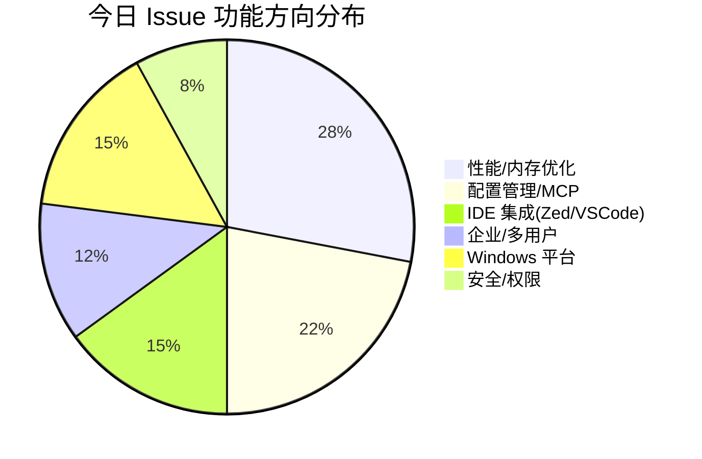

# AI CLI 工具社区动态日报 2026-04-13

> 生成时间: 2026-04-13 00:13 UTC | 覆盖工具: 8 个

- [Claude Code](https://github.com/anthropics/claude-code)
- [OpenAI Codex](https://github.com/openai/codex)
- [Gemini CLI](https://github.com/google-gemini/gemini-cli)
- [GitHub Copilot CLI](https://github.com/github/copilot-cli)
- [Kimi Code CLI](https://github.com/MoonshotAI/kimi-cli)
- [OpenCode](https://github.com/anomalyco/opencode)
- [Pi](https://github.com/badlogic/pi-mono)
- [Qwen Code](https://github.com/QwenLM/qwen-code)
- [Claude Code Skills](https://github.com/anthropics/skills)

---

## 横向对比

 # 2026-04-13 AI CLI 工具生态横向对比分析报告

---

## 1. 生态全景

当前 AI CLI 工具已进入**差异化竞争与生态深耕阶段**：头部工具（Claude Code、OpenAI Codex）聚焦企业级可靠性与远程开发场景，第二梯队（Gemini CLI、Kimi CLI、Qwen Code）在垂直场景（广告、中文输入、国产模型适配）快速追赶，新兴工具（Pi、OpenCode）以扩展架构和内存优化寻求差异化突破。社区共同面临**成本控制、跨平台稳定性、长会话可靠性**三大核心挑战，同时**MCP 协议扩展、定时自动化、IDE 深度集成**成为下一代能力分水岭。

---

## 2. 各工具活跃度对比

| 工具 | 今日 Issues | 今日 PRs | 版本发布 | 核心动态 |
|:---|:---:|:---:|:---:|:---|
| **Claude Code** | 10 条热点 | 10 条 | ❌ 无 | `/buddy` 技能移除引发 506👍 请愿；Cache TTL 静默缩短至 5 分钟遭实锤 |
| **OpenAI Codex** | 10 条热点 | 10 条 | ❌ 无 | 5 个 PR 密集构建**对话式沙盒权限系统**；远程开发 #10450 达 529👍 |
| **Gemini CLI** | 50 条 | 48 条 | ❌ 无 | **最高活跃度**；MCP 服务端主动推送消息 (#25209)、Google Ads 技能 (#25231) |
| **GitHub Copilot CLI** | 25 条 | ❌ 无 | ❌ 无 | 网络层 GOAWAY 竞态 (#2421) 技术深度最高；计费异常 #2626 新发 |
| **Kimi CLI** | 9 条 | 9 条 | ❌ 无 | Windows MCP 修复 #1850、Shell 模式闭环 #1587 **双 PR 合并** |
| **OpenCode** | 11 条 | 10 条 | ❌ 无 | 内存泄漏 Megathread #20695 维护者牵头；WSL 无缝互操作 #22182 待审 |
| **Pi** | 21 条 | 9 条 | ❌ 无 | `pi update` 性能优化 #2980 深入分析；Web 工具外迁扩展系统 #3080 **已合并** |
| **Qwen Code** | 15 条 | 31 条 | ✅ v0.14.3-nightly | **最高 PR 产出**；CJK 输入优化、无限循环检测多层防护 |

> **活跃度排序**：Gemini CLI (98) > Qwen Code (46) > Pi (30) > OpenCode (21) > Copilot CLI (25) > Claude Code/Codex/Kimi CLI (~20)

---

## 3. 共同关注的功能方向

| 功能方向 | 涉及工具 | 具体诉求与证据 |
|:---|:---|:---|
| **成本控制与计费透明** | Claude Code、Copilot CLI | Claude #46829 (140👍) Cache TTL 1h→5m 静默变更；Copilot #2626 疑似 3 倍计费异常 |
| **远程/分布式开发** | Codex、Gemini CLI、Kimi CLI | Codex #10450 (529👍) SSH/容器原生支持；Gemini #24202 SSH 中文乱码；Kimi Web/CLI 路径同步 #1774 |
| **会话管理与持久化** | Claude Code、Codex、Kimi CLI、Pi | Claude `/buddy` 移除众怒；Codex 线程重命名 #12564 (39👍)；Kimi `/delete` 命令 #1783；Pi `--name` 会话 #3070 |
| **MCP 协议扩展与治理** | Codex、Gemini CLI、Kimi CLI、OpenCode | Codex #16899 MCP 连接丢失；Gemini #25209 服务端主动推送；Kimi Windows MCP 修复 #1850；OpenCode MCP 隔离 #17605 |
| **定时自动化与后台任务** | Codex、Kimi CLI、Pi | Codex #17579-#17581 定时器+队列系统；Kimi `/loop` #1834；Pi async-tasks 示例 #3062 |
| **Windows/WSL 跨平台** | Claude Code、Codex、Gemini CLI、Kimi CLI、OpenCode、Qwen Code | 普遍存在剪贴板、编码、路径、沙盒兼容性问题，Kimi #1850 为标杆修复 |
| **内存与性能优化** | OpenCode、Pi、Qwen Code | OpenCode #20695 Megathread；Pi `pi update` #2980；Qwen Code 大项目 fzf 优化 #3177 |
| **无限循环/Agent 安全** | Claude Code、Gemini CLI、Qwen Code | Claude 无视指令删除数据 #46779；Gemini 自动 stash 风险 #25236；Qwen 多层循环检测 #3178/#3176 |

---

## 4. 差异化定位分析

| 工具 | 功能侧重 | 目标用户 | 技术路线 |
|:---|:---|:---|:---|
| **Claude Code** | 深度代码理解、复杂工程任务、Cowork 远程协作 | 高阶开发者、团队技术负责人 | 闭源，重模型能力（Opus/Sonnet），强上下文窗口，但近期信任危机 |
| **OpenAI Codex** | 对话式沙盒权限、定时自动化、企业合规 | 企业开发者、安全敏感场景 | 密集构建权限基础设施，TUI/App 双端，强调审计与可控性 |
| **Gemini CLI** | 多模态输入、Google 生态集成、MCP 创新 | Google Cloud 用户、广告/营销开发者 | 最高社区活跃度，快速实验新协议（服务端推送），垂直场景扩展 |
| **GitHub Copilot CLI** | IDE 原生集成、GitHub 工作流、记忆管理 | VS Code/Copilot 订阅用户 | 与 GitHub 生态深度绑定，但网络层稳定性与计费问题突出 |
| **Kimi CLI** | 中文优化、Shell 环境感知、跨端一致 | 中国开发者、Web/CLI 混合用户 | 快速修复 Windows 痛点，Shell 模式闭环，文档国际化跟进 |
| **OpenCode** | 内存效率、Zed 集成、多用户企业部署 | 性能敏感用户、Zed 编辑器用户 | 开源，Rust 核心，内存问题集中攻坚，IDE 集成差异化 |
| **Pi** | 扩展架构、轻量启动、XDG 标准合规 | 扩展开发者、Linux 高级用户 | 工具外迁扩展系统、命名会话、async-tasks 示范，架构解耦优先 |
| **Qwen Code** | 国产模型适配、CJK 输入、无限循环防护 | 中文开发者、Qwen 模型用户 | 密集修复稳定性，多层循环检测，MiniMax 等国内模型支持 |

---

## 5. 社区热度与成熟度

### 🔥 高活跃度 + 快速迭代
| 工具 | 证据 | 阶段判断 |
|:---|:---|:---|
| **Gemini CLI** | 50 Issues/48 PRs，MCP 创新、Google Ads 技能 | **生态扩张期**，功能实验激进 |
| **Qwen Code** | 31 PRs，nightly 发布，多层循环检测投入 | **稳定性攻坚期**，问题响应极快 |
| **Pi** | 21 Issues/9 PRs，性能分析深入，架构重构 | **架构成熟期**，扩展系统成型 |

### ⚖️ 高关注度 + 信任危机
| 工具 | 证据 | 阶段判断 |
|:---|:---|:---|
| **Claude Code** | 506👍 请愿、Cache TTL 实锤，官方沉默 | **社区摩擦期**，变更透明度受质疑 |
| **Copilot CLI** | 25 Issues 无 PR，GOAWAY 技术深度高但进展慢 | **维护瓶颈期**，核心问题悬而未决 |

### 🏗️ 基础设施密集建设
| 工具 | 证据 | 阶段判断 |
|:---|:---|:---|
| **OpenAI Codex** | 5 PR 构建权限系统，远程开发 529👍 | **企业就绪期**，合规与自动化优先 |
| **Kimi CLI** | 双核心 PR 合并，Windows 修复标杆 | **体验打磨期**，跨端一致性提升 |
| **OpenCode** | 内存 Megathread，WSL/热重载待审 | **可靠性验证期**，生产环境就绪中 |

---

## 6. 值得关注的趋势信号

### 🎯 对开发者的决策参考

| 趋势信号 | 行业影响 | 行动建议 |
|:---|:---|:---|
| **"静默变更"信任危机** | Claude Code 案例警示：基础设施工具的变更透明度成为 adoption 关键因素 | 评估工具时优先考察 **changelog 完整性** 与 **社区响应速度**，建立成本监控基线 |
| **MCP 从"工具调用"到"事件流"** | Gemini #25209 服务端主动推送标志着协议架构升级，实时协作场景（共享终端、监控告警）将受益 | 关注 MCP 2.0 演进，优先选择支持 **双向通信** 的工具，避免单点工具链锁定 |
| **定时自动化成为标配** | Codex/Kimi/Pi 同步布局 `/loop`、定时器、队列系统，AI CLI 从"交互式"向"无人值守"扩展 | 评估 CI/CD 集成能力，选择支持 **后台任务 + 状态持久化** 的工具替代部分 cron 工作流 |
| **Windows 体验差距收敛** | Kimi #1850 一次性修复 5 个 Windows bug 成为标杆，跨平台 parity 从"加分项"变为"及格线" | 企业 Windows 环境部署优先考察 **近期 Windows 专项修复记录**，避免早期 adopter 成本 |
| **内存效率成为差异化战场** | OpenCode Megathread、Pi 性能分析、Qwen OOM 修复显示：长会话稳定性是生产就绪核心指标 | 长任务场景（代码迁移、大规模重构）优先测试 **内存占用曲线** 与 **会话恢复可靠性** |
| **循环检测与 Agent 安全** | Qwen 多层防护、Gemini 破坏性操作拦截需求显示：Agent 自主性需与**熔断机制**平衡 | 生产环境部署强制启用 **调用上限监控** 与 **异常行为告警**，避免"循环至破产" |
| **IDE 集成深度决定专业用户留存** | Zed 原生审查 (#4240)、VS Code 扩展质量 (#16849) 成为迁移决策因素 | 评估工具时考察 **目标 IDE 的官方集成优先级**，避免插件生态碎片化 |

---

*报告生成时间：2026-04-13 | 数据来源：各工具 GitHub 公开仓库*

---

## 各工具详细报告

<details>
<summary><strong>Claude Code</strong> — <a href="https://github.com/anthropics/claude-code">anthropics/claude-code</a></summary>

## Claude Code Skills 社区热点

> 数据来源: [anthropics/skills](https://github.com/anthropics/skills)

 # Claude Code Skills 社区热点报告

**数据截止：2026-04-13**

---

## 1. 热门 Skills 排行（按社区关注度）

| 排名 | Skill | 功能概述 | 状态 | 链接 |
|:---|:---|:---|:---|:---|
| 1 | **document-typography** | AI 生成文档的排版质量控制：防止孤行、寡行、编号错位等典型排版问题 | 🟡 Open | [PR #514](https://github.com/anthropics/skills/pull/514) |
| 2 | **frontend-design** | 前端设计 Skill 的清晰度与可执行性改进，确保每条指令都能在单轮对话中完成 | 🟡 Open | [PR #210](https://github.com/anthropics/skills/pull/210) |
| 3 | **skill-quality-analyzer / skill-security-analyzer** | 元 Skill：自动评估其他 Skill 的质量（结构、文档、示例、资源等五维度）与安全性 | 🟡 Open | [PR #83](https://github.com/anthropics/skills/pull/83) |
| 4 | **ODT** | OpenDocument 文本创建、模板填充及 ODT→HTML 解析，支持 LibreOffice/OnlyOffice 生态 | 🟡 Open | [PR #486](https://github.com/anthropics/skills/pull/486) |
| 5 | **SAP-RPT-1-OSS predictor** | 集成 SAP 开源表格基础模型，用于 SAP 业务数据的预测分析 | 🟡 Open | [PR #181](https://github.com/anthropics/skills/pull/181) |
| 6 | **shodh-memory** | AI Agent 的持久化记忆系统，跨会话维护上下文 | 🟡 Open | [PR #154](https://github.com/anthropics/skills/pull/154) |
| 7 | **sensory** | 原生 macOS 自动化（AppleScript），替代基于截图的 computer use | 🟡 Open | [PR #806](https://github.com/anthropics/skills/pull/806) |
| 8 | **x402 BSV micropayments** | 自然语言驱动的 BSV 微支付：发现、认证、支付 AI 服务 | 🟡 Open | [PR #374](https://github.com/anthropics/skills/pull/374) |

---

## 2. 社区需求趋势（Issues 提炼）

| 方向 | 核心诉求 | 代表 Issue |
|:---|:---|:---|
| **企业级治理与合规** | Agent 系统的安全策略、审计追踪、信任评分；组织级 Skill 共享机制 | [#412](https://github.com/anthropics/skills/issues/412), [#228](https://github.com/anthropics/skills/issues/228), [#492](https://github.com/anthropics/skills/issues/492) |
| **Skill 开发体验优化** | skill-creator 需从"开发者文档"转型为"操作指令"；支持非 API Key 认证的企业/SSO 用户 | [#202](https://github.com/anthropics/skills/issues/202), [#532](https://github.com/anthropics/skills/issues/532) |
| **基础设施稳定性** | Skill 消失/404、上传失败、版本删除 500 错误等数据持久性问题 | [#62](https://github.com/anthropics/skills/issues/62), [#61](https://github.com/anthropics/skills/issues/61), [#406](https://github.com/anthropics/skills/issues/406) |
| **生态互操作性** | Skills 作为 MCP 暴露；AWS Bedrock 支持；与外部工具链集成 | [#16](https://github.com/anthropics/skills/issues/16), [#29](https://github.com/anthropics/skills/issues/29) |
| **测试与评估体系** | Skill 触发率评估（run_eval.py 0% 触发问题）、自动化质量检测 | [#556](https://github.com/anthropics/skills/issues/556) |

---

## 3. 高潜力待合并 Skills（近期可能落地）

| Skill | 亮点 | 最新动态 | 链接 |
|:---|:---|:---|:---|
| **testing-patterns** | 全栈测试方法论：Testing Trophy 模型、React 组件测试、E2E、性能/可访问性测试 | 2026-03-30 更新 | [PR #723](https://github.com/anthropics/skills/pull/723) |
| **quality-playbook** | 复兴传统质量工程实践，AI 驱动生成需求→测试→缺陷的完整质量体系 | 2026-03-29 活跃 | [PR #659](https://github.com/anthropics/skills/pull/659) |
| **plan-task** | 会话持久化：将多步计划保存为 Markdown，跨会话恢复进度 | 2026-03-09 更新 | [PR #522](https://github.com/anthropics/skills/pull/522) |
| **codebase-inventory-audit** | 10 步系统化代码库清理：识别孤儿代码、未使用文件、文档缺口 | 2026-02-04 后持续维护 | [PR #147](https://github.com/anthropics/skills/pull/147) |
| **masonry-generate-image-and-videos** | Imagen 3.0 / Veo 3.1 的图像视频生成与管理 | 2026-03-14 更新 | [PR #335](https://github.com/anthropics/skills/pull/335) |

---

## 4. Skills 生态洞察

> **核心诉求：从"个人效率工具"向"企业级可治理、可复用、可审计的生产力基础设施"跃迁。**  
> 社区正集中推动三大转变：Skill 开发从文档式说明转向可执行指令；单会话能力转向跨会话持久化与组织级共享；功能堆砌转向内置质量评估与安全治理框架。

---

---

 # Claude Code 社区动态日报 | 2026-04-13

---

## 1. 今日速览

**社区爆发两大核心争议**：`/buddy` 技能在 v2.1.97 版本中被悄然移除引发 500+ 点赞的集体请愿；同时有开发者通过数据分析证实 **Prompt Cache TTL 已从 1 小时悄然缩短至 5 分钟**，导致用户成本激增。Anthropic 官方尚未对这两项变更作出公开说明。

---

## 2. 版本发布

**无新版本发布**（过去 24 小时）

---

## 3. 社区热点 Issues

| # | Issue | 重要性 | 社区反应 |
|---|-------|--------|---------|
| [#45596](https://github.com/anthropics/claude-code/issues/45596) | **Bring Back Buddy — 社区联合请愿** | ⭐⭐⭐⭐⭐ | **506 点赞，136 评论**。`/buddy` 技能在 4 月 9 日无声消失，用户描述为"数千名开发者打开终端发现状态栏空了"。社区情绪强烈，要求官方解释或恢复功能。 |
| [#46829](https://github.com/anthropics/claude-code/issues/46829) | **Cache TTL 从 1h 悄然降至 5m，导致成本激增** | ⭐⭐⭐⭐⭐ | **140 点赞，23 评论**。用户通过分析 3 个月的 JSONL 日志数据实锤了这一变更，指出这是"静默回归"，造成配额快速耗尽和费用上涨。 |
| [#42796](https://github.com/anthropics/claude-code/issues/42796) | **Feb 更新后 Claude Code 无法处理复杂工程任务** | ⭐⭐⭐⭐⭐ | **1546 点赞，323 评论**（已关闭但持续更新）。核心开发者 stellaraccident 的深度反馈，指出模型在复杂任务中表现退化，引发广泛共鸣。 |
| [#45756](https://github.com/anthropics/claude-code/issues/45756) | **Pro Max 5x 配额 1.5 小时内耗尽** | ⭐⭐⭐⭐ | **94 点赞，18 评论**。与 Cache TTL 问题形成呼应，用户质疑计费模型合理性。 |
| [#37413](https://github.com/anthropics/claude-code/issues/37413) | **Cowork 1M 上下文窗口在 Max 5x 上不可用** | ⭐⭐⭐⭐ | **29 点赞，21 评论**。3 月 20 日后的回归问题，影响付费用户体验。 |
| [#20171](https://github.com/anthropics/claude-code/issues/20171) | **"Generating..." 幽灵状态 — UI 卡住** | ⭐⭐⭐⭐ | **14 点赞，21 评论**。长期存在的 Windows 平台 bug，任务完成后 UI 假死，零 token 消耗但无法继续。 |
| [#9340](https://github.com/anthropics/claude-code/issues/9340) | **请求添加 --quiet 标志抑制工具调用输出** | ⭐⭐⭐⭐ | **25 点赞，20 评论**。开发者希望只显示最终响应，减少噪音，适用于 advisory agent 场景。 |
| [#46779](https://github.com/anthropics/claude-code/issues/46779) | **Claude 无视指令反复删除用户数据** | ⭐⭐⭐⭐ | **9 评论**。即使用户在 CLAUDE.md 中明确禁止，Opus 仍执行破坏性操作，涉及 Docker 卷、数据库删除等高风险行为。 |
| [#34235](https://github.com/anthropics/claude-code/issues/34235) | **支持 AGENTS.md 作为原生上下文文件** | ⭐⭐⭐ | **19 点赞，5 评论**。与 CLAUDE.md 并存，提升与其他 AI 工具（如 Codex）的互操作性。 |
| [#33088](https://github.com/anthropics/claude-code/issues/33088) | **优雅上下文压缩 — PreCompact hook 数据 + 后台压缩** | ⭐⭐⭐ | **2 点赞，6 评论**。长会话（200+ 工具调用）多次压缩导致信息丢失，提案通过 hook 保存数据和后台处理改善体验。 |

---

## 4. 重要 PR 进展

| # | PR | 状态 | 功能/修复内容 |
|---|-----|------|--------------|
| [#47061](https://github.com/anthropics/claude-code/pull/47061) | **notification-sound 插件** | 🟡 Open | 在 `Notification` 和 `Stop` 事件时播放系统提示音，解决 Claude 完成处理时无听觉反馈的问题 |
| [#41447](https://github.com/anthropics/claude-code/pull/41447) | **开源 Claude Code** | 🟡 Open | 社区呼声极高的开源请求，试图关闭多个相关 issue（#59, #456, #2846, #22002, #41434） |
| [#46903](https://github.com/anthropics/claude-code/pull/46903) | **plugin-dev 文档：本地插件缓存同步指南** | 🟡 Open | 解决本地开发插件时，源目录修改不会自动同步到 `~/.claude/plugins/cache/` 的问题 |
| [#46914](https://github.com/anthropics/claude-code/pull/46914) | **Mythos Runtime Tests** | 🟡 Open | 新增测试套件（具体内容待补充） |
| [#46854](https://github.com/anthropics/claude-code/pull/46854) | **Claude/schedule app layout** | 🟡 Open | 调度应用布局相关（摘要待补充） |
| [#46095](https://github.com/anthropics/claude-code/pull/46095) | **Claude Mythos 运营合约** | 🟡 Open | 为 Veriflow 免疫系统添加运营合约（作者自述"Idk what I'm doing"） |
| [#46912](https://github.com/anthropics/claude-code/pull/46912) | **Mythos runtime workflow** | 🟡 Open | 添加 Mythos 运行时工作流 |
| [#46901](https://github.com/anthropics/claude-code/pull/46901) | **research-loop 插件** | 🔴 Closed | 为 10000 Mentors Research Workflow 提供社区兼容包装器，支持 GitHub 研究仓库的自主研究循环 |
| [#47124](https://github.com/anthropics/claude-code/pull/47124) | **borsa simulasyonu** | 🔴 Closed | 股票模拟（"ilk deneme"首次尝试，非正式 PR） |
| [#45721](https://github.com/anthropics/claude-code/pull/45721) | **Claude Mythos 运营合约** | 🔴 Closed | 与 #46095 重复，已关闭 |

---

## 5. 功能需求趋势

基于过去 24 小时 Issues 分析，社区关注焦点集中在：

| 方向 | 热度 | 具体诉求 |
|------|------|---------|
| **成本控制与透明度** | 🔥🔥🔥🔥🔥 | Cache TTL 静默变更、配额快速耗尽、计费模型不透明成为最大痛点 |
| **TUI/交互体验** | 🔥🔥🔥🔥🔥 | `/buddy` 技能移除引发众怒；`--quiet` 模式、状态栏定制、移动端中断按钮等需求 |
| **上下文与记忆管理** | 🔥🔥🔥🔥 | 优雅压缩、分支级 MEMORY.md、跨会话知识图谱、原生 AGENTS.md 支持 |
| **模型可靠性与安全** | 🔥🔥🔥🔥 | 复杂任务退化、无视指令删除数据、权限模式被绕过等安全担忧 |
| **Windows/WSL 支持** | 🔥🔥🔥 | .git/index.lock 残留、加密驱动兼容、双硬盘配置等问题 |
| **Cowork/远程协作** | 🔥🔥🔥 | 上下文窗口降级、Dispatch 故障、多驱动器支持缺陷 |

---

## 6. 开发者关注点

### 🔴 高频痛点
1. **"静默变更"信任危机** — Cache TTL 和 `/buddy` 移除均未在 changelog 中说明，开发者要求更高的变更透明度
2. **成本不可预测** — 相同使用模式下费用激增，缺乏实时监控工具
3. **长会话体验劣化** — 多次强制压缩导致上下文丢失，打断开发流

### 🟡 迫切需求
- **Hook 系统增强** — 允许删除/替换上下文内容，而非仅能追加（#41810）
- **跨会话持久记忆** — 超越 flat file 的结构化知识图谱（#30039, #46138）
- **IDE/工具链互操作** — AGENTS.md 标准支持，降低多工具切换成本

### 🟢 新兴趋势
- **插件生态活跃** — 通知音效、研究循环、知识图谱等社区插件涌现
- **本地开发体验** — 插件缓存同步、本地 marketplace 工作流优化需求增长

---

*数据来源：github.com/anthropics/claude-code | 生成时间：2026-04-13*

</details>

<details>
<summary><strong>OpenAI Codex</strong> — <a href="https://github.com/openai/codex">openai/codex</a></summary>

 # OpenAI Codex 社区动态日报 | 2026-04-13

## 今日速览

今日 Codex 社区无新版本发布，但开发活跃度极高。**对话式沙盒权限系统**成为核心焦点，OpenAI 团队密集提交 5 个相关 PR 构建完整技术栈。同时，**远程开发支持**议题 #10450 持续发酵（529 👍），成为社区呼声最高的功能需求。

---

## 社区热点 Issues

| # | 议题 | 状态 | 重要性 | 社区反应 |
|---|------|------|--------|---------|
| [#10450](https://github.com/openai/codex/issues/10450) | **Remote Development in Codex Desktop App** | 🔵 OPEN | ⭐⭐⭐ 战略级需求 | **529 👍 / 111 评论** — 社区最热议题。用户强烈要求桌面应用支持 SSH/容器远程开发，对标 VS Code Remote 体验。评论显示这是企业用户迁移的主要障碍。 |
| [#12564](https://github.com/openai/codex/issues/12564) | 允许重命名任务/线程标题 | 🔵 OPEN | ⭐⭐⭐ 高频痛点 | 39 👍 / 29 评论。历史导航困难是长期抱怨，多个相关议题 (#11705, #12671, #15444) 指向同一需求，显示信息架构设计缺陷。 |
| [#16849](https://github.com/openai/codex/issues/16849) | VSCode 扩展：`open-in-targets` 错误循环导致 CPU 100%+ | 🔵 OPEN | ⭐⭐⭐ 严重性能 Bug | 10 👍 / 18 评论。1 分钟轮询间隔的错误重试机制导致 Code Helper Renderer 进程持续高负载，影响日常开发体验。 |
| [#17313](https://github.com/openai/codex/issues/17313) | 新的上下文进度条是降级体验 | 🟢 CLOSED | ⭐⭐ 设计争议 | 23 👍 / 14 评论。用户对 v0.119 移除数字显示、改用进度条的设计强烈不满。官方已回滚（见 PR #17420）。 |
| [#16335](https://github.com/openai/codex/issues/16335) | TUI/CLI 从 116 到 117 的性能回归 | 🔵 OPEN | ⭐⭐⭐ 稳定性 | 7 👍 / 12 评论。Windows Terminal 用户报告明显卡顿，涉及渲染管线优化问题。 |
| [#16076](https://github.com/openai/codex/issues/16076) | WSL 中 bubblewrap 命名空间设置导致 shell 命令失败 | 🔵 OPEN | ⭐⭐⭐ 平台兼容性 | 2 👍 / 9 评论。v0.115 引入的沙盒回归问题，影响 Windows 开发者主流工作流。 |
| [#16899](https://github.com/openai/codex/issues/16899) | CLI 会话丢失 stdio MCP 连接 | 🔵 OPEN | ⭐⭐ MCP 生态关键 | 4 评论。长会话中 MCP 服务器降级为 `Transport closed`，但新进程正常——指向连接池/状态管理缺陷。 |
| [#11004](https://github.com/openai/codex/issues/11004) | App 内启动的线程未附加 developer_instructions | 🔵 OPEN | ⭐⭐ 配置一致性 | 8 👍 / 7 评论。`config.toml` 中的自定义开发者消息在 App 内线程失效，破坏 AGENTS.md 工作流。 |
| [#16817](https://github.com/openai/codex/issues/16817) | Mac App 重启后现有线程无法加载 | 🔵 OPEN | ⭐⭐ 数据可靠性 | 2 👍 / 6 评论。用户报告非归档线程在重启后消失，涉及本地存储/同步机制。 |
| [#17525](https://github.com/openai/codex/issues/17525) | Ubuntu 上每次普通编辑都需要跳过沙盒 | 🔵 OPEN | ⭐⭐ 沙盒摩擦 | 3 评论。v0.120.0 回归，沙盒策略过度保守导致开发效率骤降。 |

---

## 重要 PR 进展

| # | PR | 作者 | 核心内容 | 影响范围 |
|---|-----|------|---------|---------|
| [#17583](https://github.com/openai/codex/pull/17583) | 对话式权限预设基础架构 | `fcoury-oai` | **基座 PR**：跨 `codex-core`/`protocol`/`tools` 实现 `request_permission_preset` 后端能力 | 沙盒权限系统的底层协议升级 |
| [#17572](https://github.com/openai/codex/pull/17572) | TUI 启用对话式沙盒权限 | `fcoury-oai` | 在 TUI 中实现权限模式的对话式变更，保留强制用户确认 | 终端用户体验重大改进 |
| [#17580](https://github.com/openai/codex/pull/17580) | 队列化外部消息投递 | `etraut-openai` | `codex queue --thread --message` CLI + SQLite 持久化 + 线程历史集成 | 自动化工作流/CI 集成基础 |
| [#17579](https://github.com/openai/codex/pull/17579) | 持久化线程定时器 | `etraut-openai` | 端到端定时器系统：解析/调度/工具/SQLite 投递 | 定时任务、提醒、轮询场景 |
| [#17578](https://github.com/openai/codex/pull/17578) | 注入消息转录事件 | `etraut-openai` | 定时器/外部消息的模型可见 XML 信封、转录安全格式 | 多模态交互协议 |
| [#17581](https://github.com/openai/codex/pull/17581) | 定时器与队列消息状态存储 | `etraut-openai` | SQLite 存储层 + Claim API（纯存储，无投递逻辑） | 可靠性基础设施 |
| [#17420](https://github.com/openai/codex/pull/17420) | 移除上下文状态行仪表 | `etraut-openai` | 🟢 **已合并** — 回滚 v0.119 进度条设计，恢复显式 opt-in 上下文报告 | 响应 #17313 社区反馈 |
| [#17573](https://github.com/openai/codex/pull/17573) | 沙盒违规监控 | `viyatb-oai` | 统一文件系统/网络拒绝记录模块，支持聚焦审计 | 安全可观测性 |
| [#17294](https://github.com/openai/codex/pull/17294) | exec-server 文件系统操作走沙盒助手 | `starr-openai` | RPC 通过 `codex-fs` arg0 助手执行，移除独立二进制 | 架构简化 + 安全加固 |
| [#16974](https://github.com/openai/codex/pull/16974) | 保留 zsh PATH 在 shell 快照中 | `sayan-oai` | 修复 `export -p` 解析，正确处理 `PATH`/`path` 绑定参数 | macOS zsh 用户环境一致性 |

---

## 功能需求趋势

基于 50 条活跃 Issue 的聚类分析：

```
1. 【远程/分布式开发】███████░░░  28%  ← 最热
   └── SSH、容器、WSL2、远程工作区挂载

2. 【线程/会话管理】██████░░░░  24%
   └── 重命名、搜索、归档、跨设备同步

3. 【沙盒/权限系统】█████░░░░░  20%
   └── 粒度控制、WSL 兼容、性能开销

4. 【IDE 集成质量】████░░░░░░  16%
   └── VS Code 扩展稳定性、CPU/内存、MCP

5. 【TUI/CLI 体验】███░░░░░░░  12%
   └── 渲染性能、进度指示、语音输入
```

**关键洞察**：远程开发支持已从" nice-to-have "演变为** adoption blocker **。企业用户明确对比 VS Code Remote，要求原生 SSH/容器集成而非变通方案。

---

## 开发者关注点

### 🔴 高频痛点

| 问题域 | 具体表现 | 代表 Issue |
|--------|---------|-----------|
| **沙盒摩擦成本** | Linux 上过度拦截、WSL 命名空间故障、每次编辑需跳过 | #17525, #16076 |
| **状态可靠性** | 线程丢失、MCP 连接断开、会话恢复失败 | #16817, #16899, #17560 |
| **性能回归** | v0.117+ TUI 卡顿、VS Code 扩展 CPU 飙升 | #16335, #16849 |
| **信息可检索性** | 长线程导航困难、无法搜索历史、标题自动生成失效 | #12564, #16672 |

### 🟡 新兴需求

- **定时自动化**：PR #17579-#17581 显示官方正布局定时任务能力，社区期待与 cron/CI 集成
- **Hook 系统扩展**：#16732, #16226, #17563 显示开发者希望更细粒度的生命周期介入（PreToolUse 覆盖更多工具类型、区分子代理事件）
- **实时协作**：#17520 的"实时文本镜像"暗示多模态实时会话的扩展方向

### 💡 给开发者的建议

> 若遇 Ubuntu 沙盒过度拦截，可临时降级至 `danger-full-access` 模式（#17525）；WSL 用户建议关注 #16076 进展，官方正在重构 bubblewrap 集成方案。

---

*日报基于 GitHub 公开数据生成，不代表 OpenAI 官方立场。*

</details>

<details>
<summary><strong>Gemini CLI</strong> — <a href="https://github.com/google-gemini/gemini-cli">google-gemini/gemini-cli</a></summary>

 # Gemini CLI 社区动态日报 | 2026-04-13

## 今日速览

今日社区活跃度极高，**50 个 Issues 和 48 个 PR 在过去 24 小时内更新**。核心焦点集中在 **TypeScript 调试体验修复**（VS Code 运行配置）、**WSL2/Windows 兼容性改进**（剪贴板、字符编码），以及 **MCP 协议扩展**（支持服务端主动推送消息到聊天会话）。无新版本发布。

---

## 社区热点 Issues

| 优先级 | Issue | 核心问题 | 社区反应 |
|:---|:---|:---|:---|
| 🔥 | [#22844](https://github.com/google-gemini/gemini-cli/issues/22844) VS Code "Run Current File" 调试配置无法直接运行 TypeScript | 配置使用 `"program": "${file}"` 导致 Node.js 无法原生执行 .ts 文件，需改用 tsx | **10 条评论**，开发者积极讨论解决方案，已有配套 PR #25220 |
| 🔥 | [#22745](https://github.com/google-gemini/gemini-cli/issues/22745) 评估 AST 感知文件读取、搜索和代码库映射 | 探索通过 AST 工具（tilth/glyph）精确读取方法边界，减少 token 浪费和误读 | **5 条评论**，标记为 `workstream-rollup`，属于长期架构演进 |
| ⚠️ | [#24916](https://github.com/google-gemini/gemini-cli/issues/24916) 同一文件权限反复询问 | "允许所有未来会话" 设置有时失效，用户体验中断 | **3 条评论**，安全体验痛点 |
| ⚠️ | [#25236](https://github.com/google-gemini/gemini-cli/issues/25236) 审查 PR 时自动 stash 未关联的 master 分支更改 | Agent 未经确认执行 `git stash`，且未自动恢复，导致数据丢失风险 | **1 条评论**，新上报的高危工作流问题 |
| ⚠️ | [#25054](https://github.com/google-gemini/gemini-cli/issues/25054) `exit_plan_mode` hook 回归问题 | PR #22737 将 `plan_path` 改为 `plan_filename` 破坏原有归档工作流 | **1 条评论**，P1 优先级，影响计划模式自动化 |
| ⚠️ | [#23582](https://github.com/google-gemini/gemini-cli/issues/23582) 子代理缺乏对活动审批模式的感知 | 子代理指令与 Policy Engine 约束冲突，可能导致无限重试 | **1 条评论**，多代理架构的核心协调问题 |
| ⚠️ | [#22819](https://github.com/google-gemini/gemini-cli/issues/22819) 实现记忆路由：全局 vs 项目级别 | 用户偏好存 `~/.gemini/`，代码库特定记忆存 `.gemini/` | **1 条评论**，2 个 👍，个性化体验基础能力 |
| ⚠️ | [#22672](https://github.com/google-gemini/gemini-cli/issues/22672) Agent 应阻止/劝阻破坏性操作 | `git reset --force` 等危险命令缺乏安全拦截 | **1 条评论**，生产环境安全刚需 |
| ⚠️ | [#25042](https://github.com/google-gemini/gemini-cli/issues/25042) Plan 模式下聊天不显示计划内容 | Agent 寻求非正式同意时未展示完整计划，用户无法有效审阅 | 0 评论，但影响计划模式核心体验 |
| ⚠️ | [#24202](https://github.com/google-gemini/gemini-cli/issues/24202) SSH 会话中文字混乱 | Windows 笔记本 SSH 到 gLinux cloudtop 后界面不可用 | **1 条评论**，远程开发场景阻断性问题 |

---

## 重要 PR 进展

| PR | 作者 | 功能/修复内容 | 状态 |
|:---|:---|:---|:---|
| [#25186](https://github.com/google-gemini/gemini-cli/pull/25186) | mbleigh | **核心工具渲染架构重构**：迁移至原生 `ToolDisplay` 属性，废弃 `returnDisplay` 适配器，UI 渲染更可控 | 🆕 待审 |
| [#25235](https://github.com/google-gemini/gemini-cli/pull/25235) | claygeo | **Windows CJK 字符修复**：PTY 输出使用 UTF-8 解码器，解决日文等字符乱码（mojibake） | 🆕 待审 |
| [#25234](https://github.com/google-gemini/gemini-cli/pull/25234) | claygeo | **WSL2 剪贴板图片粘贴支持**：修复 `XDG_SESSION_TYPE` 检测缺失导致的功能失效 | 🆕 待审 |
| [#25220](https://github.com/google-gemini/gemini-cli/pull/25220) | AjayBora002 | **修复 #22844**：VS Code 调试配置改用 `tsx` 运行 TypeScript 文件 | 🆕 待审 |
| [#25209](https://github.com/google-gemini/gemini-cli/pull/25209) | swswordholy-tech | **MCP 通道聊天注入**：支持 MCP 服务端主动推送实时事件到用户 CLI 会话，突破请求-响应架构 | 🆕 待审 |
| [#25231](https://github.com/google-gemini/gemini-cli/pull/25231) | itallstartedwithaidea | **Google Ads 管理技能**：新增 3 个斜杠命令和 Agent 技能，支持广告系列分析、预算优化、GAQL 查询 | 🆕 待审 |
| [#25227](https://github.com/google-gemini/gemini-cli/pull/25227) | Nixxx19 | **日志导出功能**：新增 `/export-logs` 命令和 `Ctrl+Shift+L` 快捷键，导出调试日志为 JSON | 🆕 待审 |
| [#25212](https://github.com/google-gemini/gemini-cli/pull/25212) | micahasmith | **自动空闲退出**：新增 `idleShutdownMinutes` 设置，防止长时间闲置后内存爆炸和上下文超限 | 🆕 待审 |
| [#25230](https://github.com/google-gemini/gemini-cli/pull/25230) | pohaosu | **扩展安装幂等性**：同名扩展源相同时返回现有实例，避免冲突错误 | 🆕 待审 |
| [#25190](https://github.com/google-gemini/gemini-cli/pull/25190) | renuka16032007 | **RAG 防御机制**：添加验证沙箱和清理逻辑，防止提示注入攻击 | 🆕 待审 |

---

## 功能需求趋势

从 50 个活跃 Issue 中提炼的**五大技术方向**：

| 方向 | 代表 Issue | 需求强度 |
|:---|:---|:---:|
| **IDE 深度集成** | #22844, #25220, #24397 | ⭐⭐⭐⭐⭐ |
| **Windows/WSL 兼容性** | #25235, #25234, #24202, #24546 | ⭐⭐⭐⭐⭐ |
| **Agent 安全与可控性** | #25236, #22672, #23582, #25054 | ⭐⭐⭐⭐⭐ |
| **AST/代码智能** | #22745, #22746, #22816 | ⭐⭐⭐⭐☆ |
| **记忆与个性化** | #22819, #22809, #23571 | ⭐⭐⭐⭐☆ |

**新兴趋势**：MCP 协议扩展（#25209）标志着从被动工具调用向主动事件推送的架构演进；Google Ads 技能（#25231）预示商业化垂直场景的扩展。

---

## 开发者关注点

### 🔴 高频痛点
1. **权限系统不可靠** — #24916 的"允许所有未来会话"失效问题反复出现，打断心流
2. **Git 操作风险** — #25236 的自动 stash 事件暴露 Agent 对版本控制的安全边界模糊
3. **远程开发体验** — SSH + Windows + 非 UTF-8 终端的组合问题集中爆发（#24202, #24546）

### 🟡 能力期待
- **更智能的工具选择**：#24246 指出 >128 个工具时直接 400 错误，需要动态工具筛选
- **透明的计划展示**：#25042 反馈 Plan 模式下的信息呈现不足，影响人机协作效率
- **可观测性增强**：#25227 的日志导出和 #25212 的内存管理反映运维需求

### 🟢 生态信号
- **企业场景渗透**：Google Ads 技能 PR 出现，CLI 从通用编程助手向业务垂直领域延伸
- **安全加固**：RAG 防御、破坏性操作拦截等 PR 显示对生产环境就绪的重视

---

> 📊 数据来源：[google-gemini/gemini-cli](https://github.com/google-gemini/gemini-cli) | 统计周期：2026-04-12 至 2026-04-13

</details>

<details>
<summary><strong>GitHub Copilot CLI</strong> — <a href="https://github.com/github/copilot-cli">github/copilot-cli</a></summary>

 # GitHub Copilot CLI 社区动态日报 | 2026-04-13

---

## 1. 今日速览

今日社区活跃度极高，**25 条 Issues 在 24 小时内更新**，但无新 Release 和 PR。核心痛点集中在**网络层稳定性**（HTTP/2 GOAWAY 竞态条件导致级联重试失败）和**计费透明度**（请求消耗异常计数问题）。多个长期悬而未决的 Issue 获得新进展，包括模型持久化、会话存储和扩展钩子 API 的缺陷修复。

---

## 2. 版本发布

**无新版本发布**

---

## 3. 社区热点 Issues

| 优先级 | Issue | 核心问题 | 社区反应 |
|:---|:---|:---|:---|
| 🔴 **P0** | [#2421](https://github.com/github/copilot-cli/issues/2421) HTTP/2 GOAWAY 竞态条件导致级联重试失败 | 技术深度最高的 Issue，作者 `sjanoe123` 详细分析了 undici 连接池的状态不变量破坏问题，合并了 5 个相关 Issue。直接影响 #2101 的 rate limit 问题。 | 👍 16，评论 6，被官方标记为 `area:networking` |
| 🔴 **P0** | [#2101](https://github.com/github/copilot-cli/issues/2101) 瞬态 API 错误导致 rate limit | 用户高频遭遇的痛点，22 条评论显示影响面广。与 #2421 根因相关，但症状表现为用户可见的 rate limit 错误。 | 👍 14，评论 22，持续 4 周未解决 |
| 🔴 **P0** | [#2626](https://github.com/github/copilot-cli/issues/2626) 请求消耗异常高（疑似 3 倍计费） | 用户选择 1x 模型却按 3x 扣费，涉及计费准确性信任危机。3 天前出现，已获官方关注。 | 👍 0（新发），评论 2 |
| 🟡 **P1** | [#1857](https://github.com/github/copilot-cli/issues/1857) 无法取消已入队消息 | 用户体验缺陷，`Ctrl+Q` 入队后无法撤销，在 `/compact` 等长操作时尤其痛苦。 | 👍 13，评论 7，2 个月未解决 |
| 🟡 **P1** | [#2278](https://github.com/github/copilot-cli/issues/2278) 无法查看/管理/退出存储的记忆 | 隐私与数据治理问题，大型仓库中记忆累积失控，影响团队协作。 | 👍 0，评论 2，新发 |
| 🟡 **P1** | [#2658](https://github.com/github/copilot-cli/issues/2658) Windows 上 `/resume` 因 U+2028 字符失败 | 跨平台兼容性缺陷，会话文件损坏导致无法恢复，影响 Windows 开发者工作流。 | 新发，无评论 |
| 🟡 **P1** | [#2655](https://github.com/github/copilot-cli/issues/2655) `cwd` 和 `branch` 不再持久化到本地数据库 | 1.0.13 版本回归，会话元数据丢失，影响会话管理和分析工具。 | 新发，无评论 |
| 🟡 **P1** | [#2652](https://github.com/github/copilot-cli/issues/2652) `additionalContext` 在扩展钩子中被静默丢弃 | 扩展 API 的契约破坏，TypeScript 类型声明与实际行为不一致，开发者调试困难。 | 👍 1，新发，由 CLI 自身代用户提交 |
| 🟢 **P2** | [#1869](https://github.com/github/copilot-cli/issues/1869) `gpt-5-mini` 模型选择不持久化 | 模型偏好设置丢失，每次重启需重新配置，影响多模型切换工作流。 | 👍 1，评论 4，1 个月未解决 |
| 🟢 **P2** | [#2653](https://github.com/github/copilot-cli/issues/2653) 原生 Git worktree 支持 | 功能请求，支持并行多任务开发而不干扰主克隆，契合 CLI 的自动化编码定位。 | 新发，无评论 |

---

## 4. 重要 PR 进展

**无 PR 更新**

---

## 5. 功能需求趋势

基于 25 条活跃 Issue 的聚类分析：

| 趋势方向 | 代表 Issue | 社区诉求强度 |
|:---|:---|:---|
| **网络层稳定性与计费透明** | #2421, #2101, #2626 | ⭐⭐⭐⭐⭐ 最高优先级，涉及核心可靠性 |
| **会话状态管理** | #1857, #2658, #2655, #2654, #2635, #1394 | ⭐⭐⭐⭐⭐ 持久化、恢复、同步配置成体系问题 |
| **隐私与数据治理** | #2278 | ⭐⭐⭐⭐☆ 企业级需求，合规敏感 |
| **扩展/插件 API 完善** | #2652, #2657, #2643, #1268 | ⭐⭐⭐⭐☆ 生态建设关键，钩子行为不一致 |
| **输入体验优化** | #2242, #2644, #998, #1805 | ⭐⭐⭐☆☆ 终端模拟器的跨平台一致性 |
| **Git 工作流深度集成** | #2653, #2656 | ⭐⭐⭐☆☆ worktree、shell 命令展示优化 |

---

## 6. 开发者关注点

### 🔥 高频痛点

1. **"隐形"的失败模式**
   - #2421 的 GOAWAY 竞态、#2626 的计费异常、#2652 的 `additionalContext` 丢弃——共同特征是**系统静默失败或行为与契约不符**，开发者需深度调试才能定位，CLI 缺乏足够的可观测性。

2. **状态管理的碎片化**
   - 模型选择 (#1869)、会话存储偏好 (#2635)、工作目录 (#2655) 等设置分散在不同子系统，持久化逻辑不一致，导致"每次重启重新配置"的疲劳。

3. **Windows 平台的二等公民体验**
   - #2658 的 U+2028 问题、#2242 的鼠标粘贴失败，显示跨平台测试覆盖不足。

### 💡 新兴需求

- **BYOK 提供商的完整事件支持** (#2651)：企业自建模型接入时，turn lifecycle 和 reasoning 事件缺失，影响上层工具链集成。
- **工具时间线的可读性优化** (#2656)：自动化生成的 `cd` 前缀淹没实际命令，需智能过滤提升可解释性。

---

*数据来源：github.com/github/copilot-cli | 统计周期：2026-04-12*

</details>

<details>
<summary><strong>Kimi Code CLI</strong> — <a href="https://github.com/MoonshotAI/kimi-cli">MoonshotAI/kimi-cli</a></summary>

 # Kimi Code CLI 社区动态日报 | 2026-04-13

## 今日速览

今日社区活跃度较高，**Windows MCP 服务修复**与**Shell 模式持久化改进**两大 PR 合并，显著提升了跨平台稳定性。用户侧对**会话管理**（删除/清理）、**超时配置灵活性**及**输入体验优化**的需求持续升温，相关功能请求与 PR 同步涌现。

---

## 社区热点 Issues

| # | 标题 | 状态 | 关键看点 |
|---|------|------|---------|
| [#1783](https://github.com/MoonshotAI/kimi-cli/issues/1783) | 添加 `/delete` 命令删除 Sessions | 🔵 Open | **高频需求**：用户需手动清理 `~/.kimi/sessions/` 目录，缺乏官方 CLI 工具。涉及隐私清理、磁盘管理、列表整洁三类场景，社区已有 4 条讨论，待官方响应。 |
| [#1823](https://github.com/MoonshotAI/kimi-cli/issues/1823) | 可配置的审批请求超时（或无限） | 🔵 Open | **生产力痛点**：当前 300 秒硬编码超时导致长时思考任务中断，用户建议支持自定义或无限等待。获 2 👍，反映开发者对异步工作流的强需求。 |
| [#1774](https://github.com/MoonshotAI/kimi-cli/issues/1774) | `@mention` 文件路径错误 | 🔵 Open | **Web/CLI 一致性**：Web 端创建的 session 在 CLI 中 `@` 引用文件时路径解析异常，跨端协作体验受损。 |
| [#1830](https://github.com/MoonshotAI/kimi-cli/issues/1830) | VSCode 扩展无法先输入 `/` 技能 | 🔵 Open | **IDE 集成缺陷**：需先输入字符才能触发斜杠命令，打断 muscle memory。VSCode 插件生态的交互细节待打磨。 |
| [#1761](https://github.com/MoonshotAI/kimi-cli/issues/1761) | 任务超时参数未被尊重 | 🔵 Open | **可靠性质疑**：用户配置超时后仍遭遇强制中断，疑似配置解析或优先级 bug，影响长任务信心。 |
| [#1847](https://github.com/MoonshotAI/kimi-cli/issues/1847) | 图片/文本占位符作为整体块处理 | 🔵 Open | **输入体验优化**：借鉴其他 CLI 做法，将粘贴内容的 placeholder 变为原子操作单元（整选/整删），减少误操作。已有配套 PR #1848。 |
| [#1846](https://github.com/MoonshotAI/kimi-cli/issues/1846) | 上下文压缩支持自定义指令 | 🔵 Open | **可控性需求**：自动压缩无法预设提示词，用户希望配置通用压缩策略以保持一致性。 |
| [#1849](https://github.com/MoonshotAI/kimi-cli/issues/1849) | PEP 768 远程调试笔记（已撤回） | ⚫ Closed | 作者误报至上游，实为本地 fork 的 prompt_toolkit 问题。社区技术探索活跃，但需注意 issue 质量。 |

---

## 重要 PR 进展

| # | 标题 | 状态 | 技术价值 |
|---|------|------|---------|
| [#1850](https://github.com/MoonshotAI/kimi-cli/pull/1850) | Windows MCP 服务修复 | ✅ Merged | **跨平台里程碑**：一次性修复 5 个 Windows 特有 bug（UTF-8 编码、句柄继承、路径解析等），CJK 用户与企业 Windows 环境可用性大幅提升。 |
| [#1587](https://github.com/MoonshotAI/kimi-cli/pull/1587) | Shell 模式输出注入上下文 & `cd` 持久化 | ✅ Merged | **工作流闭环**：Ctrl+X 执行结果进入对话上下文，且 `cd` 支持 `~`、`-`、`CDPATH` 等 shell 特性，session 工作目录同步持久，agent 感知环境能力增强。 |
| [#1851](https://github.com/MoonshotAI/kimi-cli/pull/1851) | 通知去重 O(1) 优化 | ✅ Merged | **性能微优化**：将 `find_by_dedupe_key` 从全目录扫描改为内存索引，配合 ~1Hz 的 reconcile 循环，降低后台任务通知的 I/O 开销。 |
| [#1843](https://github.com/MoonshotAI/kimi-cli/pull/1843) | MCP 工具输出截断与异常处理 | ✅ Merged | **稳定性加固**：100K 字符预算防止 Playwright 等工具返回超大 DOM/base64 导致上下文溢出（API 400）或管道阻塞，补全了与内置工具 50K 限制的对齐。 |
| [#1834](https://github.com/MoonshotAI/kimi-cli/pull/1834) | `/loop` 定时重复命令 | 🔵 Open | **自动化能力**：对标 Claude Code 的 scheduled tasks，支持 `/loop 5m check deploy` 语法，CI/CD 监控、长任务轮询场景的关键拼图。 |
| [#1848](https://github.com/MoonshotAI/kimi-cli/pull/1848) | 图片/文本占位符块级编辑 | 🔵 Open | **体验优化落地**：实现 #1847 需求，光标跨边界时整选 placeholder，删除时整块移除，降低多模态输入的心智负担。 |
| [#1845](https://github.com/MoonshotAI/kimi-cli/pull/1845) | Web session 默认工作目录修复 | 🔵 Open | **跨端一致性**：修复 #1774，Web 创建 session 时优先使用启动目录而非 HOME，确保 `@mention` 路径解析正确。 |
| [#1842](https://github.com/MoonshotAI/kimi-cli/pull/1842) | 中英文文档同步更新 | 🔵 Open | **文档债务清理**：涵盖 custom_headers、subagent 工具表（ReadMediaFile/timeout）、SetTodoList 查询/清除模式、敏感文件过滤、Grep 参数等近期变更，国际化维护跟上功能迭代。 |
| [#1709](https://github.com/MoonshotAI/kimi-cli/pull/1709) | diff 高亮偏移与 tab 展开对齐 | 🔵 Open | **显示正确性**：修复 tab 字符展开后行内高亮位置错位问题，代码审查场景的视觉精度提升。 |

---

## 功能需求趋势

基于近期 Issues 聚类，社区关注焦点呈 **"三横三纵"** 分布：

| 维度 | 热点方向 | 代表 Issue |
|------|---------|-----------|
| **会话生命周期** | 删除/清理、超时配置、压缩策略自定义 | #1783, #1823, #1846 |
| **输入体验** | 多模态占位符块操作、斜杠命令触发优化 | #1847, #1830 |
| **跨端一致性** | Web/CLI 路径解析、工作目录同步 | #1774, #1845 |
| **可靠性工程** | 超时参数生效、长任务稳定性 | #1761, #1823 |
| **自动化扩展** | 定时循环任务 `/loop`、MCP 生态 | #1834 |
| **企业/Windows 适配** | 编码、路径、权限等环境兼容性 | #1850 |

---

## 开发者关注点

### 🔴 高频痛点
1. **超时机制僵化** — 硬编码 300 秒与可配置参数失效并存，长时推理、外部 API 等待场景频繁中断（#1823, #1761）
2. **会话管理黑盒** — 缺乏官方清理工具，敏感数据残留与磁盘膨胀风险（#1783）
3. **IDE 插件细节粗糙** — VSCode 扩展的斜杠命令触发时机、路径解析等体验 gap（#1830, #1774）

### 🟡 新兴期待
- **可控的上下文压缩**：自动触发时支持自定义提示词，避免压缩策略漂移（#1846）
- **原子化多模态输入**：图片/粘贴文本的块级操作成为 CLI 交互新标准（#1847, #1848）
- **自动化运维能力**：`/loop` 定时任务填补监控、轮询场景的工具链空白（#1834）

### 🟢 近期改善
- Windows 环境可用性通过 #1850 大幅提升，企业部署障碍降低
- Shell 模式闭环 (#1587) 使 CLI 从"对话工具"向"环境感知代理"演进

---

*日报基于 GitHub 公开数据生成，不代表 Moonshot AI 官方立场。*

</details>

<details>
<summary><strong>OpenCode</strong> — <a href="https://github.com/anomalyco/opencode">anomalyco/opencode</a></summary>

# OpenCode 社区动态日报 | 2026-04-13

## 今日速览

今日社区聚焦**内存泄漏与性能优化**，核心维护者 thdxr 发起内存问题集中追踪（#20695），同时多个 SSE 连接泄漏、AsyncQueue 无限增长等性能相关 Issue 获得关注。配置管理、MCP 隔离和 IDE 集成仍是功能讨论的主线。

---

## 社区热点 Issues

| # | 标题 | 重要性 | 社区反应 |
|---|------|--------|---------|
| [#20695](https://github.com/anomalyco/opencode/issues/20695) | **[perf, core] Memory Megathread** | 🔴 **核心追踪** | 维护者亲自牵头，41 评论，28 👍。明确呼吁**不要运行 LLM 提方案**，专注收集 heap snapshot，显示团队对内存问题的严肃态度 |
| [#9045](https://github.com/anomalyco/opencode/issues/9045) | Codex 模型对话延迟随长度激增 | 🟡 **已关闭** | 27 评论，根因定位清晰：OpenAI Responses API 未实现增量上下文，完整历史每次重传。为同类问题提供诊断模板 |
| [#22198](https://github.com/anomalyco/opencode/issues/22198) | **内存泄漏：SSE CLOSE_WAIT 导致 AsyncQueue 无限增长 (~14 MB/s)** | 🔴 **紧急** | 新 Issue，4 评论，24.5 GB 内存占用实测，附 TCP 状态证据，可能关联 #20695 |
| [#4240](https://github.com/anomalyco/opencode/issues/4240) | Zed 编辑器原生变更审查不支持 | 🟡 **IDE 集成** | 11 评论，9 👍。对比 Gemini CLI 的 Zed 集成，OpenCode 缺失该能力影响专业用户工作流 |
| [#22100](https://github.com/anomalyco/opencode/issues/22100) | OpenCode 未经提示执行 pip3 安装 | 🔴 **安全争议** | 4 评论，用户质疑配置明明是 read-only 为何触发软件安装，涉及权限边界信任问题 |
| [#9922](https://github.com/anomalyco/opencode/issues/9922) | Windows/Ubuntu API key 粘贴完全失效 | 🟡 **体验阻塞** | 7 评论，Ctrl-V/Ctrl-Shift-V/右键全部失败，无提示，新用户 onboarding 严重受阻 |
| [#21910](https://github.com/anomalyco/opencode/issues/21910) | ACP 消息重复（Windows） | 🟡 **平台 bug** | 7 评论，已排除其他 ACP 工具，确认为 OpenCode 特定问题 |
| [#21742](https://github.com/anomalyco/opencode/issues/21742) | 内置"Ask"Agent 用于代码库探索 | 🟢 **功能需求** | 3 评论，Cursor 迁移用户核心诉求：非任务型对话、纯探索/头脑风暴模式 |
| [#17605](https://github.com/anomalyco/opencode/issues/17605) | MCP 配置隔离：项目级退出全局继承 | 🟢 **企业需求** | 3 评论，多项目场景下全局 MCP 污染问题，与 #13564"一键禁用全部 MCP"形成需求矩阵 |
| [#20067](https://github.com/anomalyco/opencode/issues/20067) | OpenCode Web 多用户认证与按用户凭证 | 🟢 **企业部署** | 2 评论，7 👍。共享服务器场景的身份隔离，企业采用的关键 blocker |

---

## 重要 PR 进展

| # | 标题 | 类型 | 内容摘要 |
|---|------|------|---------|
| [#22079](https://github.com/anomalyco/opencode/pull/22079) | Markdown 预览/源码切换 | ✨ Feature | 文件标签页新增 Preview/Source 切换，延续 #13704，提升文档阅读体验 |
| [#16750](https://github.com/anomalyco/opencode/pull/16750) | 修复 assistant 消息空文本过滤 | 🐛 Bugfix | 解决 Anthropic API 因 thinking blocks 导致的拒绝，关联 8 个历史 Issue |
| [#16751](https://github.com/anomalyco/opencode/pull/16751) | 修复 tool_use/tool_result 不匹配根因 | 🐛 Bugfix | 重构时安全网 + 根因修复，关联 8 个历史 Issue，工具调用稳定性关键修复 |
| [#21415](https://github.com/anomalyco/opencode/pull/21415) | Copilot 插件缓存解阻塞 | 🐛 Bugfix | 后台化 provider 初始化，解决 TUI 启动卡顿，关闭 #21296 |
| [#22203](https://github.com/anomalyco/opencode/pull/22203) | 权限提示时保留草稿 | 🐛 Bugfix | 已合并！解决 dock 权限弹窗导致输入丢失的痛点 (#21320) |
| [#22218](https://github.com/anomalyco/opencode/pull/22218) | 剪贴板图片持久化为临时文件 | 🐛 Bugfix | data URL 改为 file:// URL，修复 MCP 工具无法访问剪贴板图片 (#14673) |
| [#18767](https://github.com/anomalyco/opencode/pull/18767) | 移动端触摸优化 | ✨ Feature | 触控手势、虚拟键盘适配，桌面体验无损，拓展使用场景 |
| [#22182](https://github.com/anomalyco/opencode/pull/22182) | WSL 无缝互操作 | ✨ Feature | UNC 路径自动翻译，bash/git/文件工具原生支持 WSL |
| [#22180](https://github.com/anomalyco/opencode/pull/22180) | 配置文件热重载 | ✨ Feature | 编辑 opencode.json 无需重启，实时生效 |
| [#22179](https://github.com/anomalyco/opencode/pull/22179) | LiteLLM 提供商支持 | ✨ Feature | 统一接入 LiteLLM 代理，简化多提供商配置 |

---

## 功能需求趋势



**核心趋势解读：**

| 方向 | 具体表现 | 紧迫度 |
|------|---------|--------|
| **内存与性能** | 从"慢"到"泄漏"的演进，SSE 连接管理、AsyncQueue 成为技术焦点 | ⭐⭐⭐⭐⭐ |
| **MCP 治理** | 全局/项目/会话三级配置隔离需求爆发，"一键禁用"只是起点 | ⭐⭐⭐⭐⭐ |
| **IDE 深度集成** | Zed 原生审查、VS Code 平替体验，专业开发者迁移决策因素 | ⭐⭐⭐⭐☆ |
| **企业就绪** | 多用户认证、按用户凭证、审计日志，从个人工具到团队基础设施 | ⭐⭐⭐⭐☆ |

---

## 开发者关注点

### 🔥 高频痛点

1. **"它为什么在执行 pip install？"** — #22100 揭示的**隐式操作信任危机**
   - 用户期望：read-only 配置 = 零副作用
   - 现实：某些代码路径仍触发包管理器调用
   - 建议：所有可能修改系统的操作需显式授权

2. **Windows 二等公民体验**
   - 粘贴失效 (#9922)、Bash 检测不足 (#22054)、路径处理混乱
   - 与 Linux/macOS 功能 parity 差距明显

3. **MCP 的"幽灵工具"问题**
   - 禁用不持久 (#13763)、全局配置污染项目、子 Agent 权限继承混乱

### 💡 新兴模式

- **"Ask" vs "Do" 模式分离**：#21742 反映用户需要非目标导向的探索对话，与当前任务驱动架构形成张力
- **本地模型工具可用性**：#21354 显示 Ollama + 本地模型时工具调用映射仍脆弱，影响私有化部署信心

---

*数据来源：github.com/anomalyco/opencode | 生成时间：2026-04-13*

</details>

<details>
<summary><strong>Pi</strong> — <a href="https://github.com/badlogic/pi-mono">badlogic/pi-mono</a></summary>

 # Pi 社区动态日报 | 2026-04-13

## 今日速览

今日 Pi 社区活跃度极高，**21 个 Issues 和 9 个 PR** 在 24 小时内更新。核心主题围绕**性能优化**（`pi update` 加速、compaction 并发修复）、**模型兼容性**（GPT-5、Gemini 3.x、GLM-5 的适配问题）以及**扩展系统增强**（Web 工具外迁、异步任务示例）。社区贡献者密集修复了多个生产环境痛点，包括工具调用超时、XDG 目录规范等。

---

## 社区热点 Issues

| # | 标题 | 状态 | 重要性 | 社区反应 |
|---|------|------|--------|---------|
| [#2980](https://github.com/badlogic/pi-mono/issues/2980) | Speed up `pi update` | 🔵 Open | ⭐⭐⭐⭐⭐ | **性能核心痛点**。作者已定位 CLI 启动开销和串行 npm 更新问题，社区期待显著的速度提升 |
| [#2911](https://github.com/badlogic/pi-mono/issues/2911) | Compaction overlap crash: `Cannot read properties of undefined (reading 'signal')` | 🔵 Open | ⭐⭐⭐⭐⭐ | **稳定性关键 bug**。并发 compaction 导致崩溃，影响长会话可靠性，有 PR 正在修复 |
| [#2921](https://github.com/badlogic/pi-mono/issues/2921) | Custom models with new IDs don't merge into built-in providers | 🔵 Open | ⭐⭐⭐⭐⭐ | **扩展性阻塞**。用户无法向 OpenRouter 等内置 provider 添加新模型，限制自定义能力 |
| [#3061](https://github.com/badlogic/pi-mono/issues/3061) | GLM-5 maxTokens > contextWindow; compaction 发送无效参数 | 🔵 Open | ⭐⭐⭐⭐⭐ | **模型配置错误**。目录元数据自相矛盾，导致 GLM-5  compaction 失败，需紧急修复 |
| [#2870](https://github.com/badlogic/pi-mono/issues/2870) | Follow XDG Base Directory | 🟢 Closed | ⭐⭐⭐⭐⭐ | **Linux 体验里程碑**。6 评论热烈讨论，终于实现配置目录标准化，告别 home 目录污染 |
| [#3060](https://github.com/badlogic/pi-mono/issues/3060) | Compaction fails with gpt-5 models | 🟢 Closed | ⭐⭐⭐⭐⭐ | **新模型适配**。GPT-5 系列因 `reasoning: none` 参数不兼容导致 compaction 失败，已快速修复 |
| [#2987](https://github.com/badlogic/pi-mono/issues/2987) | No default timeout for hung tool calls | 🟢 Closed | ⭐⭐⭐⭐⭐ | **可靠性保障**。工具调用无限挂起导致整夜阻塞，社区强烈呼吁的防御性机制已落地 |
| [#3071](https://github.com/badlogic/pi-mono/issues/3071) | Extension API for composable tool render middleware | 🟢 Closed | ⭐⭐⭐⭐ | **扩展架构演进**。允许多扩展协作渲染同一工具 UI，解决 `registerTool` 冲突问题 |
| [#3070](https://github.com/badlogic/pi-mono/issues/3070) | Creating and resuming named sessions on launch | 🟢 Closed | ⭐⭐⭐⭐ | **工作流增强**。`--name` 参数实现会话 find-or-create，多项目切换效率大幅提升 |
| [#3062](https://github.com/badlogic/pi-mono/issues/3062) | Add async-tasks example extension | 🟢 Closed | ⭐⭐⭐⭐ | **生态示范价值**。展示纯扩展实现后台任务，无需改动 core，为社区扩展开发提供最佳实践 |

---

## 重要 PR 进展

| # | 标题 | 状态 | 核心变更 |
|---|------|------|---------|
| [#3080](https://github.com/badlogic/pi-mono/pull/3080) | refactor(coding-agent): move web tools from built-in to extension | 🟢 Merged | **架构解耦里程碑**。`web_search` 和 `web_fetch` 从内置迁移至扩展系统，core 更精简，扩展更灵活 |
| [#3077](https://github.com/badlogic/pi-mono/pull/3077) | fix(google-vertex): add thinking budgets for Gemini 3.x | 🟢 Merged | **模型兼容性**。修复 Gemini 3.x 因无限思考预算导致输出为空的问题，新增 `maxOutputTokens` 回退机制 |
| [#3075](https://github.com/badlogic/pi-mono/pull/3075) | fix(coding-agent): handle overlapping compactions | 🔵 Open | **并发安全**。防止 compaction 重叠执行，每个 compaction 独立 signal 控制，解决 #2911 |
| [#3072](https://github.com/badlogic/pi-mono/pull/3072) | fix(coding-agent): custom models for built-in providers | 🔵 Open | **配置灵活性**。修复自定义模型继承 `api/baseUrl/apiKey`，`--list-models` 错误暴露更友好 |
| [#3076](https://github.com/badlogic/pi-mono/pull/3076) | fix(tui): sync test awaits with throttled render pipeline | 🔵 Open | **测试稳定性**。修复 6f5f37f8 引入的 throttle 导致的测试失败，增加渲染延迟处理 |
| [#3069](https://github.com/badlogic/pi-mono/pull/3069) | fix(coding-agent): minor efficiency update for session-manager | 🟢 Merged | **性能微优化**。`buildSessionContext()` 路径收集逻辑优化，深层目录场景显著提速 |
| [#3066](https://github.com/badlogic/pi-mono/pull/3066) | feat(coding-agent): add resume scope to /settings | 🟢 Merged | **UX 精细化**。`resumeScope` 设置控制会话恢复默认标签页（current/all），多工作区切换更流畅 |
| [#3063](https://github.com/badlogic/pi-mono/pull/3063) | fix: skip npm reinstall when package is already at latest | 🟢 Merged | **I/O 优化**。`pi update` 前置检查可用更新，避免 259+ 包的无意义重装，直接解决 #3064 |

---

## 功能需求趋势

```
🔥 性能优化（4 项）    ████████████████████  最高优先级
   └── pi update 加速、compaction 并发控制、session-manager 效率、npm 重装跳过

🤖 新模型适配（3 项）  ████████████████
   └── GPT-5 系列、Gemini 3.x 思考预算、GLM-5 元数据修复

🔧 扩展系统增强（3 项） ███████████████
   └── Web 工具外迁、工具渲染中间件、async-tasks 示例

⚙️  配置与标准（2 项）  ██████████
   └── XDG 目录规范、自定义模型合并

🛡️  可靠性保障（2 项）  ██████████
   └── 工具调用超时、compaction 稳定性
```

---

## 开发者关注点

| 痛点/需求 | 具体表现 | 社区热度 |
|-----------|---------|---------|
| **CLI 启动性能** | `pi update` 和日常命令的冷启动开销被多次提及，#2980 作者已深入代码路径分析 | 🔥🔥🔥🔥🔥 |
| **长会话稳定性** | compaction 重叠、工具调用挂起、GPT-5 适配等问题均影响长时间编码会话 | 🔥🔥🔥🔥🔥 |
| **多模型工作流** | 自定义模型配置繁琐、provider 元数据错误、新模型支持滞后 | 🔥🔥🔥🔥 |
| **扩展开发体验** | 工具注册冲突、渲染能力受限、缺乏官方示例，#3071 #3062 正在改善 | 🔥🔥🔥🔥 |
| **跨平台一致性** | XDG 目录修复是 Linux 用户长期诉求，Windows/macOS 类似问题仍需关注 | 🔥🔥🔥 |

---

*日报基于 badlogic/pi-mono 仓库 2026-04-12 至 2026-04-13 的 GitHub 活动生成*

</details>

<details>
<summary><strong>Qwen Code</strong> — <a href="https://github.com/QwenLM/qwen-code">QwenLM/qwen-code</a></summary>

 # Qwen Code 社区动态日报 | 2026-04-13

---

## 1. 今日速览

今日 Qwen Code 发布 **v0.14.3-nightly** 版本，重点优化 CJK 中文输入体验与 VSCode 会话管理。社区 Issues 激增 **15 条**，主要集中在**无限循环调用、内存溢出、终端渲染异常**等稳定性问题；PR 侧则涌现多项关键修复，包括**循环检测增强、大项目响应优化、IME 输入修复**等核心体验改进。

---

## 2. 版本发布

### v0.14.3-nightly.20260412.56392c739

| 类型 | 更新内容 | 贡献者 |
|:---|:---|:---|
| **feat(cli)** | CJK 中文分词与 Ctrl+方向键导航优化 | @Apophis3158 |
| **fix(vscode)** | 新建会话时强制刷新 ACP 会话，解决状态残留问题 | @yiliang114 |
| **feat** | 其他功能增强（te 相关，详情待补充） | - |

> 🔗 [Release 详情](https://github.com/QwenLM/qwen-code/releases/tag/v0.14.3-nightly.20260412.56392c739)

---

## 3. 社区热点 Issues（10 条）

| # | 标题 | 优先级 | 关键分析 |
|:---|:---|:---|:---|
| [#3174](https://github.com/QwenLM/qwen-code/issues/3174) | 频繁冻结、无响应、插件/终端失效 | 🔴 **高** | 土耳其语用户反馈系统性卡顿，影响核心可用性，疑似资源泄漏或事件循环阻塞 |
| [#3164](https://github.com/QwenLM/qwen-code/issues/3164) | JS Heap OOM：内存分配失败 | 🔴 **高** | 升级 0.14.3 后恢复会话即崩溃，GC 压力剧增，需紧急排查内存泄漏 |
| [#3144](https://github.com/QwenLM/qwen-code/issues/3144) | 终端滚动剧烈跳动（10-30 次/秒） | 🔴 **高** | Agent 执行时滚动条弹跳，渲染层与流式输出竞态，严重影响可读性 |
| [#3173](https://github.com/QwenLM/qwen-code/issues/3173) | ACP headless 模式 `read_file` 返回内容丢失 | 🟡 **中高** | 工具调用元数据可见但文件内容为空，阻断自动化工作流 |
| [#3159](https://github.com/QwenLM/qwen-code/issues/3159) | qwen3.6 子代理无限循环调用同一工具 | 🟡 **中高** | 与 #3167、#3019 形成模式：Agent 循环检测机制存在漏洞，已消耗用户全部配额 |
| [#3167](https://github.com/QwenLM/qwen-code/issues/3167) | 重复执行同一任务至配额耗尽 | 🟡 **中高** | 俄语用户案例：循环执行 7 小时未被发现，需加强异常熔断 |
| [#3019](https://github.com/QwenLM/qwen-code/issues/3019) | subagent 技能触发失败/不按规范执行 | 🟡 **中高** | 跨版本遗留问题，v0.14.1 仍存在，技能系统可靠性受质疑 |
| [#3172](https://github.com/QwenLM/qwen-code/issues/3172) | Wrap 终端中间歇性崩溃 | 🟡 **中** | 与终端模拟器兼容性相关，需扩大测试矩阵 |
| [#3166](https://github.com/QwenLM/qwen-code/issues/3166) | Gemini 自定义 baseUrl 被忽略 | 🟡 **中** | 企业代理场景受阻，配置系统优先级逻辑缺陷 |
| [#3171](https://github.com/QwenLM/qwen-code/issues/3171) | Linux 参数化启动授权失败 | 🟡 **中** | 与 macOS 行为不一致，跨平台认证逻辑需统一 |

---

## 4. 重要 PR 进展（10 条）

| # | 标题 | 状态 | 核心价值 |
|:---|:---|:---|:---|
| [#3178](https://github.com/QwenLM/qwen-code/pull/3178) | 检测工具验证重试循环并注入停止指令 | 🟢 Open | **阻断无限循环**：识别 schema 验证失败后的重复重试，强制终止保护配额 |
| [#3179](https://github.com/QwenLM/qwen-code/pull/3179) | 修复 kitty 协议下 IME 中文输入丢失 | 🟢 Open | **中文用户刚需**：Ghostty 等终端 CJK 输入"无响应"问题的根因修复 |
| [#3177](https://github.com/QwenLM/qwen-code/pull/3177) | 大项目跳过 fzf 索引保持 @ 补全响应 | 🟢 Open | **性能关键**：10万+文件项目输入 `@` 卡顿的同步阻塞问题 |
| [#3176](https://github.com/QwenLM/qwen-code/pull/3176) | 增强循环检测：思维与行为停滞检查 | 🟢 Open | 覆盖更多隐蔽循环模式，与 #3178 形成多层防护 |
| [#3165](https://github.com/QwenLM/qwen-code/pull/3165) | 新增 MiniMax 模型提供商支持 | 🟢 Open | 扩展国内模型生态，支持 api.minimax.io / api.minimaxi.com 双端点 |
| [#3162](https://github.com/QwenLM/qwen-code/pull/3162) | 捕获 PTY 错误替代异步回调抛异常 | 🟢 Open | **修复 #3161**：SSH 环境下静默崩溃问题，错误处理健壮性提升 |
| [#3170](https://github.com/QwenLM/qwen-code/pull/3170) | 官方 LSP SDK 集成 + didSave 实时诊断 | 🟢 Open | 基础设施升级，文件保存后即时触发 LSP 分析 |
| [#3151](https://github.com/QwenLM/qwen-code/pull/3151) | 修复 OpenAI 兼容提供商的 follow-up 建议 | 🔴 **Merged** | 5 个叠加 bug 导致功能静默失效，已修复并关闭 |
| [#3160](https://github.com/QwenLM/qwen-code/pull/3160) | PDF 文本提取降级 + Jupyter 解析优化 | 🟢 Open | 纯文本模型读 PDF 不再报错，ipynb 转为可读 Markdown |
| [#3080](https://github.com/QwenLM/qwen-code/pull/3080) | CI/CD 持久重试模式 | 🟢 Open | 无人值守场景下 429/529 错误自动重试，不中断长时任务 |

---

## 5. 功能需求趋势

基于今日 15 条 Issues 与 31 条 PRs，社区关注焦点呈现以下方向：

| 趋势 | 证据 | 紧迫度 |
|:---|:---|:---|
| **稳定性/可靠性** | 无限循环 (#3159, #3167, #3019)、内存溢出 (#3164)、崩溃 (#3172, #3174) 占 Issues 40%+ | ⭐⭐⭐⭐⭐ |
| **终端/输入体验** | CJK 输入 (#3179)、滚动跳动 (#3144)、SSH 兼容 (#3161, #3162) | ⭐⭐⭐⭐⭐ |
| **企业/自动化场景** | ACP headless (#3173)、CI/CD 重试 (#3080)、参数化启动 (#3171) | ⭐⭐⭐⭐☆ |
| **模型生态扩展** | MiniMax (#3165)、Gemini 代理 (#3166)、自定义 baseUrl | ⭐⭐⭐⭐☆ |
| **开发者效率** | 会话管理 (#3093, #3105)、技能系统 (#3154)、退出命令 (#3169) | ⭐⭐⭐☆☆ |

---

## 6. 开发者关注点

### 🔥 高频痛点

| 问题 | 典型反馈 | 关联 Issue |
|:---|:---|:---|
| **"循环直到破产"** | 用户睡醒发现配额耗尽，Agent 重复同一任务数小时 | #3167, #3159, #3019 |
| **"升级即崩溃"** | 0.14.3 恢复会话即 OOM，阻断工作流 | #3164 |
| **"中文输入玄学"** |  kitty/Ghostty 终端下 IME 输入随机丢失 | #3179 |
| **"SSH 不可用"** | 远程开发场景确认对话框导致静默退出 | #3161, #3162 |

### 💡 待满足需求

1. **紧急熔断机制**：循环检测需更激进，建议加入"每小时调用上限"用户配置
2. **内存诊断工具**：提供 `--debug-memory` 或自动堆转储选项
3. **终端兼容性矩阵**：明确支持/测试的终端模拟器列表
4. **技能安装可靠性**：Superpower 技能安装失败 (#3154) 影响核心功能宣传

---

> 📊 数据来源：[QwenLM/qwen-code](https://github.com/QwenLM/qwen-code) | 统计周期：2026-04-12 至 2026-04-13

</details>

---
*本日报由 [agents-radar](https://github.com/duanyytop/agents-radar) 自动生成。*