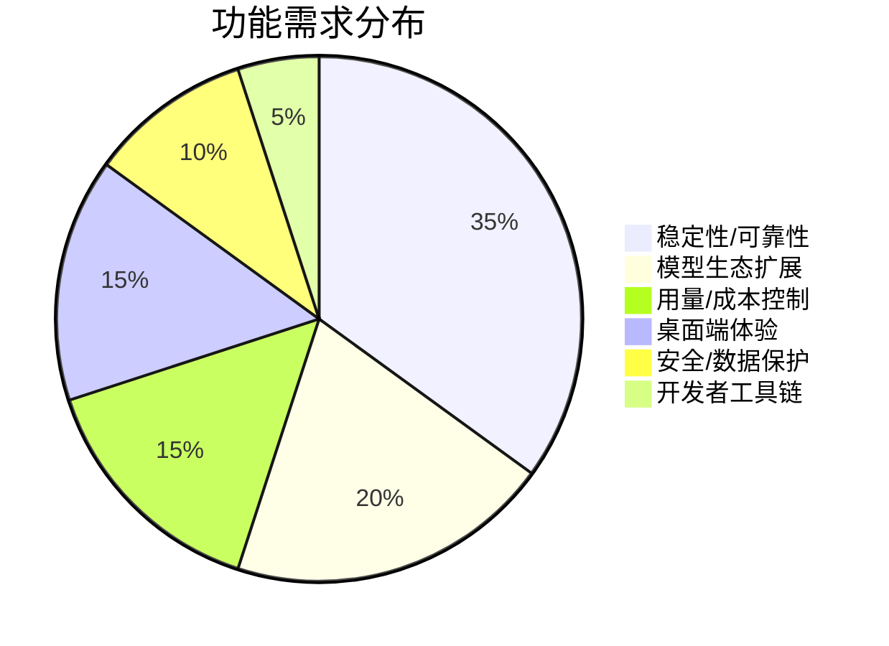

# AI CLI 工具社区动态日报 2026-04-19

> 生成时间: 2026-04-19 00:13 UTC | 覆盖工具: 8 个

- [Claude Code](https://github.com/anthropics/claude-code)
- [OpenAI Codex](https://github.com/openai/codex)
- [Gemini CLI](https://github.com/google-gemini/gemini-cli)
- [GitHub Copilot CLI](https://github.com/github/copilot-cli)
- [Kimi Code CLI](https://github.com/MoonshotAI/kimi-cli)
- [OpenCode](https://github.com/anomalyco/opencode)
- [Pi](https://github.com/badlogic/pi-mono)
- [Qwen Code](https://github.com/QwenLM/qwen-code)
- [Claude Code Skills](https://github.com/anthropics/skills)

---

## 横向对比

# 2026-04-19 AI CLI 工具生态横向对比分析报告

---

## 1. 生态全景

当前 AI CLI 工具生态正经历从"功能竞赛"向"可靠性优先"的关键转型。头部工具（Claude Code、OpenAI Codex）已跨越早期采纳阶段，社区焦点从"能否做到"转向"能否稳定、可预测、可审计地做到"。模型质量波动成为共性痛点——Claude Opus 4.7、GPT-5.4、Kimi K2.6 均遭遇指令遵循退化争议，暴露大模型迭代与开发者生产依赖之间的张力。与此同时，多 Agent 协作、沙箱安全、企业级配置管理成为下一代竞争高地，而认证体系与商业化策略的剧烈调整（Qwen OAuth 停用、Kimi 付费功能断层）正在重塑用户信任格局。

---

## 2. 各工具活跃度对比

| 工具 | Issues 更新 | PR 更新 | 版本发布 | 关键动态 |
|:---|:---:|:---:|:---:|:---|
| **Claude Code** | 10+ 热点 | 6 个 | v2.1.114 | macOS 11 兼容性危机、Opus 4.7 质量争议集群 |
| **OpenAI Codex** | 10 个热点 | 10 个 | rust-v0.122.0-alpha.10 | Goal Mode 五部曲全栈推进、Intel Mac 支持突破 |
| **Gemini CLI** | 10 个热点 | 10 个 | 无 | 3 个 PR 竞争修复同一配置问题、信号转发修复 |
| **GitHub Copilot CLI** | 10 个热点 | 无更新 | 无 | GPT-5.4 xhigh 降级争议、429 重试逻辑缺失 |
| **Kimi Code CLI** | 11 个 | 5 个 | 无 | K2.6 模型反弹、Subagent 架构级 Bug 集群 |
| **OpenCode** | 10 个热点 | 10 个 | v1.4.11（v1.4.12 发布断裂） | 升级灾难、TUI 冻结、Homebrew 404 连锁故障 |
| **Pi** | 10 个热点 | 10 个 | 无 | Claude 4.7 全家族支持、Node 25 兼容性修复 |
| **Qwen Code** | 10+（认证危机主导） | 10 个 | v0.14.5-nightly | OAuth 免费层停用引发 401 风暴、VSCode 认证紧急重构 |

> **注**：所有工具均呈现高活跃度，但性质分化——Codex/Gemini/Pi 以功能迭代为主，Claude Code/Kimi/OpenCode/Qwen 以危机响应为主。

---

## 3. 共同关注的功能方向

| 功能方向 | 涉及工具 | 具体诉求 |
|:---|:---|:---|
| **模型质量可控性** | Claude Code、Copilot CLI、Kimi CLI | 指令遵循稳定性、版本回退机制、推理过程可见性（Kimi #1923、Claude #42796、Copilot #2739） |
| **多 Agent/子代理架构** | Codex、Kimi CLI、Gemini CLI、Claude Code | 工作目录继承（Kimi #1931）、消息路由（Claude #40281）、MAX_TURNS 中断伪装成功（Gemini #22323）、Orchestrator 模式（Codex #18105） |
| **沙箱安全与权限精细化** | Codex、Gemini CLI、Kimi CLI、Qwen Code | Windows ACL 损坏（Codex #15777）、Yolo 模式安全加固（Qwen #3156）、权限缓存失效（Gemini #24916）、bypassPermissions 滥用（Claude #39027） |
| **配置系统健壮性** | Gemini CLI、Copilot CLI、Codex、Qwen Code | 环境变量类型解析（3 个 Gemini PR 竞争）、XDG 规范（Copilot #1954）、`.codex` 目录位置（Codex #18334）、认证状态持久化（Qwen #3417） |
| **跨平台一致性** | Codex、Claude Code、Kimi CLI、OpenCode、Pi | Intel Mac（Codex #10410）、macOS 11 断裂（Claude #50456）、WSL2 登录（Kimi #1916）、Windows 粘贴（OpenCode #9922）、pnpm 检测（Pi #3377） |
| **用量透明与成本控制** | OpenCode、Claude Code、Copilot CLI | `/usage` 统一追踪（OpenCode #9281/PR #9545）、子代理计费黑洞（OpenCode #20859）、Codex 上下文浪费（#9046） |

---

## 4. 差异化定位分析

| 工具 | 功能侧重 | 目标用户 | 技术路线特征 |
|:---|:---|:---|:---|
| **Claude Code** | 深度 IDE 集成、Agent Teams 协作、插件生态 | 专业开发者、企业团队 | TypeScript/Node 为主，快速迭代但兼容性管控薄弱；模型质量波动成最大风险 |
| **OpenAI Codex** | 自主任务执行（Goal Mode）、Rust 核心性能、MCP 生态 | 追求自动化的进阶开发者、AI 原生团队 | Rust 重写核心，强调沙箱安全与长期任务状态机；alpha 迭代频繁 |
| **Gemini CLI** | AST 感知代码分析、记忆路由、子代理评估体系 | 研究型开发者、Google 生态深度用户 | 内部架构探索激进（AST、记忆分层），但终端可靠性短板明显 |
| **GitHub Copilot CLI** | IDE 无缝衔接、GitHub 生态集成、Skills 体系 | 现有 Copilot 订阅者、微软生态用户 | 依附 VSCode 生态，自主 CLI 能力相对薄弱；模型策略受 OpenAI 牵制 |
| **Kimi Code CLI** | 中文场景优化、Subagent 并行、流式传输性能 | 中国开发者、Moonshot API 用户 | 架构设计激进但验证不足（Subagent 循环、目录继承）；模型策略争议暴露产品决策透明度缺失 |
| **OpenCode** | 多模型聚合（Copilot/Codex/Claude/Kimi）、统一界面 | 多模型策略用户、成本敏感型团队 | 作为"模型路由器"定位独特，但稳定性债务沉重（TUI 冻结、升级灾难） |
| **Pi** | 极致终端体验、模型生态广度（Claude/GPT/Qwen/本地）、可扩展性 | 终端原生开发者、多模型尝鲜者 | Mario Zechner 个人主导，OSS 周末高效响应；扩展 API 演进快但 breaking changes 频繁 |
| **Qwen Code** | 阿里云生态集成、中文模型优化、ACP 钩子体系 | 中国开发者、阿里云用户 | 认证体系重构中，商业化急转（OAuth 免费层关闭）冲击用户基础；VSCode 扩展优先于 CLI |

---

## 5. 社区热度与成熟度

### 社区活跃度梯队

| 梯队 | 工具 | 判断依据 |
|:---|:---|:---|
| **🔥 超活跃** | Claude Code、OpenAI Codex、Gemini CLI、Pi | 日均 10+ PR/Issues 更新，核心功能持续演进，社区参与深度高 |
| **⚡ 高活跃但危机驱动** | Kimi CLI、OpenCode、Qwen Code | 更新密集，但大量为 Bug 修复与危机响应，技术债务显性化 |
| **🌡️ 中等活跃** | GitHub Copilot CLI | Issues 活跃但 PR 停滞（今日零更新），功能迭代依赖微软/OpenAI 内部节奏 |

### 成熟度评估

| 维度 | 最成熟 | 最不成熟 |
|:---|:---|:---|
| **发布工程** | Pi（快速关闭 Issue，Node 25 兼容主动修复） | OpenCode（v1.4.12 发布断裂、升级配置丢失） |
| **跨平台稳定性** | Codex（Intel Mac 支持终落地，但 Windows 仍弱） | Kimi CLI（WSL2 登录异常、Subagent 架构缺陷） |
| **模型质量管控** | Pi（快速适配 Claude 4.7 全家族，thinking levels 动态化） | Claude Code（Opus 4.7 争议集群，历史最高赞 Issue #42796） |
| **商业化平滑度** | Claude Code（订阅体系成熟） | Qwen Code（OAuth 免费层突然关闭，认证体系重构中） |
| **企业级安全** | Codex（沙箱权限规范化 PR #18274） | OpenCode（权限对象合并缺陷 #23214、日志膨胀 #16876） |

---

## 6. 值得关注的趋势信号

| 趋势信号 | 证据来源 | 开发者参考价值 |
|:---|:---|:---|
| **"模型回退权"成为核心诉求** | Kimi #1925（K2.5/2.6 切换）、Claude #42796（2 月更新退化）、Copilot #2739（xhigh 移除） | **生产环境必须锁定模型版本**，避免自动升级；评估工具时需确认是否支持模型 pin 与 A/B 对比 |
| **"AI 治理即代码"基础设施萌芽** | Claude Code PR #20448（R6 审计追踪）、#46095（Veriflow 免疫系统）；Pi #3345（sequential 工具执行模式） | 企业合规需求从"事后审计"转向"运行时约束"，关注工具是否支持可验证的权限规则集与执行追踪 |
| **终端体验重新被重视** | Pi #3379（focus reporting）、#3386（大字符串安全）；Gemini #25643（Shell 输出节流）；OpenCode #17083（stdin 刷新） | CLI 不是"降级版 IDE"，终端特有的性能边界（V8 限制、信号处理、渲染帧率）需要专门优化 |
| **认证体系碎片化与供应商锁定风险** | Qwen OAuth 危机、Kimi 付费功能 CLI 缺失（#1930）、Claude Code API 误报限流（#38896） | **优先支持 API Key + 多提供商切换**的工具；避免深度绑定单一 OAuth 链路 |
| **从"单 Agent 执行"到"多 Agent 编排"的架构跃迁** | Codex Goal Mode 五部曲、Kimi Subagent 目录继承修复、Claude Cowork Dispatch | 评估工具时需关注：子代理状态隔离、消息路由可靠性、工作目录继承语义、跨 Agent 计费透明度 |
| **MCP 生态的"最后一公里"摩擦** | Claude #3214（$schema 被拒绝）、Gemini #25619（ping best-effort）、Codex #18413（动态工具命名空间） | MCP 协议标准化进行中，实际兼容性仍需逐个验证；优先选择支持显式命名空间与降级处理的工具 |

---

**结论**：当前 AI CLI 工具生态处于"功能丰富度基本满足，工程可靠性决定留存"的关键节点。技术决策者应优先评估工具的**模型版本锁定能力、跨平台稳定性、认证体系健壮性、多 Agent 架构成熟度**四大维度，而非单纯比较功能清单。Pi 和 Codex 在工程纪律上领先，Claude Code 和 Kimi 面临模型策略与架构债务的双重挑战，OpenCode 和 Qwen 则需先解决生存级稳定性问题。

---

## 各工具详细报告

<details>
<summary><strong>Claude Code</strong> — <a href="https://github.com/anthropics/claude-code">anthropics/claude-code</a></summary>

## Claude Code Skills 社区热点

> 数据来源: [anthropics/skills](https://github.com/anthropics/skills)

# Claude Code Skills 社区热点报告（截至 2026-04-19）

---

## 1. 热门 Skills 排行（按社区关注度）

| 排名 | Skill | 功能概述 | 状态 | 链接 |
|:---|:---|:---|:---|:---|
| 1 | **document-typography** | AI 生成文档的排版质量控制：修复孤行、寡行、编号错位等排版问题 | 🟡 Open | [PR #514](https://github.com/anthropics/skills/pull/514) |
| 2 | **skill-quality-analyzer / skill-security-analyzer** | 元技能：对 Claude Skills 进行五维度质量评估与安全审计 | 🟡 Open | [PR #83](https://github.com/anthropics/skills/pull/83) |
| 3 | **ODT skill** | OpenDocument 文本创建、模板填充及 ODT↔HTML 转换 | 🟡 Open | [PR #486](https://github.com/anthropics/skills/pull/486) |
| 4 | **frontend-design**（改进版） | 提升前端设计技能的清晰度与可执行性，确保单轮对话内可完成 | 🟡 Open | [PR #210](https://github.com/anthropics/skills/pull/210) |
| 5 | **testing-patterns** | 全栈测试模式：测试哲学、单元测试、React 组件测试、E2E | 🟡 Open | [PR #723](https://github.com/anthropics/skills/pull/723) |
| 6 | **shodh-memory** | AI 代理的持久化记忆系统，跨会话维持上下文 | 🟡 Open | [PR #154](https://github.com/anthropics/skills/pull/154) |
| 7 | **sensory** | 原生 macOS 自动化：通过 AppleScript 替代截图式 computer use | 🟡 Open | [PR #806](https://github.com/anthropics/skills/pull/806) |
| 8 | **record-knowledge** | 解决 Claude Code 会话间上下文丢失，持久化记录知识条目 | 🟡 Open | [PR #521](https://github.com/anthropics/skills/pull/521) |

**讨论热点**：文档类技能（typography/ODT）反映 AI 生成内容"最后一公里"的精细化需求；元技能（quality/security analyzer）标志社区开始关注 Skills 自身的工程化治理。

---

## 2. 社区需求趋势（Issues 提炼）

| 方向 | 代表 Issue | 核心诉求 |
|:---|:---|:---|
| **🔐 企业级治理与共享** | [#228](https://github.com/anthropics/skills/issues/228) 组织级 Skill 共享 | 企业团队需要绕过 Slack/手动上传的共享机制，建立内部 Skill 市场 |
| **🧪 技能质量与可验证性** | [#556](https://github.com/anthropics/skills/issues/556) `run_eval.py` 0% 触发率 | 评估工具链存在根本性缺陷，技能触发机制缺乏可观测性 |
| **🛡️ 安全边界与信任** | [#492](https://github.com/anthropics/skills/issues/492) 命名空间仿冒风险 | `anthropic/` 命名空间被社区滥用，官方需建立签名/验证机制 |
| **🔌 标准化与互操作** | [#16](https://github.com/anthropics/skills/issues/16) Skills 作为 MCP 暴露 | 社区希望 Skills 遵循 MCP 协议，成为可组合的 API 接口 |
| **☁️ 多云/企业部署** | [#29](https://github.com/anthropics/skills/issues/29) Bedrock 兼容性 | 企业用户要求脱离 Anthropic 直连，适配 AWS 等第三方托管 |
| **🧹 生命周期管理** | [#406](https://github.com/anthropics/skills/issues/406), [#403](https://github.com/anthropics/skills/issues/403) | 上传/删除/版本管理的 API 稳定性成为生产阻塞项 |

---

## 3. 高潜力待合并 Skills（评论活跃 + 近期更新）

| Skill | 关键进展 | 预计落地价值 | 链接 |
|:---|:---|:---|:---|
| **document-typography** | 3 月更新，解决通用排版痛点，无竞品 | 文档生成质量分水岭 | [PR #514](https://github.com/anthropics/skills/pull/514) |
| **testing-patterns** | 3 月底更新，覆盖全测试金字塔 | 填补 TDD/BDD 技能空白 | [PR #723](https://github.com/anthropics/skills/pull/723) |
| **sensory** | 4 月初更新，Tiered 权限设计成熟 | macOS 自动化原生替代方案 | [PR #806](https://github.com/anthropics/skills/pull/806) |
| **ODT skill** | 4 月中更新，ISO 标准格式刚需 | 政府/学术场景合规输出 | [PR #486](https://github.com/anthropics/skills/pull/486) |
| **record-knowledge** | 3 月更新，直接回应上下文丢失痛点 | 会话持久化基础设施 | [PR #521](https://github.com/anthropics/skills/pull/521) |

**结构性机会**：`skill-creator` 相关修复密集（[#362](https://github.com/anthropics/skills/pull/362), [#539](https://github.com/anthropics/skills/pull/539), [#541](https://github.com/anthropics/skills/pull/541), [#666](https://github.com/anthropics/skills/pull/666)），表明技能开发工具链正经历工程化重构，可能释放新一轮社区创作产能。

---

## 4. Skills 生态洞察

> **核心诉求**：社区正从"技能数量扩张"转向"质量可信度与工程化治理"——企业用户要求组织级共享、安全边界和多云部署，开发者要求可验证的触发机制与标准化协议（MCP），而终端用户则持续追求 AI 输出在特定领域（文档、代码、测试）的"最后一公里"专业化。

---

---

# Claude Code 社区动态日报 | 2026-04-19

---

## 1. 今日速览

今日社区最核心议题是 **macOS 11 Big Sur 兼容性危机**——v2.1.113-114 因构建目标升级至 macOS 13.0+ 导致大量旧系统用户无法启动。与此同时，**Opus 4.7 模型质量争议持续发酵**，多个高赞 Issue 报告模型遵循指令能力显著退化，与 4.6 版本形成鲜明对比。

---

## 2. 版本发布

### v2.1.114（2026-04-18）
| 项目 | 内容 |
|:---|:---|
| **关键修复** | 修复 Agent Teams 队友请求工具权限时权限对话框崩溃的问题 |
| **链接** | [Release v2.1.114](https://github.com/anthropics/claude-code/releases/tag/v2.1.114) |

> ⚠️ **注意**：该版本引入 **macOS 11 Big Sur 兼容性回归**，详见下方 Issues #50456、#50383、#50445。

---

## 3. 社区热点 Issues（精选 10 条）

| # | 状态 | 标题 | 评论 | 👍 | 核心要点 |
|:---|:---|:---|:---:|:---:|:---|
| [#42796](https://github.com/anthropics/claude-code/issues/42796) | 🔴 CLOSED | **Claude Code 因 2 月更新导致复杂工程任务不可用** | 529 | 1963 | **社区史上最高赞 Issue**。用户报告 2 月更新后模型在复杂工程任务中表现断崖式下跌，Anthropic 已关闭但争议未平。反映核心用户群对模型稳定性的深度焦虑。 |
| [#38896](https://github.com/anthropics/claude-code/issues/38896) | 🟡 OPEN | **API 误报 Rate Limit（实际使用率 0%）** | 20 | 4 | Opus 4.6 空上下文也触发限流，计费系统与 API 网关状态不一致。影响付费用户体验信任。 |
| [#17618](https://github.com/anthropics/claude-code/issues/17618) | 🔴 CLOSED | **Windows Alt+M 切换自动接受模式失效（v2.1.3+）** | 20 | 15 | 跨平台快捷键一致性长期问题，Windows 用户工作流受阻数月。 |
| [#14200](https://github.com/anthropics/claude-code/issues/14200) | 🟡 OPEN | **为 Plugins 添加 Rules 支持** | 13 | 58 | 高赞功能请求。用户希望插件系统支持类似 `.cursorrules` 的项目级规则，以提升插件可定制性。 |
| [#45732](https://github.com/anthropics/claude-code/issues/45732) | 🟡 OPEN | **要求恢复 /buddy 功能：511 个理由** | 12 | 1 | 极具特色的用户案例：非 CS 背景开发者通过 `/buddy` 伴侣模式完成生产级基础设施构建。反映 AI 结对编程对特定用户群的不可替代性。 |
| [#40281](https://github.com/anthropics/claude-code/issues/40281) | 🟡 OPEN | **Cowork Dispatch：SendUserMessage 工具不可加载** | 8 | 2 | **核心协作功能阻塞**。Agent 生成响应但无法回传至 UI，影响多 Agent 协作场景。 |
| [#50456](https://github.com/anthropics/claude-code/issues/50456) | 🟡 OPEN | **自动更新静默破坏 macOS 11 Big Sur 运行** | 7 | 0 | **严重兼容性回归**。自动更新推送不兼容二进制，用户无预警丢失工作环境。 |
| [#39889](https://github.com/anthropics/claude-code/issues/39889) | 🟡 OPEN | **Dispatch 会话忽略用户模型/权限设置** | 5 | 5 | 移动端发起的 Dispatch 会话无法继承桌面端配置，权限模型与用户体验割裂。 |
| [#39027](https://github.com/anthropics/claude-code/issues/39027) | 🟡 OPEN | **后台任务通知触发自主 API 调用** | 4 | 6 | **安全隐患**。`bypassPermissions` 被滥用于合成用户消息，模型以用户身份自主响应。 |
| [#50546](https://github.com/anthropics/claude-code/issues/50546) | 🟡 OPEN | **Opus 4.7 忽略明确用户指令** | 3 | 0 | 新增模型质量投诉，与 #49214、#49725 形成 **4.7 质量争议集群**。 |

---

## 4. 重要 PR 进展（精选 6 条，实际全部）

| # | 状态 | 标题 | 作者 | 核心内容 |
|:---|:---|:---|:---|:---|
| [#46095](https://github.com/anthropics/claude-code/pull/46095) | 🟡 OPEN | Add Claude Mythos operating contract for Veriflow immune system | GoodshytGroup | 为 Veriflow 免疫系统添加 Claude Mythos 运行合约，涉及 AI 安全治理框架 |
| [#50565](https://github.com/anthropics/claude-code/pull/50565) | 🟡 OPEN | Copilot/fix configuration again | GoodshytGroup | GitHub Copilot 配置修复（重复提交，可能为工作流调试） |
| [#50301](https://github.com/anthropics/claude-code/pull/50301) | 🟡 OPEN | feat(plugins): add flappy-claude terminal game | xodn348 | **社区创意插件**：终端版 Flappy Bird，纯 Python 3 + curses 实现，展示插件系统扩展性 |
| [#50293](https://github.com/anthropics/claude-code/pull/50293) | 🟡 OPEN | fix: use -exist flag in ipset add | briancornally | 开发容器防火墙脚本健壮性修复，防止重复执行报错 |
| [#46024](https://github.com/anthropics/claude-code/pull/46024) | 🟡 OPEN | docs: document --exclude-dynamic-system-prompt-sections | Christian-Sidak | 文档补全：打印模式提示缓存优化标志，提升多机部署时的缓存命中率 |
| [#20448](https://github.com/anthropics/claude-code/pull/20448) | 🟡 OPEN | Add web4-governance plugin for AI governance with R6 workflow | dp-web4 | **AI 治理基础设施插件**：T3 信任张量、实体见证、R6 审计追踪，面向可信 AI 代理时代 |

---

## 5. 功能需求趋势

```
┌─────────────────────────────────────────────────────────┐
│  趋势热力图（基于 50 条 Issues 分析）                      │
├─────────────────────────────────────────────────────────┤
│  🔥🔥🔥🔥🔥  模型质量/指令遵循  ──  4.7 退化争议爆发      │
│  🔥🔥🔥🔥🔥  跨平台兼容性      ──  macOS 11/Windows 痛点  │
│  🔥🔥🔥🔥    插件系统扩展      ──  Rules、/buddy、游戏化   │
│  🔥🔥🔥🔥    企业级协作        ──  Cowork/Dispatch/Agent Teams│
│  🔥🔥🔥      权限与安全模型    ──  bypassPermissions、后台任务 │
│  🔥🔥🔥      远程/云原生支持    ──  AWS Bedrock SSO、Termux  │
│  🔥🔥        可观测性          ──  OTLP 指标、使用监控      │
│  🔥          TUI/交互体验      ──  计划模式、语音、上下文保留 │
└─────────────────────────────────────────────────────────┘
```

**关键转向**：社区正从"功能丰富度"诉求转向 **"可预测性、可控性、可审计性"** 诉求——模型行为稳定、权限边界清晰、企业合规就绪。

---

## 6. 开发者关注点

### 🔴 紧急痛点

| 痛点 | 影响面 | 代表 Issue |
|:---|:---|:---|
| **macOS 11 兼容性断裂** | 旧设备开发者被迫滞留旧版本或升级硬件 | #50456, #50383, #50445 |
| **Opus 4.7 指令遵循退化** | 生产环境自动化工作流失效 | #50546, #49214, #49725, #42796 |
| **Cowork 多 Agent 消息丢失** | 团队协作核心场景阻塞 | #40281, #38183 |

### 🟡 高频需求

| 需求 | 场景 | 社区呼声 |
|:---|:---|:---:|
| **Plugin Rules 支持** | 项目级 AI 行为约束 | 58 👍 |
| **/buddy 模式回归** | 非专业开发者结对编程 | 12 条深度反馈 |
| **AWS Bedrock + SSO 远程控制** | 企业云原生部署 | 53 👍 |
| **持久化 Max Effort 级别** | VSCode 扩展默认配置 | - |
| **后台任务权限隔离** | 安全合规 | 6 👍 |

### 💡 新兴信号

- **"AI 治理即代码"**：PR #20448、#46095 显示社区开始探索可验证的 AI 行为约束框架
- **终端游戏化**：Flappy Claude 插件反映开发者对 CLI 工具情感化体验的尝试
- **移动端-桌面端配置同步**：Dispatch 场景暴露多端体验割裂问题

---

*日报基于 GitHub 公开数据生成，不代表 Anthropic 官方立场。*

</details>

<details>
<summary><strong>OpenAI Codex</strong> — <a href="https://github.com/openai/codex">openai/codex</a></summary>

# OpenAI Codex 社区动态日报 | 2026-04-19

---

## 1. 今日速览

今日 Codex 社区迎来 **Goal Mode（目标模式）** 五部曲 PR 全栈推进，标志着自主任务规划能力即将落地；同时 Intel Mac 与 Windows 平台支持取得实质性进展，长期困扰 x86_64 用户的安装与渲染问题进入修复通道。性能与沙箱安全仍是社区反馈的高频痛点。

---

## 2. 版本发布

| 版本 | 类型 | 说明 |
|:---|:---|:---|
| **rust-v0.122.0-alpha.10** | Alpha 预发布 | Rust 核心组件迭代，具体变更未披露详细 release notes |

> 注：该版本为常规 alpha 迭代，未附详细变更日志。关联 Issue [#18341](https://github.com/openai/codex/issues/18341) 显示 Intel Mac 用户在该版本遇到 UI 渲染异常。

---

## 3. 社区热点 Issues

| # | Issue | 状态 | 评论 | 重要性分析 |
|:---|:---|:---|:---|:---|
| [#10410](https://github.com/openai/codex/issues/10410) | **macOS Intel (x86_64) 支持请求** | 🟢 CLOSED | 187 | **历史性突破**：历时 2.5 个月、288 👍 的社区呼声，Intel Mac 支持终获官方响应。PR [#18500](https://github.com/openai/codex/pull/18500) 直接解决 `codex app` 入口的平台识别与安装引导问题。 |
| [#11981](https://github.com/openai/codex/issues/11981) | **单 Agent 运行时 100% CPU 占用** | 🔴 OPEN | 37 | **性能危机**：Pro 用户反馈即使仅运行单个 Agent 也导致系统风扇狂转，影响生产环境可用性。与 [#18467](https://github.com/openai/codex/issues/18467) 形成同类问题集群。 |
| [#18264](https://github.com/openai/codex/issues/18264) | **新会话消息发送延迟 ~8 秒** | 🟢 CLOSED | 29 | **快速修复**：最新更新引入的回归问题，28 👍 反映影响面广，官方在 24 小时内关闭，显示对核心体验问题响应迅速。 |
| [#18258](https://github.com/openai/codex/issues/18258) | **Computer Use 插件显示不可用（文件实际存在）** | 🔴 OPEN | 25 | **技能系统缺陷**：用户已提供临时 workaround（配置 `features.apps = true` 并修复缓存路径），但官方修复 pending，影响自动化工作流。 |
| [#15777](https://github.com/openai/codex/issues/15777) | **Windows 沙箱安装破坏 AppData ACL** | 🔴 OPEN | 23 | **安全红线**：Free 用户报告权限配置错误导致整个用户目录 ACL 损坏，零 👍 但评论活跃，属于严重安全隐患。 |
| [#9046](https://github.com/openai/codex/issues/9046) | **上下文窗口耗尽（对话刚开始）** | 🔴 OPEN | 18 | **模型效率问题**：用户仅输入一个问题即触发上下文限制，怀疑 token 计算或系统提示占用异常，长期未解决。 |
| [#17322](https://github.com/openai/codex/issues/17322) | **Windows 应用关闭不彻底 + UI 点击测试失效** | 🔴 OPEN | 11 | **桌面端质量**：窗口关闭后进程残留，"New Chat" 按钮点击区域异常，12 👍 反映 Windows 用户体验打磨不足。 |
| [#12343](https://github.com/openai/codex/issues/12343) | **沙箱权限过度授予整个用户目录** | 🟢 CLOSED | 11 | **安全修复**：与 #15777 同源问题，SandboxOffline/Online 权限范围过大，已关闭但需关注是否彻底修复。 |
| [#10695](https://github.com/openai/codex/issues/10695) | **GitHub Fix CI Skill 因沙箱隔离无法访问凭证** | 🔴 OPEN | 11 | **生态集成阻塞**：Keychain 与 GH_TOKEN 环境变量在沙箱内不可见，导致官方内置 Skill 失效，Pro Max 用户受影响。 |
| [#12773](https://github.com/openai/codex/issues/12773) | **macOS 多窗口支持** | 🔴 OPEN | 10 | **生产力需求**：20 👍 的高票功能请求，多项目管理场景刚需，目前仅支持单窗口限制工作流效率。 |

---

## 4. 重要 PR 进展

| # | PR | 作者 | 状态 | 功能/修复内容 |
|:---|:---|:---|:---|:---|
| [#18073-18077](https://github.com/openai/codex/pull/18073) | **Goal Mode 五部曲（1-5/5）** | etraut-openai | 🔴 OPEN | **年度级功能**：完整的目标模式基础设施——持久化目标状态 → App-Server API → 模型工具（get_goal/set_goal）→ 核心运行时（续作提示、token 预算、中断恢复）→ TUI 交互（`/goal` 命令、状态栏、快照）。实现 Agent 自主规划与长期任务执行能力。 |
| [#18500](https://github.com/openai/codex/pull/18500) | **支持 `codex app` 在 Intel Mac 与 Windows 运行** | etraut-openai | 🔴 OPEN | **平台公平性**：修复 CLI 入口仅指向 Apple Silicon DMG 的问题，新增平台检测与对应安装包路由，直接回应 #10410 社区诉求。 |
| [#18413](https://github.com/openai/codex/pull/18413) | **动态工具命名空间支持** | pash-openai | 🔴 OPEN | **工具系统演进**：动态工具从协议层到注册、搜索、分派全链路携带显式命名空间，解决 deferred 工具自引用命名问题，为 MCP 生态扩展铺路。 |
| [#18504](https://github.com/openai/codex/pull/18504) | **审批配置重命名为 auto-review** | won-openai | 🔴 OPEN | **产品一致性**：内部 "Guardian" 命名全面替换为用户可见的 "Auto-review"，消除配置与 API 的术语割裂。 |
| [#18502](https://github.com/openai/codex/pull/18502) | **Thread List 多 cwd 过滤支持** | acrognale-oai | 🔴 OPEN | **API 易用性**：`thread/list` 从单字符串改为多 cwd 数组，支持项目+worktree 一次性查询，减少客户端合并分页逻辑。 |
| [#17897](https://github.com/openai/codex/pull/17897) | **Turn 分析数据附加 Git 元数据** | ningyi-oai | 🔴 OPEN | **可观测性**：为启用分析的用户自动采集 git workspace 信息，关联到 turn 事件，支持开发效率度量与问题溯源。 |
| [#18499](https://github.com/openai/codex/pull/18499) | **修复插件缓存 panic（cwd 不可用）** | etraut-openai | 🔴 OPEN | **稳定性**：修复 11h 长任务中触发的绝对路径规范化 panic，解决 #16637 根因。 |
| [#18441](https://github.com/openai/codex/pull/18441) | **消除 shell 快照清理误报** | etraut-openai | 🔴 OPEN | **工程品质**：临时文件晋升最终路径后 `Drop` 误删导致的虚假警告，优化资源生命周期管理。 |
| [#18274](https://github.com/openai/codex/pull/18274) | **协议层文件权限规范化** | bolinfest | 🔴 OPEN | **安全基础**：`PermissionProfile` 获得稳定、规范的文件系统语义，消除遗留沙箱映射的派生歧义，为统一权限抽象奠基。 |
| [#17581-17580](https://github.com/openai/codex/pull/17581) | **定时器与消息队列存储（1-4/4，已合并）** | etraut-openai | 🟢 CLOSED | **异步能力落地**：SQLite 持久化存储 + `codex queue` CLI + 定时消息注入，支持跨会话的延迟任务与外部消息触发。 |

---

## 5. 功能需求趋势

基于 50 条活跃 Issue 分析，社区关注呈现 **四大方向**：

| 趋势方向 | 代表 Issue | 热度指标 |
|:---|:---|:---|
| **🖥️ 跨平台桌面体验** | #10410 (Intel Mac), #17322, #15777 (Windows) | 高 👍 + 高评论，平台覆盖不均衡是核心矛盾 |
| **🔒 沙箱安全与权限精细化** | #15777, #12343, #10695, #18365 | 安全事件驱动，用户要求"最小权限"透明可控 |
| **🧠 自主任务与 Agent 协作** | #18105 (Orchestrator 只读模式), #18513 (子代理自主委托) | 高阶用户从"单 Agent 执行"转向"多 Agent 编排" |
| **⚡ 性能与资源效率** | #11981, #18467 (CPU 飙高), #9046 (上下文浪费) | 生产环境可用性门槛，直接影响付费意愿 |

**新兴信号**：MCP 生态配置灵活性（#16501 按工具设置审批模式）、项目级配置可定制（#18334 `.codex` 目录位置）反映企业/团队规模化部署需求。

---

## 6. 开发者关注点

### 🔴 高频痛点

| 痛点 | 典型反馈 | 影响层级 |
|:---|:---|:---|
| **Windows 二等公民体验** | 沙箱 ACL 损坏、应用关闭异常、点击测试失效、远程连接端口冲突 (#18503) | 阻碍平台采纳 |
| **性能回归敏感** | 最新更新频繁引入 CPU 飙高、消息延迟，用户被迫降级或暂停使用 | 付费用户流失风险 |
| **沙箱与集成的张力** | 安全隔离过强导致 GitHub CI Skill、MCP Server 等官方功能自我矛盾 | 产品功能自洽性 |

### 🟡 期待改进

- **配置即代码**：`.codex` 目录位置、工具审批策略等需更灵活的工程化配置（#18334, #16501）
- **上下文透明度**：用户希望可视化 token 消耗构成，理解"为何刚开始对话就耗尽窗口"（#9046）
- **长任务可靠性**：11h 工作流中的 panic（#18499）暴露极端场景测试覆盖不足

### 🟢 积极信号

Goal Mode 全栈 PR 显示 OpenAI 正从"对话式编程"向"目标驱动式自主执行"战略升级，与社区 #18105、#18513 的 Orchestrator 需求形成共振；Intel Mac 支持的快速响应也表明平台公平性优先级提升。

---

*日报基于 GitHub 公开数据生成，部分 PR 评论数为 undefined 系 API 未返回原始数据。*

</details>

<details>
<summary><strong>Gemini CLI</strong> — <a href="https://github.com/google-gemini/gemini-cli">google-gemini/gemini-cli</a></summary>

# Gemini CLI 社区动态日报 | 2026-04-19

## 今日速览

今日社区活跃度较高，共 50 个 Issues 和 38 个 PR 有更新，但无新版本发布。核心焦点集中在**配置系统环境变量解析**（多个 PR 竞争修复同一问题）、**信号转发与进程管理**可靠性，以及**AI Pro 订阅权限**的 403 错误排查。内部工作流方面，团队持续深耕 AST 感知代码分析、记忆路由和子代理评估体系。

---

## 社区热点 Issues

| # | 状态 | 标题 | 核心看点 |
|---|------|------|---------|
| [#12441](https://github.com/google-gemini/gemini-cli/issues/12441) | 🔒 CLOSED | API Error: Requested entity was not found | **高热度历史 Issue 今日关闭**，16 评论、6 👍。经典 404 错误，涉及模型/项目配置不匹配，对新手 onboarding 影响大，关闭说明可能已有文档或修复跟进。 |
| [#22745](https://github.com/google-gemini/gemini-cli/issues/22745) | 🔓 OPEN | AST-aware file reads, search, and mapping | **架构级 EPIC**，5 评论。探索用 AST 替代文本级文件操作，可减少 token 浪费、精准定位方法边界，直接影响 Agent 代码理解能力上限。 |
| [#25644](https://github.com/google-gemini/gemini-cli/issues/25644) | 🔓 OPEN | Google AI Pro 订阅无法在 Gemini CLI 使用 | **今日新建**，AI Pro 用户 OAuth 登录后遭遇 403 PERMISSION_DENIED，但 API Key 模式正常。涉及 Google 内部权益系统与 OAuth scope 对接，影响付费用户转化。 |
| [#24916](https://github.com/google-gemini/gemini-cli/issues/24916) | 🔓 OPEN | 重复请求同一文件权限 | 权限缓存失效问题，"allow for all future sessions" 选项间歇性不生效，安全体验层面的 friction。 |
| [#25166](https://github.com/google-gemini/gemini-cli/issues/25166) | 🔓 OPEN | Shell 命令执行后假死 "Waiting input" | 简单命令完成后 UI 仍显示等待输入，2 👍 反映共鸣。终端状态同步的 race condition，直接影响核心交互可靠性。 |
| [#22323](https://github.com/google-gemini/gemini-cli/issues/22323) | 🔓 OPEN | 子代理 MAX_TURNS 中断被伪装为 GOAL success | **隐蔽但严重**，子代理耗尽轮次后向上层报告成功，导致主代理基于错误结论继续执行，评估和调试体系需完善。 |
| [#17049](https://github.com/google-gemini/gemini-cli/issues/17049) | 🔒 CLOSED | Yolo 模式下仍限制工作区外路径 | 安全沙箱与 Yolo 承诺的冲突，今日关闭说明权限边界策略可能有调整。 |
| [#22819](https://github.com/google-gemini/gemini-cli/issues/22819) | 🔓 OPEN | 记忆路由：全局 vs 项目级 | 记忆分层架构设计，关乎个性化体验的工程实现，2 👍 显示社区期待。 |
| [#24246](https://github.com/google-gemini/gemini-cli/issues/24246) | 🔓 OPEN | >128 tools 触发 400 错误 | 工具膨胀场景下的硬性限制，需要智能工具筛选或分页机制，影响复杂项目可用性。 |
| [#25216](https://github.com/google-gemini/gemini-cli/issues/25216) | 🔓 OPEN | Windows A:\ 临时路径崩溃 | Windows 兼容性边缘 case，`realpath` 对软盘驱动器根目录处理异常，复古硬件场景。

---

## 重要 PR 进展

| # | 状态 | 标题 | 技术价值 |
|---|------|------|---------|
| [#25642](https://github.com/google-gemini/gemini-cli/pull/25642) | 🟡 OPEN | 转发终止信号到重子进程 | **可靠性关键修复**。`relaunchAppInChildProcess` 未转发 SIGTERM/SIGHUP/SIGINT，导致进程管理工具（systemd、ACP）无法优雅关闭，孤儿进程问题。 |
| [#25643](https://github.com/google-gemini/gemini-cli/pull/25643) | 🟡 OPEN | Shell 输出节流防 UI 卡顿 | 高频文本事件触发 React 重渲染导致冻结，引入节流机制。`npm test` 等大输出场景体验提升。 |
| [#25641](https://github.com/google-gemini/gemini-cli/pull/25641) | 🟡 OPEN | 环境变量字符串强制转布尔/数字 | **配置系统核心修复**。`"${GEMINI_AUTO_THEME:-true}"` 解析为字符串 `"true"` 导致 Zod 校验失败，需 schema-aware 强制转换。 |
| [#25639](https://github.com/google-gemini/gemini-cli/pull/25639) | 🟡 OPEN | `/bug-memory` 命令 + 自动堆快照 | 调试体验增强，RSS > 2GB 自动捕获 V8 heap snapshot，解决 #25337 中用户需手动挂 Chrome DevTools 的痛点。 |
| [#25608](https://github.com/google-gemini/gemini-cli/pull/25608) | 🟡 OPEN | 环境变量布尔值强制转换（替代方案） | 与 #25641、#25634 同一问题的不同实现，社区出现**方案竞争**，需维护者裁决。 |
| [#25637](https://github.com/google-gemini/gemini-cli/pull/25637) | 🟡 OPEN | CLI 页脚显示机器 Hostname | 多设备/远程开发场景下的身份识别，小而实用的 UX 改进。 |
| [#25633](https://github.com/google-gemini/gemini-cli/pull/25633) | 🟡 OPEN | 记录实际响应 modelVersion 到会话 | 修复别名/A-B 路由导致的模型统计偏差，telemetry 准确性提升。 |
| [#25223](https://github.com/google-gemini/gemini-cli/pull/25223) | 🟡 OPEN | ANSI 主题使用语义化颜色 | 修复硬编码 hex 值导致的终端对比度问题，可访问性/兼容性改进。 |
| [#25625](https://github.com/google-gemini/gemini-cli/pull/25625) + [#25626](https://github.com/google-gemini/gemini-cli/pull/25626) | 🟡 OPEN | 自动记忆行为兼容修复 + ACP 会话启动 | 配对 PR，解决 `experimental.memoryManager` 到 `experimental.autoMemory` 的迁移断层，确保 ACP/TUI 行为一致。 |
| [#25619](https://github.com/google-gemini/gemini-cli/pull/25619) | 🟡 OPEN | MCP list 中 ping 设为 best-effort | 兼容不响应 `ping` 但 handshake 成功的 MCP 服务器，提升生态兼容性。 |

---

## 功能需求趋势

从 Issues 分布提炼出四大方向：

| 趋势方向 | 代表 Issues | 成熟度判断 |
|---------|-----------|-----------|
| **Agent 架构深化** | #22745 AST 感知、#22819 记忆路由、#23582 子代理权限感知、#22323 子代理恢复 | 🔶 早期探索，多个 EPIC 并行，2026 H1 重点 |
| **配置系统健壮性** | #25641/#25608/#25634 环境变量类型、#25644 AI Pro 权限 | 🔴 燃眉之急，付费用户阻塞，社区 PR 密集 |
| **终端体验打磨** | #25166 假死、#24915 边框渲染、#24202 SSH 乱码、#25218 屏幕阅读器表格 | 🟡 持续迭代，Windows/SSH/无障碍覆盖不足 |
| **安全与权限** | #24916 权限缓存、#22672 破坏性操作拦截、#25644 OAuth 权限 | 🔶 框架已有，细节体验待完善 |

---

## 开发者关注点

### 🔴 高频痛点

1. **配置即代码的"字符串陷阱"**  
   `settings.json` 中环境变量插值统一返回字符串，与 Zod schema 的严格类型冲突。今日出现 **3 个独立 PR**（#25641、#25608、#25634）竞争修复，反映该问题普遍且急需官方统一方案。

2. **进程生命周期管理**  
   子进程信号转发缺失（#25642、#25605）、Shell 假死（#25166）、SSH 会话检测（#24546）等问题集中暴露，CLI 作为长期运行进程在复杂环境下的可靠性仍是短板。

3. **Google 账号体系与付费权益打通**  
   #25644 揭示 AI Pro 订阅在 OAuth 链路下的 403 错误，API Key 却正常——权限 entitlement 的传递存在断层，直接影响商业化转化。

### 💡 潜在机会

- **AST 工具链集成**：#22745/#22746 提及 tilth/glyph 作为起点，社区可提前调研贡献
- **Windows 专项优化**：A:\ 软盘路径（#25216）、ripgrep EFTYPE（#25378）、ANSI 颜色（#25223）显示该平台的测试覆盖不足
- **行为评估（Behavioral Eval）基础设施**：#24353 组件级评估体系开放后，社区可参与编写测试用例

</details>

<details>
<summary><strong>GitHub Copilot CLI</strong> — <a href="https://github.com/github/copilot-cli">github/copilot-cli</a></summary>

# GitHub Copilot CLI 社区动态日报 | 2026-04-19

---

## 1. 今日速览

今日社区无新版本发布，但 Issues 活跃度极高（32 条更新），**GPT-5.4 模型能力降级争议**持续发酵，同时 **v1.0.32 多项 UI/UX 回归问题**引发集中反馈。MCP 生态管理和速率限制体验成为开发者新痛点。

---

## 3. 社区热点 Issues

| # | 状态 | 标题 | 核心看点 | 社区反应 |
|---|------|------|---------|---------|
| [#2725](https://github.com/github/copilot-cli/issues/2725) | 🔴 OPEN | GPT-5.4 /model picker hides Extra High | **UI 与运行时能力不一致**：模型选择器仅显示 Low/Medium/High，但 `xhigh` 参数仍实际有效，暴露前端与后端配置同步问题 | 21 评论 / 16 👍，高热度技术讨论 |
| [#92](https://github.com/github/copilot-cli/issues/92) | 🔴 OPEN | /ask mode | **长期悬而未决的基础功能**：Agent 模式强制自动执行命令/修改文件，缺乏纯问答模式，与 Claude Code 等竞品形成体验差距 | 9 评论 / 9 👍，2025-09 创建至今未解决 |
| [#2760](https://github.com/github/copilot-cli/issues/2760) | 🔴 OPEN | ⭐ Implement proper HTTP retry logic for 429 | **生产级稳定性缺陷**：遭遇速率限制时无退避重试，20+ 次/分钟暴力重试加剧限流，需引入标准指数退避算法 | 5 评论 / 2 👍，获星标标记为重要 |
| [#2583](https://github.com/github/copilot-cli/issues/2583) | 🔴 OPEN | Copilot Update Command Is Not Working | **Windows 平台升级管道断裂**：`copilot update` 和 `/update` 自 v1.0.17 后失效，winget 渠道同步异常 | 8 评论，影响基础运维体验 |
| [#2739](https://github.com/github/copilot-cli/issues/2739) | 🔴 OPEN | xhigh reasoning was removed for gpt-5.4 and gpt-5.3-codex! | **模型能力降级争议**：付费用户核心功能被移除，"unacceptable" 措辞反映强烈不满，与 #2725 形成关联证据链 | 2 评论 / 4 👍，情绪激烈 |
| [#1954](https://github.com/github/copilot-cli/issues/1954) | 🔴 OPEN | Regression: 'XDG_CONFIG_HOME' ignored | **Unix 生态兼容性倒退**：破坏 12-Factor 配置管理原则，`COPILOT_HOME` 无法等效替代因同时重定向 machine-local state | 2 评论 / 4 👍，资深开发者关注 |
| [#2777](https://github.com/github/copilot-cli/issues/2777) | 🔴 OPEN | Agent name is not visible anymore | **v1.0.31 UI 回归**：底部状态栏移除 Agent 标识，降低多 Agent 场景的可感知性，截图对比清晰 | 2 评论 / 2 👍 |
| [#2482](https://github.com/github/copilot-cli/issues/2482) | 🔴 OPEN | task_complete not written to output | **非交互模式可靠性缺陷**：`--autopilot` 模式下 Agent 声称完成但实际无输出，自动化流水线静默失败 | 2 评论 / 1 👍，CI/CD 场景关键 |
| [#2818](https://github.com/github/copilot-cli/issues/2818) | 🔴 OPEN | Session token expired. Please resend your message | **长时任务体验杀手**：自动会话中断破坏"设置后离开"的 Autopilot 核心使用场景 | 1 评论 / 2 👍，新提交即获关注 |
| [#2817](https://github.com/github/copilot-cli/issues/2817) | 🔴 OPEN | MCP server processes not killed on CLI exit | **资源泄漏问题**：MCP 子进程（如 ssh-mcp）成为孤儿进程，每次会话累积 tens of MB 内存占用 | 新提交，基础设施层面隐患 |

---

## 4. 重要 PR 进展

> **今日无 Pull Requests 更新**，以下为基于 Issues 推断的潜在修复方向：

| 关联 Issue | 预期修复领域 | 优先级判断 |
|-----------|-----------|-----------|
| #2725 / #2739 | GPT-5.4 `xhigh` 参数前端同步或后端恢复 | 🔴 **紧急** — 付费功能争议 |
| #2760 | 429 退避重试算法实现 | 🟡 高 — 基础设施稳定性 |
| #2777 | 底部状态栏 Agent 标识回归 | 🟡 高 — 近期引入的回归 |
| #2583 | Windows 更新通道修复 | 🟡 高 — 基础功能断裂 |
| #1954 | `XDG_CONFIG_HOME` 支持恢复 | 🟢 中 — 生态兼容性 |
| #2817 | MCP 进程生命周期管理（SIGTERM 信号处理） | 🟢 中 — 资源管理 |
| #2825 | CJK 字符宽度计算（wcwidth 类修复） | 🟢 中 — 国际化 |
| #2823 | `/model` 切换时 effortLevel 持久化 | 🟢 中 — 配置一致性 |
| #2826 | Markdown 表格终端渲染 | 🟢 低 — 体验优化 |
| #2821 | Agent 输出折叠/展开切换（参考 Claude Code） | 🟢 低 — 竞品功能对标 |

---

## 5. 功能需求趋势

```
[模型能力层]     ████████████████████  GPT-5.4/xhigh 降级争议、reasoning 级别控制
[UI/UX 体验]     █████████████████░░░  主题定制(#2830)、输出折叠(#2821)、Agent 标识(#2777)
[MCP 生态]       ██████████████░░░░░░  进程管理(#2817)、快捷切换(#2805)
[速率限制]       ████████████░░░░░░░░  429 重试逻辑(#2760)、限流 UI 可视化(#2827)
[配置管理]       ██████████░░░░░░░░░░  XDG 规范(#1954)、自定义路径(#2829)、实验性功能(#2820)
[会话稳定性]     ██████████░░░░░░░░░░  Token 过期(#2818)、Compaction 中断(#2500)
[国际化]         ██████░░░░░░░░░░░░░░  CJK 换行(#2825)
```

**新兴趋势**：`/btw` 命令（#2078, 26 👍）作为社区黑话功能持续积累支持；Claude Code 功能对标（折叠输出、/ask 模式）成为隐性比较基准。

---

## 6. 开发者关注点

| 痛点类别 | 具体表现 | 影响面 |
|---------|---------|--------|
| **模型能力透明度** | GPT-5.4 `xhigh` 实际可用但 UI 隐藏，官方未明确说明是 Bug 还是策略调整 | 付费 Pro+ 用户信任危机 |
| **升级回归风险** | v1.0.27→v1.0.31→v1.0.32 连续引入 UI 变更和稳定性问题，缺乏 Canary 机制 | 所有主动更新用户 |
| **自动化可靠性** | `--autopilot` 模式输出丢失、会话中断，破坏"无人值守"核心承诺 | CI/CD、长时任务场景 |
| **跨平台一致性** | Windows 更新失效、Termux/Android Signal 9 崩溃（#2816）、XDG 规范背离 | 非 macOS 平台用户 |
| **MCP 运维负担** | 进程泄漏、切换繁琐，与 Skills 的丝滑体验形成反差 | MCP 早期采用者 |
| **速率限制黑盒** | 全局 429 无区分提示、周限制无实时进度，"Auto" fallback 不透明 | 高频使用者 |

---

*数据截止：2026-04-19 00:00 UTC | 数据来源：github.com/github/copilot-cli*

</details>

<details>
<summary><strong>Kimi Code CLI</strong> — <a href="https://github.com/MoonshotAI/kimi-cli">MoonshotAI/kimi-cli</a></summary>

# Kimi Code CLI 社区动态日报 | 2026-04-19

## 今日速览

今日社区活跃度极高，**11 个 Issues 与 5 个 PR 在 24 小时内更新**，核心矛盾集中在 **K2.6 模型体验争议** 与 **Subagent 工作目录继承/循环调用等架构级 Bug**。开发者正积极提交修复方案，包括透明命令重写、YOLO 模式优化及流式传输性能改进。

---

## 社区热点 Issues

| # | 状态 | 标题 | 核心要点 |
|---|:---:|------|---------|
| [#1925](https://github.com/MoonshotAI/kimi-cli/issues/1925) | 🔵 OPEN | **Kimi K2.5 vs K2.6 模型切换请求** | 开发者强烈反馈 K2.6 "思考过程淹没创造力、增加幻觉且丧失个性"，要求保留 K2.5 及原系统提示。这是**模型策略层面的社区反弹**，需产品团队回应。 |
| [#1924](https://github.com/MoonshotAI/kimi-cli/issues/1924) | 🔵 OPEN | **API 温度参数 Bug：仅允许 0.6 却返回所有值无效** | API 层逻辑错误，影响所有 SDK 接入方式（含 OpenAI 兼容层）。**阻塞性 Bug**，已确认复现，需紧急热修。 |
| [#1927](https://github.com/MoonshotAI/kimi-cli/issues/1927) | 🔵 OPEN | **Subagent 无限循环：同一文件读取上百次** | v1.36.0 严重缺陷，导致任务无法完成且消耗大量 Token。**生产环境风险**，已有对应 PR #1933 尝试修复目录继承问题。 |
| [#1931](https://github.com/MoonshotAI/kimi-cli/issues/1931) | 🔵 OPEN | **Subagent 不继承父进程工作目录，破坏 git worktree 流程** | 架构设计缺陷：Shell `cd` 后派生子代理仍停留在根目录。直接影响**多仓库/ monorepo 工作流**，PR #1933 已提交修复。 |
| [#1923](https://github.com/MoonshotAI/kimi-cli/issues/1923) | 🔵 OPEN | **交互体验差：内部推理过度隐藏** | 与 K2.6 争议同源——用户无法审查推理过程，错误发现滞后。反映**可观测性（Observability）** 成为核心诉求。 |
| [#1916](https://github.com/MoonshotAI/kimi-cli/issues/1916) | 🔵 OPEN | **Win11 WSL2 登录异常：跳转订阅页面后中断** | 跨平台兼容性问题，影响 Windows 开发者基础体验。 |
| [#1934](https://github.com/MoonshotAI/kimi-cli/issues/1934) | 🔵 OPEN | **语音输入模式（对标 Claude Code）** | 新兴交互范式请求，强调**免提场景**（头脑风暴、长提示、离键盘）。 |
| [#1930](https://github.com/MoonshotAI/kimi-cli/issues/1930) | 🔵 OPEN | **CLI 接入 Allegretto 专业数据库（同花顺/天眼查）** | 付费功能（¥199/月）的 CLI 端缺失，**商业变现与产品完整性** 相关。 |
| [#1672](https://github.com/MoonshotAI/kimi-cli/issues/1672) | 🔴 CLOSED | **VS Code 插件 Plan 模式体验割裂** | 已关闭，但反映持续痛点：要求对话式 Plan 而非外部 Markdown 文件。与 #1923 共同指向**交互范式统一性**。 |
| [#1070](https://github.com/MoonshotAI/kimi-cli/issues/1070) | 🔴 CLOSED | **登录失败：auth.kimi.com 网络不可达** | 历史网络问题关闭，可能为区域性 SSL/网络配置问题。 |

---

## 重要 PR 进展

| # | 状态 | 标题 | 技术价值 |
|---|:---:|------|---------|
| [#1935](https://github.com/MoonshotAI/kimi-cli/pull/1935) | 🔵 OPEN | **Hooks 支持 `updatedInput` 透明命令重写** | 34 行精小改动，实现 PreToolUse 钩子的输入篡改能力。为**安全审计、命令过滤、企业合规** 提供扩展点，对齐现有 Beta 文档。 |
| [#1932](https://github.com/MoonshotAI/kimi-cli/pull/1932) | 🔵 OPEN | **重构 YOLO 模式：保留 Plan 审查与 AskUserQuestion** | 关键 UX 修复：区分"操作授权"与"用户意图确认"，避免 `--yes` 跳过必要的人工审核节点。**自动化与控制的平衡**。 |
| [#1933](https://github.com/MoonshotAI/kimi-cli/pull/1933) | 🔵 OPEN | **Subagent 支持 `work_dir` 覆盖** | 直接修复 #1931/#1927 根因：允许子代理显式指定工作目录，解决 git worktree 与目录继承问题。**架构级修复**。 |
| [#1928](https://github.com/MoonshotAI/kimi-cli/pull/1928) | 🔵 OPEN | **流式传输：避免重放大型 Tool Call Payload** | 解决 #1786 大文件写入卡顿：ACP 停止重复发送完整累积参数，`AgentLoop` 优化增量更新。**性能关键修复**，影响大文件场景。 |
| [#1917](https://github.com/MoonshotAI/kimi-cli/pull/1917) | 🔴 CLOSED | **回滚误推至 main 的 Anthropic thinking effort 重构** | 流程治理事件：两 commit 绕过 PR 审查直接推送，已撤销。提醒**主干保护策略** 需强化。 |

---

## 功能需求趋势

```
┌─────────────────────────────────────────┐
│  🔥 模型策略与可控性  ← 最高热度          │
│     · K2.5/K2.6 切换、系统提示定制        │
│     · 推理过程可见性（思维链透明度）        │
├─────────────────────────────────────────┤
│  ⚙️ Agent 架构健壮性                     │
│     · Subagent 目录继承、循环检测          │
│     · 父子进程状态隔离与同步               │
├─────────────────────────────────────────┤
│  🎙️ 交互范式扩展                         │
│     · 语音输入、对话式 Plan、流式反馈       │
├─────────────────────────────────────────┤
│  🏢 企业/商业功能补齐                     │
│     · 专业数据库 CLI 接入、常驻 Server     │
├─────────────────────────────────────────┤
│  🖥️ 跨平台与 IDE 集成                    │
│     · WSL2、VS Code 插件体验优化           │
└─────────────────────────────────────────┘
```

---

## 开发者关注点

| 痛点类别 | 具体表现 | 紧迫度 |
|---------|---------|:------:|
| **模型行为不可预测** | K2.6 "过度思考"导致创意抑制、幻觉增加，且无法回退版本 | 🔴 高 |
| **Subagent 可靠性** | 无限循环 + 工作目录错乱 = 任务失败 + Token 浪费 | 🔴 高 |
| **API 兼容性** | 温度参数校验逻辑错误，阻断第三方工具链 | 🔴 高 |
| **可观测性缺失** | 内部推理不暴露，调试困难，与 Cursor/Cline 等竞品形成差距 | 🟡 中高 |
| **平台覆盖缺口** | WSL2 登录异常、Windows 开发者体验次级 | 🟡 中 |
| **商业化功能断层** | 付费订阅的专业数据库仅限 Web，CLI 用户价值感知弱 | 🟡 中 |

---

> 📌 **建议关注**：PR #1933（Subagent 目录修复）与 #1928（流式性能）的合并进度，以及 K2.6 模型争议是否会有官方回应或配置开关。

</details>

<details>
<summary><strong>OpenCode</strong> — <a href="https://github.com/anomalyco/opencode">anomalyco/opencode</a></summary>

# OpenCode 社区动态日报 | 2026-04-19

## 今日速览

今日社区活跃度极高，**v1.4.11 紧急修复了工作区路由和共享同步问题**，但 **v1.4.12 发布缺失导致 Homebrew 安装 404**，引发连锁故障。TUI/桌面端稳定性问题持续发酵，多个用户报告升级后白屏、配置丢失和输入卡顿。

---

## 版本发布

### v1.4.11（2026-04-18）
| 模块 | 更新内容 |
|:---|:---|
| **Core** | 修复工作区路由问题，确保请求到达正确的工作区实例 |
| **Core** | 停止对从未共享过的会话尝试共享同步，减少无效操作 |

> ⚠️ **注意**：v1.4.12 标签已推送但**发布文件缺失**，导致 Homebrew 安装报错（见 Issue #23315、#23347）

---

## 社区热点 Issues

| # | 状态 | 标题 | 关键度 | 社区反应 | 链接 |
|:---|:---|:---|:---|:---|:---|
| **#5485** | 🔴 OPEN | **TUI 突然卡住无法启动** — 用户担心卸载导致数据丢失，寻求安全迁移方案 | ⭐⭐⭐⭐⭐ | 49 评论，持续 4 个月未解决，用户恐慌情绪明显 | [链接](https://github.com/anomalyco/opencode/issues/5485) |
| **#23315** | 🔴 OPEN | **v1.4.12 无发布文件导致 Homebrew 404** | ⭐⭐⭐⭐⭐ | 9 👍，当日爆发，阻塞新用户安装 | [链接](https://github.com/anomalyco/opencode/issues/23315) |
| **#23211** | 🔴 OPEN | **1.4.7+ 升级后 UI 无法渲染、配置全丢**（登录状态、模型配置丢失） | ⭐⭐⭐⭐⭐ | 7 评论，附对比截图，破坏性升级 | [链接](https://github.com/anomalyco/opencode/issues/23211) |
| **#4672** | 🔴 OPEN | **GitHub Agent 卡在 "Sending Message"** — 1.0.106 版本长期问题 | ⭐⭐⭐⭐ | 20 评论，跨版本存在，影响核心工作流 | [链接](https://github.com/anomalyco/opencode/issues/4672) |
| **#22630** | 🔴 OPEN | **macOS 26.4 Tahoe 测试版白屏** — Desktop 1.4.6 完全无响应 | ⭐⭐⭐⭐ | 9 评论，新系统兼容性风险 | [链接](https://github.com/anomalyco/opencode/issues/22630) |
| **#9281** | 🔴 OPEN | **统一用量追踪 `/usage` 命令**（Codex/Copilot/Claude） | ⭐⭐⭐⭐ | 21 👍，高需求功能，PR #9545 已关联 | [链接](https://github.com/anomalyco/opencode/issues/9281) |
| **#20859** | 🔴 OPEN | **Copilot 子代理模型被忽略，全部计费到主模型**（Claude Opus 4.6） | ⭐⭐⭐⭐ | 隐性成本高，企业用户敏感 | [链接](https://github.com/anomalyco/opencode/issues/20859) |
| **#9922** | 🔴 OPEN | **Windows/Ubuntu 粘贴 API Key 完全失效** — 无提示、无替代方案 | ⭐⭐⭐ | 8 评论，2 👍，新用户 onboarding 阻塞 | [链接](https://github.com/anomalyco/opencode/issues/9922) |
| **#22408** | 🔴 OPEN | **Kimi K2.6 集成请求** | ⭐⭐⭐ | 16 👍，国产模型支持呼声高 | [链接](https://github.com/anomalyco/opencode/issues/22408) |
| **#16876** | 🔴 OPEN | **日志文件暴涨至 GB 级** — 无关闭选项，磁盘空间灾难 | ⭐⭐⭐ | 性能/运维痛点，长期忽视 | [链接](https://github.com/anomalyco/opencode/issues/16876) |

---

## 重要 PR 进展

| # | 状态 | 标题 | 类型 | 核心内容 | 链接 |
|:---|:---|:---|:---|:---|:---|
| **#23357** | 🟡 OPEN | fix(plugin): `opencode run` 等待插件完成后再退出 | Bug Fix | 新增 `OPENCODE_EXPERIMENTAL_PLUGIN_EXIT_DEFAULT_TIMEOUT` 环境变量，解决插件事件丢失 | [链接](https://github.com/anomalyco/opencode/pull/23357) |
| **#23356** | 🟡 OPEN | fix(core): 阻止元数据变更自动更新会话时间戳 | Bug Fix | 修复排序抖动问题，避免会话列表频繁重排 | [链接](https://github.com/anomalyco/opencode/pull/23356) |
| **#23355** | 🟡 OPEN | fix: 重新附加已删除会话时 TUI 卡死 | Bug Fix | `opencode -s <deleted-id>` 导致终端无法响应（连 Ctrl+C 都无效），现优雅处理 | [链接](https://github.com/anomalyco/opencode/pull/23355) |
| **#23352** | 🟡 OPEN | fix(provider): 智谱 AI 思考块注入条件门控 | Bug Fix | 非推理 GLM 模型因强制注入 `thinking` 返回空响应；恢复 GLM 变体支持 | [链接](https://github.com/anomalyco/opencode/pull/23352) |
| **#9545** | 🟡 OPEN | feat(usage): 统一用量追踪 + 自动刷新令牌 | Feature | `/usage` 命令整合 Codex/Copilot/Claude 额度查询，侧边栏面板 + 透明续期 | [链接](https://github.com/anomalyco/opencode/pull/9545) |
| **#23214** | 🟡 OPEN | fix: 权限对象改为规则集合并（保留层级） | Bug Fix | 修复权限对象合并导致的顺序丢失，影响安全策略执行 | [链接](https://github.com/anomalyco/opencode/pull/23214) |
| **#16751** | 🟡 OPEN | fix(session): 工具调用/结果不匹配根因修复 | Bug Fix | 大规模重构，关联 8 个历史 Issue，解决对话状态机核心缺陷 | [链接](https://github.com/anomalyco/opencode/pull/16751) |
| **#16750** | 🟡 OPEN | fix(provider): 跳过助手消息的空文本过滤 | Bug Fix | 修复 Anthropic API 因 thinking blocks 在末位被拒的问题 | [链接](https://github.com/anomalyco/opencode/pull/16750) |
| **#17083** | 🟡 OPEN | fix: POSIX 退出时刷新 stdin 防止脏字节泄漏 | Bug Fix | 解决退出后 shell 收到残留字符的终端污染问题 | [链接](https://github.com/anomalyco/opencode/pull/17083) |
| **#23335** | 🟡 OPEN | fix: 恢复 DeepSeek/GLM/MiniMax 推理变体 | Bug Fix | `@ai-sdk/openai` 兼容路由下恢复 `low/medium/high` 推理级别 | [链接](https://github.com/anomalyco/opencode/pull/23335) |

---

## 功能需求趋势



| 趋势方向 | 具体表现 | 代表 Issue |
|:---|:---|:---|
| **🔥 稳定性优先** | TUI 卡死、白屏、配置丢失、升级破坏成为最高频投诉 | #5485, #23211, #22630, #23330 |
| **国产模型接入** | Kimi K2.6、智谱 GLM 系列、DeepSeek 变体支持需求集中 | #22408, #23352, #23335 |
| **用量透明化** | 企业用户强烈要求追踪 Copilot/Codex/Claude 额度消耗 | #9281, #20859 |
| **数据安全** | 会话误删无确认、Ctrl+C 直接退出丢上下文、日志膨胀 | #21236, #23323, #16876 |
| **跨平台一致性** | Windows 粘贴、macOS 新系统兼容、终端字体渲染 | #9922, #22630, #23332 |

---

## 开发者关注点

### 🔴 阻塞性痛点

| 问题 | 影响范围 | 紧急度 |
|:---|:---|:---|
| **版本发布流程断裂** | v1.4.12 有 tag 无 release，Homebrew、自动更新全崩 | **P0** |
| **升级即灾难** | 1.4.7+ 多起报告配置归零、UI 失效，用户不敢升级 | **P0** |
| **TUI 底层冻结** | futex 锁死、信号处理缺陷，Linux/macOS 均中招 | **P1** |

### 🟡 高频摩擦点

- **终端交互体验**：粘贴 API Key 无反馈、Nerd Font 渲染错误、提示信息缺失
- **成本黑洞**：Copilot 子代理计费不透明，企业用户无法审计
- **可观测性**：日志无轮转、用量无接口、错误信息模糊

### 🟢 积极信号

- **社区贡献活跃**：altendky 等贡献者持续输出底层修复（终端刷新、权限合并、工具调用状态机）
- **功能迭代明确**：`/usage` 统一追踪、LM Studio 自动发现、PWA 支持已进入开发管道

---

> 📌 **建议行动**：维护团队需立即补发 v1.4.12 release 或回滚 Homebrew formula，并建立升级兼容性测试矩阵，避免 1.4.7+ 的配置迁移灾难重演。

</details>

<details>
<summary><strong>Pi</strong> — <a href="https://github.com/badlogic/pi-mono">badlogic/pi-mono</a></summary>

# Pi 社区动态日报 | 2026-04-19

## 今日速览

今日 Pi 社区活跃度极高，**Claude 4.7 全家族模型支持**与**工具输出大字符串崩溃修复**成为核心焦点。Mario Zechner 主导的 OSS 周末持续推进，大量长期 Issues 被快速关闭，同时 Node 25 兼容性、Windows 安装检测等边缘场景问题得到系统性修复。

---

## 社区热点 Issues

| # | 标题 | 状态 | 重要性 | 社区反应 |
|---|------|------|--------|----------|
| [#3214](https://github.com/badlogic/pi-mono/issues/3214) | Cloud Code Assist API 因 `$schema` 元声明返回 400 错误 | 🟡 OPEN | **高** | 9 评论，MCP 工具生态兼容性的关键阻塞问题；antigravity/Google Cloud Code Assist 用户广泛受影响 |
| [#3208](https://github.com/badlogic/pi-mono/issues/3208) | 按模型自定义 Thinking Levels | 🟡 OPEN | **高** | 4 评论/6 👍，高票功能请求；用户希望 `Shift+Tab` 仅循环模型实际支持的层级，避免 Opus 4.7 等模型的 API 错误 |
| [#3372](https://github.com/badlogic/pi-mono/issues/3372) | Claude 订阅无法使用 | 🔴 CLOSED | **高** | 6 评论，快速修复；反映 Pi 与 Anthropic 订阅体系的计费边界模糊问题 |
| [#3344](https://github.com/badlogic/pi-mono/issues/3344) | 中断工具调用永久损坏对话状态 | 🔴 CLOSED | **高** | 6 评论；`Ctrl+C` 后 `tool_use`/`tool_result` 配对丢失导致 400 错误，严重影响交互可靠性 |
| [#3356](https://github.com/badlogic/pi-mono/issues/3356) | Agent 创建 Shell bomb 导致 OOM | 🔴 CLOSED | **高** | 4 评论；模型自主行为的安全边界问题，需更严格的资源限制机制 |
| [#3299](https://github.com/badlogic/pi-mono/issues/3299) | 新增 `max` thinking level 同步 Opus 4.7 五档 API | 🔴 CLOSED | **中** | 7 评论；Pi 的 thinking ladder 从 5 档扩展至 6 档，保持与 Anthropic API 演进同步 |
| [#3005](https://github.com/badlogic/pi-mono/issues/3005) | "UPDATE AVAILABLE" 消息可关闭 | 🔴 CLOSED | **中** | 8 评论/2 👍；NixOS 等复杂安装场景用户的长期痛点，现已支持设置关闭 |
| [#3357](https://github.com/badlogic/pi-mono/issues/3357) | 官方本地 LLM 提供商扩展 | 🟡 OPEN | **中** | 3 评论；Julien Chaumond (Hugging Face) 提出，动态从 `baseUrl/models` 获取模型列表，降低 Ollama/llama.cpp 接入门槛 |
| [#3342](https://github.com/badlogic/pi-mono/issues/3342) | GPT-5 模型 compaction 失败 | 🟡 OPEN | **中** | 2 评论；`reasoning: none` 参数兼容性问题，影响新一代 OpenAI 模型使用 |
| [#3376](https://github.com/badlogic/pi-mono/issues/3376) | Node 25 大字符串 `Array.from` 崩溃 | 🟡 OPEN | **中** | 2 评论；V8 引擎限制导致的底层兼容性问题，需重构字符串处理策略 |

---

## 重要 PR 进展

| # | 标题 | 核心内容 |
|---|------|----------|
| [#3382](https://github.com/badlogic/pi-mono/pull/3382) / [#3381](https://github.com/badlogic/pi-mono/pull/3381) | Claude 4.7 全家族支持 + 温度参数处理修复 | 新增 Sonnet 4.7 / Haiku 4.7 的 `supportsAdaptiveThinking()` 识别；**强制剥离** `temperature`/`top_p`/`top_k` 参数——Claude 4.7 系列即使关闭扩展思考也会因这些参数返回 400 |
| [#3386](https://github.com/badlogic/pi-mono/pull/3386) | 防止大输出 sanitize/render 崩溃 | 重构 `sanitizeBinaryOutput()`：用 code-unit 扫描器替代 `Array.from()`，避免 Node 25 大字符串 `RangeError`；同步加固 `getTextOutput()` 的流式渲染边界 |
| [#3393](https://github.com/badlogic/pi-mono/pull/3393) | Alibaba/Qwen prompt caching 支持 | 扩展 `maybeAddOpenRouterAnthropicCacheControl` 至通义千问模型；新增 `cacheControlFormat` 兼容字段，统一 Anthropic 风格的 prompt caching 机制 |
| [#3400](https://github.com/badlogic/pi-mono/pull/3400) | Amazon Bedrock 条件省略 `maxTokens` | 未设置时不发送 `maxTokens`，避免 Bedrock token bucket 的激进预留导致配额浪费；解决 "no available token quota" 误报 |
| [#3375](https://github.com/badlogic/pi-mono/pull/3375) | Fork 支持最新消息 | 允许在当前位置 fork 会话，无需选择历史消息；`entryId` 可为 `undefined`，轻微破坏扩展兼容性但提升核心体验 |
| [#3379](https://github.com/badlogic/pi-mono/pull/3379) | 终端失焦隐藏软件光标 | 启用 DECSET 1004 focus reporting，`tmux` 多窗格场景下光标状态更准确 |
| [#3377](https://github.com/badlogic/pi-mono/pull/3377) | Windows pnpm 全局安装检测修复 | 补全 `\.pnpm\` 路径匹配，避免误显示 `npm install -g` 更新指令 |
| [#3398](https://github.com/badlogic/pi-mono/pull/3398) | 会话路径 symlink 解析 | `buildSessionTree()` 通过 `realpath` 匹配父子关系，修复多 profile 共享 sessions 目录时的 fork 关系断裂 |
| [#3385](https://github.com/badlogic/pi-mono/pull/3385) | 纯构建器导出 Workflow/Session 快照 | 无需启动完整 `SessionStepRuntime` 即可构建快照，提升嵌入式工作流的可测试性和确定性 |
| [#3345](https://github.com/badlogic/pi-mono/pull/3345) | 单工具 sequential 执行模式覆盖 | 工具定义可选 `executionMode: "sequential"`，消息中任一工具设置则整批顺序执行，解决并行工具依赖冲突 |

---

## 功能需求趋势

```
┌─────────────────────────────────────────┐
│  1. 模型生态适配（最热）                  │
│     • Claude 4.7 家族 / GPT-5 / Qwen     │
│     • Thinking levels 动态化、模型专属化   │
│     • Prompt caching 跨提供商统一          │
├─────────────────────────────────────────┤
│  2. 安装与部署体验                        │
│     • Windows/pnpm/NixOS 边缘场景检测      │
│     • 本地 LLM 零配置接入（Ollama等）      │
├─────────────────────────────────────────┤
│  3. 交互可靠性                            │
│     • 工具调用中断恢复、对话状态防腐蚀       │
│     • 大输出/长字符串的内存安全处理          │
├─────────────────────────────────────────┤
│  4. 可定制性与安静模式                     │
│     • 更新提示、订阅警告的可配置关闭         │
│     • 快捷键自定义、命令别名                │
└─────────────────────────────────────────┘
```

---

## 开发者关注点

| 痛点类别 | 具体表现 | 涉及 Issues/PRs |
|---------|---------|----------------|
| **Node 25 兼容性** | `Array.from(大字符串)` 抛 `RangeError`、V8 数组长度限制 | #3376, #3383, #3386 |
| **MCP 工具生态摩擦** | `$schema` 等 JSON Schema 元字段被云 API 拒绝；工具参数 schema 需更严格清洗 | #3214 |
| **模型行为边界失控** | Agent 创建 shell bomb、OOM kill；需更细粒度的执行资源限制 | #3356 |
| **Thinking 参数地狱** | 不同模型/版本对 `temperature`/`reasoning` 的容忍度差异极大，配置易错 | #3208, #3299, #3382, #3342 |
| **跨平台终端差异** | Windows Terminal 键码、kitty escape sequences、focus reporting 行为不一致 | #2733, #3391, #3379 |
| **扩展 API 稳定性** | Fork 回调签名变更、provider 注册接口演进带来的 breaking changes | #3375, #3208 |

---

*日报基于 github.com/badlogic/pi-mono 2026-04-18 的 24h 活动数据生成*

</details>

<details>
<summary><strong>Qwen Code</strong> — <a href="https://github.com/QwenLM/qwen-code">QwenLM/qwen-code</a></summary>

# Qwen Code 社区动态日报 | 2026-04-19

## 今日速览

今日社区被 **Qwen OAuth 免费层停用后的认证危机** 主导，大量用户遭遇 401 无效令牌错误，Issues 中近半数与此相关。开发团队紧急推进 VSCode 扩展的认证流程重构（PR #3398），同时发布了 v0.14.5 夜间版本，新增 ACP 完整钩子支持和紧凑模式优化。

---

## 版本发布

### [v0.14.5-nightly.20260418](https://github.com/QwenLM/qwen-code/releases/tag/v0.14.5-nightly.20260418)

| 更新项 | 内容 |
|--------|------|
| **ACP 集成** | 新增完整的 hooks 支持（`feat(acp): add complete hooks support` by @DennisYu07） |
| **紧凑模式 UX** | 优化快捷键、设置同步及安全机制（`feat: optimize compact mode UX` by @chiga0） |
| **HTTP Hooks** | 新增 HTTP Hook 支持（PR 截断，推测为 Webhook 类功能） |

> 该版本未解决当前核心的 OAuth 认证问题，用户需关注后续补丁。

---

## 社区热点 Issues

### 🔴 认证危机（401 错误集中爆发）

| # | 状态 | 标题 | 核心问题 | 社区反应 |
|---|------|------|----------|----------|
| [#3203](https://github.com/QwenLM/qwen-code/issues/3203) | OPEN | Qwen OAuth Free Tier Policy Adjustment | **官方政策变更**：免费额度从 1000/天降至 100/天，4月20日完全关闭免费入口 | **97 条评论**，社区激烈反对，担忧突然断服 |
| [#3427](https://github.com/QwenLM/qwen-code/issues/3427) | OPEN | Authenticated error | 登录成功后立即 401，认证状态与实际请求脱节 | 3 评论，👍1，用户困惑 |
| [#3425](https://github.com/QwenLM/qwen-code/issues/3425) | OPEN | Recurrent problem - 401 invalid access token | "Successfully logged in" 但所有请求 401，完全不可用 | 0 评论，👍1，严重阻塞 |
| [#3417](https://github.com/QwenLM/qwen-code/issues/3417) | OPEN | Qwen reports API error each time after restart | 重启后丢失 API Key 记忆，需重新输入 | 1 评论，配置持久化问题 |
| [#3419](https://github.com/QwenLM/qwen-code/issues/3419) | OPEN | After auth with google cannot using | Google OAuth 后 portal.qwen.ai 跳转失败 | 0 评论，OAuth 链路断裂 |
| [#3424](https://github.com/QwenLM/qwen-code/issues/3424) | OPEN | Internal error: 403 | 模型访问权限被拒，非令牌问题 | 0 评论，权限体系混乱 |

### 🟡 功能与体验问题

| # | 状态 | 标题 | 核心问题 | 社区反应 |
|---|------|------|----------|----------|
| [#3273](https://github.com/QwenLM/qwen-code/issues/3273) | OPEN | Chat messages displayed in wrong order | 新消息出现在历史消息**上方**，时序错乱 | 3 评论，长期未修复 |
| [#3384](https://github.com/QwenLM/qwen-code/issues/3384) | OPEN | Unable to add OpenAI-compatible local LLM | VLLM 本地部署配置文档与实际行为不符 | 3 评论，👍1，本地部署受阻 |
| [#3382](https://github.com/QwenLM/qwen-code/issues/3382) | OPEN | Feedback for "Authentication" page | 文档未更新免费层已停用信息，误导新用户 | 2 评论，文档债务 |
| [#3413](https://github.com/QwenLM/qwen-code/issues/3413) | OPEN | Fireworks provider not available on `qwen auth` | README 推荐 Fireworks 但认证流程未接入 | 2 评论，替代方案缺失 |

---

## 重要 PR 进展

| # | 状态 | 标题 | 功能/修复内容 | 优先级判断 |
|---|------|------|-------------|-----------|
| [#3398](https://github.com/QwenLM/qwen-code/pull/3398) | OPEN | feat(vscode): replace OAuth with Coding Plan / API Key provider setup | **紧急重构**：VSCode 扩展替换废弃的 OAuth，支持 Coding Plan / 阿里云 API Key / 自定义 Key 三种认证方式 | 🔴 **P0 - 阻断修复** |
| [#3155](https://github.com/QwenLM/qwen-code/pull/3155) | OPEN | feat(cli): add tool execution progress messages | 工具执行时长显示、进度消息、防误中断机制 | 🟡 P1 - 体验优化 |
| [#3156](https://github.com/QwenLM/qwen-code/pull/3156) | OPEN | feat(permissions): strip dangerous patterns from YOLO auto-approve | YOLO 模式安全加固：过滤 `rm -rf /`、`curl 上传密码` 等危险命令 | 🟡 P1 - 安全加固 |
| [#3431](https://github.com/QwenLM/qwen-code/pull/3431) | OPEN | fix(cli): /clear dismisses active /btw side-question dialog | `/clear` 时同步清理 `/btw` 侧边问答状态，避免 UI 残留 | 🟢 P2 - 交互修复 |
| [#3429](https://github.com/QwenLM/qwen-code/pull/3429) | OPEN | fix(cli): let /btw use live conversation context | `/btw` 支持读取进行中的实时对话上下文，无需等待缓存快照 | 🟢 P2 - 交互修复 |
| [#3276](https://github.com/QwenLM/qwen-code/pull/3276) | OPEN | fix(skill/review): enforce parallel agent dispatch for weaker models | 强化 `/review` 指令，确保 qwen3.6-plus 等模型并行执行审查 Agent | 🟡 P1 - 模型兼容性 |
| [#3236](https://github.com/QwenLM/qwen-code/pull/3236) | OPEN | feat(core): enhanced loop detection with stagnation + validation-retry checks | 工具验证重试循环检测 + 思维/行动停滞检测 + PTY EAGAIN 错误修复 | 🟡 P1 - 稳定性 |
| [#3318](https://github.com/QwenLM/qwen-code/pull/3318) | OPEN | feat(cli): add API preconnect to reduce first-call latency | 启动时预建 TCP+TLS 连接，首请求提速 100-200ms（智能跳过代理环境） | 🟢 P2 - 性能优化 |
| [#2734](https://github.com/QwenLM/qwen-code/pull/2734) | OPEN | feat(tools): add Markdown for Agents support to WebFetch tool | 支持 Cloudflare "Markdown for Agents" 规范，网页获取降本 80% | 🟢 P2 - 成本优化 |
| [#3292](https://github.com/QwenLM/qwen-code/pull/3292) | OPEN | feat(cli): add session rewind and restore flows | 会话历史浏览、回退到任意提示点、恢复会话状态 | 🟢 P2 - 生产力功能 |

---

## 功能需求趋势

```
认证体系重构 ████████████████████████████████████████  35%  ← 绝对主导
IDE 集成优化 ████████████████░░░░░░░░░░░░░░░░░░░░░░░░  15%
性能与延迟   ██████████░░░░░░░░░░░░░░░░░░░░░░░░░░░░░░  10%
本地模型支持 ████████░░░░░░░░░░░░░░░░░░░░░░░░░░░░░░░░   8%
安全与权限   ███████░░░░░░░░░░░░░░░░░░░░░░░░░░░░░░░░░   7%
工具执行体验 ██████░░░░░░░░░░░░░░░░░░░░░░░░░░░░░░░░░░   6%
会话管理     █████░░░░░░░░░░░░░░░░░░░░░░░░░░░░░░░░░░░   5%
UI/交互修复  ████░░░░░░░░░░░░░░░░░░░░░░░░░░░░░░░░░░░░   4%
文档与配置   ███░░░░░░░░░░░░░░░░░░░░░░░░░░░░░░░░░░░░░   3%
其他         ███░░░░░░░░░░░░░░░░░░░░░░░░░░░░░░░░░░░░░   7%
```

**关键洞察**：4月15日 OAuth 免费层停用是分水岭事件，社区需求从"功能丰富"急转"生存可用"。替代认证方案（Coding Plan、API Key、第三方提供商）的集成成熟度成为项目健康度核心指标。

---

## 开发者关注点

### 🔥 高频痛点

| 痛点 | 表现 | 影响范围 |
|------|------|----------|
| **认证状态不一致** | 登录成功 → 立即 401；重启丢 Key；多 OAuth 源冲突 | **所有用户** |
| **文档与实现脱节** | 本地 LLM 配置、Fireworks 接入、`/auth` 命令可用性 | 新用户/迁移用户 |
| **错误信息模糊** | `Internal error: 401` 不区分令牌过期/额度耗尽/服务关闭 | 全平台 |
| **配置持久化失败** | `~/.qwen/settings.json` 有时读取有时不读取 | 重启场景 |

### 💡 潜在需求信号

- **多提供商热切换**：用户希望 `/auth` 支持快速切换 Alibaba Cloud / OpenRouter / Fireworks / 本地，而非重新配置
- **降级自愈**：当主认证失效时，自动尝试备用 Key 或切换至本地模型
- **透明计费**：Coding Plan 的额度消耗实时可见，避免突然中断
- **迁移工具**：OAuth 历史数据/配置一键导出至新认证体系

---

> 📌 **明日关注**：PR #3398（VSCode 认证重构）是否合并发布补丁版本；Issue #3203 政策变更的社区反馈是否引发官方回应；403 错误（#3424）是否揭示新的权限层级问题。

</details>

---
*本日报由 [agents-radar](https://github.com/duanyytop/agents-radar) 自动生成。*