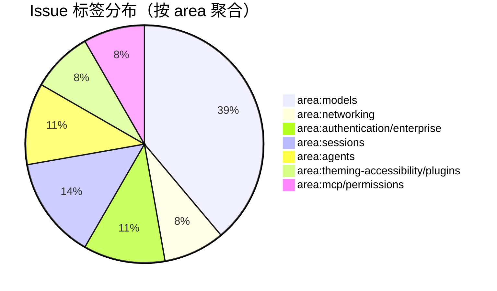
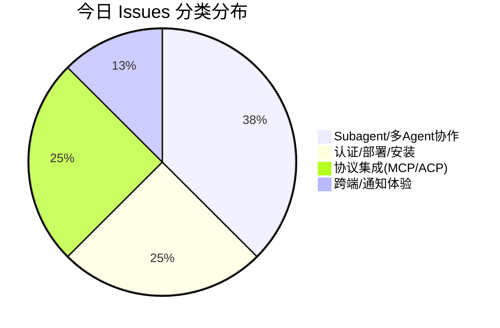

# AI CLI 工具社区动态日报 2026-04-20

> 生成时间: 2026-04-20 00:14 UTC | 覆盖工具: 8 个

- [Claude Code](https://github.com/anthropics/claude-code)
- [OpenAI Codex](https://github.com/openai/codex)
- [Gemini CLI](https://github.com/google-gemini/gemini-cli)
- [GitHub Copilot CLI](https://github.com/github/copilot-cli)
- [Kimi Code CLI](https://github.com/MoonshotAI/kimi-cli)
- [OpenCode](https://github.com/anomalyco/opencode)
- [Pi](https://github.com/badlogic/pi-mono)
- [Qwen Code](https://github.com/QwenLM/qwen-code)
- [Claude Code Skills](https://github.com/anthropics/skills)

---

## 横向对比

# AI CLI 工具生态横向对比分析报告 | 2026-04-20

---

## 1. 生态全景

当前 AI CLI 工具生态呈现**"功能收敛、体验分化"**态势：所有头部工具均已覆盖 Agent 自主执行、MCP 工具链、上下文压缩等基础能力，竞争焦点从"功能有无"转向**可靠性工程**（进程泄漏、会话状态一致性）和**企业级适配**（权限治理、计费透明、远程开发）。同时，**多 Agent 协作架构**成为下一代分水岭，各工具在子 Agent 调度、工作目录隔离、配置传递等细节上展开深度博弈。社区整体情绪偏向焦虑——对速率限制黑箱化、认证故障、版本漂移的信任损耗正在累积。

---

## 2. 各工具活跃度对比

| 工具 | Issues 更新 | PR 更新 | 版本发布 | 核心特征 |
|:---|:---:|:---:|:---|:---|
| **Claude Code** | 50 | 9 | ❌ | 热点高度集中（手机验证 711 评论），Cowork Windows 稳定性危机 |
| **OpenAI Codex** | 50 | 10 | ✅ 2 个 Alpha | Goal Mode 五部曲推进，TUI 可配置键位/Vim 模式上线 |
| **Gemini CLI** | 50 | 29 | ❌ | PR 吞吐量最高，Agent 架构优化（AST 感知、内存路由）密集 |
| **GitHub Copilot CLI** | 36 | 0 | ❌ | **零 PR 响应**，问题积压严重，基础设施危机特征明显 |
| **Kimi Code CLI** | ~8 | 4 | ❌ | Subagent 修复专项，IDE 插件认证突发故障 |
| **OpenCode** | 50 | 10 | ✅ v1.14.17/18 | 内存优化成最高优先级，版本号跳跃引发信任危机 |
| **Pi** | 37 | 15 | ❌ | Cloud Code Assist 兼容性密集修复，终端体验长期 Issue 集中关闭 |
| **Qwen Code** | ~15 | 10 | ✅ nightly | OAuth 401 大规模故障，认证体系紧急重构 |

> **注**：Issues/PR 数为 24h 内更新量，基于各日报披露数据。

---

## 3. 共同关注的功能方向

| 功能方向 | 涉及工具 | 具体诉求 |
|:---|:---|:---|
| **🔥 多 Agent/Subagent 架构** | Claude Code、Gemini CLI、Kimi CLI、OpenAI Codex | 工作目录继承（Kimi #1931）、MCP 配置传递（Kimi #1942）、MAX_TURNS 状态透明（Gemini #22323）、Goal Mode 持久化（Codex #18073-18077）、子 Agent 审批模式感知（Gemini #23582） |
| **🔥 计费与配额透明化** | Claude Code、OpenAI Codex、GitHub Copilot CLI、Qwen Code | 限额耗尽即锁死（Claude #50740）、失败扣费（Codex #18194）、速率限制黑箱（Copilot #2336/#2797）、免费层突降（Qwen #3203） |
| **🔥 进程/资源生命周期管理** | OpenAI Codex、Gemini CLI、Claude Code | MCP 僵尸进程 37GB 泄漏（Codex #12491/#17832）、临时脚本散落（Gemini #23571）、VM 进程崩溃（Claude #50168/#50935） |
| **🔥 远程/多环境开发** | OpenAI Codex、Gemini CLI、OpenCode | SSH/WSL 原生支持（Codex #10450, 573👍）、SSH 乱码（Gemini #24202）、主机名状态栏（Gemini #25663）、WSL 图片粘贴（OpenCode #19502） |
| **🧠 上下文压缩与状态一致性** | Claude Code、OpenAI Codex、Qwen Code、OpenCode | 压缩后 skill 参数残留（Claude #50947）、remote compact 断流（Codex #9544）、压缩命令失效（Qwen #3447）、长上下文 20min/轮（Claude #47731） |
| **🛡️ 安全与权限治理** | Gemini CLI、OpenCode、Claude Code | 权限重复弹窗（Gemini #24916）、沙箱逃逸漏洞（OpenCode #23423）、YOLO Mode 需求（OpenCode #11831）、破坏性操作阻止（Gemini #22672） |

---

## 4. 差异化定位分析

| 工具 | 功能侧重 | 目标用户 | 技术路线特征 |
|:---|:---|:---|:---|
| **Claude Code** | 企业级 Cowork 虚拟机、长上下文代码理解 | 企业开发团队、需要隔离执行环境 | **最重基础设施投入**：自研 VM 会话隔离，但跨平台稳定性承压；模型版本绑定紧密（Opus 4.6/4.7） |
| **OpenAI Codex** | 自主 Agent 执行（Goal Mode）、TUI 交互深度 | 专业开发者、追求工作流自动化 | **最强 Agent 自主性**：持久化目标-预算-续行闭环；Rust CLI 重写追求性能 |
| **Gemini CLI** | 多 Agent 智能调度、AST 精确代码理解 | 大规模代码库维护者、Google 生态用户 | **最激进架构探索**：AST 感知文件读取、内存路由分层、子 Agent 治理体系化 |
| **GitHub Copilot CLI** | 与 VS Code Copilot 生态打通、企业授权集成 | GitHub 付费订阅用户、企业现有 Copilot 客户 | **最依赖生态位优势**：但 CLI 与 IDE 模型列表不同步（#1703）、工程响应滞后暴露组织协同问题 |
| **Kimi Code CLI** | 快速迭代 Subagent 修复、IDE 插件联动 | 中国开发者、Moonshot API 用户 | **最聚焦多 Agent 补漏**：work_dir 覆盖、MCP 传递等单点修复密集，但系统性观测机制待建 |
| **OpenCode** | 多 Provider 兼容、本地模型优先、插件开放 | 隐私敏感用户、多模型切换需求者 | **最开放架构**：插件系统、自定义 Provider、YOLO Mode 等极客友好设计，但内存问题成瓶颈 |
| **Pi** | 终端原生体验、轻量快速、提供商无关 | 终端重度用户、追求极简工具链 | **最注重终端工程**：键位、重绘、tmux 焦点等细节打磨；Cloud Code Assist 兼容性快速响应 |
| **Qwen Code** | 阿里云生态集成、VSCode 扩展、中文场景 | 中国开发者、阿里云用户 | **最紧迫认证重构**：OAuth 危机倒逼 API Key 体系；ACP hooks 生态建设 |

---

## 5. 社区热度与成熟度

### 社区活跃度矩阵

```
高 Issues + 高 PR 响应  │  Gemini CLI (50/29)  OpenCode (50/10)
                        │  Pi (37/15)  OpenAI Codex (50/10)
                        │
高 Issues + 低 PR 响应  │  Claude Code (50/9, 但 711 评论单点)  
                        │  GitHub Copilot CLI (36/0) ⚠️ 危险信号
                        │
低 Issues + 高 PR 响应  │  [空位，理想健康态]
                        │
低 Issues + 低 PR 响应  │  Kimi CLI (~8/4)  Qwen Code (~15/10, 但紧急重构)
```

### 迭代阶段判断

| 阶段 | 工具 | 特征 |
|:---|:---|:---|
| **快速迭代期** | Gemini CLI、OpenCode、Pi | PR 吞吐量高，功能密集落地，社区反馈-修复闭环运转 |
| **架构重构期** | OpenAI Codex、Qwen Code | Goal Mode 全栈推进 / 认证体系紧急替换，方向明确但风险集中 |
| **稳定性危机期** | Claude Code、GitHub Copilot CLI | 核心功能（Cowork/HTTP-2）故障集中，PR 响应不足，信任损耗 |
| **追赶补漏期** | Kimi CLI | Subagent 单点修复密集，但系统性设计（观测、熔断）滞后 |

---

## 6. 值得关注的趋势信号

| 信号 | 证据 | 对开发者的参考价值 |
|:---|:---|:---|
| **🔴 "限额即死刑"模式引发反弹** | Claude #50740、Codex #18194、Copilot #2840、Qwen #3203 | **选型时需评估降级策略**：工具在配额耗尽时是 graceful degradation 还是完全锁死？这直接影响生产环境可用性 |
| **🟡 多 Agent 架构进入"深水区故障"** | Kimi Subagent 无限循环 #1927、Gemini 子 Agent 状态误导 #22323、Claude 上下文压缩污染 #50947 | **不要仅看 Demo 效果**：评估子 Agent 的观测、熔断、调试基础设施是否完善，否则自动化 = 自动化故障 |
| **🟡 认证体系从 OAuth 向 API Key "倒退"** | Qwen #3398 废弃 OAuth、Claude 手机验证阻塞 #34229 | **企业部署优先选择 API Key 方案**：OAuth 的免费层政策突变、服务端故障链路更不可控 |
| **🟢 TUI 可配置化成为标配** | Codex 键位映射 #18593/Vim 模式 #18595、Pi 自定义 thinking 层级 #3208 | **终端工具的个性化深度决定留存**：硬编码交互模式已无法满足专业开发者的工作流惯性 |
| **🟢 "数字足迹"治理需求浮现** | Gemini 临时脚本 #23571、Codex MCP 泄漏 #12491 | **AI 工具对代码库的污染需纳入 CI 审计**：临时文件、僵尸进程、残留配置可能成为安全/合规隐患 |
| **🔵 模型版本漂移成为新运维负担** | Claude Opus 4.6→4.7 性能回归 #47731、Copilot 模型列表不同步 #1703 | **锁定模型版本 + 建立回归测试**：模型自动升级可能带来不可预期的行为变化，需基础设施支撑版本管理 |

---

*报告基于 2026-04-20 各工具社区公开数据生成，仅供技术决策参考。*

---

## 各工具详细报告

<details>
<summary><strong>Claude Code</strong> — <a href="https://github.com/anthropics/claude-code">anthropics/claude-code</a></summary>

## Claude Code Skills 社区热点

> 数据来源: [anthropics/skills](https://github.com/anthropics/skills)

# Claude Code Skills 社区热点报告（截至 2026-04-20）

---

## 1. 热门 Skills 排行（按社区关注度）

| 排名 | Skill | 功能 | 状态 | 讨论热点 |
|:---|:---|:---|:---|:---|
| 1 | **[document-typography](https://github.com/anthropics/skills/pull/514)** | AI生成文档的排版质量控制：防止孤行、寡行、编号错位 | **Open** | 触及所有文档生成场景的通用痛点，作者强调"用户很少主动要求好排版，但问题无处不在" |
| 2 | **[skill-quality-analyzer](https://github.com/anthropics/skills/pull/83)** + [skill-security-analyzer](https://github.com/anthropics/skills/pull/83) | Skill 质量评估与安全审计的元技能 | **Open** | 首个系统性 Skill 质量框架，五维度评分（结构20%、安全性25%等），社区期待作为官方标准 |
| 3 | **[frontend-design](https://github.com/anthropics/skills/pull/210)** | 前端设计 Skill 的清晰度与可执行性改进 | **Open** | 聚焦"单轮对话内可执行"的指令设计，回应了 Skill 过于冗长、难以落地的普遍批评 |
| 4 | **[odt](https://github.com/anthropics/skills/pull/486)** | OpenDocument 创建、模板填充及 ODT→HTML 转换 | **Open** | 填补开源文档格式空白，与现有 docx/pdf skill 形成互补 |
| 5 | **[testing-patterns](https://github.com/anthropics/skills/pull/723)** | 全栈测试模式：测试哲学、单元测试、React组件测试、E2E | **Open** | 覆盖 Testing Trophy 模型，强调"什么不该测"，回应了测试过度/不足的平衡难题 |
| 6 | **[shodh-memory](https://github.com/anthropics/skills/pull/154)** | AI Agent 的持久化记忆系统，跨会话保持上下文 | **Open** | 解决 Claude Code 会话状态丢失的核心痛点，支持团队级知识共享 |
| 7 | **[record-knowledge](https://github.com/anthropics/skills/pull/521)** | 将 workaround 和发现记录为持久化 Markdown 知识库 | **Open** | 与 shodh-memory 形成互补，更轻量、聚焦"昨日发现今日复用" |
| 8 | **[sensory](https://github.com/anthropics/skills/pull/806)** | 原生 macOS 自动化（AppleScript/osascript），替代截图方案 | **Open** | 两层权限设计（Tier1 即开即用/Tier2 需辅助功能权限），解决 Computer Use 的精确性与性能问题 |

---

## 2. 社区需求趋势（从 Issues 提炼）

| 方向 | 代表 Issue | 核心诉求 |
|:---|:---|:---|
| **组织级 Skill 治理** | [#228](https://github.com/anthropics/skills/issues/228)（9评论, 5👍） | 企业内直接共享 Skill，而非 Slack 传文件+手动上传 |
| **Skill 质量标准化** | [#202](https://github.com/anthropics/skills/issues/202)（8评论, 1👍） | skill-creator 自身需重构：从"给人读的文档"变为"给 AI 执行的指令" |
| **安全与信任边界** | [#492](https://github.com/anthropics/skills/issues/492)（4评论, 2👍） | 社区 Skill 冒用 `anthropic/` 命名空间，需官方签名或隔离机制 |
| **评估与触发可靠性** | [#556](https://github.com/anthropics/skills/issues/556)（6评论, 6👍） | `run_eval.py` 0% 触发率暴露 Skill 识别机制的根本缺陷 |
| **MCP 协议互通** | [#16](https://github.com/anthropics/skills/issues/16)（4评论） | Skill 能力暴露为 MCP 工具，实现跨 AI 系统标准化调用 |
| **企业认证兼容** | [#532](https://github.com/anthropics/skills/issues/532)（2评论, 1👍） | 移除 `ANTHROPIC_API_KEY` 硬依赖，支持 SSO/企业许可证流程 |

---

## 3. 高潜力待合并 Skills（评论活跃 + 近期更新）

| Skill | PR | 潜力评估 | 关键进展 |
|:---|:---|:---|:---|
| **document-typography** | [#514](https://github.com/anthropics/skills/pull/514) | ⭐⭐⭐⭐⭐ | 3月创建后持续更新，解决通用文档痛点，作者响应积极 |
| **frontend-design 改进** | [#210](https://github.com/anthropics/skills/pull/210) | ⭐⭐⭐⭐⭐ | 3月7日最新更新，直接回应 #202 的批评，符合"最佳实践"方向 |
| **testing-patterns** | [#723](https://github.com/anthropics/skills/pull/723) | ⭐⭐⭐⭐⭐ | 3月底创建，测试是高频场景，且填补了现有 skill 空白 |
| **sensory (macOS 自动化)** | [#806](https://github.com/anthropics/skills/pull/806) | ⭐⭐⭐⭐☆ | 4月初更新，AppleScript 方案比截图 Computer Use 更精确高效，生态位独特 |
| **CONTRIBUTING.md / PR 模板** | [#509](https://github.com/anthropics/skills/pull/509) + [#512](https://github.com/anthropics/skills/pull/512) | ⭐⭐⭐⭐☆ | 社区健康度 25%→提升的关键基础设施，已被官方 issue 引用 |
| **DOCX 修复系列** | [#541](https://github.com/anthropics/skills/pull/541) + [#539](https://github.com/anthropics/skills/pull/539) + [#538](https://github.com/anthropics/skills/pull/538) | ⭐⭐⭐⭐☆ | 同一作者 Lubrsy706 的连续高质量修复，显示深度参与，易获合并 |

---

## 4. Skills 生态洞察

> **核心矛盾：社区在"Skill 数量扩张"与"质量/信任基础设施"之间剧烈拉扯——一方面疯狂提交新 Skill（文档、测试、记忆、自动化），另一方面基础工具（skill-creator、评估机制、命名空间治理、企业共享）严重滞后，导致 0% 触发率、命名空间冒充、SSO 不兼容等系统性风险集中暴露。**

**关键信号**：Issues 中基础设施类话题（#228 组织共享、#202 质量重构、#556 评估失效、#492 安全边界）的 👍/评论比显著高于功能请求，表明社区已从"想要更多 Skill"转向"需要可信、可用、可治理的 Skill 平台"。

---

# Claude Code 社区动态日报 | 2026-04-20

---

## 今日速览

今日社区无新版本发布，但 Issues 活跃度极高（50 条更新）。**Phone verification 问题持续发酵**（#34229，711 评论），成为历史级热点；同时 **Cowork 虚拟机功能在 Windows 平台遭遇集中爆发**（BIOS 虚拟化、RPC 错误、Session VM 崩溃），显示该功能在跨平台稳定性上仍存挑战。开发者对**令牌消耗透明度**和**长上下文性能衰减**的抱怨显著增加。

---

## 社区热点 Issues

| # | 状态 | 标题 | 核心要点 | 社区反应 |
|---|:---:|------|---------|---------|
| [#34229](https://github.com/anthropics/claude-code/issues/34229) | 🔴 OPEN | Phone verification | 手机号验证流程阻塞大量用户，影响注册/登录全流程 | **785 👍，711 评论** — 绝对顶流，用户持续施压要求官方回应 |
| [#36503](https://github.com/anthropics/claude-code/issues/36503) | 🔴 OPEN | `--channels` 插件可用性误导 | 提示"Channels 不可用"但实际轮询正常，入站消息却被静默忽略 | 32 👍，41 评论 — 插件生态关键 bug，影响自动化工作流可靠性 |
| [#43052](https://github.com/anthropics/claude-code/issues/43052) | 🔴 OPEN | Opus 4.6/4.7 "故意破坏代码"质疑 | 用户指控模型在代码生成中系统性 sabotage，消耗 token 却无实质产出 | 3 👍，36 评论 — 情绪性议题但反映**模型质量信任危机** |
| [#47731](https://github.com/anthropics/claude-code/issues/47731) | 🔴 OPEN | 长上下文会话严重延迟（20分钟/轮） | Opus 4.6 1M 上下文下，写 4 个 <2KB markdown 文件耗时 20 分钟 | 1 👍，8 评论 — **性能回归警报**，长上下文优势正在丧失 |
| [#30869](https://github.com/anthropics/claude-code/issues/30869) | 🔴 OPEN | Desktop 会话取消归档功能 | 归档会话无法恢复，工作历史永久丢失 | 41 👍，19 评论 — 高频需求，数据管理体验短板 |
| [#50947](https://github.com/anthropics/claude-code/issues/50947) | 🔴 OPEN | Skill 参数在压缩后残留为系统提示 | 上下文压缩后，旧 session 的 skill ARGUMENTS 被错误重放，导致模型执行过期指令 | 2 评论 — **架构级 bug**，影响状态机正确性，安全隐患 |
| [#50168](https://github.com/anthropics/claude-code/issues/50168) | 🔴 OPEN | Cowork 添加文件夹静默失败（Windows） | "Session VM process not available"，项目扩展功能瘫痪 | 4 评论 — Cowork Windows 稳定性连环 bug 之一 |
| [#50938](https://github.com/anthropics/claude-code/issues/50938) | 🔴 OPEN | Cowork "Virtualization is not available" | Windows 11 Home + AMD Ryzen 3700X，BIOS SVM 选项隐藏导致无法启用 | 2 评论 — **硬件兼容性文档缺失**，用户排查成本极高 |
| [#50740](https://github.com/anthropics/claude-code/issues/50740) | 🔴 OPEN | 达到 Design token 限制后完全不可用 | 限额耗尽后应用级封锁，非功能降级 | 1 👍，3 评论 — 计费策略激进，影响付费用户体验连续性 |
| [#50935](https://github.com/anthropics/claude-code/issues/50935) | 🔴 OPEN | RPC error: useradd 失败 | Cowork 容器内无法创建 `/sessions/` 目录，用户隔离机制崩溃 | 2 评论 — 多租户安全边界受损 |

---

## 重要 PR 进展

| # | 状态 | 标题 | 说明 |
|---|:---:|------|------|
| [#39043](https://github.com/anthropics/claude-code/pull/39043) | 🟢 OPEN | 移除 Frontend Design Skill 的 "retro-futuristic" 推荐 | 社区知名开发者 t3dotgg 提交，修正过时的设计品味引导 |
| [#50672](https://github.com/anthropics/claude-code/pull/50672) | 🟢 OPEN | 修复 CHANGELOG 2.1.111 技能名称笔误 | `less-permission-prompts` → `fewer-permission-prompts`，文档准确性 |
| [#50643](https://github.com/anthropics/claude-code/pull/50643) | 🟢 OPEN | Ethos Aegis 项目配置模板 | **疑似 spam** — 包含 GitHub issue 模板、CI 工作流等无关内容 |
| [#50638](https://github.com/anthropics/claude-code/pull/50638) | 🟢 OPEN | 修复 README 图片（EU SFJ） | 无实质描述，内容为空 |
| [#50637](https://github.com/anthropics/claude-code/pull/50637) | 🟢 OPEN | GoodshytGroup patch 1 | 无描述，疑似测试/误提交 |
| [#46095](https://github.com/anthropics/claude-code/pull/46095) | 🔴 CLOSED | Claude Mythos operating contract for Veriflow immune system | 已关闭，同作者重复提交 #47895 |
| [#47895](https://github.com/anthropics/claude-code/pull/47895) | 🟢 OPEN | Add Claude Mythos operating contract for Veriflow immune system | **非常规内容** — 疑似 AI 安全/对齐相关的虚构框架文档 |
| [#50595](https://github.com/anthropics/claude-code/pull/50595) | 🟢 OPEN | Copilot: 修复重复导入并恢复类 | 无描述，内容推断为代码清理 |
| [#50578](https://github.com/anthropics/claude-code/pull/50578) | 🟢 OPEN | Wrangler observability bootstrap | Cloudflare Wrangler 可观测性初始化，无详细说明 |

> **PR 质量警示**：今日 9 个 PR 中，4 个来自同一作者 `GoodshytGroup`，多数缺乏描述或疑似无关内容，维护者需关注 spam 风险。

---

## 功能需求趋势

基于 50 条 Issues 分析，社区当前聚焦五大方向：

```
🔥 计费与配额透明化  ████████████████████  高频爆发
   └─ Design/Usage token 限制逻辑、Gift Pro 降级、超额即锁死

🔥 Cowork 跨平台稳定   █████████████████░░░  Windows 重灾区  
   └─ 虚拟化检测、VM 进程管理、文件夹添加、容器用户隔离

🔥 长上下文性能优化    ███████████████░░░░░  4.6/4.7 回归
   └─ 20min+/轮、token 消耗异常、模型选择器失效

🔥 IDE/编辑器集成深化  ████████████░░░░░░░░  VSCode 上下文丢失
   └─ ide_selection/ide_opened_file、技能首次调用、主题定制

🔥 会话生命周期管理    ██████████░░░░░░░░░░  归档/恢复/压缩
   └─ 取消归档、压缩后状态残留、历史搜索
```

---

## 开发者关注点

| 痛点类别 | 具体表现 | 代表 Issue |
|---------|---------|-----------|
| **"限额即死刑"** | 达到 token 上限后应用完全不可用，而非 graceful degradation | #50740, #50838, #50943 |
| **Cowork Windows 三宗罪** | 虚拟化检测失败、VM 进程崩溃、用户目录创建失败 — 构成完整阻断链 | #50938, #50168, #50935, #50942 |
| **模型版本黑箱** | `/model` 切换 4.7 失败、`--model` flag 被忽略、thinking config 格式不兼容 | #49219, #22362 |
| **上下文压缩污染** | 压缩后旧 skill 参数幽灵重现，模型行为不可预测 | #50947 |
| **Channels 生态虚假繁荣** | 插件显示不可用却后台运行，入站消息被静默丢弃 — 调试地狱 | #36503 |
| **社区治理压力** | 711 评论的验证问题长期悬置，情绪性 issue (#43052) 获关注，信任损耗累积 | #34229, #43052 |

---

*日报基于 GitHub 公开数据生成，不代表 Anthropic 官方立场。*

</details>

<details>
<summary><strong>OpenAI Codex</strong> — <a href="https://github.com/openai/codex">openai/codex</a></summary>

# OpenAI Codex 社区动态日报 | 2026-04-20

## 今日速览

今日 Codex 社区迎来**Goal Mode（目标模式）**五部曲 PR 密集推进，标志着自主代理能力将迈入"持久化目标-预算控制-自动续行"的新阶段；同时 TUI 体验大幅升级，**可配置键位映射**与 **Vim 模式**进入主分支，开发者呼声最高的远程开发、进程泄漏等问题持续高热。

---

## 版本发布

**Rust CLI 连续发布两个 Alpha 版本**
- `rust-v0.122.0-alpha.12` / `rust-v0.122.0-alpha.11` — 版本号连续迭代，具体变更日志待官方补充
  - [Release 0.122.0-alpha.12](https://github.com/openai/codex/releases/tag/rust-v0.122.0-alpha.12)
  - [Release 0.122.0-alpha.11](https://github.com/openai/codex/releases/tag/rust-v0.122.0-alpha.11)

---

## 社区热点 Issues（10 个）

| # | 标题 | 状态 | 评论 | 👍 | 核心看点 |
|---|------|------|------|-----|---------|
| [#10450](https://github.com/openai/codex/issues/10450) | Remote Development in Codex Desktop App | 🔴 OPEN | 145 | 573 | **社区第一高票需求**。桌面版发布后，VS Code Remote-SSH 迁移用户集体呼吁原生远程开发支持，涉及 WSL、容器、SSH 多场景，OpenAI 尚未正式回应路线图 |
| [#14936](https://github.com/openai/codex/issues/14936) | bwrap: Approval prompt shown for almost every command | 🔴 OPEN | 49 | 20 | **沙箱回归缺陷**。Linux `bwrap` 沙箱几乎每条命令都弹审批，严重打断流式编码体验，标记为 regression 说明曾正常 |
| [#8648](https://github.com/openai/codex/issues/8648) | Codex replies to earlier messages instead of latest one | 🔴 OPEN | 45 | 37 | **上下文定位 Bug**。多轮对话中模型"时空错乱"回复历史消息，影响 Agent 可靠性，Pro 用户高频复现 |
| [#16088](https://github.com/openai/codex/issues/16088) | Starting thread in project without .codex leaves empty .codex file | 🔴 OPEN | 21 | 58 | **WSL/Windows 污染问题**。空配置文件残留，反映桌面版跨平台路径处理粗糙 |
| [#12491](https://github.com/openai/codex/issues/12491) | MCP child processes not reaped — 1300+ zombies, 37GB leak | 🔴 OPEN | 13 | 3 | **严重资源泄漏**。Codex.app GUI 模式下 MCP 子进程成僵尸，生产环境风险极高，社区急需修复 |
| [#17832](https://github.com/openai/codex/issues/17832) | Playwright MCP stdio processes still leak after #16895 fix | 🔴 OPEN | 7 | 0 | **泄漏回归**。声称修复后仍现 213 对孤儿进程/13.6GB RSS，测试基础设施类 MCP 成重灾区 |
| [#16335](https://github.com/openai/codex/issues/16335) | TUI/CLI performance regression from 116 to 117 | 🔴 OPEN | 12 | 7 | **性能倒退**。Windows Terminal 下渲染卡顿，版本升级反降速 |
| [#11635](https://github.com/openai/codex/issues/11635) | Stale capacity banner while model continues responding | 🔴 OPEN | 14 | 6 | **状态同步 Bug**。模型实际响应中却显示"容量已满"，Business 用户付费体验受损 |
| [#18194](https://github.com/openai/codex/issues/18194) | review error eats up 5hr limit | 🔴 OPEN | 6 | 0 | **计费陷阱**。代码审查失败仍扣减 5 小时额度，Plus 用户直接经济损失 |
| [#18546](https://github.com/openai/codex/issues/18546) | Ability to disable automatic app updates | 🔴 OPEN | 3 | 0 | **企业管控需求**。自动更新无法关闭，与 IT 合规冲突，今日新提已获关注 |

---

## 重要 PR 进展（10 个）

| # | 标题 | 状态 | 功能/修复内容 |
|---|------|------|--------------|
| [#18073-18077](https://github.com/openai/codex/pull/18073) | **Goal Mode 五部曲** (1-5/5) | 🟡 OPEN | **本日最大功能栈**：持久化目标状态 → App-Server API → 模型工具 → 核心运行时（自动续行/预算控制/中断恢复）→ TUI UX（`/goal` 命令/状态栏）。实现 Agent 自主执行复杂任务时的目标追踪与资源管控 |
| [#18593](https://github.com/openai/codex/pull/18593) | feat(tui): add configurable keymap support | 🟡 OPEN | **TUI 可配置键位**。将硬编码快捷键集中为可配置文件 `[tui.keymap]`，解决跨平台/终端适配痛点 |
| [#18595](https://github.com/openai/codex/pull/18595) | feat(tui): add vim composer mode | 🟡 OPEN | **Vim 模式上线**。基于键位配置栈，支持 Normal/Operator 模式、`/vim` 命令、预设快照防漂移 |
| [#18594](https://github.com/openai/codex/pull/18594) | feat(tui): add keymap slash command | 🟡 OPEN | 交互式键位配置引导，无需手动记忆 action/context 名称 |
| [#18597](https://github.com/openai/codex/pull/18597) | Update realtime handoff transcript handling | 🟡 OPEN | **Realtime 模型与 Codex Agent 深度集成**。交接时共享完整对话增量 transcript，减少上下文丢失 |
| [#18393](https://github.com/openai/codex/pull/18393) | feat(auto-review) Handle request_permissions calls | 🟡 OPEN | 自动审查模式支持权限请求工具，为无人值守代码审查铺路 |
| [#18599](https://github.com/openai/codex/pull/18599) | fix(guardian) disable skills message in guardian thread | 🟡 OPEN | Guardian（审查者）线程去除 skills 注入，避免角色混淆 |
| [#17980](https://github.com/openai/codex/pull/17980) | [codex] Use AgentAssertion downstream | 🟡 OPEN | Agent 身份断言下游接入，为多 Agent 协作身份验证奠基 |
| [#18445](https://github.com/openai/codex/pull/18445) | Disable skills in guardian review sessions | 🔴 CLOSED | Guardian 会话强制禁用 skills，已合并（被 #18599 等替代演进） |
| [#18493](https://github.com/openai/codex/pull/18493) | Filter Windows sandbox roots from SSH config dependencies | 🔴 CLOSED | Windows 沙箱 ACL 收紧：从 SSH 配置发现的 profile 根目录不再过度授权 |

---

## 功能需求趋势

基于 50 条活跃 Issue 提炼的社区焦点方向：

| 方向 | 热度 | 代表性诉求 |
|------|------|-----------|
| **远程/云端开发** | 🔥🔥🔥 | SSH/WSL/容器原生支持、worktree 路径自定义 (#10450, #10599) |
| **进程生命周期管理** | 🔥🔥🔥 | MCP 僵尸进程、Playwright 泄漏、沙箱审批泛滥 (#12491, #17832, #14936) |
| **TUI/交互体验** | 🔥🔥🔥 | Vim 模式、键位自定义、undo/redo、队列命令 (#2379, #14588, #14286, #14081) |
| **上下文与记忆可靠性** | 🔥🔥 | 回复错位、remote compact 断流、容量状态同步 (#8648, #9544, #11635) |
| **计费与额度透明** | 🔥🔥 | 失败扣费、额度升级策略 (#18194, #17950) |
| **多 Agent/分层协作** | 🔥 | 层级多 Agent 系统、子 Agent 管控 (#18557, #17980) |

---

## 开发者关注点

### 🔴 高频痛点

1. **"泄漏三连"——MCP 进程管理危机**
   - Playwright/通用 MCP 在 GUI 与 CLI 双模式下均存在 stdio 进程泄漏，已出现 37GB 内存、1300+ 僵尸进程的极端案例。社区质疑 #16895 等修复的有效性，需系统性重构进程收割机制。

2. **沙箱体验断裂**
   - Linux `bwrap` 审批泛滥（#14936）与 Windows PowerShell 语言模式冲突（#7777）并存，安全策略与流畅性平衡失当。

3. **上下文基础设施脆弱**
   - "Remote compact" 任务频繁断流（#9544, #14063）、多轮对话历史错位（#8648），长会话可靠性存疑。

### 🟡 迫切期待

| 需求 | 场景 | 当前状态 |
|------|------|---------|
| 远程开发原生支持 | 服务器/容器/SSH 编码 | 高票未回应（#10450, 573👍） |
| 自动更新可控 | 企业合规、版本锁定 | 今日新提（#18546） |
| 命令队列化 | `/compact`, `/review`, `/fast` 后台排队 | 部分已关闭，社区持续呼吁 |
| 用量/计费透明 | 失败不扣费、实时余额 | 零星反馈，未形成集中议题 |

### 🟢 积极信号

- **Goal Mode** 全栈推进显示 OpenAI 正系统性投资 Agent 自主性
- **TUI 可配置化**（键位/Vim）回应了开发者工具链个性化诉求
- **Guardian/Auto-review** 角色分离技能注入，安全审查机制专业化

---

*日报基于 GitHub 公开数据生成，部分 PR 评论数显示为 undefined 系 API 未返回，不影响内容分析。*

</details>

<details>
<summary><strong>Gemini CLI</strong> — <a href="https://github.com/google-gemini/gemini-cli">google-gemini/gemini-cli</a></summary>

# Gemini CLI 社区动态日报 | 2026-04-20

## 今日速览

今日社区活跃度较高，**29 个 PR 和 50 个 Issues 在 24 小时内更新**，但无新版本发布。核心看点集中在：**Agent 架构深度优化**（AST 感知、内存路由、子 Agent 治理）、**开发者体验打磨**（SSH 场景、权限管理、状态栏增强），以及**安全与稳定性修复**（API 密钥验证、命令执行注入防护）。

---

## 社区热点 Issues

| # | Issue | 核心看点 | 社区反应 |
|---|-------|---------|---------|
| [#22745](https://github.com/google-gemini/gemini-cli/issues/22745) | **AST 感知文件读取与代码库映射** | 探索用 AST 工具精确读取方法边界，减少 token 浪费和误读。这是提升大代码库处理效率的关键基础设施，可能重塑 Agent 的代码理解方式。 | 🔒 内部 EPIC，5 条评论，gundermanc 主导 |
| [#24916](https://github.com/google-gemini/gemini-cli/issues/24916) | **权限重复弹窗 Bug** | "允许所有未来会话"选项间歇性失效，严重影响工作流连续性。安全与体验的平衡点是 CLI 工具的核心竞争力。 | 3 条评论，用户 nikhilkapoor0919 多次反馈 |
| [#25166](https://github.com/google-gemini/gemini-cli/issues/25166) | **Shell 命令执行假死** | 简单命令完成后仍显示"等待输入"，阻塞后续操作。这是终端工具的基础可靠性问题。 | 2 条评论，2 个 👍，用户 rnett 详细复现 |
| [#22323](https://github.com/google-gemini/gemini-cli/issues/22323) | **子 Agent MAX_TURNS 中断被掩盖为成功** | `codebase_investigator` 超限后仍报 `GOAL success`，导致用户误判分析完成。分布式 Agent 的状态透明性缺陷。 | P1 优先级，2 个 👍，matei-anghel 深度报告 |
| [#22819](https://github.com/google-gemini/gemini-cli/issues/22819) | **内存路由：全局 vs 项目级** | 定义用户偏好（全局 `~/.gemini/`）与代码库特定记忆（`.gemini/`）的分层存储策略。长期个性化体验的核心设计。 | 2 个 👍，SandyTao520 推动，与 #22809 联动 |
| [#23571](https://github.com/google-gemini/gemini-cli/issues/23571) | **临时脚本散落问题** | 受限 Shell 执行时模型在各目录生成编辑脚本，清理成本高。反映 Agent 工具链的"数字足迹"治理需求。 | galz10 反馈，与 #22672 破坏性操作议题呼应 |
| [#23582](https://github.com/google-gemini/gemini-cli/issues/23582) | **子 Agent 审批模式感知缺失** | 子 Agent 指令与 Policy Engine 的审批模式冲突，导致"知道不该做但系统提示让做"的认知失调。 | jerop 提出，1 个 👍，多 Agent 协调架构的关键缺口 |
| [#25216](https://github.com/google-gemini/gemini-cli/issues/25216) | **Windows 临时路径 A:\ 崩溃** | `realpath('A:\a')` 抛出 `EISDIR`，特定于 Windows 驱动器根目录的边缘 case。 | Florin-Di 报告，路径处理鲁棒性 |
| [#24202](https://github.com/google-gemini/gemini-cli/issues/24202) | **SSH 会话文本乱码** | Windows → gLinux SSH 后 Gemini CLI 不可用，远程开发场景的基础体验问题。 | nikhilkapoor0919 汇总用户反馈，与 #24546 SSH 检测 helper 关联 |
| [#22672](https://github.com/google-gemini/gemini-cli/issues/22672) | **Agent 应阻止破坏性操作** | `git reset --force` 等危险命令的主动劝阻机制。AI 工具的安全边界设计哲学。 | 1 个 👍，abhipatel12 提出，与 #23571 临时脚本问题形成"安全-清理"主题 |

---

## 重要 PR 进展

| # | PR | 类型 | 功能/修复内容 |
|---|-----|------|-------------|
| [#25670](https://github.com/google-gemini/gemini-cli/pull/25670) | **移除 Agent 刷新时的重复初始化** | 🐛 Fix | 修复 `/agents reload` 时 `loadAgents()` 被调用两次的性能问题，消除不必要的重复加载 |
| [#25666](https://github.com/google-gemini/gemini-cli/pull/25666) | **Gemma 4 模型支持** | ✨ Feat | 新增 Gemma 4 模型集成（akh64bit 提交，标题暗示 Apr19 时间线） |
| [#25663](https://github.com/google-gemini/gemini-cli/pull/25663) | **状态栏显示主机名** | ✨ Feat | 底部状态栏新增 `hostname`，解决多 SSH/容器/VM 会话的身份混淆问题 |
| [#25662](https://github.com/google-gemini/gemini-cli/pull/25662) | **静默跳过目录型 GEMINI.md** | 🐛 Fix | 目录名为 `GEMINI.md` 时不再抛出 `EISDIR` 警告，减少项目结构兼容噪音 |
| [#25660](https://github.com/google-gemini/gemini-cli/pull/25660) | **`delete` 作为 `uninstall` 别名** | ✨ Feat | `/extensions delete` 等价于 `uninstall`，符合用户直觉，修复 #21328 |
| [#25657](https://github.com/google-gemini/gemini-cli/pull/25657) | **`/restart` 斜杠命令** | ✨ Feat | 优雅重启进程并**自动恢复当前会话**，解决自动更新后"请手动重启"的断裂体验，关闭 #16124 |
| [#25654](https://github.com/google-gemini/gemini-cli/pull/25654) | **扩展更新回滚保护** | 🐛 Fix | 扩展更新失败时保留旧版本用于回滚，暴露真实错误，修复 #21560 |
| [#25163](https://github.com/google-gemini/gemini-cli/pull/25163) | **IDE 信任不匹配死循环修复** | 🐛 Fix | 首次打开工作区时 IDE 与 CLI 信任状态不一致导致的无限重启，P1 优先级 |
| [#25653](https://github.com/google-gemini/gemini-cli/pull/25653) | **构建时复制扩展示例模板** | 🐛 Fix | `gemini extensions new` 失败因缺失示例文件，修复构建流程 |
| [#25649](https://github.com/google-gemini/gemini-cli/pull/25649) | **开发模式剥离 CI_* 环境变量** | 🐛 Fix | `npm run start` 时 `CI_TOKEN` 等变量导致 `ink` 切换非交互模式而挂起 |

> **已关闭 PR 备注**：#25453（API 密钥验证逻辑修正）、#25468（FileHandle 重复关闭）、#25485（钥匙串测试凭证清理）均为 martin-hsu-test 提交的安全/稳定性修复，因缺少关联 Issue 被标记 `status/need-issue` 后关闭，值得后续追踪是否被独立合并。

---

## 功能需求趋势

基于 50 个活跃 Issue 的标签与内容分析，社区关注呈现 **四大聚类**：

| 方向 | 代表 Issue | 趋势解读 |
|------|-----------|---------|
| **🧠 Agent 架构智能化** | #22745 AST 感知、#22819 内存路由、#22323 子 Agent 状态、#23582 审批模式感知 | 从"能运行"到"聪明地运行"，核心是解决多 Agent 协作的认知一致性与长期记忆 |
| **🖥️ 远程/多环境开发** | #24202 SSH 乱码、#24546 SSH 检测、#25663 主机名状态栏、#25216 Windows 路径 | 云开发、容器化、SSH 远程成为主流场景，终端工具的跨环境适配是差异化关键 |
| **🛡️ 安全与可控性** | #24916 权限重复、#22672 破坏性操作阻止、#23571 临时脚本清理、#24760 execFileSync 替换 | 企业采纳的前提：AI 操作的**可审计、可回滚、最小权限** |
| **♿ 无障碍与输出质量** | #25218 屏幕阅读器表格渲染、#24470 长聊天滚动闪烁、#24943 并行工具调用布局 | 专业开发者工具的**可访问性**和**信息密度优化**进入深水区 |

---

## 开发者关注点

### 🔴 高频痛点

1. **权限系统的"记忆失效"**（#24916）  
   "允许所有未来会话"是最常用的选项，但间歇性重置导致频繁打断。开发者期望**持久化 + 可审计的权限图谱**，而非简单的二进制允许/拒绝。

2. **Agent 的"沉默失败"与状态误导**（#22323, #25166）  
   子 Agent 超限报成功、Shell 假死等**状态与实际不符**的问题，比直接报错更难调试。需要更精细的执行追踪（#24037 Tracker 更新机制正在推进）。

3. **Windows 边缘 case 的系统性遗漏**（#25216, #24202, #24973）  
   路径处理（`A:\`）、SSH 终端模拟、权限 mock 的 Windows 适配，反映开发团队的主力环境偏向 *nix，社区需要更主动的跨平台 CI 覆盖。

### 🟡 隐性需求

- **"数字足迹"治理**：临时脚本（#23571）、内存文件散落、扩展更新残留，开发者开始关注 AI 工具对代码库的**污染控制**
- **模型版本漂移**：#23823 内部工具升级 3.1 flash lite，暗示社区将很快需要**模型版本管理与降级能力**

---

*日报基于 google-gemini/gemini-cli 公开 GitHub 数据生成，仅供技术社区参考。*

</details>

<details>
<summary><strong>GitHub Copilot CLI</strong> — <a href="https://github.com/github/copilot-cli">github/copilot-cli</a></summary>

# GitHub Copilot CLI 社区动态日报 | 2026-04-20

## 今日速览

过去24小时 Copilot CLI 社区无新版本发布，但 **36 条活跃 Issue** 反映出用户对**模型可见性不一致、速率限制策略混乱、HTTP/2 连接稳定性**三大核心问题的持续焦虑。值得关注的是，今日新增 4 条 Issue 聚焦 ACP 模式、会话管理和代理调度等进阶场景，显示社区正从基础功能可用性向企业级稳定性诉求演进。

---

## 社区热点 Issues

| # | Issue | 重要性 | 社区反应 |
|---|-------|--------|---------|
| **[#1703](https://github.com/github/copilot-cli/issues/1703)** | **组织启用模型在 CLI 中不可见（如 Gemini 3.1 Pro）** | 🔴 **核心差异** — CLI 与 VS Code Copilot 模型列表不一致，暴露多客户端配置同步缺陷 | 23 评论 / 34 👍，企业用户集中投诉，2 个月未解决 |
| **[#2725](https://github.com/github/copilot-cli/issues/2725)** | **GPT-5.4 模型选择器隐藏 "Extra High" 档位** | 🔴 **UI/功能不一致** — `/model` 显示 3 档但实际支持 4 档，用户无法访问完整能力 | 22 评论 / 18 👍，被质疑为故意功能降级 |
| **[#2421](https://github.com/github/copilot-cli/issues/2421)** | **HTTP/2 GOAWAY 竞态条件导致级联重试失败** | 🔴 **资源浪费** — 合并 5 个关联 Issue，连接池状态损坏导致静默消耗高级请求配额 | 6 评论 / 16 👍，技术深度高，企业级场景致命 |
| **[#2760](https://github.com/github/copilot-cli/issues/2760)** | **429 响应缺乏合理退避重试逻辑** | 🟡 **稳定性** — 每分钟 20+ 次暴力重试加剧限流，与 #2421 形成"攻击自身"的恶性循环 | 6 评论 / 2 👍，需与网络层整体重构 |
| **[#2336](https://github.com/github/copilot-cli/issues/2336)** | **速率限制错误信息模糊** | 🟡 **可观测性** — "特定时间段"未指明具体阈值，用户无法规划使用策略 | 17 评论 / 6 👍，长期反馈未改善 |
| **[#1897](https://github.com/github/copilot-cli/issues/1897)** | **企业授权策略间歇性失效** | 🟡 **认证可靠性** — Pro 订阅用户被误判为无企业权限，与 #2306 构成模式化故障 | 12 评论 / 1 👍，1 周周期复现 |
| **[#2078](https://github.com/github/copilot-cli/issues/2078)** | **请求增加 `/btw` 命令** | 🟢 **功能对齐** — 其他 CLI 工具已普及的快捷指令，降低认知摩擦 | 6 评论 / 26 👍，高票需求，实现成本低 |
| **[#2840](https://github.com/github/copilot-cli/issues/2840)** | **速率限制中断子代理执行** | 🟡 **代理架构缺陷** — Auto 模型下子代理限流后强制主代理接盘，破坏任务分解设计 | 2 评论 / 1 👍，今日新增，架构层面问题 |
| **[#2827](https://github.com/github/copilot-cli/issues/2827)** | **统一速率限制使用状态 UI** | 🟢 **体验优化** — 当前仅 75%/90% 预警 + 阻断时提示，缺乏实时仪表盘 | 2 评论 / 5 👍，与 #2839 显示不一致问题呼应 |
| **[#2833](https://github.com/github/copilot-cli/issues/2833)** | **autopilot+fleet 模式计划审批与调度时序错乱** | 🟡 **企业工作流** — "Queued" 与 "Analyzing" 状态竞争，计划未就绪即触发执行 | 0 评论 / 0 👍，今日新增，复杂编排场景 |

---

## 重要 PR 进展

**过去24小时无更新的 Pull Requests。**

> 注：PR 列表为空，结合 36 条活跃 Issue 无对应修复进展，反映当前社区处于**"问题积压、工程响应滞后"**状态。

---

## 功能需求趋势

基于 36 条 Issues 的聚类分析：



| 趋势方向 | 占比 | 核心诉求 |
|---------|------|---------|
| **模型治理与可见性** | ~39% | 统一跨客户端模型列表、准确显示 effort 档位、消除 Pro/Pro+/Enterprise 层级差异 |
| **速率限制体系重构** | ~28% | 实时用量查询、精确重置时间、分级退避策略、子代理配额隔离 |
| **连接层可靠性** | ~11% | HTTP/2 连接池修复、429 智能重试、GOAWAY 优雅处理 |
| **企业认证稳定性** | ~11% | 组织策略缓存同步、Pro 与企业权限边界澄清 |
| **会话与代理架构** | ~11% | 持久化状态管理、自定义代理事件、行为姿态（posture）分层 |

---

## 开发者关注点

### 🔴 高频痛点（P0-P1）

| 痛点 | 表现 | 影响面 |
|-----|------|--------|
| **"模型列表薛定谔态"** | 同一账户 VS Code 可见 Gemini 3.1 Pro，CLI 不可见 | 多工具链用户被迫切换上下文 |
| **速率限制黑箱化** | 负百分比、随机数值、无统一数据源（#2797, #2839） | 付费用户信任崩塌，Pro+ 权益感知贬值 |
| **连接故障静默计费** | HTTP/2 竞态导致请求未成功但配额扣除（#2421） | 直接经济损失，企业审计合规风险 |

### 🟡 架构债务（P2）

- **ACP 模式语义不一致**：`session/set_model` 拒绝 "auto" 但错误提示推荐切换至 auto（[#2843](https://github.com/github/copilot-cli/issues/2843)，已关闭但模式化问题存疑）
- **会话状态泄漏**：异常初始化残留 `~/.copilot/session-state` 孤儿目录（[#2836](https://github.com/github/copilot-cli/issues/2836)）
- **移动端 slash 命令穿透**：Android v1.255.0-beta 未本地拦截 `/usage`（[#2842](https://github.com/github/copilot-cli/issues/2842)）

### 🟢 生态扩展诉求

- **主题系统开放**：超越 auto/dark/light 的自定义调色板（[#2830](https://github.com/github/copilot-cli/issues/2830)）
- **技能/提示/代理路径配置**：CLI 级 `--skills-path` 等参数（[#2829](https://github.com/github/copilot-cli/issues/2829)）
- **实验性功能显式治理**：`PERSISTED_PERMISSIONS` 等 flag 的文档化与持久化控制（[#2820](https://github.com/github/copilot-cli/issues/2820)）

---

> **分析师备注**：今日数据呈现明显的"**基础设施危机**"特征——核心网络层（#2421, #2760）与计费信任层（#2336, #2797, #2839, #2840）问题交织，而功能扩展类 Issue（如 #2078 `/btw`）虽获高票却缺乏工程资源投入。建议关注团队是否在 1.0.33 版本中集中解决 HTTP/2 与速率限制相关的系统性问题。

</details>

<details>
<summary><strong>Kimi Code CLI</strong> — <a href="https://github.com/MoonshotAI/kimi-cli">MoonshotAI/kimi-cli</a></summary>

# Kimi Code CLI 社区动态日报 | 2026-04-20

## 今日速览

今日社区聚焦 **Subagent 工作目录继承与 MCP 配置传递** 两大核心问题，4 个活跃 PR 中有 2 个直接修复多 Agent 协作场景的关键缺陷。同时 VS Code/Cursor 插件的认证故障成为新的用户痛点，引发紧急反馈。

---

## 社区热点 Issues

| # | 标题 | 状态 | 核心问题 | 社区影响 |
|---|------|------|---------|---------|
| [#1939](https://github.com/MoonshotAI/kimi-cli/issues/1939) | kimicode 的 ACP 协议问题 | 🔴 OPEN | ACP 调用时 `command` 字段未按 `command + args` 格式拆分，导致外部工具集成失败 | 直接影响 MCP/ACP 生态互操作性，feng-jin 连续反馈协议层缺陷 |
| [#1931](https://github.com/MoonshotAI/kimi-cli/issues/1931) | Subagent 不继承父 Agent 工作目录 | 🔴 OPEN | `Shell` cd 后派生 Subagent，子 Agent 仍停留在根目录，破坏 git worktree 工作流 | 被 #1933 部分修复，但 #1936 指出 Shell 工具仍使用 `session.work_dir` 而非覆盖值 |
| [#1927](https://github.com/MoonshotAI/kimi-cli/issues/1927) | Subagent 无限循环 | 🔴 OPEN | 子 Agent 反复读取同一文件上百次，任务无法终止 | 严重影响自动化任务可靠性，与 #1931 同属 Subagent 架构缺陷 |
| [#1940](https://github.com/MoonshotAI/kimi-cli/issues/1940) | VS Code/Cursor 认证失败 | 🔴 OPEN | IDE 插件（v0.5.3）出现 `Count auth failure`，无法正常使用 | **今日新增**，影响主流 IDE 用户群体，紧急程度高 |
| [#1903](https://github.com/MoonshotAI/kimi-cli/issues/1903) | Error code: 400 | 🔴 OPEN | v1.34.0 调用 `kimi-for-coding` 模型返回 400 错误 | 6 条评论持续跟踪，疑似模型/参数兼容性问题，跨版本未解决 |
| [#1936](https://github.com/MoonshotAI/kimi-cli/issues/1936) | 完善 Subagent work_dir 覆盖 | 🔴 OPEN | #1933 的后续：Shell 工具 CWD 和 AGENTS.md 上下文未正确应用覆盖目录 | 代码审查中主动拆分的 deferred 任务，显示工程严谨性 |
| [#1873](https://github.com/MoonshotAI/kimi-cli/issues/1873) | 无管理员权限安装支持 | 🔴 OPEN | Windows 企业版后续版本强制要求管理员权限 | 企业环境部署阻塞，Greenplumwine 反馈后无官方回应 |
| [#1938](https://github.com/MoonshotAI/kimi-cli/issues/1938) | Kimi-CLI-Web 增加推送通知 | 🔴 OPEN | Web 端完成任务无通知，无法及时在移动端接续工作 | 跨端协作体验缺口，用户明确给出 macOS+Safari 使用场景 |

---

## 重要 PR 进展

| # | 标题 | 作者 | 功能/修复内容 | 状态 |
|---|------|------|------------|------|
| [#1942](https://github.com/MoonshotAI/kimi-cli/pull/1942) | fix(mcp): 向 Subagent 传递 MCP 配置并立即恢复 | msenol | **关键修复**：① `SubagentBuilder` 硬编码 `mcp_configs=[]` 导致子 Agent 无法使用 MCP 工具；② 恢复会话时 MCP 配置未重新加载。双问题一次性解决 | 🆕 今日新建 |
| [#1933](https://github.com/MoonshotAI/kimi-cli/pull/1933) | feat(subagents): Subagent 派生支持 work_dir 覆盖 | zhuxixi | Agent 工具新增 `work_dir` 可选参数，修复 #1931 的根目录锁定问题 | 已合并基础实现，#1936 跟进完善 |
| [#1935](https://github.com/MoonshotAI/kimi-cli/pull/1935) | feat(hooks): 支持 updatedInput 透明命令重写 | zoorpha | PreToolUse hook 生命周期新增 `hookSpecificOutput.updatedInput`，允许 hook 静默修改工具输入参数（34 行精简实现） | 对齐现有 Hooks Beta 文档，扩展插件能力 |
| [#1549](https://github.com/MoonshotAI/kimi-cli/pull/1549) | feat(plugin): 可配置的压缩 Provider | CanerKocak | 新增 `loop_control.compaction_model` 等配置，支持上下文压缩使用独立模型，避免占用主聊天模型资源 | 长期活跃，配置精细化趋势 |

---

## 功能需求趋势



| 方向 | 热度 | 具体表现 |
|------|------|---------|
| **Subagent 架构健壮性** | 🔥🔥🔥 | 工作目录继承、无限循环、MCP 配置传递形成问题簇，多 Agent 协作进入深水区 |
| **IDE 生态集成** | 🔥🔥🔥 | VS Code/Cursor 插件认证故障突发，企业级部署权限问题长期悬置 |
| **开放协议兼容** | 🔥🔥 | ACP 协议格式、MCP 工具链双向适配，外部生态对接需求迫切 |
| **跨端工作流** | 🔥 | Web-CLI-移动端通知闭环，用户期望"随时接续"的异步协作体验 |

---

## 开发者关注点

### 🔴 高频痛点

| 痛点 | 代表 Issue | 深层诉求 |
|------|----------|---------|
| **Subagent "失控"** | #1927 #1931 #1936 | 需要子 Agent 的观测、熔断、调试机制，而非仅修复单点目录问题 |
| **IDE 插件"黑盒化"** | #1940 | 插件版本与 CLI 核心版本脱节，错误诊断困难（用户甚至不清楚底层 CLI 版本） |
| **企业环境适配** | #1873 | 权限、代理、内网部署等"最后一公里"问题缺乏官方指南 |

### 🟡 架构演进信号

- **Hooks 系统扩展**：#1935 的 `updatedInput` 显示 Kimi CLI 正从"工具调用"向"命令中间件"模式演进，插件可介入执行流
- **压缩模型独立**：#1549 的 `compaction_model` 反映长上下文场景下成本控制与性能隔离的精细化需求

### 💡 待观察

- msenol（#1942）与 zhuxixi（#1933/#1936）形成 **Subagent 修复专项贡献者** 组合，关注其后续是否被纳入核心维护团队
- feng-jin 连续提交 ACP/Subagent 协议层问题（#1939 #1927），可能是深度集成用户或生态开发者

---

*数据来源：github.com/MoonshotAI/kimi-cli | 生成时间：2026-04-20*

</details>

<details>
<summary><strong>OpenCode</strong> — <a href="https://github.com/anomalyco/opencode">anomalyco/opencode</a></summary>

# OpenCode 社区动态日报 | 2026-04-20

---

## 1. 今日速览

OpenCode 今日密集发布 **v1.14.17/v1.14.18** 两个补丁版本，重点修复 ripgrep 后端回归与 Docker 构建权限问题；社区方面，**内存性能优化**成为最高热度议题（60 评论），同时 **1.4.x→1.14.x 版本号跳跃**引发用户对发布策略的广泛讨论。

---

## 2. 版本发布

### v1.14.18（最新）
| 项目 | 内容 |
|:---|:---|
| **核心修复** | 恢复原生 ripgrep 后端，解决文件搜索与文件列表的可靠性问题 |
| **社区贡献** | @ariane-emory 补充 `--dangerously-skip-permissions` CLI 标志文档 (#23371) |
| **链接** | [Release v1.14.18](https://github.com/anomalyco/opencode/releases/tag/v1.14.18) |

### v1.14.17
| 项目 | 内容 |
|:---|:---|
| **核心修复** | • 保留 Docker 构建前的可执行权限<br>• 修复插件过度重装问题<br>• Anthropic Bedrock Opus 4.7 默认使用 `display: summarized`<br>• 从文件内容检测附件类型（图片/PDF） |
| **链接** | [Release v1.14.17](https://github.com/anomalyco/opencode/releases/tag/v1.14.17) |

---

## 3. 社区热点 Issues

| # | 标题 | 状态 | 评论 | 👍 | 关键看点 |
|:---|:---|:---|:---:|:---:|:---|
| [#20695](https://github.com/anomalyco/opencode/issues/20695) | **Memory Megathread** — 内存问题集中追踪 | 🔴 OPEN | 60 | 36 | **社区最高优先级**。维护者明确拒绝 LLM 生成的方案，呼吁用户提交 heap snapshot，采用结构化排查流程 |
| [#8501](https://github.com/anomalyco/opencode/issues/8501) | 支持展开粘贴文本摘要（如 `[Pasted ~1 lines]`） | 🔴 OPEN | 17 | **141** | **最高投票需求**。用户希望编辑被折叠的粘贴内容，而非仅查看摘要 — 提示工程工作流的关键痛点 |
| [#5937](https://github.com/anomalyco/opencode/issues/5937) | 自定义 Provider 文档错误 | 🔴 OPEN | 23 | 13 | 文档与实际 CLI 行为脱节（`/connect` 后无自定义选项），新用户 onboarding 阻塞点 |
| [#7030](https://github.com/anomalyco/opencode/issues/7030) | Ollama + qwen2.5-coder 工具调用空执行 | 🔴 OPEN | 18 | 18 | 高复现率 bug：edit/write 工具显示执行但实际未写盘，严重影响本地模型可用性 |
| [#11532](https://github.com/anomalyco/opencode/issues/11532) | `/new` 后 AGENTS.md 未自动加载 | 🔴 OPEN | 16 | 10 | 会话管理语义模糊 — 用户预期 `/new` 保留项目上下文，实际行为不一致 |
| [#23419](https://github.com/anomalyco/opencode/issues/23419) | **1.4.x→1.14.x 版本号跳跃质疑** | 🔴 OPEN | 5 | 10 | 用户对频繁升级策略的集中反馈：*"几乎每几个版本就出现不可理解的 bug 或混乱决策"* |
| [#22630](https://github.com/anomalyco/opencode/issues/22630) | macOS 26.4 (Tahoe) 桌面版白屏 | 🔴 OPEN | 10 | 1 | 新版本系统兼容性风险，影响 macOS beta 用户 |
| [#22444](https://github.com/anomalyco/opencode/issues/22444) | Azure OpenAI 模型集体失效 | 🔴 OPEN | 10 | 4 | GPT-5.x-Codex 系列全部报错，企业用户关键阻塞 |
| [#11831](https://github.com/anomalyco/opencode/issues/11831) | **YOLO Mode** — 自动批准所有权限提示 | 🔴 OPEN | 3 | **20** | 高投票功能请求：保留 `deny` 规则前提下跳过 `ask` 确认，提升资深用户效率 |
| [#23423](https://github.com/anomalyco/opencode/issues/23423) | **[安全漏洞] 沙箱逃逸导致任意文件读取与未授权命令执行** | 🟢 CLOSED | 2 | 0 | 安全审计发现的关键漏洞，涉及权限隔离与提示处理缺陷，已快速关闭处理 |

---

## 4. 重要 PR 进展

| # | 标题 | 状态 | 类型 | 核心内容 |
|:---|:---|:---|:---|:---|
| [#22927](https://github.com/anomalyco/opencode/pull/22927) | 将 NVIDIA 加入主流 Provider 列表 | 🔵 OPEN | feat + docs | NVIDIA 已通过 models.dev 提供服务但 UX 未暴露，补齐 provider 发现、文档及归因头 |
| [#18767](https://github.com/anomalyco/opencode/pull/18767) | 移动端触摸优化 | 🔵 OPEN | feat | 针对手机/平板设备的触控适配，保留桌面体验 — 跨平台战略关键一步 |
| [#23456](https://github.com/anomalyco/opencode/pull/23456) | 全局配置与规则文件编辑器 | 🔵 OPEN | feat | 可视化编辑 `opencode.jsonc` 及全局规则文件，降低配置门槛（ closes #14614 ） |
| [#23447](https://github.com/anomalyco/opencode/pull/23447) | 终端原生通知（OSC 转义序列） | 🟢 CLOSED | feat | 替代 macOS `osascript`，解决通知显示为 "Script Editor" 且无点击聚焦的问题 |
| [#23188](https://github.com/anomalyco/opencode/pull/23188) | TUI 主题持久化与 KV 写入稳定性 | 🟢 CLOSED | fix | 修复主题模式探测、持久化逻辑及 `kv.json` 多进程竞争导致的损坏 |
| [#23451](https://github.com/anomalyco/opencode/pull/23451) | Fireworks AI 提示缓存会话亲和性 | 🔵 OPEN | fix | 添加 `x-session-affinity` 头，解决副本间缓存失效导致的性能损失 |
| [#23335](https://github.com/anomalyco/opencode/pull/23335) | 移除推理变体的模型 ID 黑名单 | 🔵 OPEN | fix | 取消 hardcoded 的 deepseek/glm 等排除逻辑，改用能力检测（ closes #23334 ） |
| [#12050](https://github.com/anomalyco/opencode/pull/12050) | 插件工具类型与内置工具对齐 | 🔵 OPEN | feat | 向插件暴露 `callID`/`extra` 等 `ToolContext` 字段，解决插件能力受限问题（ closes #8327 ） |
| [#17401](https://github.com/anomalyco/opencode/pull/17401) | Amazon Bedrock 工具结果支持 PDF | 🔵 OPEN | fix | `@ai-sdk/amazon-bedrock` 不支持非图片媒体，转换 PDF 为图片兼容格式（ closes #17400 ） |
| [#23441](https://github.com/anomalyco/opencode/pull/23441) | 澄清 Agent prompt 支持多文件引用 | 🔵 OPEN | docs | 文档仅展示单文件用法，实际支持多文件 — 补齐示例减少用户困惑（ closes #20356 ） |

---

## 5. 功能需求趋势

基于 50 条活跃 Issue 分析，社区关注聚焦五大方向：

| 趋势方向 | 代表 Issue | 热度指标 |
|:---|:---|:---:|
| **🔥 性能与稳定性** | #20695 内存优化、#9389 Plan 模式死循环、#18242 长上下文重试逻辑过时 | 评论 60+，系统性问题 |
| **🖥️ TUI/交互体验** | #8501 粘贴展开、#17457 小键盘 Enter、#19502 WSL 图片粘贴 | 投票 141+，高频使用痛点 |
| **🔒 权限与自动化** | #11831 YOLO Mode、#16367 `ask` 权限挂起、#23045 MCP 权限绕过 | 企业/资深用户效率诉求 |
| **🌐 模型生态扩展** | #22408 Kimi K2.6、#22444 Azure OpenAI、#7030 Ollama 本地模型 | 多厂商兼容压力 |
| **🏗️ 架构与集成** | #23449 集成终端 PTY、#15035 Agent Teams、#12805 健康检查认证 | 平台化能力缺口 |

---

## 6. 开发者关注点

### 高频痛点

| 类别 | 具体问题 | 影响面 |
|:---|:---|:---|
| **版本发布策略信任危机** | #23419 质疑 1.4→1.14 跳跃，"每版本都有不可理解的 bug" | 社区对快速迭代模式的耐受度达临界点 |
| **本地模型可靠性** | #7030 Ollama 工具调用空执行、#15774 LM Studio 流式截断 | 离线/隐私优先用户的实际可用性 |
| **企业部署阻塞** | #22444 Azure OpenAI 失效、#12805 健康检查需认证、#18242 Anthropic 过时限制 | B 端采用的关键门槛 |
| **会话状态一致性** | #11532 `/new` 后 AGENTS.md 丢失、#23211 1.4.7+ 配置全丢 | 数据丢失风险引发用户焦虑 |
| **安全与沙箱** | #23423 沙箱逃逸漏洞、#23045 MCP 权限过滤失效 | 自动化场景下的信任基础 |

### 维护者信号

- **明确拒绝 LLM 辅助调试**：#20695 中维护者强调 "PLEASE DO NOT RUN YOUR LLM AND SUGGEST SOLUTIONS IT IS ALWAYS WRONG"，反映社区治理中对 AI 生成内容干扰的警惕
- **快速安全响应**：#23423 漏洞当日提交当日关闭，显示安全流程运转有效

---

*日报基于 github.com/anomalyco/opencode 公开数据生成*

</details>

<details>
<summary><strong>Pi</strong> — <a href="https://github.com/badlogic/pi-mono">badlogic/pi-mono</a></summary>

# Pi 社区动态日报 | 2026-04-20

## 今日速览

今日 Pi 社区活跃度极高，**37 个 Issues 和 15 个 PR** 在 24 小时内更新。核心焦点集中在 **Cloud Code Assist / Antigravity 提供商的 JSON Schema 兼容性修复**（多个相关 Issue 密集关闭），以及 **OpenRouter 排名曝光、自定义 thinking 层级、本地 LLM 动态模型发现** 等生态扩展需求。无新版本发布。

---

## 社区热点 Issues

| # | 状态 | 标题 | 重要性 | 社区反应 |
|---|------|------|--------|----------|
| [#3214](https://github.com/badlogic/pi-mono/issues/3214) | ✅ CLOSED | Cloud Code Assist API 因 schema meta-declarations 返回 400 | **核心修复**：MCP 工具的 `$schema` 等元字段导致 Antigravity/Claude 调用失败，影响广泛 | 11 条讨论，vladlearns 提供修复并合并 |
| [#3208](https://github.com/badlogic/pi-mono/issues/3208) | 🟢 OPEN | 自定义模型 Thinking 层级 | **高票功能请求**（6 👍）：允许 `models.json` 定义模型专属的 thinking 级别，避免 `Shift+Tab` 循环无效选项 | 6 条讨论，作者愿自行实现，待维护者确认方案 |
| [#3344](https://github.com/badlogic/pi-mono/issues/3344) | ✅ CLOSED | 中断工具调用导致会话状态永久损坏 | **稳定性关键**：`Ctrl+C` 中断后 `tool_use`/`tool_result` 不匹配，会话无法恢复 | 7 条讨论，已修复 |
| [#3414](https://github.com/badlogic/pi-mono/issues/3414) | 🟢 OPEN | OpenRouter 排名曝光（添加 `X-OpenRouter-Title`） | **生态增长**：提升 Pi 在 OpenRouter 平台的可见度，获取流量数据 | 4 条讨论，PR #3427 跟进中 |
| [#3357](https://github.com/badlogic/pi-mono/issues/3357) | 🟢 OPEN | 官方本地 LLM 提供商扩展 | **本地化趋势**：动态从 `{baseUrl}/models` 获取模型列表，适配 llama.cpp/ollama/LM Studio | 4 条讨论，Hugging Face 的 julien-c 提出 |
| [#534](https://https://github.com/badlogic/pi-mono/issues/534) | ✅ CLOSED | Linux 配置目录未遵循 XDG 规范 | **长期遗留**（1月创建）：`$HOME` 直接存放配置，现代 Linux 工具标准合规问题 | 6 条讨论，11 👍 高关注，终于关闭 |
| [#3367](https://github.com/badlogic/pi-mono/issues/3367) | ✅ CLOSED | 首次使用引导提示失效 | **新手体验**：对本地 ollama 新用户，"Pi 能解释自身功能"的提示无实际效果 | 6 条讨论，暴露本地模型能力边界问题 |
| [#2070](https://github.com/badlogic/pi-mono/issues/2070) | ✅ CLOSED | 数字小键盘可打印字符无法识别 | **跨平台输入**：Windows/Linux 终端兼容性，返回乱码 `` | 10 条讨论，历时月余修复 |
| [#2733](https://github.com/badlogic/pi-mono/issues/2733) | ✅ CLOSED | Windows Terminal 退格/删除键异常 | **终端兼容性**：0.62→0.64 升级后回归问题 | 6 条讨论，影响 Windows 主流终端 |
| [#3429](https://github.com/badlogic/pi-mono/issues/3429) | ✅ CLOSED | 非视觉模型静默丢弃图片 | **静默失败陷阱**：Anthropic/Google/OpenAI 提供商无提示删除图片块，Mistral 已有正确实现 | 1 条讨论，1 👍，快速修复 |

---

## 重要 PR 进展

| # | 状态 | 标题 | 功能/修复内容 |
|---|------|------|---------------|
| [#3431](https://github.com/badlogic/pi-mono/pull/3431) | 🟢 OPEN | 添加 fork 位置和重复会话选项 | 简化实现 #2962，会话管理增强（mitsuhiko 提交） |
| [#3427](https://github.com/badlogic/pi-mono/pull/3427) | 🟢 OPEN | OpenRouter 归因头默认添加 | 实现 #3414，待解决：telemetry 关闭时不应发送，需设计 `getApiKeyAndHeaders` 可选参数 |
| [#3412](https://github.com/badlogic/pi-mono/pull/3412) | ✅ CLOSED | 为 Cloud Code Assist 剥离 JSON Schema 元键 | 替代被 bot 锁死的 #3215，修复 #3214，清理 `$schema` 等字段 |
| [#3417](https://github.com/badlogic/pi-mono/pull/3417) | 🟢 OPEN | 避免配置中重复符号链接技能 | 通过 `realpathSync` 去重，保留资源优先级排序，解决 #3405 |
| [#3421](https://github.com/badlogic/pi-mono/pull/3421) | 🟢 OPEN | 替换 OpenRouter 测试模型 | Llama 4 Maverick → Scout，修复 CI 失败 |
| [#3409](https://github.com/badlogic/pi-mono/pull/3409) | 🟢 OPEN | OAuth 回调绑定主机可配置 | `PI_OAUTH_CALLBACK_HOST` 环境变量，默认 `127.0.0.1`，解决 #3396 |
| [#3408](https://github.com/badlogic/pi-mono/pull/3408) | ✅ CLOSED | Safe Guard 确认提示添加"记住本次会话" | 三选项选择（是/是，记住/否），减少重复确认摩擦 |
| [#3403](https://github.com/badlogic/pi-mono/pull/3403) | ✅ CLOSED | `--agents-file` 上下文覆盖 | 支持自定义文件名或显式路径，替代默认 `AGENTS.md`/`CLAUDE.md` 发现 |
| [#3400](https://github.com/badlogic/pi-mono/pull/3400) | ✅ CLOSED | Bedrock 条件省略 maxTokens | 避免未设置时的 token 配额浪费和推理参数冲突 |
| [#3402](https://github.com/badlogic/pi-mono/pull/3402) | ✅ CLOSED | Bedrock 传递 model.baseUrl 为 endpoint | 修复 VPC 端点、代理、自定义路由被忽略的问题 |

---

## 功能需求趋势

| 方向 | 证据 | 热度 |
|------|------|------|
| **提供商生态扩展** | OpenRouter 排名、Fireworks AI 缓存、AWS GovCloud Bedrock、本地 LLM 动态发现 | 🔥🔥🔥 |
| **Thinking/推理控制** | 自定义模型 thinking 层级 (#3208)、thinking 输出切换按钮 (#3374) | 🔥🔥🔥 |
| **终端/跨平台体验** | Windows Terminal 键位、tmux 焦点、软件光标、外部编辑器重绘性能 | 🔥🔥🔥 |
| **会话管理增强** | 命名会话创建/恢复 (#3416)、fork 位置 (#3431)、中断恢复 (#3344) | 🔥🔥 |
| **安全与合规** | Safe Guard 记忆选项、XDG 目录规范、OAuth 主机配置 | 🔥🔥 |
| **工具/schema 兼容性** | JSON Schema 元字段清理、anyOf/const 支持、非视觉模型图片处理 | 🔥🔥🔥 |

---

## 开发者关注点

### 🔴 高频痛点

| 问题 | 典型反馈 | 进展 |
|------|---------|------|
| **Cloud Code Assist / Antigravity 兼容性** | "$schema、anyOf、const 导致 400" | 今日密集修复 #3214/#3411，PR #3412/#3410 已合并 |
| **终端输入/显示异常** | Windows 小键盘、退格键、tmux 焦点、重绘性能 | 多个长期 Issue 今日关闭，但 #3422 外部编辑器重绘成本仍待优化 |
| **会话状态脆弱性** | 中断后损坏、静默死亡、图片被静默丢弃 | #3344 已修，#3423 刚关闭，#3429 已修 |

### 🟡 强烈需求

| 需求 | 场景 | 状态 |
|------|------|------|
| **本地 LLM 零配置接入** | ollama/lm-studio 动态发现模型 | #3357 开放，julien-c 推动 |
| **Thinking 层级精细化** | 不同模型支持不同推理深度 | #3208 高票，待方案确认 |
| **平台曝光与数据分析** | OpenRouter 排名、流量追踪 | #3414/#3427 推进中 |
| **项目上下文灵活配置** | 多预设 agents 文件切换 | #3403/#3404 已合并 |

### 🟢 生态信号

- **MCP 工具链成熟度**：JSON Schema 清理需求表明 MCP 生态工具（如 JCodeMunch、GitHub MCP、pi-lens）的 schema 复杂度已超出部分提供商承载能力
- **企业/政府部署**：GovCloud Bedrock (#3359)、自定义 OAuth 主机 (#3396)、VPC 端点 (#3402) 显示政企场景渗透
- **社区贡献者多元化**：从个人开发者到 Hugging Face (julien-c)、Sentry (mitsuhiko) 等组织成员参与

</details>

<details>
<summary><strong>Qwen Code</strong> — <a href="https://github.com/QwenLM/qwen-code">QwenLM/qwen-code</a></summary>

# Qwen Code 社区动态日报 | 2026-04-20

---

## 1. 今日速览

**OAuth 认证危机持续发酵**：过去 24 小时内新增 **9 个 401 认证错误 Issue**，大量用户反馈登录成功后仍无法使用，成为当前最紧急的社区痛点。同时，v0.14.5-nightly 版本发布了 ACP hooks 完整支持与紧凑模式 UX 优化，VSCode 扩展的认证体系重构也在加速推进中。

---

## 2. 版本发布

### v0.14.5-nightly.20260419.a623655c8

| 更新项 | 说明 |
|--------|------|
| **ACP Hooks 完整支持** | 由 @DennisYu07 贡献，实现 ACP 集成的完整 hooks 生命周期管理 |
| **紧凑模式 UX 优化** | @chiga0 优化快捷键、设置同步及安全机制，提升 CLI 紧凑模式体验 |
| **HTTP Hooks 扩展** | hooks 系统新增 HTTP 协议支持（摘要截断，推测为 Webhook 类能力） |

> 🔗 [Release 详情](https://github.com/QwenLM/qwen-code/releases/tag/v0.14.5-nightly.20260419.a623655c8)

---

## 3. 社区热点 Issues（Top 10）

### 🔴 P0：OAuth 认证大规模故障

| # | 状态 | 标题 | 作者 | 关键信息 |
|---|------|------|------|----------|
| [#3425](https://github.com/QwenLM/qwen-code/issues/3425) | OPEN | Recurrent problem - 401 invalid access token | eleitorlibertario | **👍×2** 登录显示成功但所有请求返回 401，上下文使用率显示 0% |
| [#3453](https://github.com/QwenLM/qwen-code/issues/3453) | OPEN | Internal error: 401 invalid access token | moussa8747-collab | 新创建 Issue，用户表达强烈不满 |
| [#3443](https://github.com/QwenLM/qwen-code/issues/3443) | OPEN | Internal error: 401 | rockygorden | **👍×2** 重装、重新登录均无效，问题可稳定复现 |
| [#3418](https://github.com/QwenLM/qwen-code/issues/3418) | OPEN | Internal error: 401 | ZakharD | VSCode 扩展 0.14.4 版本 |
| [#3427](https://github.com/QwenLM/qwen-code/issues/3427) | OPEN | Authenticated error | GadReda121 | **👍×1** 0.14.4 版本，登录后立即报错 |
| [#3449](https://github.com/QwenLM/qwen-code/issues/3449) | OPEN | Internal error: 401 | SCUliujiacheng | 0.14.5 版本仍存在问题 |
| [#3446](https://github.com/QwenLM/qwen-code/issues/3446) | OPEN | 401 | RtCoder1337 | WSL2 环境，0.14.5 版本 |
| [#3440](https://github.com/QwenLM/qwen-code/issues/3440) | OPEN | An error pops up when trying to ask | secford | Linux 环境，0.14.2 版本 |
| [#3435](https://github.com/QwenLM/qwen-code/issues/3435) | OPEN | Internal error: 401 | iyaminrtg | 执行任何 prompt 均报错 |
| [#3432](https://github.com/QwenLM/qwen-code/issues/3432) | OPEN | 401 invalid access token | rayaadhary | 0.13.1 版本，尝试登录成功但错误依旧 |

**社区反应**：该问题呈现 **跨版本、跨平台、高频率** 特征，涉及 Windows/macOS/Linux/WSL2 全平台，版本从 0.13.1 到 0.14.5 均有报告。用户普遍反馈"登录成功→立即 401"的诡异流程，疑似服务端 token 签发与校验链路存在系统性故障，或 OAuth 免费额度政策调整引发的服务降级。

---

### 🟡 其他重要 Issues

| # | 状态 | 标题 | 作者 | 重要性 |
|---|------|------|------|--------|
| [#3203](https://github.com/QwenLM/qwen-code/issues/3203) | OPEN | **Qwen OAuth Free Tier Policy Adjustment** | pomelo-nwu | **🔥 102 评论** 免费额度从 1000 降至 100/天，计划 2026-05-20 完全关闭免费入口，引发社区激烈讨论 |
| [#2786](https://github.com/QwenLM/qwen-code/issues/2786) | OPEN | Agent 思维链处理时用户紧急插入无法立即执行 | linhaosunny | **👍×1** 核心交互体验缺陷，影响 Agent 实时响应能力 |
| [#3447](https://github.com/QwenLM/qwen-code/issues/3447) | OPEN | 上下文爆满不自动压缩，任务卡顿 | ltx-2000 | 0.14.5 版本，`/compress` 命令失效，长任务可用性严重下降 |
| [#3282](https://github.com/QwenLM/qwen-code/issues/3282) | OPEN | MiniMax-2.7 模型上下文压缩报错 | wwsinagogogo | **welcome-pr** 标签，第三方模型兼容性 issue，100% 复现率 |

---

## 4. 重要 PR 进展（Top 10）

| # | 作者 | 标题 | 核心内容 | 状态 |
|---|------|------|----------|------|
| [#3398](https://github.com/QwenLM/qwen-code/pull/3398) | yiliang114 | **feat(vscode): replace OAuth with Coding Plan / API Key** | 废弃 OAuth 登录，改为 Coding Plan / 阿里云标准 API Key / 自定义 API Key 三种认证方式，直接回应当前 401 危机 | 🆕 更新中 |
| [#3451](https://github.com/QwenLM/qwen-code/pull/3451) | yiliang114 | **fix(core): normalize Windows PATH for MCP stdio** | 修复 VSCode 扩展中 PATH/Path 环境变量冲突导致 MCP 服务器启动失败 | 🆕 新提交 |
| [#3450](https://github.com/QwenLM/qwen-code/pull/3450) | yiliang114 | **fix(vscode): preserve split stream message ordering** | 修复流式响应中 tool-call/plan/permission 分片导致时间线乱序 | 🆕 新提交 |
| [#3448](https://github.com/QwenLM/qwen-code/pull/3448) | yiliang114 | **feat(cli): add bare startup mode** | `--bare` 模式跳过隐式启动发现，专为 CI/脚本场景设计 | 🆕 新提交 |
| [#3292](https://github.com/QwenLM/qwen-code/pull/3292) | reidliu41 | **feat(cli): add session rewind and restore** | CLI 会话历史浏览与任意节点恢复，提升长任务容错能力 | 更新中 |
| [#3160](https://github.com/QwenLM/qwen-code/pull/3160) | wenshao | **feat(core): PDF fallback + Jupyter parsing** | 为纯文本模型添加 PDF 文本提取回退与 .ipynb 结构化解析 | 更新中 |
| [#3214](https://github.com/QwenLM/qwen-code/pull/3214) | scrollDynasty | **feat(core): replace fdir with git ls-files + ripgrep** | `@` 文件提及自动补全性能优化，尊重 .gitignore，解决大仓库卡顿 | 更新中 |
| [#3394](https://github.com/QwenLM/qwen-code/pull/3394) | reidliu41 | **feat(arena): add comparison summary** | Agent 执行完成后自动生成多模型对比摘要 | 更新中 |
| [#2593](https://github.com/QwenLM/qwen-code/pull/2593) | yiliang114 | **feat(vscode): support /insight command** | VSCode 扩展支持 `/insight` 洞察报告生成，ACP 流式进度 + 报告自动打开 | 更新中 |
| [#2548](https://github.com/QwenLM/qwen-code/pull/2548) | yiliang114 | **feat(vscode): expose /skills as slash command** | `/skills` 二级选择器，选择技能后才发送完整命令 | 更新中 |

> **观察**：yiliang114 今日密集提交 4 个 PR，聚焦 **VSCode 扩展稳定性修复** 与 **认证体系重构**，疑似紧急响应 401 危机。

---

## 5. 功能需求趋势

```
[认证与付费] ████████████████████████████████████  热度最高
    └─ OAuth → API Key 迁移、多认证方式统一、企业部署支持

[IDE 集成深化] ██████████████████████████████
    └─ VSCode 扩展功能补齐（/insight、/export、/skills、Plan Mode）

[性能与稳定性] ██████████████████████████
    └─ 上下文压缩、大仓库文件索引、流式消息排序

[Agent 交互体验] ████████████████████
    └─ 思维链中断、紧急插入响应、会话回滚恢复

[多模型支持] ████████████████
    └─ MiniMax、本地模型（qwen3.6）、OpenAI/Azure 兼容

[企业/运维] ████████████
    └─ slash 命令禁用、诊断工具 /doctor、bare CI 模式
```

---

## 6. 开发者关注点

| 痛点 | 表现 | 紧急度 |
|------|------|--------|
| **🔴 OAuth 认证雪崩** | 登录成功即 401，跨版本跨平台，用户无法使用基础功能 | **P0 - 需立即响应** |
| **🟡 免费政策突变冲击** | #3203 102 条评论显示社区对 100/天 限额及完全关闭免费层强烈反弹 | **P0 - 商业决策风险** |
| **🟡 上下文管理失效** | 自动压缩不触发、`/compress` 命令失效，长任务被迫重启会话 | **P1** |
| **🟡 VSCode 扩展"二等公民"** | 认证方式少、hooks 不触发、功能滞后于 CLI | **P1** |
| **🟢 第三方模型兼容** | MiniMax-2.7 压缩报错、本地模型消息格式不兼容 | **P2** |

---

**明日关注**：OAuth 认证故障是否有官方修复声明或热修复版本；#3398 VSCode 认证重构 PR 是否加速合并；免费额度政策是否有调整迹象。

---

*数据来源：github.com/QwenLM/qwen-code | 生成时间：2026-04-20*

</details>

---
*本日报由 [agents-radar](https://github.com/duanyytop/agents-radar) 自动生成。*