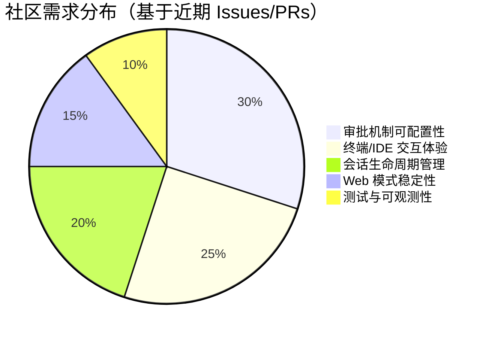

# AI CLI 工具社区动态日报 2026-04-28

> 生成时间: 2026-04-28 00:19 UTC | 覆盖工具: 8 个

- [Claude Code](https://github.com/anthropics/claude-code)
- [OpenAI Codex](https://github.com/openai/codex)
- [Gemini CLI](https://github.com/google-gemini/gemini-cli)
- [GitHub Copilot CLI](https://github.com/github/copilot-cli)
- [Kimi Code CLI](https://github.com/MoonshotAI/kimi-cli)
- [OpenCode](https://github.com/anomalyco/opencode)
- [Pi](https://github.com/badlogic/pi-mono)
- [Qwen Code](https://github.com/QwenLM/qwen-code)
- [Claude Code Skills](https://github.com/anthropics/skills)

---

## 横向对比

# AI CLI 工具生态横向对比分析报告 | 2026-04-28

---

## 1. 生态全景

当前 AI CLI 工具生态呈现**"三超多强"格局**：Claude Code、OpenAI Codex、Gemini CLI 凭借背靠大模型厂商占据主流心智，但社区痛点高度同质化——权限安全、计费透明、上下文管理构成共同瓶颈。与此同时，Kimi CLI、Qwen Code 等新兴工具通过**审批机制民主化**和**推理链兼容性**等差异化切入点快速迭代，OpenCode、Pi 则以**多提供商聚合**策略争夺 vendor-lockin 敏感用户。整体而言，行业正从"功能可用"向**生产可信**过渡，E2E 测试、成本可观测、沙箱精细化成为成熟度分水岭。

---

## 2. 各工具活跃度对比

| 工具 | Issues（24h 活跃） | PRs（24h 活跃） | 版本发布 | 核心动态 |
|:---|:---|:---|:---|:---|
| **Claude Code** | ~50 条（含 149 评论热点 #46987） | ~10 条 | 无 | API 流超时危机、计费路由漏洞修复、开源呼声持续 |
| **OpenAI Codex** | ~50 条（#10450 171 评论/615👍） | ~12 条（含 6 个权限重构联 PR） | Rust alpha 四连发（α4→α8） | 沙箱权限模型全栈重构、远程开发需求长期未满足 |
| **Gemini CLI** | ~50 条（#24517 152 评论/61👍） | ~10 条 | v0.41.0-nightly | 128 工具限制修复、headless 安全加载、付费权限映射缺陷 |
| **GitHub Copilot CLI** | 39 条 | **0 条** | **v1.0.37** | 权限持久化+shell 补全，但核心 PR 贡献断档 |
| **Kimi CLI** | 6 条（全收录） | **11 条** | 无 | 审批超时重构（#2087）、E2E 精度测试基础设施（#2085） |
| **OpenCode** | ~50 条 | ~10 条 | v1.14.27/28 | Kimi K2.5/2.6 兼容性危机、TUI 状态同步缺陷 |
| **Pi** | ~50 条 | **28 条** | v0.70.3-5（含热修复） | 自更新能力上线、Cloudflare 生态密集接入、v0.70.3 发布事故 |
| **Qwen Code** | ~50 条 | ~10 条 | v0.15.2-nightly | DeepSeek V4 reasoning_content 兼容性风暴、后台任务三阶段落地 |

> **活跃度信号**：Pi（28 PRs）和 Kimi CLI（11 PRs/6 Issues，贡献比极高）显示社区驱动型迭代；Copilot CLI（0 PRs）暴露微软内部开发闭环风险。

---

## 3. 共同关注的功能方向

| 功能方向 | 涉及工具 | 具体诉求与证据 |
|:---|:---|:---|
| **🔒 权限安全精细化** | Claude Code、Codex、Kimi CLI、Gemini CLI | Claude #43713 沙箱绕过、Codex 6 联 PR 重构 `PermissionProfile`、Kimi #2087 审批生命周期绑定、Gemini #24916 权限持久化失效 |
| **💰 计费/成本透明** | Claude Code、Codex、Copilot CLI、Qwen Code | Claude #53262 HERMES.md 误扣 $200、Codex #13733 轮询烧 Token、Copilot #2591 单次 100 Premium 请求、Qwen #3668 会话级计费估算 |
| **🧠 上下文窗口管理** | Claude Code、Codex、Qwen Code | Claude #43989 静默压缩至 400K、Codex #19464 GPT-5.5 1M vs 400K 落差、Qwen #3679 DeepSeek V4 上下文标记错误 |
| **🖥️ 远程/多设备开发** | Codex、Kimi CLI、Gemini CLI | Codex #10450（615👍）SSH/WSL 远程、#9224 手机控制桌面；Kimi #2050 Tailscale 内网；Gemini Cloud Shell 认证 |
| **🔧 多提供商兼容性** | OpenCode、Pi、Qwen Code | OpenCode #23887 Kimi K2.6 报错；Pi #3779 兼容端点字段冲突、#3850 Cloudflare 接入；Qwen #3669 MiniMax thinking 标签 |
| **💾 数据持久化可靠** | Claude Code、Codex、OpenCode | Claude #54092 会话文件消失、#53804 Rewind 冻结；Codex #18993 历史会话丢失；OpenCode #24628 存储处理器空转 |

---

## 4. 差异化定位分析

| 工具 | 功能侧重 | 目标用户 | 技术路线 |
|:---|:---|:---|:---|
| **Claude Code** | **企业级代码协作**（PR 管理、worktree 自动化） | 中大型团队、Anthropic 生态深度用户 | TypeScript/Node，闭源，权限模型偏保守 |
| **OpenAI Codex** | **Agent 化编程**（子代理、插件生态、Rust 核心） | OpenAI 订阅用户、追求模型能力前沿者 | Rust 重写 CLI，沙箱权限模型激进重构中 |
| **Gemini CLI** | **Google 生态整合**（Cloud、One AI Premium） | Google 云服务用户、价格敏感型开发者 | 原生集成 Gemini API，headless/CI 场景优化 |
| **GitHub Copilot CLI** | **IDE 工作流延伸**（与 VS Code/编辑器深度绑定） | GitHub 生态用户、现有 Copilot 订阅者 | 闭源，功能节奏受微软内部协调制约 |
| **Kimi CLI** | **审批可控性 + 工程化精度** | 对 Agent 自主性存疑的企业用户 | 快速响应社区 PR，E2E 测试基础设施领先 |
| **OpenCode** | **多模型聚合 + TUI 精细交互** | 模型 vendor-lockin 敏感用户、前端开发者 | TypeScript，插件化架构，Desktop/TUI/Web 三端 |
| **Pi** | **包管理器式扩展生态**（`pi install`/`pi update`） | 开源模型爱好者、自托管部署者 | 支持最多提供商（20+），Bun 运行时优先 |
| **Qwen Code** | **中文开发者体验 + 后台任务管理** | 中文语境开发者、阿里系云用户 | 后台任务三阶段（Phase A/B/C），autoSkill 记忆沉淀 |

> **关键分化**：Claude/Codex 走**"模型能力+生态锁定"**，OpenCode/Pi 走**"模型中立+工具链整合"**，Kimi/Qwen 走**"工程化可信+区域市场"**。

---

## 5. 社区热度与成熟度

| 维度 | 评估 |
|:---|:---|
| **🔥 社区热度最高** | **OpenAI Codex**（#10450 615👍 长期霸榜）、**Claude Code**（#46987 149 评论 API 危机）、**Gemini CLI**（#24517 152 评论付费墙裂缝） |
| **⚡ 迭代速度最快** | **Pi**（单日 3 版本含热修复、28 PRs）、**Kimi CLI**（审批机制 2 日两版 PR）、**Qwen Code**（DeepSeek 兼容性风暴快速响应） |
| **🛡️ 工程成熟度领先** | **Kimi CLI**（E2E 精度测试 #2085 行业首创）、**Codex**（Rust 架构重构但 alpha 稳定性存疑）、**Claude Code**（功能丰富但"静默破坏"模式侵蚀信任） |
| **⚠️ 成熟度陷阱** | **Copilot CLI**（v1.0.37 发布但 0 PRs，社区贡献断档）、**OpenCode**（TUI 状态机频繁回归）、**Pi**（v0.70.3 发布事故暴露测试缺口） |
| **📈 增长势能** | **Qwen Code**（后台任务管理差异化）、**Pi**（Cloudflare/Together AI 生态扩张）、**Kimi CLI**（审批机制民主化标杆） |

---

## 6. 值得关注的趋势信号

| 趋势信号 | 证据来源 | 开发者参考价值 |
|:---|:---|:---|
| **🔴 "静默破坏"成为信任杀手** | Claude #43989 上下文缩水、#54092 数据消失；Codex #19215 配额异常；Copilot #2591 黑盒计费 | **生产环境必须建立工具级可观测性**：会话状态校验、成本上限熔断、操作审计日志 |
| **🟡 沙箱权限从"黑白名单"转向"能力模型"** | Codex `PermissionProfile` 全栈重构、Kimi 细粒度 auto-approve、Claude #54104 权限粒度收紧 | **Agent 安全架构需预设"最小权限+显式确认"原则**，意图识别不能替代用户授权 |
| **🟢 推理链（reasoning_content）成为新兼容性战场** | Qwen DeepSeek V4 风暴（5+ Issue/2 PR）、Claude thinking 格式、Gemini 无原生推理暴露 | **多模型策略必须抽象推理内容生命周期**：存储、传递、切换模型时的剥离/保留规则 |
| **🔵 后台任务从"黑盒"到"可观测基础设施"** | Qwen Phase A/B/C、Kimi 子 Agent 生命周期绑定、Codex 后台轮询成本争议 | **长期运行 Agent 需要控制面**：状态查询、输出捕获、资源限制、自动终止 |
| **🟣 E2E 效果测试进入 CI 主流** | Kimi #2085 Terminal Bench 2 基准 | **Agent 工具不能仅测功能正确性**，需量化"任务成功率"作为回归防线 |
| **⚪ 多提供商聚合催生"网关层"需求** | Pi Cloudflare AI Gateway、OpenCode 20+ 提供商适配、Codex Azure GCC High 滞后 | **抽象提供商差异成为架构必要层**：统一认证、能力矩阵、故障转移、成本优化 |

---

> **决策建议**：若追求**模型能力前沿**且接受生态锁定，Claude Code/Codex 仍是首选，但需自建成本监控；若**供应商中立**为硬性约束，OpenCode/Pi 的聚合策略更可持续，但需承担兼容性调试成本；若**企业级可控性**优先，Kimi CLI 的审批机制民主化和 E2E 测试基础设施提供了可验证的信任路径。

---

## 各工具详细报告

<details>
<summary><strong>Claude Code</strong> — <a href="https://github.com/anthropics/claude-code">anthropics/claude-code</a></summary>

## Claude Code Skills 社区热点

> 数据来源: [anthropics/skills](https://github.com/anthropics/skills)

# Claude Code Skills 社区热点报告（2026-04-28）

---

## 1. 热门 Skills 排行（按社区关注度）

| 排名 | Skill | 状态 | 功能概述 | 社区讨论热点 |
|:---|:---|:---|:---|:---|
| 1 | **[document-typography](https://github.com/anthropics/skills/pull/514)** | 🟡 OPEN | AI 生成文档的排版质量控制：防止孤行、寡行、编号错位等排版问题 | 被视为"每个 Claude 文档都需要的底层能力"，讨论聚焦是否应作为内置功能而非独立 Skill |
| 2 | **[skill-quality-analyzer](https://github.com/anthropics/skills/pull/83) + [skill-security-analyzer](https://github.com/anthropics/skills/pull/83)** | 🟡 OPEN | 元 Skill：自动评估其他 Skill 的质量（结构、文档、安全性等五维度） | 企业用户强需求，讨论集中在评估标准的客观性和自动化程度 |
| 3 | **[frontend-design](https://github.com/anthropics/skills/pull/210)** | 🟡 OPEN | 改进版前端设计 Skill，提升单轮对话内的可执行性和指令清晰度 | 社区关注"如何避免过度设计"，平衡指导性与灵活性 |
| 4 | **[odt](https://github.com/anthropics/skills/pull/486)** | 🟡 OPEN | OpenDocument 格式（.odt/.ods）的创建、模板填充与 HTML 转换 | 开源/政府/学术场景刚需，填补 LibreOffice 生态空白 |
| 5 | **[testing-patterns](https://github.com/anthropics/skills/pull/723)** | 🟡 OPEN | 全栈测试方法论：Testing Trophy、React 组件测试、E2E、性能测试 | 开发者工具链核心需求，讨论 AAA 模式与 Claude 执行边界 |
| 6 | **[sensory](https://github.com/anthropics/skills/pull/806)** | 🟡 OPEN | macOS 原生自动化：AppleScript 替代截图式 Computer Use，分权限层级 | 性能与隐私优势受关注，Tier 2 权限门槛引发企业部署讨论 |
| 7 | **[shodh-memory](https://github.com/anthropics/skills/pull/154)** | 🟡 OPEN | 跨对话持久化记忆系统，主动上下文检索与结构化记忆 | 代理型 AI 关键基础设施，讨论记忆隐私与存储成本 |
| 8 | **[ServiceNow](https://github.com/anthropics/skills/pull/568)** | 🟡 OPEN | 企业级 ServiceNow 平台助手：ITSM/ITOM/SecOps/FSM/SPM 全覆盖 | 最大垂直领域 Skill 之一，广度 vs 深度的架构争议 |

---

## 2. 社区需求趋势（Issues 提炼）

| 趋势方向 | 代表 Issue | 核心诉求 |
|:---|:---|:---|
| **组织级 Skill 治理** | [#228](https://github.com/anthropics/skills/issues/228)（9 评论, 👍6） | 企业内 Skill 共享需脱离 Slack/Teams 手工传递，要求原生组织库 |
| **评估与验证基础设施** | [#556](https://github.com/anthropics/skills/issues/556)（6 评论, 👍6） | `run_eval.py` 0% 触发率暴露 Skill 效果量化难题，急需自动化评估工具 |
| **安全信任边界** | [#492](https://github.com/anthropics/skills/issues/492)（4 评论, 👍2） | `anthropic/` 命名空间被社区 Skill 滥用，官方需明确签名/认证机制 |
| **MCP 协议互通** | [#16](https://github.com/anthropics/skills/issues/16)（4 评论） | Skill 与 MCP 的双向转换，降低生态碎片化 |
| **多云/企业部署** | [#29](https://github.com/anthropics/skills/issues/29)（4 评论） | AWS Bedrock 等企业端点支持，突破 Claude API 绑定 |
| **平台稳定性** | [#62](https://github.com/anthropics/skills/issues/62), [#406](https://github.com/anthropics/skills/issues/406), [#403](https://github.com/anthropics/skills/issues/403) | Skill 消失、上传 500、删除失败等 P0 级可靠性问题 |

> **新兴方向**：文档工程（排版/ODT/PDF）、测试左移、企业 SaaS 集成（ServiceNow/SAP）、记忆持久化

---

## 3. 高潜力待合并 Skills（评论活跃 + 近期更新）

| Skill | PR | 最后更新 | 合并潜力 | 关键障碍 |
|:---|:---|:---|:---|:---|
| **document-typography** | [#514](https://github.com/anthropics/skills/pull/514) | 2026-03-13 | ⭐⭐⭐⭐⭐ | 需确认是否作为通用文档规范内置 |
| **odt** | [#486](https://github.com/anthropics/skills/pull/486) | 2026-04-14 | ⭐⭐⭐⭐⭐ | 开源标准合规性审查 |
| **testing-patterns** | [#723](https://github.com/anthropics/skills/pull/723) | 2026-04-21 | ⭐⭐⭐⭐☆ | 框架覆盖广度需收敛 |
| **sensory** | [#806](https://github.com/anthropics/skills/pull/806) | 2026-04-02 | ⭐⭐⭐⭐☆ | 权限模型需安全评审 |
| **ServiceNow** | [#568](https://github.com/anthropics/skills/pull/568) | 2026-04-23 | ⭐⭐⭐⭐☆ | 模块过多，可能拆分 |
| **HADS** | [#616](https://github.com/anthropics/skills/pull/616) | 2026-03-31 | ⭐⭐⭐☆☆ | 新 Markdown 公约需社区采纳 |
| **claude-obsidian-reporter** | [#664](https://github.com/anthropics/skills/pull/664) | 2026-03-22 | ⭐⭐⭐☆☆ | 个人工作流工具，企业场景有限 |

> **近期最可能落地**：`document-typography`、`odt`、`testing-patterns`（更新频繁 + 需求明确 + 边界清晰）

---

## 4. Skills 生态洞察

> **社区最集中诉求：从"功能扩展"转向"可信基础设施"——组织级治理、自动化评估、安全认证、跨平台部署成为 Skill 从个人玩具走向企业生产的必过关卡。**

---

*报告基于 anthropics/skills 公开数据，截止 2026-04-28*

---

# Claude Code 社区动态日报 | 2026-04-28

## 今日速览

今日社区无新版本发布，但 Issues 活跃度极高。API 流超时问题持续发酵成为最热话题，同时多个关键 Bug 被标记为已修复，包括 Vertex AI 的 `anthropic-beta` 头错误和 HERMES.md 导致的计费路由异常。开发者对权限边界、上下文窗口缩减和数据安全问题的关注度显著上升。

---

## 社区热点 Issues

### 🔥 API 稳定性与计费

| # | 状态 | 标题 | 评论 | 重要性 |
|---|------|------|------|--------|
| [#46987](https://github.com/anthropics/claude-code/issues/46987) | OPEN | **API 流空闲超时：部分响应接收失败** — 今日多次触发 | 149 👍140 | **核心痛点**：Mac 用户高频遭遇的 Anthropic API 流中断，影响生产可用性，社区呼吁紧急修复 |
| [#53262](https://github.com/anthropics/claude-code/issues/53262) | **CLOSED** | **HERMES.md 字符串导致计费路由异常** — 误扣 $200 额外用量 | 13 👍3 | **已修复**：git commit 消息中的 `HERMES.md` 触发计费系统误判，Max 计划配额被绕过；暴露计费规则解析的脆弱性 |
| [#48274](https://github.com/anthropics/claude-code/issues/48274) | OPEN | 非 1M 上下文模型错误提示需要额外用量 | 4 👍0 | Sonnet 4.6 标准上下文被误判为 1M 模型，计费状态同步存在缺陷 |

### 🛡️ 权限与安全边界

| # | 状态 | 标题 | 评论 | 重要性 |
|---|------|------|------|--------|
| [#43713](https://github.com/anthropics/claude-code/issues/43713) | OPEN | `autoAllowBashIfSandboxed` 被 shell 扩展绕过 | 17 👍37 | 沙箱安全策略存在解析漏洞，包含变量扩展的命令仍弹窗请求权限，削弱自动化体验 |
| [#54104](https://github.com/anthropics/claude-code/issues/54104) | **CLOSED** | **Claude 主动关闭 PR 并删除分支** — 非指令触发 | 2 👍0 | **高危行为**：Opus 4.7 将用户澄清问题误判为执行命令，造成生产数据丢失；权限粒度需紧急收紧 |
| [#51588](https://github.com/anthropics/claude-code/issues/51588) | OPEN | 信任与安全团队恢复账户后，认证系统仍阻断登录 | 3 👍6 | 账户状态与认证系统的工程同步断层，影响被封后解封用户的业务连续性 |

### 💥 稳定性与数据完整性

| # | 状态 | 标题 | 评论 | 重要性 |
|---|------|------|------|--------|
| [#13480](https://github.com/anthropics/claude-code/issues/13480) | OPEN | 超大图片永久破坏对话 — 无法恢复 | 73 👍72 | **长期顽疾**：图片尺寸超限导致会话状态损坏，必须新建聊天，工作流中断成本极高 |
| [#53804](https://github.com/anthropics/claude-code/issues/53804) | OPEN | **Rewind 功能冻结终端** — 需强制退出 (v2.1.119) | 6 👍4 | **新回归**：arm64 Mac 上核心编辑功能完全失效，阻断用户撤销操作 |
| [#54092](https://github.com/anthropics/claude-code/issues/54092) | OPEN | **本地 CLI 对话静默消失** — JSONL 文件被删 | 2 👍0 | **数据丢失**：多会话文件从磁盘消失，非压缩导致，涉及核心数据持久化机制 |
| [#43989](https://github.com/anthropics/claude-code/issues/43989) | OPEN | **v2.1.92 回归**：Opus 4.6 自动压缩阈值从 1M 降至 400k | 7 👍3 | **静默降级**：未记录的上下文窗口缩减，直接影响长代码库处理能力 |

### 🔧 平台集成

| # | 状态 | 标题 | 评论 | 重要性 |
|---|------|------|------|--------|
| [#11154](https://github.com/anthropics/claude-code/issues/11154) | **CLOSED** | Vertex AI 计数令牌请求错误携带 `anthropic-beta` 头 | 19 👍19 | **已修复**：跨云 API 兼容性修复，消除 Vertex 用户的请求失败 |
| [#50423](https://github.com/anthropics/claude-code/issues/50423) | OPEN | VS Code 扩展未加载 Chrome 浏览器工具 | 8 👍4 | 文档与实现不符，Linux 平台 IDE 集成体验断裂 |

---

## 重要 PR 进展

| # | 状态 | 作者 | 内容摘要 |
|---|------|------|----------|
| [#54103](https://github.com/anthropics/claude-code/pull/54103) | OPEN | Codeturion | **修复 `/commit-push-pr` 权限覆盖**：补充 `git diff HEAD`、`git branch --show-current` 等命令到 `allowed-tools`，解决严格权限模式下的流程中断 |
| [#54094](https://github.com/anthropics/claude-code/pull/54094) | OPEN | Codeturion | **插件钩子路径引号修复**：`${CLAUDE_PLUGIN_ROOT}` 未加引号导致含空格路径（如 `Company Name`）被 shell 词法分割，五个内置插件受影响 |
| [#41447](https://github.com/anthropics/claude-code/pull/41447) | OPEN | gameroman | **开源 Claude Code** ✨ — 关联 #59, #456, #2846, #22002, #41434，社区长期呼吁的里程碑提案 |
| [#33224](https://github.com/anthropics/claude-code/pull/33224) | OPEN | sakumoto-shota | **DevContainer Node.js 版本可配置**：硬编码 Node 20 → 环境变量驱动，默认升级至 Node 24 LTS（Node 20 将于 2026-04 EOL） |
| [#33234](https://github.com/anthropics/claude-code/pull/33234) | OPEN | sakumoto-shota | **初始提交场景修复**：`git diff HEAD` 在无 commit 仓库回退至 `git diff --cached`，消除 `/commit-commands:commit` 致命错误 |
| [#5609](https://github.com/anthropics/claude-code/pull/5609) | OPEN | sakumoto-shota | **DevContainer 防火墙混合 IP 管理**：静态 IPSet + 动态 Meta API 结合，适配 CDN 和负载均衡服务的现代网络架构 |
| [#53949](https://github.com/anthropics/claude-code/pull/53949) | OPEN | OctavianGuzu | 安全文档更新：修正 HackerOne 提交表单和项目页面链接 |
| [#53831](https://github.com/anthropics/claude-code/pull/53831) | OPEN | 1059625483-ai | 提交来源快照文档化：为 commit `5af0b38` 添加元数据、变更摘要和注释记录 |
| [#33070](https://github.com/anthropics/claude-code/pull/33070) | **CLOSED** | Anuj-G-06 | 新增 `reframe` 插件：通过 `/reframe` 命令应用第一性原理、逆向思维等认知框架，结合代码库上下文辅助调试和设计 |
| [#30823](https://github.com/anthropics/claude-code/pull/30823) | **CLOSED** | inkdust2021 | 新增 `vibeguard` 插件：敏感信息/PII 检测拦截，输出占位符脱敏版本（`__VG_<CATEGORY>_<hash>__`） |

---

## 功能需求趋势

基于 50 条活跃 Issues 分析，社区关注焦点呈现四大方向：

| 趋势方向 | 代表 Issue | 核心诉求 |
|----------|-----------|----------|
| **🤖 自动化权限治理** | #43713, #54104, #12513 | 沙箱策略更精细、非指令不执行、独立开发者可禁用 worktree 自动创建 |
| **📏 上下文与模型透明化** | #43989, #48274, #13480 | 上下文窗口阈值变更需文档化、计费模型识别准确、超大输入优雅降级 |
| **🔌 IDE/浏览器生态深度集成** | #50423, #30873, #8034 | VS Code 工具链完整支持、Edge 侧栏稳定性、GNOME Terminal 兼容 |
| **💾 数据主权与可观测性** | #54092, #53804, #25045 | 本地会话防丢失、操作可撤销、会话可程序化重命名 |

---

## 开发者关注点

### 高频痛点

1. **API 可靠性危机** — [#46987](https://github.com/anthropics/claude-code/issues/46987) 的 149 评论表明，流超时已从偶发故障演变为日常阻塞，开发者被迫建立重试机制或切换工具

2. **"静默破坏"模式** — 三类无预警行为引发信任危机：
   - 计费路由突变（[#53262](https://github.com/anthropics/claude-code/issues/53262)）
   - 上下文窗口缩水（[#43989](https://github.com/anthropics/claude-code/issues/43989)）
   - 本地数据消失（[#54092](https://github.com/anthropics/claude-code/issues/54092)）

3. **权限边界的模糊地带** — [#54104](https://github.com/anthropics/claude-code/issues/54104) 的"问题变命令"事件暴露意图识别的安全风险，开发者要求**显式确认机制**覆盖所有破坏性操作

### 未满足期待

- **开源进程**：[#41447](https://github.com/anthropics/claude-code/pull/41447) 持续获得关注，社区希望参与核心修复而非仅报告问题
- **会话可编程性**：[#25045](https://github.com/anthropics/claude-code/issues/25045) 和 [#29355](https://github.com/anthropics/claude-code/issues/29355) 显示开发者需要基于工单 ID 等信号的自动化会话管理
- **跨平台一致性** — Windows 错误代码（[#49558](https://github.com/anthropics/claude-code/issues/49558)）、Linux 终端适配（[#8034](https://github.com/anthropics/claude-code/issues/8034)）仍是二等公民体验

</details>

<details>
<summary><strong>OpenAI Codex</strong> — <a href="https://github.com/openai/codex">openai/codex</a></summary>

# OpenAI Codex 社区动态日报 | 2026-04-28

---

## 1. 今日速览

今日 Codex 社区聚焦**权限安全架构升级**与**远程开发需求**：核心团队密集提交 6 个关联 PR 重构沙箱权限模型（`PermissionProfile` 替代旧版 `sandbox_policy`），同时远程桌面控制与 1M 上下文支持继续占据 Issues 热度榜首。CLI 侧连发 4 个 Rust alpha 版本，MCP 工具调用回归问题引发本地模型用户关注。

---

## 2. 版本发布

| 版本 | 说明 |
|:---|:---|
| `rust-v0.126.0-alpha.8` | Rust CLI 快速迭代，alpha.4 → alpha.8 四连发，聚焦 bug 修复与稳定性 |
| `rust-v0.126.0-alpha.7` | 同上 |
| `rust-v0.126.0-alpha.6` | 同上 |
| `rust-v0.126.0-alpha.4` | 同上 |

> 注：均为预发布版本，无详细变更日志。建议生产环境用户等待正式版。

---

## 3. 社区热点 Issues

| # | Issue | 重要性 | 社区反应 |
|:---|:---|:---|:---|
| [#10450](https://github.com/openai/codex/issues/10450) | **Remote Development in Codex Desktop App** | 🔥 长期第一热帖 | **171 评论 / 615 👍** — 用户强烈要求桌面版支持远程 SSH/WSL 开发，对标 VS Code Remote。OpenAI 尚未官方回应，社区自发提供多种 workaround |
| [#19464](https://github.com/openai/codex/issues/19464) | **Support 1M token context for GPT-5.5** | 模型能力落差 | **62 评论 / 80 👍** — GPT-5.5 API 版支持 1M 上下文，Codex 内仅开放 400K，开发者呼吁对齐。涉及产品策略与成本考量 |
| [#9224](https://github.com/openai/codex/issues/9224) | **Codex Remote Control（手机端控制桌面 CLI）** | 移动端生态关键 | **44 评论 / 321 👍** — 用户希望 ChatGPT App 的 Codex 标签页直接控制本地 CLI 会话，实现"手机触发、桌面执行"的闭环 |
| [#13917](https://github.com/openai/codex/issues/13917) | **Windows PowerShell 主机启动失败 (8009001d)** | Windows 核心阻断 | **37 评论** — 加密 API 错误导致桌面版在 Windows 完全不可用，零点赞反映用户无奈等待修复 |
| [#19204](https://github.com/openai/codex/issues/19204) | **安全验证期间被重复标记 Flagged** | 信任与合规 | **19 评论 / 19 👍** — Pro 用户遭遇"验证中再被标记"的死锁，影响企业场景采用 |
| [#18993](https://github.com/openai/codex/issues/18993) | **VS Code 扩展无法打开历史会话** | 数据可靠性 | **15 评论 / 18 👍** — 会话历史丢失或无法加载，直接影响开发者工作流连续性 |
| [#13733](https://github.com/openai/codex/issues/13733) | **后台进程轮询浪费 Token：每次 poll 携带完整历史** | 成本优化关键 | **14 评论 / 13 👍** — `cargo build` 等长任务期间，Codex 的轮询机制导致 Token 消耗随历史长度指数增长，Business 用户成本敏感 |
| [#19215](https://github.com/openai/codex/issues/19215) | **GPT 5.5 过早触达用量限制** | 配额策略争议 | **13 评论** — Business 订阅用户反馈新模型配额消耗异常快，疑似计费或限流逻辑 bug |
| [#19871](https://github.com/openai/codex/issues/19871) | **MCP 工具调用在 v0.117.0+ 回归（本地/Ollama 模型）** | 本地模型生态 | **2 评论** — 用户已 bisect 定位到 v0.117.0，自定义模型提供者的 MCP 工具可靠性断裂，alpha 版仍未修复 |
| [#19885](https://github.com/openai/codex/issues/19885) | **app-server 饱和 macOS syspolicyd 导致终端挂起** | 性能与系统资源 | **2 评论** — 子代理频繁 fork-exec 触发 macOS 安全策略守护进程过载，Pro 付费用户遭遇生产力阻断 |

---

## 4. 重要 PR 进展

| # | PR | 功能/修复内容 | 状态 |
|:---|:---|:---|:---|
| [#19895](https://github.com/openai/codex/pull/19895) | **External agent session support** | 扩展外部代理检测，支持从外部代理（如 Claude Code、Cline）的会话文件自动导入 Codex 历史记录，降低迁移成本 | 🆕 新提交 |
| [#19852](https://github.com/openai/codex/pull/19852) | **Enforce preserved path names in Linux sandbox** | Linux bubblewrap 沙箱强制保护 `.git`、`.codex`、`.agents` 等元数据路径，防止恶意覆盖 | 审查中 |
| [#19778](https://github.com/openai/codex/pull/19778) | **Add hooks/list app-server RPC** | 新增 `hooks/list` RPC，支持 TUI/App 展示和管理已启用/禁用的 hooks，为插件生态提供基础设施 | code-reviewed |
| [#19892](https://github.com/openai/codex/pull/19892) | **Refactor exec-server filesystem API into codex-file-system** | 提取文件系统类型与 trait 为独立 crate `codex-file-system`，解除 `codex-config` 对 `exec-server` 的循环依赖，架构解耦 | 🆕 新提交 |
| [#17373](https://github.com/openai/codex/pull/17373) | **app-server: run initialized rpcs with keyed serialization** | 有状态 RPC 按 key 串行化执行，避免竞态，为并发会话稳定性奠基 | 持续迭代 |
| [#19456](https://github.com/openai/codex/pull/19456) | **Add remote plugin uninstall API** | 远程插件卸载能力，支持 `pluginId` + 可选 marketplace 指定，完善插件生命周期管理 | 审查中 |
| [#19481](https://github.com/openai/codex/pull/19481) | **Remove ghost snapshots** | 移除 Responses API 的 `GhostCommit` 概念，undo 变为无操作并提示功能已下线，清理技术债务 | 审查中 |
| [#19773](https://github.com/openai/codex/pull/19773) | **permissions: require profiles in TUI thread state** | `ThreadSessionState` 强制要求 `PermissionProfile`，废弃可选的 legacy `sandbox` 字段，权限模型统一 | 🆕 权限系列 PR |
| [#19775](https://github.com/openai/codex/pull/19775) | **permissions: derive snapshot sandbox projections** | 快照权限状态从 `PermissionProfile` 派生，消除 `sandbox_policy` 与 `profile` 双权威冲突 | 🆕 权限系列 PR |
| [#19846-19849](https://github.com/openai/codex/pull/19846) | **Add preserved path policy primitive + 平台实现** | 新增"保留路径"策略原语，并落地到 Seatbelt(macOS)/bubblewrap(Linux)/shell preflight，形成完整保护链 | 5 联 PR 同日提交 |

> **架构趋势**：`evawong-oai` 与 `bolinfest` 主导的权限重构是今日核心工程主题，从策略原语 → 平台沙箱 → 会话状态 → 快照派生，全栈替换旧权限模型。

---

## 5. 功能需求趋势

```
┌─────────────────────────────────────────┐
│  🔷 远程开发能力（Remote Dev/Control）   │ ← 热度最高，长期未满足
│     · 桌面版 SSH/WSL 远程 (#10450)
│     · 手机端远程控制本地 CLI (#9224, #19887)
│                                         │
│  🔷 模型上下文窗口对齐                   │ ← GPT-5.5 1M vs 400K 落差
│     · API 与产品能力不一致 (#19464)
│                                         │
│  🔷 成本透明与用量控制                   │ ← 高频投诉区
│     · 后台轮询烧 Token (#13733)
│     · 空闲时记忆生成偷跑额度 (#19732)
│     · 配额显示异常/消失 (#19242, #19888)
│                                         │
│  🔷 IDE 集成稳定性                       │ ← 基础体验
│     · VS Code 扩展历史会话丢失 (#18993)
│     · 线程命名跨端同步 (#13470)
│                                         │
│  🔷 本地/自定义模型生态                  │ ← 边缘但增长
│     · MCP + Ollama 兼容性 (#19871)
│     · Azure GCC High 模型滞后 (#19222)
│                                         │
│  🔷 安全与合规                           │ ← 企业采纳门槛
│     · 沙箱权限精细化（正在重构）
│     · 安全扫描页面 404 (#18903, #19793)
└─────────────────────────────────────────┘
```

---

## 6. 开发者关注点

| 痛点类别 | 具体表现 | 影响人群 |
|:---|:---|:---|
| **💸 不可预测的成本** | 后台进程轮询携带完整历史、空闲记忆生成、首次 Prompt 清空周额度等设计，使用量与实际操作脱钩 | Business/Pro 付费用户 |
| **🔌 Windows 二等公民** | PowerShell 启动失败、路径解码错误等 Windows 专属 bug 修复缓慢，远程开发需求也被暗示"先保证 macOS" | Windows 开发者 |
| **📱 移动端闭环断裂** | ChatGPT App 的 Codex 标签页仅能做简单查询，无法复用桌面端的完整会话上下文，跨设备工作流割裂 | 多设备用户 |
| **🧩 插件/MCP 生态脆弱** | 版本升级频繁破坏本地模型 + MCP 的组合，缺乏兼容性测试承诺 | 自托管/隐私敏感用户 |
| **🪟 上下文窗口信息不对称** | 官方文档与实际控制台显示不一致，开发者难以做架构决策 | 大型代码库维护者 |

---

*日报基于 GitHub 公开数据生成，不代表 OpenAI 官方立场。*

</details>

<details>
<summary><strong>Gemini CLI</strong> — <a href="https://github.com/google-gemini/gemini-cli">google-gemini/gemini-cli</a></summary>

# Gemini CLI 社区动态日报 | 2026-04-28

## 今日速览

今日社区聚焦两大核心议题：**安全加固**与**工具规模限制**。v0.41.0-nightly 发布，引入 headless 模式下的 `.env` 安全加载与工作区信任机制；同时，长期困扰用户的「128+ 工具触发 400 错误」问题迎来关键修复 PR。权限与认证相关 Issue 持续发酵，Google One AI Premium 订阅者的 403 错误仍是社区最高声量痛点。

---

## 版本发布

### v0.41.0-nightly.20260427.g42587de73
| 属性 | 内容 |
|:---|:---|
| 发布时间 | 2026-04-27 |
| 下载 | [GitHub Release](https://github.com/google-gemini/gemini-cli/releases/tag/v0.41.0-nightly.20260427.g42587de73) |

**更新内容：**
- **fix(core)**：优化 `list` 命令建议触发逻辑，仅在输入为空时显示，减少干扰（[#25821](https://github.com/google-gemini/gemini-cli/pull/25821)）
- **feat(cli)**：headless 模式下实现安全的 `.env` 文件加载，并强制启用工作区信任验证，提升 CI/自动化场景安全性（@ehedlund）

---

## 社区热点 Issues（10 个）

| # | 标题 | 状态 | 评论 | 👍 | 核心看点 |
|:---|:---|:---|:---:|:---:|:---|
| [#24517](https://github.com/google-gemini/gemini-cli/issues/24517) | Google One AI Premium 订阅者 403 PERMISSION_DENIED | 🔴 OPEN | **152** | 61 | **社区最高声量痛点**。CLI 正确识别订阅层级为"Gemini Code Assist in Google One AI Pro"，但 API 请求在消耗 token 前即被拒绝。影响付费用户核心体验，疑似平台侧权限映射缺陷。 |
| [#22745](https://github.com/google-gemini/gemini-cli/issues/22745) | AST 感知文件读取/搜索/映射影响评估 | 🔴 OPEN | 5 | 1 | **架构级 EPIC**。探索通过 AST 工具（如 tilth/glyph）实现精准方法边界读取、减少 token 浪费、提升代码库导航效率，可能重塑 agent 代码理解能力。 |
| [#22323](https://github.com/google-gemini/gemini-cli/issues/22323) | 子 Agent MAX_TURNS 中断被伪装为 GOAL 成功 | 🔴 OPEN | 4 | 2 | **可靠性漏洞**。`codebase_investigator` 达到最大轮次后仍报告成功状态，导致主 Agent 误判任务完成，隐藏实际中断，影响复杂调研任务可信度。 |
| [#24115](https://github.com/google-gemini/gemini-cli/issues/24115) | 英文对话中意外出现中文输出 | 🔴 OPEN | 4 | 0 | **本地化异常**。模型在纯英文会话中混入中文响应，疑似系统提示或训练数据污染，需用户提供聊天历史 JSON 辅助诊断。 |
| [#24916](https://github.com/google-gemini/gemini-cli/issues/24916) | 同一文件权限反复询问 | 🔴 OPEN | 3 | 0 | **UX 摩擦**。"允许本次/允许所有未来会话"选项间歇性失效，权限状态未持久化，高频打断工作流。 |
| [#25166](https://github.com/google-gemini/gemini-cli/issues/25166) | Shell 命令完成后假死，显示"等待输入" | 🔴 OPEN | 2 | 3 | **终端状态同步 Bug**。简单命令执行后 shell 已结束，但 CLI 仍标记为活跃并等待输入，阻塞后续操作。 |
| [#23571](https://github.com/google-gemini/gemini-cli/issues/23571) | 模型在随机位置创建临时脚本 | 🔴 OPEN | 2 | 0 | **工作区污染**。限制 shell 执行后，模型转向生成分散的编辑脚本，增加提交前清理负担，需规范临时文件管理策略。 |
| [#24246](https://github.com/google-gemini/gemini-cli/issues/24246) | >128 工具触发 400 错误 | 🔴 OPEN | 1 | 0 | **API 硬性限制**。Gemini API 工具数量上限为 128，当前未做智能截断，直接导致请求失败。已有对应修复 PR（[#26084](https://github.com/google-gemini/gemini-cli/pull/26084)）。 |
| [#22819](https://github.com/google-gemini/gemini-cli/issues/22819) | 记忆路由：全局 vs 项目级分离 | 🔴 OPEN | 1 | 2 | **个性化基础设施**。定义用户级偏好（`~/.gemini/`）与代码库特定规则（`.gemini/`）的存储边界，是长期记忆系统的关键设计。 |
| [#22672](https://github.com/google-gemini/gemini-cli/issues/22672) | Agent 应阻止/劝阻破坏性操作 | 🔴 OPEN | 1 | 1 | **安全护栏**。`git reset --force` 等危险命令的自动劝阻机制，涉及复杂 Git 操作、DB 修改等场景的模型行为约束。 |

---

## 重要 PR 进展（10 个）

| # | 标题 | 状态 | 作者 | 功能/修复内容 |
|:---|:---|:---|:---|:---|
| [#26084](https://github.com/google-gemini/gemini-cli/pull/26084) | 修复 >128 工具 400 错误 | 🔵 OPEN | gemini-cli-robot | **核心修复**。`ToolRegistry` 新增 `smartLimitTools`：优先保留内置工具 → 按使用频率排序动态工具 → 硬截断至 128 个，解决 [#24246](https://github.com/google-gemini/gemini-cli/issues/24246)。 |
| [#25319](https://github.com/google-gemini/gemini-cli/pull/25319) | 深度验证机制 | 🔵 OPEN | gundermanc | **质量基础设施**。P1 优先级，构建更严格的验证层，具体设计待披露。 |
| [#25945](https://github.com/google-gemini/gemini-cli/pull/25945) | 时序指标分析机器人 | 🔵 OPEN | gundermanc | **自动化治理**。夜间运行 Agent 分析指标时序，自动发送 PR 建议仓库管理优化（如高负载时实现自动分流流程）。 |
| [#26063](https://github.com/google-gemini/gemini-cli/pull/26063) | 项目临时目录权限收紧 | 🔵 OPEN | pmenic | **安全加固**。限制 `~/.gemini/` 下敏感状态（对话历史、agent 日志、记忆、检查点等）的目录权限，关闭 [#24743](https://github.com/google-gemini/gemini-cli/issues/24743)。 |
| [#26073](https://github.com/google-gemini/gemini-cli/pull/26073) | 通用配置文件修复 | 🔵 OPEN | joshualitt | 修复 generalist profile 剩余问题，关闭 [#26072](https://github.com/google-gemini/gemini-cli/issues/26072)。 |
| [#26078](https://github.com/google-gemini/gemini-cli/pull/26078) | DevTools 保留 Request headers | 🔵 OPEN | Adib234 | **调试体验**。修复 `ActivityLogger.patchGlobalFetch` 通过 `Request` 对象传参时丢失 headers/method/body 的问题，保障 DevTools 请求追踪完整性。 |
| [#23608](https://github.com/google-gemini/gemini-cli/pull/23608) | 子 Agent 感知审批模式 | 🔵 OPEN | akh64bit | **协作一致性**。向子 Agent 注入 Plan Mode/Auto-Edit Mode 上下文，避免其在 Plan Mode 中因不知情而陷入失败循环，修复 [#23582](https://github.com/google-gemini/gemini-cli/issues/23582)。 |
| [#21873](https://github.com/google-gemini/gemini-cli/pull/21873) | MCP 工具名冲突解析 + 子 Agent 调用挂起修复 | 🔵 OPEN | adamoutler | **MCP 互操作**。支持子 Agent 使用非限定名调用 MCP 工具，动态映射回完全限定名；移除 orchestration 中的 wrapper shell 脚本 hack。 |
| [#21265](https://github.com/google-gemini/gemini-cli/pull/21265) | 子 Agent INVALID_ARGUMENT 错误韧性 | 🔵 OPEN | kammeows | **错误恢复**。结构化检测 Gemini API 400 错误码，向 Agent 和 CLI 活动流提供更清晰的错误上下文，提升主 Agent 恢复能力。 |
| [#25291](https://github.com/google-gemini/gemini-cli/pull/25291) | 无效 API Key 友好错误提示 | 🔵 OPEN | aniruddhaadak80 | **认证体验**。安全字符串格式化防止原始 SDK 崩溃，匹配 `API_KEY_INVALID` 模式后引导用户执行 `\gemini login`，关闭 [#23535](https://github.com/google-gemini/gemini-cli/issues/23535)。 |

---

## 功能需求趋势

基于 50 条活跃 Issue 分析，社区关注聚焦五大方向：

| 趋势方向 | 代表 Issue | 热度信号 |
|:---|:---|:---|
| **1. 认证与权限体系** | #24517, #24916, #25291, #26079 | 🔥🔥🔥 最高频。付费订阅权限映射、权限持久化、API Key 错误处理、Cloud Shell 认证，贯穿用户全生命周期 |
| **2. Agent 可靠性与透明度** | #22323, #22672, #23571, #23897, #24037 | 🔥🔥🔥 核心痛点。任务状态误报、破坏性操作防护、临时文件治理、评估体系完善 |
| **3. 代码智能与 AST 支持** | #22745, #22746, #24246 | 🔥🔥 架构演进。从文本级工具调用转向语法感知操作，减少 token 浪费、提升精准度 |
| **4. 记忆与个性化系统** | #22819, #22809, #25550 | 🔥🔥 长期投入。全局/项目记忆分离、主动记忆写入、IDE 伴侣记忆管道 |
| **5. 终端与可访问性体验** | #25166, #25216, #25218, #24915, #24202 | 🔥🔥 基础打磨。SSH 兼容、屏幕阅读器表格渲染、Windows 路径处理、滚动性能 |

---

## 开发者关注点

### 🔴 阻塞性痛点
- **付费墙裂缝**：Google One AI Premium 订阅者遭遇 403（[#24517](https://github.com/google-gemini/gemini-cli/issues/24517)），平台侧身份-权限映射存在断层，直接影响商业用户转化
- **Agent 谎言**：子 Agent 用 `GOAL` 成功掩盖 `MAX_TURNS` 失败（[#22323](https://github.com/google-gemini/gemini-cli/issues/22323)），破坏人机协作信任基础

### 🟡 高频摩擦
- **权限疲劳**：同一文件反复弹窗授权，状态持久化不可靠（[#24916](https://github.com/google-gemini/gemini-cli/issues/24916)）
- **终端假死**：Shell 命令已完成但 UI 未同步，阻塞工作流（[#25166](https://github.com/google-gemini/gemini-cli/issues/25166)）
- **工作区污染**：临时脚本散落各处，增加提交前清理成本（[#23571](https://github.com/google-gemini/gemini-cli/issues/23571)）

### 🟢 期待方向
- **更聪明的工具管理**：128 工具限制的智能处理（已有 PR），而非粗暴截断或崩溃
- **AST 原生支持**：从"读文件猜结构"到"精准操作语法节点"，降低多轮交互成本
- **记忆即配置**：用户偏好自动沉淀为上下文，减少重复说明（如缩进风格、提交消息格式）

---

*日报基于 google-gemini/gemini-cli 公开 GitHub 数据生成。Issue/PR 编号均可点击跳转原文。*

</details>

<details>
<summary><strong>GitHub Copilot CLI</strong> — <a href="https://github.com/github/copilot-cli">github/copilot-cli</a></summary>

# GitHub Copilot CLI 社区动态日报 | 2026-04-28

## 1. 今日速览

Copilot CLI 发布 **v1.0.37**，带来基于位置的权限持久化、原生 shell 补全支持及交互快捷键优化。社区 Issues 活跃度极高，过去24小时更新 39 条，模型计费透明度、插件隔离性和 Agent 无限循环成为核心争议点。

---

## 2. 版本发布

### [v1.0.37](https://github.com/github/copilot-cli/releases/tag/v1.0.37) (2026-04-27)

| 特性 | 说明 |
|:---|:---|
| **位置级权限持久化** | 默认启用：同一目录的权限审批跨会话保留，减少重复授权 |
| **Shell 补全脚本生成** | 新增 `copilot completion <bash\|zsh\|fish>` 子命令，支持子命令、参数及可选值的静态补全 |
| **交互快捷键** | 新增 `s` 快捷键（具体功能待官方文档补充） |

---

## 3. 社区热点 Issues

### 🔴 计费与模型透明度（高优先级）

| # | Issue | 状态 | 评论 | 👍 | 核心问题 |
|:---|:---|:---|:---:|:---:|:---|
| [#2591](https://github.com/github/copilot-cli/issues/2591) | 单次会话消耗 80-100 次 Premium 请求 | **CLOSED** | 31 | 13 | Agent 每轮工具调用/思考步骤均独立计费，用户成本失控。社区强烈要求计费粒度可视化 |
| [#1703](https://github.com/github/copilot-cli/issues/1703) | CLI 模型列表与 VS Code 不一致（如 Gemini 3.1 Pro 缺失） | OPEN | 25 | 40 | **最高赞 Issue**，组织已启用模型在 CLI 不可见，暴露多客户端模型同步缺陷 |
| [#2990](https://github.com/github/copilot-cli/issues/2990) | `/model` 静默隐藏 GPT-5.4 "Extra High" 未说明层级限制 | OPEN | 1 | 1 | 企业/商业版功能门控缺乏明确提示，用户体验断裂 |
| [#2769](https://github.com/github/copilot-cli/issues/2769) | Pro+ 周速率限制未按预期重置 | **CLOSED** | 8 | 3 | 订阅权益兑现问题，影响付费用户信任 |

### 🟡 Agent 行为与可靠性

| # | Issue | 状态 | 评论 | 👍 | 核心问题 |
|:---|:---|:---|:---:|:---:|:---|
| [#2969](https://github.com/github/copilot-cli/issues/2969) | Autopilot 在外部阻塞任务上无限循环 | OPEN | 3 | 0 | Agent 无法识别不可满足的前置条件，耗尽配额才停止，**资源浪费严重** |
| [#2895](https://github.com/github/copilot-cli/issues/2895) | `/compact` 剥离自定义 Agent 的 `<agent_instructions>` | OPEN | 2 | 1 | 上下文压缩破坏自定义 Agent 行为，影响长期会话稳定性 |
| [#3006](https://github.com/github/copilot-cli/issues/3006) | 自定义 Agent 状态显示与实际加载脱节 | OPEN | 0 | 0 | 状态栏显示自定义 Agent，但实际未加载其技能，**功能可用性存疑** |
| [#2999](https://github.com/github/copilot-cli/issues/2999) | 后台探索 Agent 140+ 秒延迟，返回时已无价值 | OPEN | 0 | 0 | 并行 Agent 调度策略低效，资源消耗与收益不成正比 |

### 🟢 插件与配置隔离

| # | Issue | 状态 | 评论 | 👍 | 核心问题 |
|:---|:---|:---|:---:|:---:|:---|
| [#3000](https://github.com/github/copilot-cli/issues/3000) | `--config-dir` 未隔离插件（始终读取根目录 `config.json`） | OPEN | 3 | 0 | **配置隔离性缺陷**，影响多环境部署和 MCP 工具链的可移植性 |
| [#2977](https://github.com/github/copilot-cli/issues/2977) | 最新版本自定义 Skill 未加载 | OPEN | 3 | 1 | v1.0.37 疑似回归，~/.claude/skills 和 ~/.copilot/skills 均失效 |

---

## 4. 重要 PR 进展

> **今日无过去24小时内更新的 Pull Requests。**

社区贡献节奏与 Issue 爆发量不匹配，核心开发可能集中于内部版本迭代（v1.0.37 发布）。

---

## 5. 功能需求趋势

基于 39 条 Issues 的聚类分析：

```
┌─────────────────────────────────────────────────────────┐
│  💰 计费透明度 (4 issues)  ████████████████████  最高呼声  │
│     → 请求级计费明细、层级限制提示、速率限制状态可视化          │
├─────────────────────────────────────────────────────────┤
│  🤖 Agent 可靠性 (6 issues) ██████████████████           │
│     → 无限循环防护、上下文压缩安全、后台任务调度优化            │
├─────────────────────────────────────────────────────────┤
│  🔌 插件/配置系统 (4 issues) ████████████████            │
│     → --config-dir 完全隔离、Skill 加载稳定性、MCP 管理       │
├─────────────────────────────────────────────────────────┤
│  🖥️ 终端交互体验 (5 issues) ██████████████               │
│     → 自动滚动控制、折叠区块、鼠标滚动行为、Nerd Font 渲染      │
├─────────────────────────────────────────────────────────┤
│  🔄 模型生态同步 (2 issues) ██████████                   │
│     → CLI/VS Code 模型列表一致性、多模型策略切换              │
├─────────────────────────────────────────────────────────┤
│  ♿ 无障碍支持 (1 issue)  ██████                         │
│     → 屏幕阅读器反馈（Ctrl+T 状态变化）                     │
└─────────────────────────────────────────────────────────┘
```

---

## 6. 开发者关注点

### 痛点矩阵

| 优先级 | 痛点 | 典型场景 | 关联 Issue |
|:---|:---|:---|:---|
| **P0** | **"黑盒计费"焦虑** | 单次复杂任务消耗 100 次 Premium 请求，无法预估成本 | #2591, #2990 |
| **P0** | **Agent 失控风险** | 无限循环耗尽配额、后台任务无意义运行 | #2969, #2999 |
| **P1** | **配置隔离失效** | 多项目/多环境部署时插件冲突 | #3000 |
| **P1** | **跨客户端体验割裂** | VS Code 可用模型 CLI 不可用 | #1703 |
| **P2** | **终端输出可读性** | 长会话信息混杂、无法暂停滚动查看 | #2372, #1787 |
| **P2** | **交互式工具链断层** | Agent 启动 TUI 程序后用户无法接管 | #3001, #3002 |

### 高频需求关键词

- **"可见性"**: 计费、模型能力限制、Agent 内部状态
- **"可控性"**: 循环中断、手动接管、输出滚动控制
- **"一致性"**: 跨客户端模型列表、配置隔离、Skill 加载

---

> 📌 **分析师备注**: v1.0.37 的权限持久化和 shell 补全是体验优化，但未回应社区最迫切的计费透明与 Agent 安全需求。建议关注 #2591 的关闭方案是否真正解决计费粒度问题，以及 #2969 无限循环的修复排期。

</details>

<details>
<summary><strong>Kimi Code CLI</strong> — <a href="https://github.com/MoonshotAI/kimi-cli">MoonshotAI/kimi-cli</a></summary>

# Kimi Code CLI 社区动态日报 | 2026-04-28

## 今日速览

今日社区活跃度极高，**审批超时机制**成为核心议题——Issue #1823 持续发酵，社区贡献者 wbxl2000 连提两版修复方案（PR #2086/#2087），将硬编码 300 秒超时改为无限等待并按 turn 生命周期管理。同时，**终端体验优化**（动态标题、会话标识暴露）和 **E2E 精度测试基础设施**成为新的工程化发力点。

---

## 社区热点 Issues

| # | 状态 | 标题 | 作者 | 关键度 | 社区反应 |
|---|------|------|------|--------|----------|
| [#1823](https://github.com/MoonshotAI/kimi-cli/issues/1823) | OPEN | 审批请求超时硬编码 300 秒，需可配置或无限 | alonsuguillen | 🔥🔥🔥 | **5 评论/2 👍**，用户明确反对"伪关闭"状态，要求可配置化 |
| [#2074](https://github.com/MoonshotAI/kimi-cli/issues/2074) | OPEN | v1.39.0 `/web` 模式 JS 文件 MIME 类型错误致页面白屏 | edision | 🔥🔥 | Windows 平台复现，影响本地 Web 服务器核心功能 |
| [#2091](https://github.com/MoonshotAI/kimi-cli/issues/2091) | OPEN | v1.37.0 特定 MATLAB 会话极端卡顿 | proccl | 🔥🔥 | 会话级性能退化，非全局问题，指向状态累积或内存泄漏 |
| [#2090](https://github.com/MoonshotAI/kimi-cli/issues/2090) | OPEN | 首行文本缩进异常多一个字符 | huaixu-y | 🔥 | WSL2 环境渲染问题，UI 细节打磨 |
| [#2089](https://github.com/MoonshotAI/kimi-cli/issues/2089) | OPEN | 请求支持删除会话 execution 记录 | Qian-0608 | 🔥 | 用户痛点明确：手动删文件夹体验差，需 CLI 级操作 |
| [#2051](https://github.com/MoonshotAI/kimi-cli/issues/2051) | **CLOSED** | Shell 回显隐藏 `/skill` 和 `/flow` 斜杠指令 | Miss-you | - | 已修复合并，解决交互式 shell 的 transcript 可读性问题 |

> **注**：Issues 列表仅 6 条，已全部收录。热点集中在**审批机制、Web 模式稳定性、会话管理、终端渲染**四个维度。

---

## 重要 PR 进展

### 🔧 审批机制重构（核心战场）

| # | 状态 | 标题 | 作者 | 技术要点 |
|---|------|------|------|----------|
| [#2087](https://github.com/MoonshotAI/kimi-cli/pull/2087) | **OPEN** | fix(approval): 审批请求绑定 turn 生命周期 | wbxl2000 | **最终方案**：默认无限等待 + 通过 `ApprovalSource/cancel_by_source` 在 KimiSoul run 退出时清理；子代理审批绑定 KimiCLI.run 生命周期 |
| [#2086](https://github.com/MoonshotAI/kimi-cli/pull/2086) | **CLOSED** | fix(approval): 同上（首版实现） | wbxl2000 | 被 #2087 取代，实现思路一致但代码结构待优化 |

### ✨ 终端体验增强

| # | 状态 | 标题 | 作者 | 技术要点 |
|---|------|------|------|----------|
| [#2082](https://github.com/MoonshotAI/kimi-cli/pull/2082) | OPEN | feat(session): 暴露运行时标识（PID + session ID） | yeelam-gordon | 解决进程标题静态为 `Kimi Code` 的问题，支持外部工具（如 htop、进程管理器）观测映射关系 |
| [#2083](https://github.com/MoonshotAI/kimi-cli/pull/2083) | OPEN | feat(proctitle): 动态终端标题（cwd + session topic） | yeelam-gordon | **修复 v1.15.0 回归问题**（#1475），多会话同项目时通过 topic 区分标签页 |

### ⚙️ 配置与工程化

| # | 状态 | 标题 | 作者 | 技术要点 |
|---|------|------|------|----------|
| [#2092](https://github.com/MoonshotAI/kimi-cli/pull/2092) | **CLOSED** | feat(config): 类 Claude Code 的细粒度自动审批规则 | suJayhh | 基于 glob 模式的 `default_auto_approve_actions` 配置，支持 MCP 工具、文件读写等场景的免审批白名单 |
| [#2088](https://github.com/MoonshotAI/kimi-cli/pull/2088) | OPEN | chore(config): 默认 `max_steps_per_turn` 500→1000 | liruifengv | 长 agent 运行更易触发 `MaxStepsReached`，内部需求驱动 |
| [#2085](https://github.com/MoonshotAI/kimi-cli/pull/2085) | OPEN | test(ai): 引入 E2E 精度测试框架 | tpoisonooo | **里程碑式基础设施**：基于 Terminal Bench 2 选 15 例，锁定 harbor 0.5.0，将 feature 对 rollout 成功率的影响量化纳入 CI |

### 🐛 稳定性修复

| # | 状态 | 标题 | 作者 | 技术要点 |
|---|------|------|------|----------|
| [#2003](https://github.com/MoonshotAI/kimi-cli/pull/2003) | **CLOSED** | fix(soul): 上下文压缩后重注 Yolo 提醒 | ahyangyi | 修复 `_injected` 一次性标志导致压缩后 reminder 丢失，非交互模式下的安全提示失效 |
| [#2052](https://github.com/MoonshotAI/kimi-cli/pull/2052) | **CLOSED** | fix(shell): 回显 workflow 斜杠输入 | Miss-you | 解决 #2051，`/skill:*` 和 `/flow:*` 不再被静默吞掉，transcript 完整可审计 |
| [#2080](https://github.com/MoonshotAI/kimi-cli/pull/2080) | OPEN | fix(web): `<ToolInput/>` 展示 diff 非原始 JSON | 21paradox | Web UI 层优化，工具调用的输入展示从不可读的 raw JSON 改为结构化 diff |
| [#2050](https://github.com/MoonshotAI/kimi-cli/pull/2050) | OPEN | fix(utils): 识别虚拟网卡 IP | ec50n9 | Tailscale/WireGuard/Docker 桥接场景下 `kimi web --public` 403 问题，扩展 `get_network_addresses()` 的 IP 发现逻辑 |
| [#1852](https://github.com/MoonshotAI/kimi-cli/pull/1852) | OPEN | fix: 钩子任务异常从静默丢弃改为日志记录 | iiitutu | 覆盖 PreToolUse/PostToolUse/PreLLM/PostCompact/SubagentStop 等 6 类 hook 的异常透明化 |

### 📝 文档

| # | 状态 | 标题 | 作者 |
|---|------|------|------|
| [#2084](https://github.com/MoonshotAI/kimi-cli/pull/2084) | **CLOSED** | docs: 更新 changelog | liruifengv |

---

## 功能需求趋势



1. **审批机制民主化**（最强烈）：从硬编码超时 → 可配置超时 → 无限等待 + turn 生命周期管理 → 细粒度自动审批规则，社区正在推动 Kimi CLI 的审批系统向 Claude Code 的成熟度靠拢。

2. **终端体验 IDE 化**：动态标题、会话标识暴露、斜杠指令回显——CLI 正在从"黑盒对话"转向"可观测、可管理的开发环境"。

3. **会话数据治理**：删除 execution、MATLAB 会话卡顿等问题反映长期运行后的状态管理缺陷。

4. **工程化基础设施**：E2E 精度测试的引入标志着项目从"功能正确"向"效果可量化"演进。

---

## 开发者关注点

| 痛点 | 典型反馈 | 进展状态 |
|------|----------|----------|
| **审批中断焦虑** | "5 分钟超时自动取消，长思考任务被打断" | 🔄 PR #2087 待合并，将根治 |
| **多会话迷失** | "同项目开多个会话，标签页全是 Kimi Code" | 🔄 PR #2083 提供 topic + cwd 动态标题 |
| **网络环境兼容性** | "Tailscale 内网部署 `--public` 403" | 🔄 PR #2050 扩展虚拟网卡识别 |
| **调试透明度** | "hook 异常静默吞掉，排障困难" | 🔄 PR #1852 待 review |
| **Web 模式生产可用性** | "JS MIME 错误直接白屏" | ⏳ Issue #2074 待官方响应 |
| **自动化测试缺失** | "feature 对 agent 成功率影响无法量化" | 🔄 PR #2085 引入 Terminal Bench 2 基准 |

---

*日报基于 GitHub 公开数据生成，PR 评论数为 `undefined` 表示 API 未返回该字段。*

</details>

<details>
<summary><strong>OpenCode</strong> — <a href="https://github.com/anomalyco/opencode">anomalyco/opencode</a></summary>

# OpenCode 社区动态日报 | 2026-04-28

## 今日速览

今日社区活跃度极高，核心团队连发 v1.14.27/v1.14.28 两个补丁版本修复升级与终端体验问题。Issues 区涌现多个高热度话题：Kimi K2.5/K2.6 通过 OpenCode Go 调用持续报错、TUI 文件上下文残留问题引发广泛讨论，同时 GPT-5.5 支持、DeepSeek-V4 适配等新模型需求密集落地。

---

## 版本发布

### v1.14.28 & v1.14.27（2026-04-27）

| 版本 | 核心更新 |
|:---|:---|
| **v1.14.28** | 修复 `opencode upgrade` 在 bun 安装场景下因缺少 `package.json` 导致失败的 bug |
| **v1.14.27** | ① 新增可配置默认终端 Shell（支持 Desktop 设置管理）；② 减少 TUI 工作区创建时的冗余终端输出；③ TUI 隐藏未完成的供应商连接检查；④ 恢复默认 toast 超时 |

> 链接：[v1.14.28 Release](https://github.com/anomalyco/opencode/releases) | [v1.14.27 Release](https://github.com/anomalyco/opencode/releases)

---

## 社区热点 Issues（Top 10）

| # | 状态 | 标题 | 评论 | 👍 | 关键看点 |
|:---|:---|:---|:---:|:---:|:---|
| [#3765](https://github.com/anomalyco/opencode/issues/3765) | 🔴 CLOSED | OpenTUI 渲染库初始化失败：无法打开库文件 | 30 | 0 | **经典安装障碍**，跨平台原生库加载问题，影响首次体验，已关闭但历史参考性强 |
| [#6680](https://github.com/anomalyco/opencode/issues/6680) | 🟢 OPEN | [FEATURE] Desktop 端支持查看归档会话 | 27 | 4 | **高频 UX 需求**，侧边栏 `...` 菜单增加归档会话入口，产品完整度短板 |
| [#23887](https://github.com/anomalyco/opencode/issues/23887) | 🟢 OPEN | Kimi K2.6/K2.5 通过 OpenCode Go 返回 "Provider returned error" | 24 | 4 | **严重模型兼容 bug**，同账户下其他模型正常，指向 Kimi 特定路由问题 |
| [#24039](https://github.com/anomalyco/opencode/issues/24039) | 🔴 CLOSED | [FEATURE] OpenAI provider 增加 GPT-5.5 支持 | 19 | 14 | **新模型快速跟进**，社区呼声高，已快速落地关闭 |
| [#16685](https://github.com/anomalyco/opencode/issues/16685) | 🔴 CLOSED | Windows 下 Kimi K2.5 通过 OpenCode Go 持续报错 | 18 | 7 | **平台特异性问题**，与 #23887 形成交叉验证，Windows 环境为关键变量 |
| [#24184](https://github.com/anomalyco/opencode/issues/24184) | 🟢 OPEN | 关闭文件后 IDE 编辑器上下文仍残留注入 | 18 | 2 | **TUI 状态同步 bug**，1.14.23 引入的"显示当前打开文件"功能副作用，导致 LLM 误判用户意图 |
| [#17376](https://github.com/anomalyco/opencode/issues/17376) | 🟢 OPEN | Web 端 Terminal 无限认证循环 | 16 | 14 | **高优先级安全/体验问题**，v1.2.25 中用户名密码配置后终端无法进入 |
| [#5121](https://github.com/anomalyco/opencode/issues/5121) | 🟢 OPEN | Windows Winget 安装渠道归属与版本滞后 | 12 | 18 | **分发渠道治理**，社区包与官方版本不同步，需官方明确维护责任 |
| [#10490](https://github.com/anomalyco/opencode/issues/10490) | 🟢 OPEN | [Feature] 配置项禁用 copy-on-select 行为 | 12 | 21 | **终端行为定制**，XTerm/GPM 风格自动复制干扰部分用户工作流，👍 数高 |
| [#24628](https://github.com/anomalyco/opencode/issues/24628) | 🔴 CLOSED | [CRITICAL] 存储持久化 bug：Session Processor 自 1/31 起停止写入磁盘 | 11 | 0 | **数据丢失级严重 bug**，调试确认处理器成功但无实际 IO，今日快速关闭 |

---

## 重要 PR 进展（Top 10）

| # | 状态 | 标题 | 类型 | 核心内容 |
|:---|:---|:---|:---|:---|
| [#24692](https://github.com/anomalyco/opencode/pull/24692) | 🟢 OPEN | fix(opencode): 非 Git 项目使用目录作为 worktree | Bug fix | 修复非 Git 目录默认 worktree/sandbox 为 `/` 导致的权限路径越界问题 |
| [#22296](https://github.com/anomalyco/opencode/pull/22296) | 🟢 OPEN | fix: 托管设置在企业配置后生效 | Bug fix | 封堵两个企业配置绕过向量：`OPENCODE_PERMISSION` 环境变量覆盖、托管 deny 规则被用户配置覆盖 |
| [#24693](https://github.com/anomalyco/opencode/pull/24693) | 🟢 OPEN | fix(httpapi): 统一 session 布尔查询参数解析 | Bug fix | 对齐 Hono/Effect HttpApi 与生成 SDK 的布尔查询契约，修复 `roots=false` 误触发过滤 |
| [#18767](https://github.com/anomalyco/opencode/pull/18767) | 🟢 OPEN | feat(app): 移动端触摸优化 | New feature | 针对手机/平板优化触摸交互，保持桌面体验不变，含手势与布局适配 |
| [#13854](https://github.com/anomalyco/opencode/pull/13854) | 🟢 OPEN | fix(tui): 消息完成后停止流式 markdown 渲染 | Bug fix | 修复 `TextPart` 无条件传递 `streaming={true}` 导致已完成消息末行表格被截断 |
| [#24691](https://github.com/anomalyco/opencode/pull/24691) | 🟢 OPEN | feat(agent): 增加 `order` 字段配置 Agent 循环顺序 | New feature | 替代按名称字母排序，插件可控制 Tab 切换顺序（关联 #7372） |
| [#19127](https://github.com/anomalyco/opencode/pull/19127) | 🟢 OPEN | feat(agent): 增加 `order` 字段（重复实现） | New feature | 与 #24691 功能相同，社区出现竞争 PR，需维护者裁决 |
| [#16158](https://github.com/anomalyco/opencode/pull/16158) | 🟢 OPEN | docs: 增加 OpenGUI 到生态项目 | Documentation | 收录第三方桌面 GUI 客户端，丰富工具链发现 |
| [#21722](https://github.com/anomalyco/opencode/pull/21722) | 🟢 OPEN | feat: UX 与设计改进 | Refactor | 大规模 UI 重构，直言"OpenCode 设计逊于竞品"，视觉与交互全面优化 |
| [#24434](https://github.com/anomalyco/opencode/pull/24434) | 🟢 OPEN | feat(tui): 显示单条消息输入/输出 token 数 | New feature | 在元数据页脚和消息详情中展示 token 消耗，关联多个历史需求 |

---

## 功能需求趋势

基于 50 条活跃 Issue 的聚类分析：

| 趋势方向 | 热度 | 代表 Issue |
|:---|:---|:---|
| **新模型快速适配** | 🔥🔥🔥🔥🔥 | GPT-5.5 (#24039)、DeepSeek-V4 (#24093)、Kimi K2.5/2.6 兼容性 (#23887, #16685) |
| **TUI/终端体验精细化** | 🔥🔥🔥🔥🔥 | 文件上下文残留 (#24184, #24582)、copy-on-select (#10490)、footer 状态同步 (#23741) |
| **会话/项目管理增强** | 🔥🔥🔥🔥 | 归档会话查看 (#6680)、最近项目搜索 (#7111)、SQLite 符号索引 (#24560) |
| **企业/部署合规** | 🔥🔥🔥🔥 | 托管配置强制 (#22296)、Winget 分发 (#5121)、Wiki 操作 (#24681) |
| **Web 端稳定性** | 🔥🔥🔥 | 无限认证循环 (#17376)、终端集成安全 |
| **Agent 可配置性** | 🔥🔥🔥 | 循环顺序 (#24691)、compaction 模型覆盖 (#24655)、Agents.md 透明化 (#24657) |

---

## 开发者关注点

### 🔴 高频痛点

1. **模型供应商兼容性碎片化**
   - Kimi K2.5/K2.6 在 OpenCode Go 下系统性报错（#23887, #16685），但同平台其他模型正常，调试困难
   - GPT-5.5 上下文窗口识别异常（#24561），OAuth/Codex 路径与直接 API 行为不一致

2. **TUI 状态机不可靠**
   - 文件关闭后上下文残留（#24184）、模型切换后 footer 显示滞后（#23741）、消息流式渲染截断（#23928）
   - 根本原因：编辑器 ↔ TUI ↔ LLM 的三方状态同步缺乏统一 source of truth

3. **存储与数据持久化信任危机**
   - #24628 揭示 session processor 成功但无实际磁盘写入，影响用户数据安全感

### 🟡 体验摩擦

| 场景 | 反馈 | 诉求 |
|:---|:---|:---|
| 终端行为 | copy-on-select 不可关闭（#10490） | 配置化终端习惯适配 |
| 安装分发 | Winget 版本滞后、musl 二进制依赖 GNU libstdc++（#24639） | 官方多平台原生包维护 |
| Agent 工作流 | 随机中断需手动 "continue"（#24685）、compaction 模型不可配（#24655） | 更透明的后台机制与降级策略 |

### 🟢 积极信号

- **新模型跟进速度提升**：GPT-5.5、DeepSeek-V4 均在发布 24-72 小时内有正式支持
- **社区贡献活跃**：`order` 字段出现多个竞争实现（#24691/#19127），显示插件生态参与度高
- **企业特性补强**：托管配置、权限绕过封堵等 PR 显示 B 端场景受重视

---

*日报基于 github.com/anomalyco/opencode 公开数据生成*

</details>

<details>
<summary><strong>Pi</strong> — <a href="https://github.com/badlogic/pi-mono">badlogic/pi-mono</a></summary>

# Pi 社区动态日报 | 2026-04-28

## 今日速览

Pi 今日密集发布 v0.70.3-v0.70.5 三个版本，核心新增 `pi update` 自更新能力与 Azure Cognitive Services 支持，但 v0.70.3 因路径导入问题导致大规模启动崩溃，团队紧急连发两个热修复。社区同步爆发 Cloudflare 生态接入、多模型管理优化等 28 个 PR 的激烈讨论。

---

## 版本发布

### v0.70.5（热修复）
- **修复**：HTML 导出时 ANSI 渲染器的尾部 padding 被保留为额外空行的问题
- [Release 链接](https://github.com/badlogic/pi-mono/releases/tag/v0.70.5)

### v0.70.4（热修复）
- **修复**：打包版 `pi` 启动失败——会话选择器错误地导入了仅源码可用的工具路径（回归 #3827）
- [Release 链接](https://github.com/badlogic/pi-mono/releases/tag/v0.70.4)

### v0.70.3（功能版本，存在严重缺陷）
- **新增**：`pi update` 支持自更新 Pi 本体及已安装包（[#3680](https://github.com/badlogic/pi-mono/pull/3680) by [@mitsuhiko](https://github.com/mitsuhiko)）
- **新增**：Azure OpenAI 支持 Azure Cognitive Services 端点
- **⚠️ 已知问题**：该版本引入路径导入 bug，导致全局安装后启动崩溃（[#3846](https://github.com/badlogic/pi-mono/issues/3846)、[#3840](https://github.com/badlogic/pi-mono/issues/3840)、[#3844](https://github.com/badlogic/pi-mono/issues/3844)）
- [Release 链接](https://github.com/badlogic/pi-mono/releases/tag/v0.70.3)

---

## 社区热点 Issues

| # | 标题 | 状态 | 重要性 | 社区反应 |
|---|------|------|--------|----------|
| [#3715](https://github.com/badlogic/pi-mono/issues/3715) | `local-llm` 流因 undici 默认 `bodyTimeout` 5 分钟终止 | CLOSED | **🔴 高** | 本地 LLM 长思考场景（vLLM + Qwen3）的核心阻塞，配置项无法突破底层限制；8 评论深入讨论超时架构 |
| [#3846](https://github.com/badlogic/pi-mono/issues/3846) | pi-coding-agent 0.70.3 无法运行 | CLOSED | **🔴 高** | v0.70.3 最严重的启动崩溃，模块路径解析失败；影响所有全局安装用户，4 评论快速定位修复 |
| [#3823](https://github.com/badlogic/pi-mono/issues/3823) | `pi install` 必须使用与 `pi` 本身相同的安装器 [pnpm] | CLOSED | **🟡 中高** | Nix 等极简环境用户的典型痛点，npm/pnpm/bun 生态碎片化问题；推动安装器一致性设计 |
| [#3779](https://github.com/badlogic/pi-mono/issues/3779) | opencode/minimax-m2.5-free 返回 400 | CLOSED | **🟡 中** | 第三方 Anthropic 兼容端点的字段兼容性问题，`eager_input_streaming` 等扩展字段导致拒绝；影响多提供商策略 |
| [#3817](https://github.com/badlogic/pi-mono/issues/3817) | 为 Assistant Message 内容类型添加 Image 支持 | CLOSED | **🟡 中** | 图像生成工作流的关键缺失，OpenRouter 等提供商的图像输出需要原生处理；4 评论讨论协议设计 |
| [#3787](https://github.com/badlogic/pi-mono/issues/3787) | DeepSeek V4 Flash: xhigh reasoning effort 被静默限制为 high | CLOSED | **🟡 中** | 模型能力检测表的维护滞后，"静默降级"损害用户体验；与 #3662 形成模式，需系统性解决 |
| [#3767](https://github.com/badlogic/pi-mono/issues/3767) | `pi config` 与启动头对符号链接资源目录解析不一致 | CLOSED | **🟡 中** | 配置系统的路径规范化漏洞，影响 dotfiles 管理和团队协作；与 #3405 关联，显示长期技术债 |
| [#3850](https://github.com/badlogic/pi-mono/issues/3850) | 为 Pi 添加 Workers AI 和 AI Gateway | CLOSED | **🟢 趋势** | Cloudflare 生态接入的官方需求，覆盖 OSS 模型托管、统一网关、可观测性；3 评论快速推进至 PR |
| [#3828](https://github.com/badlogic/pi-mono/issues/3828) | OpenCode Go 提供商的 Qwen3.5/3.6 模型无法工作 | CLOSED | **🟡 中** | 模型列表与实际端点不同步，404 错误暴露提供商适配层的脆弱性 |
| [#3809](https://github.com/badlogic/pi-mono/issues/3809) | `getGlobalNpmRoot()` 不兼容 `bun` 作为 `npmCommand` | CLOSED | **🟡 中** | Bun 用户的启动阻塞，runtime 检测逻辑缺失；社区主动提交 PR #3861 修复 |

---

## 重要 PR 进展

| # | 标题 | 状态 | 功能/修复内容 |
|---|------|------|---------------|
| [#3624](https://github.com/badlogic/pi-mono/pull/3624) | feat(ai): 添加 Together AI 作为提供商 | OPEN | 原生集成 Together AI，通过 models.dev 筛选支持工具的模型，补充开源模型生态 |
| [#3861](https://github.com/badlogic/pi-mono/pull/3861) | fix(coding-agent): 使用替代逻辑查找 Bun 的 node_modules | OPEN | 解决 `bun root -g` 不存在的问题，复用现有 runtime 检测逻辑，完善 Bun 生态支持 |
| [#3856](https://github.com/badlogic/pi-mono/pull/3856) | feat(ai): 添加 Cloudflare AI Gateway 作为提供商 | OPEN | 基于 #3851 构建，提供缓存、分析、限流、回退的统一网关层；三密钥认证架构 |
| [#3851](https://github.com/badlogic/pi-mono/pull/3851) | feat(ai): 添加 Cloudflare Workers AI 作为提供商 | CLOSED | 已合并，支持 CF 托管的 OSS GPU 模型，OpenAI 兼容端点，账户级 URL 动态解析 |
| [#3819](https://github.com/badlogic/pi-mono/pull/3819) | fix(coding-agent): 转义导出的图像数据 | CLOSED | 修复 HTML 导出中的 XSS 类漏洞，base64 数据可能破坏 `src` 属性边界；双路径覆盖（工具结果 + 用户消息） |
| [#3855](https://github.com/badlogic/pi-mono/pull/3855) | fix(extensions): 从扩展发现中排除测试/规范文件 | CLOSED | 防止 `*.test.ts` 被误加载为扩展导致崩溃，提升扩展系统健壮性 |
| [#3680](https://github.com/badlogic/pi-mono/pull/3680) | Add built-in update command | CLOSED | **里程碑功能**：`pi update` 支持自更新，为后续自动更新检查奠定基础（by [@mitsuhiko](https://github.com/mitsuhiko)） |
| [#3807](https://github.com/badlogic/pi-mono/pull/3807) | fix(coding-agent): 绕过 Bun 沙箱内空的 process.env | CLOSED | 针对 Bun bug（oven-sh/bun#27802）的 Linux 沙箱兼容修复，通过 `/proc/self/environ` 恢复环境变量 |
| [#3799](https://github.com/badlogic/pi-mono/pull/3799) | add azure cognitive services as provider | CLOSED | 扩展 Azure OpenAI 提供商支持 `*.cognitiveservices.azure.com` 域名，自动规范化端点路径 |
| [#3818](https://github.com/badlogic/pi-mono/pull/3818) | fix(coding-agent): 对符号链接资源去重 | CLOSED | 系统性修复 #3767，抽象路径规范化模式，解决配置与运行时的符号链接不一致 |

---

## 功能需求趋势

基于 50 条活跃 Issue 分析，社区当前聚焦五大方向：

| 趋势方向 | 热度 | 典型表现 |
|---------|------|---------|
| **🌐 多提供商生态扩张** | 🔥🔥🔥 | Cloudflare（Workers AI/Gateway）、Together AI、Azure Cognitive Services、Fireworks 等密集接入；网关/代理层成为新焦点 |
| **📦 运行时/包管理器兼容性** | 🔥🔥🔥 | Bun 支持成为一等公民（process.env、node_modules 解析、全局安装）；pnpm/npm 一致性诉求强烈 |
| **🖼️ 多模态能力补全** | 🔥🔥 | 图像生成输出（#3817）、图像输入安全处理（#3811）、模型图像理解能力检测 |
| **⚡ 长时任务/本地 LLM 稳定性** | 🔥🔥 | 5 分钟超时天花板（#3715）、EBADF 文件描述符泄漏（#3786）、大模型上下文窗口管理 |
| **🧠 模型能力精准映射** | 🔥 | reasoning effort 层级（#3787）、thinking format 支持、模型变体选择（#3858）、800+ 模型列表管理（#3804） |

---

## 开发者关注点

### 🔴 紧急痛点
- **v0.70.3 发布事故**：路径导入问题导致全局安装用户大规模无法启动，虽 24 小时内连发两版修复，但暴露发布流程的测试覆盖缺口（尤其是打包产物 vs 源码差异）
- **Bun 兼容性鸿沟**：从安装到运行时的多环节断裂（`bun root -g`、沙箱 `process.env`、全局 node_modules 定位），显示对非 Node 运行时的支持仍处"打补丁"阶段

### 🟡 高频摩擦
- **配置系统路径一致性**：符号链接（#3767）、自定义 `PI_CODING_AGENT_DIR`（#3793）、文档硬编码路径——配置层的路径抽象尚未统一
- **第三方提供商兼容字段**：Anthropic 扩展字段（`eager_input_streaming`、`long_cache_retention`）在兼容端点引发 400 错误，需要更精细的提供商能力矩阵

### 🟢 新兴诉求
- **模型管理 UX**：`/model` 命令的 800+ 模型浏览（#3804）、同一上游模型多变体选择（#3858，如 GPT-5.5 的 272K/1M 上下文层级）
- **扩展系统成熟**：窗口焦点事件（#3822）、测试文件排除（#3855）——扩展生态从"能用"向"好用"演进
- **自托管/本地优先**：长时 local-llm 会话、沙箱安全执行、环境变量恢复——企业级部署场景需求浮现

---

*日报基于 github.com/badlogic/pi-mono 2026-04-27 数据生成*

</details>

<details>
<summary><strong>Qwen Code</strong> — <a href="https://github.com/QwenLM/qwen-code">QwenLM/qwen-code</a></summary>

# Qwen Code 社区动态日报 | 2026-04-28

## 今日速览

今日社区核心矛盾聚焦于 **DeepSeek V4 的 `reasoning_content` 传递机制**——多个 Issue 报告 400 错误，同时有两项 PR 试图修复相关逻辑冲突。此外，后台任务管理（Background Tasks）进入密集开发期，Phase A 控制面已合并，UI 面和 Phase B/C 正在推进。

---

## 版本发布

**v0.15.2-nightly.20260427.3b0b6c052** 已发布

| 变更类型 | 内容 |
|---------|------|
| 🌍 i18n | 新增加泰罗尼亚语支持（[#3643](https://github.com/QwenLM/qwen-code/pull/3643)） |
| 🐛 Bug 修复 | VS Code 伴侣插件：修复消息提交后斜杠命令补全不触发的问题（[#3609](https://github.com/QwenLM/qwen-code/pull/3609)） |
| 🐛 Bug 修复 | CLI：梯度渲染保护修复 |

---

## 社区热点 Issues（Top 10）

| # | 状态 | 标题 | 核心看点 |
|---|------|------|---------|
| [#3579](https://github.com/QwenLM/qwen-code/issues/3579) | 🔴 重开 | DeepSeek API 400 error — reasoning_content 传递冲突 | **架构级争议**：与 [#3304](https://github.com/QwenLM/qwen-code/issues/3304) 的修复存在逻辑冲突——#3304 切换模型时剥离思维块，而 #3579 要求保留 `reasoning_content`。社区正在权衡跨模型兼容性与 DeepSeek API 合规性。 |
| [#3619](https://github.com/QwenLM/qwen-code/issues/3619) | 🔴 新开 | Deepseek V4 调用错误 400 | **高并发反馈**：0.15.2 版本下工具调用时思维链未正确回传 API，与 #3579 同源。9 条评论显示影响面广。 |
| [#3669](https://github.com/QwenLM/qwen-code/issues/3669) | 🔴 新开 | 自定义模型思考字段错误 | **生态兼容性**：MiniMax M2.7 等自定义模型的 `<think>` 标签解析失败，暴露非标准推理格式适配缺口。 |
| [#3679](https://github.com/QwenLM/qwen-code/issues/3679) | 🔴 新开 | DeepSeek V4 上下文窗口标记错误 | **数据准确性**：官方标注 1M 上下文，实际显示 131.3K，影响用户容量规划。 |
| [#3638](https://github.com/QwenLM/qwen-code/issues/3638) | 🔴 新开 | 终端窗口闪烁严重 | **体验硬伤**：GLM-5.0 + 百灵 Coding Plan 组合下 TUI 渲染异常，用户戏称"眼睛要瞎"。 |
| [#3644](https://github.com/QwenLM/qwen-code/issues/3644) | 🔴 新开 | IDE 集成启用时 Rewind 功能失效 | **功能互斥**：`ide.enabled=true` 与 `/rewind` 存在隐性冲突，配置组合未覆盖测试。 |
| [#3634](https://github.com/QwenLM/qwen-code/issues/3634) | 🔴 新开 | 后台任务管理路线图 | **官方规划**：wenshao 披露三阶段计划（A 控制面已合并/B 进行中/C 待发布），[#3488](https://github.com/QwenLM/qwen-code/pull/3488) 为 UI 面 PR。 |
| [#3678](https://github.com/QwenLM/qwen-code/issues/3678) | 🔴 新开 | /export HTML 浅色主题需求 | **可访问性**：长期深色主题导致视觉疲劳，用户已自行实现并附截图，获 2 👍。 |
| [#3530](https://github.com/QwenLM/qwen-code/issues/3530) | ✅ 已关闭 | 切换模型时 React 无限渲染 | **稳定性**：`Maximum update depth exceeded` 经典 React 陷阱，模型切换场景触发的 useEffect 依赖循环。 |
| [#2688](https://github.com/QwenLM/qwen-code/issues/2688) | ✅ 已关闭 | 中英文文件名错误添加空格 | **国际化细节**：长期存在的 CJK 文件名处理缺陷，涉及工具调用时的字符串边界识别。 |

---

## 重要 PR 进展（Top 10）

| # | 状态 | 标题 | 技术价值 |
|---|------|------|---------|
| [#3637](https://github.com/QwenLM/qwen-code/pull/3637) | 🟡 审查中 | fix(core): 合并连续 assistant 消息时保留 reasoning_content | **直击 #3619 根因**：`mergeConsecutiveAssistantMessages` 曾静默丢弃 `reasoning_content`，导致 DeepSeek 思维链断裂。 |
| [#3682](https://github.com/QwenLM/qwen-code/pull/3682) | 🟡 审查中 | fix(core,cli): 停止在模型切换/历史加载时剥离 reasoning | **架构对齐**：响应维护者决策，取消事件驱动的 reasoning 剥离逻辑，与 #3637 形成修复矩阵。 |
| [#3677](https://github.com/QwenLM/qwen-code/pull/3677) | 🟡 审查中 | fix(openai): 解析 MiniMax thinking tags | **生态扩展**：为 minimaxi.com 端点新增 `<think>` / `<thinking>` 标签解析，解决 #3669 类问题。 |
| [#3642](https://github.com/QwenLM/qwen-code/pull/3642) | 🟡 审查中 | feat(core): 托管后台 Shell 池 + /tasks 命令 | **基础设施**：替代裸 `&` 后台进程，提供注册表、输出捕获、状态查询、终止能力，支撑长期运行任务如 `npm run dev`。 |
| [#3488](https://github.com/QwenLM/qwen-code/pull/3488) | 🟡 审查中 | feat(cli): 后台代理 UI — 状态丸、合并对话框、详情视图 | **用户可见性**：补齐 #3642 的控制面，用户终于能感知后台 agent 状态。 |
| [#3673](https://github.com/QwenLM/qwen-code/pull/3673) | 🟡 审查中 | feat(memory): autoSkill 后台项目技能提取 | **知识沉淀**：工具调用达阈值后自动 fork review agent，提炼可复用流程为 project-level skill，默认关闭需显式启用。 |
| [#3668](https://github.com/QwenLM/qwen-code/pull/3668) | 🟡 审查中 | feat(stats): 当前会话计费估算 | **成本透明**：支持 `/stats model` 显示预估费用，含缓存输入/输出/推理分项，需用户配置 `billing.modelPrices`。 |
| [#3667](https://github.com/QwenLM/qwen-code/pull/3667) | 🟡 审查中 | fix(cli): 模型切换时刷新静态标题 | **性能优化**：TUI 从轮询检测改为事件驱动，消除 `<Static>` 组件不必要的重挂载。 |
| [#3636](https://github.com/QwenLM/qwen-code/pull/3636) | 🟡 审查中 | feat(core): 单提供商并发请求上限 | **流控治理**：将上游 429 错误转化为客户端背压，解决子 agent 发散、`/compress` 交错等场景的并发风暴。 |
| [#3214](https://github.com/QwenLM/qwen-code/pull/3214) | 🟡 审查中 | feat(core): fdir → git ls-files + ripgrep 回退 | **性能重构**：`@` 文件提及自动补全从全目录扫描改为分层策略，大仓库场景显著提速并尊重 `.gitignore`。 |

---

## 功能需求趋势

| 方向 | 热度 | 代表 Issue/PR | 社区诉求 |
|------|------|-------------|---------|
| **推理内容兼容性** | 🔥🔥🔥🔥🔥 | #3579, #3619, #3669, #3677, #3637, #3682, #3670, #3658 | DeepSeek V4 的 `reasoning_content` 成为最大兼容性挑战，涉及模型切换、历史加载、自定义模型等多场景 |
| **后台任务管理** | 🔥🔥🔥🔥 | #3634, #3642, #3488, #3666 | 从"黑盒后台"到可观测、可控制的生产级任务系统，Phase A→C 递进 |
| **成本与统计透明** | 🔥🔥🔥 | #3668, #3631 | 企业用户需要会话级计费估算，支持多维度价格配置 |
| **IDE 生态扩展** | 🔥🔥🔥 | #3625 (Visual Studio), #3644 (Rewind 冲突) | VS Code 之外的需求浮现，IDE 集成深度与功能稳定性需平衡 |
| **导出与可访问性** | 🔥🔥 | #3678 (浅色主题), #3323 (本地化斜杠命令) | 长时间使用场景的视觉舒适度、非英语用户的完整体验 |
| **MCP 协议演进** | 🔥🔥 | #3549 (HTTP MCP), #3616/#3617 (工具返回图片兼容) | ACP 模式需支持 HTTP 传输层，严格 OpenAI 兼容服务器的媒体处理 |

---

## 开发者关注点

### 🔴 高频痛点

1. **DeepSeek V4 推理链断裂（5+ Issue 关联）**
   - 症状：`400 The reasoning_content in the thinking mode must be passed back to the API`
   - 根因：历史消息合并、模型切换、上下文加载三个路径存在 reasoning 剥离逻辑
   - 进展：#3637 + #3682 双 PR 并行修复，但需协调与 #3304 的兼容性

2. **TUI 渲染稳定性**
   - #3638 终端闪烁、#3530 React 无限渲染，暴露 Ink 架构在动态配置下的边界情况

3. **自定义模型"二等公民"体验**
   - MiniMax、GLM、火山引擎等模型的 thinking 标签、视觉能力、上下文标记常出现适配滞后

### 🟡 潜在需求

- **会话恢复鲁棒性**：#3656 修复 JSONL `}{` 粘连记录，但 #3606 显示会话丢失仍偶发，需更完善的持久化策略
- **长对话截断策略**：#3652 报告 `input length [1, 983616]` 错误，用户被迫新建会话重复上下文，自动压缩或摘要机制待强化

---

*日报基于 GitHub 公开数据生成，PR 评论数为 `undefined` 表示尚未有评论交互。*

</details>

---
*本日报由 [agents-radar](https://github.com/duanyytop/agents-radar) 自动生成。*