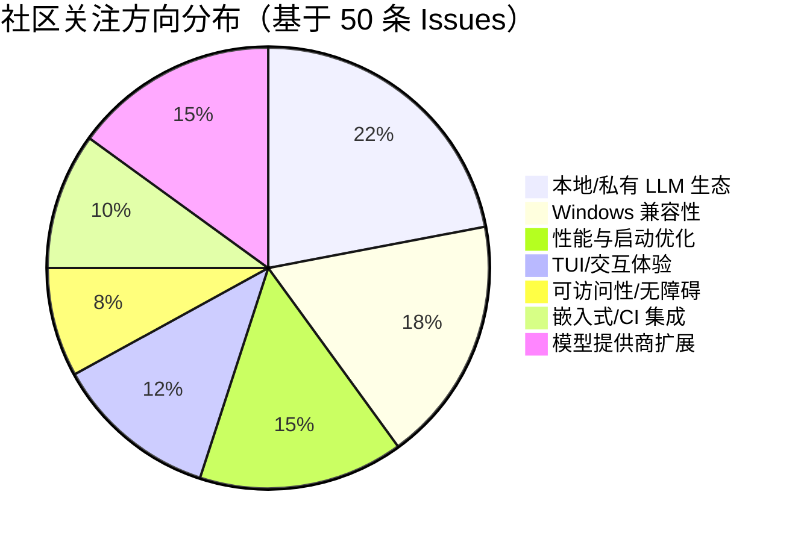

# AI CLI 工具社区动态日报 2026-05-19

> 生成时间: 2026-05-19 00:26 UTC | 覆盖工具: 9 个

- [Claude Code](https://github.com/anthropics/claude-code)
- [OpenAI Codex](https://github.com/openai/codex)
- [Gemini CLI](https://github.com/google-gemini/gemini-cli)
- [GitHub Copilot CLI](https://github.com/github/copilot-cli)
- [Kimi Code CLI](https://github.com/MoonshotAI/kimi-cli)
- [OpenCode](https://github.com/anomalyco/opencode)
- [Pi](https://github.com/badlogic/pi-mono)
- [Qwen Code](https://github.com/QwenLM/qwen-code)
- [DeepSeek TUI](https://github.com/Hmbown/DeepSeek-TUI)
- [Claude Code Skills](https://github.com/anthropics/skills)

---

## 横向对比

# AI CLI 工具生态横向对比分析报告 | 2026-05-19

---

## 1. 生态全景

当前 AI CLI 工具生态呈现**"基础设施层趋同、体验层分化"**的格局：所有主流工具均已覆盖 MCP 扩展、多 Agent 编排、TUI 交互三大基座能力，但差异化集中在**可靠性工程**（Claude Code 文档债务 vs. Codex Token 黑洞 vs. Gemini 子代理稳定性）与**开放策略**（Pi 追求极简可嵌入 vs. Qwen 押注 daemon 服务端化 vs. OpenCode 激进拥抱国产模型生态）。社区反馈密度表明，用户已从"功能尝鲜"转向"生产可用"评判，**稳定性、可观测性、跨平台一致性**成为通用门槛。

---

## 2. 各工具活跃度对比

| 工具 | 今日 Issues | 今日 PRs | 版本发布 | 核心动态 |
|:---|---:|---:|:---|:---|
| **Claude Code** | ~10 条热点（50 条活跃池） | 2（1 安全加固 + 1 垃圾） | ❌ 无 | 文档债务集中爆发，`coygeek` 单用户驱动 28 条文档 Issue；支付系统 P0 故障未解 |
| **OpenAI Codex** | ~10 条热点（50+ 活跃池） | 10+ | ✅ rust-v0.131.0 + v0.132.0-alpha.1 | TUI 密集迭代：统一 `@mentions` 默认化、7-PR 线程设置同步栈收尾；Token 消耗黑洞仍是头号痛点（584 评论） |
| **Gemini CLI** | ~10 条热点（50 条活跃池） | 5（单日提交） | ✅ v0.44.0-nightly.20260518 | 安全加固密集（路径遍历、seatbelt、rootless 容器）；Agent 子系统稳定性仍是最大痛点 |
| **GitHub Copilot CLI** | 31 条更新 | 3（质量参差） | ✅ v1.0.49 + v1.0.49-6 | MCP 治理深水区：配置冲突、超时黑洞、命名空间问题集中暴露；`postToolUse` 部分修复 |
| **Kimi Code CLI** | 9 条 | 2 | ❌ 无 | 服务端稳定性危机：K2.6 过载、TPD 限流异常；连接池与内存泄漏获社区贡献修复 |
| **OpenCode** | ~10 条热点（50 条活跃池） | 10 | ✅ v1.15.5 | 测试基建加速偿还（kitlangton 单日 6 PR）；国产模型适配（GLM-5、DeepSeek-V4）密集；剪贴板失效 94 评论悬而未决 |
| **Pi** | 50+ 条活跃 | 10 | ✅ v0.75.2 + v0.75.3（紧急修复） | undici HTTP/2 回退紧急修复；启动性能 21s→3s 优化落地；本地 LLM 动态发现获 Hugging Face CEO 亲自提案 |
| **Qwen Code** | ~10 条热点（33 条活跃池） | 10 | ✅ v0.15.11-nightly | Daemon 模式 v0.16 冲刺：Wave 5 架构重构密集；OOM/内存泄漏成头号稳定性威胁 |
| **DeepSeek TUI** | 22 | 25 | ❌ 无 | 社区贡献爆发：`aboimpinto` 单日 6 PR；Windows 全链路修复（Shell 调度、日志、剪贴板）；搜索工具链瘫痪后紧急接入 Metaso |

> **活跃度排序**（综合 Issues/PRs/评论密度）：DeepSeek TUI > Pi > OpenCode ≈ Qwen Code ≈ OpenAI Codex > Gemini CLI ≈ Claude Code > GitHub Copilot CLI > Kimi Code CLI

---

## 3. 共同关注的功能方向

| 共同方向 | 涉及工具 | 具体诉求 |
|:---|:---|:---|
| **MCP 生态治理** | Codex、Copilot CLI、OpenCode、Gemini | 配置源优先级透明（Copilot #3379）、超时/进度回调完整（OpenCode #28186→#28246）、热重载（Codex #23299）、工具数量天花板（Gemini #24246，>128 即 400） |
| **多 Agent 稳定性** | Gemini、OpenCode、DeepSeek TUI、Qwen Code | 子代理挂起/伪造成功（Gemini #21409/#22323）、并发 Worker 终止（OpenCode #28015）、模型配置缺失（DeepSeek #1768）、任务断点续执（Qwen #4278） |
| **Token/成本控制** | Codex、DeepSeek TUI、Kimi | 后台轮询黑洞（Codex #13733，与历史长度×轮询次数成正比）、缓存命中率低（DeepSeek #1177）、TPD 限流异常（Kimi #2318） |
| **Windows 平台补齐** | Claude Code、Codex、Gemini、Pi、DeepSeek TUI、OpenCode | Shell 调度硬编码（DeepSeek #1779→#1781）、PTY 二进制误报（Gemini #25164）、路径解析陷阱（Pi #4688）、TUI 崩溃（OpenCode #27589） |
| **上下文/内存管理** | Qwen Code、Codex、Kimi、OpenCode | OOM/GC 失败（Qwen #4167/#4276，Node.js 堆 2-4GB 区间失效）、压缩语义失效（Qwen #4098、OpenCode #13838）、内存泄漏（Kimi #2231/#2236） |
| **文档即产品** | Claude Code、Copilot CLI、Gemini | 功能已上线文档未跟进（Claude Code 68% Issue 为文档类）、C# LSP 缺失（Copilot #2204）、WSL 矛盾（Claude #18061） |

---

## 4. 差异化定位分析

| 工具 | 功能侧重 | 目标用户 | 技术路线 |
|:---|:---|:---|:---|
| **Claude Code** | 企业级 Agent 编排、深度 IDE 集成 | 企业团队、专业开发者 | 闭源 + 订阅制；MCP/Skills/Hooks 扩展生态；文档驱动但响应滞后 |
| **OpenAI Codex** | TUI 体验极致化、远程协作 | 全栈开发者、多设备用户 | Rust 核心 + 7-PR 同步架构；Business/Pro 分层订阅；Token 消耗模型争议 |
| **Gemini CLI** | 安全沙箱、容器化执行 | 安全敏感型企业、Google 生态用户 | ADK Agent 框架、seatbelt/macOS 沙箱、rootless 容器；评估基础设施先行 |
| **GitHub Copilot CLI** | 编辑器生态无缝衔接 | GitHub 重度用户、IDE 绑定开发者 | ACP 协议、MCP 深度集成；模型路由"伪智能"暴露架构债务 |
| **Kimi Code CLI** | 国产模型原生优化 | 中文开发者、Moonshot API 用户 | 服务端稳定性短板明显；生态封闭（Cline 白名单 #2322）；连接池/内存问题社区驱动修复 |
| **OpenCode** | 国产模型生态枢纽、私有化部署 | 国内开发者、企业私有化需求 | 多模型适配激进（GLM-5/DeepSeek-V4/Kimi/阿里云）；Electron + TUI 双端；测试基建加速 |
| **Pi** | 极简可嵌入、本地 LLM 原生 | 极客开发者、自托管爱好者 | Node.js 扩展架构、Jiti 加载优化；Hugging Face 生态联动；HTTP 客户端稳定性反复 |
| **Qwen Code** | Daemon 服务端化、IDE 深度集成 | 企业级部署、VS Code 用户 | Node.js + TypeScript；`qwen serve` 架构重构；内存管理 Node.js 原生瓶颈 |
| **DeepSeek TUI** | 终端交互防丢、多 Agent 精细化 | 终端原生用户、成本敏感开发者 | Rust TUI；Windows 全链路修复激进；搜索工具链替代方案（Metaso） |

**关键分化维度**：
- **架构哲学**：服务端化（Qwen daemon）vs. 可嵌入（Pi `--new-session-id`）vs. 终端原生（DeepSeek TUI）
- **开放策略**：生态封闭（Kimi 白名单）vs. 模型中立（OpenCode 10+ 国产模型）vs. 协议开放（MCP 成为事实标准）
- **可靠性路径**：评估驱动（Gemini #24353 76 个行为测试）vs. 社区众包（Claude Code `coygeek` 文档运动）vs. 紧急补丁（Pi 24 小时双版本）

---

## 5. 社区热度与成熟度

| 象限 | 工具 | 特征 |
|:---|:---|:---|
| **🔥 高活跃 + 快速迭代** | DeepSeek TUI、Pi、OpenCode | 单日 25 PRs（DeepSeek）、紧急双版本（Pi）、测试基建 6 PR/日（OpenCode）；社区贡献密度极高，但稳定性债务同步累积 |
| **🔥 高活跃 + 架构重构期** | Qwen Code、OpenAI Codex | v0.16 daemon 冲刺（Qwen）、7-PR 线程同步栈（Codex）；工程化密集但用户可见价值滞后 |
| **😐 中活跃 + 维护模式** | Claude Code、Gemini CLI、GitHub Copilot CLI | 文档债务/支付故障未解（Claude）、Agent 稳定性反复（Gemini）、MCP 治理深水区（Copilot）；官方响应速度低于社区预期 |
| **😴 低活跃 + 稳定性危机** | Kimi Code CLI | 服务端过载、限流异常、生态封闭；PR 仅 2 条且来自同一外部贡献者，官方工程投入明显不足 |

**成熟度警示**：
- **Claude Code**：文档可信度危机（同一功能多文档矛盾）+ 支付系统脆弱性，商业化基础设施拖累核心产品信任
- **Codex**：Token 消耗黑洞 584 评论未解，"Business 订阅反而更贵"的感知损害付费转化
- **Kimi**：模型服务可用性（K2.6 503）与 API 稳定性（TPD 150 万异常值）双重打击，处于**生产可用性危机**

---

## 6. 值得关注的趋势信号

| 趋势信号 | 证据链 | 开发者参考价值 |
|:---|:---|:---|
| **MCP 从"功能有无"进入"治理深水区"** | Copilot 配置源分裂（#3379）、Gemini 工具数量硬限制（#24246）、Codex 插件延迟观测（#22732） | 选型时评估 MCP 实现的**配置透明度、超时完整性、错误可诊断性**，而非仅看"支持 MCP"标签 |
| **"文档即产品"成为竞争分水岭** | Claude Code 68% Issue 为文档类、Copilot C# 文档缺失（#2204）、OpenCode 压缩语义未记录（#13838） | 优先选择**Changelog 与功能同步、配置迁移有指南、进阶用法有官方文档**的工具，降低团队 onboarding 成本 |
| **Windows 从"二等公民"变为"准入门槛"** | 全 9 个工具均有 Windows 相关 Issue/PR；DeepSeek TUI 35% 社区关注、Gemini PTY 误报获社区闭环 | 跨平台团队需验证**Shell 调度策略（非 cmd.exe 硬编码）、PTY 二进制检测、路径规范化**三项基础能力 |
| **内存/上下文管理从隐性债务变为显性瓶颈** | Qwen OOM 集群（Node.js 2-4GB 堆失效）、Kimi 连接泄漏、Codex 后台轮询黑洞 | 长会话/CI 场景需主动测试**内存增长曲线、上下文压缩触发条件、后台进程 Token 消耗** |
| **"防丢"成为终端交互新基准** | DeepSeek TUI Ctrl+C 回滚（#1757→#1764）、滚轮不清空（#1778）、OpenCode 剪贴板 94 评论 | 终端工具选型需关注**输入状态机鲁棒性、取消/恢复语义一致性、草稿持久化** |
| **国产模型适配进入密集迭代期** | OpenCode GLM-5/DeepSeek-V4/Kimi、Qwen 自托管兼容、Pi Xiaomi MiMo | 国内开发者可优先评估**模型生态中立性**工具（OpenCode、Pi），避免单一模型锁定 |
| **Daemon/服务端化架构涌现** | Qwen `qwen serve`（#4175 Wave 5）、Codex 远程 TUI（7-PR 同步栈）、OpenCode `opencode serve` 测试基建 | 预示 AI CLI 从"本地进程"向**"本地客户端 + 远端/本地 daemon"**演进，IDE 集成、多设备同步、CI 嵌入将受益 |

---

> **决策建议**：当前节点，**生产环境推荐**优先考虑 Gemini CLI（安全沙箱成熟）或 Claude Code（功能完整但需容忍文档/支付摩擦）；**技术激进型团队**可关注 Pi（极简可嵌入）或 DeepSeek TUI（社区活跃、Windows 修复激进）；**国内生态** OpenCode 模型覆盖最广但需承受测试基建偿还期的稳定性波动。

---

## 各工具详细报告

<details>
<summary><strong>Claude Code</strong> — <a href="https://github.com/anthropics/claude-code">anthropics/claude-code</a></summary>

## Claude Code Skills 社区热点

> 数据来源: [anthropics/skills](https://github.com/anthropics/skills)

# Claude Code Skills 社区热点报告（截至 2026-05-19）

---

## 1. 热门 Skills 排行（按社区关注度）

| 排名 | Skill | 功能概述 | 状态 | 关键讨论点 |
|:---|:---|:---|:---|:---|
| 1 | **[document-typography](https://github.com/anthropics/skills/pull/514)** | AI 生成文档的排版质量控制：防止孤行、寡行、编号错位等排版问题 | 🟡 Open | 直击 Claude 生成文档的普遍痛点，被认为"影响每一份文档"，但需评估是否应作为独立 skill 或内置到现有文档 skill |
| 2 | **[ODT](https://github.com/anthropics/skills/pull/486)** | OpenDocument 格式（.odt/.ods）的创建、填充、读取及转 HTML | 🟡 Open | 开源标准文档格式支持，与现有 docx/pdf skill 形成互补；社区关注 LibreOffice 生态兼容性 |
| 3 | **[frontend-design](https://github.com/anthropics/skills/pull/210)** | 改进版前端设计 skill，提升指令清晰度与可执行性 | 🟡 Open | 聚焦 skill 工程方法论：如何避免"对人类说教"而"对 Claude 可执行"，是 skill 质量优化的标杆案例 |
| 4 | **[skill-quality-analyzer / skill-security-analyzer](https://github.com/anthropics/skills/pull/83)** | 元 skill：自动评估其他 skill 的质量（结构、文档、示例等五维度）与安全风险 | 🟡 Open | 生态自举工具，解决 skill 数量膨胀后的治理问题；被视作"skill 的 skill" |
| 5 | **[testing-patterns](https://github.com/anthropics/skills/pull/723)** | 全栈测试指南：Testing Trophy 模型、React 组件测试、集成测试、E2E 等 | 🟡 Open | 填补测试领域空白，与现有开发 skill 形成完整 DevOps 闭环 |
| 6 | **[appdeploy](https://github.com/anthropics/skills/pull/360)** | 通过 AppDeploy.ai 直接从 Claude 部署全栈应用到公网 URL | 🟡 Open | "对话即部署"的极致体验，代表 Claude Code 从编码工具向端到端交付平台的演进 |
| 7 | **[sensory](https://github.com/anthropics/skills/pull/806)** | 原生 macOS 自动化：AppleScript 替代截图式 computer use | 🟡 Open | 权限分层设计（Tier 1/2）引发讨论，代表 GUI 自动化从"视觉模拟"向"系统级调用"的范式转变 |
| 8 | **[AURELION](https://github.com/anthropics/skills/pull/444)** | 四件套认知框架：结构化思维模板、顾问模式、代理模式、持久记忆 | 🟡 Open | 知识管理领域的重度框架，争议点在于 skill 粒度是否应拆分为独立模块 |

---

## 2. 社区需求趋势（从 Issues 提炼）

| 趋势方向 | 代表 Issue | 核心诉求 |
|:---|:---|:---|
| **组织级 Skill 治理** | [#228](https://github.com/anthropics/skills/issues/228) | 企业内 skill 共享：从"文件传 Slack + 手动上传"升级为组织级 skill 库或直链分享 |
| **Skill ↔ MCP 融合** | [#16](https://github.com/anthropics/skills/issues/16) | 将 skill 暴露为 MCP 工具，统一 AI 软件 API 协议；算法艺术 skill 应变为 `generateAlgorithmArt({...})` |
| **安全信任边界** | [#492](https://github.com/anthropics/skills/issues/492) | 社区 skill 滥用 `anthropic/` 命名空间冒充官方，需建立签名/验证机制 |
| **企业认证兼容** | [#532](https://github.com/anthropics/skills/issues/532) | skill-creator 的 `ANTHROPIC_API_KEY` 硬依赖阻断 SSO/企业许可证用户 |
| **插件加载精确化** | [#189](https://github.com/anthropics/skills/issues/189), [#1087](https://github.com/anthropics/skills/issues/1087) | `document-skills` 与 `example-skills` 内容重复、插件加载全量而非声明式子集，导致上下文膨胀 |
| **评估基础设施** | [#556](https://github.com/anthropics/skills/issues/556) | `run_eval.py` 的 `claude -p` 零触发率，skill 效果缺乏可量化的 CI/CD 验证 |

---

## 3. 高潜力待合并 Skills（评论活跃 + 近期更新）

| Skill | PR | 潜力评估 | 阻塞风险 |
|:---|:---|:---|:---|
| **document-typography** | [#514](https://github.com/anthropics/skills/pull/514) | ⭐⭐⭐⭐⭐ 通用性强，无外部依赖，解决真实痛点 | 需确认与现有 docx skill 的集成方式而非独立存在 |
| **ODT** | [#486](https://github.com/anthropics/skills/pull/486) | ⭐⭐⭐⭐☆ 政府/学术/开源场景刚需，补全文档格式矩阵 | 维护者需验证 LibreOffice 兼容性测试覆盖 |
| **testing-patterns** | [#723](https://github.com/anthropics/skills/pull/723) | ⭐⭐⭐⭐☆ 开发体验闭环关键拼图，作者持续迭代（4 月更新） | 与现有代码生成 skill 的职责边界需厘清 |
| **sensory** | [#806](https://github.com/anthropics/skills/pull/806) | ⭐⭐⭐⭐☆ macOS 自动化原生方案，性能优于截图方案 | AppleScript 权限模型的用户体验门槛 |
| **ServiceNow** | [#568](https://github.com/anthropics/skills/pull/568) | ⭐⭐⭐☆☆ 企业 ITSM 平台深度覆盖，垂直领域完整度最高 | 覆盖过广（ITSM/ITOM/FSM/SPM/SecOps），可能需拆分 |
| **n8n-builder / n8n-debugger** | [#190](https://github.com/anthropics/skills/pull/190) | ⭐⭐⭐⭐☆ 低代码工作流热门工具，含调试 skill 形成闭环 | 需确认 n8n 版本兼容性策略 |

> **注**：Lubrsy706 的三连修复 PR（[#538](https://github.com/anthropics/skills/pull/538) pdf 大小写、[#539](https://github.com/anthropics/skills/pull/539) YAML 校验、[#541](https://github.com/anthropics/skills/pull/541) DOCX ID 冲突）虽为 bugfix，但反映文档 skill 生产化过程中的工程成熟度提升，预计快速合并。

---

## 4. Skills 生态洞察

> **社区核心诉求：从"个人效率工具"进化为"企业级可治理、可验证、可协作的 AI 基础设施"** —— 组织共享、安全边界、评估体系、身份认证四大短板，正成为 skill 数量爆发后的关键瓶颈。

---

---

# Claude Code 社区动态日报 | 2026-05-19

## 今日速览

今日社区无新版本发布，核心动态集中在 **文档体系补全** 与 **支付/订阅体验** 两大主题。资深社区成员 `coygeek` 持续推动 20+ 项文档缺陷修复，而 Pro→Max 升级支付故障成为用户最高频投诉，累计获 25+ 评论关注。

---

## 社区热点 Issues（精选 10 项）

| 优先级 | Issue | 核心问题 | 社区反应 |
|:---|:---|:---|:---|
| 🔴 **P0** | [#55917](https://github.com/anthropics/claude-code/issues/55917) Pro→Max 支付认证全渠道失败 | 支付系统级故障，影响所有银行卡/支付方式，用户无法完成订阅升级 | **15 评论**，多用户确认复现，标记 `external` 但未获官方修复响应 |
| 🔴 **P0** | [#56281](https://github.com/anthropics/claude-code/issues/56281) Max 5x→20x 升级支付失败 | 高阶订阅档位同样存在支付阻断，支持团队无响应 | **10 评论，5 👍**，企业/重度用户受影响 |
| 🟡 **P1** | [#59481](https://github.com/anthropics/claude-code/issues/59481) Windows 隐身模式图标与系统关闭按钮重叠 | UI 层级缺陷，影响 Windows 用户基础交互 | **9 评论，7 👍**，可视化问题获社区广泛认同 |
| 🟡 **P1** | [#18061](https://github.com/anthropics/claude-code/issues/18061) WSL Chrome 集成文档与 Changelog 矛盾 | 官方文档自相矛盾，用户无法确认 WSL 支持状态 | **7 评论**，长期悬而未决（1 月创建） |
| 🟡 **P1** | [#42309](https://github.com/anthropics/claude-code/issues/42309) `--resume` 提示缓存行为未文档化 | 涉及 MCP 服务器、自定义代理的复杂恢复机制缺乏说明 | **5 评论**，影响开发者高级工作流 |
| 🟡 **P1** | [#29508](https://github.com/anthropics/claude-code/issues/29508) `/copy` 持久化"全量复制"行为未记录 | 交互模式文档遗漏实际已上线的功能 | **5 评论**，用户发现行为与文档不符 |
| 🟢 **P2** | [#28043](https://github.com/anthropics/claude-code/issues/28043) Bash 工具登录 Shell 默认行为变更未说明 | `CLAUDE_BASH_NO_LOGIN` 环境变量及迁移指南缺失 | **4 评论，3 👍**，Shell 环境差异导致脚本兼容性问题 |
| 🟢 **P2** | [#60377](https://github.com/anthropics/claude-code/issues/60377) Routine 运行列表无点击视觉反馈 | Web 端 UI 可发现性缺陷，行级点击无 hover/指针状态 | **2 评论**，新创建即获关注，反映 Web 体验打磨需求 |
| 🟢 **P2** | [#52601](https://github.com/anthropics/claude-code/issues/52601) 设置文档路径未随配置迁移更新 | `~/.claude.json` → `~/.claude/settings.json` 变更未同步 | **4 评论**，导致用户按旧路径操作失败 |
| 🟢 **P2** | [#53068](https://github.com/anthropics/claude-code/issues/53068) Windows 文档仍标注 Git Bash 为必需 | PowerShell 回退机制已上线但文档未更新 | **4 评论**，降低 Windows 用户入门体验 |

---

## 重要 PR 进展（共 2 项，全量展示）

| PR | 内容 | 状态 | 评估 |
|:---|:---|:---|:---|
| [#60280](https://github.com/anthropics/claude-code/pull/60280) | **CI 安全加固**：SHA-pin 剩余 `actions/checkout` 与 `actions/github-script` 引用（6 个工作流），延续 #56784 的供应链安全治理 | `OPEN` | ✅ 生产级安全实践，减少第三方 Action 篡改风险 |
| [#58673](https://github.com/anthropics/claude-code/pull/58673) | 标题为 `s`，无有效描述，疑似测试/误提交 | `OPEN` | ⚠️ 垃圾 PR，需维护者清理 |

---

## 功能需求趋势

基于 50 条活跃 Issue 分析，社区关注呈现 **"文档债务 > 功能请求"** 的显著特征：

```
文档体系完善  ████████████████████████████████████████  68%  (34 项)
支付/订阅体验  ████████                                  14%  (7 项)
UI/UX 打磨     ████                                       8%  (4 项)
IDE 集成       ██                                         4%  (2 项)
安全/基础设施  ██                                         4%  (2 项)
```

**三大趋势方向：**

1. **文档即产品（Docs-as-Product）**
   - 配置迁移（`~/.claude.json` → `~/.claude/settings.json`）、新功能行为（`/copy` 持久化、图片粘贴 `[Image #N]` 芯片）、平台差异（Windows PowerShell 回退、WSL Chrome）均存在 **"功能已上线，文档未跟进"** 的系统性滞后
   - MCP、Hooks、Skills 等扩展生态的进阶用法几乎完全依赖社区摸索

2. **订阅商业化摩擦**
   - 支付认证失败横跨 Pro→Max→Max 20x 全档位，且支持渠道响应缺失，直接影响 ARR 转化

3. **跨平台体验一致性**
   - Windows（图标重叠、Shell 要求）、macOS（Option+点击选择行为）、Web（Routine 交互）的端侧打磨需求密集

---

## 开发者痛点总结

| 痛点类别 | 具体表现 | 影响面 |
|:---|:---|:---|
| **文档可信度危机** | 同一功能多文档矛盾（WSL）、路径变更未同步、已下线功能仍被引用 | 全平台用户，尤其新入门者 |
| **配置黑箱化** | `--resume` 缓存机制、Bash 登录 Shell 行为、模型别名自动迁移等内部逻辑无文档 | 高级用户、CI/CD 场景 |
| **支付系统脆弱性** | 支付失败无错误码、无降级路径、支持响应延迟 | 付费转化漏斗 |
| **扩展生态文档缺口** | MCP 服务器开发（多 block 错误内容、`headersHelper` 变量）、Hooks 并行稳定性警告缺失 | 生态建设者、企业内训 |
| **Web 端可发现性** | Routine、Fullscreen 等新 Web 功能交互暗示不足 | claude.ai/code 用户 |

---

> **分析师注**：`coygeek` 单用户贡献 28/50 条文档 Issue，形成显著的 **"文档众包但官方响应滞后"** 现象——建议 Anthropic 设立文档专项维护者角色或开放社区编辑权限，将当前高成本的 Issue 驱动模式转为更高效的协同编辑模式。

</details>

<details>
<summary><strong>OpenAI Codex</strong> — <a href="https://github.com/openai/codex">openai/codex</a></summary>

# OpenAI Codex 社区动态日报 | 2026-05-19

## 今日速览

今日 Codex 社区围绕 **token 消耗失控** 和 **安全误报阻断工作流** 两大痛点持续发酵，584 评论的"烧钱"议题仍是焦点。同时，TUI 体验迎来密集迭代——统一 `@mentions` 成为默认行为，线程设置同步的 7-PR 技术栈进入收尾阶段。

---

## 版本发布

### rust-v0.131.0
**核心升级：TUI 会话控制全面增强**
- 数据驱动的 service-tier 命令、混合 token 用量展示、权限/审批模式可视化
- 生效的工作区根目录显示、响应式 Markdown 表格
- `@` 提及搜索功能扩展（[#21745](https://github.com/openai/codex/issues/21745), [#21906](https://github.com/openai/codex/issues/21906) 等）

### rust-v0.132.0-alpha.1
早期预览版本，无详细变更说明。

---

## 社区热点 Issues

| # | 状态 | 标题 | 评论 | 👍 | 关键看点 |
|---|------|------|------|-----|---------|
| [#14593](https://github.com/openai/codex/issues/14593) | 🔴 OPEN | **Burning tokens very fast** | 584 | 258 | **社区头号痛点**：Business 订阅用户 token 异常消耗，258 赞显示广泛共鸣，OpenAI 尚未给出根本解决方案 |
| [#3567](https://github.com/openai/codex/issues/3567) | 🟢 CLOSED | Undo does not work (Windows) | 56 | 28 | 历时 8 个月的 Windows 撤销问题终得关闭，Agent 模式编辑后无法撤销是高频踩坑点 |
| [#12564](https://github.com/openai/codex/issues/12564) | 🔴 OPEN | Allow renaming task/thread titles | 53 | 97 | **高赞功能请求**：历史导航体验差，97 赞表明这是生产力瓶颈 |
| [#20552](https://github.com/openai/codex/issues/20552) | 🔴 OPEN | Toggle File Tree 不可靠 (macOS App) | 38 | 14 | 桌面端基础交互缺陷，影响文件浏览工作流 |
| [#13733](https://github.com/openai/codex/issues/13733) | 🔴 OPEN | Background polling wastes tokens | 19 | 17 | **技术债务暴露**：`cargo build` 等后台进程的每次状态轮询都触发完整 API 往返+全量历史，token 消耗与历史长度×轮询次数成正比 |
| [#20741](https://github.com/openai/codex/issues/20741) | 🔴 OPEN | Chat histories disappeared after update | 16 | 7 | 数据丢失恐慌，Pro 用户项目聊天记录蒸发 |
| [#4218](https://github.com/openai/codex/issues/4218) | 🔴 OPEN | Shift+Enter regression sends prompt (macOS) | 15 | 13 | TUI 输入体验退化，#545 历史问题复发 |
| [#23220](https://github.com/openai/codex/issues/23220) | 🟢 CLOSED | False-positive cyber-safety flags block workflows | 5 | 0 | **安全系统误报危机**：付费用户正常 GSM/DevOps 工作被阻断，Trusted Access 也无法解封 |
| [#23340](https://github.com/openai/codex/issues/23340) | 🔴 OPEN | /goal loop produces 34 GB log in one day | 4 | 0 | **极端性能事故**：单次日志行 480KB，链式嵌套 tracing span 导致存储爆炸 |
| [#23193](https://github.com/openai/codex/issues/23193) | 🔴 OPEN | Windows Desktop 更新后旧聊天消失 | 4 | 0 | 数据仍在 SQLite 中但 UI 不显示，迁移逻辑缺陷 |

---

## 重要 PR 进展

| # | 状态 | 标题 | 核心内容 |
|---|------|------|---------|
| [#23299](https://github.com/openai/codex/pull/23299) | 🟡 OPEN | Add plugin reload command | CLI 新增 `codex plugins reload`，支持热重载 MCP 服务器插件，无需重启会话 |
| [#22510](https://github.com/openai/codex/pull/22510) | 🟡 OPEN | [7/7] Sync TUI thread settings | **7-PR 技术栈终章**：远程 TUI 客户端实时同步线程设置变更（模型、计划模式、权限等） |
| [#22509](https://github.com/openai/codex/pull/22509) | 🟡 OPEN | [6/7] Add app-server thread settings API | 为远程客户端提供无 turn 启动的设置更新 API + 广播通知机制 |
| [#22508](https://github.com/openai/codex/pull/22508) | 🟡 OPEN | [5/7] Replace OverrideTurnContext with ThreadSettings | 引入 `Op::ThreadSettings` 队列式设置更新，淘汰遗留 `OverrideTurnContext` |
| [#22732](https://github.com/openai/codex/pull/22732) | 🟡 OPEN | Add detailed plugin and mention latency logs | 插件/提及全链路延迟观测：list/read、远程目录、模糊搜索、弹窗同步，含 JSON-RPC 请求 ID 关联 |
| [#23363](https://github.com/openai/codex/pull/23363) | 🟡 OPEN | TUI: Default to unified mentions | **交互范式迁移**：统一 `@mentions` 成为默认，废弃 file-only 与 tool mention 的分裂逻辑，`mentions_v2` 标志变为兼容空操作 |
| [#21909](https://github.com/openai/codex/pull/21909) | 🟡 OPEN | Honor model catalog default service tiers | 后端驱动默认 service tier（如 `priority`），移除客户端本地账户计划启发式逻辑 |
| [#23372](https://github.com/openai/codex/pull/23372) | 🟡 OPEN | Split plugin install discovery | 插件安装拆分为 `list_available_plugins_to_install`（清单）与 `request_plugin_install`（执行），降低 prompt 负载 |
| [#23357](https://github.com/openai/codex/pull/23357) | 🟡 OPEN | Support local refs and defs in tool input schemas | 连接器工具 schema 支持 JSON Schema 本地 `$ref` 引用，避免大型嵌套结构重复 |
| [#23362](https://github.com/openai/codex/pull/23362) | 🟡 OPEN | Remove truncation line-count headers | 统一截断工具输出的模型可见格式，消除 shell/unified exec/code-mode 的元数据表示分歧 |

---

## 功能需求趋势

```
🔥 高频方向（按 Issues 密度排序）
├── 历史/会话管理  ████████████████████  搜索、重命名、防丢失、跨设备同步
├── Token/成本控制  ██████████████████    后台轮询、长会话、/goal 循环消耗
├── 安全/审批策略   ████████████████      误报率、Gov/GSM 场景豁免、Trusted Access 失效
├── 移动端/远程控制  ██████████████        Windows 支持、配对状态机、撤销后重连
├── TUI/输入体验    ████████████          Shift+Enter、mentions、/recap 等 CLI 范式
├── 性能可观测性    ██████████            日志爆炸、上下文压缩遥测、Compaction 健康度
└── 沙箱/执行环境   ████████              MPS 支持、workspace 边界、权限逃逸
```

---

## 开发者关注点

### 🔴 阻塞性痛点

| 问题 | 影响面 | 典型场景 |
|------|--------|---------|
| **Token 消耗黑洞** | 全平台 | 后台进程轮询、长历史会话、Agent 模式自动重试，Business/Pro 用户账单失控 |
| **安全误报"连坐"** | CLI + 企业用户 | 正常 GSM、DevOps、Android 内核开发被标记为网络安全风险，Trusted Access 形同虚设 |
| **更新即丢数据** | Desktop App | 版本升级后 SQLite 数据存在但 UI 不可见，无官方迁移工具 |

### 🟡 体验摩擦

- **Windows 二等公民**：移动端远程控制仅支持 macOS，SSH 远程项目场景被排除
- **上下文黑盒**：长会话中模型何时压缩、丢弃了哪些内容，用户零感知（[#22220](https://github.com/openai/codex/issues/22220) 呼吁 Compaction Telemetry）
- **TUI 范式差距**：Claude Code 的 `/recap`、`/btw` 等会话导航命令，Codex 社区持续呼吁对标

### 🟢 积极信号

- **线程设置同步 7-PR 栈**：etraut-openai 主导的架构清理接近尾声，为多人协作/多客户端场景铺路
- **统一 mentions 落地**：减少文件搜索与工具调用的认知分裂，TUI 一致性提升
- **插件系统工程化**：reload、latency 观测、install 拆分，MCP 生态基础设施成熟中

</details>

<details>
<summary><strong>Gemini CLI</strong> — <a href="https://github.com/google-gemini/gemini-cli">google-gemini/gemini-cli</a></summary>

# Gemini CLI 社区动态日报 | 2026-05-19

---

## 1. 今日速览

今日 Gemini CLI 社区活跃度显著，**v0.44.0-nightly.20260518** 夜间版发布，新增 ADK Agent Session Subagent 启用标志；同时 **5 个新 PR 在 5 月 18 日提交**，聚焦安全加固（路径遍历防护）、模型策略扩展（gemini-2.5-flash-lite 回退链）及容器沙箱优化。**Agent 子系统稳定性**仍是社区最集中的痛点，多个高优先级 Issue 持续追踪子代理挂起、恢复失败及工具调用策略问题。

---

## 2. 版本发布

### v0.44.0-nightly.20260518.g5611ff40e
| 属性 | 内容 |
|:---|:---|
| 发布时间 | 2026-05-18 |
| 核心变更 | 新增 `adk.agentSessionSubagentEnabled` 功能标志 |
| 贡献者 | @adamfweidman |

**更新详情**：该标志允许开发者显式控制 ADK（Agent Development Kit）会话中子代理的启用状态，为细粒度 Agent 编排提供配置入口。[→ 查看完整 Changelog](https://github.com/google-gemini/gemini-cli/compare/v0.44.0-nightly.20260517.g77e65c0db...v0.44.0-nightly.20260518.g5611ff40e)

---

## 3. 社区热点 Issues（Top 10）

| # | Issue | 优先级 | 核心问题 | 社区反应 | 链接 |
|:---|:---|:---|:---|:---|:---|
| **#21409** | Generalist agent hangs | P1 | **子代理无限挂起**：通用代理（generalist）在简单任务（如文件夹创建）上永久阻塞，禁用子代理可规避 | 🔥 高关注（7👍），用户被迫关闭子代理功能 | [链接](https://github.com/google-gemini/gemini-cli/issues/21409) |
| **#22745** | AST-aware file reads/search/mapping | P2 | **代码智能增强**：评估 AST 感知工具对文件读取、搜索和代码库映射的价值，减少误读和 Token 浪费 | 7 评论，架构级探索，关联 #22746、#22747 | [链接](https://github.com/google-gemini/gemini-cli/issues/22745) |
| **#22323** | Subagent 恢复后误报 GOAL success | P1 | **状态掩盖严重 Bug**：`codebase_investigator` 达 MAX_TURNS 上限后仍返回 "success"，隐藏中断事实 | 6 评论，影响调试可信度 | [链接](https://github.com/google-gemini/gemini-cli/issues/22323) |
| **#24353** | Robust component level evaluations | P1 | **评估基础设施**：76 个行为评估测试的可靠性提升，6 个 Gemini 模型版本持续运行 | 6 评论，质量工程核心工作 | [链接](https://github.com/google-gemini/gemini-cli/issues/24353) |
| **#21968** | Gemini 不主动使用 skills 和 sub-agents | P2 | **Agent 自主性缺陷**：模型即使面对高度相关任务也不调用自定义技能和子代理，需显式指令 | 6 评论，开发者体验痛点 | [链接](https://github.com/google-gemini/gemini-cli/issues/21968) |
| **#25164** | [Windows] run_shell_command 空输出 | P1 | **Windows PTY 二进制检测误报**：`isBinary()` 对 null byte 过度敏感，导致 shell 输出被截断 | ✅ **已关闭**，社区贡献 2 个修复 PR（#26565、#25191） | [链接](https://github.com/google-gemini/gemini-cli/issues/25164) |
| **#25166** | Shell 命令完成后 stuck "Waiting input" | P1 | **交互状态机 Bug**：简单命令执行后 UI 仍显示"等待输入"，命令实际已完成 | 3👍，高频复现 | [链接](https://github.com/google-gemini/gemini-cli/issues/25166) |
| **#21983** | Browser subagent Wayland 失败 | P1 | **Linux 显示协议兼容性**：浏览器子代理在 Wayland 会话下崩溃 | 4 评论，Linux 桌面用户受阻 | [链接](https://github.com/google-gemini/gemini-cli/issues/21983) |
| **#26525** | Auto Memory 日志泄露与确定性脱敏 | P2 | **安全合规**：Auto Memory 在内容进入模型上下文后才脱敏，且服务侧可能记录技能数据 | 安全红线问题，2 评论 | [链接](https://github.com/google-gemini/gemini-cli/issues/26525) |
| **#24246** | >128 tools 触发 400 错误 | P2 | **工具数量硬限制**：工具超过 128 个时 API 报错，需智能作用域限制 | 2 评论，大规模项目阻塞 | [链接](https://github.com/google-gemini/gemini-cli/issues/24246) |

---

## 4. 重要 PR 进展（Top 10）

| # | PR | 状态 | 功能/修复内容 | 链接 |
|:---|:---|:---|:---|:---|
| **#27238** | 添加 gemini-2.5-flash-lite 至默认回退链 | 🆕 Open | **免费层用户体验**：当 Pro/Flash 配额耗尽时，免费用户可回退至 flash-lite，避免服务中断 | [链接](https://github.com/google-gemini/gemini-cli/pull/27238) |
| **#27237** | macOS seatbelt 配置文件具体化显示 | 🆕 Open | **安全透明度**：沙箱页脚从泛化"当前进程"改为显示具体 seatbelt 配置文件名 | [链接](https://github.com/google-gemini/gemini-cli/pull/27237) |
| **#27234** | 自定义命令文件注入路径遍历防护 | 🆕 Open | **安全加固**：`@{...}` 语法严格限制在工作区边界内，防止本地文件越权访问 | [链接](https://github.com/google-gemini/gemini-cli/pull/27234) |
| **#27235** | rootless 容器禁用 hostname 设置 | 🆕 Open | **容器兼容性**：新增 `setHostname` 配置，解决 rootless Docker/Podman 中 `--hostname` 参数冲突 | [链接](https://github.com/google-gemini/gemini-cli/pull/27235) |
| **#27232** | 确保最后一条消息被处理 | 🆕 Open | **上下文修复**：解决消息队列末尾消息丢失问题（Fixes #27231） | [链接](https://github.com/google-gemini/gemini-cli/pull/27232) |
| **#26565** | Windows PTY `isBinary()` 误报修复 | ✅ Closed | **Windows 核心修复**：将单 null byte 检测改为更鲁棒的多字节模式，解决 shell 输出为空 | [链接](https://github.com/google-gemini/gemini-cli/pull/26565) |
| **#27073** | A2A server 默认策略加载 | Open | **安全 parity**：A2A 服务器自动继承 CLI 的只读等默认安全策略 | [链接](https://github.com/google-gemini/gemini-cli/pull/27073) |
| **#27145** | ESM bundle 保留 proxy-agent 命名导出 | Open | **网络代理修复**：防止 `gaxios` 懒加载 `https-proxy-agent` 时 `undefined` 导致构造函数错误 | [链接](https://github.com/google-gemini/gemini-cli/pull/27145) |
| **#27050** | React Hooks 规则修复 + 后台任务清理 | Open | **稳定性**：修复 `AppContainer` 条件 Hook 调用，消除内存泄漏和渲染异常 | [链接](https://github.com/google-gemini/gemini-cli/pull/27050) |
| **#27228** | MCP 工具可空数组类型正确处理 | 🆕 Open | **MCP 兼容性**：修复 nullable array 类型在工具参数中的序列化问题 | [链接](https://github.com/google-gemini/gemini-cli/pull/27228) |

---

## 5. 功能需求趋势

基于 50 个活跃 Issue 分析，社区关注方向呈 **"稳定性优先，智能化跟进"** 特征：

| 趋势方向 | 代表 Issue | 热度 |
|:---|:---|:---|
| **🔧 Agent 子系统可靠性** | #21409（挂起）、#22323（误报成功）、#21968（不调用技能） | ⭐⭐⭐⭐⭐ |
| **🖥️ Windows 平台体验** | #25164（空输出）、#25166（等待输入）、#25102（UTF-8） | ⭐⭐⭐⭐⭐ |
| **🧠 代码智能/AST 感知** | #22745、#22746、#22747 | ⭐⭐⭐⭐☆ |
| **🔒 安全与隐私合规** | #26525（脱敏）、#27234（路径遍历）、#26523（补丁隔离） | ⭐⭐⭐⭐☆ |
| **🧪 评估与质量基础设施** | #24353（组件评估）、#23313（steering eval） | ⭐⭐⭐⭐☆ |
| **🌐 浏览器/图形环境兼容** | #21983（Wayland）、#22267（配置覆盖） | ⭐⭐⭐☆☆ |
| **⚡ 终端性能与渲染** | #21924（resize 无闪烁）、#24935（编辑器退出刷新） | ⭐⭐⭐☆☆ |

> **关键洞察**：AST 感知工具链（tilth/glyph/ast-grep）被团队明确列为代码库调查器的潜在升级路径，可能在未来版本替代基于文本的粗糙文件读取。

---

## 6. 开发者关注点

### 🔴 高频痛点

| 痛点 | 具体表现 | 影响范围 |
|:---|:---|:---|
| **子代理"黑箱"行为** | 挂起无超时、MAX_TURNS 后伪造成功、不主动调用技能 | 所有使用 Agent 模式的开发者 |
| **Windows 二等公民体验** | PTY 输出截断、编码问题、剪贴板集成缺失 | Windows 主力用户群 |
| **工具数量天花板** | >128 tools 直接 400 错误，无智能裁剪 | 大型单体仓库用户 |

### 🟡 新兴诉求

- **后台化本地 Agent**（#22741）：`Ctrl+B` 将非阻塞子代理（如构建、探索）送入后台，释放主会话
- **Agent 自我认知**（#21432）：准确回答自身 CLI flags、热键、执行方式，成为"自文档化"工具
- **破坏性操作防护**（#22672）：`git reset --force` 等危险命令的劝阻或确认机制

### 🟢 积极信号

- **社区修复活跃**：Windows PTY 问题由外部贡献者闭环（#26565、#25191）
- **安全响应迅速**：5 月 18 日单日提交 3 个安全相关 PR（路径遍历、策略同步、日志脱敏）
- **模型策略灵活化**：flash-lite 回退链体现对免费 tier 的持续关注

---

*日报基于 google-gemini/gemini-cli 公开 GitHub 数据生成 | 数据截止: 2026-05-18 UTC*

</details>

<details>
<summary><strong>GitHub Copilot CLI</strong> — <a href="https://github.com/github/copilot-cli">github/copilot-cli</a></summary>

# GitHub Copilot CLI 社区动态日报 | 2026-05-19

---

## 1. 今日速览

Copilot CLI 今日发布 **v1.0.49** 稳定版，重点修复了 `postToolUse` hook 的上下文注入问题（此前被静默丢弃）以及 CJK/emoji 宽字符下的鼠标定位问题，同时新增 `/chronicle search` 子命令支持会话内容搜索。社区 Issues 活跃度极高，31 条更新中 MCP 配置管理、模型选择对齐、会话状态一致性成为开发者反馈最集中的痛点。

---

## 2. 版本发布

### v1.0.49（稳定版）| 2026-05-18
🔗 [github/copilot-cli/releases](https://github.com/github/copilot-cli/releases)

| 更新项 | 说明 |
|--------|------|
| `postToolUse` hook 修复 | `additionalContext` 现作为 system message 注入模型，不再被静默丢弃——直接回应了 Issue #2980 的核心诉求 |
| 宽字符鼠标定位 | 修复 CJK 字符、emoji 场景下鼠标点击光标位置偏移问题 |
| `/chronicle search` | 新增子命令，支持搜索所有会话内容，提升历史记录可检索性 |

### v1.0.49-6（预发布）
同期发布的预发布版本，供早期体验者测试上述变更。

---

## 3. 社区热点 Issues（精选 10 条）

| # | 状态 | 标题 | 核心看点 | 社区反应 |
|---|:--:|------|---------|---------|
| **#1044** | 🔵 OPEN | [非交互模式支持 slash 命令](https://github.com/github/copilot-cli/issues/1044) | ACP（Agent Communication Protocol）前端无法获取 `available_commands_update`，导致 Zed 等 IDE 集成的 Custom Agent 无法使用 `/` 命令——**阻断第三方编辑器生态扩展** | 14 评论，长期未解，影响编辑器集成深度 |
| **#2204** | 🔵 OPEN | [C# LSP 安装文档缺失](https://github.com/github/copilot-cli/issues/2204) | 官方文档缺少 C# 语言服务器的推荐方案与配置指南，.NET 开发者 onboarding 成本高 | 6 评论，7 👍，文档债典型代表 |
| **#2695** | 🔵 OPEN | [自定义 Agent 模型选择不对齐导致 400 错误](https://github.com/github/copilot-cli/issues/2695) | Copilot Cloud Agent 的 `model:` 字段与 CLI 模型选择（含 `auto`）不匹配即崩溃，**"智能"路由反而降低可靠性** | 3 评论，企业级 Agent 部署的关键阻塞 |
| **#2980** | 🔵 OPEN | [`postToolUse` hook 上下文丢失](https://github.com/github/copilot-cli/issues/2980) | 插件开发者通过 hook 返回的 `additionalContext` 未被注入 Agent 上下文窗口——**v1.0.49 仅部分修复，Issue 仍 Open 说明可能未完全解决** | 2 评论，2 👍，插件生态核心痛点 |
| **#3380** | 🔵 OPEN | [添加 `--disable-repo-mcps` 标志](https://github.com/github/copilot-cli/issues/3380) | 仓库级 MCP 配置无法一键跳过，安全审计/敏感场景下开发者被迫逐个 `--disable-mcp-server` | 1 评论，DevSecOps 高频需求 |
| **#3379** | 🔵 OPEN | [MCP 命名冲突：UI 与运行时配置源不一致](https://github.com/github/copilot-cli/issues/3379) | 同名 MCP 在用户级与仓库级配置并存时，**显示用用户配置、运行用仓库配置**——静默行为差异极具误导性 | 1 评论，配置系统的设计缺陷 |
| **#3371** | 🔵 OPEN | [HTTPS 套接字静默挂起无超时](https://github.com/github/copilot-cli/issues/3371) | `api.github.com` 连接 stalled 时 CLI 无超时、无日志、无事件输出，**TUI 冻结且无法诊断**——生产环境致命 | 1 评论，可靠性红线问题 |
| **#3366** | 🔵 OPEN | [孤儿 `tool_use` 永久楔死会话](https://github.com/github/copilot-cli/issues/3366) | `events.jsonl` 中 tool_use 与 execution_complete 不匹配导致会话无法恢复，**写端+读端双重故障** | 1 评论，数据一致性核心 bug |
| **#3340** | 🔴 CLOSED | [输入框高度异常](https://github.com/github/copilot-cli/issues/3340) | 最新更新后输入框从单行变为多行高度，屏幕空间侵占显著 | 4 评论，快速关闭显示响应及时 |
| **#3381** | 🔴 CLOSED | [请求添加 Claude Opus 4.6](https://github.com/github/copilot-cli/issues/3381) | 个人账户仅开放 Sonnet 级 Claude 模型，复杂多文件工程需求受限 | 2 评论，模型层级策略争议 |

---

## 4. 重要 PR 进展（实际 3 条，全量分析）

| # | 状态 | 标题 | 功能/修复内容 | 评估 |
|---|:--:|------|------------|------|
| **#3373** | 🔵 OPEN | [Create summary.yml](https://github.com/github/copilot-cli/pull/3373) | 作者 `Huynhthuongg` 提交，疑似添加 GitHub Actions 工作流用于生成摘要 | ⚠️ 无描述，可能为测试/垃圾 PR，需维护者审查 |
| **#2970** | 🔴 CLOSED | [Create devcontainer.json](https://github.com/github/copilot-cli/pull/2970) | 同作者提交的开发容器配置，已关闭 | 未合并，可能因重复或规范不符被拒 |
| **#3353** | 🔵 OPEN | [Copilot subscription no longer required](https://github.com/github/copilot-cli/pull/3353) | **重大策略变更暗示**：移除 Copilot 订阅要求？ | 🔥 无描述但标题极具冲击力，若为真将颠覆商业模式；更可能是文档修正或特定场景豁免，需密切关注 |

> **注**：今日有效 PR 仅 3 条，质量参差不齐。#3353 的标题具有高度信息价值，建议追踪其具体变更内容。

---

## 5. 功能需求趋势

基于 31 条 Issues 的聚类分析：

```
┌─────────────────────────────────────────┐
│  🔧 MCP 生态治理（6 条）                 │
│  ── 配置冲突、超时丢失、禁用粒度、命名空间  │
├─────────────────────────────────────────┤
│  🤖 模型策略与对齐（5 条）                │
│  ── Opus 层级开放、模型选择路由、GPT 故障  │
├─────────────────────────────────────────┤
│  💾 会话状态可靠性（5 条）                │
│  ── resume 逻辑、孤儿 tool_use、CWD 事件  │
├─────────────────────────────────────────┤
│  🌐 跨平台/终端兼容（4 条）               │
│  ── FreeBSD 回归、Windows Vim、dumb term │
├─────────────────────────────────────────┤
│  📝 输入与渲染（4 条）                   │
│  ── 宽字符、输入框高度、问号触发帮助       │
├─────────────────────────────────────────┤
│  🔌 编辑器/协议集成（3 条）               │
│  ── ACP slash 命令、Zed 行号格式         │
├─────────────────────────────────────────┤
│  🧠 上下文与记忆（2 条）                  │
│  ── goals.md 长期目标、/memory 跨平台链接 │
└─────────────────────────────────────────┘
```

**核心趋势**：MCP 作为扩展机制已进入"治理深水区"——配置源优先级、超时可靠性、安全管控成为社区最迫切的诉求，远超早期"功能有无"阶段。

---

## 6. 开发者关注点

### 🔴 高频痛点

| 痛点 | 代表 Issue | 本质 |
|------|-----------|------|
| **MCP "配置即代码"的不可预测性** | #3379, #1378, #3380 | 多层配置合并逻辑不透明，运行时与显示态分裂 |
| **会话状态机的脆弱性** | #3366, #3367, #3377 | `events.jsonl` 作为单一事实源缺乏校验与自愈 |
| **网络层可观测性黑洞** | #3371 | 无超时、无日志、无事件的三无场景，调试 impossible |
| **模型路由的"伪智能"** | #2695, #3099 | `auto` 选择策略与 Agent 声明冲突，错误信息无指导价值 |

### 🟡 新兴诉求

- **长期目标持久化**：`.copilot/goals.md` 提案（#3364）反映开发者希望跨会话维护意图，而非依赖每次 prompt 重复上下文
- **终端生态兼容性**：从 Acme（#3372）到 FreeBSD（#3382），CLI 的 TUI 假设与多元终端环境摩擦加剧
- **非 GitHub 仓库的一等公民**：`/memory` 链接硬编码 GitHub URL（#3378），暴露产品仍以内置 GitHub 为隐含前提

---

*日报基于 github.com/github/copilot-cli 公开数据生成，Issues/PR 链接可直接点击追踪最新进展。*

</details>

<details>
<summary><strong>Kimi Code CLI</strong> — <a href="https://github.com/MoonshotAI/kimi-cli">MoonshotAI/kimi-cli</a></summary>

# Kimi Code CLI 社区动态日报 | 2026-05-19

---

## 1. 今日速览

今日社区无新版本发布，但 Issues 活跃度较高，**API 稳定性与模型服务可用性**成为核心痛点——TPD 限流计算异常、K2.6 模型过载等生产级问题持续发酵。同时，开发者对**终端体验定制化**（主题高亮、Git 轮询配置）和**第三方工具生态兼容**（Cline 接入）的需求显著增长。

---

## 2. 版本发布

> 过去 24 小时内无新 Release。

---

## 3. 社区热点 Issues

| 优先级 | Issue | 核心问题 | 社区反应与重要性 |
|:---|:---|:---|:---|
| 🔴 **P0** | [#2077](https://github.com/MoonshotAI/kimi-cli/issues/2077) K2.6 model overloaded – unusable under normal load | 付费会员（Allegretto）遭遇 K2.6 模型持续返回 503/529 过载错误，严重影响生产可用性 | **15 评论，2 👍**，用户明确质疑付费价值；模型服务端容量规划问题，需官方紧急响应 |
| 🔴 **P0** | [#2318](https://github.com/MoonshotAI/kimi-cli/issues/2318) TPD rate limit 计算异常（current: 1,505,241） | 组织级 TPD 限流阈值显示异常数值（超 150 万），疑似计数器 bug 导致正常请求被拦截 | 0 评论但标记为 Critical；直接影响企业/团队用户批量调用场景 |
| 🟡 **P1** | [#778](https://github.com/MoonshotAI/kimi-cli/issues/778) API Error 400: invalid_request_error | 长期悬案（1 月创建），Claude 模型下 Win11/PowerShell 环境稳定复现，17 条评论未获根本解决 | **17 评论**，跨版本持续存在，反映请求体序列化或平台兼容性的深层问题 |
| 🟡 **P1** | [#2314](https://github.com/MoonshotAI/kimi-cli/issues/2314) Prompt 执行耗时过长（5 分钟+） | 简单任务（如 NeonDB 数据推送）过度思考，响应延迟严重 | 3 评论；模型推理策略或工具链调用效率问题，影响日常开发体验 |
| 🟡 **P1** | [#1458](https://github.com/MoonshotAI/kimi-cli/issues/1458) VS Code Connection error -32003 | MCP/LS 协议层连接中断，kimi-for-coding 模型下稳定复现 | 2 评论；IDE 集成稳定性问题，阻碍 VS Code 用户 adoption |
| 🟢 **P2** | [#2322](https://github.com/MoonshotAI/kimi-cli/issues/2322) 请求将 Cline 加入白名单 | Cline（VS Code 扩展）调用 kimi-for-coding 返回 403 access_terminated_error | 新提交；生态开放度诉求，直接影响第三方 AI 编码工具互操作性 |
| 🟢 **P2** | [#2321](https://github.com/MoonshotAI/kimi-cli/issues/2321) 可配置 Git 轮询间隔（monorepo 场景） | 硬编码 `_GIT_BRANCH_TTL`/`_GIT_STATUS_TTL` 导致大型 monorepo 性能损耗 | 新提交；企业级工程实践适配，用户已提供源码级 workaround |
| 🟢 **P2** | [#2319](https://github.com/MoonshotAI/kimi-cli/issues/2319) macOS zsh 弃用青蓝色高亮 | 固定代码高亮主题在浅色终端下可读性差，用户被迫修改源码 | 新提交；无障碍/可访问性诉求，配置化不足的典型表现 |
| 🟢 **P2** | [#2320](https://github.com/MoonshotAI/kimi-cli/issues/2320) ✨ emoji 引发解析错误 | 特定 Unicode 字符导致终端渲染或协议层异常 | 新提交；国际化/字符编码边缘 case，可能波及多语言用户 |
| ⚪ **P3** | — | （今日 9 条 Issues 已全部覆盖） | — |

---

## 4. 重要 PR 进展

| PR | 作者 | 功能/修复内容 | 技术价值 |
|:---|:---|:---|:---|
| [#2231](https://github.com/MoonshotAI/kimi-cli/pull/2231) | ekhodzitsky | **修复 aiohttp TCPConnector 泄漏**：每次 `new_client_session()` 重复创建 connector，导致连接无法复用、FD 压力及延迟损耗 | 高并发场景下的核心性能优化，减少 TCP 握手开销，提升工具链调用效率 |
| [#2236](https://github.com/MoonshotAI/kimi-cli/pull/2236) | ekhodzitsky | **双维度内存泄漏修复**：(1) BroadcastQueue 无界队列 → 有界队列防 OOM；(2) Web store 全量 session 缓存 → 上限控制 | 长会话/高负载稳定性关键修复，直接解决生产环境内存膨胀风险 |

> 注：今日仅 2 条 PR 更新，均来自同一贡献者 **ekhodzitsky**，聚焦连接池与内存管理的基础设施加固，代码质量值得关注。

---

## 5. 功能需求趋势

基于今日 Issues 提炼的社区关注方向：

| 趋势方向 | 代表 Issue | 需求强度 |
|:---|:---|:---:|
| **模型服务稳定性** | #2077, #2318, #2314 | ⭐⭐⭐⭐⭐ |
| **终端可配置性**（主题/颜色/Git 轮询） | #2319, #2321 | ⭐⭐⭐⭐☆ |
| **第三方 IDE/Agent 生态兼容** | #2322, #1458 | ⭐⭐⭐⭐☆ |
| **API 错误诊断与降级** | #778, #2320 | ⭐⭐⭐☆☆ |
| **企业级限流/配额管理** | #2318 | ⭐⭐⭐☆☆ |

**关键洞察**：社区正从"功能尝鲜"转向"生产可用"诉求——模型过载、限流异常、连接泄漏等问题表明用户已将 Kimi CLI 纳入日常开发工作流，对 SLA 和可观测性要求显著提升。

---

## 6. 开发者关注点

| 痛点类别 | 具体表现 | 高频度 |
|:---|:---|:---:|
| **🚨 服务可用性焦虑** | K2.6 过载、TPD 误限流、API 400 错误持续未解 | 极高 |
| **⚙️ 配置僵化** | 主题/高亮/Git 轮询等关键参数硬编码，需改源码 workaround | 高 |
| **🔌 生态封闭性** | Cline 等主流工具被 403 拦截，白名单机制阻碍互操作 | 高 |
| **🐢 响应延迟** | 简单任务过度思考，无明确进度反馈 | 中 |
| **🧠 错误信息模糊** | `invalid_request_error`、`-32003` 等缺乏 actionable 上下文 | 中 |

**建议官方优先动作**：
1. 针对 K2.6 过载与 TPD 计数发布 incident response 或降级策略说明
2. 将 #2319/#2321 类配置化需求纳入标准化配置体系（`~/.kimi/config.toml`）
3. 明确第三方 Agent 接入的开放路线图

---

*日报生成时间：2026-05-19 | 数据来源：MoonshotAI/kimi-cli GitHub 仓库*

</details>

<details>
<summary><strong>OpenCode</strong> — <a href="https://github.com/anomalyco/opencode">anomalyco/opencode</a></summary>

# OpenCode 社区动态日报 | 2026-05-19

## 今日速览

OpenCode 今日发布 v1.15.5 版本，重点优化了原生 OpenAI 运行时路径预览和交互式会话历史回放功能。社区方面，剪贴板复制失效（#4283）持续成为最高关注议题，同时 TUI 在 Alpine Linux 上的兼容性问题（#27589）和多个子代理并发崩溃（#28015）引发开发者集中讨论。PR 侧聚焦测试基础设施升级与多模型支持扩展。

---

## 版本发布

### v1.15.5

| 类别 | 内容 |
|:---|:---|
| **实验性功能** | 原生 OpenAI 运行时路径预览（需开启实验 flag） |
| **CLI 增强** | 新增 `--replay` 和 `--replay-limit` 参数，恢复交互式运行时可查看近期历史 |
| **Bug 修复** | 修复插件工具使用 `ask` 时工具调用无法正确完成的问题；减少 `/event` 更新丢失 |

> 🔗 [Release 详情](https://github.com/anomalyco/opencode/releases/tag/v1.15.5)

---

## 社区热点 Issues

| # | 议题 | 状态 | 评论 | 👍 | 核心看点 |
|:---|:---|:---|---:|---:|:---|
| [#4283](https://github.com/anomalyco/opencode/issues/4283) | 剪贴板复制功能失效 | 🔴 OPEN | 94 | 84 | **社区最高优先级**。跨平台文本选择复制异常，影响基础交互体验，用户覆盖 Windows/macOS/Linux 多平台，版本跨度从 1.0.62 延续至今 |
| [#27589](https://github.com/anomalyco/opencode/issues/27589) | Alpine Linux (musl) TUI 崩溃：getcontext 符号未找到 | 🔴 OPEN | 20 | 6 | **回归性严重兼容问题**。v1.14.48→v1.14.50 引入，musl libc 不支持 `getcontext`，阻断容器/嵌入式场景部署 |
| [#13838](https://github.com/anomalyco/opencode/issues/13838) | 压缩回话注入伪造用户消息导致非预期摘要生成 | 🔴 OPEN | 14 | 3 | 架构设计争议。`/compact` 自动注入 `"What did we do so far?"` 被模型视为真实请求，干扰工作流连续性，需重新设计会话恢复语义 |
| [#8463](https://github.com/anomalyco/opencode/issues/8463) | 请求 `--dangerously-skip-permissions`（YOLO 模式） | 🔴 OPEN | 13 | 55 | **高票功能请求**。CI/CD 和自动化场景刚需，权限中断破坏流水线，社区呼吁区分"交互模式"与"无人值守模式" |
| [#13537](https://github.com/anomalyco/opencode/issues/13537) | 新增 Open WebUI 作为 Provider | 🔴 OPEN | 13 | 16 | 生态集成诉求。Open WebUI 作为主流自托管方案，其 OpenAI 兼容端点需官方适配，降低私有化部署门槛 |
| [#6523](https://github.com/anomalyco/opencode/issues/6523) | 重复创建相同临时文件且未清理 | 🔴 OPEN | 9 | 5 | 资源泄漏问题。`opencode stats` 每次运行生成 ~4.1MB `*.so` 文件堆积于 `/tmp`，长期运行存在磁盘耗尽风险 |
| [#27897](https://github.com/anomalyco/opencode/issues/27897) | TUI 流式输出代码块时闪烁/刷新 | 🔴 OPEN | 8 | 0 | 渲染性能回归。fenced code blocks 的增量渲染导致终端视觉抖动，影响代码阅读体验 |
| [#27902](https://github.com/anomalyco/opencode/issues/27902) | kimi-for-coding 因缺失 User-Agent 遭 429 限流 | 🔴 OPEN | 7 | 9 | 上游兼容性。`@ai-sdk/anthropic` 默认 UA 被 Kimi 网关拦截，需允许自定义请求头 |
| [#28015](https://github.com/anomalyco/opencode/issues/28015) | 多子代理并发运行触发 Worker terminated | 🔴 OPEN | 6 | 0 | **多代理架构稳定性**。会话切换机制在并发场景下崩溃，阻断复杂任务编排 |
| [#28129](https://github.com/anomalyco/opencode/issues/28129) | OpenCode Go 11/12 模型因余额不足静默失败 | 🔴 OPEN | 4 | 0 | 服务可用性危机。订阅账户 0% 使用率却触发"Insufficient balance"，仅 `minimax-m2.7` 可用，破坏多代理编排 |

---

## 重要 PR 进展

| # | PR | 作者 | 状态 | 核心内容 |
|:---|:---|:---|:---|:---|
| [#28246](https://github.com/anomalyco/opencode/pull/28246) | MCP `onprogress` 回调传递修复 | chrislazar25 | 🟡 OPEN | 解决 [#28186](https://github.com/anomalyco/opencode/issues/28186)：长时 MCP 工具因缺少 `progressToken` 超时，通过传递 `onprogress` 启用 `resetTimeoutOnProgress` |
| [#28264](https://github.com/anomalyco/opencode/pull/28264) | AWS Bedrock GLM-5 推理支持 | lopince | 🟡 OPEN | 新增 `additionalModelRequestFields.reasoning_config` 控制（low/medium/high），补齐国产大模型在云端推理能力 |
| [#28263](https://github.com/anomalyco/opencode/pull/28263) | `opencode serve` 子进程集成测试 | kitlangton | 🟡 OPEN | 测试基建：首个长生命周期 CLI 进程 harness，支持动态端口捕获与测试生命周期管理 |
| [#28258](https://github.com/anomalyco/opencode/pull/28258) | TUI 生命周期场景测试准备 | kommander | 🟡 OPEN | 架构重构：将 OpenTUI renderer 创建外移至命令启动路径，注入式依赖使 E2E 场景测试成为可能 |
| [#28262](https://github.com/anomalyco/opencode/pull/28262) | 按 usage window 计算 stats | Hona | 🟡 OPEN | 修复 `stats --days` 语义：按事件窗口聚合 step-finish parts 而非全会话更新，对齐控制台用量统计 |
| [#28255](https://github.com/anomalyco/opencode/pull/28255) | TUI 提示区响应式尺寸 | bjschafer | 🟡 OPEN | 解决 [#14670](https://github.com/anomalyco/opencode/issues/14670)：提示区从固定 6 行改为随终端尺寸动态扩展，提升大屏编辑体验 |
| [#28247](https://github.com/anomalyco/opencode/pull/28247) | 桌面端窗口恢复白屏修复 | Hona | 🟡 OPEN | 预置原生 BrowserWindow 背景色，同步 OC-2 主题解析器，消除 Electron 窗口恢复时的白色闪烁 |
| [#28254](https://github.com/anomalyco/opencode/pull/28254) | Windows 目录选择反斜杠规范化 | jcompagner | 🟡 OPEN | 修复 [#28252](https://github.com/anomalyco/opencode/issues/28252)：粘贴含反斜杠路径时的对话框输入处理 |
| [#26653](https://github.com/anomalyco/opencode/pull/26653) | DeepSeek-V4 非思考模式变体 | martinmr | 🟡 OPEN | 新增 `"none"` 变体关闭过度思考，针对代码生成等需直接输出的场景优化 |
| [#28260](https://github.com/anomalyco/opencode/pull/28260) | v2 认证服务重命名为 Account | thdxr | 🟡 OPEN | 内部架构调整：AuthV2 → AccountV2，新增 update/remove/activate 插件钩子，支持取消操作 |

---

## 功能需求趋势

基于 50 条活跃 Issue 分析，社区关注聚焦五大方向：

| 方向 | 代表议题 | 紧迫度 |
|:---|:---|:---:|
| **TUI/终端体验优化** | #4283 剪贴板、#27897 代码块闪烁、#27910 会话切换闪白、#28255 提示区尺寸 | ⭐⭐⭐⭐⭐ |
| **自动化/CI 集成** | #8463 YOLO 模式、#13838 压缩语义、#28015 多代理并发 | ⭐⭐⭐⭐⭐ |
| **模型生态扩展** | #13537 Open WebUI、#27692 阿里云上下文缓存、#28264 GLM-5、#26653 DeepSeek-V4 | ⭐⭐⭐⭐☆ |
| **跨平台兼容性** | #27589 Alpine/musl、#26587 SmartScreen、#28254 Windows 路径 | ⭐⭐⭐⭐☆ |
| **订阅/计费透明度** | #26508 ZEN 支付误导、#28129 余额不足误报、#28166 免费模型限制 | ⭐⭐⭐☆☆ |

---

## 开发者关注点

### 🔴 高频痛点

1. **基础交互可靠性危机**
   - 剪贴板复制（#4283，94 评论）作为最基础功能长期未修复，严重损害工具可信度
   - 权限确认 Enter 键失效（#27875）、`/undo` 历史边界问题（#28257）等输入层 bug 密集

2. **多代理架构稳定性**
   - Worker 终止（#28015）、子代理会话切换崩溃、11/12 模型静默失败（#28129）形成连锁风险
   - 复杂任务编排场景下，"并发=崩溃"成为开发者共识

3. **平台差异化体验割裂**
   - musl/Linux 容器部署阻断、Windows 路径/反斜杠系列问题、macOS 剪贴板行为差异

### 🟡 架构债务信号

- **测试基建加速偿还**：kitlangton 单日提交 6 个 PR 重构配置/进程测试 harness，显示核心团队对质量门禁的紧迫感
- **MCP 协议实现不完整**：`onprogress` 遗漏（#28186→#28246）反映 MCP SDK 集成存在系统性疏漏
- **主题/渲染系统硬编码**：#25102、#28256 等议题暴露 TUI 样式系统的可扩展性不足

### 🟢 积极信号

- **国产模型支持提速**：GLM-5、DeepSeek-V4、Kimi、阿里云等本土生态适配进入密集迭代期
- **服务端能力扩展**：`opencode serve` 测试基建完善预示 headless/Serverless 部署模式即将成熟

---

> 📊 数据截止：2026-05-19 00:00 UTC | 来源：[anomalyco/opencode](https://github.com/anomalyco/opencode)

</details>

<details>
<summary><strong>Pi</strong> — <a href="https://github.com/badlogic/pi-mono">badlogic/pi-mono</a></summary>

# Pi 社区动态日报 | 2026-05-19

## 今日速览

Pi 今日连发 **v0.75.2/v0.75.3** 两个补丁版本，紧急修复 undici HTTP/2 会话竞争导致的 CLI 崩溃及 Bun 编译二进制启动失败问题。社区围绕**本地 LLM 动态发现**、**Windows 路径兼容**和**启动性能优化**展开密集讨论，单日 50+ Issues 活跃度高企。

---

## 版本发布

### [v0.75.3](https://github.com/earendil-works/pi/issues/4681) | 紧急修复
- **核心修复**：回退 undici 8 的 HTTP/2 支持，恢复 HTTP/1.1-only fetch dispatcher，解决 `ERR_HTTP2_INVALID_SESSION` 导致的 Node CLI 崩溃 ([#4681](https://github.com/earendil-works/pi/issues/4681))

### [v0.75.2](https://github.com/earendil-works/pi-mono/pull/4661) | 兼容性修复
- **Bun 二进制修复**：规避 Bun 内置 undici shim 缺少 `install` 导出的问题，修复编译版启动失败 ([#4661](https://github.com/earendil-works/pi-mono/pull/4661) by [@dmasiero](https://github.com/dmasiero))
- **Xiaomi MiMo 元数据**：修复生成模型元数据回放问题

---

## 社区热点 Issues（Top 10）

| # | 状态 | 标题 | 核心看点 |
|---|------|------|---------|
| [#3357](https://github.com/earendil-works/pi/issues/3357) | 🔥 **OPEN** | **Official local LLM provider extension** | 社区呼声最高的功能之一（27👍, 18评论）。要求从 `{baseUrl}/models` 动态拉取模型列表，原生支持 llama.cpp/ollama/LM Studio。Hugging Face CEO [@julien-c](https://github.com/julien-c) 亲自提交，生态意义重大 |
| [#4609](https://github.com/earendil-works/pi/issues/4609) | ❌ CLOSED | Rewrite pi in Rust | 创始人 [@badlogic](https://github.com/badlogic) 亲自关闭的"钓鱼 Issue"，11 评论引发社区对技术栈路线的短暂热议 |
| [#4659](https://github.com/earendil-works/pi/issues/4659) | ✅ CLOSED | Pi freezes using Zen opencode models | 0.75.1 回归 bug：OpenCode Zen 免费模型导致 TUI 卡死、无法取消。反映新模型接入的稳定性挑战 |
| [#4691](https://github.com/earendil-works/pi/issues/4691) | ✅ CLOSED | Default prompt still uses Markdown project context boundaries | #4541 的 XML 边界改进遗漏了默认 prompt 分支，导致上下文注入格式不一致。快速修复体现工程严谨性 |
| [#4704](https://github.com/earendil-works/pi/issues/4704) | 🔄 **IN PROGRESS** | **Optimize coding-agent extension loading (83% startup latency reduction)** | 使用共享 Jiti 实例+原生 dynamic import 替代方案，21s→3s 的优化提案，性能党高度关注 |
| [#4688](https://github.com/earendil-works/pi/issues/4688) | 🔥 **OPEN** | **Windows: Unix-style paths resolve incorrectly** | `/c/tmp` → `C:\c\tmp` 的路径解析 bug，暴露 Node.js `path.isAbsolute()` 跨平台陷阱，Windows 开发者痛点 |
| [#4687](https://github.com/earendil-works/pi/issues/4687) | ✅ CLOSED | Accessibility: Screen Reader Support | TUI 的 ASCII 装饰字符对屏幕阅读器极不友好，关闭但引发无障碍设计讨论 |
| [#4707](https://github.com/earendil-works/pi/issues/4707) | 🔄 **IN PROGRESS** | **Agent hangs in "Working" state during 429 errors** | undici fetch 回归：429 限流+连接断开时无限挂起，与 v0.75.3 的 HTTP/2 修复同源问题 |
| [#4635](https://github.com/earendil-works/pi/issues/4635) | 🔥 **OPEN** | **FR: Add a skill loading tool** | 作者主动承认"触及 Pi 极简主义边界"的功能请求：动态加载/卸载 skill 文件，2👍 但讨论深入 |
| [#4658](https://github.com/earendil-works/pi/issues/4658) | ✅ CLOSED | How are you supposed to uninstall this !? | curl 安装与 npm/homebrew 路径混乱导致卸载困难，用户体验的"最后一公里"问题 |

---

## 重要 PR 进展（Top 10）

| # | 状态 | 标题 | 技术价值 |
|---|------|------|---------|
| [#4724](https://github.com/earendil-works/pi/pull/4724) | 🆕 **OPEN** | **feat(coding-agent): show update notes** | [@mitsuhiko](https://github.com/mitsuhiko) 提交：后端可返回 markdown 更新说明+变更日志 URL，为安全更新通知铺路 |
| [#4702](https://github.com/earendil-works/pi/pull/4702) | ✅ CLOSED | **perf(coding-agent): optimize extension loading** | **21s→3.5s 启动优化落地**：共享 Jiti 实例 + 环境检测绕过，[#4704](https://github.com/earendil-works/pi/issues/4704) 提案的实现 |
| [#4719](https://github.com/earendil-works/pi/pull/4719) | ✅ CLOSED | **fix(openai-codex): clamp prompt_cache_key to 64-char limit** | OpenAI Codex 的 `prompt_cache_key` 超长导致 400 错误，防御性截断处理 |
| [#2527](https://github.com/earendil-works/pi/pull/2527) | 🔄 **OPEN** | **fix(ai): fetch GitHub Copilot context window limits at runtime** | 长期悬案：Copilot API 实际 200K 限制与生成代码中 1M 覆盖值的冲突，运行时动态获取根治方案 |
| [#4709](https://github.com/earendil-works/pi/pull/4709) | ✅ CLOSED | **Updated default prompt to use xml boundaries** | #4691 的配套修复，确保默认/自定义 prompt 的 XML 上下文边界一致性 |
| [#4718](https://github.com/earendil-works/pi/pull/4718) | ✅ CLOSED | **feat(coding-agent): add --new-session-id flag** | 嵌入式场景（CI/IDE/多 Agent 编排）可控会话 UUID，解决 `<timestamp>_<uuid>.jsonl` 文件关联难题 |
| [#4651](https://github.com/earendil-works/pi/pull/4651) | 🔄 **DRAFT** | **feat(coding-agent): fetch portable git bash on windows** | [@mitsuhiko](https://github.com/mitsuhiko) 实验性方案：自动下载 Git Bash（~350MB），Windows 零依赖部署的权衡探索 |
| [#4672](https://github.com/earendil-works/pi/pull/4672) | ✅ CLOSED | **fix(coding-agent): claude-hooks-compat exit code 3 + E2E tests** | Claude Hooks 兼容层：exit code 3（确认请求）在 headless/RPC 模式正确处理 + 17 项安全守卫 E2E 测试 |
| [#4664](https://github.com/earendil-works/pi/pull/4664) | ✅ CLOSED | **fix(coding-agent): scroll shared tool entries** | `/share` HTML 导出侧边栏导航修复：tool result 条目滚动定位到实际渲染的 tool-call 块 |
| [#4684](https://github.com/earendil-works/pi/pull/4684) | ✅ CLOSED | **fix(web-ui): refresh agent interface after run settles** | `waitForIdle()` 后强制刷新 AgentInterface，消除 `isStreaming` 清理延迟导致的 UI 陈旧状态 |

---

## 功能需求趋势



**三大核心趋势：**

1. **本地 LLM 原生支持** — 从静态配置到动态发现（`/models` 端点），社区期待 Pi 成为 ollama/vLLM/LM Studio 的一等公民
2. **Windows 体验补齐** — 路径解析、Git Bash 自动获取、控制台闪烁、包安装，Windows 开发者占比上升倒逼跨平台打磨
3. **启动性能极致优化** — 扩展加载从 21s 到 3s 的跃进只是开始，Jiti → native import 的路径预示更激进的加载架构重构

---

## 开发者关注点

| 痛点类别 | 具体表现 | 关联 Issues/PRs |
|---------|---------|----------------|
| **HTTP 客户端稳定性** | undici 升级引入 HTTP/2 会话竞争、429 挂起、Bun shim 不兼容 | [#4681](https://github.com/earendil-works/pi/issues/4681), [#4707](https://github.com/earendil-works/pi/issues/4707), [#4661](https://github.com/earendil-works/pi-mono/pull/4661) |
| **卸载/安装路径混乱** | curl 安装脱离包管理器，导致"幽灵安装"感知 | [#4658](https://github.com/earendil-works/pi/issues/4658) |
| **TUI 可编程性不足** | 扩展 hook 时机缺失（如 `before_ui_start`）、JSON mode 生命周期事件不完整 | [#4713](https://github.com/earendil-works/pi/issues/4713), [#4717](https://github.com/earendil-works/pi/issues/4717) |
| **模型元数据滞后** | 新模型（MiMo、Gemma4、Claude 4.6）的 context window、tool schema 适配频繁出错 | [#2865](https://github.com/earendil-works/pi/issues/2865), [#2527](https://github.com/earendil-works/pi/pull/2527) |
| **技能/扩展管理** | 无官方 skill 加载机制，扩展过多导致启动膨胀 | [#4635](https://github.com/earendil-works/pi/issues/4635), [#4704](https://github.com/earendil-works/pi/issues/4704) |

---

*日报基于 [badlogic/pi-mono](https://github.com/badlogic/pi-mono) 及 [earendil-works/pi](https://github.com/earendil-works/pi) 组织仓库数据生成*

</details>

<details>
<summary><strong>Qwen Code</strong> — <a href="https://github.com/QwenLM/qwen-code">QwenLM/qwen-code</a></summary>

# Qwen Code 社区动态日报 | 2026-05-19

## 今日速览

Qwen Code 今日聚焦 **v0.16 生产就绪冲刺**：daemon 模式（`qwen serve`）架构重构进入 Wave 5 密集迭代，TUI/IDE 双路径实验性接入并行推进。同时社区密集反馈 **内存泄漏与 OOM 崩溃** 问题，成为当前稳定性最大痛点。

---

## 版本发布

### v0.15.11-nightly.20260518.f44ed0941
| 项目 | 内容 |
|:---|:---|
| 链接 | [Release](https://github.com/QwenLM/qwen-code/releases/tag/v0.15.11-nightly.20260518.f44ed0941) |

**更新要点：**
- **feat(cli)**: 终端 Markdown 链接支持 OSC 8 超链接协议，长 URL 自动换行后仍可点击 —— 提升终端可读性体验 [PR #4037](https://github.com/QwenLM/qwen-code/pull/4037)
- **fix(core)**: 规范化 OpenAI 流式累积 delta 为 suffix 模式，修复流式输出拼接异常 [PR #3896](https://github.com/QwenLM/qwen-code/pull/3896)
- **fix(cli)**: 自动恢复功能修复（详情待补充）

---

## 社区热点 Issues

| # | 状态 | 标题 | 核心要点 | 社区反应 |
|:---|:---|:---|:---|:---|
| [#4175](https://github.com/QwenLM/qwen-code/issues/4175) | 🔥 OPEN | **Mode B 功能优先级路线图：迈向 v0.16 生产就绪** | daemon 模式 Stage 1 已合并，明确列出 6 大工作流至 v0.16 的优先级排序 | **16 评论**，作者 doudouOUC 主导架构设计，被视为 serve 模式的"总纲" |
| [#3803](https://github.com/QwenLM/qwen-code/issues/3803) | 🔥 OPEN | **Daemon 模式完整设计提案** | wenshao 14 章设计文档的精简 6 章版，是 #4175 的理论源头 | **16 评论**，👍1，长期跟踪实现进度 |
| [#4167](https://github.com/QwenLM/qwen-code/issues/4167) | ⚠️ OPEN | **CLI 崩溃：GC Mark-Compact 失败** | Node.js 堆内存达 2GB 后 GC 无法回收，典型长时间会话内存问题 | **6 评论**，急需复现信息 |
| [#4276](https://github.com/QwenLM/qwen-code/issues/4276) | ⚠️ OPEN | **OOM 崩溃** | 堆内存 4GB+ 后 Scavenge 失败，附完整 GC 日志截图 | **4 评论**，与 #4167 形成内存问题集群 |
| [#4223](https://github.com/QwenLM/qwen-code/issues/4223) | ⚠️ OPEN | **mimo-v2.5-pro API 400 错误** | `reasoning_content` 字段回传问题，与 DeepSeek-V4-Pro 同类故障 | **4 评论**，👍1，模型兼容性痛点 |
| [#4285](https://github.com/QwenLM/qwen-code/issues/4285) | ⚠️ OPEN | **vLLM ≥0.20 丢弃 `reasoning_content` 导致 `<think>` 块为空** |  outgoing 请求使用旧字段名，vLLM 新版只认 `reasoning` | **2 评论**，自托管场景关键兼容性 |
| [#4278](https://github.com/QwenLM/qwen-code/issues/4278) | ⚠️ OPEN | **任务中断后无法自动恢复执行** | 会话中有运行中任务时，中断后不会继续执行 | **3 评论**，会话管理可靠性问题 |
| [#4098](https://github.com/QwenLM/qwen-code/issues/4098) | ⚠️ OPEN | **`/compress` 命令不起作用** | 长对话阈值触发提示后，压缩命令实际未释放上下文 | **3 评论**，上下文管理核心功能失效 |
| [#4264](https://github.com/QwenLM/qwen-code/issues/4264) | 💡 OPEN | **`/compress-fast` 非 AI 辅助上下文压缩** | 请求纯规则化快速裁剪，无需 LLM 参与，可选多选删除项 | **1 评论**，性能优化方向创新提案 |
| [#4257](https://github.com/QwenLM/qwen-code/issues/4257) | 💡 OPEN | **长时间任务防止系统休眠** | 夜间任务因系统睡眠中断，期望内置防休眠机制 | **1 评论**，无人值守场景刚需 |

---

## 重要 PR 进展

| # | 状态 | 标题 | 功能/修复内容 | 关联 Issue |
|:---|:---|:---|:---|:---|
| [#4304](https://github.com/QwenLM/qwen-code/pull/4304) | 🆕 OPEN | **refactor(acp-bridge): 提升 BridgeOptions + 引入 DaemonStatusProvider 接口** | 解耦 bridge 工厂对 daemon 具体实现的硬依赖，#4175 Wave 5 关键架构切片 | #4175 |
| [#4305](https://github.com/QwenLM/qwen-code/pull/4305) | 🆕 OPEN | **fix(serve): #4291 评审后 7 项合并后修复** | 安全/DRY/可观测性三类问题，含内存安全关键修复 | #4291 |
| [#4298](https://github.com/QwenLM/qwen-code/pull/4298) | ✅ CLOSED | **refactor(acp-bridge): 提取 status/paths/errors/bridge 类型** | #4175 Wave 5 PR 22b/1 完成，零耦合原语层提取 | #4175 |
| [#4291](https://github.com/QwenLM/qwen-code/pull/4291) | ✅ CLOSED | **fix(serve): 设备流认证评审跟进** | 5 项评审意见合并后修复，含 `poll()` 竞态条件关键修复 | #4255 |
| [#4297](https://github.com/QwenLM/qwen-code/pull/4297) | 🆕 OPEN | **fix(serve): #4282 Codex 评审 P2 修正** | 4 项正确性 bug 修复，均为 #4282 合并后发现 | #4282 |
| [#4302](https://github.com/QwenLM/qwen-code/pull/4302) | 🆕 OPEN | **fix(telemetry): Phase 1.5 打磨** | 回退顺序、abort-as-result、日志/span 一致性，#4212 的实现 | #4212 |
| [#4300](https://github.com/QwenLM/qwen-code/pull/4300) | ✅ CLOSED | **refactor(serve): channel-closed/missing-cli-entry 类型化错误** | 替换正则匹配为 `instanceof` 类型分支，#4299 的实现 | #4299 |
| [#4266](https://github.com/QwenLM/qwen-code/pull/4266) | 🆕 OPEN | **feat(tui): 实验性 daemon 流路径** | `--experimental-daemon-tui` 标志，TUI 创建/附加 daemon 会话 | #3803 |
| [#4267](https://github.com/QwenLM/qwen-code/pull/4267) | 🆕 OPEN | **feat(ide): 实验性 daemon webview 路径** | VS Code webview 注入 daemon-backed ACP 连接 | #3803 |
| [#4290](https://github.com/QwenLM/qwen-code/pull/4290) | 🆕 OPEN | **feat(memory): 项目级记忆写入与 .qwen/QWEN.local.md** | `save_memory` 自动作用域 + 项目级上下文文件支持 | #359 |

---

## 功能需求趋势

基于 33 条活跃 Issue 分析，社区关注呈现 **"一核两翼"** 格局：

| 方向 | 热度 | 代表 Issue | 说明 |
|:---|:---|:---|:---|
| **🖥️ Daemon/Serve 模式** | 🔥🔥🔥 | #4175, #3803, #4266, #4267 | v0.16 核心目标，架构重构进入工程化密集期，TUI/IDE/Web 三端适配并行 |
| **🧠 上下文与内存管理** | 🔥🔥🔥 | #4167, #4276, #4254, #4264, #4098, #2762 | OOM/内存泄漏成头号稳定性威胁，`/compress` 失效 + 请求非 AI 压缩方案 |
| **🔌 模型兼容性与推理字段** | 🔥🔥 | #4223, #4285, #4169 | `reasoning_content` vs `reasoning` 字段混乱，多模型适配成本陡增 |
| **📊 性能可观测性** | 🔥🔥 | #4252, #4212 | TPS/TTFT 指标暴露请求，`/stats` 增强 + telemetry 体系完善 |
| **🛡️ 安全与沙箱** | 🔥 | #4093, #4103 | 命令替换绕过、headless 模式失控保护 |
| **💤 无人值守可靠性** | 🔥 | #4257, #4278 | 系统休眠中断、任务断点续执 |

---

## 开发者关注点

### 🔴 紧急痛点：内存与稳定性
- **OOM 集群爆发**：#4167、#4276、#4254 构成内存问题三角，长时间会话必现崩溃，GC 日志显示 Node.js 堆管理策略在 2-4GB 区间失效
- **Node.js 26 兼容性**：#4274 报告 `fetchOptions.dispatcher` 导致连接失败，新版本运行时适配滞后

### 🟡 高频摩擦：模型适配成本
- **推理字段双轨制**：Qwen3/DeepSeek/mimo 等模型对 `reasoning`/`reasoning_content` 要求不一，#4285、#4223、#4169 同一根因反复出现
- **vLLM 自托管断裂**：vLLM ≥0.20 严格字段校验导致历史消息 `<think>` 块丢失

### 🟢 架构期待：Daemon 模式落地
- **开发体验**：#4175 路线图清晰，但社区关心 "何时能从 experimental 毕业"
- **IDE 集成**：#4267 webview 路径与 #3778 desktop 包形成客户端矩阵，需避免碎片化

### 📌 待决策点
- `/compress` 是否接受 #4264 提出的 **规则化快速裁剪** 方案，还是坚持 LLM 智能压缩？
- headless 模式 #4103 的 **执行预算 guardrails** 优先级如何排序？

---

> 📅 日报生成时间：2026-05-19 | 数据来源：[QwenLM/qwen-code](https://github.com/QwenLM/qwen-code)

</details>

<details>
<summary><strong>DeepSeek TUI</strong> — <a href="https://github.com/Hmbown/DeepSeek-TUI">Hmbown/DeepSeek-TUI</a></summary>

# DeepSeek TUI 社区动态日报 | 2026-05-19

## 今日速览

今日社区活跃度极高，**22 个 Issues 和 25 个 PR** 在 24 小时内更新。核心焦点集中在 **Windows 平台稳定性修复**（Shell 调度、日志泄漏、启动挂起）和 **交互体验优化**（Ctrl+C 取消回滚、Composer 防误删）。开发者 **aboimpinto** 单日贡献 6 个 PR，成为今日最活跃贡献者。

---

## 社区热点 Issues

| # | Issue | 状态 | 重要性 | 社区反应 |
|---|-------|------|--------|----------|
| [#1615](https://github.com/Hmbown/DeepSeek-TUI/issues/1615) | Docker 部署乱码导致服务器强制重启 | 🔒 CLOSED | ⭐⭐⭐⭐⭐ | **164 条评论**创近期纪录，用户情绪激烈，反映部署体验严重缺失；已关闭但未说明修复方案，需关注后续 |
| [#1177](https://github.com/Hmbown/DeepSeek-TUI/issues/1177) | 输入缓存命中率远低于竞品 DeepSeek-Reasonix | 🔴 OPEN | ⭐⭐⭐⭐⭐ | 24 条讨论，直接对比官方收录竞品，成本敏感型用户核心痛点 |
| [#1757](https://github.com/Hmbown/DeepSeek-TUI/issues/1757) | Ctrl+C 取消后恢复输入到 Composer | 🔴 OPEN | ⭐⭐⭐⭐⭐ | 8 条评论，终端复制粘贴体验差是高频吐槽，已有对应 PR #1764 |
| [#765](https://github.com/Hmbown/DeepSeek-TUI/issues/765) | Windows npm 全局安装后对话卡死 "Working" | 🔴 OPEN | 🔥 **长期顽疾** | 跨月未解，Windows 用户入门第一道坎，严重影响新用户转化 |
| [#1779](https://github.com/Hmbown/DeepSeek-TUI/issues/1779) | Windows Shell 调度硬编码 cmd.exe | 🔴 OPEN | ⭐⭐⭐⭐⭐ | PowerShell/WSL 用户命令执行断裂，已有 PR #1781 修复 |
| [#1773](https://github.com/Hmbown/DeepSeek-TUI/issues/1773) | WSL2 无 X server 启动白屏挂起 | 🔴 OPEN | ⭐⭐⭐⭐⭐ | 剪贴板初始化阻塞事件循环，Ctrl+C 失效，已有 PR #1772 |
| [#1778](https://github.com/Hmbown/DeepSeek-TUI/issues/1778) | 鼠标滚轮滚动清空 Composer 输入 | 🔴 OPEN | ⭐⭐⭐⭐ | 输入防丢系列问题之一，与 #1771 形成组合痛点 |
| [#964](https://github.com/Hmbown/DeepSeek-TUI/issues/964) | 搜索工具全废：DDG 被拦截、Bing 返回垃圾 | 🔴 OPEN | ⭐⭐⭐⭐ | 工具链生态核心功能瘫痪，用户被迫放弃联网能力 |
| [#1768](https://github.com/Hmbown/DeepSeek-TUI/issues/1768) | 并行子智能体模型配置缺失 | 🔴 OPEN | ⭐⭐⭐⭐ | 多 Agent 架构的关键缺口，已有 PR #1769 填补 |
| [#1679](https://github.com/Hmbown/DeepSeek-TUI/issues/1679) | Win11 SSE 多智能体 45s 超时 + UI 错乱 | 🔴 OPEN | ⭐⭐⭐⭐ | 企业级场景阻塞，超时与渲染双重故障 |

---

## 重要 PR 进展

| # | PR | 作者 | 核心内容 | 关联 Issue |
|---|-----|------|---------|-----------|
| [#1781](https://github.com/Hmbown/DeepSeek-TUI/pull/1781) | ShellDispatcher 壳无关命令执行 | aboimpinto | 自动检测用户实际 Shell（PowerShell/pwsh/WSL），替换硬编码 `cmd.exe`；7 类手动测试验证 | #1779, #1754 |
| [#1772](https://github.com/Hmbown/DeepSeek-TUI/pull/1772) | 延迟剪贴板初始化避 X11 阻塞 | zlh124 | `arboard::Clipboard::new()` 改为首次使用时懒加载 + 500ms 超时，根治 WSL2/无头 Linux 启动白屏 | #1773 |
| [#1783](https://github.com/Hmbown/DeepSeek-TUI/pull/1783) + [#1785](https://github.com/Hmbown/DeepSeek-TUI/pull/1785) | PID 隔离日志 + 7 天自动清理 | aboimpinto | 多实例日志串写问题：`tui-YYYY-MM-DD-<PID>.log` + 启动时清理超期文件 | #1782, #1784 |
| [#1776](https://github.com/Hmbown/DeepSeek-TUI/pull/1776) | 阻断 RUST_LOG 污染 TUI 画面 | aboimpinto | Windows 下 `RUST_LOG` 导致 tracing 日志泄漏到 alt-screen，强制重定向至文件 | #1774 |
| [#1764](https://github.com/Hmbown/DeepSeek-TUI/pull/1764) | Ctrl+C 取消恢复上次输入 | nightt5879 | 取消请求后自动回填 Composer，保留飞行中草稿，统一 Ctrl+C/Esc 行为 | #1757 |
| [#1769](https://github.com/Hmbown/DeepSeek-TUI/pull/1769) | 子智能体模型配置暴露 | LING71671 | 补全 `[subagents]` 配置 UI 路径，并行场景可独立指定子 Agent 模型 | #1768 |
| [#1766](https://github.com/Hmbown/DeepSeek-TUI/pull/1766) | 接入 Metaso 搜索源 | mrluanma | 新增 `metaso.cn` 搜索提供商，替代 DDG/Bing 失效方案 | #964 相关 |
| [#1759](https://github.com/Hmbown/DeepSeek-TUI/pull/1759) | exec_shell 显式 Shell 类型参数 | Oliver-ZPLiu | `ShellKind` 枚举（Auto/Sh/Bash/Zsh/Cmd/PowerShell/Pwsh），模型可声明目标方言 | #1754 |
| [#1762](https://github.com/Hmbown/DeepSeek-TUI/pull/1762) | LLM 驱动 AGENTS.md 生成 | punkcanyang | `/init` 从模板替换为深度代码库分析，自动提取目录结构、依赖、CI 配置生成定制化规则 | — |
| [#1755](https://github.com/Hmbown/DeepSeek-TUI/pull/1755) | 全屏思考流 | LING71671 | `/thinking` 命令打开独占视图，长推理过程不再挤占对话面板 | #1750 |

---

## 功能需求趋势

```
┌─────────────────────────────────────────┐
│  🔧 Windows 平台稳定性  ████████████████  35%  │
│  🎹 输入/交互防丢保护    ████████████░░░░  25%  │
│  🧠 多 Agent 编排能力    ████████░░░░░░░░  18%  │
│  🔍 搜索/工具链生态      ██████░░░░░░░░░░  12%  │
│  🎨 UI/主题可定制性      ████░░░░░░░░░░░░   7%  │
│  📊 缓存/成本优化        ███░░░░░░░░░░░░░   3%  │
└─────────────────────────────────────────┘
```

**关键洞察：**
- **Windows 首次超越功能需求成为最大主题**：Shell 调度、PTY、日志、剪贴板、启动挂起——全链路存在平台适配债
- **"防丢"成为体验关键词**：Ctrl+C 回滚、Ctrl+Z 撤销、ESC 防误触、滚轮不清空——反映终端交互的脆弱性焦虑
- **多 Agent 从"能用"走向"好用"**：模型配置、超时控制、并行/降级策略进入精细化阶段

---

## 开发者关注点

| 痛点层级 | 具体表现 | 代表 Issue/PR |
|---------|---------|-------------|
| **🔴 阻塞级** | Windows 安装后无法对话、启动白屏、命令执行失败 | #765, #1773, #1779 |
| **🟠 高频级** | 输入意外丢失（滚轮/ESC/Ctrl+C）、终端复制困难 | #1757, #1778, #1771 |
| **🟡 成本级** | 缓存命中率低导致 API 费用飙升 | #1177, #1747, #1514 |
| **🟢 扩展级** | 搜索工具失效、子 Agent 模型不可配、通知系统缺失 | #964, #1768, #1761 |
| **🔵 生态级** | 国内用户群建设、AGENTS.md 标准化 | #978, #1762 |

**今日之星：** `aboimpinto`（Paulo Aboim Pinto，苏黎世）单日提交 6 个高质量 PR，覆盖 Shell 抽象、日志治理、Windows 调试体验，并发布自我介绍 Issue #1770——30 年经验开发者全职投入开源，值得关注其后续贡献方向。

---

*日报基于 github.com/Hmbown/DeepSeek-TUI 公开数据生成*

</details>

---
*本日报由 [agents-radar](https://github.com/duanyytop/agents-radar) 自动生成。*