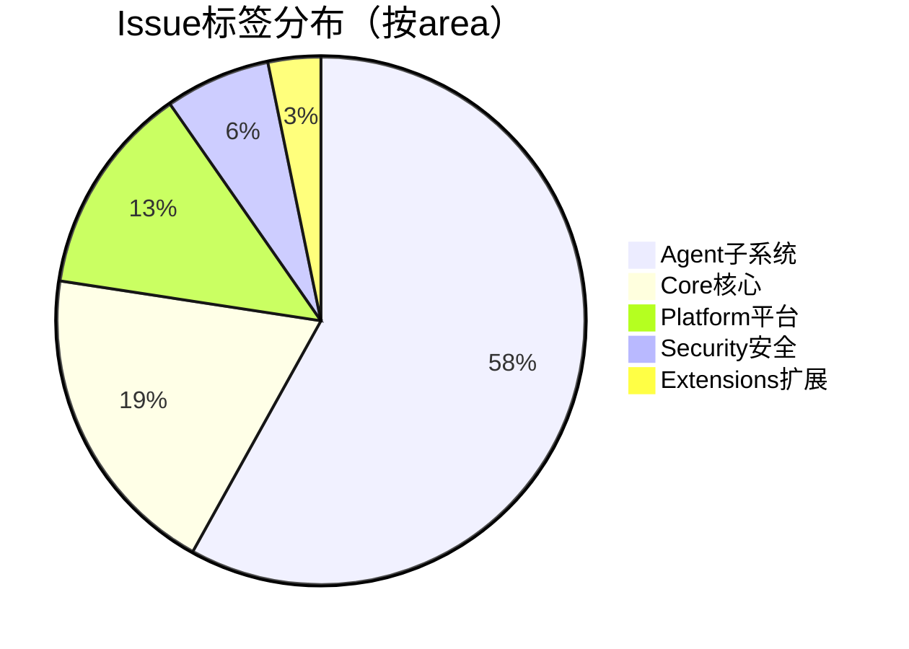

# AI CLI 工具社区动态日报 2026-05-27

> 生成时间: 2026-05-27 00:26 UTC | 覆盖工具: 9 个

- [Claude Code](https://github.com/anthropics/claude-code)
- [OpenAI Codex](https://github.com/openai/codex)
- [Gemini CLI](https://github.com/google-gemini/gemini-cli)
- [GitHub Copilot CLI](https://github.com/github/copilot-cli)
- [Kimi Code CLI](https://github.com/MoonshotAI/kimi-cli)
- [OpenCode](https://github.com/anomalyco/opencode)
- [Pi](https://github.com/badlogic/pi-mono)
- [Qwen Code](https://github.com/QwenLM/qwen-code)
- [DeepSeek TUI](https://github.com/Hmbown/DeepSeek-TUI)
- [Claude Code Skills](https://github.com/anthropics/skills)

---

## 横向对比

# AI CLI 工具生态横向对比分析报告 | 2026-05-27

---

## 1. 生态全景

当前 AI CLI 工具生态呈现**"成熟工具治理债务、新兴工具追赶功能、全生态押注 Agent 并行化"**的三层格局。Claude Code、OpenAI Codex 等头部产品已进入**稳定性治理与信任修复**阶段，计费透明度、Windows 兼容性、MCP 进程治理成为共性痛点；Kimi Code、Qwen Code 等后发者则以**快速迭代+架构创新**（密钥池、Daemon 模式）争夺工程化场景；Pi、OpenCode 等独立工具聚焦**终端体验精细化**与**本地/私有部署**，形成差异化生存空间。整体而言，"能跑 demo"到"能扛生产"的鸿沟正成为全生态核心挑战。

---

## 2. 各工具活跃度对比

| 工具 | 今日 Issues 活跃数 | 今日 PR 活跃数 | 版本发布 | 关键动态 |
|:---|:---:|:---:|:---|:---|
| **Claude Code** | ~50（8条热点） | 8条（6 Open/2 Closed） | 无 | 计费信任危机（$1,050 超额）、Windows 性能回归、MCP 孤儿进程 |
| **OpenAI Codex** | ~50（10条热点） | 10条 | **rust-v0.134.0** | 本地历史搜索、`--profile` 统一配置、服务降级无预警 |
| **Gemini CLI** | 50 | 37 | 无 | 5个新 PR 聚焦会话恢复、Plan Mode 嵌套、认证安全修复 |
| **GitHub Copilot CLI** | 39 | **0** | **v1.0.55-1** 补丁 | 紧急修复终端响铃/TUI 可见性，WSL/tmux 兼容性危机 |
| **Kimi Code CLI** | 6 | 7（5已合并） | **1.45.0** | 工具去重优化、API 密钥池同日响应、OpenAI 兼容 API 诉求 |
| **OpenCode** | ~50（10条热点） | 10条 | 无 | 流式传输冻结（45👍）、niStee/YOMXXX 密集修复生产痛点 |
| **Pi** | 50 | 14 | 无 | Codex 集成悬挂（25评论）、Unicode 分词、渐进式键盘协议 |
| **Qwen Code** | ~50（10条精选） | 10条 | **v0.16.1-nightly** + SDK preview | Daemon 模式架构演进、OOM 系统性治理（8条关闭） |
| **DeepSeek TUI/CodeWhale** | 50 | 10条（9社区合并） | **v0.8.47** | 品牌迁移收尾、死锁修复、CJK 崩溃修复 |

> **注**：Issues/PR 数为日报提及的活跃条目，非全站绝对值。

---

## 3. 共同关注的功能方向

| 功能方向 | 涉及工具 | 具体诉求 | 紧迫度 |
|:---|:---|:---|:---:|
| **Windows/WSL 平台兼容性** | Claude Code、Codex、Copilot CLI、CodeWhale、Pi | 启动卡死、tmux 渲染延迟、PowerShell 弹窗、路径混乱、CJK 崩溃 | 🔥🔥🔥🔥🔥 |
| **Agent/子代理并行化** | Kimi Code、CodeWhale、Qwen Code、Codex、Gemini CLI | 速率限制争用、死锁、超时、状态误报、TUI 卡死、扩展性边界 | 🔥🔥🔥🔥🔥 |
| **计费透明与成本控制** | Claude Code、Codex、Copilot CLI、OpenCode | 模型静默切换、上下文强制升级、配额计费策略不明、实时用量暴露 | 🔥🔥🔥🔥🔥 |
| **MCP 生态治理** | Claude Code、Codex、Gemini CLI、Qwen Code | 进程孤儿化、懒加载、运行时动态管理、工具数量超限、安全隔离 | 🔥🔥🔥🔥 |
| **流式响应可靠性** | OpenCode、Pi、Codex、Gemini CLI | 传输冻结、空闲超时、WebSocket 断连、僵尸连接、无诊断信息 | 🔥🔥🔥🔥 |
| **远程/无头环境支持** | Claude Code、Codex、Pi、Copilot CLI | 设备码登录、SSH 会话持久化、桥接认证、环境变量继承 | 🔥🔥🔥🔥 |
| **终端体验精细化** | Pi、Copilot CLI、CodeWhale、Gemini CLI | Kitty 协议协商、IME 输入、滚动行为、光标样式、屏幕阅读器 | 🔥🔥🔥 |

---

## 4. 差异化定位分析

| 工具 | 核心功能侧重 | 目标用户画像 | 技术路线特征 |
|:---|:---|:---|:---|
| **Claude Code** | 深度 IDE 集成、TUI 交互、MCP 生态 | 专业开发者、企业团队 | 闭源、Anthropic 模型锁定、强调"代理自主性"，但信任机制待修复 |
| **OpenAI Codex** | 多模型支持（gpt-5.5 系列）、沙箱安全、子代理扩展 | 企业级用户、安全敏感场景 | Rust 重写、OpenAI API 优先、profile 统一配置，服务端质量波动成隐患 |
| **Gemini CLI** | Plan Mode 结构化规划、Auto Memory、Agent 子系统 | Google 生态用户、长周期项目 | 原生集成 Gemini 多模态、Memory 系统创新但安全债务集中爆发 |
| **GitHub Copilot CLI** | GitHub 生态深度绑定、PR Review、企业策略管控 | GitHub 付费企业用户、Actions 用户 | 微软体系内协同、扩展生态刚起步，平台兼容性拖累核心体验 |
| **Kimi Code CLI** | 快速响应社区、工具去重、并行子代理 | 中国开发者、追求性价比的工程团队 | Moonshot API 优先、迭代极快（同日 PR 响应）、OpenAI 兼容诉求强烈 |
| **OpenCode** | 多提供商路由、本地化优先、Skills 系统 | 自托管用户、多模型切换需求者 | 开源、provider-agnostic、但沙箱机制缺失成安全短板 |
| **Pi** | 终端体验极致优化、本地 LLM、扩展 API | 终端原生用户、隐私敏感开发者 | 独立开发、渐进式协议协商、Unicode/键盘协议精细化，Codex 集成成新依赖 |
| **Qwen Code** | Daemon 服务模式、L2 能力分层、MCP 桥接 | 企业级部署、阿里云用户、多 Agent 生态 | 架构优先（design-first）、TypeScript/Node.js、OOM 治理与架构演进并行 |
| **DeepSeek TUI/CodeWhale** | 子代理并行视觉化、Rust 性能、审批工作流 | 追求极致性能的中国开发者 | Rust 全栈、品牌迁移阵痛期、社区驱动权限系统建设 |

---

## 5. 社区热度与成熟度

### 社区活跃度梯队

| 梯队 | 工具 | 判断依据 |
|:---|:---|:---|
| **🔥 极高活跃** | Pi、Qwen Code、CodeWhale | 24h 内 14/10/9 个 PR 更新，社区贡献占比高，issue 讨论深度大 |
| **🚀 高活跃+快速迭代** | Kimi Code、OpenCode | PR 合并率极高（Kimi 5/7 已合并）、生产痛点响应快（niStee 连击） |
| **⚖️ 高活跃+治理压力** | Claude Code、Codex、Gemini CLI | Issues 量大但官方主导，社区 PR 以文档/小修复为主，核心问题依赖官方响应 |
| **🛡️ 维护模式** | Copilot CLI | 今日 0 PR，补丁版本紧急发布，资源集中于灭火而非创新 |

### 成熟度评估矩阵

| 工具 | 功能丰富度 | 生产稳定性 | 生态开放度 | 文档/可观测性 | 综合成熟度 |
|:---|:---:|:---:|:---:|:---:|:---:|
| Claude Code | ⭐⭐⭐⭐⭐ | ⭐⭐⭐☆☆ | ⭐⭐⭐☆☆ | ⭐⭐⭐☆☆ | **中成熟，信任危机** |
| Codex | ⭐⭐⭐⭐⭐ | ⭐⭐⭐☆☆ | ⭐⭐⭐⭐☆ | ⭐⭐⭐⭐☆ | **中成熟，服务波动** |
| Gemini CLI | ⭐⭐⭐⭐☆ | ⭐⭐⭐☆☆ | ⭐⭐⭐⭐☆ | ⭐⭐⭐☆☆ | **中成熟，架构债集中** |
| Copilot CLI | ⭐⭐⭐⭐☆ | ⭐⭐⭐☆☆ | ⭐⭐⭐☆☆ | ⭐⭐⭐☆☆ | **中成熟，平台兼容性拖累** |
| Kimi Code | ⭐⭐⭐☆☆ | ⭐⭐⭐⭐☆ | ⭐⭐⭐☆☆ | ⭐⭐⭐☆☆ | **快速上升，工程化导向** |
| OpenCode | ⭐⭐⭐⭐☆ | ⭐⭐⭐☆☆ | ⭐⭐⭐⭐⭐ | ⭐⭐⭐☆☆ | **功能全，稳定性待证** |
| Pi | ⭐⭐⭐⭐☆ | ⭐⭐⭐⭐☆ | ⭐⭐⭐⭐☆ | ⭐⭐⭐⭐☆ | **终端体验领先，规模待扩展** |
| Qwen Code | ⭐⭐⭐⭐☆ | ⭐⭐⭐☆☆ | ⭐⭐⭐⭐☆ | ⭐⭐⭐⭐☆ | **架构前瞻，OOM 治理中** |
| CodeWhale | ⭐⭐⭐☆☆ | ⭐⭐⭐☆☆ | ⭐⭐⭐⭐☆ | ⭐⭐⭐☆☆ | **品牌迁移期，核心功能修复中** |

---

## 6. 值得关注的趋势信号

### 信号一：**"Agent 并行化"从卖点变为基础设施，但全生态未就绪**

> Kimi Code #2368→#2369 同日响应、CodeWhale #2157 死锁修复、Codex #24668 15 子代理卡死、Gemini #21409 通用 Agent 挂起——**并行 Agent 的调度、隔离、观测、成本分摊机制成为共同瓶颈**。建议开发者：当前"多代理并行"仍属实验特性，生产环境建议显式限制并发数，优先选择有密钥池/超时看门狗实现的工具。

### 信号二：**"静默决策"触发全生态信任重构，分级授权成为刚需**

> Claude Code $1,050 超额计费、Copilot CLI 子 Agent 静默降级、Gemini #22323 成功状态造假——**AI 工具在成本/安全敏感操作上的"自主权"与用户控制感严重失衡**。建议技术决策者：评估工具时优先考察 `auto-mode` 的可关闭性、模型切换的显式确认、以及 hook/护栏的可编程性（如 Codex #62264 的 block-build-commands）。

### 信号三：**终端体验从"能用"进入"专业级"竞争**

> Pi 的 Kitty 渐进式协商、Unicode 分词、JetBrains 真彩色；Copilot CLI 的终端响铃静默；CodeWhale 的编辑器文本选择——**终端复用器、IDE 嵌入、国际化输入、无障碍支持成为差异化战场**。建议开发者：若工作流依赖 tmux/Zellij/VS Code 集成，优先测试目标工具在嵌套终端场景下的键盘协议与渲染行为。

### 信号四：**"完全本地运行"承诺与商业化现实的张力**

> OpenCode #28362 外部模型仍需 workspace 账户、Qwen Code 的 Daemon 模式绑定阿里云、Pi #3357 本地 LLM 动态发现长期悬置——**本地化部署的"免账户"边界正在模糊**。建议自托管用户：仔细审查工具的 provider 路由逻辑与认证 fallback，避免"本地模型+云端账户"的隐性依赖。

### 信号五：**MCP 从"协议统一"走向"运行时治理"**

> Claude Code #1935 孤儿进程 11 个月未解、Gemini #27453 会话文件重建、Qwen Code #4552 运行时 MCP 增删、Codex #2335 懒加载——**MCP 的生态扩展受限于进程生命周期、工具发现、动态作用域管理**。建议 MCP 服务器开发者：优先选择支持运行时注册/注销、有明确进程清理契约的 CLI 宿主。

---

*报告基于 2026-05-27 各工具社区动态生成，数据截至当日公开信息。*

---

## 各工具详细报告

<details>
<summary><strong>Claude Code</strong> — <a href="https://github.com/anthropics/claude-code">anthropics/claude-code</a></summary>

## Claude Code Skills 社区热点

> 数据来源: [anthropics/skills](https://github.com/anthropics/skills)

# Claude Code Skills 社区热点报告（2026-05-27）

---

## 1. 热门 Skills 排行（按社区关注度）

| 排名 | Skill | 功能概述 | 状态 | 核心讨论点 |
|:---|:---|:---|:---|:---|
| 1 | **[document-typography](https://github.com/anthropics/skills/pull/514)** | AI 生成文档的排版质量控制：防止孤字换行、标题孤行、编号错位 | 🟡 OPEN | 被视为"每个 Claude 文档都需要的底层修复"，但评论数显示为 `undefined` 可能存在数据异常 |
| 2 | **[ODT](https://github.com/anthropics/skills/pull/486)** | OpenDocument 文本创建、模板填充及 ODT↔HTML 转换 | 🟡 OPEN | 开源/ISO 标准文档格式的企业合规需求，LibreOffice 生态整合 |
| 3 | **[frontend-design](https://github.com/anthropics/skills/pull/210)** | 前端设计 Skill 的清晰度与可执行性改进 | 🟡 OPEN | 技能设计的"可操作性"边界——指令应具体到何种程度才能有效引导单次对话内的行为 |
| 4 | **[skill-quality-analyzer / skill-security-analyzer](https://github.com/anthropics/skills/pull/83)** | 元技能：自动评估 Skill 质量（结构、文档、安全性等五维度） | 🟡 OPEN | **Meta-Skill 范式**——用 Skill 来审计 Skill，社区对标准化质量体系的强烈需求 |
| 5 | **[SAP-RPT-1-OSS](https://github.com/anthropics/skills/pull/181)** | SAP 开源表格基础模型的预测分析集成 | 🟡 OPEN | 企业 ERP 数据与 AI 的桥接，垂直行业（制造业/供应链）的深度整合 |
| 6 | **[AURELION](https://github.com/anthropics/skills/pull/444)** | 四件套认知框架：结构化思维模板、顾问模式、Agent 编排、持久记忆 | 🟡 OPEN | **认知架构层创新**——从"工具调用"升级到"思维操作系统"，含记忆系统的长期上下文管理 |
| 7 | **[testing-patterns](https://github.com/anthropics/skills/pull/723)** | 全栈测试体系：Testing Trophy、AAA 模式、React 组件测试、E2E | 🟡 OPEN | 测试策略的"什么该测/什么不该测"决策框架，超越代码生成进入工程实践 |
| 8 | **[ServiceNow](https://github.com/anthropics/skills/pull/568)** | 企业 ITSM 全平台覆盖：ITOM、ITAM、SecOps、FSM、SPM、IntegrationHub | 🟡 OPEN | 企业级 SaaS 平台的广度 vs 深度权衡——单一 Skill 能否覆盖如此庞大的功能域 |

---

## 2. 社区需求趋势（Issues 提炼）

| 趋势方向 | 代表 Issue | 核心诉求 |
|:---|:---|:---|
| **组织级 Skill 治理** | [#228](https://github.com/anthropics/skills/issues/228) | 企业内 Skill 共享：从"文件传 Slack"到"共享技能库"，Org-wide 权限与发现机制 |
| **信任边界与安全** | [#492](https://github.com/anthropics/skills/issues/492) | `anthropic/` 命名空间的仿冒风险——社区 Skill 与官方 Skill 的视觉区分 |
| **Skill 即 MCP（Model Context Protocol）** | [#16](https://github.com/anthropics/skills/issues/16) | 技能标准化接口：`algorithmic-art` → `generateAlgorithmArt({prompt, options})` 的协议化封装 |
| **跨平台部署** | [#29](https://github.com/anthropics/skills/issues/29) | AWS Bedrock 等非 Claude 原生环境的 Skill 兼容性 |
| **上下文窗口优化** | [#1102](https://github.com/anthropics/skills/issues/1102) | MCP 返回大数据量时的压缩/流式处理，避免上下文拥塞 |
| **插件去重与精确加载** | [#189](https://github.com/anthropics/skills/issues/189) · [#1087](https://github.com/anthropics/skills/issues/1087) | `document-skills` 与 `example-skills` 内容重复，marketplace.json 声明与实际加载不一致 |

---

## 3. 高潜力待合并 Skills（评论活跃 + 解决明确痛点）

| PR | 技能 | 为何高潜力 | 阻塞风险 |
|:---|:---|:---|:---|
| [#538](https://github.com/anthropics/skills/pull/538) | PDF 大小写修复 | 跨平台（Linux/容器）兼容性，一行修复打破文档引用 | 低——纯 bugfix，已定位精确 |
| [#539](https://github.com/anthropics/skills/pull/539) | YAML 特殊字符预校验 | Skill 开发者的常见踩坑点：`description` 含 `:` 导致静默解析失败 | 低——防御性编程，无破坏性变更 |
| [#541](https://github.com/anthropics/skills/pull/541) | DOCX 书签 ID 冲突 | 文档损坏的根因修复：OOXML 共享 ID 空间的硬编码冲突 | 中——需验证边界场景 |
| [#1099](https://github.com/anthropics/skills/pull/1099) · [#1050](https://github.com/anthropics/skills/pull/1050) | Windows 兼容性双修复 | `skill-creator` 在 Windows 的管道编码 + 子进程调用崩溃，影响大量开发者 | 低——1 行变更，已验证 |
| [#509](https://github.com/anthropics/skills/pull/509) | CONTRIBUTING.md | 社区健康度 25% → 提升，降低贡献门槛 | 低——文档 PR，维护者可控 |

> **关键观察**：Lubrsy706 连续提交 3 个精准 bugfix（#538/#539/#541），形成"PDF/DOCX/Skill 元数据"的质量修复集群，显示社区核心贡献者的专业化分工。

---

## 4. Skills 生态洞察

> **社区最集中的诉求：从"个人效率工具"进化到"企业级可治理的生产系统"——要求 Skills 具备组织共享、安全边界、质量审计、跨平台部署和标准化接口（MCP）五大企业就绪能力，同时保留单用户场景的敏捷性。**

---

*数据截止：2026-05-27 | 来源：github.com/anthropics/skills*

---

# Claude Code 社区动态日报 | 2026-05-27

## 今日速览

今日社区无新版本发布，但 Issues 活跃度极高，**Windows 性能回归**与**MCP 进程孤儿化**两大顽疾持续发酵，累计评论超 75 条。同时，**模型自动切换导致的超额计费**问题引发用户强烈不满，成为信任危机焦点。

---

## 社区热点 Issues

### 🔥 性能与稳定性

| # | 标题 | 状态 | 评论 | 核心问题 |
|---|------|------|------|----------|
| [#26302](https://github.com/anthropics/claude-code/issues/26302) | Claude Desktop 1.1.3189 Windows 严重 UI 卡顿与鼠标掉帧 | OPEN | 39 | 更新后性能回归，影响日常编码体验，34 人点赞反映普遍性 |
| [#1935](https://github.com/anthropics/claude-code/issues/1935) | MCP 服务器退出时未终止，产生孤儿进程 | OPEN | 36 | 长期存在的资源泄漏问题，macOS 用户反复遭遇端口占用 |
| [#60438](https://github.com/anthropics/claude-code/issues/60438) | auto-mode 分类器持续 HTTP 429，账户级配置问题 | OPEN | 6 | 自动模式选择机制触发限流，影响工作流连续性 |

### 💰 计费与模型透明度（信任危机核心）

| # | 标题 | 状态 | 评论 | 核心问题 |
|---|------|------|------|----------|
| [#60093](https://github.com/anthropics/claude-code/issues/60093) | 模型未经同意切换至 Opus，3 天超额计费 $1,050 | OPEN | 7 | **今日最严重事件**：Sonnet→Opus 静默切换，无 UI 披露，涉及 5 处流程缺陷 |
| [#62063](https://github.com/anthropics/claude-code/issues/62063) | 新会话默认 1M 上下文，Pro 计划无降级选项 | OPEN | 5 | 上下文窗口策略强制升级，用户成本不可控 |
| [#62052](https://github.com/anthropics/claude-code/issues/62052) | "用量限制"错误实为 1M 上下文门槛误导 | OPEN | 3 | 错误信息设计缺陷，掩盖真实限制条件 |

### 🔌 远程控制与跨平台

| # | 标题 | 状态 | 评论 | 核心问题 |
|---|------|------|------|----------|
| [#45942](https://github.com/anthropics/claude-code/issues/45942) | Android "始终允许"权限破坏工具调用 | OPEN | 9 | 远程控制权限系统的状态机缺陷，WSL+Android 组合场景 |
| [#59665](https://github.com/anthropics/claude-code/issues/59665) | Windows 11 全新安装 /remote-control 认证失败 | OPEN | 4 | 桥接 WebView 无法完成登录流程，阻碍新用户上手 |
| [#62634](https://github.com/anthropics/claude-code/issues/62634) | 桌面嵌入版 Claude Code 远程控制因"无 org UUID"失败 | OPEN | 1 | 刚提交，桌面应用与 CLI 的身份体系割裂 |
| [#57715](https://github.com/anthropics/claude-code/issues/57715) | 长运行后桥接环境过期，需跨机重新注册 | OPEN | 3 | 远程控制会话生命周期管理缺陷 |

### 🧠 交互设计争议

| # | 标题 | 状态 | 评论 | 核心问题 |
|---|------|------|------|----------|
| [#61929](https://github.com/anthropics/claude-code/issues/61929) | 重大设计决策静默执行，琐事却要求确认 | OPEN | 7 | AI 代理的决策权重分配逻辑倒置，用户控制感丧失 |

---

## 重要 PR 进展

| # | 标题 | 状态 | 功能/修复内容 |
|---|------|------|---------------|
| [#62597](https://github.com/anthropics/claude-code/pull/62597) | 修复脚本与工作流中的 10 处 bug | OPEN | 社区工作流健壮性：环境变量回退、空值安全、错误处理 |
| [#62264](https://github.com/anthropics/claude-code/pull/62264) | 新增 block-build-commands hook 示例 | OPEN | **硬执行护栏**：通过 PreToolUse hook 阻止 cmake/make/npm build 等编译命令，防止意外构建 |
| [#62346](https://github.com/anthropics/claude-code/pull/62346) | 文档化 CLAUDE_CODE_ATTRIBUTION_HEADER | OPEN | 解决第三方 API 提供商的缓存失效问题，ANTRHOPIC_BASE_URL 场景必备 |
| [#4943](https://github.com/anthropics/claude-code/pull/4943) | 新增 bash/zsh/fish 静态补全脚本 | OPEN | 长期悬置的 Shell 体验优化，支持 `claude completion $SHELL` 集成路径 |
| [#60427](https://github.com/anthropics/claude-code/pull/60427) | README 采用标准 GitHub 大小写 | OPEN | 文档规范性微优化 |
| [#60732](https://github.com/anthropics/claude-code/pull/60732) | 润色 plugins README 措辞 | OPEN | 插件生态描述可读性提升 |
| [#62622](https://github.com/anthropics/claude-code/pull/62622) | 修复脚本与工作流中的 10 处 bug（重复提交） | CLOSED | 与 #62597 内容重复，已关闭 |

> 注：#62592、#62586 为安全指引插件更新，#58673 为无效提交，未列入核心进展。

---

## 功能需求趋势

基于今日 50 条活跃 Issues 分析，社区关注呈 **三大聚集 + 两个新兴** 态势：

| 方向 | 热度 | 典型诉求 |
|------|------|----------|
| **成本控制与模型透明度** | 🔥🔥🔥🔥🔥 | 上下文窗口强制升级、模型自动切换、计费明细实时暴露 |
| **远程控制可靠性** | 🔥🔥🔥🔥🔥 | 跨设备会话持久化、权限状态一致性、桥接认证鲁棒性 |
| **IDE 集成深度** | 🔥🔥🔥🔥 | VS Code 完成通知、状态元数据统一暴露、TUI/IDE 体验对齐 |
| **国际化输入支持** | 🔥🔥🔥 | 非拉丁键盘布局（Cyrillic/Greek/Arabic）的 Ctrl 快捷键修复，今日 3 条相关 Issue |
| **Agent 可配置性** | 🔥🔥 | 会话中切换 Agent 配置、思考状态动词自定义 |

---

## 开发者关注点

### 🔴 高频痛点

1. **"静默决策"信任崩塌** — #61929、#60093、#62063 共同指向：Claude Code 在**成本敏感操作**（模型升级、上下文扩展）上缺乏显式确认，与琐事确认形成讽刺对比。用户要求**分级授权机制**。

2. **Windows 二等公民体验** — 性能回归（#26302）、远程控制认证失败（#59665）、全局指令同步冲突（#48560）集中爆发，反映 Windows 平台的测试覆盖不足。

3. **MCP 生态的进程治理** — #1935 持续 11 个月未解，孤儿进程导致端口冲突和内存泄漏，影响开发者将 MCP 投入生产环境。

### 🟡 新兴诉求

- **可观测性基建**：#51382 要求会话元数据（限流、token 用量、状态）统一暴露至本地文件，供外部工具消费
- **无障碍优化**：#62626、#62624 指出 TUI 的"聪明"同义词（"Wandering"、"Synthesizing"）对屏幕阅读器用户造成认知负担，要求简化或自定义

### 💡 今日值得关注的闭环

- [#36549](https://github.com/anthropics/claude-code/issues/36549) Kitty 键盘协议非拉丁布局问题 → 今日 [#62628](https://github.com/anthropics/claude-code/issues/62628) 补充复现并扩展至更多语言，显示维护团队对国际化输入的响应滞后

---

*日报基于 GitHub 公开数据生成，不代表 Anthropic 官方立场。*

</details>

<details>
<summary><strong>OpenAI Codex</strong> — <a href="https://github.com/openai/codex">openai/codex</a></summary>

# OpenAI Codex 社区动态日报 | 2026-05-27

## 今日速览

今日 Codex 发布 **rust-v0.134.0**，带来本地对话历史搜索与 `--profile` 统一配置两大功能。社区持续聚焦连接稳定性问题，Windows/WSL 平台的多项故障成为讨论热点，同时子代理（subagent）性能与扩展性需求显著上升。

---

## 版本发布

### rust-v0.134.0
- **本地对话历史搜索**：支持跨会话历史搜索，包含大小写不敏感匹配与结果预览 ([#23519](https://github.com/openai/codex/pull/23519), [#23921](https://github.com/openai/codex/pull/23921))
- **`--profile` 统一配置**：将 `--profile` 提升为 CLI、TUI 权限与沙箱流程的主要配置选择器，旧版 profile 配置需迁移 ([#链接](https://github.com/openai/codex))

---

## 社区热点 Issues

| # | Issue | 重要性 | 社区反应 |
|---|-------|--------|---------|
| [#21671](https://github.com/openai/codex/issues/21671) | `/compact` 因 `service_tier` 参数错误失败（0.129.0 回归） | **高** — 核心上下文压缩功能断裂，影响长会话稳定性 | 21 评论，已关闭但 [#22876](https://github.com/openai/codex/issues/22876) 显示类似问题仍在 API-key 场景复现 |
| [#23340](https://github.com/openai/codex/issues/23340) | `/goal` 长循环产生 480KB 单行日志，日占 34GB | **高** — 极端日志膨胀导致磁盘耗尽与性能崩溃 | 10 评论，用户急需链式追踪的流控机制 |
| [#24373](https://github.com/openai/codex/issues/24373) | Google Sheets 连接器可读写失败，共享配额 429 | **中高** — 企业集成场景阻塞，插件权限模型存疑 | 9 评论，重装插件无效说明非配置问题 |
| [#23482](https://github.com/openai/codex/issues/23482) | macOS 远程控制：app-server 正常但 remote manager 断连 | **高** — 远程开发核心链路不稳定 | 8 评论，版本差异（bundled vs PATH CLI）加剧排查难度 |
| [#24260](https://github.com/openai/codex/issues/24260) | gpt-5.5 xhigh 推理 stall 30 分钟 | **中高** — 高阶模型用户体验严重受损 | 7 评论，首次输出延迟后恢复正常，指向调度或预热问题 |
| [#22876](https://github.com/openai/codex/issues/22876) | `/responses/compact` 在 provider-scoped API-key 下仍发 `service_tier` | **高** — #21671 的变体，认证场景覆盖不全 | 6 评论，企业 API 用户受阻 |
| [#2335](https://github.com/openai/codex/issues/2335) | MCP 服务器懒加载/可选加载 | **高** — 31 👍 的常青需求，启动性能关键 | 6 评论，MCP 生态扩展的瓶颈问题 |
| [#24668](https://github.com/openai/codex/issues/24668) | 15 个子代理启动导致 TUI 无响应 | **中高** — 并行代理扩展性的硬边界 | 2 评论，新上报即获关注，架构压力测试失败 |
| [#24649](https://github.com/openai/codex/issues/24649) | 近期减速与质量下降何时修复？ | **高** — 用户感知的服务降级，信任危机 | 2 评论，周末至今未恢复，缺乏官方沟通 |
| [#24533](https://github.com/openai/codex/issues/24533) | WebSocket 反复断连：`websocket closed before response.completed` | **中高** — 连接层基础设施不稳定 | 2 评论，与 #24444 等形成模式化故障 |

---

## 重要 PR 进展

| # | PR | 功能/修复内容 |
|---|-----|-------------|
| [#21311](https://github.com/openai/codex/pull/21311) | fix: preserve reopened descendants under read denies | 文件系统沙箱策略：精确路径冲突时保留重开的后代目录权限，修复安全与功能边界 |
| [#24666](https://github.com/openai/codex/pull/24666) | Allow API-key auth for remote exec-server registration | 远程 exec-server 注册支持 API-key 认证，简化无 Agent Identity 的部署 |
| [#24639](https://github.com/openai/codex/pull/24639) | refactor!: remove installer flag inputs | **Breaking**：安装脚本参数改为纯环境变量控制，统一自动化与更新流程 |
| [#24637](https://github.com/openai/codex/pull/24637) | fix: run standalone updates noninteractively | 独立更新避免进入交互式安装提示，解决无人值守更新中断 |
| [#24669](https://github.com/openai/codex/pull/24669) | Keep standalone web search schema within tool schema budget | 压缩 web.run 工具 schema 冗余描述，防止模型可见 schema 被过度裁剪 |
| [#21567](https://github.com/openai/codex/pull/21567) | fix: add noninteractive install script mode | 跨平台（macOS/Linux/Windows）非交互安装模式，`CODEX_NON_INTERACTIVE` 控制 |
| [#24658](https://github.com/openai/codex/pull/24658) | [codex] Remove obsolete goal continuation turn marker | 清理 #20523 遗留的死代码 `continuation_turn_id`，简化状态机 |
| [#23514](https://github.com/openai/codex/pull/23514) | core: box descendant resume future to avoid stack overflow | 将子树恢复 future 装箱，修复深层代理恢复时的栈溢出 |
| [#24650](https://github.com/openai/codex/pull/24650) | Add CODEX_ENV_FILE hook persistence | 对标 Claude Code 的 `CLAUDE_ENV_FILE`，支持 hook 持久化导出 `PATH`、虚拟环境等 |
| [#24368](https://github.com/openai/codex/pull/24368) | [codex] add compaction metadata to turn headers | 为压缩请求添加 `request_kind` 元数据，提升可观测性与调试能力 |

---

## 功能需求趋势

| 方向 | 热度 | 典型表现 |
|------|------|---------|
| **连接稳定性/远程开发** | 🔥🔥🔥 | SSH 远程会话丢失、WebSocket 断连、app-server 与 remote manager 状态不一致（#23482, #22438, #24444, #24533, #24601） |
| **Windows/WSL 平台适配** | 🔥🔥🔥 | PowerShell 异常弹窗、VS Code 扩展空白、认证失败（#23485, #24444, #24633, #24580） |
| **子代理/并行扩展** | 🔥🔥 | 15 子代理 TUI 卡死、父代理为子代理设目标（#24668, #24607） |
| **MCP 生态优化** | 🔥🔥 | 懒加载启动、Figma MCP 400 错误、工具安装发现（#2335, #23804, #23230） |
| **上下文/压缩机制** | 🔥🔥 | `/compact` 参数错误、自定义压缩扩展点、压缩元数据（#21671, #22876, #23698, #24368） |
| **安装/配置自动化** | 🔥 | 非交互安装、环境变量持久化、profile 统一（#24639, #24637, #21567, #24650） |

---

## 开发者关注点

### 🔴 高频痛点

1. **服务端质量波动无预警**  
   [#24649](https://github.com/openai/codex/issues/24649) 反映的"周末减速+质量下降"至今未获官方回应，用户缺乏状态页或降级通知机制。

2. **Windows 二等公民体验**  
   从系统弹窗 calc.exe（[#24580](https://github.com/openai/codex/issues/24580)）到 WSL 路径混乱（[#23485](https://github.com/openai/codex/issues/23485)），Windows 平台的边缘场景测试覆盖明显不足。

3. **远程开发链路脆弱**  
   SSH + app-server + remote manager 的三层架构在断网、重启、版本不匹配时恢复能力弱，会话持久化承诺与实际行为存在差距（#23482, #22438）。

4. **日志/可观测性反模式**  
   [#23340](https://github.com/openai/codex/issues/23340) 的 34GB 日日志暴露 tracing span 嵌套无限制增长，生产环境缺乏默认资源上限保护。

### 🟡 迫切需求

- **配额与限流透明化**：Plus/Pro 用户频繁遭遇压缩任务触发用量限制（#19607），需区分模型调用与压缩的配额计费策略。
- **环境一致性契约**：[#24638](https://github.com/openai/codex/issues/24638) 揭示 `cwd` 与 app-server 复用/新建的逻辑隐式变化，开发者难以预测执行上下文。
- **IDE 扩展稳定性**：VS Code 扩展在 Remote SSH（[#24601](https://github.com/openai/codex/issues/24601)）和 Dev Container（[#24633](https://github.com/openai/codex/issues/24633)）场景的回退与认证问题集中爆发。

---

*日报基于 GitHub 公开数据生成， Issues/PR 链接可直接访问获取完整上下文。*

</details>

<details>
<summary><strong>Gemini CLI</strong> — <a href="https://github.com/google-gemini/gemini-cli">google-gemini/gemini-cli</a></summary>

# Gemini CLI 社区动态日报 | 2026-05-27

## 今日速览

今日社区无新版本发布，但代码活跃度显著：5个新PR提交，核心聚焦于**会话恢复可靠性**、**Plan Mode嵌套目录支持**及**认证安全修复**。Agent子系统稳定性与终端交互体验仍是社区讨论最密集的领域。

---

## 社区热点 Issues

| # | 标题 | 优先级 | 关键动态 | 链接 |
|---|------|--------|---------|------|
| **#24353** | Robust component level evaluations | P1 | 行为评估体系EPIC，已生成76个测试用例覆盖6个Gemini模型，推动Agent质量可量化 | [链接](https://github.com/google-gemini/gemini-cli/issues/24353) |
| **#22745** | AST-aware file reads/search/mapping评估 | P2 | 探索用AST精确读取方法边界，减少误读导致的轮次浪费，7条深度技术讨论 | [链接](https://github.com/google-gemini/gemini-cli/issues/22745) |
| **#21409** | Generalist agent hangs | P1 | **8个👍高票Bug**：通用Agent无限挂起，简单操作如创建文件夹也卡住，禁用子Agent可规避 | [链接](https://github.com/google-gemini/gemini-cli/issues/21409) |
| **#22323** | Subagent MAX_TURNS中断被掩盖为成功 | P1 | `codebase_investigator`达轮次上限仍报GOAL成功，导致用户误判分析完成 | [链接](https://github.com/google-gemini/gemini-cli/issues/22323) |
| **#21968** | Gemini不主动使用skills和sub-agents | P2 | 社区反馈强烈：即使有gradle/git等skill，模型也不会自动调用，需显式指令 | [链接](https://github.com/google-gemini/gemini-cli/issues/21968) |
| **#25166** | Shell命令执行后假死"Waiting input" | P1 | 简单命令完成后仍显示"等待输入"，3个👍，严重影响工作流连续性 | [链接](https://github.com/google-gemini/gemini-cli/issues/25166) |
| **#26525** | Auto Memory日志安全：确定性脱敏 | P2 | 敏感信息在模型脱敏前已进入上下文，存在数据泄露风险，安全合规关键Issue | [链接](https://github.com/google-gemini/gemini-cli/issues/26525) |
| **#26523/26522** | Auto Memory补丁隔离与重试优化 | P2 | 无效补丁静默跳过、低价值会话无限重试，Memory系统质量成新焦点 | [链接](https://github.com/google-gemini/gemini-cli/issues/26523) |
| **#24246** | >128 tools触发400错误 | P2 | 工具数量超限无智能裁剪策略，需Agent层动态作用域管理 | [链接](https://github.com/google-gemini/gemini-cli/issues/24246) |
| **#22186** | get-shit-done输出钩子崩溃 | P1 | 任务总结阶段必现崩溃，影响核心工作流闭环 | [链接](https://github.com/google-gemini/gemini-cli/issues/22186) |

---

## 重要 PR 进展

| # | 标题 | 状态 | 核心改进 | 链接 |
|---|------|------|---------|------|
| **#27453** | 会话文件重建时重新注入metadata | 🆕 Open | 修复`ChatRecordingService`文件被外部清理后无法解析的持久化Bug | [链接](https://github.com/google-gemini/gemini-cli/pull/27453) |
| **#27464** | Plan Mode支持嵌套目录 | 🆕 Open | `plans/tracks/feature-x/spec.md`结构可用，write_file/edit/exit_plan_mode全适配 | [链接](https://github.com/google-gemini/gemini-cli/pull/27464) |
| **#27465** | 扩展enable/disable终端反馈 | 🆕 Open | 原命令零反馈像"完全损坏"，现向终端输出操作结果 | [链接](https://github.com/google-gemini/gemini-cli/pull/27465) |
| **#27463** | 文件缓存保留refresh_token | 🆕 Open | 修复#21691：非加密存储用户token丢失问题，补全#26924遗漏场景 | [链接](https://github.com/google-gemini/gemini-cli/pull/27463) |
| **#27383** | MCP工具网络超时原子更新 | Open | 网络抖动时保留旧工具列表，根治"tool not found"误报 | [链接](https://github.com/google-gemini/gemini-cli/pull/27383) |
| **#27371** | --resume时EBADF错误处理 | Open | 恢复会话时PTY文件描述符过期导致ioctl崩溃，加入安全忽略 | [链接](https://github.com/google-gemini/gemini-cli/pull/27371) |
| **#27377** | MCP黑名单绕过RCE修复 | ❌ Closed | 恶意工作区MCP服务器可绕过排除列表执行本地进程，安全漏洞已修复 | [链接](https://github.com/google-gemini/gemini-cli/pull/27377) |
| **#27461** | 抑制PTY resize EBADF错误 | ❌ Closed | 匹配node-pty上游修复，退出中的PTY resize不再崩溃 | [链接](https://github.com/google-gemini/gemini-cli/pull/27461) |
| **#27054** | Windows图像粘贴与剪贴板样式 | Open | Windows Terminal空括号粘贴序列处理，图像粘贴UI优化 | [链接](https://github.com/google-gemini/gemini-cli/pull/27054) |
| **#27365** | --ephemeral临时会话模式 | Open | 无头任务不污染会话日志，数据标注/批处理场景专用 | [链接](https://github.com/google-gemini/gemini-cli/pull/27365) |

---

## 功能需求趋势



**五大方向：**

| 趋势 | 证据 | 紧迫度 |
|-----|------|--------|
| **Agent可靠性工程** | #21409挂起、#22323状态误报、#21968技能调用惰性、#22323轮次限制 | 🔴 最高 |
| **终端交互体验** | #25166假死、#21924 resize闪烁、#24935编辑器退出花屏、#26088 F10兼容 | 🟠 高 |
| **Memory系统安全** | #26525脱敏、#26523补丁隔离、#26522重试风暴，5月集中爆发 | 🟠 高 |
| **AST/代码智能** | #22745/#22746/#22747三连EPIC，精确代码导航替代文本搜索 | 🟡 中 |
| **认证与会话管理** | #27463 token丢失、#27365 ephemeral模式、#20303远程Agent认证 | 🟡 中 |

---

## 开发者关注点

### 🔴 阻塞性痛点
1. **子Agent调度失控** — 通用Agent挂起(#21409)、子Agent偷偷运行(#22093)、成功状态造假(#22323)，开发者被迫禁用子Agent功能
2. **Shell执行假死** — 命令已完成但UI显示"等待输入"（#25166），破坏自动化脚本可靠性

### 🟠 高频摩擦
3. **工具生态调用惰性** — 自定义skills形同虚设（#21968），模型偏好通用推理而非专用工具
4. **会话恢复脆弱** — `--resume`遇PTY过期崩溃（#27371）、文件被清理后无法解析（#27453）

### 🟡 新兴诉求
5. **无头/批处理场景** — #27365 `--ephemeral` 反映CI/CD、数据标注等场景对干净会话的需求
6. **Plan Mode工程化** — #27464 嵌套目录支持，大型项目需要结构化规划而非扁平md文件

---

> 📊 数据基准：50个活跃Issue，37个活跃PR，过去24小时更新。所有🔒标记为内部维护者可见Issue，摘要内容已脱敏处理。

</details>

<details>
<summary><strong>GitHub Copilot CLI</strong> — <a href="https://github.com/github/copilot-cli">github/copilot-cli</a></summary>

# GitHub Copilot CLI 社区动态日报 | 2026-05-27

## 今日速览

今日社区无新 PR 合并，但 **v1.0.55-1 补丁版本** 紧急发布，重点修复终端响铃干扰与 TUI 可见性问题。同时，**Windows/WSL 平台兼容性危机持续发酵**，3 个高热度 Issue 集中爆发，涉及 1.0.49 升级后的启动卡死、tmux 渲染延迟等阻塞性问题，企业用户对远程会话和 MCP 注册表的支持需求显著上升。

---

## 版本发布

### v1.0.55-1（补丁版本）

| 类型 | 内容 |
|:---|:---|
| **体验优化** | 全主题提升选择背景对比度；`/env` 命令现显示已加载扩展及其状态与来源 |
| **问题修复** | 回合完成时终端响铃默认静默（可通过配置显式启用）；修复 `/resume` 选择器显示异常 |

> 🔗 [Release 页面](https://github.com/github/copilot-cli/releases)

**点评**：`/env` 的增强直接回应了 Issue #3479（扩展不可见）的开发者诉求，表明团队正加速插件生态的透明度建设。

---

## 社区热点 Issues（精选 10 条）

| # | 状态 | 标题 | 核心问题 | 社区反应 | 链接 |
|:---|:---|:---|:---|:---|:---|
| **#3385** | 🔴 OPEN | WSL 升级 1.0.49 后启动卡死 | Windows 平台关键路径阻塞，用户反馈"看起来像卡住" | **13 评论 / 9 👍**，近 7 日持续活跃 | [链接](https://github.com/github/copilot-cli/issues/3385) |
| **#2205** | 🔴 OPEN | Terminator 终端滚动行为异常 | 鼠标滚轮从浏览历史变为遍历输入，严重破坏交互直觉 | **10 评论 / 12 👍**，跨版本长期未解 | [链接](https://github.com/github/copilot-cli/issues/2205) |
| **#3439** | 🔴 OPEN | tmux + mintty/Cygwin TUI 渲染严重延迟 | 1.0.49 回归问题，"爆发式卡顿、转圈冻结"，已定位版本差异 | **7 评论**，企业 Windows 开发者受影响 | [链接](https://github.com/github/copilot-cli/issues/3439) |
| **#2758** | 🔴 OPEN | 子 Agent 模型被静默降级，请求成本保护开关 | 企业级多 Agent 工作流的核心瓶颈，"成本乘数守卫"过度保守 | **6 评论**，架构层面讨论 | [链接](https://github.com/github/copilot-cli/issues/2758) |
| **#3436** | 🔴 OPEN | `/mcp search` 构造错误 URL 导致 404 | 企业自托管 MCP 注册表功能完全失效，路径缺少 `/v0.1/` | **5 评论 / 1 👍**，企业部署阻断 | [链接](https://github.com/github/copilot-cli/issues/3436) |
| **#3442** | 🟢 CLOSED | v1.0.51 远程会话被禁用警告 | 升级后组织策略异常触发，管理员权限问题 | **5 评论 / 10 👍**，高关注快速关闭 | [链接](https://github.com/github/copilot-cli/issues/3442) |
| **#1972** | 🔴 OPEN | IME 输入时 Enter 键误提交 | CJK 用户高频痛点，46 👍 为全站最高，国际化基础体验 | **3 评论 / 46 👍**，长期被忽视 | [链接](https://github.com/github/copilot-cli/issues/1972) |
| **#3049** | 🔴 OPEN | 文件写入权限持续失败 | "创建计划但不修改代码"场景下的工具权限边界模糊 | **3 评论 / 1 👍**，Agent 工作流可靠性 | [链接](https://github.com/github/copilot-cli/issues/3049) |
| **#3123** | 🔴 OPEN | `/research` 无法写入研究报告 | "create" 工具不可用导致研究 Agent 输出丢失 | **3 评论 / 2 👍**，工具可用性缺陷 | [链接](https://github.com/github/copilot-cli/issues/3123) |
| **#3529** | 🔴 OPEN | PR Review 服务全局错误 | CLI 与 Web UI 同时受影响，付费用户 Actions 配额浪费 | **2 评论**，疑似服务端故障 | [链接](https://github.com/github/copilot-cli/issues/3529) |

---

## 重要 PR 进展

> **今日无过去 24 小时内更新的 Pull Requests。**

团队资源可能集中于 v1.0.55-1 的紧急发布与上述高优先级 Issue 的修复验证。建议关注 #3385、#3439 等回归问题的修复 PR 是否即将出现。

---

## 功能需求趋势

基于 39 条活跃 Issue 的聚类分析：

```
┌─────────────────────────────────────────────────────────┐
│  🔧 平台兼容性（32%）  ████████████████████              │
│     Windows/WSL/tmux/Cygwin 渲染、启动、输入问题          │
│                                                         │
│  🤖 Agent/模型生态（24%） ██████████████                  │
│     子 Agent 模型选择、技能预加载、上下文窗口程序化控制     │
│                                                         │
│  🔌 MCP/插件扩展（18%）  ██████████                     │
│     注册协议、工具发现、生命周期钩子、扩展可见性            │
│                                                         │
│  ⌨️ 终端交互体验（16%）  █████████                      │
│     IME 支持、光标样式、文本选择、快捷键、滚动行为          │
│                                                         │
│  🔐 企业/认证（10%）    ██████                          │
│     远程会话、托管身份认证、BYOK 多模型、自动更新策略       │
└─────────────────────────────────────────────────────────┘
```

**关键洞察**：平台兼容性首次超越功能请求成为最大痛点，反映 1.0.49 版本的质量回归；Agent 生态的"模型自主权"与"技能编排"正从早期采用者向企业场景渗透。

---

## 开发者关注点

### 🔴 阻塞性痛点（需立即响应）

| 痛点 | 影响范围 | 代表 Issue |
|:---|:---|:---|
| **Windows 平台"升级即损坏"** | WSL/Cygwin/tmux 用户大规模受影响 | #3385, #3439 |
| **企业 MCP/远程会话功能不可用** | 组织部署阻断，付费功能承诺落空 | #3436, #3442 |
| **Agent 工具链随机失效** | 研究、编辑等核心工作流不可靠 | #3049, #3123 |

### 🟡 高频体验债务（长期积累）

| 需求 | 用户呼声 | 现状 |
|:---|:---|:---|
| **IME 安全输入模式** | 46 👍，CJK 用户基础权益 | 创建 2.5 个月无里程碑 |
| **终端原生交互惯例** | 光标、滚动、选择、Ctrl+Backspace | 逐案修复，缺乏系统性 |
| **跨会话持久化** | 审计、统计、历史检索 | 仅 #1791 孤立讨论 |

### 🟢 生态演进方向（前瞻布局）

- **BYOK 多模型热切换**：从单模型环境变量向动态模型市场演进（#3282）
- **Agent 技能即代码**：`skills:` frontmatter 预加载机制已关闭（#3532），预示官方标准化
- **扩展运行时透明化**：`/env` 增强与生命周期钩子修复同步推进，插件生态进入可用阶段

---

> 📌 **明日关注**：#3385 WSL 卡死是否有修复补丁？#3529 PR Review 故障是否为服务中断？建议监控 Releases 页面与相关 Issue 的 maintainer 回复。

</details>

<details>
<summary><strong>Kimi Code CLI</strong> — <a href="https://github.com/MoonshotAI/kimi-cli">MoonshotAI/kimi-cli</a></summary>

# Kimi Code CLI 社区动态日报 | 2026-05-27

## 今日速览

今日社区活跃度较高，**kimi-cli 1.45.0 正式发布**，带来工具去重优化和 Shell 交互改进。同时，**并行子代理 API 密钥池**成为焦点议题——社区用户提出速率限制痛点后，同日即有 PR 提交解决方案，响应速度值得肯定。

---

## 版本发布

### kimi-cli 1.45.0 已发布
- **PR**: [#2373](https://github.com/MoonshotAI/kimi-cli/pull/2373) | 作者: jackfish212
- **核心变更**:
  - 工具调用去重系统升级：引入稀疏提醒机制与规范化参数匹配，减少重复工具调用
  - `/clear` 正式成为 `/new` 的别名，统一 Shell 交互语义
  - 欢迎提示文案更新
- **配套修复**: 403 错误提示不再一律显示"Quota exceeded"（[#2342](https://github.com/MoonshotAI/kimi-cli/pull/2342)），避免误导性诊断

---

## 社区热点 Issues

| # | 状态 | 标题 | 作者 | 核心看点 |
|---|------|------|------|---------|
| [#2368](https://github.com/MoonshotAI/kimi-cli/issues/2368) | 🔥 新 | 前景子代理耗尽单一 API 密钥速率限制 | Liewzheng | **高优先级架构问题**：3-4 个并发 `coder`/`explore` 子代理共享根密钥导致 429 错误和挂起，直接影响多任务工作流可靠性 |
| [#2208](https://github.com/MoonshotAI/kimi-cli/issues/2208) | 💬 活跃 | 请求 OpenAI 兼容 API 以支持 Cursor 接入 | janeza2 | **生态扩展需求**：用户希望将 Kimi K2.6 接入 Cursor 等第三方 IDE，反映社区对 IDE 生态集成的强烈诉求；3 条评论持续讨论 |
| [#2370](https://github.com/MoonshotAI/kimi-cli/issues/2370) | 🆕 新 | Web UI 队列面板添加 Steer (⚡) 按钮 | 2986787982dsx-ui | **交互体验缺口**：`kimi web` 运行中发送跟进消息会进入队列而非即时触发，用户需要更直观的干预手段 |
| [#2141](https://github.com/MoonshotAI/kimi-cli/issues/2141) | 🔧 待修复 | DeepSeek V4 兼容性：reasoning_content 传递问题 | wintrover | **跨模型兼容关键**：DeepSeek V4 Pro 思维链模式要求所有 assistant 消息回传 `reasoning_content`，当前实现导致多轮工具调用 400 错误；获 1 👍 |
| [#2317](https://github.com/MoonshotAI/kimi-cli/issues/2317) | 🐛 待修复 | Plan 模式文件路径在 VSCode 聊天视图中不可点击 | vlad-at-work | **IDE 集成细节**：VSCode 扩展 v0.5.10 中 Plan 输出的文件路径失去交互性，影响导航效率 |
| [#2367](https://github.com/MoonshotAI/kimi-cli/issues/2367) | 🆕 新 | LLM provider 400 错误 | Yanzx-Lu | **稳定性问题**：使用 `ReadMediaFile` 读取 favicon.ico 后触发 400 错误，具体模型未说明，需进一步诊断；获 1 👍 |

> 注：今日实际活跃 Issues 共 6 条，已全部收录。社区议题呈现"少而精"特征，聚焦架构扩展性与生态兼容性。

---

## 重要 PR 进展

| # | 状态 | 标题 | 作者 | 技术价值 |
|---|------|------|------|---------|
| [#2369](https://github.com/MoonshotAI/kimi-cli/pull/2369) | 🆕 **新提交** | 子代理并行执行 API 密钥池 | Liewzheng | **架构级解决方案**：针对 #2368 的同日响应，实现轮询式 `APIKeyPool`，支持多密钥负载均衡，从根本上解决并发子代理的速率限制争用 |
| [#2372](https://github.com/MoonshotAI/kimi-cli/pull/2372) | ✅ 已合并 | 工具去重优化：稀疏提醒与规范化参数 | jackfish212 | **1.45.0 核心功能**：解决重复工具调用导致的上下文膨胀，通过"智能重复检测+稀疏提醒"降低 Token 消耗 |
| [#2373](https://github.com/MoonshotAI/kimi-cli/pull/2373) | ✅ 已合并 | 版本升级至 1.45.0 | jackfish212 | 发布管理：同步 pyproject.toml、wrapper 版本及依赖锁定 |
| [#2342](https://github.com/MoonshotAI/kimi-cli/pull/2342) | ✅ 已合并 | 修复 403 错误误导性"Quota exceeded"前缀 | liruifengv | **可观测性改进**：403 可能由多种原因触发，统一归因配额耗尽导致用户误判问题根因 |
| [#2260](https://github.com/MoonshotAI/kimi-cli/pull/2260) | ✅ 已合并 | 添加 kill_ring_system_clipboard 配置项 | sdkks | **编辑器体验**：Emacs 风格 kill ring 与系统剪贴板的解耦选项，满足高级用户定制需求 |
| [#1852](https://github.com/MoonshotAI/kimi-cli/pull/1852) | ✅ 已合并 | Hook 任务异常不再静默丢弃 | iiitutu | **可靠性基石**：覆盖 PreToolUse/PostToolUse/PreLLM/PostCompact/SubagentStop 等 6 类 Hook，消除"静默失败"隐患 |
| [#1689](https://github.com/MoonshotAI/kimi-cli/pull/1689) | 🔄 持续开放 | ACP 不支持会话模式时返回 invalid params | kyzhang-melo | **协议合规**：MCP/ACP 协议层面的错误码规范化，提升跨工具链互操作性 |

> 今日 PR 呈现"高合并率、快速响应"特征：7 条 PR 中 5 条已合并，1 条为当日提交的新方案，社区工程效率显著。

---

## 功能需求趋势

基于近期 Issues 分析，社区关注焦点呈 **"一核三翼"** 格局：

| 方向 | 热度 | 代表议题 | 深层诉求 |
|------|------|---------|---------|
| **🌐 开放生态/IDE 集成** | ⭐⭐⭐⭐⭐ | #2208 (OpenAI API 兼容)、#2317 (VSCode 体验) | 不愿被锁定在单一工具链，希望 Kimi 成为"基础设施级"模型服务 |
| **⚡ 并发性能与资源隔离** | ⭐⭐⭐⭐⭐ | #2368/#2369 (API 密钥池) | 从"单任务辅助"向"多代理并行工程"演进，对架构扩展性提出硬性要求 |
| **🎯 交互精细控制** | ⭐⭐⭐⭐☆ | #2370 (Steer 按钮)、Shell 体验优化 | 用户需要"可干预的自动化"，而非黑箱式执行 |
| **🔌 跨模型兼容性** | ⭐⭐⭐⭐☆ | #2141 (DeepSeek V4)、#2367 (通用 400 错误) | 在多模型混合部署场景下保持行为一致性 |

---

## 开发者关注点

### 🔴 当前痛点

| 痛点 | 影响面 | 社区反馈强度 |
|------|--------|-----------|
| **速率限制成为并行化瓶颈** | 多子代理工作流 | 🔥🔥🔥🔥🔥 #2368 当日即获 PR 响应 |
| **错误诊断信息不准确** | 全场景调试效率 | 🔥🔥🔥🔥 #2342 已修复，但 #2367 等新案例显示 400 错误仍缺乏上下文 |
| **IDE 生态接入门槛** | 第三方工具用户 | 🔥🔥🔥🔥 #2208 持续活跃，OpenAI 兼容 API 是明确诉求 |

### 🟡 高频需求

1. **"可插拔的认证层"** —— 密钥池方案 (#2369) 是良好开端，但社区可能进一步需要 OAuth、STS 临时凭证等企业级方案
2. **"模型行为的透明可控"** —— Steer 按钮 (#2370) 反映用户对推理过程的干预需求，与思维链可视化 (#2141) 形成同一主题的两面
3. **"防御性编程的默认保障"** —— #1852 的合并表明社区重视"失败可见性"，异常静默丢弃正被系统性清理

### 💡 趋势判断

> **从"单兵作战"到"工程化协作"**：Kimi Code CLI 的用户场景正从个人编码辅助向团队级、流水线级部署演进。API 密钥池的同日响应速度显示维护团队已感知这一转变，后续需关注：子代理生命周期管理、成本分摊计量、多租户隔离等更深层的工程化需求。

---

*日报基于 GitHub 公开数据生成，不代表 MoonshotAI 官方立场。*

</details>

<details>
<summary><strong>OpenCode</strong> — <a href="https://github.com/anomalyco/opencode">anomalyco/opencode</a></summary>

# OpenCode 社区动态日报 | 2026-05-27

---

## 1. 今日速览

今日社区聚焦**流式响应稳定性**与**工具链可靠性**：OpenAI 流式传输冻结问题（#29129）引发广泛讨论，同时 niStee 连续提交多个关键修复，解决空任务输出中断回退、API 套接字无限挂起等生产级痛点。核心团队 YOMXXX 密集推进 6 项修复，覆盖权限清理、Bedrock 适配、会话路由等基础设施。

---

## 2. 版本发布

**无新版本发布**（过去 24 小时）

---

## 3. 社区热点 Issues

| # | Issue | 重要性 | 社区反应 |
|---|-------|--------|---------|
| [#29129](https://github.com/anomalyco/opencode/issues/29129) | **OpenAI 流式传输间歇性冻结**：UI 显示"工作中"但无输出，CPU 空转直至手动重启 | 🔴 **P0 生产故障** | 45 👍，46 评论，用户报告需强制杀进程 |
| [#29079](https://github.com/anomalyco/opencode/issues/29079) | **GPT 模型响应延迟极不稳定**：简单指令耗时数分钟，xhigh 变体尤为严重 | 🔴 **性能回归** | 39 👍，55 评论，影响付费用户体验 |
| [#2242](https://github.com/anomalyco/opencode/issues/2242) | **Agent 沙箱机制缺失**：终端命令可越权访问当前目录外文件，对比 Gemini/Codex CLI 的 seatbelt 隔离 | 🟡 **安全刚需** | 47 👍，37 评论，长期未解决的安全债 |
| [#16100](https://github.com/anomalyco/opencode/issues/16100) | **VS Code 集成终端数字小键盘失效**：NumPad 键被 TUI 完全忽略 | 🟡 **IDE 兼容性** | 18 👍，30 评论，VS Code 用户高频场景 |
| [#28846](https://github.com/anomalyco/opencode/issues/28846) | **DeepSeek V4 Pro 降价 75% 后调整 Go 订阅限额**：定价策略与 API 成本脱节 | 🟡 **商业策略** | 30 👍，17 评论，直接影响订阅价值感知 |
| [#19081](https://github.com/anomalyco/opencode/issues/19081) | **reasoning_content 历史消息复现时被剥离**：本地推理 KV 缓存失效，重复计算 | 🟡 **推理优化** | 18 👍，13 评论，DeepSeek/Claude 推理用户受损 |
| [#4279](https://github.com/anomalyco/opencode/issues/4279) | **工具名多余空格导致调用失败**：Kimi K2 输出 `" bash"` 而非 `"bash"`，引发循环消耗配额 | 🟡 **工具鲁棒性** | 0 👍，11 评论，模型输出解析脆弱性 |
| [#29462](https://github.com/anomalyco/opencode/issues/29462) | **Skills 工具无上限注入系统提示**：10 万技能库导致 token 爆炸 | 🟡 **规模化瓶颈** | 0 👍，5 评论，企业级部署阻塞点 |
| [#28362](https://github.com/anomalyco/opencode/issues/28362) | **task() 子代理强制要求 workspace 计费**：全本地/外部模型仍需账户 API | 🟡 **本地化部署** | 0 👍，4 评论，与"完全本地运行"承诺冲突 |
| [#29312](https://github.com/anomalyco/opencode/issues/29312) | **OpenAI 提供商比 BigPickle 慢数个数量级**：同环境切换后延迟剧增 | 🟡 **提供商公平性** | 2 👍，3 评论，路由策略存疑 |

---

## 4. 重要 PR 进展

| # | PR | 类型 | 核心内容 |
|---|-----|------|---------|
| [#29048](https://github.com/anomalyco/opencode/pull/29048) | **fix(tool): 空任务输出触发回退** | Bug Fix | 修复空响应/限流时回退系统失效，闭环 #29054、#24447 |
| [#29470](https://github.com/anomalyco/opencode/pull/29470) | **fix: 无限 API 套接字挂起绕过回退** | Bug Fix | 解决 GitHub Copilot 等连接接受后无数据导致的永久 pending，niStee 今日连击 |
| [#29475](https://github.com/anomalyco/opencode/pull/29475) | **fix: 权限清理发布 replies 事件** | Bug Fix | 修复 Web/Desktop 权限状态同步，清理时未广播 `permission.replied` |
| [#29474](https://github.com/anomalyco/opencode/pull/29474) | **fix: LiteLLM Bedrock 空工具占位** | Bug Fix | Bedrock 重放历史工具调用时因缺 `tools` 字段拒请求，补 noop 工具数组 |
| [#29472](https://github.com/anomalyco/opencode/pull/29472) | **fix: 代理列表按目录路由** | Bug Fix | `GET /agent` 优先本地目录路由，支持项目自定义 primary agent 加载 |
| [#29469](https://github.com/anomalyco/opencode/pull/29469) | **fix: 延迟 summarize 默认代理查找** | Bug Fix | `/session/{id}/summarize` 复用最后用户消息代理，避免误用默认配置 |
| [#29467](https://github.com/anomalyco/opencode/pull/29467) | **fix: 覆写前强制要求读取** | Bug Fix | 兑现 write 工具文档承诺：未读取文件禁止覆写，防数据丢失 |
| [#29466](https://github.com/anomalyco/opencode/pull/29466) | **fix: 绝对 glob 根路径解析** | Bug Fix | 绝对路径 glob 直接传 ripgrep 时 cwd 处理错误，导致搜索范围偏差 |
| [#29473](https://github.com/anomalyco/opencode/pull/29473) | **feat: 请求上下文透传 provider fetch** | Feature | 自定义 provider 可接收请求上下文，实验性插件类型暴露 |
| [#29068](https://github.com/anomalyco/opencode/pull/29068) | **refactor: 数据库 schema 归属迁移** | Refactor | Drizzle schema 与迁移从 `opencode` 移至 `core` 包，架构解耦 |

---

## 5. 功能需求趋势

```
┌─────────────────────────────────────────┐
│  🔥 流式响应可靠性  ████████████████████  │  ← 冻结/延迟/挂起三Issue联动
│  🔥 工具链鲁棒性    ██████████████████    │  ← 空格解析、空输出、参数校验
│  🛡️ 安全隔离机制   ████████████████      │  ← 沙箱、权限、目录边界
│  ⚡ 性能与成本优化   ██████████████        │  ← 定价调整、KV缓存、技能截断
│  🖥️ 终端/IDE 兼容   ████████████          │  ← 键盘协议、tmux、VS Code集成
│  🏠 本地化优先      ██████████            │  ← 外部模型免计费、离线运行
│  🌐 提供商生态      ████████              │  ← Bedrock、Xiaomi、MiniMax适配
└─────────────────────────────────────────┘
```

**关键洞察**：社区正从"功能丰富度"转向"生产稳定性"诉求。流式传输、工具解析、权限隔离构成信任三角，任一环节失效即阻断用户 workflow。

---

## 6. 开发者关注点

| 痛点类别 | 典型反馈 | 紧迫度 |
|---------|---------|--------|
| **流式传输"假死"** | "UI 显示 working，CPU 100%，必须手动杀进程"（#29129） | 紧急 |
| **模型响应方差** | "同样简单指令，秒级到分钟级随机波动"（#29079） | 紧急 |
| **工具解析脆弱** | "一个空格导致循环烧配额"（#4279） | 高 |
| **安全边界模糊** | "没有 seatbelt 等价物，agent 可任意读写"（#2242） | 高 |
| **本地化承诺落差** | "全外部模型仍要 workspace 账户"（#28362） | 中高 |
| **规模化瓶颈** | "技能库大时系统 prompt 爆炸"（#29462） | 中 |
| **终端兼容性** | "zellij/tmux 内通知失效、数字键盘失灵"（#29099, #16100） | 中 |

**建议核心团队优先**：建立流式传输健康探针 + 工具名严格校验（trim + allowlist）+ 沙箱 MVP 方案公开 RFC。

---

</details>

<details>
<summary><strong>Pi</strong> — <a href="https://github.com/badlogic/pi-mono">badlogic/pi-mono</a></summary>

# Pi 社区动态日报 | 2026-05-27

## 今日速览

今日 Pi 社区活跃度极高，**50 个 Issue 和 14 个 PR** 在 24 小时内更新。核心焦点集中在 **OpenAI Codex 集成稳定性**（#4945 悬挂问题引发 25 条讨论）、**终端体验优化**（Kitty 协议协商、JetBrains 终端适配）以及**扩展 API 生态建设**（本地 LLM 动态发现、设备码登录、背景任务管理）。多个长期痛点获得实质性修复，包括 Unicode 分词、流式超时和键盘协议误检测。

---

## 社区热点 Issues

| # | 标题 | 状态 | 核心要点 | 社区反应 |
|---|------|------|---------|---------|
| [#4945](https://github.com/earendil-works/pi/issues/4945) | openai-codex 卡死在 "Working..." | 🔴 OPEN | **最热门问题**：Codex/gpt-5.5 交互时 TUI 无响应、无流输出、无错误，只能 Escape 中止。已标记 `possibly-openclaw-clanker`，影响核心工作流 | 25 评论/16 👍，用户持续复现，mitsuhiko 提交相关 PR #4979、#4991 部分缓解 |
| [#3357](https://github.com/earendil-works/pi/issues/3357) | 官方本地 LLM 提供商扩展 | 🔴 OPEN | 请求从 `{baseUrl}/models` 动态获取模型列表，以支持 llama.cpp/Ollama/LM Studio 等，避免硬编码 | 22 评论/31 👍，**长期高票需求**，julien-c（Hugging Face 联合创始人）发起，代表本地部署趋势 |
| [#4984](https://github.com/earendil-works/pi/issues/4984) | 终端 EPIPE 导致交互模式崩溃 | 🔴 OPEN | `edit` 工具调用时 `write EPIPE` 未捕获，进程直接退出 | 7 评论，近期高频出现，影响稳定性 |
| [#4879](https://github.com/earendil-works/pi/issues/4879) | ToolInfo 暴露 promptGuidelines | 🔴 OPEN | 扩展 API 请求：让扩展在运行时读取工具的 prompt 归属指南 | 7 评论/1 👍，扩展生态基础设施需求 |
| [#4801](https://github.com/earendil-works/pi/issues/4801) | DeepSeek v4 Pro xhigh 的 reasoning_effort 参数错误 | 🔴 OPEN | OpenRouter 上 `xhigh` 被 API 拒绝，但 Pi 传递的值与文档一致，疑似 OpenRouter/OpenAI 兼容层问题 | 6 评论/1 👍，模型提供商兼容性灰色地带 |
| [#3424](https://github.com/earendil-works/pi/issues/3424) | ChatGPT 设备码登录方式 | 🔴 OPEN | SSH/无头设备无法使用浏览器回调登录，需要设备码流程 | 5 评论/1 👍，**PR #4911 已实现待合并** |
| [#5031](https://github.com/earendil-works/pi/issues/5031) | `pi -p` 管道输入时 stdout 无输出 | 🟢 CLOSED | 非交互模式的 stdout 集成断裂，`--mode json` 有响应但 text 模式静默 | 3 评论，快速修复，影响 CI/脚本集成 |
| [#5035](https://github.com/earendil-works/pi/issues/5035) | 后台子进程竞争 Telegram 轮询 | 🟢 CLOSED | `run_in_background: true` 子进程继承环境变量导致 HTTP 409 冲突 | 3 评论，背景任务架构设计缺陷 |
| [#4983](https://github.com/earendil-works/pi/issues/4983) | Token 估算漏计用户消息中的图片 | 🟢 CLOSED | `estimateTokens()` 对 `user` 消息图片计 0 token，对 `toolResult` 计 1200，导致压缩策略失衡 | 3 评论，压缩算法公平性修复 |
| [#5046](https://github.com/earendil-works/pi/issues/5046) | thinking level 应仅持久化到会话 | 🟢 CLOSED | 当前 thinking level 修改写入全局 `~/.pi/agent/settings`，用户希望按会话隔离 | 2 评论，配置作用域设计讨论 |

---

## 重要 PR 进展

| # | 标题 | 状态 | 功能/修复内容 | 影响面 |
|---|------|------|------------|--------|
| [#5022](https://github.com/earendil-works/pi/pull/5022) | Unicode 分词：采用 Intl.Segmenter | 🟢 MERGED | 替换简陋的单词边界逻辑，正确处理 CJK/emoji 等 Unicode 文本的编辑器光标移动 | 全球用户输入体验，修复 #4972 |
| [#4979](https://github.com/earendil-works/pi/pull/4979) | Codex WebSocket 超时机制 | 🔵 OPEN | 强制连接空闲超时（即使 keepalive 帧到达），连接阶段 15 秒超时。明确说明**不解决 #4945** 但缩小 Codex 行为差异 | Codex 集成稳定性，与 #4945 关联 |
| [#4991](https://github.com/earendil-works/pi/pull/4991) | 禁用隐藏的 429 重试 | 🟢 MERGED | 停止信任 `retry-after` 的无限重试（如 OpenCode Go 配额耗尽时以天为单位的等待），改由上层控制 | 解决 #4666、#4945 的部分症状 |
| [#5037](https://github.com/earendil-works/pi/pull/5037) | JetBrains 终端能力声明 | 🔵 OPEN | 为 WebStorm/IntelliJ 终端启用真彩色支持（2021.3+），明确禁用图片和 OSC 8 链接 | IDE 集成体验 |
| [#5032](https://github.com/earendil-works/pi/pull/5032) | 渐进式键盘协议协商 | 🟢 MERGED | 修复 Zellij 嵌套场景下的 Kitty 协议误检测：不再因 `CSI ?1u` 回复就强制开启 full Kitty (`CSI >7u`)，避免 Alt/Shift+Enter 失效 | 终端复用器兼容性，修复 #5033 |
| [#5030](https://github.com/earendil-works/pi/pull/5030) | 流式空闲超时看门狗 | 🟢 MERGED | 为流式提供商添加可配置的空闲超时机制，复活 #3019 未合并实现。检测流中断而非无限等待 | 流式响应可靠性，防止僵尸连接 |
| [#5029](https://github.com/earendil-works/pi/pull/5029) | AgentSession.dispose() 中止飞行中请求 | 🔵 OPEN | `switchSession`/`newSession`/`fork`/`clone` 时真正取消未完成的 LLM HTTP 调用，避免资源泄漏和竞态 | 会话生命周期管理 |
| [#4911](https://github.com/earendil-works/pi/pull/4911) | Codex 设备码登录 | 🔵 OPEN | 实现无头设备的 OAuth 设备码流程，TUI 新增登录方式选择界面。关闭 #3424 | SSH/远程开发场景 |
| [#5036](https://github.com/earendil-works/pi/pull/5036) | 原始提示模板参数 `$RAW_ARGUMENTS` | 🟢 MERGED | 多行粘贴文本保留原始格式，避免强制引号包裹破坏结构 | 提示工程工作流 |
| [#4998](https://github.com/earendil-works/pi/pull/4998) | 编辑器内联 skill 提及 | 🟢 MERGED | `/skill-name` 可在提示任意位置使用（不仅首行），作为上下文约束注解而非命令替换 | Skill 系统灵活性，关闭 #4986 |

---

## 功能需求趋势

```
┌─────────────────────────────────────────────────────────┐
│  🔥 终端体验优化（Kitty协议/Zellij/JetBrains/WezTerm）    │  ████████░░ 高频
│  🔥 OpenAI Codex 集成稳定性（超时/重试/悬挂）              │  ████████░░ 高频
│  📈 本地/私有 LLM 生态（动态模型发现/Ollama/Vertex）       │  ██████░░░░ 增长
│  📈 扩展 API 能力（设置注册/后台任务/ToolInfo 元数据）      │  █████░░░░░ 增长
│  📈 认证方式多样化（设备码/SSH/无头环境）                  │  ████░░░░░░ 新兴
│  🔄 配置作用域精细化（会话级 vs 全局级 thinking level）     │  ███░░░░░░░ 萌芽
└─────────────────────────────────────────────────────────┘
```

**关键转向**：社区正从"功能堆砌"转向**边缘场景打磨**——嵌套终端复用器、无头环境、流式边界条件、多语言输入等，标志着 Pi 进入成熟化阶段。

---

## 开发者关注点

| 痛点类别 | 具体表现 | 涉及 Issue/PR |
|---------|---------|--------------|
| **Codex 可靠性黑洞** | "Working..." 悬挂无诊断信息，无法区分是模型延迟、连接死锁还是内部错误 | #4945, #4979, #4991, #5030 |
| **终端矩阵兼容性** | Kitty/Zellij/WezTerm/JetBrains 各自协议实现差异导致键盘、图像、颜色异常 | #5032, #5033, #5037, #4883 |
| **扩展开发基础设施缺口** | 缺乏后台任务句柄、运行时设置 Schema 注册、工具元数据读取能力 | #4850, #4981, #4879 |
| **Token 经济学不透明** | 图片 token 估算不一致、压缩策略对 user/toolResult 区别对待 | #4983 |
| **会话状态管理粗糙** | dispose 不中止请求、命名会话无法确定性恢复、thinking level 全局污染 | #5029, #5018, #5046 |
| **第三方提供商碎片化** | OpenRouter/Poolside/DeepSeek 的错误格式、参数命名、重试策略各异 | #4801, #4943 |

---

*数据来源：github.com/badlogic/pi-mono | 统计周期：2026-05-26 至 2026-05-27*

</details>

<details>
<summary><strong>Qwen Code</strong> — <a href="https://github.com/QwenLM/qwen-code">QwenLM/qwen-code</a></summary>

# Qwen Code 社区动态日报 | 2026-05-27

## 今日速览

今日 Qwen Code 社区聚焦 **Daemon 模式（`qwen serve`）的架构演进与生产化**，核心开发者密集提交 L2 能力分层提案与 MCP 运行时管理 PR；同时 **内存溢出（OOM）仍是最高频痛点**，过去 24 小时内 8 个相关 Issue 被关闭或更新，显示社区正在系统性治理长期会话稳定性问题。TypeScript SDK 发布 v0.1.8-preview 系列，捆绑 CLI 0.16.1。

---

## 版本发布

### v0.16.1-nightly.20260526.e8b79d772
- **关键修复**：清理 `tsc --build` 前的陈旧输出，解决 TS5055 构建错误（[#4453](https://github.com/QwenLM/qwen-code/pull/4453)）
- 发布分支：`release/v0.16.1-nightly.20260526.e8b79d772`

### SDK TypeScript v0.1.8-preview.1 / v0.1.8-preview.0
- **捆绑 CLI**：0.16.1（源码构建）及 0.15.3（npm 稳定版）
- 双版本并行发布，preview.1 为增量更新

---

## 社区热点 Issues（10 个）

| # | 状态 | 标题 | 核心看点 | 社区反应 |
|---|:---|:---|:---|:---|
| [#4175](https://github.com/QwenLM/qwen-code/issues/4175) | 🔥 OPEN | Mode B feature-priority roadmap toward v0.16 production-ready | **Daemon 模式生产化总路线图**，定义 Stage 1→2 演进，含分支策略与能力分层 | 40 评论，核心架构师主导，社区高度关注 |
| [#3803](https://github.com/QwenLM/qwen-code/issues/3803) | 🔥 OPEN | Daemon mode (`qwen serve`): proposal & open decisions | 6 章设计系列原文，Daemon 架构的"source of truth" | 25 评论，wenshao 原创设计，长期跟踪 |
| [#4514](https://github.com/QwenLM/qwen-code/issues/4514) | 🆕 OPEN | Daemon capability gaps & prioritized backlog (post v0.16-alpha) | **T2 任务清单**：HTTP/SSE 表面剩余缺口，含 MCP 运行时管理、文件 I/O 等 | 10 评论，与 #4175 形成 roadmap 闭环 |
| [#4542](https://github.com/QwenLM/qwen-code/issues/4542) | 🆕 OPEN | L2 能力分层 — 抽出 DaemonWorkspaceService | **架构提案**：收口 file/auth/agents/memory，实现 `/acp↔REST` 等价 | 2 评论，设计优先（design-first），关联 #4472 #3803 |
| [#4534](https://github.com/QwenLM/qwen-code/issues/4534) | 🆕 OPEN | Support global `~/.agents/AGENTS.md` instructions | **多 Agent 生态互操作**：避免跨工具重复提示，面向 Claude Code/Goose 等共存场景 | 4 评论，生态位意识敏锐 |
| [#4116](https://github.com/QwenLM/qwen-code/issues/4116) | ✅ CLOSED | problem critical error | 俄语文区的严重崩溃报告，会话管理关键错误 | 14 评论，已解决 |
| [#4149](https://github.com/QwenLM/qwen-code/issues/4149) | ✅ CLOSED | JavaScript heap out of memory | **OOM 典型样本**：V8 heap limit 4GB 场景，GC 日志完整 | 12 评论，归档为治理参考 |
| [#4276](https://github.com/QwenLM/qwen-code/issues/4276) | ✅ CLOSED | oom-crash | 长会话 OOM，附完整 GC 与系统截图 | 9 评论，与 #4185 形成问题簇 |
| [#4351](https://github.com/QwenLM/qwen-code/issues/4351) | ✅ CLOSED | OOM with local Qwen 3.6 + llama.cpp under Linux | **本地模型场景 OOM**，Linux + llama.cpp 组合压力 | 7 评论，👍1，本地部署用户痛点 |
| [#4493](https://github.com/QwenLM/qwen-code/issues/4493) | OPEN | rider 无法登录 qwen code | **IDE 集成故障**：JetBrains Rider OAuth 重定向死循环，阿里云 Token Plan 无法调用 | 2 评论，企业用户阻塞问题 |

---

## 重要 PR 进展（10 个）

| # | 作者 | 标题 | 功能/修复内容 | 关联 |
|:---|:---|:---|:---|:---|
| [#4552](https://github.com/QwenLM/qwen-code/pull/4552) | doudouOUC | feat(serve): runtime MCP server add/remove | **Daemon 运行时 MCP 管理能力**：`POST/DELETE /workspace/mcp/servers`，无需重启 | #4514 T2.8 |
| [#4555](https://github.com/QwenLM/qwen-code/pull/4555) | jifeng | feat(sdk): add serve-bridge MCP server | **MCP Server 桥接层**：`qwen-serve-bridge` 使 Qoder/Claude Desktop/Cursor 可通过 stdio 接入 qwen-code agent | 生态扩展 |
| [#4490](https://github.com/QwenLM/qwen-code/pull/4490) | doudouOUC | merge `daemon_mode_b_main` into main | **大合并**：F1-F4 前置 + F5 alpha 文档批次，Mode B 分支策略落地 | #4175 |
| [#4472](https://github.com/QwenLM/qwen-code/pull/4472) | chiga0 | ACP Streamable HTTP transport at `/acp` | **官方 ACP 传输层实现**：RFD #721 合规，与 REST+SSE 共存 | #4542 前置 |
| [#4510](https://github.com/QwenLM/qwen-code/pull/4510) | chiga0 | cross-client sync follow-up cleanup | 跨客户端实时同步修正：epoch-reset resync、approval-mode 序列化 | 同步可靠性 |
| [#4507](https://github.com/QwenLM/qwen-code/pull/4507) | doudouOUC | server-pushed `followup_suggestion` event | **WebUI 智能提示**：SSE 推送"下一步可能想问"的 ghost-text | 对标 CLI 体验 |
| [#4511](https://github.com/QwenLM/qwen-code/pull/4511) | chiga0 | daemon side-channel coordination (A1/A2/A4/A5) | **设计文档**：side-channel 协调方案，先评审后实现 | 设计优先 |
| [#4432](https://github.com/QwenLM/qwen-code/pull/4432) | doudouOUC | Phase 4b — retry visibility for `qwen-code.llm_request` | **可观测性增强**：LLM 重试行为的 trace/log/metric 全暴露 | #3731 #4413 |
| [#4544](https://github.com/QwenLM/qwen-code/pull/4544) | MikeWang0316tw | auto-prepend `@` when pasting multiple file paths | **交互一致性**：多文件拖拽/粘贴自动加 `@`，补全单文件已有行为 | UX 打磨 |
| [#4161](https://github.com/QwenLM/qwen-code/pull/4161) | DragonnZhang | add `/auto-improve` command | **新命令**：会话级自动改进循环，支持源码配置、定时 tick、本地状态跟踪 | 自动化工作流 |

---

## 功能需求趋势

```
Daemon/服务模式  ████████████████████████████████████████  最热
├── L2 能力分层、MCP 运行时管理、ACP 传输层、跨客户端同步
├── 生产化路线图 #4175 + 缺口清单 #4514 形成完整闭环

内存/性能优化   ██████████████████████████████            高频痛点
├── OOM 治理：长会话、大上下文、工具输出膨胀、/compress 附近
├── 今日关闭 8 个 OOM Issue，显示系统性治理进行中

IDE/工具集成    ████████████████                          生态扩展
├── Rider 登录故障、MCP 桥接、多 Agent AGENTS.md 共存

可观测性        ████████████                              企业级需求
├── 重试可见性、audit-log、telemetry Phase 4b
```

---

## 开发者关注点

| 痛点/需求 | 具体表现 | 信号强度 |
|:---|:---|:---:|
| **长会话 OOM 仍未根治** | 4GB V8 heap 极限频繁触碰，YOLO 模式尤甚；用户被迫手动扩容 Node.js 内存 | 🔴🔴🔴 |
| **Daemon 模式从"能跑"到"好用"** | 社区密集讨论 L2 分层、side-channel、实时同步，显示架构进入深水区 | 🔴🔴🔴 |
| **多 Agent 生态互操作** | `~/.agents/AGENTS.md` 提案反映开发者同时使用 Qwen/Claude/Goose 的痛点 | 🔴🔴 |
| **IDE 登录与认证** | Rider OAuth 重定向死循环、阿里云 Token Plan 调用失败，企业接入阻塞 | 🔴🔴 |
| **MCP 兼容性** | Spring AI 服务器 Streamable HTTP GET 不支持、运行时动态增删服务器 | 🔴🔴 |
| **工具输出膨胀** | PR #4520 针对性截断，但根本压缩策略仍需优化 | 🔴 |

---

> 📌 **编辑备注**：今日数据呈现"架构演进"与"稳定性治理"双主线并行的特征。Daemon 模式在快速迭代中，建议关注者跟踪 #4175 #4514 #4542 的决策结论；OOM 问题虽大量关闭历史 Issue，但新报告模式显示根因可能涉及工具输出管理与压缩策略，需持续观察 #4185 类分析的落地效果。

</details>

<details>
<summary><strong>DeepSeek TUI</strong> — <a href="https://github.com/Hmbown/DeepSeek-TUI">Hmbown/DeepSeek-TUI</a></summary>

# DeepSeek TUI / CodeWhale 社区动态日报 | 2026-05-27

---

## 1. 今日速览

项目完成 **CodeWhale 品牌重塑**后的首个稳定迭代，v0.8.46-47 集中修复了并发子代理死锁、CJK 字符崩溃、Homebrew 分发路径等关键问题。社区贡献活跃，过去 24 小时合并 9 个社区 PR，同时全球 AGENTS.md 配置和 `/new` 会话命令等新功能进入评审阶段。

---

## 2. 版本发布

### v0.8.47（2026-05-26）
**维护者发布，包含 16 个 commit，其中 9 个社区 PR**

| 核心变更 | 来源 |
|---------|------|
| **死锁修复**：`RwLock` → `Semaphore` 重构，解决并发子代理卡死问题 | @Fire-dtx #1856 |
| **编辑器文本选择**：鼠标拖拽 + Shift 方向键选区，支持复制/剪切 | @imkingjh999 #2228 |
| **项目上下文自动注入**：`AGENTS.md` 无需 `/anchor` 强制加载 | 维护者 #2227 |
| **状态目录迁移**：`~/.codewhale` 成为默认，`~/.deepseek` 显式降级为遗留回退 | 维护者 #2231 |
| **LoopGuard 状态修正**：连续失败 8 次后正确报告 `Failed` 而非 `Completed` | @harvey2011888 #1859 |

> 遗留 `deepseek`/`deepseek-tui` 二进制仍作为弃用 shim 附带，v0.9.0 将彻底移除。

**完整发布说明**: [Hmbown/CodeWhale #2233](https://github.com/Hmbown/CodeWhale/pull/2233)

---

## 3. 社区热点 Issues（精选 10 条）

| # | 状态 | 标题 | 关键度 | 社区反应 |
|---|------|------|--------|---------|
| **#1579** | 🔴 OPEN | [这个颜色真的很丑](https://github.com/Hmbown/CodeWhale/issues/1579) | ⭐⭐⭐ | **7 评论**，最高热度。纯主观审美争议，但反映 TUI 主题系统缺乏自定义能力，长期未获维护者回应 |
| **#1871** | 🔴 OPEN | [QoL: 任务栏进度、标题动画、完成提示音](https://github.com/Hmbown/CodeWhale/issues/1871) | ⭐⭐⭐ | 4 评论，多平台后台运行场景的核心体验缺口，用户愿贡献实现 |
| **#2165** | ✅ CLOSED | [CJK 字符越界崩溃 `ui.rs:1492`](https://github.com/Hmbown/CodeWhale/issues/2165) | ⭐⭐⭐ | **当日关闭**。字节索引截断中文多字节字符导致 panic，Windows 用户阻塞性 bug，修复验证中 |
| **#1806** | 🔴 OPEN | [子代理 120s API 超时致 `agent_open` 几乎不可用](https://github.com/Hmbown/CodeWhale/issues/1806) | ⭐⭐⭐ | 并行任务核心卖点与实际稳定性严重不符，用户 280 行文档转换 5 代理全失败 |
| **#1812** | 🔴 OPEN | [Windows 间歇性 TUI 冻结（crossterm poll）](https://github.com/Hmbown/CodeWhale/issues/1812) | ⭐⭐⭐ | 含完整日志与线程状态分析，维护者已介入，与 #2157 死锁问题可能同源 |
| **#2157** | ✅ CLOSED | [并发子代理死锁](https://github.com/Hmbown/CodeWhale/issues/2157) | ⭐⭐⭐ | **v0.8.47 已修复**。7-10 并行代理时完全冻结，kill -9 唯一恢复手段，生产环境致命 |
| **#2104** | ✅ CLOSED | [Homebrew 分发：`codewhale` 不在 PATH](https://github.com/Hmbown/CodeWhale/issues/2104) | ⭐⭐⭐ | 品牌迁移期分发管道断裂，shim 转发目标缺失，影响 macOS 主流安装渠道 |
| **#1901** | 🔴 OPEN | [配置货币显示不一致：USD vs CNY](https://github.com/Hmbown/CodeWhale/issues/1901) | ⭐⭐ | 中文用户感知明显的本地化瑕疵，`/config` 与主 UI 数据不同源 |
| **#1920** | 🔴 OPEN | [非 wlroots Wayland 剪贴板静默失败（niri）](https://github.com/Hmbown/CodeWhale/issues/1920) | ⭐⭐ | Linux 小众合成器兼容性问题，反映剪贴板后端硬编码 wlroots 假设 |
| **#1827** | 🔴 OPEN | [267GB 项目直接卡死](https://github.com/Hmbown/CodeWhale/issues/1827) | ⭐⭐ | 极端规模项目索引/上下文加载无边界控制，需紧急流式或懒加载机制 |

---

## 4. 重要 PR 进展（精选 10 条）

| # | 状态 | 作者 | 功能/修复内容 | 技术价值 |
|---|------|------|------------|---------|
| **#2236** | 🟡 OPEN | @mvanhorn | [读取 `~/.agents/AGENTS.md` 作为全局 vendor-neutral 回退](https://github.com/Hmbown/CodeWhale/pull/2236) | 跨项目 AI 规则共享，减少重复配置；与 #2156 需求直接对应 |
| **#2235** | 🟡 OPEN | @reidliu41 | [新增 `/new [--force]` 会话命令](https://github.com/Hmbown/CodeWhale/pull/2235) | 终结 `/clear` 与会话生命周期的语义模糊，显式新建 vs 清空 |
| **#1856** | ✅ CLOSED | @Fire-dtx | [`RwLock` → `Semaphore` 死锁修复](https://github.com/Hmbown/CodeWhale/pull/1856) | 工具运行时重入安全，串行工具不再阻塞并行工具读锁 |
| **#2228** | ✅ CLOSED | @imkingjh999 | [编辑器鼠标+键盘文本选择与复制/剪切](https://github.com/Hmbown/CodeWhale/pull/2228) | 补齐 TUI 编辑器基础交互，#1726 重启实现 |
| **#1885** | ✅ CLOSED | @LING71671 | [会话加载时恢复 auto model 状态](https://github.com/Hmbown/CodeWhale/pull/1885) | 修复 `auto` 字符串被误作具体模型发送 API 的隐性 bug |
| **#1906** | ✅ CLOSED | @knqiufan | [复制时去除视觉换行保留逻辑换行](https://github.com/Hmbown/CodeWhale/pull/1906) | 终端软换行 vs 硬换行的长期痛点，提升代码片段复制可用性 |
| **#2062** | ✅ CLOSED | @greyfreedom | [审批提示持久化权限规则](https://github.com/Hmbown/CodeWhale/pull/2062) | 用户可在工具调用审批时直接保存 allow/deny/ask 规则，减少重复确认 |
| **#2053** | ✅ CLOSED | @greyfreedom | [shell/file 工具审批路由至 typed execpolicy](https://github.com/Hmbown/CodeWhale/pull/2053) | 将 #2046 的类型化权限系统实际接入执行流，安全策略落地 |
| **#2051** | ✅ CLOSED | @donglovejava | [侧边栏自动折叠已完成子代理](https://github.com/Hmbown/CodeWhale/pull/2051) | 空间效率优化：非运行代理从 2 行缩至 1 行，释放垂直空间 |
| **#1991** | ✅ CLOSED | @tdccccc | [结构化审批详情与 shell 预览](https://github.com/Hmbown/CodeWhale/pull/1991) | 替代原始 JSON 渲染，printf 文件写入等特殊场景可读预览 |

---

## 5. 功能需求趋势

基于 50 条活跃 Issue 的聚类分析：

| 方向 | 代表 Issue | 紧迫度 |
|-----|-----------|--------|
| **品牌迁移收尾** | #2231, #2104, #2229, #2222 | 🔥 高 | 分发管道、配置目录、npm/binary 命名一致性仍在阵痛期 |
| **并发/异步稳定性** | #2157, #1806, #1812, #1827 | 🔥 高 | 子代理超时、死锁、大项目阻塞是生产采纳最大障碍 |
| **国际化与本地化** | #1901, #2165, #1579, #2134 | ⚡ 中高 | CJK 渲染、货币显示、主题审美，非英语用户占比显著 |
| **IDE/编辑器体验** | #1871, #1720, #2228, #1934 | ⚡ 中 | 文本选择、历史导航、复制粘贴等基础编辑交互补齐 |
| **权限与安全策略** | #2062, #2053, #2046 | ⚡ 中 | 从逐次确认到持久化规则，企业/敏感场景必需 |
| **跨平台兼容** | #1920, #1945, #2165 | ⚡ 中 | Wayland 非主流合成器、loongarch64、Windows 终端差异 |
| **开放生态对接** | #1978, #1922, #1967 | ○ 中低 | OpenRouter、vLLM、MCP 等第三方端点适配 |

---

## 6. 开发者关注点

### 🔴 阻塞性痛点
1. **"代理即卖点，代理即风险"** — 子代理并行（`agent_open`）的 120s 超时与死锁问题（#1806/#2157/#1812）直接动摇产品核心叙事，用户反馈"宣传的功能几乎不可用"
2. **品牌迁移的执行裂缝** — Homebrew/npm/cargo 多分发渠道在重命名后出现 shim 目标缺失、镜像同步延迟、配置目录分裂，维护者需投入大量 issue 灭火

### 🟡 高频摩擦
3. **Windows 二等公民体验** — 冻结、CJK 崩溃、方向键行为异常等问题集中爆发，与 crossterm 平台抽象层的边界情况处理相关
4. **大项目/长上下文无边界** — 267GB 项目卡死（#1827）暴露索引与上下文注入缺乏流式/分页机制

### 🟢 积极信号
5. **社区贡献质量提升** — @greyfreedom 连续贡献权限系统三部曲（#2046→#2053→#2062），@mvanhorn 推动 vendor-neutral 配置标准，显示外部开发者从 bug 修复向架构演进参与

---

*日报基于 GitHub 公开数据生成，链接指向 `Hmbown/CodeWhale` 仓库。*

</details>

---
*本日报由 [agents-radar](https://github.com/duanyytop/agents-radar) 自动生成。*