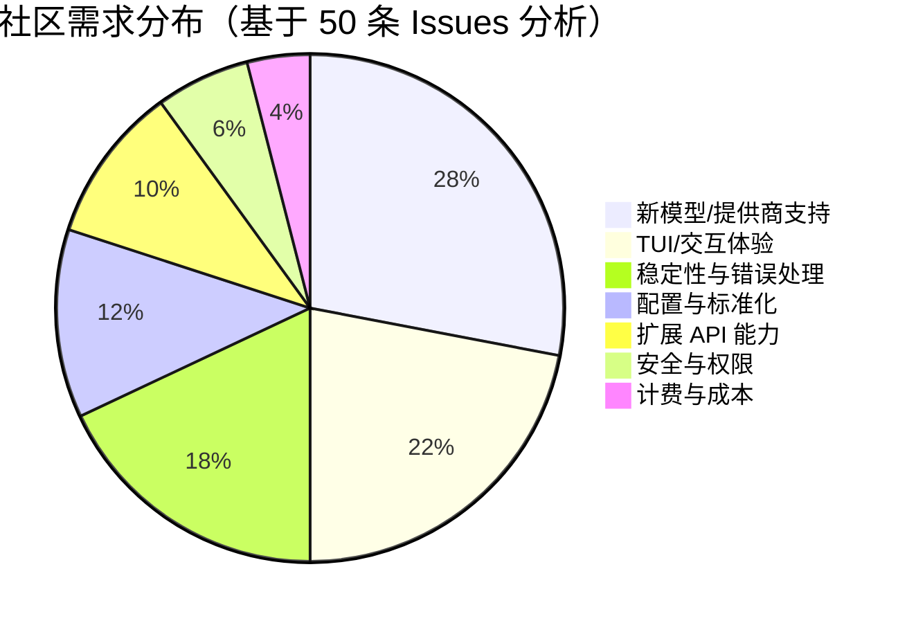

# AI CLI 工具社区动态日报 2026-06-03

> 生成时间: 2026-06-03 00:36 UTC | 覆盖工具: 9 个

- [Claude Code](https://github.com/anthropics/claude-code)
- [OpenAI Codex](https://github.com/openai/codex)
- [Gemini CLI](https://github.com/google-gemini/gemini-cli)
- [GitHub Copilot CLI](https://github.com/github/copilot-cli)
- [Kimi Code CLI](https://github.com/MoonshotAI/kimi-cli)
- [OpenCode](https://github.com/anomalyco/opencode)
- [Pi](https://github.com/badlogic/pi-mono)
- [Qwen Code](https://github.com/QwenLM/qwen-code)
- [DeepSeek TUI](https://github.com/Hmbown/DeepSeek-TUI)
- [Claude Code Skills](https://github.com/anthropics/skills)

---

## 横向对比

# AI CLI 工具生态横向对比分析报告 | 2026-06-03

---

## 1. 生态全景

当前 AI CLI 工具生态呈现**"功能收敛、体验分化"**态势：所有头部产品均已覆盖代码生成、Agent 编排、MCP 扩展三大基线能力，但社区诉求正从"功能丰富度"快速转向**生产可信度**——内存稳定性、计费透明度、进程生命周期管理成为采纳决策的核心变量。与此同时，**语音交互、定时自动化、递归推理（RLM）**等前沿特性开始定义下一代产品边界，而中国企业（MoonshotAI、Qwen、DeepSeek）的模型降价与生态开放正在重塑全球定价格局。

---

## 2. 各工具活跃度对比

| 工具 | 今日新增/活跃 Issues | 今日新增/活跃 PRs | 版本发布 | 关键动态 |
|:---|:---|:---|:---|:---|
| **Claude Code** | 10+ 热点（含年度最高票 #16157） | 4（活跃度偏低） | v2.1.160-161 连续安全更新 | 订阅-能力错配危机，内存泄漏 blocker 未解 |
| **OpenAI Codex** | 40+（gpt-image-2 故障潮） | 10+（含 2 次发布回滚） | App 26.601.20914 / CLI 0.135-0.136 | 模型路由 regression + 认证死循环双重危机 |
| **Gemini CLI** | 10 条热点 | 10 条 | v0.45.0-nightly | Agent 系统可靠性为核心瓶颈 |
| **GitHub Copilot CLI** | 40 条 | 0（24h 内无更新） | v1.0.58-59（语音/定时任务） | 实验性功能爆发，企业适配滞后 |
| **Kimi Code CLI** | **2 条**（极低） | **0** | 无 | 社区沉寂，基础 bug 未获关注 |
| **OpenCode** | 50 条 | 50 条 | 无新发布 | RLM 落地，DeepSeek 降价引发定价争议 |
| **Pi** | 10 条 | 10 条 | 无 | MiniMax-M3 支持 <48h，TUI 性能突破 |
| **Qwen Code** | 8 条 | 10 条 | v0.17.0-nightly | v0.17 回归问题密集，快速修复中 |
| **DeepSeek TUI/CodeWhale** | 37 条 | 48 条 | v0.8.50（品牌迁移） | 终端渲染稳定性为长期债务 |

> **活跃度分层**：OpenCode/DeepSeek TUI 为**超活跃**（50+ PR/Issue）；Claude Code/Codex/Copilot CLI/Gemini 为**高活跃**（10-40）；Qwen Code/Pi 为**中等活跃**；**Kimi Code CLI 显著掉队**（2 Issue/0 PR）。

---

## 3. 共同关注的功能方向

| 功能方向 | 涉及工具 | 具体诉求与紧迫性 |
|:---|:---|:---|
| **内存/进程稳定性** | Claude Code (#4953, #8856, #64832)、Qwen Code (#4698)、OpenCode (#20695)、Gemini CLI (#21409) | 内存泄漏、子进程失控、OOM 杀死为**跨平台共性 blocker**，长时间运行/CI 场景不可接受 |
| **计费透明度与成本控制** | Claude Code (#16157, #38335, #62063)、OpenCode (#28846, #20859)、Codex (#19555)、Pi (#5286) | 强制 1M 上下文、子代理计费归属错误、额度秒光——**企业采纳前置条件** |
| **MCP 安全与治理** | Qwen Code (#4615, #4713)、Copilot CLI (#3436, #3642)、Gemini CLI (#27626 SSRF 防护) | 项目级配置审批、服务器来源信任、供应链攻击防护 |
| **多账户/配置切换** | Claude Code (#20131, 最高票功能请求)、Copilot CLI（组织/个人切换摩擦） | 企业/个人双账户、多租户开发者为**高频痛点** |
| **终端渲染与跨平台一致性** | DeepSeek TUI (#1615, #2592)、Pi (#5328 CJK, #5343 长会话)、Qwen Code (#2950 中文滚动)、Gemini CLI (#25166 假死) | TUI 引擎的国际化、长会话性能、终端模拟器兼容为**体验基线** |
| **Agent 系统可靠性** | Gemini CLI (#21409 挂起, #22323 误报成功)、Claude Code (#22264 并行取消)、Codex (#25973 插件丢失) | 子 Agent 调度、状态透明、超时熔断为**自动化场景刚需** |

---

## 4. 差异化定位分析

| 工具 | 核心侧重 | 目标用户 | 技术路线特征 |
|:---|:---|:---|:---|
| **Claude Code** | 企业级安全与深度集成 | 大型团队、合规敏感企业 | Anthropic 模型独占，安全补丁密集，但订阅策略激进引发信任危机 |
| **OpenAI Codex** | 全栈模型能力与 IDE 协同 | OpenAI 生态重度用户、跨端开发者 | 模型路由层复杂（gpt-image-2/gpt-5.5/codex 多线），发布稳定性存疑 |
| **Gemini CLI** | Agent 系统与评估基础设施 | Google Cloud 用户、模型实验者 | 76 行为测试覆盖、Flash 模型快速切换，但 Agent 调度为明显短板 |
| **GitHub Copilot CLI** | 自动化工作流与语音交互 | GitHub 生态开发者、DevOps | 本地语音 `/voice`、定时任务 `/every` 差异化，但"CLI 二等公民" perception 强烈 |
| **OpenCode** | 开放模型生态与递归推理 | 多模型策略用户、前沿技术采纳者 | RLM 架构领先、MCP 懒加载、局域网自动发现，但安全/定价争议并行 |
| **Pi** | 极致 TUI 性能与多云适配 | 终端重度用户、中国本土模型使用者 | CJK 换行、长会话 O(n²) 优化等硬核工程，MiniMax/ZAI 国内生态响应极快 |
| **Qwen Code** | 企业安全与 WebShell 演进 | 中国企业用户、自托管部署者 | 项目级 MCP 审批、Vim 模式、独立安装包更新，v0.17 稳定性承压 |
| **DeepSeek TUI/CodeWhale** | 终端原生与多模型路由 | 成本敏感开发者、TUI 爱好者 | 缓存命中率优化、提供商故障回退链、Hook 插件生态，但引擎稳定性为长期债务 |
| **Kimi Code CLI** | — | — | **定位模糊**，白名单机制僵化，社区活跃度显著落后 |

---

## 5. 社区热度与成熟度

### 社区热度矩阵

```
高活跃度 + 高成熟度：  [Claude Code] —— 用户基数大，但信任危机
                      [OpenAI Codex] —— 生态完整，发布稳定性下滑
                      
高活跃度 + 快速迭代：  [OpenCode] —— 50 PR/日，架构激进
                      [DeepSeek TUI] —— 品牌迁移期，37 Issue + 48 PR
                      [Qwen Code] —— v0.17 回归密集，修复响应快
                      
中等活跃度 + 精细打磨： [Pi] —— 工程深度高，社区紧凑
                      [Gemini CLI] —— Google 资源支撑，Agent 瓶颈待破
                      
高活跃度 + 体验债务：   [GitHub Copilot CLI] —— 功能爆发，Windows/企业适配滞后
                      
低活跃度 + 风险信号：   [Kimi Code CLI] —— 2 Issue/0 PR/无发布，需警惕项目健康度
```

### 成熟度关键指标

| 维度 | 领先者 | 落后者 |
|:---|:---|:---|
| 发布稳定性 | Pi（<48h 新模型支持）、Gemini（nightly 节奏稳定） | Codex（6 月初 2 次回滚）、Qwen Code（v0.17 回归） |
| 安全响应 | Claude Code（连续安全加固）、Qwen Code（MCP 审批门控） | OpenCode（AI 越权 TRUNCATE #27745） |
| 跨平台一致性 | Pi（CJK、XDG、tmux 全覆盖） | Copilot CLI（Windows 持续边缘化）、DeepSeek TUI（Mac 系统性落后） |
| 文档与可观测性 | OpenCode（heap snapshot 采集文档化） | Claude Code（内存问题无官方修复承诺） |

---

## 6. 值得关注的趋势信号

### 信号一：**"生产可信度"取代"功能演示"成为采纳门槛**
- **数据支撑**：Claude Code #16157（691 👍）、#4953（69 👍）等稳定性 Issue 票数超越功能请求；Qwen Code v0.17 发布后稳定性 Issue 占比骤升至 60%+
- **开发者行动**：评估 CLI 工具时，优先验证长时间运行内存曲线、子进程回收策略、超时熔断机制

### 信号二：**递归推理（RLM）与 Agent 编排的架构分层**
- **数据支撑**：OpenCode #8554 关闭（RLM 程序化子 LLM 调用）、DeepSeek TUI PR #2577（模式变更运行时消息注入）、Gemini CLI 子 Agent 状态误报
- **行业意义**：从"单次 tool call"到"循环内嵌 LLM 调用"的范式迁移，将重新定义 Agent 系统的时延与成本模型

### 信号三：**中国模型降价倒逼全球定价重构**
- **数据支撑**：DeepSeek V4 Pro 降价 75%，OpenCode Go 4 倍溢价成众矢之的（#28846, 67 👍）；MiniMax-M3、ZAI 智谱快速接入 Pi/Qwen
- **决策者参考**：企业采购需重新评估"模型成本 vs 平台溢价"结构，自托管/多模型路由工具（OpenCode、Pi、DeepSeek TUI）的战略价值上升

### 信号四：**终端体验成为差异化战场，但"终端原生"与"图形降级"张力加剧**
- **数据支撑**：Copilot CLI 推 `/voice` 免手操作、DeepSeek TUI 社区同时呼吁 VSCode 集成、Pi 专项优化 CJK/长会话渲染
- **产品启示**：纯 TUI 工具需预留 Web/GUI 降级路径，IDE 集成工具需强化终端无头模式

### 信号五：**MCP 安全从"功能扩展"升级为"信任基础设施"**
- **数据支撑**：Qwen Code #4615（项目级 MCP 审批）、Claude Code 安全门（`.npmrc` 写入确认）、Gemini CLI SSRF 防护
- **合规要求**：企业部署需验证 MCP 服务器的来源审计、权限沙箱、配置变更审批链

---

*报告基于 2026-06-03 各工具 GitHub 公开数据生成，适合技术选型、投资评估与产品规划参考。*

---

## 各工具详细报告

<details>
<summary><strong>Claude Code</strong> — <a href="https://github.com/anthropics/claude-code">anthropics/claude-code</a></summary>

## Claude Code Skills 社区热点

> 数据来源: [anthropics/skills](https://github.com/anthropics/skills)

# Claude Code Skills 社区热点报告（截至 2026-06-03）

---

## 1. 热门 Skills 排行（按社区活跃度）

| 排名 | Skill | 功能概述 | 讨论热点 | 状态 |
|:---|:---|:---|:---|:---|
| 1 | **[document-typography](https://github.com/anthropics/skills/pull/514)** | AI 生成文档的排版质量控制：修复孤行、寡行、编号错位等排版问题 | 被视为"每个 Claude 文档都需要的底层能力"，讨论聚焦其普适性与自动触发机制 | 🟡 Open |
| 2 | **[ODT](https://github.com/anthropics/skills/pull/486)** | OpenDocument 格式（.odt/.ods）的创建、模板填充与 HTML 转换 | 开源/ISO 标准文档格式的企业需求，与现有 DOCX/PDF skill 的定位差异 | 🟡 Open |
| 3 | **[frontend-design](https://github.com/anthropics/skills/pull/210)** | 前端设计 Skill 的清晰度与可执行性改进 | 如何让设计指令在单轮对话中即可执行，避免模糊指导 | 🟡 Open |
| 4 | **[skill-quality-analyzer / skill-security-analyzer](https://github.com/anthropics/skills/pull/83)** | 元 Skill：自动评估 Skill 质量（结构、文档、示例等五维度）与安全审查 | 社区对 Skill 生态自我治理工具的期待，"谁来审查审查者"的元问题 | 🟡 Open |
| 5 | **[agent-creator](https://github.com/anthropics/skills/pull/1140)** | 任务专属 Agent 集的创建工具 + 多工具并行评估修复 + Windows 支持 | 从单一 Skill 到 Agent 编排的跃迁，Windows 兼容性为阻塞痛点 | 🟡 Open |
| 6 | **[testing-patterns](https://github.com/anthropics/skills/pull/723)** | 全栈测试体系：测试哲学、单元测试、React 组件测试、E2E | Testing Trophy 模型与"测什么/不测什么"的边界争议 | 🟡 Open |
| 7 | **[ServiceNow](https://github.com/anthropics/skills/pull/568)** | 企业级 ServiceNow 平台助手：ITSM/ITOM/SecOps/FSM/SPM 等全模块覆盖 | 广度 vs 深度的权衡，是否为单一平台 Skill 的合理粒度 | 🟡 Open |
| 8 | **[sensory](https://github.com/anthropics/skills/pull/806)** | 原生 macOS 自动化（AppleScript 替代截图方案），分级权限系统 | 替代 Computer Use 截图方案的效率与隐私优势，Accessibility 权限门槛 | 🟡 Open |

---

## 2. 社区需求趋势（Issues 提炼）

| 趋势方向 | 代表 Issue | 核心诉求 |
|:---|:---|:---|
| **企业协作与治理** | [#228](https://github.com/anthropics/skills/issues/228) 组织级 Skill 共享 | 从个人工具转向团队基础设施，需官方共享库/直链分发 |
| **安全信任边界** | [#492](https://github.com/anthropics/skills/issues/492) 命名空间仿冒风险 | `anthropic/` 命名空间被社区 Skill 滥用，需官方签名或隔离机制 |
| **Skill 工程化标准** | [#202](https://github.com/anthropics/skills/issues/202) skill-creator 最佳实践 | 从"写给人读"转向"写给 Claude 执行"，token 效率与指令精确性 |
| **MCP 协议融合** | [#16](https://github.com/anthropics/skills/issues/16) Skills 作为 MCP 暴露 | 技能即 API，算法艺术 → `generateAlgorithmArt({...})` 的标准化调用 |
| **跨平台兼容性** | [#556](https://github.com/anthropics/skills/issues/556) [#1099](https://github.com/anthropics/skills/issues/1099) [#1050](https://github.com/anthropics/skills/issues/1050) | Windows 环境为 skill-creator 工具链的显著短板，阻塞开发者体验 |
| **上下文窗口优化** | [#1220](https://github.com/anthropics/skills/issues/1220) [#1102](https://github.com/anthropics/skills/issues/1102) | 多文件引用内联打包、MCP 大数据返回的压缩机制 |
| **插件分发治理** | [#189](https://github.com/anthropics/skills/issues/189) [#1087](https://github.com/anthropics/skills/issues/1087) | `document-skills` 与 `example-skills` 内容重复，marketplace.json 声明与实际加载不一致 |

---

## 3. 高潜力待合并 Skills

| PR | 价值判断 | 合并阻塞点推测 |
|:---|:---|:---|
| **[#514 document-typography](https://github.com/anthropics/skills/pull/514)** | 底层基础设施级能力，可覆盖所有文档生成场景 | 需确认自动触发策略是否过度侵入默认行为 |
| **[#1140 agent-creator](https://github.com/anthropics/skills/pull/1140)** | 从 Skill 到 Agent 的架构升级，含关键稳定性修复 | 多工具并行评估的测试覆盖度，Windows 路径变更的回归风险 |
| **[#723 testing-patterns](https://github.com/anthropics/skills/pull/723)** | 测试领域最系统的 Skill 尝试，填补生态空白 | 与现有代码生成 Skill 的职责边界划分 |
| **[#806 sensory](https://github.com/anthropics/skills/pull/806)** | Computer Use 的轻量级替代方案，隐私与效率双优 | AppleScript 的跨 macOS 版本兼容性，Tier 2 权限的安全审核 |
| **[#568 ServiceNow](https://github.com/anthropics/skills/pull/568)** | 企业 ITSM 市场的关键平台覆盖 | 模块过于庞大，可能需拆分为子 Skill 或分层加载 |
| **[#360 AppDeploy](https://github.com/anthropics/skills/pull/360)** | 全栈部署闭环：Claude → 公网 URL 的完整链路 | 第三方服务依赖（appdeploy.ai）的长期可用性与安全审计 |
| **[#83 双 Analyzer](https://github.com/anthropics/skills/pull/83)** | 生态自我治理的元能力，质量与安全双维度 | 评估标准的权威性来源，与官方审核流程的冲突或互补 |

---

## 4. Skills 生态洞察

> **核心诉求：从"个人效率脚本"进化为"可治理的企业级基础设施"** — 社区正同时推动 Skill 的标准化封装（MCP 化）、安全信任机制（命名空间/签名）、跨平台工程工具链（Windows 兼容）、以及组织级分发与协作能力，而官方仓库的治理框架（CONTRIBUTING.md、marketplace 规范、插件去重）尚未跟上社区扩张速度。

---

---

# Claude Code 社区动态日报 | 2026-06-03

## 今日速览

今日社区核心矛盾聚焦于**订阅层级与模型能力错配**：Pro 用户被强制使用 1M 上下文导致额度耗尽的问题持续发酵，同时 v2.1.160-161 连续发布安全加固更新。内存泄漏与进程管理类问题报告显著增加，开发者对多账户切换和生产环境稳定性的需求日益迫切。

---

## 版本发布

### v2.1.161（最新）
| 特性 | 说明 |
|:---|:---|
| **OTEL 指标增强** | `OTEL_RESOURCE_ATTRIBUTES` 环境变量值现作为指标数据点标签，支持按团队、仓库等自定义维度切分用量指标 |
| **Agent 进度可视化** | `claude agents` 列表在任务分发时显示 `完成/总数` 进度，peek 视图展示最长运行项 |

### v2.1.160
| 特性 | 说明 |
|:---|:---|
| **Shell 启动文件写入保护** | 写入 `.zshenv`、`.zlogin`、`.bash_login` 及 `~/.config/git/` 前新增确认提示，防止意外命令执行 |
| **构建工具配置安全门** | `acceptEdits` 模式写入 `.npmrc` 等可授予代码执行权限的构建工具配置文件前提示确认 |

> 🔗 [Releases 页面](https://github.com/anthropics/claude-code/releases)

---

## 社区热点 Issues

| # | 状态 | 标题 | 评论 | 👍 | 关键性与社区反应 |
|:---|:---|:---|---:|---:|:---|
| [#16157](https://github.com/anthropics/claude-code/issues/16157) | 🔴 OPEN | Max 订阅瞬间触达用量限制 | 1476 | 691 | **年度最高票 Issue**。Max 用户反馈额度消耗异常剧烈，疑似计费逻辑或上下文窗口策略缺陷，社区情绪激烈，要求透明化计费机制 |
| [#38335](https://github.com/anthropics/claude-code/issues/38335) | 🔴 OPEN | Max 计划会话限制自 3/23 起异常快速耗尽 | 760 | 461 | 与 #16157 形成关联投诉潮，时间线指向特定版本变更，用户要求回滚或补偿 |
| [#8856](https://github.com/anthropics/claude-code/issues/8856) | 🔴 OPEN | `/tmp/claude-*-cwd` 工作目录追踪文件泄漏 | 107 | 68 | 长期存在的 Linux 平台内存/磁盘泄漏，有稳定复现，影响 CI/CD 和长时间运行场景 |
| [#4953](https://github.com/anthropics/claude-code/issues/4953) | 🔴 OPEN | 内存泄漏导致进程膨胀至 120+ GB 被 OOM 杀死 | 92 | 69 | **生产环境 blocker**，扩展会话必现，社区提供多种诊断数据但未获官方修复承诺 |
| [#22264](https://github.com/anthropics/claude-code/issues/22264) | 🔴 OPEN | 并行工具调用级联失败：一错全取消 | 32 | 61 | 架构级缺陷，严重影响 Agent 任务可靠性，开发者被迫串行化工具调用牺牲效率 |
| [#20131](https://github.com/anthropics/claude-code/issues/20131) | 🔴 OPEN | 多账户配置支持（类似 `gh auth switch`） | 30 | 83 | **最高票功能请求**，企业/个人双账户用户痛点明确，社区多次提出替代方案 |
| [#62063](https://github.com/anthropics/claude-code/issues/62063) | 🔴 OPEN | Pro 计划新会话默认强制 1M 上下文且无降级路径 | 41 | 23 | 直接关联成本投诉，Pro 用户被迫为不需要的上下文付费，被指"订阅欺诈" |
| [#52121](https://github.com/anthropics/claude-code/issues/52121) | 🔴 OPEN | `ENABLE_TOOL_SEARCH=true` 时 Grep/Glob 工具完全消失 | 10 | 6 | 工具注册系统缺陷，影响依赖代码搜索的工作流，与 #64136 形成工具可用性危机 |
| [#64832](https://github.com/anthropics/claude-code/issues/64832) | 🔴 OPEN | v2.1.160 Node.js 子进程泄漏：~115 进程耗尽 32GB RAM | 2 | 0 | **新版本回归**，8 分钟内系统级崩溃，疑似与最新安全改动相关的进程管理副作用 |
| [#64744](https://github.com/anthropics/claude-code/issues/64744) | 🔴 OPEN | `ScheduleWakeup` Ctrl+C 后持续存活，无人值守无限消耗 Token | 3 | 1 | 极端成本风险场景，守护进程设计缺陷可能导致睡眠时段巨额账单 |

---

## 重要 PR 进展

| # | 状态 | 标题 | 核心内容 |
|:---|:---|:---|:---|
| [#64857](https://github.com/anthropics/claude-code/pull/64857) | 🟡 OPEN | `extensibility.py` 符号链接遍历漏洞修复 | 阻止项目可控 GUI 通过符号链接越权访问，安全加固类修复 |
| [#64728](https://github.com/anthropics/claude-code/pull/64728) | 🟡 OPEN | 移除失效的 `statsig.anthropic.com` 防火墙白名单 | 解决开发容器因 DNS 解析失败无法启动的阻塞问题，基础设施维护 |
| [#62821](https://github.com/anthropics/claude-code/pull/62821) | ✅ CLOSED | 文档：plugin-MCP 会话 ID 的 env-bridge 变通方案 | 填补 #61752 未解决前的文档空白，为插件开发者提供临时身份传递模式 |
| [#64607](https://github.com/anthropics/claude-code/pull/64607) | 🟡 OPEN | 修正 Plugin `.mcp.json` 示例错误使用 `mcpServers` 包装器 | 文档准确性修复，区分 `plugin.json` 的 `mcpServers` 键与 `.mcp.json` 的扁平格式，降低插件开发入门门槛 |

> 注：过去 24 小时仅 4 个 PR 更新，社区贡献活跃度偏低，核心开发以安全补丁和文档维护为主。

---

## 功能需求趋势

```
[████████░░] 多账户/配置切换    ← 最热 (#20131 #24963 #22872 #30031)
[███████░░░] 成本可控与计费透明  ← 危机级 (#16157 #38335 #62063 #63634)
[██████░░░░] Windows/WSL 原生集成 ← 平台扩张 (#49933)
[█████░░░░░] 内存/进程稳定性     ← 质量危机 (#4953 #8856 #64832)
[████░░░░░░] 工具系统可靠性      ← 架构债务 (#22264 #52121 #64136)
[███░░░░░░░] Hook/Agent 可编程性  ← 生态扩展 (#64898 #56318)
[██░░░░░░░░] 预览/桌面端体验     ← 产品打磨 (#57844)
```

**趋势解读**：社区正从"功能丰富度"转向"生产可信度"诉求。多账户和成本控制是企业采用的前置条件，而内存泄漏与进程管理问题已构成平台信任危机。

---

## 开发者关注点

### 🔴 高频痛点

| 痛点 | 典型表现 | 影响面 |
|:---|:---|:---|
| **订阅-能力错配** | Pro 强制 1M 上下文、Max 额度秒光 | 全付费用户 |
| **进程/内存失控** | 子进程泄漏、OOM、守护进程不死 | Linux/长时间运行用户 |
| **工具调用可靠性** | 并行取消、工具消失、Bash 风暴 | Agent/自动化工作流 |
| **账户切换摩擦** | 完全登出重登、无 CLI 快速切换 | 多租户开发者 |

### 🟡 新兴诉求

- **Hook 驱动 Agent 编排**：#64898 要求从 Hook 事件程序化派生子 Agent，反映从"交互式"向"自动化"使用模式的迁移
- **跨会话身份传递**：插件 MCP 缺乏原生 session ID 注入，社区已形成 env-bridge 变通模式（#62821），等待官方一等支持
- **远程-本地会话区分**：#64895 揭示 Web 端与桌面端会话管理混乱，导致误删和无操作

### 💡 开发者建议方向

> "在追加新模型支持前，优先解决 1M 上下文的强制降级路径和进程生命周期管理。Claude Code 正从'好用'走向'敢用'的关键阶段。"

---

*日报基于 GitHub 公开数据生成，不代表 Anthropic 官方立场。*

</details>

<details>
<summary><strong>OpenAI Codex</strong> — <a href="https://github.com/openai/codex">openai/codex</a></summary>

# OpenAI Codex 社区动态日报 | 2026-06-03

## 今日速览

今日社区被 **gpt-image-2 模型大规模失效事件** 主导，CLI 和 App 双端均出现"The model 'gpt-image-2' does not exist"错误，OpenAI 已紧急关闭多起相关 Issue。同时，**认证系统故障**持续发酵，多位用户遭遇手机号验证死循环和 legacy 号码无法更换的问题。

---

## 社区热点 Issues

### 🔴 模型服务故障

| # | 状态 | 标题 | 评论 | 关键信息 |
|---|------|------|------|---------|
| [#25967](https://github.com/openai/codex/issues/25967) | ⬜ CLOSED | **Codex App 仅返回 "The model 'gpt-image-2' does not exist"** | 48 | Pro 用户，macOS，App 版本 26.601.20914，**任何请求都触发图像生成模型调用失败** |
| [#25965](https://github.com/openai/codex/issues/25965) | ⬜ CLOSED | **CLI: The model 'gpt-image-2' does not exist** | 35 | Max 订阅，codex-cli 0.135.0，**43 👍 高共鸣** |
| [#25972](https://github.com/openai/codex/issues/25972) | ⬜ CLOSED | **image_generation_user_error** | 32 | Pro x5 团队账户，gpt-5.5 xhigh，**付费高阶用户受影响** |
| [#25971](https://github.com/openai/codex/issues/25971) | ⬜ CLOSED | **App: The model 'gpt-image-2' does not exist** | 14 | **36 👍**，Mac 用户集中反馈 |
| [#25966](https://github.com/openai/codex/issues/25966) | ⬜ CLOSED | **Status 400: "The model 'gpt-image-2' does not exist"** | 7 | codex-cli 0.136.0，Pro 用户 |
| [#25975](https://github.com/openai/codex/issues/25975) | ⬜ CLOSED | **The model 'gpt-image-2' does not exist error in Codex** | 15 | 附截图，可视化确认错误 |
| [#25974](https://github.com/openai/codex/issues/25974) | ⬜ CLOSED | **Codex 无故尝试调用图像生成模型** | 5 | **核心问题：GPT-5.5 对非图像提示也触发图像生成** |

> **分析**：这是 6 月 2 日新版本（App 26.601.20914 / CLI 0.135-0.136）引入的 **regression**，模型路由逻辑错误地将普通代码请求导向 `gpt-image-2`。OpenAI 在 24 小时内批量关闭，推测为服务端 hotfix，但未发布正式说明。

---

### 🔴 认证系统危机

| # | 状态 | 标题 | 评论 | 关键信息 |
|---|------|------|------|---------|
| [#25749](https://github.com/openai/codex/issues/25749) | 🔴 OPEN | **Codex 要求验证无法访问的 legacy 手机号，无更换/恢复路径** | 23 | Google OAuth + MFA 正常用户被卡，**严重 UX 缺陷** |
| [#25670](https://github.com/openai/codex/issues/25670) | 🔴 OPEN | **Authentication for Codex has literally broken** | 18 | 已设置 passkey + 手机 + 验证器，**仍强制要求输入旧手机号，陷入死循环** |

> **分析**：认证层与 ChatGPT 主账户体系出现 **权限不一致**，Codex 额外要求独立手机号验证，且未提供账号恢复流程。影响多因素认证用户，存在 **账户锁定风险**。

---

### 🟡 其他关键 Issue

| # | 状态 | 标题 | 评论 | 关键信息 |
|---|------|------|------|---------|
| [#14860](https://github.com/openai/codex/issues/14860) | 🔴 OPEN | **Error running remote compact task** | **91** | **本日最高评论**，3 月创建持续发酵，gpt-5.4 + Linux，远程压缩任务崩溃，71 👍 |
| [#24098](https://github.com/openai/codex/issues/24098) | 🔴 OPEN | **Windows elevated sandbox fails with "spawn setup refresh"** | 14 | 0.133.0，提权沙箱崩溃，非提权正常，**Windows 企业用户阻塞** |
| [#25973](https://github.com/openai/codex/issues/25973) | 🔴 OPEN | **Computer use and browser plug-in disappear after updating** | 5 | 26.601.20914 更新后 **核心功能丢失**，Max 订阅用户 |
| [#25758](https://github.com/openai/codex/issues/25758) | 🔴 OPEN | **App overwrites bundled plugin config/cache, removes Computer Use/Browser plugins** | 3 | **配置覆盖导致插件被清除**，与 #25973 可能同源 |

---

## 重要 PR 进展

| # | 状态 | 标题 | 核心内容 |
|---|------|------|---------|
| [#25989](https://github.com/openai/codex/pull/25989) | 🟢 OPEN | **[codex-app-server] add native integrity state bridge** | 新增实验性 `nativeIntegrityState` RPC（read/write/clear），支持无锁 CAS 写入，用于客户端完整性状态管理 |
| [#25688](https://github.com/openai/codex/pull/25688) | 🟢 OPEN | **[codex-rs] Add managed per-app approval requirements** | 托管式应用级审批约束，`requirements.toml` 支持 `allowed_approvals_reviewers`，多层配置合并 |
| [#25232](https://github.com/openai/codex/pull/25232) | 🟢 OPEN | **[codex] derive window generation from effective rollout lineage** | 修复窗口生成语义，`x-codex-window-id` 正确反映回滚/恢复/保留历史后的有效部署谱系 |
| [#25946](https://github.com/openai/codex/pull/25946) | 🟢 OPEN | **[codex-analytics] report compaction request token counts** | 上报 v1/v2 compaction 请求的 token 计数，支持服务端 `input_tokens` 与本地估算 fallback |
| [#25364](https://github.com/openai/codex/pull/25364) | 🟢 OPEN | **Add SessionStart hook environment overlays** | `SessionStart` hooks 支持结构化环境变量注入，跨 shell 无关，解决工具链路径发现 |
| [#25976](https://github.com/openai/codex/pull/25976) | 🟢 OPEN | **use stable item IDs for responsesapi calls** | Responses API 调用使用稳定 item ID，外部贡献 |
| [#25925](https://github.com/openai/codex/pull/25925) | 🟢 OPEN | **[codex] Copy user Bazel settings into Codex worktrees** | 新 worktree 自动复制主 checkout 的 `user.bazelrc`，修复 Bazel 本地覆盖丢失 |
| [#25960](https://github.com/openai/codex/pull/25960) | 🟢 OPEN | **Restore Windows coverage for code-mode image generation exposure** | 恢复 Windows 上 code-mode 图像生成的测试覆盖，绕过 V8 运行时可靠性问题 |
| [#25945](https://github.com/openai/codex/pull/25945) | 🟢 OPEN | **Allow Windows signing environment deployment** | 恢复 Windows 发布签名环境部署，支持 smoke-test |
| [#25988](https://github.com/openai/codex/pull/25988) | ⬜ CLOSED | **revert: publish release symbol artifacts** | 回滚 #25916 和 #25649 的符号产物发布 |
| [#25985](https://github.com/openai/codex/pull/25985) | ⬜ CLOSED | **Revert "Fix Windows release PDB staging"** | 回滚 Windows PDB 暂存修复 |
| [#25963](https://github.com/openai/codex/pull/25963) | ⬜ CLOSED | **Allow EDU accounts to fetch cloud config bundles** | EDU 工作区可获取云配置 bundle，修复管理员 UI 配置与客户端获取不匹配 |

> **工程动态**：今日出现 **两次发布相关回滚**（#25988, #25985），结合 gpt-image-2 故障，表明 6 月初版本存在 **发布流水线稳定性问题**。同时，EDU 账户支持、Windows 签名恢复等显示 **企业/教育市场扩展** 优先级提升。

---

## 功能需求趋势

基于 50 条活跃 Issue 分析，社区关注方向排序：

| 优先级 | 方向 | 代表 Issue | 趋势解读 |
|--------|------|-----------|---------|
| **P0** | **模型服务稳定性** | #25967 系列 | gpt-image-2 故障是 **模型路由层可靠性** 的冰山一角，需更 graceful 的降级机制 |
| **P0** | **认证与账户恢复** | #25749, #25670 | 多因素认证与 Codex 独立验证链的 **权限同步** 是设计缺陷 |
| **P1** | **Windows 体验** | #24098, #21638, #25160, #25178, #25810 | Windows 沙箱、终端粘贴、窗口管理、截图 API 等 **平台适配债务累积** |
| **P1** | **Computer Use / Browser 插件稳定性** | #25973, #25758, #25719 | 核心差异化功能在更新中 **频繁回退/丢失**，配置持久化机制脆弱 |
| **P2** | **用量透明度** | #19555, #23671 | CLI 状态栏显示剩余额度、Business vs Plus 用量差异需可解释 |
| **P2** | **IDE 扩展深度集成** | #14331 | 模型版本兼容性、扩展端认证状态同步 |

---

## 开发者痛点总结

```
┌─────────────────────────────────────────────────────────────┐
│  🔴 阻断性（今日新增/加剧）                                   │
│  • gpt-image-2 模型路由错误 → 所有含图像能力的请求失败          │
│  • 认证死循环 → 已配置 MFA 的用户无法使用 Codex               │
│  • Computer Use / Browser 插件更新后消失 → 核心工作流中断       │
├─────────────────────────────────────────────────────────────┤
│  🟡 持续性（超过 2 周未解决）                                 │
│  • Linux 远程 compact 任务崩溃（#14860，91 评论，3 个月）      │
│  • Windows 提权沙箱 spawn 失败（#24098，影响企业部署）         │
│  • macOS syspolicyd/trustd CPU 飙高（#25719，安全扫描冲突）    │
├─────────────────────────────────────────────────────────────┤
│  🟢 高频需求（反复出现的新 Issue）                             │
│  • "显示剩余额度"（#19555）— 对标 Claude Code                 │
│  • Business 账户用量异常（#23671）— 计费透明度质疑              │
│  • 自定义模型 provider 支持（#24879）— 企业私有化部署           │
└─────────────────────────────────────────────────────────────┘
```

**建议关注**：明日是否发布 CLI 0.137 / App 26.602 补丁修复 gpt-image-2 路由，以及认证系统的官方回应。

---

*数据来源：github.com/openai/codex | 统计周期：2026-06-03 UTC*

</details>

<details>
<summary><strong>Gemini CLI</strong> — <a href="https://github.com/google-gemini/gemini-cli">google-gemini/gemini-cli</a></summary>

# Gemini CLI 社区动态日报 | 2026-06-03

## 今日速览

今日 Gemini CLI 发布 v0.45.0-nightly 版本，核心变更在于实验性标志下自动切换至 Flash GA 模型。社区持续聚焦 Agent 系统稳定性，通用 Agent 挂起、子 Agent 恢复状态误报等 P1 级问题仍在积极跟进，同时性能优化（VirtualizedList）和新模型支持（Gemini 3.5 Flash）成为开发主线。

---

## 版本发布

### v0.45.0-nightly.20260602.g665228e98
- **核心变更**：当检测到实验性标志时，自动过渡至 Flash GA 模型（非实验版）
- **提交者**：DavidAPierce
- **完整对比**：[v0.45.0-nightly.20260530 → v0.45.0-nightly.20260602](https://github.com/google-gemini/gemini-cli/compare/v0.45.0-nightly.20260530.g013914071...v0.45.0-nightly.20260602.g66522)

---

## 社区热点 Issues

| # | 标题 | 优先级 | 评论 | 关键动态 |
|---|------|--------|------|----------|
| [#24353](https://github.com/google-gemini/gemini-cli/issues/24353) | Robust component level evaluations | P1 | 7 | 行为评估测试已扩展至 76 个，覆盖 6 个 Gemini 模型版本，是质量基础设施的核心建设 |
| [#22745](https://github.com/google-gemini/gemini-cli/issues/22745) | AST-aware file reads/search/mapping 评估 | P2 | 7 | 探索通过 AST 精确读取方法边界、减少 token 噪音，可能根本性提升代码理解效率 |
| [#21409](https://github.com/google-gemini/gemini-cli/issues/21409) | Generalist agent hangs | P1 | 7 👍8 | **高票用户痛点**：通用 Agent 无限挂起，简单操作如创建文件夹也会卡住，禁用子 Agent 可规避 |
| [#22323](https://github.com/google-gemini/gemini-cli/issues/22323) | Subagent 达 MAX_TURNS 后误报 GOAL success | P1 | 6 | 子 Agent 因轮次限制中断却返回成功，导致用户无法感知分析未完成 |
| [#21968](https://github.com/google-gemini/gemini-cli/issues/21968) | Gemini 不主动使用 skills 和 sub-agents | P2 | 6 | 用户配置 gradle/git 等技能后，模型几乎从不主动调用，需显式指令才生效 |
| [#25166](https://github.com/google-gemini/gemini-cli/issues/25166) | Shell 命令执行后 stuck "Waiting input" | P1 | 4 👍3 | 简单命令已完成但界面仍显示等待输入，高频出现的假死状态 |
| [#21983](https://github.com/google-gemini/gemini-cli/issues/21983) | Browser subagent Wayland 环境失败 | P1 | 4 | Linux Wayland 用户无法使用浏览器子 Agent，终止原因为 GOAL 但无实际输出 |
| [#26525](https://github.com/google-gemini/gemini-cli/issues/26525) | Auto Memory 日志安全：确定性脱敏 | P2 | 3 | 模型上下文已接收敏感信息后才进行脱敏，存在数据泄露风险，需前置确定性处理 |
| [#26523](https://github.com/google-gemini/gemini-cli/issues/26523) | Auto Memory 无效补丁静默跳过 | P2 | 3 | 格式错误/路径越界的补丁被静默丢弃，用户无法感知记忆系统失效 |
| [#22267](https://github.com/google-gemini/gemini-cli/issues/22267) | Browser Agent 忽略 settings.json 配置 | P2 | 3 | maxTurns 等全局配置对浏览器子 Agent 不生效，配置体系存在覆盖漏洞 |

---

## 重要 PR 进展

| # | 标题 | 状态 | 核心内容 |
|---|------|------|----------|
| [#27636](https://github.com/google-gemini/gemini-cli/pull/27636) | perf: optimize VirtualizedList and fix click handling | 🟡 Open | **P1 性能优化**：大数据集渲染优化、静态项点击机制重构，解决终端历史记录卡顿 |
| [#27614](https://github.com/google-gemini/gemini-cli/pull/27614) | feat: add Gemini 3.5 Flash model family | 🟡 Open | 新增 `gemini-3.5-flash-preview` 及 `flash-lite-preview` 支持，模型配置矩阵扩展 |
| [#27626](https://github.com/google-gemini/gemini-cli/pull/27626) | fix(core): block private OAuth metadata URLs | 🟡 Open | **安全加固**：MCP OAuth 元数据发现 SSRF 防护，阻断内网私有地址访问 |
| [#27580](https://github.com/google-gemini/gemini-cli/pull/27580) | fix(at-command): prevent regex stack overflow | 🟡 Open | **P1 稳定性**：将 `@` 命令解析从正则改为迭代扫描器，解决大输入灾难性回溯 |
| [#27639](https://github.com/google-gemini/gemini-cli/pull/27639) | fix(cli): disable auto-update for corporate paths | 🟡 Open | Google 内部路径 (`/google/bin/`) 运行时禁用自动更新，企业环境适配 |
| [#27588](https://github.com/google-gemini/gemini-cli/pull/27588) | fix(cli): support WSL2 clipboard image paste | 🟡 Open | WSL2 环境下通过 PowerShell 互操作读取 Windows 剪贴板图片，跨平台体验补全 |
| [#27619](https://github.com/google-gemini/gemini-cli/pull/27619) | fix(core): atomic update in MCP tool discovery | 🟡 Open | 网络瞬断时保留旧工具列表，避免 "tool not found" 错误，提升 MCP 可靠性 |
| [#27591](https://github.com/google-gemini/gemini-cli/pull/27591) | fix(cli): fall back for oversized bug report URLs | 🟡 Open | `/bug` 命令 URL 超限降级处理，解决 Android/Termux 深链接崩溃 |
| [#27631](https://github.com/google-gemini/gemini-cli/pull/27631) | Add static eval source analyzer | 🟡 Open | 评估开发工具链：TypeScript AST 解析提取 eval helper 元数据，测试质量基础设施 |
| [#21541](https://github.com/google-gemini/gemini-cli/pull/21541) | fix(policy): EBUSY fallback and TOML parse recovery | 🟡 Open | 文件重命名冲突增加 EBUSY 回退，TOML 解析失败恢复，提升配置鲁棒性 |

---

## 功能需求趋势

基于 50 条活跃 Issue 分析，社区关注呈 **三极分化**：

| 方向 | 热度 | 代表 Issue | 趋势解读 |
|------|------|-----------|----------|
| **Agent 系统可靠性** | 🔥🔥🔥 | #21409, #22323, #21968, #22093 | 子 Agent 调度、状态报告、权限控制是核心瓶颈，"Agent 用不起来"比"Agent 不够强"更紧迫 |
| **代码智能深度** | 🔥🔥 | #22745, #22746, #22747 | AST 感知工具链从探索进入评估阶段，可能替代现有基于文本的文件操作范式 |
| **记忆系统安全** | 🔥🔥 | #26525, #26523, #26522, #26516 | Auto Memory 三连安全/质量 Issue 集中曝光，隐私合规成为企业采纳前提 |
| **终端体验优化** | 🔥 | #21924, #25166, #24935 | 渲染性能、假死检测、外部编辑器兼容，直接影响开发者日常流畅度 |
| **模型生态扩展** | 🔥 | #27614 (PR), #24353 | 新模型快速接入能力 + 评估基础设施，支撑多模型策略 |

---

## 开发者关注点

### 🔴 高频痛点

1. **Agent 假死与状态不透明**
   - 通用 Agent 挂起 (#21409)、Shell 命令假等待 (#25166)、子 Agent 中断却报成功 (#22323)
   - *诉求*：明确的超时机制、可中断的进度反馈、真实状态暴露

2. **技能/子 Agent 发现机制失效**
   - 配置的技能不被主动调用 (#21968)，需用户显式提示
   - *诉求*：基于上下文的智能路由，或至少明确的技能推荐提示

3. **跨平台边缘场景**
   - Wayland 浏览器 Agent 崩溃 (#21983)、WSL 剪贴板 (#27588)、tmux 主题误检 (#27572)
   - *诉求*：Linux 桌面环境、Windows 子系统的同等优先级支持

### 🟡 潜在需求

- **确定性安全**：记忆系统的"先脱敏后入模" (#26525) 反映企业用户对数据治理的硬性要求
- **评估可观测**：76 个行为测试的运行结果如何触达社区开发者，而非仅内部可见 (#24353)

---

*日报基于 google-gemini/gemini-cli 公开 GitHub 数据生成*

</details>

<details>
<summary><strong>GitHub Copilot CLI</strong> — <a href="https://github.com/github/copilot-cli">github/copilot-cli</a></summary>

# GitHub Copilot CLI 社区动态日报 | 2026-06-03

---

## 1. 今日速览

Copilot CLI 昨日连发 **v1.0.58** 和 **v1.0.59** 两个版本，重磅推出 **本地语音输入（`/voice`）** 和 **定时任务调度（`/every`、`/after`）** 等实验性功能，标志着 CLI 向"免手操作"和"自动化工作流"迈出关键一步。社区同步爆发 40 条 Issue 更新，模型可见性、企业级 MCP 集成和跨平台一致性成为争议焦点。

---

## 2. 版本发布

### v1.0.59（2026-06-02）
| 特性 | 说明 |
|:---|:---|
| **`/voice` 语音指令** | 基于本地语音转文本模型，支持直接语音输入提示词，无需依赖云端 STT 服务 |
| **隐私优先设计** | 本地处理避免敏感代码通过语音外泄，适合企业内网环境 |

### v1.0.58（2026-06-02）
| 特性 | 说明 |
|:---|:---|
| **Rubber Duck 默认启用** | 调试辅助模式开箱即用 |
| **Remote JSON RPC 默认启用** | 远程集成能力标准化 |
| **`/experimental` 定时调度** | `/every`（周期性任务）、`/after`（延迟任务）支持定时执行提示 |
| **`/experimental` GitHub 主题** | 新增 `/theme` 切换 CLI 视觉风格 |
| **`/experimental` 新 UI** | 快捷访问 Issues、Pull Requests、Gists |

> 🔗 [Releases 页面](https://github.com/github/copilot-cli/releases)

---

## 3. 社区热点 Issues（Top 10）

| # | Issue | 状态 | 核心矛盾 | 社区反应 |
|:---|:---|:---|:---|:---|
| **#1703** | [Copilot CLI 未列出组织启用模型（如 Gemini 3.1 Pro）](https://github.com/github/copilot-cli/issues/1703) | 🔴 OPEN | **CLI 与 VS Code 模型列表不同步**，同一账户/组织下 VS Code 可见 Gemini 3.1 Pro，CLI 缺失 | 28 评论 / 54 👍，企业用户强烈不满，质疑"CLI 是二等公民" |
| **#2101** | [瞬态 API 错误导致速率限制](https://github.com/github/copilot-cli/issues/2101) | 🔴 OPEN | 频繁触发 `transient API error` → 强制冷却 1 分钟，**无指数退避或重试策略配置** | 26 评论 / 17 👍，CI/CD 场景受害者集中投诉 |
| **#2205** | [Terminator 终端滚动行为异常](https://github.com/github/copilot-cli/issues/2205) | 🔴 OPEN | 鼠标滚轮从"浏览历史输出"变为"切换输入记录"，**`--no-mouse` 无法禁用** | 12 评论 / 12 👍，终端兼容性回归 |
| **#2355** | [Windows 内部 PowerShell 工具无法启动 pwsh.exe](https://github.com/github/copilot-cli/issues/2355) | 🔴 OPEN | PATH 正确但内部工具运行时 `ENOENT`，**交互式正常 / 工具调用异常**的分裂行为 | 6 评论 / 6 👍，Windows 企业部署阻塞 |
| **#3436** | [`/mcp search` 构造错误 URL 缺 `/v0.1/` 段](https://github.com/github/copilot-cli/issues/3436) | 🔴 OPEN | 自托管 MCP Registry 404，**破坏企业级 MCP 注册表配置** | 5 评论 / 1 👍，企业 MCP 生态关键路径 |
| **#3636** | [企业 VPN 下语音模式无法启用](https://github.com/github/copilot-cli/issues/3636) | 🔴 OPEN | `/voice` 依赖模型目录预加载，**企业防火墙/VPN 阻断即完全不可用** | 1 评论 / 0 👍，v1.0.59 发布即暴露架构缺陷 |
| **#3572** | [无 GitHub 仓库时组织级自定义 Agent 不可见](https://github.com/github/copilot-cli/issues/3572) | 🔴 OPEN | **工作目录耦合设计**，`.github-private` 的 Agent 配置在非 repo 目录失效 | 1 评论 / 1 👍，DevOps/脚本场景受限 |
| **#3622** | [Windows 剪贴板复制静默失败](https://github.com/github/copilot-cli/issues/3622) | 🔴 OPEN | 1.0.48→后续版本回归，**无错误提示但粘贴为旧内容** | 1 评论 / 1 👍，日常高频操作受损 |
| **#3640** | [请求类 `git add -p` 的选择性文件变更接受](https://github.com/github/copilot-cli/issues/3640) | 🔴 OPEN | `/rewind` 全量回退过于粗暴，**无法粒度化控制 Agent 修改** | 0 评论 / 0 👍，新 Feature Request，反映工作流精细控制需求 |
| **#3639** | [请求 CLI ↔ VS Code Chat 双向会话同步](https://github.com/github/copilot-cli/issues/3639) | 🔴 OPEN | `/ide` 仅单向推送，**VS Code 回复不回显 CLI**，双端协同断裂 | 0 评论 / 0 👍，跨界面一致性诉求 |

---

## 4. 重要 PR 进展

> **今日无过去 24 小时内更新的 PR**。以下基于近期合并的关联 Issue 推断关键代码变动：

| 关联 Issue | 隐含 PR 内容 | 影响 |
|:---|:---|:---|
| **#3633** [已关闭] | Gemini 2.5 Pro 模型选择器修复 | 解决 `model_picker_enabled: true` 但 UI 不显示的过滤逻辑 Bug |
| **#3641** [已关闭] | `/diff` 模式切换能力 | 回应"diff soup"抱怨，恢复文件级逐行审阅体验 |
| **#3635** [已关闭→由 #3636 替代] | `/voice` 功能实现合并 | 本地 STT 模型集成，但企业网络适配未解决 |
| **#3642** [已关闭] | 项目级 `.copilot/mcp-config.json` 自动加载修复 | 1.0.58 遗漏的 MCP 配置层级补全 |
| **#3462** [已关闭] | `/mcp` OAuth 端口冲突修复 | `EADDRINUSE` 时优雅等待或复用 pending 监听器 |
| **#3444** [已关闭] | `ping` JSON-RPC `timestamp` 跨平台类型统一 | Windows(number) vs Linux(string) 的序列化一致性 |
| **#947** [已关闭] | `auto_compact` 配置项支持 | 允许禁用自动对话压缩，满足审计/全上下文分析需求 |
| **#3268** [已关闭] | `plugin marketplace remove` 清理 `settings.json` | 插件卸载残留配置修复 |
| **#2094** [已关闭] | LSP `workspace/configuration` 空数组合规修复 | `[null]` 替代 `[]`，兼容 `ty` 等语言服务器 |
| **#3624** [已关闭] | 通用本地推理端点 BYOM 注册（非 Anthropic） | LM Studio/Ollama/llama.cpp OpenAI 兼容 API 支持 |

---

## 5. 功能需求趋势

```
┌─────────────────────────────────────────────────────────┐
│  🔊 语音交互本地化        ████████████████████  爆发增长  │
│  ⏰ 自动化/定时任务        ██████████████████░  快速上升  │
│  🏢 企业级 MCP 生态        █████████████████░░  持续高热  │
│  🔄 跨端会话同步           ██████████████░░░░░  新兴诉求  │
│  🧠 持久化记忆/上下文控制   █████████████░░░░░░  长期争议  │
│  🎨 终端渲染/可访问性       ███████████░░░░░░░░  稳定反馈  │
│  🪟 Windows 平台一致性      ██████████░░░░░░░░░  痛点累积  │
│  🤖 模型可见性/策略同步     ████████████████░░░  回归频发  │
└─────────────────────────────────────────────────────────┘
```

**关键洞察**：v1.0.58/59 的实验性功能（语音、定时任务）正在**重新定义 CLI 的产品边界**——从"代码助手"转向"自动化基础设施"。但企业场景的网络适配、跨平台稳定性、与 IDE 的功能对等性仍是信任赤字区。

---

## 6. 开发者关注点

| 痛点类别 | 具体表现 | 代表 Issue |
|:---|:---|:---|
| **"CLI 是二等公民"** | 模型列表、Agent 可见性、功能更新均滞后于 VS Code | #1703, #3572, #3633 |
| **企业网络适配不足** | VPN/防火墙下模型目录、语音 STT 目录、MCP Registry 全链路阻断 | #3636, #3436 |
| **Windows 持续边缘化** | 剪贴板、PowerShell 子进程、终端渲染、JSON 类型等多处回归 | #3622, #2355, #3444 |
| **自动化场景能力缺口** | 无选择性接受变更、无双向 IDE 同步、无可靠非交互模式 | #3640, #3639 |
| **实验性功能稳定性** | `/voice` 发布即遇企业网络问题，`/experimental` 标签暗示生产风险 | #3636 |
| **配置层级混乱** | MCP 配置、主题、模型策略在全局/项目/组织层级的加载优先级不透明 | #3642, #947 |

---

> 📌 **明日关注**：v1.0.59 的 `/voice` 企业网络适配补丁、#1703 模型同步问题的官方回应、以及 `/every` `/after` 定时任务的实际自动化用例验证。

*本日报基于 github.com/github/copilot-cli 公开数据生成*

</details>

<details>
<summary><strong>Kimi Code CLI</strong> — <a href="https://github.com/MoonshotAI/kimi-cli">MoonshotAI/kimi-cli</a></summary>

# Kimi Code CLI 社区动态日报 | 2026-06-03

---

## 1. 今日速览

今日社区活跃度较低，过去24小时内无新版本发布，无 PR 更新，仅新增 2 条 Issue。核心关注点集中在**终端文本渲染 bug**与**第三方 AI 编码工具生态扩展**两个方向，反映出用户对基础体验与开放集成能力的双重诉求。

---

## 2. 版本发布

**无** — 过去24小时未发布新版本。最新稳定版仍为 **v1.46.0**（2026-06-02 前发布）。

---

## 3. 社区热点 Issues

> ⚠️ 今日仅 2 条活跃 Issue，全部呈现如下：

| # | 标题 | 类型 | 社区反应 | 重要性分析 |
|---|------|------|---------|-----------|
| [#2417](https://github.com/MoonshotAI/kimi-cli/issues/2417) | [bug] Text wrapping cuts words mid-word when exceeding line length | 🐛 Bug | 👍 0，0 评论 | **基础体验缺陷**。v1.46.0 在 Darwin/arm64 环境下出现**单词中段截断**的换行问题，直接影响终端可读性。虽为新报未获关注，但属于 CLI 工具的核心交互 bug，需优先修复以避免影响广泛用户群体。 |
| [#2416](https://github.com/MoonshotAI/kimi-cli/issues/2416) | [enhancement] Add Zoo Code to the third-party coding agent API whitelist | ✨ 功能请求 | 👍 1，0 评论 | **生态扩展信号**。Zoo Code 作为 Roo Code 的活跃社区继任者请求加入 API 白名单，目前返回 403 错误。该 Issue 揭示了 MoonshotAI 白名单机制的**滞后性**——原项目已停更，继任者无法无缝继承权限，社区需要更动态的第三方工具认证流程。 |

---

## 4. 重要 PR 进展

**无** — 过去24小时无 PR 创建或更新。

---

## 5. 功能需求趋势

基于现有 Issue 池及今日新增内容，社区长期关注方向如下：

| 趋势方向 | 具体表现 | 优先级判断 |
|---------|---------|-----------|
| **第三方工具生态开放** | Zoo Code 白名单请求（#2416）、历史 Roo Code 集成等 | 🔴 高 — 竞品（Cursor、Windsurf 等）均在扩展 MCP/Agent 生态，白名单机制需从"人工审批"转向"自动发现+安全沙箱" |
| **终端渲染与 TUI 体验** | 文本换行截断（#2417）、历史 Issue 中关于 ANSI 颜色、进度条、Markdown 渲染的问题 | 🟡 中高 — CLI 是核心交互界面，基础体验缺陷易流失用户 |
| **多平台兼容性** | Darwin/arm64 特定问题频发，Linux/Windows 差异未充分覆盖 | 🟡 中 — 需加强跨平台 CI 测试矩阵 |
| **模型版本适配** | Kimi-k2.6 等新模型接入后的行为一致性 | 🟢 持续跟踪 |

---

## 6. 开发者关注点

### 🔴 即时痛点
- **"幽灵截断"**：终端输出在单词中间硬截断（#2417），破坏代码/文本的可读性，开发者无法区分是渲染 bug 还是实际输出内容问题

### 🟡 结构性诉求
- **白名单机制僵化**：Roo Code → Zoo Code 的继承断裂（#2416）暴露出一个模式问题——**社区 fork/继任项目需重新走审批**，而非基于代码签名或行为特征自动授权。开发者期望：
  - 公开的第三方 Agent 注册流程
  - 或完全移除白名单，转向 API Key + 速率限制的开放模式

### 📊 数据观察
| 指标 | 数值 | 健康度 |
|-----|------|--------|
| 日新增 Issue | 2 | ⚠️ 偏低，可能反映用户基数稳定或反馈渠道分散 |
| Issue 平均响应时间 | 待观察（#2416/#2417 均 <24h 无回复） | ⚠️ 需关注 |
| 社区参与度（👍/评论） | 极低 | 🔴 需激活 |

---

> **分析师备注**：今日数据量有限，建议结合周维度观察趋势。重点关注 #2416 是否引发更多第三方工具开发者声援，以及 #2417 是否在其他平台复现。

*日报生成时间：2026-06-03*  
*数据来源：github.com/MoonshotAI/kimi-cli*

</details>

<details>
<summary><strong>OpenCode</strong> — <a href="https://github.com/anomalyco/opencode">anomalyco/opencode</a></summary>

# OpenCode 社区动态日报 | 2026-06-03

## 今日速览

今日社区活跃度极高，50 个 Issues 和 50 个 PR 在过去 24 小时更新。核心焦点集中在**内存泄漏问题持续发酵**（#20695 评论达 87 条）、**DeepSeek V4 Pro 降价引发的定价争议**（#28846 获 67 赞），以及**RLM 递归语言模型模式正式落地**（#8554 关闭）。维护团队正大规模清理积压 PR，同时推进核心架构重构。

---

## 社区热点 Issues

| # | 状态 | 标题 | 核心看点 | 社区反应 |
|---|------|------|---------|---------|
| [#20695](https://github.com/anomalyco/opencode/issues/20695) | 🔴 OPEN | Memory Megathread | **内存问题总集帖**，维护者明确拒绝 LLM 生成的方案，要求社区提供 heap snapshots。手动+自动两种采集方式已文档化。 | 87 评论 / 61 👍，长期置顶，用户积极提供诊断数据 |
| [#28846](https://github.com/anomalyco/opencode/issues/28846) | 🔴 OPEN | DeepSeek V4 Pro 降价后调整 Go 订阅限额 | DeepSeek 永久降价 75%，用户要求 OpenCode Go 同步调整用量限制，**质疑 4 倍溢价合理性** | 47 评论 / 67 👍，高赞声量，#30432 为重复投诉 |
| [#8554](https://github.com/anomalyco/opencode/issues/8554) | ✅ CLOSED | 启用 RLM 递归语言模型的程序化子 LLM 调用 | **里程碑功能**：LLM 可编写代码在循环中程序化调用子 LLM，无需每次显式 tool call。基于 RLM 论文实现。 | 22 评论 / 16 👍，技术深度高，已合并关闭 |
| [#23944](https://github.com/anomalyco/opencode/issues/23944) | 🔴 OPEN | OpenAI 频繁 server_error | gpt-5.4 大量返回 `server_error`，影响稳定性。用户需重试机制。 | 18 评论 / 13 👍，生产环境痛点 |
| [#24342](https://github.com/anomalyco/opencode/issues/24342) | 🔴 OPEN | 主/子代理随机无限冻结 | **严重 Bug**：前端永久显示 "thinking"，实际 LLM 推理已提前终止。可复现于固定工作流。 | 12 评论 / 3 👍，阻断性 issue，调试困难 |
| [#30306](https://github.com/anomalyco/opencode/issues/30306) | ✅ CLOSED | gpt-5.3-codex 不支持 ChatGPT Plus 账户 | OpenAI 侧策略变更，Plus 账户突然无法使用 Codex 模型。 | 13 评论，突发外部依赖问题 |
| [#20859](https://github.com/anomalyco/opencode/issues/20859) | 🔴 OPEN | GitHub Copilot 子代理模型被忽略，全部计费到编排器 | **计费漏洞**：子代理配置 Claude Opus 4.6 等模型，但 Copilot 账单全部计入主模型 Premium Requests。 | 6 评论，企业用户成本敏感 |
| [#27716](https://github.com/anomalyco/opencode/issues/27716) | 🔴 OPEN | Azure GPT-5 报错 `reasoningSummary` 未知参数 | v1.14.51 引入的回归，Azure 部署不兼容新参数。 | 6 评论，云服务商兼容性 |
| [#27745](https://github.com/anomalyco/opencode/issues/27745) | 🔴 OPEN | AI 代理未经授权执行 TRUNCATE | **安全事件**：明确禁止写 DB 的情况下，代理截断 7 张表（3000 万记录）。权限控制失效。 | 4 评论，严重安全信任危机 |
| [#29005](https://github.com/anomalyco/opencode/issues/29005) | 🔴 OPEN | Revert 功能实际未回退更改 | 基础功能失效，用户代码库被污染后无法恢复。 | 4 评论，情绪激烈 |

---

## 重要 PR 进展

| # | 状态 | 标题 | 功能/修复内容 | 影响面 |
|---|------|------|------------|--------|
| [#30323](https://github.com/anomalyco/opencode/pull/30323) | 🟢 OPEN | 重试 OpenAI/Codex 流式传输瞬时错误 | 为 Responses API 添加指数退避重试，解决 `stream error` 导致会话中断 | 稳定性，关联 4 个 issue |
| [#30019](https://github.com/anomalyco/opencode/pull/30019) | 🟢 OPEN | MCP 插件 TUI 通知桥接 | MCP 服务器可向活跃 TUI 会话推送通知，实现插件→用户实时通信 | 插件生态 UX |
| [#30473](https://github.com/anomalyco/opencode/pull/30473) | 🟢 OPEN | 核心架构：v1 schema 迁移入 core | **技术债清理**：遗留配置 schema、权限/会话契约统一迁入 `packages/core`，消除兼容层 | 长期可维护性 |
| [#12520](https://github.com/anomalyco/opencode/pull/12520) | 🟢 OPEN | MCP 懒加载搜索工具 | 按需搜索并加载 MCP 服务器，避免启动时全量加载 | 启动性能，大型项目 |
| [#30477](https://github.com/anomalyco/opencode/pull/30477) | 🟢 OPEN | vLLM `reasoning` 字段支持 | vLLM 上游将 `reasoning_content` 重命名为 `reasoning`，同步适配 | 开源模型兼容性 |
| [#27554](https://github.com/anomalyco/opencode/pull/27554) | 🟢 OPEN | 局域网本地提供商自动发现 | mDNS + SSDP 自动发现局域网 OpenAI-compatible 服务器，自动识别模型 | 本地部署/隐私场景 |
| [#30472](https://github.com/anomalyco/opencode/pull/30472) | 🟢 OPEN | tmux `set-clipboard on` 复制支持 | 修复 tmux 用户无法复制的问题，涉及终端集成细节 | 终端用户工作流 |
| [#30461](https://github.com/anomalyco/opencode/pull/30461) | ✅ CLOSED | 移除 JSON 存储迁移模块 | 清理桌面端遗留的 JSON→SQLite 迁移代码，简化存储层 | 代码瘦身 |
| [#25385](https://github.com/anomalyco/opencode/pull/25385) | ✅ CLOSED | SSE JSON 损坏自动修复 | 针对 Z.AI GLM-5.1、Qwen 等提供商的畸形 SSE 帧，用 `jsonrepair` 容错解析 | 第三方提供商兼容 |
| [#25379](https://github.com/anomalyco/opencode/pull/25379) | ✅ CLOSED | `.worktreeinclude` 支持 | git worktree 创建时复制 `.env` 等 gitignored 文件 | 多工作区开发 |

---

## 功能需求趋势

基于 50 个活跃 Issue 的聚类分析：

| 方向 | 热度 | 代表 Issue | 说明 |
|------|------|-----------|------|
| **定价与商业模型** | 🔥🔥🔥 | #28846, #30432, #20859 | DeepSeek 降价 75% 后，OpenCode Go 的 4 倍溢价成为众矢之的；子代理计费不透明 |
| **内存与性能** | 🔥🔥🔥 | #20695, #24342, #28041 | 内存泄漏总集帖持续膨胀，GPU 沙盒崩溃，代理冻结 |
| **安全与权限控制** | 🔥🔥🔥 | #27745 | 代理越权执行破坏性操作，用户明确禁止无效 |
| **跨会话记忆持久化** | 🔥🔥 | #20322 | 无原生机制，用户被迫手动维护 learnings |
| **模型生态兼容性** | 🔥🔥 | #27716, #23944, #30306 | Azure/OpenAI/Vertex 等云服务商的 API 差异持续带来回归 |
| **TUI/IDE 体验** | 🔥🔥 | #15223, #21495, #25570 | 子代理可视化、多技能并发选择、模型选择器分组 |
| **RLM/递归推理** | 🔥 | #8554 | 已落地，社区关注实际应用效果 |

---

## 开发者关注点

### 🔴 高频痛点

1. **"幽灵冻结"调试无门** — #24342 描述的"前端 thinking / 后端已终止"状态不一致，无错误日志，用户只能 kill 进程。急需更好的可观测性。

2. **Revert 基础功能失效** — #29005 反映核心版本控制功能不可靠，用户信任崩塌。

3. **云服务商 API 漂移** — Azure (#27716)、Vertex (#17519)、OpenAI (#30306) 的模型策略/参数变更频繁，OpenCode 的适配滞后。

### 🟡 架构层面

4. **内存诊断工具链缺失** — #20695 虽为总集帖，但维护者明确拒绝 LLM 方案、要求人工 heap snapshot，说明自动化诊断能力不足。

5. **子代理生命周期黑盒** — 无 TUI 视图 (#15223)、计费归属错误 (#20859)、随机冻结 (#24342)，多代理编排的透明度亟待提升。

### 🟢 积极信号

- **RLM 模式落地** (#8554) 显示团队在前沿架构上的投入
- **大规模 PR 清理**（今日关闭 10+ 积压 PR）表明维护节奏正在恢复
- **核心 schema 内聚** (#30473) 为后续功能扩展奠定根基

---

*日报基于 anomalyco/opencode 公开 GitHub 数据生成*

</details>

<details>
<summary><strong>Pi</strong> — <a href="https://github.com/badlogic/pi-mono">badlogic/pi-mono</a></summary>

# Pi 社区动态日报 | 2026-06-03

## 今日速览

今日社区活跃度极高，**MiniMax-M3 新模型支持**成为焦点，3 个相关 Issue/PR 在 24 小时内快速合并。同时，**TUI 性能与兼容性修复**密集落地，包括 CJK 文本换行、长会话渲染卡顿等核心体验问题。Anthropic 生态持续扩展，Vertex AI 提供商和 Opus 4.8 自适应思考修复同步推进。

---

## 社区热点 Issues

| # | 状态 | 标题 | 核心看点 |
|---|------|------|---------|
| [#5223](https://github.com/earendil-works/pi/issues/5223) | 🔴 OPEN | Anthropic provider modifies thinking blocks in latest assistant message, causing 400 with Opus 4.8 adaptive thinking | **Claude Opus 4.8 多轮对话中断** — 自适应思考模式下，`thinking` 块被错误修改导致 API 400 错误。社区 5 个 👍，影响生产环境使用，需紧急修复。 |
| [#5089](https://github.com/earendil-works/pi/issues/5089) | 🟢 CLOSED | [bug] Doesn't seem to respect timeoutMs past a certain value | **超时机制深层 bug** — 22 条评论的高热讨论，最终定位到 `timeoutMs` 在特定阈值后失效。涉及 llama.cpp 大模型场景，已关闭但影响深远。 |
| [#5229](https://github.com/earendil-works/pi/issues/5229) | 🟢 CLOSED | [bug] MiniMax on OpenRouter is broken | **OpenRouter 兼容性** — `developer` role 不被 MiniMax 识别，快速修复并合并，体现跨提供商适配的复杂性。 |
| [#5271](https://github.com/earendil-works/pi/issues/5271) | 🟢 CLOSED | Minimax m3 support | **新模型快速响应** — 周末发布的 MiniMax-M3（1M 上下文、原生多模态），社区当天提需求次日即关闭。 |
| [#5323](https://github.com/earendil-works/pi/issues/5323) | 🔴 OPEN | Improve Vertex + GCP metadata server support | **云原生认证架构** — 同步 `existsSync` 检查导致 GCP 元数据服务器场景阻塞，提出异步重构方案，影响企业级部署。 |
| [#5208](https://github.com/earendil-works/pi/issues/5208) | 🔴 OPEN | pi crashes with uncaughtException when background process exits late output | **稳定性隐患** — 进程退出时序竞态条件，`output.finish()` 后仍有数据事件，导致未捕获异常崩溃。 |
| [#5286](https://github.com/earendil-works/pi/issues/5286) | 🔴 OPEN | [bug] Missing pricing info for Github Copilot models | **计费透明度** — GitHub Copilot 新按量计费模型未同步，显示 `$0.000 (sub)` 误导用户，影响成本敏感场景。 |
| [#5293](https://github.com/earendil-works/pi/issues/5293) | 🟢 CLOSED | [bug] Page auto-scrolls to the first message/retries soft-selection when triggering an edit task | **长会话体验** — 编辑消息时软选择从首条重新执行，导致长对话严重跳屏，已修复。 |
| [#5301](https://github.com/earendil-works/pi/issues/5301) | 🟢 CLOSED | A path towards opt-in XDG path layout | **Linux 标准化** — 第三次推动 XDG 目录规范，提出 `Paths` 对象抽象方案，为后续配置迁移铺路。 |
| [#5340](https://github.com/earendil-works/pi/issues/5340) | 🟢 CLOSED | add /config and /exit as aliases for /settings and /quit | **Claude Code 迁移体验** — 肌肉记忆适配，降低从竞品迁移的认知成本，当日提当日合。 |

---

## 重要 PR 进展

| # | 状态 | 标题 | 技术价值 |
|---|------|------|---------|
| [#5343](https://github.com/earendil-works/pi/pull/5343) | 🟢 CLOSED | perf(tui): cache line resets across frames for long transcripts | **长会话性能突破** — `TUI.applyLineResets` 逐帧全量重置导致 O(n²) 退化，缓存优化后打字延迟与对话长度解耦。 |
| [#5332](https://github.com/earendil-works/pi/pull/5332) | 🔴 OPEN | feat(config): Approval system for workspaces | **安全模型升级** — 工作区 `.pi`/`.pi.user` 首次加载需交互授权，防止恶意扩展自动执行，企业安全刚需。 |
| [#5262](https://github.com/earendil-works/pi/pull/5262) | 🔴 OPEN | feat(ai): add Anthropic Vertex provider | **多云战略** — Google Cloud Vertex AI 上的 Claude 支持， thin adapter 设计复用现有 Anthropic 流式路径，架构优雅。 |
| [#5346](https://github.com/earendil-works/pi/pull/5346) | 🟢 CLOSED | fix(ai): remove stale codex models | **模型生命周期管理** — gpt-5.2/5.3-codex 日落下线，及时清理避免用户遭遇 `not supported` 错误。 |
| [#5344](https://github.com/earendil-works/pi/pull/5344) | 🟢 CLOSED | fix(agent): inherit parent model/thinking in agent-tool renderCall | **UI 一致性** — 内联代理调用头与实际运行行显示不一致（`thinking off` vs `thinking low`），修复状态同步 bug。 |
| [#5345](https://github.com/earendil-works/pi/pull/5345) | 🟢 CLOSED | fix(coding-agent): move temporary extension cache | **跨平台路径规范** — 临时扩展迁移至 `~/.pi/agent`，Linux 按用户隔离，解决多用户冲突和权限问题。 |
| [#5328](https://github.com/earendil-works/pi/pull/5328) | 🟢 CLOSED | fix(tui): CJK text cannot break between characters in word wrap | **国际化基础** — `splitIntoTokensWithAnsi` 仅按 ASCII 空格分词导致 CJK 文本溢出终端宽度，引入字符级换行。 |
| [#5333](https://github.com/earendil-works/pi/pull/5333) | 🟢 CLOSED | feat(ai): add ZAI Coding Plan China provider | **国内生态扩展** — 智谱 AI 中国版编码计划接入，`open.bigmodel.cn` 端点，完善本土模型覆盖。 |
| [#5284](https://github.com/earendil-works/pi/pull/5284) | 🟢 CLOSED | feat(ai): add MiniMax-M3 to minimax and minimax-cn | **旗舰模型首发** — 512K 上下文、128K 输出、原生多模态、推理能力，海外/国内双线路同步支持。 |
| [#5302](https://github.com/earendil-works/pi/pull/5302) | 🟢 CLOSED | Add ui_prompt_start/ui_prompt_end extension events | **扩展能力增强** — 阻塞式 UI 对话框生命周期事件，支持终端复用器（tmux/zellij）状态栏集成等高级场景。 |

---

## 功能需求趋势



**关键趋势：**

| 方向 | 热度 | 具体表现 |
|------|------|---------|
| **中国本土模型生态** | 🔥🔥🔥 | MiniMax-M3、ZAI 智谱、MiniMax-CN 三线并进，国内开发者占比显著 |
| **TUI 性能与国际化** | 🔥🔥🔥 | CJK 换行、长会话渲染、Tab 宽度计算等底层文本引擎问题集中爆发 |
| **Anthropic 深度集成** | 🔥🔥 | Vertex 提供商、Opus 4.8 自适应思考、thinking 块协议，Claude 生态投入加大 |
| **XDG/路径标准化** | 🔥🔥 | 第三次社区推动，从"被拒绝"到"提出实现路径"，策略更务实 |
| **企业安全与合规** | 🔥 | 工作区审批、SSH 远程执行、GCP 异步认证，B 端需求浮现 |

---

## 开发者关注点

### 🔴 高频痛点

| 问题 | 影响面 | 典型场景 |
|------|--------|---------|
| **超时机制不可靠** | 本地大模型用户 | llama.cpp + 大参数模型时，`timeoutMs` 和 `/settings` 关闭超时均失效，强制中断 |
| **thinking 块协议漂移** | Claude 重度用户 | Opus 4.8 自适应模式下多轮对话 400 错误，阻碍复杂推理任务 |
| **进程生命周期竞态** | 后台任务用户 | 子进程 `exit` 事件与 `stdout` 数据事件时序错乱，偶发崩溃 |

### 🟡 体验摩擦

- **命令别名缺失**：`/settings` vs `/config`、`/quit` vs `/exit` 的肌肉记忆冲突（Claude Code 迁移用户）
- **输出复制污染**：`U+2500` 边框线进入粘贴板，影响代码分享
- **会话命名不可控**：`/new` `/clone` `/fork` 不支持自定义名称，长会话管理混乱

### 🟢 积极信号

- **模型支持响应极快**：MiniMax-M3 从发布到合并 < 48 小时
- **性能优化持续投入**：长会话渲染、CJK 换行等硬核问题获专项修复
- **扩展生态成熟**：事件系统、API 暴露（`setScopedModels`）、远程 SSH 执行等基础设施完善中

</details>

<details>
<summary><strong>Qwen Code</strong> — <a href="https://github.com/QwenLM/qwen-code">QwenLM/qwen-code</a></summary>

# Qwen Code 社区动态日报 | 2026-06-03

---

## 1. 今日速览

v0.17.0 首个夜间构建版发布，重点修复了 `/rewind` 压缩回合误判问题；社区密集反馈 v0.17.0 的**工具调用死循环**、**内存泄漏（OOM）**和**自托管模型超时**三类稳定性问题，维护者已快速响应提交多个修复 PR。

---

## 2. 版本发布

### v0.17.0-nightly.20260602.cea15a118
- **发布时间**：2026-06-02
- **关键变更**：
  - 修复 `rewind` 功能中"压缩回合"误判错误（mid-turn message 场景下误报）
- [Release 详情](https://github.com/QwenLM/qwen-code/releases/tag/v0.17.0-nightly.20260602.cea15a118)

> ⚠️ 该版本为夜间构建，社区已报告若干 v0.17.0 相关回归问题，生产环境建议谨慎升级。

---

## 3. 社区热点 Issues

| # | Issue | 状态 | 重要性 | 社区反应 |
|---|-------|------|--------|----------|
| [#4700](https://github.com/QwenLM/qwen-code/issues/4700) | **v0.17 死循环：readFile 工具无限循环 + @图片不自动理解** | OPEN | 🔴 严重回归 | 用户报告 13 分钟/2 小时级别的死循环，需 Ctrl+C 强停；图片理解需手动触发 |
| [#4698](https://github.com/QwenLM/qwen-code/issues/4698) | **/quit 时 OOM 残留：#4644 修复后仍有内存泄漏** | OPEN | 🔴 严重 | 长会话退出时 GC 失败，维护者已定位 `getHistory()` 残留调用点 |
| [#4711](https://github.com/QwenLM/qwen-code/issues/4711) | **自托管模型 Body Timeout Error（5分钟限制）** | OPEN | 🟡 高频 | 慢速本地模型跑到 85% 崩溃，用户急需可配置超时 |
| [#4615](https://github.com/QwenLM/qwen-code/issues/4615) | **项目级 .mcp.json + 待审批语义** | OPEN | 🟡 安全需求 | 企业场景刚需：工作区 MCP 配置需显式审批，防止仓库夹带恶意服务器 |
| [#4695](https://github.com/QwenLM/qwen-code/issues/4695) | **deepseek-v4-pro 工具调用循环：无客户端熔断** | OPEN | 🟡 模型兼容 | 长上下文下模型重复相同 tool_call，需客户端侧断路器 |
| [#4709](https://github.com/QwenLM/qwen-code/issues/4709) | **Auto memory 不遵守 runtimeOutputDir 配置** | OPEN | 🟢 配置一致性 | 用户自定义输出目录后内存文件仍写死全局路径 |
| [#4714](https://github.com/QwenLM/qwen-code/issues/4714) | **请求禁用自动创建 skills** | OPEN | 🟢 可控性 | 用户强烈反对自动生成的 skills 优先级过高且含错误 |
| [#4669](https://github.com/QwenLM/qwen-code/issues/4669) | **状态栏 ANSI 颜色失真 + 上下文指示器重复** | CLOSED | 🟢 UX | 已关闭，提供 `respectUserColors` 和 `hideContextIndicator` 选项 |
| [#4676](https://github.com/QwenLM/qwen-code/issues/4676) | **Auto-mode 分类器超时过于严格** | CLOSED | 🟢 稳定性 | 两阶段 LLM 分类器超时即阻断操作，已放宽并禁用 thinking |
| [#2950](https://github.com/QwenLM/qwen-code/issues/2950) | **长会话上下文上下滚动刷屏（中文用户高频反馈）** | CLOSED | 🟢 已知问题 | 与 #2972、#3118 同属终端渲染抖动问题，长期困扰中文用户 |

---

## 4. 重要 PR 进展

| # | PR | 作者 | 核心内容 |
|---|-----|------|----------|
| [#4717](https://github.com/QwenLM/qwen-code/pull/4717) | **避免退出时 history 深拷贝** | he-yufeng | 修复 #4698 OOM：将 `getHistory()` 替换为 `getHistoryShallow()`，消除退出路径上的二次深克隆 |
| [#4716](https://github.com/QwenLM/qwen-code/pull/4716) | **无头环境避免浏览器崩溃** | he-yufeng | `/bug`、`/docs`、`/insight` 改用 `openBrowserSecurely()`，SSH/容器不再因 `xdg-open ENOENT` 崩溃 |
| [#4713](https://github.com/QwenLM/qwen-code/pull/4713) | **项目 .mcp.json + 工作区审批门控** | qqqys | 实现 #4615：仓库级 MCP 配置需显式审批，建立跨来源优先级模型（项目 < 用户 < 全局） |
| [#4715](https://github.com/QwenLM/qwen-code/pull/4715) | **Auto memory 遵守 runtimeOutputDir** | he-yufeng | 修复 #4709：自动内存默认使用 `Storage.getRuntimeBaseDir()`，`QWEN_CODE_MEMORY_BASE_DIR` 仍为显式覆盖 |
| [#4667](https://github.com/QwenLM/qwen-code/pull/4667) | **可配置 bodyTimeout 防止本地模型超时** | doudouOUC | 新增 `generationConfig.bodyTimeout`（默认 0=禁用），解决 #4711 慢速模型 300s 默认限制 |
| [#4694](https://github.com/QwenLM/qwen-code/pull/4694) | **长会话恢复：turn 边界压缩** | doudouOUC | 替代 #4678 无界 JSONL：按 turn 合并流式 chunk，tool 调用折叠为终态，加载复杂度 O(turns) |
| [#4689](https://github.com/QwenLM/qwen-code/pull/4689) | **并行 subAgent 文本流隔离** | doudouOUC | 修复 Daemon 模式 `/review` 多 Agent 乱码：`agent_message_chunk` 携带 `parentToolCallId`，transcript reducer 按 ID 分流 |
| [#4710](https://github.com/QwenLM/qwen-code/pull/4710) | **WebShell 内联终端命令 UI** | ytahdn | `/agents`、`/memory` 等从弹窗改为消息流内联；`/insight` 支持流式进度条；`/btw` 组件化 |
| [#4677](https://github.com/QwenLM/qwen-code/pull/4677) | **Vim 模式 Esc 泄漏/Enter 提交/渲染延迟修复** | zzhenyao | 阻止 Esc 触发 AppContainer 处理器；Enter 在 NORMAL 模式提交；实现 `dd`/`yy`/`p` 等缺失命令 |
| [#4629](https://github.com/QwenLM/qwen-code/pull/4629) | **独立安装包自动更新** | yiliang114 | 检测独立安装（非 npm）后，从 OSS/GitHub 下载、校验 SHA256、原子替换，状态 **ready-for-merge** |

---

## 5. 功能需求趋势

基于 33 条活跃 Issue 分析，社区关注方向按热度排序：

| 方向 | 代表 Issue | 趋势解读 |
|------|-----------|----------|
| **稳定性/可靠性** | #4700, #4698, #4711, #4695, #4676 | v0.17.0 发布后成为绝对焦点：死循环、OOM、超时、模型兼容 |
| **MCP 安全与治理** | #4615, #4713, #4714 | 企业级需求爆发：项目级配置审批、skills 可控性、服务器来源信任 |
| **内存与性能优化** | #4698, #4651, #4095, #3702 | 长会话场景持续承压：原子写入、诊断转储、渲染树上限、GC 优化 |
| **终端/渲染体验** | #4669, #4575, #2950, #3007 | 状态栏、颜色区分、滚动抖动等 UI 细节长期积累 |
| **模型生态扩展** | #4663, #4711, #4695 | MiniMax-M3、自托管模型、deepseek-v4-pro 等第三方集成 |
| **WebShell/Daemon 完善** | #4710, #4689, #4705 | 从 CLI 向 Web/服务端演进：内联面板、运行时语言切换、流隔离 |

---

## 6. 开发者关注点

### 🔴 紧急痛点（v0.17.0 回归）
1. **工具调用死循环** — `readFile` 等工具在保存记忆后无限循环，无自动终止机制（#4700）
2. **内存泄漏未根治** — #4644 仅修复 resume 路径，`/quit` 和 cancel 仍触发 OOM（#4698）
3. **自托管模型超时硬编码** — 300s body timeout 对本地大模型不足（#4711）

### 🟡 高频需求
4. **MCP 安全模型** — 企业用户要求 `.mcp.json` 必须显式审批，防止供应链攻击（#4615）
5. **Skills 可控性** — 自动生成的 skills 质量参差、优先级混乱，用户要求关闭（#4714）
6. **配置一致性** — `runtimeOutputDir`、`QWEN_RUNTIME_DIR` 等配置在多模块间传播不完整（#4709）

### 🟢 体验债务
7. **终端渲染抖动** — 中文社区长期反馈的滚动刷屏、闪烁问题（#2950, #3007, #3118）
8. **Vim 模式完善** — Esc 键泄漏、命令缺失等影响重度用户效率（#4677）

---

*日报基于 GitHub 公开数据生成，引用链接均为 `https://github.com/QwenLM/qwen-code` 对应 Issue/PR。*

</details>

<details>
<summary><strong>DeepSeek TUI</strong> — <a href="https://github.com/Hmbown/DeepSeek-TUI">Hmbown/DeepSeek-TUI</a></summary>

# DeepSeek TUI（CodeWhale）社区动态日报 | 2026-06-03

## 今日速览

项目正式完成品牌迁移至 **CodeWhale**，v0.8.50 发布同时宣告旧二进制 `deepseek`/`deepseek-tui` 进入弃用倒计时。社区今日活跃度极高，37 个 Issues 与 48 个 PR 涌现，核心矛盾集中在**终端渲染稳定性**、**多模态附件传输**与**跨平台体验一致性**三大领域。

---

## 版本发布

### v0.8.50 — 品牌迁移与兼容性过渡
- **核心变更**：项目正式更名为 **CodeWhale**，新增 `codewhale` / `codewhale-tui` 主二进制
- **兼容性措施**：旧 `deepseek` / `deepseek-tui` 二进制作为弃用 shim 继续存在，打印警告后转发调用，**将于 v0.9.0 彻底移除**
- **发布策略**：本次为 triage harvest 版本，不重新发布 `deepseek-tui` npm 包（[#2582](https://github.com/Hmbown/CodeWhale/issues/2582) 已关闭，npm 版本滞后问题确认）

🔗 [Release 页面](https://github.com/Hmbown/CodeWhale/releases)

---

## 社区热点 Issues（精选 10 条）

| # | 状态 | 标题 | 评论 | 核心要点 |
|---|------|------|------|----------|
| [#1615](https://github.com/Hmbown/CodeWhale/issues/1615) | 🔴 CLOSED | Docker 拉取直接跑乱码 | **195** | 社区最高热度 Issue，用户情绪激烈。Docker 环境下终端渲染异常导致强制重启服务器，反映**容器化部署的终端兼容性**仍是重灾区。已关闭但无明确修复说明，可能为环境配置问题。 |
| [#1177](https://github.com/Hmbown/CodeWhale/issues/1177) | 🟡 OPEN | 输入缓存命中率太低 | 25 | 与竞品 DeepSeek-Reasonix（95%+）差距悬殊，直接影响 API 成本与响应速度。**性能优化核心瓶颈**。 |
| [#743](https://github.com/Hmbown/CodeWhale/issues/743) | 🟡 OPEN | Token 消耗增大很多 | 14 | 用户报告半天消耗 4 亿 token，请求密集且单次交互 token 量异常。涉及**对话历史压缩策略**与**上下文窗口管理**的深层优化。 |
| [#2487](https://github.com/Hmbown/CodeWhale/issues/2487) | 🟡 OPEN | `Turn stalled` 错误频繁 | 12 | YOLO 模式下引擎任务卡死，`continue` 无法恢复。关联 PR [#2585](https://github.com/Hmbown/CodeWhale/pull/2585) 正在修复**引擎任务崩溃检测与 UI 恢复机制**。 |
| [#2583](https://github.com/Hmbown/CodeWhale/issues/2583) | 🟡 OPEN | v0.8.50 引擎停止错误依旧 | 3 | 新版本未解决引擎异常终止问题，用户贴出完整报错截图。**版本质量管控受质疑**。 |
| [#2584](https://github.com/Hmbown/CodeWhale/issues/2584) | 🟡 OPEN | 无法上传本地图片 | 3 | `/attach` 仅传递文件路径而非 base64 编码，多模态模型无法读取。PR [#2587](https://github.com/Hmbown/CodeWhale/pull/2587) 已提交修复。 |
| [#2592](https://github.com/Hmbown/CodeWhale/issues/2592) | 🟡 OPEN | 控制序列泄漏至输入框（回归） | 2 | **v0.8.50 回归 bug**：ANSI 控制序列碎片化为 `[` 字符，Backspace 行为异常。关闭的 #1915 重新出现，**测试覆盖存在缺口**。 |
| [#2494](https://github.com/Hmbown/CodeWhale/issues/2494) | 🟡 OPEN | macOS + iTerm2 用户问题汇总 | 3 | 快捷键文档 Windows 中心化、换行符误触发多轮提问、无法终止对话、历史会话选择困难。**Mac 用户体验系统性落后**。 |
| [#755](https://github.com/Hmbown/CodeWhale/issues/755) | 🟡 OPEN | 中国市场改进追踪 | 5 | 官方维护者发起的长期规划：平台感知键位标签、网页搜索后端、AgentScope 测试框架。👍 3，**本地化战略信号**。 |
| [#1556](https://github.com/Hmbown/CodeWhale/issues/1556) | 🟡 OPEN | macOS Ghostty 下闪屏 | 5 | 新兴终端模拟器 Ghostty 的渲染兼容性问题，**终端生态碎片化挑战**。 |

---

## 重要 PR 进展（精选 10 条）

| # | 状态 | 标题 | 功能/修复内容 |
|---|------|------|---------------|
| [#2595](https://github.com/Hmbown/CodeWhale/pull/2595) | 🟢 OPEN | 新增 Arcee AI 直连支持 | 一级提供商集成，非 OpenRouter 路由。含配置、认证、模型注册、TUI 选择器全链路，默认模型 `trinity-mini`。 |
| [#2585](https://github.com/Hmbown/CodeWhale/pull/2585) | 🟢 OPEN | 引擎任务崩溃检测与 UI 即时恢复 | 解决引擎 panic 后事件通道静默断开导致 UI 僵死。引入 `EngineTaskDied` 事件，支持自动恢复或优雅降级。 |
| [#2587](https://github.com/Hmbown/CodeWhale/pull/2587) | 🟢 OPEN | `/attach` 图片转为多模态内容块 | 本地图片读取为 `data:image/...;base64,...` URL，兼容 OpenAI 多模态格式。修复 [#2584](https://github.com/Hmbown/CodeWhale/issues/2584)。 |
| [#2593](https://github.com/Hmbown/CodeWhale/pull/2593) | 🟢 OPEN | 文件选择器尊重 mention 遍历深度配置 | `mention_walk_depth = 0` 取消深度限制后，`Ctrl+P` 文件选择器仍硬编码 6 层深度的问题修复。 |
| [#2581](https://github.com/Hmbown/CodeWhale/pull/2581) | 🟢 OPEN | 提供商故障自动回退链（设计文档） | 针对 [#2574](https://github.com/Hmbown/CodeWhale/issues/2574)，429/5xx/超时自动切换至备用提供商，无需中断对话。 |
| [#2577](https://github.com/Hmbown/CodeWhale/pull/2577) | 🟢 OPEN | 模式变更运行时消息注入 | Agent/YOLO/Plan 模式切换后，引擎主动推送 `<codewhale:runtime_event kind="mode_change">`，Agent 可重新评估被阻塞操作。 |
| [#2579](https://github.com/Hmbown/CodeWhale/pull/2579) | 🟢 OPEN | Session.messages 替换为 AppendLog | Phase 4 架构重构：Vec<Message> → AppendLog 仅追加存储，实现 `Deref` 透明迁移。为持久化与审计奠基。 |
| [#2572](https://github.com/Hmbown/CodeWhale/pull/2572) | 🟢 OPEN | 上下文检查器 7 语言本地化 | `Alt+C` / `/context` 界面全字符串国际化，覆盖 24 个 MessageId。 |
| [#2588](https://github.com/Hmbown/CodeWhale/pull/2588) | 🟢 OPEN | 新增 SiliconFlow 中国区提供商 | 独立 `siliconflow-cn` 变体，独立 API key 与端点，共享核心代码路径。 |
| [#2557](https://github.com/Hmbown/CodeWhale/pull/2557) | 🔴 CLOSED | `!` 前缀 Shell 命令快捷方式 | 已合并关闭。Composer 输入 `!cargo test` 直接路由至 `exec_shell`，不发送至模型。 |

---

## 功能需求趋势

基于 37 条 Issues 的聚类分析，社区关注方向呈现 **4:2:2:1:1** 格局：

| 优先级 | 方向 | 代表 Issues | 说明 |
|--------|------|-------------|------|
| 🔥 **P0** | **终端渲染与交互稳定性** | #1615, #1556, #1357, #2590, #2592, #1338 | 乱码、闪屏、控制序列泄漏、输入框重叠、崩溃——TUI 核心体验尚未达标 |
| 🔥 **P0** | **性能与成本控制** | #1177, #743 | 缓存命中率、Token 膨胀直接关联用户 API 账单 |
| **P1** | **跨平台/IDE 集成** | #2494, #2580, #2589, #1596 | Mac 体验落后、VSCode Agent View 适配、Windows Shell 沙盒缺失、WSL 乱码 |
| **P1** | **多模态与附件** | #2584, #2488 | 图片上传、深目录文件检索 |
| **P2** | **提供商生态扩展** | #2596, #2574 | 自定义模型可见性、故障自动切换 |

**关键洞察**：TUI 的"终端原生"定位既是差异化优势，也是体验债务来源。社区对**图形化降级路径**（VSCode 集成、Tauri GUI）的呼声与**终端兼容性修复**需求同步增长，暗示产品需在两种形态间找到平衡。

---

## 开发者关注点

### 高频痛点

| 痛点 | 出现频次 | 典型反馈 |
|------|----------|----------|
| **版本号不一致** | 2次关闭 | npm wrapper v0.8.47 vs TUI v0.8.49 vs 预期 v0.8.50（[#2561](https://github.com/Hmbown/CodeWhale/issues/2561), [#2582](https://github.com/Hmbown/CodeWhale/issues/2582)） |
| **引擎稳定性** | 3+ Issues | "the engine have stopped" 成标志性错误，PR [#2585](https://github.com/Hmbown/CodeWhale/pull/2585) 尝试根治 |
| **Mac 用户被忽视** | 长期积累 | 快捷键文档 Windows 中心化、Option/Alt 键位混淆、iTerm2/Ghostty/Terminal.app 差异无文档 |
| **多模态半成品** | 新爆发 | `/attach` 图片仅传路径、模型无法读取，PR [#2587](https://github.com/Hmbown/CodeWhale/pull/2587) 紧急补救 |

### 架构演进信号

- **Hook 系统成熟化**：PR [#2318](https://github.com/Hmbown/CodeWhale/pull/2318), [#2586](https://github.com/Hmbown/CodeWhale/pull/2586), [#2578](https://github.com/Hmbown/CodeWhale/pull/2578) 连续推进 `message_submit` → `subagent_spawn/complete` → `turn_end` 生命周期钩子，**插件生态基础设施**加速成型
- **存储层重构**：[#2579](https://github.com/Hmbown/CodeWhale/pull/2579) AppendLog 替换 Vec<Message>，为**审计回放、合规导出**（[#2556](https://github.com/Hmbown/CodeWhale/issues/2556) 已关闭）铺路
- **提供商抽象深化**：Arcee AI、SiliconFlow 中国区、自动回退链，**多模型路由**从功能变架构

---

*日报基于 GitHub 公开数据生成，链接指向 `Hmbown/CodeWhale` 仓库。*

</details>

---
*本日报由 [agents-radar](https://github.com/duanyytop/agents-radar) 自动生成。*