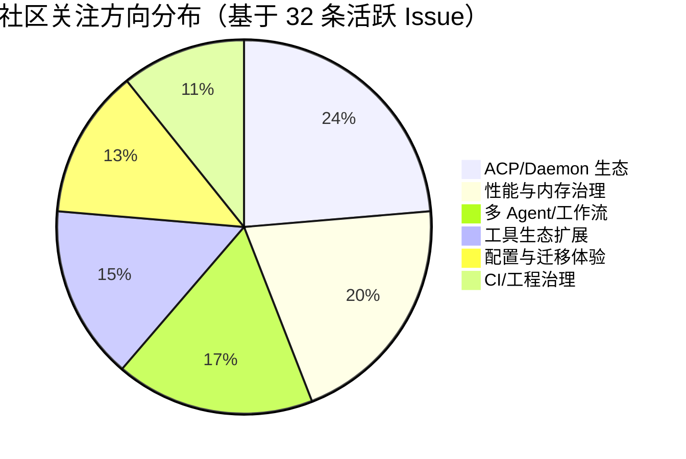

# AI CLI 工具社区动态日报 2026-06-09

> 生成时间: 2026-06-09 00:24 UTC | 覆盖工具: 9 个

- [Claude Code](https://github.com/anthropics/claude-code)
- [OpenAI Codex](https://github.com/openai/codex)
- [Gemini CLI](https://github.com/google-gemini/gemini-cli)
- [GitHub Copilot CLI](https://github.com/github/copilot-cli)
- [Kimi Code CLI](https://github.com/MoonshotAI/kimi-cli)
- [OpenCode](https://github.com/anomalyco/opencode)
- [Pi](https://github.com/badlogic/pi-mono)
- [Qwen Code](https://github.com/QwenLM/qwen-code)
- [DeepSeek TUI](https://github.com/Hmbown/DeepSeek-TUI)
- [Claude Code Skills](https://github.com/anthropics/skills)

---

## 横向对比

# 2026-06-09 AI CLI 工具生态横向对比分析报告

---

## 1. 生态全景

当前 AI CLI 工具生态呈现**"功能趋同、体验分化、信任危机凸显"**的格局。头部产品（Claude Code、OpenAI Codex、GitHub Copilot CLI）已进入精细化运营阶段，围绕计费透明、Agent 可控性、Windows/WSL 体验展开激烈竞争；新兴工具（Pi、OpenCode、Qwen Code、DeepSeek TUI/CodeWhale）则通过 ACP 协议、内存稳定性、多提供商支持等差异化路径追赶。一个显著信号是：**社区焦虑正从"功能有无"转向"成本可控、行为可预测、故障可解释"**——计费 Bug、Agent 僵尸进程、上下文压缩失控成为跨工具的共同痛点。

---

## 2. 各工具活跃度对比

| 工具 | 今日 Issues 动态 | 今日 PR 动态 | 版本发布 | 活跃度评级 |
|:---|:---|:---|:---|:---:|
| **Claude Code** | 10+ 热点 Issue，#63896 计费 Bug 39 评论持续发酵 | 2 条 PR（文档、安全修复） | **v2.1.169**（safe-mode、/cd） | ⭐⭐⭐⭐☆ |
| **OpenAI Codex** | 10 条热点 Issue，#26892 GPT-5.5 404 达 76 评论 | 10 条 PR（安全、调试、性能、SDK） | **v0.138.0** 稳定版 + 多个 alpha | ⭐⭐⭐⭐⭐ |
| **Gemini CLI** | 10 条热点 Issue，Agent 挂起/子 Agent 恢复为核心 | 10 条 PR（SSRF 安全、渲染、国际化） | 无 | ⭐⭐⭐⭐☆ |
| **GitHub Copilot CLI** | 10 条热点 Issue，交互体验与企业功能并重 | 1 条 PR（GITHUB_TOKEN 安装认证） | 无 | ⭐⭐⭐☆☆ |
| **Kimi Code CLI** | 4 条 Issue，全部围绕 v0.11.0 升级兼容性问题 | 0 | 无 | ⭐⭐☆☆☆ |
| **OpenCode** | 10 条热点 Issue，v1.16.x SQLite 约束失败为焦点 | 10 条 PR（性能、ACP、Bedrock 修复） | 无 | ⭐⭐⭐⭐⭐ |
| **Pi** | 10 条热点 Issue，v0.79.0 Project Trust 引发争议 | 10 条 PR（性能、信任开关、提供商扩展） | **v0.79.0** | ⭐⭐⭐⭐⭐ |
| **Qwen Code** | 10 条热点 Issue，OOM 与 ACP 生态为核心 | 10 条 PR（WebSocket、REST 接口、内存治理） | **v0.17.1-nightly** | ⭐⭐⭐⭐⭐ |
| **DeepSeek TUI / CodeWhale** | 10 条热点 Issue，品牌迁移与成本危机并行 | 10 条 PR（提供商扩展、i18n、稳定性修复） | **v0.8.54、v0.8.55** | ⭐⭐⭐⭐⭐ |

> **活跃度观察**：Codex、OpenCode、Pi、Qwen Code、DeepSeek TUI 今日均达到"10 Issues + 10 PRs + 版本/密集修复"的高活跃状态；Claude Code 和 Gemini CLI 活跃度中等但单点问题烈度高；Kimi Code CLI 处于明显的升级阵痛低谷。

---

## 3. 共同关注的功能方向

| 共同方向 | 涉及工具 | 具体诉求 |
|:---|:---|:---|
| **🖥️ Windows/WSL 体验优化** | Codex（#26892, #25715, #25203）、Claude Code（#63896, #61828, #29937）、Copilot CLI（#3652, #3719）、DeepSeek TUI（#1816, #2261） | 计费/认证在 Windows 集中失效、WSL 跨文件系统扫描导致性能崩溃、终端渲染损坏、路径解析错误 |
| **🤖 Agent 可控性与生命周期** | Claude Code（#66339 僵尸 Agent, #16550 写文件权限）、Codex（#8784 删除会话）、Gemini CLI（#21409 挂起, #22323 伪成功）、Pi（#1928 暂停）、Qwen Code（#4838 Hook 内存泄漏） | 停止后复活、无限挂起、token 偷跑、并行调度失控——用户需要明确的"刹车机制" |
| **💰 计费透明与成本可控** | Claude Code（#63896, #61828）、DeepSeek TUI（#1177, #743）、Pi（#5286 定价未同步）、Copilot CLI（#2867 配额状态机） | 用量显示与实际拦截不一致、缓存命中率低、Token 膨胀、新模型定价滞后 |
| **🔒 安全模式与信任机制** | Claude Code（v2.1.169 `--safe-mode`）、Pi（v0.79.0 Project Trust + #5514 争议）、Qwen Code（#4713 MCP 审批门控）、Gemini CLI（#26525 脱敏） | 项目级配置/插件/MCP 的隔离与审批，安全与效率的平衡成为设计焦点 |
| **🧠 长期会话可靠性** | OpenCode（#16960 compaction 丢上下文）、Qwen Code（#4815 OOM, #4824 三重修复）、Pi（#5492 O(n²) 分支遍历, #5513 上下文压缩）、Claude Code（#66339 后台消耗） | 大会话性能崩塌、上下文压缩丢失关键指令、内存泄漏——制约复杂项目持续迭代 |
| **☁️ 多云/多模型提供商支持** | Codex（Bedrock #26860）、OpenCode（Bedrock Mantle #31430, #31349）、Pi（#5363 Mantle, #5524 Azure）、Qwen Code（#4782 ACP 生态）、DeepSeek TUI（v0.8.55 Together AI + Codex） | 企业多云部署、避免单一模型锁定、新模型上线初期的兼容性快速适配 |
| **📝 会话生命周期与记忆管理** | OpenCode（#27167 `/goal`, #16077 持久记忆, #9387 导出）、Codex（#8784 删除会话）、DeepSeek TUI（#2492 跨会话记忆, #2904 KV Cache 胶囊）、Qwen Code（#4821 声明式 Agent） | 从一次性聊天工具进化为可审计、可回溯、有连续性的"AI 开发伙伴" |

---

## 4. 差异化定位分析

| 工具 | 功能侧重 | 目标用户 | 技术路线 |
|:---|:---|:---|:---|
| **Claude Code** | 企业级安全控制、提示缓存优化、插件生态 | 中大型企业团队、安全敏感场景 | 闭源商业产品，快速响应社区但代码贡献门槛低；今日 `--safe-mode` 和 `/cd` 体现"稳定性优先" |
| **OpenAI Codex** | 跨端协作（CLI ↔ Desktop）、沙箱安全、模型路由 | 全栈开发者、需要 Desktop 深度集成的用户 | Rust CLI + Electron Desktop 双端架构；`/app` 移交是独特差异化 |
| **Gemini CLI** | SSRF 安全、AST 代码理解、Auto Memory | Google Cloud/Vertex AI 生态用户 | 强调安全合规与代码智能深度；Agent 子系统稳定性仍是短板 |
| **GitHub Copilot CLI** | IDE 生态集成、企业级 MCP/BYOK、OTel 可观测 | GitHub 企业订阅用户、VS Code 生态深度用户 | 背靠 GitHub 生态，但交互体验债务累积（vim 模式悬置 9 个月） |
| **Kimi Code CLI** | 快速迭代追赶、TypeScript 重写 | 中文开发者、Moonshot 模型用户 | 当前处于新旧版本切换阵痛期，社区规模小、反馈机制未激活 |
| **OpenCode** | 会话生命周期管理、ACP 协议、多云提供商 | 追求开源可控的进阶开发者、Agent 基础设施构建者 | 开源路线最激进，从 CLI 工具向"Agent 基础设施平台"演进 |
| **Pi** | 极速迭代、多提供商适配、TUI 精细化 | 早期采纳者、多模型尝鲜用户 | "发布-快速反馈-补丁"的敏捷文化；Project Trust 争议反映设计决策前置社区输入不足 |
| **Qwen Code** | ACP/Daemon 生态、内存稳定性、声明式 Agent | 需要远程/编辑器集成的开发者、阿里生态用户 | 押注 ACP 协议标准化，29 个 REST 接口 + WebSocket 传输显示基础设施野心 |
| **DeepSeek TUI / CodeWhale** | 成本控制、多标签页工作流、国际化 | 成本敏感型开发者、全球多语言用户 | 品牌迁移中，WhaleFlow 编排框架和多标签页系统指向 IDE 化体验 |

---

## 5. 社区热度与成熟度

### 高活跃 + 相对成熟
| 工具 | 证据 |
|:---|:---|
| **OpenAI Codex** | 76 评论单 Issue、10 PR 并行、稳定版 + alpha 双通道发布、安全加固密集 |
| **Pi** | v0.79.0 发布当日即产生争议 Issue 和修复 PR，24 小时内闭环，社区响应极快 |
| **Qwen Code** | ACP 生态路线图清晰（#4514）、内存治理系统性修复（#4824）、工程治理议题涌现（#4864 分支保护） |
| **OpenCode** | 50 条活跃 Issue 聚类分析、ACP 客户端集成（#31392）、数据库层优化（#31432）显示架构深度 |

### 高活跃 + 问题烈度高
| 工具 | 证据 |
|:---|:---|
| **Claude Code** | 计费系统信任危机（39 评论）、Agent 失控（P0 标注）、但 PR 贡献活跃度偏低（Issue 驱动） |
| **Gemini CLI** | SSRF 安全连续修复、Agent 挂起/伪成功等 P1 问题长期未根治 |

### 快速迭代但成熟度待观察
| 工具 | 证据 |
|:---|:---|
| **DeepSeek TUI / CodeWhale** | 品牌迁移深水区、v0.8.54/0.8.55 连续发布、国际化贡献爆发，但迁移工具链断裂（#1969, #2917） |
| **Kimi Code CLI** | 4 Issues / 0 PR / 0 Release，v0.11.0 升级导致工作流静默破坏，社区规模明显小于其他工具 |

### 活跃度偏低 + 体验债务累积
| 工具 | 证据 |
|:---|:---|
| **GitHub Copilot CLI** | 34 Issues 更新但仅 1 PR，vim 模式（#13）悬置 9 个月，企业功能追赶但交互框架未重构 |

---

## 6. 值得关注的趋势信号

| 趋势 | 信号来源 | 对开发者的参考价值 |
|:---|:---|:---|
| **🔴 "Agent 可控性"成为比"Agent 能力"更核心的购买决策因素** | Claude Code 僵尸 Agent、Gemini 子 Agent 伪成功、Codex 会话删除需求、Pi 暂停需求 | 选型时应优先评估：停止指令是否可靠、token 消耗是否可审计、并行调度是否有上限 |
| **🔴 计费系统信任危机正在重塑用户忠诚度** | Claude Code #63896（39 评论）、DeepSeek TUI #1177+#743、Pi #5286 | 企业评估需关注：用量显示与实际校验的一致性、缓存策略透明度、意外消费的追偿机制 |
| **🟡 ACP/开放协议成为差异化新战场** | OpenCode #31392、Qwen Code #4782/#4773 | 若团队使用 Zed/Goose/JetBrains 等编辑器，ACP 支持度将决定工具能否融入现有工作流 |
| **🟡 Windows/WSL 体验从"兼容项"变为"核心战场"** | 所有头部工具均有 Windows 相关 P0/P1 Issue | 企业 Windows 开发者群体不可忽视；WSL 跨文件系统性能、终端渲染稳定性是硬指标 |
| **🟡 项目级信任/安全模式成为标配设计** | Claude Code `--safe-mode`、Pi Project Trust、Qwen Code MCP 审批门控 | 未来企业落地必须评估：本地配置/MCP/插件的隔离机制、审计能力、最小权限原则 |
| **🟢 长会话工程能力决定工具上限** | Pi O(n²) 修复、Qwen Code 三重 OOM 防护、OpenCode compaction 上下文丢失 | 复杂项目需要 60k+ 消息、数小时连续会话，内存管理、上下文压缩、分支遍历性能是隐性门槛 |
| **🟢 "AI CLI 工具 IDE 化"趋势明显** | DeepSeek TUI 多标签页（#2753）、Codex CLI↔Desktop 移交、OpenCode 内置编辑器（#31406） | 纯终端交互向"终端 + GUI 混合"演进，分屏、多会话、可视化审阅将成为标配 |

---

## 决策建议摘要

- **追求稳定与企业安全**：Claude Code 仍是标杆，但需密切关注计费 Bug 修复进展；`--safe-mode` 可作为故障排查利器。
- **需要跨端协作 + 沙箱安全**：OpenAI Codex 的 `/app` 和 Rust 架构有独特优势，但 GPT-5.5 可用性危机需观望。
- **重视开源可控与 ACP 生态**：OpenCode 和 Qwen Code 是前沿选择，前者偏会话基础设施，后者偏协议标准化。
- **成本敏感 + 多语言团队**：DeepSeek TUI/CodeWhale 的国际化和成本优化方向值得关注，但品牌迁移期风险较高。
- **GitHub 生态深度用户**：Copilot CLI 集成便利，但交互体验债务和 vim 模式缺失可能拖累效率。
- **快速迭代尝鲜者**：Pi 的敏捷文化适合愿意参与共建的用户，但需承受功能设计摩擦成本。

---

## 各工具详细报告

<details>
<summary><strong>Claude Code</strong> — <a href="https://github.com/anthropics/claude-code">anthropics/claude-code</a></summary>

## Claude Code Skills 社区热点

> 数据来源: [anthropics/skills](https://github.com/anthropics/skills)

# Claude Code Skills 社区热点报告（截至 2026-06-09）

---

## 1. 热门 Skills 排行（按社区关注度）

| 排名 | Skill | 功能 | 讨论热点 | 状态 |
|:---|:---|:---|:---|:---|
| 1 | **[document-typography](https://github.com/anthropics/skills/pull/514)** | AI 生成文档的排版质量控制：防止孤行、寡行、编号错位等排版问题 | 该 Skill 声称"影响 Claude 生成的每一份文档"，触及 AI 内容生产的普适痛点；社区关注其能否成为默认内置能力 | Open |
| 2 | **[ODT](https://github.com/anthropics/skills/pull/486)** | OpenDocument 格式（.odt/.ods）的创建、模板填充及 ODT→HTML 转换 | 开源文档标准 vs Office 生态的替代方案；企业合规场景需求强烈 | Open |
| 3 | **[frontend-design](https://github.com/anthropics/skills/pull/210)** | 前端设计 Skill 的清晰度与可执行性改进 | 元问题讨论：如何衡量 Skill 的"可操作性"——每条指令是否能在单次对话内执行 | Open |
| 4 | **[skill-quality-analyzer / skill-security-analyzer](https://github.com/anthropics/skills/pull/83)** | Skill 质量五维评估（结构、文档、示例、资源、安全）与安全审计 | 元 Skill 趋势：社区开始系统性治理 Skill 质量；20% 权重分配引发讨论 | Open |
| 5 | **[agent-creator](https://github.com/anthropics/skills/pull/1140)** | 任务特定 Agent 集合的创建 Skill + 多工具并行评估修复 | 修复了 `evaluation.py` 的关键稳定性 bug；Windows 兼容性改进同步落地 | Open |
| 6 | **[testing-patterns](https://github.com/anthropics/skills/pull/723)** | 全栈测试体系：测试哲学、单元测试、React 组件测试、E2E | Testing Trophy 模型与"测什么/不测什么"的边界界定 | Open |
| 7 | **[shodh-memory](https://github.com/anthropics/skills/pull/154)** | AI Agent 的持久化记忆系统，跨对话维护上下文 | 记忆何时触发、如何结构化、隐私边界；与原生记忆功能的差异化定位 | Open |
| 8 | **[AURELION](https://github.com/anthropics/skills/pull/444)** | 四层认知框架：内核（结构化思维）、顾问、Agent、记忆 | 知识管理领域的系统性框架；5 层认知模型（L1-L5）的专业深度 | Open |

---

## 2. 社区需求趋势（Issues 提炼）

| 方向 | 代表 Issue | 核心诉求 |
|:---|:---|:---|
| **组织级 Skill 治理** | [#228](https://github.com/anthropics/skills/issues/228) | 企业内 Skill 共享：从 Slack 手动传文件 → 共享库/直链分发，13 评论 7 👍 为最热需求 |
| **Skill 安全与信任边界** | [#492](https://github.com/anthropics/skills/issues/492) | 社区 Skill 冒用 `anthropic/` 命名空间的供应链攻击风险，需官方签名或命名空间隔离 |
| **MCP 协议互通** | [#16](https://github.com/anthropics/skills/issues/16) | 将 Skills 暴露为 MCP（Model Context Protocol），统一 AI 软件 API 标准 |
| **跨平台部署（AWS Bedrock）** | [#29](https://github.com/anthropics/skills/issues/29) | 技能体系脱离 Claude 原生环境，向第三方模型托管扩展 |
| **多文件 Skill 工程化** | [#1220](https://github.com/anthropics/skills/issues/1220) | 大型 Skill 的模块化维护：支持多引用文件内联打包，替代单文件 SKILL.md 的维护瓶颈 |
| **Agent 治理与安全** | [#412](https://github.com/anthropics/skills/issues/412) | AI Agent 系统的策略执行、威胁检测、信任评分、审计追踪——从"功能 Skill"到"治理 Skill" |

---

## 3. 高潜力待合并 Skills（评论活跃 + 近期更新）

| PR | 关键价值 | 近期动态 | 合并信号 |
|:---|:---|:---|:---|
| **[#514 document-typography](https://github.com/anthropics/skills/pull/514)** | 普适性文档质量修复，影响所有 AI 生成内容 | 3 月创建后持续迭代排版规则 | ⭐⭐⭐ 高——触及核心产品体验 |
| **[#1140 agent-creator](https://github.com/anthropics/skills/pull/1140)** | 修复多工具评估崩溃 + Windows 支持 | 6 月 2 日更新，解决 Issue #1120 | ⭐⭐⭐ 高——含关键稳定性修复 |
| **[#1050 / #1099 Windows 兼容性](https://github.com/anthropics/skills/pull/1050)** | skill-creator 脚本在 Windows 的编码/子进程修复 | 5 月密集更新，解决 WinError 10038/2 | ⭐⭐⭐ 高——平台覆盖刚需 |
| **[#486 ODT](https://github.com/anthropics/skills/pull/486)** | 开源文档标准支持，企业合规场景 | 4 月更新触发条件细化 | ⭐⭐ 中——需求明确但维护者反馈待观察 |
| **[#568 ServiceNow](https://github.com/anthropics/skills/pull/568)** | 企业 ITSM 全平台覆盖（ITOM/ITAM/SecOps/FSM 等） | 4 月 23 日更新架构细节 | ⭐⭐ 中——垂直领域深度，受众精准 |
| **[#444 AURELION](https://github.com/anthropics/skills/pull/444)** | 认知框架级知识管理系统 | 5 月 6 日更新记忆层设计 | ⭐⭐ 中——框架宏大，需验证落地性 |

---

## 4. Skills 生态洞察

> **核心诉求：从"个人效率工具"升级为"企业级可治理的生产系统"**——社区正同时推动三个层面的成熟化：Skill 本身的工程标准（质量评估、多文件架构）、跨平台分发机制（组织共享、MCP 互通）、以及安全信任基建（命名空间隔离、权限内嵌），标志着 Claude Code Skills 从早期爱好者生态向企业级基础设施的关键跃迁。

---

---

# Claude Code 社区动态日报 | 2026-06-09

## 今日速览

Anthropic 发布 v2.1.169 版本，推出 `--safe-mode` 安全模式和 `/cd` 目录切换命令，直接回应社区长期呼吁的调试透明度和工作流灵活性需求。同时，**API 计费与用量限制相关 Bug 持续发酵**，#63896 单条 Issue 已积累 39 条评论，成为当前社区最大痛点。

---

## 版本发布

### [v2.1.169](https://github.com/anthropics/claude-code/releases/tag/v2.1.169)

| 特性 | 说明 |
|:---|:---|
| `--safe-mode` 标志 + `CLAUDE_CODE_SAFE_MODE` 环境变量 | 一键禁用所有自定义配置（CLAUDE.md、插件、skills、hooks、MCP servers），用于故障排查时隔离问题根源 |
| `/cd` 命令 | 会话内切换工作目录，**不破坏 prompt cache**，解决长会话中跨项目操作的性能损耗 |

**解读**：`--safe-mode` 是对社区频繁报告的"插件/配置导致异常行为"类问题的系统性回应；`/cd` 则填补了 CLI 工作流中目录管理的长期空白。

---

## 社区热点 Issues

| # | 状态 | 标题 | 评论 | 👍 | 关键看点 |
|:---|:---|:---|:---:|:---:|:---|
| [#63896](https://github.com/anthropics/claude-code/issues/63896) | 🔴 OPEN | **1M 上下文压缩时触发"Usage credits required"错误** | 39 | 22 | **计费系统核心 Bug**：用户即使已开通 usage credits，在 1M 上下文压缩阶段仍被拦截。Windows 平台集中爆发，疑似 API 层用量校验逻辑与账户状态不同步。社区强烈要求官方澄清计费规则边界。 |
| [#16550](https://github.com/anthropics/claude-code/issues/16550) | 🔴 OPEN | **允许 Claude 写入/更新项目文件** | 30 | 59 | **最高票功能请求（59👍）**，但存在设计争议——开发者担忧自动写文件的权限边界与安全风险，讨论聚焦于"如何平衡自动化与可控性"。 |
| [#48827](https://github.com/anthropics/claude-code/issues/48827) | 🔴 OPEN | **Cowork 在 Intel Mac 下载 Linux 二进制导致崩溃（exit code 132）** | 18 | 4 | **架构检测失败**：下载逻辑未正确区分 Intel Mac 与 ARM Mac/ Linux，ELF 二进制在 macOS 上触发 SIGILL。影响桌面端核心功能，复现路径清晰。 |
| [#27725](https://github.com/anthropics/claude-code/issues/27725) | 🔴 OPEN | **桌面应用支持可分离的 OS 级窗口** | 13 | 54 | **高票 UI 需求（54👍）**：开发者需要分屏监控多任务进度，当前单窗口模式严重制约并行工作流。 |
| [#61828](https://github.com/anthropics/claude-code/issues/61828) | 🔴 OPEN | **用量仅 2% 却显示"Usage limit reached"** | 12 | 4 | #63896 的关联案例，进一步暴露**计费状态显示与后端校验不一致**的系统性问题，Windows 平台为主。 |
| [#29937](https://github.com/anthropics/claude-code/issues/29937) | 🔴 OPEN | **tmux 环境下终端渲染损坏** | 10 | 22 | **Linux 开发者高频痛点**：文本重叠覆盖，影响 tmux+alacritty 主流组合。环境变量与终端模拟器兼容性问题，长期未根治。 |
| [#51847](https://github.com/anthropics/claude-code/issues/51847) | ✅ CLOSED | **更新后"文件被占用"错误** | 10 | 5 | Windows 桌面端更新机制缺陷，已关闭但无明确修复说明，可能为自动重试或用户 workaround 解决。 |
| [#33944](https://github.com/anthropics/claude-code/issues/33944) | ✅ CLOSED | **Bash 工具"避免 cd"指令导致 SSH 远程命令系统性失败** | 8 | 4 | 系统提示词设计缺陷：模型为遵循"避免 cd"指令，在 SSH 场景中省略必要的目录切换，已关闭但反映提示工程与工具调用的深层张力。 |
| [#57638](https://github.com/anthropics/claude-code/issues/57638) | ✅ CLOSED | **"helpfulness override"阻止深度协作** | 5 | 1 | 模型安全对齐过度：Claude 拒绝执行用户明确要求的"挑战性"协作任务，已关闭，但 AI 安全与实用性的平衡仍是社区敏感话题。 |
| [#66339](https://github.com/anthropics/claude-code/issues/66339) | 🔴 OPEN | **后台 Agent 停止后复活，21 小时消耗 160k+ tokens** | 4 | 0 | **Web 端 Agent 生命周期管理严重缺陷**：用户明确停止后进程恢复，造成意外计费。涉及 claude-code-web 与 agent-view 组件，需紧急修复。 |

---

## 重要 PR 进展

| # | 状态 | 标题 | 作者 | 核心内容 |
|:---|:---|:---|:---|:---|
| [#26914](https://github.com/anthropics/claude-code/pull/26914) | ✅ CLOSED | docs: 添加 rules frontmatter paths 语法示例与验证 hook | Johntycour | 补充 `paths:` 配置的正确/错误语法示例，提供 PostToolUse hook 自动检测 broken syntax，解决此前静默失败的调试难题 |
| [#66171](https://github.com/anthropics/claude-code/pull/66171) | 🔴 OPEN | extensibility.py 跟随符号链接的安全修复 | szamaniai | **安全漏洞修复**：`extensibility.py` 在 project-controlled GUI 中未处理符号链接，可能导致路径遍历。PR 包含完整的漏洞分析、复现指南、安全实现与测试策略文档 |

> 注：过去 24 小时仅 2 条 PR 更新，社区代码贡献活跃度偏低，Issue 驱动特征明显。

---

## 功能需求趋势

基于 50 条活跃 Issue 的聚类分析：

```
┌─────────────────────────────────────────┬──────────┐
│ 功能方向                                │ 热度指数 │
├─────────────────────────────────────────┼──────────┤
│ 💰 计费透明 & 用量限制可预测性          │ ████████████████████ 极高 │
│ 🖥️ 桌面端/IDE 集成体验（窗口、VS Code） │ ██████████████ 高        │
│ 🤖 Agent 调度策略（数量控制、生命周期）  │ ████████████ 高          │
│ 🔧 跨平台兼容性（Windows/Linux/macOS）  │ ██████████ 中高          │
│ 🔒 安全模式 & 插件隔离机制              │ ████████ 中（v2.1.169 已回应）│
│ 📝 配置同步与可移植性（~/.claude/）     │ ██████ 中                │
│ 🌐 移动端体验优化                       │ ████ 新兴                │
│ ⌨️ TUI/终端渲染稳定性                   │ ████ 持续                │
└─────────────────────────────────────────┴──────────┘
```

**关键洞察**：计费系统信任危机已超越功能需求，成为社区首要焦虑源；Agent 的"过度并行"与"僵尸复活"问题暴露自动化调度缺乏用户可控的刹车机制。

---

## 开发者关注点

| 痛点类别 | 具体表现 | 代表 Issue | 紧急程度 |
|:---|:---|:---|:---:|
| **计费黑洞** | 用量显示与实际拦截不一致、后台 Agent 偷跑 tokens、1M 上下文额外收费门槛不透明 | #63896, #61828, #66339, #66357 | 🔴 **P0** |
| **Agent 失控** | 简单任务触发数十至数百 Agent 并行、停止后复活、token 消耗指数级膨胀 | #65920, #66353, #66339 | 🔴 **P0** |
| **跨平台质量参差** | Windows 计费 Bug 集中、Intel Mac 二进制分发错误、Linux 终端渲染问题 | #63896, #48827, #29937 | 🟡 **P1** |
| **配置可移植性** | 多机器间 ~/.claude/ 手动同步、无官方云同步方案 | #66303 | 🟡 **P1** |
| **模型行为一致性** | effort 设置跨会话丢失、helpfulness override 干扰协作、CJK IME 输入回归 | #66266, #57638, #57759 | 🟢 **P2** |

**今日建议关注**：v2.1.169 的 `--safe-mode` 可作为临时 workaround 验证部分 Issue 是否由第三方配置引发，但计费系统的系统性修复仍需官方后续响应。

---

*日报基于 GitHub 公开数据生成，不代表 Anthropic 官方立场。*

</details>

<details>
<summary><strong>OpenAI Codex</strong> — <a href="https://github.com/openai/codex">openai/codex</a></summary>

# OpenAI Codex 社区动态日报 | 2026-06-09

---

## 1. 今日速览

**GPT-5.5 模型可用性危机持续发酵**，多个地区（巴西、Windows、macOS）用户报告该模型在 CLI 和 Desktop 端均返回 404 错误，尽管本地元数据仍显示其可用，社区讨论已超 76 条。与此同时，团队密集发布 **v0.138.0 稳定版** 及多个 alpha 版本，重点推进 CLI 与 Desktop 的跨端协作（`/app` 命令移交）和 Windows 体验优化。

---

## 2. 版本发布

### [rust-v0.138.0](https://github.com/openai/codex/releases/tag/rust-v0.138.0) — 稳定版
| 特性 | 说明 |
|:---|:---|
| **跨端会话移交** | `/app` 命令可将当前 CLI 线程移交至 macOS 和原生 Windows 的 Codex Desktop；Windows 工作区启动可直接进入 Desktop，无需手动确认 |
| **本地图像附件** | 支持本地图像附件及独立图像生成（描述截断，推测为完整图像工作流） |

### 预发布版本
- **[v0.139.0-alpha.1](https://github.com/openai/codex/releases/tag/rust-v0.139.0-alpha.1)** — 早期测试通道
- **[v0.138.0-alpha.8](https://github.com/openai/codex/releases/tag/rust-v0.138.0-alpha.8)** / **[alpha.7](https://github.com/openai/codex/releases/tag/rust-v0.138.0-alpha.7)** — v0.138.0 的迭代修复

---

## 3. 社区热点 Issues

| # | Issue | 标签 | 评论 | 核心问题与社区反应 |
|:---|:---|:---|:---|:---|
| [#26892](https://github.com/openai/codex/issues/26892) | GPT-5.5 本地显示可用但实际请求 404 | `bug`, `windows-os`, `exec`, `CLI`, `app` | **76** | **最高优先级故障**。Windows 双端（Desktop + CLI）同时失效，gpt-5.4 正常；27 个 👍，用户质疑模型路由配置与本地缓存元数据不一致 |
| [#25144](https://github.com/openai/codex/issues/25144) | 禁用长粘贴自动转为 .txt 附件 | `enhancement`, `app` | **51** | **UX 争议焦点**。65 👍 高票需求，开发者认为自动转换破坏结构化提示词的上下文完整性，要求可配置开关 |
| [#25203](https://github.com/openai/codex/issues/25203) | Windows GitHub OAuth 回调失败 | `bug`, `windows-os`, `auth`, `app` | **37** | Electron 应用路径解析问题，阻塞 Windows 用户 GitHub 集成，21 👍 反映认证基础设施在 Windows 端的脆弱性 |
| [#25715](https://github.com/openai/codex/issues/25715) | WSL 作为 Agent 环境时 Desktop 极慢 | `bug`, `windows-os`, `app`, `performance` | **36** | **性能灾难**。36 👍，每轮工具调用延迟数秒，strace 显示大量 `/mnt/c` 跨文件系统扫描，WSL 用户主力痛点 |
| [#8784](https://github.com/openai/codex/issues/8784) | 增加 `codex delete <session>` 命令 | `enhancement`, `TUI` | **30** | **长期悬而未决**。102 👍 为今日最高，开发者需要会话生命周期管理，避免磁盘膨胀 |
| [#8758](https://github.com/openai/codex/issues/8758) | 图像生成功能（已关闭） | `enhancement`, `agent` | **23** | 55 👍，已标记完成；反映 Agent 工作流对视觉资产的强需求，与 v0.138.0 的图像功能形成呼应 |
| [#24675](https://github.com/openai/codex/issues/24675) | 重新认证后 Desktop 仍使用过期 connector 链接 | `bug`, `auth`, `app`, `app-server` | **21** | 缓存失效机制缺陷，需手动清除 `codex_apps` 缓存，企业用户集成场景受阻 |
| [#25719](https://github.com/openai/codex/issues/25719) | macOS `syspolicyd`/`trustd` CPU 内存失控 | `bug`, `app`, `computer-use`, `performance` | **20** | 20 👍，Computer Use 功能触发系统安全进程持续扫描，ARM Mac 资源占用异常 |
| [#26149](https://github.com/openai/codex/issues/26149) | Windows+WSL 重复扫描 `.codex/.tmp/plugins` | `bug`, `windows-os`, `app`, `skills`, `performance` | **10** | 与 #25715 同源问题，16 👍，技能系统跨文件系统遍历导致每次命令延迟，需缓存或路径隔离 |
| [#21753](https://github.com/openai/codex/issues/21753) | 完整 Claude Code Hook 兼容性（29+） | `enhancement`, `hooks` | **11** | 15 👍，自动化工作流迁移需求，要求生命周期事件全覆盖以支持 CI/CD 集成 |

---

## 4. 重要 PR 进展

| # | PR | 作者 | 状态 | 功能/修复内容 |
|:---|:---|:---|:---|:---|
| [#26953](https://github.com/openai/codex/pull/26953) | Python SDK 专用 Goal 操作 | `aibrahim-oai` | 🟡 Open | 为 Python SDK 增加与 TUI 一致的持久化 Goal API，避免 goal 特定应用层逻辑泄漏到 SDK |
| [#27017](https://github.com/openai/codex/pull/27017) | 修复 Windows exec 运行时的 deny-read 权限 | `abhinav-oai` | 🟡 Open, code-reviewed | Windows 沙箱 `deny_read` 条目未被 `shell_command`/`exec_command` 解析，导致模型可见限制但实际执行未生效 |
| [#26734](https://github.com/openai/codex/pull/26734) | 非 TTY unified exec 的 Ctrl-C 中断 | `pakrym-oai` | 🟡 Open | `tty: false` 的长进程无法通过 `write_stdin` 中断；精确注入 U+0003 实现跨平台信号映射 |
| [#27091](https://github.com/openai/codex/pull/27091) | Guardian 线程主动压缩 | `raymorgan-oai` | 🟡 Open | 复用 Guardian 审查会话后，若上下文超阈值立即调度压缩，避免后续审查的上下文膨胀 |
| [#27093](https://github.com/openai/codex/pull/27093) | 调试模式分析事件捕获 | `jameswt-oai` | 🟡 Open | 仅调试环境将最终请求 payload 写入 JSONL，抑制 HTTP 投递，便于离线诊断 |
| [#25956](https://github.com/openai/codex/pull/25956) | 拒绝符号链接的 `--output-last-message` 路径 | `viyatb-oai` | 🟡 Open, code-reviewed | 用 `openat` + `O_NOFOLLOW` 替换 `std::fs::write`，防止符号链接劫持输出文件及父目录 |
| [#15730](https://github.com/openai/codex/pull/15730) | 加固符号链接项目配置写入 | `viyatb-oai` | 🟡 Open, code-reviewed | `.codex/config.toml` 设为只读叶节点，加载前拒绝符号链接，通过 no-follow  plumbing 读取 |
| [#27082](https://github.com/openai/codex/pull/27082) | 结构化压缩错误遥测 | `rhan-oai` | 🟡 Open | 将原始 `error` 字段替换为 `codex_error_kind` + HTTP 状态码，统一与 turn 事件相同的错误分类体系 |
| [#27089](https://github.com/openai/codex/pull/27089) | Code 模式禁用并行工具调用 | `sayan-oai` | 🟡 Open | Code 模式的工具接口与直接函数调用不同，防止 Responses API 请求模型未预期的并行调用组合 |
| [#27080](https://github.com/openai/codex/pull/27080) | 忽略待处理的 PR 审查评论 | `anp-oai` | 🟡 Open | PR 看护者不再处理 `PENDING` 状态的 GitHub review 内联评论，避免 Codex 在 reviewer 提交前过早行动 |

---

## 5. 功能需求趋势

基于过去 24 小时 50 个活跃 Issue 分析，社区关注方向呈现 **四大集中领域**：

| 趋势方向 | 代表 Issue | 需求强度 |
|:---|:---|:---|
| **🖥️ Windows/WSL 体验优化** | #26892, #25715, #26149, #25203, #22185, #25004 | 🔥🔥🔥🔥🔥 最高 |
| **🤖 模型可用性与路由** | #26892, #25839, #27021, #26860, #26916 | 🔥🔥🔥🔥🔥 最高 |
| **🔧 会话/上下文生命周期管理** | #8784, #23218, #17401, #25144, #20493 | 🔥🔥🔥🔥 高 |
| **🛡️ 安全与沙箱加固** | #27017, #25956, #15730, #24675 | 🔥🔥🔥🔥 高 |

**新兴信号**：Amazon Bedrock 第三方提供商集成问题激增（#26860, #26297），反映企业多云部署需求；Hook 系统自动化能力成为 Claude Code 迁移者的核心诉求（#21753, #27052）。

---

## 6. 开发者关注点

### 🔴 阻塞性痛点
| 问题 | 影响范围 | 紧急程度 |
|:---|:---|:---|
| **GPT-5.5 区域性 404** | 巴西、Windows、macOS 多平台 | P0 — 生产不可用 |
| **WSL 跨文件系统扫描** | Windows + WSL 主力开发群体 | P1 — 性能崩溃 |
| **macOS 系统安全进程失控** | ARM Mac + Computer Use 用户 | P1 — 机器发烫/卡顿 |

### 🟡 高频摩擦
- **认证缓存失效**：OAuth/connector 重新认证后需手动清缓存（#24675），企业集成场景体验差
- **TUI 输出可靠性**：URL 含 `~` 时链接截断（#27088 已修复）、Windows Terminal 宠物闪烁（#25004）
- **工具调用完整性**：Bedrock 提供商的 `apply_patch` 截断（#26297）、并行调用与 Code 模式冲突（#27089）

### 🟢 积极进展
- **跨端协作闭环**：v0.138.0 的 `/app` 移交实现 CLI → Desktop 无缝切换
- **安全加固密集**：符号链接攻击面连续修复（#25956, #15730），沙箱权限对齐执行层（#27017）
- **可观测性提升**：调试分析捕获（#27093）、结构化错误码（#27082）、性能追踪 span（#27090）

---

> 📌 **订阅提示**：本日报基于 `openai/codex` 公开 GitHub 数据生成。如需特定模块（Rust CLI / Desktop App / Python SDK）的专项追踪，可告知调整覆盖范围。

</details>

<details>
<summary><strong>Gemini CLI</strong> — <a href="https://github.com/google-gemini/gemini-cli">google-gemini/gemini-cli</a></summary>

# Gemini CLI 社区动态日报 | 2026-06-09

## 今日速览

今日社区无新版本发布，但代码活跃度显著：**SSRF 安全防护**成为焦点，连续两个相关 PR 提交；**Agent 子系统稳定性**仍是核心痛点，通用 Agent 挂起、子 Agent 恢复异常等 P1 问题持续获得团队跟进。核心渲染层和国际化终端体验也有多项修复推进。

---

## 社区热点 Issues（Top 10）

| # | Issue | 优先级 | 核心看点 |
|---|-------|--------|---------|
| [#24353](https://github.com/google-gemini/gemini-cli/issues/24353) | Robust component level evaluations | P1 | **评估基础设施升级**：在 76 个行为评估测试基础上推进组件级评估，直接关系到 Agent 质量度量体系的可靠性 |
| [#22745](https://github.com/google-gemini/gemini-cli/issues/22745) | AST-aware file reads, search, and mapping | P2 | **代码理解深度优化**：探索用 AST 精确读取方法边界、减少 token 浪费，可能显著降低多轮交互成本 |
| [#21409](https://github.com/google-gemini/gemini-cli/issues/21409) | Generalist agent hangs | P1 | **高频用户痛点**：通用 Agent 无限挂起，8 个 👍 反映社区影响面广，已标记需重新测试 |
| [#22323](https://github.com/google-gemini/gemini-cli/issues/22323) | Subagent recovery hides MAX_TURNS interruption | P1 | **状态报告缺陷**：子 Agent 达到最大轮次后伪报"成功"，严重误导用户判断任务完成状态 |
| [#21968](https://github.com/google-gemini/gemini-cli/issues/21968) | Gemini does not use skills and sub-agents enough | P2 | **能力调度策略问题**：自定义技能（如 gradle、git）几乎不被自动调用，削弱扩展机制价值 |
| [#26525](https://github.com/google-gemini/gemini-cli/issues/26525) | Deterministic redaction and reduce Auto Memory logging | P2 | **安全合规**：Auto Memory 在模型侧 redact  secrets 存在时序漏洞，需前置确定性脱敏 |
| [#26522](https://github.com/google-gemini/gemini-cli/issues/26522) | Stop Auto Memory retrying low-signal sessions | P2 | **资源浪费**：低价值会话无限重试，导致后台提取 Agent 空转 |
| [#25166](https://github.com/google-gemini/gemini-cli/issues/25166) | Shell command execution gets stuck "Waiting input" | P1 | **核心交互故障**：简单命令完成后假死，3 个 👍，影响基础使用体验 |
| [#21983](https://github.com/google-gemini/gemini-cli/issues/21983) | Browser subagent fails in Wayland | P1 | **Linux 桌面兼容性**：Wayland 环境下浏览器子 Agent 崩溃，阻碍 Linux 开发者采用 |
| [#22186](https://github.com/google-gemini/gemini-cli/issues/22186) | get-shit-done output hook causes crash | P1 | **输出处理缺陷**：任务总结阶段崩溃，破坏端到端工作流完整性 |

---

## 重要 PR 进展（Top 10）

| # | PR | 状态 | 功能/修复内容 |
|---|-----|------|--------------|
| [#27729](https://github.com/google-gemini/gemini-cli/pull/27729) | Truncate telemetry metric attributes | **OPEN** | **可观测性修复**：将遥测指标属性截断至 1024 字符，解决 GCP 导出时的 Node.js 堆栈溢出问题 |
| [#27744](https://github.com/google-gemini/gemini-cli/pull/27744) | SSRF guard: resolve DNS before check | **OPEN** | **安全加固**：修复 `127.0.0.1.nip.io` 等 DNS 重绑定绕过，先解析再判断私网 IP |
| [#27739](https://github.com/google-gemini/gemini-cli/pull/27739) | Prevent SSRF via DNS hostnames and redirects | **OPEN** | **安全加固**：同步修复 SSRF 双重漏洞——DNS 主机名欺骗 + 跳转后的私网访问 |
| [#27747](https://github.com/google-gemini/gemini-cli/pull/27747) | Fix infinite loop in ghost text wrapping | **OPEN** | **渲染稳定性**：终端宽度小于字符宽度时（如 1 列窗口显示 emoji），幽灵文本死循环冻结 CLI |
| [#27505](https://github.com/google-gemini/gemini-cli/pull/27505) | Prevent extra spaces on width-0 CJK cells | **OPEN** | **国际化体验**：修复宽字符（CJK）间错误插入空格导致的复制粘贴错误 |
| [#27749](https://github.com/google-gemini/gemini-cli/pull/27749) | Vertex AI model mapping fix | **OPEN** | **代码质量**：Vertex AI 模型映射硬编码改为常量引用，提升可维护性 |
| [#27698](https://github.com/google-gemini/gemini-cli/pull/27698) | Zero-quota limits fail fast | **OPEN** | **性能优化**：免费额度为 0 时立即失败，避免 10 次无效重试循环挂起 |
| [#27619](https://github.com/google-gemini/gemini-cli/pull/27619) | Atomic update in MCP tool discovery | **OPEN** | **可靠性**：MCP 工具发现网络抖动时保持原子更新，防止"tool not found"瞬态错误 |
| [#27428](https://github.com/google-gemini/gemini-cli/pull/27428) | Docker inspect exit code vs stdout parsing | **OPEN** | **沙箱稳定性**：DOCKER_BUILDKIT 下 `docker images -q` 输出至 stderr 导致误判镜像不存在 |
| [#27743](https://github.com/google-gemini/gemini-cli/pull/27743) | Dependabot cooldown for npm | **OPEN** | **流程优化**：npm 依赖更新引入 7 天冷却期，减少噪音并允许社区提前发现问题版本 |

---

## 功能需求趋势

从 Issues 标签分布和讨论内容提炼，社区当前最关注的五大方向：

| 方向 | 代表 Issue | 趋势解读 |
|------|-----------|---------|
| **Agent 智能调度** | #21968, #22672, #21432 | 子 Agent/技能自动调用意愿低、破坏性操作缺乏劝阻，"Agent 自我认知"和决策透明度成关键 |
| **AST 深度代码理解** | #22745, #22746, #22747 | 从文本级工具向语法级工具跃迁，追求更精准的文件读取和代码库映射 |
| **终端渲染与国际化** | #21924, #27505, #27747 | CJK 宽字符、终端 resize、外部编辑器集成等 TTY 体验持续打磨 |
| **安全与隐私合规** | #26525, #26522, #26523 | Auto Memory 全链路脱敏、无效 patch 隔离、低信号会话治理构成记忆系统安全三角 |
| **评估与可观测性** | #24353, #23313, #23166 | 从"有测试"到"测试可信"，组件级评估和 steering eval 稳定性是质量基础设施重点 |

---

## 开发者关注点

### 🔴 高频痛点

1. **Agent 可靠性危机**
   - 通用 Agent 挂起（#21409）、子 Agent 伪成功（#22323）、技能不自动调用（#21968）形成"不敢用 Agent"的信任崩塌
   - 开发者明确反馈：禁用子 Agent 后反而更稳定（#21409）

2. **终端交互假死**
   - Shell 命令"Waiting input"假死（#25166）、幽灵文本死循环（#27747）、外部编辑器退出后画面损坏（#24935）
   - 核心痛点：**无法区分"正在思考"和"已经崩溃"**

3. **记忆系统黑箱**
   - Auto Memory 重试策略不透明（#26522）、secret 脱敏时机滞后（#26525）、无效 patch 静默丢弃（#26523）
   - 开发者需要可见的 memory inbox 治理界面

### 🟡 迫切期待

| 需求 | 典型场景 | 相关 Issue |
|------|---------|-----------|
| Wayland 原生支持 | Linux 桌面开发者无法使用浏览器 Agent | #21983 |
| Symlink 配置管理 | 点文件仓库管理 Agent 定义 | #20079 |
| 破坏性操作确认 | `git reset --force` 等危险命令拦截 | #22672 |
| 工具数量上限智能处理 | >128 工具时 400 错误，需动态裁剪 | #24246 |

---

> 📌 **数据来源**: [google-gemini/gemini-cli](https://github.com/google-gemini/gemini-cli) | 统计周期: 2026-06-08 至 2026-06-09

</details>

<details>
<summary><strong>GitHub Copilot CLI</strong> — <a href="https://github.com/github/copilot-cli">github/copilot-cli</a></summary>

# GitHub Copilot CLI 社区动态日报 | 2026-06-09

## 今日速览

今日社区活跃度较高，过去24小时内34个Issue获得更新，但无新版本发布。核心矛盾集中在**交互体验一致性**（vim模式、输入历史、选择器交互）与**企业级功能缺口**（BYOK配置、MCP注册表、OTel认证），同时Windows平台路径处理、WSL性能等原生集成问题持续发酵。

---

## 社区热点 Issues

| # | Issue | 重要性 | 社区反应 |
|---|-------|--------|---------|
| [#13](https://github.com/github/copilot-cli/issues/13) **CLI input should have a vi/vim input mode** | ⭐⭐⭐⭐⭐ | 63👍，7评论，2025年9月创建至今未解决。终端工具缺失vim模式是资深开发者的核心痛点，直接影响编辑效率，社区呼声极高 |
| [#1928](https://github.com/github/copilot-cli/issues/1928) **Allow to pause copilot work** | ⭐⭐⭐⭐⭐ | 9评论，2👍。Agent会话缺乏"暂停-干预-恢复"机制，当AI走向错误方向时用户只能中断重来，影响复杂任务可控性 |
| [#3547](https://github.com/github/copilot-cli/issues/3547) **Background sub-agent silently hangs at total_turns=0 when model="gpt-5.5"** | ⭐⭐⭐⭐☆ | 6评论。gpt-5.5新模型后台任务挂死，阻塞Agent工作流，需紧急排查模型兼容性 |
| [#3436](https://github.com/github/copilot-cli/issues/3436) **/mcp search constructs wrong URL for custom MCP registries** | ⭐⭐⭐⭐☆ | 5评论，1👍。企业自托管MCP注册表404，API版本路径硬编码问题，直接影响企业MCP生态落地 |
| [#2867](https://github.com/github/copilot-cli/issues/2867) **Claude Opus 4.6 (high) returns "model not supported" after quota reset** | ⭐⭐⭐⭐☆ | 5评论，1👍。Pro+用户配额恢复后模型仍不可用，涉及计费状态与模型可用性的状态机bug |
| [#3701](https://github.com/github/copilot-cli/issues/3701) **Copilot CLI bug: runaway MCP server spawning (IDE lock-file watcher re-init loop)** | ⭐⭐⭐⭐☆ | 已关闭，2评论。MCP服务器失控繁殖导致IDE锁死，虽已修复但暴露CLI与IDE集成的资源管理缺陷 |
| [#3652](https://github.com/github/copilot-cli/issues/3652) **WSL 40-80 second startup delays due to CopilotCLIChatSessionContentProvider.listSessions** | ⭐⭐⭐☆☆ | 3评论。WSL场景性能回归，跨Windows-Linux边界会话枚举耗时，远程开发体验受损 |
| [#3688](https://github.com/github/copilot-cli/issues/3688) **Repository-level custom agents resolved relative to git root, but skills and .mcp.json relative to cwd** | ⭐⭐⭐☆☆ | 1评论，1👍。配置发现路径不一致的架构债务，导致仓库级定制行为不可预期 |
| [#3717](https://github.com/github/copilot-cli/issues/3717) **BYOK: Add an option to disable streaming** | ⭐⭐⭐☆☆ | 已关闭，1评论。BYOK场景下部分提供商不支持流式响应，需兼容模式，当日快速关闭说明可能已有方案或判定为外部问题 |
| [#3716](https://github.com/github/copilot-cli/issues/3716) **Function call fails [Regression] v1.0.60** | ⭐⭐⭐☆☆ | 1评论，新创建。1.0.60版本工具调用JSON Schema验证失败，"moonshot flavored json schema"错误指向特定模型提供商适配问题 |

---

## 重要 PR 进展

| # | PR | 状态 | 功能/修复内容 |
|---|-----|------|-------------|
| [#1960](https://github.com/github/copilot-cli/pull/1960) **install: use GITHUB_TOKEN for authenticated GitHub requests** | ✅ 已关闭 | 安装脚本支持`GITHUB_TOKEN`环境变量注入，解决GitHub API速率限制及私有仓库安装场景，提升CI/CD和企业内网部署体验 |

> 注：今日仅1个PR更新，社区贡献活跃度偏低，功能迭代以官方团队为主导。

---

## 功能需求趋势

```
交互体验层 ████████████████████  35%  vim模式/输入历史/选择器一致性/终端渲染
企业集成层 ████████████████░░░░  28%  MCP注册表/BYOK/OTel mTLS/卸载工具链
模型适配层 ███████████░░░░░░░░░  20%  gpt-5.5/Claude 4.6/低成本模型/流式开关
平台兼容层 ███████░░░░░░░░░░░░░  12%  WSL性能/Windows路径/ReFS/FreeBSD安装
Agent架构层 ███░░░░░░░░░░░░░░░░░   5%  会话暂停/多会话管理/子Agent挂死
```

**关键趋势解读：**
- **交互体验债务累积**：vim模式(#13)悬置近9个月，ESC历史保存(#3720)、/model选择器不一致(#3715)、ask_user多行输入(#3722)同日爆发，表明CLI的输入框架需系统性重构
- **企业功能追赶Claude Code**：OTel动态认证(#3477)、MCP注册表版本规范(#3436)直接对标竞品，企业级可观测性与生态治理成为差异化战场
- **模型碎片化加剧**：gpt-5.5挂死(#3547)、Claude配额状态机(#2867)、BYOK流式兼容(#3717)、低成本模型(#3707)并行出现，多模型调度可靠性承压

---

## 开发者痛点总结

| 痛点类别 | 具体表现 | 代表Issue |
|---------|---------|----------|
| **"我在终端里不能用肌肉记忆"** | 无vim模式、ESC不保存历史、选择器交互模式跳跃 | #13, #3720, #3715 |
| **"AI失控时我无法干预"** | 会话不能暂停、后台Agent静默挂死、工具调用无边界 | #1928, #3547, #3718 |
| **"企业环境处处碰壁"** | MCP URL错误、OTel无mTLS、卸载失败、安装脚本误判OS | #3436, #3477, #3662, #3710 |
| **"Windows是二等公民"** | WSL启动慢、路径分隔符混乱、ReFS沙箱限制、Terminal复制失效 | #3652, #3719, #3712, #3724 |
| **"模型选择像开盲盒"** | 配额恢复后模型消失、新模型不兼容、低成本选项缺失 | #2867, #3547, #3707 |

---

*数据来源：github.com/github/copilot-cli | 统计周期：2026-06-08*

</details>

<details>
<summary><strong>Kimi Code CLI</strong> — <a href="https://github.com/MoonshotAI/kimi-cli">MoonshotAI/kimi-cli</a></summary>

# Kimi Code CLI 社区动态日报 | 2026-06-09

> 数据来源：[MoonshotAI/kimi-cli](https://github.com/MoonshotAI/kimi-cli)

---

## 1. 今日速览

今日社区无新版本发布，无 PR 活动。Issues 区 4 条动态全部围绕 **v0.11.0/1.47.0 版本迁移问题**——核心矛盾集中在：TypeScript 重写后的新版本破坏了原有工作流，包括 `@filename` 引用语法失效、API Key 认证方式变更等，老用户升级体验出现明显断层。官方文档弃用提示 Issue #2376 已关闭，但用户实际迁移障碍仍未解决。

---

## 2. 版本发布

**无**（过去 24 小时无新 Release）

---

## 3. 社区热点 Issues

> 注：实际有效动态仅 4 条，全部列入分析

| # | Issue | 状态 | 核心问题 | 重要性分析 |
|---|-------|------|---------|-----------|
| [#2436](https://github.com/MoonshotAI/kimi-cli/issues/2436) | Installation failed. The new Kimi Code is installed ✓ Kimi can't seem to make up her mind. | 🔴 OPEN | 安装后 CLI 无法正常运行，版本检测混乱（显示 1.47.0 但实际行为异常） | **高** — 基础安装稳定性问题，直接影响新用户首体验；标题反映用户对"已安装但不可用"的困惑 |
| [#2442](https://github.com/MoonshotAI/kimi-cli/issues/2442) | Broken Workflow | 🔴 OPEN | v0.11.0 移除 API Key 认证，破坏原有自动化/CI 工作流 | **高** — 企业用户和自动化场景的核心痛点；**静默移除**意味着无迁移缓冲期，生产环境可能直接中断 |
| [#2441](https://github.com/MoonshotAI/kimi-cli/issues/2441) | 新版本现在连@filename都不支持了？ | 🔴 OPEN | `@filename` 上下文引用语法失效 | **高** — 高频交互语法变更，老用户肌肉记忆被废；双语标题反映中文社区用户的直接反馈 |
| [#2376](https://github.com/MoonshotAI/kimi-cli/issues/2376) | [Docs] Add deprecation banner on GitHub Pages: redirect users to kimi-code | 🟢 CLOSED | 旧 Python 版文档需添加弃用提示，引导至 TypeScript 重写版 | **中** — 文档层面闭环，但关闭不等于问题解决；实际用户仍在旧版文档中迷路 |

**社区反应特征**：4 条 Issue 均为 **v0.11.0 大版本升级后的兼容性问题**，零点赞、低评论数（0-1）暗示：
- 问题过于基础，用户可能直接放弃而非参与讨论
- 或社区规模尚小，反馈机制未激活

---

## 4. 重要 PR 进展

**无**（过去 24 小时无 PR 更新）

> 结合 Issues 趋势推测：当前阶段可能为 **"发布后的消防期"**——团队优先处理用户反馈，而非推进新功能开发。

---

## 5. 功能需求趋势

基于现有 Issues 的反向推断（缺乏正向 feature request）：

| 趋势方向 | 证据 | 优先级判断 |
|---------|------|-----------|
| **向后兼容/迁移工具** | #2441 #2442 均为旧语法/旧认证失效 | 🔴 紧急 — 阻碍升级 |
| **安装体验优化** | #2436 安装后无法运行 | 🔴 紧急 — 入门漏斗断裂 |
| **文档与变更说明** | #2376 虽关闭但用户仍困惑；多 Issue 含版本号混乱（0.11.0 vs 1.47.0） | 🟡 高 — 信息架构需梳理 |
| **API Key 认证保留** | #2442 明确反对移除 | 🟡 高 — 企业/自动化场景刚需 |
| **IDE 集成稳定性** | 无直接 Issue，但 CLI 变动通常波及编辑器插件 | 🟢 待观察 |

---

## 6. 开发者关注点

### 🔴 高频痛点

| 痛点 | 典型反馈 | 影响面 |
|-----|---------|--------|
| **"静默破坏"式升级** | #2442 "API key authentication **silently** removed" | CI/CD、自动化脚本、团队工作流 |
| **上下文语法断层** | #2441 "@filename都不支持了" | 日常交互效率、学习成本 |
| **版本号混乱** | #2436 称 1.47.0，#2442/#2441 称 0.11.0 | 问题定位、社区沟通成本 |

### 🟡 深层需求

- **迁移指南**：Python CLI → TypeScript CLI 的明确映射表（命令对照、认证迁移、语法变更）
- **兼容性模式**：短期提供 `--legacy` 或配置项，允许渐进迁移
- **变更日志可见性**：当前用户似乎通过"用起来坏了"才发现 breaking changes

---

## 附：数据完整性说明

本日数据量偏低（4 Issues / 0 PR / 0 Release），可能原因：
- 周末效应（2026-06-08 为周一，但部分活动可能滞后）
- 项目处于 **kimi-cli（旧）→ kimi-code（新）** 的过渡阵痛期，社区注意力正在迁移
- 建议明日关注 [MoonshotAI/kimi-code](https://github.com/MoonshotAI/kimi-code) 仓库是否有并行动态

---

*日报生成时间：2026-06-09*  
*数据窗口：过去 24 小时（2026-06-08 至 2026-06-09）*

</details>

<details>
<summary><strong>OpenCode</strong> — <a href="https://github.com/anomalyco/opencode">anomalyco/opencode</a></summary>

# OpenCode 社区动态日报 | 2026-06-09

## 今日速览

今日社区活跃度极高，**v1.16.x 版本的稳定性问题成为焦点**——SQLite 的 `session_message.seq` NOT NULL 约束失败导致大量会话创建和消息发送崩溃，多个相关 Issue 被快速关闭。同时，**Bedrock Mantle 集成问题**持续发酵，空响应和签名验证错误影响 GPT 5.5/5.4 的使用体验。

---

## 社区热点 Issues

| # | 标题 | 状态 | 评论 | 关键要点 |
|---|------|------|------|---------|
| [#27167](https://github.com/anomalyco/opencode/issues/27167) | Add native session goals with `/goal` | 🟢 OPEN | 37 | **本月最热功能请求**。用户希望原生支持持久化会话目标/生命周期管理，而非依赖自定义 slash 命令。64 👍 显示强烈需求，涉及 Agent 工作流的核心体验。 |
| [#29548](https://github.com/anomalyco/opencode/issues/29548) | OpenAI provider headers timeout after 10000ms | 🟢 OPEN | 11 | v1.15.11 回归问题，Homebrew 升级后 OpenAI provider 频繁超时。用户发现调高 `headerTimeout` 可缓解，但默认配置对慢网络不友好。 |
| [#9387](https://github.com/anomalyco/opencode/issues/9387) | `opencode session export` to markdown or json | 🟢 OPEN | 11 | 长期功能请求（1月创建），会话导出能力是审计、分享和备份的刚需，TUI 和 CLI 双路径支持呼声高。 |
| [#16077](https://github.com/anomalyco/opencode/issues/16077) | Persistent Session Memory | 🟢 OPEN | 10 | 与 #27167 形成互补——用户不仅需要目标，还需要**跨会话的持久记忆**。本地文件加载历史上下文，对 CLI AI 伴侣场景至关重要。 |
| [#30948](https://github.com/anomalyco/opencode/issues/30948) | amazon-bedrock provider returns empty output | 🔴 CLOSED | 8 | **v1.16.0 回归**，Bedrock-compatible gateway 空响应。已关闭但根因可能未完全消除，#31430 显示类似问题仍在发生。 |
| [#31247](https://github.com/anomalyco/opencode/issues/31247) | Opus 4.8 via Copilot leaks tool-call text | 🟢 OPEN | 7 | **严重模型行为异常**。Claude Opus 4.8 在长会话中泄漏原始工具调用文本，触发 assistant prefill 400 错误，影响 GitHub Copilot 集成可靠性。 |
| [#31349](https://github.com/anomalyco/opencode/issues/31349) | Bedrock Mantle SigV4 signature mismatch | 🔴 CLOSED | 5 | AWS SigV4 认证与 OpenAI Responses API endpoint 的兼容问题。PR #31429 已修复，涉及请求体序列化时 item ID 剥离时机。 |
| [#16960](https://github.com/anomalyco/opencode/issues/16960) | Compaction loses AGENTS.md/CLAUDE.md context | 🟢 OPEN | 5 | **架构级缺陷**。会话压缩时 system prompt 为空，导致项目指令丢失，Agent 行为突变。影响长期会话的可靠性。 |
| [#15161](https://github.com/anomalyco/opencode/issues/15161) | Noisy "unknown format google-duration" warnings | 🟢 OPEN | 5 | Firebase MCP 工具 schema 警告污染 UI，12 👍 反映开发者对 MCP 生态抛光度的关注。 |
| [#31430](https://github.com/anomalyco/opencode/issues/31430) | Bedrock Mantle empty responses stop mid-task | 🟢 OPEN | 2 | **今日新建关键 Issue**。GPT 5.5 通过 Mantle 返回空成功响应，导致 Agent 任务静默中断。与 #30948 症状相似但场景不同，需持续关注。 |

---

## 重要 PR 进展

| # | 标题 | 状态 | 核心变更 |
|---|------|------|---------|
| [#31438](https://github.com/anomalyco/opencode/pull/31438) | Round session prompt dock bottom corners in v2 layout | 🟢 OPEN | UI 细节打磨：v2 布局下会话提示 dock 底部圆角修复，提升视觉一致性。 |
| [#31436](https://github.com/anomalyco/opencode/pull/31436) | Fix sameModel tautology, add query limits, deduplicate agent lookup | 🟢 OPEN | **性能关键修复**。消除 `sameModel(session.model, session.model)` 冗余调用，添加查询上限防止大数据集拖垮，Agent 名称查找去重。 |
| [#31434](https://github.com/anomalyco/opencode/pull/31434) | Drain pending events before breaking on session idle in JSON mode | 🟢 OPEN | 修复 `run --format json` 的竞态条件：idle 事件先于 text 事件导致输出截断，容器环境尤其严重。 |
| [#30477](https://github.com/anomalyco/opencode/pull/30477) | Add "reasoning" as interleaved field option for vLLM | 🟢 OPEN | vLLM 生态扩展：支持 `reasoning` 作为 `interleaved.field` 值，兼容更多推理模型输出格式。 |
| [#31432](https://github.com/anomalyco/opencode/pull/31432) | Add query limits, context caching, indexed queries, tool message fix | 🟢 OPEN | **数据库层优化**。与 #31436 协同，为会话列表、消息、shell 消息等添加查询限制，引入上下文缓存和索引查询。 |
| [#31392](https://github.com/anomalyco/opencode/pull/31392) | Stage edits for native review in ACP clients | 🟢 OPEN | **ACP 生态里程碑**。支持 Zed、Devin 等 ACP 客户端的原生文件审查流程，提升 Agent 协作体验。 |
| [#31357](https://github.com/anomalyco/opencode/pull/31357) | Respect provider/model `streaming: false` | 🟢 OPEN | 禁用响应流式传输，适配不支持流式或流式输出损坏的自托管后端。 |
| [#31429](https://github.com/anomalyco/opencode/pull/31429) | Adjust item id stripping prior to request signing | 🔴 CLOSED | **修复 #31349**。Bedrock Mantle SigV4 签名前剥离 Responses API item ID，避免序列化后变异请求体破坏签名。 |
| [#31428](https://github.com/anomalyco/opencode/pull/31428) | Prevent text duplication on Gboard autocomplete | 🔴 CLOSED | 移动端体验修复：Android Gboard 自动补全导致的输入重复和畸形问题。 |
| [#31431](https://github.com/anomalyco/opencode/pull/31431) | Start app without sidecar (PoC) | 🔴 CLOSED | 桌面端架构探索：尝试脱离 local sidecar 启动应用，为更轻量部署铺路（标记为 PoC，未合并）。 |

---

## 功能需求趋势

基于 50 条活跃 Issue 分析，社区当前聚焦五大方向：

| 趋势方向 | 代表 Issue | 热度指标 |
|---------|-----------|---------|
| **🎯 会话生命周期管理** | #27167 `/goal`, #16077 持久记忆, #9387 会话导出 | 🔥🔥🔥 最高 |
| **☁️ 企业级云提供商集成** | #31430, #30948, #31349, #29548 Bedrock/Mantle/OpenAI | 🔥🔥🔥 最高 |
| **🧠 长期会话可靠性** | #16960 compaction 丢上下文, #31247 Opus 工具泄漏, #21090 工具调用失败 | 🔥🔥🔥 最高 |
| **🖥️ Web UI/IDE 体验** | #13430 可点击文件链接, #31406 内置编辑器打开, #15161 MCP 警告清理 | 🔥🔥 中高 |
| **⚡ 性能与可观测性** | #28957 idle timeout, #25293 插件缓存, #31404 JSON 流输出 | 🔥🔥 中高 |

> **新兴信号**：MCP 生态文档完善（#31402 Vestige 示例）和 ACP 客户端集成（#31392）显示 OpenCode 正从单一工具向**Agent 基础设施平台**演进。

---

## 开发者关注点

### 🔴 阻塞性痛点（需立即关注）

| 问题 | 影响范围 | 紧急度 |
|-----|---------|--------|
| **`session_message.seq` NOT NULL 约束失败** | v1.15.13+ 所有新建会话/消息路径 | **P0** — #31412, #31413, #31204 等多处报告，已快速关闭但需验证修复彻底性 |
| **Bedrock Mantle 空响应/签名错误** | AWS 企业用户，GPT 5.5/5.4 新模型 | **P0-P1** — 模型上线初期兼容性问题集中爆发 |
| **Opus 4.8 工具调用泄漏** | GitHub Copilot + 长会话用户 | **P1** — 模型层行为异常，可能需要 prompt 工程或 SDK 升级 |

### 🟡 高频摩擦点

- **配置与缓存陷阱**：插件 `@latest` 缓存不刷新（#25293）、自定义 provider 运行时丢 API key（#21737）、删除项目路径后自动重开（#31401）
- **超时与重试策略**：headerTimeout 10s 过短（#29548）、upstream idle timeout（#28957）、retry 次数无上限（PR #26369 已修但未发版）
- **TUI/移动端输入体验**：Gboard 自动补全（#31427）、JSON 模式非交互输出不完整（#31404）

### 🟢 生态建设期待

开发者明确呼吁：**更完善的 MCP 文档示例**、**原生 IDE 集成（非外部编辑器）**、**可审计的会话导出**，以及**跨会话的 Agent 记忆机制**——这些将决定 OpenCode 能否从"高级 CLI 工具"进化为"可信赖的 AI 开发伙伴"。

</details>

<details>
<summary><strong>Pi</strong> — <a href="https://github.com/badlogic/pi-mono">badlogic/pi-mono</a></summary>

# Pi 社区动态日报 | 2026-06-09

## 今日速览

Pi v0.79.0 正式发布，核心更新为**项目信任机制（Project Trust）**，即在加载项目本地设置、资源、指令和包前需用户确认。该功能引发社区激烈讨论——安全派支持，效率派强烈反对；同日社区贡献者迅速提交 PR 补充了 `alwaysTrust` 设置以跳过信任弹窗。此外，性能优化成为今日另一焦点，多个 PR 修复了会话分支遍历 O(n²) 问题、上下文压缩 mid-turn 缺陷等长期痛点。

---

## 版本发布

### [v0.79.0](https://github.com/earendil-works/pi/releases/tag/v0.79.0)

| 特性 | 说明 |
|:---|:---|
| **Project Trust（项目信任）** | 加载项目本地设置、资源、指令、包前弹窗确认，支持保存决策，并提供 `--approve` / `--no-approve` 非交互模式控制 |
| 配套文档 | [Project Trust 文档](https://github.com/earendil-works/pi/blob/v0.79.0/README.md#project-trust) |

> ⚠️ 已知问题：发布说明中的文档链接存在 404，[#5516](https://github.com/earendil-works/pi/issues/5516) 已记录并关闭。

---

## 社区热点 Issues

| # | 状态 | 标题 | 作者 | 评论 | 核心看点 |
|---|:---|:---|:---|:---|:---|
| [#5514](https://github.com/earendil-works/pi/issues/5514) | 🔵 OPEN | [enhancement] Project Trust Feature Feedback | markg85 | **14** 👍4 | **今日最热争议**。功能上线数小时即遭资深用户强烈反对：频繁弹窗打断心流、跨设备需重复确认。作者直言"I'm already annoyed by it"，引发关于安全与效率平衡的深层讨论。社区反应两极分化，高赞评论支持"默认信任+全局开关"方案。 |
| [#4180](https://github.com/earendil-works/pi/issues/4180) | 🔴 CLOSED | Links not clickable anymore | Thinkscape | **10** | 长期存在的终端超链接点击失效问题，与 `pi-codingagent` 的 alternate term mode 变更相关。虽标记为 `closed-because-bigrefactor`，但用户仍在追踪根本修复。 |
| [#5464](https://github.com/earendil-works/pi/issues/5464) | 🔴 CLOSED | Local models: 3-5 minute "Working" latency | DuckTapeKiller | **6** | Ollama 本地模型（ministral3:8b）每轮消息出现极端延迟，暴露本地推理路径的性能瓶颈。对依赖本地隐私方案的用户影响严重。 |
| [#5363](https://github.com/earendil-works/pi/issues/5363) | 🔵 OPEN | Add amazon-bedrock-mantle provider | tasadurian | **6** 👍3 | AWS Bedrock Mantle 采用 OpenAI-compatible API，与现有 Converse API 不兼容。社区有明确 PR [#5509](https://github.com/earendil-works/pi/pull/5509) 跟进，企业 AWS 用户关注度高。 |
| [#5286](https://github.com/earendil-works/pi/issues/5286) | 🔴 CLOSED | Missing pricing info for Github Copilot models | markokocic | **6** | GitHub Copilot 新按量计费模型未同步价格信息，显示 `$0.000 (sub)` 误导用户。反映第三方定价变更的跟进滞后问题。 |
| [#5427](https://github.com/earendil-works/pi/issues/5427) | 🔵 OPEN | Openai Codex transport issues | cperion | **3** 👍4 | Codex SSE 响应头超时（10000ms）导致会话中断，高赞表明影响面广。OpenAI 企业级用户的稳定性痛点。 |
| [#5530](https://github.com/earendil-works/pi/issues/5530) | 🔴 CLOSED | kimi.com: Thinking enabled despite `thinking off` | WhyNotHugo | **3** | Moonshot kimi-k2.6 模型无视 `thinking off` 设置仍消耗 token 思考，涉及第三方模型行为与 Pi 控制指令的兼容层缺陷。 |
| [#5492](https://github.com/earendil-works/pi/issues/5492) | 🔴 CLOSED | High CPU in TUI on large sessions | somjik-api | **3** | **性能关键修复**。62k 消息会话中 `Footer.render → getContextUsage → getBranch` 路径导致 ~100% CPU，根因为会话分支遍历的 O(n²) 复杂度。已有关键 PR [#5493](https://github.com/earendil-works/pi/pull/5493) 修复。 |
| [#5478](https://github.com/earendil-works/pi/issues/5478) | 🔴 CLOSED | cwd bridge captures shell changes but never propagates | vifar | **3** | `bash` 工具执行后的目录变更被捕获却未消费，导致 `cd` 命令在会话状态中"静默失效"。涉及工具链与状态管理的数据流断裂。 |
| [#5433](https://github.com/earendil-works/pi/issues/5433) | 🔵 OPEN | Extension OAuth login mirrors active prompt input | balcsida | **2** | 扩展 OAuth 登录对话框中，多次 `onPrompt()` 调用导致当前输入被镜像到历史行。UI 状态管理 bug，影响扩展生态的登录体验。 |

---

## 重要 PR 进展

| # | 状态 | 标题 | 作者 | 功能/修复内容 |
|---|:---|:---|:---|:---|
| [#5515](https://github.com/earendil-works/pi/pull/5515) | 🔴 CLOSED | feat: add `alwaysTrust` setting to skip project trust gating | markg85 | **快速响应社区争议**。为 v0.79.0 信任机制添加全局跳过开关，默认关闭。体现 Pi 团队对社区反馈的敏捷响应。 |
| [#5493](https://github.com/earendil-works/pi/pull/5493) | 🔴 CLOSED | Avoid quadratic session branch traversal | somjik-api | **核心性能修复**。将 `getBranch` 从 O(n²) 优化，解决大会话 CPU 飙高问题。附带 V8 profile 分析，工程质量高。 |
| [#5513](https://github.com/earendil-works/pi/pull/5513) | 🔴 CLOSED | Enforce context window mid-turn via `shouldStopAfterTurn` | lukeramsden | **上下文压缩关键修复**。暴露 `shouldStopAfterTurn` hook，使长工具循环在越过阈值时干净停止、压缩后恢复，防止 `contextWindow` 被突破。 |
| [#5524](https://github.com/earendil-works/pi/pull/5524) | 🔴 CLOSED | fix: send `store: false` on Azure OpenAI Responses | Jaxkr | **三行关键修复**。Azure OpenAI 默认进入 stateful 模式导致 reasoning 对象被服务端丢弃，与 `openai-responses` 行为对齐。 |
| [#5521](https://github.com/earendil-works/pi/pull/5521) | 🔴 CLOSED | feat: restore files on rewind (checkpoints) | sebastianbreguel | **用户体验增强**。`Esc Esc` 回滚对话时同步恢复文件修改，解决"回滚了聊天但代码残留"的长期痛点。 |
| [#5526](https://github.com/earendil-works/pi/pull/5526) | 🔵 OPEN | Require terminal events for OpenAI Responses streams | dmmulroy | 修复 OpenAI Responses 流随机中断、上下文计数错乱问题，要求终端事件才判定流结束。 |
| [#5509](https://github.com/earendil-works/pi/pull/5509) | 🔵 OPEN | feat: Add Amazon Bedrock Mantle OpenAI Responses provider | unexge | 新增 AWS Bedrock Mantle 提供商，支持 GPT 5.5/5.4，采用 OpenAI Responses API 模型。 |
| [#5527](https://github.com/earendil-works/pi/pull/5527) | 🔵 OPEN | fix: extract region from inference profile ARNs | AJM10565 | Bedrock 推理配置文件 ARN 中的区域被忽略，导致 `AWS_REGION` 指向错误区域。从 ARN 提取区域优先于环境变量。 |
| [#5479](https://github.com/earendil-works/pi/pull/5479) | 🔴 CLOSED | perf: reuse services on same-cwd session switch | dyyz1993 | 同工作目录会话切换时复用服务，避免 `createRuntime()` 全量重建，减少初始化开销。 |
| [#5486](https://github.com/earendil-works/pi/pull/5486) | 🔴 CLOSED | fix: include day of week in Current date system prompt | andrea-tomassi | 系统提示注入 `YYYY-MM-DD` 导致小模型（如 GLM-5.1）频繁算错星期，追加星期信息消除幻觉。 |

---

## 功能需求趋势

基于 42 条活跃 Issue 分析，社区当前聚焦五大方向：

| 趋势方向 | 热度 | 典型表现 |
|:---|:---|:---|
| **安全与信任机制** | 🔥🔥🔥🔥🔥 | v0.79.0 Project Trust 引发核心争议，衍生 `alwaysTrust`、扩展 API 暴露 `isProjectTrusted` 等快速补丁 |
| **性能与可扩展性** | 🔥🔥🔥🔥🔥 | O(n²) 分支遍历、上下文压缩 mid-turn、大会话 CPU 飙高、本地模型延迟——长会话/重负载场景成为瓶颈 |
| **云服务商生态扩展** | 🔥🔥🔥🔥 | AWS Bedrock Mantle、Azure OpenAI、Together.ai、Wafer、MiniMax 等多提供商适配需求并行 |
| **状态管理与工具链一致性** | 🔥🔥🔥 | `cwd` 同步失效、文件回滚与对话回滚分离、剪贴板图片存储路径配置等"状态不一致"类问题密集 |
| **终端体验精细化** | 🔥🔥🔥 | 主题自动检测、Windows 终端闪窗回归、自动补全光标联动、文本换行截断等 TUI 细节持续打磨 |

---

## 开发者关注点

### 🔴 高频痛点

| 痛点 | 来源 | 影响 |
|:---|:---|:---|
| **信任弹窗打断开发流** | #5514, #5515 | 高频项目切换场景下，重复确认成本极高；跨设备状态不同步加剧 |
| **长会话性能崩塌** | #5492, #5512, #5513 | 60k+ 消息会话 CPU 100%、上下文超限、压缩失败，严重制约复杂项目持续迭代 |
| **第三方模型/服务商行为差异** | #5530, #5427, #5286, #5506 | kimi 思考模式失控、Codex SSE 超时、Copilot 定价未同步、Together.ai 模型下架——多提供商适配维护负担重 |

### 🟡 新兴需求

- **OAuth 会话替代 API Key**：企业订阅场景下无 API Key 的 Claude Pro 使用（#5519）
- **多账户配置**：同一提供商多个订阅/身份切换（#5502）
- **配置与存储分离**：`~/.pi/agent` 目录结构重构，区分 Pi 管理 vs 用户管理内容（#5508）

### 💡 工程文化观察

Pi 社区呈现**"发布-快速反馈-补丁"**的敏捷节奏：v0.79.0 信任机制上午发布，下午即有争议 Issue 和修复 PR 并行提交，24 小时内闭环。这种响应速度是双刃剑——功能设计的前置社区输入不足，导致发布后摩擦成本由用户和贡献者共同承担。建议关注 [#5514](https://github.com/earendil-works/pi/issues/5514) 中关于"安全默认策略"的长期讨论走向。

</details>

<details>
<summary><strong>Qwen Code</strong> — <a href="https://github.com/QwenLM/qwen-code">QwenLM/qwen-code</a></summary>

# Qwen Code 社区动态日报 | 2026-06-09

## 今日速览

今日社区聚焦**内存稳定性与ACP协议生态扩展**：v0.17.1 nightly 版本发布修复了 CLI 复制输出包含思考链的问题；同时 3 个高优先级 OOM/内存相关 Issue/PR 获得关键修复，ACP Streamable HTTP 第二阶段 WebSocket 传输进入开发阶段，29 个新 `_qwen/*` 方法实现 REST 接口对等覆盖。

---

## 版本发布

### v0.17.1-nightly.20260608.aea34fa2c
| 属性 | 内容 |
|:---|:---|
| 发布者 | @qwen-code-ci-bot |
| 关键变更 | 修复 CLI `copy` 命令输出时包含 thought 片段的问题 |

**更新详情**：由 @he-yufeng 贡献的修复确保复制功能跳过模型推理过程中的 `<think>` 内容，避免用户粘贴时混入内部思考链。[→ Release](https://github.com/QwenLM/qwen-code/pull/4742)

---

## 社区热点 Issues（10 个）

| # | 状态 | 标题 | 核心看点 |
|:---|:---|:---|:---|
| [#4514](https://github.com/QwenLM/qwen-code/issues/4514) | 🔵 OPEN | Daemon 能力缺口追踪（post v0.16-alpha） | **13 评论**的最高热度 Issue，系统梳理 `qwen serve` HTTP/SSE 表面与完整远程客户端能力的差距，是 ACP 生态建设的路线图级议题 |
| [#4815](https://github.com/QwenLM/qwen-code/issues/4815) | ✅ CLOSED | `qwen --resume` 严重 OOM + Escape 键失效 | **P1 优先级**，100% 复现的内存崩溃问题，GC 日志显示老生代耗尽，已关联修复 PR #4824 |
| [#4821](https://github.com/QwenLM/qwen-code/issues/4821) | 🔵 OPEN | 声明式 Agent 定义（YAML frontmatter） | 对标 Claude Code 2.1.167 的 `.claude/agents/` 模式，降低自定义 Agent 门槛，6 条评论讨论实现路径 |
| [#4095](https://github.com/QwenLM/qwen-code/issues/4095) | 🔵 OPEN | 原子文件写入与事务回滚 | Phase 1 已交付但暴露 Docker 环境下 `rename()` 重置文件所有权问题，需设计跨平台兼容方案 |
| [#4801](https://github.com/QwenLM/qwen-code/issues/4801) | ✅ CLOSED | 专用 `web_search` 工具 | 填补 Qwen Code 作为"主流 Code Agent CLI 唯一无 WebSearch"的空白，从 DashScope `enable_search` 起步 |
| [#4782](https://github.com/QwenLM/qwen-code/issues/4782) | 🔵 OPEN | ACP Streamable HTTP 传输实现状态 | 官方确认 `/acp` 端点已支持 Zed/Goose/JetBrains 零适配接入，正在推进 Phase 2 WebSocket 升级 |
| [#4864](https://github.com/QwenLM/qwen-code/issues/4864) | 🔵 OPEN | `main` 分支保护强制状态检查 | **CI 治理关键议题**，PR #4798 在全部 CI 失败情况下被合并导致主分支断裂，呼吁启用分支保护规则 |
| [#4838](https://github.com/QwenLM/qwen-code/issues/4838) | 🔵 OPEN | `/goal` 循环中 Hook 续作跳过微压缩 | **P1 优先级**，发现 `microcompactHistory()` 未覆盖 `SendMessageType.Hook` 路径，长循环场景内存泄漏根因 |
| [#4845](https://github.com/QwenLM/qwen-code/issues/4845) | 🔵 OPEN | `/import-config` Claude 配置迁移 | 降低多工具用户切换成本，覆盖 MCP 服务器、指令、权限、自定义命令的一键导入 |
| [#4846](https://github.com/QwenLM/qwen-code/issues/4846) | 🔵 OPEN | PR Review 触发即时队列状态反馈 | 解决 `@qwen-code /review` 在 self-hosted runner 排队期间"无响应"的用户体验黑洞 |

---

## 重要 PR 进展（10 个）

| # | 状态 | 标题 | 技术价值 |
|:---|:---|:---|:---|
| [#4773](https://github.com/QwenLM/qwen-code/pull/4773) | 🔵 OPEN | ACP WebSocket 传输（RFD Phase 2） | 与 SSE 共存的完整双工传输，依赖 #4827，实现 `transportStream.ts` 抽象层 + `wsStream.ts` 适配器 |
| [#4827](https://github.com/QwenLM/qwen-code/pull/4827) | 🔵 OPEN | ACP/REST 对等：29 个 `_qwen/*` 新方法 | **+935 行核心提交**，覆盖 session 扩展、工具调用、文件操作等 6 大类别，daemon 模式生产级硬化 |
| [#4824](https://github.com/QwenLM/qwen-code/pull/4824) | ✅ CLOSED | 三重 OOM 防护：Hook 微压缩 + 内存压力触发 | 修复 #4815 的完整方案：① Hook 消息纳入微压缩 ② API/UI 历史双层压缩 ③ 内存压力阈值触发 |
| [#4871](https://github.com/QwenLM/qwen-code/pull/4871) | 🔵 OPEN | 移除 GitService，/restore 迁移至 FileHistoryService | 统一文件恢复后端，消除 shadow-git 与 FileHistoryService 的双轨维护负担 |
| [#4781](https://github.com/QwenLM/qwen-code/pull/4781) | 🔵 OPEN | 延迟工具列表移出缓存系统提示 | 将 MCP 工具清单从缓存的系统提示移至每轮 `<system-reminder>`，减少 token 浪费与缓存失效 |
| [#4847](https://github.com/QwenLM/qwen-code/pull/4847) | 🔵 OPEN | PR Review 请求即时确认机制 | 评论 `@qwen-code /review` 后立即回执 Actions 运行链接，消除排队期的用户焦虑 |
| [#4868](https://github.com/QwenLM/qwen-code/pull/4868) | 🔵 OPEN | 运行时内存/CPU 采样 + OTel 指标上报 | `RuntimeSampleRing` 环形缓冲区本地诊断 + 可选遥测，支撑 #4815 类问题的可观测性 |
| [#4870](https://github.com/QwenLM/qwen-code/pull/4870) | 🔵 OPEN | Skill frontmatter 完整 YAML 解析器 | 替换自定义 `yaml-parser.ts`，支持 `>`/`\|` 块标量多行描述，修复 #4869 |
| [#4833](https://github.com/QwenLM/qwen-code/pull/4833) | 🔵 OPEN | Session 空闲收割器 | 无 SSE 订阅/无客户端/无活跃提示且心跳超 30min 的 session 自动清理，daemon 资源治理 |
| [#4713](https://github.com/QwenLM/qwen-code/pull/4713) | 🔵 OPEN | 项目 `.mcp.json` + 工作空间审批门控 | 对标 Claude Code 的不可信 MCP 源管控，定义 `.mcp.json` 与 `~/.qwen/mcp.json` 的跨源优先级 |

---

## 功能需求趋势



| 趋势方向 | 代表 Issue | 社区诉求 |
|:---|:---|:---|
| **ACP 协议标准化** | #4514, #4782, #4773 | 从 SSE 到 WebSocket 的完整传输层，与 Zed/Goose/JetBrains 等编辑器深度集成 |
| **内存稳定性工程** | #4815, #4838, #4824, #4524 | 长会话 OOM 成为生产阻塞项，需系统性压缩策略与压力感知机制 |
| **声明式 Agent 定义** | #4821 | 降低 Agent 开发门槛，YAML frontmatter 替代 TypeScript 硬编码 |
| **配置互操作性** | #4845, #4713 | 与 Claude Code 生态的配置双向迁移，降低多工具用户切换成本 |
| **WebSearch 补齐** | #4801, #3841 | 从 DashScope 透传走向独立工具，支持主动搜索而非仅 URL 抓取 |

---

## 开发者关注点

### 🔴 高频痛点

| 痛点 | 典型反馈 | 进展 |
|:---|:---|:---|
| **长会话内存泄漏** | "`qwen --resume` 10 分钟内 OOM 崩溃" (#4815) | PR #4824 已合并三重修复，#4838 针对 `/goal` 场景补充 Hook 路径覆盖 |
| **Vim 模式键位冲突** | "Esc 退出 INSERT 模式同时触发全局清除" (#4675) | 已关闭，需关注 #4794 紧凑模式全屏闪烁关联问题 |
| **自启动进程误杀** | "Agent 重启 dev server 时杀死自身 session" (#4854) | 开放讨论，建议支持启动路径与工作目录分离 |

### 🟡 体验摩擦

| 场景 | 反馈 | 状态 |
|:---|:---|:---|
| **复制代码含行号** | "只读模式复制粘贴包含 `│` 分隔符" (#1388) | 已关闭，v0.17.1 同步修复 thought 片段污染 |
| **YAML 解析兼容性** | "Skill 描述使用 `>` 折叠标量被当作文本" (#4869) | PR #4870 切换至完整 `yaml` 包解析 |
| **PR Review 反馈黑洞** | "@qwen-code /review 后无响应，实际在排队" (#4846) | PR #4847 添加快速确认回执 |

### 🟢 生态建设诉求

- **Claude Code 功能对标**：Dynamic Workflows (#4721)、声明式 Agent (#4821)、配置迁移 (#4845) 形成追赶矩阵
- **安全策略硬化**：AUTO 模式防自我修改 (#4538) 已关闭，AES-128-ECB 算法替换讨论 (#4783) 待更多信息
- **工程规范**：自动化 CHANGELOG (#4872)、分支保护强制检查 (#4864) 反映项目规模化治理需求

</details>

<details>
<summary><strong>DeepSeek TUI</strong> — <a href="https://github.com/Hmbown/DeepSeek-TUI">Hmbown/DeepSeek-TUI</a></summary>

# DeepSeek TUI（CodeWhale）社区动态日报 | 2026-06-09

---

## 1. 今日速览

项目品牌迁移进入深水区：v0.8.54 正式发布并完成遗产包清理，v0.8.55 紧随其后引入 Together AI 和 OpenAI Codex 两大新提供商；社区密集反馈迁移工具链断裂（`deepseek update` 失效）、Token 消耗失控及跨会话记忆丢失等核心体验问题，同时 i18n 本地化工作出现爆发式贡献。

---

## 2. 版本发布

### v0.8.54 — CodeWhale 正式接管
- **遗产清理**：`deepseek-tui` npm 包正式弃用，所有发布资产统一至 `codewhale` 命名空间
- **安装方式**：`cargo install codewhale-cli codewhale-tui --locked`（双 crate 必须同时安装）
- **底层增强**：Benchmark 运行器套件（SWE-bench、Terminal-Bench、PinchBench）、MiMo 直连路由、WhaleFlow 编排基础框架
- 链接：[PR #2902](https://github.com/Hmbown/CodeWhale/pull/2902)

### v0.8.55 — 双提供商扩展（开发中）
- **Together AI**：完整模型目录（Qwen 3.7 Max、MiniMax 2.7、NVIDIA Nemotron 等）
- **实验性 OpenAI Codex（ChatGPT）提供商**：按现有应用模式一致性重构，非外挂式集成
- 链接：[PR #2916](https://github.com/Hmbown/CodeWhale/pull/2916)

---

## 3. 社区热点 Issues（Top 10）

| # | 议题 | 核心矛盾 | 社区反应 |
|---|------|---------|---------|
| **#1177** | [输入缓存命中率太低](https://github.com/Hmbown/CodeWhale/issues/1177) | 对比 DeepSeek-Reasonix 95%+ 命中率差距悬殊，直接推高 API 成本 | 🔥 **24 评论**，成本敏感用户集体施压 |
| **#743** | [Token 消耗暴增](https://github.com/Hmbown/CodeWhale/issues/743) | 半天消耗 4 亿 Token，请求密度与上下文膨胀失控 | **13 评论**，与 #1177 形成"成本危机"组合 |
| **#1969** | [更名后数据迁移存疑](https://github.com/Hmbown/CodeWhale/issues/1969) | REBRAND 文档未说明会话/技能迁移路径，手动指定工作目录方案缺失 | **8 评论**，品牌迁移信任危机 |
| **#1579** | [主题颜色审美争议](https://github.com/Hmbown/CodeWhale/issues/1579) | 默认配色方案遭集体吐槽 | **8 评论**，UX 细节积怨爆发 |
| **#2492** | [跨会话记忆丢失](https://github.com/Hmbown/CodeWhale/issues/2492) | 重启后遗忘上下文，强制写入记忆亦不主动读取 | **5 评论**，Agent 连续性核心痛点 |
| **#1620** | [思考过程极慢](https://github.com/Hmbown/CodeWhale/issues/1620) | 推理流式输出卡顿，单字延迟明显 | **5 评论**，性能焦虑蔓延 |
| **#2328** | [exec_shell 模式可用性不一致](https://github.com/Hmbown/CodeWhale/issues/2328) | YOLO 模式可用但 Agent 模式报错，文档未标注限制 | **4 评论**，工具链行为一致性缺陷 |
| **#2641** | [PDF 全量读取通道崩溃](https://github.com/Hmbown/CodeWhale/issues/2641) | `read_file` 不加 `pages` 参数触发 `channel closed` | **3 评论**，文档处理场景阻断 |
| **#2917** | [`deepseek update` 迁移后失效](https://github.com/Hmbown/CodeWhale/issues/2917) | 旧 CLI 自更新机制未映射到新二进制名 `codewhale` | **1 评论**，迁移工具链断裂，影响存量用户 |
| **#2904** | [持久化 Agent 状态与 KV Cache 胶囊](https://github.com/Hmbown/CodeWhale/issues/2904) | 长时编码任务成本高、延迟大、连续性差，提议服务端签名压缩 KV Cache | **1 评论**，前瞻性架构需求 |

---

## 4. 重要 PR 进展（Top 10）

| # | PR | 类型 | 关键价值 |
|---|-----|------|---------|
| **#2916** | [v0.8.55: Together AI + Codex 提供商](https://github.com/Hmbown/CodeWhale/pull/2916) | 功能扩展 | 打破单一提供商锁定，Codex 集成按应用原生模式重构 |
| **#2905** | [修复 shell 工具权限阻断提示](https://github.com/Hmbown/CodeWhale/pull/2905) | 体验修复 | 明确命名 `allow_shell=false` 阻断器，减少用户困惑 |
| **#2903** | [musl 静态 Linux 二进制构建](https://github.com/Hmbown/CodeWhale/pull/2903) | 构建优化 | 消除 glibc/libdbus 运行时依赖，提升跨发行版兼容性 |
| **#2898** | [PDF 按页提取防挂起](https://github.com/Hmbown/CodeWhale/pull/2898) | Bug 修复 | 绕过 `pdf_extract` 全量读取死锁路径，直接回应 #2641 |
| **#2753** | [多标签页系统与跨标签协作](https://github.com/Hmbown/CodeWhale/pull/2753) | 重大功能 | `TabManager` + `TaskDelegator` + 标签持久化，对标现代 IDE 工作流 |
| **#2901** | [ToolFamily 标签本地化](https://github.com/Hmbown/CodeWhale/pull/2901) | i18n | 10 个 MessageId 覆盖 7 语言，工具卡片/侧边栏/状态行统一 |
| **#2899** | [SubAgents 界面本地化](https://github.com/Hmbown/CodeWhale/pull/2899) | i18n | 19 个 MessageId 覆盖子代理状态、分组、详情标签 |
| **#2896** | [状态选择器本地化](https://github.com/Hmbown/CodeWhale/pull/2896) | i18n | 7 个 MessageId 覆盖 `/statusline` 多选对话框 |
| **#2897** | [贡献门槛实现图谱文档](https://github.com/Hmbown/CodeWhale/pull/2897) | 文档 | 降低社区贡献认知门槛，关联 PR/issue/审批工作流 |
| **#2902** | [v0.8.54 正式发布](https://github.com/Hmbown/CodeWhale/pull/2902) | 发布整合 | Benchmark 套件、WhaleFlow 基础、社区贡献归属 |

> **已合并高质量修复簇**（昨日集中落地）：#2881（11 处静默错误处理）、#2882（5 处安全策略绕过）、#2883（5 处并发崩溃）、#2884（5 处连接池/桌面托盘）— 由 `HUQIANTAO` 主导的系统稳定性攻坚。

---

## 5. 功能需求趋势

| 方向 | 信号强度 | 典型议题 |
|------|---------|---------|
| **成本控制与缓存优化** | ⭐⭐⭐⭐⭐ | #1177, #743, #1818, #2904 — 输入缓存命中率、Token 膨胀、持久化 KV Cache 构成完整成本焦虑链条 |
| **Agent 连续性与记忆** | ⭐⭐⭐⭐⭐ | #2492, #1425, #2904 — 跨会话记忆、长时任务状态、子代理超时 |
| **品牌迁移工具链完整性** | ⭐⭐⭐⭐☆ | #1969, #2917, #1596 — 数据迁移、更新机制、安装路径断裂 |
| **TUI 渲染稳定性** | ⭐⭐⭐⭐☆ | #1556, #1357, #2261, #2374, #2620 — Ghostty 闪屏、输入框重叠、进程崩溃泄漏、内容溢出 |
| **多模态/文档处理** | ⭐⭐⭐☆☆ | #2641, #2490 — PDF 读取、UE 工程编译 |
| **国际化与本地化** | ⭐⭐⭐☆☆ | #2901, #2899, #2896 — 爆发式贡献，7 语言覆盖加速 |

---

## 6. 开发者关注点

### 🔴 阻塞性痛点
1. **迁移断裂**：`deepseek-tui` → `codewhale` 的更新通道、数据路径、文档指引存在断层，存量用户"升级即失联"
2. **Token 经济失控**：缓存命中率低 + 上下文膨胀 + 高频请求 = 实际使用成本远超预期，对比竞品劣势明显
3. **Windows 生态脆弱**：WSL2 安装报错（#1816, #1596）、PowerShell 输入泄漏（#2261）、SSE 多代理 45s 超时（#1679）

### 🟡 高频摩擦
- **工具权限黑盒**：`exec_shell` 等工具在不同模式下的可用性无明确文档（#2328）
- **PDF 处理陷阱**：全量读取即崩溃，需强制分页（#2641 → #2898 已修复待发布）
- **视觉与交互粗糙**：配色争议（#1579）、长状态文本可读性（#2914）、输入框重叠（#1357）

### 🟢 积极信号
- **国际化社区成型**：`gordonlu` 单日提交 3 个 i18n PR，覆盖工具、子代理、状态选择器
- **架构前瞻性提案**：#2904 的"签名压缩 KV Cache 胶囊"指向长期成本优化方向
- **多标签页工作流**：#2753 若合并，将显著缩小与 Claude Code、Cursor 的交互体验差距

---

*日报基于 GitHub 公开数据生成，链接均为 `https://github.com/Hmbown/CodeWhale/` 下对应 Issue/PR 编号。*

</details>

---
*本日报由 [agents-radar](https://github.com/duanyytop/agents-radar) 自动生成。*